# 如何使用AutoDL跑代码？

这里以这个项目为例：https://github.com/Dai-Wenxun/MotionLCM?tab=readme-ov-file，介绍配置AutoDL跑代码的一些遇到的问题和心得体会。

直接在Github上打开VS Code：


# 一、准备AutoDL环境

这个要看目标Github项目的Python，pytorch环境，选择最为接近的版本进行配置。如下图所示：


# 二、VS Code环境配置

## 1.下载插件

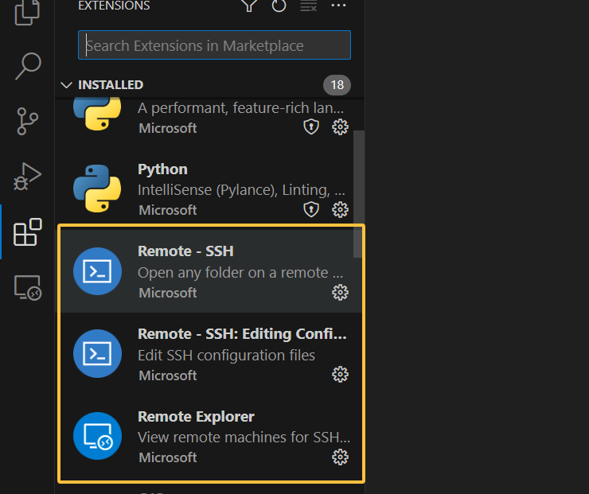

## 2.使用SSH登录远程服务器

首先，去AutoDL上找到租借的服务器的基本信息，如下：


注意看这里有登录指令和密码两部分，复制好了去VS Code当中。

### （1）配置本地VS Code与远程服务器之间的桥梁

https://blog.csdn.net/qq812457115/article/details/135533373

可能会遇到本地没有安装SSH的情况，可以参考微软官方的文档进行配置：https://learn.microsoft.com/zh-cn/windows-server/administration/openssh/openssh_install_firstuse?tabs=powershell，一般来说就是下面这段：

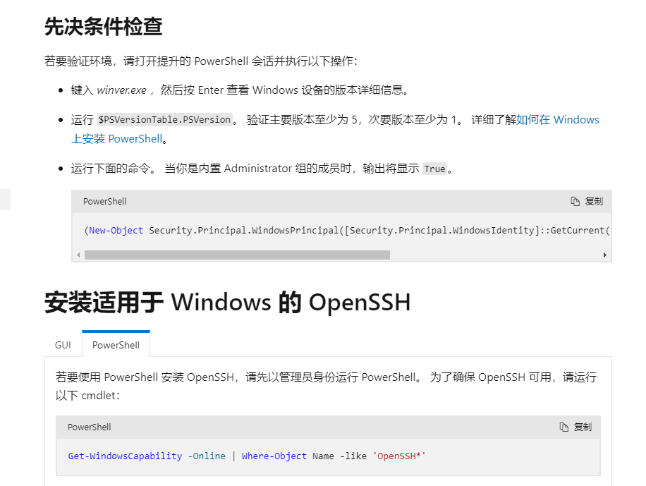

```shell
(New-Object Security.Principal.WindowsPrincipal([Security.Principal.WindowsIdentity]::GetCurrent())).IsInRole([Security.Principal.WindowsBuiltInRole]::Administrator)  # 1

Get-WindowsCapability -Online | Where-Object Name -like 'OpenSSH*'   # 2

# Install the OpenSSH Client
Add-WindowsCapability -Online -Name OpenSSH.Client~~~~0.0.1.0  # 3
```

其他有用的链接：https://blog.csdn.net/qq_45654306/article/details/132047411


### （2）登录

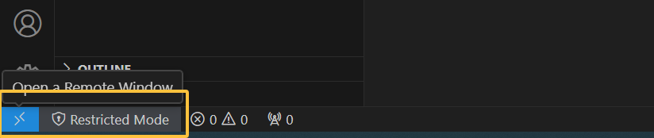

复制AutoDL提供的SSH登录指令，然后选Linux->Continue->输入密码：

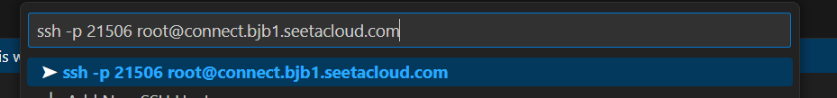

有可能密码失效，这种情况下可以==尝试重启一下远程服务器，换一个自己比较熟悉的密码。或者是保存一下相关的SSH配置==（【重点】亲测对本机来说，这个是有效的，修改一下密码并保存一下SSH配置，不修改代码应该也可以，重点是保存配置）。

> 保存SSH配置的操作如下图：
>
> 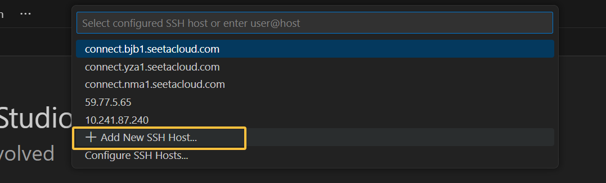


# 三、项目的conda环境配置

平时使用：

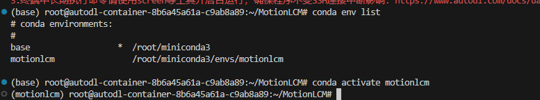

根据Github的链接进行配置：https://github.com/Dai-Wenxun/MotionLCM。按原文的描述一步一步配置，有问题会进行整理。

## 1.conda environment

```shell
conda create python=3.10.12 --name motionlcm
conda activate motionlcm
```

学术资源加速（相关网站：https://www.autodl.com/docs/network_turbo/）：

```bash
source /etc/network_turbo
```


首先进入VS code，选最上面一排->View->Terminal，打开Terminal窗口，如下：

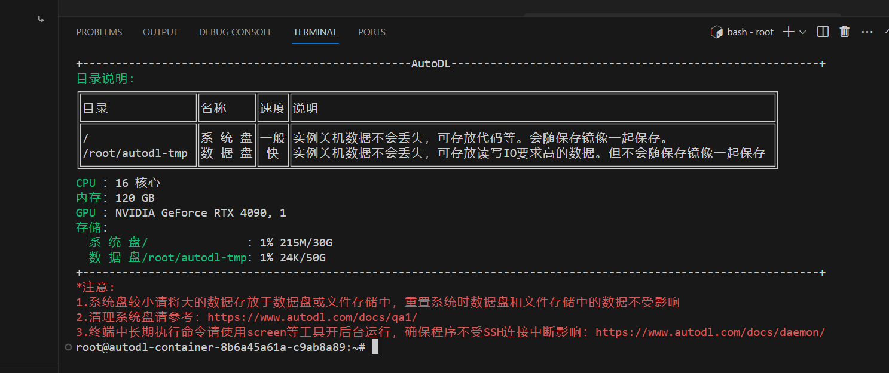

也就是说，==我们可以把代码等文件放到正常的系统盘中，比较大的数据集数据放入到数据盘当中。==此时我们在系统盘的root文件夹下面新建一个`MotionLCM`文件夹（可以选择打开文件->选择root）：

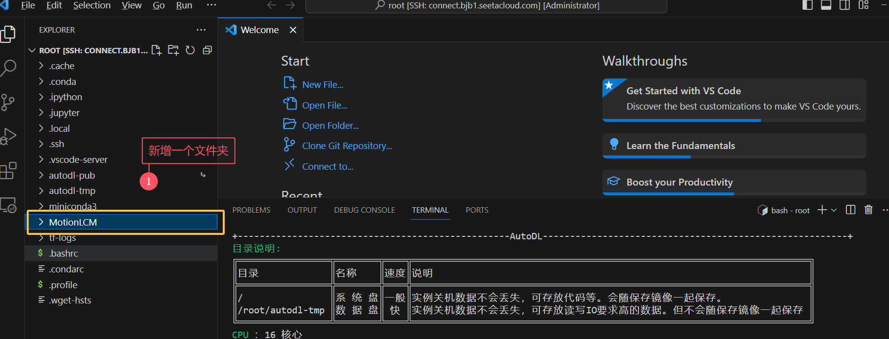

接下来在terminal中配置conda的环境，即下面这两句：

```shell
conda create python=3.10.12 --name motionlcm
conda activate motionlcm
```

> 常见问题：
>
> 【1】网络问题，==python环境配置非常慢，或者根本没法配置，可以考虑用阿里云镜像。（应该不会有这个问题，因为AutoDL自带阿里云的镜像）==`如果有遇到类似的问题再进行整理吧。`
>
> 【2】==`conda activate`报错：==
>
> root@autodl-container-8b6a45a61a-c9ab8a89:~# conda activate motionlcm
>
> CommandNotFoundError: Your shell has not been properly configured to use 'conda activate'.
> To initialize your shell, run
>
>     $ conda init <SHELL_NAME>
>
> Currently supported shells are:
>   - bash
>   - fish
>   - tcsh
>   - xonsh
>   - zsh
>   - powershell
>
> See 'conda init --help' for more information and options.
>
> IMPORTANT: You may need to close and restart your shell after running 'conda init'.
>
> > 解决方案：
> >
> > 这个错误表明你的 shell 没有正确配置以使用 `conda activate` 命令。以下是解决方法：
> >
> > ### 解决方案：
> >
> > 1. **首先确定你使用的 shell 类型**：
> >    在终端运行：
> >    ```bash
> >    echo $SHELL
> >    ```
> >    这会显示你当前使用的 shell（通常是 `/bin/bash`（==实验的机器是这个==） 或 `/bin/zsh` 等）。
> >
> > 2. **初始化 conda**：
> >    根据上一步的结果，运行对应的初始化命令。例如：
> >    
> >    - 如果是 **bash**：
> >      ```bash
> >      conda init bash # 选择这个
> >      ```
> >    - 如果是 **zsh**：
> >      ```bash
> >      conda init zsh
> >      ```
> >    - 其他 shell 请替换为对应的名称（如 `fish`、`tcsh` 等）。
> >    
> > 3. **重新加载 shell 配置**：
> >    运行以下命令使配置生效：
> >    ```bash
> >    source ~/.bashrc  # 如果是 bash
> >    ```
> >    或
> >    ```bash
> >    source ~/.zshrc   # 如果是 zsh
> >    ```
> >
> > 4. **验证是否生效**（==完成到这一步问题就解决了。==）：
> >    再次尝试激活环境：
> >    
> >    ```bash
> >    conda activate motionlcm
> >    ```
> >    
> > 5. **如果仍不生效**：
> >    - 关闭当前终端窗口，重新打开一个新的终端，然后再次尝试激活环境。
> >    - 如果问题依旧，可以尝试直接使用完整路径激活：
> >      ```bash
> >      source /path/to/conda/bin/activate motionlcm
> >      ```
> >      （将 `/path/to/conda` 替换为你的 conda 实际安装路径，通常为 `~/miniconda3` 或 `~/anaconda3`）
> >
> > ### 注意事项：
> > - 如果你不确定 conda 的安装路径，可以运行 `which conda` 查找。
> > - 如果是共享服务器（如 AutoDL），可能需要联系管理员确认 conda 的配置方式。
> >
> > 完成上述步骤后，`conda activate` 应该可以正常使用了。


## 2.在github上拉下来这个项目

clone即可，命令如下：
```bash
# 注意要进入到刚才新建的文件夹中，多使用ls和cd指令
git clone https://github.com/Dai-Wenxun/MotionLCM.git
```

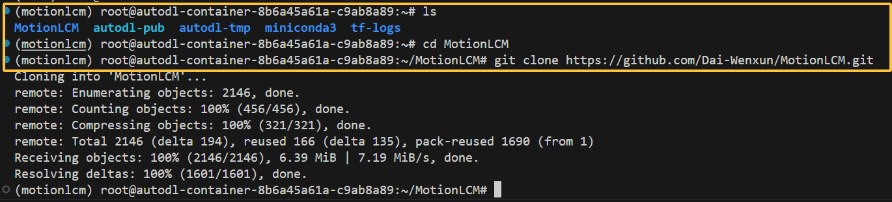

从左侧的文件夹布局中可以看到是否clone成功了。


## 3.pip install -r requirements.txt

直接输入即可：

```bash
pip install -r requirements.txt
```

因为AutoDL使用的是阿里云的镜像，因此在install各种包的过程中应该不会出现报错现象。需要等待一段时间，等待安装完毕。

> 注：以下步骤可能会卡一段时间，但最后应该也是会运行成功的。
>
> ```shell
> Building wheels for collected packages: matplotlib, sentence-transformers, chumpy, antlr4-python3-runtime
>   Building wheel for matplotlib (setup.py) ...
> ```


## 4.Dependencies

这里就按照Github仓库的原文了：If you have the `sudo` permission, install `ffmpeg` for visualizing stick figure (if not already installed):

```shell
sudo apt update
sudo apt install ffmpeg
ffmpeg -version  # check!
```

自己租的服务器应该是有root权限的。==输出的ffmpeg的版本如下：==

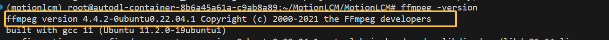

接下来是这句：

```shell
conda install conda-forge::git-lfs
```


安装完成之后，接着是一些material的安装（==注意：1.在刚才新建的文件夹下操作   2.以防万一，每一句bash指令可以一行一行复制执行，确保每一句都能正确执行。==），这里由于网络问题无法正确安装，解决方案在下面。

```shell
bash prepare/download_glove.sh
bash prepare/download_t2m_evaluators.sh
bash prepare/prepare_t5.sh
bash prepare/download_smpl_models.sh
```


### （1）AutoDL解决GoogleDrive的问题

我们先来看一下第一句bash里面具体是什么，打开文件，代码如下：
```bash
mkdir -p deps/
cd deps/

echo -e "Downloading glove (in use by the evaluators)"
gdown --fuzzy https://drive.google.com/file/d/1cmXKUT31pqd7_XpJAiWEo1K81TMYHA5n/view?usp=sharing
rm -rf glove

unzip glove.zip
echo -e "Cleaning\n"
rm glove.zip

echo -e "Downloading done!"
```

DeepSeek的具体建议是：

> 这段代码的作用是 **下载并解压一个名为 `glove.zip` 的文件**（包含 GloVe 词向量，通常用于 NLP 任务），但由于国内无法直接访问 Google Drive，导致 `gdown` 命令下载失败。以下是详细说明和替代解决方案：
>
> ---
>
> ### **原代码的功能解析**
> 1. **创建目录**  
>    ```bash
>    mkdir -p deps/  # 创建 deps 文件夹（如果不存在）
>    cd deps/        # 进入该目录
>    ```
> 2. **下载文件**  
>    通过 `gdown` 从 Google Drive 下载 `glove.zip`：
>    ```bash
>    gdown --fuzzy https://drive.google.com/...   # 使用模糊匹配下载
>    ```
> 3. **解压和清理**  
>    ```bash
>    unzip glove.zip      # 解压
>    rm glove.zip         # 删除压缩包
>    ```
>
> ---
>
> ### **替代方案（==手动下载并上传到服务器，这是我们要使用的方案==）**
> #### **步骤 1：手动下载文件**
> 1. 通过浏览器访问 Google Drive 链接（需科学上网），或从其他渠道（如百度网盘、学术网站）获取 `glove.zip`。  
> 2. 将文件下载到本地电脑。
>
> #### **步骤 2：上传到服务器**
> 使用以下任一工具上传到服务器的 `deps/` 目录：
> - **`scp` 命令**（本地终端运行）：
>   ```bash
>   scp /本地路径/glove.zip 用户名@服务器IP:~/deps/
>   ```
> - **`rsync`**（更稳定）：
>   ```bash
>   rsync -avzP /本地路径/glove.zip 用户名@服务器IP:~/deps/
>   ```
> - **SFTP 客户端**（如 FileZilla、WinSCP）：
>   - 连接服务器后，直接拖拽文件到 `~/deps/` 目录。
>
> #### **步骤 3：在服务器上解压**
> 登录服务器后执行：
> ```bash
> cd ~/deps/          # 进入目录
> unzip glove.zip     # 解压
> rm glove.zip        # 删除压缩包（可选）
> ```
>
> ---
>
> ### **注意事项**
> 1. **目录一致性**  
>    - 确保文件最终解压到 `~/deps/` 目录（与原始脚本一致），否则后续程序可能找不到文件。
> 2. **权限问题**  
>    如果解压失败，可能是权限不足，尝试：
>    ```bash
>    chmod +x ~/deps/glove.zip  # 添加执行权限
>    unzip -o glove.zip         # 强制覆盖解压
>    ```
> 3. **文件完整性**  
>    - 如果手动下载的文件损坏，解压时会报错。可重新下载或检查哈希值（如 `md5sum glove.zip`）。
>
> ---
>
> ### **补充说明**
> - 如果原脚本后续需要从 `deps/glove/` 读取文件，请确保解压后的内容直接位于 `deps/` 下（而不是嵌套多层目录）。  
> - 如果 `glove.zip` 内包含一个 `glove/` 文件夹，解压后结构应为：
>   ```
>   deps/
>   └── glove/    # 包含词向量文件
>   ```
>
> 按此流程操作即可替代原脚本的自动下载步骤。

==我们需要手动在Google Drive上下载这个zip文件，用XFTP或者拖拽的方式直接传到服务器上，具体如下：==

首先，去bash文件中的google drive链接中下载这个文件：

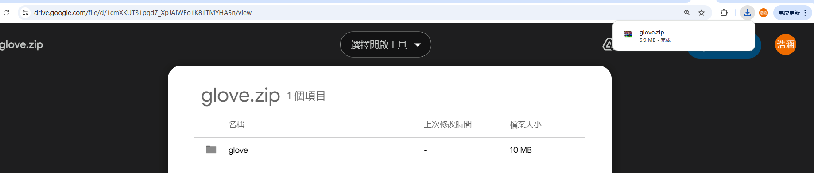

然后，通过VS Code拖入到deps文件夹下（没有的话自己创建一个）。

接着cd进入deps文件夹中，输入下面的指令：

```bash
unzip glove.zip     # 解压
```

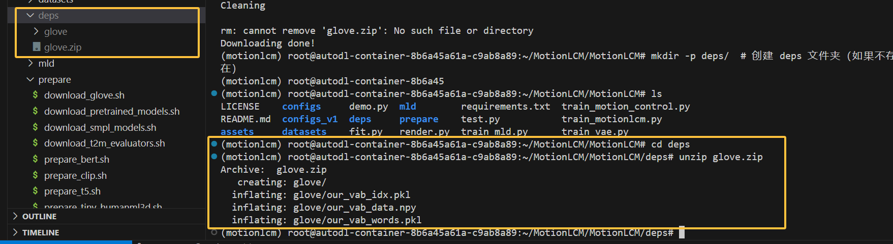


### （2）Huggingface没办法连接上的问题

问题如下：

```shell
(motionlcm) root@autodl-container-8b6a45a61a-c9ab8a89:~/MotionLCM/MotionLCM# bash prepare/prepare_t5.sh
Updated Git hooks.
Git LFS initialized.
Cloning into 'sentence-t5-large'...
fatal: unable to access 'https://huggingface.co/sentence-transformers/sentence-t5-large/': Failed to connect to huggingface.co port 443 after 28 ms: Connection refused
```

解决方案可以看AutoDL的官方链接：https://www.autodl.com/docs/network_turbo/，里面有Huggingface的镜像站。测试一下这个链接是否有： `https://hf-mirror.com/sentence-transformers/sentence-t5-large/`，测试没有问题，于是替换一下bash文件为：

```bash
mkdir -p deps/
cd deps/
git lfs install
# git clone https://huggingface.co/sentence-transformers/sentence-t5-large
git clone https://hf-mirror.com/sentence-transformers/sentence-t5-large
cd ..
```

==也就是修改为huggingface的镜像站。修改完成之后就可以运行下面这句了：==

```bash
bash prepare/prepare_t5.sh
```

还是要下载蛮久的，正常等待即可。《只需等待》。


==其他的也是类似的问题，我们需要把这一步当中所有的bash文件中的google drive中的文件都放到正确的位置上，以及解决好huggingface的问题（有的文件比较大，可能得多周转一段时间）。==完成之后的截图如下：

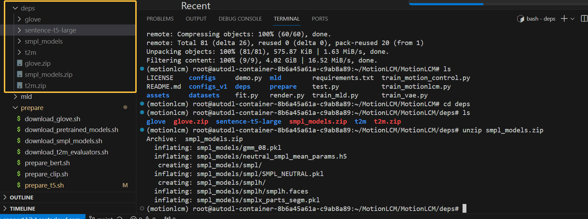


## 5.pretrained-models

Github中的仓库的原文如下：

Run the script to download the pre-trained models:

```
bash prepare/download_pretrained_models.sh
```

The folders `experiments_recons` `experiments_t2m` and `experiments_control` store pre-trained models for motion reconstruction, text-to-motion and motion control respectively. 实际上由于网络的问题，我们依旧没有办法从google drive上下载，因此这一步依旧需要在自己的电脑上下载完之后拖入到租用的autodl服务器上。

根据后面的文件布局，这部分的文件只需要拉到项目总的文件夹下（MotionLCM文件夹下）并unzip就可以了。这几个文件比较大，==这一步非常占用时间，需要等待。==

结果如下：

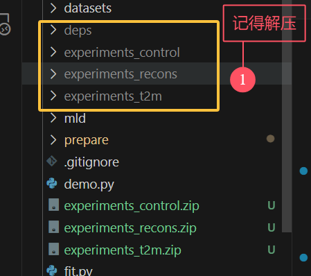


# 四、准备数据集（可以在==五==之后做）

Github的仓库中的原文：Please refer to [HumanML3D](https://github.com/EricGuo5513/HumanML3D) for text-to-motion dataset setup. Copy the result dataset to our repository:

于是进入到了这个链接：https://github.com/EricGuo5513/HumanML3D。

现在我们按照这个链接所说的，再配置对应的conda环境，==思路跟之前是一样的，但这里也记录一下，避免后面忘记导致出问题。==

## 1.数据集的介绍

### （1）For KIT-ML dataset, you could directly download [[Here\]](https://drive.google.com/drive/folders/1D3bf2G2o4Hv-Ale26YW18r1Wrh7oIAwK?usp=sharing). 

不过MotionLCM这个项目使用的是HumanML3D数据集，以下我们优先配这个数据集。

### （2）HumanML3D数据集配置

## ==不要配环境了！他这个环境根本用不了！直接用MotionLCM的conda环境即可！！！！！！缺的包稍微补充一下就好了。这一节配环境的部分不要看！！！！！！！！！！！！！！！！！！！！！！！！！！！！！！！！！！！！！！！！！！！！！！！！！！！！！！！！！！！！！！==

Due to the distribution policy of AMASS dataset, we are not allowed to distribute the data directly. We provide a series of script that could reproduce our HumanML3D dataset from AMASS dataset.

You need to clone this repository and install the virtual environment.

也就是说，需要先创建一个conda环境，由于我们只要数据集的处理相关，且数据集可能非常大，因此到==数据盘==中去做这件事：

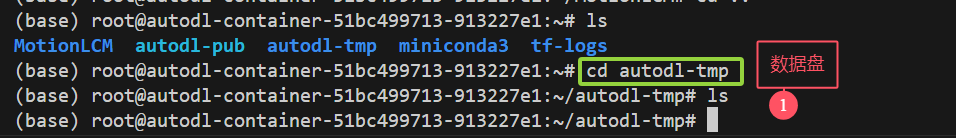

然后新建一个文件夹HumanML3D：

```bash
mkdir HumanML3D
```

然后clone仓库并创建对应的环境：

```shell
git clone https://github.com/EricGuo5513/HumanML3D.git
cd HumanML3D
conda env create -f environment.yaml
conda activate torch_render
```

> 注：在conda env create的步骤报了一个错：
>
> ```shell
> Pip subprocess error:
> ERROR: Could not find a version that satisfies the requirement body-visualizer==1.1.0
> ERROR: No matching distribution found for body-visualizer==1.1.0
> ```
>
> ==这里采用的是Issue当中提供的解决方案（挺麻烦的，不行可能得多配置几次）：https://github.com/EricGuo5513/HumanML3D/issues/10，==
>
> ```shell
> conda env remove -n torch_render  # 出问题记得删除原来的环境
> source /etc/network_turbo  # AutoDL的学术加速
> ```
>
> 然后修改yaml文件（==务必注意注释掉下面yaml文件中的四行，==）：
>
> ```yaml
> name: torch_render
> channels:
>   - defaults
> dependencies:
>   	# ... 这部分跟之前一样 
>   - zstd=1.4.9=haebb681_0
>   - pip:
>     - absl-py==1.0.0
>     # - body-visualizer==1.1.0
>     # - configer==1.4.1
>     - # ...
>     # - install==1.3.5
>     # - psbody-mesh==0.4
> prefix: /home/chuan/anaconda3/envs/torch_render
> ```
>
> 这四个包会给我们的环境带来环境，这里我们==手动配置以下这四个包：==
>
> - （1）`pip install git+https://github.com/nghorbani/body_visualizer.git`，这个包不会有任何问题；
>
> - （2）`pip install git+https://github.com/MPI-IS/configer`，这个包也不会有任何问题；
>
> - （3）
>
>   
>
> - ```bash
>   # 这个会有问题！！！！ pip install git+https://github.com/MPI-IS/mesh.git
>   ```
>
> 上面这个mesh的会有问题，改成（之前报错应该是因为缺少boost包）：
>
> ```shell
> sudo apt-get install libboost-dev
> pip install git+https://github.com/MPI-IS/mesh.git
> ```
>
> - （4）`pip install pip-install==1.3.5`，这个也不会有任何问题。
>
> ==至此，下载数据集的环境算是配好了。==
>
> 
>
> 补充：仓库提出的解决方案（==未使用==）：In the case of installation failure, you could alternatively install the following:
>
> ```
> - Python==3.7.10
> - Numpy          
> - Scipy          
> - PyTorch        
> - Tqdm 
> - Pandas
> - Matplotlib==3.3.4     // Only for animation
> - ffmpeg==4.3.1  // Only for animation
> - Spacy==2.3.4   // Only for text process
> ```


接下来这个仓库说的是：

#### Download SMPL+H and DMPL model

Download SMPL+H mode from [SMPL+H](https://mano.is.tue.mpg.de/download.php) (choose Extended SMPL+H model used in AMASS project) and DMPL model from [DMPL](https://smpl.is.tue.mpg.de/download.php) (choose DMPLs compatible with SMPL). Then place all the models under "./body_model/".（==注意，下面图不准确，作者说的有问题，应该取名叫做body_models，注意有s==）

这个应该需要我们手动创建一个body_model的文件夹，然后按照上述的要求下载两个文件夹放在其下面，如下图：

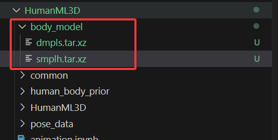

对这两个文件进行解压：
```shell
# 先cd进入到body_models文件夹当中
tar xf dmpls.tar.xz 
tar xf smplh.tar.xz 
```

注意，原仓库说的==漏洞百出==，实际上还需要创建两个文件夹，然后分别解压上面两个文件放入进去：

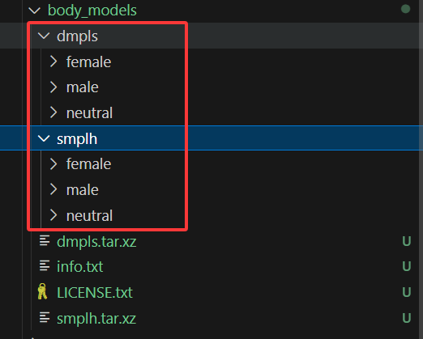

> 每个文件解压之后都会有female，male和neutral这几个子文件，需要创建对应的父文件夹，不然后面运行ipynb文件的时候会报错。


#### Extract and Process Data

这一步要跑三个ipynb文件。

You need to run the following scripts in order to obtain HumanML3D dataset:

1. raw_pose_processing.ipynb
2. motion_representation.ipynb
3. cal_mean_variance.ipynb


先阅读一下https://github.com/EricGuo5513/HumanML3D/blob/main/raw_pose_processing.ipynb，这个文件，看看我们都要做些什么。

首先进入这个网站：https://amass.is.tue.mpg.de/download.php，这里有很多数据集，==Note only download the SMPL+H G data.==。暂时只是尝试的话，都下载不太现实，我们下一个动作稍微多一些的，选这个：[BMLmovi](http://www.biomotionlab.ca/movi/)

然后上传到服务器上，在仓库根目录下创建一个文件夹：amass_data，然后把下载后的没有解压的文件放进去，然后进入到对应的文件目录中，解压：
```shell
tar -xvjf BMLmovi.tar.bz2
```

接下来就可以跑上面的三个ipynb文件了，记得要安装比如jupyter notebook相关的运行环境（VS Code会直接给出提示，按照提示来即可。）

==注意，解压之后要把tar.bz2本来的压缩文件和license.txt文件都删掉，只留下面的文件夹：==

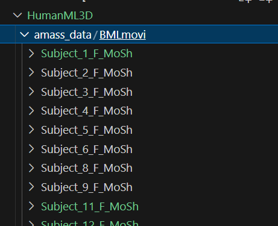

这几个ipynb文件直接看修改之后的就行，==要改的实在是太多了，贴不过来了，神人仓库。==

完成之后需要把数据集拷贝到MotionLCM这个仓库的datasets文件夹当中：

```shell
cp -r /root/autodl-tmp/HumanML3D/HumanML3D/HumanML3D /root/MotionLCM/MotionLCM/datasets
```

==然后记得把文件夹名字改成小写（humanml3d），MotionLCM这个项目需要。==


## 2.AMASS数据集当中包括什么？

### （1）数据集中的npz文件解析：

```python
(base) root@autodl-container-06564c8c34-2234d0a3:~/autodl-tmp/MCM-LDM# python check_npz.py clap_001_stageii.npz 

[文件信息] clap_001_stageii.npz
包含的数组数量: 21

--- 数组 1: 'gender' ---
形状 (shape): ()
数据类型 (dtype): <U4
总元素数: 1
预览数据 (前5个): ['male']

--- 数组 2: 'surface_model_type' ---
形状 (shape): ()
数据类型 (dtype): <U5
总元素数: 1
预览数据 (前5个): ['smplh']

--- 数组 3: 'mocap_frame_rate' ---
形状 (shape): ()
数据类型 (dtype): float64
总元素数: 1
预览数据 (前5个): [120.]

--- 数组 4: 'mocap_time_length' ---
形状 (shape): ()
数据类型 (dtype): float64
总元素数: 1
预览数据 (前5个): [10.575]

--- 数组 5: 'markers_latent' ---
形状 (shape): (53, 3)
数据类型 (dtype): float64
总元素数: 159
预览数据 (前5个): [0.00693116 0.57888522 0.00440067 0.00213199 0.24273827]

--- 数组 6: 'latent_labels' ---
形状 (shape): (53,)
数据类型 (dtype): <U6
总元素数: 53
预览数据 (前5个): ['ARIEL' 'C7' 'CLAV' 'LANK' 'LBHD']

--- 数组 7: 'markers_latent_vids' ---
形状 (shape): ()
数据类型 (dtype): object
总元素数: 1
预览数据 (前5个): [{'ARIEL': 411, 'C7': 2877, 'CLAV': 3078, 'LANK': 3204, 'LBHD': 386, 'LBSH': 1244, 'LBWT': 3100, 'LELB': 1656, 'LELBIN': 3013, 'LFHD': 135, 'LFIN': 2001, 'LFRM': 1599, 'LFSH': 1316, 'LFWT': 857, 'LHEE': 3387, 'LIWR': 2112, 'LKNE': 1010, 'LKNI': 1016, 'LMT1': 3236, 'LMT5': 3270, 'LOWR': 2108, 'LSHN': 1083, 'LTHI': 872, 'LTHMB': 1998, 'LTOE': 3245, 'LUPA': 2895, 'MBWT': 1783, 'MFWT': 859, 'RANK': 6607, 'RBHD': 3690, 'RBSH': 5274, 'RBWT': 6369, 'RELB': 5087, 'RELBIN': 5131, 'RFHD': 3645, 'RFIN': 5462, 'RFRM': 5068, 'RFSH': 5006, 'RFWT': 4342, 'RHEE': 6786, 'RIWR': 5689, 'RKNE': 4495, 'RKNI': 4634, 'RMT1': 6635, 'RMT5': 6628, 'ROWR': 5568, 'RSHN': 4599, 'RTHI': 4358, 'RTHMB': 5461, 'RTOE': 6647, 'RUPA': 4916, 'STRN': 3076, 'T10': 3015}]  # 这些是动捕设备的一些关键点

--- 数组 8: 'trans' ---
形状 (shape): (1269, 3)
数据类型 (dtype): float64
总元素数: 3807
预览数据 (前5个): [0.02641812 0.36152696 0.88360364 0.02625235 0.36110226]

--- 数组 9: 'poses' ---
形状 (shape): (1269, 156)
数据类型 (dtype): float64
总元素数: 197964
预览数据 (前5个): [ 1.56322943 -0.06204839 -0.06359456 -0.09789047 -0.01152274]

--- 数组 10: 'betas' ---
形状 (shape): (16,)
数据类型 (dtype): float64
总元素数: 16
预览数据 (前5个): [ 0.76309291 -1.18249697  0.19395753  0.39112041 -0.39251299]

--- 数组 11: 'num_betas' ---
形状 (shape): ()
数据类型 (dtype): int64
总元素数: 1
预览数据 (前5个): [16]

--- 数组 12: 'root_orient' ---
形状 (shape): (1269, 3)
数据类型 (dtype): float64
总元素数: 3807
预览数据 (前5个): [ 1.56322943 -0.06204839 -0.06359456  1.56338455 -0.06175761]

--- 数组 13: 'pose_body' ---
形状 (shape): (1269, 63)
数据类型 (dtype): float64
总元素数: 79947
预览数据 (前5个): [-0.09789047 -0.01152274  0.0112532  -0.10612481 -0.09547471]

--- 数组 14: 'pose_hand' ---
形状 (shape): (1269, 90)
数据类型 (dtype): float64
总元素数: 114210
预览数据 (前5个): [ 0.11167872  0.04289217 -0.41644184  0.10881133 -0.06598568]

--- 数组 15: 'markers' ---
形状 (shape): (1269, 53, 3)
数据类型 (dtype): float64
总元素数: 201771
(高维数组，跳过数据预览)

--- 数组 16: 'labels' ---
形状 (shape): (53,)
数据类型 (dtype): <U6
总元素数: 53
预览数据 (前5个): ['ARIEL' 'LFHD' 'LBHD' 'RFHD' 'RBHD']

--- 数组 17: 'markers_obs' ---
形状 (shape): (1269, 53, 3)
数据类型 (dtype): float64
总元素数: 201771
(高维数组，跳过数据预览)

--- 数组 18: 'labels_obs' ---
形状 (shape): (1269, 53)
数据类型 (dtype): <U6
总元素数: 67257
预览数据 (前5个): ['ARIEL' 'C7' 'CLAV' 'LANK' 'LBHD']

--- 数组 19: 'markers_sim' ---
形状 (shape): (1269, 53, 3)
数据类型 (dtype): float64
总元素数: 201771
(高维数组，跳过数据预览)

--- 数组 20: 'marker_meta' ---
形状 (shape): ()
数据类型 (dtype): object
总元素数: 1
预览数据 (前5个): [{'marker_vids': OrderedDict([('ARIEL', 411), ('C7', 3470), ('CLAV', 3171), ('LANK', 3327), ('LBHD', 182), ('LBSH', 2940), ('LBWT', 3122), ('LELB', 1666), ('LELBIN', 1725), ('LFHD', 0), ('LFIN', 2174), ('LFRM', 1568), ('LFSH', 1317), ('LFWT', 857), ('LHEE', 3387), ('LIWR', 2112), ('LKNE', 1053), ('LKNI', 1058), ('LMT1', 3336), ('LMT5', 3346), ('LOWR', 2108), ('LSHN', 1082), ('LTHI', 1454), ('LTHMB', 2224), ('LTOE', 3233), ('LUPA', 1443), ('MBWT', 3022), ('MFWT', 3503), ('RANK', 6728), ('RBHD', 3694), ('RBSH', 6399), ('RBWT', 6544), ('RELB', 5135), ('RELBIN', 5194), ('RFHD', 3512), ('RFIN', 5635), ('RFRM', 5037), ('RFSH', 4798), ('RFWT', 4343), ('RHEE', 6786), ('RIWR', 5573), ('RKNE', 4538), ('RKNI', 4544), ('RMT1', 6736), ('RMT5', 6747), ('ROWR', 5568), ('RSHN', 4568), ('RTHI', 4927), ('RTHMB', 5686), ('RTOE', 6633), ('RUPA', 4918), ('STRN', 3506), ('T10', 3016)]), 'marker_colors': OrderedDict([('ARIEL', (1.0, 0.0, 0.0)), ('C7', (1.0, 0.07692307692307693, 0.0)), ('CLAV', (1.0, 0.15384615384615385, 0.0)), ('LANK', (1.0, 0.23076923076923078, 0.0)), ('LBHD', (1.0, 0.3076923076923077, 0.0)), ('LBSH', (1.0, 0.3846153846153846, 0.0)), ('LBWT', (1.0, 0.46153846153846156, 0.0)), ('LELB', (1.0, 0.5384615384615384, 0.0)), ('LELBIN', (1.0, 0.6153846153846154, 0.0)), ('LFHD', (1.0, 0.6923076923076923, 0.0)), ('LFIN', (1.0, 0.7692307692307692, 0.0)), ('LFRM', (1.0, 0.8461538461538461, 0.0)), ('LFSH', (1.0, 0.9230769230769231, 0.0)), ('LFWT', (0.9999999999999998, 1.0, 0.0)), ('LHEE', (0.9230769230769231, 1.0, 0.0)), ('LIWR', (0.8461538461538465, 1.0, 0.0)), ('LKNE', (0.7692307692307692, 1.0, 0.0)), ('LKNI', (0.6923076923076918, 1.0, 0.0)), ('LMT1', (0.6153846153846152, 1.0, 0.0)), ('LMT5', (0.5384615384615385, 1.0, 0.0)), ('LOWR', (0.4615384615384619, 1.0, 0.0)), ('LSHN', (0.3846153846153846, 1.0, 0.0)), ('LTHI', (0.30769230769230727, 1.0, 0.0)), ('LTHMB', (0.23076923076923062, 1.0, 0.0)), ('LTOE', (0.15384615384615397, 1.0, 0.0)), ('LUPA', (0.07692307692307732, 1.0, 0.0)), ('MBWT', (0.0, 1.0, 0.0)), ('MFWT', (0.0, 1.0, 0.07692307692307698)), ('RANK', (0.0, 1.0, 0.15384615384615397)), ('RBHD', (0.0, 1.0, 0.23076923076923095)), ('RBSH', (0.0, 1.0, 0.3076923076923076)), ('RBWT', (0.0, 1.0, 0.3846153846153846)), ('RELB', (0.0, 1.0, 0.46153846153846156)), ('RELBIN', (0.0, 1.0, 0.5384615384615385)), ('RFHD', (0.0, 1.0, 0.6153846153846155)), ('RFIN', (0.0, 1.0, 0.6923076923076922)), ('RFRM', (0.0, 1.0, 0.7692307692307692)), ('RFSH', (0.0, 1.0, 0.8461538461538461)), ('RFWT', (0.0, 1.0, 0.9230769230769231)), ('RHEE', (0.0, 0.9999999999999998, 1.0)), ('RIWR', (0.0, 0.9230769230769231, 1.0)), ('RKNE', (0.0, 0.8461538461538458, 1.0)), ('RKNI', (0.0, 0.7692307692307692, 1.0)), ('RMT1', (0.0, 0.6923076923076925, 1.0)), ('RMT5', (0.0, 0.6153846153846152, 1.0)), ('ROWR', (0.0, 0.5384615384615385, 1.0)), ('RSHN', (0.0, 0.46153846153846123, 1.0)), ('RTHI', (0.0, 0.3846153846153846, 1.0)), ('RTHMB', (0.0, 0.30769230769230727, 1.0)), ('RTOE', (0.0, 0.23076923076923062, 1.0)), ('RUPA', (0.0, 0.15384615384615397, 1.0)), ('STRN', (0.0, 0.07692307692307665, 1.0)), ('T10', (0.0, 0.0, 1.0)), ('nan', [0.83, 1, 0])]), 'marker_type': OrderedDict([('ARIEL', 'body'), ('C7', 'body'), ('CLAV', 'body'), ('LANK', 'body'), ('LBHD', 'body'), ('LBSH', 'body'), ('LBWT', 'body'), ('LELB', 'body'), ('LELBIN', 'body'), ('LFHD', 'body'), ('LFIN', 'body'), ('LFRM', 'body'), ('LFSH', 'body'), ('LFWT', 'body'), ('LHEE', 'body'), ('LIWR', 'body'), ('LKNE', 'body'), ('LKNI', 'body'), ('LMT1', 'body'), ('LMT5', 'body'), ('LOWR', 'body'), ('LSHN', 'body'), ('LTHI', 'body'), ('LTHMB', 'body'), ('LTOE', 'body'), ('LUPA', 'body'), ('MBWT', 'body'), ('MFWT', 'body'), ('RANK', 'body'), ('RBHD', 'body'), ('RBSH', 'body'), ('RBWT', 'body'), ('RELB', 'body'), ('RELBIN', 'body'), ('RFHD', 'body'), ('RFIN', 'body'), ('RFRM', 'body'), ('RFSH', 'body'), ('RFWT', 'body'), ('RHEE', 'body'), ('RIWR', 'body'), ('RKNE', 'body'), ('RKNI', 'body'), ('RMT1', 'body'), ('RMT5', 'body'), ('ROWR', 'body'), ('RSHN', 'body'), ('RTHI', 'body'), ('RTHMB', 'body'), ('RTOE', 'body'), ('RUPA', 'body'), ('STRN', 'body'), ('T10', 'body')]), 'marker_type_mask': OrderedDict([('body', array([ True,  True,  True,  True,  True,  True,  True,  True,  True,
         True,  True,  True,  True,  True,  True,  True,  True,  True,
         True,  True,  True,  True,  True,  True,  True,  True,  True,
         True,  True,  True,  True,  True,  True,  True,  True,  True,
         True,  True,  True,  True,  True,  True,  True,  True,  True,
         True,  True,  True,  True,  True,  True,  True,  True]))]), 'm2b_distance': OrderedDict([('body', 0.0095)]), 'surface_model_type': 'smplh', 'marker_layout_fname': '/is/cluster/scratch/nghorbani/amass/mosh_results/smplh_gendered/SOMA/SOMA_smplh.json'}                                        ]

--- 数组 21: 'num_markers' ---
形状 (shape): ()
数据类型 (dtype): int64
总元素数: 1
预览数据 (前5个): [53]
```


# 五、基本测试

注意：==推荐将 scipy 降级到 1.11.1 ！否则train vae的代码可能会报错！==

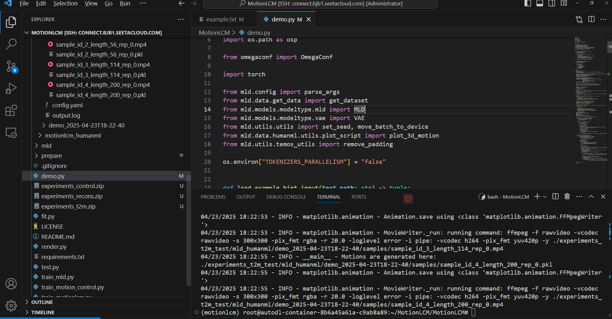

根据原始参考仓库的说法，可以先下载一个小的数据集来为后面做测试：

```bash
bash prepare/prepare_tiny_humanml3d.sh
```

这里由于还是google drive的链接，因此要自己下载一下再传上去。

## 1.运行代码

### （1）**Motion Reconstruction (using GT motions from HumanML3D test set)**

```python
python demo.py --cfg configs/vae.yaml
```

注意，原文是这样说的：

> MotionLCM provides three main functionalities: motion reconstruction, text-to-motion and motion control. The following commands demonstrate how to use the pre-trained models to generate motions. The outputs will be stored in `${cfg.TEST_FOLDER} / ${cfg.NAME} / demo_${timestamp}` (`experiments_t2m_test/motionlcm_humanml/demo_2024-04-06T23-05-07`).

这里的cfg指的是前面的`configs/vae.yaml`文件中配置的一些路径。运行完了之后可以去对应的路径下面去看。


### （2）**Text-to-Motion (using provided prompts and lengths in `demo/example.txt`)**

```bash
python demo.py --cfg configs/mld_t2m.yaml --example assets/example.txt
python demo.py --cfg configs/motionlcm_t2m.yaml --example assets/example.txt
```

可以改一下上面的example.txt文件，以下是原始文件（防止改坏掉）：

```tex
196 the man walks in a counterclockwise circle.
100 a person walks backward slowly.
56 a person does a jump.
```

现在我们加一句：

```tex
114 a person waves hands and then bow.
```

运行可以看到，结果也是放在正确的文件夹下面的：

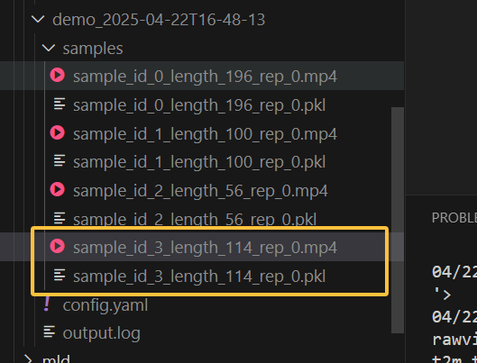


## 2.Render SMPL

### （1）创建SMPL Mesh

The SMPL meshes (numpy array) will be stored in `assets/example_mesh.pkl` with the shape `(nframes, 6890, 3)`.

After running the demo, the output folder will store the stick figure animation for each generated motion (e.g., `assets/example.gif`).To record the necessary information about the generated motion, a pickle file with the following keys will be saved simultaneously (e.g., `assets/example.pkl`):

- `joints (numpy.ndarray)`: The XYZ positions of the generated motion with the shape of `(nframes, njoints, 3)`.
- `text (str)`: The text prompt.
- `length (int)`: The length of the generated motion.
- `hint (numpy.ndarray)`: The trajectory for motion control (optional).

举个例子，我们使用刚才自己生成的动作：

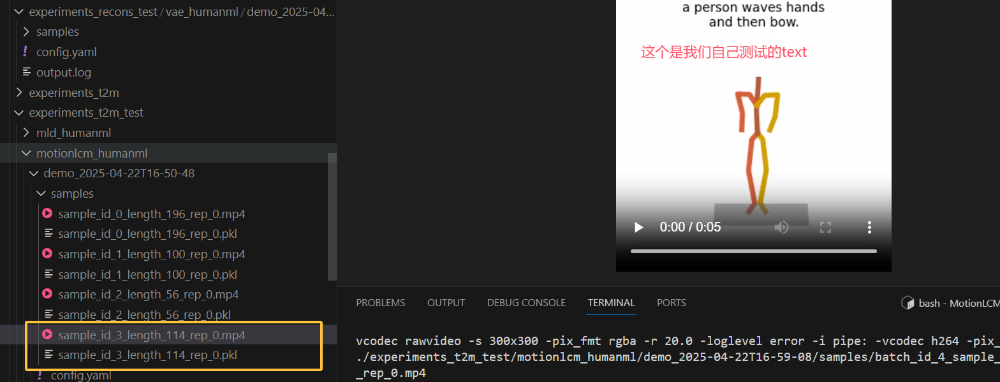

可以读取这个`pkl`文件并输出对应的信息，其实应该就在仓库介绍的`fit.py`文件当中。

```shell
python fit.py --pkl assets/example.pkl
```

> ==【报错问题解决】==运行的时候有一个报错：
>
> (motionlcm) (base) root@autodl-container-de0747bdea-2702c64f:~/MotionLCM/MotionLCM# python fit.py --pkl assets/testSMPL0512.pkl
> //...
>
> pickle.load(smpl_file,
>   File "/root/miniconda3/envs/motionlcm/lib/python3.10/site-packages/chumpy/__init__.py", line 11, in <module>
>     from numpy import bool, int, float, complex, object, unicode, str, nan, inf
> ImportError: cannot import name 'bool' from 'numpy' (/root/miniconda3/envs/motionlcm/lib/python3.10/site-packages/numpy/__init__.py)
>
> ==**解决方案（实测有效！）：**==
>
> 临时修改 `chumpy/__init__.py` 文件：
>
> 1. 找到文件路径：
>
>    ```bash
>    /root/miniconda3/envs/motionlcm/lib/python3.10/site-packages/chumpy/__init__.py
>    ```
>
> 2. 将以下行：
>
>    ```python
>    from numpy import bool, int, float, complex, object, unicode, str, nan, inf
>    ```
>
>    修改为以下，即可成功运行：
>
>    ```python
>    from numpy import int_, float_, complex_, object_, unicode_, str_, nan, inf
>    import numpy as np
>    bool = np.bool_
>    int = int_
>    float = float_
>    complex = complex_
>    object = object_
>    unicode = unicode_
>    str = str_
>    ```

生成的结果位置：The SMPL meshes (numpy array) will be stored in `assets/example_mesh.pkl` with the shape `(nframes, 6890, 3)`.

注：根据原仓库：https://github.com/Dai-Wenxun/MotionLCM?tab=readme-ov-file，也可以把一个文件夹下面的都依据pkl文件生成SMPL，具体操作见仓库说明即可。

这一步运行代码，结果如下：

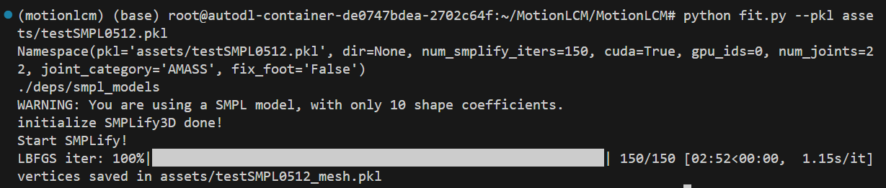


### （2）Render SMPL Meshes

这一步主要参考这个仓库：

https://github.com/Mathux/TEMOS

以下进行比较详细的介绍。首先根据https://www.blender.org/download/lts/2-93/这个网站下载Blender 2.93这个版本：==必须要精准下载这个版本！==

#### （a）Windows版本的配置（==不太推荐（可以不看了）==，有点麻烦，不如Linux版本好配置，正好MotionLCM这篇文章也在Linux上）

依据刚才的链接。我是下载到了Windows操作系统上。

这里下载的是下面这个版本：

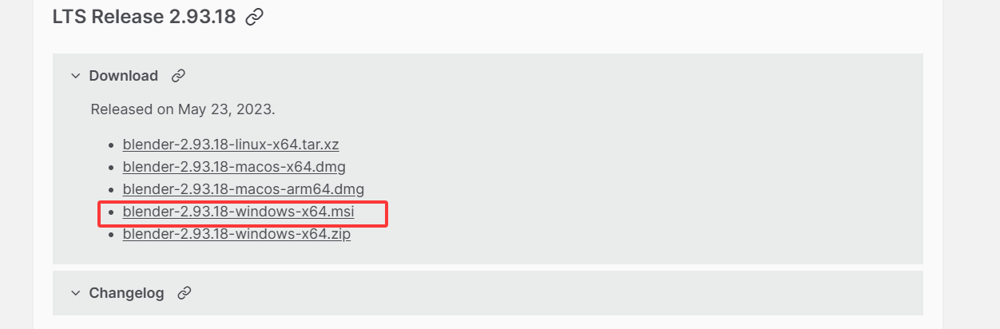

接下来，配置正确的环境变量:

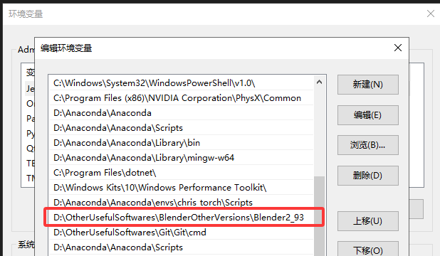

验证一下：
```shell
blender --background --version # 输出Blender 2.93.18 (hash cb886aba06d5 built 2023-05-22 23:36:57)
blender --background --python-expr "import sys; print('\nThe version of python is '+sys.version.split(' ')[0])" # 输出内容：The version of python is 3.9.2

# 以下路径用于输出Blender当中的python解释器的路径：
blender --background --python-expr "import sys; import os; print('\nThe path to the installation of python of blender can be:'); print('\n'.join(['- '+x.replace('/lib/python', '/bin/python') for x in sys.path if 'python' in (file:=os.path.split(x)[-1]) and not file.endswith('.zip')]))"
# 我的输出：- D:\OtherUsefulSoftwares\BlenderOtherVersions\Blender2_93\2.93\python
```


接下来是安装pip：

```shell
D:\OtherUsefulSoftwares\BlenderOtherVersions\Blender2_93\2.93\python\bin\python.exe -m ensurepip --upgrade  # 注意这里指定的是python解释器的路径

D:\OtherUsefulSoftwares\BlenderOtherVersions\Blender2_93\2.93\python\bin\python.exe -m pip install --user numpy
D:\OtherUsefulSoftwares\BlenderOtherVersions\Blender2_93\2.93\python\bin\python.exe -m pip install --user matplotlib
D:\OtherUsefulSoftwares\BlenderOtherVersions\Blender2_93\2.93\python\bin\python.exe -m pip install --user hydra-core --upgrade
D:\OtherUsefulSoftwares\BlenderOtherVersions\Blender2_93\2.93\python\bin\python.exe -m pip install --user hydra_colorlog --upgrade
D:\OtherUsefulSoftwares\BlenderOtherVersions\Blender2_93\2.93\python\bin\python.exe -m pip install --user moviepy
D:\OtherUsefulSoftwares\BlenderOtherVersions\Blender2_93\2.93\python\bin\python.exe -m pip install --user shortuuid
```

中间应该有一些警告，但基本上就是pip可以升级了之类的，并不是十分重要，可以忽略掉。

接下来，在TEMOS这个仓库中下载`render.py`这个文件。接下来就是渲染一个结果出来了：
```shell
blender --background --python render.py -- npy=PATH_TO_DATA.npy [OPTIONS]
```

我的示例：

```shell
blender --background --python render.py -- npy=testSMPL0512_mesh.pkl # 前提是进入到这个对应的路径下
```


#### （b）Linux版本的配置

首先下载对应的Blender 2.93的精确版本：

```shell
wget https://www.blender.org/download/release/Blender2.93/blender-2.93.18-linux-x64.tar.xz
```

如果不行的话，就去https://www.blender.org/download/lts/2-93/官网上手动下载一下，拉到服务器上。

接下来在对应文件夹中解压一下Blender：

```shell
tar -xf blender-2.93.18-linux-x64.tar.xz
```

接下来执行下面这段：

> ### **1. 定位 Blender 可执行文件**
>
> 进入解压后的目录，查找 `blender` 可执行文件：
>
> ```bash
> cd /root/autodl-tmp/Blender2_93/blender-2.93.18-linux-x64
> ls -l blender  # 确认可执行文件是否存在
> ```
>
> 如果输出类似：
>
> ```bash
> -rwxr-xr-x 1 root root ... blender
> ```
>
> 则 `blender` 是可执行文件。如果权限不足，运行：
>
> ```bash
> chmod +x blender  # 添加可执行权限
> ```
>
> ------
>
> ### **2. 直接运行 Blender**
>
> 使用绝对路径启动 Blender：
>
> ```bash
> /root/autodl-tmp/Blender2_93/blender-2.93.18-linux-x64/blender
> ```
>
> ------
>
> ### **3. （推荐）创建符号链接到系统路径**
>
> 将 Blender 链接到 `/usr/local/bin`（需 `sudo` 权限）：
>
> ```bash
> sudo ln -s /root/autodl-tmp/Blender2_93/blender-2.93.18-linux-x64/blender /usr/local/bin/blender
> ```
>
> 之后可直接通过命令 `blender` 启动。

验证一下：
```shell
blender --background --version
blender --background --python-expr "import sys; print('\nThe version of python is '+sys.version.split(' ')[0])"
# 以及仓库中的下一句，输出路径如下：

The path to the installation of python of blender can be:
- /root/autodl-tmp/Blender2_93/blender-2.93.18-linux-x64/2.93/python/bin/python3.9
```

然后安装必要的包：

```python
/root/autodl-tmp/blender-2.93.18-linux-x64/2.93/python/bin/python3.9 -m ensurepip --upgrade
/root/autodl-tmp/blender-2.93.18-linux-x64/2.93/python/bin/python3.9 -m pip install numpy
/root/autodl-tmp/blender-2.93.18-linux-x64/2.93/python/bin/python3.9 -m pip install --user matplotlib
/root/autodl-tmp/blender-2.93.18-linux-x64/2.93/python/bin/python3.9 -m pip install --user hydra-core --upgrade
/root/autodl-tmp/blender-2.93.18-linux-x64/2.93/python/bin/python3.9 -m pip install --user hydra_colorlog --upgrade
/root/autodl-tmp/blender-2.93.18-linux-x64/2.93/python/bin/python3.9 -m pip install --user moviepy
/root/autodl-tmp/blender-2.93.18-linux-x64/2.93/python/bin/python3.9 -m pip install --user shortuuid
```

接下来回到MotionLCM的仓库，这样做：

（1）生成Sequence：

```shell
YOUR_BLENDER_PATH/blender --background --python render.py -- --pkl assets/example_mesh.pkl --mode sequence --num 8
```

我的指令：
```shell
blender --background --python render.py -- --pkl assets/testSMPL0512_mesh.pkl --mode sequence --num 8
blender --background --python render.py -- --pkl assets/testSMPL0512_mesh.pkl --mode video --fps 20
```

==如果报错==`moviepy.editor`没有的话，修改一下`video.py`文件的开头部分：

```python
# import moviepy.editor as mp  # 可以理解成配的环境的moviepy版本没有editor了，直接用moviepy即可
import moviepy as mp
import os
import imageio
```

渲染sequence跑出来的结果如下图：

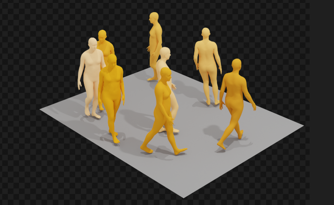

对于video的部分来说，video有个报错:

```
Traceback (most recent call last):
  File "/root/MotionLCM/MotionLCM/render.py", line 80, in <module>
    render_cli()
  File "/root/MotionLCM/MotionLCM/render.py", line 62, in render_cli
    render(
  File "/root/MotionLCM/MotionLCM/mld/render/blender/render.py", line 137, in render
    video.save(out_path=vid_path)
  File "/root/MotionLCM/MotionLCM/mld/render/video.py", line 66, in save
    self.video.subclip(0, self.duration).write_videofile(
AttributeError: 'ImageSequenceClip' object has no attribute 'subclip'
```

解决办法是==全局搜索`video.py`这个文件，然后修改其save函数：==

```python
def save(self, out_path):
    out_path = str(out_path)
    # self.video.subclip(0, self.duration).write_videofile(
    #     out_path, **self._conf)
    self.video.write_videofile(out_path, **self._conf)  # 把注释掉的部分改成下面这样
```

此时再运行输出video的指令，就可以成功生成SMPL的视频了：

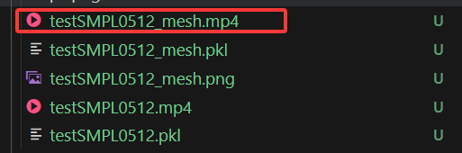


# 六、其他补充：Huggingface的使用

## 1.模型和数据集的准备

> 关于Huggingface的模型下载，推荐这个链接：https://zhuanlan.zhihu.com/p/663712983

**将环境变量的配置命令写入到终端的配置文件中**，**使得终端自动加载该环境变量，免去每次手动执行命令的麻烦**。

```bash
echo 'export HF_ENDPOINT="https://hf-mirror.com"' >> ~/.bashrc
```

- 优先推荐：`huggingface-cli`
  - 安装：`pip install -U huggingface_hub`

#### （a）数据集下载

可以在代码中这样写：

```python
dataset = load_dataset(
    config.dataset_name, 
    split="train", 
    token=globalConfig.huggingface_token, # 这里填写huggingface的token，为了安全起见放到了其他文件中
    download_mode="force_redownload")  # load the dataset
```


#### （b）模型权重下载

使用如下的shell指令是合理的：

```shell
huggingface-cli download --token hf_*** --resume-download meta-llama/Llama-2-7b-hf --local-dir Llama-2-7b-hf
```


# 七、 配置debug环境

例子

debug `python demo.py --cfg configs/motionlcm_t2m.yaml --example assets/example.txt `


#### 1 在VS Code上配置对应的extentions

在远程服务器上配置一下 安装好python和python debugger这两个extentions

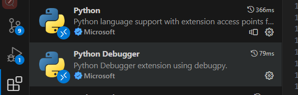

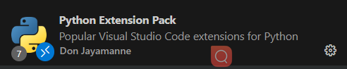

#### 2 **配置 VS Code 的调试环境**

1. **打开项目文件夹**
   在 VS Code 中打开 MotionLCM 的代码目录（确保包含 `demo.py` 和 `configs/`）。
2. **进入调试模式**
   点击左侧活动栏的 **“运行和调试”** 图标（或按 `Ctrl+Shift+D`），然后点击顶部菜单的 **“创建 launch.json 文件”**。
3. **选择调试配置模板**
   选择 **“Python 文件”**（如果提示选择环境）。


#### 3 **编辑 `launch.json` 文件**

在生成的 `launch.json` 中，添加一个自定义配置来传递命令行参数。示例配置如下：

```json
{
    "version": "0.2.0",
    "configurations": [
        {
            "name": "Python: Debug MotionLCM Demo",
            "type": "debugpy",
            "request": "launch",
            "program": "/root/MotionLCM/MotionLCM/demo.py",
            "args": [
                "--cfg", "configs/motionlcm_t2m.yaml", // 参数
                "--example", "assets/example.txt"	// 参数
            ],
            "console": "integratedTerminal",
            "justMyCode": true,
            "python": "/root/miniconda3/envs/motionlcm/bin/python",  // 显式指定 Conda 环境路径
            "cwd": "/root/MotionLCM/MotionLCM"                // 设置工作目录
        }
    ]
}
```


>### Conda 环境路径
>
>1. **确认路径和权限**
>
>   ```
>   # 检查 Conda 环境路径
>   conda activate motionlcm
>   which python
>   ```
>
>   这样就可以得到路径 然后再复制进来即可


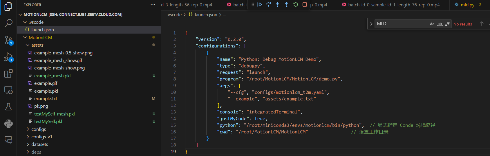

**关键参数说明**：

- `"program"`: 指定要调试的脚本路径（`demo.py`）。
- `"args"`: 传递命令行参数，格式为字符串数组（每个参数和值分开写）。
- `"console"`: 设置为 `integratedTerminal` 以便查看实时输出。


#### **开始调试**

设置断点

点击: 

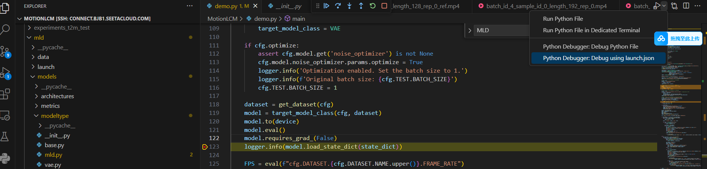


就好啦!

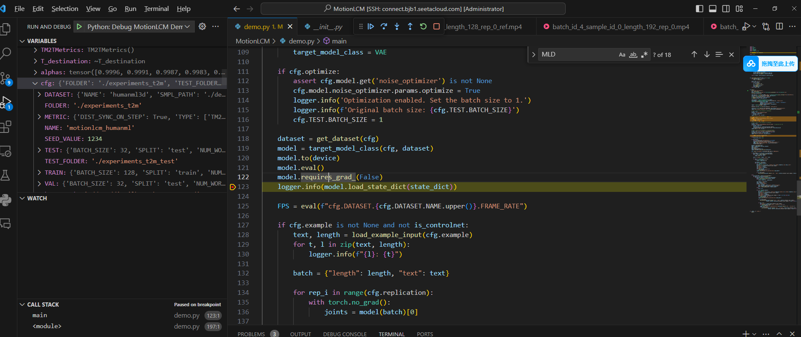
