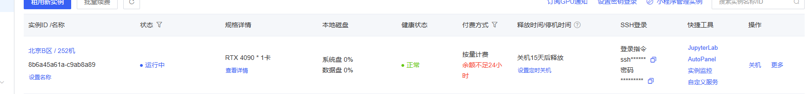

# 如何使用AutoDL跑代码？

这里以这个项目为例：https://github.com/Dai-Wenxun/MotionLCM?tab=readme-ov-file，介绍配置AutoDL跑代码的一些遇到的问题和心得体会。

直接在Github上打开VS Code：


# 一、准备AutoDL环境

这个要看目标Github项目的Python，pytorch环境，选择最为接近的版本进行配置。如下图所示：




# 二、VS Code环境配置

## 1.下载插件


## 2.使用SSH登录远程服务器

首先，去AutoDL上找到租借的服务器的基本信息，如下：


注意看这里有登录指令和密码两部分，复制好了去VS Code当中。

### （1）配置本地VS Code与远程服务器之间的桥梁

https://blog.csdn.net/qq812457115/article/details/135533373

可能会遇到本地没有安装SSH的情况，可以参考微软官方的文档进行配置：https://learn.microsoft.com/zh-cn/windows-server/administration/openssh/openssh_install_firstuse?tabs=powershell，一般来说就是下面这段：


```shell
(New-Object Security.Principal.WindowsPrincipal([Security.Principal.WindowsIdentity]::GetCurrent())).IsInRole([Security.Principal.WindowsBuiltInRole]::Administrator)  # 1

Get-WindowsCapability -Online | Where-Object Name -like 'OpenSSH*'   # 2

# Install the OpenSSH Client
Add-WindowsCapability -Online -Name OpenSSH.Client~~~~0.0.1.0  # 3
```

其他有用的链接：https://blog.csdn.net/qq_45654306/article/details/132047411


### （2）登录


复制AutoDL提供的SSH登录指令，然后选Linux->Continue->输入密码：


有可能密码失效，这种情况下可以==尝试重启一下远程服务器，换一个自己比较熟悉的密码。或者是保存一下相关的SSH配置==（【重点】亲测对本机来说，这个是有效的，修改一下密码并保存一下SSH配置）。

> 保存SSH配置的操作如下图：
>
> 


# 三、项目的conda环境配置

平时使用：


根据Github的链接进行配置：https://github.com/Dai-Wenxun/MotionLCM。按原文的描述一步一步配置，有问题会进行整理。

## 1.conda environment

```shell
conda create python=3.10.12 --name motionlcm
conda activate motionlcm
```

首先进入VS code，选最上面一排->View->Terminal，打开Terminal窗口，如下：


也就是说，==我们可以把代码等文件放到正常的系统盘中，比较大的数据集数据放入到数据盘当中。==此时我们在系统盘的root文件夹下面新建一个`MotionLCM`文件夹（可以选择打开文件->选择root）：


接下来在terminal中配置conda的环境，即下面这两句：

```shell
conda create python=3.10.12 --name motionlcm
conda activate motionlcm
```

> 常见问题：
>
> 【1】网络问题，==python环境配置非常慢，或者根本没法配置，可以考虑用阿里云镜像。（应该不会有这个问题，因为AutoDL自带阿里云的镜像）==`如果有遇到类似的问题再进行整理吧。`
>
> 【2】==`conda activate`报错：==
>
> root@autodl-container-8b6a45a61a-c9ab8a89:~# conda activate motionlcm
>
> CommandNotFoundError: Your shell has not been properly configured to use 'conda activate'.
> To initialize your shell, run
>
>     $ conda init <SHELL_NAME>
>
> Currently supported shells are:
>   - bash
>   - fish
>   - tcsh
>   - xonsh
>   - zsh
>   - powershell
>
> See 'conda init --help' for more information and options.
>
> IMPORTANT: You may need to close and restart your shell after running 'conda init'.
>
> > 解决方案：
> >
> > 这个错误表明你的 shell 没有正确配置以使用 `conda activate` 命令。以下是解决方法：
> >
> > ### 解决方案：
> >
> > 1. **首先确定你使用的 shell 类型**：
> >    在终端运行：
> >    ```bash
> >    echo $SHELL
> >    ```
> >    这会显示你当前使用的 shell（通常是 `/bin/bash`（==实验的机器是这个==） 或 `/bin/zsh` 等）。
> >
> > 2. **初始化 conda**：
> >    根据上一步的结果，运行对应的初始化命令。例如：
> >    
> >    - 如果是 **bash**：
> >      ```bash
> >      conda init bash # 选择这个
> >      ```
> >    - 如果是 **zsh**：
> >      ```bash
> >      conda init zsh
> >      ```
> >    - 其他 shell 请替换为对应的名称（如 `fish`、`tcsh` 等）。
> >    
> > 3. **重新加载 shell 配置**：
> >    运行以下命令使配置生效：
> >    ```bash
> >    source ~/.bashrc  # 如果是 bash
> >    ```
> >    或
> >    ```bash
> >    source ~/.zshrc   # 如果是 zsh
> >    ```
> >
> > 4. **验证是否生效**（==完成到这一步问题就解决了。==）：
> >    再次尝试激活环境：
> >    
> >    ```bash
> >    conda activate motionlcm
> >    ```
> >    
> > 5. **如果仍不生效**：
> >    - 关闭当前终端窗口，重新打开一个新的终端，然后再次尝试激活环境。
> >    - 如果问题依旧，可以尝试直接使用完整路径激活：
> >      ```bash
> >      source /path/to/conda/bin/activate motionlcm
> >      ```
> >      （将 `/path/to/conda` 替换为你的 conda 实际安装路径，通常为 `~/miniconda3` 或 `~/anaconda3`）
> >
> > ### 注意事项：
> > - 如果你不确定 conda 的安装路径，可以运行 `which conda` 查找。
> > - 如果是共享服务器（如 AutoDL），可能需要联系管理员确认 conda 的配置方式。
> >
> > 完成上述步骤后，`conda activate` 应该可以正常使用了。


## 2.在github上拉下来这个项目

clone即可，命令如下：
```bash
# 注意要进入到刚才新建的文件夹中，多使用ls和cd指令
git clone https://github.com/Dai-Wenxun/MotionLCM.git
```


从左侧的文件夹布局中可以看到是否clone成功了。


## 3.pip install -r requirements.txt

直接输入即可：

```bash
pip install -r requirements.txt
```

因为AutoDL使用的是阿里云的镜像，因此在install各种包的过程中应该不会出现报错现象。需要等待一段时间，等待安装完毕。

> 注：以下步骤可能会卡一段时间，但最后应该也是会运行成功的。
>
> ```shell
> Building wheels for collected packages: matplotlib, sentence-transformers, chumpy, antlr4-python3-runtime
>   Building wheel for matplotlib (setup.py) ...
> ```


## 4.Dependencies

这里就按照Github仓库的原文了：If you have the `sudo` permission, install `ffmpeg` for visualizing stick figure (if not already installed):

```shell
sudo apt update
sudo apt install ffmpeg
ffmpeg -version  # check!
```

自己租的服务器应该是有root权限的。==输出的ffmpeg的版本如下：==


接下来是这句：

```shell
conda install conda-forge::git-lfs
```


安装完成之后，接着是一些material的安装（==注意：1.在刚才新建的文件夹下操作   2.以防万一，每一句bash指令可以一行一行复制执行，确保每一句都能正确执行。==），这里由于网络问题无法正确安装，解决方案在下面。

```shell
bash prepare/download_glove.sh
bash prepare/download_t2m_evaluators.sh
bash prepare/prepare_t5.sh
bash prepare/download_smpl_models.sh
```


### （1）AutoDL解决GoogleDrive的问题

我们先来看一下第一句bash里面具体是什么，打开文件，代码如下：
```bash
mkdir -p deps/
cd deps/

echo -e "Downloading glove (in use by the evaluators)"
gdown --fuzzy https://drive.google.com/file/d/1cmXKUT31pqd7_XpJAiWEo1K81TMYHA5n/view?usp=sharing
rm -rf glove

unzip glove.zip
echo -e "Cleaning\n"
rm glove.zip

echo -e "Downloading done!"
```

DeepSeek的具体建议是：

> 这段代码的作用是 **下载并解压一个名为 `glove.zip` 的文件**（包含 GloVe 词向量，通常用于 NLP 任务），但由于国内无法直接访问 Google Drive，导致 `gdown` 命令下载失败。以下是详细说明和替代解决方案：
>
> ---
>
> ### **原代码的功能解析**
> 1. **创建目录**  
>    ```bash
>    mkdir -p deps/  # 创建 deps 文件夹（如果不存在）
>    cd deps/        # 进入该目录
>    ```
> 2. **下载文件**  
>    通过 `gdown` 从 Google Drive 下载 `glove.zip`：
>    ```bash
>    gdown --fuzzy https://drive.google.com/...   # 使用模糊匹配下载
>    ```
> 3. **解压和清理**  
>    ```bash
>    unzip glove.zip      # 解压
>    rm glove.zip         # 删除压缩包
>    ```
>
> ---
>
> ### **替代方案（==手动下载并上传到服务器，这是我们要使用的方案==）**
> #### **步骤 1：手动下载文件**
> 1. 通过浏览器访问 Google Drive 链接（需科学上网），或从其他渠道（如百度网盘、学术网站）获取 `glove.zip`。  
> 2. 将文件下载到本地电脑。
>
> #### **步骤 2：上传到服务器**
> 使用以下任一工具上传到服务器的 `deps/` 目录：
> - **`scp` 命令**（本地终端运行）：
>   ```bash
>   scp /本地路径/glove.zip 用户名@服务器IP:~/deps/
>   ```
> - **`rsync`**（更稳定）：
>   ```bash
>   rsync -avzP /本地路径/glove.zip 用户名@服务器IP:~/deps/
>   ```
> - **SFTP 客户端**（如 FileZilla、WinSCP）：
>   - 连接服务器后，直接拖拽文件到 `~/deps/` 目录。
>
> #### **步骤 3：在服务器上解压**
> 登录服务器后执行：
> ```bash
> cd ~/deps/          # 进入目录
> unzip glove.zip     # 解压
> rm glove.zip        # 删除压缩包（可选）
> ```
>
> ---
>
> ### **注意事项**
> 1. **目录一致性**  
>    - 确保文件最终解压到 `~/deps/` 目录（与原始脚本一致），否则后续程序可能找不到文件。
> 2. **权限问题**  
>    如果解压失败，可能是权限不足，尝试：
>    ```bash
>    chmod +x ~/deps/glove.zip  # 添加执行权限
>    unzip -o glove.zip         # 强制覆盖解压
>    ```
> 3. **文件完整性**  
>    - 如果手动下载的文件损坏，解压时会报错。可重新下载或检查哈希值（如 `md5sum glove.zip`）。
>
> ---
>
> ### **补充说明**
> - 如果原脚本后续需要从 `deps/glove/` 读取文件，请确保解压后的内容直接位于 `deps/` 下（而不是嵌套多层目录）。  
> - 如果 `glove.zip` 内包含一个 `glove/` 文件夹，解压后结构应为：
>   ```
>   deps/
>   └── glove/    # 包含词向量文件
>   ```
>
> 按此流程操作即可替代原脚本的自动下载步骤。

==我们需要手动在Google Drive上下载这个zip文件，用XFTP或者拖拽的方式直接传到服务器上，具体如下：==

首先，去bash文件中的google drive链接中下载这个文件：


然后，通过VS Code拖入到deps文件夹下（没有的话自己创建一个）。

接着cd进入deps文件夹中，输入下面的指令：

```bash
unzip glove.zip     # 解压
```


### （2）Huggingface没办法连接上的问题

问题如下：

```shell
(motionlcm) root@autodl-container-8b6a45a61a-c9ab8a89:~/MotionLCM/MotionLCM# bash prepare/prepare_t5.sh
Updated Git hooks.
Git LFS initialized.
Cloning into 'sentence-t5-large'...
fatal: unable to access 'https://huggingface.co/sentence-transformers/sentence-t5-large/': Failed to connect to huggingface.co port 443 after 28 ms: Connection refused
```

解决方案可以看AutoDL的官方链接：https://www.autodl.com/docs/network_turbo/，里面有Huggingface的镜像站。测试一下这个链接是否有： `https://hf-mirror.com/sentence-transformers/sentence-t5-large/`，测试没有问题，于是替换一下bash文件为：

```bash
mkdir -p deps/
cd deps/
git lfs install
# git clone https://huggingface.co/sentence-transformers/sentence-t5-large
git clone https://hf-mirror.com/sentence-transformers/sentence-t5-large
cd ..
```

==也就是修改为huggingface的镜像站。修改完成之后就可以运行下面这句了：==

```bash
bash prepare/prepare_t5.sh
```

还是要下载蛮久的，正常等待即可。《只需等待》。


==其他的也是类似的问题，我们需要把这一步当中所有的bash文件中的google drive中的文件都放到正确的位置上，以及解决好huggingface的问题（有的文件比较大，可能得多周转一段时间）。==完成之后的截图如下：


## 5.pretrained-models

Github中的仓库的原文如下：

Run the script to download the pre-trained models:

```
bash prepare/download_pretrained_models.sh
```

The folders `experiments_recons` `experiments_t2m` and `experiments_control` store pre-trained models for motion reconstruction, text-to-motion and motion control respectively. 实际上由于网络的问题，我们依旧没有办法从google drive上下载，因此这一步依旧需要在自己的电脑上下载完之后拖入到租用的autodl服务器上。

根据后面的文件布局，这部分的文件只需要拉到项目总的文件夹下（MotionLCM文件夹下）并unzip就可以了。这几个文件比较大，==这一步非常占用时间，需要等待。==

结果如下：


# 四、准备数据集（可以在==五==之后做）

Github的仓库中的原文：Please refer to [HumanML3D](https://github.com/EricGuo5513/HumanML3D) for text-to-motion dataset setup. Copy the result dataset to our repository:

于是进入到了这个链接：https://github.com/EricGuo5513/HumanML3D。

现在我们按照这个链接所说的，再配置对应的conda环境，==思路跟之前是一样的，但这里也记录一下，避免后面忘记导致出问题。==


# 五、基本测试


根据原始参考仓库的说法，可以先下载一个小的数据集来为后面做测试：

```bash
bash prepare/prepare_tiny_humanml3d.sh
```

这里由于还是google drive的链接，因此要自己下载一下再传上去。

## 1.运行代码

### （1）**Motion Reconstruction (using GT motions from HumanML3D test set)**

```python
python demo.py --cfg configs/vae.yaml
```

注意，原文是这样说的：

> MotionLCM provides three main functionalities: motion reconstruction, text-to-motion and motion control. The following commands demonstrate how to use the pre-trained models to generate motions. The outputs will be stored in `${cfg.TEST_FOLDER} / ${cfg.NAME} / demo_${timestamp}` (`experiments_t2m_test/motionlcm_humanml/demo_2024-04-06T23-05-07`).

这里的cfg指的是前面的`configs/vae.yaml`文件中配置的一些路径。运行完了之后可以去对应的路径下面去看。


### （2）**Text-to-Motion (using provided prompts and lengths in `demo/example.txt`)**

```bash
python demo.py --cfg configs/mld_t2m.yaml --example assets/example.txt
python demo.py --cfg configs/motionlcm_t2m.yaml --example assets/example.txt
```

可以改一下上面的example.txt文件，以下是原始文件（防止改坏掉）：

```tex
196 the man walks in a counterclockwise circle.
100 a person walks backward slowly.
56 a person does a jump.
```

现在我们加一句：

```tex
114 a person waves hands and then bow.
```

运行可以看到，结果也是放在正确的文件夹下面的：


==测试一下其他的指令，也都是可以执行的，目前就先测试到这里。==


## 2.Render SMPL

After running the demo, the output folder will store the stick figure animation for each generated motion (e.g., `assets/example.gif`).To record the necessary information about the generated motion, a pickle file with the following keys will be saved simultaneously (e.g., `assets/example.pkl`):

- `joints (numpy.ndarray)`: The XYZ positions of the generated motion with the shape of `(nframes, njoints, 3)`.
- `text (str)`: The text prompt.
- `length (int)`: The length of the generated motion.
- `hint (numpy.ndarray)`: The trajectory for motion control (optional).

举个例子，我们使用刚才自己生成的动作：


### （1）创建SMPL Mesh

一个example如下：
```python
python fit.py --pkl assets/example.pkl
```

The SMPL meshes (numpy array) will be stored in `assets/example_mesh.pkl` with the shape `(nframes, 6890, 3)`.

You can also fit all pickle files within a folder. The code will traverse all `.pkl` files in the directory and filter out files that have already been fitted.

```python
python fit.py --dir assets/
```


以我们的为例，就是：

```python
python fit.py --pkl assets/testMySelf.pkl # 把上一张图中的pkl文件挪到这里并重命名，以方便生成
```

生成的结果如下：


### （2）Render SMPL Meshes


# 六、其他补充：Huggingface的使用

## 1.模型和数据集的准备

> 关于Huggingface的模型下载，推荐这个链接：https://zhuanlan.zhihu.com/p/663712983

**将环境变量的配置命令写入到终端的配置文件中**，**使得终端自动加载该环境变量，免去每次手动执行命令的麻烦**。

```bash
echo 'export HF_ENDPOINT="https://hf-mirror.com"' >> ~/.bashrc
```

- 优先推荐：`huggingface-cli`
  - 安装：`pip install -U huggingface_hub`

#### （a）数据集下载

可以在代码中这样写：

```python
dataset = load_dataset(
    config.dataset_name, 
    split="train", 
    token=globalConfig.huggingface_token, # 这里填写huggingface的token，为了安全起见放到了其他文件中
    download_mode="force_redownload")  # load the dataset
```


#### （b）模型权重下载

使用如下的shell指令是合理的：

```shell
huggingface-cli download --token hf_*** --resume-download meta-llama/Llama-2-7b-hf --local-dir Llama-2-7b-hf
```


# 七、 配置debug环境

例子

debug `python demo.py --cfg configs/motionlcm_t2m.yaml --example assets/example.txt `


#### 1 

在远程服务器上配置一下 安装好python和python debugger这两个extentions


#### 2 **配置 VS Code 的调试环境**

1. **打开项目文件夹**
   在 VS Code 中打开 MotionLCM 的代码目录（确保包含 `demo.py` 和 `configs/`）。
2. **进入调试模式**
   点击左侧活动栏的 **“运行和调试”** 图标（或按 `Ctrl+Shift+D`），然后点击顶部菜单的 **“创建 launch.json 文件”**。
3. **选择调试配置模板**
   选择 **“Python 文件”**（如果提示选择环境）。


#### 3 **编辑 `launch.json` 文件**

在生成的 `launch.json` 中，添加一个自定义配置来传递命令行参数。示例配置如下：

```json
{
    "version": "0.2.0",
    "configurations": [
        {
            "name": "Python: Debug MotionLCM Demo",
            "type": "debugpy",
            "request": "launch",
            "program": "/root/MotionLCM/MotionLCM/demo.py",
            "args": [
                "--cfg", "configs/motionlcm_t2m.yaml", // 参数
                "--example", "assets/example.txt"	// 参数
            ],
            "console": "integratedTerminal",
            "justMyCode": true,
            "python": "/root/miniconda3/envs/motionlcm/bin/python",  // 显式指定 Conda 环境路径
            "cwd": "/root/MotionLCM/MotionLCM"                // 设置工作目录
        }
    ]
}
```


>### Conda 环境路径
>
>1. **确认路径和权限**
>
>   ```
>   # 检查 Conda 环境路径
>   conda activate motionlcm
>   which python
>   ```
>
>   这样就可以得到路径 然后再复制进来即可


**关键参数说明**：

- `"program"`: 指定要调试的脚本路径（`demo.py`）。
- `"args"`: 传递命令行参数，格式为字符串数组（每个参数和值分开写）。
- `"console"`: 设置为 `integratedTerminal` 以便查看实时输出。


#### **开始调试**

设置断点

点击: 


就好啦!


