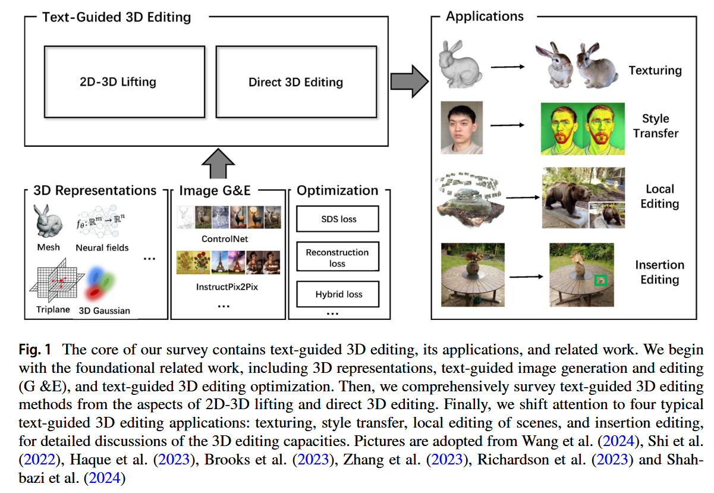
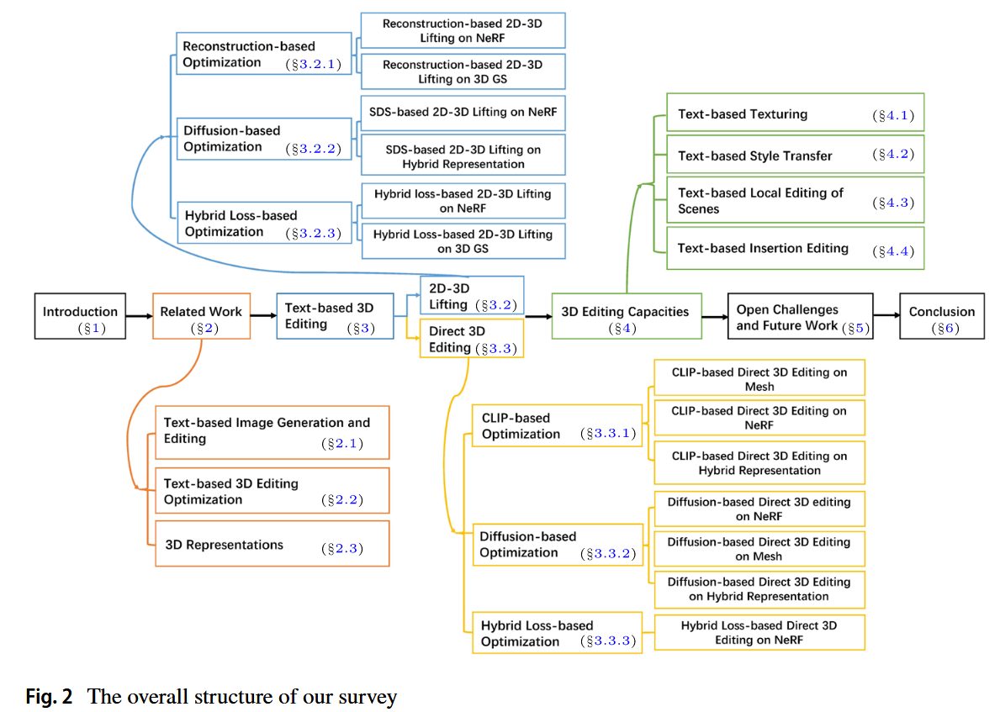
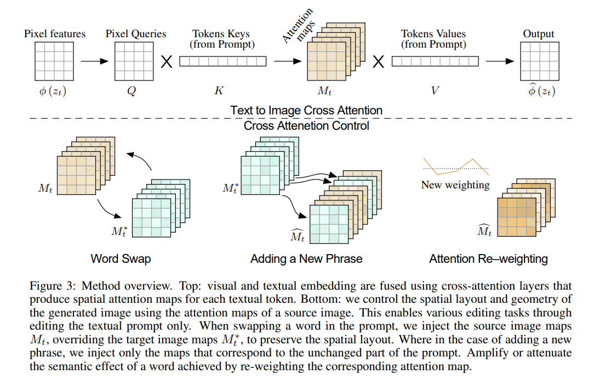
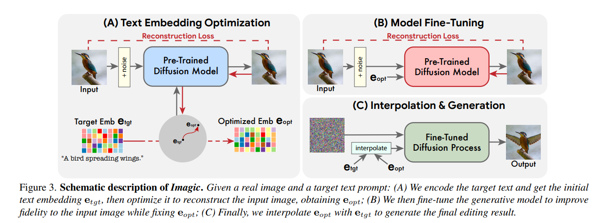
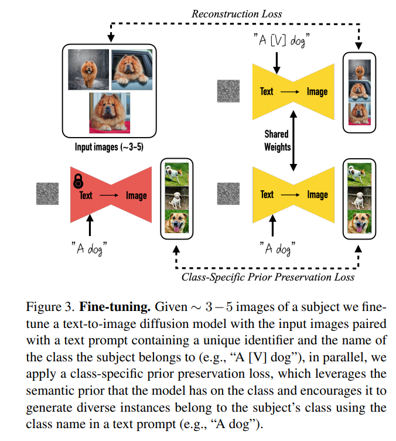

# 综述：Advances in text‐guided 3D editing: a survey 论文

参考文章：https://link.springer.com/article/10.1007/s10462-024-10937-6

# 一、基础知识补充

# 二、论文本身

## 1.摘要

在3D人工智能生成内容（AIGC）中，与从头开始生成3D资产相比，编辑现有的3D资产能够更好地满足用户需求，允许以节省时间和劳动力的方式创建多样化和高质量的3D资产。最近，基于文本引导的3D编辑通过文本提示修改3D资产，变得更加用户友好和实用，这引发了该领域的研究热潮。在本次调查中，我们全面考察了关于基于文本引导的3D编辑的最新文献，试图回答两个问题：现有的基于文本引导的3D编辑方法是什么？当前基于文本引导的3D编辑进展到什么程度？具体而言，我们聚焦于过去4年中发表的基于文本引导的3D编辑方法，深入探讨它们的框架和原理。随后，我们根据编辑策略、优化方案和3D表示法提出了一个基本分类法。基于该分类法，我们回顾了该领域的最新进展，考虑了编辑规模、类型、粒度和视角等因素。此外，我们强调了基于文本引导的3D编辑的四个应用，包括纹理处理、风格迁移、场景局部编辑和插入编辑，以进一步挖掘3D编辑能力，并进行深入比较和讨论。根据本次调查获得的见解，我们讨论了开放性挑战和未来的研究方向。我们希望这项调查能够帮助读者更深入地理解这一令人兴奋的领域，并促进基于文本引导的3D编辑的进一步发展。

**关键词**：文本提示 · 基于文本引导的3D编辑 · 编辑能力

## 2.Introduction

内容生成传统上是劳动密集型和耗时的，近年来主要通过3D人工智能生成内容（AIGC）技术得到了改善。最近，3D资产编辑被视为3D AIGC中一个前景广阔的研究方向，赋予了虚拟现实、增强现实和自动驾驶等潜在应用（Hoffman等，2023；Taniguchi，2019；Cui等，2024）。与从零开始创建新3D资产的3D生成不同，==3D编辑涉及根据用户提示（例如文本、草图、参考图像）改变3D资产的外观和几何形状，包括从修改到添加和删除的一系列编辑操作。==最近，基于文本引导的3D编辑通过遵循文本提示对3D资产进行操作，变得更加友好和适用，这使得3D编辑过程更加民主化，并吸引了大量研究人员的关注。然而，**基于文本引导的3D编辑面临挑战，因为它难以忠实于给定文本提示的语义来修改3D资产。此外，3D编辑从给定的3D资产开始，需要根据文本提示解决现有组件的引用，同时未引用的部分应尽可能保持不变。其他挑战，如缺乏配对的文本-3D数据集、多视角不一致性以及复杂的几何形状与外观交织，使情况更加严峻。**

近年来，大型语言-视觉模型==（如CLIP [Radford et al. 2021] 和Diffusion模型 [Ho et al. 2020; Zhang et al. 2023]）的出现推动了文本引导编辑系统的发展。==由于这些视觉-语言模型通过大规模文本-图像对数据集训练而成，研究重点主要集中在文本引导的图像生成与编辑（如 [Betker et al. 2023; Oppenlaender 2022; Li et al. 2023b; Ruiz et al. 2023]）。随后，这些文本引导的2D编辑技术==（例如 **InstructPix2Pix** [Li et al. 2023b] 和 **DreamBooth** [Ruiz et al. 2023]）被引入3D编辑领域（如 [Haque et al. 2023; Kamata et al. 2023]），从而避免了文本-3D配对数据的收集，并通过将2D图像编辑技术“提升”至3D，推动了文本引导3D编辑的关键进展。（对应的工作是InstructNeRF2NeRF和Instruct 3D-to-3D）==

基于这一流程，后续方法通过**多视角一致性编辑**（[Dong and Wang 2024; Mirzaei et al. 2023b; Song et al. 2023a]）和**泛化编辑**（[Khalid et al. 2023; Chen et al. 2024b; Fang et al. 2023]）等进一步提升了编辑质量和效率。

> 也就是说，上面的管线是集中在文本引导的图像生成与编辑。算是2D-3D Lifting。

在另一条技术路线中，受文本引导的3D生成研究（如 [Poole et al. 2022; Lin et al. 2023; Shi et al. 2023; Jun and Nichol 2023; Sanghi et al. 2022]）的启发，以 **Clip-forge** [Sanghi et al. 2022] 和 **DreamFusion** [Poole et al. 2022] 为例，文本引导的3D编辑直接通过微调预训练的文本-3D生成模型，全局修改3D资产以满足新文本提示。早期方法（如 [Wang et al. 2022; Sanghi et al. 2022; Wang et al. 2023b; Michel et al. 2022]）通过CLIP监督重新对齐3D资产与文本提示，生成编辑后的网格或神经模型（如神经辐射场）。开创性工作 **DreamFusion** [Poole et al. 2022] 提出**分数蒸馏采样（SDS）**，将2D文本-图像先验蒸馏至3D神经表示，为基于扩散的3D编辑方法（如 [Chen et al. 2023b, c; Sella et al. 2023; Cheng et al. 2023]）奠定基础。

除全局编辑外，最新方法（如 [Zhuang et al. 2023; Chen et al. 2024a; Sella et al. 2023; Li et al. 2024a; Dihlmann et al. 2024]）支持**可控局部编辑**，通过文本-图像交叉注意力图或用户定义的3D边界框定位兴趣区域，实现细粒度编辑。这些方法在对象局部修改（[Zhuang et al. 2023; Chen et al. 2024a]）、空间约束插入（[Sella et al. 2023; Li et al. 2024a; Dihlmann et al. 2024]）或删除（[Wang et al. 2023]）中取得显著成果。

鉴于这些进展，亟需系统性综述。已有部分工作（如 [Li et al. 2023d, 2024b; Foo et al. 2023; Chen et al. 2023d]）对文本引导的3D生成与编辑进行总结。其中，[Li et al. 2023d; Wang et al. 2024] 全面综述了文本引导3D生成及其应用；[Foo et al. 2023] 涵盖多模态AIGC（图像、视频、文本、3D形状、运动、音频），但3D部分较少；[Chen et al. 2023d] 聚焦图像引导的3D神经风格化，缺乏对文本引导3D编辑的细分类与评估。

与上述综述不同，本文**首次**对过去4年文本引导3D编辑的研究进展进行深度系统性分类与评估。如图1所示，我们涵盖文本引导3D编辑、其应用及相关工作。具体结构如下：

1. **第2节**：回顾基础技术（文本引导图像生成与编辑、3D编辑优化、3D表示）。
2. **第3节**：按编辑策略分类（2D-3D提升 vs. 直接3D编辑），并基于优化方案和3D表示细分讨论（第3.2-3.3节）；第3.4节探讨3D编辑约束。
3. **第4节**：从编辑规模、类型、粒度和视角分析能力，重点对比几何与外观编辑（纹理化、风格迁移、场景局部编辑、插入编辑）。
4. **第5节**：提出当前挑战与未来趋势。

本文是首个全面梳理文本引导3D编辑技术路线、应用与评估的综述，旨在为这一快速发展的领域提供研究指引。

**全文的行文脉络：**

------

### **表格总结：文本引导3D生成与编辑相关工作**

| **工作**                                     | **类别** | **原理**                  | **创新点**                     | **解决的问题**                 | **代表方法/技术** |
| -------------------------------------------- | -------- | ------------------------- | ------------------------------ | ------------------------------ | ----------------- |
| **Clip-forge** [Sanghi et al. 2022]          | 3D生成   | CLIP引导的3D形状生成      | 结合CLIP语义与3D形状潜空间     | 文本到3D的零样本生成           | 形状潜空间优化    |
| **DreamFusion** [Poole et al. 2022]          | 3D生成   | 分数蒸馏采样（SDS）       | 2D扩散先验蒸馏至3D神经场       | 无需3D训练数据生成高质量3D模型 | SDS损失、NeRF表示 |
| **Wang et al. 2022**                         | 3D编辑   | CLIP监督的网格/神经场对齐 | 文本驱动的几何与外观编辑       | 3D资产与文本的语义对齐         | CLIP损失优化      |
| **SDS-based Editing** [Chen et al. 2023b, c] | 3D编辑   | 基于SDS的微调             | 保留预训练模型知识的同时编辑3D | 全局编辑的保真度               | 扩散模型微调策略  |
| **局部编辑** [Zhuang et al. 2023]            | 3D编辑   | 文本-图像注意力定位区域   | 细粒度局部修改                 | 兴趣区域的精准控制             | 交叉注意力掩码    |
| **插入/删除** [Sella et al. 2023]            | 3D编辑   | 空间约束的生成与擦除      | 动态场景编辑                   | 3D场景的拓扑修改               | 边界框约束生成    |
| **Survey** [Li et al. 2023d]                 | 综述     | 技术路线分类              | 首次系统梳理3D生成与编辑       | 领域研究空白                   | 多模态生成评估    |

------

### **关键分类与对比**

1. 生成 vs. 编辑：
   - **生成**（如DreamFusion）：从零生成3D资产；
   - **编辑**（如SDS-based方法）：修改现有资产。
2. 全局 vs. 局部：
   - 局部编辑依赖注意力机制或用户交互（如绘制掩码）。
3. 技术路线：
   - **2D-3D提升**：利用2D模型（扩散、CLIP）引导3D优化；
   - **直接3D编辑**：基于3D表示（网格、点云、神经场）的物理修改。

## 3.Fundamentals of text‐guided 3D editing

> In this section, we provide an overview of the technical fundamentals underlying text-guided 3D editing. ==We first review two image-related tasks: text-guided image generation and editing. Then, we introduce text-guided 3D editing optimization to explain how CLIP loss and diffusion loss work in 3D editing driven by text prompts.== Lastly, we summarize 3D representations and categorize them into explicit and implicit for a detailed discussion.

### （1）Text‐guided image generation and editing

> 在文本引导的3D编辑中，一种常见方法是将**文本引导2D图像编辑**的优异成果迁移至3D领域。这一策略能充分利用大规模预训练的视觉-语言模型（如CLIP、扩散模型），同时避免收集配对的文本-3D数据集。
>
> 在**文本引导的图像生成与编辑**方面：
>
> - **早期研究**（如 [Reed et al. 2016; Xu et al. 2018; Karras et al. 2019; Patashnik et al. 2021]）结合**生成对抗网络（GANs）和CLIP**，通过文本语义操控图像内容。
> - **近期进展**得益于预训练扩散模型的突破，基于扩散的方法（如 [Nichol et al. 2022; Saharia et al. 2022; Rombach et al. 2022]）能够生成高分辨率、多样化的图像，进而推动其在3D编辑中的应用。
>
> 本节重点关注以下两个相关领域：
>
> 1. **基于扩散模型的文本引导图像生成**
> 2. **文本引导的图像编辑技术**
>
> ------
>
> ### **关键点说明**
>
> 1. 技术迁移逻辑：
>    - 2D编辑技术（如扩散模型）通过优化3D表示（如NeRF、网格）间接实现3D编辑，避免了对稀缺3D数据集的依赖。
> 2. 方法演进：
>    - 从**GAN+CLIP**的早期方案，到**扩散模型**主导的高质量生成，编辑精度和多样性显著提升。

#### （a）Text‐guided image generation

基本就是CFG，GLIDE，Stable Diffusion（编码到Latent Space那一套）。

原文有一句值得注意：Although text-guided image generation models have the ability to edit images (e.g., DALLE-2 can inpaint regions),==in most cases, they offer no guarantees that unedited regions should be preserved. To be worse, similar text prompts will yield completely different images. For instance, adding the text prompt “cheese” to “cake” often changes the cake’s shape.==

#### （b）Text-guided image editing——文章方法合集

要点是**保持非编辑区域的不变性。**以下介绍重点的一些工作。

- （1）Prompt-to-prompt：可以看这个视频：https://www.bilibili.com/video/BV1C8411Q7hb/?spm_id_from=333.337.search-card.all.click&vd_source=f0e5ebbc6d14fe7f10f6a52debc41c99，创新点在于引入==Cross Attention==。Prompt-to-prompt (Hertz et al. 2022) proposes to ==edit images by injecting the cross-attention maps during the diffusion process, controlling which pixels attend to which tokens of the prompt text during which diffusion steps.==具体工作下面也有简要整理。
- （2）Imagic：Imagic (Kawar et al. 2023) performs image editing by producing a text embedding that aligns with both the input image and the target text prompt, and subsequently regenerating with the produced text embedding. Facilitated by this editing strategy, Imagic realizes non-rigid changes such as posture changes.
- （3）Instruct-Pix2Pix：trained on a dataset of text instructions and image descriptions, InstructPix2Pix (Li et al. 2023b) proposes an approach to editing images based on text instructions. ==It can effectively capture consistent information from the original image while adhering to text instructions.==

另外一种思路是image editing by generating personalized images that **maintain a specific object or concept learned from a small collection of images.**

- （1）Textual Inversion：learns a unique identifier word to represent a new subject and incorporates this word into the text encoder’s dictionary.
- （2）==DreamBooth：==Given a few images of the same subject, DreamBooth (Ruiz et al. 2023) finetunes the text-guided image diffusion model Imagen (Saharia et al. 2022) to bind the specific subject with a new and rare identifier (denoted as ∗). 关于DreamBooth论文的精读可以看这个视频：https://www.bilibili.com/video/BV1kN411w7bx/?spm_id_from=333.337.search-card.all.click&vd_source=f0e5ebbc6d14fe7f10f6a52debc41c99。

------

近年来，一些方法（如GLIGEN（Li等人，2023c）、Make-A-Scene（Gafni等人，2022）、ControlNet（Zhang等人，2023）和T2I-Adapter（Mou等人，2024））通过引入额外条件（如边界框、分割图）与文本提示协同作用，使图像生成过程更具可控性，从而赋予这些生成模型图像编辑能力。例如，ControlNet（Zhang等人，2023）通过一种新的ControlNet结构扩展了预训练的Stable Diffusion（Rombach等人，2022），该结构作用于基础U-Net的每一层编码器，在去噪过程中添加不同任务特定的条件引导（如Canny边缘、人体姿态、深度图、法线图和草图）。最近，CustomDiffusion（Kumari等人，2023）和FastComposer（Xiao等人，2023）等研究进一步探索了生成包含多概念或多对象的个性化图像。

| **方法**            | **核心贡献** | **核心创新**                                                 | **支持的条件/任务**                       | **应用场景**                   | 相关链接                  |
| ------------------- | ------------ | ------------------------------------------------------------ | ----------------------------------------- | ------------------------------ | ------------------------- |
| **GLIGEN**          | 2023         | 通过空间条件（如边界框）与文本融合，实现细粒度控制生成。     | 边界框、关键点、文本提示                  | 多对象组合、场景构图           | https://gligen.github.io/ |
| **Make-A-Scene**    | 2022         | 结合文本与分割图生成图像，保留用户提供的布局结构。           | 语义分割图、文本提示                      | 艺术创作、设计草图生成         |                           |
| **ControlNet**      | 2023         | 在Stable Diffusion的U-Net各层添加可训练副本，注入多样化条件信号。 | Canny边缘、人体姿态、深度图、法线图、草图 | 图像编辑、姿态迁移、3D重建     |                           |
| **T2I-Adapter**     | 2024         | 轻量级适配器结构，仅微调少量参数即可适配多种条件。           | 草图、颜色分布、空间结构                  | 低资源可控生成                 |                           |
| **CustomDiffusion** | 2023         | 通过优化文本嵌入和交叉注意力层，实现多概念个性化生成。       | 多对象文本描述、少量示例图像              | 个性化内容创作（如多角色场景） |                           |
| **FastComposer**    | 2023         | 解耦对象特征与背景生成，支持高效多主体组合。                 | 多对象描述、属性分离                      | 广告设计、多人物合成           |                           |

> 1. 条件扩展性：
>    - ControlNet和T2I-Adapter支持**低层次视觉条件**（如边缘、深度），适合精确编辑；
>    - GLIGEN和Make-A-Scene侧重**高层次语义条件**（如布局、分割图），适合构图控制。
> 2. 个性化生成：
>    - CustomDiffusion和FastComposer专注于**多概念组合**，解决传统方法对单一主体的限制。
> 3. 计算效率：
>    - T2I-Adapter通过轻量适配器减少训练成本，而ControlNet需微调完整网络副本。

具体每个工作的贡献如下：

- （1）GLIGEN：https://gligen.github.io/
- **核心贡献**：
  提出了一种**基于空间条件的开放词汇生成框架**，通过将边界框、关键点等几何条件与文本提示深度融合，实现细粒度的可控图像合成。
  **关键技术**：
  - **门控机制（Gated Fusion）**：在扩散模型的交叉注意力层中引入可学习的空间条件（如边界框坐标），动态控制文本与几何条件的权重。
  - **零样本泛化**：支持未见过的物体组合（如“悬浮的透明水母”），无需额外训练。
  - **创新点**：
    首次在开放域生成中实现文本+几何条件的联合控制，解决了传统方法对预定义类别或固定布局的依赖。
- （2）Make-A-Scene：==看了一下原论文，生成效果不是很好，现在应该已经被淘汰了，感觉不太能用。==
- （3）ControlNet：
- （4）T2I-Adapter：这篇可以结合ControlNet一起看，推荐这个视频：https://www.bilibili.com/video/BV1VegTeFEqu/?spm_id_from=333.337.search-card.all.click&vd_source=f0e5ebbc6d14fe7f10f6a52debc41c99，

##### （i）Prompt-to-prompt

在这篇工作之前，一般都是用GAN来做图像编辑的。在CLIP发布出来之后，一般就用CLIP+GAN来做文本实现图像编辑（比如StyleCLIP，可以在人脸上做一些换发型，换装之类的操作）。Diffusion崛起后，基本就用Diffusion来做图像编辑任务了（有一些工作例如DiffusionClip，Paint-by-Example）。

其中Paint-by-Example需要手动绘制mask区域，这样的问题一是不方便，二是其实只是在编辑的时候重新生成了Mask对应的区域，同时也没有很好地利用被编辑区域原来的信息。

Prompt-to-prompt这篇文章就是用来解决上面的问题的，以下是动机：

> 我们可不可以去做完全由文本引导的图像编辑, 而不去依靠人为的去提供mask，或者提供任任意的这种其他模式的提示呢？因为如果完全依靠文本来做图像的编辑的话,那对于用户来说这是一个非常友好的一种方式。

##### （ii）Imagic

> ### **1. 核心问题与挑战**
> 传统文本到图像扩散模型（如 Stable Diffusion）在编辑图像时面临两大挑战：
> - **刚性编辑限制**：==多数方法仅支持简单属性替换（如“狗→猫”），难以实现姿势、布局等非刚性变化。==
> - **保真度-编辑性权衡**：直接使用目标文本提示生成图像会导致输入图像内容丢失（如背景、主体身份等）。
>
> Imagic 的目标是 **在保留输入图像整体结构和细节的前提下，实现高度灵活的非刚性编辑**。
>
> ---
>
> ### **2. 方法思路**
> Imagic 的流程分为三个阶段，关键思想是 **通过优化文本嵌入** 在源图像和目标提示之间建立语义桥梁：
>
> #### **(1) 文本嵌入优化（Text Embedding Optimization）**
> - **输入**：源图像 $$ x $$ + 目标文本提示 $$ P_{\text{target}} $$（如“坐着的狗→站着的狗”）。
> - **优化目标**：找到一个既能重建源图像，又靠近目标文本语义的 **混合文本嵌入** $$ \hat{e} $$。
>   - 固定扩散模型参数，仅优化文本嵌入 $$ e $$（通常为 CLIP 或 T5 嵌入）。
>   - 损失函数：最小化扩散模型在 $$ e $$ 下对 $$ x $$ 的重建误差（如 DDPM 的噪声预测损失）：
>     $$
>     \mathcal{L}_{\text{recon}} = \mathbb{E}_{t, \epsilon} \left[ \| \epsilon - \epsilon_\theta(x_t, e, t) \|^2 \right]
>     $$
>     其中 $$ \epsilon_\theta $$ 是噪声预测网络，$$ x_t $$ 是 $$ x $$ 在时间步 $$ t $$ 的加噪版本。
> - **效果**：$$ \hat{e} $$ 是源图像和目标提示的语义折衷，例如既包含“狗”的原始特征，又隐含“站立”的姿势信息。
>
> #### **(2) 微调模型（Model Fine-tuning）**
> - **目的**：让扩散模型更好地理解 $$ \hat{e} $$ 的独特语义（因 $$ \hat{e} $$ 是优化所得，与自然文本分布不同）。
> - **操作**：用 $$ \hat{e} $$ 和源图像 $$ x $$ 对扩散模型（UNet 部分）进行 **轻量级微调**（少量步数），优化目标为：
>   $$
>   \mathcal{L}_{\text{finetune}} = \mathbb{E}_{t, \epsilon} \left[ \| \epsilon - \epsilon_\theta(x_t, \hat{e}, t) \|^2 \right]
>   $$
>
> #### **(3) 目标文本引导生成（Target Text-Guided Generation）**
> - **输入**：优化后的嵌入 $$ \hat{e} $$ + 目标文本嵌入 $$ e_{\text{target}} $$。
> - **生成过程**：在扩散过程中，通过插值或交叉注意力将 $$ \hat{e} $$ 和 $$ e_{\text{target}} $$ 结合。例如：
>   - **插值法**：生成时使用混合嵌入 $$ e_{\text{gen}} = \lambda \hat{e} + (1-\lambda) e_{\text{target}} $$，其中 $$ \lambda $$ 控制保真度与编辑强度的权衡。
>   - **交叉注意力**：在 UNet 的注意力层中动态融合 $$ \hat{e} $$ 和 $$ e_{\text{target}} $$ 的特征。
>
> ---
>
> ### **3. 解决的关键问题**
> #### **(1) 非刚性编辑的实现**
> - **传统方法**：依赖图像到图像转换（如 SDEdit）或掩码引导，难以改变姿态、布局等全局结构。
> - **Imagic 的突破**：通过优化文本嵌入直接编码非刚性变化的语义（如“站立”），再通过扩散模型解耦结构和属性，实现自然编辑。
>
> #### **(2) 保真度与编辑性的平衡**
> - **直接生成问题**：仅用 $$ e_{\text{target}} $$ 会导致内容偏离源图像。
> - **Imagic 的策略**：混合嵌入 $$ \hat{e} $$ 作为“锚点”，微调模型确保编辑后的图像与源图像在细节上一致（如纹理、背景）。
>
> #### **(3) 无需额外训练或用户标注**
> - 仅需单张输入图像和目标文本，无需分割掩码、关键点标注或大量数据训练。
>
> ---
>
> ### **4. 实验结果与优势**
> - **编辑能力**：在姿势调整（如“坐→站”）、视角变化（如“正面→侧面”）、属性修改（如“添加微笑”）等任务上表现优异。
> - **对比基线**：优于 Textual Inversion、Prompt-to-Prompt 等方法，尤其在复杂非刚性编辑中保真度更高。
> - **用户研究**：编辑结果在自然度和一致性上获得更高评分。
>
> ---
>
> ### **5. 局限性与未来方向**
> - **多目标冲突**：若源图像与目标提示差异过大（如“狗→汽车”），优化嵌入可能失效。
> - **速度**：文本嵌入优化和微调需额外计算（约几分钟/图像）。
> - **扩展性**：未来可能结合 ControlNet 等空间控制技术，进一步提升精度。
>
> ---
>
> ### **总结**
> Imagic 通过 **文本嵌入优化** 和 **模型微调**，在扩散模型中实现了语义驱动的细粒度图像编辑，突破了传统方法在非刚性编辑上的限制。其核心在于将图像编辑问题转化为嵌入空间的语义对齐问题，为后续研究提供了新思路。

##### （iii）DreamBooth

> DreamBooth（2022）的核心贡献是提出了一种**针对特定主体（subject-specific）的个性化文本到图像生成方法**，而其中的**class-specific prior preservation loss（类别先验保留损失）**是其实现高质量微调的关键创新之一。虽然DreamBooth的最大贡献是整体框架（结合文本提示和少量图像微调扩散模型），但prior preservation loss解决了微调过程中的**过拟合**和**语义漂移**问题，是方法成功的重要支撑。
>
> ---
>
> ### **1. 核心问题**
> - **任务目标**：用3-5张图像微调预训练扩散模型（如Stable Diffusion），使其能根据文本提示生成该主体的新场景（如“一只[V]狗在太空”）。
> - **直接微调的缺陷**：
>   - **过拟合**：模型会记住输入图像的细节，失去多样性（如只能生成训练时的固定姿势）。
>   - **语义失真**：微调后模型可能丢失预训练时学到的类别先验知识（如“狗”的一般特征）。
>
> ---
>
> ### **2. Prior Preservation Loss的动机**
> - **关键思想**：在微调时，**同时约束模型保留原始类别（如“狗”）的通用知识**，避免过度偏离预训练分布。
> - **实现方式**：通过合成同类别的通用样本（如其他狗的图片）作为正则化项，平衡主体特异性和类别通用性。
>
> ---
>
> ### **3. 具体步骤与数学形式**
> #### **(1) 构造先验样本**
> - 使用预训练模型生成同类别的通用图像：
>   - 输入文本：原始类别名称（如“a photo of a dog”），而非主体特定标识符（如“[V]”）。
>   - 生成图像：$$ x_{\text{prior}} = G_\theta(\text{"a photo of a dog"}) $$。
>
> #### **(2) 损失函数设计**
> - **总损失** = **主体特定损失** + **先验保留损失**：
>   $$
>   \mathcal{L} = \mathbb{E}_{x, c, \epsilon, t} \left[ \| \epsilon - \epsilon_\theta(x_t, c, t) \|^2 \right] + \lambda \mathbb{E}_{x_{\text{prior}}, c_{\text{prior}}, \epsilon, t} \left[ \| \epsilon - \epsilon_\theta(x_{\text{prior},t}, c_{\text{prior}}, t) \|^2 \right]
>   $$
>   - **主体特定损失**：对训练图像 $$ x $$ 和主体相关文本 $$ c $$（如“[V] dog”）计算重建误差。
>   - **先验保留损失**：对生成的先验样本 $$ x_{\text{prior}} $$ 和类别文本 $$ c_{\text{prior}} $$（如“a dog”）计算重建误差。
>   - $$ \lambda $$：平衡两项的权重（通常设为1）。
>
> #### **(3) 训练过程**
> 1. 采样主体图像和文本对 $$ (x, c) $$。
> 2. 采样先验图像和文本对 $$ (x_{\text{prior}}, c_{\text{prior}}) $$。
> 3. 同步优化两项损失，更新模型参数 $$ \theta $$。
>
> ---
>
> ### **4. 解决的问题**
> - **过拟合**：通过先验样本迫使模型保留生成多样性（如不同姿势的狗）。
> - **语义漂移**：防止主体标识符（如[V]）完全侵占原始类别语义（如“狗”变成[V]的专属符号）。
>
> ---
>
> ### **5. 是否是最大贡献？**
> - **Prior Preservation Loss的重要性**：
>   - 它是DreamBooth能**泛化到新场景**的关键（如“[V]狗在太空”仍需像“狗”）。
>   - 实验表明，去掉该损失会导致生成质量显著下降。
> - **但DreamBooth的核心贡献更广**：
>   1. **主体驱动生成框架**：首次用少量图像+文本标识符实现个性化生成。
>   2. **文本与图像联合微调**：通过唯一标识符（如[V]）绑定主体与文本提示。
>   3. **先验保留损失的引入**：作为支撑框架稳定性的核心技术。
>
> ---
>
> ### **6. 对比其他方法**
> - **Textual Inversion**：仅反转文本嵌入，不微调模型，生成能力有限。
> - **Fine-tuning整个模型**：无先验保留会导致过拟合（如生成与训练图像背景相同的图片）。
>
> ---
>
> ### **总结**
> - **Prior Preservation Loss** 通过联合优化主体特定样本和类别先验样本，解决了少样本微调中的过拟合问题，是DreamBooth的核心创新之一。
>
> - **DreamBooth的最大贡献**在于整体框架设计，将扩散模型的少样本微调与文本提示结合，开创了主体驱动生成的新范式。先验保留损失是这一框架能实用的关键保障。
>
>   
>
> ### **DreamBooth 评价指标总结表**
>
> | **指标名称**                      | **计算方式**                                                 | **作用**                                                     | **备注**                                                    |
> | --------------------------------- | ------------------------------------------------------------ | ------------------------------------------------------------ | ----------------------------------------------------------- |
> | **CLIP-I (Image Similarity)**     | $$ \text{CLIP-I} = \text{cos}(E_{\text{CLIP}}(x_{\text{gen}}), E_{\text{CLIP}}(x_{\text{real}})) $$ | 衡量生成图像与真实图像在CLIP空间中的相似度，评估保真度。     | 值越高，生成图像与输入图像越接近。                          |
> | **CLIP-T (Text Alignment)**       | $$ \text{CLIP-T} = \text{cos}(E_{\text{CLIP}}(x_{\text{gen}}), E_{\text{CLIP}}(c_{\text{target}})) $$ | 衡量生成图像与目标文本在CLIP空间中的对齐度，评估编辑准确性。 | 值越高，图像越符合文本描述（如“[V] dog on the moon”）。     |
> | **DINO (Identity Preservation)**  | $$ \text{DINO} = \text{cos}(E_{\text{DINO}}(x_{\text{gen}}), E_{\text{DINO}}(x_{\text{real}})) $$ | 通过DINO-ViT提取图像特征，评估生成主体与输入主体的身份一致性（如人脸、宠物）。 | 对局部细节（如纹理、形状）敏感，值越高身份保留越好。        |
> | **User Study (Preference Score)** | 人工评分（如1-5分）比较生成结果在真实性、文本对齐、身份保留等方面的优劣。 | 提供人类主观评价，弥补自动指标的局限性。                     | DreamBooth在用户研究中显著优于基线（如Textual Inversion）。 |
> | **Diversity (LPIPS)**             | $$ \text{LPIPS}(x_{\text{gen}}^1, x_{\text{gen}}^2) $$ 计算同一提示下生成图像的差异。 | 评估模型生成多样性，避免过拟合（如不同姿势的“[V] dog”）。    | 值越高，多样性越好；需与CLIP-I平衡。                        |
>
> 这些指标共同支撑了论文的核心贡献——**少样本、高保真、可编辑的主体驱动生成**。

##### （iv）ControlNet——1x1卷积

> ### 1x1卷积的概念与作用
>
> **1x1卷积**（也称为点卷积，Pointwise Convolution）是指卷积核大小为1×1的卷积操作。尽管其空间感受野仅为单个像素，但它在深度（通道维度）上对输入特征图进行线性组合，因此具有以下核心作用：
>
> 1. **通道维度的变换**：
>    - **降维或升维**：通过调整1x1卷积的输出通道数，可灵活减少（压缩）或增加（扩展）特征图的通道数。例如，ResNet中使用1x1卷积降低计算量后再进行3x3卷积。
>    - **跨通道信息融合**：对不同通道的特征进行加权组合，实现通道间的交互，增强特征表达能力。
>
> 2. **计算效率优化**：
>    - **降低参数量和计算量**：在深度可分离卷积（如MobileNet）中，1x1卷积负责通道融合，替代传统卷积的密集计算，大幅减少参数。
>
> 3. **非线性增强**：
>    - 在1x1卷积后接激活函数（如ReLU），可引入非线性，提升模型的表达能力，而无需改变空间尺寸。
>
> 4. **跨特征图的线性变换**：
>    - 在卷积神经网络中，1x1卷积可视为对每个空间位置的特征向量进行全连接操作，实现通道间的信息重组。
>
> ---
>
> ### 1x1卷积的典型应用场景
>
> 1. **瓶颈结构（Bottleneck）**：
>    - 如ResNet中，先用1x1卷积降维（减少通道数），再进行3x3卷积，最后用1x1卷积恢复维度，平衡计算量与模型性能。
>
> 2. **深度可分离卷积（Depthwise Separable Convolution）**：
>    - MobileNet等轻量级网络中，先用逐通道卷积（Depthwise Conv）处理空间信息，再用1x1卷积融合通道信息。
>
> 3. **特征图通道调整**：
>    - 在U-Net等分割网络中，跳跃连接（Skip Connection）时用1x1卷积对齐编码器和解码器的通道数。
>
> 4. **注意力机制**：
>    - 如Squeeze-and-Excitation Network（SENet）中，1x1卷积用于生成通道注意力权重。
>
> 5. **多任务学习的特征复用**：
>    - 在共享主干网络后，通过不同1x1卷积分支生成多任务（如检测+分割）的专用特征。
>
> ---
>
> ### ControlNet中的Zero-Convolution
>
> 在ControlNet中，**Zero-Convolution**是一种特殊的1x1卷积，其初始权重为零。这种设计的作用是：
>
> 1. **训练初期的无损传播**：
>    - 初始阶段，Zero-Convolution的输出为零，确保ControlNet的加入不影响原始模型的预训练行为（如Stable Diffusion的生成能力）。
>    - 随着训练进行，权重逐渐学习从零开始调整，逐步引入控制信号。
>
> 2. **稳定微调**：
>    - 避免突然的梯度变化，使模型能够平稳地从预训练状态过渡到条件控制状态，防止破坏已有知识。
>
> 3. **条件控制的渐进式融合**：
>    - Zero-Convolution作为ControlNet与主模型的接口，逐步将条件信息（如边缘、深度图）注入生成过程，确保生成质量。
>
> ---
>
> ### 总结
>
> - **1x1卷积**：核心作用是通道维度的灵活变换与信息融合，广泛应用于模型压缩、特征增强和多任务学习。
> - **Zero-Convolution**：是ControlNet的创新设计，通过零初始化实现训练稳定性，逐步融合条件控制信号，保持预训练模型的知识完整性。

