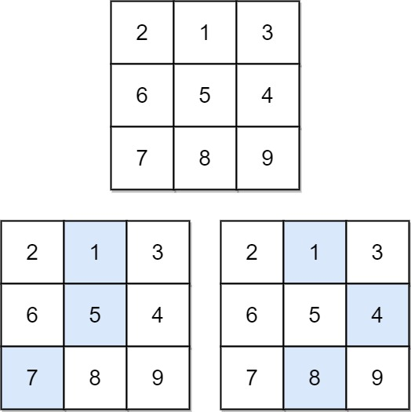
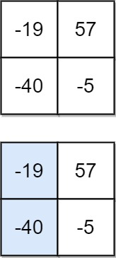
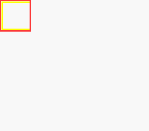

【题单】动态规划（入门/背包/状态机/划分/区间/状压/数位/树形/数据结构优化）力扣


负数取余运算

//https://blog.csdn.net/u013094181/article/details/21863491

# 动规

## 爬楼梯及其引申类型动规

#### [377. 组合总和 Ⅳ](https://leetcode.cn/problems/combination-sum-iv/)

已解答

中等

给你一个由 **不同** 整数组成的数组 `nums` ，和一个目标整数 `target` 。请你从 `nums` 中找出并返回总和为 `target` 的元素组合的个数。

题目数据保证答案符合 32 位整数范围。

 

**示例 1：**

```
输入：nums = [1,2,3], target = 4
输出：7
解释：
所有可能的组合为：
(1, 1, 1, 1)
(1, 1, 2)
(1, 2, 1)
(1, 3)
(2, 1, 1)
(2, 2)
(3, 1)
请注意，顺序不同的序列被视作不同的组合。
```

**示例 2：**

```
输入：nums = [9], target = 3
输出：0
```

 

**提示：**

- `1 <= nums.length <= 200`
- `1 <= nums[i] <= 1000`
- `nums` 中的所有元素 **互不相同**
- `1 <= target <= 1000`

 

**进阶：**如果给定的数组中含有负数会发生什么？问题会产生何种变化？如果允许负数出现，需要向题目中添加哪些限制条件？


```C++
class Solution {
public:
    int combinationSum4(vector<int>& nums, int target) 
    {
        int dp[2000]={0};
        dp[0]=1;
        int num=0;
        int temp=0;
        int n=nums.size();
        for(int i=1;i<=target;i++)
        {
            
            for(int j=0;j<n;j++)
            {
                temp=nums[j];
                if(i-temp>=0&&dp[i-temp]<INT_MAX-dp[i])
                {
                    dp[i]+=(dp[i-temp]);
                }
            }
        }
        return dp[target];
    }
};
```


关于INT_MAX的问题，出错的用例如下： [10,20,30,40,50,60,70,80,90,100,110,120,130,140,150,160,170,180,190,200,210,220,230,240,250,260,270,280,290,300,310,320,330,340,350,360,370,380,390,400,410,420,430,440,450,460,470,480,490,500,510,520,530,540,550,560,570,580,590,600,610,620,630,640,650,660,670,680,690,700,710,720,730,740,750,760,770,780,790,800,810,820,830,840,850,860,870,880,890,900,910,920,930,940,950,960,970,980,990,111] target=999

这个用例的答案只有一种，就是9个111 。可以看到前面n-1个数都是10的倍数，是不可能得到和为999的。 但是dp计算的过程中会计算和为0-999所有数字。例如计算dp[990], 排列数目会有很多，可能越界。

最符合理论的解法是：使用unsigned long long, 这样完全满足传递方程， 保证中间计算值不越界。

官方的解法有偷巧的地方，因为最终结果保证不超过INT_MAX, 所以超过就不传递了。实际确实也不传递，假设dp[990] > INT_MAX, dp[999] 实际无法通过dp[990]传递，因为nums里面没有一个值是9.

总结：dp中间值可能大于INT_MAX, 但是目标值是小于INT_MAX的。测试用例特殊，目标值实际不需要中间值（大于INT_MAX)的传递。


#### [2466. 统计构造好字符串的方案数](https://leetcode.cn/problems/count-ways-to-build-good-strings/)

已解答

中等


相关标签

相关企业


提示


给你整数 `zero` ，`one` ，`low` 和 `high` ，我们从空字符串开始构造一个字符串，每一步执行下面操作中的一种：

- 将 `'0'` 在字符串末尾添加 `zero` 次。
- 将 `'1'` 在字符串末尾添加 `one` 次。

以上操作可以执行任意次。

如果通过以上过程得到一个 **长度** 在 `low` 和 `high` 之间（包含上下边界）的字符串，那么这个字符串我们称为 **好** 字符串。

请你返回满足以上要求的 **不同** 好字符串数目。由于答案可能很大，请将结果对 `109 + 7` **取余** 后返回。

 

**示例 1：**

```
输入：low = 3, high = 3, zero = 1, one = 1
输出：8
解释：
一个可能的好字符串是 "011" 。
可以这样构造得到："" -> "0" -> "01" -> "011" 。
从 "000" 到 "111" 之间所有的二进制字符串都是好字符串。
```

**示例 2：**

```
输入：low = 2, high = 3, zero = 1, one = 2
输出：5
解释：好字符串为 "00" ，"11" ，"000" ，"110" 和 "011" 。
```

 

**提示：**

- `1 <= low <= high <= 105`
- `1 <= zero, one <= low`

------


```C++
class Solution {
public:
    int countGoodStrings(int low, int high, int zero, int one) {
        //dplow-high
        //  3位
        //dpi=dp[i-zero]+dp[i-one];
        long long dp[100010]={0};
        dp[0]=1;//得注意这个 因为
        for(int i=1;i<=high;i++)
        {
            if(i-zero>=0)
            {
                dp[i]=dp[i-zero]%(1000000007);
            }
            if(i-one>=0)
            {
                dp[i]+=dp[i-one]%(1000000007);
            }
        }
        long long res=0;
        for(int j=low;j<=high;j++)
        {
            res+=(dp[j]%(1000000007));
            //取余
        }
        return res%(1000000007);
    }
};
```

以上回溯会超时

由于答案可能很大，将它对 `109 + 7` **取余** 后返回。

感觉说以上这句话的可能就得是动规 回溯/迭代可能会超时


#### [2266. 统计打字方案数](https://leetcode.cn/problems/count-number-of-texts/)

已解答

中等


提示


Alice 在给 Bob 用手机打字。数字到字母的 **对应** 如下图所示。


为了 **打出** 一个字母，Alice 需要 **按** 对应字母 `i` 次，`i` 是该字母在这个按键上所处的位置。

- 比方说，为了按出字母 `'s'` ，Alice 需要按 `'7'` 四次。类似的， Alice 需要按 `'5'` 两次得到字母 `'k'` 。
- 注意，数字 `'0'` 和 `'1'` 不映射到任何字母，所以 Alice **不** 使用它们。

但是，由于传输的错误，Bob 没有收到 Alice 打字的字母信息，反而收到了 **按键的字符串信息** 。

- 比方说，Alice 发出的信息为 `"bob"` ，Bob 将收到字符串 `"2266622"` 。

给你一个字符串 `pressedKeys` ，表示 Bob 收到的字符串，请你返回 Alice **总共可能发出多少种文字信息** 。

由于答案可能很大，将它对 `109 + 7` **取余** 后返回。

 

**示例 1：**

```
输入：pressedKeys = "22233"
输出：8
解释：
Alice 可能发出的文字信息包括：
"aaadd", "abdd", "badd", "cdd", "aaae", "abe", "bae" 和 "ce" 。
由于总共有 8 种可能的信息，所以我们返回 8 。
```

**示例 2：**

```
输入：pressedKeys = "222222222222222222222222222222222222"
输出：82876089
解释：
总共有 2082876103 种 Alice 可能发出的文字信息。
由于我们需要将答案对 109 + 7 取余，所以我们返回 2082876103 % (109 + 7) = 82876089 。
```

 

**提示：**

- `1 <= pressedKeys.length <= 105`
- `pressedKeys` 只包含数字 `'2'` 到 `'9'` 。


中间一段较为冗长 可以写成for循环

我们的dp要从1开始，所以对应的pressedKeys要比dp的index-1。因为我们要获取0位置的  所以0位置的不能表示什么实质性的

```C++
class Solution {
public:
//    vector<int> numMap=
//    {
//        0,0,3,3,3,3,3,4,3,4
//    };
    int countTexts(string pressedKeys) 
    {
        long long dp[100010]={0};
        dp[0]=1;//无
        dp[1]=1;
        int n=pressedKeys.size()+1;
        for(int i=1;i<n;i++)
        {
            // int PressNum = pressedKeys[i-1]-'0';
            // int numMapNum=numMap[PressNum];//对应abc3个数字 3

            dp[i]=dp[i-1]%1000000007;
            if(i>=2&&pressedKeys[i-1]==pressedKeys[i-2])
            {
                dp[i]+=dp[i-2]%1000000007;
                if(i>=3&&pressedKeys[i-1]==pressedKeys[i-3])
                {
                    dp[i]+=dp[i-3]%1000000007;
                    // if(i>=4&&numMapNum==4&&pressedKeys[i-1]==pressedKeys[i-3-1])
                    // {
                    //     dp[i]+=dp[i-4]%1000000007;
                    // }
                    if(i>=4&&(pressedKeys[i-1]=='7'||pressedKeys[i-1]=='9')&&pressedKeys[i-1]==pressedKeys[i-4])
                    {
                        dp[i]+=dp[i-4]%1000000007;
                    }
                }
            }
            
        }
        return dp[n-1]%1000000007;
    }
};
```


## 打家劫舍 类型

#### [198. 打家劫舍](https://leetcode.cn/problems/house-robber/)

已解答

中等


你是一个专业的小偷，计划偷窃沿街的房屋。每间房内都藏有一定的现金，影响你偷窃的唯一制约因素就是相邻的房屋装有相互连通的防盗系统，**如果两间相邻的房屋在同一晚上被小偷闯入，系统会自动报警**。

给定一个代表每个房屋存放金额的非负整数数组，计算你 **不触动警报装置的情况下** ，一夜之内能够偷窃到的最高金额。

 

**示例 1：**

```
输入：[1,2,3,1]
输出：4
解释：偷窃 1 号房屋 (金额 = 1) ，然后偷窃 3 号房屋 (金额 = 3)。
     偷窃到的最高金额 = 1 + 3 = 4 。
```

**示例 2：**

```
输入：[2,7,9,3,1]
输出：12
解释：偷窃 1 号房屋 (金额 = 2), 偷窃 3 号房屋 (金额 = 9)，接着偷窃 5 号房屋 (金额 = 1)。
     偷窃到的最高金额 = 2 + 9 + 1 = 12 。
```

 

**提示：**

- `1 <= nums.length <= 100`
- `0 <= nums[i] <= 400`

```C++
class Solution {
public:
    int rob(vector<int>& nums) {
        int dp[500]={0};
        dp[0]=0;
        int n=nums.size();
        if(n==0)return 0;
        dp[1]=nums[0];
        
        for(int i=2;i<=n;i++)
        {
            //偷或者不偷
            dp[i]=max(nums[i-1]+dp[i-2],dp[i-1]);
        }
        return dp[n];
    }
};
```


[3186. 施咒的最大总伤害](https://leetcode.cn/problems/maximum-total-damage-with-spell-casting/)

已解答

中等


相关标签

相关企业


提示


一个魔法师有许多不同的咒语。

给你一个数组 `power` ，其中每个元素表示一个咒语的伤害值，可能会有多个咒语有相同的伤害值。

已知魔法师使用伤害值为 `power[i]` 的咒语时，他们就 **不能** 使用伤害为 `power[i] - 2` ，`power[i] - 1` ，`power[i] + 1` 或者 `power[i] + 2` 的咒语。

每个咒语最多只能被使用 **一次** 。

请你返回这个魔法师可以达到的伤害值之和的 **最大值** 。

 

**示例 1：**

**输入：**power = [1,1,3,4]

**输出：**6

**解释：**

可以使用咒语 0，1，3，伤害值分别为 1，1，4，总伤害值为 6 。

**示例 2：**

**输入：**power = [7,1,6,6]

**输出：**13

**解释：**

可以使用咒语 1，2，3，伤害值分别为 1，6，6，总伤害值为 13 。

 

**提示：**

- `1 <= power.length <= 105`
- `1 <= power[i] <= 109`


```C++
class Solution {
public:
    long long maximumTotalDamage(vector<int>& power) {
        //sort(power.begin(), power.end()); 错误 这里排序 后面的unordered_map也是没排序/随机排序的/不同编译器排序的方式不同。因此需要单独给unordered_map排序
        unordered_map<int, int> powerMap;
        for (int i = 0; i < power.size(); i++) 
        {
            powerMap[power[i]]++;
        }
        vector<pair<int, int>> powerV(powerMap.begin(), powerMap.end());
        ranges::sort(powerV);//ranges::sort C++20新特性

        int n = powerV.size();
        // long long dp[1000000010] = { 0 };
        vector<long long> dp(n + 1, 0);
        dp[0] = 0;
        int j = 0;
        for (int i = 0; i < n; i++) 
        {
            while (powerV[j].first < powerV[i].first - 2) 
            {
                j++;
            }
            //(long long)需要有 否则相乘会越界
            dp[i + 1] = max(dp[i], (long long)powerV[i].first * powerV[i].second + dp[j]);
        }
        // return dp[maxnum];
        return dp[n];
    }
};
```


# 打家劫舍

这种类型一般是可以分为 抢或者不抢 2情况 的衍生

## [198. 打家劫舍](https://leetcode.cn/problems/house-robber/)

已解答

中等


相关标签

相关企业


你是一个专业的小偷，计划偷窃沿街的房屋。每间房内都藏有一定的现金，影响你偷窃的唯一制约因素就是相邻的房屋装有相互连通的防盗系统，**如果两间相邻的房屋在同一晚上被小偷闯入，系统会自动报警**。

给定一个代表每个房屋存放金额的非负整数数组，计算你 **不触动警报装置的情况下** ，一夜之内能够偷窃到的最高金额。

 

**示例 1：**

```
输入：[1,2,3,1]
输出：4
解释：偷窃 1 号房屋 (金额 = 1) ，然后偷窃 3 号房屋 (金额 = 3)。
     偷窃到的最高金额 = 1 + 3 = 4 。
```

**示例 2：**

```
输入：[2,7,9,3,1]
输出：12
解释：偷窃 1 号房屋 (金额 = 2), 偷窃 3 号房屋 (金额 = 9)，接着偷窃 5 号房屋 (金额 = 1)。
     偷窃到的最高金额 = 2 + 9 + 1 = 12 。
```

 

**提示：**

- `1 <= nums.length <= 100`
- `0 <= nums[i] <= 400`


m:

分为 偷与不偷两种

```C++
class Solution {
public:
    int rob(vector<int>& nums) 
    {
        int dp[500]={0};
        dp[0]=0;
        dp[1]=nums[0];
        int n=nums.size();
        for(int i=2;i<=n;i++)
        {
            dp[i]=max(nums[i-1]+dp[i-2],dp[i-1]);
        }
        return dp[n];
    }
};
```


GPT

从你提供的代码来看，你在尝试通过动态规划 (DP) 来解决这个问题。但是在处理问题时，有几个细节需要调整，特别是对于如何计算每个数字的点数。你目前的思路是基于排序后的数组来考虑点数的最大化，但这并不完全适用于这个问题。为了准确地解决问题，我们需要先处理数字的出现频率，然后根据每个数字的点数去动态规划。

问题的核心是，你要选择一个数字并获得其点数，而选择某个数字意味着必须删除所有比它小 1 或大 1 的数字。因此，实际上，你的决策是基于每个数字的出现次数。

### 解决方法：

1. 统计每个数字出现的次数。
2. 使用动态规划来计算最大点数。动态规划的状态转移可以理解为：
   - 如果选择了某个数字 `x`，那么所有 `x-1` 和 `x+1` 的数字不能再被选择。
   - 所以可以使用 `dp[x]` 来表示选择数字 `x` 时能获得的最大点数。

### 修改后的代码：

```c++
class Solution 
{
public:
    int deleteAndEarn(vector<int>& nums) 
    {
        if (nums.empty()) return 0;

        // 1. 统计每个数字的出现次数
        int maxNum = *max_element(nums.begin(), nums.end());
        vector<int> points(maxNum + 1, 0);  // points[i] 表示数字 i 的总得分
        for (int num : nums) //sum[x]=x⋅c 
        {
            points[num] += num;
        }

        // 2. 动态规划
        vector<int> dp(maxNum + 1, 0);  // dp[i] 表示选择到数字 i 时的最大得分
        dp[0] = 0;  // 没有数字 0
        dp[1] = points[1];  // 只有数字 1 时

        for (int i = 2; i <= maxNum; i++) 
        {
            dp[i] = max(dp[i - 1], dp[i - 2] + points[i]);
        }

        return dp[maxNum];  // 最终结果
    }
};
```

m：

```C++
class Solution 
{
public:
    int deleteAndEarn(vector<int>& nums) 
    {
        //1、计算所有数字各有多少个
        //2、dp[i]=max(tong[i]+dp[i-2],dp[i-1])

        int n=nums.size();
        int maxElement = *max_element(nums.begin(),nums.end());
        int tong[20010]={0};
        int temp=0;
        for(int i=0;i<n;i++)
        {
            temp=nums[i];
            tong[temp]+=temp;
        }
        int dp[20010]={0};
        dp[0]=0;
        dp[1]=tong[1];
        for(int i=2;i<=maxElement;i++)
        {
            dp[i]=max(tong[i]+dp[i-2],dp[i-1]);
        }
        return dp[maxElement];
    }
};
```


### 解释：

1. **统计数字出现次数**：我们创建了一个 `points` 数组来记录每个数字的总得分。比如，如果数字 2 出现了 3 次，那么 `points[2]` 就是 `2 * 3`，即 6。
2. **动态规划**：我们定义 `dp[i]` 为选择到数字 `i` 时能获得的最大点数。递推公式为：
   - `dp[i] = max(dp[i-1], dp[i-2] + points[i])`
   - 即，你要么不选数字 `i`，保持 `dp[i-1]`，要么选择数字 `i`，并加上 `dp[i-2]`（因为如果选了 `i`，就不能选 `i-1`），同时加上 `points[i]`。
3. **返回结果**：最终，返回 `dp[maxNum]` 即为最大得分。

### 示例：

#### 输入：`[2, 2, 3, 3, 3, 4]`

1. `points` 数组：`[0, 0, 4, 9, 4]`
2. 动态规划计算：
   - `dp[1] = 0`，因为没有数字 1。
   - `dp[2] = points[2] = 4`。
   - `dp[3] = max(dp[2], dp[1] + points[3]) = max(4, 0 + 9) = 9`。
   - `dp[4] = max(dp[3], dp[2] + points[4]) = max(9, 4 + 4) = 9`。

最终，返回 `dp[4] = 9`，即最大得分是 9。

### 时间复杂度：

- 统计数字出现次数需要 `O(n)`，其中 `n` 是数组的长度。
- 动态规划的计算需要 `O(m)`，其中 `m` 是数组中的最大数字。
- 总体时间复杂度为 `O(n + m)`，其中 `m` 是数组中的最大数字。

这个方法能够正确处理你给的用例 `[2, 2, 3, 3, 3, 4]`，并且对于其他类似的情况也能正确处理。


## [2320. 统计放置房子的方式数](https://leetcode.cn/problems/count-number-of-ways-to-place-houses/)

已解答

中等


相关标签

相关企业


提示


一条街道上共有 `n * 2` 个 **地块** ，街道的两侧各有 `n` 个地块。每一边的地块都按从 `1` 到 `n` 编号。每个地块上都可以放置一所房子。

现要求街道同一侧不能存在两所房子相邻的情况，请你计算并返回放置房屋的方式数目。由于答案可能很大，需要对 `109 + 7` 取余后再返回。

注意，如果一所房子放置在这条街某一侧上的第 `i` 个地块，不影响在另一侧的第 `i` 个地块放置房子。

 

**示例 1：**

```
输入：n = 1
输出：4
解释：
可能的放置方式：
1. 所有地块都不放置房子。
2. 一所房子放在街道的某一侧。
3. 一所房子放在街道的另一侧。
4. 放置两所房子，街道两侧各放置一所。
```

**示例 2：**


```
输入：n = 2
输出：9
解释：如上图所示，共有 9 种可能的放置方式。
```

 

**提示：**

- `1 <= n <= 104`


#### 解答

线性 DP（Python/Java/C++/Go）

[灵茶山艾府](https://leetcode.cn/u/endlesscheng/)


------

单独考虑一侧的房子，定义 *f*[*i*] 表示前 *i* 个地块的放置方案数，其中第 *i* 个地块可以放房子，也可以不放房子。

考虑第 *i* 个地块：

- 若不放房子，那么第 *i*−1 个地块可放可不放，则有 *f*[*i*]=*f*[*i*−1]；
- 若放房子，那么第 *i*−1 个地块无法放房子，第 *i*−2 个地块可放可不放，则有 *f*[*i*]=*f*[*i*−2]。

因此

*f*[*i*]=*f*[*i*−1]+*f*[*i*−2]

边界为

- *f*[0]=1，空也是一种方案；
- *f*[1]=2，放与不放两种方案。

由于两侧的房屋互相独立，根据乘法原理，答案为 *f*[*n*]2。

```cpp
const int MOD = 1e9 + 7, MX = 1e4 + 1;
int f[MX] = {1, 2};
int init = []() {
    for (int i = 2; i < MX; ++i)
        f[i] = (f[i - 1] + f[i - 2]) % MOD;
    return 0;
}();

class Solution {
public:
    int countHousePlacements(int n) {
        return (long) f[n] * f[n] % MOD;
    }
};
```

M

```C++
const int MOD = 1e9 + 7;
class Solution {
public:
    int countHousePlacements(int n) 
    {
        int dp[10010]={0};
        dp[0]=0;
        dp[1]=2;
        dp[2]=3;
        for(int i=3;i<=n;i++)
        {
            dp[i]=(dp[i-2]+dp[i-1])%MOD;
        }


        //long long a=dp[n]%MOD;会慢些
        return (long)dp[n]*dp[n]%MOD;
    }
};
```


## [213. 打家劫舍 II](https://leetcode.cn/problems/house-robber-ii/)

已解答

中等


相关标签

相关企业


提示


你是一个专业的小偷，计划偷窃沿街的房屋，每间房内都藏有一定的现金。这个地方所有的房屋都 **围成一圈** ，这意味着第一个房屋和最后一个房屋是紧挨着的。同时，相邻的房屋装有相互连通的防盗系统，**如果两间相邻的房屋在同一晚上被小偷闯入，系统会自动报警** 。

给定一个代表每个房屋存放金额的非负整数数组，计算你 **在不触动警报装置的情况下** ，今晚能够偷窃到的最高金额。

 

**示例 1：**

```
输入：nums = [2,3,2]
输出：3
解释：你不能先偷窃 1 号房屋（金额 = 2），然后偷窃 3 号房屋（金额 = 2）, 因为他们是相邻的。
```

**示例 2：**

```
输入：nums = [1,2,3,1]
输出：4
解释：你可以先偷窃 1 号房屋（金额 = 1），然后偷窃 3 号房屋（金额 = 3）。
     偷窃到的最高金额 = 1 + 3 = 4 。
```

**示例 3：**

```
输入：nums = [1,2,3]
输出：3
```

 

**提示：**

- `1 <= nums.length <= 100`
- `0 <= nums[i] <= 1000`

M:·100%


```C++
class Solution {
public:
    int rob(vector<int>& nums) {
        int dp1[1010]={0};
        int dp2[1010]={0};
        dp1[0]=0;
        dp2[0]=0;
        dp1[1]=nums[0];//抢
        dp2[1]=0;//不抢
        int n=nums.size();
        for(int i=2;i<=n;i++)
        {
            //cout<<"i:"<<i<<endl;
            if(i==n)
            {
                dp1[i]=dp1[i-1];//不能抢
                //cout<<"dp1mo:"<<dp1[i]<<endl;
            }
            else 
            {
                dp1[i]=max(nums[i-1]+dp1[i-2],dp1[i-1]);
                //cout<<"dp1:"<<dp2[i]<<endl;
            }
            dp2[i]=max(nums[i-1]+dp2[i-2],dp2[i-1]);
            //cout<<"dp2:"<<dp2[i]<<endl;
            
        }
        return max(dp1[n],dp2[n]);
    }
};
```

也可以存储单个dp

`nums[0] + rob1(nums, 2, n - 1)` 是偷了第0个 那么第1和第n-1（最后一个）不能偷

`rob1(nums, 1, n)`  是不偷第0个 那么第1和第n-1（最后一个）可以偷

```C++
class Solution {
    // 198. 打家劫舍
    int rob1(vector<int> &nums, int start, int end)  // [start,end) 左闭右开
    {
        int f0 = 0, f1 = 0;
        for (int i = start; i < end; ++i) 
        {
            int new_f = max(f1, f0 + nums[i]);
            f0 = f1;
            f1 = new_f;
        }
        return f1;
    }

public:
    int rob(vector<int> &nums)
    
    {
        int n = nums.size();
        return max(nums[0] + rob1(nums, 2, n - 1), rob1(nums, 1, n));
    }
};
```

## [740. 删除并获得点数](https://leetcode.cn/problems/delete-and-earn/)

已解答

中等


相关标签

相关企业


提示


给你一个整数数组 `nums` ，你可以对它进行一些操作。

每次操作中，选择任意一个 `nums[i]` ，删除它并获得 `nums[i]` 的点数。之后，你必须删除 **所有** 等于 `nums[i] - 1` 和 `nums[i] + 1` 的元素。

开始你拥有 `0` 个点数。返回你能通过这些操作获得的最大点数。

 

**示例 1：**

```
输入：nums = [3,4,2]
输出：6
解释：
删除 4 获得 4 个点数，因此 3 也被删除。
之后，删除 2 获得 2 个点数。总共获得 6 个点数。
```

**示例 2：**

```
输入：nums = [2,2,3,3,3,4]
输出：9
解释：
删除 3 获得 3 个点数，接着要删除两个 2 和 4 。
之后，再次删除 3 获得 3 个点数，再次删除 3 获得 3 个点数。
总共获得 9 个点数。
```

 

**提示：**

- `1 <= nums.length <= 2 * 104`
- `1 <= nums[i] <= 104`

M100%


```C++
class Solution 
{
public:
    int deleteAndEarn(vector<int>& nums) 
    {
        //1、计算所有数字各有多少个
        //2、dp[i]=max(tong[i]+dp[i-2],dp[i-1])

        int n=nums.size();
        int maxElement = *max_element(nums.begin(),nums.end());
        int tong[20010]={0};
        int temp=0;
        for(int i=0;i<n;i++)
        {
            temp=nums[i];
            tong[temp]+=temp;
        }
        int dp[20010]={0};
        dp[0]=0;
        dp[1]=tong[1];
        for(int i=2;i<=maxElement;i++)
        {
            dp[i]=max(tong[i]+dp[i-2],dp[i-1]);
        }
        return dp[maxElement];
    }
};
```

以上这个桶有点开太大了，空间复杂度很大

```C++
class Solution {
public:
    int deleteAndEarn(vector<int>& nums) {
        unordered_map<int, int> m;
        sort(nums.begin(), nums.end());
        vector<int> dp = {0, nums[0]};
        m[nums[0]] = 1;
        for(int i = 1; i < nums.size(); ++i)
        {
            ++m[nums[i]];
            if(nums[i] != dp.back())
                dp.push_back(nums[i]);
        }

        int last = dp[1];
        dp[1] = dp[1] * m[dp[1]];
        for(int i = 2; i < dp.size(); ++i)
        {
            if(dp[i] - last == 1)//如果是数字上紧挨着上一个
            {
                last = dp[i];
                dp[i] = max(dp[i-1], dp[i-2] + dp[i] * m[dp[i]]);
            }
            else
            {
                last = dp[i];
                dp[i] = dp[i-1] + dp[i] * m[dp[i]];
            }
        }

        return dp[dp.size() - 1];
    }
};

作者：小虎
链接：https://leetcode.cn/problems/delete-and-earn/solutions/758491/zhe-xiao-tou-you-lai-qiang-jie-liao-ta-z-w29x/
来源：力扣（LeetCode）
著作权归作者所有。商业转载请联系作者获得授权，非商业转载请注明出处。
```


## [3186. 施咒的最大总伤害](https://leetcode.cn/problems/maximum-total-damage-with-spell-casting/)

已解答

中等


相关标签

相关企业


提示


一个魔法师有许多不同的咒语。

给你一个数组 `power` ，其中每个元素表示一个咒语的伤害值，可能会有多个咒语有相同的伤害值。

已知魔法师使用伤害值为 `power[i]` 的咒语时，他们就 **不能** 使用伤害为 `power[i] - 2` ，`power[i] - 1` ，`power[i] + 1` 或者 `power[i] + 2` 的咒语。

每个咒语最多只能被使用 **一次** 。

请你返回这个魔法师可以达到的伤害值之和的 **最大值** 。

 

**示例 1：**

**输入：**power = [1,1,3,4]

**输出：**6

**解释：**

可以使用咒语 0，1，3，伤害值分别为 1，1，4，总伤害值为 6 。

**示例 2：**

**输入：**power = [7,1,6,6]

**输出：**13

**解释：**

可以使用咒语 1，2，3，伤害值分别为 1，6，6，总伤害值为 13 。

 

**提示：**

- `1 <= power.length <= 105`
- `1 <= power[i] <= 109`

```C++
class Solution {
public:
    long long maximumTotalDamage(vector<int>& power) {
        //sort(power.begin(), power.end()); 错误 这里排序 后面的unordered_map也是没排序/随机排序的/不同编译器排序的方式不同。因此需要单独给unordered_map排序
        unordered_map<int, int> powerMap;
        for (int i = 0; i < power.size(); i++) 
        {
            powerMap[power[i]]++;
        }
        vector<pair<int, int>> powerV(powerMap.begin(), powerMap.end());
        ranges::sort(powerV);//ranges::sort C++20新特性

        int n = powerV.size();
        // long long dp[1000000010] = { 0 };
        vector<long long> dp(n + 1, 0);
        dp[0] = 0;
        int j = 0;
        for (int i = 0; i < n; i++) 
        {
            while (powerV[j].first < powerV[i].first - 2) 
            {
                j++;
            }
            //(long long)需要有 否则相乘会越界
            dp[i + 1] = max(dp[i], (long long)powerV[i].first * powerV[i].second + dp[j]);
        }
        // return dp[maxnum];
        return dp[n];
    }
};
```


# §1.3 最大子数组和（最大子段和）

## [1749. 任意子数组和的绝对值的最大值](https://leetcode.cn/problems/maximum-absolute-sum-of-any-subarray/)

已解答

中等


相关标签

相关企业


提示


给你一个整数数组 `nums` 。一个子数组 `[numsl, numsl+1, ..., numsr-1, numsr]` 的 **和的绝对值** 为 `abs(numsl + numsl+1 + ... + numsr-1 + numsr)` 。

请你找出 `nums` 中 **和的绝对值** 最大的任意子数组（**可能为空**），并返回该 **最大值** 。

`abs(x)` 定义如下：

- 如果 `x` 是负整数，那么 `abs(x) = -x` 。
- 如果 `x` 是非负整数，那么 `abs(x) = x` 。

 

**示例 1：**

```
输入：nums = [1,-3,2,3,-4]
输出：5
解释：子数组 [2,3] 和的绝对值最大，为 abs(2+3) = abs(5) = 5 。
```

**示例 2：**

```
输入：nums = [2,-5,1,-4,3,-2]
输出：8
解释：子数组 [-5,1,-4] 和的绝对值最大，为 abs(-5+1-4) = abs(-8) = 8 。
```

 

**提示：**

- `1 <= nums.length <= 105`
- `-104 <= nums[i] <= 104`


m

```C++
//这个可以过
// class Solution {
// public:
//     int maxAbsoluteSum(vector<int>& nums) {
//         int n=nums.size();
//         int dpmin=nums[0],dpmax=nums[0];
//         int res=abs(dpmin);
//         for(int i=1;i<n;i++)
//         {
//             dpmin = min(nums[i],dpmin+nums[i]);
//             dpmax = max(nums[i],dpmax+nums[i]);
//             res=max(-dpmin,max(res,dpmax));
//         }
//         return res;
//     }
// };
//这个更简洁
class Solution {
public:
    int maxAbsoluteSum(vector<int>& nums) {
        int n=nums.size();
        int dpmin=0,dpmax=0;
        int res=0;
        for(int i=0;i<n;i++)
        {
            dpmin = min(nums[i],dpmin+nums[i]);
            dpmax = max(nums[i],dpmax+nums[i]);
            res=max(-dpmin,max(res,dpmax));
        }
        return res;
    }
};
```


##  [1191. K 次串联后最大子数组之和](https://leetcode.cn/problems/k-concatenation-maximum-sum/)

尝试过

中等


相关标签

相关企业


提示


给定一个整数数组 `arr` 和一个整数 `k` ，通过重复 `k` 次来修改数组。

例如，如果 `arr = [1, 2]` ， `k = 3` ，那么修改后的数组将是 `[1, 2, 1, 2, 1, 2]` 。

返回修改后的数组中的最大的子数组之和。注意，子数组长度可以是 `0`，在这种情况下它的总和也是 `0`。

由于 **结果可能会很大**，需要返回的 `109 + 7` 的 **模** 。

 

**示例 1：**

```
输入：arr = [1,2], k = 3
输出：9
```

**示例 2：**

```
输入：arr = [1,-2,1], k = 5
输出：2
```

**示例 3：**

```
输入：arr = [-1,-2], k = 7
输出：0
```

 

**提示：**

- `1 <= arr.length <= 105`
- `1 <= k <= 105`
- `-104 <= arr[i] <= 104`

以下错误代码！！！:no_entry_sign:   :no_entry_sign:   :no_entry_sign:   :no_entry_sign:

```c++
class Solution {
public:
    int kConcatenationMaxSum(vector<int>& arr, int k) {
        int n=arr.size();
        const int MOD=1e9+7;
        vector<long long> dp(n*k+1,0);  //这个绝对会超过的！！！ 所以不能这样写
        dp[0]=0;
        //dp[1]=max(arr[1],0);！！写错了啊
        dp[1]=max(arr[0],0);
        long long maxNum=dp[1];
        
        
        for(int i=2;i<=n*k;i++)
        {
            dp[i]=max((long long)arr[(i-1)%n],(long long)(arr[(i-1)%n]+dp[i-1]));
            maxNum=max(maxNum,dp[i]);
        }
        // return (maxNum % MOD + MOD) % MOD;
        return maxNum % MOD;
        
    }
};
```

超时：:no_entry_sign:   :no_entry_sign:   :no_entry_sign:   :no_entry_sign:

```C++
class Solution {
public:
    int kConcatenationMaxSum(vector<int>& arr, int k) {
        int n=arr.size();
        const int MOD=1e9+7;
        //vector<long long> dp(n*k+1,0);  //这个绝对会超过的！！！ 所以不能这样写
        // dp[0]=0;
        //dp[1]=max(arr[1],0);！！写错了啊
        // dp[1]=max(arr[0],0);
        long long dp;
        dp=max(arr[0],0);
        long long maxNum=dp;
        
        
        for(long long i=2;i<=(long long )n*k;i++)
        {
            dp=max((long long)arr[(i-1)%n],(long long)(arr[(i-1)%n]+dp));
            maxNum=max(maxNum,dp);
        }
        // return (maxNum % MOD + MOD) % MOD;
        return maxNum % MOD;
        
    }
};
```


题解：

https://leetcode.cn/problems/k-concatenation-maximum-sum/solutions/2764726/dpzuo-fa-zheng-que-xing-de-xiang-xi-zhen-kitt/

```C++

int maxSubArraySum(vector<int>& arr)
{
    int maxSum = 0, currentSum = 0;
    for (int num : arr) 
    {
        currentSum = max(currentSum + num, num);  // 选择是否继续加上当前元素
        maxSum = max(maxSum, currentSum);  // 更新最大值
    }
     return maxSum;
}
class Solution {
public:
    int kConcatenationMaxSum(vector<int>& arr, int k) {
        const int MOD = 1e9 + 7;
        int n = arr.size();

        // 计算整个数组的总和
        long long totalSum = 0;
        for (int num : arr) 
        {
            totalSum += num;
        }

        // 1. 当 k == 1 时，直接返回数组的最大子数组和
        if (k == 1) 
        {
            return maxSubArraySum(arr) % MOD;
        }

        // 2. 当 k == 2 时，计算连接两次后的最大子数组和
        if (k == 2) 
        {
            arr.insert(arr.end(), arr.begin(), arr.end());  // 将数组连接两次
            return maxSubArraySum(arr) % MOD;
        }

        // 3. 当 k >= 3 且 totalSum > 0 时，可以利用额外的 totalSum 来优化计算
        if (totalSum > 0) 
        {
            arr.insert(arr.end(), arr.begin(), arr.end());  // 将数组连接两次
            // 连接两次后的最大子数组和，加上 (k - 2) 次 totalSum
            return (maxSubArraySum(arr) + (k - 2) * totalSum) % MOD;
        }

        // 4. 当 k >= 3 且 totalSum <= 0 时，只考虑连接两次后的最大子数组和
        arr.insert(arr.end(), arr.begin(), arr.end());  // 将数组连接两次
        return maxSubArraySum(arr) % MOD;
    }
};
```


me：100%

```C++

int countMaxSum(vector<int>& arr)
{
    int MaxSum=0,currentSum=0,n=arr.size();
    for(int i=0;i<n;i++)
    {
        //每个dp表示的是以自己为结尾的 子数组的最大之和 要么是自己单个，要么是加上前面的
        currentSum = max(arr[i],currentSum+arr[i]);
        MaxSum=max(currentSum,MaxSum);
    }
    return MaxSum;
} 
class Solution {
public:
    int kConcatenationMaxSum(vector<int>& arr, int k) {
        //1次串联：退化
        //2次串联，连接
        //3次及以上串联：
        //  1、total>0  意味着增加一个链的长度 会更改，结果=一直叠加
        //  2、<0  意味着继续增加一个链的长度 会更改变小，结果=2次串联

        const int MOD=1e9+7;
        //下面这个totalSum要long long才行！ 否则下面的(k-2)*totalSum会超过 超上限遇事不决就ll
        long long totalSum=0;
        for(int num:arr)
        {
            totalSum+=num;
        }
        if(k==1)
        {
            return countMaxSum(arr)%MOD;
        }
        else if(k==2)
        {
            //我的理解是（插入位置,first,last）：插入位置是arr.end()
            arr.insert(arr.end(),arr.begin(),arr.end());
            return countMaxSum(arr)%MOD;
        }
        else //if(k>2)
        {
            //  1、total>0  意味着增加一个链的长度 会更改，结果=一直叠加
            //  2、<0  意味着继续增加一个链的长度 会更改变小，结果=2次串联
            if(totalSum>0)
            {
                arr.insert(arr.end(),arr.begin(),arr.end());
                return (countMaxSum(arr)+(k-2)*totalSum)%MOD;
            }
            else
            {
                arr.insert(arr.end(),arr.begin(),arr.end());
                return countMaxSum(arr)%MOD;
            }
        }
        return 0;
    }
};
```


## [918. 环形子数组的最大和](https://leetcode.cn/problems/maximum-sum-circular-subarray/)

中等


相关标签

相关企业


提示


给定一个长度为 `n` 的**环形整数数组** `nums` ，返回 *`nums` 的非空 **子数组** 的最大可能和* 。

**环形数组** 意味着数组的末端将会与开头相连呈环状。形式上， `nums[i]` 的下一个元素是 `nums[(i + 1) % n]` ， `nums[i]` 的前一个元素是 `nums[(i - 1 + n) % n]` 。

**子数组** 最多只能包含固定缓冲区 `nums` 中的每个元素一次。形式上，对于子数组 `nums[i], nums[i + 1], ..., nums[j]` ，不存在 `i <= k1, k2 <= j` 其中 `k1 % n == k2 % n` 。

 

**示例 1：**

```
输入：nums = [1,-2,3,-2]
输出：3
解释：从子数组 [3] 得到最大和 3
```

**示例 2：**

```
输入：nums = [5,-3,5]
输出：10
解释：从子数组 [5,5] 得到最大和 5 + 5 = 10
```

**示例 3：**

```
输入：nums = [3,-2,2,-3]
输出：3
解释：从子数组 [3] 和 [3,-2,2] 都可以得到最大和 3
```

 

**提示：**

- `n == nums.length`
- `1 <= n <= 3 * 104`
- `-3 * 104 <= nums[i] <= 3 * 104`


**https://leetcode.cn/problems/maximum-sum-circular-subarray/solutions/2351107/mei-you-si-lu-yi-zhang-tu-miao-dong-pyth-ilqh/**

```C++
class Solution {
public:
    int maxSubarraySumCircular(vector<int>& nums) 
    {
        int maxSum=INT_MIN;
        // int maxSum=0;//错误的，要求输出非空，如果出现[-3,-2,-3]这种情况那maxSum不可能=0，应初始化为INT_MIN
        int minSum=0,maxCurSum=0,minCurSum=0,totalSum=0;
        for(int num:nums)
        {
            maxCurSum=max(num,num+maxCurSum);
            maxSum=max(maxSum,maxCurSum);

            minCurSum=min(num,num+minCurSum);
            minSum=min(minSum,minCurSum);

            totalSum+=num;
        }
        //因为要求输出非空
        if(totalSum==minSum)
        {
            return maxSum;
        }
        else
        {
            return max(maxSum,totalSum-minSum);
        }
    }
};
```


## [2321. 拼接数组的最大分数](https://leetcode.cn/problems/maximum-score-of-spliced-array/)

困难


相关标签

相关企业


提示


给你两个下标从 **0** 开始的整数数组 `nums1` 和 `nums2` ，长度都是 `n` 。

你可以选择两个整数 `left` 和 `right` ，其中 `0 <= left <= right < n` ，接着 **交换** 两个子数组 `nums1[left...right]` 和 `nums2[left...right]` 。

- 例如，设 `nums1 = [1,2,3,4,5]` 和 `nums2 = [11,12,13,14,15]` ，整数选择 `left = 1` 和 `right = 2`，那么 `nums1` 会变为 `[1,***12\*,\*13\***,4,5]` 而 `nums2` 会变为 `[11,***2,3***,14,15]` 。

你可以选择执行上述操作 **一次** 或不执行任何操作。

数组的 **分数** 取 `sum(nums1)` 和 `sum(nums2)` 中的最大值，其中 `sum(arr)` 是数组 `arr` 中所有元素之和。

返回 **可能的最大分数** 。

**子数组** 是数组中连续的一个元素序列。`arr[left...right]` 表示子数组包含 `nums` 中下标 `left` 和 `right` 之间的元素**（含** 下标 `left` 和 `right` 对应元素**）**。

 

**示例 1：**

```
输入：nums1 = [60,60,60], nums2 = [10,90,10]
输出：210
解释：选择 left = 1 和 right = 1 ，得到 nums1 = [60,90,60] 和 nums2 = [10,60,10] 。
分数为 max(sum(nums1), sum(nums2)) = max(210, 80) = 210 。
```

**示例 2：**

```
输入：nums1 = [20,40,20,70,30], nums2 = [50,20,50,40,20]
输出：220
解释：选择 left = 3 和 right = 4 ，得到 nums1 = [20,40,20,40,20] 和 nums2 = [50,20,50,70,30] 。
分数为 max(sum(nums1), sum(nums2)) = max(140, 220) = 220 。
```

**示例 3：**

```
输入：nums1 = [7,11,13], nums2 = [1,1,1]
输出：31
解释：选择不交换任何子数组。
分数为 max(sum(nums1), sum(nums2)) = max(31, 3) = 31 。
```

 

**提示：**

- `n == nums1.length == nums2.length`
- `1 <= n <= 105`
- `1 <= nums1[i], nums2[i] <= 104`


解答：

**https://leetcode.cn/problems/maximum-score-of-spliced-array/solutions/1626030/by-endlesscheng-fm8l/**

**https://www.bilibili.com/video/BV1pW4y1r7xs/?vd_source=f2def4aba42c7ed69fc648e1a2029c7b**

设 $s_1 = \sum_i num_{s1}[i]$。

交换 [left, right] 范围内的元素后，对于 nums'_1 有

$$\sum_i num_{s'}[i] = s_1 - (num_{s1}[left] + ... + num_{s1}[right]) + (num_{s2}[left] + ... + num_{s2}[right])$$
合并相同下标，等号右侧变形为

$$s_1 + (num_{s2}[left] - num_{s1}[left]) + ... + (num_{s2}[right] - num_{s1}[right])$$

设 $diff[i] = num_{s2}[i] - num_{s1}[i]$，上式变为

$$s_1 + diff[left] + ... + diff[right]$$

$s_1$已知且不变，所以最后数值取决于$ diff[left] + ... + diff[right]$ 

而$ diff[left] + ... + diff[right]$ 这玩意，求最大值，不就是求diff数组的子数组和么

为了最大化上式，我们需要最大化 diff 数组的 53. 最大子数组和 。注意子数组可以为空，所以初始化 maxSum = 0。

对于 nums2 也同理，求这两者的最大值，即为答案。


ME

```C++
class Solution {
public:
    int maxSplicedArray1(vector<int>& nums1, vector<int>& nums2) 
    {
        int curDiffSum=0,maxDiffSum=0;
        int totalSum1=0;

        //Nums1Sum+diff最大子数组和
        for(int i=0;i<nums1.size();i++)
        {
            curDiffSum = max(curDiffSum,0)+nums2[i]-nums1[i];
            maxDiffSum = max(maxDiffSum,curDiffSum);

            totalSum1+=nums1[i];
        }
        return totalSum1+maxDiffSum;
    }
    int maximumsSplicedArray(vector<int>& nums1, vector<int>& nums2) 
    {
        return max(maxSplicedArray1(nums1,nums2),maxSplicedArray1(nums2,nums1));
    }
};
```


## [152. 乘积最大子数组](https://leetcode.cn/problems/maximum-product-subarray/)

中等

给你一个整数数组 `nums` ，请你找出数组中乘积最大的非空连续 

子数组

（该子数组中至少包含一个数字），并返回该子数组所对应的乘积。


测试用例的答案是一个 **32-位** 整数。

 

**示例 1:**

```
输入: nums = [2,3,-2,4]
输出: 6
解释: 子数组 [2,3] 有最大乘积 6。
```

**示例 2:**

```
输入: nums = [-2,0,-1]
输出: 0
解释: 结果不能为 2, 因为 [-2,-1] 不是子数组。
```

 

**提示:**

- `1 <= nums.length <= 2 * 104`
- `-10 <= nums[i] <= 10`
- `nums` 的任何子数组的乘积都 **保证** 是一个 **32-位** 整数


https://leetcode.cn/problems/maximum-product-subarray/solutions/7561/hua-jie-suan-fa-152-cheng-ji-zui-da-zi-xu-lie-by-g/

https://leetcode.cn/problems/maximum-product-subarray/solutions/250015/cheng-ji-zui-da-zi-shu-zu-by-leetcode-solution/


ME:

```C++
class Solution {
public:
    int maxProduct(vector<int>& nums) 
    {
        int mindp=1,maxdp=1;//初始化为1！！
        int res=INT_MIN;//初始化为最小整数 因为答案需要非空 可能答案是负数
        int temp=0;
        for(int num:nums)
        {
            //如果是负值,就把上一次的dp交换了
            if(num<0)
            {
                temp=maxdp;
                maxdp=mindp;
                mindp=temp;
            }
            maxdp = max(num,maxdp*num);
            mindp = min(num,mindp*num);
            res=max(res,maxdp);
        }
        return res;


    }
};
```


# 二、网格图 DP

# §2.1 基础

## [64. 最小路径和](https://leetcode.cn/problems/minimum-path-sum/)

已解答

中等


相关标签

相关企业


给定一个包含非负整数的 `*m* x *n*` 网格 `grid` ，请找出一条从左上角到右下角的路径，使得路径上的数字总和为最小。

**说明：**每次只能向下或者向右移动一步。

 

**示例 1：**


```
输入：grid = [[1,3,1],[1,5,1],[4,2,1]]
输出：7
解释：因为路径 1→3→1→1→1 的总和最小。
```

**示例 2：**

```
输入：grid = [[1,2,3],[4,5,6]]
输出：12
```

 

**提示：**

- `m == grid.length`
- `n == grid[i].length`
- `1 <= m, n <= 200`
- `0 <= grid[i][j] <= 200`


100%

https://leetcode.cn/problems/minimum-path-sum/solutions/342122/zui-xiao-lu-jing-he-by-leetcode-solution/

```C++
class Solution {
public:
    int minPathSum(vector<vector<int>>& grid) 
    {
        int n=grid.size(),m=grid[0].size();
        vector<vector<int>> dp(n,vector<int>(m,0));
        dp[0][0]=grid[0][0];
        for(int i=1;i<n;i++)
        {
            dp[i][0]=dp[i-1][0]+grid[i][0];
        }
        for(int j=1;j<m;j++)
        {
            dp[0][j]=dp[0][j-1]+grid[0][j];
        }
        for(int i=1;i<n;i++)
        {
            for(int j=1;j<m;j++)
            {
                dp[i][j]=min(dp[i-1][j],dp[i][j-1])+grid[i][j];
            }
        }
        return dp[n-1][m-1];
    }
};
```

注意，不可以全部初始化为0，需要： 否则就会取得最小值0 但实际上代价并不是0

```C++
// 初始化第一列
        dp[0][0] = grid[0][0];  // 左上角的起点
        for (int i = 1; i < n; ++i) {
            dp[i][0] = dp[i-1][0] + grid[i][0];  // 第一列每个元素只能从上面来
        }
        
        // 初始化第一行
        for (int j = 1; j < m; ++j) {
            dp[0][j] = dp[0][j-1] + grid[0][j];  // 第一行每个元素只能从左边来
        }
```


## [62. 不同路径](https://leetcode.cn/problems/unique-paths/)

已解答

中等


相关标签

相关企业


一个机器人位于一个 `m x n` 网格的左上角 （起始点在下图中标记为 “Start” ）。

机器人每次只能向下或者向右移动一步。机器人试图达到网格的右下角（在下图中标记为 “Finish” ）。

问总共有多少条不同的路径？

 

**示例 1：**


```
输入：m = 3, n = 7
输出：28
```

**示例 2：**

```
输入：m = 3, n = 2
输出：3
解释：
从左上角开始，总共有 3 条路径可以到达右下角。
1. 向右 -> 向下 -> 向下
2. 向下 -> 向下 -> 向右
3. 向下 -> 向右 -> 向下
```

**示例 3：**

```
输入：m = 7, n = 3
输出：28
```

**示例 4：**

```
输入：m = 3, n = 3
输出：6
```

 

**提示：**

- `1 <= m, n <= 100`
- 题目数据保证答案小于等于 `2 * 109`


100%

第一行和第一列都是1

注意这题的n，m和我正常认知是反着的

```C++
class Solution {
public:
    int uniquePaths(int m, int n) 
    {
        vector<vector<int>> dp(m,vector<int>(n,1));
        //相当于下面的这个赋值,但是由于都是1 因此初始化为 1即可
        // dp[0][0]=1;
        // for(int i=1;i<n;i++)
        // {
        //     dp[i][0]=1;
        // }
        // for(int j=1;j<m;j++)
        // {
        //     dp[0][j]=1;
        // }
        for(int i=1;i<m;i++)
        {
            for(int j=1;j<n;j++)
            {
                dp[i][j]=dp[i-1][j]+dp[i][j-1];
            }
        }
        return dp[m-1][n-1];
    }
};
```


## [63. 不同路径 II](https://leetcode.cn/problems/unique-paths-ii/)

已解答

中等


给定一个 `m x n` 的整数数组 `grid`。一个机器人初始位于 **左上角**（即 `grid[0][0]`）。机器人尝试移动到 **右下角**（即 `grid[m - 1][n - 1]`）。机器人每次只能向下或者向右移动一步。

网格中的障碍物和空位置分别用 `1` 和 `0` 来表示。机器人的移动路径中不能包含 **任何** 有障碍物的方格。

返回机器人能够到达右下角的不同路径数量。

测试用例保证答案小于等于 `2 * 109`。

 

**示例 1：**


```
输入：obstacleGrid = [[0,0,0],[0,1,0],[0,0,0]]
输出：2
解释：3x3 网格的正中间有一个障碍物。
从左上角到右下角一共有 2 条不同的路径：
1. 向右 -> 向右 -> 向下 -> 向下
2. 向下 -> 向下 -> 向右 -> 向右
```

**示例 2：**


```
输入：obstacleGrid = [[0,1],[0,0]]
输出：1
```

 

**提示：**

- `m == obstacleGrid.length`
- `n == obstacleGrid[i].length`
- `1 <= m, n <= 100`
- `obstacleGrid[i][j]` 为 `0` 或 `1`


ME 100%

```C++
class Solution {
public:
    int uniquePathsWithObstacles(vector<vector<int>>& obstacleGrid) {
        int n = obstacleGrid.size() ,m = obstacleGrid[0].size();
        vector<vector<int>> dp(n,vector<int>(m,0));
        dp[0][0]=(obstacleGrid[0][0]==0?1:0);
        for(int i=1;i<n;i++)
        {
            if(obstacleGrid[i][0]==0)
            {
                dp[i][0]=dp[i-1][0];
            }
        }
        for(int j=1;j<m;j++)
        {
            if(obstacleGrid[0][j]==0)
            {
                dp[0][j]=dp[0][j-1];
            }
        }
        for(int i=1;i<n;i++)
        {
            for(int j=1;j<m;j++)
            {
                if(obstacleGrid[i][j]==0)
                {
                    dp[i][j]=dp[i-1][j]+dp[i][j-1];
                }
            }
        }
        return dp[n-1][m-1];

    }
};
```


## [120. 三角形最小路径和](https://leetcode.cn/problems/triangle/)

已解答

中等


相关标签

相关企业


给定一个三角形 `triangle` ，找出自顶向下的最小路径和。

每一步只能移动到下一行中相邻的结点上。**相邻的结点** 在这里指的是 **下标** 与 **上一层结点下标** 相同或者等于 **上一层结点下标 + 1** 的两个结点。也就是说，如果正位于当前行的下标 `i` ，那么下一步可以移动到下一行的下标 `i` 或 `i + 1` 。

 

**示例 1：**

```
输入：triangle = [[2],[3,4],[6,5,7],[4,1,8,3]]
输出：11
解释：如下面简图所示：
   2
  3 4
 6 5 7
4 1 8 3
自顶向下的最小路径和为 11（即，2 + 3 + 5 + 1 = 11）。
```

**示例 2：**

```
输入：triangle = [[-10]]
输出：-10
```

 

**提示：**

- `1 <= triangle.length <= 200`
- `triangle[0].length == 1`
- `triangle[i].length == triangle[i - 1].length + 1`
- `-104 <= triangle[i][j] <= 104`

 

**进阶：**

- 你可以只使用 `O(n)` 的额外空间（`n` 为三角形的总行数）来解决这个问题吗？


ME 100%

```C++
class Solution {
public:
    int minimumTotal(vector<vector<int>>& triangle) {
        int n=triangle.size();//,m=triangle[0].size();
        vector<vector<int>> dp(n,vector<int>(n,0));
        dp[0][0]=triangle[0][0];
        for(int i=1;i<n;i++)
        {
            for(int j=0;j<i+1;j++)
            {
                if(j==0)
                {
                    dp[i][j]=dp[i-1][j]+triangle[i][j];
                }
                else if(j<i)
                {
                    dp[i][j]=min(dp[i-1][j],dp[i-1][j-1])+triangle[i][j];
                }
                else //==i
                {
                    dp[i][j]=dp[i-1][j-1]+triangle[i][j];
                }
            }
        }
        int minNum=INT_MAX;
        for(int j=0;j<n;j++)
        {
            minNum = min(dp[n-1][j],minNum);
        }
        return minNum;
    }
};
```


## [3393. 统计异或值为给定值的路径数目](https://leetcode.cn/problems/count-paths-with-the-given-xor-value/)

中等


提示


给你一个大小为 `m x n` 的二维整数数组 `grid` 和一个整数 `k` 。

你的任务是统计满足以下 **条件** 且从左上格子 `(0, 0)` 出发到达右下格子 `(m - 1, n - 1)` 的路径数目：

- 每一步你可以向右或者向下走，也就是如果格子存在的话，可以从格子 `(i, j)` 走到格子 `(i, j + 1)` 或者格子 `(i + 1, j)` 。
- 路径上经过的所有数字 `XOR` 异或值必须 **等于** `k` 。

请你返回满足上述条件的路径总数。

由于答案可能很大，请你将答案对 `109 + 7` **取余** 后返回。

 

**示例 1：**

**输入：**grid = [[2, 1, 5], [7, 10, 0], [12, 6, 4]], k = 11

**输出：**3

**解释：**

3 条路径分别为：

- `(0, 0) → (1, 0) → (2, 0) → (2, 1) → (2, 2)`
- `(0, 0) → (1, 0) → (1, 1) → (1, 2) → (2, 2)`
- `(0, 0) → (0, 1) → (1, 1) → (2, 1) → (2, 2)`

**示例 2：**

**输入：**grid = [[1, 3, 3, 3], [0, 3, 3, 2], [3, 0, 1, 1]], k = 2

**输出：**5

**解释：**

5 条路径分别为：

- `(0, 0) → (1, 0) → (2, 0) → (2, 1) → (2, 2) → (2, 3)`
- `(0, 0) → (1, 0) → (1, 1) → (2, 1) → (2, 2) → (2, 3)`
- `(0, 0) → (1, 0) → (1, 1) → (1, 2) → (1, 3) → (2, 3)`
- `(0, 0) → (0, 1) → (1, 1) → (1, 2) → (2, 2) → (2, 3)`
- `(0, 0) → (0, 1) → (0, 2) → (1, 2) → (2, 2) → (2, 3)`

**示例 3：**

**输入：**grid = [[1, 1, 1, 2], [3, 0, 3, 2], [3, 0, 2, 2]], k = 10

**输出：**0

 

**提示：**

- `1 <= m == grid.length <= 300`
- `1 <= n == grid[r].length <= 300`
- `0 <= grid[r][c] < 16`
- `0 <= k < 16`

------


` y XOR x=k     <=> y XOR x  XOR x=k XOR x   <=>  y=k XOR x`

###### 异或的基本性质：

- **交换律**：`a XOR b = b XOR a`
  异或运算具有交换律，所以 `x XOR k` 就等价于 `k XOR x`。
- **结合律**：`a XOR (b XOR c) = (a XOR b) XOR c`
  结合律意味着你可以改变操作的顺序而不影响结果。
- **自反性**：`a XOR a = 0` 和 `a XOR 0 = a`


//观察到k较小 只有1-16  可以开三维dp

```C++
class Solution {
public:
    int MOD = 1e9 + 7;
    
    int countPaths(vector<vector<int>>& grid, int k)
    {
        int m = grid.size();
        int n = grid[0].size();
        
        // dp[i][j][xor_value] = 到达 (i, j) 时，异或值为 xor_value 的路径数
        vector<vector<vector<int>>> dp(m, vector<vector<int>>(n, vector<int>(16, 0)));
        
        // 初始化起点
        dp[0][0][grid[0][0]] = 1;//别忘记初始化！
        
        // 动态规划遍历每个格子
        for (int i = 0; i < m; ++i)
        {
            for (int j = 0; j < n; ++j) 
            {
                for (int xor_val = 0; xor_val < 16; ++xor_val) 
                {
                    // 如果当前位置 (i, j) 异或值为 xor_val，有路径
                    if (dp[i][j][xor_val] > 0)
                    {
                        // 右边格子 (i, j+1)
                        if (j + 1 < n) 
                        {
                            dp[i][j + 1][xor_val ^ grid[i][j + 1]] = (dp[i][j + 1][xor_val ^ grid[i][j + 1]] + dp[i][j][xor_val]) % MOD;
                        }
                        // 下边格子 (i+1, j)
                        if (i + 1 < m) 
                        {
                            dp[i + 1][j][xor_val ^ grid[i + 1][j]] = (dp[i + 1][j][xor_val ^ grid[i + 1][j]] + dp[i][j][xor_val]) % MOD;
                        }
                    }
                }
            }
        }
        
        // 返回右下角格子 (m-1, n-1) 异或值为 k 的路径数
        return dp[m-1][n-1][k];
    }
};
```


## [931. 下降路径最小和](https://leetcode.cn/problems/minimum-falling-path-sum/)

中等


相关标签

相关企业


给你一个 `n x n` 的 **方形** 整数数组 `matrix` ，请你找出并返回通过 `matrix` 的**下降路径** 的 **最小和** 。

**下降路径** 可以从第一行中的任何元素开始，并从每一行中选择一个元素。在下一行选择的元素和当前行所选元素最多相隔一列（即位于正下方或者沿对角线向左或者向右的第一个元素）。具体来说，位置 `(row, col)` 的下一个元素应当是 `(row + 1, col - 1)`、`(row + 1, col)` 或者 `(row + 1, col + 1)` 。

 

**示例 1：**



```
输入：matrix = [[2,1,3],[6,5,4],[7,8,9]]
输出：13
解释：如图所示，为和最小的两条下降路径
```

**示例 2：**



```
输入：matrix = [[-19,57],[-40,-5]]
输出：-59
解释：如图所示，为和最小的下降路径
```

 

**提示：**

- `n == matrix.length == matrix[i].length`
- `1 <= n <= 100`
- `-100 <= matrix[i][j] <= 100`

100%

```C++
class Solution {
public:
    int minFallingPathSum(vector<vector<int>>& matrix) {
        //参考三角形那题试一次即可
        int n = matrix.size();
        vector<vector<int>> dp(n, vector<int>(n,0));
        //给第一行赋值
        for(int i=0;i<n;i++) dp[0][i]=matrix[0][i];
        //开始计算后面的行
        for(int i=1;i<n;i++)
        {
            dp[i][0]=min(dp[i-1][0], dp[i-1][1])+matrix[i][0];
            for(int j=1;j<n-1;j++) //中间的
            {
                dp[i][j]=min(min(dp[i-1][j-1],dp[i-1][j]), dp[i-1][j+1])+matrix[i][j];
            }
            //最右侧的
            dp[i][n-1] = min(dp[i-1][n-1], dp[i-1][n-2])+matrix[i][n-1];
        }
        //最下面一行做判断
        int res = INT_MAX;
        for(int i=0;i<n;i++) res = min(res, dp[n-1][i]);
        return res;
    }
};
```


## [2684. 矩阵中移动的最大次数](https://leetcode.cn/problems/maximum-number-of-moves-in-a-grid/)

中等


相关标签

相关企业


提示


给你一个下标从 **0** 开始、大小为 `m x n` 的矩阵 `grid` ，矩阵由若干 **正** 整数组成。

你可以从矩阵第一列中的 **任一** 单元格出发，按以下方式遍历 `grid` ：

- 从单元格 `(row, col)` 可以移动到 `(row - 1, col + 1)`、`(row, col + 1)` 和 `(row + 1, col + 1)` 三个单元格中任一满足值 **严格** 大于当前单元格的单元格。

返回你在矩阵中能够 **移动** 的 **最大** 次数。

 

**示例 1：**


```
输入：grid = [[2,4,3,5],[5,4,9,3],[3,4,2,11],[10,9,13,15]]
输出：3
解释：可以从单元格 (0, 0) 开始并且按下面的路径移动：
- (0, 0) -> (0, 1).
- (0, 1) -> (1, 2).
- (1, 2) -> (2, 3).
可以证明这是能够移动的最大次数。
```

**示例 2：**

```
输入：grid = [[3,2,4],[2,1,9],[1,1,7]]
输出：0
解释：从第一列的任一单元格开始都无法移动。
```

 

**提示：**

- `m == grid.length`
- `n == grid[i].length`
- `2 <= m, n <= 1000`
- `4 <= m * n <= 105`
- `1 <= grid[i][j] <= 106`


> 胖胖写的：写的不好。。。题单虽然在动规里，但其实用BFS或者DFS可能会更快，可以尝试一下学完教我！

```c++
class Solution {
public:
    int maxMoves(vector<vector<int>>& grid) {
        //这个做法有点邪门,是用dp做的,复杂度挺高,其实用bfs和dfs也可以做,先不做了
        //每次col一定会+1,所以跟前面的题是类似的
        int m = grid.size();
        int n = grid[0].size();
        vector<vector<int>> dp(m, vector<int>(n)); //dp记录是否可达,1表示可达,0表示不可达
        //第一列赋初值,其实都是1了,第一列都可达
        for(int i=0;i<m;i++) dp[i][0]=1;
        //开始dp,注意从左扫到右
        int res = 0;
        for(int j=1;j<n;j++)
        {
            //dp关注的几个值
            for(int i=0;i<m;i++)
            {
                int l=(grid[i][j-1]<grid[i][j])? dp[i][j-1]:0;  //是否从左侧可达?//比较的是grid的值！！！
                int lu = (i>0 && grid[i-1][j-1]<grid[i][j])? dp[i-1][j-1]:0; //是否从左上侧可达?
                int ld = (i<m-1 && grid[i+1][j-1]<grid[i][j])? dp[i+1][j-1]:0; //是否从左下侧可达?
                dp[i][j] = (l || lu || ld); 
                if(dp[i][j]==1) res = j;
            }
        }
        return res;
    }
};
```


## [2304. 网格中的最小路径代价](https://leetcode.cn/problems/minimum-path-cost-in-a-grid/)

已解答

中等


提示


给你一个下标从 **0** 开始的整数矩阵 `grid` ，矩阵大小为 `m x n` ，由从 `0` 到 `m * n - 1` 的不同整数组成。你可以在此矩阵中，从一个单元格移动到 **下一行** 的任何其他单元格。如果你位于单元格 `(x, y)` ，且满足 `x < m - 1` ，你可以移动到 `(x + 1, 0)`, `(x + 1, 1)`, ..., `(x + 1, n - 1)` 中的任何一个单元格。**注意：** 在最后一行中的单元格不能触发移动。

每次可能的移动都需要付出对应的代价，代价用一个下标从 **0** 开始的二维数组 `moveCost` 表示，该数组大小为 `(m * n) x n` ，其中 `moveCost[i][j]` 是从值为 `i` 的单元格移动到下一行第 `j` 列单元格的代价。从 `grid` 最后一行的单元格移动的代价可以忽略。

`grid` 一条路径的代价是：所有路径经过的单元格的 **值之和** 加上 所有移动的 **代价之和** 。从 **第一行** 任意单元格出发，返回到达 **最后一行** 任意单元格的最小路径代价*。*

 

**示例 1：**


```
输入：grid = [[5,3],[4,0],[2,1]], moveCost = [[9,8],[1,5],[10,12],[18,6],[2,4],[14,3]]
输出：17
解释：最小代价的路径是 5 -> 0 -> 1 。
- 路径途经单元格值之和 5 + 0 + 1 = 6 。
- 从 5 移动到 0 的代价为 3 。
- 从 0 移动到 1 的代价为 8 。
路径总代价为 6 + 3 + 8 = 17 。
```

**示例 2：**

```
输入：grid = [[5,1,2],[4,0,3]], moveCost = [[12,10,15],[20,23,8],[21,7,1],[8,1,13],[9,10,25],[5,3,2]]
输出：6
解释：
最小代价的路径是 2 -> 3 。 
- 路径途经单元格值之和 2 + 3 = 5 。 
- 从 2 移动到 3 的代价为 1 。 
路径总代价为 5 + 1 = 6 。
```

 

**提示：**

- `m == grid.length`
- `n == grid[i].length`
- `2 <= m, n <= 50`
- `grid` 由从 `0` 到 `m * n - 1` 的不同整数组成
- `moveCost.length == m * n`
- `moveCost[i].length == n`
- `1 <= moveCost[i][j] <= 100`

```C++
class Solution {
public:
    int minPathCost(vector<vector<int>>& grid, vector<vector<int>>& moveCost) {
        //跟前面的题目类似
        int m = grid.size(); //行数
        int n = grid[0].size(); //列数
        vector<vector<int>> dp(m, vector<int>(n,0)); //dp记录抵达当前位置的最小代价,把当前格子算上
        //初始化：最上面一行
        for(int i=0;i<n;i++) dp[0][i]=grid[0][i]; 
        //dp过程，j由列来自0~j的共同决定
        for(int i=1;i<m;i++)
        {
            for(int j=0;j<n;j++)
            {
                dp[i][j] = INT_MAX;
                for(int k=0;k<n;k++)
                {
                    //题目的难点在于数组对应的索引比较绕
                    //cout<<moveCost[grid[i-1][k]][j]<<endl;
                    dp[i][j]=min(dp[i][j], dp[i-1][k]+moveCost[grid[i-1][k]][j]+grid[i][j]);
                } 
                //cout<<i<<" "<<j<<" "<<dp[i][j]<<endl;
            }
        }
        //找最后一行的最小值
        int res = INT_MAX;
        for(int i=0;i<n;i++) res=min(res, dp[m-1][i]); 
        return res;

    }
};
```


## [1289. 下降路径最小和 II](https://leetcode.cn/problems/minimum-falling-path-sum-ii/)

已解答

困难


提示


给你一个 `n x n` 整数矩阵 `grid` ，请你返回 **非零偏移下降路径** 数字和的最小值。

**非零偏移下降路径** 定义为：从 `grid` 数组中的每一行选择一个数字，且按顺序选出来的数字中，相邻数字不在原数组的同一列。

 

**示例 1：**


```
输入：grid = [[1,2,3],[4,5,6],[7,8,9]]
输出：13
解释：
所有非零偏移下降路径包括：
[1,5,9], [1,5,7], [1,6,7], [1,6,8],
[2,4,8], [2,4,9], [2,6,7], [2,6,8],
[3,4,8], [3,4,9], [3,5,7], [3,5,9]
下降路径中数字和最小的是 [1,5,7] ，所以答案是 13 。
```

**示例 2：**

```
输入：grid = [[7]]
输出：7
```

 

**提示：**

- `n == grid.length == grid[i].length`
- `1 <= n <= 200`
- `-99 <= grid[i][j] <= 99`


胖：

```C++
class Solution {
public:
    int minFallingPathSum(vector<vector<int>>& grid) {
        //实际上这题都不需要dp数组，根据刚才的做法每一行的最小值可以由上一行的最小值或者上一行的次小值推导而来
        int minValue = INT_MAX; //最小值
        int subMinValue = INT_MAX; //次小值
        int minValueIndex=-1; //最小值的索引
        int n = grid.size();
        if(n==1) return grid[0][0];
        //思考dp状态
        //if i==0: dp[i][j] = grid[i][j];
        //if i>0:
        //  理论上： dp[i][j]=min(dp[i-1][k])+grid[i][j], k \in [0, n) 且 k!=j
        //  那么就可以优化：min(dp[i-1][k])实际上就是上一行的最小值，记录其索引，如果索引=当前j，则选择次小值作为结果
        
        //先算第一行，求出最小值，次小值和最小值对应列索引,此时比较的值就是grid[0][i]
        for(int i=0;i<n;i++)
        {
            if(grid[0][i]<minValue)
            {
                subMinValue = minValue;
                minValue = grid[0][i];
                minValueIndex = i;
            }
            else if(grid[0][i]<subMinValue) subMinValue = grid[0][i]; 
        }
        int sumMinValue = minValue;
        int sumSubMinValue = subMinValue;
        int g_minIndex = minValueIndex;
        for(int i=1;i<n;i++)
        {
            minValue = INT_MAX, subMinValue = INT_MAX, minValueIndex = -1;
            for(int j=0;j<n;j++)
            {
                int pre = 0;
                if(j==g_minIndex) pre = sumSubMinValue;
                else pre = sumMinValue;
                if(pre+grid[i][j]<minValue)
                {
                    subMinValue = minValue;
                    minValue = pre+grid[i][j];
                    minValueIndex = j;
                }
                else if(pre+grid[i][j]<subMinValue) subMinValue = pre+grid[i][j];
            }
            sumMinValue= minValue;
            sumSubMinValue = subMinValue;
            g_minIndex = minValueIndex;
        }
        return minValue;
    }
};
```


ME:100%

```C++
class Solution {
public:
    int minFallingPathSum(vector<vector<int>>& grid)
    {
        //存最小和次小即可 以及最小的索引 如果不是同列 就最小 否则次小
        //int minNum=INT_MAX,minNumIdx=0,SecMinNum=INT_MAX;
       int minSumTemp=INT_MAX,SecMinSumTemp=INT_MAX;
       int minNumIdx=-1;

        int n=grid.size();
        //这里的dp 原有一行，存储每个值累加之后的sum;但是由于下一行其实只可能选择到其中的两个（最小，次小），因此dp退化为2个
        for(int i=0;i<n;i++)
        {
            if(grid[0][i]<minSumTemp)
            {
                SecMinSumTemp=minSumTemp;//例如3 2 4 5 6。如果不交换，那么3会被被错过 而实际上它是次min
                minSumTemp=grid[0][i];
                minNumIdx=i;
            }
            else if(grid[0][i]<SecMinSumTemp)
            {
                SecMinSumTemp=grid[0][i];
            }
        }
        int minSumDP=0,SecMinSumDP=0;
        minSumDP=minSumTemp;
        SecMinSumDP=SecMinSumTemp;
        int preChooseIdx=minNumIdx;
        
        for(int i=1;i<n;i++)
        {
            minNumIdx=-1;
            minSumTemp=INT_MAX,SecMinSumTemp=INT_MAX;;
            for(int j=0;j<n;j++)
            {
                int preMinSum=0;//可选的上行最小值（如果同列 就不可选 就是最小值）
                if(j==preChooseIdx)preMinSum=SecMinSumDP;
                else preMinSum=minSumDP;
                if(grid[i][j]+preMinSum<minSumTemp)
                {
                    SecMinSumTemp=minSumTemp;
                    minSumTemp=grid[i][j]+preMinSum;
                    minNumIdx=j;
                }
                else if(grid[i][j]+preMinSum<SecMinSumTemp)
                {
                    SecMinSumTemp=grid[i][j]+preMinSum;
                }
            }
            preChooseIdx=minNumIdx;
            minSumDP=minSumTemp;
            SecMinSumDP=SecMinSumTemp;
        }
        return minSumDP;
    }
};
```


## [3418. 机器人可以获得的最大金币数](https://leetcode.cn/problems/maximum-amount-of-money-robot-can-earn/)

中等


提示


给你一个 `m x n` 的网格。一个机器人从网格的左上角 `(0, 0)` 出发，目标是到达网格的右下角 `(m - 1, n - 1)`。在任意时刻，机器人只能向右或向下移动。

网格中的每个单元格包含一个值 `coins[i][j]`：

- 如果 `coins[i][j] >= 0`，机器人可以获得该单元格的金币。
- 如果 `coins[i][j] < 0`，机器人会遇到一个强盗，强盗会抢走该单元格数值的 **绝对值** 的金币。

机器人有一项特殊能力，可以在行程中 **最多感化** 2个单元格的强盗，从而防止这些单元格的金币被抢走。

**注意：**机器人的总金币数可以是负数。

返回机器人在路径上可以获得的 **最大金币数** 。

 

**示例 1：**

**输入：** coins = [[0,1,-1],[1,-2,3],[2,-3,4]]

**输出：** 8

**解释：**

一个获得最多金币的最优路径如下：

1. 从 `(0, 0)` 出发，初始金币为 `0`（总金币 = `0`）。
2. 移动到 `(0, 1)`，获得 `1` 枚金币（总金币 = `0 + 1 = 1`）。
3. 移动到 `(1, 1)`，遇到强盗抢走 `2` 枚金币。机器人在此处使用一次感化能力，避免被抢（总金币 = `1`）。
4. 移动到 `(1, 2)`，获得 `3` 枚金币（总金币 = `1 + 3 = 4`）。
5. 移动到 `(2, 2)`，获得 `4` 枚金币（总金币 = `4 + 4 = 8`）。

**示例 2：**

**输入：** coins = [[10,10,10],[10,10,10]]

**输出：** 40

**解释：**

一个获得最多金币的最优路径如下：

1. 从 `(0, 0)` 出发，初始金币为 `10`（总金币 = `10`）。
2. 移动到 `(0, 1)`，获得 `10` 枚金币（总金币 = `10 + 10 = 20`）。
3. 移动到 `(0, 2)`，再获得 `10` 枚金币（总金币 = `20 + 10 = 30`）。
4. 移动到 `(1, 2)`，获得 `10` 枚金币（总金币 = `30 + 10 = 40`）。

 

**提示：**

- `m == coins.length`
- `n == coins[i].length`
- `1 <= m, n <= 500`
- `-1000 <= coins[i][j] <= 1000`




```C++
class Solution {
public:
    int maximumAmount(vector<vector<int>>& coins) {
        //之前那个为了简化初始化等过程，可读性比较差，这里来一个正常的版本
        int m = coins.size();
        int n = coins[0].size();
        vector dp(m+1, vector(n+1, array<int,3>{INT_MIN/2, INT_MIN/2, INT_MIN/2}));
        for(int i=1;i<=m;i++)
        {
            for(int j=1;j<=n;j++)
            {
                int x = coins[i-1][j-1];
                if(i==1&&j==1)
                {
                    //特殊计算第一个值 不然会被后面的覆盖 上图
                    dp[i][j] = {x, max(0, x), max(0, x)};
                }
                else
                {
                    dp[i][j][0] = max(dp[i-1][j][0], dp[i][j-1][0])+x;
                    dp[i][j][1] = max({dp[i-1][j][1]+x, dp[i][j-1][1]+x, dp[i-1][j][0], dp[i][j-1][0]});
                    dp[i][j][2] = max({dp[i-1][j][2]+x, dp[i][j-1][2]+x, dp[i-1][j][1], dp[i][j-1][1]});
                }
            }
        }
        return max({dp[m][n][0], dp[m][n][1], dp[m][n][2]});
    }
};
```


# §2.2 进阶

## [1594. 矩阵的最大非负积](https://leetcode.cn/problems/maximum-non-negative-product-in-a-matrix/)

中等


提示


给你一个大小为 `m x n` 的矩阵 `grid` 。最初，你位于左上角 `(0, 0)` ，每一步，你可以在矩阵中 **向右** 或 **向下** 移动。

在从左上角 `(0, 0)` 开始到右下角 `(m - 1, n - 1)` 结束的所有路径中，找出具有 **最大非负积** 的路径。路径的积是沿路径访问的单元格中所有整数的乘积。

返回 **最大非负积** 对 **`109 + 7`** **取余** 的结果。如果最大积为 **负数** ，则返回 `-1` 。

**注意，**取余是在得到最大积之后执行的。

 

**示例 1：**


```
输入：grid = [[-1,-2,-3],[-2,-3,-3],[-3,-3,-2]]
输出：-1
解释：从 (0, 0) 到 (2, 2) 的路径中无法得到非负积，所以返回 -1 。
```

**示例 2：**


```
输入：grid = [[1,-2,1],[1,-2,1],[3,-4,1]]
输出：8
解释：最大非负积对应的路径如图所示 (1 * 1 * -2 * -4 * 1 = 8)
```

**示例 3：**


```
输入：grid = [[1,3],[0,-4]]
输出：0
解释：最大非负积对应的路径如图所示 (1 * 0 * -4 = 0)
```

 

**提示：**

- `m == grid.length`
- `n == grid[i].length`
- `1 <= m, n <= 15`
- `-4 <= grid[i][j] <= 4`

ME 100%  

```C++
class Solution {
public:
    int maxProductPath(vector<vector<int>>& grid) 
    {
        const int MOD=1e9+7;
        int m=grid.size(),n=grid[0].size();
        vector<vector<long long>> dpmin(m,vector<long long>(n,1));
        vector<vector<long long>> dpmax(m,vector<long long>(n,1));
        dpmin[0][0]=grid[0][0];
        dpmax[0][0]=grid[0][0];
        for(int i=1;i<m;i++)
        {
            dpmin[i][0]=dpmin[i-1][0]*grid[i][0];
            dpmax[i][0]=dpmin[i][0];
        }
        for(int j=1;j<n;j++)
        {
            dpmin[0][j]=dpmin[0][j-1]*grid[0][j];
            dpmax[0][j]=dpmin[0][j];
        }
        for(int i=1;i<m;i++)
        {
            for(int j=1;j<n;j++)
            {
                long long v=grid[i][j];
                dpmin[i][j]=min({dpmin[i-1][j]*v,dpmax[i-1][j]*v,dpmin[i][j-1]*v,dpmax[i][j-1]*v});
                dpmax[i][j]=max({dpmin[i-1][j]*v,dpmax[i-1][j]*v,dpmin[i][j-1]*v,dpmax[i][j-1]*v});
            }
        }
        return dpmax[m-1][n-1]<0?-1:dpmax[m-1][n-1]%MOD;
    }
};
```

官方题解：

```C++
class Solution {
public:
    int maxProductPath(vector<vector<int>>& grid) {
        const int mod = 1000000000 + 7;
        int m = grid.size(), n = grid[0].size();
        vector<vector<long long>> maxgt(m, vector<long long>(n));
        vector<vector<long long>> minlt(m, vector<long long>(n));

        maxgt[0][0] = minlt[0][0] = grid[0][0];
        for (int i = 1; i < n; i++) {
            maxgt[0][i] = minlt[0][i] = maxgt[0][i - 1] * grid[0][i];
        }
        for (int i = 1; i < m; i++) {
            maxgt[i][0] = minlt[i][0] = maxgt[i - 1][0] * grid[i][0];
        }

        for (int i = 1; i < m; i++) {
            for (int j = 1; j < n; j++) {
                if (grid[i][j] >= 0) {
                    //由于第一行和第一列 同时是min和max  因此会无差别参与计算，因此不会有问题
                    maxgt[i][j] = max(maxgt[i][j - 1], maxgt[i - 1][j]) * grid[i][j];
                    minlt[i][j] = min(minlt[i][j - 1], minlt[i - 1][j]) * grid[i][j];
                } else {
                    maxgt[i][j] = min(minlt[i][j - 1], minlt[i - 1][j]) * grid[i][j];
                    minlt[i][j] = max(maxgt[i][j - 1], maxgt[i - 1][j]) * grid[i][j];
                }
            }
        }
        if (maxgt[m - 1][n - 1] < 0) {
            return -1;
        } else {
            return maxgt[m - 1][n - 1] % mod;
        }
    }
};

作者：力扣官方题解
链接：https://leetcode.cn/problems/maximum-non-negative-product-in-a-matrix/solutions/440336/ju-zhen-de-zui-da-fei-fu-ji-by-leetcode-solution/
来源：力扣（LeetCode）
著作权归作者所有。商业转载请联系作者获得授权，非商业转载请注明出处。
```


