# 图论


链接：https://leetcode.cn/circle/discuss/01LUak/   灵茶山艾府

### [547. 省份数量](https://leetcode.cn/problems/number-of-provinces/)

已解答

中等


相关标签

相关企业


有 `n` 个城市，其中一些彼此相连，另一些没有相连。如果城市 `a` 与城市 `b` 直接相连，且城市 `b` 与城市 `c` 直接相连，那么城市 `a` 与城市 `c` 间接相连。

**省份** 是一组直接或间接相连的城市，组内不含其他没有相连的城市。

给你一个 `n x n` 的矩阵 `isConnected` ，其中 `isConnected[i][j] = 1` 表示第 `i` 个城市和第 `j` 个城市直接相连，而 `isConnected[i][j] = 0` 表示二者不直接相连。

返回矩阵中 **省份** 的数量。

 

**示例 1：**


```
输入：isConnected = [[1,1,0],[1,1,0],[0,0,1]]
输出：2
```

**示例 2：**


```
输入：isConnected = [[1,0,0],[0,1,0],[0,0,1]]
输出：3
```

 

**提示：**

- `1 <= n <= 200`
- `n == isConnected.length`
- `n == isConnected[i].length`
- `isConnected[i][j]` 为 `1` 或 `0`
- `isConnected[i][i] == 1`
- `isConnected[i][j] == isConnected[j][i]`


ME' 100%

```C++
class Solution {
public:
    void dfs(int start,vector<vector<int>> &isConnected,vector<int> &visited)
    {
        for(int i=0;i<isConnected.size();i++)
        {
            if(isConnected[start][i]==1&&visited[i]==0)
            {
                visited[i]=1;
                dfs(i,isConnected,visited);
            }
        }
    }
    int findCircleNum(vector<vector<int>>& isConnected) 
    {

        int cnt=0;
        int n=isConnected.size();
        vector<int> visited(n,0);
        for(int i=0;i<n;i++)
        {
            if(visited[i]==0)
            {
                dfs(i,isConnected,visited);
                cnt++;
            }
        }
        return cnt;
    }
    
};
```


### [1971. 寻找图中是否存在路径](https://leetcode.cn/problems/find-if-path-exists-in-graph/)

已解答

简单


相关标签

相关企业


有一个具有 `n` 个顶点的 **双向** 图，其中每个顶点标记从 `0` 到 `n - 1`（包含 `0` 和 `n - 1`）。图中的边用一个二维整数数组 `edges` 表示，其中 `edges[i] = [ui, vi]` 表示顶点 `ui` 和顶点 `vi` 之间的双向边。 每个顶点对由 **最多一条** 边连接，并且没有顶点存在与自身相连的边。

请你确定是否存在从顶点 `source` 开始，到顶点 `destination` 结束的 **有效路径** 。

给你数组 `edges` 和整数 `n`、`source` 和 `destination`，如果从 `source` 到 `destination` 存在 **有效路径** ，则返回 `true`，否则返回 `false` 。

 

**示例 1：**


```
输入：n = 3, edges = [[0,1],[1,2],[2,0]], source = 0, destination = 2
输出：true
解释：存在由顶点 0 到顶点 2 的路径:
- 0 → 1 → 2 
- 0 → 2
```

**示例 2：**


```
输入：n = 6, edges = [[0,1],[0,2],[3,5],[5,4],[4,3]], source = 0, destination = 5
输出：false
解释：不存在由顶点 0 到顶点 5 的路径.
```

 

**提示：**

- `1 <= n <= 2 * 105`
- `0 <= edges.length <= 2 * 105`
- `edges[i].length == 2`
- `0 <= ui, vi <= n - 1`
- `ui != vi`
- `0 <= source, destination <= n - 1`
- 不存在重复边
- 不存在指向顶点自身的边

ME :94%

```C++
class Solution {
public:
    //init/  find union 
    int find(vector<int> &parent,int a)
    {
        return parent[a]==a?a:parent[a]=find(parent,parent[a]);
    }

    void join(vector<int> &parent,int u,int v)
    {
        u=find(parent,u);
        v=find(parent,v);
        if(u==v)return;
        parent[v]=u;
    }

    bool validPath(int n, vector<vector<int>>& edges, int source, int destination) 
    {
        //并查集
        vector<int> parent(n,0);
        for(int i=0;i<n;i++)
        {
            parent[i]=i;
        }

        int a,b;
        for(int i=0;i<edges.size();i++)
        {
            a=edges[i][0];
            b=edges[i][1];
            join(parent,a,b);
            
        }
        source=find(parent,source);
        destination=find(parent,destination);
        return source==destination;

    }
};
```


并查集模板：

```C++
int n = 1005; // n根据题目中节点数量而定，一般比节点数量大一点就好
vector<int> father = vector<int> (n, 0); // C++里的一种数组结构

// 并查集初始化
void init() {
    for (int i = 0; i < n; ++i) {
        father[i] = i;
    }
}
// 并查集里寻根的过程
int find(int u) {
    return u == father[u] ? u : father[u] = find(father[u]); // 路径压缩
}

// 判断 u 和 v是否找到同一个根
bool isSame(int u, int v) {
    u = find(u);
    v = find(v);
    return u == v;
}

// 将v->u 这条边加入并查集
void join(int u, int v) {
    u = find(u); // 寻找u的根
    v = find(v); // 寻找v的根
    if (u == v) return ; // 如果发现根相同，则说明在一个集合，不用两个节点相连直接返回
    father[v] = u;
}
```


### [797. 所有可能的路径](https://leetcode.cn/problems/all-paths-from-source-to-target/)

已解答

中等


相关标签

相关企业


给你一个有 `n` 个节点的 **有向无环图（DAG）**，请你找出所有从节点 `0` 到节点 `n-1` 的路径并输出（**不要求按特定顺序**）

 `graph[i]` 是一个从节点 `i` 可以访问的所有节点的列表（即从节点 `i` 到节点 `graph[i][j]`存在一条有向边）。

 

**示例 1：**


```
输入：graph = [[1,2],[3],[3],[]]
输出：[[0,1,3],[0,2,3]]
解释：有两条路径 0 -> 1 -> 3 和 0 -> 2 -> 3
```

**示例 2：**


```
输入：graph = [[4,3,1],[3,2,4],[3],[4],[]]
输出：[[0,4],[0,3,4],[0,1,3,4],[0,1,2,3,4],[0,1,4]]
```

 

**提示：**

- `n == graph.length`
- `2 <= n <= 15`
- `0 <= graph[i][j] < n`
- `graph[i][j] != i`（即不存在自环）
- `graph[i]` 中的所有元素 **互不相同**
- 保证输入为 **有向无环图（DAG）**

ME  最高89%

```C++
class Solution {
public:
    vector<int> path;
    vector<vector<int>> res;
    void dfs(int a,vector<vector<int>>& graph,int target)
    {
        for(int i=0;i<graph[a].size();i++)
        {
            int temp=graph[a][i];
            path.push_back(temp);
            if(temp==target)
            {
                res.push_back(path);
            }
            dfs(graph[a][i],graph,target);
            path.pop_back();
        }
    }
    vector<vector<int>> allPathsSourceTarget(vector<vector<int>>& graph) 
    {
        // vector<vector<int>>& visited;
        int target = graph.size()-1;
        path.push_back(0);
        dfs(0,graph,target);
        return res;
    }
};
```


###  [841. 钥匙和房间](https://leetcode.cn/problems/keys-and-rooms/)

已解答

中等


相关标签

相关企业


有 `n` 个房间，房间按从 `0` 到 `n - 1` 编号。最初，除 `0` 号房间外的其余所有房间都被锁住。你的目标是进入所有的房间。然而，你不能在没有获得钥匙的时候进入锁住的房间。

当你进入一个房间，你可能会在里面找到一套 **不同的钥匙**，每把钥匙上都有对应的房间号，即表示钥匙可以打开的房间。你可以拿上所有钥匙去解锁其他房间。

给你一个数组 `rooms` 其中 `rooms[i]` 是你进入 `i` 号房间可以获得的钥匙集合。如果能进入 **所有** 房间返回 `true`，否则返回 `false`。

 


**示例 1：**

```
输入：rooms = [[1],[2],[3],[]]
输出：true
解释：
我们从 0 号房间开始，拿到钥匙 1。
之后我们去 1 号房间，拿到钥匙 2。
然后我们去 2 号房间，拿到钥匙 3。
最后我们去了 3 号房间。
由于我们能够进入每个房间，我们返回 true。
```

**示例 2：**

```
输入：rooms = [[1,3],[3,0,1],[2],[0]]
输出：false
解释：我们不能进入 2 号房间。
```

 

**提示：**

- `n == rooms.length`
- `2 <= n <= 1000`
- `0 <= rooms[i].length <= 1000`
- `1 <= sum(rooms[i].length) <= 3000`
- `0 <= rooms[i][j] < n`
- 所有 `rooms[i]` 的值 **互不相同**


ME 100% 

DFS

```C++
class Solution {
public:
    void dfs(int a,vector<vector<int>>& rooms,vector<int>& visited)
    {
        if(!visited[a])
        {
            visited[a]=1;
        }
        else
        {
            return;
        }
        for(int i=0;i<rooms[a].size();i++)
        {
            dfs(rooms[a][i],rooms,visited);
        }
        
    }
    bool canVisitAllRooms(vector<vector<int>>& rooms) {
        //0- n-1
        //
        int n=rooms.size();
        vector<int> visited(n,0);
        dfs(0,rooms,visited);

        for(int visit:visited)
        {
            if(visit==0)return false;
        }
        return true;
    }
};
```

(BFS也可以做)


###  [2316. 统计无向图中无法互相到达点对数](https://leetcode.cn/problems/count-unreachable-pairs-of-nodes-in-an-undirected-graph/)

已解答

中等


相关标签

相关企业


提示


给你一个整数 `n` ，表示一张 **无向图** 中有 `n` 个节点，编号为 `0` 到 `n - 1` 。同时给你一个二维整数数组 `edges` ，其中 `edges[i] = [ai, bi]` 表示节点 `ai` 和 `bi` 之间有一条 **无向** 边。

请你返回 **无法互相到达** 的不同 **点对数目** 。

 

**示例 1：**

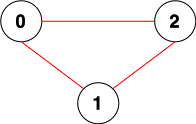

```
输入：n = 3, edges = [[0,1],[0,2],[1,2]]
输出：0
解释：所有点都能互相到达，意味着没有点对无法互相到达，所以我们返回 0 。
```

**示例 2：**


```
输入：n = 7, edges = [[0,2],[0,5],[2,4],[1,6],[5,4]]
输出：14
解释：总共有 14 个点对互相无法到达：
[[0,1],[0,3],[0,6],[1,2],[1,3],[1,4],[1,5],[2,3],[2,6],[3,4],[3,5],[3,6],[4,6],[5,6]]
所以我们返回 14 。
```

 

**提示：**

- `1 <= n <= 105`
- `0 <= edges.length <= 2 * 105`
- `edges[i].length == 2`
- `0 <= ai, bi < n`
- `ai != bi`
- 不会有重复边。

ME: 并查集

```C++
class Solution {
public:
    vector<int> count;
    void init(vector<int> &parent,int n)
    {
        for(int i=0;i<n;i++)
        {
            parent[i]=i;
        }
        count.resize(n,1);
    }
    int find(vector<int> &parent,int a)
    {
        return parent[a]==a?a:parent[a]=find(parent,parent[a]);
    }
    void join(vector<int> &parent,int u,int v)
    {
        u=find(parent,parent[u]);
        v=find(parent,parent[v]);
        if(u==v)return ;
        parent[v]=u;
        count[u]+=count[v];
    }
    long long countPairs(int n, vector<vector<int>>& edges) 
    {
        //并查集，遍历所有的edges,
        vector<int> parent(n,0);
        init(parent,n);
        for(int i=0;i<edges.size();i++)
        {
            join(parent,edges[i][0],edges[i][1]);
        }
        long long res=0;
        for(int i=0;i<n;i++)
        {
            //count[find(parent,i)]：他自己集合有多少个。
            //n-count[find(parent,i)])：多少个和他不连接
            res+=(n-count[find(parent,i)]);
        }
        return res/2;

    }
};
```


### [1319. 连通网络的操作次数](https://leetcode.cn/problems/number-of-operations-to-make-network-connected/)

已解答

中等


相关标签

相关企业


提示


用以太网线缆将 `n` 台计算机连接成一个网络，计算机的编号从 `0` 到 `n-1`。线缆用 `connections` 表示，其中 `connections[i] = [a, b]` 连接了计算机 `a` 和 `b`。

网络中的任何一台计算机都可以通过网络直接或者间接访问同一个网络中其他任意一台计算机。

给你这个计算机网络的初始布线 `connections`，你可以拔开任意两台直连计算机之间的线缆，并用它连接一对未直连的计算机。请你计算并返回使所有计算机都连通所需的最少操作次数。如果不可能，则返回 -1 。 

 

**示例 1：**

**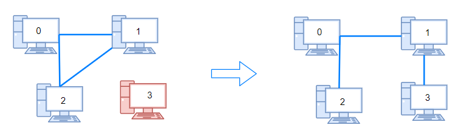**

```
输入：n = 4, connections = [[0,1],[0,2],[1,2]]
输出：1
解释：拔下计算机 1 和 2 之间的线缆，并将它插到计算机 1 和 3 上。
```

**示例 2：**

****

```
输入：n = 6, connections = [[0,1],[0,2],[0,3],[1,2],[1,3]]
输出：2
```

**示例 3：**

```
输入：n = 6, connections = [[0,1],[0,2],[0,3],[1,2]]
输出：-1
解释：线缆数量不足。
```

**示例 4：**

```
输入：n = 5, connections = [[0,1],[0,2],[3,4],[2,3]]
输出：0
```

 

**提示：**

- `1 <= n <= 10^5`
- `1 <= connections.length <= min(n*(n-1)/2, 10^5)`
- `connections[i].length == 2`
- `0 <= connections[i][0], connections[i][1] < n`
- `connections[i][0] != connections[i][1]`
- 没有重复的连接。
- 两台计算机不会通过多条线缆连接。

me 43%

```C++
class Solution {
public:
    void dfs(int a, vector<vector<int>>& connectMap, vector<int>& visited)
    {
        if(!visited[a])visited[a]=1;
        else return;
        for(int i=0;i<connectMap[a].size();i++)
        {
            dfs(connectMap[a][i],connectMap,visited);
        }
    }
    int makeConnected(int n, vector<vector<int>>& connections) 
    {
        //n个计算机只需要n-1 个线即可
        int lineCnt=connections.size();
        if(lineCnt<n-1)
        {
            return -1;
        }
        //问题转化为 求共有几个联通分量
        vector<vector<int>> connectMap(n);
        vector<int> visited(n,0);
        for(int i=0;i<lineCnt;i++)
        {
            connectMap[connections[i][0]].push_back(connections[i][1]);
            connectMap[connections[i][1]].push_back(connections[i][0]);
        }
        int cnt=0;
        for(int i=0;i<n;i++)
        {
            if(!visited[i])
            {
                dfs(i,connectMap,visited);
                cnt++;
            }
        }
        return cnt-1;
    }
};
```


ME  并查集 100%

```C++
class Solution {
public:
    vector<int> parent;
    int t;
    void init()
    {
        for(int i=0;i<parent.size();i++)
        {
            parent[i]=i;
        }
    }
    int find(int a)
    {
        return a==parent[a]?a:parent[a]=find(parent[a]);
    }
    void join(int u,int v)
    {
        u=find(u);
        v=find(v);
        if(u==v)return ;
        parent[v]=u;
        t--;//①
    }
    int makeConnected(int n, vector<vector<int>>& connections) 
    {
        if(connections.size()<n-1)return -1;
        t=n;//
        parent.resize(n);
        init();
        for(int i=0;i<connections.size();i++)
        {
            join(connections[i][0],connections[i][1]);
        }
        return t-1;//

    }
};
```

① 处表示每次join成功且是由新的集合join而来, 那么就减掉一个集合.

如下如b  红色的才是会--的,蓝色的由于已经是一个集合,因此不会减减

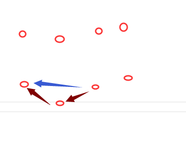

https://leetcode.cn/problems/number-of-operations-to-make-network-connected/solutions/572152/wang-luo-lian-jie-bing-cha-ji-by-yexiso-1nd4/


### [2492. 两个城市间路径的最小分数](https://leetcode.cn/problems/minimum-score-of-a-path-between-two-cities/)

已解答

中等


提示


给你一个正整数 `n` ，表示总共有 `n` 个城市，城市从 `1` 到 `n` 编号。给你一个二维数组 `roads` ，其中 `roads[i] = [ai, bi, distancei]` 表示城市 `ai` 和 `bi` 之间有一条 **双向** 道路，道路距离为 `distancei` 。城市构成的图不一定是连通的。

两个城市之间一条路径的 **分数** 定义为这条路径中道路的 **最小** 距离。

城市 `1` 和城市 `n` 之间的所有路径的 **最小** 分数。

**注意：**

- 一条路径指的是两个城市之间的道路序列。
- 一条路径可以 **多次** 包含同一条道路，你也可以沿着路径多次到达城市 `1` 和城市 `n` 。
- 测试数据保证城市 `1` 和城市`n` 之间 **至少** 有一条路径。

 

**示例 1：**


```
输入：n = 4, roads = [[1,2,9],[2,3,6],[2,4,5],[1,4,7]]
输出：5
解释：城市 1 到城市 4 的路径中，分数最小的一条为：1 -> 2 -> 4 。这条路径的分数是 min(9,5) = 5 。
不存在分数更小的路径。
```

**示例 2：**


```
输入：n = 4, roads = [[1,2,2],[1,3,4],[3,4,7]]
输出：2
解释：城市 1 到城市 4 分数最小的路径是：1 -> 2 -> 1 -> 3 -> 4 。这条路径的分数是 min(2,2,4,7) = 2 。
```

 

**提示：**

- `2 <= n <= 105`
- `1 <= roads.length <= 105`
- `roads[i].length == 3`
- `1 <= ai, bi <= n`
- `ai != bi`
- `1 <= distancei <= 104`
- 不会有重复的边。
- 城市 `1` 和城市 `n` 之间至少有一条路径。

```
//测试数据保证城市 1 和城市n 之间 至少 有一条路径。 保证是联通的
        //城市 1 和城市 n 之间的所有路径的 最小 分数。  感觉是不是这个联通岛屿内 最小的那个边
        //join的时候存储最小边
        //存在dic中？
```


97% 不管下面的

```C++

#include <vector>
#include <algorithm>
#include <limits.h> // for INT_MAX

using namespace std;

class UnionFind {
public:
    vector<int> parent; // 记录节点的父节点
    vector<int> size;   // 每个集合的大小
    int setCount;       // 当前集合的数量

    UnionFind(int n) 
    {
        parent.resize(n);
        size.assign(n, 1); // 初始化每个集合的大小为1
        setCount = n;
        for (int i = 0; i < n; ++i) 
        {
            parent[i] = i; // 初始化每个节点的父节点为其自身
        }
    }

    int find(int x)
     {
        if (parent[x] != x) 
        {
            parent[x] = find(parent[x]); // 路径压缩
        }
        return parent[x];
    }

    void join(int x, int y) 
    {
        int rootX = find(x);
        int rootY = find(y);

        if (rootX != rootY)
         {
            // 按照规模合并，避免树高过高
            if (size[rootX] < size[rootY]) 
            {
                swap(rootX, rootY);
            }
            parent[rootY] = rootX; // 将rootY的父节点设置为rootX
            size[rootX] += size[rootY]; // 更新集合大小
            --setCount; // 合并后集合数减少
        }
    }
};

class Solution {
public:
    int minScore(int n, vector<vector<int>>& roads) {
        UnionFind uf(n + 1); // 创建UnionFind实例
        for (const auto& road : roads) 
        {
            uf.join(road[0], road[1]); // 合并两个节点
        }

        int rootN = uf.find(n); // 找到n的根节点
        int ans = INT_MAX;
        
        for (const auto& road : roads) 
        {
            int x = road[0], y = road[1], dis = road[2];
            if (uf.find(x) == rootN || uf.find(y) == rootN) 
            { // 检查x或y是否与n在同一集合
                ans = min(ans, dis); // 更新最小距离
            }
        }
        return ans == INT_MAX ? -1 : ans; // 如果没有找到，返回-1
    }
};

```

ME93%:

```C++
class Solution {
public:
    vector<int> parent;
    void init(int n)
    {
        parent.resize(n);
        for(int i=0;i<n;i++)parent[i]=i;
    }
    int find(int a)
    {
        return parent[a]==a?a:parent[a]=find(parent[a]);
    }
    void join(int u,int v)
    {
        u=find(u);
        v=find(v);
        if(u==v)return;//别忘了
        parent[v]=u;
    }
    int minScore(int n, vector<vector<int>>& roads) 
    {
        init(n+1);
        for(int i=0;i<roads.size();i++)
        {
            join(roads[i][0],roads[i][1]);
        }
        //找到n所在集合
        int root=find(n);
        int res=INT_MAX;
        for(int i=0;i<roads.size();i++)
        {
            //找到边的任何一点 所在的集合 如果和n一样都是root  判断是否是最小边权重
            if(find(roads[i][0])==root)
            {
                res=min(res,roads[i][2]);
            }
        }
        return res==INT_MAX?-1:res;
    }
};
```


不管下面的


```C++
class Solution {
public:
    vector<int> parent;
    vector<int> unionSize;
    void init(int n)
    {
        parent.resize(n);
        unionSize.assign(n,1);
        for(int i=0;i<n;i++)parent[i]=i;
    }
    int find(int a)
    {
        return parent[a]==a?a:parent[a]=find(parent[a]);
    }
    void join(int u,int v)
    {
        u=find(u);
        v=find(v);
        if(u==v)return;//别忘了
        if(unionSize[v]>unionSize[u])swap(u,v);
        parent[v]=u;
        unionSize[u]+=unionSize[v];
    }
    int minScore(int n, vector<vector<int>>& roads) 
    {
        init(n+1);
        for(int i=0;i<roads.size();i++)
        {
            join(roads[i][0],roads[i][1]);
        }
        int root=find(n);
        int res=INT_MAX;
        for(int i=0;i<roads.size();i++)
        {
            if(find(roads[i][0])==root)
            {
                res=min(res,roads[i][2]);
            }
        }
        return res==INT_MAX?-1:res;
    }
};
```


### [3387. 两天自由外汇交易后的最大货币数](https://leetcode.cn/problems/maximize-amount-after-two-days-of-conversions/)

中等


提示


给你一个字符串 `initialCurrency`，表示初始货币类型，并且你一开始拥有 `1.0` 单位的 `initialCurrency`。

另给你四个数组，分别表示货币对（字符串）和汇率（实数）：

- `pairs1[i] = [startCurrencyi, targetCurrencyi]` 表示在 **第 1 天**，可以按照汇率 `rates1[i]` 将 `startCurrencyi` 转换为 `targetCurrencyi`。
- `pairs2[i] = [startCurrencyi, targetCurrencyi]` 表示在 **第 2 天**，可以按照汇率 `rates2[i]` 将 `startCurrencyi` 转换为 `targetCurrencyi`。
- 此外，每种 `targetCurrency` 都可以以汇率 `1 / rate` 转换回对应的 `startCurrency`。

你可以在 **第 1 天** 使用 `rates1` 进行任意次数的兑换（包括 0 次），然后在 **第 2 天** 使用 `rates2` 再进行任意次数的兑换（包括 0 次）。

返回在两天兑换后，最大可能拥有的 `initialCurrency` 的数量。

**注意：**汇率是有效的，并且第 1 天和第 2 天的汇率之间相互独立，不会产生矛盾。

 

**示例 1：**

**输入：** initialCurrency = "EUR", pairs1 = [["EUR","USD"],["USD","JPY"]], rates1 = [2.0,3.0], pairs2 = [["JPY","USD"],["USD","CHF"],["CHF","EUR"]], rates2 = [4.0,5.0,6.0]

**输出：** 720.00000

**解释：**

根据题目要求，需要最大化最终的 **EUR** 数量，从 1.0 **EUR** 开始：

- 第 1 天：
  - 将 **EUR** 换成 **USD**，得到 2.0 **USD**。
  - 将 **USD** 换成 **JPY**，得到 6.0 **JPY**。
- 第 2 天：
  - 将 **JPY** 换成 **USD**，得到 24.0 **USD**。
  - 将 **USD** 换成 **CHF**，得到 120.0 **CHF**。
  - 最后将 **CHF** 换回 **EUR**，得到 720.0 **EUR**。

**示例 2：**

**输入：** initialCurrency = "NGN", pairs1 = [["NGN","EUR"]], rates1 = [9.0], pairs2 = [["NGN","EUR"]], rates2 = [6.0]

**输出：** 1.50000

**解释：**

在第 1 天将 **NGN** 换成 **EUR**，并在第 2 天用反向汇率将 **EUR** 换回 **NGN**，可以最大化最终的 **NGN** 数量。

**示例 3：**

**输入：** initialCurrency = "USD", pairs1 = [["USD","EUR"]], rates1 = [1.0], pairs2 = [["EUR","JPY"]], rates2 = [10.0]

**输出：** 1.00000

**解释：**

在这个例子中，不需要在任何一天进行任何兑换。

 

**提示：**

- `1 <= initialCurrency.length <= 3`
- `initialCurrency` 仅由大写英文字母组成。
- `1 <= n == pairs1.length <= 10`
- `1 <= m == pairs2.length <= 10`
- `pairs1[i] == [startCurrencyi, targetCurrencyi]`
- `pairs2[i] == [startCurrencyi, targetCurrencyi]`
- `1 <= startCurrencyi.length, targetCurrencyi.length <= 3`
- `startCurrencyi` 和 `targetCurrencyi` 仅由大写英文字母组成。
- `rates1.length == n`
- `rates2.length == m`
- `1.0 <= rates1[i], rates2[i] <= 10.0`
- 输入保证两个转换图在各自的天数中没有矛盾或循环。
- 输入保证输出 **最大** 为 `5 * 1010`。


第一天 算A到所有货币的价值

第二天，枚举从所有货币出发算到A的价值

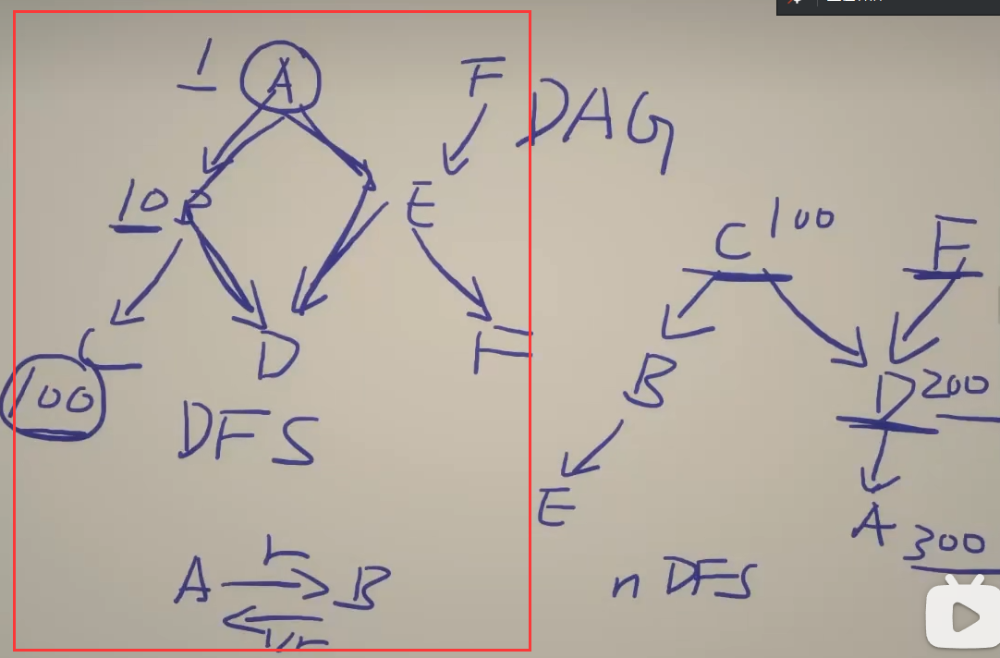


下标1是第一天，2是第二天

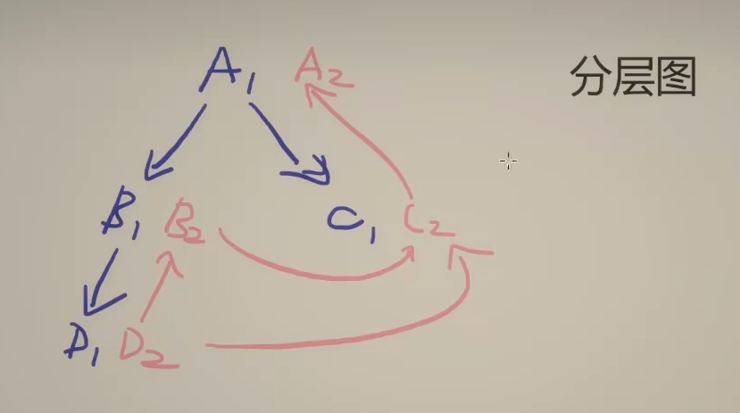

加一条边表示二者之间的转换关系   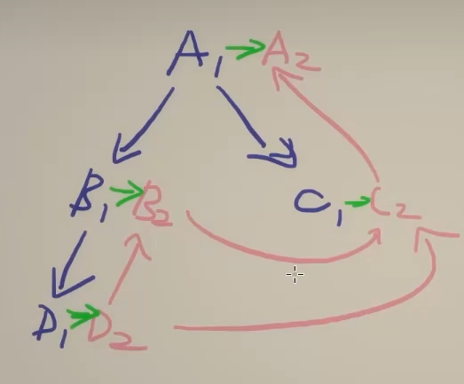

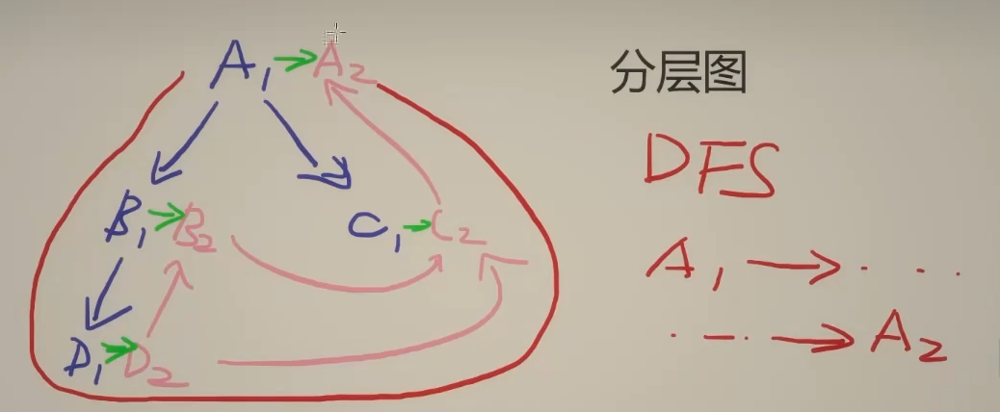

如果是3天以上可以用这个办法 但是后面的代码依旧是用的两次DFS


```C++
        //initialCurrency = "EUR", 
        //pairs1 = [["EUR","USD"],["USD","JPY"]], 
        //rates1 = [2.0,            3.0], 
        //pairs2 = [["JPY","USD"],["USD","CHF"],["CHF","EUR"]], 
        //rates2 = [4.0,            5.0,            6.0]
```


------------------------

第一天 算A到所有货币的价值

第二天，枚举从所有货币出发算到A的价值


下标1是第一天，2是第二天


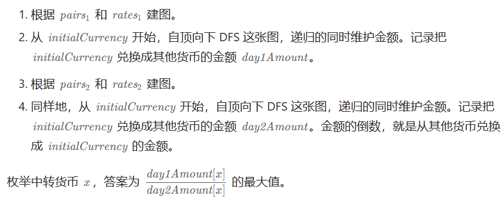

```C++
class Solution {
public:
    // maxAmount 方法计算通过两天的货币兑换能获得的最大金额
    double maxAmount(string initialCurrency, vector<vector<string>>& pairs1, vector<double>& rates1, vector<vector<string>>& pairs2, vector<double>& rates2) 
    {
        // 计算通过兑换对得到的货币金额  返回unordered_map<string, double>
        auto calc_amount = [&](vector<vector<string>>& pairs, vector<double>& rates) 
        {
            // 构建一个图：每个货币与其他货币的兑换关系
            unordered_map<string, vector<pair<string, double>>> g;

            // 遍历所有的货币兑换对，构建双向图（每对货币互为邻接节点）
            for (int i = 0; i < pairs.size(); i++) 
            {
                auto& p = pairs[i];  // 获取当前货币兑换对
                double r = rates[i];  // 获取当前兑换对的汇率
                // 将正向和反向的货币兑换关系添加到图 g 中
                g[p[0]].emplace_back(p[1], r);      // p[0] 到 p[1] 的汇率是 r
                g[p[1]].emplace_back(p[0], 1 / r);  // p[1] 到 p[0] 的汇率是 1/r
            }

            // 存储每种货币的金额
            unordered_map<string, double> amount;

            // 深度优先搜索（DFS）函数，计算从初始货币开始的所有货币金额
            auto dfs = [&](this auto&& dfs, const string& x, double cur_amount) -> void 
            {
                // 记录当前货币的金额
                amount[x] = cur_amount;
                // 遍历当前货币与其他货币的兑换关系
                for (auto& [to, rate] : g[x]) 
                {
                    // 如果目标货币没有被访问过，则进行递归计算 
                    // 每个节点只需递归一次（重复递归算出来的结果是一样的，因为题目保证汇率没有矛盾）
                    if (!amount.contains(to)) 
                    {
                        dfs(dfs, to, cur_amount * rate); // 递归计算目标货币的金额
                    }
                }
            };
            // 从初始货币开始，假设初始金额是1
            dfs(dfs, initialCurrency, 1);
            return amount;  // 返回所有货币的金额
        };

        // 计算第一天和第二天的货币金额
        auto day1_amount = calc_amount(pairs1, rates1); 
        auto day2_amount = calc_amount(pairs2, rates2);

        // 找到两天汇率转换后能获得的最大金额
        double ans = 0;
        for (auto& [x, a2] : day2_amount)  // 遍历第二天的所有货币
        {
            // 计算通过第一天货币金额除以第二天的金额，得到利润
            if (day1_amount.find(x) != day1_amount.end())  // 如果第一天也有这种货币
            {
                ans = max(ans, day1_amount[x] / a2);  // 更新最大利润
            }
        }
        return ans;  // 返回最大利润
    }
};

```


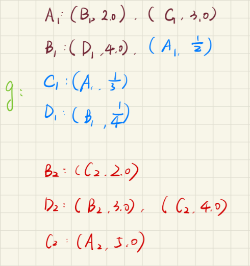

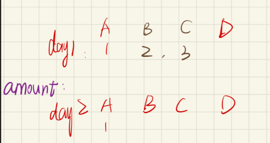


写得更易读一点：

```C++
class Solution {
public:
    // 深度优先搜索（DFS）函数，计算从初始货币开始的所有货币金额
    void dfs(const string& x,double cur_amount,unordered_map<string, double>& amount,unordered_map<string, vector<pair<string, double>>>& g)
    {
        // 记录当前货币的金额
        amount[x] = cur_amount;
        // 遍历当前货币与其他货币的兑换关系
        for (auto& [to, rate] : g[x]) 
        {
            // 如果目标货币没有被访问过，则进行递归计算
            // 每个节点只需递归一次（重复递归算出来的结果是一样的，因为题目保证汇率没有矛盾）
            if (!amount.contains(to))
            {
                dfs(to, cur_amount * rate,amount,g); // 递归计算目标货币的金额
            }
        }
    };
    // 计算通过兑换对得到的货币金额
    unordered_map<string, double> calc_amount(string initialCurrency,
                                              vector<vector<string>>& pairs,
                                              vector<double>& rates) 
                                              {
        // 构建一个图：每个货币与其他货币的兑换关系
        unordered_map<string, vector<pair<string, double>>> g;

        // 遍历所有的货币兑换对，构建双向图（每对货币互为邻接节点）
        for (int i = 0; i < pairs.size(); i++) 
        {
            auto& p = pairs[i];  // 获取当前货币兑换对
            double r = rates[i]; // 获取当前兑换对的汇率
            // 将正向和反向的货币兑换关系添加到图 g 中
            g[p[0]].emplace_back(p[1], r);     // p[0] 到 p[1] 的汇率是 r
            g[p[1]].emplace_back(p[0], 1 / r); // p[1] 到 p[0] 的汇率是 1/r
        }

        // 存储每种货币的金额
        unordered_map<string, double> amount;

        // 从初始货币开始，假设初始金额是1
        dfs(initialCurrency, 1,amount,g);
        return amount; // 返回所有货币的金额
    };
    // maxAmount 方法计算通过两天的货币兑换能获得的最大金额
    double maxAmount(string initialCurrency, vector<vector<string>>& pairs1,
                     vector<double>& rates1, vector<vector<string>>& pairs2,
                     vector<double>& rates2) 
                     {

        // 计算第一天和第二天的货币金额
        unordered_map<string, double> day1_amount = calc_amount(initialCurrency, pairs1, rates1);
        unordered_map<string, double> day2_amount = calc_amount(initialCurrency, pairs2, rates2);

        // 找到两天汇率转换后能获得的最大金额
        double ans = 0;
        for (auto& [x, a2] : day2_amount) // 遍历第二天的所有货币
        {
            // 计算通过第一天货币金额除以第二天的金额，得到利润
            if (day1_amount.find(x) !=
                day1_amount.end()) // 如果第一天也有这种货币
            {
                ans = max(ans, day1_amount[x] / a2); // 更新最大利润
            }
        }
        return ans; // 返回最大利润
    }
};
```

ME：85%

```C++
class Solution {
public:
        //initialCurrency = "EUR", 
        //pairs1 = [["EUR","USD"],["USD","JPY"]], 
        //rates1 = [2.0,            3.0], 
        //pairs2 = [["JPY","USD"],["USD","CHF"],["CHF","EUR"]], 
        //rates2 = [4.0,            5.0,            6.0]
    void dfs(string a,double CurrencyAmount,unordered_map<string,vector<pair<string,double>>> &g,unordered_map<string,double> &amount)
    {
        amount[a]=CurrencyAmount;
        vector<pair<string,double>> gg=g[a];//(B,2),(C,1)
        // for(pair<string,double> pa:gg)
        for(auto pa:gg)
        {
            if(!amount.contains(pa.first))
                dfs(pa.first,CurrencyAmount*pa.second,g,amount);
        }
    }
    //cal_amount A:
    unordered_map<string ,double> cal_amount(string initialCurrency, vector<vector<string>>& pairs, vector<double>& rates)
    {
        //构建邻接表 A:(B,2),(C,1)
        unordered_map<string,vector<pair<string,double>>> g;
        for(int i=0;i<pairs.size();i++)
        {
            g[pairs[i][0]].emplace_back(pairs[i][1],rates[i]);
            g[pairs[i][1]].emplace_back(pairs[i][0],1/rates[i]);
        }
        unordered_map<string,double> amount;
        dfs(initialCurrency,1,g,amount);
        return amount;
    }
    
    double maxAmount(string initialCurrency, vector<vector<string>>& pairs1, vector<double>& rates1, vector<vector<string>>& pairs2, vector<double>& rates2) 
    {
        unordered_map<string ,double> day1amount=cal_amount(initialCurrency,pairs1,rates1);
        unordered_map<string ,double> day2amount=cal_amount(initialCurrency,pairs2,rates2);
        double res=1;
        for(pair<string,double> p:day2amount)
        {
            if(day1amount.find(p.first)!=day1amount.end())
            {
                res=max(res,day1amount[p.first]/p.second);
            }
        }
        return res;
    }
};
```


1. **捕获列表 `[&]`**：
   - `[&]` 表示捕获外部所有变量的引用，意味着 `calc_amount` 函数可以访问并修改在外部定义的变量（如 `pairs`, `rates` 等）。

#### 代码整体框架

我们有一个类 `Solution`，其中有一个方法 `maxAmount`，该方法的输入参数包括：

- `initialCurrency`：初始货币。
- `pairs1` 和 `rates1`：第一天的货币兑换对及对应汇率。
- `pairs2` 和 `rates2`：第二天的货币兑换对及对应汇率。

这个方法的目的是通过两天的汇率转换，找到最大可以兑换到的金额。

#### 方法 `maxAmount` 的步骤：

1. **定义了一个辅助函数 `calc_amount`**：
   - 该函数负责计算在给定汇率转换对下，从初始货币开始经过兑换后的最终金额。
2. **计算两天的汇率金额**：
   - 对于第一天和第二天，分别调用 `calc_amount` 函数计算从初始货币开始，在两天内能得到的金额。
3. **计算最大金额**：
   - 最后，通过比较两天后可以得到的金额，找到能得到的最大值。

#### 详细解释：

##### `calc_amount` 函数

`calc_amount` 函数的作用是根据给定的汇率兑换信息，计算从初始货币开始，通过多次兑换得到的所有货币的最终金额。

```C++
cppCopy code
auto calc_amount = [&](vector<vector<string>>& pairs, vector<double>& rates) 
```

- 这里定义了一个 lambda 函数，输入是汇率兑换对 `pairs` 和对应的汇率 `rates`，返回从初始货币开始，通过兑换得到的所有货币的金额。

###### 1. 构建图 `g`：

```C++
cppCopy code
unordered_map<string, vector<pair<string, double>>> g;
```

- 使用一个 `unordered_map` 来存储货币间的转换关系。键是货币的名称，值是该货币与其他货币的转换信息。

```C++
cppCopy codefor (int i = 0; i < pairs.size(); i++) 
{
    auto& p = pairs[i];
    double r = rates[i];
    g[p[0]].emplace_back(p[1], r);
    g[p[1]].emplace_back(p[0], 1 / r);
}
```

- 遍历所有的货币兑换对

   

  ```C++
  pairs
  ```

   

  和对应的汇率

   

  ```C++
  rates
  ```

  ，将每对货币之间的兑换关系添加到图

   

  ```C++
  g
  ```

   

  中。

  - `g[p[0]].emplace_back(p[1], r)` 表示从 `p[0]` 到 `p[1]` 的汇率是 `r`。
  - `g[p[1]].emplace_back(p[0], 1 / r)` 表示从 `p[1]` 到 `p[0]` 的汇率是 `1 / r`（汇率的倒数）。

###### 2. 深度优先搜索（DFS）：

```C++
cppCopy codeauto dfs = [&](this auto&& dfs, const string& x, double cur_amount) -> void 
{
    amount[x] = cur_amount;
    for (auto& [to, rate] : g[x]) 
    {
        if (!amount.contains(to)) 
        {
            dfs(to, cur_amount * rate);
        }
    }
};
```

- `dfs` 是一个递归函数，用来遍历图 `g` 中的节点。它的作用是计算从当前货币 `x` 出发，通过递归计算每个可能到达的货币的金额。
- `amount[x] = cur_amount;` 将当前货币的金额记录下来。
- 对于每个相邻的货币 `to`，如果 `to` 还没有计算过（即 `amount` 中没有该货币的金额），就递归计算该货币的金额，金额是当前货币金额乘以汇率。

###### 3. 返回金额：

```C++
cppCopy codedfs(initialCurrency, 1);
return amount;
```

- 从初始货币 `initialCurrency` 开始，假设初始金额是 `1`，通过递归计算所有货币的金额，并将结果存储在 `amount` 中。

##### 计算最大金额

```C++
cppCopy codeauto day1_amount = calc_amount(pairs1, rates1);
auto day2_amount = calc_amount(pairs2, rates2);
```

- `calc_amount` 被调用两次，分别计算第一天和第二天能得到的所有货币金额。

```C++
cppCopy codedouble ans = 0;
for (auto& [x, a2] : day2_amount)
{
    ans = max(ans, day1_amount[x] / a2);
}
```

- 遍历第二天的所有货币 `day2_amount`，找到每种货币 `x`，然后计算在第一天的金额除以第二天对应的金额。这个值代表通过两天兑换后的利润，找出最大的一个值。

```C++
cppCopy code
return ans;
```

- 最终返回最大值，即最大兑换利润。

#### 总结：

- 代码实现了两天的货币兑换后，计算最大能得到的金额。核心思想是通过图和 DFS 来遍历所有货币的兑换路径，并计算每条路径的金额。


[2192. 有向无环图中一个节点的所有祖先](https://leetcode.cn/problems/all-ancestors-of-a-node-in-a-directed-acyclic-graph/)

已解答

中等


相关标签

相关企业


提示


给你一个正整数 `n` ，它表示一个 **有向无环图** 中节点的数目，节点编号为 `0` 到 `n - 1` （包括两者）。

给你一个二维整数数组 `edges` ，其中 `edges[i] = [fromi, toi]` 表示图中一条从 `fromi` 到 `toi` 的单向边。

请你返回一个数组 `answer`，其中 `answer[i]`是第 `i` 个节点的所有 **祖先** ，这些祖先节点 **升序** 排序。

如果 `u` 通过一系列边，能够到达 `v` ，那么我们称节点 `u` 是节点 `v` 的 **祖先** 节点。

 

**示例 1：**


```
输入：n = 8, edgeList = [[0,3],[0,4],[1,3],[2,4],[2,7],[3,5],[3,6],[3,7],[4,6]]
输出：[[],[],[],[0,1],[0,2],[0,1,3],[0,1,2,3,4],[0,1,2,3]]
解释：
上图为输入所对应的图。
- 节点 0 ，1 和 2 没有任何祖先。
- 节点 3 有 2 个祖先 0 和 1 。
- 节点 4 有 2 个祖先 0 和 2 。
- 节点 5 有 3 个祖先 0 ，1 和 3 。
- 节点 6 有 5 个祖先 0 ，1 ，2 ，3 和 4 。
- 节点 7 有 4 个祖先 0 ，1 ，2 和 3 。
```

**示例 2：**


```
输入：n = 5, edgeList = [[0,1],[0,2],[0,3],[0,4],[1,2],[1,3],[1,4],[2,3],[2,4],[3,4]]
输出：[[],[0],[0,1],[0,1,2],[0,1,2,3]]
解释：
上图为输入所对应的图。
- 节点 0 没有任何祖先。
- 节点 1 有 1 个祖先 0 。
- 节点 2 有 2 个祖先 0 和 1 。
- 节点 3 有 3 个祖先 0 ，1 和 2 。
- 节点 4 有 4 个祖先 0 ，1 ，2 和 3 。
```

 

**提示：**

- `1 <= n <= 1000`
- `0 <= edges.length <= min(2000, n * (n - 1) / 2)`
- `edges[i].length == 2`
- `0 <= fromi, toi <= n - 1`
- `fromi != toi`
- 图中不会有重边。
- 图是 **有向** 且 **无环** 的。


### [2192. 有向无环图中一个节点的所有祖先](https://leetcode.cn/problems/all-ancestors-of-a-node-in-a-directed-acyclic-graph/)

已解答

中等


相关标签

相关企业


提示


给你一个正整数 `n` ，它表示一个 **有向无环图** 中节点的数目，节点编号为 `0` 到 `n - 1` （包括两者）。

给你一个二维整数数组 `edges` ，其中 `edges[i] = [fromi, toi]` 表示图中一条从 `fromi` 到 `toi` 的单向边。

请你返回一个数组 `answer`，其中 `answer[i]`是第 `i` 个节点的所有 **祖先** ，这些祖先节点 **升序** 排序。

如果 `u` 通过一系列边，能够到达 `v` ，那么我们称节点 `u` 是节点 `v` 的 **祖先** 节点。

 

**示例 1：**


```
输入：n = 8, edgeList = [[0,3],[0,4],[1,3],[2,4],[2,7],[3,5],[3,6],[3,7],[4,6]]
输出：[[],[],[],[0,1],[0,2],[0,1,3],[0,1,2,3,4],[0,1,2,3]]
解释：
上图为输入所对应的图。
- 节点 0 ，1 和 2 没有任何祖先。
- 节点 3 有 2 个祖先 0 和 1 。
- 节点 4 有 2 个祖先 0 和 2 。
- 节点 5 有 3 个祖先 0 ，1 和 3 。
- 节点 6 有 5 个祖先 0 ，1 ，2 ，3 和 4 。
- 节点 7 有 4 个祖先 0 ，1 ，2 和 3 。
```

**示例 2：**


```
输入：n = 5, edgeList = [[0,1],[0,2],[0,3],[0,4],[1,2],[1,3],[1,4],[2,3],[2,4],[3,4]]
输出：[[],[0],[0,1],[0,1,2],[0,1,2,3]]
解释：
上图为输入所对应的图。
- 节点 0 没有任何祖先。
- 节点 1 有 1 个祖先 0 。
- 节点 2 有 2 个祖先 0 和 1 。
- 节点 3 有 3 个祖先 0 ，1 和 2 。
- 节点 4 有 4 个祖先 0 ，1 ，2 和 3 。
```

 

**提示：**

- `1 <= n <= 1000`
- `0 <= edges.length <= min(2000, n * (n - 1) / 2)`
- `edges[i].length == 2`
- `0 <= fromi, toi <= n - 1`
- `fromi != toi`
- 图中不会有重边。
- 图是 **有向** 且 **无环** 的。


#### 逆向dfs

dfs逆向 ME DS注释 80%

```C++
#include <vector>
#include <algorithm>

class Solution {
public:
    void dfs(vector<vector<int>> &Ancestors, int grandChild, int a, vector<vector<int>>& adjList, vector<bool> &visited) {
        if (grandChild != a) 
        {
            Ancestors[grandChild].push_back(a); // 直接插入
        }
        visited[a] = true; // 标记为已访问
        for (int i = 0; i < adjList[a].size(); i++) 
        {
            if (!visited[adjList[a][i]]) 
            { // 只访问未访问的节点
                dfs(Ancestors, grandChild, adjList[a][i], adjList, visited);
            }
        }
    }

    vector<vector<int>> getAncestors(int n, vector<vector<int>>& edges) 
    {
        // 构建邻接表
        vector<vector<int>> adjList(n);
        for (int i = 0; i < edges.size(); i++) 
        {
            adjList[edges[i][1]].push_back(edges[i][0]);
        }

        // 初始化 Ancestors
        vector<vector<int>> Ancestors(n);

        // 对每个节点进行 DFS
        for (int i = 0; i < n; i++) 
        {
            vector<bool> visited(n, false); // 每次 DFS 前重置 visited
            dfs(Ancestors, i, i, adjList, visited);
        }

        // 对每个节点的祖先列表进行升序排序
        for (int i = 0; i < n; i++) 
        {
            sort(Ancestors[i].begin(), Ancestors[i].end());
        }

        return Ancestors;
    }
};
```


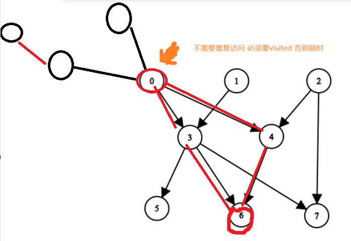


#### 拓扑排序

拓扑排序 只有当入度为0时执行它

https://zhuanlan.zhihu.com/p/135094687

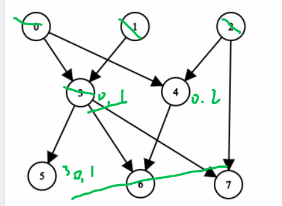

不知道为啥只有百分之20几

```C++
#include <vector>
#include <queue>
#include <set>

class Solution {
public:
    vector<vector<int>> getAncestors(int n, vector<vector<int>>& edges) {
        // 构建邻接表和入度表
        vector<vector<int>> adjList(n);
        vector<int> inDegree(n, 0);
        for (const auto& edge : edges) 
        {
            adjList[edge[0]].push_back(edge[1]);
            inDegree[edge[1]]++;
        }

        // 使用 set 存储祖先节点
        vector<unordered_set<int>> Ancestors(n);

        // 拓扑排序
        queue<int> q;
        for (int i = 0; i < n; i++) 
        {
            if (inDegree[i] == 0) 
            {
                q.push(i);
            }
        }

        while (!q.empty()) 
        {
            int u = q.front();
            q.pop();
            for (int v : adjList[u]) 
            {
                // 将 u 及其祖先合并到 v
                Ancestors[v].insert(u);
                Ancestors[v].insert(Ancestors[u].begin(), Ancestors[u].end());
                if (--inDegree[v] == 0) 
                {
                    q.push(v);
                }
            }
        }

        // 将 set 转换为 vector
        vector<vector<int>> result(n);
        for (int i = 0; i < n; i++)
        {
            result[i] = vector<int>(Ancestors[i].begin(), Ancestors[i].end());
            sort(result[i].begin(), result[i].end());
        }

        return result;
    }
};
```

## 二、拓扑排序


把拓扑排序想象成一个黑盒，给它一堆杂乱的先修课约束，它会给你一个井井有条的课程学习安排。

这一种在图上的「排序」，可以把杂乱的点排列一排。

前提条件是图中无环，从而保证每条边是从排在前面的点，指向排在后面的点。

## §2.1 拓扑排序
学习拓扑排序前，请先完成 1557. 可以到达所有点的最少点数目，有助于理解拓扑排序。

### [1557. 可以到达所有点的最少点数目](https://leetcode.cn/problems/minimum-number-of-vertices-to-reach-all-nodes/)

中等

提示


给你一个 **有向无环图** ， `n` 个节点编号为 `0` 到 `n-1` ，以及一个边数组 `edges` ，其中 `edges[i] = [fromi, toi]` 表示一条从点 `fromi` 到点 `toi` 的有向边。

找到最小的点集使得从这些点出发能到达图中所有点。题目保证解存在且唯一。

你可以以任意顺序返回这些节点编号。

 

**示例 1：**


```
输入：n = 6, edges = [[0,1],[0,2],[2,5],[3,4],[4,2]]
输出：[0,3]
解释：从单个节点出发无法到达所有节点。从 0 出发我们可以到达 [0,1,2,5] 。从 3 出发我们可以到达 [3,4,2,5] 。所以我们输出 [0,3] 。
```

**示例 2：**


```
输入：n = 5, edges = [[0,1],[2,1],[3,1],[1,4],[2,4]]
输出：[0,2,3]
解释：注意到节点 0，3 和 2 无法从其他节点到达，所以我们必须将它们包含在结果点集中，这些点都能到达节点 1 和 4 。
```

 

**提示：**

- `2 <= n <= 10^5`
- `1 <= edges.length <= min(10^5, n * (n - 1) / 2)`
- `edges[i].length == 2`
- `0 <= fromi, toi < n`
- 所有点对 `(fromi, toi)` 互不相同。
