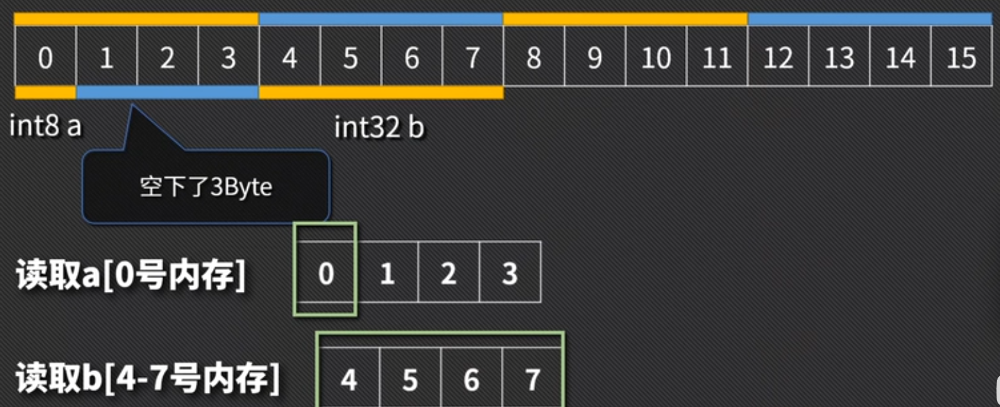

# 内存对齐

\PrepareForWorkNotes\2025寒假\Y\note\知识点\内存对齐

粗略理解：

为了内存获取速度更快

CPU访问的时候是一组一组的访问

以下访问b时，只访问了1次。



以下访问b时，访问了2次。然后再拼在一起


CPU访问内存速度很慢，尽量不要让它访问多次。


更深刻理解：

【【Golang】这个内存对齐呀！？】 https://www.bilibili.com/video/BV1Ja4y1i7AF/?share_source=copy_web&vd_source=067de257d5f13e60e5b36da1a0ec151e


## 原理


>#### **1. 地址总线（Address Bus）**
>
>- **作用**：传输内存地址，告诉内存“CPU要访问哪个位置的数据”。
>  - 相当于快递单号，告诉快递员去哪个地址取包裹。下单在上海某公司买个立牌
>- **位宽决定寻址空间**：
>  - 如果地址总线有8根（8位），能表示的地址范围是 `0~255`（共256个地址），每个地址对应1字节内存，因此最大寻址空间为 **256字节**。
>  - 若地址总线是32位，可表示 `0~2^32-1` 个地址，每个地址对应1字节，寻址空间为 **4GB**（`2^32 字节 = 4,294,967,296 字节 ≈ 4GB`）。
>
>#### **2. 数据总线（Data Bus）**
>
>- **作用**：传输数据内容，告诉CPU“内存返回的具体数据是什么”。
>  - 相当于快递员把包裹从指定地址运回来。从上海把立牌寄过来
>- **位宽决定单次传输量**：
>  - 如果数据总线是32位，一次可传输 **4字节**（`32位 ÷ 8位/字节 = 4字节`）。
>  - 如果是64位，一次可传输 **8字节**。
>
>#### **3. 机器字长**
>
>- **定义**：CPU一次能处理的数据位数，通常等于数据总线的位宽。
>  - 32位CPU → 数据总线32位 → 单次操作4字节。
>  - 64位CPU → 数据总线64位 → 单次操作8字节。
>- **为什么重要**：
>  - 字长越大，单次处理的数据量越大，性能越高。
>  - 例如：64位CPU处理8字节数据比32位CPU快一倍（假设操作次数相同）。
>
>
>
>------
>
>### **类比理解**
>
>1. **地址总线**：
>   - 类似“楼层房间号”，告诉服务员去哪个房间取东西。
>   - 房间号位数越多（地址总线越宽），能管理的房间（内存地址）越多。
>2. **数据总线**：
>   - 类似“货梯容量”，决定一次能搬运多少东西。
>   - 货梯越大（数据总线越宽），单次搬运的货物（数据）越多。
>3. **机器字长**：
>   - 类似“工人的体力”，决定工人一次能搬多少货物。
>   - 体力越好（字长越大），工作效率越高。
>
>------
>
>### **示例场景**
>
>- **32位系统**：
>  - 地址总线32位 → 能管理4GB内存。
>  - 数据总线32位 → 一次读写4字节。
>- **64位系统**：
>  - 地址总线64位 → 能管理海量内存（理论16EB）。
>  - 数据总线64位 → 一次读写8字节。
>
>### **常见问题**
>
>1. **为什么数据总线宽度要和字长一致？**
>   - CPU的设计需要匹配数据总线的能力，否则会浪费性能。例如，64位CPU配32位数据总线，相当于工人有搬8箱的体力，但每次只能搬4箱。
>2. **地址总线和数据总线可以不同宽度吗？**
>   - 可以。例如，早期8086 CPU是16位字长（数据总线16位），但地址总线20位，能寻址1MB内存（`2^20 = 1,048,576 字节`）。
>
>

CPU想要读取内存的话，需要通过地址总线，将地址传输给内存。（RAM即物理内存）


内存准备好数据，输出到 数据总线，交给CPU


如果地址总线只有8根，那么这个地址就只有8位，可以表示256个地址<（0000 0000 - 1111 1111）=（0-255）>。因为表示不了更多的地址，就用不到更大的内存。

8根地址总线能寻址的最大空间是256字节

（每个地址对应1字节=8位内存，同一个地址在8块chips上找)

要使用更大的内存，比如4G，就要使用更宽的地址总线


每次操作一个字节太慢，就加宽数据总线。

要想每次操作4字节，就需要32位数据总线。8字节就要64位。

这里每次操作的字节数， 就是机器字长


实际上的内存：

一个内存条的一面是1个Rank，

一个Rank有8个Chip，

一个Chip包括8个Bank


到Bank这里就可以通过选择行，选择列来定位一个地址了。


这不像我们逻辑上认为的连续的存在，但他们共用同一个地址A，各自选择同一个位置的同一个字节（A+偏移），再组合起来，作为我们逻辑上认为的连续8个字节。（下面的①有更清晰的解释）

通过这样的并行操作，提高了内存访问的效率。但如果使用这种设计，这里的**地址就只能是8的倍数**


如果想访问任意地址，那么就需要读取两个再拼接起来


内存对齐要求**1、数据存储地址**，以及**2、占用的字节数**都要是**它对其边界**的**倍数** 


**不同Chip的同一行同一列对应的逻辑地址不同。**

>（①）
>
>### **不同Chip的同一行同一列对应的逻辑地址不同。**
>
>---
>
>### **结论：是的，不同Chip的同一行同一列对应的逻辑地址不同。**
>
>---
>
>### **详细解释**
>
>#### **1. 内存地址的分解**
>现代内存系统中，**逻辑地址**会被拆解为多个部分，用于定位到具体的物理存储单元。以64位内存（8个Chip，每个Chip提供1字节）为例：
>- **逻辑地址**（例如`0x1003`）会被分解为：
>  - **高位地址**（如`0x1000`）：用于选择行（Row）和列（Column）。  
>  - **最低3位**（如`0x3`）：用于选择具体是哪个Chip（即数据在8字节块中的偏移）。
>
>#### **2. Chip的职责**
>每个Chip负责存储整个内存地址空间中的 **一个字节**。例如：
>- **Chip0**：负责所有地址中最低3位为`000`的字节（如`0x1000`, `0x1008`, `0x1010`...）。  
>- **Chip1**：负责所有地址中最低3位为`001`的字节（如`0x1001`, `0x1009`, `0x1011`...）。  
>- ...  
>- **Chip7**：负责所有地址中最低3位为`111`的字节（如`0x1007`, `0x100F`, `0x1017`...）。
>
>#### **3. 同一行同一列在不同Chip中的逻辑地址**
>假设所有Chip的同一行同一列被访问：
>- **行/列地址**：对应高位地址（如`0x1000`）。  
>- **每个Chip的物理位置**：  
>  - Chip0 → 逻辑地址`0x1000`（行/列地址 + 偏移0）。  
>  - Chip1 → 逻辑地址`0x1001`（行/列地址 + 偏移1）。  
>  - ...  
>  - Chip7 → 逻辑地址`0x1007`（行/列地址 + 偏移7）。  
>
>**关键点**：  
>虽然所有Chip接收相同的行/列地址，但它们实际存储的是 **不同逻辑地址的字节**。每个Chip的同一行同一列对应不同的逻辑地址。
>
>---
>
>### **示意图**
>```
>逻辑地址空间：
>0x1000 0x1001 0x1002 0x1003 0x1004 0x1005 0x1006 0x1007
>   |      |      |      |      |      |      |      |
>Chip0  Chip1  Chip2  Chip3  Chip4  Chip5  Chip6  Chip7
>```
>- **所有Chip的同一行同一列**对应逻辑地址`0x1000~0x1007`，但每个Chip负责其中一个字节。
>
>---
>
>### **例子**
>假设访问地址`0x1003`：
>1. **地址分解**：  
>   - 高位地址：`0x1000`（选择行/列）。  
>   - 最低3位：`0x3`（选择Chip3）。  
>2. **操作**：  
>   - 所有Chip接收到行/列地址`0x1000`。  
>   - Chip3返回`0x1003`的字节，其他Chip返回`0x1000~0x1007`中各自负责的字节。  
>3. **输出**：  
>   - 若读取单字节，只取Chip3的数据（`0x1003`）。  
>   - 若读取8字节对齐块（`0x1000~0x1007`），合并所有Chip的数据。
>
>---
>
>### **为什么说“同一行同一列对应不同地址”？**
>- **从硬件视角**：所有Chip共享相同的行/列地址，但它们存储的是不同逻辑地址的字节。  
>- **从逻辑地址视角**：同一行同一列在不同Chip中对应连续的逻辑地址（如`0x1000~0x1007`）。
>
>---
>
>### **总结**
>- 不同Chip的同一行同一列 **对应不同的逻辑地址**（如Chip0→`0x1000`，Chip1→`0x1001`）。  
>- 这是通过地址的最低3位选择Chip实现的，使得内存系统能并行访问多个Chip，提升吞吐量。  
>- 对齐到8字节的地址（如`0x1000`）可以单次读取所有Chip的数据，而未对齐地址（如`0x1003`）需要两次操作。


>--------------
>
>虽然提供的是同一个访问地址给chip 但是chip实际上每个chip负责同一行同一列负责的是不同的地址位置，
>
>比如目标地址：0x1003，那么给到各个chip，其实他们访问的“Chip0: 0x1000   Chip1: 0x1001   ...   Chip7: 0x1007  ”是这些地址 对吗 
>
>只是相当于连续的地址放在了不连续的chip中？
>
>你的理解非常接近正确！我来更清晰地梳理这个概念：
>
>---
>
>### **核心机制：地址到Chip的映射**
>内存系统会将一个 **逻辑地址** 分解为多个部分，其中一部分用于选择具体的Chip。以64位内存（8个Chip，每个Chip提供1字节）为例：
>
>- **地址分解示例**：  
>  假设访问地址为`0x1003`（二进制：`...00011`）：  
>  - **高位地址**：用于选择行（Row）和列（Column）。  
>  - **最低3位（bit[2:0]）**：用于选择具体是哪个Chip（即数据在8字节块中的偏移位置）。  
>
>  例如：  
>  - 最低3位`011`（十进制3）表示这是8字节块中的第3个字节。  
>  - 高位地址`0x1000`（忽略最低3位）会被发送到所有Chip，要求它们同时访问自己的Bank中对应行/列的数据。  
>
>  最终：  
>  - **Chip0** 提供`0x1000`的字节（偏移0）。  
>  - **Chip1** 提供`0x1001`的字节（偏移1）。  
>  - ...  
>  - **Chip3** 提供`0x1003`的字节（偏移3）。  
>  - **Chip7** 提供`0x1007`的字节（偏移7）。
>
>---
>
>### **关键点**
>1. **Chip并行读取的是同一内存块的8字节**：  
>     所有Chip接收到的地址是 **对齐后的基地址**（如`0x1000`），而非原始地址`0x1003`。  
>   
>   - 每个Chip根据地址的最低3位，从自己的Bank中提取对应的字节（Chip0取偏移0，Chip1取偏移1，依此类推）。  
>   - 例如：  
>     ```c
>     地址 0x1003 → 基地址 0x1000（对齐到8字节） + 偏移3 → Chip3负责提供该字节。
>     ```
>   
>2. **对齐访问的优势**：  
>   - 如果要读取的地址是8字节对齐的（如`0x1000`），则所有目标字节都在同一内存块内，一次读取即可完成。  
>   - 如果要读取的地址未对齐（如`0x1003`），且需要连续8字节（`0x1003~0x100A`），则数据会跨越两个内存块（`0x1000~0x1007`和`0x1008~0x100F`），需要两次读取操作。
>
>3. **硬件如何实现地址到Chip的映射**：  
>   - 地址的最低3位（bit[2:0]）被直接用于选择Chip（每个Chip对应一个固定的偏移）。  
>   - 高位地址（bit[3:]）被发送到所有Chip，用于定位行/列。  
>   - 这种设计使得硬件可以并行访问所有Chip，每个Chip独立处理自己的字节。
>
>---
>
>### **例子：读取地址0x1003的单字节**
>1. **硬件行为**：  
>   - 内存控制器将地址`0x1003`拆分为基地址`0x1000`（bit[3:]）和偏移3（bit[2:0]）。  
>   - 所有Chip接收到基地址`0x1000`，并从自己的Bank中找到对应的行/列。  
>   - **Chip3**（对应偏移3）会返回`0x1003`的字节，其他Chip的数据被丢弃（因为只需要单字节）。
>
>2. **输出结果**：  
>   - 最终输出的是Chip3提供的字节（`0x1003`）。
>
>---
>
>### **为什么未对齐访问需要两次操作？**
>如果要读取`0x1003~0x100A`（8字节）：  
>1. 前5字节（`0x1003~0x1007`）属于基地址`0x1000`对应的内存块。  
>2. 后3字节（`0x1008~0x100A`）属于基地址`0x1008`对应的内存块。  
>3. 硬件必须：  
>   - 先读取`0x1000~0x1007`，从中提取`0x1003~0x1007`。  
>   - 再读取`0x1008~0x100F`，从中提取`0x1008~0x100A`。  
>   - 将两部分拼接成`0x1003~0x100A`。
>
>---
>
>### **类比：快递分拣系统**
>想象一个快递分拣中心有8条并行流水线（每条代表一个Chip）：  
>- **每个包裹（字节）** 的标签上写有完整的地址（如`0x1003`）。  
>- **分拣规则**：  
>  - 根据地址的最后3位（如`011`），将包裹分配到第3条流水线（Chip3）。  
>  - 所有流水线同时处理同一批包裹（基地址`0x1000`）。  
>- **对齐访问**：所有目标包裹都在同一批（如`0x1000~0x1007`），一次分拣完成。  
>- **未对齐访问**：目标包裹跨两批（如`0x1003~0x100A`），需分拣两次。
>
>---
>
>### **总结**
>- **Chip的并行性**：每个Chip负责同一内存块中的一个字节（通过地址最低3位选择）。  
>- **对齐的本质**：确保目标数据完全在一个内存块内，避免跨块读取。  
>- **地址映射逻辑**：  
>  - 地址最低3位 → 选择Chip及字节偏移。  
>  - 地址高位 → 选择行/列（所有Chip共享同一行/列地址）。
>
>---------------
>
>


## 如何计算


常见的32位平台，指针宽度=4，寄存器宽度=4

常见的64位平台，指针宽度=8，寄存器宽度=8

寄存器宽度=机器字长=最大对齐边界

数据对齐边界 = min( 类型大小，平台对齐边界 )

>对齐边界由以下两者共同决定：
>
>- **数据类型自身大小**（如 `int` 为4字节，`double` 为8字节）。
>- **平台最大对齐边界**（32位系统为4字节，64位系统为8字节）。
>
>**实际对齐边界** = `min(数据类型大小, 平台对齐边界)`。


做题：


答案：


精简点说（面试回答版）

#### **内存对齐的原理**

内存对齐是为了 **让CPU高效访问内存**，避免因数据跨越访问粒度边界而引发多次内存操作或硬件异常。

其核心规则是：
**数据的存储地址和占用的字节数必须是对齐边界的整数倍**，而对齐边界取 **数据类型大小** 和 **平台最大对齐边界** 的较小值。

#### **为什么要对齐？**

- **性能优化**：
  CPU按固定字长（如4/8字节）访问内存，对齐后单次读取即可获取数据；非对齐数据可能需多次访问并拼接，增加延迟。
- **硬件兼容性**：
  某些架构（如ARM）直接禁止非对齐访问，会触发异常。

#### **内存物理结构的对齐影响**

现代内存模块（如DDR）由多个 **Bank** 和 **Chip** 组成，通过并行操作提升吞吐量。

- **并行访问**：若地址是8的倍数，可同时访问8个Chip的同一位置，组合为连续8字节（逻辑上）。
- **非对齐代价**：访问非8倍数的地址需两次操作并拼接数据，效率下降。