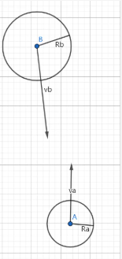
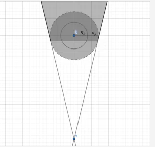
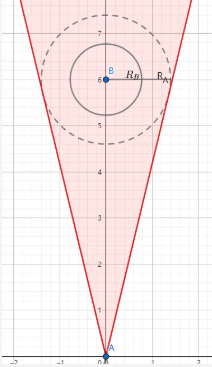
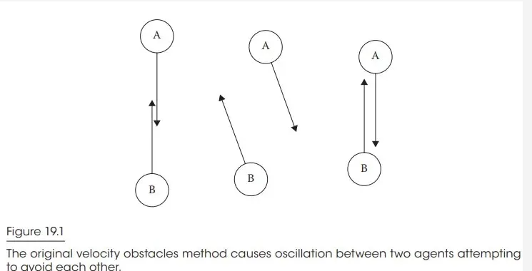
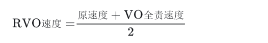
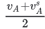
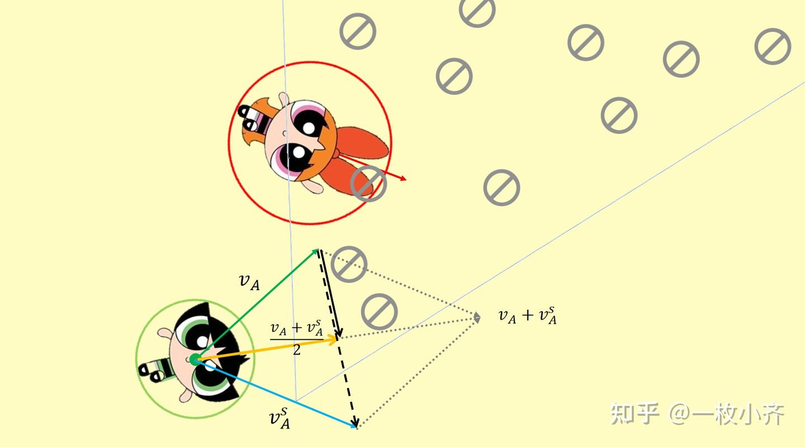
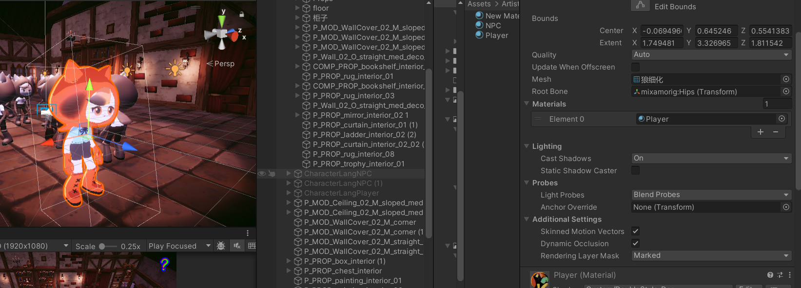

## RVO

https://indienova.com/indie-game-development/vo-rvo-orca/

VO的基本思想是，每个智能体在速度空间中计算出其他智能体可能带来的障碍区域，然后选择不在这些区域内的速度，以避免碰撞。而RVO在此基础上，假设其他智能体也会分担避让的责任，因此每个智能体只需要调整自己速度的一半，这样双方共同调整就能避免碰撞，减少不必要的路径迂回。

我们假设 A 和 B 都有自己的社交安全距离，这个距离是一个圆形的范围，半径分别是 `RA` 和 `RB`，那自然而然想到的算法就是：我们这一帧的相对移动要保证两个人的最近距离要大于等于 `RA+RB`。



这是显而易见的，实现这个目标的方法也很简单，在 A 的位置放置一个质点，然后在 B 的位置放置一个半径为 `RA+RB` 的大圆，这个大圆以外的位置都是 A 结束时安全的相对位置，所以这一帧的相对移动只要位于圆外就可以。

但是又因为，虽然结束位置只要在圆外就可以，但是因为移动过程是连续的，所以我们移动的路径实际上是初始点到终点的一条直线，因此我们还应该保证我们不应该“穿过”这个大圆而到达大圆后方，即大圆相对于质点位置的后方的锥形区域也是不可达的。

我们画出几何图形其实相当显而易见：



如上图，灰色区域就是不可达区域，但是为了计算简单，同时有一定的预判效果，VO 算法把整个三角区域全部视为“危险”区域。

需要联想到，此时所说的这一帧质点的相对位移，其实就是质点的单帧速度，而质点的单帧速度，其实就是 A 和 B 的相对速度，所以其实我们可以非常容易的把上图映射到速度域内，其坐标系原点即为质点的坐标。

可以看出来图形和上面那张坐标图的几何结构基本是一样的，只不过这已经映射到速度域了（红色区域在坐标域为危险区域，在速度域即为 VO）。



理论上当 A 和 B 的相对速度选择红色三角以外的点，即可安全错开。

#### 经典形态 - RVO（Reciprocal Velocity Obstacle）

VO 的思想非常简单，漏洞也是非常明显的，就是会发生抖动，且两个 agent 的情况就有可能发生，让我们看看原文的例子。



当 A 和 B 相向而行时，一开始 A 和 B 会错开，但当下一帧对方的速度发生变化时，他们又会把速度转回来，因为这个时候 A 会认为 B 就是向左上走的，所以我还是保持最佳的向下走也不会撞上，B 也是这么想的，所以他们就转回来了。

实际上这可能也不会造成最终的碰撞，因为在第二帧的时候，它们的速度确实是错开的，所以由于预判了碰撞，最终还是会很危险的错开。

但这个过程中两个 agent 的反复横跳的过程还是不够优雅的，而原因也显而易见，VO 算法中智能体总是默认其他智能体是稳定的恒速前进，这导致当对方的速度发生变化时，自己的行为就变得不符合预期。

所以在 RVO 中最大的改进，就是我们假设对方也会使用和我们相同的策略，而非保持匀速运动。

在基础的 VO 算法中，产生抖动的原因是 A 在第 2 帧选择新速度之后，发现 B 的速度也变化了很多，A 就会认为改回最佳速度（即直接指向目的地的速度）似乎也不会碰撞了，因为 B 的新速度其实就是假设 A 保持最佳速度也能不碰撞的情况下改变的，所以 A 就会认为 B 允许他转回来，但同时 B 也是这么想的。

然而在 RVO 中，A 把自己的速度只改变 `1/2`，也就是说，我们假设 A 和 B 想要错开，总共需要错开 `10cm`，VO 算法中 A 和 B 都会各自错开 `10cm`，而在 RVO 算法中 A 只错开一半，也就是 `5cm`，同时 A 假设 B 会错开另外一半，B 也是这么想的，因此两者不谋而合，第二帧的时候，两个人各自错开了一半，并且**发现此时转回最佳速度依然是会碰撞的（因为每个人只转了一半嘛），因此有效避免了上述抖动的现象。**


https://zhuanlan.zhihu.com/p/663978462


### 少转点的方式：只转50%

用什么的策略让自己少转点呢，RVO使用是**[责任分摊制](https://zhida.zhihu.com/search?content_id=235679789&content_type=Article&match_order=1&q=责任分摊制&zhida_source=entity)**，即双方仅承担50%的避让责任。具体操作上，就是**把自己原来的速度，加上VO算法算出来的那个“全责避让速度”，然后俩速度一平均，就是RVO选的新速度**。公式是：



借用前文VO教程的图，我们以毛毛的视角进行避障（绿色的是毛毛，用A表示，红色的是花花，用B表示，禁止符号所覆盖的扇形区域是花花对于毛毛的[碰撞锥](https://zhida.zhihu.com/search?content_id=235679789&content_type=Article&match_order=1&q=碰撞锥&zhida_source=entity)，看不懂的回去复习[VO教程](https://zhuanlan.zhihu.com/p/662684761)）。毛毛现在的速度 vA 还在B的碰撞锥里。按VO的套路，毛毛得选个完全躲开碰撞锥的速度 vAs (s是safe的缩写)，**即VO算法选择的速度（完全由A承担避让责任时的速度）**。那么根据RVO算法的战术，因为认为对面的花花也在进行相同的策略的避障，所以我们**只进行一半的改变**，原本 vA 要加整个黑色虚线箭头才能到 vAs ，现在只加半截（黑色实线箭头），这样得到的速度由橙色向量表示，即**RVO算法选择的速度，为 。**它虽然还在VO碰撞锥中，但花花那边也在同步做同样操作，她也会把自己的速度往中间收一半。两边一凑，实际相对速度刚好错开碰撞区。




## 聚光灯改变材质

小电脑 项目位置




DoubleStyle

```C++
{
    Properties
    {

        [Header(PBR)]
        [Space(10)]
        [MainTexture] _BaseMap("Albedo", 2D) = "white" {}
        [HDR][MainColor] _BaseColor("Color(PBR)", Color) = (1,1,1,1)
        _BumpMap("Normal Map", 2D) = "bump" {}
        _BumpScale("Scale", Float) = 1.0
        _Smoothness("Smoothness", Range(0.0, 1.0)) = 0.5
        _Metallic("Metallic", Range(0.0, 1.0)) = 0.0
        [HideInInspector]_AddlighIntensity("Add Intensity", Float) = 0.5
        [ToggleOff] _SpecularHighlights("Specular Highlights", Float) = 1.0
        [ToggleOff] _EnvironmentReflections("Environment Reflections", Float) = 1.0
        
        [Space(10)]
        
        _TransitionScale("Transition Scale", Float) = 0.8
        _Transition("Transition Parms", Vector) = (1,1,1,1)
        [HDR]_TransitionColor("Transition Color", Color) = (1,1,1,1)

        [Header(NPR)]
        [Space(10)]
        _BaseMap2("Albedo2", 2D) = "white" {}
        _BaseMap2("Albedo2", 2D) = "white" {}
        _Color1("Color(NPR)1", Color) = (1,1,1,1)
        _Color2("Color(NPR)2", Color) = (0.83,0.65,0.65,1)
        _Parms("Edge Parms", Vector) = (0.95,1,1,1)

        
        
        
        

        [Space(20)]

        [Header(RIM)]
        [Space(10)]
        _RimParm("Rim Edges", Vector) = (0.57,1,0.75,0.8)
        [HDR]_RimColorNPR("RimColor(NPR)", Color) = (0.75,0.53,0.16,1)
        [HDR]_RimColorPBR("Rim Color(PBR)", Color) = (0.4,0.22,0,1)
        [Space(20)]
        [Toggle]_IsNPCDead("NPC Dead", Float) = 0

        [HideInInspector] _ClearCoatMask("_ClearCoatMask", Float) = 0.0
        [HideInInspector] _ClearCoatSmoothness("_ClearCoatSmoothness", Float) = 0.0
        [HideInInspector] _SrcBlend("__src", Float) = 1.0
        [HideInInspector] _DstBlend("__dst", Float) = 0.0
        [HideInInspector] _SrcBlendAlpha("__srcA", Float) = 1.0
        [HideInInspector] _DstBlendAlpha("__dstA", Float) = 0.0
        [HideInInspector] _ZWrite("__zw", Float) = 1.0
        [HideInInspector] _BlendModePreserveSpecular("_BlendModePreserveSpecular", Float) = 1.0
        [HideInInspector] _AlphaToMask("__alphaToMask", Float) = 0.0
        [ToggleUI] _ReceiveShadows("Receive Shadows", Float) = 1.0
        _QueueOffset("Queue offset", Float) = 0.0
        [HideInInspector] _MainTex("BaseMap", 2D) = "white" {}
        [HideInInspector] _Color("Base Color", Color) = (1, 1, 1, 1)
        [HideInInspector] _GlossMapScale("Smoothness", Float) = 0.0
        [HideInInspector] _Glossiness("Smoothness", Float) = 0.0
        [HideInInspector] _GlossyReflections("EnvironmentReflections", Float) = 0.0
        [HideInInspector][NoScaleOffset]unity_Lightmaps("unity_Lightmaps", 2DArray) = "" {}
        [HideInInspector][NoScaleOffset]unity_LightmapsInd("unity_LightmapsInd", 2DArray) = "" {}
        [HideInInspector][NoScaleOffset]unity_ShadowMasks("unity_ShadowMasks", 2DArray) = "" {}
        
    }
    SubShader
    {
       

        Pass
{
   Name "Depth Rim"
   Tags
   {
      "LightMode" = "DepthOnly"
   }
   ZWrite On
   ColorMask 0
   Cull Off

   HLSLPROGRAM
   // Required to compile gles 2.0 with standard srp library
   #pragma vertex DepthOnlyVertex
   #pragma fragment DepthOnlyFragment
   #include "Packages/com.unity.render-pipelines.universal/Shaders/LitInput.hlsl"

   struct Attributes
   {
      float4 position     : POSITION;
      float2 texcoord     : TEXCOORD0;
      UNITY_VERTEX_INPUT_INSTANCE_ID
   };

   struct Varyings
   {
      float2 uv           : TEXCOORD0;
      float4 positionCS   : SV_POSITION;
      UNITY_VERTEX_INPUT_INSTANCE_ID
      UNITY_VERTEX_OUTPUT_STEREO
   };

   Varyings DepthOnlyVertex(Attributes input)
   {
      Varyings output = (Varyings)0;
      UNITY_SETUP_INSTANCE_ID(input);
      UNITY_INITIALIZE_VERTEX_OUTPUT_STEREO(output);

      output.uv = TRANSFORM_TEX(input.texcoord, _BaseMap);
      output.positionCS = TransformObjectToHClip(input.position.xyz);
      return output;
   }

   half4 DepthOnlyFragment(Varyings input) : SV_TARGET
   {
       UNITY_SETUP_STEREO_EYE_INDEX_POST_VERTEX(input);
       Alpha(SampleAlbedoAlpha(input.uv, TEXTURE2D_ARGS(_BaseMap, sampler_BaseMap)).a, _BaseColor, _Cutoff);
       return 0;
   }
            
   ENDHLSL
}
        Pass
        {
            Tags { "LightMode" = "UniversalForward" }
            Cull Off 
            ZWrite On
            //ZWrite Off
            Blend SrcAlpha OneMinusSrcAlpha

            HLSLPROGRAM

            #include "Packages/com.unity.render-pipelines.universal/Shaders/LitInput.hlsl"
            #include "MyUnlit.hlsl"
            #include "Packages/com.unity.render-pipelines.universal/ShaderLibrary/Core.hlsl"

            #pragma vertex vert
            #pragma fragment frag

            #pragma shader_feature _ _GI_ON
            #pragma multi_compile _ LIGHTMAP_ON
            #pragma multi_compile _ DIRLIGHTMAP_COMBINED
            #pragma shader_feature _ _RECEIVE_SHADOWS
            #pragma multi_compile _ _ADDITIONAL_LIGHTS_VERTEX _ADDITIONAL_LIGHTS
            #pragma multi_compile _ _LIGHT_LAYERS
            #pragma multi_compile_instancing


            TEXTURE2D(_MainTex);    SAMPLER(sampler_MainTex);
            TEXTURE2D(_BaseMap2);    SAMPLER(sampler_BaseMap2);
            TEXTURE2D_X_FLOAT(_CameraDepthTexture); SAMPLER(sampler_CameraDepthTexture);

            half _AddlighIntensity, _TransitionScale, _IsNPCDead;
            half4 _Color1, _Color2, _RimParmNPR, _RimParmPBR, _RimParm, _TransitionColor;
            half4 _MainTex_ST, _BaseMap2_ST;
            half4 _Parms, _RimColorPBR, _RimColorNPR, _Transition;
            half3 vs;

            
           Varyings vert(Attributes input)
            {

                Varyings output = (Varyings)0;

                UNITY_SETUP_INSTANCE_ID(input);
                UNITY_TRANSFER_INSTANCE_ID(input, output);
                UNITY_INITIALIZE_VERTEX_OUTPUT_STEREO(output);

                VertexPositionInputs vertexInput = GetVertexPositionInputs(input.positionOS.xyz);

                VertexNormalInputs normalInput = GetVertexNormalInputs(input.normalOS, input.tangentOS);

                half3 vertexLight = VertexLighting(vertexInput.positionWS, normalInput.normalWS);

                half fogFactor = 0;
                #if !defined(_FOG_FRAGMENT)
                    fogFactor = ComputeFogFactor(vertexInput.positionCS.z);
                #endif

                output.uv = TRANSFORM_TEX(input.texcoord, _BaseMap);

                // already normalized from normal transform to WS.
                output.normalWS = normalInput.normalWS;
            #if defined(REQUIRES_WORLD_SPACE_TANGENT_INTERPOLATOR) || defined(REQUIRES_TANGENT_SPACE_VIEW_DIR_INTERPOLATOR)
                real sign = input.tangentOS.w * GetOddNegativeScale();
                half4 tangentWS = half4(normalInput.tangentWS.xyz, sign);
            #endif
            #if defined(REQUIRES_WORLD_SPACE_TANGENT_INTERPOLATOR)
                output.tangentWS = tangentWS;
            #endif

            #if defined(REQUIRES_TANGENT_SPACE_VIEW_DIR_INTERPOLATOR)
                half3 viewDirWS = GetWorldSpaceNormalizeViewDir(vertexInput.positionWS);
                half3 viewDirTS = GetViewDirectionTangentSpace(tangentWS, output.normalWS, viewDirWS);
                output.viewDirTS = viewDirTS;
            #endif

                OUTPUT_LIGHTMAP_UV(input.staticLightmapUV, unity_LightmapST, output.staticLightmapUV);
            #ifdef DYNAMICLIGHTMAP_ON
                output.dynamicLightmapUV = input.dynamicLightmapUV.xy * unity_DynamicLightmapST.xy + unity_DynamicLightmapST.zw;
            #endif
                OUTPUT_SH(output.normalWS.xyz, output.vertexSH);
            #ifdef _ADDITIONAL_LIGHTS_VERTEX
                output.fogFactorAndVertexLight = half4(fogFactor, vertexLight);
            #else
                output.fogFactor = fogFactor;
            #endif

            #if defined(REQUIRES_WORLD_SPACE_POS_INTERPOLATOR)
                output.positionWS = vertexInput.positionWS;
            #endif

            #if defined(REQUIRES_VERTEX_SHADOW_COORD_INTERPOLATOR)
                output.shadowCoord = GetShadowCoord(vertexInput);
            #endif

                output.positionCS = vertexInput.positionCS;

                return output;
                vs = GetWorldSpaceNormalizeViewDir(vertexInput.positionWS);
            }

            float4 TransformHClipToViewPortPos(float4 positionCS)
            {
                float4 o = positionCS * 0.5f;
                o.xy = float2(o.x, o.y * _ProjectionParams.x) + o.w;
                o.zw = positionCS.zw;
                return o / o.w;
            }

            half4 frag(Varyings input): SV_Target
            {   

                SurfaceData surfaceData;
                InitializeStandardLitSurfaceData(input.uv, surfaceData);
            
            #ifdef LOD_FADE_CROSSFADE
                LODFadeCrossFade(input.positionCS);
            #endif
            
                InputData inputData;
                InitializeInputData(input, surfaceData.normalTS, inputData);
                SETUP_DEBUG_TEXTURE_DATA(inputData, input.uv, _BaseMap);
            
            #ifdef _DBUFFER
                ApplyDecalToSurfaceData(input.positionCS, surfaceData, inputData);
            #endif
            
                half4 color = UniversalFragmentPBR(inputData, surfaceData);
                color.rgb = MixFog(color.rgb, inputData.fogCoord);
                color.a = OutputAlpha(color.a, IsSurfaceTypeTransparent(_Surface));

                half4 shadowMask = CalculateShadowMask(inputData);
                AmbientOcclusionFactor aoFactor = CreateAmbientOcclusionFactor(inputData, surfaceData);
                Light spotlight = GetAdditionalLight (0, inputData, shadowMask, aoFactor);   
                uint meshRenderingLayers = GetMeshRenderingLayer();
                Light addLight;
                half3 NLCol = (1,1,1);
                half mask = 0;
                half mask2 = 0;
                half NL = 0;
                #ifdef _LIGHT_LAYERS
                if (IsMatchingLightLayer(spotlight.layerMask, meshRenderingLayers))
                #endif
                {
                    addLight = spotlight;
                    half3 lightDir1 = addLight.direction;
                    #ifdef _RECEIVE_SHADOWS
                    half lightAttenuation = addLight.distanceAttenuation * shadow;
                    #else
                    half lightAttenuation = addLight.distanceAttenuation;
                    #endif
                    mask = saturate(saturate(lightAttenuation)* addLight.color);
                    mask2 = mask * _TransitionScale;
                    NL = saturate(saturate(dot(input.normalWS,lightDir1)) * lightAttenuation) * _Parms.w;
                    NL = smoothstep(_Parms.x,_Parms.y,NL);
                    NLCol = lerp(_Color1,_Color2,NL);
                }
                

                Light dirlight = GetMainLight();
                half RimNL = saturate(dot(input.normalWS,dirlight.direction));
                half3 viewDir2 = normalize( _WorldSpaceCameraPos.xyz - normalize(input.positionWS));
                half NdotV2 = dot(normalize(input.normalWS), viewDir2);
                float FresnelValue = pow(1 - saturate(NdotV2), 3); 
                // half nv = saturate(dot(input.normalWS, vs));
                half3 rimPBR =smoothstep(_RimParm.x,_RimParm.y,RimNL * FresnelValue) * _RimColorPBR;
                half3 rimNPR =smoothstep(_RimParm.z,_RimParm.w,RimNL * FresnelValue) * _RimColorNPR ;

                half4 maskedge = (smoothstep(_Transition.x,_Transition.y,mask) - smoothstep(_Transition.z,_Transition.w,mask2)) * _TransitionColor;
                
                
                half3 basemap2 = saturate(SAMPLE_TEXTURE2D(_BaseMap2, sampler_BaseMap2, input.uv).rgb * NLCol) * _Parms.z;
                half3 output = lerp(saturate(color.rgb + rimPBR), saturate(basemap2.rgb + rimNPR),saturate(mask+ maskedge));

                

                if(_IsNPCDead)
                {
                    return 1;
                }

                // return half4(output.rgb,color.a) ;
                return half4(output.rgb,color.a);
            }
            ENDHLSL
        }


        Pass
        {
            Name "ShadowCaster"
            Tags
            {
                "LightMode" = "ShadowCaster"
            }


            ZWrite On
            ZTest LEqual
            ColorMask 0
            Cull[_Cull]

            HLSLPROGRAM
            #pragma target 2.0


            #pragma vertex ShadowPassVertex
            #pragma fragment ShadowPassFragment

            #pragma shader_feature_local_fragment _ALPHATEST_ON
            #pragma shader_feature_local_fragment _SMOOTHNESS_TEXTURE_ALBEDO_CHANNEL_A

            #pragma multi_compile_instancing
            #include_with_pragmas "Packages/com.unity.render-pipelines.universal/ShaderLibrary/DOTS.hlsl"

            #pragma multi_compile_fragment _ LOD_FADE_CROSSFADE

            #pragma multi_compile_vertex _ _CASTING_PUNCTUAL_LIGHT_SHADOW

            #include "Packages/com.unity.render-pipelines.universal/Shaders/LitInput.hlsl"
            #include "Packages/com.unity.render-pipelines.universal/Shaders/ShadowCasterPass.hlsl"
            ENDHLSL
        }


        
    }
}

```


这个Shader的核心效果是通过聚光灯触发从PBR材质到卡通渲染（NPR）的动态切换，其核心逻辑主要集中在`UniversalForward`这个Pass的片段着色器（`frag`函数）中。

---

### **核心效果实现步骤**
#### **1. PBR基础渲染**
```glsl
half4 color = UniversalFragmentPBR(inputData, surfaceData);
```
- 先通过URP内置的`UniversalFragmentPBR`函数计算标准的PBR光照效果，作为基础颜色。

---

#### **2.==聚光灯遮罩计算==**
```glsl
Light spotlight = GetAdditionalLight(0, inputData, shadowMask, aoFactor);
if (IsMatchingLightLayer(spotlight.layerMask, meshRenderingLayers))
{
    ...
    addLight = spotlight;
	half mask = saturate(saturate(lightAttenuation) * addLight.color);
	half mask2 = mask * _TransitionScale;
    ...
}
```
- `GetAdditionalLight`获取第一个附加光源（聚光灯）数据。
- `lightAttenuation`结合阴影和距离衰减，乘以灯光颜色得到聚光灯的影响区域遮罩`mask`。
- `mask2`通过`_TransitionScale`控制过渡范围。

```glsl
Light spotlight = GetAdditionalLight (0, inputData, shadowMask, aoFactor);   
                uint meshRenderingLayers = GetMeshRenderingLayer();
                Light addLight;
                half3 NLCol = (1,1,1);
                half mask = 0;
                half mask2 = 0;
                half NL = 0;
                #ifdef _LIGHT_LAYERS
                if (IsMatchingLightLayer(spotlight.layerMask, meshRenderingLayers))
                #endif
                {
                    addLight = spotlight;
                    half3 lightDir1 = addLight.direction;
                    #ifdef _RECEIVE_SHADOWS
                    half lightAttenuation = addLight.distanceAttenuation * shadow;
                    #else
                    half lightAttenuation = addLight.distanceAttenuation;
                    #endif
                    mask = saturate(saturate(lightAttenuation)* addLight.color);
                    mask2 = mask * _TransitionScale;
                    NL = saturate(saturate(dot(input.normalWS,lightDir1)) * lightAttenuation) * _Parms.w;
                    NL = smoothstep(_Parms.x,_Parms.y,NL);
                    NLCol = lerp(_Color1,_Color2,NL);
                }
```


---

#### **3. 卡通化明暗分界**
```glsl
half NL = saturate(dot(input.normalWS, lightDir1)) * lightAttenuation;
NL = smoothstep(_Parms.x, _Parms.y, NL) * _Parms.w;
half3 NLCol = lerp(_Color1, _Color2, NL);
```
- **NL（法线·光方向）** 计算漫反射强度，结合`smoothstep`生成硬边过渡效果。
- `_Parms.x`和`_Parms.y`控制明暗分界的阈值，`_Parms.w`调整整体强度。
- 使用`_Color1`和`_Color2`插值生成卡通风格的渐变颜色。

---

#### **4. 边缘光（Rim Light）**
```glsl
half3 viewDir2 = normalize(_WorldSpaceCameraPos - input.positionWS);
half NdotV2 = dot(input.normalWS, viewDir2);
float FresnelValue = pow(1 - saturate(NdotV2), 3);
half3 rimPBR = smoothstep(_RimParm.x, _RimParm.y, RimNL * FresnelValue) * _RimColorPBR;
half3 rimNPR = smoothstep(_RimParm.z, _RimParm.w, RimNL * FresnelValue) * _RimColorNPR;
```
- 计算基于菲涅尔效应的边缘光，`_RimParm`的xy和zw分别控制PBR和NPR边缘的宽度。
- `_RimColorPBR`和`_RimColorNPR`为不同风格指定边缘颜色。

---

#### **5. 动态过渡效果**
```glsl
half4 maskedge = (smoothstep(_Transition.x, _Transition.y, mask) - 
                smoothstep(_Transition.z, _Transition.w, mask2)) * _TransitionColor;
```
- 使用两组`smoothstep`生成聚光灯边缘的过渡区域，`_Transition`控制过渡曲线的形状。
- `_TransitionColor`为过渡区域叠加颜色（如高光）。

---

#### **6. 最终混合**
```glsl
half3 basemap2 = SAMPLE_TEXTURE2D(_BaseMap2, sampler_BaseMap2, input.uv).rgb * NLCol * _Parms.z;
half3 output = lerp(saturate(color.rgb + rimPBR), 
                  saturate(basemap2.rgb + rimNPR), 
                  saturate(mask + maskedge));
```
- `_BaseMap2`是卡通风格的贴图，与NLCol相乘得到NPR基础颜色。
- `lerp`根据聚光灯遮罩`mask`和过渡效果`maskedge`，在PBR和NPR之间动态混合。

---

### **关键参数说明**
- **`_TransitionScale`**: 控制聚光灯影响范围的缩放。
- **`_Parms`**: 
  - `x/y` - 明暗分界阈值
  - `z` - NPR贴图强度
  - `w` - 明暗对比强度
- **`_RimParm`**: 
  - `x/y` - PBR边缘光范围
  - `z/w` - NPR边缘光范围
- **`_Transition`**: 
  - `x/y` - 主过渡区域控制
  - `z/w` - 次过渡区域控制

---

### **顶点着色器补充**
- `vert`函数中计算了世界空间法线、切线等数据，特别注意末尾的`vs = GetWorldSpaceNormalizeViewDir(...)`可能存在错误（应整合到`Varyings`结构体中）。

---

### **效果示意图**
1. **无聚光灯时**: 显示标准PBR + PBR风格边缘光。
2. **聚光灯中心区域**: 完全切换为卡通着色（`_BaseMap2` + `NLCol`）。
3. **聚光灯边缘过渡区**: 叠加`_TransitionColor`的高光效果。

通过调整`_TransitionScale`和`_Transition`参数，可以控制聚光灯边缘的"硬边"或"柔边"效果。