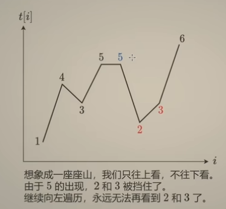
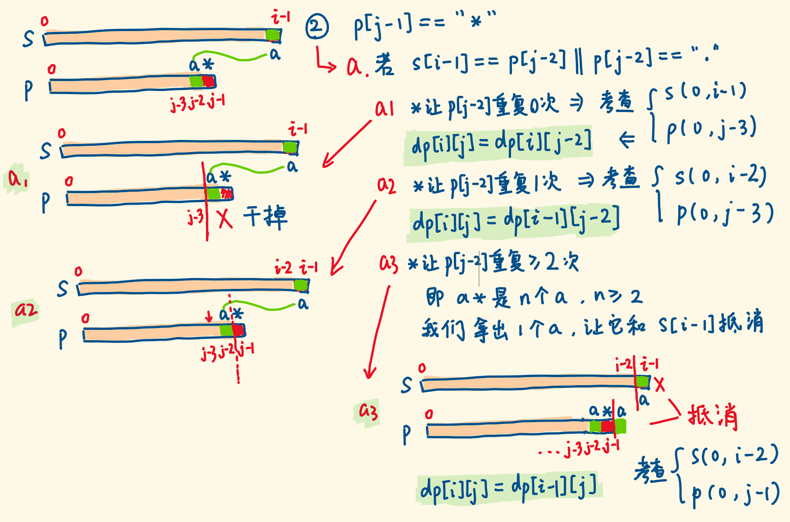
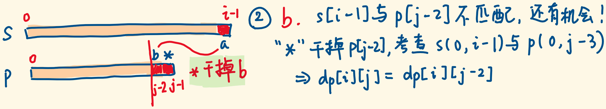
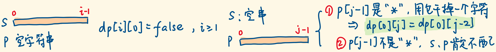

#  LeetCode 热题 HOT 100

https://leetcode.cn/problem-list/2cktkvj/
=======
题单在这里：[🔥 LeetCode 热题 HOT 100 - 力扣（LeetCode）全球极客挚爱的技术成长平台](https://leetcode.cn/problem-list/2cktkvj/)

:notebook: 表示记录在“大厂”那个笔记中

:bookmark: 表示在 ” 面经合集——题目+答案版“中

## 二分 :red_circle:

### [300. 最长递增子序列 ](https://leetcode-cn.com/problems/longest-increasing-subsequence/)  :notebook: 记录在“大厂”那个笔记中 :red_circle:

难度中等	

给你一个整数数组 `nums` ，找到其中最长严格递增子序列的长度。

**子序列** 是由数组派生而来的序列，删除（或不删除）数组中的元素而不改变其余元素的顺序。例如，`[3,6,2,7]` 是数组 `[0,3,1,6,2,2,7]` 的子序列。

**示例 1：**

```C++
输入：nums = [10,9,2,5,3,7,101,18]
输出：4
解释：最长递增子序列是 [2,3,7,101]，因此长度为 4 。
```

**示例 2：**

```C++
输入：nums = [0,1,0,3,2,3]
输出：4
```

**示例 3：**

```C++
输入：nums = [7,7,7,7,7,7,7]
输出：1
```

 

**提示：**

- `1 <= nums.length <= 2500`
- `-104 <= nums[i] <= 104`

 

**进阶：**

- 你能将算法的时间复杂度降低到 `O(n log(n))` 吗?

（M如果是选出所有递增序列的话可以用回溯，查一下递增序列即可）


**解法总结**

维护tail数组  每次来一个数字就二分查找其存在这个tail数组的哪里，并存入


##### 解法1：动态规划法

[300. 最长递增子序列（动态规划 + 二分查找，清晰图解） - 最长递增子序列 - 力扣（LeetCode） (leetcode-cn.com)](https://leetcode-cn.com/problems/longest-increasing-subsequence/solution/zui-chang-shang-sheng-zi-xu-lie-dong-tai-gui-hua-2/)


```C++
class Solution 
public:
    int lengthOfLIS(vector<int>& nums) {
        vector<int> dp(nums.size(),1);
        int resmax=0;//
        for(int i=0;i<nums.size();i++)
        {
            for(int j=0;j<i;j++)
            {
                if(nums[j]<nums[i]) dp[i]=max(dp[i],dp[j]+1);
            }
            resmax=max(resmax,dp[i]);
        }
        // vector<int>::iterator it=dp.begin();
        // for(;it!=dp.end();it++)cout<<" "<<*it;
        // return dp[nums.size()-1];//不对 可能是中间的比较多 因为dp[i]代表的是以i为结尾的最长的 不一定是他
        return resmax;
    }
};
```

##### 解法2：动态规划+二分查找

https://leetcode.cn/problems/longest-increasing-subsequence/solutions/24173/zui-chang-shang-sheng-zi-xu-lie-dong-tai-gui-hua-2/?envType=problem-list-v2&envId=2cktkvj


比如序列是78912345，前三个遍历完以后tail是789，这时候遍历到1，就得把1放到合适的位置，于是在tail二分查找1的位置，变成了189（如果序列在此时结束，因为res不变，所以依旧输出3），再遍历到2成为129，然后是123直到12345 这题难理解的核心不在于算法难，而在于在于官方给的例子太拉了，遇不到这个算法真正要解决的问题，即没有我例子中1要代替7的过程，

精妙之处就在于： 遍历nums拿出来的比我当前tail尾部更小的数，我遇见了就把它换进来，要是后续不能让这些稍小（相较于tail数组的尾部）的变成更长的子序列，那就超不过原先的，我也没有任何损失，但如果长度能超过之前的这些，我前面已经替换完了，随时准备着和你后面的组成更长的，只需要你来加到尾部就ok了。 更通俗点说，在一样长的最长子序列里面，我永远是所有元素最小的那个子序列，后面随便给我来一个元素，它可能跟我组成更长的，而不可能跟你组更长的，如果它跟我都不能组，跟你则更不可能组了，因为我最后一个元素比你小呀！


相当于 更新子序列了吧

（思路：构建tails 每次去更新就行了

25/05/03 也有单调栈那个意味

```C++
class Solution {
public:
    int lengthOfLIS(vector<int>& nums) 
    {
        int n = nums.size();
        vector<int> tail;
        //41078523
        //478  找到第一个  >=5的：7-> 458 
        for(int i=0;i<n;i++)
        {
            if(tail.empty()||nums[i]>tail.back())tail.push_back(nums[i]);
            else
            {
                //严格递增 所以>= 不能放两个
                //upper_bound寻找第一个>5的 但是如果是5555 那么 t：5 既不会进上面的push 下面的也会找超出
                //而题目需要严格递增 所以如果是一样的数字 应该覆盖 所以应该寻找tail中第一个>=5的 覆盖
                //int index = upper_bound(tail.begin(),tail.end(),nums[i])-tail.begin();
                int index = lower_bound(tail.begin(),tail.end(),nums[i])-tail.begin();
                tail[index] = nums[i];
            };
        }
        return tail.size();
    }
};
```

> **深入理解本题的贪心策略:**
>
> ### 分步解释与证明
>
> 要理解该贪心算法的正确性，需明确以下几点：
>
> ---
>
> #### **1. 维护数组 `res` 的性质**
> - **`res` 是递增序列**：每次插入或替换操作均保证 `res` 严格递增。
> - **`res[i]` 表示长度为 `i+1` 的递增子序列的最小可能末尾元素**  
>   例如，若当前 `res = [2, 5, 7]`，则：
>   - 长度为1的递增子序列最小末尾是2；
>   - 长度为2的最小末尾是5；
>   - 长度为3的最小末尾是7。
>
> ---
>
> #### **2. 关键操作的解释**
> - **当 `nums[i] > res.back()`**  
>   直接追加到 `res`，因为当前元素能扩展最长子序列。
>   
> - **当 `nums[i] ≤ res.back()`**  
>   用 `lower_bound` 找到第一个 `≥ nums[i]` 的位置 `j`，替换 `res[j]` 为 `nums[i]`。  
>   **目的**：更新长度为 `j+1` 的子序列的末尾为更小的值，以便未来可能形成更长的子序列。(这地方有一些贪心的意味)
>
> ---
>
> #### **3. 正确性证明（数学归纳法）**
> **归纳基础**：初始时 `res` 为空，显然长度为0时成立。
>
> **归纳假设**：假设处理前 `k` 个元素后，`res` 满足：
> - `res` 递增；
> - `res[i]` 是前 `k` 个元素中长度为 `i+1` 的递增子序列的最小末尾。
>
> **归纳步骤**：处理第 `k+1` 个元素 `x = nums[k]`。
>
> - **情况1：`x > res.back()`**  
>   追加 `x` 到 `res`，此时新长度 `L+1`。由于 `x` 可接在长度为 `L` 的子序列后，形成更长的子序列，且 `x` 是该长度的最小末尾（因为之前无法形成更长的子序列）。
>
> - **情况2：`x ≤ res.back()`**  
>   找到 `j` 使得 `res[j]` 是第一个 `≥ x` 的元素，替换 `res[j] = x`。  
>   **为何可行**：  
>   - 存在一个长度为 `j` 的子序列，其末尾 `< x`（由 `res` 的递增性保证），因此可将 `x` 接在其后，形成长度为 `j+1` 的子序列，且末尾更小（优化了原 `res[j]`）。
>
> **结论**：处理完所有元素后，`res` 的长度即为最长递增子序列的长度。
>
> ---
>
> #### **4. 示例分析**
> 以数组 `[3, 0, 1, 2, 6, 4, 5]` 为例：
>
> | 步骤 | 当前元素 | res 操作                 | res 数组     | 解释                     |
> | ---- | -------- | ------------------------ | ------------ | ------------------------ |
> | 1    | 3        | 直接追加                 | [3]          | 初始长度为1              |
> | 2    | 0        | 替换3 → 0                | [0]          | 0是更小的长度为1的末尾   |
> | 3    | 1        | 替换res[1]（越界，追加） | [0, 1]       | 1 > 0，扩展长度为2       |
> | 4    | 2        | 替换1 → 2                | [0, 2]       | 替换后长度为2的末尾更小  |
> | 5    | 6        | 直接追加                 | [0, 2, 6]    | 6 > 2，扩展长度为3       |
> | 6    | 4        | 替换6 → 4                | [0, 2, 4]    | 4 < 6，优化长度为3的末尾 |
> | 7    | 5        | 替换res[3]（越界，追加） | [0, 2, 4, 5] | 5 > 4，扩展长度为4       |
>
> 最终 `res` 长度为4，对应最长递增子序列 `[0,1,2,5]` 或 `[0,2,4,5]`。
>
> ---
>
> #### **5. 算法优势**
> - **时间复杂度**：O(n log n)，优于动态规划的 O(n²)。
> - **空间复杂度**：O(n)，仅需维护数组 `res`。
>
> ---
>
> ### **总结**
> 该算法通过维护不同长度递增子序列的最小末尾元素，确保后续元素能高效地扩展更长序列。虽然 `res` 并非真实的最长子序列，但其长度正确反映了最长递增子序列的长度。贪心策略的核心在于通过替换优化末尾元素，为未来扩展保留最大可能性。


### [33. 搜索旋转排序数组](https://leetcode.cn/problems/search-in-rotated-sorted-array/)

整数数组 `nums` 按升序排列，数组中的值 **互不相同** 。

在传递给函数之前，`nums` 在预先未知的某个下标 `k`（`0 <= k < nums.length`）上进行了 **旋转**，使数组变为 `[nums[k], nums[k+1], ..., nums[n-1], nums[0], nums[1], ..., nums[k-1]]`（下标 **从 0 开始** 计数）。例如， `[0,1,2,4,5,6,7]` 在下标 `3` 处经旋转后可能变为 `[4,5,6,7,0,1,2]` 。

给你 **旋转后** 的数组 `nums` 和一个整数 `target` ，如果 `nums` 中存在这个目标值 `target` ，则返回它的下标，否则返回 `-1` 。

你必须设计一个时间复杂度为 `O(log n)` 的算法解决此问题。

**示例 1：**

```
输入：nums = [4,5,6,7,0,1,2], target = 0
输出：4
```


```C++
class Solution {
public:
    int search(vector<int>& nums, int target) {
        int n = nums.size();
        int last = nums[n-1];
        //找到第一个小于等于last的值
        int l = 0,r=n-1;
        while(l<=r)
        {
            int midIdx = l+((r-l)>>1);
            if(nums[midIdx]>last)l=midIdx+1;
            else r=midIdx-1;
        }
        //cout<<nums[l]<<endl;
        //寻找值target
        if(target>=nums[l]&&target<=last)
        {
            l=l,r=n-1;
            while(l<=r)
            {
                int mid = l+((r-l)>>1);
                if(nums[mid]<target) l=mid+1;
                else r=mid-1;
            }
            if(nums[l]==target)return l;
            else return -1;
        }
        else
        {
            r=l-1;
            l=0;
            while(l<=r)
            {
                int mid = l+((r-l)>>1);
                if(nums[mid]<target) l=mid+1;
                else r=mid-1;
            }
            if(nums[l]==target)return l;
            else return -1;
        }
        return -1;
    }
};
```

个人思路是 两次二分 第一次找最小值分成两边，第二次在其中一边找


## [4. 寻找两个正序数组的中位数](https://leetcode.cn/problems/median-of-two-sorted-arrays/)

> 给定两个大小分别为 `m` 和 `n` 的正序（从小到大）数组 `nums1` 和 `nums2`。请你找出并返回这两个正序数组的 **中位数** 。
>
> 算法的时间复杂度应该为 `O(log (m+n))` 。
>
>  
>
> **示例 1：**
>
> ```
> 输入：nums1 = [1,3], nums2 = [2]
> 输出：2.00000
> 解释：合并数组 = [1,2,3] ，中位数 2
> ```
>
> **示例 2：**
>
> ```
> 输入：nums1 = [1,2], nums2 = [3,4]
> 输出：2.50000
> 解释：合并数组 = [1,2,3,4] ，中位数 (2 + 3) / 2 = 2.5
> ```

本题是一道很困难的题目，主要题解参考[4. 寻找两个正序数组的中位数 - 力扣（LeetCode）](https://leetcode.cn/problems/median-of-two-sorted-arrays/)。

这里很难整理，直接看题解吧。

二分插入INT_MIN和INT_MAX的版本，实际上还是O(N)复杂度：

```c++
class Solution {
public:
    double findMedianSortedArrays(vector<int>& nums1, vector<int>& nums2) {
        //step 1:
        if(nums1.size()>nums2.size())
        {
            swap(nums1, nums2);
        }
        int m = nums1.size();
        int n = nums2.size();
        //step 2:
        nums1.insert(nums1.begin(), INT_MIN);
        nums2.insert(nums2.begin(), INT_MIN);
        nums1.push_back(INT_MAX);
        nums2.push_back(INT_MAX);

        //step 3:
        int left = 0, right = m+1;
        //nums1[mid]<=nums2[j] false false false false(this!) true true 
        while(left<=right)
        {
            int mid = left+((right-left)>>1);
            int j = (m+n+1)/2 - mid;
            if(nums1[mid]<=nums2[j+1]) left = mid + 1;
            else right = mid - 1;
        }
        int i = left - 1;
        int j = (m+n+1)/2-i;
        int ai = nums1[i];
        int ai1 = nums1[i+1];
        int bj = nums2[j];
        int bj1 = nums2[j+1];
        if((m+n)%2==1) return max(ai, bj);
        else return (max(ai, bj) + min(ai1, bj1)) * 1.0 / 2.0;
    }
};
```


以下是不insert INT_MIN 和INT_MAX的版本：

```c++
class Solution {
public:
    double findMedianSortedArrays(vector<int>& nums1, vector<int>& nums2) {
        //step 1:
        if(nums1.size()>nums2.size())
        {
            swap(nums1, nums2);
        }
        int m = nums1.size();
        int n = nums2.size();
        //step 2:
        // nums1.insert(nums1.begin(), INT_MIN);
        // nums2.insert(nums2.begin(), INT_MIN);
        // nums1.push_back(INT_MAX);
        // nums2.push_back(INT_MAX);

        //step 3:
        int left = 0, right = m-1;
        //nums1[mid]<=nums2[j] false false false false(this!) true true 
        while(left<=right)
        {
            int mid = left+((right-left)>>1);
            int j = (m+n+1)/2 - mid - 2;
            if(nums1[mid]<=nums2[j+1]) left = mid + 1;
            else right = mid - 1;
        }
        int i = left - 1;
        int j = (m+n+1)/2-i-2;
        int ai = (i>=0)? nums1[i]: INT_MIN;
        int ai1 = (i+1<m)? nums1[i+1]: INT_MAX;
        int bj = (j>=0)? nums2[j]: INT_MIN;
        int bj1 = (j+1<n)? nums2[j+1]:INT_MAX;
        int _max = max(ai, bj);
        int _min = min(ai1, bj1);
        if((m+n)%2==1) return _max;
        else return (_max + _min) * 1.0 / 2.0;
    }
};
```


## 二叉树 :red_circle:


### [剑指 Offer 68 - II. 二叉树的最近公共祖先](https://leetcode-cn.com/problems/er-cha-shu-de-zui-jin-gong-gong-zu-xian-lcof/)   :notebook:  记录在“大厂”那个笔记中 :red_circle:

难度简单

给定一个二叉树, 找到该树中两个指定节点的最近公共祖先。

[百度百科](https://baike.baidu.com/item/最近公共祖先/8918834?fr=aladdin)中最近公共祖先的定义为：“对于有根树 T 的两个结点 p、q，最近公共祖先表示为一个结点 x，满足 x 是 p、q 的祖先且 x 的深度尽可能大（**一个节点也可以是它自己的祖先**）。”

例如，给定如下二叉树: root = [3,5,1,6,2,0,8,null,null,7,4]


 

**示例 1:**

```
输入: root = [3,5,1,6,2,0,8,null,null,7,4], p = 5, q = 1
输出: 3
解释: 节点 5 和节点 1 的最近公共祖先是节点 3。
```

**示例 2:**

```
输入: root = [3,5,1,6,2,0,8,null,null,7,4], p = 5, q = 4
输出: 5
解释: 节点 5 和节点 4 的最近公共祖先是节点 5。因为根据定义最近公共祖先节点可以为节点本身。
```

 ```C++
class Solution {
public:
    TreeNode* lowestCommonAncestor(TreeNode* root, TreeNode* p, TreeNode* q) {
        if(root==NULL)return NULL;
        if(root==p||root==q)return root;
        TreeNode* left=lowestCommonAncestor(root->left,p,q); 
        TreeNode* right=lowestCommonAncestor(root->right,p,q); 
        if(left==NULL)return right;
        else if(right==NULL)return left;
        else return root;

    }
};
 ```


具体见题解：https://leetcode.cn/problems/lowest-common-ancestor-of-a-binary-tree/?envType=problem-list-v2&envId=2cktkvj

 

会把状态一步步返回上去，

如果没找到，返回的就是null

1、找到了 会进入【1】，返回最近公共祖先

2、节点p/q是另一个q/p的祖先节点，返回【2】 // 或者找到了p / q 也会返回【2】


 ```C++
class Solution {
public:
    TreeNode* lowestCommonAncestor(TreeNode* root, TreeNode* p, TreeNode* q) {
        if(root==NULL)return NULL;
        if(root==p||root==q)return root;//【2】
        TreeNode* left=lowestCommonAncestor(root->left,p,q); 
        TreeNode* right=lowestCommonAncestor(root->right,p,q); 
        if(left==NULL)return right;//保证其会取非空的，即有结果是祖先的那个
        else if(right==NULL)return left;//保证其会取非空的
        else return root;//【1】//左右子树都找到p和q了，那就说明p和q分别在左右两个子树上，所以此时的最近公共祖先就是root

    }
};
 ```

是否是 后序 左右根？

> 一个辅助记忆的思考流程：
>
> 


方法二：存储父节点
思路

我们可以用哈希表存储所有节点的父节点，然后我们就可以利用节点的父节点信息从 p 结点开始不断往上跳，并记录已经访问过的节点，再从 q 节点开始不断往上跳，如果碰到已经访问过的节点，那么这个节点就是我们要找的最近公共祖先。

作者：力扣官方题解
链接：https://leetcode.cn/problems/lowest-common-ancestor-of-a-binary-tree/solutions/238552/er-cha-shu-de-zui-jin-gong-gong-zu-xian-by-leetc-2/


### 226. 翻转二叉树

题目地址：https://leetcode-cn.com/problems/invert-binary-tree/

翻转一棵二叉树。


可以发现想要翻转它，其实就把每一个节点的左右孩子交换一下就可以了。

关键在于遍历顺序，前中后序应该选哪一种遍历顺序？ （一些同学这道题都过了，但是不知道自己用的是什么顺序）

遍历的过程中去翻转每一个节点的左右孩子就可以达到整体翻转的效果。

**注意只要把每一个节点的左右孩子翻转一下，就可以达到整体翻转的效果**

**这道题目使用前序遍历和后序遍历都可以，唯独中序遍历不行，因为中序遍历会把某些节点的左右孩子翻转了两次！建议拿纸画一画，就理解了**

那么层序遍历可以不可以呢？**依然可以的！只要把每一个节点的左右孩子翻转一下的遍历方式都是可以的！**

#### 递归法

基于这递归三步法，代码基本写完，C++代码如下：

```C++
class Solution {
public:
    TreeNode* invertTree(TreeNode* root) {
        if (root == NULL) return root;
        swap(root->left, root->right);  // 中
        invertTree(root->left);         // 左
        invertTree(root->right);        // 右
        return root;
    }
};
```

m

```C++

class Solution {
public:
    TreeNode* invertTree(TreeNode* root) {
        if(root==nullptr)return nullptr;
        TreeNode *left = root->left;
        TreeNode * right = root->right;
        root->left = right;
        root->right = left;
        invertTree(left);
        invertTree(right);
        return root;
    }
};
```


#### 迭代法

##### 深度优先遍历


[二叉树：听说递归能做的，栈也能做！](https://mp.weixin.qq.com/s/OH7aCVJ5-Gi32PkNCoZk4A)中给出了前中后序迭代方式的写法，所以本地可以很轻松的切出如下迭代法的代码：

C++代码迭代法（前序遍历）

```C++
class Solution {
public:
    TreeNode* invertTree(TreeNode* root) {
        if (root == NULL) return root;
        stack<TreeNode*> st;
        st.push(root);
        while(!st.empty()) {
            TreeNode* node = st.top();              // 中
            st.pop();
            swap(node->left, node->right);
            if(node->right) st.push(node->right);   // 右
            if(node->left) st.push(node->left);     // 左
        }
        return root;
    }
};
```


##### 广度优先遍历

也就是层序遍历，层数遍历也是可以翻转这棵树的，因为层序遍历也可以把每个节点的左右孩子都翻转一遍，代码如下：

```C++
class Solution {
public:
    TreeNode* invertTree(TreeNode* root) {
        queue<TreeNode*> que;
        if (root != NULL) que.push(root);
        while (!que.empty()) {
            int size = que.size();
            for (int i = 0; i < size; i++) {
                TreeNode* node = que.front();
                que.pop();
                swap(node->left, node->right); // 节点处理
                if (node->left) que.push(node->left);
                if (node->right) que.push(node->right);
            }
        }
        return root;
    }
};
```

如果对以上代码不理解，或者不清楚二叉树的层序遍历，可以看这篇[二叉树：层序遍历登场！](https://mp.weixin.qq.com/s/4-bDKi7SdwfBGRm9FYduiA)

#### 拓展 

**文中我指的是递归的中序遍历是不行的，因为使用递归的中序遍历，某些节点的左右孩子会翻转两次。**

如果非要使用递归中序的方式写，也可以，如下代码就可以避免节点左右孩子翻转两次的情况：

```C++
class Solution {
public:
    TreeNode* invertTree(TreeNode* root) {
        if (root == NULL) return root;
        invertTree(root->left);         // 左
        swap(root->left, root->right);  // 中
        invertTree(root->left);         // 注意 这里依然要遍历左孩子，因为中间节点已经翻转了
        return root;
    }
};
```

代码虽然可以，但这毕竟不是真正的递归中序遍历了。

但使用迭代方式统一写法的中序是可以的。

代码如下：

```C++
class Solution {
public:
    TreeNode* invertTree(TreeNode* root) {
        stack<TreeNode*> st;
        if (root != NULL) st.push(root);
        while (!st.empty()) {
            TreeNode* node = st.top();
            if (node != NULL) {
                st.pop();
                if (node->right) st.push(node->right);  // 右
                st.push(node);                          // 中
                st.push(NULL);
                if (node->left) st.push(node->left);    // 左

            } else {
                st.pop();
                node = st.top();
                st.pop();
                swap(node->left, node->right);          // 节点处理逻辑
            }
        }
        return root;
    }
};

```

为什么这个中序就是可以的呢，因为这是用栈来遍历，而不是靠指针来遍历，避免了递归法中翻转了两次的情况，大家可以画图理解一下，这里有点意思的。

#### 总结

针对二叉树的问题，解题之前一定要想清楚究竟是前中后序遍历，还是层序遍历。

**二叉树解题的大忌就是自己稀里糊涂的过了（因为这道题相对简单），但是也不知道自己是怎么遍历的。**

这也是造成了二叉树的题目“一看就会，一写就废”的原因。

**针对翻转二叉树，我给出了一种递归，三种迭代（两种模拟深度优先遍历，一种层序遍历）的写法，都是之前我们讲过的写法，融汇贯通一下而已。**

大家一定也有自己的解法，但一定要成方法论，这样才能通用，才能举一反三


### [124. 二叉树中的最大路径和](https://leetcode.cn/problems/binary-tree-maximum-path-sum/)

二叉树中的 **路径** 被定义为一条节点序列，序列中每对相邻节点之间都存在一条边。同一个节点在一条路径序列中 **至多出现一次** 。该路径 **至少包含一个** 节点，且不一定经过根节点。

**路径和** 是路径中各节点值的总和。

给你一个二叉树的根节点 `root` ，返回其 **最大路径和** 。

**示例 1：**


```
输入：root = [1,2,3]
输出：6
解释：最优路径是 2 -> 1 -> 3 ，路径和为 2 + 1 + 3 = 6
```

链接：https://leetcode.cn/problems/binary-tree-maximum-path-sum/solutions/297005/er-cha-shu-zhong-de-zui-da-lu-jing-he-by-leetcode-/


```C++
class Solution {
private:
    int maxSum = INT_MIN;

public:
    int maxGain(TreeNode* node) {
        if (node == nullptr) {
            return 0;
        }
        
        // 递归计算左右子节点的最大贡献值
        // 只有在最大贡献值大于 0 时，才会选取对应子节点
        int leftGain = max(maxGain(node->left), 0);
        int rightGain = max(maxGain(node->right), 0);

        // 节点的最大路径和取决于该节点的值与该节点的左右子节点的最大贡献值
        int priceNewpath = node->val + leftGain + rightGain;

        // 更新答案
        maxSum = max(maxSum, priceNewpath);

        // 返回节点的最大贡献值  这里返回上去的不能够是选择左右的，只能是选择左 或者右的 不然不是变三岔路口了 就不对了
        return node->val + max(leftGain, rightGain);
    }

    int maxPathSum(TreeNode* root) {
        maxGain(root);
        return maxSum;
    }
};
```


###  [538. 把二叉搜索树转换为累加树](https://leetcode.cn/problems/convert-bst-to-greater-tree/)

给出二叉 **搜索** 树的根节点，该树的节点值各不相同，请你将其转换为累加树（Greater Sum Tree），使每个节点 `node` 的新值等于原树中大于或等于 `node.val` 的值之和。

提醒一下，二叉搜索树满足下列约束条件：

- 节点的左子树仅包含键 **小于** 节点键的节点。
- 节点的右子树仅包含键 **大于** 节点键的节点。
- 左右子树也必须是二叉搜索树。

**注意：**本题和 1038: https://leetcode-cn.com/problems/binary-search-tree-to-greater-sum-tree/ 相同

**示例 1：**

****

```
输入：[4,1,6,0,2,5,7,null,null,null,3,null,null,null,8]
输出：[30,36,21,36,35,26,15,null,null,null,33,null,null,null,8]
```


```C++
class Solution {
public:
    int sum = 0;
    TreeNode* convertBST(TreeNode* root) 
    {
        //右根左
        if(root==nullptr)return nullptr;
        convertBST(root->right);
        sum+=root->val;
        root->val = sum;
        convertBST(root->left);
        return root;
    }
};
```


## [297. 二叉树的序列化与反序列化](https://leetcode.cn/problems/serialize-and-deserialize-binary-tree/)

> 这道题和LRU那道题是类似的，考察的是能否把复杂的业务写好。务必注意代码中的细节问题。

### （1）做法1：先序遍历

使用根->左->右的顺序进行遍历，当遍历到nullptr的时候，返回`None,`，否则如果是数的话，使用to_string转换为字符串，再加,。

在反序列化的时候，先去掉字符串中所有的`，`并放到数组当中，遇到`None`则return nullptr，否则使用stoi接口还原对应的值。最终的代码如下：
```c++
/**
 * Definition for a binary tree node.
 * struct TreeNode {
 *     int val;
 *     TreeNode *left;
 *     TreeNode *right;
 *     TreeNode(int x) : val(x), left(NULL), right(NULL) {}
 * };
 */
class Codec {
public:

    void rserialize(TreeNode* root, string& res)
    {
        if(root==NULL)
        {
            res += "None,";
            return;
        }
        //根,左,右
        res += to_string(root->val);
        res += ',';
        rserialize(root->left, res);
        rserialize(root->right, res);
    }
    // Encodes a tree to a single string.
    string serialize(TreeNode* root) {
        string res;
        rserialize(root, res);
        //cout<<res<<endl;
        return res;
    }

    TreeNode* rdeserialize(list<string>& nums) //根节点(数据是错误的); 数据
    {
        if(nums.size()==0) return NULL;
        if(nums.front()=="None") //用完就扔掉了！
        {
            nums.erase(nums.begin());//begin是迭代器 front是取值
            return NULL;
        }
        TreeNode* root = new TreeNode(stoi(nums.front()));
        nums.erase(nums.begin());
        root->left = rdeserialize(nums); 
        root->right = rdeserialize(nums);
        return root;
    }

    // Decodes your encoded data to tree.
    TreeNode* deserialize(string data) {
        //step1: 把所有的,分隔出来
        int n = data.size();
        string str;
        list<string> nums;
        for(int i=0; i<n;i++)
        {
            if(data[i]==',')
            {
                nums.emplace_back(std::move(str));//这里应该是相当于把str清空了 改为不移动 但是str=""也可以
            }
            else str += data[i];
        }
        //for(auto s: nums) cout<<s<<endl;
        return rdeserialize(nums);
    }
};

// Your Codec object will be instantiated and called as such:
// Codec ser, deser;
// TreeNode* ans = deser.deserialize(ser.serialize(root));
```

### ==（2）利用文法解析来做（福报，有空可以看看）==


### [114. 二叉树展开为链表](https://leetcode.cn/problems/flatten-binary-tree-to-linked-list/)

给你二叉树的根结点 `root` ，请你将它展开为一个单链表：

- 展开后的单链表应该同样使用 `TreeNode` ，其中 `right` 子指针指向链表中下一个结点，而左子指针始终为 `null` 。
- 展开后的单链表应该与二叉树 [**先序遍历**](https://baike.baidu.com/item/先序遍历/6442839?fr=aladdin) 顺序相同。

 

**示例 1：**


```
输入：root = [1,2,5,3,4,null,6]
输出：[1,null,2,null,3,null,4,null,5,null,6]
```


这题思路比较难想，想通后写起来还行

不考虑原地的话可以前序遍历啥的

https://leetcode.cn/problems/flatten-binary-tree-to-linked-list/solutions/356853/er-cha-shu-zhan-kai-wei-lian-biao-by-leetcode-solu/?envType=problem-list-v2&envId=2cktkvj

考虑原地的话:

https://leetcode.cn/problems/flatten-binary-tree-to-linked-list/?envType=problem-list-v2&envId=2cktkvj

对于当前节点，如果其左子节点不为空，则在其左子树中找到**最右边**的节点，作为**前驱节点**，


将当前节点的右子节点赋给前驱节点的右子节点


并将当前节点的左子节点设为空。


```C++
class Solution {
public:
    void flatten(TreeNode* root) {
        TreeNode* cur = root;
        //cur找到左节点中的最右边的节点
        //将cur右节点赋给 左节点中的最右节点
        while(cur)
        {
            if(cur->left)
            {
                TreeNode* pre = cur->left;
                //next 记录排好序的左右的根 
                TreeNode* next =  pre;
                while(pre->right)
                {
                    pre=pre->right;
                }
                pre->right = cur->right;
                cur->left = nullptr;
                cur->right = next;
            }
            cur = cur->right;
        }
    }
};
```


### [98. 验证二叉搜索树](https://leetcode.cn/problems/validate-binary-search-tree/)

给你一个二叉树的根节点 `root` ，判断其是否是一个有效的二叉搜索树。

**有效** 二叉搜索树定义如下：

- 节点的左子树只包含 **小于** 当前节点的数。
- 节点的右子树只包含 **大于** 当前节点的数。
- 所有左子树和右子树自身必须也是二叉搜索树。

**示例 1：**


```
输入：root = [2,1,3]
输出：true
```


####  M1: 递归

题解看：https://leetcode.cn/problems/validate-binary-search-tree/solutions/230256/yan-zheng-er-cha-sou-suo-shu-by-leetcode-solution/?envType=problem-list-v2&envId=2cktkvj

```C++
class Solution {
public:
    bool helper(TreeNode* root,long long lower,long long upper)
    {
        if(root == nullptr)return true;
        if(root->val<=lower || root->val >=upper)return false;
        return helper(root->left,lower,root->val)&&helper(root->right,root->val,upper);
    }
    bool isValidBST(TreeNode* root) 
    {
        return helper(root,LONG_MIN,LONG_MAX);
    }
};
```

#### M2: 中序遍历

二叉搜索树具有一个重要性质：**二叉搜索树的中序遍历为递增序列。**

(大笔记有类似题目)

```C++
class Solution {
public:
    vector<int> vec;
    bool dfs(TreeNode* root)
    {
        if(root==nullptr)return true;
        if(!dfs(root->left))return false;
        if(!vec.empty()&&(root->val<=vec.back()))return false;
        else
            vec.push_back(root->val);
        return dfs(root->right);
    }
    bool isValidBST(TreeNode* root) {
        return dfs(root);
    }
};
```


### [105. 从前序与中序遍历序列构造二叉树](https://leetcode.cn/problems/construct-binary-tree-from-preorder-and-inorder-traversal/)  :cat:

参考官方题解的视频

https://leetcode.cn/problems/construct-binary-tree-from-preorder-and-inorder-traversal/solutions/255811/cong-qian-xu-yu-zhong-xu-bian-li-xu-lie-gou-zao-9/?envType=problem-list-v2&envId=2cktkvj	


下面的写法请对照上面这个图 不然很容易乱：

```C++
class Solution {
public:
    unordered_map<int,int> index;
    TreeNode* myBuildTree(vector<int>& preorder, vector<int>& inorder,
    int PreLeft,int PreRight,int InLeft,int InRight)
    {
        if(PreLeft>PreRight)return nullptr;
        int PreRoot = PreLeft;
        TreeNode *node = new TreeNode(preorder[PreRoot]);
        int Pindex = index[preorder[PreRoot]];
        //x-(preLeft+1) = Pindex-1-inLeft
        int x = Pindex-InLeft+PreLeft;
        node->left = myBuildTree(preorder,inorder,PreLeft+1,x,InLeft,Pindex-1 );
        node->right = myBuildTree(preorder,inorder,x+1,PreRight,Pindex+1,InRight );
        return node;
    }
    TreeNode* buildTree(vector<int>& preorder, vector<int>& inorder) {
        int n = inorder.size();
        for(int i=0;i<n;i++)
        {
            index[inorder[i]]=i;
        }
        return myBuildTree(preorder,inorder,0,n-1,0,n-1);
    }
};
```


用size的写法：

```C++
class Solution {
public:
    TreeNode* myBuildTree(vector<int>& preorder,vector<int>& inorder,
    int preLeft,int preRight,int inLeft,int inRight)
    {
        if(preLeft>preRight)return nullptr;
        int preRoot = preLeft;
        int inRoot = index[preorder[preRoot]];

        TreeNode* root = new TreeNode(preorder[preRoot]);
        int size_left_tree = inRoot - inLeft;
        root->left = myBuildTree(preorder,inorder,
        preLeft+1,preLeft+size_left_tree,
        inLeft,inRoot-1);

        root->right = myBuildTree(preorder,inorder,
        preLeft+size_left_tree+1,preRight,
        inRoot+1,inRight);

        return root;
    }
    unordered_map<int,int> index;
    TreeNode* buildTree(vector<int>& preorder, vector<int>& inorder) 
    {
        //preorder = [3,9,20,15,7], inorder = [9,3,15,20,7]
        int n = inorder.size();
        for(int i=0;i<n;i++)
        {
            index[inorder[i]] = i;
        }
        return myBuildTree(preorder,inorder,0,n-1,0,n-1);
    }
};
```


## 字典树

### [208. 实现 Trie (前缀树)](https://leetcode.cn/problems/implement-trie-prefix-tree/)

**[Trie](https://baike.baidu.com/item/字典树/9825209?fr=aladdin)**（发音类似 "try"）或者说 **前缀树** 是一种树形数据结构，用于高效地存储和检索字符串数据集中的键。这一数据结构有相当多的应用情景，例如自动补全和拼写检查。

请你实现 Trie 类：

- `Trie()` 初始化前缀树对象。
- `void insert(String word)` 向前缀树中插入字符串 `word` 。
- `boolean search(String word)` 如果字符串 `word` 在前缀树中，返回 `true`（即，在检索之前已经插入）；否则，返回 `false` 。
- `boolean startsWith(String prefix)` 如果之前已经插入的字符串 `word` 的前缀之一为 `prefix` ，返回 `true` ；否则，返回 `false` 。

 

#### 代码

https://leetcode.cn/problems/implement-trie-prefix-tree/solutions/98390/trie-tree-de-shi-xian-gua-he-chu-xue-zhe-by-huwt/?envType=problem-list-v2&envId=2cktkvj

Y

```C++
class Trie {
public:
    struct Node
    {
        bool isEnd;
        Node* next[26];
    };
    Node* head;
    Trie() 
    {
        head = new Node();
    }
    
    void insert(string word) 
    {
        Node* p =head;
        for(char c:word)
        {
            if(p->next[c-'a']==nullptr)
            {
                p->next[c-'a'] = new Node();
            }
            p=p->next[c-'a'] ;
        }
        p->isEnd = true;
    }
    
    bool search(string word) 
    {
        Node* p =head;
        for(char c:word)
        {
            if(p->next[c-'a']==nullptr)
            {
                return false;
            }
            p=p->next[c-'a'] ;
        }
        if(p->isEnd == true)
        {
            return true;
        }

        return false;
    }
    
    bool startsWith(string prefix) 
    {
        Node* p =head;
        for(char c:prefix)
        {
            if(p->next[c-'a']==nullptr)
            {
                return false;
            }
            p=p->next[c-'a'] ;
        }
        return true;
    }
};

/**
 * Your Trie object will be instantiated and called as such:
 * Trie* obj = new Trie();
 * obj->insert(word);
 * bool param_2 = obj->search(word);
 * bool param_3 = obj->startsWith(prefix);
 */
```

或者让trie本身是一个node 

```C++
class Trie {
private:
    bool isEnd;
    Trie* next[26];
public:
    //Trie* node = new node();错误！！这样写会编译错误 递归调用构造函数
    Trie() {
        isEnd = false;
        memset(next, 0, sizeof(next));
    }
    
    void insert(string word) {
        Trie* node = this;
        for (char c : word) {
            if (node->next[c-'a'] == NULL) {
                node->next[c-'a'] = new Trie();
            }
            node = node->next[c-'a'];
        }
        node->isEnd = true;
    }
    
    bool search(string word) {
        Trie* node = this;
        for (char c : word) {
            node = node->next[c - 'a'];
            if (node == NULL) {
                return false;
            }
        }
        return node->isEnd;
    }
    
    bool startsWith(string prefix) {
        Trie* node = this;
        for (char c : prefix) {
            node = node->next[c-'a'];
            if (node == NULL) {
                return false;
            }
        }
        return true;
    }
};


作者：路漫漫我不畏
链接：https://leetcode.cn/problems/implement-trie-prefix-tree/solutions/98390/trie-tree-de-shi-xian-gua-he-chu-xue-zhe-by-huwt/
来源：力扣（LeetCode）
著作权归作者所有。商业转载请联系作者获得授权，非商业转载请注明出处。
```


### [139. 单词拆分](https://leetcode.cn/problems/word-break/)

给你一个字符串 `s` 和一个字符串列表 `wordDict` 作为字典。如果可以利用字典中出现的一个或多个单词拼接出 `s` 则返回 `true`。

**注意：**不要求字典中出现的单词全部都使用，并且字典中的单词可以重复使用。

 

**示例 1：**

```
输入: s = "leetcode", wordDict = ["leet", "code"]
输出: true
解释: 返回 true 因为 "leetcode" 可以由 "leet" 和 "code" 拼接成。
```


##### M1 字典树+回溯  结合记忆化

```C++
class Solution {
public:
    struct TrieNode
    {
        TrieNode* next[26];
        bool isEnd;
    };
    TrieNode* head;
    bool failed[310];//记忆化
    void Init()
    {
        head = new TrieNode();
    }
    void insert(string s)
    {
        TrieNode* p =head;
        for(char& c:s)
        {
            if(p->next[c-'a']==nullptr)
            {
                p->next[c-'a'] = new TrieNode();
            }
            p=p->next[c-'a'];
        }
        p->isEnd = true;
    }
    // bool search(string s)
    // {
    //     TrieNode* p =head;
    //     for(char& c:s)
    //     {
    //         if(p->next[c-'a']==nullptr)return false;
    //         p=p->next[c-'a'];
    //     }
    //     if(p->isEnd==true)return true;
    //     return false;
    // }
    //逐步遍历字典树：在DFS中维护当前字典树节点，逐个字符移动，避免每次都从根节点开始搜索。
    bool dfs(string s,int start)
    {
        if(failed[start])return false;
        if(s.size()==start)
        {
            return true;
        }
        TrieNode* p=head;
        for(int i=start;i<s.size();i++)
        {
            //代表我直接就不能续着这个字母继续下去
            if(p->next[s[i]-'a']==nullptr)break;
            p=p->next[s[i]-'a'];
            if(p->isEnd==true&&dfs(s,i+1))
            {
                return true;
            }            
        }
        failed[start] = true;
        return false;
    }
    bool wordBreak(string s, vector<string>& wordDict) {
        //字典树
        //构建字典树，然后遍历这个s  看是否是一个单词，是的话递归，继续 直到字典树没有了 或者单词结束
        //如果单词结束 且字典树是true  return true
        Init();
        for(auto& word:wordDict)
        {
            insert(word);
        }
        return dfs(s,0);
    }
};
```

如果不结合记忆化 会超时

这题还是推荐直接dp

以后想题目 就是先回溯 然后再看能不能dp


##### M2 DP 推荐 （背包）

```C++
class Solution {
public:
    bool wordBreak(string s, vector<string>& wordDict) {
        //dp[i] = dp[i-wsize]|dp[i]
        //true  下一个 

        int n = s.size();
        vector<bool> dp(n+1);
        dp[0]=true;
        for(int i=1;i<=n;i++)
        {
            for(int j=0;j<wordDict.size();j++)
            {
                string word = wordDict[j];
                int wn = word.size();//4
                if(i-wn>=0&&s.substr(i-wn,wn)==word&&dp[i-wn])
                {
                    dp[i]=true;
                    break;
                }
            }
        }
        return dp[n];
    }
};
```

用set 更经典的背包写法

```C++
class Solution {
public:
    bool wordBreak(string s, vector<string>& wordDict) {
        //dp[i] = dp[i-wsize]|dp[i]
        //true  下一个 

        int n = s.size();
        vector<bool> dp(n+1);
        dp[0]=true;
        unordered_set<string> uset(wordDict.begin(),wordDict.end());
        for(int i=1;i<=n;i++)
        {
            for(int j=0;j<i;j++)
            {
                if(dp[j]&&uset.contains(s.substr(j,i-j)))
                {
                    dp[i]=true;
                    break;
                }
            }
        }
        return dp[n];
    }
};
```

> H补充：对上面做法的理解：
>
> ```c++
> class Solution {
> public:
>     bool wordBreak(string s, vector<string>& wordDict) {
>         //dp[i]表示以索引i严格之前的字符串是否可以满足要求,dp[0]=1;
>         //dp[i] = dp[j] && s.substr(j, i-j)在wordDict当中,i从0开始遍历,j从0遍历到i(需要<i),有一个为true则dp[i]为true
>         int n = s.size();
>         unordered_set<string> uset(wordDict.begin(), wordDict.end());
>         vector<int> dp(n+1);
>         dp[0] = 1;
>         for(int i=1;i<=n;i++)
>         {
>             for(int j=0;j<i;j++)
>             {
>                 if(dp[j]==1 && uset.contains(s.substr(j, i-j))) //字符串不用考虑i自身,因为dp[i]表示严格索引i之前的,所以严格按照定义来即可
>                 {
>                     dp[i] = 1;
>                     break;
>                 }
>             }
>         }
>         return (bool)dp[n];
>     }
> };
> ```


## 链表

### 7.Leetcode 160 相交链表  大厂笔记 :notebook:

//第二次看答案了

编写一个程序，找到两个单链表相交的起始节点。

**本题思路比较独特,需要仔细思考并记住这类题目的做法**

[160. 相交链表（双指针，清晰图解） - 相交链表 - 力扣（LeetCode） (leetcode-cn.com)](https://leetcode-cn.com/problems/intersection-of-two-linked-lists/solution/intersection-of-two-linked-lists-shuang-zhi-zhen-l/)


25/3/3

如果是环形的 

1、如果相遇之前个数不一样，第二轮遇到


2、个数一样 第一轮会遇到 不会进 pa==nullptr?


如果非环形，个数一样，一起遍历完一起为null  ； 个数不一样 第二轮一起为null

```C++
class Solution {
public:
    ListNode *getIntersectionNode(ListNode *headA, ListNode *headB) {
        ListNode *pa  =headA,*pb = headB;
        //如果是环形的 1、如果相遇之前个数不一样，第二轮遇到 2、个数一样 第一轮会遇到
        while(pa!=pb)
        {
            pa = pa==nullptr?headB:pa->next; //注意判断的是pa==nullptr,这样才会在不相交的时候共同走到nullptr,下同
            pb = pb==nullptr?headA:pb->next;
        }
        return pa;
    }
};
```


### [234. 回文链表](https://leetcode.cn/problems/palindrome-linked-list/) 简单

给你一个单链表的头节点 `head` ，请你判断该链表是否为回文链表。如果是，返回 `true` ；否则，返回 `false` 。

 

**示例 1：**


```
输入：head = [1,2,2,1]
输出：true
```

**示例 2：**


```
输入：head = [1,2]
输出：false
```

 

**提示：**

- 链表中节点数目在范围`[1, 105]` 内
- `0 <= Node.val <= 9`


```C++
/**
 * Definition for singly-linked list.
 * struct ListNode {
 *     int val;
 *     ListNode *next;
 *     ListNode() : val(0), next(nullptr) {}
 *     ListNode(int x) : val(x), next(nullptr) {}
 *     ListNode(int x, ListNode *next) : val(x), next(next) {}
 * };
 */
class Solution 
{
public:
    bool isPalindrome(ListNode* head) 
    {
        vector<int> huiwen;
        ListNode * p = head;
        while(p!=nullptr)
        {
            huiwen.push_back(p->val);
            p=p->next;
        }
        int n = huiwen.size();
        for(int i=0;i<n/2;i++)
        {
            if(huiwen[i]!=huiwen[n-i-1])return false;
        }
        return true;
    }
};
```


M2 :cat: （Y待尝试这个方法）

O(1) 空间做法：寻找中间节点+反转链表

使用**快慢指针**在一次遍历中找到中间：慢指针一次走一步，快指针一次走两步，快慢指针同时出发。当快指针移动到链表的末尾时，慢指针恰好到链表的中间。通过慢指针将链表分为两部分。

> 胖补充：快满指针找链表的中间，然后翻转后面的部分，再来一轮遍历即确认是否是回文链表。这种做法代码会难写一些，但可以锻炼到链表的一些基本写法。
>
> 代码如下：
> ```c++
> /**
>  * Definition for singly-linked list.
>  * struct ListNode {
>  *     int val;
>  *     ListNode *next;
>  *     ListNode() : val(0), next(nullptr) {}
>  *     ListNode(int x) : val(x), next(nullptr) {}
>  *     ListNode(int x, ListNode *next) : val(x), next(next) {}
>  * };
>  */
> class Solution {
> public:
>     //找到链表中间:快满指针
>     ListNode* findMiddle(ListNode* head)
>     {
>         ListNode* fast = head;
>         ListNode* slow = head;
>         while(fast && fast->next)
>         {
>             fast = fast->next->next;
>             slow = slow->next;
>         }
>         return slow; // 奇数个节点,返回中间;偶数个节点,返回靠右的那个
>     }
> 
>     //翻转链表:把head->最后的部分翻转,返回翻转后的头节点
>     ListNode* reverseList(ListNode* head)
>     {
>         ListNode* cur = head;
>         ListNode* pre = nullptr;
>         while(cur)
>         {
>             ListNode* nxt = cur->next;
>             cur->next = pre;
>             pre = cur;
>             cur = nxt;
>         }
>         return pre;
>     }
> 
>     bool isPalindrome(ListNode* head) {
>         ListNode *mid = findMiddle(head);
>         ListNode* reverseHead = reverseList(mid);
>         while(reverseHead && head)
>         {
>             if(reverseHead->val != head->val)
>                 return false;
>             reverseHead = reverseHead->next;
>             head = head->next;
>         }
>         return true;
>     }
> };
> ```
>
> 里面包含的知识点还是挺多的，可以做一下。


有时间尝试一下

### [146. LRU 缓存](https://leetcode.cn/problems/lru-cache/)

请你设计并实现一个满足 [LRU (最近最少使用) 缓存](https://baike.baidu.com/item/LRU) 约束的数据结构。

实现 `LRUCache` 类：

- `LRUCache(int capacity)` 以 **正整数** 作为容量 `capacity` 初始化 LRU 缓存
- `int get(int key)` 如果关键字 `key` 存在于缓存中，则返回关键字的值，否则返回 `-1` 。
- `void put(int key, int value)` 如果关键字 `key` 已经存在，则变更其数据值 `value` ；如果不存在，则向缓存中插入该组 `key-value` 。如果插入操作导致关键字数量超过 `capacity` ，则应该 **逐出** 最久未使用的关键字。

函数 `get` 和 `put` 必须以 `O(1)` 的平均时间复杂度运行。

 

**示例：**

```
输入
["LRUCache", "put", "put", "get", "put", "get", "put", "get", "get", "get"]
[[2], [1, 1], [2, 2], [1], [3, 3], [2], [4, 4], [1], [3], [4]]
输出
[null, null, null, 1, null, -1, null, -1, 3, 4]

解释
LRUCache lRUCache = new LRUCache(2);
lRUCache.put(1, 1); // 缓存是 {1=1}
lRUCache.put(2, 2); // 缓存是 {1=1, 2=2}
lRUCache.get(1);    // 返回 1
lRUCache.put(3, 3); // 该操作会使得关键字 2 作废，缓存是 {1=1, 3=3}
lRUCache.get(2);    // 返回 -1 (未找到)
lRUCache.put(4, 4); // 该操作会使得关键字 1 作废，缓存是 {4=4, 3=3}
lRUCache.get(1);    // 返回 -1 (未找到)
lRUCache.get(3);    // 返回 3
lRUCache.get(4);    // 返回 4
```


**双向链表+哈希表**

https://leetcode.cn/problems/lru-cache/description/?envType=problem-list-v2&envId=2cktkvj

```C++
struct DLinkedNode {
    int key, value;
    DLinkedNode* prev;
    DLinkedNode* next;
    DLinkedNode(): key(0), value(0), prev(nullptr), next(nullptr) {}
    DLinkedNode(int _key, int _value): key(_key), value(_value), prev(nullptr), next(nullptr) {}
};

class LRUCache {
private:
    unordered_map<int, DLinkedNode*> cache;
    DLinkedNode* head;
    DLinkedNode* tail;
    int size;
    int capacity;

public:
    LRUCache(int _capacity): capacity(_capacity), size(0) 
    {
        // 使用伪头部和伪尾部节点
        head = new DLinkedNode();
        tail = new DLinkedNode();
        head->next = tail;
        tail->prev = head;
    }
    
    int get(int key) 
    {
        if (!cache.count(key)) 
        {
            return -1;
        }
        // 如果 key 存在，先通过哈希表定位，再移到头部
        DLinkedNode* node = cache[key];
        moveToHead(node);
        return node->value;
    }
    
    void put(int key, int value) 
    {
        if (!cache.count(key))
        {
            // 如果 key 不存在，创建一个新的节点
            DLinkedNode* node = new DLinkedNode(key, value);
            // 添加进哈希表
            cache[key] = node; // 必须要放在这
            // 添加至双向链表的头部
            addToHead(node);
            ++size;
            if (size > capacity)  //判断 if(cache.size()>capacity)也可以
            {
                // 如果超出容量，删除双向链表的尾部节点
                DLinkedNode* removed = removeTail();
                // 删除哈希表中对应的项 //！！！不要忘了
                cache.erase(removed->key); 
                // 防止内存泄漏 //只有大于容量的时候 才能delete
                delete removed;
                --size;
            }
        }
        else 
        {
            // 如果 key 存在，先通过哈希表定位，再修改 value，并移到头部
            DLinkedNode* node = cache[key];
            node->value = value;
            moveToHead(node);
        }
    }

    void addToHead(DLinkedNode* node) 
    {
        node->prev = head;
        node->next = head->next;
        head->next->prev = node;
        head->next = node;
    }
    
    void removeNode(DLinkedNode* node) 
    {
        node->prev->next = node->next;
        node->next->prev = node->prev;
    }

    void moveToHead(DLinkedNode* node)
    {
        removeNode(node);
        addToHead(node);
    }

    DLinkedNode* removeTail()
    {
        DLinkedNode* node = tail->prev;
        removeNode(node);
        return node;
    }
};
```


### [21. 合并两个有序链表](https://leetcode.cn/problems/merge-two-sorted-lists/)

将两个升序链表合并为一个新的 **升序** 链表并返回。新链表是通过拼接给定的两个链表的所有节点组成的。 

 

**示例 1：**


```
输入：l1 = [1,2,4], l2 = [1,3,4]
输出：[1,1,2,3,4,4]
```
#### M1: 迭代
```C++
class Solution {
public:
    ListNode* mergeTwoLists(ListNode* list1, ListNode* list2) {
        ListNode* head =new ListNode();
        ListNode* p = head;
        while(list1&&list2)
        {
            if(list1->val<list2->val)
            {
                p->next = list1;
                list1=list1->next;
            }
            else
            {
                p->next = list2;
                list2=list2->next;
            }
            p=p->next;
        }
        p->next = list1==nullptr?list2:list1;
        return head->next;
    }
};
```

#### M2:递归（注意这种写法）

```C++
class Solution {
public:
    ListNode* mergeTwoLists(ListNode* list1, ListNode* list2) {
        if(list1==nullptr)return list2;
        else if(list2==nullptr)return list1;
        else if(list1->val<list2->val)
        {
            list1->next = mergeTwoLists(list1->next,list2);
            return list1;
        }
        else
        {
            list2->next = mergeTwoLists(list1,list2->next);
            return list2;
        }
    }
};
```


### 排序链表


#### 排序链表前置题1 - [876. 链表的中间结点](https://leetcode.cn/problems/middle-of-the-linked-list/)

给你单链表的头结点 `head` ，请你找出并返回链表的中间结点。

如果有两个中间结点，则返回第二个中间结点。

 

**示例 1：**


```
输入：head = [1,2,3,4,5]
输出：[3,4,5]
解释：链表只有一个中间结点，值为 3 。
```


```C++
class Solution {
public:
    ListNode* middleNode(ListNode* head) 
    {
        ListNode* l=head;
        ListNode* r=head;      
        while(r&&r->next)
        {
            l=l->next;
            r=r->next->next;
        }
        return l;
    }
};
```

```c++
        //1 2 3 4 5
        //lr
        //  l r
        //    l   r
        //1 2 3 4 5 6
        //lr
        //  l r
        //    l   r
        //      l     r  
```


#### 排序链表前置题2 - [21. 合并两个有序链表](https://leetcode.cn/problems/merge-two-sorted-lists/) 

上一题就是


#### 排序链表

给你链表的头结点 `head` ，请将其按 **升序** 排列并返回 **排序后的链表** 。

**示例 1：**


```
输入：head = [4,2,1,3]
输出：[1,2,3,4]
```


```C++
class Solution {
public:
    ListNode* midNode(ListNode* head)
    {
        ListNode *l = head,*r =head,*pre =head;
        while(r&&r->next)
        {
            pre = l;
            l=l->next;
            r=r->next->next;
        }
        pre->next = nullptr;
        return l;
    }
    ListNode* mergeList(ListNode* l1,ListNode* l2)
    {
        if(l1==nullptr)return l2;
        else if(l2==nullptr) return l1;
        else if(l1->val < l2->val)
        {
            l1->next = mergeList(l1->next,l2);
            return l1;
        }
        else
        {
            l2->next = mergeList(l1,l2->next);
            return l2;
        }
    }
    ListNode* sortList(ListNode* head) 
    {
        //原地归并排序
        //1、快慢指针分两边
        //2、每边都合并有序链表
        if(head==nullptr)return nullptr;
        if(head->next==nullptr) return head;//!!如果只有1个节点就不用排序 不然会错
        ListNode* p = midNode(head);
        head=sortList(head);
        p=sortList(p);
        return mergeList(head,p);
    }
};
```

>只有一个节点的时候一定要return
>
>`if(head->next==nullptr) return head;//!!如果只有1个节点就不用排序 不然会错`
>
>在归并排序的递归过程中，终止条件必须正确处理链表只有一个节点的情况。若删除`if(head->next==nullptr) return head;`，当链表只剩一个节点时，会无限递归调用`midNode`并分割链表，导致栈溢出。具体原因如下：
>
>1. **终止条件缺失**：递归未在单个节点时终止，继续进入`midNode`函数。
>2. **链表分割问题**：单个节点被分割为自身和空链表，再次递归处理自身。
>3. **无限递归**：每次处理同一节点，触发无限递归调用，最终导致栈溢出。
>
>**示例**：链表仅含节点`A`。
>- 调用`sortList(A)`，因终止条件缺失，进入`midNode`。
>- `midNode`返回`A`，随后递归调用`sortList(A)`。
>- 重复上述步骤，形成无限循环。
>
>**结论**：必须保留该条件以确保递归正确终止，避免栈溢出错误。


### [23. 合并 K 个升序链表](https://leetcode.cn/problems/merge-k-sorted-lists/)

给你一个链表数组，每个链表都已经按升序排列。

请你将所有链表合并到一个升序链表中，返回合并后的链表。

**示例 1：**

```
输入：lists = [[1,4,5],[1,3,4],[2,6]]
输出：[1,1,2,3,4,4,5,6]
解释：链表数组如下：
[
  1->4->5,
  1->3->4,
  2->6
]
将它们合并到一个有序链表中得到。
1->1->2->3->4->4->5->6
```


#### M1  复杂度较高

```C++
class Solution {
public:
    ListNode* merge2List(ListNode* l1,ListNode* l2)
    {
        if(l1==nullptr)return l2;
        else if(l2==nullptr)return l1;
        else if(l1->val<l2->val) 
        {
            l1->next = merge2List(l1->next,l2);
            return l1;
        }
        else
        {
            l2->next = merge2List(l1,l2->next);
            return l2;
        }
    }
    
    ListNode* mergeKLists(vector<ListNode*>& lists) 
    {
        ListNode* ans=nullptr;
        for(int i=0;i<(int)lists.size();i++)
        {
            ans = merge2List(ans,lists[i]);    
        }
        return ans;
    }
};
```


#### M2 分治

https://leetcode.cn/problems/merge-k-sorted-lists/solutions/219756/he-bing-kge-pai-xu-lian-biao-by-leetcode-solutio-2/?envType=problem-list-v2&envId=2cktkvj

```C++
/**
 * Definition for singly-linked list.
 * struct ListNode {
 *     int val;
 *     ListNode *next;
 *     ListNode() : val(0), next(nullptr) {}
 *     ListNode(int x) : val(x), next(nullptr) {}
 *     ListNode(int x, ListNode *next) : val(x), next(next) {}
 * };
 */
class Solution {
public:
    ListNode* merge2List(ListNode* l1,ListNode* l2)
    {
        if(l1==nullptr)return l2;
        else if(l2==nullptr)return l1;
        else if(l1->val<l2->val) 
        {
            l1->next = merge2List(l1->next,l2);
            return l1;
        }
        else
        {
            l2->next = merge2List(l1,l2->next);
            return l2;
        }
    }
    ListNode* merge(vector<ListNode*>& lists,int l,int r)
    {
        if(l==r)return lists[l];
        if(l>r)return nullptr;
        int mid = ((l+r)>>1);
        return merge2List(merge(lists,l,mid),merge(lists,mid+1,r)); //最终merge返回的一定是一个单个链表
    }
    ListNode* mergeKLists(vector<ListNode*>& lists) 
    {
        return merge(lists,0,lists.size()-1);
    }
};
```


#### M3：使用优先队列合并

https://leetcode.cn/problems/merge-k-sorted-lists/solutions/219756/he-bing-kge-pai-xu-lian-biao-by-leetcode-solutio-2/?envType=problem-list-v2&envId=2cktkvj


### [141. 环形链表](https://leetcode.cn/problems/linked-list-cycle/)

给你一个链表的头节点 `head` ，判断链表中是否有环。

如果链表中有某个节点，可以通过连续跟踪 `next` 指针再次到达，则链表中存在环。 为了表示给定链表中的环，评测系统内部使用整数 `pos` 来表示链表尾连接到链表中的位置（索引从 0 开始）。**注意：`pos` 不作为参数进行传递** 。仅仅是为了标识链表的实际情况。

*如果链表中存在环* ，则返回 `true` 。 否则，返回 `false` 。

**示例 1：**


```
输入：head = [3,2,0,-4], pos = 1
输出：true
解释：链表中有一个环，其尾部连接到第二个节点。
```

```C++
class Solution {
public:
    bool hasCycle(ListNode* head) {
        ListNode* slow = head;
        ListNode* fast = head; // 乌龟和兔子同时从起点出发
        while (fast && fast->next)
        {
            slow = slow->next; // 乌龟走一步
            fast = fast->next->next; // 兔子走两步
            if (fast == slow) // 兔子追上乌龟（套圈），说明有环
            { 
                return true;
            }
        }
        return false; // 访问到了链表末尾，无环
    }
};
```


>**单节点有环的情况（自环）：**
>
>- 头节点的 `next` 指向自身。
>- 第一次循环：
>  - `slow` 移动到 `head->next`（即自身）。
>  - `fast` 移动到 `fast->next->next`（即 `head->next->next`，由于自环，实际仍指向自身）。
>  - `slow` 和 `fast` 相遇，返回 `true`，正确检测环。


### [142. 环形链表 II](https://leetcode.cn/problems/linked-list-cycle-ii/)

给定一个链表的头节点  `head` ，返回链表开始入环的第一个节点。 *如果链表无环，则返回 `null`。*

如果链表中有某个节点，可以通过连续跟踪 `next` 指针再次到达，则链表中存在环。 为了表示给定链表中的环，评测系统内部使用整数 `pos` 来表示链表尾连接到链表中的位置（**索引从 0 开始**）。如果 `pos` 是 `-1`，则在该链表中没有环。**注意：`pos` 不作为参数进行传递**，仅仅是为了标识链表的实际情况。

**不允许修改** 链表。

**示例 1：**


```
输入：head = [3,2,0,-4], pos = 1
输出：返回索引为 1 的链表节点
解释：链表中有一个环，其尾部连接到第二个节点。
```


**https://leetcode.cn/problems/linked-list-cycle-ii/solutions/12616/linked-list-cycle-ii-kuai-man-zhi-zhen-shuang-zhi-**

**解题思路：**
这类链表题目一般都是使用双指针法解决的，例如寻找距离尾部第 K 个节点、寻找环入口、寻找公共尾部入口等。

在本题的求解过程中，双指针会产生两次“相遇”。


fast 走的步数是 slow 步数的 2 倍，即` f=2s`；（解析： fast 每轮走 2 步）
fast 比 slow 多走了 n 个环的长度，即` f=s+nb`；（ 解析： 双指针都走过 a 步，然后在环内绕圈直到重合，重合时 fast 比 slow 多走 **环的长度整数倍** ）。
将以上两式相减得到 f=2nb，s=nb，即 **fast 和 slow 指针分别走了 2n，n 个环的周长**。


如果让指针从链表头部一直向前走并统计步数`k`，那么所有 **走到链表入口节点时的步数** 是：`k=a+nb `:

先走a步到交点，然后再走n圈，那么都会回到交点


```C++
class Solution {
public:
    ListNode *detectCycle(ListNode *head) {
        ListNode* l= head ,*r =head;
        while(r&&r->next)
        {
            l=l->next;
            r=r->next->next;
            if(l==r)
            {
                r=head;
                while(l!=r)
                {
                    l=l->next;
                    r=r->next;
                }
                return l;
            }
        }
        return NULL;
    }
};
```


### [19. 删除链表的倒数第 N 个结点](https://leetcode.cn/problems/remove-nth-node-from-end-of-list/)

给你一个链表，删除链表的倒数第 `n` 个结点，并且返回链表的头结点。

**示例 1：**


```
输入：head = [1,2,3,4,5], n = 2
输出：[1,2,3,5]
```


##### M1引入虚拟头 更好理解


```C++
/**
 * Definition for singly-linked list.
 * struct ListNode {
 *     int val;
 *     ListNode *next;
 *     ListNode() : val(0), next(nullptr) {}
 *     ListNode(int x) : val(x), next(nullptr) {}
 *     ListNode(int x, ListNode *next) : val(x), next(next) {}
 * };
 */
class Solution {
public:
    ListNode* removeNthFromEnd(ListNode* head, int n) {
        ListNode *dummy = new ListNode(0,head);
        ListNode *l =dummy, *r= head;
        for(int i=0;i<n;i++)
        {
            r=r->next;
        }
        while(r)
        {
            l=l->next;
            r=r->next;
        }
        l->next = l->next->next;
        ListNode* ans = dummy->next;//有可能头节点被删除了
        delete dummy;
        return ans;
    }
};
```


M2: m

```C++
class Solution {
public:
    ListNode* removeNthFromEnd(ListNode* head, int n) {
        ListNode *l =head, *r= head;
        int i=0;
        while(r)
        {
            r=r->next;
            if(i>n)
            {
                l=l->next;
            }
            i++;
        }
        if(i<=n)return head->next; // 如果要删除的是头的情况下

        ListNode* deleteNode = l->next;
        if(deleteNode)
        {
            l->next = deleteNode->next;
            delete deleteNode;
        }
        // cout<<"test"<<l->val;
        return head;
    }
};
```


## 单调栈  :red_circle:

### [739. 每日温度](https://leetcode-cn.com/problems/daily-temperatures/)  :notebook:   :red_circle: 

给定一个整数数组 temperatures ，表示每天的温度，返回一个数组 answer ，其中 answer[i] 是指在第 i 天之后，才会有更高的温度。如果气温在这之后都不会升高，请在该位置用 0 来代替。

 

示例 1:

输入: temperatures = [73,74,75,71,69,72,76,73]
输出: [1,1,4,2,1,1,0,0]
示例 2:

输入: temperatures = [30,40,50,60]
输出: [1,1,1,0]
示例 3:

输入: temperatures = [30,60,90]
输出: [1,1,0]


提示：

1 <= temperatures.length <= 105
30 <= temperatures[i] <= 100


**及时去掉无用数据，保证栈中元素有序**

这个视频讲解很清晰https://www.bilibili.com/video/BV1VN411J7S7/?vd_source=f2def4aba42c7ed69fc648e1a2029c7b

思路一：从右到左 保持栈中下降



比栈顶小的就插入 否则弹出

stack存储下标

632 保持栈中下降

```C++
class Solution {
public:
    vector<int> dailyTemperatures(vector<int>& temperatures) {
        int n=temperatures.size();
        vector<int> res(n);
        stack<int> s;
        for(int i=n-1;i>=0;i--)
        {
            //如果栈不是空 且当前元素>=栈顶元素 pop出来 
            while(!s.empty()&&temperatures[i]>=temperatures[s.top()])s.pop();//stk存储的是下标！！要取出
            if(s.empty())res[i]=0;
            else res[i]=s.top()-i;
            s.push(i);
        }
        return res;
    }
};
```

>
>
>注意：
>
> `while(!s.empty()&&temperatures[i]>=temperatures[s.top()])s.pop();`//stk存储的是下标！！要取出来 temperatures[s.top()]

思路二：从前往后的单调栈


43 保持栈中下降

```C++
class Solution {
public:
    vector<int> dailyTemperatures(vector<int>& temperatures) {
        int n=temperatures.size();
        vector<int> res(n,0);
        stack<int> s;
        //1 4 3 2 1 5
        for(int i=0;i<n;i++)
        {
            while(!s.empty()&&temperatures[i]>temperatures[s.top()])//不能取等号
            //不能取等号/因为这个温度相等的不能让它弹出 因为不是比他大的
            {
                //记录完了 可以滚了  4 3 2 1 滚
                res[s.top()]=i-s.top();
                s.pop();
            }
            s.push(i);//5
        }
        return res;
    }
};
```


### 1.[84. 柱状图中最大的矩形](https://leetcode.cn/problems/largest-rectangle-in-histogram/)（板子题）

对于这种类型题，应当可以往一维单调栈上想：单调栈的任务可以是找某个索引左/右第一个满足某个条件的值。本题就是类似的情况。

> 给定 *n* 个非负整数，用来表示柱状图中各个柱子的高度。每个柱子彼此相邻，且宽度为 1 。
>
> 求在该柱状图中，能够勾勒出来的矩形的最大面积。
>
> 
>
> **示例 1:**
>
> 
>
> ```
> 输入：heights = [2,1,5,6,2,3]
> 输出：10
> 解释：最大的矩形为图中红色区域，面积为 10
> ```
>
> **示例 2：**
>
> 
>
> ```
> 输入： heights = [2,4]
> 输出： 4
> ```
>
> 
>
> **提示：**
>
> - `1 <= heights.length <=105`
> - `0 <= heights[i] <= 104`

主要参考的题解：[84. 柱状图中最大的矩形 - 力扣（LeetCode）](https://leetcode.cn/problems/largest-rectangle-in-histogram/solutions/2695467/dan-diao-zhan-fu-ti-dan-pythonjavacgojsr-89s7/)。

其实就是枚举每个位置，用单调栈算出对于每个位置来说，左侧第一个比它小的值和右侧第一个比它小的值，边界条件为：如果索引<0，则为0，如果索引>n-1，则为n-1。用两轮O(n)的复杂度计算左侧和右侧的单调栈，然后再在最后一轮循环中计算结果即可。代码如下：

```c++
class Solution {
public:
    int largestRectangleArea(vector<int>& heights) {
        int n = heights.size();
        vector<int> lefts(n, -1);//注意这个初值的边界情况设置 ！！
        vector<int> rights(n, n); //注意这个初值的边界情况设置 ！！

        stack<int> stk;
        //step 1:算一遍右侧第一个<height[i]的值
        for(int i=0;i<n;i++)
        {
            while(!stk.empty() && heights[i]<heights[stk.top()])
            {
                int cur = stk.top();
                rights[cur] = i;
                stk.pop();
            }
            stk.push(i);
        }
        
        //step 2: 算一遍左侧第一个<height[i]的值,其实只要遍历顺序反过来就行,逻辑基本不变
        stack<int> stk2;
        for(int i = n-1;i>=0;i--)
        {
            while(!stk2.empty() && heights[i]<heights[stk2.top()])
            {
                int cur = stk2.top();
                lefts[cur] = i;
                stk2.pop();
            }
            stk2.push(i);
        }
        
        int result = 0;
        //step3:遍历left和right数组,求解结果
        for(int i=0;i<n;i++)
        {
            int area = heights[i] * (rights[i]-lefts[i]-1);
            result = max(result, area);
        }
        return result;
    }
};
```

> 这题考的基础模型其实就是：在一维数组中对每一个数找到第一个比自己小的元素。这类“在一维数组中找第一个满足某种条件的数”的场景就是典型的单调栈应用场景。

注意初始化的边界情况

> ```C++
> vector<int> lefts(n, -1);//注意这个初值的边界情况设置 ！！
> vector<int> rights(n, n); //注意这个初值的边界情况设置 ！！
> ```
>
> 对于：
>
> 
>
> ```C++
> L:-1 R:1 左边到-1 
> L:-1 R:6
> L:1 R:4
> L:2 R:4
> L:1 R:6
> L:4 R:6 相当于到n了
> ```


### [85. 最大矩形](https://leetcode.cn/problems/maximal-rectangle/)

https://leetcode.cn/problems/maximal-rectangle/solutions/9535/xiang-xi-tong-su-de-si-lu-fen-xi-duo-jie-fa-by-1-8/?envType=problem-list-v2&envId=2cktkvj

大家可以先做84 题，然后回来考虑这道题。

再想一下这个题，看下边的橙色的部分，这完全就是上一道题呀！


算法有了，就是求出每一层的 heights[] 然后传给上一题的函数就可以了。

```C++
class Solution {
public:
    //84题 柱状图求最大面积矩形 
    //以自己的高度 最大可以拼凑多大的矩形
    int largestRectangleArea(vector<int>& heights)
    {
        //求出左边第一个<它的
        //右边第一个<它的
        int n =heights.size();
        stack<int> stkR;
        vector<int> monoR(n,n);//存储右边第一个<它的的下标
        stack<int> stkL;
        vector<int> monoL(n,-1);//存储左边第一个<它的的下标
        
        for(int i=0;i<n;i++)
        {
            while(!stkR.empty()&&heights[i]<heights[stkR.top()])
            {
                monoR[stkR.top()] = i;
                stkR.pop();
            }
            stkR.push(i);
        }
        for(int i=n-1;i>=0;i--)
        {
            while(!stkL.empty()&&heights[i]<heights[stkL.top()])
            {
                monoL[stkL.top()] = i;
                stkL.pop();
            }
            stkL.push(i);
        }
        int maxArea=0;
        for(int i=0;i<n;i++)
        {
            int areaL = monoR[i] - monoL[i] -1;
            int area = areaL*heights[i];
            maxArea = max(maxArea,area);
        }
        return maxArea;
    }
    int maximalRectangle(vector<vector<char>>& matrix) {
        
        int m = matrix.size();
        int n = matrix[0].size();
        vector<int> heights(n,0);
        int maxRes=0;
        //遍历每一列，更新高度
        for(int i=0;i<m;i++)
        {
            for(int j=0;j<n;j++)
            {
                if(matrix[i][j]=='1') heights[j]+=1;//如果本行这列是1 就叠加上一行这个值
                else heights[j]=0;//否则如果本行这列是0 直接就是0
            }
            maxRes = max(maxRes,largestRectangleArea(heights));
        }
        return maxRes;
    }
};
```


## 排序

### [215. 数组中的第K个最大元素 ](https://leetcode.cn/problems/kth-largest-element-in-an-array/) :bookmark: 

给定整数数组 `nums` 和整数 `k`，请返回数组中第 `**k**` 个最大的元素。

请注意，你需要找的是数组排序后的第 `k` 个最大的元素，而不是第 `k` 个不同的元素。

你必须设计并实现时间复杂度为 `O(n)` 的算法解决此问题。

 

**示例 1:**

```
输入: [3,2,1,5,6,4], k = 2
输出: 5
```

**示例 2:**

```
输入: [3,2,3,1,2,4,5,5,6], k = 4
输出: 4
```

 #### M1 库函数

```C++
class Solution {
public:
    int findKthLargest(vector<int>& nums, int k) 
    {
        nth_element(nums.begin(),nums.begin()+k-1,nums.end(),greater<int>{});
        return  nums[k-1];
    }
};
```

#### M2 快速选择

```C++
class Solution {
public:
    int quickSort(vector<int>& nums,int k,int l,int r)//实际上 我们要知道 这个k是下标 而不是个数
    {
        if(l>=r)return nums[k];
        int i=l-1,j=r+1;
        int flag = nums[(l+((r-l)>>1))];
        while(i<j)//while(i<=j)错误
        {
            do i++;while(nums[i]>flag);
            do j--;while(nums[j]<flag);
            if(i<j)swap(nums[i],nums[j]);//！！！！
        }
        if(k<=j) return quickSort(nums,k,l,j);//k j是下标 //
        else return quickSort(nums,k,j+1,r);
    }
    int findKthLargest(vector<int>& nums, int k) 
    {
        // nth_element(nums.begin(),nums.begin()+k-1,nums.end(),greater<int>{});
        // return  nums[k-1];
        int n=nums.size();
        return quickSort(nums,k-1,0,n-1);//!!!k-1 实际上 我们要知道 这个k-1是下标  而不是个数
    }
};
```

更具体以及堆排做法 请看:bookmark: 


### [347. 前 K 个高频元素](https://leetcode.cn/problems/top-k-frequent-elements/)

> 给你一个整数数组 `nums` 和一个整数 `k` ，请你返回其中出现频率前 `k` 高的元素。你可以按 **任意顺序** 返回答案。

依旧可以用Top K的思路来做这道题，代码如下：
```c++
class Solution {
public:
    void quickSelect(vector<pair<int, int>>& nums, int k, int l, int r) //快速选择板子，本题从大到小排序，所以do那里两个条件反着写即可
    {
        if(l>=r) return;
        int i = l-1, j = r+1;
        int x = nums[((l+r)>>1)].second;
        while(i<j)
        {
            do i++; while(nums[i].second>x);
            do j--; while(nums[j].second<x);
            if(i<j) swap(nums[i], nums[j]);
        }
        if(k<=j) quickSelect(nums, k, l, j); //别把条件写反了
        else quickSelect(nums, k, j+1, r);
    }
    vector<int> topKFrequent(vector<int>& nums, int k) {
        //unordered_map, key存元素,value存频率
        unordered_map<int, int> umap;
        for(int num: nums)
        {
            umap[num]++;
        }
        int n = umap.size();
        vector<pair<int, int>> vec(umap.begin(), umap.end());
        quickSelect(vec, k-1, 0, n-1); //排序是按照value来进行排序,第k-1个选择完之后,可以保证前k个都是小于这个值的
        vector<int> res(k);
        for(int i=0;i<k;i++)
        {
            res[i] = vec[i].first; //first是值
        }
        return res;
    }
};
```


### [75. 颜色分类](https://leetcode.cn/problems/sort-colors/)

> 给定一个包含红色、白色和蓝色、共 `n` 个元素的数组 `nums` ，**[原地](https://baike.baidu.com/item/原地算法)** 对它们进行排序，使得相同颜色的元素相邻，并按照红色、白色、蓝色顺序排列。
>
> 我们使用整数 `0`、 `1` 和 `2` 分别表示红色、白色和蓝色。
>
> 必须在不使用库内置的 sort 函数的情况下解决这个问题。
>
>  
>
> **示例 1：**
>
> ```
> 输入：nums = [2,0,2,1,1,0]
> 输出：[0,0,1,1,2,2]
> ```
>
> **示例 2：**
>
> ```
> 输入：nums = [2,0,1]
> 输出：[0,1,2]
> ```
>
>  
>
> **提示：**
>
> - `n == nums.length`
> - `1 <= n <= 300`
> - `nums[i]` 为 `0`、`1` 或 `2`
>
>  
>
> **进阶：**
>
> - 你能想出一个仅使用常数空间的一趟扫描算法吗？

这道题目是**荷兰国旗问题**。

一种简单的思路是两轮for循环遍历，第一次for循环把0都交换到数组的前面，第二次for循环把所有的1都换到0的后面，于是剩下的就都是2了，代码如下：

```c++
class Solution {
public:
    void sortColors(vector<int>& nums) {
        int left = 0;
        int n = nums.size();
        for(int i=0;i<n;i++)
        {
            if(nums[i]==0)
            {
                swap(nums[left], nums[i]);
                left++;
            }
        }
        for(int i=left;i<n;i++)
        {
            if(nums[i]==1)
            {
                swap(nums[i], nums[left]);
                left++;
            }
        }
    }
};
```

接下来思考，能不能用一轮for循环来解决这个问题？这就要用到双指针。思考这样一个过程：

- 首先，我们用p0，p1分别记录0的边界和1的边界（初始值都为0），然后在遍历数组的时候：
  - 如果`nums[i]==1`，那么`swap(nums[i], nums[p1])`，然后`p1++`；
  - 否则，判断如果`nums[i]==0`，那么先`swap(nums[i],nums[p0])`。但是有可能p0的位置是之前换过来的1（此时`p0<p1，`注意这里不会取到等号），如果满足`p0<p1`那么就继续调换`swap(nums[i](此时为调换过去的1),nums[p1])`。
    - 关于指针的移动，都要把`p0`和`p1`往后移动一个位置，不论是否满足`p0<p1`（毕竟来了一个新的数嘛）。
    - 

将以上逻辑写作代码，如下：

```c++
class Solution {
public:
    void sortColors(vector<int>& nums) {
        //一轮for循环,双指针
        int n = nums.size();
        int p0 = 0, p1 = 0;
        for(int i=0;i<n;i++)
        {
            if(nums[i]==1)
            {
                swap(nums[i], nums[p1]);
                p1++;
            }
            else if(nums[i]==0)
            {
                swap(nums[i], nums[p0]);
                if(p0 < p1)
                {
                    swap(nums[i], nums[p1]);
                }
                p0++, p1++;
            }
        }
    }
};
```

还有一种两边交换的方法，在[75. 颜色分类 - 力扣（LeetCode）](https://leetcode.cn/problems/sort-colors/solutions/437968/yan-se-fen-lei-by-leetcode-solution/?envType=problem-list-v2&envId=2cktkvj)的方法三中，不过复杂度是一样的，就先不整理了。


# 动态规划


### ==[10. 正则表达式匹配](https://leetcode.cn/problems/regular-expression-matching/)== :cat:

> 给你一个字符串 `s` 和一个字符规律 `p`，请你来实现一个支持 `'.'` 和 `'*'` 的正则表达式匹配。
>
> - `'.'` 匹配任意单个字符
> - `'*'` 匹配零个或多个前面的那一个元素
>
> 所谓匹配，是要涵盖 **整个** 字符串 `s` 的，而不是部分字符串。
>
>  
>
> **示例 1：**
>
> ```
> 输入：s = "aa", p = "a"
> 输出：false
> 解释："a" 无法匹配 "aa" 整个字符串。
> ```
>
> **示例 2:**
>
> ```
> 输入：s = "aa", p = "a*"
> 输出：true
> 解释：因为 '*' 代表可以匹配零个或多个前面的那一个元素, 在这里前面的元素就是 'a'。因此，字符串 "aa" 可被视为 'a' 重复了一次。
> ```
>
> **示例 3：**
>
> ```
> 输入：s = "ab", p = ".*"
> 输出：true
> 解释：".*" 表示可匹配零个或多个（'*'）任意字符（'.'）。
> ```
>
>  
>
> **提示：**
>
> - `1 <= s.length <= 20`
> - `1 <= p.length <= 20`
> - `s` 只包含从 `a-z` 的小写字母。
> - `p` 只包含从 `a-z` 的小写字母，以及字符 `.` 和 `*`。
> - 保证每次出现字符 `*` 时，前面都匹配到有效的字符

（困难题是这样的）

本题思路如下：（参考[10. 正则表达式匹配 - 力扣（LeetCode）](https://leetcode.cn/problems/regular-expression-matching/solutions/296114/shou-hui-tu-jie-wo-tai-nan-liao-by-hyj8/)）

- 容易想到用`dp[i][j]`来表示s的前i个字符和p的前j个字符的匹配情况，值为true或者false；

接下来就进入到上强度的地方了。因为星号的前面肯定有一个字符，星号也只影响这一个字符，它就像一个拷贝器。如下图：


- s、p 串是否匹配，取决于：最右端是否匹配、剩余的子串是否匹配。
- 只是最右端可能是特殊符号，需要分情况讨论而已。

具体的情况为：

> 用`dp[i][j]`表示`s[0...i-1]`和`p[0...j-1]`的匹配情况。具体地：
>
> （1）如果`s[i-1]`和`p[j-1]`是匹配的。此时有两种情况：
>
> - `s[i-1]==p[j-1]`,或者
> - `p[j-1]=='.'`
>
> 此时问题就转换为了`dp[i-1][i-1]`（也就是对应匹配`s[i-2]`和`p[i-2]`的情况）=> `dp[i][j] = dp[i-1][j-1]`
>
> 
>
> （2）如果`s[i-1]`和`p[j-1]`是不匹配的
>
> - 此时右端不匹配，不能保证肯定不行，因为有可能`p[j-1]=='*'`,如果是`*`的话要在前面再寻找；
> - 否则如果右端不匹配，同时`p[j-1]!='*'`，则匹配失败，没机会拯救了。
>
> 
>
> 接下来就是考虑`p[j-1]=='*'`要怎么处理呢？
>
> - 我们先来看第一种情况：`s[i-1],p[j-2]`两者匹配（意味着`s[i-1]==p[j-2] || p[j-2]=='.'`）,此时又有三种情况：
>
>   - （a）`p[j-1]`出现的`*`可以让`p[j-2]`消失（s不动），此时`dp[i][j] = dp[i][j-2]`(意味着比较的是s[0...i-1]和p[0...j-3])
>   - （b）`p[j-1]`出现的`*`可以让`p[j-2]`出现一次，此时`dp[i][j] = dp[i-1][j-2]`（意味着匹配一次，接下来比较的变为s[0....i-2]和p[0...j-3]）
>   - （c）`p[j-1]`出现的`*`可以让`p[j-2]`出现不止一次（大于等于2次），那么相当于保留住p[j-2]，将s往前找一位，即`dp[i][j] = dp[i-1][j]`(注意对于p字符串来说，s字符串往前找一位，但p字符串还是在匹配`*`)。
>     - 关于（c）情况的具体分析如下：
>       - 假设 s 的右端是一个 a，p 的右端是 a * ，* 让 a 重复 >= 2 次
>       - 星号不是真实字符，s、p是否匹配，要看 s 去掉末尾的 a，p 去掉末尾一个 a，剩下的是否匹配。
>       - 星号拷贝了 >=2 个 a，拿掉一个，剩下 >=1 个a，p 末端依旧是 a* 没变。
>       - s 末尾的 a 被抵消了，继续考察 s[0,i-2] 和 p[0,i-1] 是否匹配。
>
>   以上的三种情况对应的图示如下：
>
>   
>
> - 接下来就是第二种情况，`s[i-1]`,`p[j-2]`两者不匹配，此时还是有希望的，但需要我们用`p[j-1]`的`*`干掉`p[j-2]`的字符，并且只能这样做了，此时有`dp[i][j] = dp[i][j-2]`。此时情况对应下图：
>
> 
>
> ### 边界情况处理
>
> 写完上面的状态转移方程，接下来就是本题的dp数组初始化问题了：
>
> - p 为空串，s 不为空串，肯定不匹配。
> - s 为空串，但 p 不为空串，要想匹配，只可能是右端是星号，它干掉一个字符后，把 p 变为空串。
> - s、p 都为空串，肯定匹配。
>
> 对应的情况如下图：
> 

有了以上的基础之后，就可以开始写这道「正则表达式匹配」的题目了。（米小游考这个？）:cry:

> 以下基本是Leetcode官方题解，但初学这道题目的时候可以慢慢来，写一份麻烦一些的代码，但是把上面所有的情况都考虑好。

```c++
class Solution {
public:
    bool isMatch(string s, string p) {
        int m = s.size();
        int n = p.size();

        //以下这个索引i和j是针对dp数组,match表示两个是否匹配
        auto matches = [&](int i, int j) 
        {
            if(i == 0) return false; //相当于s串没东西,不匹配
            if(p[j - 1]=='.') return true; //.完全可以匹配任何东西
            return s[i - 1] == p[j - 1];
        };
        vector<vector<int>> f(m+1, vector<int>(n+1));
        f[0][0] = 1; //s的前0个字符和p的前0个字符算是匹配的
        for(int i=0;i<=m;i++) //i从0开始，其实涵盖了边界情况
        {
            for(int j=1;j<=n;j++)
            {
                if(p[j - 1]=='*')
                {
                    f[i][j]  |= f[i][j-2]; //j不会越界,因为*不会出现在p的第一个字符中(否则非法)
                    if(matches(i, j-1))
                    {
                        f[i][j] |= (f[i-1][j]||f[i-1][j-2]);
                    }
                }
                else //这种比较好想,意味着不匹配即失败
                {
                    if(matches(i, j))
                    {
                        f[i][j] |= f[i-1][j-1]; //对i来说,不会越界,因为i==0的时候matches返回false
                    }
                }
            }
        }
        return f[m][n];
    }
};
```

Y

```C++
class Solution {
public:
    bool isMatch(string s, string p) {
        auto matchs = [&](int i,int j)->bool
        {
            if(i<=0)return false;
            if(p[j-1]=='.')return true;
            return s[i-1]==p[j-1];
        };
        int n =s.size();
        int m = p.size();
        vector<vector<int>> dp(n+1,vector<int>(m+1,0));//dp[i][j]表示的是s 0~i-1/p 0~j-1是不是匹配的
        dp[0][0]=1;//!!!
        for(int i=0;i<=n;i++)//不可以是1 反正matchs(i,_)中都会判断i是否>0
        {
           for(int j=1;j<=m;j++)
           {
                if(p[j-1]=='*') // a a* // a b*
                {
                    dp[i][j] = dp[i][j-2];//①
                    if(matchs(i,j-1))//// a a* 
                    {
                        dp[i][j] |= dp[i-1][j-2]|dp[i-1][j];//或等于|=，而不是等于.前面①如果是true也要过
                    }
                }
                else if(matchs(i,j))
                {
                    dp[i][j] = dp[i-1][j-1];
                }
           }
        }
        return dp[n][m];
    }
};
```


### [221. 最大正方形](https://leetcode.cn/problems/maximal-square/)

在一个由 `'0'` 和 `'1'` 组成的二维矩阵内，找到只包含 `'1'` 的最大正方形，并返回其面积。

 

**示例 1：**


```
输入：matrix = [["1","0","1","0","0"],["1","0","1","1","1"],["1","1","1","1","1"],["1","0","0","1","0"]]
输出：4
```


#### 题解

记录**边长**~！


#### 代码：

```C++
class Solution {
public:
    int maximalSquare(vector<vector<char>>& matrix) {
        //前缀和 = 个数
        int m = matrix.size(),n=matrix[0].size();
        vector<vector<int>> dp(m+1,vector<int>(n+1,0));
        int maxNum=0;
        for(int i=0;i<m;i++)
        {
            for(int j=0;j<n;j++)
            {
                if(matrix[i][j]=='1')dp[i+1][j+1] = min({dp[i][j],dp[i+1][j],dp[i][j+1]})+1;
                maxNum = max(maxNum,dp[i+1][j+1]);
            }
        }
        return maxNum*maxNum;//记住 我们记录的是边长 所以最后返回边长的平方！
    }
};
```


## **完全背包**

请看D:\PGPostgraduate\githubNotePrepareForWork\PrepareForWorkNotes\Algos\Leetcode\Leetcode——动态规划专题.md

中的背包专题

有一些hot100在里面 就不整理过来了

### [279. 完全平方数](https://leetcode.cn/problems/perfect-squares/)  :red_circle: 

给你一个整数 `n` ，返回 *和为 `n` 的完全平方数的最少数量* 。

**完全平方数** 是一个整数，其值等于另一个整数的平方；换句话说，其值等于一个整数自乘的积。例如，`1`、`4`、`9` 和 `16` 都是完全平方数，而 `3` 和 `11` 不是。

 

**示例 1：**

```
输入：n = 12
输出：3 
解释：12 = 4 + 4 + 4
```

**示例 2：**

```
输入：n = 13
输出：2
解释：13 = 4 + 9
```


#### 解法1：背包

https://leetcode.cn/problems/perfect-squares/solutions/2830762/dong-tai-gui-hua-cong-ji-yi-hua-sou-suo-3kz1g/?envType=problem-list-v2&envId=2cktkvj

把 1,4,9,16,⋯ 这些完全平方数视作物品体积，物品价值都是 1。由于每个数（物品）选的次数没有限制，所以本题是一道标准的**完全背包**问题。

`f[i][j] `的表示从前 i 个完全平方数中选一些数（可以重复选），满足元素和恰好等于 j，最少要选的数字个数。

一种是不选，一种是选


----------


#### 解法2： 空间优化

观察上面的状态转移方程，在计算 *f*[*i*] 时，只会用到 *f*[*i*−1]，不会用到比 *i*−1 更早的状态。

https://leetcode.cn/problems/perfect-squares/solutions/17639/hua-jie-suan-fa-279-wan-quan-ping-fang-shu-by-guan/?envType=problem-list-v2&envId=2cktkvj

```c++
// #include<bits/stdc++.h>
// dp[i] 表示数字i最少可以由几个完全平方数相加构成
// 位置i只依赖 i-j*j 的位置，如 i-1、i-4、i-9 等等位置，才能满足完全平方分割的条件。
// 因此dp[i]可以取的最小值即为 1 + min(dp[i-1],dp[i-4],dp[i-9]...)
class Solution {
public:
    int numSquares(int n) {
        vector<int> dp(n + 1, 0);
        for (int i = 1; i <= n; ++i) 
        {
            dp[i] = i;  // 最坏的情况: 所有被加起来的完全平方数都是1
            for (int j = 1; i - j * j >= 0; ++j) //(i-j*j)>=0 要有等号 表示正好扣为0
            {
                dp[i] = std::min(dp[i], dp[i - j * j] + 1);  // dp[i] 表示数字i最少可以由几个完全平方数相加构成
            }
        }

        return dp[n];
        
    }
};
```


### [322. 零钱兑换](https://leetcode.cn/problems/coin-change/)

给你一个整数数组 `coins` ，表示不同面额的硬币；以及一个整数 `amount` ，表示总金额。

计算并返回可以凑成总金额所需的 **最少的硬币个数** 。如果没有任何一种硬币组合能组成总金额，返回 `-1` 。

你可以认为每种硬币的数量是无限的。

**示例 1：**

```
输入：coins = [1, 2, 5], amount = 11
输出：3 
解释：11 = 5 + 5 + 1
```


##### 背包：

还是先开一个正常的二维dp来做一下这道题目。题解如下：

```c++
class Solution {
public:
    int coinChange(vector<int>& coins, int amount) {
        //先用正常二维dp看一下, dp[i][j]表示考虑到第i-1个硬币的时候,总和为j的最少硬币个数
        int n = coins.size();
        vector<vector<int>> dp(n+1, vector<int>(amount+1, INT_MAX/2)); //都是正数,初始化为INT_MAX,表示不合法情况，也可以是0x3f3f3f
        dp[0][0] = 0; //不选硬币的时候,总和为0是合法情况,此时"最少的硬币个数"也是0
        //dp[i][j] = min(dp[i-1][j], dp[i][j-nums[i]]+1); //不选,或者选
        //dp[i+1][j] = min(dp[i][j], dp[i+1][j-nums[i]]+1);
        for(int i=0;i<n;i++)
        {
            for(int j=0;j<=amount;j++)
            {
                if(j<coins[i]) dp[i+1][j] = dp[i][j];
                else dp[i+1][j] = min(dp[i][j], dp[i+1][j-coins[i]]+1);//注意这个是i+1
            }
        }
        int res = 0;
        if(dp[n][amount]==(INT_MAX/2)) res = -1;
        else res = dp[n][amount];
        return res;
    }
};
```

接下来，可以降维成一维的情况，注意到状态转移方程为：

```c++
if(j<coins[i]) dp[i+1][j] = dp[i][j];
else dp[i+1][j] = min(dp[i][j], dp[i+1][j-coins[i]]+1);
```

可以发现从左到右遍历并不会出现错误的覆盖问题，因为`j-coins[i]`是第`i+1`行的，本来就是要更新后的结果，所以从左往右遍历是正确的，此时代码如下：

```c++
class Solution {
public:
    int coinChange(vector<int>& coins, int amount) {
        //先用正常二维dp看一下, dp[i][j]表示考虑到第i-1个硬币的时候,总和为j的最少硬币个数
        int n = coins.size();
        vector<int> dp(amount+1,INT_MAX/2); //都是正数,初始化为INT_MAX,表示不合法情况
        dp[0] = 0; //不选硬币的时候,总和为0是合法情况,此时"最少的硬币个数"也是0
        //dp[i][j] = min(dp[i-1][j], dp[i][j-nums[i]]+1); //不选,或者选
        //dp[i+1][j] = min(dp[i][j], dp[i+1][j-nums[i]]+1);
        for(int i=0;i<n;i++)
        {
            for(int j=0;j<=amount;j++)
            {
                if(j>=coins[i]) dp[j] = min(dp[j], dp[j-coins[i]]+1);
            }
        }
        int res = 0;
        if(dp[amount]==(INT_MAX/2)) res = -1;
        else res = dp[amount];
        return res;
    }
};
```

#####  爬楼梯：

以下这个是类似爬楼梯的思想和写法：

```C++
class Solution {
public:
    int coinChange(vector<int>& coins, int amount) {
        int n = coins.size();
        vector<int> dp(amount+1,0x3f3f3f);
        dp[0] = 0; //金额为0不能由硬币组成 !! =0
        for(int i=0;i<=amount;i++)
        {
            for(int j=0;j<coins.size();j++)//挑选一个硬币
            {
                int cap = i-coins[j];
                if(cap<0)continue;
                dp[i] = min(dp[i],dp[cap]+1);
            }
        }
        if(dp[amount] == 0x3f3f3f)return -1;
        return dp[amount];
    }
};
```


## 0-1背包

### ==[416. 分割等和子集](https://leetcode.cn/problems/partition-equal-subset-sum/)==

> 给你一个 **只包含正整数** 的 **非空** 数组 `nums` 。请你判断是否可以将这个数组分割成两个子集，使得两个子集的元素和相等。
>
>  
>
> **示例 1：**
>
> ```
> 输入：nums = [1,5,11,5]
> 输出：true
> 解释：数组可以分割成 [1, 5, 5] 和 [11] 。
> ```
>
> **示例 2：**
>
> ```
> 输入：nums = [1,2,3,5]
> 输出：false
> 解释：数组不能分割成两个元素和相等的子集。
> ```
>
>  
>
> **提示：**
>
> - `1 <= nums.length <= 200`
> - `1 <= nums[i] <= 100`

这是一道0-1背包的题目，


## 十二、树形 DP

### [337. 打家劫舍 III](https://leetcode.cn/problems/house-robber-iii/)

讲解：[树形 DP：打家劫舍III](https://leetcode.cn/link/?target=https%3A%2F%2Fwww.bilibili.com%2Fvideo%2FBV1vu4y1f7dn%2F)

小偷又发现了一个新的可行窃的地区。这个地区只有一个入口，我们称之为 `root` 。

除了 `root` 之外，每栋房子有且只有一个“父“房子与之相连。一番侦察之后，聪明的小偷意识到“这个地方的所有房屋的排列类似于一棵二叉树”。 如果 **两个直接相连的房子在同一天晚上被打劫** ，房屋将自动报警。

给定二叉树的 `root` 。返回 ***在不触动警报的情况下** ，小偷能够盗取的最高金额* 。

**示例 1:**


```
输入: root = [3,2,3,null,3,null,1]
输出: 7 
解释: 小偷一晚能够盗取的最高金额 3 + 3 + 1 = 7
```

```C++
class Solution {
    pair<int, int> dfs(TreeNode* node) {
        if (node == nullptr) { // 递归边界
            return {0, 0}; // 没有节点，怎么选都是 0
        }
        auto [l_rob, l_not_rob] = dfs(node->left); // 递归左子树
        auto [r_rob, r_not_rob] = dfs(node->right); // 递归右子树
        int rob = l_not_rob + r_not_rob + node->val; // 选
        int not_rob = max(l_rob, l_not_rob) + max(r_rob, r_not_rob); // 不选
        return {rob, not_rob};
    }

public:
    int rob(TreeNode* root) {
        auto [root_rob, root_not_rob] = dfs(root);
        return max(root_rob, root_not_rob); // 根节点选或不选的最大值
    }
};
```


```C++
class Solution {
public:
    pair<int, int> dfs(TreeNode* root)
    {
        if (root == nullptr) return { 0,0 };
        pair<int, int> pl = dfs(root->left);
        pair<int, int> pr = dfs(root->right);
        
        int choose = pl.second + pr.second + root->val;
        int noChoose = max(pl.first, pl.second) + max(pr.first, pr.second);
        
        return { choose , noChoose };
    }
    int rob(TreeNode* root) {
        pair<int,int> p =dfs(root);
        return max(p.first, p.second);
    }
};
```


## 区间DP

### [312. 戳气球](https://leetcode.cn/problems/burst-balloons/)

> 有 `n` 个气球，编号为`0` 到 `n - 1`，每个气球上都标有一个数字，这些数字存在数组 `nums` 中。
>
> 现在要求你戳破所有的气球。戳破第 `i` 个气球，你可以获得 `nums[i - 1] * nums[i] * nums[i + 1]` 枚硬币。 这里的 `i - 1` 和 `i + 1` 代表和 `i` 相邻的两个气球的序号。如果 `i - 1`或 `i + 1` 超出了数组的边界，那么就当它是一个数字为 `1` 的气球。
>
> 求所能获得硬币的最大数量。
>
>  
>
> **示例 1：**
>
> ```
> 输入：nums = [3,1,5,8]
> 输出：167
> 解释：
> nums = [3,1,5,8] --> [3,5,8] --> [3,8] --> [8] --> []
> coins =  3*1*5    +   3*5*8   +  1*3*8  + 1*8*1 = 167
> ```
>
> **示例 2：**
>
> ```
> 输入：nums = [1,5]
> 输出：10
> ```
>
>  
>
> **提示：**
>
> - `n == nums.length`
> - `1 <= n <= 300`
> - `0 <= nums[i] <= 100`

本题是区间dp的一道题目，适合先用记忆化搜索来理解过程，正好熟练一下如何在C++中使用记忆化搜索，代码如下：

```c++
class Solution {
public:
    vector<int> val; //存放加了左右区间的气球
    vector<vector<int>> f; //记忆化搜索
    int solve(int left, int right) //记忆化搜索
    {
        if(left >= right - 1) return 0; //定义不符合,return 0 //注意需要等号 因为中间必须至少有一个 否则戳不了
        if(f[left][right] != -1) //left 和 right都是开区间,k表示最后一个戳的气球,f[left][right]计算此时的最大分数
        {
            return f[left][right];
        }
        for(int k = left+1;k<right;k++) //left和right都是开区间,不能戳
        {
            int cur = val[k] * val[left] * val[right];
            int other = solve(left, k) + solve(k, right); //看一下已经计算好的区间的戳气球分数
            f[left][right] = max(f[left][right], cur + other);
        }
        return f[left][right];
    }   
    int maxCoins(vector<int>& nums) {
        int n = nums.size();
        val.resize(n+2); //左右各加一个气球
        f.resize(n+2, vector<int>(n+2, -1)); //初始值设置为-1,用于记忆化搜索 
        for(int i=1;i<=n;i++)
        {
            val[i] = nums[i-1];
        }
        val[0] = 1, val[n+1] = 1; 
        return solve(0, n+1); // 注意是n+1
    }
};
```

使用动态规划来做这道题的话，注意i的遍历顺序问题，解释如下：

```c++
/**
 * dp版本代码，最外层的循环，i为什么是n-1 -> 0，而不能反过来？
 * (i,j) 0 1  2   3   4   ...   n-2   n-1   n   n+1
 * 0     0 1  2   3   4   ...                   n+1
 * 1       1  2   3   4   ...                   n+1
 * 2          2   3   4   ...                   n+1
 * 3              3   4   ...                   n+1
 * 4                  4                         n+1
 * .                      .                     .
 * .                         .                  .
 * n-2                          n-2   n-1   n   n+1
 * n-1                                n-1   n   n+1
 * n+1
 *
 * 须从下往上算，即先算dp[n-1][n+1]：
 * 根据递推关系，算dp[i][j]时依赖的dp[i][k]和dp[k][j]，其中i<k<j。
 * 1、如果从上往下计算，依赖的dp[k][j]根本就还未算出（k比i大），比如算dp[0][3]时，依赖的dp[1][3]还是个未知数。
 * 2、从下往上就不一样，算dp[i][j]时，依赖的dp[i][k]，位于同一行左侧，已计算过；
 *                                依赖的dp[k][j]，因为k>i，位于更下面的行，也已计算过。
 */
```

动态规划的版本如下：
```c++
class Solution {
public:
    int maxCoins(vector<int>& nums) {
        int n = nums.size();
        vector<int> val(n+2);
        vector<vector<int>> dp(n+2, vector<int>(n+2));//初始化为0！！！
        for(int i=1;i<=n;i++)
        {
            val[i] = nums[i-1];
        }
        val[0] = 1;
        val[n+1] = 1;
        for(int i=n+1;i>=0;i--) //开区间(i,j),i=0,j=n+1是边界(整体挪了一位)
        {
            for(int j=i+2;j<=n+1;j++)//注意j需要从i+2开始 且<=n+1
            {
                for(int k=i+1;k<j;k++)
                {
                    dp[i][j] = max(dp[i][j], dp[i][k] + dp[k][j] + val[i]*val[k]*val[j]);
                }
            }
        }
        return dp[0][n+1];
    }
};
```

> 务必注意改成动态规划之后的遍历顺序。


## 前后缀分解

### [238. 除自身以外数组的乘积](https://leetcode.cn/problems/product-of-array-except-self/)

给你一个整数数组 `nums`，返回 数组 `answer` ，其中 `answer[i]` 等于 `nums` 中除 `nums[i]` 之外其余各元素的乘积 。

题目数据 **保证** 数组 `nums`之中任意元素的全部前缀元素和后缀的乘积都在 **32 位** 整数范围内。

请 **不要使用除法，**且在 `O(n)` 时间复杂度内完成此题。

**示例 1:**

```
输入: nums = [1,2,3,4]
输出: [24,12,8,6]
```

**示例 2:**

```
输入: nums = [-1,1,0,-3,3]
输出: [0,0,9,0,0]
```


灵茶山艾府放进动规里

题解：

**https://leetcode.cn/problems/product-of-array-except-self/solutions/2783788/qian-hou-zhui-fen-jie-fu-ti-dan-pythonja-86r1/?envType=problem-list-v2&envId=2cktkvj**


#### 优化前 M 普通前后缀乘积

不推荐

```C++
class Solution {
public:
    vector<int> productExceptSelf(vector<int>& nums) {
        // 整个乘起来 除以 ni 题目不让用
        //记录前缀乘积和后缀乘积，乘起来
        int n=nums.size();
        vector<int> prefixProduct(n+2,1);
        vector<int> suffixProduct(n+2,1);
        // 1 2  3  4
        // 1 2  6 24
        // 1 24 12 4
        //01 2  3  4
        for(int i=0,j=n+1;i<n;i++,j--)
        {
            prefixProduct[i+1] = prefixProduct[i]*nums[i];
            suffixProduct[j-1] = suffixProduct[j]*nums[j-2];
        }
        vector<int> res(n,0);

        for(int i=0;i<n;i++)
        {
            res[i] = prefixProduct[i]*suffixProduct[i+2];
        }
        return res;
    }
};
```

另一种写法

```C++
class Solution {
public:
    vector<int> productExceptSelf(vector<int>& nums) {
        // 整个乘起来 除以 ni 题目不让用
        //记录前缀乘积和后缀乘积，乘起来
        int n=nums.size();
        // 1 2  3  4
        //   1  2  6  前缀乘积
        //24 12 4	  后缀乘积
        // 0  1 2 3 下标
        //定义 pre[i] 表示从 nums[0] 到 nums[i−1] 的乘积。 也就是前缀乘积并不需要乘最后一个数字
        //并没有做偏移 下标是对应的 没有+1
        vector<int> prefixProduct(n,1);
        for(int i=1;i<n;i++)
        {
            prefixProduct[i] = prefixProduct[i-1]*nums[i-1];
        }
        vector<int> suffixProduct(n,1);
        for(int i=n-2;i>=0;i--)//-2
        {
            suffixProduct[i] = suffixProduct[i+1]*nums[i+1];
        }
        
        vector<int> res(n,0);
        for(int i=0;i<n;i++)
        {
            res[i] = prefixProduct[i]*suffixProduct[i];
        }
        return res;
    }
};
```

#### 优化：不使用额外空间

```C++
class Solution {
public:
    vector<int> productExceptSelf(vector<int>& nums) {
        // 整个乘起来 除以 ni 题目不让用
        //记录前缀乘积和后缀乘积，乘起来
        int n=nums.size();
        // 1 2  3  4
        //   1  2  6  前缀乘积
        //24 12 4	  后缀乘积
        // 0  1 2 3 下标
        //定义 pre[i] 表示从 nums[0] 到 nums[i−1] 的乘积。 也就是前缀乘积并不需要乘最后一个数字
        vector<int> suffixProduct(n,1);//不用+1
        for(int i=n-2;i>=0;i--)
        {
            suffixProduct[i] = suffixProduct[i+1]*nums[i+1];
        }
        int preProduct =1;
        for(int i=0;i<n;i++)
        {
            // 此时 pre 为 nums[0] 到 nums[i-1] 的乘积，直接乘到 suf[i] 中
            suffixProduct[i] = suffixProduct[i] * preProduct;
            preProduct*=nums[i];
        }
        return suffixProduct;
    }
};
```


## 股票问题系列

### [121. 买卖股票的最佳时机](https://leetcode.cn/problems/best-time-to-buy-and-sell-stock/)

> 给定一个数组 `prices` ，它的第 `i` 个元素 `prices[i]` 表示一支给定股票第 `i` 天的价格。
>
> 你只能选择 **某一天** 买入这只股票，并选择在 **未来的某一个不同的日子** 卖出该股票。设计一个算法来计算你所能获取的最大利润。
>
> 返回你可以从这笔交易中获取的最大利润。如果你不能获取任何利润，返回 `0` 。
>
> 
>
> **示例 1：**
>
> ```
> 输入：[7,1,5,3,6,4]
> 输出：5
> 解释：在第 2 天（股票价格 = 1）的时候买入，在第 5 天（股票价格 = 6）的时候卖出，最大利润 = 6-1 = 5 。
>   注意利润不能是 7-1 = 6, 因为卖出价格需要大于买入价格；同时，你不能在买入前卖出股票。
> ```
>
> **示例 2：**
>
> ```
> 输入：prices = [7,6,4,3,1]
> 输出：0
> 解释：在这种情况下, 没有交易完成, 所以最大利润为 0。
> ```
>
> 
>
> **提示：**
>
> - `1 <= prices.length <= 105`
> - `0 <= prices[i] <= 104`

这道题目可以用一些贪心的思路来做，维护左侧的最小值minValue，同时在遍历数组的时候更新res的值（比较`prices[i]-minValue`会不会更大）。

代码如下：

```c++
class Solution {
public:
    int maxProfit(vector<int>& prices) {
        //可以选择完全不买
        int res = 0;
        int minValue = INT_MAX;
        for(int price:prices)
        {
            if(price < minValue) minValue = price;
            res = max(res, price - minValue);
        }
        return res;
    }
};
```


### [309. 买卖股票的最佳时机含冷冻期](https://leetcode.cn/problems/best-time-to-buy-and-sell-stock-with-cooldown/)

> 给定一个整数数组`prices`，其中第 `prices[i]` 表示第 `*i*` 天的股票价格 。
>
> 设计一个算法计算出最大利润。在满足以下约束条件下，你可以尽可能地完成更多的交易（多次买卖一支股票）:
>
> - 卖出股票后，你无法在第二天买入股票 (即冷冻期为 1 天)。
>
> **注意：**你不能同时参与多笔交易（你必须在再次购买前出售掉之前的股票）。
>
> 
>
> **示例 1:**
>
> ```
> 输入: prices = [1,2,3,0,2]
> 输出: 3 
> 解释: 对应的交易状态为: [买入, 卖出, 冷冻期, 买入, 卖出]
> ```
>
> **示例 2:**
>
> ```
> 输入: prices = [1]
> 输出: 0
> ```
>
> 
>
> **提示：**
>
> - `1 <= prices.length <= 5000`
> - `0 <= prices[i] <= 1000`

> 推荐先完成：[122. 买卖股票的最佳时机 II](https://leetcode.cn/problems/best-time-to-buy-and-sell-stock-ii/)（状态机DP的经典题目，题解可以看[买卖股票的最佳时机【基础算法精讲 21】_哔哩哔哩_bilibili](https://www.bilibili.com/video/BV1ho4y1W7QK/?vd_source=f0e5ebbc6d14fe7f10f6a52debc41c99)）。该题的代码如下：
>
> ```c++
> class Solution {
> public:
>  int maxProfit(vector<int>& prices) {
>      int n = prices.size();
>      //vector<vector<int>> dp(n+1, vector<int>(2)); //其实用两个值也可以
>      int f1=0, f2=-INT_MAX; //f1表示未持有态,f2表示持有态 
>      //dp[0][1] = -INT_MAX;
>      for(int i=0;i<n;i++)
>      {
>          // dp[i+1][0] = max(dp[i][0], dp[i][1]+prices[i]);
>          // dp[i+1][1] = max(dp[i][1], dp[i][0]-prices[i]);
>          int f = f1;
>          f1 = max(f1, f2 + prices[i]);
>          f2 = max(f2, f - prices[i]); //用f记录原始f1值,不然可能会覆盖掉
>      }
>      //return dp[n][0];
>      return f1;
>  }
> };
> ```

做完上面的题目之后，接下来就可以来看这道带有冷冻期的题目了。这道题目与122唯一的区别就是冷冻期，即卖出股票的第二天是不能够买入股票的，这就很像`打家劫舍`这道题目，因此只要把未持有->持有的状态机变换（即购买了）的dp改成从i-2的地方转移过来的即可（买入的情况，不能是前一天直接过来），代码如下：

```c++
class Solution {
public:
    int maxProfit(vector<int>& prices) {
        //f[-2,0]=0, 不持有股票的时候利润都是0
        //f(i, 0) = max(f(i-1,0), f(i-1,1)+prices[i]);
        //f(i, 1) = max(f(i-1, 1), f(i-2, 0)-prices[i]); 前一天不能有卖出操作,买入只能从i-2转移过来
        int n = prices.size();
        vector<vector<int>> dp(n+2, vector<int>(2));
        dp[1][1] = -INT_MAX; //统一把dp[i]的下标索引+2, 这个相当于原来的dp[-1][1] 
        for(int i=0;i<n;i++)
        {
            dp[i+2][0] = max(dp[i+1][0], dp[i+1][1] + prices[i]);
            dp[i+2][1] = max(dp[i+1][1], dp[i][0] - prices[i]);
        }
        return dp[n+1][0]; //不持有赚的更多
```

以下的这段解释感觉还是比较有用的：


### 其他股票系列题目补充（状态机DP）

#### （1）[188. 买卖股票的最佳时机 IV](https://leetcode.cn/problems/best-time-to-buy-and-sell-stock-iv/)

> 给你一个整数数组 `prices` 和一个整数 `k` ，其中 `prices[i]` 是某支给定的股票在第 `i` 天的价格。
>
> 设计一个算法来计算你所能获取的最大利润。你最多可以完成 `k` 笔交易。也就是说，你最多可以买 `k` 次，卖 `k` 次。
>
> **注意：**你不能同时参与多笔交易（你必须在再次购买前出售掉之前的股票）。

这里假设“购买”操作为增加一笔交易，那么其实只需要在前面的二维dp中再增加一维，记录已经完成的交易数。状态转移方程和边界条件如下：（不考虑索引越界的情况）

```c++
//dp[i][j][k] 表示截止到第i天，最多完成了j次交易的情况下，k=0表示未持有股票，k=1表示持有股票；
dp[i][j][0] = max(dp[i-1][j][0], dp[i-1][j][1]+price[i]); //(1)不处理， （2）卖出（根据前面的做法卖出不算新的交易，只有买入算新的交易）
dp[i][j][1] = max(dp[i-1][j][1], dp[i-1][j-1][0]-price[i]); //(1)不处理， （2）买入
//边界条件
//（1）j<0，交易数是负的，此时是-inf；
//（2）dp[-1][j][0]，表示一开始之前未持有股票，此时为0
//（3）dp[-1][j][1]，表示一开始之前持有股票，不合理，此时为-inf。
//为了防止越界的问题，把i和j都往后移动一位，在本题当中i整体后移，j索引不变，但计算的dp问题变成了dp[n][k+1][0],n表示i往后移动了一位，k+1则是在计算中把j+1，原来j=-1的边界条件变成了j=0的边界条件。
```

有了以上的基础，代码如下：

```c++
class Solution {
public:
    int maxProfit(int k, vector<int>& prices) {
        int n = prices.size();
        //开一个三维的dp
        vector<vector<vector<int>>> dp(n+1, vector<vector<int>>(k+2, vector<int>(2,-0x3f3f3f))); //可能有减法,防止越界
        //想好为0的初值情况即可
        for(int j=1;j<=k+1;j++) //j也偏移了一位,从1开始
        {
            dp[0][j][0] = 0;
        }
        //开始dp
        for(int i=0;i<n;i++)
        {
            for(int j=1;j<=k+1;j++)
            {
                dp[i+1][j][0] = max(dp[i][j][0], dp[i][j][1] + prices[i]);
                dp[i+1][j][1] = max(dp[i][j][1], dp[i][j-1][0] - prices[i]);
            }
        }
        return dp[n][k+1][0];
    }
}
```

能够发现，`dp[i+1]`永远依赖于`dp[i]`，那么能否降维呢？可以，但需要注意遍历的顺序，假设我们直接这样改：

```c++
for(int i=0;i<n;i++)
{
    for(int j=1;j<=k+1;j++)
    {
        dp[j][0] = max(dp[j][0], dp[j][1] + prices[i]);
        dp[j][1] = max(dp[j][1], dp[j-1][0] - prices[i]);
    }
}
```

那么会出现遍历到后面的`dp[j][0]`的时候，前面的j已经被改掉了（在原始增加一维`i`的情况下，整个改动都是基于上一轮的数组的，不涉及这个问题），因此`j`需要倒序进行修改（此事在背包问题中亦有记载）。总的降维结果修改如下：

```c++
class Solution {
public:
    int maxProfit(int k, vector<int>& prices) {
        int n = prices.size();
        //开一个三维的dp
        vector<vector<int>> dp(k+2, vector<int>(2,-0x3f3f3f)); //可能有减法,防止越界
        //想好为0的初值情况即可
        for(int j=1;j<=k+1;j++) //j也偏移了一位,从1开始
        {
            dp[j][0] = 0;
        }
        //开始dp
        for(int i=0;i<n;i++)
        {
            for(int j=k+1;j>=1;j--)
            {
                dp[j][0] = max(dp[j][0], dp[j][1] + prices[i]);
                dp[j][1] = max(dp[j][1], dp[j-1][0] - prices[i]);
            }
        }
        return dp[k+1][0];

```

>注意 ：这题目中，k共有0-k一共k+1个状态。
>
>例如k=3，则有0不买，买1，买2，买3，一种四种状态，但是我们要加1位防止越界，因此是k+2；


## 最长有效括号

### [32. 最长有效括号](https://leetcode.cn/problems/longest-valid-parentheses/)

困难

给你一个只包含 `'('` 和 `')'` 的字符串，找出最长有效（格式正确且连续）括号子串的长度。

**示例 1：**

```
输入：s = "(()"
输出：2
解释：最长有效括号子串是 "()"
```

**示例 2：**

```
输入：s = ")()())"
输出：4
解释：最长有效括号子串是 "()()"
```

**示例 3：**

```
输入：s = ""
输出：0
```


题解：看的这下面这个题解里的这个视频

https://leetcode.cn/problems/longest-valid-parentheses/solutions/314683/zui-chang-you-xiao-gua-hao-by-leetcode-solution/?envType=problem-list-v2&envId=2cktkvj

状态转移方程：
$$
dp[i] = 2 + dp[i-1] + dp[i-dp[i-1]-2]
$$

##### 1.1

先判断 $dp[i-1]$ 是不是左括号" ( " ，如果是 ，直接 +2 ，走


##### 1.2

否则判断$s[i-dp[i-1]-1]$ 是不是左括号" ( " ,如果是，可以凑一对 


###### 		1.2.1

首先加上 $dp[i-1]$ ，内部连在一起的最长有效括号：


###### 		1.2.2

它自己串号冰糖葫芦了，接下来找它前面是不是有跟它挨着的另一串冰糖葫芦，

当前串结束后，外部前面是不是还有能连接到一起的  , 加上$dp[i-dp[i-1]-2] $ 


```C++
class Solution {
public:
    int longestValidParentheses(string s) {
        //dp[i-dp[i-1]-1] 当前右括号==对应==的左括号
        //dp[i-dp[i-1]-2] 当前串结束后，前面是不是还有能连接到一起的
        // dp[i] = 2 + dp[i-1] + dp[i-dp[i-1]-2]

        int maxans = 0;
        int n = s.size();
        vector<int> dp(n,0);
        for(int i=1;i<n;i++)
        {
            if(s[i]==')')
            {
                if(s[i-1]=='(') 
                {
                    dp[i]+=2;
                    if(i>=2)dp[i]+=dp[i-2];
                }
                else if(i-dp[i-1]>0 && s[i-dp[i-1]-1]=='(')
                {
                    dp[i] = 2+dp[i-1];  
                    if(i-dp[i-1]>=2) dp[i] += dp[i-dp[i-1]-2];
                }
                maxans = max(maxans,dp[i]);
            }
        }
        return maxans;
    }
};
```


# 图

### [207. 课程表](https://leetcode.cn/problems/course-schedule/)

你这个学期必须选修 `numCourses` 门课程，记为 `0` 到 `numCourses - 1` 。

在选修某些课程之前需要一些先修课程。 先修课程按数组 `prerequisites` 给出，其中 `prerequisites[i] = [ai, bi]` ，表示如果要学习课程 `ai` 则 **必须** 先学习课程 `bi` 。

- 例如，先修课程对 `[0, 1]` 表示：想要学习课程 `0` ，你需要先完成课程 `1` 。

请你判断是否可能完成所有课程的学习？如果可以，返回 `true` ；否则，返回 `false` 。

 

**示例 1：**

```
输入：numCourses = 2, prerequisites = [[1,0]]
输出：true
解释：总共有 2 门课程。学习课程 1 之前，你需要完成课程 0 。这是可能的。
```

**示例 2：**

```
输入：numCourses = 2, prerequisites = [[1,0],[0,1]]
输出：false
解释：总共有 2 门课程。学习课程 1 之前，你需要先完成课程 0 ；并且学习课程 0 之前，你还应先完成课程 1 。这是不可能的。
```

https://leetcode.cn/problems/course-schedule/solutions/250377/bao-mu-shi-ti-jie-shou-ba-shou-da-tong-tuo-bu-pai-/?envType=problem-list-v2&envId=2cktkvj
```C++
class Solution {
public:
    bool canFinish(int numCourses, vector<vector<int>>& prerequisites) {
        
        vector<int> inDegree(numCourses);//准备一个vector记录每个节点（课）的入度
        unordered_map<int, vector<int>> map;//准备一个哈希表/二维邻接矩阵记录课与课（节点）之间的关系 int -> vector<int>
        for (int i = 0; i < prerequisites.size(); ++i) {//遍历所有requistes，获取入度和所有关系
            inDegree[prerequisites[i][0]]++; //记录入度
            map[prerequisites[i][1]].push_back(prerequisites[i][0]);//记录所有关系
        }
        //定义一个队列，进行BFS广度优先遍历，遍历入度为0的课
        queue<int> que;
        for (int i = 0; i < numCourses; ++i) 
        {
            if (inDegree[i] == 0) que.push(i); //将入度为0的课放入队列
        }
        int count = 0;//用于记录有多少门课已经上过了
        //遍历inDegree，更新入度，更新inDegree，直到inDegree的size为0，再确认count是否等于numCourses
        while (que.size()) 
        {
            int selected = que.front();
            que.pop();
            count++;
            //更新所有关联课程的入度
            for (int i = 0; i < map[selected].size(); ++i) 
            {
                if (inDegree[map[selected][i]] > 0) 
                {
                    inDegree[map[selected][i]]--;
                    if(inDegree[map[selected][i]] == 0) 
                        que.push(map[selected][i]);//将入度降至0的课程放入队列
                }
            }

        }
        if (count == numCourses)
            return true;
        else
            return false;

    }
};
```

本题是一道经典的「拓扑排序」问题。

以上代码用的层序遍历bfs，实际上 用dfs 也行

Y：

```C++
class Solution {
public:
    bool canFinish(int numCourses, vector<vector<int>>& prerequisites) 
    {
        vector<int> indegrees(numCourses,0);
        // vector<int> indegrees;
        unordered_map<int,vector<int>> adj(numCourses);
        int nq = prerequisites.size();
        for(int i=0;i<nq;i++)
        {
            //b->a ba=1
            int a = prerequisites[i][0],b=prerequisites[i][1];
            indegrees[a]++;
            adj[b].push_back(a);
        }
        queue<int> que;
        for(int i=0;i<numCourses;i++)
        {
            if(indegrees[i]==0)
                que.push(i);
        }
        int couN=0;
        while(!que.empty())
        {
            int course = que.front();
            que.pop();
            couN++;
            for(int a :adj[course])
            {
                indegrees[a]--;
                //如果是循环的 入度就不会是0 就不会进来
                if(indegrees[a]==0)que.push(a);
            }
        }
        return couN == numCourses;

    }
};
```


# 技巧题

### [448. 找到所有数组中消失的数字](https://leetcode.cn/problems/find-all-numbers-disappeared-in-an-array/)

> 给你一个含 `n` 个整数的数组 `nums` ，其中 `nums[i]` 在区间 `[1, n]` 内。请你找出所有在 `[1, n]` 范围内但没有出现在 `nums` 中的数字，并以数组的形式返回结果。
>
> **示例 1：**
>
> ```
> 输入：nums = [4,3,2,7,8,2,3,1]
> 输出：[5,6]
> ```
>
> **示例 2：**
>
> ```
> 输入：nums = [1,1]
> 输出：[2]
> ```
> 提示：
>
> n == nums.length
> 1 <= n <= 105
> 1 <= `nums[i]` <= n
> 进阶：你能在不使用额外空间且时间复杂度为 O(n) 的情况下解决这个问题吗? 你可以假定返回的数组不算在额外空间内。

属于八股技巧题了，建议把最快的写法直接记下来，不然现场不是很好推。

> 第一种直观的想法，我们可以用一个哈希表记录数组 nums 中的数字，由于数字范围均在 [1,n] 中，记录数字后我们再利用哈希表检查 [1,n] 中的每一个数是否出现，从而找到缺失的数字。
>
> 由于数字范围均在 [1,n] 中，我们也可以用一个长度为 n 的数组来代替哈希表。这一做法的空间复杂度是 O(n) 的。我们的目标是优化空间复杂度到 O(1)。
>
> 
>
> 注意到 nums 的长度恰好也为 n，能否让 nums 充当哈希表呢？
>
> 由于 nums 的数字范围均在 [1,n] 中，我们可以利用这一范围之外的数字，来表达「是否存在」的含义。
>
> 具体来说，遍历 nums，每遇到一个数 x，就让 nums[x−1] 增加 n。由于 nums 中所有数均在 [1,n] 中，增加以后，这些数必然大于 n。最后我们遍历 nums，若 nums[i] 未大于 n，就说明没有遇到过数 i+1。这样我们就找到了缺失的数字。
>
> 注意，当我们遍历到某个位置时，其中的数可能已经被增加过，因此需要对 n 取模来还原出它本来的值。
>

主要考察的点就是这个。理解了之后，就不难写出如下的代码：
```c++
class Solution {
public:
    vector<int> findDisappearedNumbers(vector<int>& nums) {
        int n = nums.size();
        for(auto& num:nums)
        {
            int x = (num - 1)%n; //数组下标从0开始,数字从1开始,原地充当哈希表
            if(nums[x]<=n) //如果加超过一次,可能会越界,这是为了稳妥  【注意】这里有等号，因为1-n的话n也是可能出现的
            {
                nums[x] += n; //+=n,这样如果遍历结束后<=n的数就是要返回的数
            }
        }
        vector<int> res;
        for(int i=0;i<n;i++)
        {
            if(nums[i]<=n) //【注意】这里有等号
            {
                res.emplace_back(i+1); //注意push的是i+1,因为哈希映射是值->下标为值-1
            }
        }
        return res;
    }
};
```


### [128. 最长连续序列](https://leetcode.cn/problems/longest-consecutive-sequence/)

给定一个未排序的整数数组 `nums` ，找出数字连续的最长序列（不要求序列元素在原数组中连续）的长度。

请你设计并实现时间复杂度为 `O(n)` 的算法解决此问题。

**示例 1：**

```
输入：nums = [100,4,200,1,3,2]
输出：4
解释：最长数字连续序列是 [1, 2, 3, 4]。它的长度为 4。
```


https://leetcode.cn/problems/longest-consecutive-sequence/solutions/276931/zui-chang-lian-xu-xu-lie-by-leetcode-solution/?envType=problem-list-v2&envId=2cktkvj

**简单来说就是每个数都判断一次这个数是不是连续序列的开头那个数**。

- 怎么判断呢，就是用哈希表查找这个数前面一个数是否存在，即num-1在序列中是否存在。存在那这个数肯定不是开头，直接跳过。
- 因此只需要对每个开头的数进行循环，直到这个序列不再连续，因此复杂度是O(n)。
  以题解中的序列举例:
  **[100，4，200，1，3，4，2]**
  去重后的哈希序列为：
  **[100，4，200，1，3，2]**
  按照上面逻辑进行判断：

1. 元素100是开头,因为没有99，且以100开头的序列长度为1
2. 元素4不是开头，因为有3存在，过，
3. 元素200是开头，因为没有199，且以200开头的序列长度为1    
4. 元素1是开头，因为没有0，且以1开头的序列长度为4，因为依次累加，2，3，4都存在。
5. 元素3不是开头，因为2存在，过，
6. 元素2不是开头，因为1存在，过。

```C++
class Solution {
public:
    int longestConsecutive(vector<int>& nums) {
        unordered_set<int> uset;
        for(auto &num:nums)
        {
            uset.insert(num);
        }
        int maxLen=0;
        int tempLen=0;
        for(auto &num:uset)//注意这里要遍历uset而不是原数组 否则会超时（uset有自动去重）
        {
            if(!uset.contains(num-1))
            {
                int tempNum = num+1;
                tempLen = 1;
                while(uset.contains(tempNum))
                {
                    tempNum++;
                    tempLen++;
                }
                maxLen = max(maxLen,tempLen);
            }

        }
        return maxLen;
    }
};
```


### [287. 寻找重复数](https://leetcode.cn/problems/find-the-duplicate-number/)

给定一个包含 `n + 1` 个整数的数组 `nums` ，其数字都在 `[1, n]` 范围内（包括 `1` 和 `n`），可知至少存在一个重复的整数。

假设 `nums` 只有 **一个重复的整数** ，返回 **这个重复的数** 。

你设计的解决方案必须 **不修改** 数组 `nums` 且只用常量级 `O(1)` 的额外空间。	

**示例 1：**

```
输入：nums = [1,3,4,2,2]
输出：2
```
交换直到找到一样的（应该是剑指offer做法）

```C++
class Solution {
public:
    int findDuplicate(vector<int>& nums) {
        int n=nums.size();
        for(int i=0;i<n;i++)
        {
            //nums[1] != 2
            //nums[3] == 4
            //nums[4] !=5
            while(nums[i]!=(i+1))
            {
                //nums[2-1] == 2
                // cout<< "i"<<i<<" "<< nums[nums[i]-1]<<" "<<nums[i]<<endl;
                if(nums[nums[i]-1]==nums[i])return nums[i];
                // 1 3 4 2 2
                // 1 4 3 2
                // 1 2 3 4 2
                swap(nums[i],nums[nums[i]-1]);
                //nums[1] nums[3-1]
                //nums[1] nums[4-1]
            }
        }
        return -1;
    }
};
```

别的O（n）方法：https://leetcode.cn/problems/find-the-duplicate-number/solutions/261119/xun-zhao-zhong-fu-shu-by-leetcode-solution/?envType=problem-list-v2&envId=2cktkvj


### [48. 旋转图像](https://leetcode.cn/problems/rotate-image/)

给定一个 *n* × *n* 的二维矩阵 `matrix` 表示一个图像。请你将图像顺时针旋转 90 度。

你必须在**[ 原地](https://baike.baidu.com/item/原地算法)** 旋转图像，这意味着你需要直接修改输入的二维矩阵。**请不要** 使用另一个矩阵来旋转图像。

**示例 1：**


```
输入：matrix = [[1,2,3],[4,5,6],[7,8,9]]
输出：[[7,4,1],[8,5,2],[9,6,3]]
```


```C++
class Solution {
public:
    void rotate(vector<vector<int>>& matrix) 
    {
        int n = matrix.size();
        for(int i=0;i<n/2;i++)
        {
            // int down = n-i-1;
            for(int j=0;j<n;j++)
            {
                swap(matrix[i][j],matrix[n-i-1][j]);
            }
        }
        //[2][0] => [0][2]
        //[0][0] => [0][0]
        for(int i=0;i<n;i++)
        {
            // int down = n-i-1;
            for(int j=0;j<i;j++)
            {
                swap(matrix[i][j],matrix[j][i]);
            }
        }
    }
};
```

向下翻转 + 主对角线

想要实现顺时针旋转90°，可以先对数组进行上下翻转，再做主对角线对称


### [31. 下一个排列](https://leetcode.cn/problems/next-permutation/)

整数数组的一个 **排列** 就是将其所有成员以序列或线性顺序排列。

- 例如，`arr = [1,2,3]` ，以下这些都可以视作 `arr` 的排列：`[1,2,3]`、`[1,3,2]`、`[3,1,2]`、`[2,3,1]` 。

整数数组的 **下一个排列** 是指其整数的下一个字典序更大的排列。更正式地，如果数组的所有排列根据其字典顺序从小到大排列在一个容器中，那么数组的 **下一个排列** 就是在这个有序容器中排在它后面的那个排列。如果不存在下一个更大的排列，那么这个数组必须重排为字典序最小的排列（即，其元素按升序排列）。

- 例如，`arr = [1,2,3]` 的下一个排列是 `[1,3,2]` 。
- 类似地，`arr = [2,3,1]` 的下一个排列是 `[3,1,2]` 。
- 而 `arr = [3,2,1]` 的下一个排列是 `[1,2,3]` ，因为 `[3,2,1]` 不存在一个字典序更大的排列。

给你一个整数数组 `nums` ，找出 `nums` 的下一个排列。

必须**[ 原地 ](https://baike.baidu.com/item/原地算法)**修改，只允许使用额外常数空间。

**示例 1：**

```
输入：nums = [1,2,3]
输出：[1,3,2]
```


https://leetcode.cn/problems/next-permutation/solutions/479151/xia-yi-ge-pai-lie-by-leetcode-solution/?envType=problem-list-v2&envId=2cktkvj

以排列 [4,5,2,6,3,1] 为例：

我们能找到的符合条件的一对「较小数」与「较大数」的组合为 2 与 3，满足「较小数」尽量靠右，而「较大数」尽可能小。

当我们完成交换后排列变为 [4,5,**3**,6,**2**,1]，此时我们可以重排「较小数」右边的序列，序列变为 [4,5,3,**1,2,6**]。

具体地，我们这样描述该算法，对于长度为 n 的排列 a：

1、首先从后向前查找第一个顺序对 (i,i+1)，满足 a[i]<a[i+1]。这样「较小数」即为 a[i]。此时 [i+1,n) 必然是下降序列。

​													[4,5,**2**,6,3,1] 

2、如果找到了顺序对，那么在区间 [i+1,n) 中从后向前查找第一个元素 j 满足 a[i]<a[j]。这样「较大数」即为 a[j]。

​													[4,5,**2**,6,**3**,1] 

3、交换 a[i] 与 a[j]，此时可以证明区间 [i+1,n) 必为降序。我们可以直接使用双指针反转区间 [i+1,n) 使其变为升序，而无需对该区间进行排序。

交换：										[4,5,**3**,6,**2**,1]   交换完之后还会是递减的，吧）

重排「较小数」右边的序列： [4,5,3,**1,2,6**]

注意

如果在步骤 1 找不到顺序对，说明当前序列已经是一个降序序列，即最大的序列，我们直接跳过步骤 2 执行步骤 3，即可得到最小的升序序列。

该方法支持序列中存在重复元素，且在 C++ 的标准库函数 [`next_permutation`](https://leetcode.cn/link/?target=https%3A%2F%2Fen.cppreference.com%2Fw%2Fcpp%2Falgorithm%2Fnext_permutation) 中被采用。


=----->--->=>


```C++
class Solution {
public:
    void nextPermutation(vector<int>& nums) 
    {
        //从后往前 找非递减的 
        //将后面的反转
        int n = nums.size();
        int i=n-2;
        while(i>=0&&nums[i]>=nums[i+1])i--;
        if(i>=0)
        {
            int j=n-1;
            while(j>=0&&nums[j]<=nums[i])j--;//或者while(j>i&&(nums[j]<=nums[i]))j--; 
            swap(nums[i],nums[j]);
        }
        reverse(nums.begin()+i+1,nums.end());
        return ;
    }
};
```

## [581. 最短无序连续子数组](https://leetcode.cn/problems/shortest-unsorted-continuous-subarray/)

> 给你一个整数数组 `nums` ，你需要找出一个 **连续子数组** ，如果对这个子数组进行升序排序，那么整个数组都会变为升序排序。
>
> 请你找出符合题意的 **最短** 子数组，并输出它的长度。
>
>  
>
> **示例 1：**
>
> ```
> 输入：nums = [2,6,4,8,10,9,15]
> 输出：5
> 解释：你只需要对 [6, 4, 8, 10, 9] 进行升序排序，那么整个表都会变为升序排序。
> ```
>
> **示例 2：**
>
> ```
> 输入：nums = [1,2,3,4]
> 输出：0
> ```
>
> **示例 3：**
>
> ```
> 输入：nums = [1]
> 输出：0
> ```
>
>  
>
> **提示：**
>
> - `1 <= nums.length <= 104`
> - `-105 <= nums[i] <= 105`
>
>  
>
> **进阶：**你可以设计一个时间复杂度为 `O(n)` 的解决方案吗？

这题也算作是技巧题，有一点贪心的意思在里面，思路比较神奇。来看下面这张图：


也就是说，对于中段来说，其左段是排好序的，右段也是排好序的，并且根据题意，**中段的最大值应该小于右段的最小值，同时中段的最小值应该大于左段的最大值。**那么，我们维护一个`max`值和一个`min`值：

- 对`max`来说，从左到右遍历直到最后一个`<max`的值即为右边界。后面的都会一个比一个大，呈现递增趋势；
- 对`min`来说，从右到左遍历直到最后一个`>min`的值即为左边界，后面的都会一个比一个小，呈现正确的递减趋势；

`[左边界，右边界]`中间的数即为所求。

如果要证明这件事的话，可以这样想（来源：Leetcode题解）：

> 先只考虑中段数组，设其左边界为`L`，右边界为`R`：
>
> - `nums[R]` 不可能是【L，R】中的最大值（否则应该将 `nums[R]` 并入右端数组）
> - `nums[L]` 不可能是【L，R】中的最小值（否则应该将 `nums[L]` 并入左端数组）
>
> 很明显:
>
> - 【L，R】中的最大值 `等于`【0，R】中的最大值，设其为 `max`
> - 【L，R】中的最小值 `等于` 【L， nums.length-1】中的最小值，设其为 `min`
>
> 那么有：
>
> - `nums[R]` < `max` < `nums[R+1]` < `nums[R+2]` < ... 所以说，从左往右遍历，最后一个小于`max`的为右边界
> - `nums[L]` > `min` > `nums[L-1]` > `nums[L-2]` > ... 所以说，从右往左遍历，最后一个大于`min`的为左边界

有了以上的思路之后，就可以写出下面的代码：

```c++
class Solution {
public:
    int findUnsortedSubarray(vector<int>& nums) {
        //右边界:从左往右最后一个<max的值
        //左边界:从右往左最后一个>min的值
        int _min = INT_MAX;
        int _max = INT_MIN;
        int n = nums.size();
        int left = 0;
        int right = -1; //这道题目需要注意left和right的初始值不能随便赋值,保证默认的right-left+1=0,不然如果没有符合要求的就是返回错误结果
        for(int i=0;i<n;i++)
        {
            //维护左边界
            if(nums[i]>=_max) _max = nums[i];
            else right = i;
            
            //维护右边界
            if(nums[n-i-1]<=_min) _min = nums[n-i-1];
            else left = n-i-1;
        }
        return right-left+1;
    }
};
```


# 双指针

### [283. 移动零](https://leetcode.cn/problems/move-zeroes/)

给定一个数组 `nums`，编写一个函数将所有 `0` 移动到数组的末尾，同时保持非零元素的相对顺序。

**请注意** ，必须在不复制数组的情况下原地对数组进行操作。

 

**示例 1:**

```
输入: nums = [0,1,0,3,12]
输出: [1,3,12,0,0]
```

**示例 2:**

```
输入: nums = [0]
输出: [0]
```


```C++
class Solution {
public:
    void moveZeroes(vector<int>& nums) {
        int l=0,r=0;
        int n = nums.size();
        while( r<n&& nums[r]!=0)r++; //r走到最后一个非0的
        //一旦找到非0数字 就填入l
        for(int r=0;r<n;r++)
        {
            if(nums[r]!=0)
            {
                nums[l] = nums[r];
                l++;
            }
        }
        for(int i=l;i<n;i++)
        {
            nums[i]=0;
        }
        return ;
    }
};
```

https://leetcode.cn/problems/move-zeroes/solutions/90229/dong-hua-yan-shi-283yi-dong-ling-by-wang_ni_ma/?envType=problem-list-v2&envId=2cktkvj


=======
>>>>>>> f3dec298c435d2bbc129e26ce2631d320d98848b
# 滑动窗口

## [438. 找到字符串中所有字母异位词](https://leetcode.cn/problems/find-all-anagrams-in-a-string/)

> 给定两个字符串 `s` 和 `p`，找到 `s` 中所有 `p` 的 **异位词** 的子串，返回这些子串的起始索引。不考虑答案输出的顺序。
>
>  
>
> **示例 1:**
>
> ```
> 输入: s = "cbaebabacd", p = "abc"
> 输出: [0,6]
> 解释:
> 起始索引等于 0 的子串是 "cba", 它是 "abc" 的异位词。
> 起始索引等于 6 的子串是 "bac", 它是 "abc" 的异位词。
> ```
>
>  **示例 2:**
>
> ```
> 输入: s = "abab", p = "ab"
> 输出: [0,1,2]
> 解释:
> 起始索引等于 0 的子串是 "ab", 它是 "ab" 的异位词。
> 起始索引等于 1 的子串是 "ba", 它是 "ab" 的异位词。
> 起始索引等于 2 的子串是 "ab", 它是 "ab" 的异位词。
> ```
>
>  
>
> **提示:**
>
> - `1 <= s.length, p.length <= 3 * 104`
> - `s` 和 `p` 仅包含小写字母

这道题目使用滑动窗口来做，实际上可以使用定长滑动窗口和不定长滑动窗口两种思路。

- 定长滑窗。枚举 s 的所有长为 n 的子串 s′ ，如果 s′的每种字母的出现次数，和 p 的每种字母的出现次数都相同，那么 s′是 p 的异位词。
- 不定长滑窗。枚举子串 s′的右端点，如果发现 s′其中一种字母的出现次数大于 p 的这种字母的出现次数，则右移s′的左端点。如果发现s′的长度等于 p 的长度，则说明 s′的每种字母的出现次数，和 p 的每种字母的出现次数都相同（如果出现次数 s′的小于 p 的，不可能长度一样），那么 s′是 p 的异位词。

以下我们分别实现定长滑动窗口和不定长滑动窗口两个版本，顺便复习一下这两个模块。

### （1）定长滑动窗口

```c++
class Solution {
public:
    vector<int> findAnagrams(string s, string p) {
        //定长滑动窗口,窗口内要满足p里的都有,且个数也要一致
        array<int, 26> sarray{}; //注意array可以使用{}初始化
        array<int, 26> parray{};
        for(char c: p)
        {
            parray[c-'a']++; //计算p每个字母的个数
        }
        //定长滑动窗口
        int n = s.size();
        int k = p.size();
        vector<int> res;
        for(int i=0;i<n;i++)
        {
            //1.inset
            sarray[s[i]-'a']++;
            if(i<k-1) continue;
            //2.update
            if(sarray==parray) //C++ STL会自动判断两个数组内元素是否一致
            {
                res.emplace_back(i-k+1); //注意,添加的索引为子串开头
            }
            //3.delete
            sarray[s[i-k+1]-'a']--;
        }
        return res;
    }
};
```


### （2）不定长滑动窗口（会快一些）

枚举子串 s′的右端点，如果发现 s′其中一种字母的出现次数大于 p 的这种字母的出现次数，则右移s′的左端点。如果发现s′的长度等于 p 的长度，则说明 s′的每种字母的出现次数，和 p 的每种字母的出现次数都相同（如果出现次数 s′的小于 p 的，不可能长度一样（思考一下不定长滑动窗口的滑动过程）），那么 s′是 p 的异位词。

代码如下：

```c++
class Solution {
public:
    vector<int> findAnagrams(string s, string p) {
        //不定长滑动窗口
        array<int, 26> sarray{}; //注意array可以使用{}初始化
        array<int, 26> parray{};
        for(char c: p)
        {
            parray[c-'a']++; //计算p每个字母的个数
        }
        //定长滑动窗口
        int n = s.size();
        int k = p.size();
        vector<int> res;
        int left = 0; //左指针
        for(int right = 0;right<n;right++)
        {
            //in
            sarray[s[right]-'a']++;
            //out
            while(sarray[s[right]-'a']>parray[s[right]-'a']) //说明多了
            {
                sarray[s[left]-'a']--;
                left++;
            }
            //update
            if((right-left+1) == k) //也可以用array相等来判断,但可能会慢一点(毕竟判断array相等还有一个O(26))
            {
                res.emplace_back(left);
            }
        }
        return res;
    }
};
```

> 仔细体会一下：判断是否字符一样，只需要在滑动窗口左指针移动之后，判断窗口大小和`p`的大小一样即可。（如果s的其他字符数量<p的其他字符数量，则二者长度不可能相等）


## [406. 根据身高重建队列](https://leetcode.cn/problems/queue-reconstruction-by-height/)

> 假设有打乱顺序的一群人站成一个队列，数组 `people` 表示队列中一些人的属性（不一定按顺序）。每个 `people[i] = [hi, ki]` 表示第 `i` 个人的身高为 `hi` ，前面 **正好** 有 `ki` 个身高大于或等于 `hi` 的人。
>
> 请你重新构造并返回输入数组 `people` 所表示的队列。返回的队列应该格式化为数组 `queue` ，其中 `queue[j] = [hj, kj]` 是队列中第 `j` 个人的属性（`queue[0]` 是排在队列前面的人）。
>
>  
>
> **示例 1：**
>
> ```
> 输入：people = [[7,0],[4,4],[7,1],[5,0],[6,1],[5,2]]
> 输出：[[5,0],[7,0],[5,2],[6,1],[4,4],[7,1]]
> 解释：
> 编号为 0 的人身高为 5 ，没有身高更高或者相同的人排在他前面。
> 编号为 1 的人身高为 7 ，没有身高更高或者相同的人排在他前面。
> 编号为 2 的人身高为 5 ，有 2 个身高更高或者相同的人排在他前面，即编号为 0 和 1 的人。
> 编号为 3 的人身高为 6 ，有 1 个身高更高或者相同的人排在他前面，即编号为 1 的人。
> 编号为 4 的人身高为 4 ，有 4 个身高更高或者相同的人排在他前面，即编号为 0、1、2、3 的人。
> 编号为 5 的人身高为 7 ，有 1 个身高更高或者相同的人排在他前面，即编号为 1 的人。
> 因此 [[5,0],[7,0],[5,2],[6,1],[4,4],[7,1]] 是重新构造后的队列。
> ```
>
> **示例 2：**
>
> ```
> 输入：people = [[6,0],[5,0],[4,0],[3,2],[2,2],[1,4]]
> 输出：[[4,0],[5,0],[2,2],[3,2],[1,4],[6,0]]
> ```
>
>  
>
> **提示：**
>
> - `1 <= people.length <= 2000`
> - `0 <= hi <= 106`
> - `0 <= ki < people.length`
> - 题目数据确保队列可以被重建

稍微思考了一下，没什么特别的思路，直接看答案了。

> 解题思路
> 题目描述：整数对 (h, k) 表示，其中 h 是这个人的身高，k 是排在这个人前面且身高大于或等于 h 的人数。
>
> `（套路）：一般这种数对，还涉及排序的，根据第一个元素正向排序，根据第二个元素反向排序，或者根据第一个元素反向排序，根据第二个元素正向排序，往往能够简化解题过程。`
>
> 在本题目中，首先对数对进行排序，按照数对的元素 1 降序排序，按照数对的元素 2 升序排序。
>
> - 原因是，按照元素 1 进行降序排序(即按照身高降序排序)，对于每个元素，在其之前的元素的个数，就是大于等于他的身高的数量，
> - 而按照第二个元素正向排序，我们希望 k 大的尽量在后面，减少插入操作的次数。
>
> **原则是，后进来的height更小的数一定不会影响到已经放在res里的数的k的正确性，因为它不可能比已经放好的height更高。**
>
> 比如说按照上面的算法，[[7,0],[4,4],[7,1],[5,0],[6,1],[5,2]]这个序列排序之后的结果应该是[[7,0],[7,1],[6,1],[5,0],[5,2],[4,4]]，这样比如对遍历到[5，2]的时候来说，其只需要插入到[5，0]的后面就可以了，而不需要执行insert操作，从而降低复杂度（k大的尽量在后面，有点贪心那个意思）。
>
> 具体的策略是：
>
> - （1）先排序，对h进行升序排列，同h的情况下对k进行降序排列；
> - （2）遍历排序后的数组，然后看k和`res.size()`之间的关系，如果k>=`res.size()`，直接push进来就好（能取到k）
> - （3）否则如果`k<res.size()`，则insert到下标为k的位置。
>
> insert接口介绍如下：https://cplusplus.com/reference/vector/vector/insert/
>
> The [vector](https://cplusplus.com/vector) is extended by inserting new elements `before the element at the specified *position*`, effectively increasing the container [size](https://cplusplus.com/vector::size) by the number of elements inserted.

最终代码如下：

```c++
class Solution {
public:
    vector<vector<int>> reconstructQueue(vector<vector<int>>& people) {
        //step 1.对数组进行排序,对h升序,h一样则k降序排序
        sort(people.begin(), people.end(), [](const vector<int>& v1, const vector<int>& v2)
        {
            if(v1[0]==v2[0]) return v1[1]<v2[1];
            return v1[0]>v2[0];
        });
        //step2:遍历并插入,得到最终结果
        vector<vector<int>> res;
        for(auto& p: people)
        {
            int x = p[1]; //k
            if(x>=res.size())
            {
                res.emplace_back(p);
            }
            else
            {
                res.insert(res.begin() + x, p);   
            }
        }
        return res;
    }
};
```


## 除法求值（做法有带权并查集。。。有点哈人）
> 给你一个变量对数组 `equations` 和一个实数值数组 `values` 作为已知条件，其中 `equations[i] = [Ai, Bi]` 和 `values[i]` 共同表示等式 `Ai / Bi = values[i]` 。每个 `Ai` 或 `Bi` 是一个表示单个变量的字符串。
>
> 另有一些以数组 `queries` 表示的问题，其中 `queries[j] = [Cj, Dj]` 表示第 `j` 个问题，请你根据已知条件找出 `Cj / Dj = ?` 的结果作为答案。
>
> 返回 **所有问题的答案** 。如果存在某个无法确定的答案，则用 `-1.0` 替代这个答案。如果问题中出现了给定的已知条件中没有出现的字符串，也需要用 `-1.0` 替代这个答案。
>
> **注意：**输入总是有效的。你可以假设除法运算中不会出现除数为 0 的情况，且不存在任何矛盾的结果。
>
> **注意：**未在等式列表中出现的变量是未定义的，因此无法确定它们的答案。
>
>  
>
> **示例 1：**
>
> ```
> 输入：equations = [["a","b"],["b","c"]], values = [2.0,3.0], queries = [["a","c"],["b","a"],["a","e"],["a","a"],["x","x"]]
> 输出：[6.00000,0.50000,-1.00000,1.00000,-1.00000]
> 解释：
> 条件：a / b = 2.0, b / c = 3.0
> 问题：a / c = ?, b / a = ?, a / e = ?, a / a = ?, x / x = ?
> 结果：[6.0, 0.5, -1.0, 1.0, -1.0 ]
> 注意：x 是未定义的 => -1.0
> ```
>
> **示例 2：**
>
> ```
> 输入：equations = [["a","b"],["b","c"],["bc","cd"]], values = [1.5,2.5,5.0], queries = [["a","c"],["c","b"],["bc","cd"],["cd","bc"]]
> 输出：[3.75000,0.40000,5.00000,0.20000]
> ```
>
> **示例 3：**
>
> ```
> 输入：equations = [["a","b"]], values = [0.5], queries = [["a","b"],["b","a"],["a","c"],["x","y"]]
> 输出：[0.50000,2.00000,-1.00000,-1.00000]
> ```
>
>  
>
> **提示：**
>
> - `1 <= equations.length <= 20`
> - `equations[i].length == 2`
> - `1 <= Ai.length, Bi.length <= 5`
> - `values.length == equations.length`
> - `0.0 < values[i] <= 20.0`
> - `1 <= queries.length <= 20`
> - `queries[i].length == 2`
> - `1 <= Cj.length, Dj.length <= 5`
> - `Ai, Bi, Cj, Dj` 由小写英文字母与数字组成

看起来这道题目可以用图论的方法来做。

**并查集有这道题**


## [394. 字符串解码](https://leetcode.cn/problems/decode-string/)

> 给定一个经过编码的字符串，返回它解码后的字符串。
>
> 编码规则为: `k[encoded_string]`，表示其中方括号内部的 `encoded_string` 正好重复 `k` 次。注意 `k` 保证为正整数。
>
> 你可以认为输入字符串总是有效的；输入字符串中没有额外的空格，且输入的方括号总是符合格式要求的。
>
> 此外，你可以认为原始数据不包含数字，所有的数字只表示重复的次数 `k` ，例如不会出现像 `3a` 或 `2[4]` 的输入。
>
>  
>
> **示例 1：**
>
> ```
> 输入：s = "3[a]2[bc]"
> 输出："aaabcbc"
> ```
>
> **示例 2：**
>
> ```
> 输入：s = "3[a2[c]]"
> 输出："accaccacc"
> ```
>
> **示例 3：**
>
> ```
> 输入：s = "2[abc]3[cd]ef"
> 输出："abcabccdcdcdef"
> ```
>
> **示例 4：**
>
> ```
> 输入：s = "abc3[cd]xyz"
> 输出："abccdcdcdxyz"
> ```
>
>  
>
> **提示：**
>
> - `1 <= s.length <= 30`
> - `s` 由小写英文字母、数字和方括号 `'[]'` 组成
> - `s` 保证是一个 **有效** 的输入。
> - `s` 中所有整数的取值范围为 `[1, 300]` 

根据前面做题的一些经验，这道题目应该可以用辅助栈来解决。具体的题解可以看这篇：[394. 字符串解码 - 力扣（LeetCode）](https://leetcode.cn/problems/decode-string/solutions/19447/decode-string-fu-zhu-zhan-fa-di-gui-fa-by-jyd/?envType=problem-list-v2&envId=2cktkvj)。分为辅助栈和递归两种做法。

### （1）辅助栈做法

辅助栈的做法和前面栈专题的比较像，但还会稍微复杂一些，具体的逻辑为：

- 有一个multi记录数字，用于后面弹栈时判断要复制几份；
- 有一个`res`记录字符串的情况；
- 当遇到`[`时，把一个pair放入栈中，`(multi, tmp)`，然后把multi和tmp都重置
- 当遇到`]`时，就需要还原逻辑，具体看下面的代码吧。

可以分析一下四个示例，看看上述的结论是否正确。

```c++
class Solution {
public:
    string decodeString(string s) {
        stack<pair<int, string>> stk;
        string res=""; //最终结果
        int multi = 0;
        int n = s.size();
        for(int i=0;i<n;i++)
        {
            if(s[i]>='0' && s[i]<='9') //是数字
            {
                multi *= 10;
                multi += (s[i] - '0'); //注意 可能是"100[leetcode]" 不止一位的数字
            }
            else if(isalpha(s[i])) //是字母
            {
                res += s[i];
            }
            else if(s[i]=='[') //入栈
            {
                stk.push({multi, res});
                multi = 0;
                res = "";
            }
            else //右括号,计算逻辑
            {
                auto [num, str] =  stk.top(); //题目保证有效输入,因此栈应当不会为空 
                string tmp = str;
                for(int cnt=0;cnt<num;cnt++)
                {
                    tmp += res;
                }
                res = tmp;
                stk.pop();//！！！记得弹栈
            }
        }
        return res;

```

==（2）递归做法：还没有尝试==


## [76. 最小覆盖子串](https://leetcode.cn/problems/minimum-window-substring/)

> 给你一个字符串 `s` 、一个字符串 `t` 。返回 `s` 中涵盖 `t` 所有字符的最小子串。如果 `s` 中不存在涵盖 `t` 所有字符的子串，则返回空字符串 `""` 。
>
>  
>
> **注意：**
>
> - 对于 `t` 中重复字符，我们寻找的子字符串中该字符数量必须不少于 `t` 中该字符数量。
> - 如果 `s` 中存在这样的子串，我们保证它是唯一的答案。
>
>  
>
> **示例 1：**
>
> ```
> 输入：s = "ADOBECODEBANC", t = "ABC"
> 输出："BANC"
> 解释：最小覆盖子串 "BANC" 包含来自字符串 t 的 'A'、'B' 和 'C'。
> ```
>
> **示例 2：**
>
> ```
> 输入：s = "a", t = "a"
> 输出："a"
> 解释：整个字符串 s 是最小覆盖子串。
> ```
>
> **示例 3:**
>
> ```
> 输入: s = "a", t = "aa"
> 输出: ""
> 解释: t 中两个字符 'a' 均应包含在 s 的子串中，
> 因此没有符合条件的子字符串，返回空字符串。
> ```
>
>  
>
> **提示：**
>
> - `m == s.length`
> - `n == t.length`
> - `1 <= m, n <= 105`
> - `s` 和 `t` 由英文字母组成
>
>  
>
> **进阶：**你能设计一个在 `o(m+n)` 时间内解决此问题的算法吗？

一种比较好想的做法是使用滑动窗口来做，假设我们不做代码上的优化，由于包含的字母范围是大写字母和小写字母，可以开一个128长度的`array`来囊括截止到字母的ASCII码范围，然后用正常的滑动窗口逻辑来做即可。**由于本题求最小，因此在窗口收缩的时候更新逻辑即可。**代码如下：

```c++
class Solution {
public:
    bool isCover(array<int, 128>& s, array<int, 128>& t)
    {
        //s涵盖t中所有的,意味着s所有字符数都要>=t
        for(int i='a';i<='z';i++)
        {
            if(s[i]<t[i]) return false;
        }
        for(int i='A';i<='Z';i++)
        {
            if(s[i]<t[i]) return false;
        }
        return true;
    }
    string minWindow(string s, string t) {
        //滑动窗口
        int left = 0;
        int m = s.size();
        int n = t.size();
        int resLeft = -1, resRight = m+1;
        array<int, 128> sarray{};
        array<int, 128> tarray{};
        for(int i=0;i<n;i++)
        {
            tarray[t[i]]++;
        }
        for(int right = 0;right<m;right++)
        {
            //inset
            sarray[s[right]]++;
            while(isCover(sarray, tarray))
            {
                sarray[s[left]]--;
                if(right-left<resRight-resLeft)
                {
                    resLeft = left;
                    resRight = right;
                }
                left++;
            }
        }
        //cout<<resLeft<<" "<<resRight<<endl;
        if(resLeft==-1) return "";
        return s.substr(resLeft, resRight-resLeft+1);
    }
};
```

Y

```C++
class Solution {
public:
    // bool isValid(array<int,128> arrs,array<int,128> arrt)
    // {
    //     return arrs==arrt; //❌ 错误 并不是等于 而是覆盖即可
    // }
    bool isCover(array<int, 128>& s, array<int, 128>& t)
    {
        //s涵盖t中所有的,意味着s所有字符数都要>=t
        for(int i='a';i<='z';i++)
        {
            if(s[i]<t[i]) return false;
        }
        for(int i='A';i<='Z';i++)
        {
            if(s[i]<t[i]) return false;
        }
        return true;
    }
    string minWindow(string s, string t) {
        array<int,128> sarr{};
        array<int,128> tarr{};
        int tn = t.size();
        int n = s.size();
        for(int i=0;i<tn;i++)
        {
            tarr[t[i]]++;
        }
        int l=0;
        int ResLeft=0,ResRight=INT_MAX;//-1?
        for(int r=0;r<n;r++)
        {
            sarr[s[r]]++;
            while(l<=r&&isCover(sarr,tarr))
            {
                // sarr[s[l]]--;//放这里也行 为啥呢 
                if(r-l<ResRight-ResLeft)
                {
                    ResLeft = l;
                    ResRight = r;
                }
                sarr[s[l]]--;
                l++;
            }
        }
        if(ResRight==INT_MAX)return "";
        return s.substr(ResLeft,ResRight-ResLeft+1);
    }
};
```


# 位运算

### [136. 只出现一次的数字](https://leetcode.cn/problems/single-number/)

给你一个 **非空** 整数数组 `nums` ，除了某个元素只出现一次以外，其余每个元素均出现两次。找出那个只出现了一次的元素。

你必须设计并实现线性时间复杂度的算法来解决此问题，且该算法只使用常量额外空间。

```C++
class Solution {
public:
    int singleNumber(vector<int>& nums) {
        int res=0;
        for(auto& num:nums)
        {
            res=res^num;
        }
        return res;
    }
};
```


# 数学

## 摩尔投票

###  [169. 多数元素](https://leetcode.cn/problems/majority-element/)

给定一个大小为 `n` 的数组 `nums` ，返回其中的多数元素。多数元素是指在数组中出现次数 **大于** `⌊ n/2 ⌋` 的元素。

你可以假设数组是非空的，并且给定的数组总是存在多数元素。

**示例 1：**

```
输入：nums = [3,2,3]
输出：3
```

**示例 2：**

```
输入：nums = [2,2,1,1,1,2,2]
输出：2
```


题解： 一定要看这个题解

**https://leetcode.cn/problems/majority-element/solutions/2362000/169-duo-shu-yuan-su-mo-er-tou-piao-qing-ledrh/?envType=problem-list-v2&envId=2cktkvj**

补充：

核心思想--抵消原则：
在一个数组中，如果某个元素的出现次数超过了数组长度的一半，那么这个元素与其他所有元素一一配对，最后仍然会剩下至少一个该元素。

非众数之间的抵消：

通过“投票”和“抵消”的过程，可以逐步消除不同的元素，最终留下的候选人就是可能的主要元素。

如果众数不在前两位，就会有非众数之间的抵消。但这并影响结论，因为非众数之间内耗，只会进一步使得众数更占优势。
比如众数如果是2，且都在数组尾部，前面其他数字内耗完了，最后使得votes大于0的只可能是2

```C++
class Solution {
public:
    int majorityElement(vector<int>& nums) {
        int x=0;
        int votes=0;
        for(auto &num:nums)
        {
            if(votes==0)x=num;
            votes+= (num==x?1:-1);
        }
        return x;
    }
};
```

> “同归于尽消杀法” ：
>
> 由于多数超过50%, 比如100个数，那么多数至少51个，剩下少数是49个。
>
> 1. 第一个到来的士兵，直接插上自己阵营的旗帜占领这块高地，此时领主 winner 就是这个阵营的人，现存兵力 count = 1。
> 2. 如果新来的士兵和前一个士兵是同一阵营，则集合起来占领高地，领主不变，winner 依然是当前这个士兵所属阵营，现存兵力 count++；
> 3. 如果新来到的士兵不是同一阵营，则前方阵营派一个士兵和它同归于尽。 此时前方阵营兵力count --。（即使双方都死光，这块高地的旗帜 winner 依然不变，因为已经没有活着的士兵可以去换上自己的新旗帜）
> 4. 当下一个士兵到来，发现前方阵营已经没有兵力，新士兵就成了领主，winner 变成这个士兵所属阵营的旗帜，现存兵力 count ++。
>
> 就这样各路军阀一直以这种以一敌一同归于尽的方式厮杀下去，直到少数阵营都死光，那么最后剩下的几个必然属于多数阵营，winner 就是多数阵营。（多数阵营 51个，少数阵营只有49个，死剩下的2个就是多数阵营的人）


# 字符串


### [5. 最长回文子串](https://leetcode.cn/problems/longest-palindromic-substring/) :cat:

给你一个字符串 `s`，找到 `s` 中最长的 回文 子串。

**示例 1：**

```
输入：s = "babad"
输出："bab"
解释："aba" 同样是符合题意的答案。
```

#### M1 中心拓展法

```C++
class Solution {
public:
    pair<int, int> expandAroundCneter(string s, int l, int r) 
    {
        while (l >= 0 && r < s.size() && s[l] == s[r]) 
        {
            l--;
            r++;
        }
        return {l+1,r-1};
    }
    string longestPalindrome(string s) 
    {
        int n = s.size();
        int start = 0, end = 0;
        for (int i = 0; i < n; i++) 
        {
            int l = i - 1, r = i + 1;
            auto [l1,r1] = expandAroundCneter(s,l,r);
            if(r1-l1>end-start) 
            {
                end =r1,start = l1;
            }
            l = i - 1, r = i;
            auto [l2,r2] = expandAroundCneter(s,l,r);
            if(r2-l2>end-start) 
            {
                end =r2,start = l2;
            }
        }
        return s.substr(start,end-start+1);
    }
};
```


#### Manacher  马拉车算法 :car: :horse_racing:  O（n）

【马拉车算法 | Coding Club】 https://www.bilibili.com/video/BV1Sx4y1k7jG/?share_source=copy_web&vd_source=067de257d5f13e60e5b36da1a0ec151e


https://leetcode.cn/problems/longest-palindromic-substring/solutions/2958179/mo-ban-on-manacher-suan-fa-pythonjavacgo-t6cx/

参考代码：

**https://leetcode.cn/problems/longest-palindromic-substring/solutions/7600/5-zui-chang-hui-wen-zi-chuan-cc-by-bian-bian-xiong**


```c++
这时我们知道RL[i]至少不会小于RL[j]，并且已经知道了部分的以i为中心的回文串，于是可以令RL[i]=RL[j] 为起始半径。
又因为(j + i) / 2 = pos ==> j = 2*pos - i 得到 RL[i]=RL[2*pos - i]。
```


```C++
RL[i] = MaxRight - i
```

//a  半径是1

//bab 半径是2 

```C++
class Solution {
public:
    string longestPalindrome(string s) {
        int len = s.size();
        if(len<1)return "";
        string s1;
        for(char c:s)
        {
            s1+='#';
            s1+=c;
        }
        s1+='#';
        len = s1.size();
        int MaxRight = 0;//最右边字母（右边最大蘑菇右边界）
        int pos = 0;//center 目前右边最大蘑菇中心
        int MaxRL = 0;//结果最大半径
        int MaxPos = 0;//结果最大中心
        vector<int> RL(len,0);
        for(int i=0;i<len;i++)
        {
            if(i<MaxRight)
            {
                RL[i] = min(RL[2*pos-i],MaxRight-i);
            }
            else
            {
                RL[i] = 1;
            }
            //蘑菇不能穿透左边界和有右边界哦 && 蘑菇继续伸展
            while(i-RL[i]>=0 && i+RL[i]<len && s1[i-RL[i]]==s1[i+RL[i]])
            {
                RL[i]++;//蘑菇继续伸展
            }
            //成为新的大蘑菇
            if(RL[i]+i-1>MaxRight)
            {
                MaxRight = RL[i]+i-1;
                pos = i; 
            }
            //更新结果
            if(MaxRL<=RL[i])
            {
                MaxRL = RL[i];
                MaxPos = i;
            }
        }
        return s.substr((MaxPos-MaxRL+1)/2,MaxRL-1);//可以再看看如何还原

    }
};
```


### [647. 回文子串](https://leetcode.cn/problems/palindromic-substrings/)

给你一个字符串 `s` ，请你统计并返回这个字符串中 **回文子串** 的数目。

**回文字符串** 是正着读和倒过来读一样的字符串。

**子字符串** 是字符串中的由连续字符组成的一个序列。

**示例 1：**

```
输入：s = "abc"
输出：3
解释：三个回文子串: "a", "b", "c"
```

#### 中心拓展法

```C++
class Solution {
public:
    int countSubstrings(string s) {
        int n=s.size();
        int res=n;//自己可成为一个回文子串
        int l=0,r=0;
        for(int i=0;i<n;i++)
        {
            l=i-1,r=i+1;
            while(l>=0&&r<n&&s[l]==s[r])
            {
                res++;
                l--;r++;
            }

            l=i-1,r=i;
            while(l>=0&&r<n&&s[l]==s[r])
            {
                res++;
                l--;r++;
            }
        }
        return res;
    }
};
```

#### Manacher  马拉车算法 O（n）

```C++
class Solution {
public:
    int countSubstrings(string s) {
        string s1="#";
        for(auto c:s)
        {
            s1+=c;
            s1+='#';
        }
        int n = s1.size();
        vector<int> RL(n,0);
        int MaxRight = 0;
        int pos = 0;
        for(int i=0;i<n;i++)
        {
            if(i<MaxRight)
            {
                RL[i] = min(RL[2*pos-i],MaxRight-i);
            }
            else
                RL[i]=1;
            while(i-RL[i]>=0&&i+RL[i]<n&&s1[i-RL[i]]==s1[i+RL[i]])
            {
                RL[i]++;
            }
            if(i+RL[i]-1>MaxRight)
            {
                MaxRight = i+RL[i]-1;
                pos = i;
            }
            
        }
        int count = 0;
        for (int rl : RL) 
        {
            count += rl / 2;
        }
        return count;
    }
};
```


###  [621. 任务调度器](https://leetcode.cn/problems/task-scheduler/)

给你一个用字符数组 `tasks` 表示的 CPU 需要执行的任务列表，用字母 A 到 Z 表示，以及一个冷却时间 `n`。每个周期或时间间隔允许完成一项任务。任务可以按任何顺序完成，但有一个限制：两个 **相同种类** 的任务之间必须有长度为 `n` 的冷却时间。

返回完成所有任务所需要的 **最短时间间隔** 。

**示例 1：**

**输入：**tasks = ["A","A","A","B","B","B"], n = 2

**输出：**8

**解释：**

在完成任务 A 之后，你必须等待两个间隔。对任务 B 来说也是一样。在第 3 个间隔，A 和 B 都不能完成，所以你需要待命。在第 4 个间隔，由于已经经过了 2 个间隔，你可以再次执行 A 任务。


#### 题解：

**题解请看：https://leetcode.cn/problems/task-scheduler/solutions/196302/tong-zi-by-popopop/?envType=problem-list-v2&envId=2cktkvj**

**总排队时间 = (桶个数 - 1) \* (n + 1) + 最后一桶的任务数**：


每个任务之间都不存在空余时间，冷却时间已经被完全填满了。**我们执行任务所需的时间，就是任务的数量**：


代码详细步骤：

- 任务是大写字母，所以可以使用大小为26的数组做哈希表，存放任务和其对应的数量
- 我们需要记录最多任务数量 `N`，用于构建 `N`个桶
- 还需要记录最多任务数量的个数（有多个任务数量都最大且相同）`count`，用于标记最后一个桶的任务数。
- 知道了上述两个变量 `N` 和 `count`，则可以计算 `time1 = (N - 1) * (n + 1) + count`，这是存在空闲时间的情况（当任务种类较少时，冷却时间够用来处理其他任务，冷却时间未被填满）。
- `time2 = tasks.length`，这是不存在空闲时间的情况（当任务种类较多时，冷却时间不够用来处理其他任务，冷却时间已被填满）。
- 那么我们最后返回 `time1` 、`time2` 中较大值即可，因为存在空闲时间时，`time1` 大于 `time2`，不存在空闲时间时，`time2` 大于 `time1`

```C++
class Solution {
public:
    int leastInterval(vector<char>& tasks, int n) {
        array<int,26> arr;  // 任务和其数量的哈希表
        for(auto &task:tasks)
        {
            arr[task-'A']++;
        }
        int N=0;// 最多任务数量
        int count=0;//同最多任务量N的任务的个数
        for(int i=0;i<26;i++)
        {
            if(arr[i]>N)
            {
                N = arr[i];
                count = 1;
            }
            else if(arr[i]==N)//有多个任务数量都最大且相同
            {
                count++;
            }
        }
        return max((int)tasks.size(),(N-1)*(n+1)+count);
    }
};
```


# 贪心

## [55. 跳跃游戏](https://leetcode.cn/problems/jump-game/)

> 给你一个非负整数数组 `nums` ，你最初位于数组的 **第一个下标** 。数组中的每个元素代表你在该位置可以跳跃的最大长度。
>
> 判断你是否能够到达最后一个下标，如果可以，返回 `true` ；否则，返回 `false` 。
>
> 
>
> **示例 1：**
>
> ```
> 输入：nums = [2,3,1,1,4]
> 输出：true
> 解释：可以先跳 1 步，从下标 0 到达下标 1, 然后再从下标 1 跳 3 步到达最后一个下标。
> ```
>
> **示例 2：**
>
> ```
> 输入：nums = [3,2,1,0,4]
> 输出：false
> 解释：无论怎样，总会到达下标为 3 的位置。但该下标的最大跳跃长度是 0 ， 所以永远不可能到达最后一个下标。
> ```
>
> 
>
> **提示：**
>
> - `1 <= nums.length <= 104`
> - `0 <= nums[i] <= 105`

一般地，算法如下：

- 从左到右遍历 `nums`，同时维护能跳到的最远位置 `mx`，初始值为 0。
- 如果 i>mx，说明无法跳到 i，返回 false。
- 否则，用 `i+nums[i]`更新 mx 的最大值。

如果循环中没有返回 false，那么最后返回 true。

最终代码很简单（只能说算法真奇妙）：

```c++
class Solution {
public:
    bool canJump(vector<int>& nums) {
        int mx = 0;
        for(int i=0;i<nums.size();i++)
        {
            if(i>mx) return false;
            mx = max(mx, i+nums[i]);
        }
        return true;

```


# 并查集

## 带权并查集

### [399. 除法求值](https://leetcode.cn/problems/evaluate-division/)

给你一个变量对数组 `equations` 和一个实数值数组 `values` 作为已知条件，其中 `equations[i] = [Ai, Bi]` 和 `values[i]` 共同表示等式 `Ai / Bi = values[i]` 。每个 `Ai` 或 `Bi` 是一个表示单个变量的字符串。

另有一些以数组 `queries` 表示的问题，其中 `queries[j] = [Cj, Dj]` 表示第 `j` 个问题，请你根据已知条件找出 `Cj / Dj = ?` 的结果作为答案。

返回 **所有问题的答案** 。如果存在某个无法确定的答案，则用 `-1.0` 替代这个答案。如果问题中出现了给定的已知条件中没有出现的字符串，也需要用 `-1.0` 替代这个答案。

**注意：**输入总是有效的。你可以假设除法运算中不会出现除数为 0 的情况，且不存在任何矛盾的结果。

**注意：**未在等式列表中出现的变量是未定义的，因此无法确定它们的答案。

**示例 1：**

```C++
输入：equations = [["a","b"],["b","c"]], values = [2.0,3.0], queries = [["a","c"],["b","a"],["a","e"],["a","a"],["x","x"]]
输出：[6.00000,0.50000,-1.00000,1.00000,-1.00000]
解释：
条件：a / b = 2.0, b / c = 3.0
问题：a / c = ?, b / a = ?, a / e = ?, a / a = ?, x / x = ?
结果：[6.0, 0.5, -1.0, 1.0, -1.0 ]
注意：x 是未定义的 => -1.0
```


题解：

**https://leetcode.cn/problems/evaluate-division/solutions/548634/399-chu-fa-qiu-zhi-nan-du-zhong-deng-286-w45d/?envType=problem-list-v2&envId=2cktkvj**

```C++
class Solution {
public:
    vector<int> parent;
    vector<double> weights;// 指向parent节点的权重
    void init(int thesize)
    {
        parent.resize(thesize);
        weights.resize(thesize,1.0);
        for(int i=0;i<thesize;i++)
        {
            parent[i]=i;
        }
    }
    //找最终的parent节点并压缩路径
    int find(int a)
    {
        if(parent[a]!=a)
        {
            int origin = parent[a];
            parent[a]= find(parent[a]);
            weights[a]*=weights[origin];
        }
        return parent[a];
    }
     // 将 x 所在的子树连接到 y 所在的子树
    void buildConnect(int x,int y,double val) // union 记住是double!!!!! join
    {
        int rootx = find(x);
        int rooty = find(y);
        if(rootx==rooty)return ;
        parent[rootx] = rooty;
        weights[rootx] = weights[y] * val / weights[x];
    }
    double isConnected(int x,int y)
    {
        int rootX = find(x);
        int rootY = find(y);
        if(rootX!=rootY)
            return -1.0;
        else
            return weights[x]/weights[y];
    }
    vector<double> calcEquation(vector<vector<string>>& equations, vector<double>& values, vector<vector<string>>& queries) {
        // a0 b1 c2

        // 第一步：预处理
        unordered_map<string,int> umap;
        int n = equations.size();
        init(2*n);// 最坏情况下有2*size个变量
        int id=0;
        for(int i=0;i<n;i++)
        {
            string var1 = equations[i][0];
            string var2 = equations[i][1];
            //并查集中使用id 所以这里建立变量到ID的映射 每个变量分配一个id
            if(!umap.count(var1))umap[var1] = id++;
            if(!umap.count(var2))umap[var2] = id++;
            buildConnect(umap[var1],umap[var2],values[i]);
        }
        // 第二步：查询
        int m = queries.size();
        vector<double> res(m,0.0);
        for(int i=0;i<m;i++)
        {
            string var1 = queries[i][0];
            string var2 = queries[i][1];
            // 计算结果，若有未出现的变量则结果为-1
            if(!umap.count(var1)||!umap.count(var2))res[i] =-1.0;
            else res[i] = isConnected(umap[var1],umap[var2]);
        }
        return res;
    }
};

```


# 单调队列

### [239. 滑动窗口最大值](https://leetcode.cn/problems/sliding-window-maximum/)

给你一个整数数组 `nums`，有一个大小为 `k` 的滑动窗口从数组的最左侧移动到数组的最右侧。你只可以看到在滑动窗口内的 `k` 个数字。滑动窗口每次只向右移动一位。

返回 *滑动窗口中的最大值* 。

**示例 1：**

```
输入：nums = [1,3,-1,-3,5,3,6,7], k = 3
输出：[3,3,5,5,6,7]
解释：
滑动窗口的位置                最大值
---------------               -----
[1  3  -1] -3  5  3  6  7       3
 1 [3  -1  -3] 5  3  6  7       3
 1  3 [-1  -3  5] 3  6  7       5
 1  3  -1 [-3  5  3] 6  7       5
 1  3  -1  -3 [5  3  6] 7       6
 1  3  -1  -3  5 [3  6  7]      7
```


**https://leetcode.cn/problems/sliding-window-maximum/solutions/2499715/shi-pin-yi-ge-shi-pin-miao-dong-dan-diao-ezj6/?envType=problem-list-v2&envId=2cktkvj**


```C++
class Solution {
public:
    vector<int> maxSlidingWindow(vector<int>& nums, int k) {
        int n = nums.size();
        // vector<int> ans(n,0); // 错误！！ 后面push_back了 这里你干什么弄一堆0进去
         vector<int> ans;
        deque<int> deq;// 双端队列
        for(int i=0;i<n;i++)
        {
            //in
            while(!deq.empty()&&nums[i]>=nums[deq.back()])
            {
                deq.pop_back();// 维护 q 的单调性 降序
            }
            //
            deq.push_back(i);// 入队
            // 2. 出
            if(i-deq.front()>=k)//===== // 队首已经离开窗口了 👇 下有解释
            {
                deq.pop_front();
            }
            // 3. 记录答案
            if(i>=k-1)
            {
                // 由于队首到队尾单调递减，所以窗口最大值就是队首
                ans.push_back(nums[deq.front()]);
            }
        }
        return ans;
    }
};
```


>`if(i-deq.front()>=k)` 有等号的原因：
>
>```
>[1  3  -1] -3  5  3  6  7      
>0   1   2   3  4
>```
>我们可以看到 对于`[1  3  -1] -3`而言 ,3-0 = 3=k  这时候共有4个数字,  是超过k个的
>
>只有当 i - j = k-1的时候  他们的个数是 i- j +1 = k个


# DFS

## 网格图


### [79. 单词搜索](https://leetcode.cn/problems/word-search/)

给定一个 `m x n` 二维字符网格 `board` 和一个字符串单词 `word` 。如果 `word` 存在于网格中，返回 `true` ；否则，返回 `false` 。

单词必须按照字母顺序，通过相邻的单元格内的字母构成，其中“相邻”单元格是那些水平相邻或垂直相邻的单元格。同一个单元格内的字母不允许被重复使用。

**示例 1：**


```
输入：board = [["A","B","C","E"],["S","F","C","S"],["A","D","E","E"]], word = "ABCCED"
输出：true
```

```C++
class Solution {
public:
    bool exist(vector<vector<char>>& board, string word) 
    {
        int dirs[4][2] = {{0,1},{0,-1},{1,0},{-1,0}};
        int m = board.size(),n=board[0].size();
        vector<vector<int>> visited(m,vector<int>(n,0));
        auto dfs = [&](this auto&& dfs,int x,int y,int idx)->bool
        {
            if(board[x][y]!=word[idx])return false;//这句话要放下一句上面
            if(idx+1==word.size())return true;//+1
            
            // cout<<x<<" "<<y<<endl;
            visited[x][y] = 1; // 注意visited位置！
            for(int i=0;i<4;i++)
            {
                int dirx = x+dirs[i][0];
                int diry = y+dirs[i][1];
                if(dirx<0||diry<0||dirx>=m||diry>=n||visited[dirx][diry]==1)continue;
                bool flag = dfs(dirx,diry,idx+1);
                if(flag)
                {
                    visited[x][y]=0;// 注意visited撤回位置！
                    return true;
                }
            }
            visited[x][y]=0;// 注意visited撤回位置！
            return false;
        };
        for(int i=0;i<m;i++)
        {
            for(int j=0;j<n;j++)
            {
                if(board[i][j]==word[0])
                {
                    bool flag = dfs(i,j,0);
                    if(flag)return true;
                }
            }
        }
        return false;
    }
};
```

## 回溯

### [301. 删除无效的括号 ](https://leetcode.cn/problems/remove-invalid-parentheses/)   hard

给你一个由若干括号和字母组成的字符串 `s` ，删除最小数量的无效括号，使得输入的字符串有效。

返回所有可能的结果。答案可以按 **任意顺序** 返回。

**示例 1：**

```
输入：s = "()())()"
输出：["(())()","()()()"]
```
题解：

难题难题难题 困难题

多写几遍

题解：https://leetcode.cn/problems/remove-invalid-parentheses/solutions/1068652/gong-shui-san-xie-jiang-gua-hao-de-shi-f-asu8

C++版本：https://leetcode.cn/problems/remove-invalid-parentheses/solutions/1068652/gong-shui-san-xie-jiang-gua-hao-de-shi-f-asu8/comments/1200150/

dfs是选或者不选

遇到左括号 score+1，右score-1

score >0 表示左括号更多

score<0 表示右括号溢出 并且不合法

```C++
class Solution {
public:
    //todo 字符串用引用传
    int maxscore;
    int length;
    int n;
    unordered_set<string> hash;//用set自动去重
    void dfs(string &s,int score,string buf,int l,int r,int index)
    {
        if(l<0||r<0||score<0||score>maxscore)return ;//分数超过了 没用的 因为另一种括号是不够的
        if(l==0&&r==0&&buf.length()==length)hash.insert(buf);
        if(index == n)return ;
        char ch = s[index];
        if(ch == '(')
        {
            dfs(s,score+1,buf+'(',l,r,index+1);//选
            dfs(s,score,buf,l-1,r,index+1);//不选 说明删了 需要删的少了一个
        }
        else if(ch == ')')
        {
            dfs(s,score-1,buf+')',l,r,index+1);//选
            dfs(s,score,buf,l,r-1,index+1);//不选
        }
        else
        {
            dfs(s,score,buf+ch,l,r,index+1);
        }
    }
    
    vector<string> removeInvalidParentheses(string s) 
    {
        //假设"("为+1分,")"为-1分，那么合规的字符串分数一定是0
        //分数一定不会是负数，因为那样意味着)比(多，不可能合规
        //分数一定不会超过maxscore，maxscore就是所有可匹配的(都在左边，一直+1，能达到的最大分数
        maxscore = 0;
        n=s.size();
        int left = 0,right=0;//左括号右括号的数量
        int l=0,r=0;//要删除的
        //看左括号右括号数量 && 同时看要删除的左右括号数量
        for(auto &c:s)
        {
            if(c=='(')
            {
                left++;
                l++;
            }
            else if(c==')')
            {
                right++;
                if(l!=0)l--;//还有左括号可以抵消
                else r++;//没有左括号可以抵消 右括号一定不合法
            }
        }
        maxscore = min(left,right);//最大分数为可匹配的左括号或右括号的数量，故为括号数量较少的那一边 
        length = n-l-r; //排除需要删除的左括号和右括号后，字符串应该有的长度
        dfs(s,0,"",l,r,0);
        return {hash.begin(),hash.end()};    
    }
};
```


**预处理部分：**

>这段代码的注释和变量部分主要用来确定需要删除的括号数量及有效字符串的最大可能分数（即有效括号对数）。以下是逐步解释：
>
>---
>
>### 1. **统计需要删除的括号数量（`l`和`r`）**
>- **目标**：确定最少需要删除多少个左括号（`l`）和右括号（`r`）才能使字符串有效。
>- **遍历字符串时**：
>  - **遇到 `(`**：
>    - `l++`：暂时记录可能多余的左括号（后续可能被右括号匹配）。
>    - `left++`：总左括号数量。
>  - **遇到 `)`**：
>    - 如果存在未匹配的左括号（`l > 0`）：`l--`，表示这个右括号可以匹配之前的左括号，减少需要删除的左括号。
>    - 否则（`l == 0`）：`r++`，此右括号无法匹配，必须删除。
>
>**示例**：  
>字符串 `"(()"` 中，右括号不足，`l = 1`（需删除1个左括号），`r = 0`；  
>字符串 `"())"` 中，第二个右括号多余，`l = 0`，`r = 1`。
>
>---
>
>### 2. **确定有效字符串的长度（`length`）**
>- **公式**：`length = n - l - r`  
>  删除多余的 `l` 个左括号和 `r` 个右括号后，有效字符串的长度。
>
>---
>
>### 3. **计算最大分数（`maxscore`）**
>- **意义**：有效括号对的最大数量，即字符串中能形成的合法括号对的上限。
>- **公式**：`maxscore = min(left, right)`  
>  有效括号对数不能超过左括号或右括号的总数，取两者的较小值。
>
>**示例**：  
>字符串 `"()())("` 中，`left = 3`, `right = 2` → `maxscore = 2`（最多2对有效括号）。
>
>---
>
>### 4. **DFS中的分数（`score`）与剪枝**
>- **分数规则**：
>  - 遇到 `(`：分数 `+1`（左括号未匹配）。
>  - 遇到 `)`：分数 `-1`（右括号匹配左括号）。
>- **剪枝条件**：
>  - `score < 0`：右括号多于左括号，非法。
>  - `score > maxscore`：左括号超过可能匹配的右括号数量，后续无法平衡，提前终止。
>
>---
>
>### 整体逻辑
>1. **预处理**：计算必须删除的括号数量（`l`和`r`）及最大有效括号对数（`maxscore`）。
>2. **DFS生成有效字符串**：
>   - 尝试保留或删除每个括号。
>   - 通过分数和删除数量控制递归路径，确保最终字符串合法且长度正确（`length`）。
>3. **结果去重**：使用哈希集合存储结果，避免重复。
>
>---
>
>通过这种方式，代码能够高效地生成所有删除最少括号后的合法字符串。


# 其他

## 哈希表 

### [49. 字母异位词分组](https://leetcode.cn/problems/group-anagrams/)

给你一个字符串数组，请你将 **字母异位词** 组合在一起。可以按任意顺序返回结果列表。

**字母异位词** 是由重新排列源单词的所有字母得到的一个新单词。

**示例 1:**

```
输入: strs = ["eat", "tea", "tan", "ate", "nat", "bat"]
输出: [["bat"],["nat","tan"],["ate","eat","tea"]]
```

https://leetcode.cn/problems/group-anagrams/solutions/520469/zi-mu-yi-wei-ci-fen-zu-by-leetcode-solut-gyoc/?envType=problem-list-v2&envId=2cktkvj

方法二：计数
由于互为字母异位词的两个字符串包含的字母相同，因此两个字符串中的相同字母出现的次数一定是相同的，故可以将每个字母出现的次数使用字符串表示，作为哈希表的键。

由于字符串只包含小写字母，因此对于每个字符串，可以使用长度为 26 的数组记录每个字母出现的次数。需要注意的是，在使用数组作为哈希表的键时，不同语言的支持程度不同，因此不同语言的实现方式也不同。

>此题难点在于对于哈希表的哈希函数自定义
>
>如果不懂得写或者忘了也可以用string代替https://leetcode.cn/problems/group-anagrams/solutions/520469/zi-mu-yi-wei-ci-fen-zu-by-leetcode-solut-gyoc/comments/2297396/

```C++
class Solution {
public:
    vector<vector<string>> groupAnagrams(vector<string>& strs) 
    {
        // 自定义对 array<int, 26> 类型的哈希函数
        auto arrayHash = [fn = hash<int>{}](const array<int,26>& arr)->size_t
        {
            return accumulate(arr.begin(),arr.end(),0u,[&](size_t acc,int num)
            {
                return (acc<<1)^fn(num);
            });
        };
        //存储哈希 如果一样的就加入进来 加入vector中，
        unordered_map<array<int ,26>, vector<string>,decltype(arrayHash)> umap(0,arrayHash);

        int n = strs.size();
        for(int i=0;i<n;i++)
        {
            array<int,26> arr{};//arr 的内容未被初始化，可能会导致未定义行为。
            string str = strs[i];
            for(auto &c:str)
            {
                arr[c-'a']++;
            }
            umap[arr].push_back(str);
        }

        vector<vector<string>> res;
        for(auto &vecstr:umap)
        {
            res.push_back(vecstr.second);
        }
        return res;
    }
};
```


1. `decltype()`指的是之前声明的变量类型，如`decltye(x)`返回`x`之前声明的变量类型。

2. `array`相比于vector, array是定长数组, vector是可变长度的数组。

3. `arrayHash`匿名函数，嵌套了一个匿名函数`[fn = hash<int>{}]`是初始化捕获列表,也就是说定义了一个`auto fn = hash<int>{}`;供后续使用
   默认是使用 `hash<T>` 来实现的，但是hash没有办法去实现一个array的哈希，因此需要手动去构造一个哈希函数。

   本次构造哈希函数，是基于已有的hash去实现的，哈希碰撞概率几乎为0。

   `arrayHash`接受一个array<int, 26>类型的数组作为参数，并返回一个size_t类型的哈希值，这是因为cpp文档中规定`hash<T>`的Hash值必须是无符号整型size_t。

   >```C++
   >auto fn = hash<int>{};
   >auto arrayhash = [fn](const array<int,26>& arr)->size_t  
   >.......
   >```

4. `accumulate`函数在头文件中，有三个形参：

   头两个形参指定要累加的元素范围，

   第三个形参则是累加的初值。

   第四个参数是**累次运算的计算方法**，如果没有给定则默认是加法，可以对上次的结果用本次的数字进行一定的计算后返回保存，

   ​		`[&]`表示以引用的方式捕获作用域外所有的变量，

   ​		两个参数中 `size_t acc ,int num`

   ​		`size_t acc`第一个参数是accumulate在这个指定的范围内前一段范围计算的值和哈希值一样是SIZE_T类型，

   ​		`int num`后一个值是本次要操作的数字，

   ​				在这个哈希算法中，每个元素通过`fn(num)`调用哈希函数对象来获取其哈希值，然后将**之前累次运算结果(acc)**左移一位`(acc << 1)`相当于乘2后与array中本次要操作的数num的哈希值进行异或操作(^)得到新的哈希值。最终，累次运算结果结果将作为这个数组的哈希值返回。

如对于`eat`这个单词，在accumulate函数中累次运算结果如下：


我们最终得到eat这个单词的哈希值是35651648.
你现在可能有一个问题了，为什么要搞这么复杂的哈希函数，直接累加不就完了，还用在里面再嵌套一个匿名函数吗，我说这当然是有必要的。你可以自己想想这样哈希函数的哈希碰撞问题，你所设想的这样一个哈希函数是否会导致两个单词不是易位次但是会得到相同的哈希值？如果是这样，那么你的哈希函数显然就是不合适的。**事实证明不断扩大结果集有助于降低哈希冲突的概率，但这却并不表明我们可以完全避免哈希冲突**，你不妨看看下面这个例子。事实上我们在本题中只是将结果集扩大到了2的26次方。


#### ==拓展 ： 如何重载等于 重载小于==


# 差分


### 会员题 leetcode253.会议室 II

给定一个会议时间安排的数组，每个会议时间都会包括开始和结束的时间 [[s1,e1],[s2,e2],...] (si < ei)，为避免会议冲突，同时要考虑充分利用会议室资源，请你计算至少需要多少间会议室，才能满足这些会议安排。

示例 1:

输入: [[0, 30],[5, 10],[15, 20]]
输出: 2
示例 2:

输入: [[7,10],[2,4]]
输出: 1
————————————————

```C++
class Solution {
public:
    int minMeetingRooms(vector<vector<int>>& intervals) {
        map<int, int> m;
        for(auto& v: intervals) m[v[0]]++, m[v[1]]--;
        int ans = 0, res = 0;
        # 按照key值从小到大排序，如果相同，则value值小的排在前面
        # 例如(10,-1) 放在 (10,1)前面
        for(auto& it: m) {
            ans += it.second;
            res = max(res, ans);
        }
        return res;
    }
};
```


https://blog.csdn.net/qq_28468707/article/details/103408503
