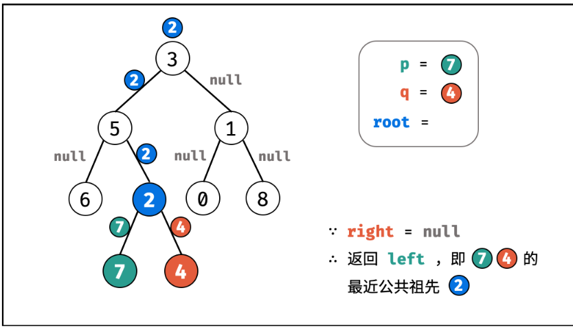

#  LeetCode 热题 HOT 100

:notebook: 表示记录在“大厂”那个笔记中

:bookmark: 表示在 ” 面经合集——题目+答案版“中

## 二分 :red_circle:

### [300. 最长递增子序列 ](https://leetcode-cn.com/problems/longest-increasing-subsequence/)  :notebook: 记录在“大厂”那个笔记中 :red_circle:

难度中等

给你一个整数数组 `nums` ，找到其中最长严格递增子序列的长度。

**子序列** 是由数组派生而来的序列，删除（或不删除）数组中的元素而不改变其余元素的顺序。例如，`[3,6,2,7]` 是数组 `[0,3,1,6,2,2,7]` 的子序列。

**示例 1：**

```C++
输入：nums = [10,9,2,5,3,7,101,18]
输出：4
解释：最长递增子序列是 [2,3,7,101]，因此长度为 4 。
```

**示例 2：**

```C++
输入：nums = [0,1,0,3,2,3]
输出：4
```

**示例 3：**

```C++
输入：nums = [7,7,7,7,7,7,7]
输出：1
```

 

**提示：**

- `1 <= nums.length <= 2500`
- `-104 <= nums[i] <= 104`

 

**进阶：**

- 你能将算法的时间复杂度降低到 `O(n log(n))` 吗?

（M如果是选出所有递增序列的话可以用回溯，查一下递增序列即可）


**解法总结**

维护tail数组  每次来一个数字就二分查找其存在这个tail数组的哪里，并存入


##### 解法1：动态规划法

[300. 最长递增子序列（动态规划 + 二分查找，清晰图解） - 最长递增子序列 - 力扣（LeetCode） (leetcode-cn.com)](https://leetcode-cn.com/problems/longest-increasing-subsequence/solution/zui-chang-shang-sheng-zi-xu-lie-dong-tai-gui-hua-2/)


```C++
class Solution {
public:
    int lengthOfLIS(vector<int>& nums) {
        vector<int> dp(nums.size(),1);
        int resmax=0;//
        for(int i=0;i<nums.size();i++)
        {
            for(int j=0;j<i;j++)
            {
                if(nums[j]<nums[i]) dp[i]=max(dp[i],dp[j]+1);
            }
            resmax=max(resmax,dp[i]);
        }
        // vector<int>::iterator it=dp.begin();
        // for(;it!=dp.end();it++)cout<<" "<<*it;
        // return dp[nums.size()-1];//不对 可能是中间的比较多 因为dp[i]代表的是以i为结尾的最长的 不一定是他 记住了吗 记住了!
        return resmax;
    }
};
```

##### 解法2：动态规划+二分查找

https://leetcode.cn/problems/longest-increasing-subsequence/solutions/24173/zui-chang-shang-sheng-zi-xu-lie-dong-tai-gui-hua-2/?envType=problem-list-v2&envId=2cktkvj


比如序列是78912345，前三个遍历完以后tail是789，这时候遍历到1，就得把1放到合适的位置，于是在tail二分查找1的位置，变成了189（如果序列在此时结束，因为res不变，所以依旧输出3），再遍历到2成为129，然后是123直到12345 这题难理解的核心不在于算法难，而在于在于官方给的例子太拉了，遇不到这个算法真正要解决的问题，即没有我例子中1要代替7的过程，

精妙之处就在于： 遍历nums拿出来的比我当前tail尾部更小的数，我遇见了就把它换进来，要是后续不能让这些稍小（相较于tail数组的尾部）的变成更长的子序列，那就超不过原先的，我也没有任何损失，但如果长度能超过之前的这些，我前面已经替换完了，随时准备着和你后面的组成更长的，只需要你来加到尾部就ok了。 更通俗点说，在一样长的最长子序列里面，我永远是所有元素最小的那个子序列，后面随便给我来一个元素，它可能跟我组成更长的，而不可能跟你组更长的，如果它跟我都不能组，跟你则更不可能组了，因为我最后一个元素比你小呀！


相当于 更新子序列了吧

（思路：构建tails 每次去更新就行了

25/05/03

```C++
class Solution {
public:
    int lengthOfLIS(vector<int>& nums) 
    {
        int n = nums.size();
        vector<int> tail;
        //41078523
        //478  找到第一个  >=5的：7-> 458 
        for(int i=0;i<n;i++)
        {
            if(tail.empty()||nums[i]>tail.back())tail.push_back(nums[i]);
            else
            {
                //严格递增 所以>= 不能放两个
                //upper_bound寻找第一个>5的 但是如果是5555 那么 t：5 既不会进上面的push 下面的也会找超出
                //而题目需要严格递增 所以如果是一样的数字 应该覆盖 所以应该寻找tail中第一个>=5的 覆盖
                //int index = upper_bound(tail.begin(),tail.end(),nums[i])-tail.begin();
                int index = lower_bound(tail.begin(),tail.end(),nums[i])-tail.begin();
                tail[index] = nums[i];
            };
        }
        return tail.size();
    }
};
```

> **深入理解本题的贪心策略:**
>
> ### 分步解释与证明
>
> 要理解该贪心算法的正确性，需明确以下几点：
>
> ---
>
> #### **1. 维护数组 `res` 的性质**
> - **`res` 是递增序列**：每次插入或替换操作均保证 `res` 严格递增。
> - **`res[i]` 表示长度为 `i+1` 的递增子序列的最小可能末尾元素**  
>   例如，若当前 `res = [2, 5, 7]`，则：
>   - 长度为1的递增子序列最小末尾是2；
>   - 长度为2的最小末尾是5；
>   - 长度为3的最小末尾是7。
>
> ---
>
> #### **2. 关键操作的解释**
> - **当 `nums[i] > res.back()`**  
>   直接追加到 `res`，因为当前元素能扩展最长子序列。
>   
> - **当 `nums[i] ≤ res.back()`**  
>   用 `lower_bound` 找到第一个 `≥ nums[i]` 的位置 `j`，替换 `res[j]` 为 `nums[i]`。  
>   **目的**：更新长度为 `j+1` 的子序列的末尾为更小的值，以便未来可能形成更长的子序列。(这地方有一些贪心的意味)
>
> ---
>
> #### **3. 正确性证明（数学归纳法）**
> **归纳基础**：初始时 `res` 为空，显然长度为0时成立。
>
> **归纳假设**：假设处理前 `k` 个元素后，`res` 满足：
> - `res` 递增；
> - `res[i]` 是前 `k` 个元素中长度为 `i+1` 的递增子序列的最小末尾。
>
> **归纳步骤**：处理第 `k+1` 个元素 `x = nums[k]`。
>
> - **情况1：`x > res.back()`**  
>   追加 `x` 到 `res`，此时新长度 `L+1`。由于 `x` 可接在长度为 `L` 的子序列后，形成更长的子序列，且 `x` 是该长度的最小末尾（因为之前无法形成更长的子序列）。
>
> - **情况2：`x ≤ res.back()`**  
>   找到 `j` 使得 `res[j]` 是第一个 `≥ x` 的元素，替换 `res[j] = x`。  
>   **为何可行**：  
>   - 存在一个长度为 `j` 的子序列，其末尾 `< x`（由 `res` 的递增性保证），因此可将 `x` 接在其后，形成长度为 `j+1` 的子序列，且末尾更小（优化了原 `res[j]`）。
>
> **结论**：处理完所有元素后，`res` 的长度即为最长递增子序列的长度。
>
> ---
>
> #### **4. 示例分析**
> 以数组 `[3, 0, 1, 2, 6, 4, 5]` 为例：
>
> | 步骤 | 当前元素 | res 操作                 | res 数组     | 解释                     |
> | ---- | -------- | ------------------------ | ------------ | ------------------------ |
> | 1    | 3        | 直接追加                 | [3]          | 初始长度为1              |
> | 2    | 0        | 替换3 → 0                | [0]          | 0是更小的长度为1的末尾   |
> | 3    | 1        | 替换res[1]（越界，追加） | [0, 1]       | 1 > 0，扩展长度为2       |
> | 4    | 2        | 替换1 → 2                | [0, 2]       | 替换后长度为2的末尾更小  |
> | 5    | 6        | 直接追加                 | [0, 2, 6]    | 6 > 2，扩展长度为3       |
> | 6    | 4        | 替换6 → 4                | [0, 2, 4]    | 4 < 6，优化长度为3的末尾 |
> | 7    | 5        | 替换res[3]（越界，追加） | [0, 2, 4, 5] | 5 > 4，扩展长度为4       |
>
> 最终 `res` 长度为4，对应最长递增子序列 `[0,1,2,5]` 或 `[0,2,4,5]`。
>
> ---
>
> #### **5. 算法优势**
> - **时间复杂度**：O(n log n)，优于动态规划的 O(n²)。
> - **空间复杂度**：O(n)，仅需维护数组 `res`。
>
> ---
>
> ### **总结**
> 该算法通过维护不同长度递增子序列的最小末尾元素，确保后续元素能高效地扩展更长序列。虽然 `res` 并非真实的最长子序列，但其长度正确反映了最长递增子序列的长度。贪心策略的核心在于通过替换优化末尾元素，为未来扩展保留最大可能性。


## 二叉树 :red_circle:


### [剑指 Offer 68 - II. 二叉树的最近公共祖先](https://leetcode-cn.com/problems/er-cha-shu-de-zui-jin-gong-gong-zu-xian-lcof/)   :notebook:  记录在“大厂”那个笔记中 :red_circle:

难度简单

给定一个二叉树, 找到该树中两个指定节点的最近公共祖先。

[百度百科](https://baike.baidu.com/item/最近公共祖先/8918834?fr=aladdin)中最近公共祖先的定义为：“对于有根树 T 的两个结点 p、q，最近公共祖先表示为一个结点 x，满足 x 是 p、q 的祖先且 x 的深度尽可能大（**一个节点也可以是它自己的祖先**）。”

例如，给定如下二叉树: root = [3,5,1,6,2,0,8,null,null,7,4]


 

**示例 1:**

```
输入: root = [3,5,1,6,2,0,8,null,null,7,4], p = 5, q = 1
输出: 3
解释: 节点 5 和节点 1 的最近公共祖先是节点 3。
```

**示例 2:**

```
输入: root = [3,5,1,6,2,0,8,null,null,7,4], p = 5, q = 4
输出: 5
解释: 节点 5 和节点 4 的最近公共祖先是节点 5。因为根据定义最近公共祖先节点可以为节点本身。
```

 ```C++
class Solution {
public:
    TreeNode* lowestCommonAncestor(TreeNode* root, TreeNode* p, TreeNode* q) {
        if(root==NULL)return NULL;
        if(root==p||root==q)return root;
        TreeNode* left=lowestCommonAncestor(root->left,p,q); 
        TreeNode* right=lowestCommonAncestor(root->right,p,q); 
        if(left==NULL)return right;
        else if(right==NULL)return left;
        else return root;

    }
};
 ```


具体见题解：https://leetcode.cn/problems/lowest-common-ancestor-of-a-binary-tree/?envType=problem-list-v2&envId=2cktkvj

 

会把状态一步步返回上去，

如果没找到，返回的就是null

1、找到了 会进入【1】，返回最近公共祖先

2、节点p/q是另一个q/p的祖先节点，返回【2】 // 或者找到了p / q 也会返回【2】


 ```C++
class Solution {
public:
    TreeNode* lowestCommonAncestor(TreeNode* root, TreeNode* p, TreeNode* q) {
        if(root==NULL)return NULL;
        if(root==p||root==q)return root;//【2】
        TreeNode* left=lowestCommonAncestor(root->left,p,q); 
        TreeNode* right=lowestCommonAncestor(root->right,p,q); 
        if(left==NULL)return right;//保证其会取非空的，即有结果是祖先的那个
        else if(right==NULL)return left;//保证其会取非空的
        else return root;//【1】//左右子树都找到p和q了，那就说明p和q分别在左右两个子树上，所以此时的最近公共祖先就是root

    }
};
 ```

是否是 后序 左右根？

> 一个辅助记忆的思考流程：
>
> 


方法二：存储父节点
思路

我们可以用哈希表存储所有节点的父节点，然后我们就可以利用节点的父节点信息从 p 结点开始不断往上跳，并记录已经访问过的节点，再从 q 节点开始不断往上跳，如果碰到已经访问过的节点，那么这个节点就是我们要找的最近公共祖先。

作者：力扣官方题解
链接：https://leetcode.cn/problems/lowest-common-ancestor-of-a-binary-tree/solutions/238552/er-cha-shu-de-zui-jin-gong-gong-zu-xian-by-leetc-2/


### 226. 翻转二叉树

题目地址：https://leetcode-cn.com/problems/invert-binary-tree/

翻转一棵二叉树。


可以发现想要翻转它，其实就把每一个节点的左右孩子交换一下就可以了。

关键在于遍历顺序，前中后序应该选哪一种遍历顺序？ （一些同学这道题都过了，但是不知道自己用的是什么顺序）

遍历的过程中去翻转每一个节点的左右孩子就可以达到整体翻转的效果。

**注意只要把每一个节点的左右孩子翻转一下，就可以达到整体翻转的效果**

**这道题目使用前序遍历和后序遍历都可以，唯独中序遍历不行，因为中序遍历会把某些节点的左右孩子翻转了两次！建议拿纸画一画，就理解了**

那么层序遍历可以不可以呢？**依然可以的！只要把每一个节点的左右孩子翻转一下的遍历方式都是可以的！**

#### 递归法

基于这递归三步法，代码基本写完，C++代码如下：

```C++
class Solution {
public:
    TreeNode* invertTree(TreeNode* root) {
        if (root == NULL) return root;
        swap(root->left, root->right);  // 中
        invertTree(root->left);         // 左
        invertTree(root->right);        // 右
        return root;
    }
};
```

m

```C++

class Solution {
public:
    TreeNode* invertTree(TreeNode* root) {
        if(root==nullptr)return nullptr;
        TreeNode *left = root->left;
        TreeNode * right = root->right;
        root->left = right;
        root->right = left;
        invertTree(left);
        invertTree(right);
        return root;
    }
};
```


#### 迭代法

##### 深度优先遍历


[二叉树：听说递归能做的，栈也能做！](https://mp.weixin.qq.com/s/OH7aCVJ5-Gi32PkNCoZk4A)中给出了前中后序迭代方式的写法，所以本地可以很轻松的切出如下迭代法的代码：

C++代码迭代法（前序遍历）

```C++
class Solution {
public:
    TreeNode* invertTree(TreeNode* root) {
        if (root == NULL) return root;
        stack<TreeNode*> st;
        st.push(root);
        while(!st.empty()) {
            TreeNode* node = st.top();              // 中
            st.pop();
            swap(node->left, node->right);
            if(node->right) st.push(node->right);   // 右
            if(node->left) st.push(node->left);     // 左
        }
        return root;
    }
};
```


##### 广度优先遍历

也就是层序遍历，层数遍历也是可以翻转这棵树的，因为层序遍历也可以把每个节点的左右孩子都翻转一遍，代码如下：

```C++
class Solution {
public:
    TreeNode* invertTree(TreeNode* root) {
        queue<TreeNode*> que;
        if (root != NULL) que.push(root);
        while (!que.empty()) {
            int size = que.size();
            for (int i = 0; i < size; i++) {
                TreeNode* node = que.front();
                que.pop();
                swap(node->left, node->right); // 节点处理
                if (node->left) que.push(node->left);
                if (node->right) que.push(node->right);
            }
        }
        return root;
    }
};
```

如果对以上代码不理解，或者不清楚二叉树的层序遍历，可以看这篇[二叉树：层序遍历登场！](https://mp.weixin.qq.com/s/4-bDKi7SdwfBGRm9FYduiA)

#### 拓展 

**文中我指的是递归的中序遍历是不行的，因为使用递归的中序遍历，某些节点的左右孩子会翻转两次。**

如果非要使用递归中序的方式写，也可以，如下代码就可以避免节点左右孩子翻转两次的情况：

```C++
class Solution {
public:
    TreeNode* invertTree(TreeNode* root) {
        if (root == NULL) return root;
        invertTree(root->left);         // 左
        swap(root->left, root->right);  // 中
        invertTree(root->left);         // 注意 这里依然要遍历左孩子，因为中间节点已经翻转了
        return root;
    }
};
```

代码虽然可以，但这毕竟不是真正的递归中序遍历了。

但使用迭代方式统一写法的中序是可以的。

代码如下：

```C++
class Solution {
public:
    TreeNode* invertTree(TreeNode* root) {
        stack<TreeNode*> st;
        if (root != NULL) st.push(root);
        while (!st.empty()) {
            TreeNode* node = st.top();
            if (node != NULL) {
                st.pop();
                if (node->right) st.push(node->right);  // 右
                st.push(node);                          // 中
                st.push(NULL);
                if (node->left) st.push(node->left);    // 左

            } else {
                st.pop();
                node = st.top();
                st.pop();
                swap(node->left, node->right);          // 节点处理逻辑
            }
        }
        return root;
    }
};

```

为什么这个中序就是可以的呢，因为这是用栈来遍历，而不是靠指针来遍历，避免了递归法中翻转了两次的情况，大家可以画图理解一下，这里有点意思的。

#### 总结

针对二叉树的问题，解题之前一定要想清楚究竟是前中后序遍历，还是层序遍历。

**二叉树解题的大忌就是自己稀里糊涂的过了（因为这道题相对简单），但是也不知道自己是怎么遍历的。**

这也是造成了二叉树的题目“一看就会，一写就废”的原因。

**针对翻转二叉树，我给出了一种递归，三种迭代（两种模拟深度优先遍历，一种层序遍历）的写法，都是之前我们讲过的写法，融汇贯通一下而已。**

大家一定也有自己的解法，但一定要成方法论，这样才能通用，才能举一反三


## 字典树

### [208. 实现 Trie (前缀树)](https://leetcode.cn/problems/implement-trie-prefix-tree/)

**[Trie](https://baike.baidu.com/item/字典树/9825209?fr=aladdin)**（发音类似 "try"）或者说 **前缀树** 是一种树形数据结构，用于高效地存储和检索字符串数据集中的键。这一数据结构有相当多的应用情景，例如自动补全和拼写检查。

请你实现 Trie 类：

- `Trie()` 初始化前缀树对象。
- `void insert(String word)` 向前缀树中插入字符串 `word` 。
- `boolean search(String word)` 如果字符串 `word` 在前缀树中，返回 `true`（即，在检索之前已经插入）；否则，返回 `false` 。
- `boolean startsWith(String prefix)` 如果之前已经插入的字符串 `word` 的前缀之一为 `prefix` ，返回 `true` ；否则，返回 `false` 。

 

#### 代码

https://leetcode.cn/problems/implement-trie-prefix-tree/solutions/98390/trie-tree-de-shi-xian-gua-he-chu-xue-zhe-by-huwt/?envType=problem-list-v2&envId=2cktkvj

Y

```C++
class Trie {
public:
    struct Node
    {
        bool isEnd;
        Node* next[26];
    };
    Node* head;
    Trie() 
    {
        head = new Node();
    }
    
    void insert(string word) 
    {
        Node* p =head;
        for(char c:word)
        {
            if(p->next[c-'a']==nullptr)
            {
                p->next[c-'a'] = new Node();
            }
            p=p->next[c-'a'] ;
        }
        p->isEnd = true;
    }
    
    bool search(string word) 
    {
        Node* p =head;
        for(char c:word)
        {
            if(p->next[c-'a']==nullptr)
            {
                return false;
            }
            p=p->next[c-'a'] ;
        }
        if(p->isEnd == true)
        {
            return true;
        }

        return false;
    }
    
    bool startsWith(string prefix) 
    {
        Node* p =head;
        for(char c:prefix)
        {
            if(p->next[c-'a']==nullptr)
            {
                return false;
            }
            p=p->next[c-'a'] ;
        }
        return true;
    }
};

/**
 * Your Trie object will be instantiated and called as such:
 * Trie* obj = new Trie();
 * obj->insert(word);
 * bool param_2 = obj->search(word);
 * bool param_3 = obj->startsWith(prefix);
 */
```

或者让trie本身是一个node 

```C++
class Trie {
private:
    bool isEnd;
    Trie* next[26];
public:
    //Trie* node = new node();错误！！这样写会编译错误 递归调用构造函数
    Trie() {
        isEnd = false;
        memset(next, 0, sizeof(next));
    }
    
    void insert(string word) {
        Trie* node = this;
        for (char c : word) {
            if (node->next[c-'a'] == NULL) {
                node->next[c-'a'] = new Trie();
            }
            node = node->next[c-'a'];
        }
        node->isEnd = true;
    }
    
    bool search(string word) {
        Trie* node = this;
        for (char c : word) {
            node = node->next[c - 'a'];
            if (node == NULL) {
                return false;
            }
        }
        return node->isEnd;
    }
    
    bool startsWith(string prefix) {
        Trie* node = this;
        for (char c : prefix) {
            node = node->next[c-'a'];
            if (node == NULL) {
                return false;
            }
        }
        return true;
    }
};


作者：路漫漫我不畏
链接：https://leetcode.cn/problems/implement-trie-prefix-tree/solutions/98390/trie-tree-de-shi-xian-gua-he-chu-xue-zhe-by-huwt/
来源：力扣（LeetCode）
著作权归作者所有。商业转载请联系作者获得授权，非商业转载请注明出处。
```


## 链表

### 7.Leetcode 160 相交链表  大厂笔记 :notebook:

//第二次看答案了

编写一个程序，找到两个单链表相交的起始节点。

**本题思路比较独特,需要仔细思考并记住这类题目的做法**

[160. 相交链表（双指针，清晰图解） - 相交链表 - 力扣（LeetCode） (leetcode-cn.com)](https://leetcode-cn.com/problems/intersection-of-two-linked-lists/solution/intersection-of-two-linked-lists-shuang-zhi-zhen-l/)


25/3/3

如果是环形的 

1、如果相遇之前个数不一样，第二轮遇到


2、个数一样 第一轮会遇到 不会进 pa==nullptr?


如果非环形，个数一样，一起遍历完一起为null  ； 个数不一样 第二轮一起为null

```C++
class Solution {
public:
    ListNode *getIntersectionNode(ListNode *headA, ListNode *headB) {
        ListNode *pa  =headA,*pb = headB;
        //如果是环形的 1、如果相遇之前个数不一样，第二轮遇到 2、个数一样 第一轮会遇到
        while(pa!=pb)
        {
            pa = pa==nullptr?headB:pa->next;
            pb = pb==nullptr?headA:pb->next;
        }
        return pa;
    }
};
```


### [234. 回文链表](https://leetcode.cn/problems/palindrome-linked-list/) 简单

给你一个单链表的头节点 `head` ，请你判断该链表是否为回文链表。如果是，返回 `true` ；否则，返回 `false` 。

 

**示例 1：**


```
输入：head = [1,2,2,1]
输出：true
```

**示例 2：**


```
输入：head = [1,2]
输出：false
```

 

**提示：**

- 链表中节点数目在范围`[1, 105]` 内
- `0 <= Node.val <= 9`


```C++
/**
 * Definition for singly-linked list.
 * struct ListNode {
 *     int val;
 *     ListNode *next;
 *     ListNode() : val(0), next(nullptr) {}
 *     ListNode(int x) : val(x), next(nullptr) {}
 *     ListNode(int x, ListNode *next) : val(x), next(next) {}
 * };
 */
class Solution 
{
public:
    bool isPalindrome(ListNode* head) 
    {
        vector<int> huiwen;
        ListNode * p = head;
        while(p!=nullptr)
        {
            huiwen.push_back(p->val);
            p=p->next;
        }
        int n = huiwen.size();
        for(int i=0;i<n/2;i++)
        {
            if(huiwen[i]!=huiwen[n-i-1])return false;
        }
        return true;
    }
};
```


M2

O(1) 空间做法：寻找中间节点+反转链表

使用**快慢指针**在一次遍历中找到中间：慢指针一次走一步，快指针一次走两步，快慢指针同时出发。当快指针移动到链表的末尾时，慢指针恰好到链表的中间。通过慢指针将链表分为两部分。


有时间尝试一下

### [146. LRU 缓存](https://leetcode.cn/problems/lru-cache/)

请你设计并实现一个满足 [LRU (最近最少使用) 缓存](https://baike.baidu.com/item/LRU) 约束的数据结构。

实现 `LRUCache` 类：

- `LRUCache(int capacity)` 以 **正整数** 作为容量 `capacity` 初始化 LRU 缓存
- `int get(int key)` 如果关键字 `key` 存在于缓存中，则返回关键字的值，否则返回 `-1` 。
- `void put(int key, int value)` 如果关键字 `key` 已经存在，则变更其数据值 `value` ；如果不存在，则向缓存中插入该组 `key-value` 。如果插入操作导致关键字数量超过 `capacity` ，则应该 **逐出** 最久未使用的关键字。

函数 `get` 和 `put` 必须以 `O(1)` 的平均时间复杂度运行。

 

**示例：**

```
输入
["LRUCache", "put", "put", "get", "put", "get", "put", "get", "get", "get"]
[[2], [1, 1], [2, 2], [1], [3, 3], [2], [4, 4], [1], [3], [4]]
输出
[null, null, null, 1, null, -1, null, -1, 3, 4]

解释
LRUCache lRUCache = new LRUCache(2);
lRUCache.put(1, 1); // 缓存是 {1=1}
lRUCache.put(2, 2); // 缓存是 {1=1, 2=2}
lRUCache.get(1);    // 返回 1
lRUCache.put(3, 3); // 该操作会使得关键字 2 作废，缓存是 {1=1, 3=3}
lRUCache.get(2);    // 返回 -1 (未找到)
lRUCache.put(4, 4); // 该操作会使得关键字 1 作废，缓存是 {4=4, 3=3}
lRUCache.get(1);    // 返回 -1 (未找到)
lRUCache.get(3);    // 返回 3
lRUCache.get(4);    // 返回 4
```


**双向链表+哈希表**

https://leetcode.cn/problems/lru-cache/description/?envType=problem-list-v2&envId=2cktkvj

```C++
struct DLinkedNode {
    int key, value;
    DLinkedNode* prev;
    DLinkedNode* next;
    DLinkedNode(): key(0), value(0), prev(nullptr), next(nullptr) {}
    DLinkedNode(int _key, int _value): key(_key), value(_value), prev(nullptr), next(nullptr) {}
};

class LRUCache {
private:
    unordered_map<int, DLinkedNode*> cache;
    DLinkedNode* head;
    DLinkedNode* tail;
    int size;
    int capacity;

public:
    LRUCache(int _capacity): capacity(_capacity), size(0) 
    {
        // 使用伪头部和伪尾部节点
        head = new DLinkedNode();
        tail = new DLinkedNode();
        head->next = tail;
        tail->prev = head;
    }
    
    int get(int key) 
    {
        if (!cache.count(key)) 
        {
            return -1;
        }
        // 如果 key 存在，先通过哈希表定位，再移到头部
        DLinkedNode* node = cache[key];
        moveToHead(node);
        return node->value;
    }
    
    void put(int key, int value) 
    {
        if (!cache.count(key))
        {
            // 如果 key 不存在，创建一个新的节点
            DLinkedNode* node = new DLinkedNode(key, value);
            // 添加进哈希表
            cache[key] = node; // 必须要放在这
            // 添加至双向链表的头部
            addToHead(node);
            ++size;
            if (size > capacity)  //判断 if(cache.size()>capacity)也可以
            {
                // 如果超出容量，删除双向链表的尾部节点
                DLinkedNode* removed = removeTail();
                // 删除哈希表中对应的项
                cache.erase(removed->key);
                // 防止内存泄漏
                delete removed;
                --size;
            }
        }
        else 
        {
            // 如果 key 存在，先通过哈希表定位，再修改 value，并移到头部
            DLinkedNode* node = cache[key];
            node->value = value;
            moveToHead(node);
        }
    }

    void addToHead(DLinkedNode* node) 
    {
        node->prev = head;
        node->next = head->next;
        head->next->prev = node;
        head->next = node;
    }
    
    void removeNode(DLinkedNode* node) 
    {
        node->prev->next = node->next;
        node->next->prev = node->prev;
    }

    void moveToHead(DLinkedNode* node)
    {
        removeNode(node);
        addToHead(node);
    }

    DLinkedNode* removeTail()
    {
        DLinkedNode* node = tail->prev;
        removeNode(node);
        return node;
    }
};
```


## 单调栈  :red_circle:

### [739. 每日温度](https://leetcode-cn.com/problems/daily-temperatures/)  :notebook:   :red_circle: 

给定一个整数数组 temperatures ，表示每天的温度，返回一个数组 answer ，其中 answer[i] 是指在第 i 天之后，才会有更高的温度。如果气温在这之后都不会升高，请在该位置用 0 来代替。

 

示例 1:

输入: temperatures = [73,74,75,71,69,72,76,73]
输出: [1,1,4,2,1,1,0,0]
示例 2:

输入: temperatures = [30,40,50,60]
输出: [1,1,1,0]
示例 3:

输入: temperatures = [30,60,90]
输出: [1,1,0]


提示：

1 <= temperatures.length <= 105
30 <= temperatures[i] <= 100


**及时去掉无用数据，保证栈中元素有序**

这个视频讲解很清晰https://www.bilibili.com/video/BV1VN411J7S7/?vd_source=f2def4aba42c7ed69fc648e1a2029c7b

思路一：从右到左 保持栈中下降


比栈顶小的就插入 否则弹出

stack存储下标

632 保持栈中下降

```C++
class Solution {
public:
    vector<int> dailyTemperatures(vector<int>& temperatures) {
        int n=temperatures.size();
        vector<int> res(n);
        stack<int> s;
        for(int i=n-1;i>=0;i--)
        {
            //如果栈不是空 且当前元素>=栈顶元素 pop出来 
            while(!s.empty()&&temperatures[i]>=temperatures[s.top()])s.pop();//stk存储的是下标！！要取出
            if(s.empty())res[i]=0;
            else res[i]=s.top()-i;
            s.push(i);
        }
        return res;
    }
};
```

>
>
>注意：
>
> `while(!s.empty()&&temperatures[i]>=temperatures[s.top()])s.pop();`//stk存储的是下标！！要取出来 temperatures[s.top()]

思路二：从前往后的单调栈


43 保持栈中下降

```C++
class Solution {
public:
    vector<int> dailyTemperatures(vector<int>& temperatures) {
        int n=temperatures.size();
        vector<int> res(n,0);
        stack<int> s;
        //1 4 3 2 1 5
        for(int i=0;i<n;i++)
        {
            while(!s.empty()&&temperatures[i]>temperatures[s.top()])//不能取等号
            //不能取等号/因为这个温度相等的不能让它弹出 因为不是比他大的
            {
                //记录完了 可以滚了  4 3 2 1 滚
                res[s.top()]=i-s.top();
                s.pop();
            }
            s.push(i);//5
        }
        return res;
    }
};
```


## 排序

### [215. 数组中的第K个最大元素 ](https://leetcode.cn/problems/kth-largest-element-in-an-array/) :bookmark: 

给定整数数组 `nums` 和整数 `k`，请返回数组中第 `**k**` 个最大的元素。

请注意，你需要找的是数组排序后的第 `k` 个最大的元素，而不是第 `k` 个不同的元素。

你必须设计并实现时间复杂度为 `O(n)` 的算法解决此问题。

 

**示例 1:**

```
输入: [3,2,1,5,6,4], k = 2
输出: 5
```

**示例 2:**

```
输入: [3,2,3,1,2,4,5,5,6], k = 4
输出: 4
```

 #### M1 库函数

```C++
class Solution {
public:
    int findKthLargest(vector<int>& nums, int k) 
    {
        nth_element(nums.begin(),nums.begin()+k-1,nums.end(),greater<int>{});
        return  nums[k-1];
    }
};
```

#### M2 快速选择

```C++
class Solution {
public:
    int quickSort(vector<int>& nums,int k,int l,int r)//实际上 我们要知道 这个k是下标 而不是个数
    {
        if(l>=r)return nums[k];
        int i=l-1,j=r+1;
        int flag = nums[(l+((r-l)>>1))];
        while(i<j)//while(i<=j)错误
        {
            do i++;while(nums[i]>flag);
            do j--;while(nums[j]<flag);
            if(i<j)swap(nums[i],nums[j]);//！！！！
        }
        if(k<=j) return quickSort(nums,k,l,j);//k j是下标 //
        else return quickSort(nums,k,j+1,r);
    }
    int findKthLargest(vector<int>& nums, int k) 
    {
        // nth_element(nums.begin(),nums.begin()+k-1,nums.end(),greater<int>{});
        // return  nums[k-1];
        int n=nums.size();
        return quickSort(nums,k-1,0,n-1);//!!!k-1 实际上 我们要知道 这个k-1是下标  而不是个数
    }
};
```

更具体以及堆排做法 请看:bookmark: 


# 动态规划

### [221. 最大正方形](https://leetcode.cn/problems/maximal-square/)

在一个由 `'0'` 和 `'1'` 组成的二维矩阵内，找到只包含 `'1'` 的最大正方形，并返回其面积。

 

**示例 1：**


```
输入：matrix = [["1","0","1","0","0"],["1","0","1","1","1"],["1","1","1","1","1"],["1","0","0","1","0"]]
输出：4
```


#### 题解

记录**边长**~！


#### 代码：

```C++
class Solution {
public:
    int maximalSquare(vector<vector<char>>& matrix) {
        //前缀和 = 个数
        int m = matrix.size(),n=matrix[0].size();
        vector<vector<int>> dp(m+1,vector<int>(n+1,0));
        int maxNum=0;
        for(int i=0;i<m;i++)
        {
            for(int j=0;j<n;j++)
            {
                if(matrix[i][j]=='1')dp[i+1][j+1] = min({dp[i][j],dp[i+1][j],dp[i][j+1]})+1;
                maxNum = max(maxNum,dp[i+1][j+1]);
            }
        }
        return maxNum*maxNum;//记住 我们记录的是边长 所以最后返回边长的平方！
    }
};
```


## **完全背包**


### [279. 完全平方数](https://leetcode.cn/problems/perfect-squares/)  :red_circle: 

给你一个整数 `n` ，返回 *和为 `n` 的完全平方数的最少数量* 。

**完全平方数** 是一个整数，其值等于另一个整数的平方；换句话说，其值等于一个整数自乘的积。例如，`1`、`4`、`9` 和 `16` 都是完全平方数，而 `3` 和 `11` 不是。

 

**示例 1：**

```
输入：n = 12
输出：3 
解释：12 = 4 + 4 + 4
```

**示例 2：**

```
输入：n = 13
输出：2
解释：13 = 4 + 9
```


#### 解法1：背包

https://leetcode.cn/problems/perfect-squares/solutions/2830762/dong-tai-gui-hua-cong-ji-yi-hua-sou-suo-3kz1g/?envType=problem-list-v2&envId=2cktkvj

把 1,4,9,16,⋯ 这些完全平方数视作物品体积，物品价值都是 1。由于每个数（物品）选的次数没有限制，所以本题是一道标准的**完全背包**问题。

`f[i][j] `的表示从前 i 个完全平方数中选一些数（可以重复选），满足元素和恰好等于 j，最少要选的数字个数。

一种是不选，一种是选


----------


#### 解法2： 空间优化

观察上面的状态转移方程，在计算 *f*[*i*] 时，只会用到 *f*[*i*−1]，不会用到比 *i*−1 更早的状态。

https://leetcode.cn/problems/perfect-squares/solutions/17639/hua-jie-suan-fa-279-wan-quan-ping-fang-shu-by-guan/?envType=problem-list-v2&envId=2cktkvj

```c++
// #include<bits/stdc++.h>
// dp[i] 表示数字i最少可以由几个完全平方数相加构成
// 位置i只依赖 i-j*j 的位置，如 i-1、i-4、i-9 等等位置，才能满足完全平方分割的条件。
// 因此dp[i]可以取的最小值即为 1 + min(dp[i-1],dp[i-4],dp[i-9]...)
class Solution {
public:
    int numSquares(int n) {
        vector<int> dp(n + 1, 0);
        for (int i = 1; i <= n; ++i) 
        {
            dp[i] = i;  // 最坏的情况: 所有被加起来的完全平方数都是1
            for (int j = 1; i - j * j >= 0; ++j) //(i-j*j)>=0 要有等号 表示正好扣为0
            {
                dp[i] = std::min(dp[i], dp[i - j * j] + 1);  // dp[i] 表示数字i最少可以由几个完全平方数相加构成
            }
        }

        return dp[n];
        
    }
};
```


# 图

### [207. 课程表](https://leetcode.cn/problems/course-schedule/)

你这个学期必须选修 `numCourses` 门课程，记为 `0` 到 `numCourses - 1` 。

在选修某些课程之前需要一些先修课程。 先修课程按数组 `prerequisites` 给出，其中 `prerequisites[i] = [ai, bi]` ，表示如果要学习课程 `ai` 则 **必须** 先学习课程 `bi` 。

- 例如，先修课程对 `[0, 1]` 表示：想要学习课程 `0` ，你需要先完成课程 `1` 。

请你判断是否可能完成所有课程的学习？如果可以，返回 `true` ；否则，返回 `false` 。

 

**示例 1：**

```
输入：numCourses = 2, prerequisites = [[1,0]]
输出：true
解释：总共有 2 门课程。学习课程 1 之前，你需要完成课程 0 。这是可能的。
```

**示例 2：**

```
输入：numCourses = 2, prerequisites = [[1,0],[0,1]]
输出：false
解释：总共有 2 门课程。学习课程 1 之前，你需要先完成课程 0 ；并且学习课程 0 之前，你还应先完成课程 1 。这是不可能的。
```

https://leetcode.cn/problems/course-schedule/solutions/250377/bao-mu-shi-ti-jie-shou-ba-shou-da-tong-tuo-bu-pai-/?envType=problem-list-v2&envId=2cktkvj
```C++
class Solution {
public:
    bool canFinish(int numCourses, vector<vector<int>>& prerequisites) {
        
        vector<int> inDegree(numCourses);//准备一个vector记录每个节点（课）的入度
        unordered_map<int, vector<int>> map;//准备一个哈希表/二维邻接矩阵记录课与课（节点）之间的关系 int -> vector<int>
        for (int i = 0; i < prerequisites.size(); ++i) {//遍历所有requistes，获取入度和所有关系
            inDegree[prerequisites[i][0]]++; //记录入度
            map[prerequisites[i][1]].push_back(prerequisites[i][0]);//记录所有关系
        }
        //定义一个队列，进行BFS广度优先遍历，遍历入度为0的课
        queue<int> que;
        for (int i = 0; i < numCourses; ++i) 
        {
            if (inDegree[i] == 0) que.push(i); //将入度为0的课放入队列
        }
        int count = 0;//用于记录有多少门课已经上过了
        //遍历inDegree，更新入度，更新inDegree，直到inDegree的size为0，再确认count是否等于numCourses
        while (que.size()) 
        {
            int selected = que.front();
            que.pop();
            count++;
            //更新所有关联课程的入度
            for (int i = 0; i < map[selected].size(); ++i) 
            {
                if (inDegree[map[selected][i]] > 0) 
                {
                    inDegree[map[selected][i]]--;
                    if(inDegree[map[selected][i]] == 0) 
                        que.push(map[selected][i]);//将入度降至0的课程放入队列
                }
            }

        }
        if (count == numCourses)
            return true;
        else
            return false;

    }
};
```

本题是一道经典的「拓扑排序」问题。

以上代码用的层序遍历bfs，实际上 用dfs 也行

Y：

```C++
class Solution {
public:
    bool canFinish(int numCourses, vector<vector<int>>& prerequisites) 
    {
        vector<int> indegrees(numCourses,0);
        // vector<int> indegrees;
        unordered_map<int,vector<int>> adj(numCourses);
        int nq = prerequisites.size();
        for(int i=0;i<nq;i++)
        {
            //b->a ba=1
            int a = prerequisites[i][0],b=prerequisites[i][1];
            indegrees[a]++;
            adj[b].push_back(a);
        }
        queue<int> que;
        for(int i=0;i<numCourses;i++)
        {
            if(indegrees[i]==0)
                que.push(i);
        }
        int couN=0;
        while(!que.empty())
        {
            int course = que.front();
            que.pop();
            couN++;
            for(int a :adj[course])
            {
                indegrees[a]--;
                //如果是循环的 入度就不会是0 就不会进来
                if(indegrees[a]==0)que.push(a);
            }
        }
        return couN == numCourses;

    }
};
```

