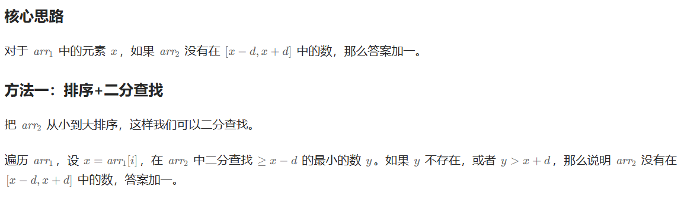
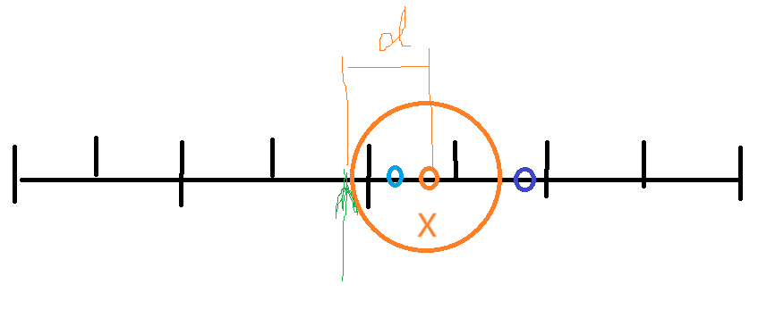
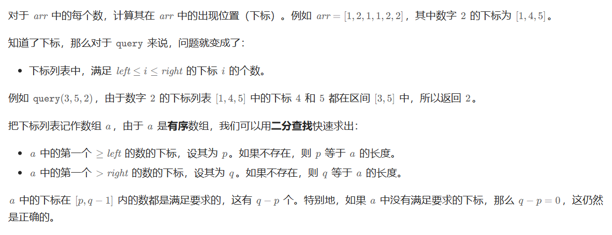
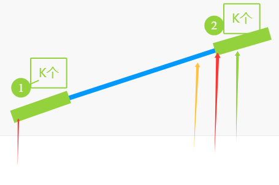
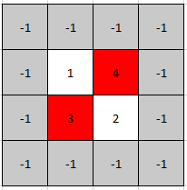

# Leetcode——二分算法专题

参考：[分享丨【题单】二分算法（二分答案/最小化最大值/最大化最小值/第K小） - 力扣（LeetCode）](https://leetcode.cn/circle/discuss/SqopEo/)

# 一、基础

## 1.[34. 在排序数组中查找元素的第一个和最后一个位置 - 力扣（LeetCode）](https://leetcode.cn/problems/find-first-and-last-position-of-element-in-sorted-array/description/)

一道算是板子题的题目，需要记住对应的写法：

```c++
class Solution {
public:
    int lower_bound(vector<int>& nums, int target){ //求解第一个>=target的索引
        int left = 0, right = nums.size()-1;
        while(left<=right){ //记住:左闭右闭的写法
            int mid = ((left+right)>>1); //本题不会越界
            if(nums[mid]<target){
                left = mid + 1;
            } else {
                right = mid - 1;
            }
        }
        return left; 
    }
    vector<int> searchRange(vector<int>& nums, int target) {
        //求解第一个>=target的值,作为左边界
        int lower = lower_bound(nums, target);
        if(lower==nums.size() || nums[lower]>target){
            //此时不用再算右边界了
            return {-1,-1};
        }
        //此时一定有右边界,因为至少有一个数相等,计算最后一个<=target的数,等同于第一个>target的数索引-1,等同于第一个>=(target+1)的数索引-1
        int upper = lower_bound(nums, target+1)-1;
        return {lower, upper};
    }
};
```


二分 [ 左闭 , 右闭 ] 板子：

```C++
int lower_bound(vector<int>& nums, int target) //求解第一个>=target的索引
{
        int left = 0, right = nums.size()-1;
        while(left<=right)//记住:左闭右闭的写法
        { 
            int mid = ((left+right)>>1); //本题不会越界
            if(nums[mid]<target)
            {
                left = mid + 1;
            }
            else 
            {
                right = mid - 1;
            }
        }
        return left; 
    }
```

>1、`while(left<=right)` 需要等号，否则 相等（指向同一个数）情况将不会进入判断
>
>2、可以使用库函数`lower_bound`函数表示第一个>=的
>
>3、其他情况都可以转换：
>
> 	1)  如  [第一个>t 的 ] 等价于  [第一个>=（t+1）的 ]
> 	2)  如  [最后一个<=t 的 ] 等价于  [第一个>=（t+1）-1 的 ]   

## 2.[35. 搜索插入位置](https://leetcode.cn/problems/search-insert-position/)

一道非常常规的板子题：

```c++
class Solution {
public:
    int lower_bound(vector<int>& nums, int target){
        int left = 0, right = nums.size()-1;
        while(left<=right){
            int mid = left + ((right-left)>>1);
            if(nums[mid]<target){
                left = mid+1;
            } else right = mid-1;
        }
        return left;
    }
    int searchInsert(vector<int>& nums, int target) {
        //找到第一个>=target的值
        int index = lower_bound(nums, target); //放入到第一个>=target的位置
        return index; 
    }
};
```


## 3.[2529. 正整数和负整数的最大计数 - 力扣（LeetCode）](https://leetcode.cn/problems/maximum-count-of-positive-integer-and-negative-integer/description/)

```c++
class Solution {
public:
    int lower_bound(vector<int>& nums, int target){
        int left = 0, right = nums.size()-1;
        while(left<=right){
            int mid = left+ ((right-left)>>1);
            if(nums[mid]<target){
                left = mid + 1;
            } else {
                right = mid - 1;
            }
        }
        return left;
    }
    int maximumCount(vector<int>& nums) {
        //找到最后一个<0的索引,以及第一个>0的索引
        int negIndex = lower_bound(nums, 0) - 1; //第一个>=0的索引-1
        int posIndex = lower_bound(nums, 1); //第一个>=1的索引
        int n = nums.size();
        return max(negIndex+1, n-posIndex);
    }
};
```


## [744. 寻找比目标字母大的最小字母](https://leetcode.cn/problems/find-smallest-letter-greater-than-target/)

给你一个字符数组 `letters`，该数组按**非递减顺序**排序，以及一个字符 `target`。`letters` 里**至少有两个不同**的字符。

返回 `letters` 中大于 `target` 的最小的字符。如果不存在这样的字符，则返回 `letters` 的第一个字符。

**示例 1：**

```
输入: letters = ["c", "f", "j"]，target = "a"
输出: "c"
解释：letters 中字典上比 'a' 大的最小字符是 'c'。
```


```C++
class Solution {
public: 
    char nextGreatestLetter(vector<char>& letters, char target) {
        int n = letters.size();
        int l = 0,r = n-1;
        //第一个>（t）的 ---- 第一个>=（t+1）
        int index = lower_bound(letters.begin(),letters.end(),target+1)-letters.begin();
        if(index>=n)return letters[0];
        return letters[index];
    }
};
```


```C++
class Solution {
public: 
    char nextGreatestLetter(vector<char>& letters, char target) {
        int n = letters.size();
        int l = 0,r = n-1;
        //第一个>（t）的 ---- 第一个>=（t+1）
        //1 2 3 4 6
        while(l<=r) //[!]
        {
            int mid = ((l+r)>>1);
            if(letters[mid]<(target+1))
            {
                l = mid+1;
            }
            else
            {
                r=mid-1;
            }
        }
        if(l>=n)return letters[0];
        return letters[l];
    }
};
```


# 二、进阶

部分题目需要先排序，然后在有序数组上二分查找。

## 1.[2300. 咒语和药水的成功对数](https://leetcode.cn/problems/successful-pairs-of-spells-and-potions/)

对于二分的题目来说，千万不要不要忘了sort！！

```c++
class Solution {
public:
    int lower_bound(vector<int>& potions, long long target){
        int left = 0, right = potions.size()-1;
        while(left<=right){
            int mid = left + ((right-left)>>1);
            if((long long)potions[mid]<target){
                left = mid + 1;
            } else{
                right = mid - 1;
            }
        }
        return left;
    }
    vector<int> successfulPairs(vector<int>& spells, vector<int>& potions, long long success) {
        //找到potions第一个>= ceil(success/spells[cur])的元素,该元素以及后面的都可以成功
        sort(potions.begin(), potions.end());
        int n = spells.size();
        int m = potions.size();
        vector<int> res(n);
        for(int i=0;i<n;i++){
            long long target = (success + spells[i] - 1) / spells[i]; //向上取整
            int index = lower_bound(potions, target);
            res[i] = m - index;
        }
        return res;
    }
};
```


## [1385. 两个数组间的距离值](https://leetcode.cn/problems/find-the-distance-value-between-two-arrays/)

给你两个整数数组 `arr1` ， `arr2` 和一个整数 `d` ，请你返回两个数组之间的 **距离值** 。

「**距离值**」 定义为符合此距离要求的元素数目：对于元素 `arr1[i]` ，不存在任何元素 `arr2[j]` 满足 `|arr1[i]-arr2[j]| <= d` 。


https://leetcode.cn/problems/find-the-distance-value-between-two-arrays/solutions/3010185/liang-chong-fang-fa-er-fen-cha-zhao-san-15u9b/



:large_blue_circle: :blue inside [x-d,x+d]

:purple_heart:purple >x+d



```C++
class Solution {
public:
    //10
    int low_bound(vector<int> &arr,int target)
    {
        int l = 0;
        int r = arr.size()-1;
        while(l<=r)
        {
            int mid = ((l+r)>>1);
            if(arr[mid]<target)
            {
                l = mid+1;
            }
            else
            {
                r=mid-1;
            }
        }
        return l;
    }
    int findTheDistanceValue(vector<int>& arr1, vector<int>& arr2, int d) {
        //n
        // arr2[i] - num > d
        //
        // arr1 寻找arr2中距离num最近的元素 看是不是>d
        // 第一个>=num的和其左边的
        int n = arr2.size();
        sort(arr2.begin(),arr2.end());
        int cnt=0;
        for(int i=0;i<arr1.size();i++)
        {
            int num = arr1[i];
            int index = low_bound(arr2,num-d);
            //int index = lower_bound(arr2.begin(),arr2.end(),num-d)-arr2.begin(); //use this is ok too
            if(arr2[index]>num+d||index>=n)
            {
                cnt++;
            }
        }
        return cnt;
    }
};
```


## [2389. 和有限的最长子序列](https://leetcode.cn/problems/longest-subsequence-with-limited-sum/)

给你一个长度为 `n` 的整数数组 `nums` ，和一个长度为 `m` 的整数数组 `queries` 。

返回一个长度为 `m` 的数组 `answer` ，其中 `answer[i]` 是 `nums` 中 元素之和小于等于 `queries[i]` 的 **子序列** 的 **最大** 长度 。

**子序列** 是由一个数组删除某些元素（也可以不删除）但不改变剩余元素顺序得到的一个数组。

**示例 1：**

```
输入：nums = [4,5,2,1], queries = [3,10,21]
输出：[2,3,4]
解释：queries 对应的 answer 如下：
- 子序列 [2,1] 的和小于或等于 3 。可以证明满足题目要求的子序列的最大长度是 2 ，所以 answer[0] = 2 。
- 子序列 [4,5,1] 的和小于或等于 10 。可以证明满足题目要求的子序列的最大长度是 3 ，所以 answer[1] = 3 。
- 子序列 [4,5,2,1] 的和小于或等于 21 。可以证明满足题目要求的子序列的最大长度是 4 ，所以 answer[2] = 4 。
```


 [最后一个<=t 的 ] 等价于  [第一个>=（t+1）-1 的 ]   

```C++
class Solution {
public:
    vector<int> answerQueries(vector<int>& nums, vector<int>& queries) {
        sort(nums.begin(),nums.end());
        int n = nums.size();
        vector<int> preSum(n,0);
        partial_sum(nums.begin(),nums.end(),preSum.begin());
        int qn = queries.size();
        vector<int> res(qn,0);
        //last  <=t
        //equals:
        //first >=(t+1) -1
        for(int i=0;i<qn;i++)
        {
            int index = lower_bound(preSum.begin(),preSum.end(),queries[i]+1)-preSum.begin();
            //index-1 ,but we need len.so index-1+1=index
            res[i] = index;
        }
        return res;
    }
};
```


## [1170. 比较字符串最小字母出现频次](https://leetcode.cn/problems/compare-strings-by-frequency-of-the-smallest-character/)

 the timu hard to read ,give up


### [2080. 区间内查询数字的频率](https://leetcode.cn/problems/range-frequency-queries/)

请你设计一个数据结构，它能求出给定子数组内一个给定值的 **频率** 。

子数组中一个值的 **频率** 指的是这个子数组中这个值的出现次数。

请你实现 `RangeFreqQuery` 类：

- `RangeFreqQuery(int[] arr)` 用下标从 **0** 开始的整数数组 `arr` 构造一个类的实例。
- `int query(int left, int right, int value)` 返回子数组 `arr[left...right]` 中 `value` 的 **频率** 。

一个 **子数组** 指的是数组中一段连续的元素。`arr[left...right]` 指的是 `nums` 中包含下标 `left` 和 `right` **在内** 的中间一段连续元素。

**示例 1：**

```
输入：
["RangeFreqQuery", "query", "query"]
[[[12, 33, 4, 56, 22, 2, 34, 33, 22, 12, 34, 56]], [1, 2, 4], [0, 11, 33]]
输出：
[null, 1, 2]

解释：
RangeFreqQuery rangeFreqQuery = new RangeFreqQuery([12, 33, 4, 56, 22, 2, 34, 33, 22, 12, 34, 56]);
rangeFreqQuery.query(1, 2, 4); // 返回 1 。4 在子数组 [33, 4] 中出现 1 次。
rangeFreqQuery.query(0, 11, 33); // 返回 2 。33 在整个子数组中出现 2 次。
```

 

https://leetcode.cn/problems/range-frequency-queries/



```C++
class RangeFreqQuery {
    unordered_map<int,vector<int>> umap;
public:
    RangeFreqQuery(vector<int>& arr) {
        for(int i=0;i<arr.size();i++)
        {
            umap[arr[i]].push_back(i);
        }
    }
    
    int query(int left, int right, int value) {
        // 不推荐写 a = pos[value]，如果 value 不在 pos 中会插入 value
        auto it = umap.find(value);
        if(it == umap.end())return 0;
        // vector<int> vec = umap[value];//no!!
        //!!!这里只能取引用，写成：vector a = it->second;会超时
        vector<int> &vec = it->second;
        int num =upper_bound(vec.begin(),vec.end(),right)-
         lower_bound(vec.begin(),vec.end(),left);
        return num;
    }
};
```


## 2.[2563. 统计公平数对的数目](https://leetcode.cn/problems/count-the-number-of-fair-pairs/)

```c++
class Solution {
public:
    long long countFairPairs(vector<int>& nums, int lower, int upper) {
        //枚举右,维护左,对于每个右指针而言,找其左面的nums[i],使得nums[i]>=lower-nums[j], 且nums[i]<=upper-nums[j],即第一个nums[i]>upper-nums[j]的索引-1
        sort(nums.begin(), nums.end());
        long long totalCnt = 0;
        for(int j=0;j<nums.size();j++){
            auto low = lower_bound(nums.begin(), nums.begin() + j, lower - nums[j]);
            auto high = upper_bound(nums.begin(), nums.begin() + j, upper - nums[j]) - 1; //只遍历到当前元素,避免重复计算
            totalCnt += (high - low + 1);
        }
        return totalCnt;
    }
};
```


## 3.[275. H 指数 II](https://leetcode.cn/problems/h-index-ii/)

给你一个整数数组 `citations` ，其中 `citations[i]` 表示研究者的第 `i` 篇论文被引用的次数，`citations` 已经按照 **升序排列** 。计算并返回该研究者的 h 指数。

[h 指数的定义](https://baike.baidu.com/item/h-index/3991452?fr=aladdin)：h 代表“高引用次数”（high citations），一名科研人员的 `h` 指数是指他（她）的 （`n` 篇论文中）**至少** 有 `h` 篇论文分别被引用了**至少** `h` 次。

请你设计并实现对数时间复杂度的算法解决此问题。

 

**示例 1：**

```
输入：citations = [0,1,3,5,6]
输出：3
解释：给定数组表示研究者总共有 5 篇论文，每篇论文相应的被引用了 0, 1, 3, 5, 6 次。
     由于研究者有3篇论文每篇 至少 被引用了 3 次，其余两篇论文每篇被引用 不多于 3 次，所以她的 h 指数是 3 。
```


本题会比较绕一些，需要考虑好二分的条件是什么。

```c++
class Solution {
public:
    int lower_bound(vector<int>& citations){
        int left = 0, right = citations.size()-1;
        int n = citations.size();
        while(left<=right){
            int mid = left+((right-left)>>1);
            if(citations[mid]>=(n-mid)){ //满足要求的r=mid-1,不满足要求的l=mid+1
                right = mid - 1;
            } else {
                left = mid + 1;
            }
        }
        return n-left;
    }
    int hIndex(vector<int>& citations) {
        //返回第一个citations[i]>=(n-i)的值,返回的值为n-i
        //因为citations[i]是单调不减的,同时n-i+1随着i的增加是减小的,因此满足符合要求的索引后面的值都符合要求
        int hIn = lower_bound(citations);
        return hIn;
    }
};
```

4/4

```C++
class Solution {
public:
    int hIndex(vector<int>& citations) 
    {
        // 0 1 3 5 6 citations[i]
        // 5 4 3 2 1 n-i
        // 0 1 2 3 4  index  //size/n=5
        // citations[i]>=n-i
        // f f t t t
        //first true
        int n = citations.size();
        int l=0,r=n-1;
        while(l<=r)
        {
            int mid = ((l+r)>>1);
            if(citations[mid]>=n-mid)
            {
                r=mid-1;
            }
            else
            {
                l=mid+1;
            }
        }    
        return n-l;   
    }
};
```


## 4.[875. 爱吃香蕉的珂珂](https://leetcode.cn/problems/koko-eating-bananas/)

对于符合要求的，`r=mid-1`；对于不符合要求的，`l=mid+1`.

```c++
class Solution {
public:
    long long totalTime(vector<int>& piles, int k){
        long long sum = 0;
        for(int i=0;i<piles.size();i++){
            sum += (piles[i] + k - 1) / k;
        }
        return sum;
    }
    int minEatingSpeed(vector<int>& piles, int h) {
        //对于每一个k来说,吃香蕉需要花费的时间为s = sum((向上取整)每一摞香蕉树/k), 找到第一个s<=h的值,在这之后随着k的增大,s会减小,一定满足题意,但不再会是最优解
        sort(piles.begin(), piles.end());
        int left = 1, right = piles[piles.size()-1]; //如果k>最高的那一摞,k再提升情况不可能是最优解了
        while(left<=right){
            int mid = left + ((right-left)>>1);
            long long s = totalTime(piles, mid);
            if(s<=h){
                right = mid - 1; //对于符合要求的,r=mid-1;对于不符合要求的,l=mid+1
            } else {
                left = mid + 1;
            }
        }
        return left;
    }
};
```


## 5.[153. 寻找旋转排序数组中的最小值](https://leetcode.cn/problems/find-minimum-in-rotated-sorted-array/)

要点是：

- 在不符合要求的时候动`left`指针，使得`left=mid+1`；在符合要求的时候动`right`指针，使得`right=mid-1`，反正最后我们要的是`left`而不是要`right`，所以`left`指针指向的地方即为所求。

本题代码如下：

```c++
class Solution {
public:
    int findMin(vector<int>& nums) {
        //取nums[i]和nums最右侧元素比较,如果比最右侧元素大,说明最小值在右侧,否则在左侧
        int n = nums.size();
        int x = nums[n-1]; //最右侧的值
        int left = 0, right = n-2; //n-1先不用比,就是最右侧元素
        while(left<=right){ //左闭右闭区间
            int mid = left+((right-left)>>1);
            if(nums[mid]>x){
                left = mid + 1;
            } else{
                right = mid - 1;
            }
        }
        return nums[left];
    }
};
```


## 6.[2080. 区间内查询数字的频率](https://leetcode.cn/problems/range-frequency-queries/)

```c++
class RangeFreqQuery {
public:
    unordered_map<int, vector<int>> umap;
    RangeFreqQuery(vector<int>& arr) {
        //哈希表:key表示每个值,value是一个vector,存储所有该值出现过的下标
        //此时每次找left到right区间出现的频次,就是在二分,即找value对应的vector中,第一个>=left的索引和最后一个<=right的索引  
        for(int i=0;i<arr.size();i++){
            umap[arr[i]].emplace_back(i);
        }
    }

    int query(int left, int right, int value) {
        auto it = umap.find(value);
        if(it==umap.end()) return 0; //没有,则返回0
        //1.找第一个>=left的索引,转换为前面的题目
        auto l = lower_bound(umap[value].begin(), umap[value].end(), left);
        //2.找最后一个<=right的索引
        auto r = upper_bound(umap[value].begin(), umap[value].end(), right)-1;
        return r-l+1;

    }
};

/**
 * Your RangeFreqQuery object will be instantiated and called as such:
 * RangeFreqQuery* obj = new RangeFreqQuery(arr);
 * int param_1 = obj->query(left,right,value);
 */
```

------

## 2025.2.25 晚上开始

## 7.[2070. 每一个查询的最大美丽值](https://leetcode.cn/problems/most-beautiful-item-for-each-query/)

一开始题目想错了，这道题目需要先找到price符合要求的数，然后再看这些数里面beauty最大的值是多少。可以维护一个截止到索引`i`的最大值，即维护一个前缀最大值，然后查询即可。

代码如下：

```c++
class Solution {
public:
    static bool cmp(vector<int>& item1, vector<int>& item2){
        if(item1[0]==item2[0]) return item1[1]<=item2[1];
        return item1[0]<item2[0];  //优先按照price排序,一样则按照beauty排序
    }
    vector<int> maximumBeauty(vector<vector<int>>& items, vector<int>& queries) {
        sort(items.begin(), items.end(), cmp);
        vector<int> res(queries.size());
        vector<int> m(items.size()); //前缀最大值,记录到items[i]时的最大美丽值
        int tmp = -INT_MAX;
        for(int i=0;i<items.size();i++){
            tmp = max(tmp, items[i][1]); //更新最大美丽值
            m[i] = tmp;
        }
        for(int i=0;i<queries.size();i++){
            //找到第一个>queries[i]的值(即第一个>=queries+1的值),-1即为所求,但要判断是否符合题意
            int left = 0, right = items.size()-1;
            int target = queries[i];
            while(left<=right){
                int mid = left+((right-left)>>1);
                if(items[mid][0]<target+1){
                    left = mid + 1;
                } else {
                    right = mid - 1;
                }
            }
            int index = left-1;
            if(index==-1) res[i] = 0; //如果第一个>的在数组第一个元素前面,则直接返回0
            else{
                //找到<=queries[i]的最大美丽值
                res[i] = m[index];
            }
        }
        return res;
    }
};
```


## 8.（思维扩展）[1287. 有序数组中出现次数超过25%的元素](https://leetcode.cn/problems/element-appearing-more-than-25-in-sorted-array/)

用哈希可以做到O(n)的复杂度，能否降到`O(logn)`的复杂度呢？考虑二分查找。这题要极致优化的话两次二分，需要看一会题解，暂时性价比没有那么高，先去刷别的题目，回来再进行总结。


给你一个非递减的 **有序** 整数数组，已知这个数组中恰好有一个整数，它的出现次数超过数组元素总数的 25%。

请你找到并返回这个整数

**示例：**

```
输入：arr = [1,2,2,6,6,6,6,7,10]
输出：6
```

#### M1

```C++
class Solution {
public:
    int findSpecialInteger(vector<int>& arr) {
        int n =arr.size();
        for(int i=0;i<n-n/4;i++)
        {
            if(arr[i] == arr[i+n/4])
            {
                return arr[i];
            }
        }
        return -1;
    }
};
```

#### M2:

相当于把数组分成四个部分，每份占百分之25，然后这四份有三个公共的边界，由于题目要求元素个数会超出百分之25，所以一定会有超出的个数在边界上，那么只要检查三个边界上的元素即可

 https://leetcode.cn/problems/element-appearing-more-than-25-in-sorted-array/solutions/101725/you-xu-shu-zu-zhong-chu-xian-ci-shu-chao-guo-25d-3/

```C++
class Solution {
public:
    //10-15
    int findSpecialInteger(vector<int>& arr) {
        int n =arr.size();
        int span = n/4+1;
        //第一个>=和 第一个>的
        //1 2* 2 2 2 3*
        for(int i=0;i<n;i+=span)
        {
            auto left = lower_bound(arr.begin(),arr.end(),arr[i]);
            auto right = upper_bound(arr.begin(),arr.end(),arr[i]);
            if(right-left>=span)
            {
                return arr[i];
            }
        }
        return -1;
    }
};
```


# 三、二分答案

## 1.求最小

题目求什么，就二分什么。

### （1）[1283. 使结果不超过阈值的最小除数](https://leetcode.cn/problems/find-the-smallest-divisor-given-a-threshold/)

```c++
class Solution {
public:
    int getSum(vector<int>& nums, int k){
        int sum = 0;
        for(int i=0;i<nums.size();i++){
            sum+=(nums[i]+k-1)/k; //向上取整
        }
        return sum;
    }
    int smallestDivisor(vector<int>& nums, int threshold) {
        //这就是香蕉那个题目的变种
        //使得sum(nums[i]/k)<=thresold的最小k,当k增大的时候,sum(nums[i]/k)会更小,当k减小的时候,不满足题意,因此要找的就是最优的位置
        int m = *max_element(nums.begin(), nums.end());
        int n = nums.size();
        int left = 1, right = m; // 其实本题不需要排序,找到最大值的m即可开始二分
        while(left<=right){
            int mid = left+((right-left)>>1);
            int sum = getSum(nums, mid);
            if(sum>threshold){
                left = mid + 1;
            } else{
                right = mid - 1;
            }
        }
        return left;
    }
};
```


### （2）[2187. 完成旅途的最少时间](https://leetcode.cn/problems/minimum-time-to-complete-trips/)（挺难的，做这题花了巨长的时间，long long越界问题重点考虑，上下界也要重点考虑）

这道题目的难点在于**边界值的设定**，`right`边界值设定不好，二分效率就会大幅度下降。上下界设定不好，本题就会超时。

> 在做二分题目的时候，**美丽C++有long long范围溢出的问题不会报错，卡了40分钟**。注意，如果题目可能会达到`long long`的范围，二分就统一用`long long`吧，太逆天了。

```c++
class Solution {
public:
    bool getSum(vector<int>& time, long long target, int thresold){ //美丽C++有long long范围溢出的问题不会报错，卡了40分钟
        long long sum = 0;
        for(int i=0;i<time.size();i++){
            sum+=(target/time[i]);
            if(sum>=thresold) return true;
        }
        return false;
    }
    long long minimumTime(vector<int>& time, int totalTrips) {
        //还是猴子吃香蕉,要求的是最小的k,使得sum(k/nums[i])>=totalTrips. 当然k/nums[i]需要向下取整,此时随着k的增大,sum(k/nums[i])逐渐增大,因此要找的是第一个>=totalTrips的k
        //此时一个问题在于二分的上下界是什么?下界可以定为1,上界的话定为:假设每辆公交车都一轮一轮拉,乘最长的时间,即totalTrips / n * times[n-1]
        auto [min_t, max_t] = ranges::minmax(time);
        int n = time.size();
        int avg = (totalTrips - 1) / time.size() + 1;
        // 循环不变量：check(left) 恒为 false
        long long left = (long long) min_t * avg - 1;
        // 循环不变量：check(right) 恒为 true
        long long right = min((long long) max_t * avg, (long long) min_t * totalTrips);
        while(left<=right){
            long long mid = left+((right-left)>>1); //坑！！！！！这个mid得是long long，不然死循环
            bool sum = getSum(time, mid, totalTrips);
            if(sum){
                right = mid - 1;
            } else{
                left = mid + 1;
            }
        }
        return left;
    }
};
```


### （3）[1870. 准时到达的列车最小时速](https://leetcode.cn/problems/minimum-speed-to-arrive-on-time/)（美丽算法，超光速上班）

```c++
class Solution {
public:
    long long getHour(vector<int>& dist,long long k)
    {
        double sum = 0;// long long sum = 0; 也行
        int n=dist.size();
        for(int i=0;i<n-1;i++)sum+=((dist[i]+k-1)/k);
        sum*=k;
        sum+=dist[n-1]*1.0;
        return round(sum*100);
    }
    int minSpeedOnTime(vector<int>& dist, double hour) {
        //sum((向上取整)dist[0...n-2]/k)+dist[n-1]/k <= h
        //1.5 ->149.99998 ->round(149.99998)
        int maxDist = *max_element(dist.begin(),dist.end());
        int n=dist.size();
        long long hr = llround(hour * 100);
        long long upper =1e7;//！！
        // cout<<upper<<endl;
        long long l=1,r=upper;
        if(hr <= 100 * (n-1)) return -1;
        while(l<=r)
        {
            long long mid = l+((r-l)>>1);
            long long h = getHour(dist,mid);
            if(h > hr * mid)
            {
                l=mid+1;
            }
            else r=mid-1;
        }
        return l;

    }
};
```

牢记：

- （1）比如题目有最多两位小数的浮点数，那可以考虑在**浮点数全部计算完，在比较或进一步运算的时候，乘100再取round，`llround`是一个可以使用的接口**(round是做四舍五入)
- （2）涉及到浮点数，且`a/k>b`，**最好**转换为`a>b*k`,否则可能会有不好的事情发生（效果不正确）.


## 2.求最大

### （1）[2226. 每个小孩最多能分到多少糖果](https://leetcode.cn/problems/maximum-candies-allocated-to-k-children/)（看题解）

难点在于二分的`check`函数条件不好想。

```c++
class Solution {
public:
    bool check(vector<int>& candies, long long c, long long k){ //c是糖果数目
        long long sum = 0;
        for(int i=0;i<candies.size();i++){
            sum += (candies[i])/c; //注意,考虑一下c可能为0的情况
        }
        if(sum < k) return true;
        else return false;
    }
    int maximumCandies(vector<int>& candies, long long k) {
        //跟前面的题有类似指出,随着最大糖果数目的增加,能分配小孩的数目不会再上涨了.
        //sum((向下取整)candies[i]/c)>=k的最后一个,即sum...<k的第一个-1
        //本题要找false的最后一个
        //如果candies的总和都比小孩数少,则一个小孩都拿不到,return 0
        long long sum = accumulate(candies.begin(), candies.end(), 0LL); //啊?? accumulate算longlong,初始值要是0LL 如果是0就会报错(因为会溢出)
        long long max = *max_element(candies.begin(), candies.end()); //最多可以拿走最多摞糖果数的糖果,认为是上界

        if(k>sum) return 0; //特判相当于left=0的情况,不然上面一除可能分母为0导致错误
        long long left = 1, right = max;
        while(left<=right){
            long long mid = left+((right-left)>>1);
            if(check(candies, mid, k)){
                right = mid - 1;
            } else{
                left = mid + 1;
            }
        }
        return left-1;
    }
};
```

【美丽C++，爱护靠大家】：`long long sum = accumulate(candies.begin(), candies.end(), 0LL);`，如果计算的总和是一个`long long`的话，`accumulate`函数最后一个参数得显式地指明为`0LL`，不然运行时会越界报错。


### ==（2）[2982. 找出出现至少三次的最长特殊子字符串 II](https://leetcode.cn/problems/find-longest-special-substring-that-occurs-thrice-ii/) （看题解，难度>1700，暂时超纲了，先不硬啃了）==


### （3）[2576. 求出最多标记下标](https://leetcode.cn/problems/find-the-maximum-number-of-marked-indices/)（看答案） :cat:

给你一个下标从 **0** 开始的整数数组 `nums` 。

一开始，所有下标都没有被标记。你可以执行以下操作任意次：

- 选择两个 **互不相同且未标记** 的下标 `i` 和 `j` ，满足 `2 * nums[i] <= nums[j]` ，标记下标 `i` 和 `j` 。

请你执行上述操作任意次，返回 `nums` 中最多可以标记的下标数目。

**示例 1：**

```C++
输入：nums = [3,5,2,4]
输出：2
解释：第一次操作中，选择 i = 2 和 j = 1 ，操作可以执行的原因是 2 * nums[2] <= nums[1] ，标记下标 2 和 1 。
没有其他更多可执行的操作，所以答案为 2 。
```


#### M1 :二分

> 对于很多题目来说，想要找出二分的`check`函数，是具有一定难度的，需要多刷题来增加熟练度。比如说这道题目的`check`函数就是比较巧妙的。

固定的思路（总结）：

- 为了方便后续统一写法，可以把能够二分的问题尽量转换为`false false false.....true true`,这样我们找的无非就是第一个`true`或者是最后一个`false`，就全部转换为求第一个`true`。那么在二分的时候，如果`check`函数返回值为`false`，则`left=mid+1`；如果为`true`，则`right=mid-1`。而二分结束之后我们要找的第一个`true`的下标就是`left`，最后一个`false`的下标就是`left-1`。

```c++
class Solution {
public:
    bool check(vector<int>& nums, int k){ //看看k对是不是不能匹配,让序列变成false false false true true
        int n = nums.size();
        int left = 0, right = n-k;
        for(int i=0;i<k;i++){
            if(2*nums[left+i]>nums[right+i]) return true;
        }
        return false;
    }
    int maxNumOfMarkedIndices(vector<int>& nums) {
        //假设可以匹配的数对为k个,则最终结果为2*k(不能选重复的),如果能够匹配k对,则一定可以匹配<k的对(只要去掉一些数对即可),同时一定不能匹配大于k对(如果可以的话,就不是k对了),我们要求的就是最大的一个k
        //k越大,越无法选出k对相匹配的数,我们要选最后一个能匹配的k值(后面就不能匹配了),找第一个不能匹配的索引-1
        //如果要匹配的话,一定是最小的k个数和最大的k个数相匹配,这种是最好的情况(可以反证),因此如果不能匹配,则right=mid-1,如果可以匹配,则left=mid+1
        //**找最后一个k,使得能匹配k对**
        sort(nums.begin(), nums.end());
        int n = nums.size();
        int left = 0, right = n / 2; //最多n/2对匹配的,因为数组就这么长
        while(left<=right){
            int mid = left+((right-left)>>1);
            if(check(nums, mid)){ //做题的时候,不管是要找第一个true还是找最后一个false,我们都转换为找第一个true,true就right=mid-1,false就left=mid+1
                right = mid - 1;
            } else{
                left = mid + 1;
            }
        }
        return 2*(left-1); //k对,对应2*k个标记的数
    }
};
```



m:左边1区间中的红色，需要和右边2区间中的红色匹配（`int left = 0, right = n-k;`）

反证，如果与橙色（更小），那么一定能与红色。

​			如果与绿色（更大），那么右边2区间内不足k个，不是我们要的答案。

#### M2 :贪心

在贪心专题中


## 3.二分间接值

二分的不是答案，而是一个和答案有关的值（间接值）。

### ==（1）[3143. 正方形中的最多点数](https://leetcode.cn/problems/maximum-points-inside-the-square/)（看答案这题要位运算，先放着吧，但这题还挺重要）==


## 4.最小化最大值

本质是二分答案求最小。二分的`mid`表示上界。其实做起来应该就知道了。

### ==（1）[410. 分割数组的最大值](https://leetcode.cn/problems/split-array-largest-sum/)（看答案）==

看到「最大化最小值」或者「最小化最大值」就要想到**二分答案**，这是一个固定的套路。太难了，先放一放吧。


# 四、其他

## 1.[74. 搜索二维矩阵](https://leetcode.cn/problems/search-a-2d-matrix/)

```c++
class Solution {
public:
    bool searchMatrix(vector<vector<int>>& matrix, int target) {
        //从左下角开始搜索,这题之前有学过,但当时忘做了
        int n = matrix.size(), m = matrix[0].size(); //n是行,m是列
        int horizon = 0, vertical = n-1; //horizon是水平方向移动的指针,vertical是垂直方向移动的指针
        while(horizon<m && vertical>=0){
            if(matrix[vertical][horizon]<target){
                horizon++;
            } else if(matrix[vertical][horizon]>target){
                vertical--;
            }else return true;
        }
        return false;
    }
};
```


## 2.[278. 第一个错误的版本](https://leetcode.cn/problems/first-bad-version/)

```c++
// The API isBadVersion is defined for you.
// bool isBadVersion(int version);

class Solution {
public:
    int firstBadVersion(int n) {
        int left = 1, right = n;
        //false false ...true
        while(left<=right){
            int mid=left+((right-left)>>1);
            if(isBadVersion(mid)){ 
                right = mid - 1;
            } else {
                left = mid + 1;
            }
        }
        return left;
    }
};
```


## 3.[162. 寻找峰值](https://leetcode.cn/problems/find-peak-element/)

```c++
class Solution {
public:
    bool check(vector<int>& nums, int index){ //index为当前索引
        return nums[index+1]<nums[index]; //最后一个数单独判断
    }
    int findPeakElement(vector<int>& nums) {
        //对于峰值来说,其右边数应当比它小,假设右边数比当前数小为true,则原来值是FFFF...TTT,找的是第一个T,只要求找一个所以问题不大
        //题目有说明相邻的数不会相等
        int n = nums.size();
        int left = 0, right = n-2; //check函数可能越界,n-1的情况特殊判断(其实不判断也行,一直递增的话最右侧就是解)
        while(left<=right){
            int mid = left+((right-left)>>1);
            if(check(nums,mid)){
                right = mid - 1;
            } else{
                left = mid + 1;
            }
        } 
        return left;
    }
};
```


## 4.[1901. 寻找峰值 II](https://leetcode.cn/problems/find-a-peak-element-ii/)（看题解）

一个 2D 网格中的 **峰值** 是指那些 **严格大于** 其相邻格子(上、下、左、右)的元素。

给你一个 **从 0 开始编号** 的 `m x n` 矩阵 `mat` ，其中任意两个相邻格子的值都 **不相同** 。找出 **任意一个 峰值** `mat[i][j]` 并 **返回其位置** `[i,j]` 。

你可以假设整个矩阵周边环绕着一圈值为 `-1` 的格子。

要求必须写出时间复杂度为 `O(m log(n))` 或 `O(n log(m))` 的算法 

**示例 1:**



```
输入: mat = [[1,4],[3,2]]
输出: [0,1]
解释: 3 和 4 都是峰值，所以[1,0]和[0,1]都是可接受的答案。
```


本题衍生出了一个注意事项，如果`check`函数实在是不好写，但知道明显的变动逻辑，比如本题，那么可以记住：

- 如果当前实锤了不符合要求，那么`left=mid+1`
- 如果当前符合要求，则`right=mid-1`，这样我们最后返回的`left`就会是第一个满足要求的

```c++
class Solution {
public:
    vector<int> findPeakGrid(vector<vector<int>>& mat) {
        //如果当前行的最大值小于其下面的元素,则山峰一定在后面的行;
        //如果当前行的最大值>=其下面的元素,则山峰在当前行或者之前的行;
        //以此为依据二分,这题没有那么直观
        int left = 0, right = mat.size()-2; //左闭右闭区间,最后一行单独考虑.跟上一题一样,如果都到最后一行了,那么其最大值一定是峰顶
        while(left<=right){
            int mid=left+((right-left)>>1);
            //找到本行最大的元素
            auto max_iter = max_element(mat[mid].begin(),mat[mid].end());
            int max_index = max_iter - mat[mid].begin(); //在当前行的索引
            if(mat[mid][max_index]<mat[mid+1][max_index]){
                left = mid + 1;
            } else {
                right = mid - 1;
            }
        }
        int index = max_element(mat[left].begin(), mat[left].end()) - mat[left].begin();
        return {left, index};
    }
};
```


## 5.[852. 山脉数组的峰顶索引](https://leetcode.cn/problems/peak-index-in-a-mountain-array/)

跟前面那个题一样，比前面那个题还简单。

```c++
class Solution {
public:
    bool check(vector<int>& arr, int index){
        return (arr[index]>arr[index+1]); 
    }
    int peakIndexInMountainArray(vector<int>& arr) {
        //如果一个index的值>index+1的值,则为true,否则为false,要找到第一个true
        int n = arr.size();
        int left = 0, right = n-2; //根据题意,最右侧的一定不是山峰
        while(left<=right){
            int mid = left+((right-left)>>1);
            if(check(arr, mid)) right = mid - 1;
            else left = mid + 1;
        } 
        return left;
    }
};
```


## 6.[1539. 第 k 个缺失的正整数](https://leetcode.cn/problems/kth-missing-positive-number/)（自己做，错误，O（n）前缀和还不如顺序查找呢）

依旧是二分思路不好找的问题。

```c++
class Solution {
public:
    int findKthPositive(vector<int>& arr, int k) {
        //本题的二分思路有点难度,截止到下标索引为i的时候,缺失的元素数量应该是arr[i]-i-1,可以验证一下
        //同时可以发现,由于数组是严格升序的,因此arr[i]-i-1一定是非降序的
        //找到最后一个arr[i]-i-1<k(即可以找第一个arr[i]-i-1>=k的)的,加上(k-(arr[i]-i-1))即为所求,要注意第一个之前的情况(因为此时下标可能是-1)
        int left = 0, right = arr.size()-1;
        while(left<=right){
            int mid = left+((right-left)>>1);
            if(arr[mid]-mid-1<k){
                left = mid + 1;
            } else{
                right = mid - 1;
            }
        }
        //left是第一个使得arr[i]-i-1>=k的
        if(left==0) return k;
        else{
            int index = left - 1; //最后一个<k的
            return arr[index]+(k-(arr[index]-index-1));
        }
    }
};
```


## 7.[540. 有序数组中的单一元素](https://leetcode.cn/problems/single-element-in-a-sorted-array/)

注意这道题可以化简一开始想的`k`为`2*k`，这样就不用特判了，因为`2*k`一定是偶数。同时右边界设置为`nums.size()/2-1;`可以防止对于越界的考虑。因为一旦`left`一直往右，最后就会走到`nums.size()/2`的位置，这也是符合条件的，因为数组一定有一个单一元素，前面都排除了那最后的索引就一定是结果。

```c++
class Solution {
public:
    bool check(vector<int>& nums, int k){
        return nums[2*k]!=nums[2*k+1];
    }
    int singleNonDuplicate(vector<int>& nums) {
        //看索引?在第一个唯一数的左侧,相同数索引一定是偶数开头,比如:01 23 45 6 78 910 1112 1314
        //而"错误值"后面,相同数索引一定是奇数开头. 现在要找到第一次true的值,就是单独的那个数.
        //换一种写法:if(nums[2k]==nums[2k+1],则为false, 否则为true,这样会比较简单),随着k的增大,呈现FFFF TTTT的趋势
        int left = 0, right = nums.size()/2-1; //数组长度一定是奇数,比如5,那么right=1,2*k+1最多到2,如果一直是left在动最多是4,完全可以
        while(left<=right){
            int mid = left+((right-left)>>1);
            if(check(nums, mid)){
                right = mid - 1;
            } else {
                left = mid + 1;
            }
        }
        return nums[2*left]; //错误的结果一定在偶数索引上,所以可以涵盖所有情况,有点绕
    }
};
```

