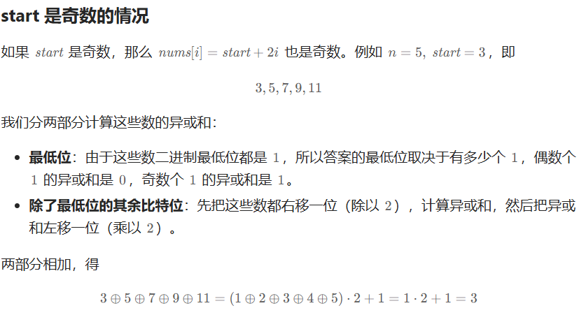
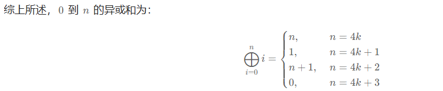

# Leetcode——位运算（基础/性质/拆位/试填/恒等式/思维）

- **[位运算题单](https://leetcode.cn/circle/discuss/dHn9Vk/)**

### 注意点

#### 1、==括号== ！一定要加！！解决优先级错误问题


推荐先阅读：[从集合论到位运算，常见位运算技巧分类总结！](https://leetcode.cn/circle/discuss/CaOJ45/)

## 一、基础题

### [3370. 仅含置位位的最小整数](https://leetcode.cn/problems/smallest-number-with-all-set-bits/) 1199

给你一个正整数 `n`。

返回 **大于等于** `n` 且二进制表示仅包含 **置位** 位的 **最小** 整数 `x` 。

**置位** 位指的是二进制表示中值为 `1` 的位。

**示例 1：**

**输入：** n = 5

**输出：** 7

**解释：**

7 的二进制表示是 `"111"`。


#### 法1：  不推荐 O(n)

```C++
class Solution {
public:
    int smallestNumber(int n) 
    {
        //101
        //111

        //1010
        //1111
        //寻找>这个数字的二进制，-1就是了

        //取出n第一位是k位，这个1<<(k+1)-1;
        int k=0;
        while(n)
        {
            k++;
            n=n>>1;
        }
        return (1<<(k))-1;

    }
};
```

#### 法2： O(1)


```C++
class Solution {
public:
    int smallestNumber(int n) 
    {
        return (1<<(bit_width((unsigned)n)))-1;
    }
};
```

或者__lg  

```C++
        return (1<<(__lg(n)+1))-1;
```

或者 log2  

```C++
return (1<<  ((int)log2(n)+1) )   -1;
```

>        //1010=10 。log2n = 3
>        //1111 .1<<(3+1)-1
>        //寻找>这个数字的二进制，-1就是了


deepseek关于这三个函数的说法：（未校准 不知道对不对）

>在 C++ 中，`log2`、`__lg()` 和 `bit_width` 的实现涉及不同层次的优化和硬件特性，以下是它们的典型实现方式：
>
>---
>
>### 1. **数学函数 `std::log2`**
>**作用**：计算浮点数的以 2 为底的对数。
>
>#### 实现方式：
>- **硬件指令**：现代 CPU 可能直接提供 `FYL2X`（x86）或类似指令计算对数，编译器会生成相关指令。
>- **软件近似**：若无硬件支持，数学库（如 glibc 或 Intel MKL）会使用多项式逼近或查表法：
>  1. 将浮点数 `x` 分解为指数 `e` 和尾数 `m`（IEEE 754 格式）：`x = 2^e * (1 + m)`。
>  2. 计算 `log2(x) = e + log2(1 + m)`，其中 `log2(1 + m)` 用多项式（如泰勒展开）近似。
>- **边界处理**：需处理负数、0、NaN 和无穷大，例如 `log2(0)` 返回 `-inf`。
>
>---
>
>### 2. **编译器内置函数 `__lg()`**
>**作用**：快速计算整数 `n` 的最高有效位位置（即 `floor(log2(n))`）。
>
>#### 实现方式：
>- **硬件指令**：
>  - x86 使用 `BSR`（Bit Scan Reverse）指令直接获取最高位位置。
>  - ARM 使用 `CLZ`（Count Leading Zeros）指令，结果转换为 `31 - CLZ(n)`。
>- **软件回退**（无指令支持时）：
>  ```cpp
>  int __lg(uint32_t n) {
>    if (n == 0) return -1; // 未定义行为通常要求 n > 0
>    int pos = 0;
>    while (n >>= 1) pos++;
>    return pos;
>  }
>  ```
>- **优化技巧**：二分查找或分块判断（如先判断高 16 位是否有 1）。
>
>---
>
>### 3. **C++20 标准函数 `std::bit_width`**
>**作用**：返回表示无符号整数所需的最小位数（例如 `0b10011` 需要 5 位）。
>
>#### 实现方式：
>- **直接关联**：对于非零数，`bit_width(n) = __lg(n) + 1`。
>- **零值处理**：若 `n = 0`，返回 0。
>- **编译器优化**：
>  ```cpp
>  int bit_width(uint32_t n) {
>    return (n == 0) ? 0 : (32 - __builtin_clz(n));
>  }
>  ```
>  其中 `__builtin_clz` 计算前导零数目（例如 `0b0010` 的 `CLZ` 为 30，`32-30=2`）。
>
>---
>
>### **关键差异与总结**
>| 函数        | 输入类型   | 目的                             | 底层依赖                 |
>| ----------- | ---------- | -------------------------------- | ------------------------ |
>| `std::log2` | 浮点数     | 精确计算以2为底的对数            | 硬件指令或数学库近似     |
>| `__lg()`    | 整数       | 快速获取最高位位置（log2下取整） | BSR/CLZ 指令或位操作循环 |
>| `bit_width` | 无符号整数 | 最小表示位数（log2上取整+1）     | `__lg()` 或 CLZ 指令变换 |
>
>实际实现因编译器和平台而异，例如：
>- GCC/Clang 的 `__lg(x)` 直接映射为 `31 - __builtin_clz(x)`。
>- MSVC 可能用 `_BitScanReverse` 实现类似逻辑。


### [3226. 使两个整数相等的位更改次数](https://leetcode.cn/problems/number-of-bit-changes-to-make-two-integers-equal/)

给你两个正整数 `n` 和 `k`。

你可以选择 `n` 的 **二进制表示** 中任意一个值为 1 的位，并将其改为 0。

返回使得 `n` 等于 `k` 所需要的更改次数。如果无法实现，返回 -1。

**示例 1：**

**输入：** n = 13, k = 4

**输出：** 2

**解释：**
最初，`n` 和 `k` 的二进制表示分别为 `n = (1101)2` 和 `k = (0100)2`，

我们可以改变 `n` 的第一位和第四位。结果整数为 `n = (*0*10*0*)2 = k`。


#### 解析

https://leetcode.cn/problems/number-of-bit-changes-to-make-two-integers-equal/solutions/2851739/o1-wei-yun-suan-zuo-fa-pythonjavacgo-by-3lg19/

1  首先需要求是否是**子集**

> 从集合的角度理解，每次操作相当于去掉集合 n 中的一个元素。
>
>要能把 n 变成 k，k 必须是 n 的**子集**。如果不是，返回 −1。

如何求子集:

https://leetcode.cn/circle/discuss/CaOJ45/


>
>
>如果 *k* 去掉 *n* 中所有元素后，变成了空集，那么 *k* 就是 *n* 的子集。
>
>写成代码，如果 `(k & ~n) == 0`，那么 *k* 就是 *n* 的子集。


2  其次 求n⊕k 的二进制中的 1 的个数

>如果 k 是 n 的子集，答案为从 n 中去掉 k 后的集合大小，即 n⊕k 的二进制中的 1 的个数。(只有当k是0,n是1的保留了下来)
>
>注：也可以计算 n−k 的二进制中的 1 的个数。


#### 法1:

如果 *n* 和 *k* 的交集是 *k*，那么 *k* 就是 *n* 的子集。

交集就是位运算中的 AND（`&`）。

```C++
class Solution {
public:
    int minChanges(int n, int k) 
    {
        //1101 A
        //0100 B
        //0100 A&B
        //1001 A^B
        if((n&k)==k)//判断是子集
        {
            return __builtin_popcount(n^k);//异或后的1的个数
        }
        else
        {
            return -1;
        }
    }
};
```

或者直接写

```C++
return ((n&k)==k)?__builtin_popcount(n^k):-1;
```


#### 法2

如果 *n* 和 *k* 的并集是 *n*，那么 *k* 就是 *n* 的子集。

并集就是位运算中的 OR（`|`）。

```C++
class Solution {
public:
    int minChanges(int n, int k) {
        return ((n|k)==n)?__builtin_popcount(n^k):-1;
    }
};
```


#### 法3

如果 *k* 去掉 *n* 中所有元素后，变成了空集，那么 *k* 就是 *n* 的子集。

写成代码，如果 `(k & ~n) == 0`，那么 *k* 就是 *n* 的子集。

```C++
class Solution {
public:
    int minChanges(int n, int k) {
        return ((k&(~n))==0)?__builtin_popcount(n^k):-1;
    }
};
```

OR

```C++
return (k&(~n))?-1:__builtin_popcount(n^k);
```


#### 法 不用看： 不推荐 自己想的非最优的O(n)解法

```C++
class Solution {
public:
    int minChanges(int n, int k) 
    {
        if(n<k)return -1;
        
        int nt=n,kt=k;
        int res=0;
        while(nt)
        {
            if(!(nt&1))//括号！！因为不知道哪个更优先！&和!应该是一个优先级的）
            {
                if(kt&1)  return -1;//k有一位是1 而n是0  无法变化过去
            }
            else  //(nt末==1)
            {
                if(!(kt&1))res++;
            }
            nt=nt>>1;//赋值 不能只写nt>>1 这并不会真的移动它
            kt=kt>>1;
            // cout<<nt<<endl;
        }
        return res;
    }
};
```


### [1356. 根据数字二进制下 1 的数目排序](https://leetcode.cn/problems/sort-integers-by-the-number-of-1-bits/)

给你一个整数数组 `arr` 。请你将数组中的元素按照其二进制表示中数字 **1** 的数目升序排序。

如果存在多个数字二进制中 **1** 的数目相同，则必须将它们按照数值大小升序排列。

请你返回排序后的数组。

**示例 1：**

```
输入：arr = [0,1,2,3,4,5,6,7,8]
输出：[0,1,2,4,8,3,5,6,7]
解释：[0] 是唯一一个有 0 个 1 的数。
[1,2,4,8] 都有 1 个 1 。
[3,5,6] 有 2 个 1 。
[7] 有 3 个 1 。
按照 1 的个数排序得到的结果数组为 [0,1,2,4,8,3,5,6,7]
```

ME 100%
```C++
class Solution {
public:
    static bool cmp(int a , int b)  //static！
    {   
        int aBitCount = __builtin_popcount(a);
        int bBitCount = __builtin_popcount(b);
        if(aBitCount<bBitCount)return true;
        else if(aBitCount==bBitCount)
        {
            return a<b;
        }
        return false;
    }
    vector<int> sortByBits(vector<int>& arr) 
    {
        sort(arr.begin(),arr.end(),cmp);
        return arr;
    }
};
```

用lambda表达式

```C++
class Solution {
public:
    vector<int> sortByBits(vector<int>& arr) 
    {
        // sort(arr.begin(),arr.end(),cmp);
        sort(arr.begin(),arr.end(),
        [&](int a,int b) 
        {
            int aBitCount = __builtin_popcount(a);
            int bBitCount = __builtin_popcount(b);
            if(aBitCount<bBitCount)return true;
            else if(aBitCount==bBitCount)
            {
                return a<b;
            }
            return false;
        }
        );
        return arr;
    }
};
```

>lambda表达式
>
>`[捕获列表](参数列表) -> 返回类型 { 函数体 }`
>
>`[&]` 表示以引用方式捕获外部变量


### [461. 汉明距离](https://leetcode.cn/problems/hamming-distance/)

两个整数之间的 [汉明距离](https://baike.baidu.com/item/汉明距离) 指的是这两个数字对应二进制位不同的位置的数目。

给你两个整数 `x` 和 `y`，计算并返回它们之间的汉明距离。

**示例 1：**

```
输入：x = 1, y = 4
输出：2
解释：
1   (0 0 0 1)
4   (0 1 0 0)
       ↑   ↑
上面的箭头指出了对应二进制位不同的位置。
```

#### 法1：调用接口

```C++
class Solution {
public:
    int hammingDistance(int x, int y) 
    {
        return __builtin_popcount(x^y);
    }
};
```

#### 法2： 自己造轮子 实现数1的个数

```C++
class Solution {
public:
    int hammingDistance(int x, int y) 
    {
        //return __builtin_popcount(x^y);
        //自己造轮子
        int s=x^y;
        int res=0;
        while(s)
        {
            s=s&(s-1);
            res++;
        }
        return res;
    }
};
```


### [2220. 转换数字的最少位翻转次数](https://leetcode.cn/problems/minimum-bit-flips-to-convert-number/)

一次 **位翻转** 定义为将数字 `x` 二进制中的一个位进行 **翻转** 操作，即将 `0` 变成 `1` ，或者将 `1` 变成 `0` 。

- 比方说，`x = 7` ，二进制表示为 `111` ，我们可以选择任意一个位（包含没有显示的前导 0 ）并进行翻转。比方说我们可以翻转最右边一位得到 `110` ，或者翻转右边起第二位得到 `101` ，或者翻转右边起第五位（这一位是前导 0 ）得到 `10111` 等等。

给你两个整数 `start` 和 `goal` ，请你返回将 `start` 转变成 `goal` 的 **最少位翻转** 次数。

 

**示例 1：**

```
输入：start = 10, goal = 7
输出：3
解释：10 和 7 的二进制表示分别为 1010 和 0111 。我们可以通过 3 步将 10 转变成 7 ：
- 翻转右边起第一位得到：1010 -> 1011 。
- 翻转右边起第三位：1011 -> 1111 。
- 翻转右边起第四位：1111 -> 0111 。
我们无法在 3 步内将 10 转变成 7 。所以我们返回 3 。
```

同上题 EASY
```C++
class Solution {
public:
    int minBitFlips(int start, int goal) 
    {
        return __builtin_popcount(start^goal);
    }
};
```


###  [476. 数字的补数](https://leetcode.cn/problems/number-complement/)

对整数的二进制表示取反（`0` 变 `1` ，`1` 变 `0`）后，再转换为十进制表示，可以得到这个整数的补数。

- 例如，整数 `5` 的二进制表示是 `"101"` ，取反后得到 `"010"` ，再转回十进制表示得到补数 `2` 。

给你一个整数 `num` ，输出它的补数。

**示例 1：**

```
输入：num = 5
输出：2
解释：5 的二进制表示为 101（没有前导零位），其补数为 010。所以你需要输出 2 。
```


####  法1：O1

```C++
class Solution {
public:
    int findComplement(int num) {
        // int bitwid = bit_width((unsigned(num)));
        // int a= 1<<bitwid;
        // return a-num-1;
        int bitwid = bit_width((unsigned(num)));
        long long a= 1<<bitwid;//int的话2147483647这个不行
        return a-num-1;
    }
};

```

或者

```C++
class Solution {
public:
    int findComplement(int num) {
        return pow(2,((int)log2(num)+1))-num-1; // log记得（int）
    }
};

链接：https://leetcode.cn/problems/number-complement/solutions/3062785/cyi-xing-dai-ma-by-heuristic-agnesi21v-t4pi/
```


#### 法2：On

```C++
class Solution {
public:
    int findComplement(int num) {
        int res=0;
        int count=0;
        while(num)
        {
            int add=0;
            if(!(num&1))add = 1<<count;
            res+=add;
            count++;
            
            num=num>>1;         // 1
        }
        return res;
    }
};
```


###  [1009. 十进制整数的反码](https://leetcode.cn/problems/complement-of-base-10-integer/) 同上题 476

每个非负整数 `N` 都有其二进制表示。例如， `5` 可以被表示为二进制 `"101"`，`11` 可以用二进制 `"1011"` 表示，依此类推。注意，除 `N = 0` 外，任何二进制表示中都不含前导零。

二进制的反码表示是将每个 `1` 改为 `0` 且每个 `0` 变为 `1`。例如，二进制数 `"101"` 的二进制反码为 `"010"`。

给你一个十进制数 `N`，请你返回其二进制表示的反码所对应的十进制整数。

 

```C++
class Solution {
public:
    int bitwiseComplement(int n) {
        if(n==0)return 1;//
        return ((1<<(int)(log2(n)+1))-1)^n; //log会报错
    }
};
```

OR

```C++
class Solution {
public:
    int bitwiseComplement(int n) {
        if(n==0)return 1;
        return ((1<<bit_width((unsigned)n))-1)^n;//否则这里0 还是会return 0 所以需要特判
    }
};
```

`bit_width((unsigned)0); 是0`


### [868. 二进制间距](https://leetcode.cn/problems/binary-gap/)

给定一个正整数 `n`，找到并返回 `n` 的二进制表示中两个 **相邻** 1 之间的 **最长距离** 。如果不存在两个相邻的 1，返回 `0` 。

如果只有 `0` 将两个 `1` 分隔开（可能不存在 `0` ），则认为这两个 1 彼此 **相邻** 。两个 `1` 之间的距离是它们的二进制表示中位置的绝对差。例如，`"1001"` 中的两个 `1` 的距离为 3 。

**示例 1：**

```
输入：n = 22
输出：2
解释：22 的二进制是 "10110" 。
在 22 的二进制表示中，有三个 1，组成两对相邻的 1 。
第一对相邻的 1 中，两个 1 之间的距离为 2 。
第二对相邻的 1 中，两个 1 之间的距离为 1 。
答案取两个距离之中最大的，也就是 2 。
```
/
```C++
class Solution {
public:
    int binaryGap(int n) 
    {
        int m=n;
        int maxLen=0;
        int lastOne=-1;
        //1000 100 10 1 0  
        for(int i=0;m;i++)
        {
            if((m&1)==1)
            {
                if(lastOne!=-1) 
                {
                    maxLen = max(maxLen,i-lastOne);//没有包含右边缘
                }
                lastOne = i; 
            }
            m=m>>1;
        }
        return maxLen;
    }
};
```

可能的优化：用`n & (n-1)`去除二进制中最小的1，然后找距离(JAVA)

```C++
class Solution {
    public int binaryGap(int n) {
        int ans = 0;
        while ((n & (n - 1)) != 0) {
            ans = Math.max(ans, Integer.numberOfTrailingZeros(n & (n - 1)) - Integer.numberOfTrailingZeros(n));
            n &= n - 1;
        }
        return ans;
    }
}
```


### [3211. 生成不含相邻零的二进制字符串](https://leetcode.cn/problems/generate-binary-strings-without-adjacent-zeros/) :facepunch:

给你一个正整数 `n`。

如果一个二进制字符串 `x` 的所有长度为 2 的子字符串中包含 **至少** 一个 `"1"`，则称 `x` 是一个 **有效** 字符串。

返回所有长度为 `n` 的 **有效** 字符串，可以以任意顺序排列。

**示例 1：**

**输入：** n = 3

**输出：** ["010","011","101","110","111"]

**解释：**

长度为 3 的有效字符串有：`"010"`、`"011"`、`"101"`、`"110"` 和 `"111"`。


#### 方法一：回溯（爆搜）
类似 17. 电话号码的字母组合，用递归生成所有长为 n 的符合要求的字符串。如果你没有写过这题，可以看 视频讲解【基础算法精讲 14】。

本题枚举字符串的位置 i 填 1 还是 0：

填 1，没有任何约束，可以直接填。
填 0，需要满足 i=0，或者 i−1 这个位置（前一个位置）填的是 1。
填完后，继续往下递归，考虑 i+1 怎么填。
从 i=0 开始递归，到 i=n 结束。

⚠注意：由于字符串长度固定为 n，本题不需要恢复现场，直接覆盖之前填的数据就行。
链接：https://leetcode.cn/problems/generate-binary-strings-without-adjacent-zeros/solutions/2833805/wei-yun-suan-zuo-fa-pythonjavacgo-by-end-6lbt/

```C++
class Solution {
public:
    vector<string> validStrings(int n) 
    {
        vector<string> res;
        string path (n,0);//字符串初始化要给初值，这个string path(n);错误！！
        auto dfs = [&](auto&& dfs,int i)->void //auto&& 是万能引用
            //lambda 表达式的类型是**编译器生成的匿名类型**（例如 `__lambda_123`），你无法显式写出这个类型名！必须用auto
        {
            if(i==n) 
            {
                res.push_back(path);// 注意这里复制了一份 path，需要 O(n) 时间
                return ; 
            }
            path[i]='1';
            dfs(dfs,i+1);

            if(i==0||(path[i-1]=='1'))
            {
                path[i]='0';// 直接覆盖
                dfs(dfs,i+1);
            }
        };//lambda表达式
        dfs(dfs,0);
        return res;
    }
};
```

>关于lambda表达式以及这题  语法更深入的请看D:\PGPostgraduate\githubNotePrepareForWork\PrepareForWorkNotes\2025寒假\Y\note\知识点\万能引用 完美转发\万能引用 完美转发.md

#### 法二：位运算

我们可以用 `x & (x >> 1)` 来判断，如果这个值不为零，则说明 *x* 中有相邻的 1，

```C++
class Solution {
public:
    vector<string> validStrings(int n) {
        //a      1001
        //b=~a   0110  b = a^1111
        //c=b>>1 0011  c
        //b&c    0010
        //    这个1 表示右移前后都是1 ！！！ 也就是有相邻的1！！！

        //例子2
        //a      101100100
        //b=~a   010011011  b=a^111111111
        //c=b>>1 001001101  c
        //b&c    000001001
        //    这2个1 表示右移前后都是1 ！！！ 也就是有相邻的1！！！

        vector<string> res;
        int mask = (1<<n)-1;//111111这种数字
        for(int a=0;a<(1<<n);a++)
        {
            int b = a^mask;
            //int c = b>>1;
            //if((b&c)==0)
            if((b&(b>>1))==0)
            {
                //题目1 <= n <= 18
                res.push_back(bitset<18>(a).to_string().substr(18-n));
            }
        }
        return res;

    }
};
```

>语法上
>
>假设 `n` 是 3，那么 `18-n` 就是 `15`，
>
>如果 `a` 是 `5`，那么 `bitset<18>(5)` 会生成一个二进制表示为 `0000000000000000000101` 的 `bitset`（总共 18 位）。
>
>`bitset<18>(5).to_string() 生成的字符串 "0000000000000000000101"`
>
>`substr(18-n)` 的意思是从字符串的第 `18-n` 个字符开始提取子串，直到字符串的末尾。
>
>​	从字符串的第 15 个字符开始提取，直到字符串的末尾。对于 `bitset<18>(5).to_string()` 生成的字符串 `"0000000000000000000101"`，提取的结果将是 `"0000000000000101"`，即最后 3 位的有效二进制字符串。


或者反过来 直接遍历b也行的

链接：https://leetcode.cn/problems/generate-binary-strings-without-adjacent-zeros/solutions/2833805/wei-yun-suan-zuo-fa-pythonjavacgo-by-end-6lbt/

```C++
class Solution {
public:
    vector<string> validStrings(int n) 
    {
        vector<string> ans;
        int mask = (1 << n) - 1;
        for (int x = 0; x < (1 << n); x++) 
        {
            if (((x >> 1) & x) == 0) 
            {
                ans.push_back(bitset<18>(x ^ mask).to_string().substr(18 - n));
            }
        }
        return ans;
    }
};
```


### [2917. 找出数组中的 K-or 值](https://leetcode.cn/problems/find-the-k-or-of-an-array/)

给你一个整数数组 `nums` 和一个整数 `k` 。让我们通过扩展标准的按位或来介绍 **K-or** 操作。在 K-or 操作中，如果在 `nums` 中，至少存在 `k` 个元素的第 `i` 位值为 1 ，那么 K-or 中的第 `i` 位的值是 1 。

返回 `nums` 的 **K-or** 值。

**示例 1：**

```
输入：nums = [7,12,9,8,9,15], k = 4
输出：9
解释：
用二进制表示 numbers：
```

| **Number**     | Bit 3 | Bit 2 | Bit 1 | Bit 0 |
| -------------- | ----- | ----- | ----- | ----- |
| **7**          | 0     | 1     | 1     | 1     |
| **12**         | 1     | 1     | 0     | 0     |
| **9**          | 1     | 0     | 0     | 1     |
| **8**          | 1     | 0     | 0     | 0     |
| **9**          | 1     | 0     | 0     | 1     |
| **15**         | 1     | 1     | 1     | 1     |
| **Result = 9** | 1     | 0     | 0     | 1     |

```
位 0 在 7, 9, 9, 15 中为 1。位 3 在 12, 9, 8, 9, 15 中为 1。 只有位 0 和 3 满足。结果是 (1001)2 = 9。
```

A:
```C++
class Solution {
public:
    int findKOr(vector<int>& nums, int k) 
    {
        int n=nums.size();
        //vector<int> v(32,0); 实际上只需要要一个数字即可,因为会同意算完全部字母
        int res=0;
        for(int i=0;i<31;i++)
        {
            int cnt=0;//
            for(int j=0;j<n;j++)
            {
                cnt+=((nums[j]>>i)&1);//v0 
                if(cnt>=k)
                {
                    res = res|(1<<(i));
                }
            }
        }

        return res;
    }
};
```


### [693. 交替位二进制数](https://leetcode.cn/problems/binary-number-with-alternating-bits/)

给定一个正整数，检查它的二进制表示是否总是 0、1 交替出现：换句话说，就是二进制表示中相邻两位的数字永不相同。

**示例 1：**

```
输入：n = 5
输出：true
解释：5 的二进制表示是：101
```

#### 法1:

原数 **右移一位** 得到的新数，再与原数进行按位**异或**（^）操作，结果会是全 1 的二进制数。（如，n = 1010，n >> 1 = 0101，那么 n ^ (n >> 1) = 1111）
接着判断是否是全 1 ，通过 x & (x + 1) 是否等于 0。“**全 1 的数加 1 后会变成仅有一个 1 的数**”（例如 111 + 1 = 1000），它们按位与的结果一定为 0。


```C++
class Solution {
public:
    bool hasAlternatingBits(int n) {
        //   1010111
        //>> 0101011 
        //^  1111100
        //+1 1111101 

        //  11
        //>>01 
        //^ 10

        //  10101010
        //>>01010101
        //^ 11111111
        // 100000000

        long a= n^(n>>1);
        return ((a&(a+1))==0);      
    }
};
```


#### 法2 me：不用看 分别判00 或11 

```C++
class Solution {
public:
    bool hasAlternatingBits(int n) {
        //1010111
        //0101011 //直接右移  !=0 表示有连续的1

        //11
        //01 //直接右移  !=0 表示有连续的1

        //1000010
        //0111101  //取反后右移  !=0 表示有连续的1

        int oneNei = n&(n>>1);
        long long mask = (1<<(long long)bit_width((unsigned long long)n))-1ll;//1111
        int nmask = n^mask;
        int zeroNei = nmask&(nmask>>1);
        if(oneNei||zeroNei)return false;
        return true;
    }
};
```


### [2657. 找到两个数组的前缀公共数组](https://leetcode.cn/problems/find-the-prefix-common-array-of-two-arrays/)

给你两个下标从 **0** 开始长度为 `n` 的整数排列 `A` 和 `B` 。

`A` 和 `B` 的 **前缀公共数组** 定义为数组 `C` ，其中 `C[i]` 是数组 `A` 和 `B` 到下标为 `i` 之前公共元素的数目。

请你返回 `A` 和 `B` 的 **前缀公共数组** 。

如果一个长度为 `n` 的数组包含 `1` 到 `n` 的元素恰好一次，我们称这个数组是一个长度为 `n` 的 **排列** 。

**示例 1：**

```
输入：A = [1,3,2,4], B = [3,1,2,4]
输出：[0,2,3,4]
解释：i = 0：没有公共元素，所以 C[0] = 0 。
i = 1：1 和 3 是两个数组的前缀公共元素，所以 C[1] = 2 。
i = 2：1，2 和 3 是两个数组的前缀公共元素，所以 C[2] = 3 。
i = 3：1，2，3 和 4 是两个数组的前缀公共元素，所以 C[3] = 4 。
```
a:__builtin_popcount**ll**

```C++
class Solution {
public:
    vector<int> findThePrefixCommonArray(vector<int>& A, vector<int>& B) {
        //0001   0100
        //0101   0101
        //0111   0111
        //1111   1111

        //& ->相同个数
        int n =A.size();
        vector<int> pre(n);
        long long asum=0,bsum=0;
        for(int i=0;i<n;i++)
        {
            long long bitA =(long long) 1<<(long long)A[i];
            long long bitB =(long long) 1<<(long long)B[i];
            asum|=bitA;
            bsum|=bitB;
            pre[i] = __builtin_popcountll(asum&bsum);
        }
        return pre;
    }
};
```

胖子题解（使用`1ll`的技巧）：

```c++
class Solution {
public:
    vector<int> findThePrefixCommonArray(vector<int>& A, vector<int>& B) {
        //看到n=50,直接long long全程
        //看前缀中有几个共同的1(&之后看看有几个1),即可求解前缀公共数组
        long long left = 0;
        long long right = 0;
        int n = A.size();
        vector<int> res(n);
        for(int i=0;i<n;i++)
        {
            left |= (1ll<<A[i]); //注意C++做移位运算的时候，如果数据范围达到了long long级别，可以1ll<<n做移位运算
            right |= (1ll<<B[i]);
            long long tmp = left & right;
            //看tmp中有几个1
            res[i] = __builtin_popcountll(tmp);
        }
        return res;

    }
};
```


### [231. 2 的幂](https://leetcode.cn/problems/power-of-two/)  :call_me_hand:

给你一个整数 `n`，请你判断该整数是否是 2 的幂次方。如果是，返回 `true` ；否则，返回 `false` 。

如果存在一个整数 `x` 使得 `n == 2x` ，则认为 `n` 是 2 的幂次方。


**示例 1：**

```
输入：n = 1
输出：true
解释：20 = 1
```

法1

```C++
class Solution {
public:
    bool isPowerOfTwo(int n) {
        //n1000 //(n-1)0111
        return n > 0 && (n & (n - 1)) == 0;

```


法2

其中 −n 是 n 的相反数，是一个负数。该位运算技巧可以直接获取 n 二进制表示的最低位的 1。

由于负数是按照补码规则在计算机中存储的，−n 的二进制表示为 n 的二进制表示的每一位取反再加上 1，因此它的原理如下：

```C++
class Solution {
public:
    bool isPowerOfTwo(int n) {
        //n1000 //(-n)(1111 0111+1)=1111 1000 
        return n > 0 && (n & -n) == n;
    }
};
```


>ME
>
>不推荐
>
>```C++
>class Solution {
>public:
>    bool isPowerOfTwo(int n) {
>        //0010  //1000
>        if(n==0)return false;
>        return ((long long)1<<((long long)bit_width((unsigned)n)-1)) == n;
>    }
>};
>```


### **[342. 4的幂 ](https://leetcode.cn/problems/power-of-four/)**:call_me_hand:

给定一个整数，写一个函数来判断它是否是 4 的幂次方。如果是，返回 `true` ；否则，返回 `false` 。

整数 `n` 是 4 的幂次方需满足：存在整数 `x` 使得 `n == 4x`

**示例 1：**

```
输入：n = 16
输出：true
```


#### 方法一：二进制表示中 1 的位置

如果 *n* 是 4 的幂，那么 *n* 一定也是 2 的幂。因此我们可以首先判断 *n* 是否是 2 的幂

//10000 = 16

//00100 = 8 

 // 2的幂 且位数是奇数


```C++
class Solution {
public:
    bool isPowerOfFour(int n) 
    {
        return n>0&& (n&(n-1))==0 && (n&0xaaaaaaaa)==0;//8个a 32位
    }
};
```

#### 方法二：取模性质

```C++
class Solution {
public:
    bool isPowerOfFour(int n) 
    {
        return n>0&& (n&(n-1))==0 && (n%3==1);
    }
};
```


### [2595. 奇偶位数](https://leetcode.cn/problems/number-of-even-and-odd-bits/)

给你一个 **正** 整数 `n` 。

用 `even` 表示在 `n` 的二进制形式（下标从 **0** 开始）中值为 `1` 的偶数下标的个数。

用 `odd` 表示在 `n` 的二进制形式（下标从 **0** 开始）中值为 `1` 的奇数下标的个数。

请注意，在数字的二进制表示中，位下标的顺序 **从右到左**。

返回整数数组 `answer` ，其中 `answer = [even, odd]` 。

 

**示例 1：**

**输入：**n = 50

**输出：**[1,2]

**解释：**

50 的二进制表示是 `110010`。

在下标 1，4，5 对应的值为 1。


ANS

```C++
class Solution {
public:
    vector<int> evenOddBit(int n) 
    {
        //110010
        //543210
        //010101 &  0x5555
        //010000 只看偶数位
        int even = __builtin_popcount(n&0x5555) ;
        int odd = __builtin_popcount(n) - even;
        return {even,odd};
    }
};
```


### [338. 比特位计数](https://leetcode.cn/problems/counting-bits/)

给你一个整数 `n` ，对于 `0 <= i <= n` 中的每个 `i` ，计算其二进制表示中 **`1` 的个数** ，返回一个长度为 `n + 1` 的数组 `ans` 作为答案。

**示例 1：**

```
输入：n = 2
输出：[0,1,1]
解释：
0 --> 0
1 --> 1
2 --> 10
```

```C++
class Solution {
public:
    vector<int> countBits(int n) 
    {
        vector<int> res(n+1,0);
        for(int i=0;i<=n;i++)
        {
            res[i] = __builtin_popcount(i);
        }
        return res;
    }
};
```

也可以用动规，或者`x&(x-1)`等。


## 二、异或（XOR）的性质

### [1486. 数组异或操作](https://leetcode.cn/problems/xor-operation-in-an-array/):call_me_hand:  (H:有板子可以找，0~n的异或值):no_entry:

给你两个整数，`n` 和 `start` 。

数组 `nums` 定义为：`nums[i] = start + 2*i`（下标从 0 开始）且 `n == nums.length` 。

请返回 `nums` 中所有元素按位异或（**XOR**）后得到的结果。

**示例 1：**

```
输入：n = 5, start = 0
输出：8
解释：数组 nums 为 [0, 2, 4, 6, 8]，其中 (0 ^ 2 ^ 4 ^ 6 ^ 8) = 8 。
     "^" 为按位异或 XOR 运算符。
```

#### 题解：

https://leetcode.cn/problems/xor-operation-in-an-array/solutions/2793723/o1-gong-shi-tui-dao-pythonjavaccgojsrust-le23/




上面的3 5 7 9 11是5个奇数个，所以最低位是1，+1


##### 合二为一


由于异或运算满足交换律和结合律，所以以下的括号中的项都可以拆出来凑一起
(0⊕0)⊕(1⊕1)⊕⋯⊕((a−1)⊕(a−1))⊕a⊕(a+1)⊕(a+2)⊕⋯⊕(a+n−1)
=(0⊕1⊕2⊕⋯⊕a+n−1)⊕(0⊕1⊕2⊕⋯⊕a−1)


##### 0 到 n 的异或和


当n=4k+3时，共有(n+1)=4k+4个数字，按照前面说的四个一组消消乐，所以消完了是0
当n=4k+2时，去掉前面四个一组消消乐，剩下三个元素：(n-2)⊕(n-1)⊕n，我们知道消消乐完成后，**开头第一个元素肯定是4的倍数是偶数，所以(n-2)⊕(n-1)=1**。而n也是偶数，所以1⊕n=n+1
当n=4k+1时，同理，剩下两个元素(n-1)⊕n=1
当n=4k时，同理，剩下一个元素n



#### 代码：

```C++
class Solution {
    int xor_n(int n) 
    {
        switch (n % 4) 
        {
            case 0: return n;
            case 1: return 1;
            case 2: return n + 1;
            default: return 0;
        }
    }

public:
    int xorOperation(int n, int start) 
    {
        int a = start / 2;
        int b = n & start & 1; // 都为奇数才是 1
        return (xor_n(a + n - 1) ^ xor_n(a - 1)) * 2 + b;
    }
};
```


### [1720. 解码异或后的数组](https://leetcode.cn/problems/decode-xored-array/)

**未知** 整数数组 `arr` 由 `n` 个非负整数组成。

经编码后变为长度为 `n - 1` 的另一个整数数组 `encoded` ，其中 `encoded[i] = arr[i] XOR arr[i + 1]` 。例如，`arr = [1,0,2,1]` 经编码后得到 `encoded = [1,2,3]` 。

给你编码后的数组 `encoded` 和原数组 `arr` 的第一个元素 `first`（`arr[0]`）。

请解码返回原数组 `arr` 。可以证明答案存在并且是唯一的。

**示例 1：**

```
输入：encoded = [1,2,3], first = 1
输出：[1,0,2,1]
解释：若 arr = [1,0,2,1] ，那么 first = 1 且 encoded = [1 XOR 0, 0 XOR 2, 2 XOR 1] = [1,2,3]
```
ANS
```C++
class Solution {
public:
    vector<int> decode(vector<int>& encoded, int first) {
        //a^b= c---> a^c=b
        //1011 a
        //1100 b
        //0111 c
        int n=encoded.size();
        vector<int> res(n+1);
        res[0] = first;
        for(int i=1;i<=n;i++)
        {
            res[i] = res[i-1]^encoded[i-1];
        }
        return res;
    }
};
```


### [2433. 找出前缀异或的原始数组](https://leetcode.cn/problems/find-the-original-array-of-prefix-xor/)

给你一个长度为 `n` 的 **整数** 数组 `pref` 。找出并返回满足下述条件且长度为 `n` 的数组 `arr` ：

- `pref[i] = arr[0] ^ arr[1] ^ ... ^ arr[i]`.

注意 `^` 表示 **按位异或**（bitwise-xor）运算。

可以证明答案是 **唯一** 的。

 

**示例 1：**

```
输入：pref = [5,2,0,3,1]
输出：[5,7,2,3,2]
解释：从数组 [5,7,2,3,2] 可以得到如下结果：
- pref[0] = 5
- pref[1] = 5 ^ 7 = 2
- pref[2] = 5 ^ 7 ^ 2 = 0
- pref[3] = 5 ^ 7 ^ 2 ^ 3 = 3
- pref[4] = 5 ^ 7 ^ 2 ^ 3 ^ 2 = 1
```


按位异或的性质：`A xor B = C 则 A xor C = B`

```C++
class Solution {
public:
    vector<int> findArray(vector<int>& pref) 
    {
        //00101 5
        //00010 2 
        //00000 0
        //00011 3
        //00001 1

        //101
        //111
        //10
        //11
        //10

        int n=pref.size();
        vector<int> res(n,0);
        res[0] = pref[0];
        for(int i=1;i<n;i++)
        {
            res[i] = pref[i-1]^pref[i];
        }
        return res;
    }
};
```

