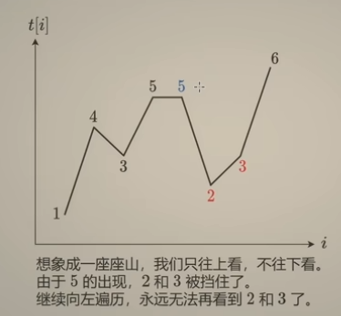
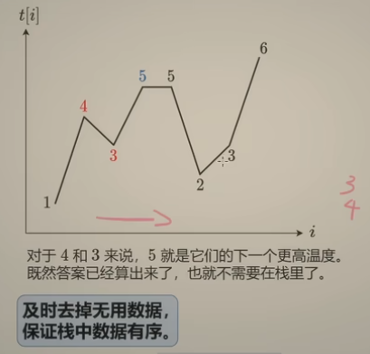
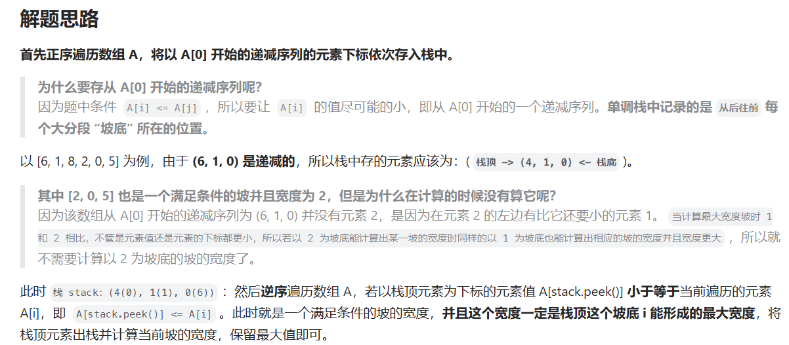

# Leetcode——单调栈专题

https://leetcode.cn/discuss/post/9oZFK9/

==**及时去掉无用数据，**==

==**保证栈中元素有序。**==

# 一、基础

739. 每日温度 模板题
1475. 商品折扣后的最终价格 非暴力做法
496. 下一个更大元素 I
503. 下一个更大元素 II
901. 股票价格跨度 1709
853. 车队

## 1.[739. 每日温度](https://leetcode.cn/problems/daily-temperatures/) 【模板】

**及时去掉无用数据，保证栈中元素有序**

这个视频讲解很清晰https://www.bilibili.com/video/BV1VN411J7S7/?vd_source=f2def4aba42c7ed69fc648e1a2029c7b

第一种写法，是从右往左写，维护“可能的最大值”：

思路一：从右到左 保持栈中下降



比栈顶小的就插入 否则弹出

```c++
class Solution {
public:
    vector<int> dailyTemperatures(vector<int>& temperatures) {
        //1.从右到左遍历,维护"可能的最近最大值",一定不会是该条件的就会被pop出去
        int n = temperatures.size();
        vector<int> res(n);
        stack<int> stk; //单调栈,里面保存的是索引值
        for(int i=n-1;i>=0;i--){
            int temperature = temperatures[i];
            while(!stk.empty() && temperature>=temperatures[stk.top()]){ //相等的情况也要pop,只保留最前面的相等值
                stk.pop();
            }
            if(!stk.empty()){
                //单调栈里还有东西,更新索引
                res[i] = stk.top()-i;
            }
            stk.push(i); //pop掉应该弹栈的元素后,入栈
        }
        return res;
    }
};
```


第二种写法，是从左往右写，维护“还没有找到答案的值”：



```c++
class Solution {
public:
    vector<int> dailyTemperatures(vector<int>& temperatures) {
        int n = temperatures.size();
        vector<int> res(n);
        //从左往右写,维护还没有找到答案的值(依旧存储索引)
        stack<int> stk;
        for(int i=0;i<n;i++){
            //小于当前值的全部弹栈(注意!等于当前值的还没有找到更高的温度,根据题意需要更高的而不是相等的,因此还要在栈里等着),并且更新结果
            int temperature = temperatures[i];
            while(!stk.empty() && temperatures[stk.top()]<temperature){
                int index = stk.top();
                stk.pop();
                res[index] = i - index;
            }
            stk.push(i);
        }
        return res;
    }
};
```


## [1475. 商品折扣后的最终价格](https://leetcode.cn/problems/final-prices-with-a-special-discount-in-a-shop/)

给你一个数组 `prices` ，其中 `prices[i]` 是商店里第 `i` 件商品的价格。

商店里正在进行促销活动，如果你要买第 `i` 件商品，那么你可以得到与 `prices[j]` 相等的折扣，其中 `j` 是满足 `j > i` 且 `prices[j] <= prices[i]` 的 **最小下标** ，如果没有满足条件的 `j` ，你将没有任何折扣。

请你返回一个数组，数组中第 `i` 个元素是折扣后你购买商品 `i` 最终需要支付的价格。

 

**示例 1：**

```
输入：prices = [8,4,6,2,3]
输出：[4,2,4,2,3]
解释：
商品 0 的价格为 price[0]=8 ，你将得到 prices[1]=4 的折扣，所以最终价格为 8 - 4 = 4 。
商品 1 的价格为 price[1]=4 ，你将得到 prices[3]=2 的折扣，所以最终价格为 4 - 2 = 2 。
商品 2 的价格为 price[2]=6 ，你将得到 prices[3]=2 的折扣，所以最终价格为 6 - 2 = 4 。
商品 3 和 4 都没有折扣。
```


如上题的第二种写法，是从左往右写，维护“还没有找到答案的值”：

```C++
class Solution {
public:
    vector<int> finalPrices(vector<int>& prices) {
        stack<int> stk;
        int n=prices.size();
        vector<int> res(n,0);
        for(int i=0;i<n;i++)
        {
            while(!stk.empty()&&prices[i]<=prices[stk.top()])
            {
                int pre = stk.top();
                res[pre] = prices[pre]-prices[i];
                stk.pop();
            }
            stk.push(i);
            res[i] = prices[i];
        }
        return res;
    }
};
```


## [496. 下一个更大元素 I](https://leetcode.cn/problems/next-greater-element-i/)

`nums1` 中数字 `x` 的 **下一个更大元素** 是指 `x` 在 `nums2` 中对应位置 **右侧** 的 **第一个** 比 `x` 大的元素。

给你两个 **没有重复元素** 的数组 `nums1` 和 `nums2` ，下标从 **0** 开始计数，其中`nums1` 是 `nums2` 的子集。

对于每个 `0 <= i < nums1.length` ，找出满足 `nums1[i] == nums2[j]` 的下标 `j` ，并且在 `nums2` 确定 `nums2[j]` 的 **下一个更大元素** 。如果不存在下一个更大元素，那么本次查询的答案是 `-1` 。

返回一个长度为 `nums1.length` 的数组 `ans` 作为答案，满足 `ans[i]` 是如上所述的 **下一个更大元素** 。

 

**示例 1：**

```
输入：nums1 = [4,1,2], nums2 = [1,3,4,2].
输出：[-1,3,-1]
解释：nums1 中每个值的下一个更大元素如下所述：
- 4 ，用加粗斜体标识，nums2 = [1,3,4,2]。不存在下一个更大元素，所以答案是 -1 。
- 1 ，用加粗斜体标识，nums2 = [1,3,4,2]。下一个更大元素是 3 。
- 2 ，用加粗斜体标识，nums2 = [1,3,4,2]。不存在下一个更大元素，所以答案是 -1 。
```
题解：
```C++
class Solution {
public:
    vector<int> nextGreaterElement(vector<int>& nums1, vector<int>& nums2) 
    {
        //4右侧是2
        //单调栈 存储nums2中每个数字在下一个更大元素值/位置
        //看nums1中每个元素在nums2中的位置 的对应
        //nums2存在unordered中，

        //从左到右，如果比栈顶大，赋值，pop 只维护还没找到答案的
        int n = nums2.size();
        stack<int> stk;
        vector<int> MonoStk(n,-1);
        unordered_map<int,int> umapNumsIdx; 
        for(int i=0;i<n;i++)
        {
            umapNumsIdx[nums2[i]]=i;
            while(!stk.empty() && nums2[i]>nums2[stk.top()])
            {
                MonoStk[stk.top()] = nums2[i];
                stk.pop();
            }
            stk.push(i);
        }
        int m=nums1.size();
        vector<int> res(m,-1);
        for(int i=0;i<m;i++)
        {
            int idx = umapNumsIdx[nums1[i]];
            res[i] = MonoStk[idx];
        }
        return res;

    }
};
```


## [503. 下一个更大元素 II](https://leetcode.cn/problems/next-greater-element-ii/)

给定一个循环数组 `nums` （ `nums[nums.length - 1]` 的下一个元素是 `nums[0]` ），返回 *`nums` 中每个元素的 **下一个更大元素*** 。

数字 `x` 的 **下一个更大的元素** 是按数组遍历顺序，这个数字之后的第一个比它更大的数，这意味着你应该循环地搜索它的下一个更大的数。如果不存在，则输出 `-1` 。

**示例 1:**

```
输入: nums = [1,2,1]
输出: [2,-1,2]
解释: 第一个 1 的下一个更大的数是 2；
数字 2 找不到下一个更大的数； 
第二个 1 的下一个最大的数需要循环搜索，结果也是 2。
```

方法1：推荐

``` C++
class Solution {
public:
    vector<int> nextGreaterElements(vector<int>& nums) 
    {
        //[1,2,1][1,2,1]
        int n=nums.size();
        stack<int> stk;
        vector<int> res(n,-1);
        for(int i=0;i<2*n;i++)
        {
            int x = nums[i%n];
            while(!stk.empty()&&x>nums[stk.top()])//%
            {
                res[stk.top()] = x;//%
                stk.pop();
            }
            if(i<n) //这样栈中只会有0-n-1的，res下标不会出错
                stk.push(i);
        }
        return res;
    }
};
```


方法2：M 不推荐

```C++
class Solution {
public:
    vector<int> nextGreaterElements(vector<int>& nums) 
    {
        //[1,2,1][1,2,1]
        int n=nums.size();
        nums.reserve(2*n);
        for(int i=0;i<n;i++)
        {
            nums.push_back(nums[i]);
        }
        //有可能可以用insert
        stack<int> stk;
        vector<int> res(2*n,-1);
        for(int i=0;i<2*n;i++)
        {
            while(!stk.empty()&&nums[i]>nums[stk.top()])
            {
                res[stk.top()] = nums[i];
                stk.pop();
            }
            stk.push(i);
        }
        return vector<int>(res.begin(),res.begin()+n);
    }
};
```


## [901. 股票价格跨度](https://leetcode.cn/problems/online-stock-span/)

设计一个算法收集某些股票的每日报价，并返回该股票当日价格的 **跨度** 。

当日股票价格的 **跨度** 被定义为股票价格小于或等于今天价格的最大连续日数（从今天开始往回数，包括今天）。

- 例如，如果未来 7 天股票的价格是 `[100,80,60,70,60,75,85]`，那么股票跨度将是 `[1,1,1,2,1,4,6]` 。

实现 `StockSpanner` 类：

- `StockSpanner()` 初始化类对象。
- `int next(int price)` 给出今天的股价 `price` ，返回该股票当日价格的 **跨度** 。

**示例：**

```
输入：
["StockSpanner", "next", "next", "next", "next", "next", "next", "next"]
[[], [100], [80], [60], [70], [60], [75], [85]]
输出：
[null, 1, 1, 1, 2, 1, 4, 6]

解释：
StockSpanner stockSpanner = new StockSpanner();
stockSpanner.next(100); // 返回 1
stockSpanner.next(80);  // 返回 1
stockSpanner.next(60);  // 返回 1
stockSpanner.next(70);  // 返回 2
stockSpanner.next(60);  // 返回 1
stockSpanner.next(75);  // 返回 4 ，因为截至今天的最后 4 个股价 (包括今天的股价 75) 都小于或等于今天的股价。
stockSpanner.next(85);  // 返回 6
```


方法1：不是最好 

```C++
class StockSpanner {
public:
    //  寻找左边第一个大于它的 ，记录i
    //从右往左  如果>栈顶 pop 

    //从左往右 
    stack<int> stk;
    vector<int> v;
    StockSpanner() {
        
    }
    int next(int price) {
        v.push_back(price);
        int n = v.size();
        while(!stk.empty()&&price>=v[stk.top()])
        {
            stk.pop();
        }
        int res =n;//(=n-1 -(-1))
        if(!stk.empty())res= n-1-stk.top();//最后栈顶遗留的一定是大于它的 差距多大 说明中间跨度多大
        stk.push(n-1);
        return res ;
    }
};

/**
 * Your StockSpanner object will be instantiated and called as such:
 * StockSpanner* obj = new StockSpanner();
 * int param_1 = obj->next(price);
 */
```


方法2：更优雅

应该是对应每日温度的从右往左 看山

https://leetcode.cn/problems/online-stock-span/solutions/2470527/shi-pin-yi-ge-shi-pin-jiang-tou-dan-diao-cuk7/

```C++
class StockSpanner {
public:
    //  寻找左边第一个大于它的 ，记录i
    //如果>栈顶 pop 
    stack<pair<int,int>> stk;
    int curDay=-1;// 第一个 next 调用算作第 0 天
    StockSpanner() {
        stk.emplace(-1,INT_MAX);// 这样无需判断栈为空的情况
    }
    int next(int price) {
        while(price>=stk.top().second)
        {
            stk.pop();// 栈顶数据后面不会再用到了，因为 price 更大
        }
        curDay++;
        int res=curDay-stk.top().first;
        stk.emplace(curDay,price);
        return res;
    }
};
```


## [853. 车队 ](https://leetcode.cn/problems/car-fleet/) :call_me_hand: :cat:

在一条单行道上，有 `n` 辆车开往同一目的地。目的地是几英里以外的 `target` 。

给定两个整数数组 `position` 和 `speed` ，长度都是 `n` ，其中 `position[i]` 是第 `i` 辆车的位置， `speed[i]` 是第 `i` 辆车的速度(单位是英里/小时)。

一辆车永远不会超过前面的另一辆车，但它可以追上去，并以较慢车的速度在另一辆车旁边行驶。

**车队** 是指并排行驶的一辆或几辆汽车。车队的速度是车队中 **最慢** 的车的速度。

即便一辆车在 `target` 才赶上了一个车队，它们仍然会被视作是同一个车队。

返回到达目的地的车队数量 。

 

**示例 1：**

**输入：**target = 12, position = [10,8,0,5,3], speed = [2,4,1,1,3]

**输出：**3

**解释：**

- 从 10（速度为 2）和 8（速度为 4）开始的车会组成一个车队，它们在 12 相遇。车队在 `target` 形成。
- 从 0（速度为 1）开始的车不会追上其它任何车，所以它自己是一个车队。
- 从 5（速度为 1） 和 3（速度为 3）开始的车组成一个车队，在 6 相遇。车队以速度 1 移动直到它到达 `target`。


解析：

我们首先对这些车辆按照它们的起始位置降序排序，并且用` (target - position) / speed `计算出每辆车在不受其余车的影响时，行驶到终点需要的时间。

车S  车F

对于**相邻**的两辆车 S 和 F，F 的起始位置大于 S，如果 S 行驶**到终点需要的时间**小于等于 F，那么 S 一定会在终点前追上 F 并形成车队。这是因为在追上 F 之前，S 的行驶速度并不会减小，而 F 却有可能因为追上前面的车辆而速度减小，因此 S 总能在终点前追上 F。

链接：https://leetcode.cn/problems/car-fleet/solutions/1/dan-diao-zhan-chao-guo-9961-by-mi-lu-yu-ba1o2/

##### 正序遍历解题过程
————单调栈十六字真言：及时去掉无用数据，保证栈中元素有序。————
1、首先我们清楚题目说了前车是无法超过后车的。如果追上之后就会按照车队中速度最慢的那个速度继续前行。所以我们可以求出从每个位置出发，到达终点所需时间是多少的这个数组。O(n)
2、拥有这个数组之后，我们从起始位置遍历。根据到达的时间可以将每个车队花费时间最长到达终点的时间作为这个车队的特征标签存到一个栈中。
3、首先清楚当前车是在前车后面的，后车不能超过我。如果当前车出发到终点的所需时间>=栈顶车队到终点的所需时间（我开的慢，也就是前车都比我快会被我堵住所以就要跟着我走。我前面的车队就会和我形成一个车队，并且以我为准了），此时直接栈顶出栈，说明前面的车队和我要合并了。保证栈内元素是单调增的(从底到顶)。
4、最后将自己入栈，作为一个车队！
5、最后遍历结束的时候，栈的元素数量就是车队数量。


```C++
class Solution {
public:
    int carFleet(int target, vector<int>& position, vector<int>& speed) {
        //0 3 5 8 10 target12
        //1 3 1 4 2
        //计算 每个车到达终点的t 
        //注意大小是target！！！  代表位置
        vector<double> t(target,0);// 代表第i个位置出发的车到达终点所需的时间 
        int n=position.size();
        for(int i=0;i<n;i++)
        {
            t[position[i]] = (target - position[i])*1.0/speed[i]; // 记录每个位置到达终点所需的时间
        }

        stack<double> stk;
        for(int i=0;i<target;i++)
        {
            if(t[i]>0) //要有车从这个位置出发  不然不用算  
            {
                while(!stk.empty()&&t[i]>=stk.top()) //我开的更慢，你们在我后面的车全被我拦住了
                {
                    stk.pop();//停下 
                }
                stk.push(t[i]);//你们不得不跟我一起是一个车队
            }
        }
        return stk.size();
    }
};
```

链接：https://leetcode.cn/problems/car-fleet/solutions/1/dan-diao-zhan-chao-guo-9961-by-mi-lu-yu-ba1o2/ 

以上链接也有倒叙遍历解题过程，感兴趣或有时间的话可以看看


# 进阶（选做）

## [1019. 链表中的下一个更大节点](https://leetcode.cn/problems/next-greater-node-in-linked-list/)

给定一个长度为 `n` 的链表 `head`

对于列表中的每个节点，查找下一个 **更大节点** 的值。也就是说，对于每个节点，找到它旁边的第一个节点的值，这个节点的值 **严格大于** 它的值。

返回一个整数数组 `answer` ，其中 `answer[i]` 是第 `i` 个节点( **从1开始** )的下一个更大的节点的值。如果第 `i` 个节点没有下一个更大的节点，设置 `answer[i] = 0` 。

 

**示例 1：**


```
输入：head = [2,1,5]
输出：[5,5,0]
```


```C++
class Solution {
public:
    vector<int> nextLargerNodes(ListNode* head) 
    {
        //单调栈 维护一个单调栈 遇到大于栈顶的 就pop 记录
        vector<int> res;
        stack<pair<int,int>> stk;//idx,val  //注意要用pair  因为1、入栈的时候需要比较 值val的大小 2、更新的时候需要idx
        ListNode*p = head;
        int curIdx=0;
        while(p)
        {
            while(!stk.empty()&&p->val>stk.top().second)
            {
                res[stk.top().first] = p->val;
                stk.pop();
            }
            stk.emplace(curIdx,p->val);//0 1 
            res.push_back(0);//0 0 
            curIdx++;//1 2
            p=p->next;
        }
        return res;
    }
};
```

>注意要用pair  因为：
>
>1、入栈的时候需要比较 值val的大小 
>
>2、更新的时候需要idx


## [962. 最大宽度坡 ](https://leetcode.cn/problems/maximum-width-ramp/)  :cat:

给定一个整数数组 `A`，*坡*是元组 `(i, j)`，其中 `i < j` 且 `A[i] <= A[j]`。这样的坡的宽度为 `j - i`。

找出 `A` 中的坡的最大宽度，如果不存在，返回 0 。

 

**示例 1：**

```
输入：[6,0,8,2,1,5]
输出：4
解释：
最大宽度的坡为 (i, j) = (1, 5): A[1] = 0 且 A[5] = 5.
```


M1不推荐：O(n log n) 不过二分的写法（如lambda表达式 写比较函数这个可以看看）

```C++
class Solution {
public:
    int maxWidthRamp(vector<int>& nums) 
    {
        //并不是 最长递增子序列，因为不用连着
        //看看有没有比栈顶的小 没有的话就不用放了因为没用 保持递- 
        vector<int> vstk;
        int maxRamp=0;
        int n = nums.size();
        vstk.push_back(0);
        for(int i=1;i<nums.size();i++)
        {
            if(nums[i]<nums[vstk.back()])vstk.push_back(i);
            else
            {
                //计算栈中 第一个<=nums[i]的值//10 11 111 2 3455 66 77
                int target = nums[i];
                auto it = lower_bound(vstk.begin(),vstk.end(),target,[&](int a,int val)
                {
                    return nums[a]>val;
                });                
                if(it!=vstk.end())
                    maxRamp = max(maxRamp,i-*it);
            }
        }
        return maxRamp;
    }
};
```


M2推荐

链接：https://leetcode.cn/problems/maximum-width-ramp/solutions/666604/zui-da-kuan-du-po-dan-diao-zhan-cun-de-s-myj9/



```C++
while (!stack.isEmpty() && A[stack.peek()] <= A[i]) {

    int pos = stack.pop();
    maxWidth = Math.max(maxWidth, i - pos);
}
```

最后返回最大宽坡度即可。


```C++
class Solution {
public:
    int maxWidthRamp(vector<int>& nums) 
    {
        //看看有没有比栈顶的小 没有的话就不用放了因为没用 保持递- 
        stack<int> stk;
        int n=nums.size();
        //递减序列 单调栈
        for(int i=0;i<n;i++)
        {
            if(stk.empty()||nums[i]<nums[stk.top()])
                stk.push(i);
        }
        int maxRamp = 0;
        for(int i=n-1;i>=0;i--)
        {
            while(!stk.empty()&& nums[i]>=nums[stk.top()])
            {
                maxRamp = max(maxRamp,i-stk.top());
                stk.pop();
            }
        }
        return maxRamp;
    }
};
```


