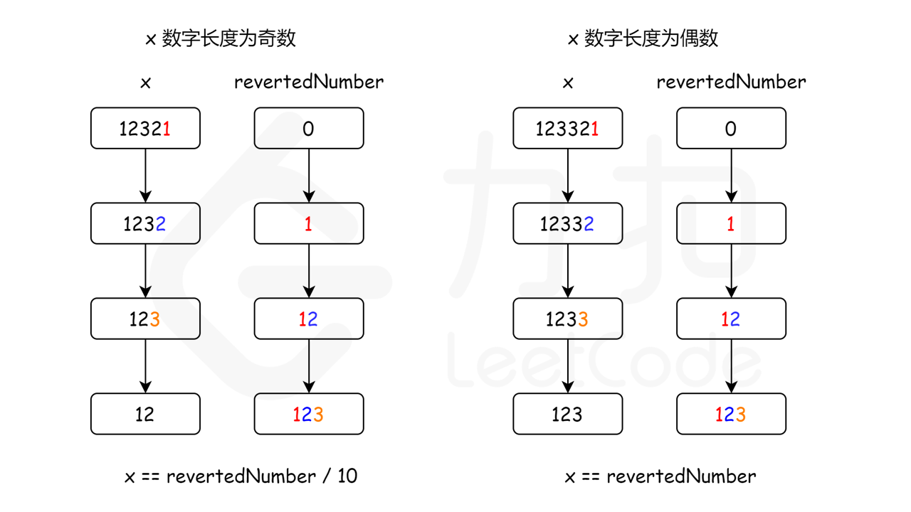

# Leetcode——字符串（KMP/Z函数/Manacher/字符串哈希/AC自动机/后缀数组/子序列自动机）

# 一、KMP算法

首先，可以先阅读这一篇文章：[(99+ 封私信 / 82 条消息) 如何更好地理解和掌握 KMP 算法? - 知乎](https://www.zhihu.com/question/21923021/answer/37475572)

**KMP算法推荐背下来，在理解了原理之后，背下来应该也不会很难。**

> 板子以及介绍如下：
>
> 以下是代码的详细注释及KMP过程的说明：（结合上面的那个链接来理解会更好一些）
>
> ```cpp
> private:
>     vector<int> kmp(string &text, string &pattern) {
>         int m = pattern.length();
>         // 1. 构建前缀函数（Partial Match Table，部分匹配表）
>         vector<int> pi(m); // pi[i]表示pattern[0..i]的最长公共前后缀的长度
>         int c = 0; // 当前最长公共前后缀的长度，也作为指针指向待匹配位置
>         for (int i = 1; i < m; i++) { // i从1开始，因为pi[0]一定是0
>             char v = pattern[i];
>             // 当c>0且当前字符不匹配时，回退到前一个公共前后缀的位置
>             while (c > 0 && pattern[c] != v) {
>                 c = pi[c - 1]; // 根据前缀表回退，避免重复匹配
>             }
>             // 如果当前字符匹配，则公共前后缀长度+1
>             if (pattern[c] == v) {
>                 c++;
>             }
>             pi[i] = c; // 记录当前位置的最长公共前后缀长度
>         }
> 
>         // 2. 使用构建好的pi数组进行模式匹配
>         vector<int> res; // 存储所有匹配的起始索引
>         c = 0; // 重置c为0，表示当前已匹配的pattern长度
>         for (int i = 0; i < text.length(); i++) { // 遍历text的每个字符
>             char v = text[i];
>             // 当已匹配部分不为0且当前字符不匹配时，回退c
>             while (c > 0 && pattern[c] != v) {
>                 c = pi[c - 1]; // 利用前缀表跳过已匹配的前缀部分
>             }
>             // 当前字符匹配，继续推进
>             if (pattern[c] == v) {
>                 c++;
>             }
>             // 如果c等于pattern长度，说明找到完整匹配
>             if (c == m) {
>                 res.push_back(i - m + 1); // 记录起始索引（当前i是pattern最后一个字符的位置）
>                 c = pi[c - 1]; // 回退c，继续寻找后续可能的匹配
>             }
>         }
>         return res;
>     }
> ```
>
> ### KMP算法核心过程说明
>
> #### 1. 构建前缀函数（Partial Match Table）
> - **目标**：为模式串 `pattern` 生成前缀表 `pi`，其中 `pi[i]` 表示子串 `pattern[0..i]` 的 **最长公共前后缀** 的长度。
> - **步骤**：
>   - 初始化 `c=0`，表示当前最长公共前后缀的长度。
>   - 遍历 `pattern` 从 `i=1` 到 `i=m-1`：
>     - 若 `pattern[i]` 与 `pattern[c]` 不匹配，则根据前缀表回退 `c` 至 `pi[c-1]`，直到匹配或 `c=0`。
>     - 若匹配，则 `c++`，表示公共前后缀长度增加。
>     - 将 `pi[i]` 设为当前 `c`，记录最长公共前后缀长度。
> - **示例**：`pattern = "ababc"` 的 `pi` 数组为 `[0,0,1,2,0]`。
>
> #### 2. 模式匹配
> - **目标**：在文本 `text` 中高效查找所有 `pattern` 的起始位置。
> - **步骤**：
>   - 初始化 `c=0`，表示已匹配的 `pattern` 长度。
>   - 遍历 `text` 的每个字符：
>     - 若当前字符与 `pattern[c]` 不匹配，则通过 `pi` 回退 `c` 至 `pi[c-1]`，跳过已匹配的前缀部分。
>     - 若匹配，则 `c++`。
>     - 当 `c == m` 时，记录匹配位置 `i - m + 1`，并回退 `c` 至 `pi[c-1]`，继续后续匹配。
> - **优势**：利用前缀表避免从头开始匹配，时间复杂度为 **O(n + m)**（n为text长度，m为pattern长度）。
>
> ### 关键点总结
> - **前缀表**：存储每个位置的最长公共前后缀长度，是KMP算法的核心。
> - **回退机制**：匹配失败时，通过前缀表回退到已知的安全位置，避免重复比较。
> - **完整匹配处理**：找到匹配后，回退 `c` 以允许重叠匹配（如 `pattern = "aaa"` 在 `text = "aaaa"` 中匹配多次）。

学习了以上的算法之后（记得多写几遍，理解算法原理之后记忆下来），可以开始做这部分的题目了。

### （1）[28. 找出字符串中第一个匹配项的下标](https://leetcode.cn/problems/find-the-index-of-the-first-occurrence-in-a-string/)

板子题，kmp这个板子函数即为需要掌握的函数。

```c++
class Solution {
public:
    vector<int> kmp(string& str, string& pattern)
    {
        int m = pattern.size();
        int c = 0;
        vector<int> pi(m, 0);
        for(int i=1;i<m;i++)
        {
            char v = pattern[i];
            //case 1:不匹配
            while(c>0 && pattern[c]!=v)
            {
                c = pi[c-1];
            }
            //case 2:匹配
            if(pattern[c]==v) c++;
            pi[i] = c;
        }

        //匹配正式的字符串
        vector<int> res;
        c = 0;
        for(int i=0;i<str.size();i++)
        {
            char v = str[i];
            while(c>0 && pattern[c]!=v)
            {
                c = pi[c-1];
            }
            if(pattern[c]==v) c++;
            if(c==m)
            {
                res.emplace_back(i-m+1);
                c=pi[c-1];
            }
        }
        return res;
    }
    int strStr(string haystack, string needle) {
        vector<int> res = kmp(haystack, needle);
        if(res.size()==0) return -1;
        return res[0];
    }
};
```


### （2）[796. 旋转字符串](https://leetcode.cn/problems/rotate-string/)

注意判断字符串不等长的情况，不然会有情况考虑错误。

```c++
class Solution {
public:
    vector<int> kmp(string& str, string& pattern)
    {
        int m = pattern.size();
        vector<int> pi(m, 0);
        int c = 0;
        for(int i=1;i<m;i++)
        {
            char v = pattern[i];
            while(c>0 && pattern[c]!=v)
            {
                c = pi[c-1];
            }
            if(pattern[c]==v) c++;
            pi[i] = c;
        }
        vector<int> res;
        c = 0;
        for(int i=0;i<str.size();i++)
        {
            char v = str[i];
            while(c>0 && pattern[c]!=v)
            {
                c = pi[c-1];
            }
            if(pattern[c]==v) c++;
            if(c==m)
            {
                res.emplace_back(i-m+1);
                c = pi[c-1];
            }
        }
        return res;
    }
    bool rotateString(string s, string goal) {
        if((int)s.size()!=(int)goal.size()) return false; //不然aa a这个用例过不去
        string str = s + s;
        vector<int> res = kmp(str, goal);
        return res.size()!=0;
    }
};
```


### （3）[1392. 最长快乐前缀](https://leetcode.cn/problems/longest-happy-prefix/)

就是KMP算法的第一个步骤：

```c++
class Solution {
public:
    string longestPrefix(string s) {
        //其实就是kmp求pi数组的第一个步骤，不要想太复杂了
        int m = s.size();
        vector<int> pi(m, 0);
        int c = 0;
        for(int i=1;i<m;i++)
        {
            char v = s[i];
            while(c>0 && s[c]!=v)
            {
                c = pi[c-1];
            }
            if(s[c]==v) c++;
            pi[i] = c;
        }
        return s.substr(0, pi[m-1]);
    }
};
```


### （4）[3036. 匹配模式数组的子数组数目 II](https://leetcode.cn/problems/number-of-subarrays-that-match-a-pattern-ii/)

依旧是一个匹配问题，首先依据题意把`nums`数组翻译成带有-1，0，1的版本，然后再用翻译之后的只包含-1，0，1的版本去和pattern做模式串匹配，依旧是KMP算法。代码如下：
```c++
class Solution {
public:
    int kmp(vector<int>& nums, vector<int>& pattern)
    {
        //只不过是把字符串形式的KMP改成了int的情况
        int m = pattern.size();
        vector<int> pi(m, 0);
        int c = 0;
        for(int i=1;i<m;i++)
        {
            int v = pattern[i];
            while(c>0 && pattern[c]!=v)
            {
                c = pi[c-1];
            }
            if(pattern[c]==v) c++;
            pi[i] = c;
        }
        int cnt = 0; //匹配的个数
        c = 0;
        for(int i=0;i<nums.size();i++)
        {
            int v = nums[i];
            while(c>0 && pattern[c]!=v)
            {
                c = pi[c-1];
            }
            if(pattern[c]==v) c++;
            if(c==m)
            {
                cnt++;
                c = pi[c-1];
            }
        }
        return cnt;
    }
    int countMatchingSubarrays(vector<int>& nums, vector<int>& pattern) {
        //后一个比前一个大，值为1，相等则为0，后一个比前一个小则为-1
        int n = nums.size();
        vector<int> vec(n, -2); //依据本题，最开始的字符设置为一个非法值即可
        for(int i=1;i<n;i++)
        {
            if(nums[i]>nums[i-1]) vec[i] = 1;
            else if(nums[i]==nums[i-1]) vec[i] = 0;
            else vec[i] = -1; 
        }
        int res = kmp(vec, pattern);
        return res;
    }
};
```


### ==中间有一道[1764. 通过连接另一个数组的子数组得到一个数组](https://leetcode.cn/problems/form-array-by-concatenating-subarrays-of-another-array/)看起来风评不太好，先不做了。==


### （5）[1668. 最大重复子字符串](https://leetcode.cn/problems/maximum-repeating-substring/)

```c++
class Solution {
public:
    bool kmp(string& str, string& pattern)
    {
        int m = pattern.size();
        vector<int> pi(m, 0);
        int c = 0;
        for(int i=1;i<m;i++)
        {
            char v = pattern[i];
            while(c>0 && pattern[c]!=v)
            {
                c = pi[c-1];
            }
            if(pattern[c]==v) c++;
            pi[i] = c;
        }
        c = 0;
        for(int i=0;i<str.size();i++)
        {
            char v = str[i];
            while(c>0 && pattern[c]!=v)
            {
                c = pi[c-1];
            }
            if(pattern[c]==v) c++;
            if(c==m) return true;
        }
        return false;
    }
    int maxRepeating(string sequence, string word) {
        int k = 0;
        bool flag = true;
        string str = "";
        while(flag)
        {
            str += word;
            flag = kmp(sequence, str);
            if(flag) k++;
        }
        return k;
    }
};
```


### （6）[459. 重复的子字符串](https://leetcode.cn/problems/repeated-substring-pattern/)（简单题？？？==证明还没看完，后面再说吧，有点不好理解==）

> 给定一个非空的字符串 `s` ，检查是否可以通过由它的一个子串重复多次构成。

本题相当于考察KMP算法中pi数组的概念。`pi[i]`的含义是以i下标结尾的子串的最长相等前后缀的长度，本题的难点在于如何推导公式（==公式推导有点逆天，可以先放一放==）。

> 公式推导比较复杂，以下是一个简单的理解：
>
> - 如果s不包含重复子串（>=2次的重复子串），那么s自己就是一次重复的子串，那么把s + s去头去尾中就一定不包含s自己。
> - 如果s包含重复子串，那么在s + s去头去尾中就一定能找到s自己

代码如下：
```c++
```


（非题单题）

### [8. 字符串转换整数 (atoi)](https://leetcode.cn/problems/string-to-integer-atoi/)

请你来实现一个 `myAtoi(string s)` 函数，使其能将字符串转换成一个 32 位有符号整数。

函数 `myAtoi(string s)` 的算法如下：

1. **空格：**读入字符串并丢弃无用的前导空格（`" "`）
2. **符号：**检查下一个字符（假设还未到字符末尾）为 `'-'` 还是 `'+'`。如果两者都不存在，则假定结果为正。
3. **转换：**通过跳过前置零来读取该整数，直到遇到非数字字符或到达字符串的结尾。如果没有读取数字，则结果为0。
4. **舍入：**如果整数数超过 32 位有符号整数范围 `[−231, 231 − 1]` ，需要截断这个整数，使其保持在这个范围内。具体来说，小于 `−231` 的整数应该被舍入为 `−231` ，大于 `231 − 1` 的整数应该被舍入为 `231 − 1` 。

返回整数作为最终结果。

**示例 1：**

**输入：**s = "42"

**输出：**42

**解释：**加粗的字符串为已经读入的字符，插入符号是当前读取的字符。

```
带下划线线的字符是所读的内容，插入符号是当前读入位置。
第 1 步："42"（当前没有读入字符，因为没有前导空格）
         ^
第 2 步："42"（当前没有读入字符，因为这里不存在 '-' 或者 '+'）
         ^
第 3 步："42"（读入 "42"）
```


M1:

**https://leetcode.cn/problems/string-to-integer-atoi/solutions/2361399/8-zi-fu-chuan-zhuan-huan-zheng-shu-atoiq-a2e8/**


使用int

```C++
class Solution {
public:
    int myAtoi(string s) {
        int n=s.size();
        int sign = 1,bndry = INT_MAX/10;//214748364;
        int i=0;
        if(n==0)return 0;
        while(s[i]==' ')if(++i>n)return 0;
        if(s[i]=='-')sign = -1;
        if(s[i]=='-'||s[i]=='+')i++;
        int res=0;
        for(;i<n;i++)
        {
            if(s[i]<'0'||s[i]>'9') break;
            if(res>bndry||(res==bndry&&s[i]>'7')) //这个是字符！
            {
                return sign==1?INT_MAX:INT_MIN;
            }
            res=res*10+(s[i]-'0');//(s[i]-'0')一定要加括号 否则res*10+s[i]有溢出风险
        }
        return sign*res;
    }
};
```


M2:

Y: 较为冗长臃肿 而且使用了long（有的题目可能不让用）

```C++
class Solution {
public:
    int myAtoi(string s) {
        int n = s.size();
        int i=0;
        int b=1;
        bool flagBeginReadNum=false;
        long long res=0;
        for(int i=0;i<n;i++)
        {
            if(flagBeginReadNum)
            {
                if(s[i]>='0'&&s[i]<='9')
                {
                    res=res*10+(s[i]-'0');
                    // cout<<"res"<< res<<endl;
                    if(res*b>INT_MAX)
                    {
                        res=INT_MAX;
                        return res;
                    }
                    else if(res*b<INT_MIN)
                    {
                        res = INT_MIN;
                        return res;
                    }
                }
                else
                {
                    return b*res;
                }
            }
            else
            {
                if(s[i]==' ')continue;
                if( s[i]=='-')
                {
                    b=-1;
                    flagBeginReadNum=true; // -***+12 这算0
                }
                else if( s[i]=='+')
                {
                    flagBeginReadNum=true; // -***+12 这算0	
                }
                else if(s[i]>='0'&&s[i]<='9')
                {
                    // cout<<"in"<<s[i]<<endl;
                    flagBeginReadNum=true;
                    res=res*10+(s[i]-'0');
                }
                //其他情况 非法字符。
                else
                {
                    return b*res;
                }
            }
        }
        return res*b;
    }
};
```


# 其他


## 链表

### [61. 旋转链表](https://leetcode.cn/problems/rotate-list/)

给你一个链表的头节点 `head` ，旋转链表，将链表每个节点向右移动 `k` 个位置。

 

**示例 1：**


```
输入：head = [1,2,3,4,5], k = 2
输出：[4,5,1,2,3]
```


这题有很多方法可以做 也都能写出

M1：快慢指针

M2：闭合为环
思路及算法

记给定链表的长度为 n，注意到当向右移动的次数 k≥n 时，我们仅需要向右移动 kmodn 次即可。因为每 n 次移动都会让链表变为原状。这样我们可以知道，新链表的最后一个节点为原链表的第 (n−1)−(kmodn) 个节点（从 0 开始计数）。

这样，我们可以先将给定的链表连接成环，然后将指定位置断开。

具体代码中，我们首先计算出链表的长度 n，并找到该链表的末尾节点，将其与头节点相连。这样就得到了闭合为环的链表。然后我们找到新链表的最后一个节点（即原链表的第 (n−1)−(kmodn) 个节点），将当前闭合为环的链表断开，即可得到我们所需要的结果。

特别地，当链表长度不大于 1，或者 k 为 n 的倍数时，新链表将与原链表相同，我们无需进行任何处理。
链接：https://leetcode.cn/problems/rotate-list/solutions/681812/xuan-zhuan-lian-biao-by-leetcode-solutio-woq1/

```C++
class Solution {
public:
    ListNode* rotateRight(ListNode* head, int k) {
        if(k==0||head==nullptr||head->next==nullptr)return head;
        ListNode* end = head;
        int n=1;
        while(end->next)
        {
            end = end->next;
            n++;
        }
        end->next = head;//1 2 3 4 5 1 2...
        k = n-k%n;//5-5%2 = 3// 
        ListNode* p = end;
        for(int i=0;i<k;i++)
        {
            p=p->next;
        }
        ListNode* res = p->next;
        p->next = nullptr;
        return res;
    }
};	
```


## 暂无分类


### [9. 回文数](https://leetcode.cn/problems/palindrome-number/)

给你一个整数 `x` ，如果 `x` 是一个回文整数，返回 `true` ；否则，返回 `false` 。

回文数是指正序（从左向右）和倒序（从右向左）读都是一样的整数。

- 例如，`121` 是回文，而 `123` 不是。

**示例 1：**

```
输入：x = 121
输出：true
```


M1 推荐 不用long

链接：https://leetcode.cn/problems/palindrome-number/solutions/



```C++
class Solution 
{
public:
    bool isPalindrome(int x) 
    {
        // 特殊情况：
        // 如上所述，当 x < 0 时，x 不是回文数。
        // 同样地，如果数字的最后一位是 0，为了使该数字为回文，
        // 则其第一位数字也应该是 0
        // 只有 0 满足这一属性
        if (x < 0 || (x % 10 == 0 && x != 0)) 
        {
            return false;
        }

        int revertedNumber = 0;
        while (x > revertedNumber) 
        {
            revertedNumber = revertedNumber * 10 + x % 10;
            x /= 10;
        }

        // 当数字长度为奇数时，我们可以通过 revertedNumber/10 去除处于中位的数字。
        // 例如，当输入为 12321 时，在 while 循环的末尾我们可以得到 x = 12，revertedNumber = 123，
        // 由于处于中位的数字不影响回文（它总是与自己相等），所以我们可以简单地将其去除。
        return x == revertedNumber || x == revertedNumber / 10;
    }
};
```


M2 Y 不用看 用了long

```C++
class Solution {
public:
    bool isPalindrome(int x) {
        if(x<0) return false;
        long long tx = x;
        long long rx=0;
        while(tx)
        {
            rx=rx*10+tx%10;
            tx=tx/10;
        }
        return x == rx;
    }
};
```

