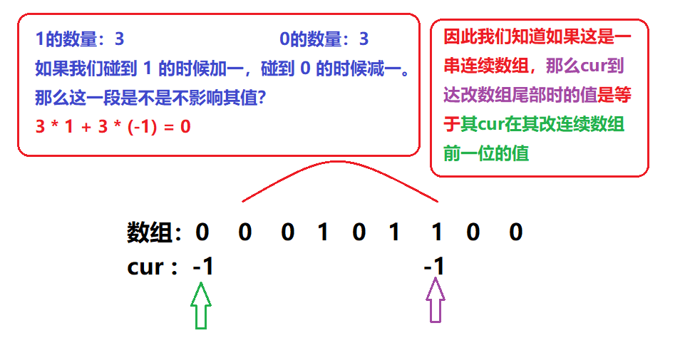
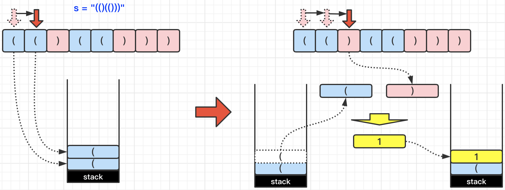

# Leetcode——常用数据结构专题

参考链接：[分享丨【题单】常用数据结构（前缀和/差分/栈/队列/堆/字典树/并查集/树状数组/线段树） - 力扣（LeetCode）](https://leetcode.cn/circle/discuss/mOr1u6/)

# 零、常用枚举技巧

## 1.枚举右，维护左

对于 **双变量问题**，例如两数之和$a_i+a_j=t$,可以枚举右边的$a_j$,转换为**单变量问题**，也就是在$a_j$左边找是否有$a_i=t-a_j$，这可以用哈希表维护。

这个技巧可以叫做**枚举右，维护左。**

参考[1. 两数之和 - 力扣（LeetCode）](https://leetcode.cn/problems/two-sum/solutions/2326193/dong-hua-cong-liang-shu-zhi-he-zhong-wo-0yvmj/)


### （1）[1. 两数之和](https://leetcode.cn/problems/two-sum/)

这是一道经典题目。可以枚举右（也就是让右侧的`j`变量从左到右依次遍历），然后维护左表示先看哈希表中是否有`target-nums[j]`，如果有说明记录过，直接返回`{it->second, j}`即可（哈希表的key表示值，value表示索引，`it->second`表示对应元素的索引）；否则如果找不到的话则把对应的`(nums[j],j)`放入到哈希表当中。

> 注意：不能先加入哈希表再查找，因为不能使用两次相同的元素，因此每次都是先查有没有再加入哈希表。

本题代码如下：

```c++
class Solution {
public:
    vector<int> twoSum(vector<int>& nums, int target) {
        unordered_map<int, int> umap; //key:元素值, value:索引
        for(int j=0;j<nums.size();j++){
            int x = target - nums[j];
            auto it = umap.find(x);
            if(it!=umap.end()){
                return {it->second, j};
            }
            umap[nums[j]] = j;
        }
        return {};
    }
    
};
```


### （2）[1512. 好数对的数目](https://leetcode.cn/problems/number-of-good-pairs/)

```c++
class Solution {
public:
    int numIdenticalPairs(vector<int>& nums) {
        //哈希表维护有多少相同的数
        unordered_map<int, int> umap;
        int cnt = 0;
        for(int j=0;j<nums.size();j++){
            if(umap.count(nums[j])){
                cnt += umap[nums[j]]; //每遍历到一个新的数,和数组内所有和他相等的数都构成好数对
            }
            umap[nums[j]]++;
        }
        return cnt;
    }
};
```


### （3）[219. 存在重复元素 II](https://leetcode.cn/problems/contains-duplicate-ii/)

哈希表里存索引，取出时检查索引是否在范围内即可。代码如下：

```c++
class Solution {
public:
    bool containsNearbyDuplicate(vector<int>& nums, int k) {
        unordered_map<int, int> umap;
        for(int j=0;j<nums.size();j++){
            auto it = umap.find(nums[j]);
            if(it!=umap.end()){
                int index = umap[nums[j]];
                if(abs(index-j)<=k){
                    return true;
                }
            }
            umap[nums[j]]=j;
        }
        return false;
    }
};
```


### （5）[624. 数组列表中的最大距离](https://leetcode.cn/problems/maximum-distance-in-arrays/)

针对本题来说，**枚举右，维护左**的思想就在于，在每次往后遍历一个数组时，维护左侧遍历完的数组中的最小值和最大值，而最终结果一定在（当前数组最大-历史数组最小，以及历史数组最大-当前数组最小）中产生。

代码如下：

```c++
class Solution {
public:
    int maxDistance(vector<vector<int>>& arrays) {
        int minDist = INT_MAX/2, maxDist = -INT_MAX/2; //这样可以避免相减时溢出
        int result = -INT_MAX;
        for(int j=0;j<arrays.size();j++){
            result = max({result, arrays[j].back()-minDist, maxDist-arrays[j][0]}); //每个数组只能选一个,因此先计算再更新,避免重复的问题
            minDist = min(minDist, arrays[j][0]);
            maxDist = max(maxDist, arrays[j].back());
        }
        return result;
    }
};
```


Y 感觉上面那个更好

```C++
class Solution {
public:
    int maxDistance(vector<vector<int>>& arrays) 
    {
        // int minNum= INT_MAX/2;
        // int maxNum = -INT_MAX/2;
        int minNum = arrays[0][0];
        int maxNum = arrays[0].back();
        int res=0;
        for(int i=1;i<arrays.size();i++)
        {
            res = max({res,abs(arrays[i][0]-maxNum),abs(arrays[i].back()-minNum)});
            minNum = min(minNum,arrays[i][0]);
            maxNum = max(maxNum,arrays[i].back());
        }
        return res;
    }
};
```


### （6）[2815. 数组中的最大数对和](https://leetcode.cn/problems/max-pair-sum-in-an-array/)

```c++
class Solution {
public:
    int maxSum(vector<int>& nums) {
        int num[10]={0}; //记录每个数位对应的最大值
        int res = -1;
        for(int j=0;j<nums.size();j++){
            //开始拆解某个数,更新所有的为可能的最大值
            int x = nums[j];
            int m = 0; //记录最大的数位
            while(x){
                int a = x % 10;
                x /= 10;
                m = max(m, a);
            }
            if(num[m]!=0) res = max(res, nums[j]+num[m]); //num[m]如果是0表示"哈希表"里没东西,因为nums[i]>=1
            num[m] = max(num[m], nums[j]);
        } 
        return res;
    }
};
```


### （7）[1014. 最佳观光组合](https://leetcode.cn/problems/best-sightseeing-pair/)（※）

这道题目如果想要写出复杂度比较低的写法，有一定的难度。本题的要点在于，因为我们要计算的是`values[i] + values[j] + i - j`，可以维护`j`左侧的最大的`values[i]+i`项。每次移动`j`的时候，都先拿出记录的当前最大的`values[i]+i`项，然后判断是否当前是更好的观光组合，之后更新最大的`values[i]+i`项。（更新要放在查询之后，防止拿出了当前的索引值，出现重复）。此时代码如下：

```c++
class Solution {
public:
    int maxScoreSightseeingPair(vector<int>& values) {
        int maxV = -INT_MAX; //维护values[i]+i的最大值
        int res = -INT_MAX;
        for(int j=0;j<values.size();j++){
            int sum = maxV + values[j] - j;
            res = max(res, sum);
            maxV = max(maxV, values[j] + j); //更新values[i]+i的最大值
        }
        return res;
    }
};
```


### （8）[1814. 统计一个数组中好对子的数目](https://leetcode.cn/problems/count-nice-pairs-in-an-array/)

- `nums[i] + rev(nums[j]) == nums[j] + rev(nums[i])`转为计算``nums[i] -rev(nums[i]) == nums[j] - rev(nums[j])``

所以，提前先遍历一遍数组，然后计算一下`nums[i] -rev(nums[i])`的值，然后就转换为了前面学过的题目。

```c++
class Solution {
public:
    const int MOD = 1e9+7;
    int countNicePairs(vector<int>& nums) {
        //对数组进行预处理
        int n = nums.size();
        vector<long long> process(n);
        for(int i=0;i<nums.size();i++){
            int x = nums[i];
            //翻转x
            long long sum = 0;
            while(x){
                int a = x%10;
                sum*=10;
                sum+=a;
                x/=10;
            }
            process[i] = (long long)nums[i] - sum;
        }

        //用哈希存这个值,计算总的cnt
        int cnt = 0;
        unordered_map<long long, int> umap; //存每个值出现的次数
        for(int i=0;i<n;i++){
            cnt = (cnt + umap[process[i]])%MOD;
            umap[process[i]]++;
        }
        return cnt;
    }
};
```


# 一、前缀和

## §1.1.前缀和基础

首先，推荐阅读这一篇：[303. 区域和检索 - 数组不可变 - 力扣（LeetCode）](https://leetcode.cn/problems/range-sum-query-immutable/solutions/2693498/qian-zhui-he-ji-qi-kuo-zhan-fu-ti-dan-py-vaar/)

要点是记住：

- `s[0]=0`，以及计算`left`到`right`索引对应的数组和，可以用`s[right+1]-s[left]`。

具体写法，直接看本题板子题即可：

```c++
class NumArray {
public:
    vector<int> s;
    NumArray(vector<int>& nums) {
        int n = nums.size();
        s.resize(n+1);
        for(int i=0;i<n;i++){
            s[i+1] = s[i] + nums[i]; //注:s[0]=0
        }
    }
    
    int sumRange(int left, int right) {
        return s[right+1] - s[left];
    }
};

/**
 * Your NumArray object will be instantiated and called as such:
 * NumArray* obj = new NumArray(nums);
 * int param_1 = obj->sumRange(left,right);
 */
```

vector.resize 与 vector.reserve的区别  ： https://blog.csdn.net/JMW1407/article/details/108785448


### （1）[3427. 变长子数组求和](https://leetcode.cn/problems/sum-of-variable-length-subarrays/)

前缀和的最简单应用。

```c++
class Solution {
public:
    int subarraySum(vector<int>& nums) {
        int n = nums.size();
        int res = 0;
        vector<int> s(n+1);
        for(int i=0;i<n;i++) s[i+1] = s[i] + nums[i]; //前缀和
        for(int i=0;i<n;i++){
            int start = max(0, i-nums[i]);
            res += (s[i+1]-s[start]);
        }
        return res;
    }
};
```


### （2）[2559. 统计范围内的元音字符串数](https://leetcode.cn/problems/count-vowel-strings-in-ranges/)

```c++
class Solution {
public:
    bool isVowel(char& c){
        return c=='a' || c=='e' || c=='i' || c=='o' || c=='u';
    }
    bool isValid(string& s){
        return (isVowel(s[0]) && isVowel(s.back()));
    }
    vector<int> vowelStrings(vector<string>& words, vector<vector<int>>& queries) {
        int n = words.size();
        vector<int> s(n+1); //默认s[0]=0,前缀和
        for(int i=0;i<n;i++){
            s[i+1] = s[i] + (int)(isValid(words[i]));
        }
        //开始查询
        int m = queries.size();
        vector<int> res(m);
        for(int i=0;i<m;i++){
            res[i] = (s[queries[i][1]+1]-s[queries[i][0]]);
        }
        return res;
    }
};
```


### （3）[3152. 特殊数组 II](https://leetcode.cn/problems/special-array-ii/)（第一遍看了提示）

这道题的要点在于，可以让符合条件的在前缀和中用0表示，不符合条件的会+1上去，这样如果查询区间`s[right]-s[left]==0`则证明区间内都是0，也就是都符合要求。**针对这种题目可以变通考虑前缀和的下标开始位置，以及计算前缀和的公式，不要硬背诵板子。**

本题代码如下：

```c++
class Solution {
public:
    vector<bool> isArraySpecial(vector<int>& nums, vector<vector<int>>& queries) {
        int n = nums.size();
        int m = queries.size();
        vector<bool> res(m);
        vector<int> s(n);
        for(int i=1;i<n;i++){ //s[i]表示0~i的不相等情况
            s[i] = s[i-1] + (nums[i]%2==nums[i-1]%2); //不相等时是0,不会增加s[i],否则相等时是1,会增加s[i] 
        }
        for(int i=0;i<queries.size();i++){
            res[i] = (s[queries[i][1]]==s[queries[i][0]]);
        }
        return res;
    }
};
```


### （4）[1749. 任意子数组和的绝对值的最大值](https://leetcode.cn/problems/maximum-absolute-sum-of-any-subarray/)（想了一下直接看答案前缀和做法）

[1749. 任意子数组和的绝对值的最大值 - 力扣（LeetCode）](https://leetcode.cn/problems/maximum-absolute-sum-of-any-subarray/solutions/2372374/ren-yi-zi-shu-zu-he-de-jue-dui-zhi-de-zu-qerr/)，这个题解的思路确实很妙。C++中前缀和函数说明：[C++ STL partial_sum 函数说明 - 简书](https://www.jianshu.com/p/e68a11d5b316)

```c++
class Solution {
public:
    int maxAbsoluteSum(vector<int>& nums) {
        int n = nums.size();
        vector<int> s(n+1);
        partial_sum(nums.begin(), nums.end(), s.begin()+1); //注意,填一个0在前缀和开头是有必要的
        // for(int x:s){
        //     cout<<x<<" ";
        // }
        auto p = minmax_element(s.begin(), s.end());
        return *p.second - *p.first;
    }
};
```

之所以要填一个0在前缀和的开头，是因为可能会存在以下的序列：


注意看标准输出，打印了前缀和中的元素，此时都是负的值，最大值应该是什么都不选。此时如果开头的0不在前缀和数组当中，会得到错误的结果。

> 可以理解为，添加一个0在前缀和开头，有助于解决查询区间`left=0`的问题。


常规写法:(如果忘记上面语法)

```C++
class Solution {
public:
    int maxAbsoluteSum(vector<int>& nums) {
        int n= nums.size();
        vector<int> preSum(n+1);
        int maxPresum=0;//防止max也是负的
        int minPresum=0;//方式min也是正的
        for(int i=0;i<n;i++)
        {
            preSum[i+1]=preSum[i]+nums[i];
            maxPresum = max(maxPresum,preSum[i+1]);
            minPresum = min(minPresum,preSum[i+1]);
        }
        return abs(maxPresum-minPresum);
    }
};
```


### （5）[2389. 和有限的最长子序列](https://leetcode.cn/problems/longest-subsequence-with-limited-sum/)（看答案）

注意本题是子序列，并不要求必须连续，可以删掉中间的。因为是求和所以可以对数组进行排序，并不影响结果。于是就可以前缀和+二分来做这道题了，代码如下：

```c++
class Solution {
public:
    vector<int> answerQueries(vector<int>& nums, vector<int>& queries) {
        //贪心:既然子序列要尽量长,就要选一些最小的数
        sort(nums.begin(), nums.end());
        //原地计算前缀和,本题不会做区间前缀和查询,因此不一定需要s[0]=0
        partial_sum(nums.begin(), nums.end(), nums.begin());
        vector<int> res(queries.size());
        for(int i=0;i<queries.size();i++){
            int x = queries[i];
            int len = ranges::upper_bound(nums, x) - nums.begin();
            res[i] = len;
        }
        return res;
    }
};
```

补充知识：[【C++】 详解 lower_bound 和 upper_bound 函数（看不懂来捶我！！！）_lowerbound和upperbound比较函数-CSDN博客](https://blog.csdn.net/weixin_45031801/article/details/137544229)

- 前提是有序的情况下，**lower_bound** **返回指向第一个值不小于 val 的位置，也就是返回第一个大于等于val值的位置。**（通过二分查找）
- 前提是有序的情况下，`upper_bound`返回第一个>target的值。所以像本题要求解最后一个<=target的值，可以用`upper_bound`的返回索引值-1来实现。

Y

```C++
class Solution {
public:
    vector<int> answerQueries(vector<int>& nums, vector<int>& queries) 
    {
        sort(nums.begin(),nums.end());
        //[1,2,4,5]
        //presum:[1,3,3,7,12]
        //二分
        int n=nums.size();
        vector<int> presum(n);
        partial_sum(nums.begin(),nums.end(),presum.begin());
        int qn=queries.size();
        vector<int> res(qn);
        for(int i=0;i<qn;i++)
        {
            //最后一个<=x的 第一个>x的-1
            auto a = upper_bound(presum.begin(),presum.end(),queries[i]);
            
            res[i]=(a-presum.begin());//end = a-1 (第一个>x的-1),res = end+1(数量)
        }
        return res;

    }
};
```


### ==（6）[3361. 两个字符串的切换距离](https://leetcode.cn/problems/shift-distance-between-two-strings/)==（题解太少，先放着）


### ==（7）[2055. 蜡烛之间的盘子](https://leetcode.cn/problems/plates-between-candles/)（看答案，这题暂时超纲了，水平太拉了，明天再试试）==

> 这道题目有比较大的思维难度。和接雨水那道题的思路有共同之处，推荐看这篇题解：[2055. 蜡烛之间的盘子 - 力扣（LeetCode）](https://leetcode.cn/problems/plates-between-candles/solutions/1320763/qian-zhui-he-xiang-xi-zhu-shi-qu-jin-shu-6v3k/)。思路挺绝的。
>
> 补充：为什么能想到前缀和呢？
>
> - 这道题目的第一个能想到的点是，维护每个点的左侧最近的蜡烛和右侧最近的蜡烛所在的索引，这就好像接雨水那道题目。
> - 接着，就是前缀和的思路了。用前缀和统计累加的盘子总数。对于查询的区间，只有区间左端点右侧最近的蜡烛，到右端点左侧最近的蜡烛之间的盘子是有效的，而计算这些盘子的总数就要用到前缀和。

（用时非常久，>45分钟）需要注意的问题：**前缀和依赖于什么进行更新呢？**验证前缀和的结果可以去题解那个链接里面看。

思考，什么时候前缀和不需要声明成+1的形式呢？==是不是在`nums[0]=0`的时候就可以正常用`s[right]-s[left]`了？（存疑）==


```C++
			"**|**|***|"
			"*	*  | * * | * * * | "
stopNum :	 0  0  0 0 0 2 2 2 2 5  ////存从左到右数 每个蜡烛（栏杆）能拦住多少盘子（猪）
Leftmin :	-1 -1  2 2 2 5 5 5 5 9 //存每个idx左边距离自己最近的蜡烛坐标
Rightmin:	 2  2  2 5 5 5 9 9 9 9 ////存每个idx右边距离自己最近的蜡烛坐标
```


```C++
class Solution {
public:
    vector<int> platesBetweenCandles(string s, vector<vector<int>>& queries) 
    {
        int n=s.size();
        vector<int> stopNum(n);//存从左到右数 每个蜡烛（栏杆）能拦住多少盘子（猪）
        int idx=0;
        int stopN=0;
        int NewStopNum=0;
        bool flagBeginStop=false;
        for(int i=0;i<n;i++)
        {
            if(s[i]=='|')
            {
                flagBeginStop = true;
            }
            if(flagBeginStop==true)
            {
                if(s[i]=='|')
                    NewStopNum =stopN;
                else stopN++;//=='*'
                stopNum[i]=NewStopNum;
            }
        }
        // for(int i=0;i<n;i++)
        // {
        //     cout<<stopNum[i]<<" ";
        // }
        // cout<<endl;
        vector<int> Leftmin(n);//存每个idx左边距离自己最近的蜡烛坐标
        int curIdx=-1;
        for(int i=0;i<n;i++)
        {
            if(s[i]=='|')curIdx = i;
            Leftmin[i]=curIdx;
        }
        // for(int i=0;i<n;i++)
        // {
        //     cout<<Leftmin[i]<<" ";
        // }
        // cout<<endl;
        vector<int> Rightmin(n);//存每个idx右边距离自己最近的蜡烛坐标
        curIdx=-1;
        for(int i=n-1;i>=0;i--)
        {
            if(s[i]=='|')curIdx = i;
            Rightmin[i]=curIdx;
        }
        // for(int i=0;i<n;i++)
        // {
        //     cout<<Rightmin[i]<<" ";
        // }
        int l=0,r=0;
        int qn=queries.size();
        vector<int> res(qn);
        for(int i=0;i<qn;i++)
        {
            l = queries[i][0];
            r = queries[i][1];
            //找到距离l右边最近的蜡烛
            int lr = Rightmin[l];
            int rl = Leftmin[r];
            if(lr==-1||rl==-1)res[i] = 0;
            else res[i] = max(0,stopNum[rl]-stopNum[lr]);
        }
        return res;
    }
};
```


### （8）[1523. 在区间范围内统计奇数数目](https://leetcode.cn/problems/count-odd-numbers-in-an-interval-range/)

依旧直接看了答案。定义`pre(x)`表示`[0，x]`之间的奇数的数目，容易得知该值是`(n+1)/2`个。因此，`[left,right]`区间内的奇数数目应该是`pre(right)-pre(left-1)`，之所以`-1`是因为要包括left在内。**启示是在做前缀和的题目是，一定要懂得灵活变通，不一定要写统一的板子，能搞清楚数组区间和前缀和的区间关系即可。**

代码如下：

```c++
class Solution {
public:
    int pre(int n){
        //统计[0,n]之间有多少奇数
        return (n+1)/2;
    }
    int countOdds(int low, int high) {
        //看见奇数+1,偶数维持不变
        return pre(high) - pre(low-1);
    }
};
```


## §1.2.前缀和与哈希表

通常要用到「枚举右，维护左」的技巧。

### （1）[560. 和为 K 的子数组](https://leetcode.cn/problems/subarray-sum-equals-k/)

乍一看，这题好像可以用滑动窗口来做。但注意，**数组当中可能有负数。这意味着当窗口右指针向右移动是，我们不能保证窗口中的和是递增的，因此滑动窗口方法不可用。**
（可以记为， 数组不是单调的话，不要用滑动窗口，考虑用前缀和）

题解：https://leetcode.cn/problems/subarray-sum-equals-k/solutions/2781031/qian-zhui-he-ha-xi-biao-cong-liang-ci-bi-4mwr/

前缀和**不**增加一位的写法：

```C++
class Solution {
public:
    int subarraySum(vector<int>& nums, int k) 
    {
        //nums = [1,2,3], k = 3
        //presum = [1,3,6]
        //pre[i]-pre[j]=k
        //遍历i  找j 即pre[i]-k存不存在
        unordered_map<int,int> umap;
        int n=nums.size();
        vector<int> presum(n);
        partial_sum(nums.begin(),nums.end(),presum.begin());
        int cnt=0;
        umap[0]=1;//不增加一位的话需要将0手动加进来
        for(int i=0;i<n;i++)
        {
            int target = presum[i]-k;
            auto it = umap.find(target);
            if(it!=umap.end())
            {
                //find!
                cnt+=umap[target];
            }
            umap[presum[i]]++;
        }
        return cnt;
    }
};
```

问：为什么要把 0 也加到哈希表中？

答：举个最简单的例子，nums=[1], k=1。如果不把0加到哈希表中，按照我们的算法，没法算出这里有 1 个符合要求的子数组。也可以这样理解，要想把任意子数组都表示成两个前缀和的差，必须添加 0，否则当子数组是前缀时，没法减去一个数，具体见 前缀和及其扩展 中的讲解。


前缀和增加一位的写法：

```C++
class Solution {
public:
    int subarraySum(vector<int>& nums, int k) 
    {
        //nums = [1,2,3], k = 3
        //presum = [1,3,6]
        //pre[i]-pre[j]=k
        //遍历i  找j 即pre[i]-k存不存在
        unordered_map<int,int> umap;
        int n=nums.size();
        vector<int> presum(n+1);
        partial_sum(nums.begin(),nums.end(),presum.begin()+1);
        int cnt=0;
        // umap[0]=1;
        for(int i=0;i<n+1;i++)
        {
            int target = presum[i]-k;
            auto it = umap.find(target);
            if(it!=umap.end())
            {
                //find!
                cnt+=umap[target];
            }
            umap[presum[i]]++;
        }
        return cnt;
    }
};
```


### [1524. 和为奇数的子数组数目](https://leetcode.cn/problems/number-of-sub-arrays-with-odd-sum/)

```C++
class Solution {
public:
    int numOfSubarrays(vector<int>& arr) 
    {
        //[1,3,5]
        //presum [1,4,9]
        //(presum[i]-presum[j])%2==1
        //遍历i ，求j
        //if presum[i] 1 cnt+=j0 num
        //if presum[i] 0 j1
        const int MOD=1e9+7;
        int oddPreSumNum=0;
        int evenPreSumNum=1;//加入0
        int n=arr.size();
        vector<int> presum(n);
        partial_sum(arr.begin(),arr.end(),presum.begin());
        int cnt=0;
        for(int i=0;i<n;i++)
        {
            if(presum[i]%2==0)
            {
                cnt=(cnt+oddPreSumNum)%MOD;
                evenPreSumNum++;
            }
            else
            {
                cnt=(cnt+evenPreSumNum)%MOD;
                oddPreSumNum++;
            }
        }
        return cnt%MOD;
    }
};
```


###  974. 和可被 K 整除的子数组 1676
https://leetcode.cn/problems/subarray-sums-divisible-by-k/

判断子数组的和能否被 k 整除就等价于判断 `(P[j]−P[i−1])mod k==0`，根据 **同余定理**，只要 `P[j]mod k==P[i−1]mod k`，就可以保证上面的等式成立。

作者：力扣官方题解
链接：https://leetcode.cn/problems/subarray-sums-divisible-by-k/solutions/187947/he-ke-bei-k-zheng-chu-de-zi-shu-zu-by-leetcode-sol/

在这道题目中，我们需要计算和可被 \( k \) 整除的子数组的数量。为了实现这一点，我们使用了前缀和（prefix sum）和同余定理。

```C++
class Solution {
public:
    int subarraysDivByK(vector<int>& nums, int k) 
    {
        //presum i -presum j %k ==0
        //presum i %k = presum j %k [同余定理]
        int n=nums.size();
        vector<int> presum(n+1);
        unordered_map<int,int> modkpresum;
        modkpresum[0]=1;/////
        for(int i=0;i<n;i++)
        {
            presum[i+1]=presum[i]+nums[i];
            // // 注意 C++ 取模的特殊性，当被除数为负数时取模结果为负数，需要纠正
            int modulus = ((presum[i+1]%k)+k)%k;
            modkpresum[modulus]++;
        }
        int cnt=0;
        //写法1：比较不简洁
        // for(auto it = modkpresum.begin();it!=modkpresum.end();it++)
        // {
        //     int num = (*it).second;
        //     cnt+=(num*(num-1))/2; //it返回的是
        // }
        //写法2：比较推荐
        for(auto [x,cx]:modkpresum)
        {
            cnt += cx*(cx-1)/2;
        }
        return cnt;
    }
};
```


简化写法:优化前缀和数组

```C++
class Solution {
public:
    int subarraysDivByK(vector<int>& nums, int k) 
    {
        int n=nums.size();
        unordered_map<int,int> umap;
        int sum=0;
        umap[0]=1;//因为ps[i]-0 %k==0 就是k的倍数 要考虑
        for(int i=0;i<n;i++)
        {
            sum+=nums[i];
            int modu = (sum%k+k)%k;//余数
            umap[modu]++;
        }
        int res=0;
        for(auto [x,cx]:umap)
        {
            res+=cx*(cx-1)/2;
        }
        return res;
    }
};
```


###### 解释 `modkpresum[0] = 1;`

1. **初始化 `modkpresum[0] = 1` 的原因**：
   - 当我们计算前缀和时，如果某个前缀和本身就能被 \( k \) 整除（即 `presum[i] % k == 0`），那么从数组的开始到这个位置的子数组也是一个有效的子数组。
   - 为了能够统计这些情况，我们需要在 `modkpresum` 中初始化 `0` 的计数为 `1`。这表示在开始时（即没有任何元素时），前缀和为 `0`，并且这个前缀和是可以被 \( k \) 整除的。

###### 具体例子

假设我们有一个数组 `nums = [4, 5, 0, -2, -3, 1]` 和 \( k = 5 \)。

- 在计算前缀和时，假设我们在某个位置 \( i \) 计算得到的前缀和 `presum[i]` 是 \( 5 \)（例如，前四个元素的和）。那么：
  - `presum[4] % 5 == 0`，这意味着从数组开始到位置 \( 4 \) 的子数组是一个有效的子数组。
- 如果没有初始化 `modkpresum[0]` 为 `1`，那么我们无法统计从数组开始到某个位置的子数组，因为我们没有记录前缀和为 `0` 的情况。

###### 总结

因此，`modkpresum[0] = 1;` 是为了确保我们能够正确统计那些从数组开始到某个位置的子数组的数量，这些子数组的和可以被 \( k \) 整除。


###  [523. 连续的子数组和](https://leetcode.cn/problems/continuous-subarray-sum/)

这题只需要返回是否存在, 那么umap中也可以仅仅存上一次mod是这个的idx 但是如果要返回个数估计还得存余数mod同的个数

```C++
class Solution {
public:
    bool checkSubarraySum(vector<int>& nums, int k) {
        int m = nums.size();
        if (m < 2) 
        {
            return false;
        }
        unordered_map<int, int> mp;
        mp[0] = -1;
        int remainder = 0;
        for (int i = 0; i < m; i++) 
        {
            remainder = (remainder + nums[i]) % k;
            if (mp.count(remainder)) 
            {
                int prevIndex = mp[remainder];
                if (i - prevIndex >= 2) 
                {
                    return true;
                }
                //不更新 保留最远
            }
            else
            {
                mp[remainder] = i;
            }
        }
        return false;
    }
};

作者：力扣官方题解
链接：https://leetcode.cn/problems/continuous-subarray-sum/solutions/807930/lian-xu-de-zi-shu-zu-he-by-leetcode-solu-rdzi/
来源：力扣（LeetCode）
著作权归作者所有。商业转载请联系作者获得授权，非商业转载请注明出处。
```


```C++
class Solution {
public:
    bool checkSubarraySum(vector<int>& nums, int k) 
    {

        int n=nums.size();
        unordered_map<int,int> umap;
        vector<int> presum(n+1);
        // umap[0]=1;//因为ps[i]-0 %k==0 就是k的倍数 要考虑
        int keepLastmodu=0;//上一次的余数

        for(int i=0;i<n;i++)
        {
            presum[i+1]=presum[i]+nums[i];
            // int modu = (presum[i+1]%k+k)%k;//余数
            int modu = presum[i+1]%k;//余数.题目保证为正数
            //if(umap.contains(modu))res+=umap[modu];
            if(umap.contains(modu))return true;
            
            //umap[modu]++;
            umap[keepLastmodu]++;//上一次的余数，保证不会扣上次的 即让个数大于2
            keepLastmodu = modu;
        }
       
        return false;
    }
};
```


如果要返回**个数**  (不一定对.未验证)

```C++
class Solution {
public:
    int checkSubarraySum(vector<int>& nums, int k) 
    {

        int n=nums.size();
        unordered_map<int,int> umap;
        vector<int> presum(n+1);
        // umap[0]=1;//因为ps[i]-0 %k==0 就是k的倍数 要考虑
        int keepLastmodu=0;//上一次的余数
        int res=0;
        for(int i=0;i<n;i++)
        {
            
            presum[i+1]=presum[i]+nums[i];
            // int modu = (presum[i+1]%k+k)%k;//余数
            int modu = presum[i+1]%k;//余数.题目保证为正数
            if(umap.contains(modu))res+=umap[modu];
            
            //umap[modu]++;
            umap[keepLastmodu]++;//上一次的余数，保证不会扣上次的 即让个数大于2
            keepLastmodu = modu;
        }
       
        return res;
    }
};
```


###  [437. 路径总和 III](https://leetcode.cn/problems/path-sum-iii/) :call_me_hand:

> **注意，如果题目可能会有大数，可以考虑无脑用long long，不然可能会有一些测试用例卡掉，反正long long也就占一些额外的内存消耗，不太可能因为用long long导致超时或者超内存限制的。**

```C++
/**
 * Definition for a binary tree node.
 * struct TreeNode {
 *     int val;
 *     TreeNode *left;
 *     TreeNode *right;
 *     TreeNode() : val(0), left(nullptr), right(nullptr) {}
 *     TreeNode(int x) : val(x), left(nullptr), right(nullptr) {}
 *     TreeNode(int x, TreeNode *left, TreeNode *right) : val(x), left(left), right(right) {}
 * };
 */
class Solution {
public:
    unordered_map<long long,int> umap{{0,1}};
    int res=0;
    void dfs(TreeNode* node , long long sum,int targetSum)
    {
        if(node ==nullptr)return ;
        sum+=node->val;
        if(umap.contains(sum -targetSum))res+=umap[sum-targetSum]; 
        umap[sum]++;
        dfs(node->left,sum,targetSum);
        dfs(node->right,sum,targetSum);
        umap[sum]--;//在这里pop
    }
    int pathSum(TreeNode* root, int targetSum) 
    {
        //每个叶子节点到根节点，维护前缀和 vec vec
        //只看一条链。 枚举右，维护左。 对于i，寻找map中是否有VAL[i]-target的值，+=map[VAL[i]-target]
        //每次新加入节点 看是否有 结合回溯来做

        dfs(root,0,targetSum);
        return res;
    }
};
```


>问：为什么要把 0 加到哈希表中？
>
>答：这里的 0 相当于前缀和数组中的 s[0]=0。举个最简单的例子，根节点值为 1，targetSum=1。如果不把 0 加到哈希表中，按照我们的算法，没法算出这里有 1 条符合要求的路径。也可以这样理解，要想把任意路径和都表示成两个前缀和的差，必须添加一个 0，否则当路径是前缀时（从根节点开始的路径），没法减去一个数，具体见 前缀和及其扩展 中的讲解。
>
>作者：灵茶山艾府
>链接：https://leetcode.cn/problems/path-sum-iii/
>来源：力扣（LeetCode）
>著作权归作者所有。商业转载请联系作者获得授权，非商业转载请注明出处。


这题尝试过用迭代方法  做不出来 遂罢,尝试的过程在以下文件,以后可以进一步讨论

D:\PGPostgraduate\githubNotePrepareForWork\PrepareForWorkNotes\2025寒假\Y\学习记录等.md


###  [2588. 统计美丽子数组数目](https://leetcode.cn/problems/count-the-number-of-beautiful-subarrays/)  :custard:


```C++
class Solution {
public:
    long long beautifulSubarrays(vector<int>& nums) 
    {
        //0110
        //0011
        //0001
        //都是1->0
        //都是0->0
        //1 0->1
        //统计1的个数，如果每一位1的个数都是偶数就可以变成0=>亦或操作

        // vector<int> pre  前面的数组所有数字总的在每一位是偶数还是奇数
        //前缀和
        //每次变化奇偶性就行
        int n = nums.size();
        vector<int> preOddEven(n+1);
        long long res=0;
        unordered_map<int,int> umap(n);//存储每个^之后的数字 这个数字表示的是每个位上有多少奇偶
        umap[0]=1;
        for(int i=0;i<n;i++)
        {
            //0011 计算与前缀1100的^ =>1111   0011^ 0101 =  0110
            preOddEven[i+1]=preOddEven[i]^nums[i];//将第一个数字加入，并没有加0
            if(umap.contains(preOddEven[i+1]))res+=umap[preOddEven[i+1]];
            umap[preOddEven[i+1]]++;
        }
        return res;
    }
};
```

>https://leetcode.cn/problems/count-the-number-of-beautiful-subarrays/solutions/2163133/tao-lu-qian-zhui-he-ha-xi-biao-pythonjav-3fna/
>
>对于二进制中第 *i* 位，数组中所有元素第 *i* 位为 1 的数目为偶数，则此时满足数组中所有元素第 *i* 位的异或和一定为 0。
>
>```
>   //presumi 1101
>        //presumj 1101
>        //每一位1的个数奇偶性一样
>        //都是奇数 减完之后子数组一定是偶数个1
>```
>
>

优化”前缀和“数组位单个值

```C++
class Solution {
public:
    long long beautifulSubarrays(vector<int>& nums) 
    {
        int n = nums.size();
        // vector<int> preOddEven(n+1);
        int preOddEven=0;
        long long res=0;
        unordered_map<int,int> umap(n);
        umap[0]=1;
        for(int i=0;i<n;i++)
        {
            preOddEven=preOddEven^nums[i];//将第一个数字加入，并没有加0
            if(umap.contains(preOddEven))res+=umap[preOddEven];
            umap[preOddEven]++;
        } 
        return res;
    }
};
```


###  [525. 连续数组](https://leetcode.cn/problems/contiguous-array/) :call_me_hand:

给定一个二进制数组 `nums` , 找到含有相同数量的 `0` 和 `1` 的最长连续子数组，并返回该子数组的长度。

**示例 1:**

```
输入: nums = [0,1]
输出: 2
说明: [0, 1] 是具有相同数量 0 和 1 的最长连续子数组。
```

**示例 2:**

```
输入: nums = [0,1,0]
输出: 2
说明: [0, 1] (或 [1, 0]) 是具有相同数量0和1的最长连续子数组。
```

 



```C++
class Solution {
public:
    int findMaxLength(vector<int>& nums) 
    {
        //相同数量
        int n=nums.size();
        unordered_map<int,int> umap(n);
        umap[0]=-1;
        int cur = 0;
        int maxLen = 0;
        // [0,1]
        // [-1,0]
        for(int i=0;i<n;i++)
        {
            if(nums[i]==0)cur--;
            else cur++;
            if(umap.contains(cur))
            {
                maxLen = max(maxLen,i-umap[cur]);//-umap[cur]+1错误 因为其实是前缀和相减
            }
            else 
            {
                umap[cur] = i;
            }
        }
        return maxLen;
        
    }
};
```

是不是做过一个类似的题目 在滑动窗口那里？


###  [面试题 17.05. 字母与数字](https://leetcode.cn/problems/find-longest-subarray-lcci/) 同 525 题

同上题

给定一个放有字母和数字的数组，找到最长的子数组，且包含的字母和数字的个数相同。

返回该子数组，若存在多个最长子数组，返回左端点下标值最小的子数组。若不存在这样的数组，返回一个空数组。

**示例 1：**

```
输入：["A","1","B","C","D","2","3","4","E","5","F","G","6","7","H","I","J","K","L","M"]

输出：["A","1","B","C","D","2","3","4","E","5","F","G","6","7"]
```

**示例 2：**

```
输入：["A","A"]

输出：[]
```

```C++
class Solution {
public:
    vector<string> findLongestSubarray(vector<string>& array) 
    {
        int n=array.size();
        unordered_map<int,int> umap(n);// <cur,idx>
        umap[0] = -1;//到时会做 -(-1) 相当于+1  否则会缺一位
        int cur=0;
        int start=0;
        int maxLen=0;
        int maxLenStart=0;
        //字母-- 数字++
        for(int i=0;i<n;i++)
        {
            string str = array[i];
            if(str[0]>='0'&&str[0]<='9')cur++;
            else cur--;
            if(umap.contains(cur))
            {
                start = umap[cur];
                int len = i-start;
                if(len>maxLen)
                {
                    maxLen=len;
                    maxLenStart = start+1;//+1!!!!!! //因为其实是要从它的下一个开始
                }
            }
            else
                umap[cur]=i;
        }
        return vector<string>(array.begin()+maxLenStart,array.begin()+maxLenStart+maxLen);
    }
};
```


## §1.3.距离和


### [1685. 有序数组中差绝对值之和](https://leetcode.cn/problems/sum-of-absolute-differences-in-a-sorted-array/)

给你一个 **非递减** 有序整数数组 `nums` 。

请你建立并返回一个整数数组 `result`，它跟 `nums` 长度相同，且`result[i]` 等于 `nums[i]` 与数组中所有其他元素差的绝对值之和。

换句话说， `result[i]` 等于 `sum(|nums[i]-nums[j]|)` ，其中 `0 <= j < nums.length` 且 `j != i` （下标从 0 开始）。

**示例 1：**

```
输入：nums = [2,3,5]
输出：[4,3,5]
解释：假设数组下标从 0 开始，那么
result[0] = |2-2| + |2-3| + |2-5| = 0 + 1 + 3 = 4，
result[1] = |3-2| + |3-3| + |3-5| = 1 + 0 + 2 = 3，
result[2] = |5-2| + |5-3| + |5-5| = 3 + 2 + 0 = 5。
```

**示例 2：**

```
输入：nums = [1,4,6,8,10]
输出：[24,15,13,15,21]
```

```C++
class Solution {
public:
    vector<int> getSumAbsoluteDifferences(vector<int>& nums) 
    {
        int n=nums.size();
        vector<int> presum(n+1);
        partial_sum(nums.begin(),nums.end(),presum.begin()+1);
        vector<int> res(n);
        for(int i=0;i<n;i++)
        {
            res[i] = ( i*nums[i]-presum[i] )+(presum[n]-presum[i+1]-(n-i-1)*nums[i]);
        }
        return res;
    }
};
```


### [2602. 使数组元素全部相等的最少操作次数](https://leetcode.cn/problems/minimum-operations-to-make-all-array-elements-equal/) :sparkles:

给你一个正整数数组 `nums` 。

同时给你一个长度为 `m` 的整数数组 `queries` 。第 `i` 个查询中，你需要将 `nums` 中所有元素变成 `queries[i]` 。你可以执行以下操作 **任意** 次：

- 将数组里一个元素 **增大** 或者 **减小** `1` 。

请你返回一个长度为 `m` 的数组 `answer` ，其中 `answer[i]`是将 `nums` 中所有元素变成 `queries[i]` 的 **最少** 操作次数。

**注意**，每次查询后，数组变回最开始的值。

 

**示例 1：**

```
输入：nums = [3,1,6,8], queries = [1,5]
输出：[14,10]
解释：第一个查询，我们可以执行以下操作：
- 将 nums[0] 减小 2 次，nums = [1,1,6,8] 。
- 将 nums[2] 减小 5 次，nums = [1,1,1,8] 。
- 将 nums[3] 减小 7 次，nums = [1,1,1,1] 。
第一个查询的总操作次数为 2 + 5 + 7 = 14 。
第二个查询，我们可以执行以下操作：
- 将 nums[0] 增大 2 次，nums = [5,1,6,8] 。
- 将 nums[1] 增大 4 次，nums = [5,5,6,8] 。
- 将 nums[2] 减小 1 次，nums = [5,5,5,8] 。
- 将 nums[3] 减小 3 次，nums = [5,5,5,5] 。
第二个查询的总操作次数为 2 + 4 + 1 + 3 = 10 。
```

最好使用以下这个presum补开头一个0的写法（加一位）

```C++
class Solution {
public:
    vector<long long> minOperations(vector<int>& nums, vector<int>& queries) 
    {
        int n=nums.size();
        sort(nums.begin(),nums.end() );
        vector<long long> preSum(n+1);
        //partial_sum(nums.begin(),nums.end(),preSum.begin());//一个是ll 一个是int 赋值的时候还是会越界 还是自己写吧
        for(int i=0;i<n;i++)preSum[i+1]=preSum[i]+nums[i];
        int qn = queries.size();
        vector<long long > res(qn);
        for(int i=0;i<qn;i++)
        {
            //寻找第一个>=Qi的值
            auto low = lower_bound(nums.begin(),nums.end(),queries[i]);//这个也可以
            long long index = low-nums.begin();
            long long ans = (long long)queries[i]*(index)-preSum[index];// 左边
            ans+= preSum[n]-preSum[index]-queries[i]*(n-index);//右边
            res[i]=ans;
        }
        return res;
    }
};
```


presum没增加一个

```C++
class Solution {
public:
    vector<long long> minOperations(vector<int>& nums, vector<int>& queries) 
    {
        // 3 1 6 8
        // -3>0 -1>1  3-2 
        int n=nums.size();
        sort(nums.begin(),nums.end() );
        vector<long long> preSum(n);
        //partial_sum(nums.begin(),nums.end(),preSum.begin());//一个是ll 一个是int 赋值的时候还是会越界 还是自己写吧
        preSum[0] = nums[0];
        for(int i=1;i<n;i++)preSum[i]=preSum[i-1]+nums[i];
        int qn = queries.size();
        vector<long long > res(qn);
        for(int i=0;i<qn;i++)
        {
            //寻找第一个>=Qi的值
            auto low = lower_bound(nums.begin(),nums.end(),queries[i]);//这个也可以
            long long index = low-nums.begin();
            long long ans=0;
            // 处理左边和：index为0时，leftSum=0
            long long leftSum = (index > 0) ? preSum[index - 1] : 0;
            ans = (long long)queries[i]*(index)-leftSum;
            long long totalSum = preSum.empty()?0:preSum.back();
            long long rightSum = totalSum - leftSum;
            ans+=rightSum- (long long)queries[i]*(n-index);

            res[i]=ans;
        }
        return res;
    }
};
```


### [2615. 等值距离和](https://leetcode.cn/problems/sum-of-distances/)

给你一个下标从 **0** 开始的整数数组 `nums` 。现有一个长度等于 `nums.length` 的数组 `arr` 。对于满足 `nums[j] == nums[i]` 且 `j != i` 的所有 `j` ，`arr[i]` 等于所有 `|i - j|` 之和。如果不存在这样的 `j` ，则令 `arr[i]` 等于 `0` 。

返回数组 `arr` *。*

**示例 1：**

```
输入：nums = [1,3,1,1,2]
输出：[5,0,3,4,0]
解释：
i = 0 ，nums[0] == nums[2] 且 nums[0] == nums[3] 。因此，arr[0] = |0 - 2| + |0 - 3| = 5 。 
i = 1 ，arr[1] = 0 因为不存在值等于 3 的其他下标。
i = 2 ，nums[2] == nums[0] 且 nums[2] == nums[3] 。因此，arr[2] = |2 - 0| + |2 - 3| = 3 。
i = 3 ，nums[3] == nums[0] 且 nums[3] == nums[2] 。因此，arr[3] = |3 - 0| + |3 - 2| = 4 。 
i = 4 ，arr[4] = 0 因为不存在值等于 2 的其他下标。
```

**示例 2：**

```
输入：nums = [0,5,3]
输出：[0,0,0]
解释：因为 nums 中的元素互不相同，对于所有 i ，都有 arr[i] = 0 。
```


##### 相同元素分组+前缀和

```C++
class Solution {
public:
    vector<long long> distance(vector<int>& nums) 
    {
        //1-vector<int> 0,2,3,7,8
        //0:
        int n=nums.size();
        vector<long long> res(n);
        unordered_map<int,vector<int>> umap;//存储index
        for(int i=0;i<n;i++)
        {
            umap[nums[i]].push_back(i);
        }

        //存储对于每个x来说的前缀和
        // unordered_map<int,vector<int>> preumap;
        //for(auto [x, v]:umap)
        for(auto &[x,v]:umap)//x是一样的值，v[i]:idx 引用更好
        {
            //求前缀和
            int m=v.size();
            vector<long long> presum(m+1);
            for(int i=0;i<m;i++)presum[i+1]=presum[i]+v[i];
            // preumap[x]=presum;

            for(int i=0;i<m;i++)
            {
                long long target = v[i];
                long long left = target*i-presum[i];
                // long long right = presum[m]-presum[i+1]-(m-i-1)*target;//这个也行 无非就i是包不包含自己而已 
                long long right = presum[m]-presum[i]-(m-i)*target;
                res[target] = left+right;
            }
        }
        return res;

    }
};
```


## §1.4 前缀异或和

推荐先阅读：[从集合论到位运算，常见位运算技巧分类总结！](https://leetcode.cn/circle/discuss/CaOJ45/)


### [1177. 构建回文串检测](https://leetcode.cn/problems/can-make-palindrome-from-substring/)  1848  :call_me_hand:

给你一个字符串 `s`，请你对 `s` 的子串进行检测。

每次检测，待检子串都可以表示为 `queries[i] = [left, right, k]`。我们可以 **重新排列** 子串 `s[left], ..., s[right]`，并从中选择 **最多** `k` 项替换成任何小写英文字母。 

如果在上述检测过程中，子串可以变成回文形式的字符串，那么检测结果为 `true`，否则结果为 `false`。

返回答案数组 `answer[]`，其中 `answer[i]` 是第 `i` 个待检子串 `queries[i]` 的检测结果。

注意：在替换时，子串中的每个字母都必须作为 **独立的** 项进行计数，也就是说，如果 `s[left..right] = "aaa"` 且 `k = 2`，我们只能替换其中的两个字母。（另外，任何检测都不会修改原始字符串 `s`，可以认为每次检测都是独立的）

 

**示例：**

```
输入：s = "abcda", queries = [[3,3,0],[1,2,0],[0,3,1],[0,3,2],[0,4,1]]
输出：[true,false,false,true,true]
解释：
queries[0] : 子串 = "d"，回文。
queries[1] : 子串 = "bc"，不是回文。
queries[2] : 子串 = "abcd"，只替换 1 个字符是变不成回文串的。
queries[3] : 子串 = "abcd"，可以变成回文的 "abba"。 也可以变成 "baab"，先重新排序变成 "bacd"，然后把 "cd" 替换为 "ab"。
queries[4] : 子串 = "abcda"，可以变成回文的 "abcba"。
```

**提示：**

- `1 <= s.length, queries.length <= 10^5`
- `0 <= queries[i][0] <= queries[i][1] < s.length`
- `0 <= queries[i][2] <= s.length`
- `s` 中只有小写英文字母


#### 三、算法（优化前）

https://leetcode.cn/problems/can-make-palindrome-from-substring/solutions/2309725/yi-bu-bu-you-hua-cong-qian-zhui-he-dao-q-yh5p/


```C++
class Solution {
public:
    vector<bool> canMakePaliQueries(string s, vector<vector<int>>& queries) 
    {
        int n=s.size();
        vector<array<int,26>> sum(n+1);
        //sum[i][0] 表示前i个字母前缀中a的个数
        //用途：sum 的每个元素（如 sum[i]）存储字符串 s 前 i 个字符中各字母（a-z）的出现次数
        for(int i=0;i<n;i++)
        {
            sum[i+1]=sum[i];
            sum[i+1][s[i]-'a']++;
        }
        int qn = queries.size();
        vector<bool> res(qn);
        for(int i=0;i<qn;i++)
        {
            int left = queries[i][0],right = queries[i][1],k=queries[i][2];
            int m=0;//m 种字母出现奇数次
            for(int j=0;j<26;j++)
            {
                m+=((sum[right+1][j]-sum[left][j])%2==1);
            }
            res[i] = (m/2 <=k);
        }
        return res;

    }
};
```


>------
>
>用户代码中的 `vector<array<int, 26>>` 表示一个向量，每个元素是一个固定大小为26的 `int` 数组：
>
>```
>cpp复制代码vector<std::array<int, 26>> sum(n + 1);
>```
>
>- **用途**：`sum` 的每个元素（如 `sum[i]`）存储
>
>###  **`std::array` 的语法**
>
>`std::array` 是固定大小的数组容器，声明时需要指定 **元素类型** 和 **固定大小**：
>
>```
>cpp复制代码#include <array>
>
>// 定义一个包含26个int元素的数组
>std::array<int, 26> arr;
>```
>
>- **模板参数**：`<int, 26>` 表示元素类型为 `int`，数组大小为26。
>- **性能**：与原生数组性能相同，但更安全（如边界检查）且支持STL操作[1](https://www.cnblogs.com/huaweiyun/p/14060524.html)[3](https://blog.csdn.net/weixin_59141600/article/details/126898379)[7](https://cloud.tencent.com/developer/article/1518723)。
>
>### **为什么用 `std::array` 而不是 `vector`？**
>
>- **固定大小**：当元素数量已知且不变（如26个字母）时，`std::array` 更高效（无动态内存分配）[1](https://www.cnblogs.com/huaweiyun/p/14060524.html)[7](https://cloud.tencent.com/developer/article/1518723)。
>- **内存局部性**：所有元素存储在连续内存中，访问速度更快[1](https://www.cnblogs.com/huaweiyun/p/14060524.html)[7](https://cloud.tencent.com/developer/article/1518723)。


接下来的优化在：https://leetcode.cn/problems/can-make-palindrome-from-substring/solutions/2309725/yi-bu-bu-you-hua-cong-qian-zhui-he-dao-q-yh5p/ 中 


#### 四、一步步优化
由于只关心每种字母出现次数的奇偶性，所以不需要在前缀和中存储每种字母的出现次数，只需要保存每种字母出现次数的奇偶性。

为方便计算，用 0 表示出现偶数次，用 1 表示出现奇数次。

注意只有奇数减偶数，或者偶数减奇数，才能得到奇数。所以如果相减的结果不为 0（或者说相减的两个数不相等），就表示出现了奇数次。

```C++
class Solution {
public:
    vector<bool> canMakePaliQueries(string s, vector<vector<int>>& queries) 
    {
        int n=s.size();
        vector<array<int,26>> sum(n+1);
        //sum[i][0] 表示前i个字母前缀中a的个数
        //用途：sum 的每个元素（如 sum[i]）存储字符串 s 前 i 个字符中各字母（a-z）的出现次数
        for(int i=0;i<n;i++)
        {
            sum[i+1]=sum[i];
            sum[i+1][s[i]-'a']++;
            sum[i+1][s[i]-'a']%=2;
        }
        int qn = queries.size();
        vector<bool> res(qn);
        for(int i=0;i<qn;i++)
        {
            int left = queries[i][0],right = queries[i][1],k=queries[i][2];
            int m=0;//m 种字母出现奇数次
            for(int j=0;j<26;j++)
            {
                // m+=((sum[right+1][j]-sum[left][j])%2==1);
                m+=(sum[right+1][j]!=sum[left][j]);
            }
            res[i] = (m/2 <=k);
        }
        return res;

    }
};
```


由于异或运算满足 1 和 0 的结果是 1，而 0 和 0，以及 1 和 1 的结果都是 0，所以可以用异或替换上面的减法。

```C++
class Solution {
public:
    vector<bool> canMakePaliQueries(string s, vector<vector<int>>& queries) 
    {
        int n=s.size();
        vector<array<int,26>> sum(n+1);
        //sum[i][0] 表示前i个字母前缀中a的个数
        //用途：sum 的每个元素（如 sum[i]）存储字符串 s 前 i 个字符中各字母（a-z）的出现次数
        for(int i=0;i<n;i++)
        {
            sum[i+1]=sum[i];
            // sum[i+1][s[i]-'a']++;//【改】
            sum[i+1][s[i]-'a']^=1;// // 奇数变偶数，偶数变奇数【改】（这一个字母+1 会出现奇变偶 偶变奇）
        }
        int qn = queries.size();
        vector<bool> res(qn);
        for(int i=0;i<qn;i++)
        {
            int left = queries[i][0],right = queries[i][1],k=queries[i][2];
            int m=0;//m 种字母出现奇数次
            for(int j=0;j<26;j++)
            {
                // m+=((sum[right+1][j]-sum[left][j])%2==1);
                m+=(sum[right+1][j]^sum[left][j]);//【改】
            }
            res[i] = (m/2 <=k);
        }
        return res;

    }
};
```


由于长为 26 的数组中只存储 0 和 1，可以压缩到一个二进制数中，二进制数从低到高第 i 个比特存储着 0 和 1 的信息。

例如二进制 10010 表示 b 和 e 出现奇数次，其余字母出现偶数次。

在计算前缀和时（准确地说是异或前缀和）：

修改 a 出现次数的奇偶性，可以异或二进制 1；
修改 b 出现次数的奇偶性，可以异或二进制 10；
修改 c 出现次数的奇偶性，可以异或二进制 100；
依此类推。
此外，由于异或可以「并行计算」，对前缀和中的两个二进制数直接异或，便得到了子串中每种字母出现次数的奇偶性。再计算这个二进制数中的 1 的个数，便得到了 m。

例如 10010⊕01110=11100，说明有 3 种字母出现奇数次.

>这里不理解的话可以看题目[2588. 统计美丽子数组数目](https://leetcode.cn/problems/count-the-number-of-beautiful-subarrays/)  :custard:  跟那个有点像
>
>对于二进制中第 *i* 位，数组中所有元素第 *i* 位为 1 的数目为偶数，则此时满足数组中所有元素第 *i* 位的异或和一定为 0。
>
>```
>   //presumi 1101
>   //presumj 1101
>   //每一位1的个数奇偶性一样
>   //都是奇数 减完之后子数组一定是偶数个1
>```
>

```C++
class Solution {
public:
    vector<bool> canMakePaliQueries(string s, vector<vector<int>>& queries) 
    {
        int n=s.size();
        // vector<array<int,26>> sum(n+1);
        vector<int> sum(n+1);//最大是2^24 没超过2^32//【改】
        //sum[i][0] 表示前i个字母前缀中a的个数
        //用途：sum 的每个元素（如 sum[i]）存储字符串 s 前 i 个字符中各字母（a-z）的出现次数
        for(int i=0;i<n;i++)
        {
            sum[i+1]=sum[i];
            // sum[i+1][s[i]-'a']^=1;
            int bit = 1<<(s[i]-'a');//【改】
            sum[i+1]^=bit;//// 该比特对应字母的奇偶性：奇数变偶数，偶数变奇数//【改】
        }
        int qn = queries.size();
        vector<bool> res(qn);
        for(int i=0;i<qn;i++)
        {
            int left = queries[i][0],right = queries[i][1],k=queries[i][2];
            int m=0;//m 种字母出现奇数次
            m=__builtin_popcount(sum[right+1]^sum[left]);//【改】

            res[i] = (m/2 <=k);
        }
        return res;

    }
};
```


## §1.5 其他一维前缀和

### [1310. 子数组异或查询](https://leetcode.cn/problems/xor-queries-of-a-subarray/)

有一个正整数数组 `arr`，现给你一个对应的查询数组 `queries`，其中 `queries[i] = [Li, Ri]`。

对于每个查询 `i`，请你计算从 `Li` 到 `Ri` 的 **XOR** 值（即 `arr[Li] **xor** arr[Li+1] **xor** ... **xor** arr[Ri]`）作为本次查询的结果。

并返回一个包含给定查询 `queries` 所有结果的数组。

**示例 1：**

```
输入：arr = [1,3,4,8], queries = [[0,1],[1,2],[0,3],[3,3]]
输出：[2,7,14,8] 
解释：
数组中元素的二进制表示形式是：
1 = 0001 
3 = 0011 
4 = 0100 
8 = 1000 
查询的 XOR 值为：
[0,1] = 1 xor 3 = 2 
[1,2] = 3 xor 4 = 7 
[0,3] = 1 xor 3 xor 4 xor 8 = 14 
[3,3] = 8
```


```C++
class Solution {
public:
    vector<int> xorQueries(vector<int>& arr, vector<vector<int>>& queries) {
        //1 1101
        //2 1110 - 0011
        //3 0001 - 0010
        //4 1010 - 1000
        //5 1111 - 0111

        //3 0001 
        //4 1010 - 1011 = pre4^pre2 

        int n = arr.size();
        vector<int> presum(n+1);
        for(int i=0;i<n;i++)
        {
            presum[i+1] = presum[i]^arr[i];
        }
        int qn = queries.size();
        vector<int> res(qn);
        for(int i=0;i<qn;i++)
        {
            int left = queries[i][0],right = queries[i][1];
            int ans = presum[right+1]^presum[left];
            res[i]=ans;
        }
        return res;

    }
};
```


这个算是前缀异或和吧

和题目[1177. 构建回文串检测](https://leetcode.cn/problems/can-make-palindrome-from-substring/)  1848 以及题目[2588. 统计美丽子数组数目](https://leetcode.cn/problems/count-the-number-of-beautiful-subarrays/)  :custard: 相关


### [2438. 二的幂数组中查询范围内的乘积](https://leetcode.cn/problems/range-product-queries-of-powers/)

[2438. 二的幂数组中查询范围内的乘积](https://leetcode.cn/problems/range-product-queries-of-powers/)

给你一个正整数 `n` ，你需要找到一个下标从 **0** 开始的数组 `powers` ，它包含 **最少** 数目的 `2` 的幂，且它们的和为 `n` 。`powers` 数组是 **非递减** 顺序的。根据前面描述，构造 `powers` 数组的方法是唯一的。

同时给你一个下标从 **0** 开始的二维整数数组 `queries` ，其中 `queries[i] = [lefti, righti]` ，其中 `queries[i]` 表示请你求出满足 `lefti <= j <= righti` 的所有 `powers[j]` 的乘积。

请你返回一个数组 `answers` ，长度与 `queries` 的长度相同，其中 `answers[i]`是第 `i` 个查询的答案。由于查询的结果可能非常大，请你将每个 `answers[i]` 都对 `109 + 7` **取余** 。

 

**示例 1：**

```
输入：n = 15, queries = [[0,1],[2,2],[0,3]]
输出：[2,4,64]
解释：
对于 n = 15 ，得到 powers = [1,2,4,8] 。没法得到元素数目更少的数组。
第 1 个查询的答案：powers[0] * powers[1] = 1 * 2 = 2 。
第 2 个查询的答案：powers[2] = 4 。
第 3 个查询的答案：powers[0] * powers[1] * powers[2] * powers[3] = 1 * 2 * 4 * 8 = 64 。
每个答案对 109 + 7 得到的结果都相同，所以返回 [2,4,64] 。
```


要解决这个问题，我们需要处理大数指数运算时的溢出问题。直接使用位移操作会导致溢出，尤其是在处理非常大的指数时。正确的做法是使用快速幂算法，并在每一步计算中取模，以避免溢出并确保结果正确。

关于快速幂请看https://leetcode.cn/problems/powx-n/solutions/2858114/tu-jie-yi-zhang-tu-miao-dong-kuai-su-mi-ykp3i/


```C++
class Solution {
public:
    long long mod_pow(long long x, long long n, long long mod) 
    {
        long long ans=1;
        while (n) // 从低到高枚举 n 的每个比特位
        { 
            if (n & 1) // 这个比特位是 1
            { 
                ans = (ans*x%mod)%mod; // 把 x 乘到 ans 中
            }
            x = (x*x%mod)%mod; // x 自身平方
            n >>= 1; // 继续枚举下一个比特位
        }
        return ans%mod;
    }
    vector<int> productQueries(int n, vector<vector<int>>& queries) 
    {
        //01111 1248
        //1 2 4 8 16 
        //0 1 2 3 4 次方
        //数字取出来 存一个前缀积
        const int MOD=1e9+7;
        int m = n;
        vector<long long> nums;
        vector<long long> presum;
        presum.push_back(0);
        for(int i=0;m;i++)
        {
            if(m&1)
            {
                nums.push_back(i); //cout<<i<<" ";
                presum.push_back(presum.back()+i);
            }
            m=m>>1;
        }
        int qn = queries.size();
        vector<int> res(qn);
        for(int i=0;i<qn;i++)
        {
            int left = queries[i][0],right = queries[i][1];
            long long diff = presum[right+1]-presum[left];
            //res[i] = (1<<diff)%MOD;
            res[i]=static_cast<int>(mod_pow(2, diff, MOD));
        }

        return res;
        
    }
};
```


## §1.6 二维前缀和

[【图解】一张图秒懂二维前缀和！](https://leetcode.cn/problems/range-sum-query-2d-immutable/solution/tu-jie-yi-zhang-tu-miao-dong-er-wei-qian-84qp/)

‘


### [304. 二维区域和检索 - 矩阵不可变](https://leetcode.cn/problems/range-sum-query-2d-immutable/) 【板子】

给定一个二维矩阵 `matrix`，以下类型的多个请求：

- 计算其子矩形范围内元素的总和，该子矩阵的 **左上角** 为 `(row1, col1)` ，**右下角** 为 `(row2, col2)` 。

实现 `NumMatrix` 类：

- `NumMatrix(int[][] matrix)` 给定整数矩阵 `matrix` 进行初始化
- `int sumRegion(int row1, int col1, int row2, int col2)` 返回 **左上角** `(row1, col1)` 、**右下角** `(row2, col2)` 所描述的子矩阵的元素 **总和** 。

**示例 1：**


```
输入: 
["NumMatrix","sumRegion","sumRegion","sumRegion"]
[[[[3,0,1,4,2],[5,6,3,2,1],[1,2,0,1,5],[4,1,0,1,7],[1,0,3,0,5]]],[2,1,4,3],[1,1,2,2],[1,2,2,4]]
输出: 
[null, 8, 11, 12]
```

解答
原因看上上面那个图

```C++
class NumMatrix {
public:
    vector<vector<int>> sum;
    NumMatrix(vector<vector<int>>& matrix) 
    {
        int m=matrix.size(),n=matrix[0].size();
        sum.resize(m+1,vector<int>(n+1,0));
        for(int i=0;i<m;i++)
        {
            for(int j=0;j<n;j++)
            {
                sum[i+1][j+1] = sum[i][j+1]+sum[i+1][j]-sum[i][j]+matrix[i][j];
            }
        }
    }
    
    int sumRegion(int row1, int col1, int row2, int col2) 
    {
        return sum[row2+1][col2+1]-sum[row2+1][col1]-sum[row1][col2+1]+sum[row1][col1];
    }
};

/**
 * Your NumMatrix object will be instantiated and called as such:
 * NumMatrix* obj = new NumMatrix(matrix);
 * int param_1 = obj->sumRegion(row1,col1,row2,col2);
 */
```


### [1314. 矩阵区域和](https://leetcode.cn/problems/matrix-block-sum/)

给你一个 `m x n` 的矩阵 `mat` 和一个整数 `k` ，请你返回一个矩阵 `answer` ，其中每个 `answer[i][j]` 是所有满足下述条件的元素 `mat[r][c]` 的和： 

- `i - k <= r <= i + k, `
- `j - k <= c <= j + k` 且
- `(r, c)` 在矩阵内。

**示例 1：**

```
输入：mat = [[1,2,3],[4,5,6],[7,8,9]], k = 1
输出：[[12,21,16],[27,45,33],[24,39,28]]
```
ans

```C++
class Solution {
public:
    vector<vector<int>> matrixBlockSum(vector<vector<int>>& mat, int k) 
    {
        //build presum
        int m=mat.size(),n=mat[0].size();
        vector<vector<int>> presum(m+1,vector<int>(n+1,0));
        for(int i=0;i<m;i++)
        {
            for(int j=0;j<n;j++)
            {
                presum[i+1][j+1] = presum[i][j+1]+presum[i+1][j]-presum[i][j]+mat[i][j];
                //[1,2,3]
                //[4,5,6]
                //[7,8,9]
                //cout<<"presum[i+1][j+1]:i+1:"<<i+1<<" j+1:"<<j+1<<" : **"<<presum[i+1][j+1]<<"  /";
            }
            //cout<<endl;
        }
        vector<vector<int>> ans(m,vector<int>(n,0));
         for(int i=0;i<m;i++)
        {
            for(int j=0;j<n;j++)
            {
                int xmin = max(0,i-k);
                int ymin = max(0,j-k);
                int xmax = min(i+k,m-1);//m！！！
                int ymax = min(j+k,n-1);//n！！！

                ans[i][j] =
                 presum[xmax+1][ymax+1] - presum[xmax+1][ymin]-presum[xmin][ymax+1]+presum[xmin][ymin];
            }
        }
        return ans;
    }
};
```


### [3070. 元素和小于等于 k 的子矩阵的数目](https://leetcode.cn/problems/count-submatrices-with-top-left-element-and-sum-less-than-k/)

给你一个下标从 **0** 开始的整数矩阵 `grid` 和一个整数 `k`。

返回包含 `grid` 左上角元素、元素和小于或等于 `k` 的 **子矩阵**的数目。

**示例 1：**


```
输入：grid = [[7,6,3],[6,6,1]], k = 18
输出：4
解释：如上图所示，只有 4 个子矩阵满足：包含 grid 的左上角元素，并且元素和小于或等于 18 。
```

ans:
```c++
class Solution {
public:
    int countSubmatrices(vector<vector<int>>& grid, int k) 
    {
        int m= grid.size(),n=grid[0].size();
        vector<vector<int>> sum(m+1,vector<int>(n+1,0));
        int res=0;
        for(int i=0;i<m;i++)
        {
            for(int j=0;j<n;j++)
            {
                sum[i+1][j+1] = sum[i][j+1]+sum[i+1][j]-sum[i][j]+grid[i][j];
                if(sum[i+1][j+1]<=k)res++;
            }
        }
        return res;
    }
};
```


### [1738. 找出第 K 大的异或坐标值](https://leetcode.cn/problems/find-kth-largest-xor-coordinate-value/) :eyes:

给你一个二维矩阵 `matrix` 和一个整数 `k` ，矩阵大小为 `m x n` 由非负整数组成。

矩阵中坐标 `(a, b)` 的 **目标值** 可以通过对所有元素 `matrix[i][j]` 执行异或运算得到，其中 `i` 和 `j` 满足 `0 <= i <= a < m` 且 `0 <= j <= b < n`（**下标从 0 开始计数**）。

请你找出 `matrix` 的所有坐标中第 `k` 大的目标值（**`k` 的值从 1 开始计数**）。

**示例 1：**

```
输入：matrix = [[5,2],[1,6]], k = 1
输出：7
解释：坐标 (0,1) 的目标值是 5 XOR 2 = 7 ，为最大的目标值。
```


解析：

下图给出了该二维前缀和递推式的可视化展示。


$\color{red}{\huge快速选择算法nth\_element}$

在C++中，可以使用std::nth_element函数来实现快速选择算法。

std::nth_element函数用于将第n个元素放置在已排序序列中的正确位置上，并将该位置左边的元素都小于该元素，右边的元素都大于该元素。

https://www.acwing.com/blog/content/37043/

https://leetcode.cn/circle/discuss/AL5nP8/

函数原型如下：

```C++
template <class RandomAccessIterator>
//注意 返回void！！  
void nth_element(RandomAccessIterator first, RandomAccessIterator nth, RandomAccessIterator last);

template <class RandomAccessIterator, class Compare>
void nth_element(RandomAccessIterator first, RandomAccessIterator nth, RandomAccessIterator last, Compare comp);
```

参数说明：

- first：指向要排序的序列的起始位置的迭代器。
- nth：指向要选择的元素的位置的迭代器。
- last：指向要排序的序列的末尾位置的迭代器。
- comp：可选参数，用于指定比较函数的谓词。


##### 代码

```C++
class Solution {
public:
    int kthLargestValue(vector<vector<int>>& matrix, int k) 
    {
        int m = matrix.size(),n=matrix[0].size();
        vector<vector<int>> sum(m+1,vector<int>(n+1));
        vector<int> res(n*m);
        for(int i=0;i<m;i++)
        {
            for(int j=0;j<n;j++)
            {
                sum[i+1][j+1]= sum[i+1][j]^sum[i][j+1]^sum[i][j]^matrix[i][j];
                res[i*n+j] = sum[i+1][j+1];
            }
        }
        //----法2：【推荐】快速选择
        nth_element(res.begin(),res.begin()+k-1,res.end(),greater<int>());//greater<int>() 注意这个写法！！
        return res[k-1];//！！

        //----法1：sort 排序
        // sort(res.begin(),res.end());
        // //01234    //3  //5  //5-3=2
        // return res[n*m-k];

        //----法1.2：sort 排序2
        // sort(res.begin(),res.end(),greater<int>());
        // return res[k-1];
        
        
    }
};
```


### [3212. 统计 X 和 Y 频数相等的子矩阵数量](https://leetcode.cn/problems/count-submatrices-with-equal-frequency-of-x-and-y/)

给你一个二维字符矩阵 `grid`，其中 `grid[i][j]` 可能是 `'X'`、`'Y'` 或 `'.'`，返回满足以下条件的子矩阵数量：

- 包含 `grid[0][0]`
- `'X'` 和 `'Y'` 的频数相等。
- 至少包含一个 `'X'`。

**示例 1：**

**输入：** grid = [["X","Y","."],["Y",".","."]]

**输出：** 3

**解释：**

****

##### 代码
```C++
class Solution {
public:
    int numberOfSubmatrices(vector<vector<char>>& grid) 
    {
        //前缀和中 存储xy的个数
        int m=grid.size(),n=grid[0].size();
        vector<vector<pair<int,int>>> sum(m+1,vector<pair<int,int>>(n+1,{0,0}));
        int res=0;
        for(int i=0;i<m;i++)
        {
            for(int j=0;j<n;j++)
            {
                char gridc = (grid[i][j]);
                sum[i+1][j+1].first = 
                    sum[i+1][j].first + sum[i][j+1].first -sum[i][j].first + (gridc=='X');
                sum[i+1][j+1].second = 
                    sum[i+1][j].second + sum[i][j+1].second -sum[i][j].second + (gridc=='Y');
                if(sum[i+1][j+1].first>=1 && sum[i+1][j+1].first == sum[i+1][j+1].second)
                {
                    res++;
                }
            }
        }
        return res;
    }
};
```


# 二、差分

### §2.1 一维差分（扫描线）

>差分即存储**变化值**。

### （1）[1094. 拼车](https://leetcode.cn/problems/car-pooling/)

一种最为基础的差分写法（自己看完原理写的）：

> 创建一个长为 1001 的差分数组，这可以保证 *d* 数组不会下标越界。

```c++
class Solution {
public:
    bool carPooling(vector<vector<int>>& trips, int capacity) {
        //差分数组,离米小游的题目又近了一些
        //写法1:直接把长度定为1001,这样一定不会超
        vector<int> d(1001);
        //一开始都是0,意味着每一段都没有乘客
        for(int i=0;i<trips.size();i++){
            int start = trips[i][1];
            int end = trips[i][2];
            int p = trips[i][0]; //乘客数量
            d[start]+=p;
            d[end]-=p; //end对应的站不算,因为乘客下车了
        }
        int start = 0;
        //可以靠差分数组还原原来的数组
        for(int i=0;i<1001;i++){
            start+=d[i];
            if(start>capacity) return false;
        }
        return true;
    }
};
```


第二种写法是利用平衡树（C++ 中的 `map`，Java 中的 `TreeMap`）代替差分数组，因为我们只需要考虑在`from_i`到`to_i`这部分的乘客数，其余位置的乘客数是保持不变的，无需考虑。平衡树可以保证我们是从小到大遍历这些位置的。当然，如果你不想用平衡树的话，也可以用哈希表，把哈希表的 key 取出来排序，就可以从小到大遍历这些位置了。

此时第二种写法的代码如下（可能是因为map的原因，这种写法会慢一些，感觉看数据量吧，比如这题`trip`的大小只有1000其实直接可以开一个定长vector来解决）：

```c++
class Solution {
public:
    bool carPooling(vector<vector<int>>& trips, int capacity) {
        map<int, int> d; //差分数组,但只用存对应区间即可,中间不会发生变化
        for(auto trip: trips){
            int num = trip[0], start = trip[1], end=trip[2];
            d[start]+=num;
            d[end]-=num;
        }
        int s = 0;
        for(auto [k, v]: d){ //只有在k所在的索引位置，才会产生值的变动，所以map的话这么遍历是没问题的
            s+=v;
            if(s>capacity) return false;
        }
        return true;
    }
};
```


### （2）[2848. 与车相交的点](https://leetcode.cn/problems/points-that-intersect-with-cars/)

```c++
class Solution {
public:
    int numberOfPoints(vector<vector<int>>& nums) {
        //一开始都是0,用差分做,返回哪些不是0
        vector<int> d(102);
        int maxLength = 0; //统计到这里就可以了
        int cnt = 0;
        for(int i=0;i<nums.size();i++){
            d[nums[i][0]]++;
            d[nums[i][1]+1]--; //注意这个+1!! 因为最后一个是包含的
            maxLength = max(maxLength, nums[i][1]);
        }
        int s = 0;
        for(int i=0;i<maxLength+1;i++){
            s+=d[i];
            cnt += (s!=0);
        }
        return cnt;
    }
};
```


### （3）[1893. 检查是否区域内所有整数都被覆盖](https://leetcode.cn/problems/check-if-all-the-integers-in-a-range-are-covered/)

```c++
class Solution {
public:
    bool isCovered(vector<vector<int>>& ranges, int left, int right) {
        //正常覆盖即可
        vector<int> diff(55);
        for(auto& range: ranges){
            int l = range[0], r = range[1];
            diff[l]++;
            diff[r+1]--;
        }
        int s = 0;
        for(int i=0;i<51;i++){
            s+=diff[i];
            if(i>=left && i<=right){
                if(s==0) return false;
            }
        }
        return true;
    }
};
```


### （4）[1854. 人口最多的年份](https://leetcode.cn/problems/maximum-population-year/)

依旧是简单题：

```c++
class Solution {
public:
    int maximumPopulation(vector<vector<int>>& logs) {
        //计算一下人口数,这个数据量可以用map来记录
        map<int, int> diff;
        for(auto& log: logs){
            int left = log[0], right = log[1];
            diff[left]++;
            diff[right]--;
        }
        int s = 0;
        int max_year = -1;
        int max = -1;
        for(auto [k,v]: diff){
            s+=v;
            if(s>max){
                max = s;
                max_year = k;
            }
        }
        return max_year;
    }
};
```


### （5）[2960. 统计已测试设备](https://leetcode.cn/problems/count-tested-devices-after-test-operations/)

本题的难点在于如何将其转换到差分的思想上去。注意思考问题的时候不要硬往什么板子上靠，可以从原理上来理解。

- 记res为累计每个设备需要下降的电量数。x为每个设备输入的电量数。当`x-res>0`时，说明当前的设备是要被检测的，于是`res+=1`，最后返回`res`值即为要检测的设备数。

代码如下：

```c++
class Solution {
public:
    int countTestedDevices(vector<int>& batteryPercentages) {
        int res = 0;
        for(int i=0;i<batteryPercentages.size();i++){
            if(batteryPercentages[i]-res>0) res++; //>0才会去测试该设备
        }
        return res;
    }
};
```


### （6）[1109. 航班预订统计](https://leetcode.cn/problems/corporate-flight-bookings/)

算是经典差分题目了，返回的也算是还原后的数组。代码如下：

```c++
class Solution {
public:
    vector<int> corpFlightBookings(vector<vector<int>>& bookings, int n) {
        vector<int> diff(n+1);
        for(auto& booking: bookings){
            int left = booking[0]-1, right = booking[1]-1, num = booking[2]; //diff数组是从0开始编号的
            diff[left]+=num;
            diff[right+1]-=num;
        }
        vector<int> res(n);
        int s = 0;
        for(int i=0;i<n;i++){
            s+=diff[i];
            res[i] = s;
        }
        return res;
    }
};
```


### （7）[3355. 零数组变换 I](https://leetcode.cn/problems/zero-array-transformation-i/)

依旧是最基础的差分数组做法：

```c++
class Solution {
public:
    bool isZeroArray(vector<int>& nums, vector<vector<int>>& queries) {
        //可-1可不-1的情况下,-1,如果最后<=0即可
        int n = nums.size();
        vector<int> diff(n+1);  //最后一位其实并不重要,可以理解为只是为了防止越界
        diff[0] = nums[0];
        //差分数组要算出来
        for(int i=1;i<n;i++){
            diff[i] = nums[i]-nums[i-1];
        }
        for(auto& q: queries){
            int left = q[0], right = q[1];
            diff[left]--;
            diff[right+1]++;
        }
        //还原回nums,同时看是否都能<=0
        int s = 0;
        for(int i=0;i<n;i++){
            s+=diff[i];
            if(s>0) return false;
        }
        return true;
    }
};
```


### （8）[56. 合并区间](https://leetcode.cn/problems/merge-intervals/)（值得再做一遍差分做法）

这道题目的难点在于如何正确地写好要输出的内容，根据基础差分板子可以求出每个值是否被覆盖，而求解最后区间的时候，可以对差分数组求前缀和，以还原原数组，看区间覆盖情况（把连续 >0 的段当作合并后的区间）。

- 技巧：考虑`[1,4],[5,6]`这个用例，如果只是按差分数组前缀和>0来判断的话，会得到`[1,6]`，不过按照题目的要求来答案应该是`[1,4],[5,6]`，解决方案是可以把索引全部*2，这样原来相邻的索引就不会被考虑进来了。代码如下：

```c++
class Solution {
public:
    vector<vector<int>> merge(vector<vector<int>>& intervals) {
        //中间的不会变,可以考虑用map实现
        map<int, int> diff;
        for(auto& interval: intervals)
        {
            int left = interval[0], right = interval[1];
            diff[left*2]++;
            diff[right*2+1]--; // ！！！不可是diff[(right+1)*2]--;  见👇
        }
        vector<vector<int>> res;
        int s = 0; //>0说明有被覆盖
        int start = -1;
        for(auto [k,v]: diff)
        {
            s+=v;
            if(s>0 && start==-1)
            {
                start = k;
            } else if(s==0 && start!=-1)
            {
                res.push_back({start/2, k/2});
                start = -1;
            }
        }
        return res;
    }
};
```

>👇
>
>`diff[right*2+1]--; // ！！！不可是diff[(right+1)*2]--;  `
>
>因为其实是把right存在夹缝之中 本来是
>
>| | | | | |
>
>|.|.|.|.|.|. *2之后
>
>而`right*2+1`会将right存储在夹缝 “.” 中，如果写成`(right+1)*2` 就还是存在 “|” 中，就实际上就变成重叠了

没有使用map:（实际上map更好）

```C++
class Solution {
public:
    vector<vector<int>> merge(vector<vector<int>>& intervals) {
        // 1 4 4 5
        // 1 3 4 5
        int n = intervals.size();
        vector<int> diff(20010,0);
        int maxNum=0;
        for(int i=0;i<n;i++)
        {
            diff[intervals[i][0]*2]++;
            diff[intervals[i][1]*2+1]--;//+1 最后的结果中/2 依旧还是这个值
            maxNum = max(maxNum,intervals[i][1]);
        }
        vector<vector<int>> res;
        // 1,2 3,4 4,5
        // 0,1,0,2,0,3,0,4,0,5 0
        // 0 1 1 1 0 1 1 1 1 1
        // 0 1 0 0-1 1 0 +1-1 0 -1
        vector<int> path;
        int begin=0;
        int temp=0;
        bool isBegin=false;
        for(int i=0;i<=maxNum*2+2;i++)
        {
            temp+=diff[i];
            if(!isBegin&&temp>0)
            {
                begin = i;
                isBegin = true;
            }
            else if(isBegin&& temp==0) 
            {
                res.push_back({begin/2,i/2});
                isBegin = false;
            }
        }
        return res;
    }
};
```


### （9）[732. 我的日程安排表 III](https://leetcode.cn/problems/my-calendar-iii/)（差分数组法）

以数组 `intervals` 表示若干个区间的集合，其中单个区间为 `intervals[i] = [starti, endi]` 。请你合并所有重叠的区间，并返回 *一个不重叠的区间数组，该数组需恰好覆盖输入中的所有区间* 。

**示例 1：**

```
输入：intervals = [[1,3],[2,6],[8,10],[15,18]]
输出：[[1,6],[8,10],[15,18]]
解释：区间 [1,3] 和 [2,6] 重叠, 将它们合并为 [1,6].
```

不妨先用差分数组的想法来做这道题，可以做，但问题在于每次插入一个新的区间时，都要遍历一遍整个数组找覆盖最多的值，**而这大概就是后面线段树所要优化的地方。**

先用差分数组来做一下这道题目：

```c++
class MyCalendarThree {
public:
    map<int, int> diff;
    MyCalendarThree() {
        
    }
    
    int book(int startTime, int endTime) {
        diff[startTime]++;
        diff[endTime]--; //左闭右开区间,所以右边是endTime   //注意这个时间指的是结束了
        int res = 0;
        int s = 0;
        for(auto& [k, v]: diff){ 
            s += v;
            res = max(res, s);
        }
        return res;
    }
};

/**
 * Your MyCalendarThree object will be instantiated and called as such:
 * MyCalendarThree* obj = new MyCalendarThree();
 * int param_1 = obj->book(startTime,endTime);
 */
```


### （10）[2406. 将区间分为最少组数](https://leetcode.cn/problems/divide-intervals-into-minimum-number-of-groups/)

这个思路一下子没想到，其实**最多被覆盖数就是需要的区间数**，如果按照上下车来理解的话，就是最多在车上的人的人数。**思路的转换还是比较巧的。**

> 这个是会议室模型，只要任意时刻至多有 x 个会议室在同时使用，那么就至多需要 x 个会议室。

代码如下：

```c++
class Solution {
public:
    int minGroups(vector<vector<int>>& intervals) {
        map<int, int> diff;
        for(auto& interval:intervals){
            int left = interval[0], right = interval[1];
            diff[left]++;
            diff[right+1]--;
        }
        int res = 0;
        int s = 0;
        for(auto& [k, v]: diff){
            s += v;
            res = max(res, s);
        }
        return res;
    }
};
```


### （11）[2381. 字母移位 II](https://leetcode.cn/problems/shifting-letters-ii/)

> 补充：C++当中的对负数取模运算。
>
> 在C++中，取余运算符`%`的结果满足以下规则：
> **余数的符号与被除数（左操作数）相同，且绝对值小于除数（右操作数）的绝对值**。
>
> ### **示例分析：`-2 % 3`**
>
> 1. **计算过程**：
>    - 被除数为 `-2`，除数为 `3`。
>    - 商向零取整：`-2 / 3 = 0`（整数除法）。
>    - 余数公式：`余数 = 被除数 - 商 * 除数`
>      `余数 = -2 - (0 * 3) = -2`。
> 2. **结果验证**：
>    - 余数符号与被除数 `-2` 一致（负）。
>    - 余数绝对值 `2` 小于除数绝对值 `3`。
>
> ### **C++取余规则总结**
>
> | **表达式** | **余数符号**   | **余数值** | **验证公式**           |
> | ---------- | -------------- | ---------- | ---------------------- |
> | `-2 % 3`   | 同被除数（负） | `-2`       | `-2 = 0 * 3 + (-2)`    |
> | `2 % -3`   | 同被除数（正） | `2`        | `2 = 0 * (-3) + 2`     |
> | `-5 % 3`   | 负             | `-2`       | `-5 = (-1) * 3 + (-2)` |
> | `5 % -3`   | 正             | `2`        | `5 = (-1) * (-3) + 2`  |
>
> ### **对比数学模运算**
>
> 数学中模运算余数通常非负，例如：
>
> - 数学上 `-2 mod 3 = 1`（因为 `-2 = (-1)*3 + 1`）。
>   但在C++中，`%`运算符是取余（非数学模运算），结果符号由被除数决定。

本题的代码如下：

```c++
class Solution {
public:
    string shiftingLetters(string s, vector<vector<int>>& shifts) {
        //其实需要计算差分并还原字符串即可,
        int n = s.size();
        vector<int> diff(n+1);
        diff[0] = s[0]-'a';
        for(int i=1;i<n;i++){
            diff[i] = s[i]-s[i-1];
        }
        for(auto& shift: shifts){
            int left = shift[0], right =shift[1], num = ((shift[2]==1)?1:-1);
            diff[left]+=num;
            diff[right+1]-=num; //值可能会越界,但这个问题后面再考虑
        }
        string res;
        int sum = 0;
        for(int i=0;i<n;i++){
            sum += diff[i];
            //cout<<diff[i]<<" "<<sum<<" "<<(sum%26+26)%26<<endl;
            res.push_back('a'+((sum%26+26)%26)); //根据经验，不管正的负的，写成这样都能够正确取余运算。
        }
        return res;
    }
};
```


Y

```C++
class Solution {
public:
    string shiftingLetters(string s, vector<vector<int>>& shifts) 
    {
        // map<int,int> diff;
        vector<int> diff(50010,0);
        for(int i=0;i<shifts.size();i++)
        {
            int left = shifts[i][0],right = shifts[i][1],move = shifts[i][2];
            if(move==1)
            {
                diff[left]++;
                diff[right+1]--;//一定要注意+1的问题！！！！
            }
            else
            {
                diff[left]--;
                diff[right+1]++;
            }
        }
        int sSum=0;
        for(int i=0;i<s.size();i++)
        {
            sSum+=diff[i];
            s[i] = ((s[i]-'a'+sSum)%26+26)%26 +'a';
        }
        return s;
    }
};
```


### ==（12）[3453. 分割正方形 I](https://leetcode.cn/problems/separate-squares-i/)（这题只有两个赞，先不做了）==


## §2.2 二维差分

推荐先读一下这篇：[2132. 用邮票贴满网格图 - 力扣（LeetCode）](https://leetcode.cn/problems/stamping-the-grid/solutions/1199642/wu-nao-zuo-fa-er-wei-qian-zhui-he-er-wei-zwiu/)

二维差分和二维前缀和有一些像，重点是能够画出下面这张图：


### （1）[2536. 子矩阵元素加 1](https://leetcode.cn/problems/increment-submatrices-by-one/)

**算是板子题。**既涉及到了差分数组的更新，又涉及到了如何用二维差分数组还原出原来的数组（**计算原数组的时候使用二维前缀和来做**）。代码如下：

```c++
class Solution {
public:
    vector<vector<int>> rangeAddQueries(int n, vector<vector<int>>& queries) {
        vector<vector<int>> diff(n+2, vector<int>(n+2)); //差分外面多一圈,前缀和里面多一圈,不如直接把大小设置为n+2,计算完前缀和之后,取中间n*n即为最终结果
        for(auto& q: queries){
            int r1 = q[0]+1, c1 = q[1]+1, r2=q[2]+1, c2=q[3]+1;
            diff[r1][c1]+=1;
            diff[r2+1][c1]-=1;
            diff[r1][c2+1]-=1;
            diff[r2+1][c2+1]+=1;
        }
        //还原原来的数组
        for(int i=1;i<=n;i++){
            for(int j=1;j<=n;j++){
                //二维前缀和，注意这里是+=，相当于diff[i][j] = diff[i][j-1]+diff[i-1][j]-diff[i-1][j-1]+diff[i][j];
                diff[i][j] += diff[i][j-1]+diff[i-1][j]-diff[i-1][j-1];
            }
        }
        //移除外面0那一圈,保留中间n*n的取余,即为答案
        diff.pop_back();
        diff.erase(diff.begin());
        for(auto& row:diff){
            row.pop_back();
            row.erase(row.begin());
        }
        return diff;
    }
};
```


# 三、栈

## ==1.[1441. 用栈操作构建数组](https://leetcode.cn/problems/build-an-array-with-stack-operations/)==

这题先不做了，有点意义不明，且难度也比较低。


## 2.[844. 比较含退格的字符串](https://leetcode.cn/problems/backspace-string-compare/)

可以直接用两个栈作比较，如下：
```c++
class Solution {
public:
    bool backspaceCompare(string s, string t) {
        //用两个栈来比较s和t中的内容
        stack<char> stks;
        stack<char> stkt;
        for(int i=0;i<s.size();i++)
        {
            if(s[i]=='#')
            {
                if(!stks.empty()) stks.pop();
            }
            else stks.push(s[i]);
        }

        for(int i=0;i<t.size();i++)
        {
            if(t[i]=='#')
            {
                if(!stkt.empty()) stkt.pop();
            }
            else stkt.push(t[i]);
        }

        //从栈顶开始比较两个栈中的内容是否一致
        if(stks.empty()&&stkt.empty()) return true;
        while(!stks.empty() && !stkt.empty())
        {
            char c1 = stks.top(), c2 = stkt.top();
            if(c1!=c2) return false;
            stks.pop(); 
            stkt.pop();
        }
        return (stks.empty()&&stkt.empty());
    }
};
```

不过这种做法比较麻烦，实际上可以直接在字符串上做操作，来模拟一个栈，这样还更好比较。代码如下：

```c++
class Solution {
public:
    string build(string s)
    {
        //返回做了#退格处理之后的结果
        string res;
        for(int i=0;i<s.size();i++)
        {
            if(s[i]=='#'&&!res.empty()) res.pop_back();
            else if(s[i]!='#') res.push_back(s[i]);
        }
        return res;
    }
    bool backspaceCompare(string s, string t) {
        return build(s)==build(t);
    }
};
```


## 3.[682. 棒球比赛](https://leetcode.cn/problems/baseball-game/)

直接用栈模拟应该没问题，也可以用`vector`去计算操作，不过复杂度是一样的，就不额外尝试了。

```c++
class Solution {
public:
    int calPoints(vector<string>& operations) {
        //"C,D,+"其实都不需要特意入栈,只要操作之后把结果入栈即可
        stack<int> scores;
        for(string& s: operations)
        {
            if(s=="C")
            {
                scores.pop();
            }
            else if(s=="D")
            {
                int num = scores.top();
                scores.push(num*2);
            }
            else if(s=="+")
            {
                int num = scores.top();
                scores.pop();
                int num2 = scores.top();
                scores.push(num);
                scores.push(num+num2);
            }
            else
            {
                scores.push(stoi(s));
            }
        }
        //把栈里的值加在一起
        int sum = 0;
        while(!scores.empty())
        {
            sum+=scores.top();
            scores.pop();
        }
        return sum;
    }
};
```


## 4.[2390. 从字符串中移除星号](https://leetcode.cn/problems/removing-stars-from-a-string/)

```c++
class Solution {
public:
    string removeStars(string s) {
        //*其实就是退格符
        string res;
        for(int i=0;i<s.size();i++)
        {
            if(s[i]=='*')
            {
                if(!res.empty()) res.pop_back();
            } 
            else
            {
                res.push_back(s[i]);
            }
        }
        return res;
    }
};
```

Y 

```C++
class Solution {
public:
    string removeStars(string s) 
    {
        vector<char> res;
        for(int i=0;i<s.size();i++)
        {
            if(s[i]=='*'&&!res.empty())
            {
                res.pop_back();
            }
            else
            {
                res.push_back(s[i]);
            }
        }
        return string(res.begin(),res.end());
    }
};
```


## 5.[1472. 设计浏览器历史记录](https://leetcode.cn/problems/design-browser-history/)

**这道题目有一定的模拟题的性质，需要仔细考虑。**用数组模拟一个栈即可，每次push进来都放到数组后面，后退 `steps` 步或前进 `steps` 步都仅仅会修改当前的索引值，而`visit`操作则会一直删除数组后面的元素，直到`visit`指定的url。代码如下：

> 写的时候，要注意在`back`和`forward`的时候，别忘了更新现在`cur`的值。

```c++
class BrowserHistory {
public:
    vector<string> histories;
    int cur = 0; //当前浏览的网页是histories[cur]
    BrowserHistory(string homepage) {
        histories.push_back(homepage);
    }
    
    void visit(string url) {
        //当前为最新浏览网页,后面的都不要了
        cur++;
        histories.resize(cur);//！！！！！！！！！！！！！！！！！！
        histories.push_back(url);
    }
    
    string back(int steps) {
        int index = max(0, cur-steps);
        //记得把cur移动过去,下面函数也是类似
        cur = index;
        return histories[cur];
    }
    
    string forward(int steps) {
        int n = histories.size(); 
        int index = min(cur+steps, n-1); //直接min(cur+steps, histories.size()-1)是会报错的,因为histories.size()不是int类型,更多见https://cplusplus.com/reference/vector/vector/size/
        cur = index;
        return histories[cur];
    }
};

/**
 * Your BrowserHistory object will be instantiated and called as such:
 * BrowserHistory* obj = new BrowserHistory(homepage);
 * obj->visit(url);
 * string param_2 = obj->back(steps);
 * string param_3 = obj->forward(steps);
 */
```


## 6.[946. 验证栈序列](https://leetcode.cn/problems/validate-stack-sequences/)

这道题目也算是一道小模拟题，但可能会经常做错（H本人）。每次都先按照入栈序列push进来，再按照出栈序列看看能不能出栈，最后返回栈是否为空即可。

```c++
class Solution {
public:
    bool validateStackSequences(vector<int>& pushed, vector<int>& popped) {
        //即便是popped和pushed对应,popped对应的索引也不会越界
        stack<int> stk;
        int n = pushed.size();
        for(int i=0, j=0;i<n;i++)
        {
            stk.push(pushed[i]); //固定一定把pushed对应的值放入栈
            while(!stk.empty()&&stk.top()==popped[j]) //!!!!!记得判断!stk.empty()
            {
                stk.pop();
                j++; //j不会越界,因为题目说了popped.length==pushed.length
            }
        }
        return stk.empty();
    }
};
```


## 7.[3412. 计算字符串的镜像分数](https://leetcode.cn/problems/find-mirror-score-of-a-string/)

想了一下，直接看答案了hhh。需要体会一下栈的思想。本题对每个字母维护一个栈，还是非常巧妙的。

```c++
class Solution {
public:
    long long calculateScore(string s) {
        //镜像表示字母表中索引相加为26
        //暴力做的话复杂度是O(n^2),注意是距离最近的,考虑用栈
        vector<stack<int>> alphaStk(26);
        //1.如果镜像的栈为空,则放入当前字母栈;否则从镜像栈里弹出一个元素,计算分数并累加
        long long score = 0;
        for(int i=0;i<s.size();i++)
        {
            int index = s[i] - 'a';
            int mirror = 25-index;
            if(!alphaStk[mirror].empty())
            {
                int t = alphaStk[mirror].top();
                alphaStk[mirror].pop();
                score+=(long long)(i-t);
            }
            else
            {
                alphaStk[index].push(i); //把当前索引放入对应字母栈中
            }
        }
        return score;
    }
};
```


## 8.[71. 简化路径](https://leetcode.cn/problems/simplify-path/)（难点：写出干净清晰的代码） :octopus:

感觉上应该能做，但自己写了一些感觉有点埋汰，就来看看优质代码怎么写。以下代码感觉还是比较优雅的：

> 题意抽象为如下，就会简单很多：
>
> 给你一组由 `/` 隔开的字符串（忽略空串和 `.`），请你从左到右遍历这些字符串，依次删除每个 `..` 及其左侧的字符串（模拟返回上一级目录）。
>
> **解决思路：**
>
> 把 path 用 / 分割，得到一个字符串列表。
>
> 遍历字符串列表的同时，用栈维护遍历过的字符串：
>
> - 如果当前字符串是空串或者 `.`，什么也不做（跳过）。
> - 如果当前字符串不是 `..`，那么把字符串入栈。
> - 否则弹出栈顶字符串（前提是栈不为空），模拟返回上一级目录。
>
> 最后把栈中字符串用 / 拼接起来（最前面也要有个 /）。
>
> 补充知识：
>
> - C++中的`istringstream`：[C++ istringstream用法详解_天选打工仔 inurl:csdn-CSDN博客](https://blog.csdn.net/weixin_41028555/article/details/136907277)
> - C++中的`getline`：[C++中getline()的用法-CSDN博客](https://blog.csdn.net/weixin_44480968/article/details/104282535#:~:text=getline是C++标准库函数；它有两种形式，一种是头文件< istream)
> - https://www.cnblogs.com/keep--fighting/p/17563552.html

优雅！

```c++
class Solution {
public:
    string simplifyPath(string path) {
        vector<string> stk;
        istringstream ss(path);
        string s; //接收每个子字符串
        while(getline(ss, s, '/')) //以/间隔
        {
            if(s.empty() || s==".") {continue;} //只有一个.,此时忽略掉即可
            else if(s=="..")
            {
                if(!stk.empty()) stk.pop_back();
            }
            else
            {
                stk.push_back(s);
            }
        }
        string result;
        result+="/";
        for(int i=0;i<stk.size();i++)
        {
            result+=stk[i];
            if(i<stk.size()-1) result+="/";
        }
        return result;
    }
};
```

> ```cpp
>  vector<string> names = split(path, '/');C++不可以 不过类似C#的这种语法
> ```


## 9.[3170. 删除星号以后字典序最小的字符串](https://leetcode.cn/problems/lexicographically-minimum-string-after-removing-stars/)

> 要点在于贪心的思路：每次要删除的时候，我们总是**尽量删除索引大的下标**，这样可以让剩下的字符串的字典序尽可能小。

```c++
class Solution {
public:
    string clearStars(string s) {
        vector<vector<int>> stk(26);
        for(int i=0;i<s.size();i++)
        {
            if(s[i]=='*')
            {
                for(int j=0;j<26;j++)
                {
                    if(!stk[j].empty())
                    {
                        stk[j].pop_back();
                        break;
                    }
                }
            }
            else
            {
                stk[s[i]-'a'].push_back(i);
            }
        }
        vector<int> index;
        for(int i=0;i<26;i++)//把index push进来 再排序 
        {
            index.insert(index.end(), stk[i].begin(), stk[i].end());
        }
        sort(index.begin(), index.end());
        string res;
        //还原
        for(int i=0;i<index.size();i++)
        {
            res.push_back(s[index[i]]);//注意这里是s[index[i]]
        }
        return res;

    }
};
```


## 10.[155. 最小栈](https://leetcode.cn/problems/min-stack/)

> 【题目】设计一个支持 `push` ，`pop` ，`top` 操作，并能在常数时间内检索到最小元素的栈。
>
> 实现 `MinStack` 类:
>
> - `MinStack()` 初始化堆栈对象。
> - `void push(int val)` 将元素val推入堆栈。
> - `void pop()` 删除堆栈顶部的元素。
> - `int top()` 获取堆栈顶部的元素。
> - `int getMin()` 获取堆栈中的最小元素。

基于以下的认知：

- （1）可以维护一个`min`栈，每次在正常栈中`push`进来一个元素的时候，都看一下和`min`栈栈顶元素的大小关系：如果相等或者更小，就`push`到`min`栈中；如果更大，则舍弃掉，不放入最小栈中（**有点单调栈那个意思**。这是基于，直到`min`栈此时栈顶的元素被`pop`出来之前，最小值一定是`min`栈栈顶的元素，而正常栈也是LIFO，所以不会出现问题）。
- （2）在原栈`pop`元素的时候，如果和`min`栈栈顶元素一致，则同时`pop min`栈栈顶的元素。

所以，初始代码如下：

```c++
class MinStack {
public:
    stack<int> minStack; //最小栈
    stack<int> stk; //正常栈
    MinStack() {
        
    }
    
    void push(int val) {
        stk.push(val);
        if(minStack.empty() || val<=minStack.top())
        {
            minStack.push(val);
        }
    }
    
    void pop() {
        int v = stk.top();
        stk.pop();
        if(v==minStack.top())
        {
            minStack.pop();
        }
    }
    
    int top() {
        return stk.top();
    }
    
    int getMin() {
        return minStack.top();
    }
};

/**
 * Your MinStack object will be instantiated and called as such:
 * MinStack* obj = new MinStack();
 * obj->push(val);
 * obj->pop();
 * int param_3 = obj->top();
 * int param_4 = obj->getMin();
 */
```


## 11.[1381. 设计一个支持增量操作的栈](https://leetcode.cn/problems/design-a-stack-with-increment-operation/)

> 请你设计一个支持对其元素进行增量操作的栈。
>
> 实现自定义栈类 `CustomStack` ：
>
> - `CustomStack(int maxSize)`：用 `maxSize` 初始化对象，`maxSize` 是栈中最多能容纳的元素数量。
> - `void push(int x)`：如果栈还未增长到 `maxSize` ，就将 `x` 添加到栈顶。
> - `int pop()`：弹出栈顶元素，并返回栈顶的值，或栈为空时返回 **-1** 。
> - `void inc(int k, int val)`：栈底的 `k` 个元素的值都增加 `val` 。如果栈中元素总数小于 `k` ，则栈中的所有元素都增加 `val` 。

### （1）错误写法，C++的坑，特意记录，必须注意！！

一种非常常规的思路是使用数组去模拟，代码如下（==错的！！复习时不要乱看==）（==请注意！！！，以下代码中隐含了一处错误，会导致结果不正确，能发现是哪里吗？==）：

```c++
class CustomStack {
public:
    vector<int> value;
    int top = 0; //模拟栈顶指针,一开始确认好,top指向的是栈顶的**元素**本身
    CustomStack(int maxSize) {
        top = -1;
        value.resize(maxSize);
    }
    
    void push(int x) {
        if(top<value.size()-1) 
        {
            value[top+1]=x;
            top++;
        }
    }
    
    int pop() {
        //不真的删掉元素,而是只改变top指针的位置
        if(top==-1) return -1;
        top--;
        return value[top+1]; 
    }
    
    void increment(int k, int val) {
        for(int i=0;i<min(k, top+1);i++) //注意,这里的top+1表示当前栈中的元素个数
        {
            value[i] += val;
        }
    }
};
```

这就是一个经典的C++的坑，不注意的话可能debug够喝一壶的。问题出在这里：

```
void push(int x) {
    if(top<value.size()-1) 
    {
    	value[top+1]=x;
    	top++;
    }
}
```

还没有意识到？要这么写！！！`top<(int)value.size()-1`，不然的话取出的`value.size()`的类型被认为是`unsigned int`类型，会导致结果出错。美丽C++是这样的。

> 错误来自于`top=-1`，在`top<value.size()-1`比较的时候，`top`会被变成`unsigned int`，从而导致即使`top=-1`时，即使`value.size()>0`,也会判断为“`top<value.size()-1`是`false`。”
>
> 【思考】以后取`nums.size()`时，为了不出现这种逆天问题，还是拿`n=nums.size()`去接吧。


### （2）正确写法

```c++
class CustomStack {
public:
    vector<int> value;
    int top = 0; //模拟栈顶指针,一开始确认好,top指向的是栈顶的**元素**本身
    CustomStack(int maxSize) {
        top = -1;//top初始时-1！！！！
        value.resize(maxSize);
    }
    
    void push(int x) {
        if(top<(int)value.size()-1) 
        {
            value[top+1]=x;
            top++;
        }
    }
    
    int pop() {
        //不真的删掉元素,而是只改变top指针的位置
        if(top==-1) return -1;
        top--;//==0的时候时可以的 就是一个元素的情况 然后top回归-1
        return value[top+1]; 
    }
    
    void increment(int k, int val) {
        for(int i=0;i<min(k, top+1);i++) //注意,这里的top+1表示当前栈中的元素个数
        {
            value[i] += val;
        }
    }
};

/**
 * Your CustomStack object will be instantiated and called as such:
 * CustomStack* obj = new CustomStack(maxSize);
 * obj->push(x);
 * int param_2 = obj->pop();
 * obj->increment(k,val);
 */
```


### ==（3）利用差分的思想==

在方法一中，只剩下 inc 操作的时间复杂度不为 O(1)，因此可以尝试对该操作进行优化。

我们用一个辅助数组 add 记录每次 inc 操作。具体地，如果 inc 操作是将栈底的 k 个元素（将 k 与栈中元素个数取较小值）增加 val，那么我们将 add[k - 1] 增加 val。这样做的目的在于，只有在 pop 操作时，我们才需要知道栈顶元素的具体值，在其余的情况下，我们只要存储每个元素的增量就行了。

因此在遇到 pop 操作时，我们返回栈顶元素的初始值加上增量 add[top]。在这之后，我们将增量向栈底进行传递，累加至 add[top - 1] 处，这样 inc 操作的时间复杂度也减少至 O(1) 了。

> 优先级相对没有那么高，先不写了。


## 3.3 临项消除专题

### （1）[2696. 删除子串后的字符串最小长度](https://leetcode.cn/problems/minimum-string-length-after-removing-substrings/)

> 给你一个仅由 **大写** 英文字符组成的字符串 `s` 。
>
> 你可以对此字符串执行一些操作，在每一步操作中，你可以从 `s` 中删除 **任一个** `"AB"` 或 `"CD"` 子字符串。
>
> 通过执行操作，删除所有 `"AB"` 和 `"CD"` 子串，返回可获得的最终字符串的 **最小** 可能长度。
>
> **注意**，删除子串后，重新连接出的字符串可能会产生新的 `"AB"` 或 `"CD"` 子串。

```c++
class Solution {
public:
    int minLength(string s) {
        //一个一个push进来,是B就看栈顶是不是A,是D就看栈顶是不是C,其他情况都可以正常push进来
        vector<char> stk;
        int n = s.size();
        for(int i=0;i<n;i++)
        {
            if(s[i]=='B')
            {
                if(!stk.empty()&&stk.back()=='A') stk.pop_back();
                else stk.push_back(s[i]);
            }
            else if(s[i]=='D')
            {
                if(!stk.empty()&&stk.back()=='C') stk.pop_back();
                else stk.push_back(s[i]);
            }
            else stk.push_back(s[i]);
        } 
        return stk.size();
    }
};
```

注：这样做是可以照顾到删除一组`AB`之后，下一次进入的`s[i]='B'`会继续和栈顶剩下的`A`发生消除的情况的。


### （2）[1047. 删除字符串中的所有相邻重复项](https://leetcode.cn/problems/remove-all-adjacent-duplicates-in-string/)

跟上一题基本一样，思路是类似的。

```c++
class Solution {
public:
    string removeDuplicates(string s) {
        //用栈,每次push进来一个就进行判断即可,不需要考虑while之类的问题
        string res;
        int n = s.size();
        for(int i=0;i<n;i++)
        {
            if(!res.empty() && s[i]==res.back()) res.pop_back();
            else res.push_back(s[i]);
        }
        return res;
    }
};
```


### （3）[1544. 整理字符串](https://leetcode.cn/problems/make-the-string-great/)

```c++
class Solution {
public:
    string makeGood(string s) {
        //依旧是类似的题目,每次pop栈顶即可
        string res;
        int n = s.size();
        for(int i=0;i<n;i++)
        {
            if(!res.empty())
            {
                bool flag1 = ((s[i]-'a')==(res.back()-'A'));
                bool flag2 = ((s[i]-'A')==(res.back()-'a')); //flag1 || flag2 表示两个字母是否互为大小写关系
                if(flag1||flag2)
                {
                    res.pop_back();
                } 
                else
                {
                    res.push_back(s[i]);
                }
            }
            else res.push_back(s[i]);
        }
        return res;
    }
};
```


### （4）[1003. 检查替换后的词是否有效](https://leetcode.cn/problems/check-if-word-is-valid-after-substitutions/)

> 给你一个字符串 `s` ，请你判断它是否 **有效** 。
>
> 字符串 `s` **有效** 需要满足：假设开始有一个空字符串 `t = ""` ，你可以执行 **任意次** 下述操作将 `t` **转换为** `s` ：
>
> - 将字符串 `"abc"` 插入到 `t` 中的任意位置。形式上，`t` 变为 `tleft + "abc" + tright`，其中 `t == tleft + tright` 。注意，`tleft` 和 `tright` 可能为 **空** 。
>
> 如果字符串 `s` 有效，则返回 `true`；否则，返回 `false`。

这道题目应该可以正常实现，但也有更优雅一点的做法，这里记录一下：

- 字符 a：类似左括号，直接入栈。
- 字符 b：如果栈为空，或者栈顶不为 a，则返回 false，否则将栈顶修改为 b（或者出栈再入栈）。
- 字符 c：如果栈为空，或者栈顶不为 b，则返回 false，否则弹出栈顶，相当于找到了一个 abc。

代码实现时，b 和 c 的逻辑可以合并在一起，a 和 b 的入栈逻辑可以合并在一起。当然也可以不合并。以下是一份比较容易读的代码：

```c++
class Solution {
public:
    bool isValid(string s) {
        stack<char> stk;
        int n = s.size();
        for(int i=0;i<n;i++)
        {
            if(s[i]=='a') //是'a'则直接入栈即可
            {
                stk.push(s[i]); 
            }
            else //是'b',则栈顶必须是'a',如果确实是的话,把栈顶的a pop出去,再把b push进来,其实c也是同理
            {
                if(stk.empty() || stk.top()!=s[i]-1) return false;
                stk.pop();
                if(s[i]=='b')
                {
                    stk.push(s[i]);
                }
            }
        }
        return stk.empty();
        
    }
};
```

> 本题的启示是，如果要在空字符串中不断选择位置插入`abc`等字符串，可以用栈来解决，并且按照类似于本题的方式来做。


### （5）[2216. 美化数组的最少删除数](https://leetcode.cn/problems/minimum-deletions-to-make-array-beautiful/)

> 给你一个下标从 **0** 开始的整数数组 `nums` ，如果满足下述条件，则认为数组 `nums` 是一个 **美丽数组** ：
>
> - `nums.length` 为偶数
> - 对所有满足 `i % 2 == 0` 的下标 `i` ，`nums[i] != nums[i + 1]` 均成立
>
> 注意，空数组同样认为是美丽数组。
>
> 你可以从 `nums` 中删除任意数量的元素。当你删除一个元素时，被删除元素右侧的所有元素将会向左移动一个单位以填补空缺，而左侧的元素将会保持 **不变** 。
>
> 返回使 `nums` 变为美丽数组所需删除的 **最少** 元素数目*。*

这道题目可以有如下思路：（**套路**：==从前往后遍历 + 需要考虑相邻元素 + 有消除操作 = 栈。==）

遍历数组，用栈来模拟这个过程（实际不需要栈，后面会说明）：

- 如果栈大小为偶数，可以随意加入元素；
- 如果栈大小为奇数，那么加入的元素不能和栈顶相同。

遍历结束后，若栈大小为奇数，则移除栈顶。

实际上不需要栈，用一个变量表示栈的奇偶性即可。不过这里为了学习知识，同时为了让代码可读性好一些，还是用栈来做。

代码如下：
```c++
class Solution {
public:
    int minDeletion(vector<int>& nums) {
        //在判断是否要pop元素的时候,额外加上此时的索引,如果栈顶在偶数索引,并且和当前元素一样,则需要出栈.否则不用出栈.
        //记录出栈的元素数,即为所求
        vector<int> tmp;
        int cnt = 0;
        int n = nums.size();
        for(int i=0;i<n;i++)
        {
            if(!tmp.empty() && (tmp.back()==nums[i]))
            {
                if(((int)tmp.size()%2)==1) //此时索引为奇数,需要pop
                {
                    tmp.pop_back();
                    cnt++;
                }
                tmp.push_back(nums[i]);
            }
            else
            {
                tmp.push_back(nums[i]);
            }
        }
        //nums.length还得是偶数,如果是奇数,cnt再+1（因为题目要求最后结果长度为偶数）
        if(((int)tmp.size()%2)==1) cnt++;
        return cnt;
    }
};
```


### （6）[1209. 删除字符串中的所有相邻重复项 II](https://leetcode.cn/problems/remove-all-adjacent-duplicates-in-string-ii/)

> 给你一个字符串 `s`，「`k` 倍重复项删除操作」将会从 `s` 中选择 `k` 个相邻且相等的字母，并删除它们，使被删去的字符串的左侧和右侧连在一起。
>
> 你需要对 `s` 重复进行无限次这样的删除操作，直到无法继续为止。
>
> 在执行完所有删除操作后，返回最终得到的字符串。
>
> 本题答案保证唯一。
>
>  
>
> **示例 1：**
>
> ```
> 输入：s = "abcd", k = 2
> 输出："abcd"
> 解释：没有要删除的内容。
> ```
>
> **示例 2：**
>
> ```
> 输入：s = "deeedbbcccbdaa", k = 3
> 输出："aa"
> 解释： 
> 先删除 "eee" 和 "ccc"，得到 "ddbbbdaa"
> 再删除 "bbb"，得到 "dddaa"
> 最后删除 "ddd"，得到 "aa"
> ```
>
> **示例 3：**
>
> ```
> 输入：s = "pbbcggttciiippooaais", k = 2
> 输出："ps"
> ```
>
>  
>
> **提示：**
>
> - `1 <= s.length <= 10^5`
> - `2 <= k <= 10^4`
> - `s` 中只含有小写英文字母。

根据前面的学习，这种题目应该**能够想到栈的套路。**但巧妙之处在于，我们可以这样维护：

- 当前字符与前一个不同时，往栈中压入 `1`。否则栈顶元素加 `1`。
- 如果栈顶元素等于 `k`，则从字符串中删除这 `k` 个字符，并将 `k` 从栈顶移除。

可以原地修改字符串，但会有索引类的问题要考虑。因此可以考虑不原地修改，而是记录每个字符和对应字符出现的次数，这样可以在最后很方便地还原整个删除后的字符串。此时代码如下：

```c++
class Solution {
public:
    string removeDuplicates(string s, int k) {
        //每次看新进来的字符和栈顶比较,如果相同,则栈顶cnt+1;否则加入新的项进来
        //如果栈顶元素个数达到了k个,则直接删除
        vector<pair<char, int>> stk;
        int n = s.size();
        for(int i=0;i<n;i++)
        {
            if(stk.empty() || s[i]!=stk.back().first)
            {
                stk.push_back({s[i], 1});
            }
            else if(s[i]==stk.back().first)
            {
                auto& t = stk.back();
                t.second+=1;
                if(t.second==k)
                {
                    stk.pop_back();
                }
            }
        }
        //重建字符串
        string res;
        for(int i=0;i<stk.size();i++)
        {
            int cnt = stk[i].second;
            for(int j=0;j<cnt;j++) res+=stk[i].first;
        }
        return res;
    }
};
```

> 总之，这道题目的思路还是有不小的学习意义的，即遇到不重复元素时在栈顶加入新的元素，遇到重复元素时栈顶元素出现次数+1，达到k个则会pop出栈顶元素。

Y 用pair是好的 不然容易乱

```C++
class Solution {
public:
    string removeDuplicates(string s, int k) {
        vector<pair<char,int>> stk;
        for(char& c:s)
        {
            if(!stk.empty()&&c==stk.back().first)
            {
                //stk.back().second++;  也可以
                auto &t = stk.back();
                t.second+=1;
                if(stk.back().second == k)stk.pop_back() ;
            }
            else
            {
                stk.push_back({c,1});
            }
        }
        string ans;
        for(auto & [c,n] :stk)
        {
            for(int i=0;i<n;i++)
            {
                ans+=c;
            }
        }
        return ans;
    }
};
```


### （7）[2211. 统计道路上的碰撞次数](https://leetcode.cn/problems/count-collisions-on-a-road/)

> 在一条无限长的公路上有 `n` 辆汽车正在行驶。汽车按从左到右的顺序按从 `0` 到 `n - 1` 编号，每辆车都在一个 **独特的** 位置。
>
> 给你一个下标从 **0** 开始的字符串 `directions` ，长度为 `n` 。`directions[i]` 可以是 `'L'`、`'R'` 或 `'S'` 分别表示第 `i` 辆车是向 **左** 、向 **右** 或者 **停留** 在当前位置。每辆车移动时 **速度相同** 。
>
> 碰撞次数可以按下述方式计算：
>
> - 当两辆移动方向 **相反** 的车相撞时，碰撞次数加 `2` 。
> - 当一辆移动的车和一辆静止的车相撞时，碰撞次数加 `1` 。
>
> 碰撞发生后，涉及的车辆将无法继续移动并停留在碰撞位置。除此之外，汽车不能改变它们的状态或移动方向。
>
> 返回在这条道路上发生的 **碰撞总次数** 。
>
>  
>
> **示例 1：**
>
> ```
> 输入：directions = "RLRSLL"
> 输出：5
> 解释：
> 将会在道路上发生的碰撞列出如下：
> - 车 0 和车 1 会互相碰撞。由于它们按相反方向移动，碰撞数量变为 0 + 2 = 2 。
> - 车 2 和车 3 会互相碰撞。由于 3 是静止的，碰撞数量变为 2 + 1 = 3 。
> - 车 3 和车 4 会互相碰撞。由于 3 是静止的，碰撞数量变为 3 + 1 = 4 。
> - 车 4 和车 5 会互相碰撞。在车 4 和车 3 碰撞之后，车 4 会待在碰撞位置，接着和车 5 碰撞。碰撞数量变为 4 + 1 = 5 。
> 因此，将会在道路上发生的碰撞总次数是 5 。
> ```
>
> **示例 2：**
>
> ```
> 输入：directions = "LLRR"
> 输出：0
> 解释：
> 不存在会发生碰撞的车辆。因此，将会在道路上发生的碰撞总次数是 0 。
> ```
>
>  
>
> **提示：**
>
> - `1 <= directions.length <= 105`
> - `directions[i]` 的值为 `'L'`、`'R'` 或 `'S'`

这道题目有一点模拟性质在里面，我们可以分别考虑当前元素为“R,L,S”对应栈顶元素为“R,L,S”的情况，每次发生碰撞后，统计碰撞次数并pop出去，然后放一个`S`进入栈，直到最后。


类比上面的思路，代码如下（硬模拟，肯定有更好的写法，但这里直接硬写了，保证准确）：

```c++
class Solution {
public:
    int countCollisions(string directions) {
        //看见R无脑放进来
        //看见L，如果栈顶为R，碰撞+2，pop出去栈顶，放进来一个S；如果栈顶为S，碰撞+1，pop出去栈顶，放进来一个S
        //看见S：如果栈顶为R，碰撞+1，pop出去栈顶，放进来一个S
        stack<char> stk;
        int n = directions.size();
        int cnt = 0;
        for(int i=0;i<n;i++)
        {
            //对当前情况进行解算，flag=0表示退出解算过程
            int flag = 1;
            char cur = directions[i];
            while(flag) // 模拟中。。。
            {
                if(cur=='R')
                {
                    //放入栈：模拟结束
                    stk.push(cur); break;
                }
                else if(cur=='L')
                {
                    if(stk.empty()) 
                    {
                        stk.push(cur); break;
                    }
                    if(stk.top()=='R')
                    {
                        cnt+=2; stk.pop();
                        cur='S'; //撞完之后变成S了
                    } 
                    else if(stk.top()=='S')
                    {
                        cnt+=1; stk.pop();
                        cur='S';
                    }
                    else 
                    {
                        //没什么大问题，放入栈就行(当前是L，栈顶为L)
                        stk.push(cur); break;
                    }
                }
                else if(cur=='S')
                {
                    if(stk.empty())
                    {
                        stk.push(cur); break;
                    }
                    if(stk.top()=='R')
                    {
                        cnt+=1; stk.pop();
                        cur = 'S';
                    }
                    else //没什么大问题，放入栈即可 
                    {
                        stk.push(cur); break;
                    }
                }
            }
        }
        return cnt;
    }
};
```


#### （a）降维打击版本

> 分析题意：
>
> - 当两辆移动方向 相反 的车相撞时，碰撞次数加 2 。--> 两辆车被撞停，答案 + 2。
> - 当一辆移动的车和一辆静止的车相撞时，碰撞次数加 1 。--> 一辆车被撞停，答案 +1。
>
> 显然，左侧的 ’L’ 和右侧的 ’R’ 不会被撞停；而中间的车辆都会最终停止，因此统计中间的、一开始没有停止的车辆数（即不是 ’S’ 的车辆数）即可。

此降维打击版本的代码如下：

```c++
class Solution {
public:
    int countCollisions(string directions) {
        //左侧的L都没问题，右侧的R也都没问题，中间的不是S即为所求
        int left = 0, right = directions.size()-1;
        while(left<=right && directions[left]=='L') left++;
        while(left<=right && directions[right]=='R') right--;
        int res = 0;
        //此时left不是L了，right也不是R了
        for(int i=left;i<=right;i++)
        {
            res += (directions[i]!='S');
        }
        return res;
    }
};
```

> 啊！这灼热的真理！
>
> 


### （8）[735. 小行星碰撞](https://leetcode.cn/problems/asteroid-collision/)

> 给定一个整数数组 `asteroids`，表示在同一行的小行星。数组中小行星的索引表示它们在空间中的相对位置。
>
> 对于数组中的每一个元素，其绝对值表示小行星的大小，正负表示小行星的移动方向（正表示向右移动，负表示向左移动）。每一颗小行星以相同的速度移动。
>
> 找出碰撞后剩下的所有小行星。碰撞规则：两个小行星相互碰撞，较小的小行星会爆炸。如果两颗小行星大小相同，则两颗小行星都会爆炸。两颗移动方向相同的小行星，永远不会发生碰撞。
>
>  
>
> **示例 1：**
>
> ```
> 输入：asteroids = [5,10,-5]
> 输出：[5,10]
> 解释：10 和 -5 碰撞后只剩下 10 。 5 和 10 永远不会发生碰撞。
> ```
>
> **示例 2：**
>
> ```
> 输入：asteroids = [8,-8]
> 输出：[]
> 解释：8 和 -8 碰撞后，两者都发生爆炸。
> ```
>
> **示例 3：**
>
> ```
> 输入：asteroids = [10,2,-5]
> 输出：[10]
> 解释：2 和 -5 发生碰撞后剩下 -5 。10 和 -5 发生碰撞后剩下 10 。
> ```
>
>  
>
> **提示：**
>
> - `2 <= asteroids.length <= 104`
> - `-1000 <= asteroids[i] <= 1000`
> - `asteroids[i] != 0`

这道题目用栈的做法跟上一道题目是类似的。一定程度上属于模拟题，**很容易写错或者是写的很麻烦。**自己尝试了挺久的，最终代码如下（==第一版写了一坨，还是要优化加强代码质量啊==）：

```c++
class Solution {
public:
    vector<int> asteroidCollision(vector<int>& asteroids) {
       vector<int> stk; //存放最终的小行星
       for(auto& asteroid: asteroids)
       {
            if(asteroid>0) stk.push_back(asteroid);
            else //当前小行星为负
            {  
                bool isAlive = true; //当前小行星是否存活
                while(!stk.empty() && isAlive && stk.back()>0) //栈顶得是正数才有比较价值，不然可以退出了
                {
                    isAlive = (stk.back() < -asteroid); //当小行星质量>栈顶元素时，小行星存活
                    //是否会pop出去栈中的元素。仔细思考一下，不会死循环的
                    if(stk.back()<=-asteroid)
                    {
                        stk.pop_back();
                    }
                }
                if(isAlive) stk.push_back(asteroid);
            }
       } 
       return stk;
    }
};
```

> 在`while`循环条件中做一些判断，可以减少`while`里面逻辑的冗余。总之优秀代码还是要多多练习。


## 3.4 合法括号字符串

### （1）[20. 有效的括号](https://leetcode.cn/problems/valid-parentheses/)

```c++
class Solution {
public:
    bool isValid(string s) {
        //看见左括号入栈，右括号的话栈顶一定是正确的左括号
        unordered_map<char, char> umap;
        umap[')'] = '(';
        umap[']'] = '[';
        umap['}'] = '{';
        stack<char> stk;
        int n = s.size();
        for(int i=0;i<n;i++)
        {
            if(s[i]=='(' || s[i]=='[' || s[i]=='{')
            {
                stk.push(s[i]);
            }
            else
            {
                if(stk.empty()) return false;
                if(stk.top()!=umap[s[i]]) return false;
                stk.pop();
            }
        }
        return stk.empty();
    }
};
```


### （2）[921. 使括号有效的最少添加](https://leetcode.cn/problems/minimum-add-to-make-parentheses-valid/)

```c++
class Solution {
public:
    int minAddToMakeValid(string s) {
        //跟刚才那道题目差不多，左括号入栈，右括号不匹配的话+1,最终+栈中剩余元素数即可
        stack<char> stk;
        int n = s.size();
        int cnt = 0;
        for(int i=0;i<n;i++)
        {   
            if(s[i]=='(') stk.push(s[i]);
            else
            {
                if(!stk.empty() && stk.top()=='(')
                {
                    stk.pop();
                    continue;
                }
                cnt+=1;
            }
        }
        cnt+=stk.size();
        return cnt;
    }
};
```


Y

```C++
class Solution {
public:
    int minAddToMakeValid(string s) {
        //())) 2
        //((( 3
        //(()()(
        //)))(((
        //右括号 且不匹配 直接+1 不push
        //左括号push
        //最后 栈大小+右cnt
        stack<int> stk;
        int cnt=0;
        for(char &c:s)
        {
            if(c=='(')stk.push(c);
            else
            {
                if(stk.empty())cnt++;
                else stk.pop();
            }
        }
        return cnt+stk.size();
    }
};
```


### （3）[1021. 删除最外层的括号](https://leetcode.cn/problems/remove-outermost-parentheses/)

> 真·括号领域大神。这题自己写的有点埋汰，看的题解。

其实开一个计数器就可以了，看见左括号cnt+1，看见右括号cnt-1。每一次cnt=0时是一次原语，cnt!=0的部分会是最后字符串的结果。代码如下：（==神奇的是调换一下语句的顺序，既可以达到要求，代码也很优雅==）

```c++
class Solution {
public:
    string removeOuterParentheses(string s) {
        int cnt = 0;
        string res;
        int n = s.size();
        //两次cnt=0之间的计数即算，看见左括号cnt+1，看见右括号cnt-1.神奇的是调换一下语句的顺序，既可以达到要求，代码也很优雅
        for(int i=0;i<n;i++)
        {
            if(s[i]==')') cnt--;
            if(cnt) res+=s[i];
            if(s[i]=='(') cnt++;
        }
        return res;
    }
};
```

> ### **原理解释**
>
> - **最外层左括号**：当遇到原语的第一个 `'('` 时，此时 `cnt=0`，条件 `if(cnt)` 不满足，不加入结果。之后 `cnt` 增到1，后续内部字符的 `cnt >=1` 会被保留。
> - **最外层右括号**：当遇到原语的最后一个 `')'` 时，先减少 `cnt`（如从1→0），此时 `cnt=0` 导致该右括号不被保留。
> - **内部字符**：在原语内部时，`cnt >=1`，所有字符均被保留。
>
> 通过调换语句执行的顺序，代码一下子就变得优雅起来了。

Y

```C++
class Solution {
public:
    string removeOuterParentheses(string s) {
        //遇到左括号
        //  判断0 非0push -> +1
        //遇到右括号
        //  -1  -> 判断0 非0push
        //   0(1 ( 2 )1 (2 )1 )0 (1(2)1)0
        //对于左括号 0要在其之前判断
        //对于右括号 0要在其之后判断
        string res;
        int cnt=0;
        for(char& c:s)
        {
            if(c=='(')
            {
                if(cnt!=0)res.push_back(c);
                cnt++;
            }
            else//(c==')')
            {
                cnt--;
                if(cnt!=0)res.push_back(c);
            }
        }
        return res;
    }
};
```


### （4）[1614. 括号的最大嵌套深度](https://leetcode.cn/problems/maximum-nesting-depth-of-the-parentheses/)

```c++
class Solution {
public:
    int maxDepth(string s) {
        int res = 0;
        //记录左括号的最大个数，即可。
        int n = s.size();
        int cnt = 0;
        for(int i=0;i<n;i++)
        {
            if(s[i]=='(')
            {
                cnt++;
                res = max(res, cnt);
            }
            else if(s[i]==')')
            {
                cnt--;
            }
        }
        return res;
    }
};
```


### （5）[1190. 反转每对括号间的子串](https://leetcode.cn/problems/reverse-substrings-between-each-pair-of-parentheses/)

> 给出一个字符串 `s`（仅含有小写英文字母和括号）。
>
> 请你按照从括号内到外的顺序，逐层反转每对匹配括号中的字符串，并返回最终的结果。
>
> 注意，您的结果中 **不应** 包含任何括号。
>
>  
>
> **示例 1：**
>
> ```
> 输入：s = "(abcd)"
> 输出："dcba"
> ```
>
> **示例 2：**
>
> ```
> 输入：s = "(u(love)i)"
> 输出："iloveu"
> 解释：先反转子字符串 "love" ，然后反转整个字符串。
> ```
>
> **示例 3：**
>
> ```
> 输入：s = "(ed(et(oc))el)"
> 输出："leetcode"
> 解释：先反转子字符串 "oc" ，接着反转 "etco" ，然后反转整个字符串。
> ```

依旧没有那么好想。核心在于要思考好题目的意思，“反转”意味着要把当前记录的字符串反转，而距离最近的字符（截止到再之前的那个'()'）正好就位于栈顶，因此这部分就是更新之后的字符串。==总之吧还是多做题。==

本题代码如下：

```c++
class Solution {
public:
    string reverseParentheses(string s) {
        //看见左括号,当前str入栈,并清空;否则如果是正常字符,str直接加入正常字符就行;碰见右括号,则str变为栈顶+当前str字符翻转的结果.
        stack<string> stk;
        string res;
        int n = s.size();
        for(int i=0;i<n;i++)
        {
            if(s[i]!='(' && s[i]!=')')
            {
                res+=s[i];
            }
            else if(s[i]=='(')
            {
                stk.push(res);
                res = ""; //清空,相当于这部分的字符已经存于栈中
            }
            else
            {
                reverse(res.begin(), res.end());
                //此时栈中一定有(,没必要特地判空
                res = stk.top() + res;
                stk.pop();//！！！
            }
        }
        return res;
    }
};
```

==这道题目还有解法2，不过还没有进行尝试。有需求的话可以去看Leetcode官方题解的方法2.==


实际上，遇到左括号，之前的str入栈（后面与反转后的拿出来拼接），新的char+到str后，保留之后要反转的所有字符。

遇到右括号 这个括号里的字符完整了，可以反转

举个例子

>```	C++
>		//str abcd
>        //stk 
>        //  (入栈 str=""
>        //  )反转str dcba + 栈顶
>        
>        //str 
>        //( ""入栈      str"ed" 
>        //( "ed"入栈    str"et"
>        //( "et"入栈    str"oc"
>        //)   +栈顶et + oc翻转co   =etco
>        //)   +栈顶ed +etco翻转octe =edocte
>        //edocte el
>        //)   +栈顶"" +edocte el翻转=leetcode
>```


>注意错误写法 ❌ `// str = s_top+ reverse(str.begin(),str.end());` 是错误的❌  因为 `reverse(str.begin(),str.end())`*函数**无返回值***


### （6）[856. 括号的分数](https://leetcode.cn/problems/score-of-parentheses/)

> 给定一个平衡括号字符串 `S`，按下述规则计算该字符串的分数：
>
> - `()` 得 1 分。
> - `AB` 得 `A + B` 分，其中 A 和 B 是平衡括号字符串。
> - `(A)` 得 `2 * A` 分，其中 A 是平衡括号字符串。
>
>  
>
> **示例 1：**
>
> ```
> 输入： "()"
> 输出： 1
> ```
>
> **示例 2：**
>
> ```
> 输入： "(())"
> 输出： 2
> ```
>
> **示例 3：**
>
> ```
> 输入： "()()"
> 输出： 2
> ```
>
> **示例 4：**
>
> ```
> 输入： "(()(()))"
> 输出： 6
> ```
>
>  
>
> **提示：**
>
> 1. `S` 是平衡括号字符串，且只含有 `(` 和 `)` 。
> 2. `2 <= S.length <= 50`

依旧是括号题，这是每题都不会啊:cry:，直接看答案了，栈的方法还是很巧妙的（对应力扣官方题解中的方法2）：

> 我们把平衡字符串 s 看作是一个空字符串加上 s 本身，并且定义空字符串的分数为 0。使用栈 st 记录平衡字符串的分数，在开始之前要压入分数 0，表示空字符串的分数。
>
> 在遍历字符串 s 的过程中：
>
> - 遇到左括号，那么我们需要计算该左括号内部的子平衡括号字符串 A 的分数，我们也要先压入分数 0，表示 A 前面的空字符串的分数。
> - 遇到右括号，说明该右括号内部的子平衡括号字符串 A 的分数已经计算出来了，我们将它弹出栈，并保存到变量 v 中。如果 v=0，那么说明子平衡括号字符串 A 是空串，(A) 的分数为 1，否则 (A) 的分数为 2v，然后将 (A) 的分数加到栈顶元素上。
>
> 遍历结束后，栈顶元素保存的就是 s 的分数。
>

```c++
class Solution {
public:
    int scoreOfParentheses(string s) {
        stack<int> stk;
        stk.push(0); //用作最后的计算
        int n = s.size();
        int value = 0;
        for(int i=0;i<n;i++)
        {
            if(s[i]=='(') stk.push(0);
            else //右括号
            {
                value = stk.top();
                stk.pop();
                if(value==0) stk.top()+=1;
                else stk.top() += 2*value;
            }
        }
        return stk.top();
    }
};
```

```
        //((()))()
        //stack +0 0 0 0 
        //      (((
        //stack 0 0 0 0=pop 0 0 0= 0 0 1
        //      ((()
        //stack 0 0 1  =pop 0 0  = 0  2
        //      ((())
        //stack 0 2    =pop 0    =  4
        //      ((()))(
        //stack 4 0    =push 4 0 
        //      ((()))()
        //stack 4 0    =pop 4 +1 =5  
       
```


一个冗长但是比较简单理解的方法：

>示意图可以看这篇题解：[856. 括号的分数 - 力扣（LeetCode）](https://leetcode.cn/problems/score-of-parentheses/solutions/1878748/zhua-wa-mou-si-by-muse-77-hy72/)，这道题也有分治之类的解法。
>
>
>
>
>
>
>
>```C++
>class Solution {
>public:
>    int scoreOfParentheses(string s) {
>        stack<string> stk;
>        for(int i=0;i<s.size();i++)
>        {
>            if(s[i]=='(')
>            {
>                stk.emplace("(");
>            }
>            else
>            {
>                if(!stk.empty()&&stk.top()=="(")
>                {
>                    stk.pop();
>                    stk.emplace("1");//emplace(1)是错的
>                    continue;
>                }
>                int v=0;
>                while(!stk.empty()&&stk.top()!="(")
>                {
>                    v+=stoi(stk.top());
>                    stk.pop();
>                }
>                v*=2;
>                if(!stk.empty())
>                {
>                    stk.pop();
>                    stk.emplace(to_string(v));
>                }
>            }
>        }
>        int res=0;
>        while(!stk.empty())
>        {
>            res+=stoi(stk.top());
>            stk.pop();
>        }
>        return res;
>    }
>};
>```
>
>

### ==（7）[1249. 移除无效的括号](https://leetcode.cn/problems/minimum-remove-to-make-valid-parentheses/)==（括号题后面不做了，先不管了）


### [2116. 判断一个括号字符串是否有效](https://leetcode.cn/problems/check-if-a-parentheses-string-can-be-valid/)

一个括号字符串是只由 `'('` 和 `')'` 组成的 **非空** 字符串。如果一个字符串满足下面 **任意** 一个条件，那么它就是有效的：

- 字符串为 `()`.
- 它可以表示为 `AB`（`A` 与 `B` 连接），其中`A` 和 `B` 都是有效括号字符串。
- 它可以表示为 `(A)` ，其中 `A` 是一个有效括号字符串。

给你一个括号字符串 `s` 和一个字符串 `locked` ，两者长度都为 `n` 。`locked` 是一个二进制字符串，只包含 `'0'` 和 `'1'` 。对于 `locked` 中 **每一个** 下标 `i` ：

- 如果 `locked[i]` 是 `'1'` ，你 **不能** 改变 `s[i]` 。
- 如果 `locked[i]` 是 `'0'` ，你 **可以** 将 `s[i]` 变为 `'('` 或者 `')'` 。

如果你可以将 `s` 变为有效括号字符串，请你返回 `true` ，否则返回 `false` 。

 

**示例 1：**


```C++
输入：s = "))()))", locked = "010100"
输出：true
解释：locked[1] == '1' 和 locked[3] == '1' ，所以我们无法改变 s[1] 或者 s[3] 。
我们可以将 s[0] 和 s[4] 变为 '(' ，不改变 s[2] 和 s[5] ，使 s 变为有效字符串。
```

请看0x3f讲解：https://leetcode.cn/problems/check-if-a-parentheses-string-can-be-valid/solutions/1178043/zheng-fan-liang-ci-bian-li-by-endlessche-z8ac/?envType=daily-question&envId=2025-03-23

```C++
class Solution {
public:
    bool canBeValid(string s, string locked) {
        int n = s.size();
        if(n%2==1) // ==1！
        {
            return false;
        }
        int mn = 0,mx=0;//min,max
        for(int i=0;i<n;i++)
        {
            if(locked[i]=='1')// 不能改
            {
                //0,2->1,3
                int d=(s[i]=='(')?1:-1;
                mx+=d;
                if(mx<0)return false;// c 不能为负
                mn+=d;
            }
            else //// 可以改 =0 范围进一步扩大 
            {
                mn--;// 改成右括号，c 减一
                mx++;// 改成左括号，c 加一
            }
            if(mn<0) // c 不能为负
            {
                mn=1;// 此时 c 的取值范围都是奇数，最小的奇数是 1
            }
        }
        return mn==0;// 说明最终 c 能是 0
    }
};
```


## 3.5 表达式解析专题


# 四、字典树（Trie树）

## 1.板子[208. 实现 Trie (前缀树)](https://leetcode.cn/problems/implement-trie-prefix-tree/)

> **[Trie](https://baike.baidu.com/item/字典树/9825209?fr=aladdin)**（发音类似 "try"）或者说 **前缀树** 是一种树形数据结构，用于高效地存储和检索字符串数据集中的键。这一数据结构有相当多的应用情景，例如自动补全和拼写检查。
>
> 请你实现 Trie 类：
>
> - `Trie()` 初始化前缀树对象。
> - `void insert(String word)` 向前缀树中插入字符串 `word` 。
> - `boolean search(String word)` 如果字符串 `word` 在前缀树中，返回 `true`（即，在检索之前已经插入）；否则，返回 `false` 。
> - `boolean startsWith(String prefix)` 如果之前已经插入的字符串 `word` 的前缀之一为 `prefix` ，返回 `true` ；否则，返回 `false` 。

字典树的学习可以看这篇文章：[208. 实现 Trie (前缀树) - 力扣（LeetCode）](https://leetcode.cn/problems/implement-trie-prefix-tree/solutions/2993894/cong-er-cha-shu-dao-er-shi-liu-cha-shu-p-xsj4/)

这是一道板子题，需要整理一下：

```c++
struct Node
{
    Node* son[26]{};
    bool isEnd = false;
};
class Trie {
public:
    Node* root;
    Trie() {
        root=new Node();
    }

    int find(string word) //0表示没有找到,1表示找到是结尾,2表示找到不是结尾(是前缀)
    {
        Node* cur = root;
        for(char c: word)
        {
            c -= 'a';
            if(cur->son[c]==nullptr) return 0;
            cur = cur->son[c];
        }
        if(cur->isEnd) return 1;
        else return 2;
    }
    
    void insert(string word) {
        Node* cur = root;
        for(char c: word)
        {
            c -= 'a';
            if(cur->son[c]==nullptr) //如果没有
            {
                cur->son[c] = new Node();
            }
            cur = cur->son[c];
        }
        cur->isEnd = true;
    }

    
    bool search(string word) {
        return find(word)==1; //需要是全字匹配
    }
    
    bool startsWith(string prefix) {
        return find(prefix)!=0; //不是匹配不上就行
    }
};

/**
 * Your Trie object will be instantiated and called as such:
 * Trie* obj = new Trie();
 * obj->insert(word);
 * bool param_2 = obj->search(word);
 * bool param_3 = obj->startsWith(prefix);
 */
```


## ==2.[211. 添加与搜索单词 - 数据结构设计](https://leetcode.cn/problems/design-add-and-search-words-data-structure/)==

> 请你设计一个数据结构，支持 添加新单词 和 查找字符串是否与任何先前添加的字符串匹配 。
>
> 实现词典类 `WordDictionary` ：
>
> - `WordDictionary()` 初始化词典对象
> - `void addWord(word)` 将 `word` 添加到数据结构中，之后可以对它进行匹配
> - `bool search(word)` 如果数据结构中存在字符串与 `word` 匹配，则返回 `true` ；否则，返回 `false` 。`word` 中可能包含一些 `'.'` ，每个 `.` 都可以表示任何一个字母。

这道题算是上一题的进阶版本，针对word中的`.`，永远可以匹配一个字母，那么就可以写一个match函数，在遇到.的时候，递归调用子树来做字符串匹配。本题代码如下：
```c++
```


# 五、堆（优先队列）

https://leetcode.cn/discuss/post/3583665/fen-xiang-gun-ti-dan-chang-yong-shu-ju-j-bvmv/


#### priority_queue语法：

https://www.runoob.com/cplusplus/cpp-libs-priority_queue.html

在 C++ 中，`priority_queue` 默认是一个最大堆，这意味着队列的顶部元素总是具有最大的值。

```C++
#include <queue>

// 声明一个整型优先队列
priority_queue<int> pq;

// 声明一个自定义类型的优先队列，需要提供比较函数
struct compare 
{
    bool operator()(int a, int b) 
    {
        return a > b; // 这里定义了最小堆
    }
};
priority_queue<int, vector<int>, compare> pq_min;//vector<int>注意要显式指定容器

或者定义最小堆也可以直接：
 priority_queue<int,vector<int>,greater<int>> pq_min;
```

常用操作

- `empty()`: 检查队列是否为空。
- `size()`: 返回队列中的元素数量。
- `top()`: 返回队列顶部的元素（不删除它）。
- `push()`: 向队列添加一个元素。
- `pop()`: 移除队列顶部的元素。‘


使用元素赋值：

```c++
 priority_queue<int,vector<int>,greater<int>> pq_min(nums.begin(),nums.end());
```


#### 原地堆化make_heap(), pop_heap(), push_heap()语法

(例题1962)

https://blog.csdn.net/weixin_42905141/article/details/103617150

>在 C++ STL 中，`pop_heap`、`push_heap` 和 `make_heap` 等函数是用于操作堆的算法，它们的参数通常是一个迭代器范围，表示要操作的元素范围。下面是对这些函数的详细解释，包括参数的含义和用法。
>
>### 函数参数
>
>1. **`make_heap`**:
>   ```cpp
>   make_heap(RandomIt first, RandomIt last);
>   ```
>   - **参数**:
>     - `first`: 指向要堆化的范围的起始迭代器。
>     - `last`: 指向要堆化的范围的结束迭代器（不包括该位置的元素）。
>   - **作用**: 将 `[first, last)` 范围内的元素转化为一个最大堆。
>
>2. **`pop_heap`**:
>   ```cpp
>   pop_heap(RandomIt first, RandomIt last);
>   ```
>   - **参数**:
>     - `first`: 指向堆的起始迭代器。
>     - `last`: 指向堆的结束迭代器（不包括该位置的元素）。
>   - **作用**: 将堆顶元素（最大值）移动到 `last - 1` 位置，并重新调整堆，使得 `[first, last - 1)` 仍然是一个有效的堆。
>
>3. **`push_heap`**:
>   ```cpp
>   push_heap(RandomIt first, RandomIt last);
>   ```
>   - **参数**:
>     - `first`: 指向堆的起始迭代器。
>     - `last`: 指向堆的结束迭代器（包括新插入的元素）。
>   - **作用**: 将 `last - 1` 位置的元素插入到堆中，并重新调整堆，使得 `[first, last)` 仍然是一个有效的堆。
>
>### `piles.end()` 的含义
>
>- `piles.end()` 返回一个指向 `piles` 容器末尾的迭代器。这个迭代器指向的是一个“哨兵”位置，表示容器的结束，但不指向任何有效的元素。因此，`piles.end()` 不能用于访问元素，因为它并不指向一个有效的元素。
>
>### 示例
>
>假设我们有一个 `std::vector<int> piles`，我们可以这样使用这些函数：
>
>```cpp
>#include <vector>
>#include <algorithm>
>#include <iostream>
>
>int main() {
>    std::vector<int> piles = {4, 1, 3, 2, 5};
>
>    // 1. 创建最大堆
>    std::make_heap(piles.begin(), piles.end());
>
>    // 2. 弹出堆顶元素
>    std::pop_heap(piles.begin(), piles.end());
>    std::cout << "After pop_heap: " << piles.back() << std::endl; // 输出堆顶元素
>    piles.pop_back(); // 移除堆顶元素
>
>    // 3. 继续操作
>    piles.push_back(6); // 添加新元素
>    std::push_heap(piles.begin(), piles.end()); // 重新调整堆
>
>    // 4. 输出当前堆
>    for (int pile : piles) {
>        std::cout << pile << " ";
>    }
>    std::cout << std::endl;
>
>    return 0;
>}
>```
>
>在这个示例中，我们首先创建了一个最大堆，然后弹出了堆顶元素，并将其移除。接着，我们添加了一个新元素并重新调整堆。注意，`piles.end()` 只是一个指向容器末尾的迭代器，并不指向有效元素。

## §5.1 基础

### [1046. 最后一块石头的重量](https://leetcode.cn/problems/last-stone-weight/)

有一堆石头，每块石头的重量都是正整数。

每一回合，从中选出两块 **最重的** 石头，然后将它们一起粉碎。假设石头的重量分别为 `x` 和 `y`，且 `x <= y`。那么粉碎的可能结果如下：

- 如果 `x == y`，那么两块石头都会被完全粉碎；
- 如果 `x != y`，那么重量为 `x` 的石头将会完全粉碎，而重量为 `y` 的石头新重量为 `y-x`。

最后，最多只会剩下一块石头。返回此石头的重量。如果没有石头剩下，就返回 `0`。

**示例：**

```
输入：[2,7,4,1,8,1]
输出：1
解释：
先选出 7 和 8，得到 1，所以数组转换为 [2,4,1,1,1]，
再选出 2 和 4，得到 2，所以数组转换为 [2,1,1,1]，
接着是 2 和 1，得到 1，所以数组转换为 [1,1,1]，
最后选出 1 和 1，得到 0，最终数组转换为 [1]，这就是最后剩下那块石头的重量。
```


#### M1: 推荐

```C++
class Solution {
public:
    int lastStoneWeight(vector<int>& stones) {
        priority_queue<int> q;
        for(auto &num:stones)
        {
            q.push(num);
        }
        while(q.size()>1)
        {
            int big = q.top();
            q.pop();
            int big2 = q.top();
            q.pop();
            if(big>big2)
            {
                q.push(big - big2);
            }
        }
        return q.empty()?0:q.top();
    }
};
```


#### M2.1 : 

```C++

struct Rule {
	bool operator()(const int& a, const int& b) const  // multiset这个const 一定要有!
	{
		return a > b;  // 降序排列
	}
};
class Solution {
public:
	int lastStoneWeight(vector<int>& stones) {
		multiset<int, Rule> stone(stones.begin(), stones.end());
		while (stone.size()>1)
		{
			int big = *stone.begin();
			stone.erase(stone.begin());
			int big2 = *stone.begin();
			stone.erase(stone.begin());
			if (big != big2)
			{
				big = big - big2;
				stone.insert(big);
			}
		}

		if (!stone.empty())return *stone.begin();
		return 0;

	}
};
```


#### M2.2 : 

```c++
class Solution {
public:
	int lastStoneWeight(vector<int>& stones) {
		multiset<int> stone(stones.begin(), stones.end());
		while (stone.size() > 1)
		{
			int big = *stone.rbegin(); // 最后一个元素 (end指向的是rbegin的下一个)
			stone.erase(--stone.end());
			int big2 = *stone.rbegin();
			stone.erase(--stone.end());
			if (big != big2)
			{
				big = big - big2;
				stone.insert(big);
			}
		}

		if (!stone.empty())return *stone.begin();
		return 0;

	}
};
```


### [3264. K 次乘运算后的最终数组 I](https://leetcode.cn/problems/final-array-state-after-k-multiplication-operations-i/)

简单题

给你一个整数数组 `nums` ，一个整数 `k` 和一个整数 `multiplier` 。

你需要对 `nums` 执行 `k` 次操作，每次操作中：

- 找到 `nums` 中的 **最小** 值 `x` ，如果存在多个最小值，选择最 **前面** 的一个。
- 将 `x` 替换为 `x * multiplier` 。

请你返回执行完 `k` 次乘运算之后，最终的 `nums` 数组。

#### M1: 应该会比M2慢点

```c++
class Solution {
public:
    vector<int> getFinalState(vector<int>& nums, int k, int multiplier) {
        while(k--)
        {
            auto it = min_element(nums.begin(),nums.end());
            *it = *it*multiplier;
        }
        return nums;
    }
};
```

#### M2:

```C++
struct cmp
{
    bool operator()(const pair<int,int> &a,const pair<int,int>& b)
    {
        if(a.first == b.first)return a.second>b.second;
        return a.first>b.first;
    }
};
class Solution {
public:
    
    vector<int> getFinalState(vector<int>& nums, int k, int multiplier) {
        priority_queue<pair<int,int>,vector<pair<int,int>>, cmp> q;
        int n = nums.size();
        for(int i=0;i<n;i++)
        {
            q.push({nums[i],i});
        }
        for(int i=0;i<k;i++)
        {
            auto [top,idx] = q.top();
            q.pop();
            q.push({top*multiplier,idx});
        }
        while(!q.empty())
        {
            auto [num,idx]  = q.top();
            q.pop();
            nums[idx] =num;
        }
        //3 3 5
        //9 3 5
        //9 9 5
        //9 9 15
        //27 9 15
        return nums;
    }
};
```


### [2558. 从数量最多的堆取走礼物](https://leetcode.cn/problems/take-gifts-from-the-richest-pile/)

简单题

给你一个整数数组 `gifts` ，表示各堆礼物的数量。每一秒，你需要执行以下操作：

- 选择礼物数量最多的那一堆。
- 如果不止一堆都符合礼物数量最多，从中选择任一堆即可。
- 将堆中的礼物数量减少到堆中原来礼物数量的平方根，向下取整。

返回在 `k` 秒后剩下的礼物数量*。*


100%

```C++
class Solution {
public:
    long long pickGifts(vector<int>& gifts, int k) {
        priority_queue<int> q;
        for(auto &g:gifts)q.push(g);
        for(int i=0;i<k;i++)
        {
            int top = q.top();
            top = sqrt(top);
            q.pop();
            q.push(top);
        }
        long long res=0;
        while(!q.empty())
        {
            res+= q.top();
            q.pop();
        }
        return res;

    }
};
```


慢 17%

```C++
class Solution {
public:
    long long pickGifts(vector<int>& gifts, int k) {
        while(k--)
        {
            auto it = max_element(gifts.begin(),gifts.end());
            *it = sqrt(*it) ;
        }
        long long res = reduce(gifts.begin(),gifts.end(),0ll);
        return res;
    }
};
```


### [2336. 无限集中的最小数字](https://leetcode.cn/problems/smallest-number-in-infinite-set/)

现有一个包含所有正整数的集合 `[1, 2, 3, 4, 5, ...]` 。

实现 `SmallestInfiniteSet` 类：

- `SmallestInfiniteSet()` 初始化 **SmallestInfiniteSet** 对象以包含 **所有** 正整数。
- `int popSmallest()` **移除** 并返回该无限集中的最小整数。
- `void addBack(int num)` 如果正整数 `num` **不** 存在于无限集中，则将一个 `num` **添加** 到该无限集中。

 

#### M1：不推荐的做法（引入）

实际上，存储所有的值在set中是没有必要的，如果num是无穷呢？

```C++
class SmallestInfiniteSet {
public: 
    set<int> mset;
    SmallestInfiniteSet() {
        for(int i=1;i<=1000;i++)mset.insert(i);
    }
    
    int popSmallest() {
        if(!mset.empty())
        {
            int num = *mset.begin();
            mset.erase(mset.begin());
            return num;
        }
        return -1;
    }
    
    void addBack(int num) {
        mset.insert(num);
    }
};
```

// 1   3        6 7 8 9 10


#### M2：推荐

使用一个有序集合 *s* 维护所有小于 *thres* 的正整数，并用 *thres* 表示所有大于等于 *thres* 的正整数。

```C++
class SmallestInfiniteSet {
public: 
    set<int> mset; // 改为只存储thres之后的数字
    int thres=1;
    SmallestInfiniteSet() {
        // for(int i=1;i<=1000;i++)mset.insert(i);
    }
    
    int popSmallest() {
        if(!mset.empty())
        {
            int num = *mset.begin();
            mset.erase(mset.begin());
            return num;
        }
        int res = thres;
        thres++;
        return res;
    }
    
    void addBack(int num) {
        if(num<thres)
            mset.insert(num);
    }
};
```

堆做法：

https://leetcode.cn/problems/smallest-number-in-infinite-set/solutions/2546157/gong-shui-san-xie-rong-yi-you-gao-xiao-d-431o/


### [2530. 执行 K 次操作后的最大分数](https://leetcode.cn/problems/maximal-score-after-applying-k-operations/)

给你一个下标从 **0** 开始的整数数组 `nums` 和一个整数 `k` 。你的 **起始分数** 为 `0` 。

在一步 **操作** 中：

1. 选出一个满足 `0 <= i < nums.length` 的下标 `i` ，
2. 将你的 **分数** 增加 `nums[i]` ，并且
3. 将 `nums[i]` 替换为 `ceil(nums[i] / 3)` 。

返回在 **恰好** 执行 `k` 次操作后，你可能获得的最大分数。

向上取整函数 `ceil(val)` 的结果是大于或等于 `val` 的最小整数。

 

**示例 1：**

```
输入：nums = [10,10,10,10,10], k = 5
输出：50
解释：对数组中每个元素执行一次操作。最后分数是 10 + 10 + 10 + 10 + 10 = 50 
```


```C++
class Solution {
public:
    long long maxKelements(vector<int>& nums, int k) {
        //每次取出最大的叠加
        
        //以下这个 O(kn) 会超时
        // long long res=0;
        // for(int i=0;i<k;i++)
        // {
        //     //max_element --- O(n)
        //     auto it = max_element(nums.begin(),nums.end());
        //     res += *it;
        //     *it = (*it+3-1)/3;
        // }
        // return res;

        //O(klogn+n)
        long long res=0;
        priority_queue<int> q(nums.begin(),nums.end());
        //上面初始化赋值等价于下面这个
        // for(auto &num:nums)
        // {
        //     q.push(num);
        // }
        for(int i=0;i<k;i++)
        {
            int top = q.top();
            res+=top;
            top = (top+3-1)/3;
            q.pop();
            q.push(top);
        }
        return res;
    }
};
```


### [3066. 超过阈值的最少操作数 II](https://leetcode.cn/problems/minimum-operations-to-exceed-threshold-value-ii/)

给你一个下标从 **0** 开始的整数数组 `nums` 和一个整数 `k` 。

你可以对 `nums` 执行一些操作，在一次操作中，你可以：

- 选择 `nums` 中 **最小** 的两个整数 `x` 和 `y` 。
- 将 `x` 和 `y` 从 `nums` 中删除。
- 将 `min(x, y) * 2 + max(x, y)` 添加到数组中的任意位置。

**注意，**只有当 `nums` **至少** 包含两个元素时，你才可以执行以上操作。

你需要使数组中的所有元素都 **大于或等于** `k` ，请你返回需要的 **最少** 操作次数。


```C++
class Solution {
public:
    struct cmp
    {
        bool operator()(int a,int b)
        {
            return a>b;
        };
    };
    int minOperations(vector<int>& nums, int k) {
        priority_queue<int,vector<int>,cmp> q(nums.begin(),nums.end());
        int ans=0;
        while(q.size()>=2)
        {
            int x= q.top();
            if(x>=k)break ;
            q.pop();
            int y = q.top();
            q.pop();
            // if(min(x,y)*2+max(x,y)>=k) 会超
            if(y>=k) q.push(k);
            else if(min(x,y)*2>=INT_MAX||min(x,y)*2>=k-max(x,y)) q.push(k);
            else q.push( min(x,y)*2+max(x,y));
            ans++;
        }
        return ans;
    }
};
```

其实不用那么麻烦 开longlong就完事了 0x3f和官方都是开ll

```C++
class Solution {
    int minOperations(vector<int>& nums, int k) {
        //记住这个写法：
        priority_queue<long long,vector<long long>,greater<long long>> q(nums.begin(),nums.end());
        int ans=0;
        while(q.size()>=2)
        {
            long long x= q.top();
            if(x>=k)break ;
            q.pop();
            long long y = q.top();
            q.pop();
            q.push( min(x,y)*2+max(x,y));
            ans++;
        }
        return ans;
    }
};
```


### [1962. 移除石子使总数最小](https://leetcode.cn/problems/remove-stones-to-minimize-the-total/)

给你一个整数数组 `piles` ，数组 **下标从 0 开始** ，其中 `piles[i]` 表示第 `i` 堆石子中的石子数量。另给你一个整数 `k` ，请你执行下述操作 **恰好** `k` 次：

- 选出任一石子堆 `piles[i]` ，并从中 **移除** `floor(piles[i] / 2)` 颗石子。

**注意：**你可以对 **同一堆** 石子多次执行此操作。

返回执行 `k` 次操作后，剩下石子的 **最小** 总数。

`floor(x)` 为 **小于** 或 **等于** `x` 的 **最大** 整数。（即，对 `x` 向下取整）。


#### M1 空间O（n）不太推荐

```C++
class Solution {
public:
    int minStoneSum(vector<int>& piles, int k) {
        //每次移走最大的
        priority_queue<int> q(piles.begin(),piles.end());
        for(int i=0;i<k;i++)
        {
            int top = q.top();
            q.pop();
            // q.push((top+2-1)/2);
            q.push((top+1)/2);
        }
        int res=0;
        while(!q.empty())
        {
            res+=q.top();
            q.pop();
        }
        return res;
    }
};
```


#### O(*n*+*k*log*n*)   空间O（1）推荐  原地堆化

```C++
class Solution {
public:
    int minStoneSum(vector<int>& piles, int k) {
        make_heap(piles.begin(),piles.end());
        while(k--&&piles[0]!=1)
        {
            pop_heap(piles.begin(),piles.end());
            piles.back() = (piles.back()+1) / 2;
            push_heap(piles.begin(),piles.end());
        }
        int res = reduce(piles.begin(),piles.end());
        return res;
    }
};
```


### [703. 数据流中的第 K 大元素](https://leetcode.cn/problems/kth-largest-element-in-a-stream/)

设计一个找到数据流中第 `k` 大元素的类（class）。注意是排序后的第 `k` 大元素，不是第 `k` 个不同的元素。

请实现 `KthLargest` 类：

- `KthLargest(int k, int[] nums)` 使用整数 `k` 和整数流 `nums` 初始化对象。
- `int add(int val)` 将 `val` 插入数据流 `nums` 后，返回当前数据流中第 `k` 大的元素。


```C++
class KthLargest {
public:
// ["KthLargest", "add", "add", "add", "add", "add"]
// [[3, [4, 5, 8, 2]], [3], [5], [10], [9], [4]]
//8 5 4 2            heap：4 5 8
//8 5 4 3 2 [+3]     heap：4 5 8 
//8 5 5 4 3 2[+5]    heap：5 5 8 

//最大的前k个 放入小顶堆heap
    priority_queue<int,vector<int>,greater<int>> q;
    int k1;
    KthLargest(int k, vector<int>& nums) {
        k1=k;
        for(auto& num:nums)
        {
            add(num);
        }
    }
    
    int add(int val) {
        q.push(val);
        if(q.size()>k1)
            q.pop();
        return q.top();
    }
};
```


### [3275. 第 K 近障碍物查询](https://leetcode.cn/problems/k-th-nearest-obstacle-queries/)

有一个无限大的二维平面。

给你一个正整数 `k` ，同时给你一个二维数组 `queries` ，包含一系列查询：

- `queries[i] = [x, y]` ：在平面上坐标 `(x, y)` 处建一个障碍物，数据保证之前的查询 **不会** 在这个坐标处建立任何障碍物。

每次查询后，你需要找到离原点第 `k` **近** 障碍物到原点的 **距离** 。

请你返回一个整数数组 `results` ，其中 `results[i]` 表示建立第 `i` 个障碍物以后，离原地第 `k` 近障碍物距离原点的距离。如果少于 `k` 个障碍物，`results[i] == -1` 。

**注意**，一开始 **没有** 任何障碍物。

坐标在 `(x, y)` 处的点距离原点的距离定义为 `|x| + |y|` 。

```C++
class Solution {
public:
    vector<int> resultsArray(vector<vector<int>>& queries, int k) {
        // 随着queries增加，可能性增大，
        //堆， 距离原点最近的前k个障碍物，大顶堆 
        //大顶堆，如果新的更近，把最大的那个扔掉
        //维护距离最近的k个，从远到进排
        priority_queue<int,vector<int>> q;
        int n = queries.size();
        vector<int> res(n,0);
        for(int i=0;i<n;i++)
        {
            int len = abs(queries[i][0])+abs(queries[i][1]);
            //写法1：可通过
            // if(q.size()<k)q.push(len);
            // else if(len<q.top())
            // {
            //     q.pop();
            //     q.push(len);
            // }
            //写法2：可通过
            q.push(len); // 先加入
            if(q.size()>k)q.pop(); //如果超过了，将最远的那个pop
            res[i] = q.size()<k?-1:q.top();
        }
        return res;
    }
};
```


# 七、并查集

### 模板：

```C++
class UnionFind 
{
    vector<int> pa; // 代表元
    vector<int> sz; // 集合大小

public:
    int cc; // 连通块个数

    UnionFind(int n) : pa(n), sz(n, 1), cc(n) 
    {
        // 一开始有 n 个集合 {0}, {1}, ..., {n-1}
        // 集合 i 的代表元是自己，大小为 1
        ranges::iota(pa, 0); // iota(pa.begin(), pa.end(), 0);
    }

    // 返回 x 所在集合的代表元
    // 同时做路径压缩，也就是把 x 所在集合中的所有元素的 pa 都改成代表元
    int find(int x) 
    {
        // 如果 pa[x] == x，则表示 x 是代表元
        if (pa[x] != x)   // 【是if 不是while  这是递归不用while】
        {
            pa[x] = find(pa[x]); // pa 改成代表元
        }
        return pa[x];
    }

    // 判断 x 和 y 是否在同一个集合
    bool is_same(int x, int y) 
    {
        // 如果 x 的代表元和 y 的代表元相同，那么 x 和 y 就在同一个集合
        // 这就是代表元的作用：用来快速判断两个元素是否在同一个集合
        return find(x) == find(y);
    }

    // 把 from 所在集合合并到 to 所在集合中
    // 返回是否合并成功
    bool merge(int from, int to) 
    {
        int x = find(from), y = find(to);
        if (x == y) { // from 和 to 在同一个集合，不做合并
            return false;
        }
        pa[x] = y; // 合并集合。修改后就可以认为 from 和 to 在同一个集合了
        sz[y] += sz[x]; // 更新集合大小（注意集合大小保存在代表元上）
        // 无需更新 sz[x]，因为我们不用 sz[x] 而是用 sz[find(x)] 获取集合大小，但 find(x) == y，我们不会再访问 sz[x]
        cc--; // 成功合并，连通块个数减一
        return true;
    }

    // 返回 x 所在集合的大小
    int get_size(int x) 
    {
        return sz[find(x)]; // 集合大小保存在代表元上
    }
};
```

>iota：https://blog.csdn.net/weixin_43869898/article/details/113029029
>
>批量递增赋值，也就是之前的init做法
>
>```C++
>template <class ForwardIterator, class T>
>//														T val:初始值
>void iota (ForwardIterator first, ForwardIterator last, T val)
>{
>        while (first!=last)
>        {
>            *first = val;
>            ++first;
>            ++val;
>        }
>}
>```


## §7.1 基础

3493. 属性图 ~1600
990. 等式方程的可满足性 1638
721. 账户合并
737. 句子相似性 II（会员题）
1101. 彼此熟识的最早时间（会员题）
1258. 近义词句子（会员题）
更多基础题，见 网格图题单 中的 DFS 和 图论题单 中的 DFS，其中大部分题目也可以用并查集实现。

作者：灵茶山艾府
链接：https://leetcode.cn/discuss/post/mOr1u6/
来源：力扣（LeetCode）
著作权归作者所有。商业转载请联系作者获得授权，非商业转载请注明出处。


看看以下这题似乎和“https://www.nowcoder.com/discuss/728254026348826624?sourceSSR=users”米哈游这个笔试题目类似

### [3493. 属性图](https://leetcode.cn/problems/properties-graph/)

给你一个二维整数数组 `properties`，其维度为 `n x m`，以及一个整数 `k`。

定义一个函数 `intersect(a, b)`，它返回数组 `a` 和 `b` 中 **共有的不同整数的数量** 。

构造一个 **无向图**，其中每个索引 `i` 对应 `properties[i]`。如果且仅当 `intersect(properties[i], properties[j]) >= k`（其中 `i` 和 `j` 的范围为 `[0, n - 1]` 且 `i != j`），节点 `i` 和节点 `j` 之间有一条边。

返回结果图中 **连通分量** 的数量。

**示例 1：**

**输入：** properties = [[1,2],[1,1],[3,4],[4,5],[5,6],[7,7]], k = 1

**输出：** 3

**解释：**

生成的图有 3 个连通分量：


先建立它们之间的关系，建立完了 则dfs bfs 并查集都可以做

```C++
class UnionFind
{
    vector<int> parent;
    vector<int> size;
public:
    int cc;
    UnionFind(int n):size(n,1),parent(n),cc(n)
    {
        ranges::iota(parent,0);
    }
    int find(int a)
    {
        if(parent[a]!=a)
        {
            parent[a] = find(parent[a]);
        }
        return parent[a];
    }
    bool is_same(int x,int y)
    {
        x = find(x);
        y = find(y);
        if(x==y)return true;
        return false;
    }
    void merge(int from,int to)
    {
        from = find(from);
        to  = find(to);
        if(from==to)return ;
        parent[from] =to;
        size[to]+=size[from];
        cc--;
    }
};
class Solution {
public:
    
    int numberOfComponents(vector<vector<int>>& properties, int k) {
        //intersecta b 
        int n = properties.size();
        vector<unordered_set<int>> sets(n);
        for(int i=0;i<n;i++)
        {
            unordered_set<int> uset(properties[i].begin(),properties[i].end());
            sets[i] = uset;
        }
        int cnt=0;
        UnionFind unionFind(n);
        for(int i=0;i<n;i++)
        {
            for(int j=0;j<n;j++)
            {
                cnt=0;
                for(int x:sets[j])
                {
                    if(sets[i].contains(x))
                    {
                        cnt++;
                        if(cnt>=k)break;
                    }
                }
                if(cnt>=k)
                {
                    unionFind.merge(i,j);
                }
            }
        }
        return unionFind.cc;
    }
};
```

其实板子中的size 和 issame是用不到的，可以删除：

```C++
class UnionFind
{
    vector<int> parent;
public:
    int cc;
    UnionFind(int n):parent(n),cc(n)
    {
        ranges::iota(parent,0);
    }
    int find(int a)
    {
        if(parent[a]!=a)
        {
            parent[a] = find(parent[a]);
        }
        return parent[a];
    }
    void merge(int from,int to)
    {
        from = find(from);
        to  = find(to);
        if(from==to)return ;
        parent[from] =to;
        cc--;
    }
};
class Solution {
public:
    
    int numberOfComponents(vector<vector<int>>& properties, int k) {
        //intersecta b 
        int n = properties.size();
        vector<unordered_set<int>> sets(n);
        for(int i=0;i<n;i++)
        {
            sets[i] = unordered_set<int>(properties[i].begin(),properties[i].end());
        }
        int cnt=0;
        UnionFind unionFind(n);
        for(int i=0;i<n;i++)
        {
            for(int j=0;j<n;j++)
            {
                cnt=0;
                for(int x:sets[j])
                {
                    if(sets[i].contains(x))
                    {
                        cnt++;
                        if(cnt>=k)break;
                    }
                }
                if(cnt>=k)
                {
                    unionFind.merge(i,j);
                }
            }
        }
        return unionFind.cc;
    }
};
```


### [990. 等式方程的可满足性](https://leetcode.cn/problems/satisfiability-of-equality-equations/)

给定一个由表示变量之间关系的字符串方程组成的数组，每个字符串方程 `equations[i]` 的长度为 `4`，并采用两种不同的形式之一：`"a==b"` 或 `"a!=b"`。在这里，a 和 b 是小写字母（不一定不同），表示单字母变量名。

只有当可以将整数分配给变量名，以便满足所有给定的方程时才返回 `true`，否则返回 `false`。 

**示例 1：**

```
输入：["a==b","b!=a"]
输出：false
解释：如果我们指定，a = 1 且 b = 1，那么可以满足第一个方程，但无法满足第二个方程。没有办法分配变量同时满足这两个方程。
```


```C++
class UnionFind
{
    vector<int> parent;
public:
    UnionFind(int n):parent(n)
    {
        ranges::iota(parent,0);
    }
    int find(int a)
    {
        if(parent[a]!=a)
        {
            parent[a]=find(parent[a]);
        }
        return parent[a];
    }
    int is_same(int x,int y)
    {   
        x =find(x);
        y=find(y);
        if(x==y)return true;
        return false;
    }
    void merge(int from,int to)
    {
        from = find(from);
        to = find(to);
        if(from==to)return;
        parent[from] = to;
    }
};
class Solution {
public:
    bool equationsPossible(vector<string>& equations) {
        // == 的一个并查集
        // 如果一个并查集中的不等，那么false  或者说如果不等的 在一个并查集中 错误
        //先将所有相等的放在一起

        //记录不等的的idx
        vector<int> noEqualIdx;
        int n = equations.size();
        UnionFind unionFind(26);
        for(int i=0;i<n;i++)
        {
            if(equations[i][1]=='!')
            {
                noEqualIdx.push_back(i);
            }
            else
            {
                unionFind.merge(equations[i][0]-'a',equations[i][3]-'a');
            }
        }
        for(int i=0;i<noEqualIdx.size();i++)
        {
            int idx = noEqualIdx[i];
            if(unionFind.is_same(equations[idx][0]-'a',equations[idx][3]-'a'))
            {
                // cout<<equations[i][0]<<" "<<equations[i][3]<<endl;
                return false;
            }
        }
        return true;
    }
};
```


### [721. 账户合并](https://leetcode.cn/problems/accounts-merge/)

给定一个列表 `accounts`，每个元素 `accounts[i]` 是一个字符串列表，其中第一个元素 `accounts[i][0]` 是 *名称 (name)*，其余元素是 ***emails*** 表示该账户的邮箱地址。

现在，我们想合并这些账户。如果两个账户都有一些共同的邮箱地址，则两个账户必定属于同一个人。请注意，即使两个账户具有相同的名称，它们也可能属于不同的人，因为人们可能具有相同的名称。一个人最初可以拥有任意数量的账户，但其所有账户都具有相同的名称。

合并账户后，按以下格式返回账户：每个账户的第一个元素是名称，其余元素是 **按字符 ASCII 顺序排列** 的邮箱地址。账户本身可以以 **任意顺序** 返回。

 

**示例 1：**

```C++
输入：accounts = [["John", "johnsmith@mail.com", "john00@mail.com"], ["John", "johnnybravo@mail.com"], ["John", "johnsmith@mail.com", "john_newyork@mail.com"], ["Mary", "mary@mail.com"]]
输出：[["John", 'john00@mail.com', 'john_newyork@mail.com', 'johnsmith@mail.com'],  ["John", "johnnybravo@mail.com"], ["Mary", "mary@mail.com"]]
解释：
第一个和第三个 John 是同一个人，因为他们有共同的邮箱地址 "johnsmith@mail.com"。 
第二个 John 和 Mary 是不同的人，因为他们的邮箱地址没有被其他帐户使用。
可以以任何顺序返回这些列表，例如答案 [['Mary'，'mary@mail.com']，['John'，'johnnybravo@mail.com']，
['John'，'john00@mail.com'，'john_newyork@mail.com'，'johnsmith@mail.com']] 也是正确的。
```


官方的题解写得很垃圾，我也是：。。

（有空可以看看零茶山艾府的dfs 似乎会精简一些）

```C++
class UnionFind
{
    vector<int> parent;
public:
    UnionFind(int n):parent(n)
    {
        ranges::iota(parent,0);
    }
    int find(int a)
    {
        if(parent[a]!=a)
        {
            parent[a]=find(parent[a]);
        }
        return parent[a];
    }
    void merge(int from,int to)
    {
        from = find(from);
        to = find(to);
        if(from==to)return;
        parent[from] = to;
    }
};

class Solution {
public:
    vector<vector<string>> accountsMerge(vector<vector<string>>& accounts) {
        // 输入：
        // accounts = 
        // [["John", "johnsmith@mail.com", "john00@mail.com"],
        //  ["John", "johnnybravo@mail.com"], 
        //  ["John", "johnsmith@mail.com", "john_newyork@mail.com"],
        //   ["Mary", "mary@mail.com"]]
        
        // 输出：
        // [["John", 'john00@mail.com', 'john_newyork@mail.com', 'johnsmith@mail.com'], 
        //  ["John", "johnnybravo@mail.com"], 
        //  ["Mary", "mary@mail.com"]]

        //每个邮箱对应的编号 map<string, int> emailToIndex;//一个邮箱只会对应一个编号
        //遍历账户 accounts ，获取邮箱编号，进行邮箱编号合并

        //遍历所有邮箱 emailToIndex，并查集得到该邮箱对应账户，放入账户对应的emails

        //官方题解为何要这么恶心，直接设置set 然后如果是一个就merge且放进set，
        //然后find其祖先，打印出来（记录一个 hash  打印过的idx不会再打印）
        map<string,int> emailToIndex;
        int n = accounts.size();
        int accountIdx = 0;
        //遍历账户 accounts ，获取邮箱编号，
        for(int i=0;i<n;i++) 
        {
            for(int j=1;j<accounts[i].size();j++)
            {
                string email = accounts[i][j];
                if(!emailToIndex.contains(email))
                {
                    emailToIndex[email] = accountIdx++;
                }
            }
        }
        //感觉上下可以合并)
        //进行邮箱编号合并
        UnionFind uf(accountIdx);
        for(int i=0;i<n;i++) //如果
        {
            string email1 = accounts[i][1];
            int firstIdx = emailToIndex[email1];
            for(int j=2;j<accounts[i].size();j++)
            {
                string email = accounts[i][j];
                int afterIdx = emailToIndex[email];
                //合并
                uf.merge(firstIdx,afterIdx);
            }
        }
        // 以上并查集已经构造完了，也就是同样的人的 邮箱编号们 已经在一个集合里了
        
        //遍历所有accounts，取出email对应idx，存放name
        //将 unordered_map<int,> -> idx,set<string>:idx,[name,emai...l
        unordered_map<int,set<string>> idxAllEmail;//idx对应的所有邮箱
        unordered_map<int,string> idx2name;//idx对应的name
        for(int i=0;i<n;i++) //如果
        {
            string name = accounts[i][0];
            string email = accounts[i][1];
            int idx = emailToIndex[email];
            idx = uf.find(idx);
            idx2name[idx] = name;
            for(int j=1;j<accounts[i].size();j++)
            {
                idxAllEmail[idx].insert(accounts[i][j]);
            }
        }
        //重建 输出
        vector<vector<string>> res;
        for(auto &p :idxAllEmail)
        {
            int idx = p.first;
            set<string> emailsSet = p.second;
            string name = idx2name[idx];
            vector<string> temp;
            temp.push_back(name);
            for(auto & em:emailsSet)
            {
                // cout<<em<<" ";
                temp.push_back(em);
            }
            // cout<<"name"<<name<<endl;
            res.push_back(temp);
        }
        return res;
        
        

    }
};
```


## §7.2 进阶


### [1202. 交换字符串中的元素](https://leetcode.cn/problems/smallest-string-with-swaps/)

给你一个字符串 `s`，以及该字符串中的一些「索引对」数组 `pairs`，其中 `pairs[i] = [a, b]` 表示字符串中的两个索引（编号从 0 开始）。

你可以 **任意多次交换** 在 `pairs` 中任意一对索引处的字符。

返回在经过若干次交换后，`s` 可以变成的按字典序最小的字符串。

 

**示例 1:**

```
输入：s = "dcab", pairs = [[0,3],[1,2]]
输出："bacd"
解释： 
交换 s[0] 和 s[3], s = "bcad"
交换 s[1] 和 s[2], s = "bacd"
```


87% 统一存入vec再sort

https://leetcode.cn/problems/smallest-string-with-swaps/solutions/555191/bing-cha-ji-sheng-cheng-lian-tong-tu-by-ea8er/

```C++

class UnionFind
{
    vector<int> parent;
public:
    UnionFind(int n) :parent(n)
    {
        /*ranges::iota(parent, 0);*/
        for (int i = 0; i < n; i++)
        {
            parent[i] = i;
        }
    }
    int find(int a)
    {
        if(a != parent[a])
        {
            parent[a] = find(parent[a]);
        }
        return parent[a];
    }
    void merge(int from, int to)
    {
        from = find(from);
        to = find(to);
        if (from == to)return;
        parent[from] = to;
    }
};
class Solution {
public:
    string smallestStringWithSwaps(string s, vector<vector<int>>& pairs) {
        //某些位置可以随意交换  这些位置按照字典序放
        //1先连接起来， 2然后每个集合都按照字典序放入一个 idx,vec<int>  
        //然后从左到右 查找这个集合中的最小值 放入并erase
        if (pairs.size() == 0)return s;
        int pairn = pairs.size();
        int sn = s.size();
        UnionFind uf(sn);
        for (int i = 0; i < pairn; i++)
        {
            uf.merge(pairs[i][0], pairs[i][1]);
        }
        
        //idx,set<int>
        //需要注意 可能有多个相同字符 如果set就会被去掉。set每次排序或许还是过于费了 可以总的加入后排序
        // unordered_map<int, multiset<char>> umap;
        unordered_map<int, vector<int>> umap;
        for (int i = 0; i < sn; i++)//应该是字符sn 而不是pairn 这样的话不会重复加入
        {
            int parent = uf.find(i);
            umap[parent].push_back(s[i]);//把字符当作int排序 可以的
        }
        //再统一排序
        for(auto &[k,v]:umap)
        {
            sort(v.begin(),v.end(),greater<int>{});//从大到小  这样直接从后面取O(1)
        }
        for (int i = 0; i < sn; i++)
        {
            int parent = uf.find(i);
            s[i] = umap[parent].back();
            umap[parent].pop_back();
        }
       
        return s;
    }
};
```


27%  M 使用multiset边插入边排序 会更慢！不推荐

```C++

class UnionFind
{
    vector<int> parent;
public:
    UnionFind(int n) :parent(n)
    {
        /*ranges::iota(parent, 0);*/
        for (int i = 0; i < n; i++)
        {
            parent[i] = i;
        }
    }
    int find(int a)
    {
        if(a != parent[a])
        {
            parent[a] = find(parent[a]);
        }
        return parent[a];
    }
    void merge(int from, int to)
    {
        from = find(from);
        to = find(to);
        if (from == to)return;
        parent[from] = to;
    }
};
class Solution {
public:
    string smallestStringWithSwaps(string s, vector<vector<int>>& pairs) {
        //某些位置可以随意交换  这些位置按照字典序放
        //先连接起来， 然后每个集合都按照字典序放入一个 idx,set<int>  
        //然后从左到右 查找这个集合中的最小值 放入并erase
        if (pairs.size() == 0)return s;
        int pairn = pairs.size();
        int sn = s.size();
        UnionFind uf(sn);
        for (int i = 0; i < pairn; i++)
        {
            uf.merge(pairs[i][0], pairs[i][1]);
        }
        
        //idx,set<int>
        //需要注意 可能有多个相同字符 如果set就会被去掉。set每次排序或许还是过于费了 可以总的加入后排序
        unordered_map<int, multiset<char>> umap;
        for (int i = 0; i < sn; i++)//应该是字符sn 而不是pairn 
        {
            int parent = uf.find(i);
            umap[parent].insert(s[i]);
        }
        /*for (auto& p : umap)
        {
            cout << p.first << " :" << " ";
            set<char> se = p.second;
            for (auto i : se)
            {
                cout << i << " ";
            }
            cout << endl;
        }*/
        for (int i = 0; i < sn; i++)
        {
            int parent = uf.find(i);
            char top = *umap[parent].begin();
            s[i] = top;
            umap[parent].erase(umap[parent].begin());
        }
       
        return s;
    }
};
```


# 八、树状数组和线段树

## 1.树状数组原理讲解

[307. 区域和检索 - 数组可修改 - 力扣（LeetCode）](https://leetcode.cn/problems/range-sum-query-mutable/solutions/2524481/dai-ni-fa-ming-shu-zhuang-shu-zu-fu-shu-lyfll/)

比较推荐的是看这个视频：[五分钟丝滑动画讲解 | 树状数组_哔哩哔哩_bilibili](https://www.bilibili.com/video/BV1ce411u7qP/?spm_id_from=333.337.search-card.all.click&vd_source=f0e5ebbc6d14fe7f10f6a52debc41c99)

初衷其实是，给一个数组，需要快速做两个操作：

- （1）修改数组中某个元素的值；
- （2）快速求出前n个元素的和；


首先，介绍一下`lowbit`函数，其可以用来求解一个二进制数字的最低位表示哪个数字：

```c++
inline int lowbit(int x)
{
    return x & (-x);
}
```

比如说1000110，计算lowbit的结果为最后的二进制10，即为十进制的2。设上面这个树状数组为b，序号从1开始。看上图的最后一行，这些区间的长度为1，而对应序号的lowbit也都是1。倒数第二行对应的区间长度为2，对应序号的lowbit=2，其他几行也有类似的规律：


（左侧记录的值为对应的lowbit值）。比如`b[12]`这个元素对应的序列长度正好是lowbit(12)，而且对应的这个序列结尾的序号也是12，其他序列也有一样的性质。

> 也就是说，序号为i的序列代表长度为lowbit(i)，且以i为结尾的序列。

此时，计算前`p`个元素的和，用递归的形式写就是：

```c++
ll count(int p)
{
    if(p==0) return 0;
    return count(p-lowbit(p)) + b[p];
}
```

不用递归，而是用循环的方式来写：

```c++
ll count(int p)
{
    ll result = 0;
    while(p)
    {
        result += b[p];
        p -= lowbit(p);
    }
    return result;
}
```


另一个性质如下：

> 一个序列`b[i]`正上方的序列，正好就是`b[i+lowbit(i)]`。

于是在修改某个值的时候，就可以不断加上lowbit[i]找到上方的所有序列，进行修改。所以add的函数如下：

```c++
void add(int p, int x)
{
    while(p<N)
    {
        b[p] += x;
        p += lowbit(p);
    }
}
```


### (1)树状数组的优势

假设我们要求解区间和，那么不用树状数组的话，有两种求解方式：

- （a）直接暴力加起来求和，此时求解复杂度O（n），对某一个索引的位置单独加一个值的复杂度为O（1）；
- （b）使用前缀和，此时求解复杂度为O（1），但假如我们修改了数组中的某个值，更新前缀和的复杂度又变成了O（n）；

因此，树状数组（包括线段树也是）其实是对以上两种做法的综合考量，把查询与修改的时间都变为O(logn)，可以把整体复杂度从O(n)降到O(logn)，所以可以大大提升代码效率。


## 2.树状数组题目

### （1）[307. 区域和检索 - 数组可修改](https://leetcode.cn/problems/range-sum-query-mutable/)

> 给你一个数组 `nums` ，请你完成两类查询。
>
> 1. 其中一类查询要求 **更新** 数组 `nums` 下标对应的值
> 2. 另一类查询要求返回数组 `nums` 中索引 `left` 和索引 `right` 之间（ **包含** ）的nums元素的 **和** ，其中 `left <= right`
>
> 实现 `NumArray` 类：
>
> - `NumArray(int[] nums)` 用整数数组 `nums` 初始化对象
> - `void update(int index, int val)` 将 `nums[index]` 的值 **更新** 为 `val`
> - `int sumRange(int left, int right)` 返回数组 `nums` 中索引 `left` 和索引 `right` 之间（ **包含** ）的nums元素的 **和** （即，`nums[left] + nums[left + 1], ..., nums[right]`）

这道题目算是线段树的板子题：

```c++
class NumArray {
public:
    vector<int>& nums;
    vector<int> tree; //线段树
    int lowbit(int x)
    {
        return x&-x;
    }
    void add(int index, int val) //线段树index位置+val,往上一路更新
    {
        while(index<tree.size())
        {
            tree[index] += val;
            index+=lowbit(index);
        }
    }

    int prefixSum(int index) //前缀和(截止到index)
    {
        int sum = 0;
        while(index>0)
        {
            sum += tree[index];
            index-=lowbit(index);
        }
        return sum;
    }

    NumArray(vector<int>& nums) :tree(nums.size()+1), nums(nums){
        for(int i=0;i<nums.size();i++)
        {
            add(i+1, nums[i]);
        }
    }
    
    void update(int index, int val) {
        add(index+1, val-nums[index]); //把add的值加到树状数组中
        nums[index] = val; //更新原始数组
    }
    
    int sumRange(int left, int right) {
        return prefixSum(right+1) - prefixSum(left);
    }
};

/**
 * Your NumArray object will be instantiated and called as such:
 * NumArray* obj = new NumArray(nums);
 * obj->update(index,val);
 * int param_2 = obj->sumRange(left,right);
 */
```


>注意！树状数组索引＋1了
>
>因此用到 树状数组 的时候，需要+1
>
>且需要注意：
>
>```C++
>	void add(int idx,int val)
>    {
>        //while(idx<numsVec.size()) //❌ ＋1才是对的
>        while(idx<tree.size())//最好直接用tree
>        {
>            tree[idx]+=val;
>            idx+=lowbit(idx);
>        }
>    }
>```
