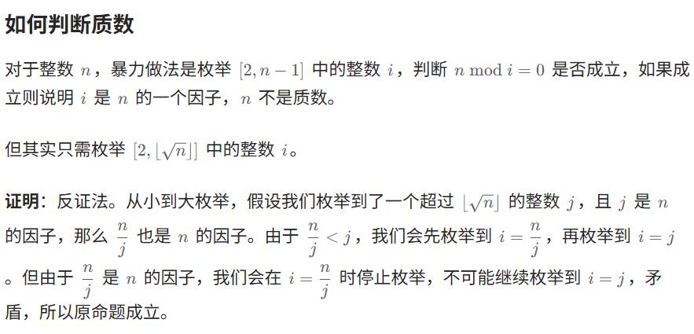
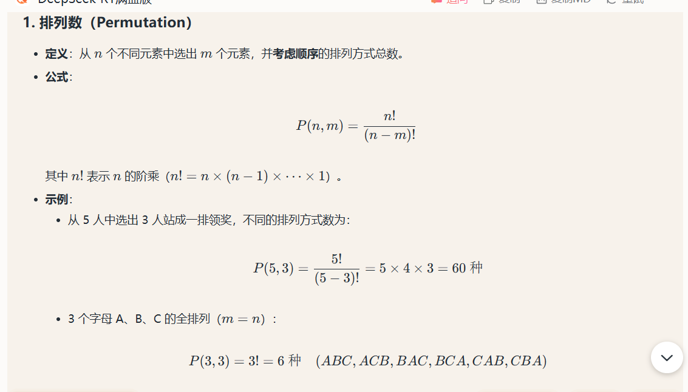
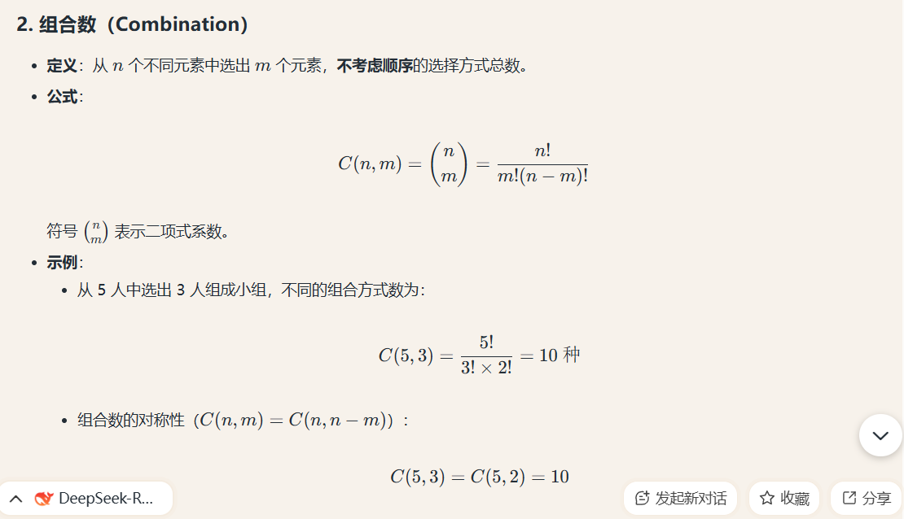

# Leetcode——数学篇集合

# 一、取模运算基础

首先，先看一下这篇：[分享丨模运算的世界：当加减乘除遇上取模（模运算恒等式/费马小定理/组合数） - 力扣（LeetCode）](https://leetcode.cn/circle/discuss/mDfnkW/)

这里列举一下学习这篇文章的时候刷的题目和关键的知识点。


## 1.基本取余运算

如果数非常大的时候，往往要对结果取余，对于加法和乘法，有如下规律：
$$
(a+b)\,\mathrm{mod}\, m=((a\,\mathrm{mod}\,m)+(b\,\mathrm{mod}\,m))\mathrm{mod}\,m \\(a\cdot b)\,\mathrm{mod}\,m=((a\,\mathrm{mod}\,m)\cdot(b\,\mathrm{mod}\,m))\mathrm{mod}\,m
$$


注意，如果涉及到幂运算，指数是不能随意取模的。如果指数在 64 位整数的范围内，可以用**快速幂**计算。如果指数超出 64 位整数的范围，可以使用**欧拉降幂公式**。以下进行总结。

> 同余定理：[同余 - 维基百科，自由的百科全书](https://zh.wikipedia.org/wiki/同餘)


### （1）快速幂计算

经典题目：[50. Pow(x, n) - 力扣（LeetCode）](https://leetcode.cn/problems/powx-n/)

> 下面题解中的Power函数即为快速幂的板子，需要记下来。

```c++
class Solution {
public:
    double Power(double x, long long n)
    {
        //快速幂
        double res = 1.0;
        while(n)
        {
            if(n&1)
            {
                res*=x;
            }
            x*=x;
            n>>=1;
        }
        return res;
    }
    double myPow(double x, int n) {
        if(x<=1e-6 && x>=-1e-6) return 0; //此时认为x=0
        long long p = n;
        if(p==0) return 1;
        if(p<0)
        {
            p = -p;
            x = 1.0 / x;
        }
        return Power(x, p);
    }
};
```


### （2）==欧拉降幂公式（未看完）==

首先我们先利用快速幂的思想+代码再做一下这道题目：[372. 超级次方 - 力扣（LeetCode）](https://leetcode.cn/problems/super-pow/description/)，以下给出快速幂的做法代码：
```c++
class Solution {
public:
    const int MOD = 1337;
    int Pow(int x, int n)
    {
        //在快速幂的时候求MOD
        long long res = 1.0;
        while(n)
        {
            if(n&1) res = (res%MOD) * (x%MOD)%MOD ;
            x = (x%MOD) * (x%MOD) %MOD;
            n>>=1;
        }
        return res;
    }
    int superPow(int a, vector<int>& b) {
        long long res = 1;
        for(int i = b.size()-1;i>=0;i--)
        {
            res = (res %MOD * Pow(a, b[i])%MOD)%MOD;
            a = Pow(a, 10);
        }
        return res;
    }
};
```

**接下来我们来介绍欧拉降幂公式。**==这个有空再看吧，估计记不住==，给一个参考链接：

> [【力扣·每日一题】372. 超级次方(欧拉降幂 快速幂)_mb62cff40cc1a13的技术博客_51CTO博客](https://blog.51cto.com/u_15718710/5473326)


## 2.取余运算进阶

### （1）负数情况的处理

如果计算过程中有减法，可能会产生负数，取余运算时处理不当也会导致 WA。如何正确处理这种情况呢？

如果发现**加法取余的过程中可能会出现负数（$x\,mod\,m<0$），可以用下面的式子：**
$$
(x\,mod\,m + m)\,mod\,m
$$
这样无论$x$是否为负数，运算结果都会落在区间 `[0,m−1] `中。


### （2）除法的处理

看这篇：[分享丨模运算的世界：当加减乘除遇上取模（模运算恒等式/费马小定理/组合数） - 力扣（LeetCode）](https://leetcode.cn/circle/discuss/mDfnkW/)中的除法取模部分，写的很好。

注意：(a%m - b%m != (a-b)%m) ! 反例：` m=3 a=6 b=2`

> 只有在a%m - b%m == (a-b)%m == 0的时候才是成立的，即为同余定理。

## 3.总结

```c++
MOD = 1_000_000_007

// 加
(a + b) % MOD

// 减
((a - b)%MOD + MOD) % MOD  //这个应该会比较稳妥一些

// 把任意整数 a 取模到 [0,MOD-1] 中，无论 a 是正是负
(a % MOD + MOD) % MOD

// 乘（注意使用 64 位整数）long long
a * b % MOD

// 多个数相乘，要步步取模，防止溢出
a * b % MOD * c % MOD

// 除（MOD 是质数且 b 不是 MOD 的倍数）
a * qpow(b, MOD - 2, MOD) % MOD
```

其中qpow 为**快速幂**算法。


## 补充：组合数板子


看一下这道题目：[62. 不同路径 - 力扣（LeetCode）](https://leetcode.cn/problems/unique-paths/description/)。

一种做法是使用dp，但这里我们关注组合数的方法。板子如下：

```c++
const int MOD = 1'000'000'007;
const int MX = 100'001; // 根据题目数据范围修改

long long F[MX]; // F[i] = i!
long long INV_F[MX]; // INV_F[i] = i!^-1

long long pow(long long x, int n) {
    long long res = 1;
    for (; n; n /= 2) {
        if (n % 2) {
            res = res * x % MOD;
        }
        x = x * x % MOD;
    }
    return res;
}

auto init = [] {
    F[0] = 1;
    for (int i = 1; i < MX; i++) {
        F[i] = F[i - 1] * i % MOD;
    }

    INV_F[MX - 1] = pow(F[MX - 1], MOD - 2);
    for (int i = MX - 1; i; i--) {
        INV_F[i - 1] = INV_F[i] * i % MOD;
    }
    return 0;
}();

// 从 n 个数中选 m 个数的方案数
long long comb(int n, int m) {
    return m < 0 || m > n ? 0 : F[n] * INV_F[m] % MOD * INV_F[n - m] % MOD;
}

class Solution {
public:
    int solve(vector<int>& nums) {
        // 预处理的逻辑写在 class 外面，这样只会初始化一次
    }
};
```

放到这道题里，我们不需要那么大的数值范围，可以简化为[C++组合数的计算(3种方法实现)_c++求组合数-CSDN博客](https://blog.csdn.net/m0_37149062/article/details/122522676)这个链接里面的做法（边乘边除，推导略）。此时这道题就可以秒杀了（感觉记一下这种求组合数的方法平时可能够用了）：

```c++
class Solution {
public:
    typedef long long ll;
    ll C(int n,int m)
    {
      ll res=1;
      for(int i=1;i<=m;i++)
      {
        res = res * (n-m+i)/i;
      }  
      return res;
    }
    int uniquePaths(int m, int n) {
        //C(m+n-2, m-1);
        return C(m+n-2, m-1);
    }
};
```


## 补充题目

【1】[3379. 转换数组](https://leetcode.cn/problems/transformed-array/)：

【2】[2961. 双模幂运算](https://leetcode.cn/problems/double-modular-exponentiation/)

【3】[2550. 猴子碰撞的方法数](https://leetcode.cn/problems/count-collisions-of-monkeys-on-a-polygon/)

- 这题有个坑人情况，需要注意（注意可能会出现负数的情况）


# 二、数论

## 1.判断质数

### （1）板子相关

先来写一个基础的判断质数的函数：

```c++
bool isPrime(int n)
{
    for(int i=2;i<=sqrt(n);i++) //或者写i*i<=n也可以
    {
        if(n%i==0) return false;
    }
    return n>=2;
}
```



接下来，使用素数筛来改善一下，以下是本题的核心代码：


```c++
vector<int> primes;
void init()
{
    isPrime.resize(MAX+1,1);
    isPrime[0]=0;
    isPrime[1]=0;
    for(int i=2;i<=MAX;i++)
    {
        if(isPrime[i])
        {
            primes.push_back(i); //同时，这个逻辑还可以判断质数
            for(int j=i;j<=MAX/i;j++)  //这样做是为了防止溢出
                isPrime[i*j]=0; //相当于这些都不是质数
        }  
    }
}
```


### （2）[3115. 质数的最大距离 - 力扣（LeetCode）](https://leetcode.cn/problems/maximum-prime-difference/description/)

> 给你一个整数数组 `nums`。
>
> 返回两个（不一定不同的）质数在 `nums` 中 **下标** 的 **最大距离**。

本题使用质数筛会比较容易一些。

```c++
//预计算所有的质数
int MAXN = 105;
vector<int> isPrime(MAXN+1, 1);
//[] { ... }();  // 定义并立即执行
auto init = []  
{
    isPrime[0] = 0;
    isPrime[1] = 0;
    for(int i=2;i<=MAXN;i++) //使用素数筛
    {
        if(isPrime[i])
        {
            for(int j=i;j<=MAXN/i;j++) //防止溢出,本来j从i^2开始遍历,现在同时除以i
            {
                isPrime[i*j] = 0;
            }
        }
    }
    return 0;
}();
class Solution {
public:
    int maximumPrimeDifference(vector<int>& nums) {
        //从左到右找第一个质数,从右到左找第一个质数即可
        int n = nums.size();
        int left = 0, right = n - 1;
        while (!isPrime[nums[left]]) left++; //题目保证至少有一个质数
        while(!isPrime[nums[right]]) right--;
        return right - left;
    }
};
```


### （2）[2614. 对角线上的质数](https://leetcode.cn/problems/prime-in-diagonal/)

> 给你一个下标从 **0** 开始的二维整数数组 `nums` 。
>
> 返回位于 `nums` 至少一条 **对角线** 上的最大 **质数** 。如果任一对角线上均不存在质数，返回 *0 。*
>
> 注意：
>
> - 如果某个整数大于 `1` ，且不存在除 `1` 和自身之外的正整数因子，则认为该整数是一个质数。
> - 如果存在整数 `i` ，使得 `nums[i][i] = val` 或者 `nums[i][nums.length - i - 1]= val` ，则认为整数 `val` 位于 `nums` 的一条对角线上。

```c++
class Solution {
public:
    bool isPrime(int n)
    {
        for(int i=2;i*i<=n;i++)
        {
            if(n%i==0) return false;
        }
        return n>=2;
    }
    int diagonalPrime(vector<vector<int>>& nums) {
        //4*10^6,数据范围不小,不适合打表,直接硬算就行,最多600个数
        int maxPrime = -1;
        int n = nums.size();
        for(int i=0;i<n;i++)
        {
            int x = nums[i][i];
            if(x < maxPrime) continue;
            if(isPrime(x)) maxPrime = max(maxPrime, x);
        }
        for(int i=0;i<n;i++)
        {
            int x = nums[i][n-i-1];
            if(x < maxPrime) continue;
            if(isPrime(x)) maxPrime = max(maxPrime, x);
        }
        if(maxPrime==-1) return 0;
        return maxPrime;
    }
};
```


### （3）[762. 二进制表示中质数个计算置位](https://leetcode.cn/problems/prime-number-of-set-bits-in-binary-representation/)

> 给你两个整数 `left` 和 `right` ，在闭区间 `[left, right]` 范围内，统计并返回 **计算置位位数为质数** 的整数个数。
>
> **计算置位位数** 就是二进制表示中 `1` 的个数。
>
> - 例如， `21` 的二进制表示 `10101` 有 `3` 个计算置位。

小的范围的质数可以直接打表了：

```c++
class Solution {
public:
    unordered_set<int> isprime{2,3,5,7,11,13,17,19,23,29,31,37};
    int countPrimeSetBits(int left, int right) {
        //10^6 打表质数
        int ans = 0;
        for(int index=left;index<=right;index++)
        {
            int cnt = __builtin_popcount(index);
            if(isprime.contains(cnt))
            {
                ans++;
            }
        }
        return ans;
    }
};
```


### （4）[3044. 出现频率最高的质数](https://leetcode.cn/problems/most-frequent-prime/)

> 给你一个大小为 `m x n` 、下标从 **0** 开始的二维矩阵 `mat` 。在每个单元格，你可以按以下方式生成数字：
>
> - 最多有 `8` 条路径可以选择：东，东南，南，西南，西，西北，北，东北。
> - 选择其中一条路径，沿着这个方向移动，并且将路径上的数字添加到正在形成的数字后面。
> - 注意，每一步都会生成数字，例如，如果路径上的数字是 `1, 9, 1`，那么在这个方向上会生成三个数字：`1, 19, 191` 。
>
> 返回在遍历矩阵所创建的所有数字中，出现频率最高的、**大于** `10`的质数；如果不存在这样的质数，则返回 `-1` 。如果存在多个出现频率最高的质数，那么返回其中最大的那个。
>
> **注意：**移动过程中不允许改变方向。

做法就是暴力一些来做，不需要打表（注释中有解释），现场计算即可。

```c++
//范围是1~999999,打表有可能比较亏,因为六位数最多是28个(6行+6列+两条对角线的正序和逆序),所以整体范围都不大,而且大部分数都不是质数,可以提前退出
//实际考试做题的时候,是否预处理都可以试一下
class Solution {
public:
    bool isPrime(int n)
    {
        for(int i=2;i*i<=n;i++)
        {
            if(n%i==0) return false;
        }
        return n>=2;
    }
    int mostFrequentPrime(vector<vector<int>>& mat) {
        //m和n的范围<=6,因此纯暴力做应该是可以过的
        int m = mat.size();
        int n = mat[0].size();
        int dirs[8][2] = {1,0,-1,0,0,1,0,-1,1,1,-1,1,1,-1,-1,-1};
        unordered_map<int, int> umap; //存放每个质数及其个数
        //每个值往8个方向扩散求解
        for(int i=0;i<m;i++)
        {
            for(int j=0;j<n;j++)
            {
                for(int d=0;d<8;d++) //尝试往八个方向走,起点那个值其实是不用加的,因为只包含自己一定<=10,不可能放入哈希表中
                {
                    int x = mat[i][j]; //8个方向计算都要先重置x
                    int nxtX = i + dirs[d][0];
                    int nxtY = j + dirs[d][1];
                    while(nxtX>=0 && nxtX<m && nxtY>=0 && nxtY<n)
                    {
                        x = x * 10 + mat[nxtX][nxtY]; //加一位
                        if(umap.contains(x) || isPrime(x))
                        {
                            umap[x]++;
                        }
                        nxtX += dirs[d][0];
                        nxtY += dirs[d][1];
                    }
                }
            }
        }
        //开始看umap中哪个数最大
        int maxFreq = 0;
        int maxValue = -1;
        for(auto& [k, v]: umap)
        {
            if(k<=10) continue; //质数需要>10
            if(v>maxFreq) //明显频率更大了
            {
                maxFreq = v;
                maxValue = k;
            }
            else if(v==maxFreq && k>maxValue) maxValue = k; //频率与最大的频率相等,看看值有没有更大
        }

        return maxValue;
    }
};
```


### （5）[866. 回文质数](https://leetcode.cn/problems/prime-palindrome/)(缺题解)

> 给你一个整数 `n` ，返回大于或等于 `n` 的最小 **回文质数**。
>
> 一个整数如果恰好有两个除数：`1` 和它本身，那么它是 **质数** 。注意，`1` 不是质数。
>
> - 例如，`2`、`3`、`5`、`7`、`11` 和 `13` 都是质数。
>
> 一个整数如果从左向右读和从右向左读是相同的，那么它是 **回文数** 。
>
> - 例如，`101` 和 `12321` 都是回文数。
>
> 测试用例保证答案总是存在，并且在 `[2, 2 * 108]` 范围内。

这道题的题解质量不是特别高，可以预先打表来做，并可以注意几个优化项：

- （1）结尾是0，2，4，6，8的一定不是质数，同时也就意味着第一位是2，4，6，8的也一定不是要求的数；
- （2）**长度为偶数的回文素数只有11，比如四位数是不存在回文素数的。**

> ### 简要证明：大于两位数的偶数位数的回文数一定是11的倍数，因此不存在这样的回文素数。
>
> #### **核心证明思路**  
> 利用**回文数的对称性**和**11的整除规则**：  
>
> **11的整除规则**：一个数能被11整除，当且仅当它的（奇数位数字之和）减去（偶数位数字之和）的差是11的倍数（包括0）

挺埋汰的，不知道有没有更干净的写法。

```c++
class Solution {
public:
    long long reverse_num(long long n)
    {
        long long ans = 0;
        while(n)
        {
            int x = n%10;
            ans = ans * 10 + x;
            n /= 10;
        }
        return ans;
    }
    bool isPrime(long long n)
    {
        for(long long i=2;i*i<=n;i++)
        {
            if(n%i==0) return false;
        }
        return n>=2;
    }
    bool isValid(long long n)
    {
        //判断是否为回文质数
        if(n==11) return true;
        if(n==2) return true;
        //1.长度为偶数的回文数一定不是质数
        if(n>=1000 && n<=9999) return false;
        if(n>=100000 && n<=999999) return false;
        if(n>=10000000 && n<=99999999) return false; //注:这个放在前面会快不少,不然放后面有可能会超时
        //2.尾数为偶数的一定不是
        if((n%10)%2==0) return false;
        //同理,第一为为偶数的也一定不是
        int m = reverse_num(n);
        if((m%10)%2==0) return false;
        //3.判断是否为回文串
        if(m!=n) return false;
        return isPrime(n);
    }
    int primePalindrome(int n) {
        long long mx = 2e10+8;
        for(long long index = n;index<=mx;index++)
        {
            if(isValid(index))
            {
                return index;
            }
        }
        return -1;
    }
};
```


## 2.预处理质数（筛质数）

[模板（埃氏筛和欧拉筛）](https://leetcode.cn/problems/closest-prime-numbers-in-range/solutions/2040087/yu-chu-li-zhi-shu-mei-ju-by-endlesscheng-uw2b/)


## §1.5 因子

### （1）板子题——[2427. 公因子的数目](https://leetcode.cn/problems/number-of-common-factors/)

> 给你两个正整数 `a` 和 `b` ，返回 `a` 和 `b` 的 **公** 因子的数目。
>
> 如果 `x` 可以同时整除 `a` 和 `b` ，则认为 `x` 是 `a` 和 `b` 的一个 **公因子** 。

思路：枚举因子，挨个判断能否整除a和b。

- 优化思路在于：只需要枚举a和b的最大公因数的因子即可。

```c++
class Solution {
public:
    int commonFactors(int a, int b) {
        int g = gcd(a, b); //求a和b的最大公因数,其因子数即为所求
        int ans = 0;
        for(int i=1;i*i<=g;i++)
        {
            if(g % i == 0) 
            {
                ans++; 
                if(i * i < g) ans++; //说明g/i也是一个公因子,如果i*i==g,需要避免重复计算一遍
            }
        }
        return ans;
    }
};
```

> 需要记住上面这个求解因子数目的板子题。


### （2）[1952. 三除数](https://leetcode.cn/problems/three-divisors/)

> 给你一个整数 `n` 。如果 `n` **恰好有三个正除数** ，返回 `true` ；否则，返回 `false` 。
>
> 如果存在整数 `k` ，满足 `n = k * m` ，那么整数 `m` 就是 `n` 的一个 **除数** 。

```c++
class Solution {
public:
    bool isThree(int n) {
        //求解因子的数目
        int cnt = 0;
        for(int i=1;i*i<=n;i++)
        {
            if(n % i == 0) 
            {
                cnt++;
                if(i * i < n)
                {
                    cnt++;
                }
            }
        }
        return cnt==3;
    }
};
```


### （3）[1492. n 的第 k 个因子](https://leetcode.cn/problems/the-kth-factor-of-n/)

> 给你两个正整数 `n` 和 `k` 。
>
> 如果正整数 `i` 满足 `n % i == 0` ，那么我们就说正整数 `i` 是整数 `n` 的因子。
>
> 考虑整数 `n` 的所有因子，将它们 **升序排列** 。请你返回第 `k` 个因子。如果 `n` 的因子数少于 `k` ，请你返回 `-1` 。

```c++
class Solution {
public:
    int kthFactor(int n, int k) {
        //把所有因子放到一个vector里面,然后取top k
        vector<int> factors;
        for(int i=1;i*i<=n;i++)
        {
            if(n%i==0)
            {
                factors.emplace_back(i);
                if(i*i<n)
                {
                    factors.emplace_back(n / i);
                }
            }
        }
        if((int)factors.size()<k) return -1;
        nth_element(factors.begin(), factors.begin()+k-1, factors.end());
        return factors[k-1];
    }
};
```


### （4）[829. 连续整数求和](https://leetcode.cn/problems/consecutive-numbers-sum/)

> 给定一个正整数 `n`，返回 *连续正整数满足所有数字之和为 `n` 的组数* 。 
>
>  
>
> **示例 1:**
>
> ```
> 输入: n = 5
> 输出: 2
> 解释: 5 = 2 + 3，共有两组连续整数([5],[2,3])求和后为 5。
> ```
>
> **示例 2:**
>
> ```
> 输入: n = 9
> 输出: 3
> 解释: 9 = 4 + 5 = 2 + 3 + 4
> ```
>
> **示例 3:**
>
> ```
> 输入: n = 15
> 输出: 4
> 解释: 15 = 8 + 7 = 4 + 5 + 6 = 1 + 2 + 3 + 4 + 5
> ```
>
>  
>
> **提示:**
>
> - `1 <= n <= 109`


## §1.6 最大公约数（GCD）

### [365. 水壶问题](https://leetcode.cn/problems/water-and-jug-problem/)

https://leetcode.cn/problems/water-and-jug-problem/description/

有两个水壶，容量分别为 `x` 和 `y` 升。水的供应是无限的。确定是否有可能使用这两个壶准确得到 `target` 升。

你可以：

- 装满任意一个水壶
- 清空任意一个水壶
- 将水从一个水壶倒入另一个水壶，直到接水壶已满，或倒水壶已空。

 

**示例 1:** 

```
输入: x = 3,y = 5,target = 4
输出: true
解释：
按照以下步骤操作，以达到总共 4 升水：
1. 装满 5 升的水壶(0, 5)。
2. 把 5 升的水壶倒进 3 升的水壶，留下 2 升(3, 2)。
3. 倒空 3 升的水壶(0, 2)。
4. 把 2 升水从 5 升的水壶转移到 3 升的水壶(2, 0)。
5. 再次加满 5 升的水壶(2, 5)。
6. 从 5 升的水壶向 3 升的水壶倒水直到 3 升的水壶倒满。5 升的水壶里留下了 4 升水(3, 4)。
7. 倒空 3 升的水壶。现在，5 升的水壶里正好有 4 升水(0, 4)。
参考：来自著名的 "Die Hard"
```


#### 方法1：DFS

```C++
using PII = pair<int,int>;
class Solution {
public:
    bool canMeasureWater(int x, int y, int target) {
        stack<PII> stk;
        stk.emplace(0,0);
        auto hashFunc = [](const PII& a)
        {
            return hash<int>()(a.first)^hash<int>()(a.second);
        };
        unordered_set<PII,decltype(hashFunc)> seen(0,hashFunc);
        while(!stk.empty())
        {
            if(seen.count(stk.top()))//如果已经重复回来了。
            {
                stk.pop();
                continue;
            }
            seen.emplace(stk.top());
            auto [remain_x,remain_y] = stk.top();
            stk.pop();
            if(remain_x==target||remain_y==target||remain_x+remain_y==target)return true;
            stk.emplace(x,remain_y); // 把 X 壶灌满。
            stk.emplace(remain_x,y); // 把 Y 壶灌满。
            stk.emplace(0,remain_y); // 把 X 壶倒空。
            stk.emplace(remain_x,0); // 把 Y 壶倒空。
            //x倒空：remain_x//y-remain_y 倒满y需要的  
            //  if remain_x小 x'=0 
            //  else          x' = remain_x - (y-remain_y); //y-remain_y y中还能放的水
            // 把 X 壶的水灌进 Y 壶，直至灌满或倒空。
            stk.emplace(remain_x-min(remain_x,y-remain_y),remain_y+min(remain_x,y-remain_y));
            // 把 Y 壶的水灌进 X 壶，直至灌满或倒空。
            stk.emplace(remain_x+min(remain_y,x-remain_x),remain_y-min(remain_y,x-remain_x));
        }
        return false;
    }
};
```


语法

>1. **Lambda 表达式定义哈希函数**：
>
>   ```cpp
>   auto hash_function = [](const PII& o) 
>   {
>       return hash<int>()(o.first) ^ hash<int>()(o.second);
>   };
>   ```
>
>   - `auto` 推导变量类型为 lambda 的闭包类型。
>   - Lambda 接受 `const PII&` 参数，计算其 `first` 和 `second` 的哈希值异或结果。
>   - `hash<int>()(o.first)` 调用标准库的 `hash<int>` 生成哈希值。
>
>2. **声明 `unordered_set` 并指定哈希类型**：
>
>   ```cpp
>   unordered_set<PII, decltype(hash_function)> seen(0, hash_function);
>   ```
>
>   - `decltype(hash_function)` 获取 lambda 的类型作为模板参数，确保 `unordered_set` 使用自定义哈希。
>     - **`decltype`的作用**：获取Lambda的类型，因为Lambda的类型是匿名且编译器生成的，无法直接写出
>   - 模板参数：`PII` 是元素类型，`decltype(hash_function)` 是哈希函数类型。
>
>3. **构造函数参数**：
>
>   - `0`：初始桶（bucket）数量。
>   - `hash_function`：传入自定义哈希函数对象。由于 lambda 闭包类型不可默认构造，必须显式传递实例。

解释

>### 1. **为什么需要自定义哈希函数？**
>
>- **标准库限制**：C++标准库未提供`std::pair<int, int>`的默认哈希函数，因此直接使用`unordered_set<PII>`会编译失败。
>- **手动提供哈希逻辑**：通过定义`hash_function`，明确告诉容器如何计算`PII`对象的哈希值，使其能正确存储和查找元素。
>
>### 2. **与C#的`Equals`和`GetHashCode`的关系**
>
>- 等价性：C++的unordered_set需要两个组件：哈希函数（类似GetHashCode）和相等比较（类似Equals）。
>  - **哈希函数**：必须显式提供（如代码中的`hash_function`）。
>  - **相等比较**：默认使用`operator==`，而`std::pair`已实现`==`，因此无需额外编写。
>- **C#对比**：在C#中，若将对象用作字典键，必须同时重写`Equals`和`GetHashCode`，确保逻辑一致。C++的机制类似，但语法和实现方式不同。


#### 方法二：数学

https://leetcode.cn/problems/water-and-jug-problem/solutions/161010/shui-hu-wen-ti-by-leetcode-solution/

1. **操作分析**：每次操作（装满或倒空）会导致总水量变化为 \(x\) 或 \(y\) 的整数倍。倒水操作不影响总水量，仅改变水的分布。
2. **贝祖（裴蜀）定理**：方程 \(ax + by = z\) 有解当且仅当 \(z\) 是 \(x\) 和 \(y\) 的最大公约数（gcd）的倍数。
3. **实际约束**：总水量 \(z\) 必须满足$ 0 \leq z \leq x + y$，因为无法获得超过两壶总容量的水或负水量。

解题步骤

1. **特殊情况处理**：
   - 若 \(z = 0\)，直接返回 `True`（无需操作）。
   - 若 \(x + y < z\)，返回 `False`（超出容量总和）。
   - 若 \(x\) 或 \(y\) 为0，则只有当 \(z\) 等于另一容器的容量或0时才可能。
2. **计算最大公约数**：使用欧几里得算法计算 \(x\) 和 \(y\) 的 gcd。
3. **判断条件**：检查 \(z\) 是否是 gcd 的倍数且满足容量约束。

```C++
class Solution {
public:
    bool canMeasureWater(int x, int y, int target) {
        if(target==0)return true;
        if(target>x+y)return false;
        if(x==0||y==0)return target==0||x+y==target;
        return target % gcd(x,y) ==0;
    }
};
```


如果想自己写gcd：

答: 是辗转相除法 用于求**最大公约数**

递归写法

```C++
int gcd(int a, int b){
    if (a%b == 0) {
        return b;
    }
    return gcd(b, a%b);
}
```

非递归写法：

```C++
int gcd(int a, int b){
    int temp = a;
    while(a%b != 0){
        a = b;
        b = temp%b;
        temp = a;
    }
    return b;
}
```

简单写法：

```C++
int gcd(int a, int b)
{
    return b == 0 ? a : gcd(b, a % b);
}
```


# 组合数学专题

可以参考这个视频系列来学习：[NOIP初赛讲解——组合数学_哔哩哔哩_bilibili](https://www.bilibili.com/video/BV1PE411y76n/?spm_id_from=333.337.search-card.all.click&vd_source=f0e5ebbc6d14fe7f10f6a52debc41c99)

## 1.基础知识

### (1)加法原理与乘法原理

> 在组合数学中，**加法原理**和**乘法原理**是计算事件可能性的基础规则，具体解释如下：
>
> ---
>
> ### **1. 加法原理（互斥事件的“或”关系）**
> - **定义**：若完成某任务有若干**互斥**的方式（任选一种即可），则总方法数为各方式方法数之和。
> - **公式**：总方法数 = $A + B + C + \dots$
> - **例子**：  
>   - 从北京到上海，可以坐飞机（5个航班）或高铁（3个车次）。总共有 \(5 + 3 = 8\) 种选择。
>   - 书架上有4本数学书和6本小说，选一本书阅读的方法数是 \(4 + 6 = 10\) 种。
>
> ---
>
> ### **2. 乘法原理（独立步骤的“且”关系）**
> - **定义**：若完成某任务需要**多个独立步骤**（所有步骤依次完成），则总方法数为各步骤方法数的乘积。
> - **公式**：总方法数 = $A \times B \times C \times \dots$
> - **例子**：  
>   - 穿衣服时，有3件上衣和4条裤子，总搭配方式为 $3 \times 4 = 12$种。
>   - 从A城到B城有2条路，B城到C城有3条路，从A到C的路径数为$2 \times 3 = 6$ 种。
>
> ---
>
> ### **关键区别**
> - **加法原理**：事件之间**互斥**（只能选一种）。
> - **乘法原理**：步骤之间**独立**（需依次完成所有步骤）。
>
> ---
>
> ### **算法竞赛中的典型应用**
> - **加法原理**：分类讨论不同情况（如动态规划中的状态转移）。
> - **乘法原理**：排列组合问题（如路径计数、排列数计算）。
>
> **示例题**：  
> 从1~100中选一个数，要求是3的倍数 **或** 5的倍数，共有多少种选择？  
> - **加法原理**：3的倍数有33个，5的倍数有20个，但需扣除重复（15的倍数，共6个）。  
>   总数为 \(33 + 20 - 6 = 47\) 种（结合容斥原理）。
>
> ---
>
> 掌握这两个原理，能高效解决大部分组合计数问题！


### (2)排列数与组合数





> 其中组合数的公式其实是可以从排列数当中推导而来，只不过在其基础上再除了一个m!.


### (3)常用的恒等式

#### （a）恒等式1

组合数有一个基本的递推式(**很重要，算是杨辉三角的基础。**)：
$$
C(n, m) = C(n-1,m) + C(n-1,m-1)
$$

> 组合数学中，组合数 $C(n, m) = C(n-1, m) + C(n-1, m-1)$ 的证明及与杨辉三角的关系可形象解释如下：
>
> ------
>
> ### **1. 形象证明：是否包含某个特定元素**
>
> 假设从 $n$ 个元素中选 $m$ 个，我们可以固定其中一个元素（例如第一个元素），将所有情况分为两类：
>
> - **包含该元素**：需从剩下的 $n-1$ 个元素中再选 $m-1$ 个，对应 $C(n-1, m-1)$。
> - **不包含该元素**：需从剩下的 $n-1$ 个元素中选全部 $m$ 个，对应 $C(n-1, m)$。
>
> **总方法数** = 包含该元素的方法数 + 不包含该元素的方法数，即：
>
> $C(n, m) = C(n-1, m) + C(n-1, m-1) $
>
> #### **示例验证**
>
> 当 $n=5, m=3$ 时：
>
> $C(5,3) = C(4,3) + C(4,2) = 4 + 6 = 10 $
>
> 直接计算 $C(5,3) = \frac{5!}{3!2!} = 10$，结果一致。
>
> ------
>
> ### **2. 与杨辉三角的关系**
>
> 杨辉三角的构造规则是：**每个数等于它上方左右两数之和**。
>
> - 第 $n$ 行第 $m$ 列的数值对应组合数 $C(n, m)$。
> - 递推公式 $C(n, m) = C(n-1, m) + C(n-1, m-1)$ 正是杨辉三角的生成规则。
>
> #### **示例：杨辉三角前5行**
>
> ```
> 1         (n=0)
> 1 1       (n=1)
> 1 2 1     (n=2)
> 1 3 3 1   (n=3)
> 1 4 6 4 1 (n=4)
> ```
>
> - 例如，第4行（$n=4$）的数值对应：
>   $C(4,0)=1, \, C(4,1)=4, \, C(4,2)=6, \, C(4,3)=4, \, C(4,4)=1$。
>
> ------
>
> ### **3. 数学归纳法补充证明**
>
> - **基础情况**：当 $n=1$，$C(1,0)=1$，$C(1,1)=1$，满足递推关系。
>
> - **归纳假设**：假设对 $n=k$ 成立，即 $C(k, m) = C(k-1, m) + C(k-1, m-1)$。
>
> - 归纳步骤：对 n=k+1n=k+1n=k+1，根据定义：
>
>   $C(k+1, m) = \frac{(k+1)!}{m!(k+1-m)!} = \frac{k!}{m!(k-m)!} \cdot \frac{k+1}{k+1-m} + \frac{k!}{(m-1)!(k+1-m)!} $
>
>   化简后仍满足递推关系。
>
> ------
>
> ### **总结**
>
> - **核心思想**：分类讨论是否包含特定元素，穷尽所有可能性。
>- **杨辉三角**：组合数的递推关系直接对应其生成规则，两者本质一致。
> 
>该原理是动态规划、二项式定理等算法的理论基础，也是组合数学的核心公式之一。


#### （b）恒等式2

$$
C(n,0)+C(n,1)+C(n,2)+...+C(n,n) = 2^n
$$

证明思路比较重要：“两边算”。左右两边都可以看作是从n个数里面做任意多的选择：

- 左侧：选0个数，选1个数，选2个数。。。。选n个数的总的方案数
- 右侧：每个数都可以选，或者不选，总的方案数

这样的话，等号成立就很好理解了。


### 例题

- 6人站成一排，求：

  - 1. 甲不在排头，乙不在排尾的排列数；

    > 优先考虑特殊位置。比较好的做法是画方块法。分为乙在排头和乙不在排头两种情况：
    >
    > - 乙在排头：5!
    > - 乙不在排头：`4（乙的位置）X 4(甲的位置) X 4！（剩下的人）`
    >
    > 加一起即可。也可以用容斥原理来做：6！-5！-5！+4！（总的方案数-甲在排头-乙在排尾+甲在排头且乙在排尾）

  - 2. 甲不在排头，乙不在排尾，并且甲乙不相邻的排列数；

    > 分类讨论：
    >
    > - 甲在排尾，乙在排头：4！
    > - 甲在排尾，乙不在排头：3X4！
    > - 甲不在排尾，乙在排头：3X4!（对称的）
    > - 甲不在排尾，乙不在排头：4（甲的选择）X 乙的选择——（甲在2：2X4！ + 甲在3：4! +甲在4：4！+甲在5：2X4！）

也就是说，分情况讨论的情况使用加法原理。


## 2.捆绑与插空法

