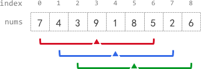

# Leetcode——滑动窗口与双指针专题

> 秋招一轮刷题：暂定阈值为1700，难度在1700以上的先放一放，抓紧把1700以下的专题刷完。

可以参考：[分享丨【题单】滑动窗口与双指针（定长/不定长/单序列/双序列/三指针/分组循环） - 力扣（LeetCode）](https://leetcode.cn/circle/discuss/0viNMK/)

**定长滑动窗口**

- [x] 定长子串中元音的最大数目 1263 
- [x] 子数组最大平均数 I
- [x] 大小为 K 且平均值大于等于阈值的子数组数目 1317
- [x] 半径为 k 的子数组平均值 1358
- [x] 得到 K 个黑块的最少涂色次数 1360
- [x] 爱生气的书店老板 1418
- [x] 几乎唯一子数组的最大和 1546
- [x] 长度为 K 子数组中的最大和 1553
- [x] 可获得的最大点数 1574
- [x] 拆炸弹 做到 O(n)
- [ ] 健身计划评估（会员题）
- [ ] 长度为 K 的无重复字符子串（会员题）
- [ ] 每个子数组的数字种类数（会员题）
- [ ] 最少交换次数来组合所有的 1（会员题）
- [ ] 分享 K 个糖果后独特口味的数量（会员题）
- [x] 检查一个字符串是否包含所有长度为 K 的二进制子串 1504
- [ ] 最少交换次数来组合所有的 1 II 1748
- [ ] 子串的最大出现次数 1748
- [ ] 滑动子数组的美丽值 1786
- [ ] 使二进制字符串字符交替的最少反转次数 2006
- [ ] 字符串的排列
- [ ] 找到字符串中所有字母异位词
- [ ] 串联所有单词的子串
- [ ] 查找给定哈希值的子串 2063
- [ ] 统计完全子字符串 2449
- [ ] 子串能表示从 1 到 N 数字的二进制串 做到 O(∣s∣)
- [ ] K 个关闭的灯泡（会员题）做到 O(n)
- [ ] 等计数子串的数量（会员题）
- [ ] 子数组的最大频率分数（会员题）
- [x] [2269. 找到一个数字的 K 美丽值](https://leetcode.cn/problems/find-the-k-beauty-of-a-number/) 1280
- [x] [1984. 学生分数的最小差值](https://leetcode.cn/problems/minimum-difference-between-highest-and-lowest-of-k-scores/) 1306
- [ ] [220. 存在重复元素 III](https://leetcode.cn/problems/contains-duplicate-iii/)


**不定长滑动窗口**

§2.1 求最长/最大

- [x] 无重复字符的最长子串
- [x] 每个字符最多出现两次的最长子字符串 1329
- [x] 删掉一个元素以后全为 1 的最长子数组 1423
- [x] 尽可能使字符串相等 1497
- [x] 找到最长的半重复子字符串 1502
- [x] 水果成篮 1516
- [x] 删除子数组的最大得分 1529
- [x] 最多 K 个重复元素的最长子数组 1535
- [x] 数组的最大美丽值 1638
- [x] 考试的最大困扰度 1643
- [x] 最大连续 1 的个数 III 1656
- [x] [1658. 将 x 减到 0 的最小操作数](https://leetcode.cn/problems/minimum-operations-to-reduce-x-to-zero/)
- [x] [1838. 最高频元素的频数](https://leetcode.cn/problems/frequency-of-the-most-frequent-element/)
- [ ] 每种字符至少取 K 个 1948

以下还都没做：

- 找出最长等值子数组 1976
- 毯子覆盖的最多白色砖块数 2022
- 摘水果 2062
- 两个线段获得的最多奖品 2081
- 使数组连续的最少操作数 2084
- 可见点的最大数目 2147
- 最长合法子字符串的长度 2204
- 最长乘积等价子数组 ~2300 非暴力做法
- 执行操作使频率分数最大 2444
- 移动石子直到连续 II 2456
- 收集连续 K 个袋子可以获得的最多硬币数量 ~2500
- 至少有 K 个重复字符的最长子串
- 最长的美好子字符串 非暴力做法
- 最大连续 1 的个数 II（会员题）
- 至多包含两个不同字符的最长子串（会员题）
- 至多包含 K 个不同字符的最长子串（会员题）


§2.2 求最短/最小
一般题目都有「至少」的要求。

- [x] 长度最小的子数组
- [x] 最短且字典序最小的美丽子字符串 做到$O(n^2)$
- [ ] 替换子串得到平衡字符串 1878
- [ ] 无限数组的最短子数组 1914
- [ ] 最小覆盖子串
- [ ] 最小区间 做法不止一种


# 一、定长滑动窗口

基础套路（[1343. 大小为 K 且平均值大于等于阈值的子数组数目 - 力扣（LeetCode）](https://leetcode.cn/problems/number-of-sub-arrays-of-size-k-and-average-greater-than-or-equal-to-threshold/description/)）：

```c++
class Solution {
public:
    int numOfSubarrays(vector<int>& arr, int k, int threshold) {
        int n=arr.size();
        int res=0;
        int sum=0;
        int thresholdSum = threshold*k;
        for(int i=0;i<n;i++)
        {
            //1、inset
            sum+=arr[i];//假设k是3个 inset步骤 从2加到3
            if(i<k-1)continue;//判断下标是否小于2(是否小于3个元素)
            //2、update
            if(sum>=thresholdSum)res+=1;//判断一下总的sum,因为现在是3个元素
            //3、delete
            sum-=arr[i-k+1];//扣掉一个元素 回到2个元素

        }
        return res;
    }
};
```


## 1.[大小为 K 且平均值大于等于阈值的子数组数目](https://leetcode.cn/problems/number-of-sub-arrays-of-size-k-and-average-greater-than-or-equal-to-threshold/)

经典套路题，直接给出代码：

```c++
class Solution {
public:
    int numOfSubarrays(vector<int>& arr, int k, int threshold) {
        int target = k * threshold;
        int sum = 0;
        int cnt = 0;
        for(int i=0;i<arr.size();i++){
            sum+=arr[i]; //1.inset
            if(i<k-1) continue; //!!!<
            //2.update
            if(sum>=target){
                cnt++;
            }
            //3.delete
            sum -= arr[i-k+1];
        }
        return cnt;
    }
};
```


## [2090. 半径为 k 的子数组平均值](https://leetcode.cn/problems/k-radius-subarray-averages/)



```C++
class Solution {
public:
    vector<int> getAverages(vector<int>& nums, int k)
    {
        int n=nums.size();
        vector<int> res(n,-1);
        if(n-2*k<0)return res;

        long long avgS=0;

        for(int r=0;r<n;r++)
        {
            avgS+=nums[r];
            if(r<2*k)continue;
            //update
            res[r-k]=avgS/(2*k+1);
            //out
            avgS-=nums[r-2*k];
        }
        return res;
       
    }
};
```


## 2.[1052. 爱生气的书店老板](https://leetcode.cn/problems/grumpy-bookstore-owner/)

一道定长滑动窗口的变形题，**定长滑动窗口题目，一定要想明白窗口里面要维护什么**。

```c++
class Solution {
public:
    int maxSatisfied(vector<int>& customers, vector<int>& grumpy, int minutes) {
        //1.计算完全不使用技巧,能让多少顾客满意 sum
        //2.维护使用技巧可以让区间内新增满意顾客的数量,即为滑动窗口维护的值
        int sum = 0;
        int newSatisfiedSum = 0;
        int maxSatisfied = 0;
        for(int i=0;i<customers.size();i++){
            //1.inset
            sum += customers[i] * (grumpy[i]==0);
            newSatisfiedSum += (grumpy[i]==1) * customers[i]; //这样,如果老板生气了,可以矫正回来,认为是新增满意顾客的数量
            if(i<minutes-1) continue;
            //2.update
            maxSatisfied = max(maxSatisfied, newSatisfiedSum);
            //3.delete
            newSatisfiedSum -= (grumpy[i-minutes+1]==1) * customers[i-minutes+1];
        }
        return maxSatisfied + sum;
    }
};
```

y

```C++
class Solution {
public:
    int maxSatisfied(vector<int>& customers, vector<int>& grumpy, int minutes) {
        //记录minutes分钟内不生气带来的增量收益
        int temp = 0;
        int resMax = 0;
        int normal=0;
        for(int r=0;r<customers.size();r++)
        {
            //计算正常收益
            if(grumpy[r]==0)
            normal +=  customers[r];
            else
            //in
            //if(grumpy[r]==1)
                temp+=customers[r];
            if(r<minutes-1)continue;
            //update
            resMax = max(resMax,temp);
            //out
            if(grumpy[r-minutes+1]==1)temp-=customers[r-minutes+1];
        }
        return normal+resMax;
    }
};
```

## [2841. 几乎唯一子数组的最大和](https://leetcode.cn/problems/maximum-sum-of-almost-unique-subarray/)

```C++
class Solution {
public:
    long long maxSum(vector<int>& nums, int m, int k) 
    {
        //unordered_map  存储每个元素个数
        //往右 map- 
        unordered_map<int,int> umap;
        long long tempSum=0;
        long long maxSum=0;
        for(int r=0;r<nums.size();r++)
        {
            //in
            umap[nums[r]]++;
            tempSum+=nums[r];
            if(r<k-1)continue;
            //update
            if(umap.size()>=m)
            {
                maxSum=max(maxSum,tempSum);
            }
            //out
            int out = nums[r-k+1];
            umap[out]--;
            if(umap[out]==0)umap.erase(out);//umap语法 umap.erase(key)

            tempSum -=out;
        }
        return maxSum;

    }
};
```


## 3.[2461. 长度为 K 子数组中的最大和](https://leetcode.cn/problems/maximum-sum-of-distinct-subarrays-with-length-k/)

主要是要思考“子数组中的所有元素 **各不相同**”要怎么用代码来表示。这道题的代码如下：

```c++
class Solution {
public:
    long long maximumSubarraySum(vector<int>& nums, int k) {
        long long sum = 0;
        unordered_map<int, int> umap; //key:数字, value:出现频率
        long long res = 0;
        for(int i=0;i<nums.size();i++){
            //1.inset
            sum += nums[i];
            umap[nums[i]]++;
            if(i<k-1) continue;
            //2.update
            if(umap.size()==k){
                res = max(res, sum);
            }
            //3.delete
            umap[nums[i-k+1]]--;
            sum-=nums[i-k+1];
            if(umap[nums[i-k+1]]==0) umap.erase(nums[i-k+1]);
        }
        return res;
    }
};
```


## 4.[1423. 可获得的最大点数](https://leetcode.cn/problems/maximum-points-you-can-obtain-from-cards/)

这道题目的启示是：如果转换解决问题的思路为改变窗口的大小，则需要注意**窗口大小为0的情况**。这种求和问题也可以直接用C++的`accumulate`函数加快写代码的效率，这里给出这种做法：

```c++
class Solution {
public:
    int maxScore(vector<int>& cardPoints, int k) {
        //用求和函数加快计算
        int n = cardPoints.size();
        int sum = accumulate(cardPoints.begin(), cardPoints.end(), 0); //别忘了最后一个参数
        if(n==k) return sum; //注意特殊情况判断
        int tmpSum = accumulate(cardPoints.begin(), cardPoints.begin()+n-k, 0); //前n-k个值之和
        int res = tmpSum;
        //求解窗口大小为n-k的最小点数
        for(int i=n-k;i<n;i++){
            tmpSum += (cardPoints[i] - cardPoints[i-(n-k)]); //一次更新两端
            res = min(res, tmpSum);
        }
        return sum - res;
    }
};
```


板子做法

```C++
class Solution {
public:
    int maxScore(vector<int>& cardPoints, int k) 
    {
        int n=cardPoints.size();
        int getCardNum = n-k;
        int tempSum=0;
        int minSum = INT_MAX;//!!

        int totalSum=0;
        for(int r=0;r<n;r++)
        {
            totalSum+=cardPoints[r];
            //in
            tempSum+=cardPoints[r];
            if(r<getCardNum-1)continue;
            //update
            minSum = min(minSum,tempSum);
            //out;
            tempSum-=cardPoints[r-getCardNum+1];
        }
        if(n==k)return totalSum;//
        return totalSum - minSum;
    }
};
```


## 5.（简单题）[1652. 拆炸弹](https://leetcode.cn/problems/defuse-the-bomb/)

利用定长滑动窗口的做法，考虑用$O(n)$的复杂度解决这道题目。这种算是模拟题，可以画一下图推导一下下标索引，**千万不要硬着头皮想。**本题的难点就在于索引值的判定，代码如下：

```c++
class Solution {
public:
    vector<int> decrypt(vector<int>& code, int k) {
        int sum = 0;
        int n = code.size();
        vector<int> res(n);
        //考虑时间复杂度为O(n)的做法
        if(k<0){
            k=-k;
            //先计算第一个数替换的值
            for(int i=n-1;i>n-k-1;i--){
                sum+=code[i];
            }
            res[0] = sum;
            //此时用前面k个数字之和替换
            for(int i=1;i<code.size();i++){
                sum += (code[i-1]-code[(i-k+n-1)%n]); //取余运算
                res[i] = sum;
            }
        } else if(k>0){
            //从后往前算
            for(int i=0;i<k;i++) sum+=code[i];
            res[n-1]=sum;
            for(int i=n-2;i>=0;i--){
                sum += (code[i+1]-code[(i+k+1)%n]);
                res[i] = sum;
            }
        }
        return res;
    }
};
```

y

```C++

class Solution {
public:
    vector<int> decrypt(vector<int>& code, int k) {
        int n = code.size();
        vector<int> res(n);
        if (k > 0) 
        {
            int tempsum = 0;
            for (int j = 0; j < k; j++) 
            {
                tempsum += code[j%n];
            }
            res[n - 1] = tempsum;
            for(int i=0;i<n-1;i++)
            {
                res[i]=tempsum+code[(i+k)%n]-code[i];
                tempsum = res[i];
            }
        }
        else if(k<0)
        {
            k=-k;
            int tempsum = 0;
            // n=3,j =n-1=2,j>=2-1-1=0 k=1 
            for (int j = n-1; j >= n-k; j--) 
            {
                tempsum += code[j%n];
            }
            res[0] = tempsum;
            for(int i=1;i<n;i++)
            {
                //错误地方：这一步如果code[(i-k-1)%n]负数取余是不对的 一定要记得+n
                res[i]=tempsum-code[(i-k-1+n)%n]+code[i-1];
                tempsum = res[i];
            }
        }
        return res;
    }
};
```


## 6.[1461. 检查一个字符串是否包含所有长度为 K 的二进制子串](https://leetcode.cn/problems/check-if-a-string-contains-all-binary-codes-of-size-k/)

通过这道题目，可以先来复习一下C++中`string`的`substr`函数用法。用这种方法来做可以秒掉这道题：

```c++
class Solution {
public:
    bool hasAllCodes(string s, int k) {
        int n = s.size();
        if((n-k+1)<(1<<k)) return false; //此时子串数量少于长度为k的二进制字符串数量
        unordered_set<string> us;
        for(int i=0;i<n-k+1;i++){
            string sub = s.substr(i, k);
            us.insert(std::move(sub));
        }
        return (us.size()==(1<<k));
    }
};
```

如果要用滑动窗口来做，可以考虑在窗口移动的时候，窗口内的值的变化情况。此时考察的就是一些位运算了，方法2的代码如下：

```c++
class Solution {
public:
    bool hasAllCodes(string s, int k) {
        int n = s.size();
        unordered_set<int> us;
        int sum = 0;
        for(int i=0;i<n;i++){
            //1.inset
            int in = s[i]-'0';
            sum = ((sum<<1) | in);
            if(i<k-1) continue;
            //2.update
            us.insert(sum);
            //3.delete
            int out = s[i-k+1]-'0';
            sum -= (out<<(k-1));
        }
        return (us.size()==(1<<k)); //1<<2=0b100 = 4 / 1<<3 =0b1000 = 8 /1<<K=2^K
    }
};
```


## 7.[2269. 找到一个数字的 K 美丽值 - 力扣（LeetCode）](https://leetcode.cn/problems/find-the-k-beauty-of-a-number/)

这道题目本身并不难，难点在于对C++字符串相关接口的熟练应用。一个是`tostring(num)`接口，一个是`stoi(s)`接口。虽然本题用滑动窗口法的话不一定能用上这俩接口，但还是要记住的。本题代码如下：

```c++
class Solution {
public:
    int divisorSubstrings(int num, int k) {
        int sum = 0; //维护窗口内的值
        string s = to_string(num);
        int cnt = 0;
        for(int i=0;i<s.size();i++){
            //1.inset
            int in = s[i]-'0';
            sum = sum * 10 + in;
            if(i<k-1) continue;
            //2.update
            if(sum!=0 && num%sum==0) cnt++; //注意题意:0不能整除任何值
            //3.delete
            int out = s[i-k+1]-'0';
            sum -= out * pow(10, k-1);
        }
        return cnt;
    }
};
```

枚举所有长度为`k`的子串，可以用以下`string`中的接口：

```c++
for (int i = 0; i <= n - k; ++i) {
    // 枚举所有长度为 k 的子串
    int tmp = stoi(s.substr(i, k));
    if (tmp && num % tmp == 0) {
        ++res;
    }
}
```


## 8.[1984. 学生分数的最小差值](https://leetcode.cn/problems/minimum-difference-between-highest-and-lowest-of-k-scores/)

可以简化运算，这里为了保持三部曲写的麻烦一点，但非常好理解：

```c++
class Solution {
public:
    int minimumDifference(vector<int>& nums, int k) {
        //思路很清晰,排序后定长滑动窗口
        sort(nums.begin(), nums.end());
        int res = INT_MAX;
        for(int i=0;i<nums.size();i++){
            //1.inset
            if(i<k-1) continue;
            //2.update
            res = min(res, nums[i]-nums[i-k+1]);
            //3.delete
        }
        return res;
    }
};
```


## ==9.[220. 存在重复元素 III](https://leetcode.cn/problems/contains-duplicate-iii/)（困难，还没做）==


# 二、不定长滑动窗口

个人理解，做题目的时候需要考虑好数组中数的范围，比如是否有负数，有0，这种情况下单纯的`while(sum>=target)`可能会失效，有时需要加上`while(sum>=target && l<=r)`做进一步判断。

## 1.求最长/最大

一般题目都有「至多」的要求。

- 与定长滑动窗口套路是类似的，在外层`for`循环中维护r指针，如果不满足要求则移动`l`指针直到满足要求为止。

### （1）[3. 无重复字符的最长子串](https://leetcode.cn/problems/longest-substring-without-repeating-characters/)

代码如下：

```c++
class Solution {
public:
    int lengthOfLongestSubstring(string s) {
        unordered_map<char, int> umap; //存储每个字符出现的次数
        int res = 0;
        int l=0;
        for(int r=0;r<s.size();r++){
            umap[s[r]]++;
            while(umap[s[r]]>1){
                umap[s[l]]--;
                l++;
            }
            if(l<=r) res = max(res, r-l+1);
        }
        return res;
    }
};
```

y：

```C++
class Solution {
public:
    int lengthOfLongestSubstring(string s) 
    {
        unordered_map<char,int> umap;
        int l=0;
        int maxLen=0;
        for(int r=0;r<s.size();r++)
        {
            //in
            umap[s[r]]++;
            //out
            while(umap[s[r]]>1)
            {
                umap[s[l]]--;
                l++;
            }
            //update
            maxLen = max(maxLen,r-l+1);
        }
        return maxLen;
    }
};
```


### （2）[3090. 每个字符最多出现两次的最长子字符串](https://leetcode.cn/problems/maximum-length-substring-with-two-occurrences/)

跟上一题比较类似，代码如下：

```c++
class Solution {
public:
    int maximumLengthSubstring(string s) {
       int l=0;
       int res = 0;
       unordered_map<char, int> umap; //key:字符 value:出现次数
       for(int r=0;r<s.size();r++){
            umap[s[r]]++;
            while(umap[s[r]]>2){
                umap[s[l]]--;
                l++;
            }
            if(l<=r) res = max(res, r-l+1);
       } 
        return res;
    }
};
```


### （3）[1493. 删掉一个元素以后全为 1 的最长子数组](https://leetcode.cn/problems/longest-subarray-of-1s-after-deleting-one-element/)

题解如下（也可以用动规做，但暂时还没看，这里只整理滑动窗口的解法：）

```c++
class Solution {
public:
    int longestSubarray(vector<int>& nums) {
        //一个0没事,一旦出现两个零就要缩到一个零,维护窗口内最多一个0时的最大值
        int zeroCnt = 0; //记录窗口内0的个数
        int res = 0;
        int j = 0;
        for(int i=0;i<nums.size();i++){
            if(nums[i]==0){
                if(zeroCnt<2) zeroCnt++;
                if(zeroCnt==2){
                    while(nums[j]!=0){ //让窗口内最多只能有一个0
                        j++;
                    }
                    j++; //++之后指到了不是0的位置
                    zeroCnt--;
                }
            }
            if(j<=i) res = max(res, i-j+1);
        }
        return res-1; //不得不删除一个元素,即使没有0
    }
};
```

y

```C++
class Solution {
public:
    int longestSubarray(vector<int>& nums) 
    {
        //寻找最多只有一个0的子数组
        //如果有0 长度-1 没有0  也是长度-1
        int zeroCnt=0;
        int l=0;
        int n=nums.size();
        int maxLen=0;
        for(int r=0;r<n;r++)
        {
            //in
            if(nums[r]==0)zeroCnt++;
            //out
            while(zeroCnt>1)
            {
                if(nums[l]==0)zeroCnt--;
                l++;
            }
            //update
            maxLen = max(maxLen,r-l+1);
        }
        return max(maxLen-1,0);
    }
};
```


------

### ==2025.2.20==

以下为2025.2.20晚

### （4）[1208. 尽可能使字符串相等](https://leetcode.cn/problems/get-equal-substrings-within-budget/)

```c++
class Solution {
public:
    int equalSubstring(string s, string t, int maxCost) {
        //思路:计算一下每个下标对应转换的差(数组),然后维护最长窗口长度
        int n = s.size();
        vector<int> vec(n);
        for(int i=0;i<n;i++){
            vec[i] = abs(t[i]-s[i]);
        }
        //维护窗口最大长度
        int res = 0;
        int cost = 0; //维护窗口内的cost
        int j=0;
        for(int i=0;i<n;i++){
            cost += vec[i];
            while(cost>maxCost){
                cost-=vec[j];
                j++;
            }
            res = max(res, i-j+1);
        }
        return res;
    }
};
```


### （5）[2730. 找到最长的半重复子字符串](https://leetcode.cn/problems/find-the-longest-semi-repetitive-substring/)

这道题目可以不用传统的滑动窗口，而是记录上一次发生重复的位置，然后每次再次重复就把左指针移动到记录上次重复的位置。

```c++
class Solution {
public:
    int longestSemiRepetitiveSubstring(string s) {
        //每次遇到重复现象,就记录索引,第二次重复了就把j跳转到上次记录的索引
        int n = s.size();
        int j = 0;
        int recordLast = -1; //上次记录出现重复字符的位置
        int res = 0;
        if(n==1) return 1; //注意,做一下特判,不然for(int i=1;i<n;i++)进不去,注意记住这种模式
        for(int i=1;i<n;i++){
            if(s[i]==s[i-1]){ //第二次及以上出现重复子字符串了 
                if(recordLast!=-1){ 
                    j = recordLast;
                    recordLast = i; //别忘了更新recordLast
                } else { //第一次出现重复子字符串,问题不大
                    recordLast = i; //第一次记录
                }
            }
            //cout<<i-j+1<<endl;
            res = max(res, i-j+1);
        }
        return res;
    }
};
```

y

```C++
class Solution {
public:
    int longestSemiRepetitiveSubstring(string s) 
    {
        //记录重复子串的位置，如果找到新的重复的，l就来到上次重复子串第二个数的位置

        int l=0;
        int n=s.size();
        int lastRepetivePos = -1;
        int maxLen=0;

        int repeteNum=0;
        for(int r=0;r<n;r++)
        {
            //in
            if(r>0&&s[r]==s[r-1]) // 00 //000
            {
                repeteNum++; //1   2
                if(lastRepetivePos==-1)lastRepetivePos=r;
                // lastRepetivePos = r;//1   2error
            }

            //out
            if(repeteNum>=2)//000
            {
                if(lastRepetivePos!=-1)l=lastRepetivePos;
                lastRepetivePos = r;
                repeteNum--;
            }
            //update
            maxLen=max(maxLen,r-l+1);
        }
        return maxLen;
    }
};
```


### （6）[904. 水果成篮](https://leetcode.cn/problems/fruit-into-baskets/)

**这题描述有点抽象**，题意应该是：**找一个最长连续子数组，满足子数组中至多有两种数字。返回子数组的长度。**

要点是记得用哈希表。代码如下：

```c++
class Solution {
public:
    int totalFruit(vector<int>& fruits) {
        unordered_map<int, int> umap; //key:水果的kind, value:出现的个数,哈希表中只能有两种元素
        int j = 0;
        int res = 0;
        for(int i=0;i<fruits.size();i++){
            umap[fruits[i]]++;
            while(umap.size()>2){
                umap[fruits[j]]--;
                if(umap[fruits[j]]==0) umap.erase(fruits[j]);
                j++;
            }
            res = max(res, i-j+1);
        }
        return res;
    }
};
```


### （7）[1695. 删除子数组的最大得分](https://leetcode.cn/problems/maximum-erasure-value/)

```c++
class Solution {
public:
    int maximumUniqueSubarray(vector<int>& nums) {
        //其实就是求窗口里无重复元素的最长子串的和
        int res = 0;
        int sum = 0; //维护窗口内的和
        unordered_map<int, int> umap;
        int l=0;
        for(int r=0;r<nums.size();r++){
            umap[nums[r]]++;
            sum+=nums[r];
            while(umap[nums[r]]>1){
                umap[nums[l]]--;
                if(umap[nums[l]]==0) umap.erase(nums[l]);
                sum-=nums[l];
                l++;
            }
            res = max(res, sum);
        }
        return res;
    }
};
```

y

```C++
class Solution {
public:
    int maximumUniqueSubarray(vector<int>& nums) 
    {
        //子数组最大和
        int l=0;
        int maxSum=0;
        int tempSum=0;
        unordered_map<int,int> umap;
        for(int r=0;r<nums.size();r++)
        {
            //in
            tempSum+=nums[r];
            umap[nums[r]]++;
            //out
            while(umap[nums[r]]>1)
            {
                umap[nums[l]]--;
                tempSum-=nums[l];
                l++;
            }
            //update
            maxSum = max(maxSum,tempSum);
        }
        return maxSum;
    }
};
```


### （8）[2958. 最多 K 个重复元素的最长子数组](https://leetcode.cn/problems/length-of-longest-subarray-with-at-most-k-frequency/)

```c++
class Solution {
public:
    int maxSubarrayLength(vector<int>& nums, int k) {
        //一样
        unordered_map<int, int> umap;
        int l=0;
        int res=0;
        for(int r=0;r<nums.size();r++){
            umap[nums[r]]++;
            while(umap[nums[r]]>k){
                umap[nums[l]]--;
                l++;
            }
            res=max(res, r-l+1);
        }
        return res;
    }
};
```


### （9）[2779. 数组的最大美丽值](https://leetcode.cn/problems/maximum-beauty-of-an-array-after-applying-operation/)

这道题目会有一些思维上的难度。对于笔试题来说为了快速尝试能否通过这道题，可以大胆对数组进行预处理，比如排序（排序也就nlogn，别担心复杂度）。

```c++
class Solution {
public:
    int maximumBeauty(vector<int>& nums, int k) {
        //排序后,维护窗口内元素差<=2*k的最大长度,此时才能保持这一部分都变成同一个值
        sort(nums.begin(), nums.end());
        int l=0;
        int res=1; //最起码美丽值也得是1
        int n = nums.size();;
        for(int r=1;r<nums.size();r++){
            while(nums[r]-nums[l]>2*k){
                l++;
            }
            res = max(res, r-l+1);
        }
        return res;
    }
};
```


### （10）[2024. 考试的最大困扰度](https://leetcode.cn/problems/maximize-the-confusion-of-an-exam/)

维护两个窗口（通过两个不同的`l`指针来实现），代码如下：

```c++
class Solution {
public:
    int maxConsecutiveAnswers(string answerKey, int k) {
        //维护两个值,分别是最多k个F的情况下,窗口的最大长度;以及最多k个T的情况下,窗口的最大长度,两者取max即可
        int maxF = 0;
        int maxT = 0;
        int lf = 0, lt = 0; //维护F和T相关的左指针
        int cntF=0, cntT=0; //窗口内F和T的数量
        for(int r=0;r<answerKey.size();r++){
            cntF += (answerKey[r]=='F');
            cntT += (answerKey[r]=='T');
            while(cntF>k){
                cntF-=(answerKey[lf]=='F');
                lf++;
            }
            while(cntT>k){
                cntT-=(answerKey[lt]=='T');
                lt++;
            }
            maxF = max(maxF, r-lf+1);
            maxT = max(maxT, r-lt+1);
        }
        return max(maxF, maxT);
    }
};
```


### （11）[1004. 最大连续1的个数 III - 力扣（LeetCode）](https://leetcode.cn/problems/max-consecutive-ones-iii/description/)

这题比上一题还简单，代码如下：

```c++
class Solution {
public:
    int longestOnes(vector<int>& nums, int k) {
        int cnt0 = 0;
        int res = 0;
        int j = 0;
        for(int i=0;i<nums.size();i++){
            cnt0 += (nums[i]==0);
            while(cnt0>k){
                cnt0 -= (nums[j]==0);
                j++;
            }
            res = max(res, i-j+1);
        }
        return res;
    }
};
```


### （12）[1658. 将 x 减到 0 的最小操作数](https://leetcode.cn/problems/minimum-operations-to-reduce-x-to-zero/)

这道题目要注意边界情况的考虑！否则有的测试用例是过不去的。**经验：在滑动窗口题目中，如果涉及到反着求解的思路，比如变为维护中间窗口，或者转为维护另一个值时，一定要注意可能产生的负数、数组下标溢出等问题。**

```c++
class Solution {
public:
    int minOperations(vector<int>& nums, int x) {
        //相当于维护窗口内=数组总和-x的最大窗口长度,如果大于数组总和-x则收缩l,直到<=数组总和-x,此时窗口内的和=数组总和-x 则更新最大值,否则不更新最大值.
        //若最大值始终没有更新,说明做不到,return -1即可
        int sum=0;
        int res=-1; //记录最大窗口长度
        int l=0;
        int target = accumulate(nums.begin(), nums.end(), 0);
        //全减光了都到不了0,此时return -1,对应: 务必注意这种情况!!
        if(x-target>0) return -1;
        for(int r=0;r<nums.size();r++){
            sum += nums[r];
            while(sum>target-x){
                sum -= nums[l];
                l++;
            }
            if(sum==target-x){
                res = max(res, r-l+1);
            }
        }
        if(res==-1) return -1;
        else return nums.size()-res;
    }
};
```

Y

```C++
class Solution {
public:
    int minOperations(vector<int>& nums, int x) 
    {
        //转换为 和恰好为 totalSum-x 的最长子字符串
        int target = reduce(nums.begin(),nums.end())-x;
        if(target<0)return -1;
        int l=0;
        int n=nums.size();
        int tempsum=0;
        int maxLen=-1;
        for(int r=0;r<n;r++)
        {
            //in
            tempsum+=nums[r];
            //out
            while(tempsum>target)
            {
                tempsum-=nums[l];
                l++;
            }
            //update
            if(tempsum==target)
            {
                maxLen = max(maxLen,r-l+1);
            }
        }
        return ( (maxLen==(-1))? (-1):(n-maxLen) );
    }
};
```


### （13）[1838. 最高频元素的频数](https://leetcode.cn/problems/frequency-of-the-most-frequent-element/)

这道题目有可能会出现`int`溢出的问题，需要考虑进来。

```c++
class Solution {
public:
    int maxFrequency(vector<int>& nums, int k) {
        sort(nums.begin(), nums.end());
        long long cost = k;
        int l=0;
        int n=nums.size();
        int res = 1; //记录最终的结果
        int size = 1; //窗口里最开始有1个元素
        for(int r=1;r<n;r++){
            cost -= (long long)((long long)size * (nums[r]-nums[r-1]));
            while(cost<0){
                cost += (nums[r]-nums[l]);
                l++;
            }
            size = r-l+1; //窗口里现在的元素数量
            res = max(res, r-l+1);
        }
        return res;
    }
};
```

如果忘记了的话，本题思路如下：

> 你的思路可以总结为以下步骤，便于日后回顾：
>
> 1. **排序数组**：首先将数组排序，这样可以确保相邻元素之间的调整操作次数最小，便于后续使用滑动窗口。
> 2. **滑动窗口维护**：使用双指针 `l` 和 `r` 定义一个窗口，表示当前考虑将窗口内所有元素调整为 `nums[r]` 的情况。目标是找到满足总操作次数不超过 `k` 的最大窗口长度。
> 3. **操作次数计算**：
>    - **扩展右边界**：每次右移 `r` 时，计算将窗口内所有元素从之前的最大值 `nums[r-1]` 提升到当前 `nums[r]` 所需的额外操作次数。这部分操作为 `size * (nums[r] - nums[r-1])`，其中 `size` 是当前窗口元素数量。
>    - **调整左边界**：若总操作次数超过 `k`，则逐步右移左指针 `l`，并恢复移出元素对应的操作次数（即 `nums[r] - nums[l]`），直到总操作次数合法。
> 4. **更新最大频数**：每次窗口调整后，记录当前窗口长度作为候选结果，最终取最大值。
>
> **关键点**：
>
> - 排序后，最优目标值必定是窗口右端点的值，因为调整到更大的值需要更多操作次数。
> - 维护窗口内的总操作数不超过 `k`，通过动态调整窗口大小确保高效性。
>
> 这种方法的复杂度为排序的 $O(n log n) $加上滑动窗口遍历的 $O(n)$，高效适用于大规模数据。


y

```C++
class Solution {
public:
    int maxFrequency(vector<int>& nums, int k) 
    {
        int l=0;
        sort(nums.begin(),nums.end());
        int size=0;
        long long cost=0;
        int maxFrequencyNum=0;
        for(int r=0;r<nums.size();r++)
        {
            //in
            if(r>0)cost+=(long long)(nums[r]-nums[r-1])*size;
            size++;
            //out
            while(cost>k)
            {
                cost-=(nums[r]-nums[l]);
                size--;
                l++;
            }
            //update
            maxFrequencyNum = max(maxFrequencyNum,size);
        }
        return maxFrequencyNum;

    }
};
```


## 2.求最短/最小

一般题目都有「至少」的要求。

### （1）[209. 长度最小的子数组 - 力扣（LeetCode）](https://leetcode.cn/problems/minimum-size-subarray-sum/description/)

与之前的题目相比，本题的更新逻辑需要注意一下，可以参考这篇题解中的两种做法：

[209. 长度最小的子数组 - 力扣（LeetCode）](https://leetcode.cn/problems/minimum-size-subarray-sum/solutions/1959532/biao-ti-xia-biao-zong-suan-cuo-qing-kan-k81nh/)

个人比较习惯于写第二种写法，即在`while`内（也就是还满足条件）的时候做计算，代码如下：

```c++
class Solution {
public:
    int minSubArrayLen(int target, vector<int>& nums) {
        int res = INT_MAX;
        int sum = 0; //维护窗口内的和
        int l=0;
        for(int r=0;r<nums.size();r++){
            sum+=nums[r];
            while(sum>=target){
                res = min(res, r-l+1); //注意,本题变为在while循环里面维护最小值
                sum-=nums[l];
                l++;
            }     
        }
        if(res==INT_MAX) return 0;
        else return res;
    }
};
```


有的时候可能也需要第一种写法，这里也放一下：
```c++
class Solution {
public:
    int minSubArrayLen(int target, vector<int>& nums) {
        //试一下第一种做法
        int res = INT_MAX;
        int l=0;
        int sum = 0;
        for(int r=0;r<nums.size();r++){
            sum+=nums[r];
            while(sum-nums[l]>=target){
                sum-=nums[l];
                l++;
            }
            if(sum>=target){ //有可能上面的while循环进不去
                res = min(res, r-l+1);
            }
        }
        return res==INT_MAX? 0: res;
    }
};
```


### （2）[2904. 最短且字典序最小的美丽子字符串 - 力扣（LeetCode）](https://leetcode.cn/problems/shortest-and-lexicographically-smallest-beautiful-string/description/) 

**这道题目有点绕，而且也有一定的难度。**（注意字符串更新的时候，优先判断长度是否更小，长度一样的话还要判断字典序是否更小，这题一遍能做对的是这个:thumbsup:）务必记住求最小/最短滑动窗口时的两种套路（记住第一种写法在`while()`中尝试做某个操作，然后判断一下，此时`while`循环后面还要再写一个`if`语句，确保当`while`循环进不去的时候逻辑也是合理的）。本题代码如下：

```c++
class Solution {
public:
    string shortestBeautifulSubstring(string s, int k) {
        int res = INT_MAX;
        int startIndex = 0; //记录子字符串的初始位置,有startIndex和res就可以把子串拿出来
        int l = 0;
        int n=s.size();
        int cntOne = 0; //窗口内1的个数
        for(int r=0;r<n;r++){
            cntOne+=(s[r]=='1');
            while(cntOne-(s[l]=='1')>=k){ //务必记住最小窗口的套路写法
                cntOne-=(s[l]=='1');
                l++;
            }
            if(cntOne==k){
                if((r-l+1)<res){
                    res = r-l+1;
                    startIndex = l;
                } else if((r-l+1)==res){ //长度一样,看看会不会更小
                    if(s.substr(startIndex, res)>s.substr(l, res)){ //现在这个字符串更小
                        startIndex = l;
                    }
                }
            } 
        }
        if(res==INT_MAX) return "";
        else return s.substr(startIndex, res);
    }
};
```


### ==（3）[1234. 替换子串得到平衡字符串 - 力扣（LeetCode）](https://leetcode.cn/problems/replace-the-substring-for-balanced-string/)==

首先这题要理解清楚题意，不能随便替换，而是**只能替换一个连续的子串。**==这题暂时有点难，先不看了，等后面题刷的足够多了再回来看。==


## 3.求子数组个数

我的理解是考虑每次滑动完`l`之后，要的部分是左侧的部分（意味着现在不合法了，滑动到现在位置之前的是合法的，此时`cnt+=l`），还是要的是中间的部分（意味着之前不合法，现在合法了，窗口里的都是合法的，此时`cnt+=(r-l+1)`）。


### 越长越合法

一般要写 `ans += left`。

滑动窗口的内层循环结束时，右端点**固定**在`right`，左端点在`0,1,....left-1`的所有子数组（子串）都是合法的，一共是`left`个。

#### （1）[1358. 包含所有三种字符的子字符串数目](https://leetcode.cn/problems/number-of-substrings-containing-all-three-characters/)

转换思维，每次让窗口内都正好只出现每个字符一次，每次移动完左指针直到达不成条件之后，左指针`l`之前的所有都符合题意。

```c++
class Solution {
public:
    int numberOfSubstrings(string s) {
        int num[3]{}; //这题要求三个字符都至少出现一次,不能用"无重复元素"的套路了
        int cnt = 0;
        int l=0,n=s.size();
        for(int r=0;r<s.size();r++){
            num[s[r]-'a']++;
            while(num[0] && num[1] && num[2]){
                num[s[l]-'a']--;
                l++;
            }
            cnt += l;
        }
        return cnt;
    }
};
```


#### （2）[2962. 统计最大元素出现至少 K 次的子数组 - 力扣（LeetCode）](https://leetcode.cn/problems/count-subarrays-where-max-element-appears-at-least-k-times/description/)

本题一个注意事项是C++中`max_element`的接口，`*max_element()`可以用来找到数组的最大值，而`max_element`则对应最大元素所在的迭代器，可以参考cpp官网：

[std::max_element - cppreference.com](https://en.cppreference.com/w/cpp/algorithm/max_element)

本题代码如下：

```c++
class Solution {
public:
    long long countSubarrays(vector<int>& nums, int k) {
        //1.找到数组中的最大元素
        int maxNum = *max_element(nums.begin(), nums.end());
        int l=0;
        long long cnt=0;
        long long maxCnt=0; //最大值的个数
        for(int r=0;r<nums.size();r++){
            maxCnt += (nums[r]==maxNum);
            while(maxCnt>=k){
                maxCnt-=(nums[l]==maxNum);
                l++;
            }
            cnt+=l; //直到不满足为止,左指针最终位置之前的都是满足要求的,因此每次cnt+=l
        }
        return cnt;
    }
};
```


#### （3）[3325. 字符至少出现 K 次的子字符串 I - 力扣（LeetCode）](https://leetcode.cn/problems/count-substrings-with-k-frequency-characters-i/description/)

```c++
class Solution {
public:
    int numberOfSubstrings(string s, int k) {
        //不满足的情况:没有任何一个字符出现次数达到k次,也就是所有字符出现次数均<k
        unordered_map<char, int> umap;
        int cnt = 0;
        int l=0, n=s.size();
        for(int r=0;r<n;r++){
            umap[s[r]]++;
            while(umap[s[r]]>=k){ //新加入的字符导致当前元素个数>=k
                umap[s[l]]--;
                l++;
            }   
            cnt+=l; //刷到不满足要求为止,此时左边的都是满足要求的
        }
        return cnt;
    }
};
```


#### （4）[2799. 统计完全子数组的数目](https://leetcode.cn/problems/count-complete-subarrays-in-an-array/)

补充：有一种快速统计数组中有多少个不重复元素的写法：`int m = unordered_set<int>(nums.begin(), nums.end()).size();`

```c++
class Solution {
public:
    int countCompleteSubarrays(vector<int>& nums) {
        //先统计一下数组有多少不同元素
        unordered_map<int, int> utotal;
        unordered_map<int, int> umap;
        for(int num:nums){
            utotal[num]++;
        }
        int totalSize = utotal.size();
        int l=0;
        int cnt = 0;
        for(int r=0;r<nums.size();r++){
            umap[nums[r]]++;
            while(umap.size()>=totalSize){
                umap[nums[l]]--;
                if(umap[nums[l]]==0) umap.erase(nums[l]);
                l++;
            }
            cnt += l;
        }
        return cnt;
    }
};
```


#### （5）[2537. 统计好子数组的数目](https://leetcode.cn/problems/count-the-number-of-good-subarrays/)（:no_entry:)

这道题目有一些思维难度，自己想不太明白，看了题解。**要点是用哈希表维护窗口内的元素个数。**答案如下：

```c++
class Solution {
public:
    long long countGood(vector<int>& nums, int k) {
        unordered_map<int, int> umap;
        int l=0; 
        long long pair = 0; //记录对数
        long long cnt = 0; //记录好子数组的数目
        for(int r=0;r<nums.size();r++){
            pair += umap[nums[r]]; //增加现有的nums[r]这么多对 pair,因为此时跟左侧所有的相同数都构成arr[i] == arr[j]
            umap[nums[r]]++;
            while(pair>=k){
                umap[nums[l]]--;
                pair-=umap[nums[l]]; //本来假设5个值一样,去掉左边的1个值,相当于少了4个一样的数对
                l++;
            }
            cnt+=l;
        }
        return cnt;
    }
};
```


### 越短越合法

一般要写 `ans += right - left + 1`。

滑动窗口的内层循环结束时，右端点**固定**在`right`，左端点在`left,left+1,...right`的所有子数组（子串）都是合法的，对应`right-left+1`个。

#### （1）[713. 乘积小于 K 的子数组](https://leetcode.cn/problems/subarray-product-less-than-k/)

**在写滑动窗口的时候，要注意有没有可能出现左边界`l`溢出的问题，即`while`循环针对特殊的测试用例会出现坏逻辑的情况。**

```c++
class Solution {
public:
    int numSubarrayProductLessThanK(vector<int>& nums, int k) {
        int mul = 1;
        int l=0, n=nums.size();
        if(k<=1) return 0;  //需要特殊判断:不写这句nums[1,2,3],k=0测试用例过不去,会导致l溢出
        int cnt = 0;
        for(int r=0;r<n;r++){
            mul *= nums[r];
            while(mul>=k){
                mul /= nums[l]; //数组中不会有0,不需要担心
                l++;
            }
            //此时mul<k,统计数目
            cnt+=(r-l+1);
        }
        return cnt;
    }
};
```


#### （2）[3258. 统计满足 K 约束的子字符串数量 I](https://leetcode.cn/problems/count-substrings-that-satisfy-k-constraint-i/)

```c++
class Solution {
public:
    int countKConstraintSubstrings(string s, int k) {
        //超过k则滑动左指针直到为k,并且记录此时所有r-l+1,即此时窗口内都符合
        int cnt = 0;
        int zeroCnt = 0;
        int oneCnt = 0;
        int l=0;
        for(int r=0;r<s.size();r++){
            zeroCnt+=(s[r]=='0');
            oneCnt +=(s[r]=='1');
            while(zeroCnt>k && oneCnt>k){ //满足任一条件即满足k约束,离开时要么zeroCnt==k,要么oneCnt==k,此时窗口里面的都是需要的
                zeroCnt-=(s[l]=='0');
                oneCnt-=(s[l]=='1');
                l++;
            }
            cnt+=(r-l+1);
        }
        return cnt;
    }
};
```


#### （3）[2302. 统计得分小于 K 的子数组数目](https://leetcode.cn/problems/count-subarrays-with-score-less-than-k/)

先贴一下我写的，比较麻烦，但思路是可以的：

```c++
class Solution {
public:
    long long countSubarrays(vector<int>& nums, long long k) {
        //记录窗口内的sum,会比较容易算
        long long windowSum = 0;
        long long cnt = 0; //记录总数
        long long windowSize = 0; //记录窗口大小
        long long totalScore = 0;
        int l = 0;
        for(int r=0;r<nums.size();r++){
            windowSize = r-l+1;
            totalScore += (windowSum + nums[r] * windowSize);
            windowSum += nums[r];
            while(totalScore>=k){
                totalScore -= windowSum;
                totalScore -= nums[l] * (windowSize-1); //单独减一下左侧剩下的值
                windowSum -= nums[l];
                l++;
                windowSize--;
            }
            cnt+=(r-l+1);
        }
        return cnt;
    }
};
```

实际上，计算区间内数组的分数不需要这么麻烦，只要这么写即可：

```c++
class Solution {
public:
    long long countSubarrays(vector<int>& nums, long long k) {
        long long sum = 0; //维护窗口内的和
        int l=0;
        long long cnt = 0;
        for(int r=0;r<nums.size();r++){
            sum += nums[r]; //求解区间和
            while((sum*(r-l+1))>=k){
                sum-=nums[l];
                l++;
            }
            //离开while循环后,sum*(r-l+1)一定<k
            cnt+=(r-l+1);
        }
        return cnt;
    }
};
```


### 恰好型滑动窗口

例如，要计算有多少个元素和**恰好等于**`k`的子数组，可以把问题变成：

- 计算有多少个元素和 ≥k 的子数组。
- 计算有多少个元素和 >k，也就是 ≥k+1 的子数组。


#### （1）[930. 和相同的二元子数组](https://leetcode.cn/problems/binary-subarrays-with-sum/)

```c++
class Solution {
public:
    int numSubarraysWithSum(vector<int>& nums, int goal) {
        //>=goal的子数组数量,减去>=(goal+1)的子数组数量
        int sum1=0, sum2=0; //两个维护的窗口值
        int l1=0, l2=0; //1表示>=goal的,2表示>=goal+1的
        int total1 = 0, total2 = 0;
        for(int r=0;r<nums.size();r++){
            sum1+=nums[r];
            sum2+=nums[r];
            while(l1<=r && sum1>=goal){ //因为本题数组中元素可以有0,因此只用sum1>=goal是不够的,还要加入左窗口不能超过右窗口的设定
                sum1-=nums[l1];
                l1++;
            }
            while(l2<=r && sum2>=goal+1){
                sum2-=nums[l2];
                l2++;
            }
            //此时左侧的都是合法的
            total1 += l1;
            total2 += l2;
        }
        return total1 - total2;
    }
};
```


#### （2）[1248. 统计「优美子数组」](https://leetcode.cn/problems/count-number-of-nice-subarrays/)

依旧是“恰好型滑动窗口”的经典套路。

```c++
class Solution {
public:
    int numberOfSubarrays(vector<int>& nums, int k) {
        //统计大于等于k个奇数数字,以及>=k+1个奇数数字的子数组数量,然后相减
        int l1 = 0, l2 =0; //l1表示>=k,l2表示>=k+1
        int cnt1 = 0, cnt2 = 0;
        int total1 = 0, total2 = 0;
        for(int r=0;r<nums.size();r++){
            cnt1 += ((nums[r]%2)==1);
            cnt2 += ((nums[r]%2)==1);
            while(cnt1>=k){
                cnt1-=((nums[l1]%2)==1);
                l1++;
            }
            while(cnt2>=k+1){
                cnt2-=((nums[l2]%2)==1);
                l2++;
            }
            //cout<<l1<<" "<<l2<<endl;
            total1+=l1;
            total2+=l2;
        }
        return total1-total2;
    }
};
```


## 4.其他（选做，先只做了两道题，等后面有时间再回来补）

### （1）[1438. 绝对差不超过限制的最长连续子数组](https://leetcode.cn/problems/longest-continuous-subarray-with-absolute-diff-less-than-or-equal-to-limit/)

这道题会用到C++的STL 容器`multiset`，需要掌握并熟悉用法。代码如下（以下做法涉及对`set`的频繁增删，性能比较差，更好的做法可能是后面的**单调队列**，等学到了再去对应的专题整理其他做法吧）：

```c++
class Solution {
public:
    int longestSubarray(vector<int>& nums, int limit) {
        //维护窗口内的最大,最小值
        int windowMax = 0;
        int windowMin = INT_MAX;
        int l = 0;
        int res = 0;
        multiset<int> s; //用于存储最大值和最小值
        for(int r=0;r<nums.size();r++){
            s.insert(nums[r]);
            while(*s.rbegin() - *s.begin()>limit){
                s.erase(s.find(nums[l]));
                l++;
            }
            res = max(res, r-l+1); //此时任意两个元素之间绝对差一定<=limit,更新答案
        }
        return res;
    }
};
```

补充：

> 在C++的 `multiset` 容器中：
>
> 1. **`find` 方法的行为**：
>    当存在多个重复值时，`find(val)` 会返回指向**第一个等于`val`的元素**的迭代器。这里的“第一个”指的是按容器内元素的**排序顺序**（默认升序）首次出现的值，而非插入顺序。例如，若 `multiset` 中有 `{1, 2, 2, 3}`，`find(2)` 会指向第一个 `2`。
>
> 2. **`erase` 方法的行为**：
>
>    - **删除单个元素**：若传入**迭代器**（如 `erase(it)`，其中 `it` 是 `find` 返回的迭代器），则仅删除该迭代器指向的**一个元素**。
>    - **删除所有重复元素**：若直接传入**值**（如 `erase(val)`），则会删除所有等于 `val` 的元素。
>
>    **示例**：
>
>    ```
>    cpp复制代码multiset<int> ms = {1, 2, 2, 3};
>    auto it = ms.find(2);      // 指向第一个2
>    ms.erase(it);              // 删除第一个2，ms变为{1, 2, 3}
>    ms.erase(2);               // 删除所有2，ms变为{1, 3}
>    ```
>
> **总结**：
>
> - `find` 返回第一个按排序规则匹配的元素的迭代器。
> - `erase(it)` 删除一个元素，`erase(val)` 删除所有值为 `val` 的元素。
>
> 所以，本题不能直接`erase`这个元素，而是要`erase `find到的迭代器。


### ==（2）[424. 替换后的最长重复字符](https://leetcode.cn/problems/longest-repeating-character-replacement/)==

这道题目有一种比较精简的写法，是滑动窗口的变式应用。**后面有遇到滑动窗口题目的话，可以考虑用类似的做法。**


### ==（3）[825. 适龄的朋友](https://leetcode.cn/problems/friends-of-appropriate-ages/)==


# 三、单序列双指针

## 1.相向双指针

两个指针 `left=0, right=n−1`，从数组的两端开始，向中间移动，这叫相向双指针。上面的滑动窗口相当于同向双指针。

### （1）[344. 反转字符串](https://leetcode.cn/problems/reverse-string/)

```c++
class Solution {
public:
    void reverseString(vector<char>& s) {
        int l=0, r=s.size()-1;
        while(l<r){
            swap(s[l], s[r]);
            l++, r--;
        }      
    }
};
```


### （2）[125. 验证回文串](https://leetcode.cn/problems/valid-palindrome/)

这题最难的是C++的接口，`isalnum(s[i])`表示是否是字母或数字，`tolower(s[i])`表示转换到小写的结果。有了以上的知识后，本题代码如下：

> 一个启发是：对于相向双指针的题目，`while(l<r)`的内层可以是`if`语句，避免双层`while`导致索引溢出等问题（反正复杂度是一样的）

```c++
class Solution {
public:
    bool isPalindrome(string s) {
        int l=0, r=s.size()-1;
        while(l<r){
            if(!isalnum(s[l])) l++; //每次左/右指针只走一格,写成if而不是里面再套while,不容易写错
            else if(!isalnum(s[r])) r--;
            else if(tolower(s[l])==tolower(s[r])){
                l++, r--;
            } 
            else return false;
        }
        return true;
    }
};
```


### （3）[1750. 删除字符串两端相同字符后的最短长度](https://leetcode.cn/problems/minimum-length-of-string-after-deleting-similar-ends/)

注意针对这种类型题目的下面的写法，遇到类似题可以拿来使用。

```c++
class Solution {
public:
    int minimumLength(string s) {
        int l=0, r=s.size()-1;
        while(l<r){
            if(s[l]==s[r]){
                //l移动到与当前相等的最后一个元素,r移动到与当前相等的最前一个元素,但仍需要保证移动后l<r
                char cur = s[l];
                while(l+1<r && s[l+1]==cur){
                    l++;
                }
                while(r-1>l && s[r-1]==cur){
                    r--;
                }
            }
            else break; //不相等,无法再执行删除操作了
            l++, r--;
        }
        return r-l+1;
    }
};
```


### （4）[2105. 给植物浇水 II](https://leetcode.cn/problems/watering-plants-ii/)

直接给出题解：

```c++
class Solution {
public:
    int minimumRefill(vector<int>& plants, int capacityA, int capacityB) {
        int l = 0, r=plants.size()-1;
        int remainA = capacityA, remainB = capacityB;
        int cntA=0, cntB=0; //Alice和Bob分别的添加水的次数
        while(l<r){
            if(remainA<plants[l]){
                remainA = capacityA;
                cntA++;
            }
            if(remainB<plants[r]){
                remainB = capacityB;
                cntB++;
            }
            remainA-=plants[l];
            remainB-=plants[r];
            l++, r--;
        }
        //现在Alice和Bob相遇了,如果数组元素是偶数个的话会是l>r,此时不做统计
        if(l==r){
            if(max(remainA, remainB)<plants[l]){ //说明更多的那个人也浇不了水,需要多浇一次水
                cntA++; //随便加到cntA上,没什么问题,反正求解总和
            }
        }
        return cntA + cntB;
    }
};
```


### （5）[977. 有序数组的平方](https://leetcode.cn/problems/squares-of-a-sorted-array/)

```c++
class Solution {
public:
    vector<int> sortedSquares(vector<int>& nums) {
        int n = nums.size();
        vector<int> res(n);
        int k = n-1;
        int i=0, j=n-1;
        while(i<=j){
            if(abs(nums[i])<=abs(nums[j])){
                res[k--] = nums[j] * nums[j];
                j--;
            }
            else {
                res[k--] = nums[i] * nums[i];
                i++;
            }
        }
        return res;
    }
};
```


### （6）[658. 找到 K 个最接近的元素](https://leetcode.cn/problems/find-k-closest-elements/)

思路：可以反其道而性质，转为淘汰赛，淘汰掉从两侧往中间的最不可能的`n-k`个结果，剩下的就是最好的符合要求的`k`个结果。

```c++
class Solution {
public:
    vector<int> findClosestElements(vector<int>& arr, int k, int x) {
        //左右指针一共踢掉n-k个数(意味着一共移动n-k次),剩下的就是符合要求的
        int moveCnt = 0;
        int l=0, r=arr.size()-1;
        int n=arr.size();
        if(k==arr.size()) return arr;
        while(l<r && (moveCnt<n-k)){
            //每轮必须淘汰一个,谁离x更远,淘汰谁,一样的话淘汰右边的
            if(abs(arr[r]-x)>=abs(arr[l]-x)){
                r--;
                moveCnt+=1;
            } else {
                l++;
                moveCnt+=1;
            }
        }
        //此时l到r之间的都可以
        vector<int> res(r-l+1);
        for(int k=0,i=l;i<=r;i++,k++){
            res[k]=arr[i];
        }
        return res;
    }
};
```


### （7）[1471. 数组中的 k 个最强值](https://leetcode.cn/problems/the-k-strongest-values-in-an-array/)

```c++
class Solution {
public:
    vector<int> getStrongest(vector<int>& arr, int k) {
        //先排序然后双指针找符合要求的值
        sort(arr.begin(),arr.end());
        int n=arr.size();
        int mid = arr[(n-1)/2];
        int l=0, r=arr.size()-1;
        int cnt=0; //一共筛出这么多数
        int index = 0;
        vector<int> res(k);
        while(l<=r && cnt<k){
            if(abs(arr[l]-mid)>abs(arr[r]-mid)){
                res[index++]=arr[l];
                l++;
            } else if (abs(arr[l]-mid)==abs(arr[r]-mid) && arr[l]>arr[r]){
                res[index++]=arr[l];
                l++;
            } else{
                res[index++]=arr[r];
                r--;
            }
            cnt++;
        }
        return res;
    }
};
```


### （8）[167. 两数之和 II - 输入有序数组](https://leetcode.cn/problems/two-sum-ii-input-array-is-sorted/)

```c++
class Solution {
public:
    vector<int> twoSum(vector<int>& numbers, int target) {
        //l和r指向最左和最右,如果相加之和小于target,则l++,否则r--
        int left = 0, right = numbers.size()-1;
        while(left<right){
            int sum = numbers[left]+numbers[right];
            if(sum<target) left++;
            else if(sum>target) right--;
            else break;
        }
        return {left+1, right+1};
    }
};
```


### （9）[633. 平方数之和](https://leetcode.cn/problems/sum-of-square-numbers/)

```c++
class Solution {
public:
    bool judgeSquareSum(int c) {
        //a和b都有正负号两个版本,直接看正好即可,以sqrt(c)为右边界开始遍历,>c则b左移,<c则a右移,如果a,b错过去则不存在解
        int left=0, right=sqrt(c)+1;
        while(left<=right){
            long long sum = (long long)left * left + (long long)right * right;
            if(sum<c){
                left++;
            } else if(sum>c){
                right--;
            } else {
                return true;
            }
        }
        return false;
    }
};
```


### （10）[2824. 统计和小于目标的下标对数目](https://leetcode.cn/problems/count-pairs-whose-sum-is-less-than-target/)

本题的要点在于要意识到，对数组进行排序并不会改变最终要求解的内容。因此可以先做一次O（nlogn）的排序，然后再用相向双指针来做：

```c++
class Solution {
public:
    int countPairs(vector<int>& nums, int target) {
        sort(nums.begin(), nums.end());
        int left = 0, right = nums.size()-1;
        int cnt = 0;
        while(left<right){
            if(nums[left]+nums[right]>=target){
                right--;
            } else{
                cnt+=(right-left); //只有在left会发生移动前,记录好left固定在某一位置时的符合要求的下标对数目,只有左指针移动时更新cnt数，右指针收缩时是不需要更新的，避免重复
                left++;
            }
        }
        return cnt;
    }
};
```


### ==（11）[LCP 28. 采购方案](https://leetcode.cn/problems/4xy4Wx/)==（回顾的时候做一下，跟前面题一样）

跟上一道题目一样，暂时就先不做了。


### （12）[15. 三数之和](https://leetcode.cn/problems/3sum/)（:no_entry:这题其实挺难的，需要复习)

**原始方法**：固定`i`从最左侧开始向右移动，这样`i`之后的元素就可以转换为求解两个元素和为`-nums[i]`的问题。

- 注意，重复的情况来自于比如`[-1,0,1,2,-1,-4]`，排序之后的结果为`[-4,-1,-1,0,1,2]`此时以index=1作为`i`和以`index=2`作为`i`，得到的结果是相同的，因此一个解决方案是在遍历`i`的时候，如果`nums[i]==nums[i-1]`，则跳过即可。

本题的原始方法代码如下（记得排序！！！！）：

```c++
class Solution {
public:
    vector<vector<int>> threeSum(vector<int>& nums) {
        //用最右边往左遍历,左侧的部分再双指针
        sort(nums.begin(), nums.end());
        vector<vector<int>> res;
        for(int i=0;i<nums.size()-2;i++){ //留两个位置给剩下两个数
            if(i>=1 && nums[i]==nums[i-1]) continue;
            int target = -nums[i];
            int left = i+1, right = nums.size()-1;
            while(left<right){
                if(nums[left]+nums[right]>target) right--;
                else if(nums[left]+nums[right]<target) left++;
                else{
                    res.push_back({nums[i], nums[left], nums[right]});
                    //因为此时已经相等了.只有左侧的数大一点,右侧的数小一点,才有可能再次相等，但依旧务必要处理可能重复的问题！！！
                    left++;
                    while(left<right && nums[left]==nums[left-1]) left++; //剩下两个数依旧涉及重复的问题,要避免
                    right--;
                    while(left<right && nums[right]==nums[right+1]) right--;
                }
            }
        }
        return res;
    }
};
```

> 有点麻烦，建议再做一次。

**两个小优化（均可在后面双指针判断前做优化）**：

- 如果当前值和后面两个值 三个数之和>0，则直接break就可以了，后面均不需要再判断了；
- 如果当前值和最后两个值 三个数之和<0，则continue到下一个最左端的值，因为当前最左侧那个指针已经没希望了。


### （13）[16. 最接近的三数之和](https://leetcode.cn/problems/3sum-closest/)

其实还有一些优化空间，比如跟上题一样做一些剪枝处理，但这里就先写一个容易读的版本吧。

```c++
class Solution {
public:
    int threeSumClosest(vector<int>& nums, int target) {
        int minLost = INT_MAX;
        int sum = 0;
        int res = 0;
        sort(nums.begin(), nums.end());
        for(int i=0;i<nums.size()-2;i++){
            //双指针
            if(i>0 && nums[i]==nums[i-1]) continue;
            int left = i+1, right = nums.size()-1;
            while(left<right){ //三个指针均不能相等
                sum = nums[left] + nums[right] + nums[i];
                if(sum<target){
                    left++;
                } else if(sum>target){
                    right--;
                } else return sum;
                if(abs(sum-target)<minLost){
                    minLost = abs(sum-target);
                    res = sum;
                }
            }
        }
        return res;
    }
};
```


### ==（14）[18. 四数之和](https://leetcode.cn/problems/4sum/)==

与前面的题目一样，只不过变成前两根指针走循环，后两根指针走双指针的逻辑。==这题放后面回顾的时候再做吧，防止过拟合。==


### （15）[611. 有效三角形的个数](https://leetcode.cn/problems/valid-triangle-number/)（:no_entry:）

> 重点是依据题意**构造出单调性**出来。

本题具有一定的难度，重点是如何将这道题目转换为已知的问题。已知三角形有一个性质：两边之和大于第三边，不妨假设`a<=b<=c`，那么一定有`a+c>b, b+c>a`，这两个不存在争议性，因此需要判断的就是`a+b>c`这一条（`c`为最大值）。

因此，这道题可以在外层`for`循环从右到左遍历数组，`a`和`b`则是左侧的两个指针，如果`a+b<=c`说明a指针需要右移，否则此时`a+b>c`，则表示中间的都满足题意（a到b之间），并可以把`b`左移，看一下后续是否还有满足的。此时代码如下：

```c++
class Solution {
public:
    int triangleNumber(vector<int>& nums) {
        //先排序
        sort(nums.begin(), nums.end());
        int cnt = 0;
        for(int index = nums.size()-1;index>1;index--){
            int x = nums[index];
            int left = 0, right = index-1;
            while(left<right){
                if(nums[left]+nums[right]<=x){
                    left++;
                } else {
                    cnt+=(right-left); //left固定,到right之间的都可以和right组成符合要求的边对
                    right--;
                }
            }
        }
        return cnt;
    }
};
```


### （16）[11. 盛最多水的容器](https://leetcode.cn/problems/container-with-most-water/)

具体的讲解可以看这个视频：[盛最多水的容器 接雨水【基础算法精讲 02】_哔哩哔哩_bilibili](https://www.bilibili.com/video/BV1Qg411q7ia/?spm_id_from=333.1387.collection.video_card.click&vd_source=f0e5ebbc6d14fe7f10f6a52debc41c99)，这里就直接给出双指针的做法了：

```c++
class Solution {
public:
    int maxArea(vector<int>& height) {
        //对于left和right而言,比如示例1,height[right]<height[left], 此时中间所有的left和right构成的容器都不可能更大了,直接right--,反之也是同理.
        //如果height[left]==height[right],可以移动任意一边/其实移动两边也可以
        int res = 0;
        int left = 0, right = height.size()-1;
        while(left<right){ //不能撞上
            int area = (right-left) * min(height[right], height[left]);
            res = max(res, area);
            if(height[left]>height[right]){
                right--;
            } else left++;
        }
        return res;
    }
};
```


### （17）[42. 接雨水](https://leetcode.cn/problems/trapping-rain-water/)(题目比较难,值得多复习一下)

具体的讲解可以看这个视频：[盛最多水的容器 接雨水【基础算法精讲 02】_哔哩哔哩_bilibili](https://www.bilibili.com/video/BV1Qg411q7ia/?spm_id_from=333.1387.collection.video_card.click&vd_source=f0e5ebbc6d14fe7f10f6a52debc41c99)，这里给出两种做法，分别是**前后缀分解**做法和**双指针做法。**

#### （a）前后缀分解做法

```c++
class Solution {
public:
    int trap(vector<int>& height) {
        //维护前缀最大值和后缀最大值
        int n = height.size();
        vector<int> prefix(n);
        vector<int> suffix(n); //后缀最大值
        prefix[0]=height[0];
        for(int i=1;i<n;i++){
            prefix[i] = max(prefix[i-1], height[i]);
        }
        suffix[n-1] = height[n-1];
        for(int i=n-2;i>=0;i--){
            suffix[i] = max(suffix[i+1], height[i]);
        }
        int cnt = 0;
        for(int i=0;i<n;i++){
            cnt+=(min(suffix[i], prefix[i])-height[i]);
        }
        return cnt;
        
    }
};
```


#### （b）双指针法

```c++
class Solution {
public:
    int trap(vector<int>& height) {
        int preMax=0, sufMax=0; //记录前面和后面的最大值
        int left=0, right=height.size()-1;
        int cnt = 0;
        while(left<=right){ //此时左右指针相遇的那格是可以计算的
            preMax = max(preMax, height[left]);
            sufMax = max(sufMax, height[right]);
            if(preMax<sufMax){
                cnt+=(preMax - height[left]); 
                left++;
            } else{
                cnt+=(sufMax - height[right]);
                right--;
            }
        }
        return cnt;
    }
};
```

