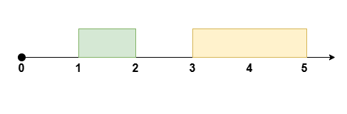
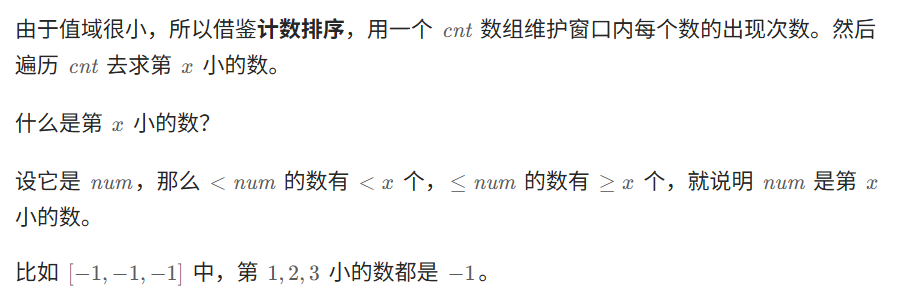
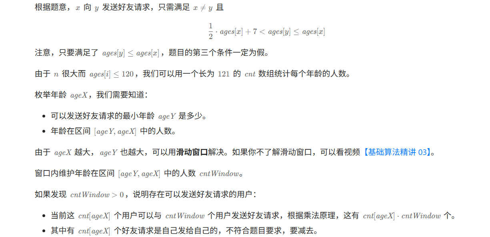
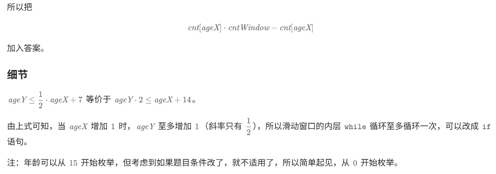
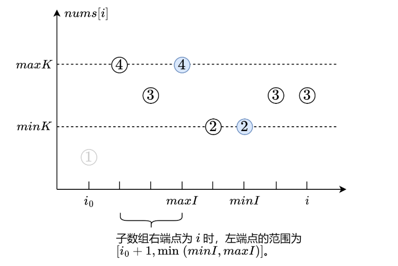

# Leetcode——滑动窗口与双指针专题

> 秋招一轮刷题：暂定阈值为1700，难度在1700以上的先放一放，抓紧把1700以下的专题刷完。

可以参考：[分享丨【题单】滑动窗口与双指针（定长/不定长/单序列/双序列/三指针/分组循环） - 力扣（LeetCode）](https://leetcode.cn/circle/discuss/0viNMK/)

**定长滑动窗口**

- [x] 定长子串中元音的最大数目 1263 
- [x] 子数组最大平均数 I
- [x] 大小为 K 且平均值大于等于阈值的子数组数目 1317
- [x] 半径为 k 的子数组平均值 1358
- [x] 得到 K 个黑块的最少涂色次数 1360
- [x] 爱生气的书店老板 1418
- [x] 几乎唯一子数组的最大和 1546
- [x] 长度为 K 子数组中的最大和 1553
- [x] 可获得的最大点数 1574
- [x] 拆炸弹 做到 O(n)
- [ ] 健身计划评估（会员题）
- [ ] 长度为 K 的无重复字符子串（会员题）
- [ ] 每个子数组的数字种类数（会员题）
- [ ] 最少交换次数来组合所有的 1（会员题）
- [ ] 分享 K 个糖果后独特口味的数量（会员题）
- [x] 检查一个字符串是否包含所有长度为 K 的二进制子串 1504
- [ ] 最少交换次数来组合所有的 1 II 1748
- [ ] 子串的最大出现次数 1748
- [ ] 滑动子数组的美丽值 1786
- [ ] 使二进制字符串字符交替的最少反转次数 2006
- [ ] 字符串的排列
- [ ] 找到字符串中所有字母异位词
- [ ] 串联所有单词的子串
- [ ] 查找给定哈希值的子串 2063
- [ ] 统计完全子字符串 2449
- [ ] 子串能表示从 1 到 N 数字的二进制串 做到 O(∣s∣)
- [ ] K 个关闭的灯泡（会员题）做到 O(n)
- [ ] 等计数子串的数量（会员题）
- [ ] 子数组的最大频率分数（会员题）
- [x] [2269. 找到一个数字的 K 美丽值](https://leetcode.cn/problems/find-the-k-beauty-of-a-number/) 1280
- [x] [1984. 学生分数的最小差值](https://leetcode.cn/problems/minimum-difference-between-highest-and-lowest-of-k-scores/) 1306
- [ ] [220. 存在重复元素 III](https://leetcode.cn/problems/contains-duplicate-iii/)


**不定长滑动窗口**

§2.1 求最长/最大

- [x] 无重复字符的最长子串
- [x] 每个字符最多出现两次的最长子字符串 1329
- [x] 删掉一个元素以后全为 1 的最长子数组 1423
- [x] 尽可能使字符串相等 1497
- [x] 找到最长的半重复子字符串 1502
- [x] 水果成篮 1516
- [x] 删除子数组的最大得分 1529
- [x] 最多 K 个重复元素的最长子数组 1535
- [x] 数组的最大美丽值 1638
- [x] 考试的最大困扰度 1643
- [x] 最大连续 1 的个数 III 1656
- [x] [1658. 将 x 减到 0 的最小操作数](https://leetcode.cn/problems/minimum-operations-to-reduce-x-to-zero/)
- [x] [1838. 最高频元素的频数](https://leetcode.cn/problems/frequency-of-the-most-frequent-element/)
- [ ] 每种字符至少取 K 个 1948

以下还都没做：

- 找出最长等值子数组 1976
- 毯子覆盖的最多白色砖块数 2022
- 摘水果 2062
- 两个线段获得的最多奖品 2081
- 使数组连续的最少操作数 2084
- 可见点的最大数目 2147
- 最长合法子字符串的长度 2204
- 最长乘积等价子数组 ~2300 非暴力做法
- 执行操作使频率分数最大 2444
- 移动石子直到连续 II 2456
- 收集连续 K 个袋子可以获得的最多硬币数量 ~2500
- 至少有 K 个重复字符的最长子串
- 最长的美好子字符串 非暴力做法
- 最大连续 1 的个数 II（会员题）
- 至多包含两个不同字符的最长子串（会员题）
- 至多包含 K 个不同字符的最长子串（会员题）


§2.2 求最短/最小
一般题目都有「至少」的要求。

- [x] 长度最小的子数组
- [x] 最短且字典序最小的美丽子字符串 做到$O(n^2)$
- [ ] 替换子串得到平衡字符串 1878
- [ ] 无限数组的最短子数组 1914
- [ ] 最小覆盖子串
- [ ] 最小区间 做法不止一种


# 一、定长滑动窗口

## 【模板】基础套路（[1343. 大小为 K 且平均值大于等于阈值的子数组数目 - 力扣（LeetCode）](https://leetcode.cn/problems/number-of-sub-arrays-of-size-k-and-average-greater-than-or-equal-to-threshold/description/)）：

```c++
class Solution {
public:
    int numOfSubarrays(vector<int>& arr, int k, int threshold) {
        int n=arr.size();
        int res=0;
        int sum=0;
        int thresholdSum = threshold*k;
        for(int i=0;i<n;i++)
        {
            //1、inset
            sum+=arr[i];//假设k是3个 inset步骤 从2加到3
            if(i<k-1)continue;//判断下标是否小于2(是否小于3个元素) 是的话就continue
            //2、update
            if(sum>=thresholdSum)res+=1;//判断一下总的sum,因为现在是3个元素
            //3、delete
            sum-=arr[i-k+1];//扣掉一个元素 回到2个元素
        }
        return res;
    }
};
```


## 1.[大小为 K 且平均值大于等于阈值的子数组数目](https://leetcode.cn/problems/number-of-sub-arrays-of-size-k-and-average-greater-than-or-equal-to-threshold/)

经典套路题，直接给出代码：

```c++
class Solution {
public:
    int numOfSubarrays(vector<int>& arr, int k, int threshold) {
        int target = k * threshold;
        int sum = 0;
        int cnt = 0;
        for(int i=0;i<arr.size();i++){
            sum+=arr[i]; //1.inset
            if(i<k-1) continue; //!!!<
            //2.update
            if(sum>=target){
                cnt++;
            }
            //3.delete
            sum -= arr[i-k+1];
        }
        return cnt;
    }
};
```


## [2090. 半径为 k 的子数组平均值](https://leetcode.cn/problems/k-radius-subarray-averages/)


```C++
class Solution {
public:
    vector<int> getAverages(vector<int>& nums, int k)
    {
        int n=nums.size();
        vector<int> res(n,-1);
        if(n-2*k<0)return res;

        long long avgS=0;

        for(int r=0;r<n;r++)
        {
            avgS+=nums[r];
            if(r<2*k)continue;
            //update
            res[r-k]=avgS/(2*k+1);
            //out
            avgS-=nums[r-2*k];
        }
        return res;
       
    }
};
```


## 2.[1052. 爱生气的书店老板](https://leetcode.cn/problems/grumpy-bookstore-owner/)

一道定长滑动窗口的变形题，**定长滑动窗口题目，一定要想明白窗口里面要维护什么**。

```c++
class Solution {
public:
    int maxSatisfied(vector<int>& customers, vector<int>& grumpy, int minutes) {
        //1.计算完全不使用技巧,能让多少顾客满意 sum
        //2.维护使用技巧可以让区间内新增满意顾客的数量,即为滑动窗口维护的值
        int sum = 0;
        int newSatisfiedSum = 0;
        int maxSatisfied = 0;
        for(int i=0;i<customers.size();i++){
            //1.inset
            sum += customers[i] * (grumpy[i]==0);
            newSatisfiedSum += (grumpy[i]==1) * customers[i]; //这样,如果老板生气了,可以矫正回来,认为是新增满意顾客的数量
            if(i<minutes-1) continue;
            //2.update
            maxSatisfied = max(maxSatisfied, newSatisfiedSum);
            //3.delete
            newSatisfiedSum -= (grumpy[i-minutes+1]==1) * customers[i-minutes+1];
        }
        return maxSatisfied + sum;
    }
};
```

y

```C++
class Solution {
public:
    int maxSatisfied(vector<int>& customers, vector<int>& grumpy, int minutes) {
        //记录minutes分钟内不生气带来的增量收益
        int temp = 0;
        int resMax = 0;
        int normal=0;
        for(int r=0;r<customers.size();r++)
        {
            //计算正常收益
            if(grumpy[r]==0)
            normal +=  customers[r];
            else
            //in
            //if(grumpy[r]==1)
                temp+=customers[r];
            if(r<minutes-1)continue;
            //update
            resMax = max(resMax,temp);
            //out
            if(grumpy[r-minutes+1]==1)temp-=customers[r-minutes+1];
        }
        return normal+resMax;
    }
};
```

## [2841. 几乎唯一子数组的最大和](https://leetcode.cn/problems/maximum-sum-of-almost-unique-subarray/)

```C++
class Solution {
public:
    long long maxSum(vector<int>& nums, int m, int k) 
    {
        //unordered_map  存储每个元素个数
        //往右 map- 
        unordered_map<int,int> umap;
        long long tempSum=0;
        long long maxSum=0;
        for(int r=0;r<nums.size();r++)
        {
            //in
            umap[nums[r]]++;
            tempSum+=nums[r];
            if(r<k-1)continue;
            //update
            if(umap.size()>=m)
            {
                maxSum=max(maxSum,tempSum);
            }
            //out
            int out = nums[r-k+1];
            umap[out]--;
            if(umap[out]==0)umap.erase(out);//umap语法 umap.erase(key)

            tempSum -=out;
        }
        return maxSum;

    }
};
```


## 3.[2461. 长度为 K 子数组中的最大和](https://leetcode.cn/problems/maximum-sum-of-distinct-subarrays-with-length-k/)

主要是要思考“子数组中的所有元素 **各不相同**”要怎么用代码来表示。这道题的代码如下：

```c++
class Solution {
public:
    long long maximumSubarraySum(vector<int>& nums, int k) {
        long long sum = 0;
        unordered_map<int, int> umap; //key:数字, value:出现频率
        long long res = 0;
        for(int i=0;i<nums.size();i++){
            //1.inset
            sum += nums[i];
            umap[nums[i]]++;
            if(i<k-1) continue;
            //2.update
            if(umap.size()==k){
                res = max(res, sum);
            }
            //3.delete
            umap[nums[i-k+1]]--;
            sum-=nums[i-k+1];
            if(umap[nums[i-k+1]]==0) umap.erase(nums[i-k+1]);
        }
        return res;
    }
};
```


## 4.[1423. 可获得的最大点数](https://leetcode.cn/problems/maximum-points-you-can-obtain-from-cards/)

这道题目的启示是：如果转换解决问题的思路为改变窗口的大小，则需要注意**窗口大小为0的情况**。这种求和问题也可以直接用C++的`accumulate`函数加快写代码的效率，这里给出这种做法：

```c++
class Solution {
public:
    int maxScore(vector<int>& cardPoints, int k) {
        //用求和函数加快计算
        int n = cardPoints.size();
        int sum = accumulate(cardPoints.begin(), cardPoints.end(), 0); //别忘了最后一个参数
        if(n==k) return sum; //注意特殊情况判断
        int tmpSum = accumulate(cardPoints.begin(), cardPoints.begin()+n-k, 0); //前n-k个值之和
        int res = tmpSum;
        //求解窗口大小为n-k的最小点数
        for(int i=n-k;i<n;i++){
            tmpSum += (cardPoints[i] - cardPoints[i-(n-k)]); //一次更新两端
            res = min(res, tmpSum);
        }
        return sum - res;
    }
};
```


板子做法

```C++
class Solution {
public:
    int maxScore(vector<int>& cardPoints, int k) 
    {
        int n=cardPoints.size();
        int getCardNum = n-k;
        int tempSum=0;
        int minSum = INT_MAX;//!!

        int totalSum=0;
        for(int r=0;r<n;r++)
        {
            totalSum+=cardPoints[r];
            //in
            tempSum+=cardPoints[r];
            if(r<getCardNum-1)continue;
            //update
            minSum = min(minSum,tempSum);
            //out;
            tempSum-=cardPoints[r-getCardNum+1];
        }
        if(n==k)return totalSum;//
        return totalSum - minSum;
    }
};
```


## 5.（简单题）[1652. 拆炸弹](https://leetcode.cn/problems/defuse-the-bomb/)

利用定长滑动窗口的做法，考虑用$O(n)$的复杂度解决这道题目。这种算是模拟题，可以画一下图推导一下下标索引，**千万不要硬着头皮想。**本题的难点就在于索引值的判定，代码如下：

```c++
class Solution {
public:
    vector<int> decrypt(vector<int>& code, int k) {
        int sum = 0;
        int n = code.size();
        vector<int> res(n);
        //考虑时间复杂度为O(n)的做法
        if(k<0){
            k=-k;
            //先计算第一个数替换的值
            for(int i=n-1;i>n-k-1;i--){
                sum+=code[i];
            }
            res[0] = sum;
            //此时用前面k个数字之和替换
            for(int i=1;i<code.size();i++){
                sum += (code[i-1]-code[(i-k+n-1)%n]); //取余运算
                res[i] = sum;
            }
        } else if(k>0){
            //从后往前算
            for(int i=0;i<k;i++) sum+=code[i];
            res[n-1]=sum;
            for(int i=n-2;i>=0;i--){
                sum += (code[i+1]-code[(i+k+1)%n]);
                res[i] = sum;
            }
        }
        return res;
    }
};
```

y

```C++

class Solution {
public:
    vector<int> decrypt(vector<int>& code, int k) {
        int n = code.size();
        vector<int> res(n);
        if (k > 0) 
        {
            int tempsum = 0;
            for (int j = 0; j < k; j++) 
            {
                tempsum += code[j%n];
            }
            res[n - 1] = tempsum;
            for(int i=0;i<n-1;i++)
            {
                res[i]=tempsum+code[(i+k)%n]-code[i];
                tempsum = res[i];
            }
        }
        else if(k<0)
        {
            k=-k;
            int tempsum = 0;
            // n=3,j =n-1=2,j>=2-1-1=0 k=1 
            for (int j = n-1; j >= n-k; j--) 
            {
                tempsum += code[j%n];
            }
            res[0] = tempsum;
            for(int i=1;i<n;i++)
            {
                //错误地方：这一步如果code[(i-k-1)%n]负数取余是不对的 一定要记得+n
                res[i]=tempsum-code[(i-k-1+n)%n]+code[i-1];
                tempsum = res[i];
            }
        }
        return res;
    }
};
```


## 6.[1461. 检查一个字符串是否包含所有长度为 K 的二进制子串](https://leetcode.cn/problems/check-if-a-string-contains-all-binary-codes-of-size-k/)

通过这道题目，可以先来复习一下C++中`string`的`substr`函数用法。用这种方法来做可以秒掉这道题：

```c++
class Solution {
public:
    bool hasAllCodes(string s, int k) {
        int n = s.size();
        if((n-k+1)<(1<<k)) return false; //此时子串数量少于长度为k的二进制字符串数量
        unordered_set<string> us;
        for(int i=0;i<n-k+1;i++){
            string sub = s.substr(i, k);
            us.insert(std::move(sub));
        }
        return (us.size()==(1<<k));
    }
};
```

如果要用滑动窗口来做，可以考虑在窗口移动的时候，窗口内的值的变化情况。此时考察的就是一些位运算了，方法2的代码如下：

```c++
class Solution {
public:
    bool hasAllCodes(string s, int k) {
        int n = s.size();
        unordered_set<int> us;
        int sum = 0;
        for(int i=0;i<n;i++){
            //1.inset
            int in = s[i]-'0';
            sum = ((sum<<1) | in);
            if(i<k-1) continue;
            //2.update
            us.insert(sum);
            //3.delete
            int out = s[i-k+1]-'0';
            sum -= (out<<(k-1));
        }
        return (us.size()==(1<<k)); //1<<2=0b100 = 4 / 1<<3 =0b1000 = 8 /1<<K=2^K
    }
};
```


## 7.[2269. 找到一个数字的 K 美丽值 - 力扣（LeetCode）](https://leetcode.cn/problems/find-the-k-beauty-of-a-number/)

这道题目本身并不难，难点在于对C++字符串相关接口的熟练应用。一个是`tostring(num)`接口，一个是`stoi(s)`接口。虽然本题用滑动窗口法的话不一定能用上这俩接口，但还是要记住的。本题代码如下：

```c++
class Solution {
public:
    int divisorSubstrings(int num, int k) {
        int sum = 0; //维护窗口内的值
        string s = to_string(num);
        int cnt = 0;
        for(int i=0;i<s.size();i++){
            //1.inset
            int in = s[i]-'0';
            sum = sum * 10 + in;
            if(i<k-1) continue;
            //2.update
            if(sum!=0 && num%sum==0) cnt++; //注意题意:0不能整除任何值
            //3.delete
            int out = s[i-k+1]-'0';
            sum -= out * pow(10, k-1);
        }
        return cnt;
    }
};
```

枚举所有长度为`k`的子串，可以用以下`string`中的接口：

```c++
for (int i = 0; i <= n - k; ++i) {
    // 枚举所有长度为 k 的子串
    int tmp = stoi(s.substr(i, k));
    if (tmp && num % tmp == 0) {
        ++res;
    }
}
```


## 8.[1984. 学生分数的最小差值](https://leetcode.cn/problems/minimum-difference-between-highest-and-lowest-of-k-scores/)

可以简化运算，这里为了保持三部曲写的麻烦一点，但非常好理解：

```c++
class Solution {
public:
    int minimumDifference(vector<int>& nums, int k) {
        //思路很清晰,排序后定长滑动窗口
        sort(nums.begin(), nums.end());
        int res = INT_MAX;
        for(int i=0;i<nums.size();i++){
            //1.inset
            if(i<k-1) continue;
            //2.update
            res = min(res, nums[i]-nums[i-k+1]);
            //3.delete
        }
        return res;
    }
};
```


## ==9.[220. 存在重复元素 III](https://leetcode.cn/problems/contains-duplicate-iii/)（困难，还没做）==


## 进阶

### [3439. 重新安排会议得到最多空余时间 I](https://leetcode.cn/problems/reschedule-meetings-for-maximum-free-time-i/)

给你一个整数 `eventTime` 表示一个活动的总时长，这个活动开始于 `t = 0` ，结束于 `t = eventTime` 。

同时给你两个长度为 `n` 的整数数组 `startTime` 和 `endTime` 。它们表示这次活动中 `n` 个时间 **没有重叠** 的会议，其中第 `i` 个会议的时间为 `[startTime[i], endTime[i]]` 。

你可以重新安排 **至多** `k` 个会议，安排的规则是将会议时间平移，且保持原来的 **会议时长** ，你的目的是移动会议后 **最大化** 相邻两个会议之间的 **最长** 连续空余时间。

移动前后所有会议之间的 **相对** 顺序需要保持不变，而且会议时间也需要保持互不重叠。

请你返回重新安排会议以后，可以得到的 **最大** 空余时间。

**注意**，会议 **不能** 安排到整个活动的时间以外。

**示例 1：**

**输入：**eventTime = 5, k = 1, startTime = [1,3], endTime = [2,5]

**输出：**2

**解释：**


将 `[1, 2]` 的会议安排到 `[2, 3]` ，得到空余时间 `[0, 2]` 。


https://leetcode.cn/problems/reschedule-meetings-for-maximum-free-time-i/solutions/3061619/zhuan-huan-cheng-ding-chang-hua-dong-chu-1kg1/



看示例 1，把会议区间 [1,2] 移动到 [0,1] 或者 [2,3]，会产生空余时间段 [1,3] 或者 [0,2]，相当于把两个**相邻**的长为 1 空余时间段 [0,1] 和 [2,3] **合并**成一个更大的长为 1+1=2 的空余时间段。

题目要求会议之间的相对顺序需要保持不变，这意味着我们只能合并相邻的空余时间段，所以重新安排至多 *k* 个会议等价于如下问题：

- 给你 *n*+1 个空余时间段，合并其中 *k*+1 个**连续**的空余时间段，得到的最大长度是多少？

这可以用**定长滑动窗口**解决，原理见[【套路】教你解决定长滑窗！适用于所有定长滑窗题目！](https://leetcode.cn/problems/maximum-number-of-vowels-in-a-substring-of-given-length/solutions/2809359/tao-lu-jiao-ni-jie-jue-ding-chang-hua-ch-fzfo/)


(也可以不用数组存remain 不过存了更清晰就是了)

```C++
class Solution {
public:
    int maxFreeTime(int eventTime, int k, vector<int>& startTime, vector<int>& endTime) {
        // 移动1块= 合并2连续空余时间
        // 移动2块= 合并3连续空余空间
        // 1,2  3,5
        int start = 0;
        int end=0;
        int n = startTime.size();
        vector<int> remainTime;
        for(int i=0;i<n;i++)
        {
            end = startTime[i];
            remainTime.emplace_back(end-start);
            // if(start<end) // 错误 实际上是0也要放入 0表示这两个会议时间挨一起了不能移动
            // {
            //     remainTime.emplace_back(end-start);
            // }
            start = endTime[i];
        }
        if(eventTime-start>0) // 特判最终情况
            remainTime.emplace_back(eventTime-start);
        int tmp=0;
        int maxRes=0;
        k=k+1;
        for(int r=0;r<remainTime.size();r++)
        {
            //in
            tmp += remainTime[r];
            //update
            // if(r<k-1)continue;//特殊 放下面 
            maxRes = max(maxRes,tmp);
            if(r-k+1<0)continue;
            //out
            tmp-= remainTime[r-k+1];
        }
        return maxRes;
    }
};
```


### [2134. 最少交换次数来组合所有的 1 II](https://leetcode.cn/problems/minimum-swaps-to-group-all-1s-together-ii/)

**交换** 定义为选中一个数组中的两个 **互不相同** 的位置并交换二者的值。

**环形** 数组是一个数组，可以认为 **第一个** 元素和 **最后一个** 元素 **相邻** 。

给你一个 **二进制环形** 数组 `nums` ，返回在 **任意位置** 将数组中的所有 `1` 聚集在一起需要的最少交换次数。

**示例 1：**

```C++
输入：nums = [0,1,0,1,1,0,0]
输出：1
解释：这里列出一些能够将所有 1 聚集在一起的方案：
[0,0,1,1,1,0,0] 交换 1 次。
[0,1,1,1,0,0,0] 交换 1 次。
[1,1,0,0,0,0,1] 交换 2 次（利用数组的环形特性）。
无法在交换 0 次的情况下将数组中的所有 1 聚集在一起。
因此，需要的最少交换次数为 1 。
```


```C++
class Solution {
public:
    int minSwaps(vector<int>& nums) {
        //定长滑动窗口中 1的个数最多的情况（or 0最少的情况）
        //定长 长为1的个数
        int numOf1=0;
        int n = nums.size();
        int k=0;
        for(int i=0;i<n;i++)
        {
            if(nums[i]==1)
                k++;
        }
        int tmp=0;
        int minRes=k;
        //0的个数
        for(int r=0;r<n+k;r++)
        {
            //in
            tmp += (nums[r%n]==0);
            //update
            if(r-k+1<0)continue;
            minRes = min(tmp,minRes);
            //out
            tmp -= (nums[(r-k+1 +n)%n]==0);
        }
        return minRes;
    }
};
```


### [1297. 子串的最大出现次数](https://leetcode.cn/problems/maximum-number-of-occurrences-of-a-substring/)（值得复习）

> 给你一个字符串 `s` ，请你返回满足以下条件且出现次数最大的 **任意** 子串的出现次数：
>
> - 子串中不同字母的数目必须小于等于 `maxLetters` 。
> - 子串的长度必须大于等于 `minSize` 且小于等于 `maxSize` 。

先有一个小的贪心，题目要求我们找一个长度范围内的字符串，那么长度大的必然包含长度小的子串，也就是长度小的个数一定不劣于长度大的，所以我们贪心的只取长度等于最小值。

> ==假设字符串 T 在给定的字符串 S 中出现的次数为 k，那么 T 的任意一个子串出现的次数至少也为 k，即 T 的任意一个子串在 S 中出现的次数不会少于 T 本身==。这样我们就可以断定，在所有满足条件且出现次数最多的的字符串中，一定有一个的长度恰好为 minSize。
>
> 我们可以使用反证法证明上述的结论：假设所有满足条件且出现次数最多的字符串中没有长度为 minSize 的，不妨任取其中的一个长度为 l 的字符串，根据假设，有 l > minSize。此时我们再任取该字符串的一个长度为 minSize 的子串，子串出现的次数不会少于原字符串出现的次数，与假设相矛盾。
>

本题代码如下：
```c++
class Solution {
public:
    int maxFreq(string s, int maxLetters, int minSize, int maxSize) {
        //这道题的maxSize可以不考虑，短串匹配的数量不会少于长串，因此只考虑minSize也一定能拿到一个符合题意的解
        //定长滑动窗口
        unordered_map<string, int> umap;
        unordered_map<char, int> wordDict;
        int n = s.size();
        int k = minSize;
        for(int i=0;i<n;i++)
        {
            wordDict[s[i]]++;
            if(i<k-1) continue;
            //update
            if(wordDict.size()<=maxLetters)
            {
                string tmp = s.substr(i-k+1, k);
                umap[tmp]++;
            }
            wordDict[s[i-k+1]]--;
            if(wordDict[s[i-k+1]]==0)
            {
                wordDict.erase(s[i-k+1]);
            }
        }
        int mx = 0;
        for(auto& [k, v]: umap)
        {
            mx = max(mx, v);
        }
        return mx;
    }
};
```


### [2653. 滑动子数组的美丽值](https://leetcode.cn/problems/sliding-subarray-beauty/)（思路比较巧妙）

> 给你一个长度为 `n` 的整数数组 `nums` ，请你求出每个长度为 `k` 的子数组的 **美丽值** 。
>
> 一个子数组的 **美丽值** 定义为：如果子数组中第 `x` **小整数** 是 **负数** ，那么美丽值为第 `x` 小的数，否则美丽值为 `0` 。
>
> 请你返回一个包含 `n - k + 1` 个整数的数组，**依次** 表示数组中从第一个下标开始，每个长度为 `k` 的子数组的 **美丽值** 。
>
> - 子数组指的是数组中一段连续 **非空** 的元素序列。



实际操作中，用的是 `left = x - cnt[j]`, 当`left`的值从大于零变成小于等于0的时候，说明找到了（j从最小值往大了遍历）。利用计数排序的思想，还是比较巧妙的。代码和详细的注释如下：

```c++
class Solution {
public:
    vector<int> getSubarrayBeauty(vector<int>& nums, int k, int x) {
        //这题数是-50~50，可以创建长度为101的数组，存放0~100，bias=50
        int BIAS = 50;
        vector<int> cnt(2*BIAS+1, 0); //类似于计数排序
        int n = nums.size();
        //先把k-1个数放进来
        for(int i=0;i<k-1;i++)
        {
            cnt[nums[i]+BIAS] += 1;
        }
        vector<int> ans(n-k+1); //答案
        for(int i=k-1;i<n;i++) //往后遍历
        {
            cnt[nums[i]+BIAS] ++;
            //此时窗口的长度为k，update
            int t = x;
            for(int j=-BIAS;j<0;j++) //遍历负数的情况，正数不用管，会使得结果为0
            {
                t -= cnt[j+BIAS]; 
                if(t<=0) //符合要求，表示到了第x小的数
                {
                    ans[i-k+1] = j;
                    break; //找到了解，break掉即可
                }
            }
            cnt[nums[i-k+1]+BIAS]--;
        }
        return ans;
    }
};
```

常规的定长滑动窗口做法：(`if(i<k-1)continue;`放里面)

```C++
class Solution {
public:
    vector<int> getSubarrayBeauty(vector<int>& nums, int k, int x) {
        // -50 - 50
        vector<int> hash(105,0);
        int Bias = 50;
        int n = nums.size();
        vector<int> res(n-k+1);
        for(int i=0;i<n;i++)
        {
            //in
            hash[nums[i]+Bias]++;
            if(i<k-1)continue;
            //update 寻找第x小
            int a = x;
            for(int j=-Bias;j<=0;j++)
            {
                a-=hash[j+Bias];
                if(a<=0)
                {
                    res[i-k+1] = j; 
                    break;
                }
            }
            //out
            hash[nums[i-k+1]+Bias]--;
        }
        return res;
    }
};
```


# 二、不定长滑动窗口

个人理解，做题目的时候需要考虑好数组中数的范围，比如是否有负数，有0，这种情况下单纯的`while(sum>=target)`可能会失效，有时需要加上`while(sum>=target && l<=r)`做进一步判断。

## 1.求最长/最大

一般题目都有「至多」的要求。

- 与定长滑动窗口套路是类似的，在外层`for`循环中维护r指针，如果不满足要求则移动`l`指针直到满足要求为止。

### （1）【模板】[3. 无重复字符的最长子串](https://leetcode.cn/problems/longest-substring-without-repeating-characters/) 

代码如下：

```c++
class Solution {
public:
    int lengthOfLongestSubstring(string s) {
        unordered_map<char, int> umap; //存储每个字符出现的次数
        int res = 0;
        int l=0;
        for(int r=0;r<s.size();r++){
            umap[s[r]]++;
            while(umap[s[r]]>1){
                umap[s[l]]--;
                l++;
            }
            if(l<=r) res = max(res, r-l+1);
        }
        return res;
    }
};
```

y：

```C++
class Solution {
public:
    int lengthOfLongestSubstring(string s) 
    {
        unordered_map<char,int> umap;
        int l=0;
        int maxLen=0;
        for(int r=0;r<s.size();r++)
        {
            //in
            umap[s[r]]++;
            //out
            while(umap[s[r]]>1)
            {
                umap[s[l]]--;
                l++;
            }
            //update
            maxLen = max(maxLen,r-l+1);
        }
        return maxLen;
    }
};
```


### （2）[3090. 每个字符最多出现两次的最长子字符串](https://leetcode.cn/problems/maximum-length-substring-with-two-occurrences/)

跟上一题比较类似，代码如下：

```c++
class Solution {
public:
    int maximumLengthSubstring(string s) {
       int l=0;
       int res = 0;
       unordered_map<char, int> umap; //key:字符 value:出现次数
       for(int r=0;r<s.size();r++){
            umap[s[r]]++;
            while(umap[s[r]]>2){
                umap[s[l]]--;
                l++;
            }
            if(l<=r) res = max(res, r-l+1);
       } 
        return res;
    }
};
```


### （3）[1493. 删掉一个元素以后全为 1 的最长子数组](https://leetcode.cn/problems/longest-subarray-of-1s-after-deleting-one-element/)

题解如下（也可以用动规做，但暂时还没看，这里只整理滑动窗口的解法：）

```c++
class Solution {
public:
    int longestSubarray(vector<int>& nums) {
        //一个0没事,一旦出现两个零就要缩到一个零,维护窗口内最多一个0时的最大值
        int zeroCnt = 0; //记录窗口内0的个数
        int res = 0;
        int j = 0;
        for(int i=0;i<nums.size();i++){
            if(nums[i]==0){
                if(zeroCnt<2) zeroCnt++;
                if(zeroCnt==2){
                    while(nums[j]!=0){ //让窗口内最多只能有一个0
                        j++;
                    }
                    j++; //++之后指到了不是0的位置
                    zeroCnt--;
                }
            }
            if(j<=i) res = max(res, i-j+1);
        }
        return res-1; //不得不删除一个元素,即使没有0
    }
};
```

y

```C++
class Solution {
public:
    int longestSubarray(vector<int>& nums) 
    {
        //寻找最多只有一个0的子数组
        //如果有0 长度-1 没有0  也是长度-1
        int zeroCnt=0;
        int l=0;
        int n=nums.size();
        int maxLen=0;
        for(int r=0;r<n;r++)
        {
            //in
            if(nums[r]==0)zeroCnt++;
            //out
            while(zeroCnt>1)
            {
                if(nums[l]==0)zeroCnt--;
                l++;
            }
            //update
            maxLen = max(maxLen,r-l+1);
        }
        return max(maxLen-1,0);
    }
};
```


------

### ==2025.2.20==

以下为2025.2.20晚

### （4）[1208. 尽可能使字符串相等](https://leetcode.cn/problems/get-equal-substrings-within-budget/)

```c++
class Solution {
public:
    int equalSubstring(string s, string t, int maxCost) {
        //思路:计算一下每个下标对应转换的差(数组),然后维护最长窗口长度
        int n = s.size();
        vector<int> vec(n);
        for(int i=0;i<n;i++){
            vec[i] = abs(t[i]-s[i]);
        }
        //维护窗口最大长度
        int res = 0;
        int cost = 0; //维护窗口内的cost
        int j=0;
        for(int i=0;i<n;i++){
            cost += vec[i];
            while(cost>maxCost){
                cost-=vec[j];
                j++;
            }
            res = max(res, i-j+1);
        }
        return res;
    }
};
```


### （5）[2730. 找到最长的半重复子字符串](https://leetcode.cn/problems/find-the-longest-semi-repetitive-substring/)

这道题目可以不用传统的滑动窗口，而是记录上一次发生重复的位置，然后每次再次重复就把左指针移动到记录上次重复的位置。

```c++
class Solution {
public:
    int longestSemiRepetitiveSubstring(string s) {
        //每次遇到重复现象,就记录索引,第二次重复了就把j跳转到上次记录的索引
        int n = s.size();
        int j = 0;
        int recordLast = -1; //上次记录出现重复字符的位置
        int res = 0;
        if(n==1) return 1; //注意,做一下特判,不然for(int i=1;i<n;i++)进不去,注意记住这种模式
        for(int i=1;i<n;i++){
            if(s[i]==s[i-1]){ //第二次及以上出现重复子字符串了 
                if(recordLast!=-1){ 
                    j = recordLast;
                    recordLast = i; //别忘了更新recordLast
                } else { //第一次出现重复子字符串,问题不大
                    recordLast = i; //第一次记录
                }
            }
            //cout<<i-j+1<<endl;
            res = max(res, i-j+1);
        }
        return res;
    }
};
```

y

```C++
class Solution {
public:
    int longestSemiRepetitiveSubstring(string s) 
    {
        //记录重复子串的位置，如果找到新的重复的，l就来到上次重复子串第二个数的位置

        int l=0;
        int n=s.size();
        int lastRepetivePos = -1;
        int maxLen=0;

        int repeteNum=0;
        for(int r=0;r<n;r++)
        {
            //in
            if(r>0&&s[r]==s[r-1]) // 00 //000
            {
                repeteNum++; //1   2
                if(lastRepetivePos==-1)lastRepetivePos=r;
                // lastRepetivePos = r;//1   2error
            }

            //out
            if(repeteNum>=2)//000
            {
                if(lastRepetivePos!=-1)l=lastRepetivePos;
                lastRepetivePos = r;
                repeteNum--;
            }
            //update
            maxLen=max(maxLen,r-l+1);
        }
        return maxLen;
    }
};
```


### （6）[904. 水果成篮](https://leetcode.cn/problems/fruit-into-baskets/)

**这题描述有点抽象**，题意应该是：**找一个最长连续子数组，满足子数组中至多有两种数字。返回子数组的长度。**

要点是记得用哈希表。代码如下：

```c++
class Solution {
public:
    int totalFruit(vector<int>& fruits) {
        unordered_map<int, int> umap; //key:水果的kind, value:出现的个数,哈希表中只能有两种元素
        int j = 0;
        int res = 0;
        for(int i=0;i<fruits.size();i++){
            umap[fruits[i]]++;
            while(umap.size()>2){
                umap[fruits[j]]--;
                if(umap[fruits[j]]==0) umap.erase(fruits[j]);
                j++;
            }
            res = max(res, i-j+1);
        }
        return res;
    }
};
```


### （7）[1695. 删除子数组的最大得分](https://leetcode.cn/problems/maximum-erasure-value/)

```c++
class Solution {
public:
    int maximumUniqueSubarray(vector<int>& nums) {
        //其实就是求窗口里无重复元素的最长子串的和
        int res = 0;
        int sum = 0; //维护窗口内的和
        unordered_map<int, int> umap;
        int l=0;
        for(int r=0;r<nums.size();r++){
            umap[nums[r]]++;
            sum+=nums[r];
            while(umap[nums[r]]>1){
                umap[nums[l]]--;
                if(umap[nums[l]]==0) umap.erase(nums[l]);
                sum-=nums[l];
                l++;
            }
            res = max(res, sum);
        }
        return res;
    }
};
```

y

```C++
class Solution {
public:
    int maximumUniqueSubarray(vector<int>& nums) 
    {
        //子数组最大和
        int l=0;
        int maxSum=0;
        int tempSum=0;
        unordered_map<int,int> umap;
        for(int r=0;r<nums.size();r++)
        {
            //in
            tempSum+=nums[r];
            umap[nums[r]]++;
            //out
            while(umap[nums[r]]>1)
            {
                umap[nums[l]]--;
                tempSum-=nums[l];
                l++;
            }
            //update
            maxSum = max(maxSum,tempSum);
        }
        return maxSum;
    }
};
```


### （8）[2958. 最多 K 个重复元素的最长子数组](https://leetcode.cn/problems/length-of-longest-subarray-with-at-most-k-frequency/)

```c++
class Solution {
public:
    int maxSubarrayLength(vector<int>& nums, int k) {
        //一样
        unordered_map<int, int> umap;
        int l=0;
        int res=0;
        for(int r=0;r<nums.size();r++){
            umap[nums[r]]++;
            while(umap[nums[r]]>k){
                umap[nums[l]]--;
                l++;
            }
            res=max(res, r-l+1);
        }
        return res;
    }
};
```


### （9）[2779. 数组的最大美丽值](https://leetcode.cn/problems/maximum-beauty-of-an-array-after-applying-operation/)

这道题目会有一些思维上的难度。对于笔试题来说为了快速尝试能否通过这道题，可以大胆对数组进行预处理，比如排序（排序也就nlogn，别担心复杂度）。

```c++
class Solution {
public:
    int maximumBeauty(vector<int>& nums, int k) {
        //排序后,维护窗口内元素差<=2*k的最大长度,此时才能保持这一部分都变成同一个值
        sort(nums.begin(), nums.end());
        int l=0;
        int res=1; //最起码美丽值也得是1
        int n = nums.size();;
        for(int r=1;r<nums.size();r++){
            while(nums[r]-nums[l]>2*k){
                l++;
            }
            res = max(res, r-l+1);
        }
        return res;
    }
};
```


### （10）[2024. 考试的最大困扰度](https://leetcode.cn/problems/maximize-the-confusion-of-an-exam/)

维护两个窗口（通过两个不同的`l`指针来实现），代码如下：

```c++
class Solution {
public:
    int maxConsecutiveAnswers(string answerKey, int k) {
        //维护两个值,分别是最多k个F的情况下,窗口的最大长度;以及最多k个T的情况下,窗口的最大长度,两者取max即可
        int maxF = 0;
        int maxT = 0;
        int lf = 0, lt = 0; //维护F和T相关的左指针
        int cntF=0, cntT=0; //窗口内F和T的数量
        for(int r=0;r<answerKey.size();r++){
            cntF += (answerKey[r]=='F');
            cntT += (answerKey[r]=='T');
            while(cntF>k){
                cntF-=(answerKey[lf]=='F');
                lf++;
            }
            while(cntT>k){
                cntT-=(answerKey[lt]=='T');
                lt++;
            }
            maxF = max(maxF, r-lf+1);
            maxT = max(maxT, r-lt+1);
        }
        return max(maxF, maxT);
    }
};
```


### （11）[1004. 最大连续1的个数 III - 力扣（LeetCode）](https://leetcode.cn/problems/max-consecutive-ones-iii/description/)

这题比上一题还简单，代码如下：

```c++
class Solution {
public:
    int longestOnes(vector<int>& nums, int k) {
        int cnt0 = 0;
        int res = 0;
        int j = 0;
        for(int i=0;i<nums.size();i++){
            cnt0 += (nums[i]==0);
            while(cnt0>k){
                cnt0 -= (nums[j]==0);
                j++;
            }
            res = max(res, i-j+1);
        }
        return res;
    }
};
```


### （12）[1658. 将 x 减到 0 的最小操作数](https://leetcode.cn/problems/minimum-operations-to-reduce-x-to-zero/)

这道题目要注意边界情况的考虑！否则有的测试用例是过不去的。**经验：在滑动窗口题目中，如果涉及到反着求解的思路，比如变为维护中间窗口，或者转为维护另一个值时，一定要注意可能产生的负数、数组下标溢出等问题。**

```c++
class Solution {
public:
    int minOperations(vector<int>& nums, int x) {
        //相当于维护窗口内=数组总和-x的最大窗口长度,如果大于数组总和-x则收缩l,直到<=数组总和-x,此时窗口内的和=数组总和-x 则更新最大值,否则不更新最大值.
        //若最大值始终没有更新,说明做不到,return -1即可
        int sum=0;
        int res=-1; //记录最大窗口长度
        int l=0;
        int target = accumulate(nums.begin(), nums.end(), 0);
        //全减光了都到不了0,此时return -1,对应: 务必注意这种情况!!
        if(x-target>0) return -1;
        for(int r=0;r<nums.size();r++){
            sum += nums[r];
            while(sum>target-x){
                sum -= nums[l];
                l++;
            }
            if(sum==target-x){
                res = max(res, r-l+1);
            }
        }
        if(res==-1) return -1;
        else return nums.size()-res;
    }
};
```

Y

```C++
class Solution {
public:
    int minOperations(vector<int>& nums, int x) 
    {
        //转换为 和恰好为 totalSum-x 的最长子字符串
        int target = reduce(nums.begin(),nums.end())-x;
        if(target<0)return -1;
        int l=0;
        int n=nums.size();
        int tempsum=0;
        int maxLen=-1;
        for(int r=0;r<n;r++)
        {
            //in
            tempsum+=nums[r];
            //out
            while(tempsum>target)
            {
                tempsum-=nums[l];
                l++;
            }
            //update
            if(tempsum==target)
            {
                maxLen = max(maxLen,r-l+1);
            }
        }
        return ( (maxLen==(-1))? (-1):(n-maxLen) );
    }
};
```


### （13）[1838. 最高频元素的频数](https://leetcode.cn/problems/frequency-of-the-most-frequent-element/)

这道题目有可能会出现`int`溢出的问题，需要考虑进来。

```c++
class Solution {
public:
    int maxFrequency(vector<int>& nums, int k) {
        sort(nums.begin(), nums.end());
        long long cost = k;
        int l=0;
        int n=nums.size();
        int res = 1; //记录最终的结果
        int size = 1; //窗口里最开始有1个元素
        for(int r=1;r<n;r++){
            cost -= (long long)((long long)size * (nums[r]-nums[r-1]));
            while(cost<0){
                cost += (nums[r]-nums[l]);
                l++;
            }
            size = r-l+1; //窗口里现在的元素数量
            res = max(res, r-l+1);
        }
        return res;
    }
};
```

如果忘记了的话，本题思路如下：

> 你的思路可以总结为以下步骤，便于日后回顾：
>
> 1. **排序数组**：首先将数组排序，这样可以确保相邻元素之间的调整操作次数最小，便于后续使用滑动窗口。
> 2. **滑动窗口维护**：使用双指针 `l` 和 `r` 定义一个窗口，表示当前考虑将窗口内所有元素调整为 `nums[r]` 的情况。目标是找到满足总操作次数不超过 `k` 的最大窗口长度。
> 3. **操作次数计算**：
>    - **扩展右边界**：每次右移 `r` 时，计算将窗口内所有元素从之前的最大值 `nums[r-1]` 提升到当前 `nums[r]` 所需的额外操作次数。这部分操作为 `size * (nums[r] - nums[r-1])`，其中 `size` 是当前窗口元素数量。
>    - **调整左边界**：若总操作次数超过 `k`，则逐步右移左指针 `l`，并恢复移出元素对应的操作次数（即 `nums[r] - nums[l]`），直到总操作次数合法。
> 4. **更新最大频数**：每次窗口调整后，记录当前窗口长度作为候选结果，最终取最大值。
>
> **关键点**：
>
> - 排序后，最优目标值必定是窗口右端点的值，因为调整到更大的值需要更多操作次数。
> - 维护窗口内的总操作数不超过 `k`，通过动态调整窗口大小确保高效性。
>
> 这种方法的复杂度为排序的 $O(n log n) $加上滑动窗口遍历的 $O(n)$，高效适用于大规模数据。


y

```C++
class Solution {
public:
    int maxFrequency(vector<int>& nums, int k) 
    {
        int l=0;
        sort(nums.begin(),nums.end());
        int size=0;
        long long cost=0;
        int maxFrequencyNum=0;
        for(int r=0;r<nums.size();r++)
        {
            //in
            if(r>0)cost+=(long long)(nums[r]-nums[r-1])*size;
            size++;
            //out
            while(cost>k)
            {
                cost-=(nums[r]-nums[l]);
                size--;
                l++;
            }
            //update
            maxFrequencyNum = max(maxFrequencyNum,size);
        }
        return maxFrequencyNum;

    }
};
```


### [825. 适龄的朋友](https://leetcode.cn/problems/friends-of-appropriate-ages/)

在社交媒体网站上有 `n` 个用户。给你一个整数数组 `ages` ，其中 `ages[i]` 是第 `i` 个用户的年龄。

如果下述任意一个条件为真，那么用户 `x` 将不会向用户 `y`（`x != y`）发送好友请求：

- `ages[y] <= 0.5 * ages[x] + 7`
- `ages[y] > ages[x]`
- `ages[y] > 100 && ages[x] < 100`

否则，`x` 将会向 `y` 发送一条好友请求。

注意，如果 `x` 向 `y` 发送一条好友请求，`y` 不必也向 `x` 发送一条好友请求。另外，用户不会向自己发送好友请求。

返回在该社交媒体网站上产生的好友请求总数。

**示例 1：**

```
输入：ages = [16,16]
输出：2
解释：2 人互发好友请求。
```


[825. 适龄的朋友 - 力扣（LeetCode）](https://leetcode.cn/problems/friends-of-appropriate-ages/solutions/2990994/ji-shu-hua-dong-chuang-kou-pythonjavaccg-jfya/)






```C++
class Solution {
public:
    int numFriendRequests(vector<int>& ages) {
        vector<int> age(122,0);
        for(int i=0;i<ages.size();i++)
        {
            age[ages[i]]++;
        }
        int windowNum = 0;
        int ay=0;
        int cnt=0;
        //0.5xax+7, ax ,ay
        for(int ax=0;ax<=120;ax++)
        {
            //in
            windowNum += age[ax];
            //out
            //ay > 0.5ax+7
            while(2*ay<=ax+14) // 不能发送好友请求 //这题特殊的，if也可以
            {
                windowNum -= age[ay];
                ay++;
            }
            //update
            if(windowNum>0)// 存在可以发送好友请求的用户 // 【if(windowNum>0)】一定要有 因为这个年龄段可能没人
            {
                cnt += windowNum * age[ax] - age[ax];//cnt += (windowNum -1)* age[ax]自己不能给自己发
            }
        }
        return cnt;

    }
};
```


## 2.求最短/最小

一般题目都有「至少」的要求。

### （1）【模板】[209. 长度最小的子数组 - 力扣（LeetCode）](https://leetcode.cn/problems/minimum-size-subarray-sum/description/)

与之前的题目相比，本题的更新逻辑需要注意一下，可以参考这篇题解中的两种做法：

[209. 长度最小的子数组 - 力扣（LeetCode）](https://leetcode.cn/problems/minimum-size-subarray-sum/solutions/1959532/biao-ti-xia-biao-zong-suan-cuo-qing-kan-k81nh/)

个人比较习惯于写第二种写法，即在`while`内（也就是还满足条件）的时候做计算，代码如下：

```c++
class Solution {
public:
    int minSubArrayLen(int target, vector<int>& nums) {
        int res = INT_MAX;
        int sum = 0; //维护窗口内的和
        int l=0;
        for(int r=0;r<nums.size();r++){
            sum+=nums[r];
            while(sum>=target){
                res = min(res, r-l+1); //注意,本题变为在while循环里面维护最小值
                sum-=nums[l];
                l++;
            }     
        }
        if(res==INT_MAX) return 0;
        else return res;
    }
};
```


有的时候可能也需要第一种写法，这里也放一下：
```c++
class Solution {
public:
    int minSubArrayLen(int target, vector<int>& nums) {
        //试一下第一种做法
        int res = INT_MAX;
        int l=0;
        int sum = 0;
        for(int r=0;r<nums.size();r++){
            sum+=nums[r];//in
            while(sum-nums[l]>=target){ //out
                sum-=nums[l];
                l++;
            }
            if(sum>=target){ //有可能上面的while循环进不去 //update
                res = min(res, r-l+1);
            }
        }
        return res==INT_MAX? 0: res;
    }
};
```


### （2）[2904. 最短且字典序最小的美丽子字符串 - 力扣（LeetCode）](https://leetcode.cn/problems/shortest-and-lexicographically-smallest-beautiful-string/description/) 

**这道题目有点绕，而且也有一定的难度。**（注意字符串更新的时候，优先判断长度是否更小，长度一样的话还要判断字典序是否更小，这题一遍能做对的是这个:thumbsup:）务必记住求最小/最短滑动窗口时的两种套路（记住第一种写法在`while()`中尝试做某个操作，然后判断一下，此时`while`循环后面还要再写一个`if`语句，确保当`while`循环进不去的时候逻辑也是合理的）。本题代码如下：

```c++
class Solution {
public:
    string shortestBeautifulSubstring(string s, int k) {
        int res = INT_MAX;
        int startIndex = 0; //记录子字符串的初始位置,有startIndex和res就可以把子串拿出来
        int l = 0;
        int n=s.size();
        int cntOne = 0; //窗口内1的个数
        for(int r=0;r<n;r++){
            cntOne+=(s[r]=='1');
            while(cntOne-(s[l]=='1')>=k){ //务必记住最小窗口的套路写法
                cntOne-=(s[l]=='1');
                l++;
            }
            if(cntOne==k){
                if((r-l+1)<res){
                    res = r-l+1;
                    startIndex = l;
                } else if((r-l+1)==res){ //长度一样,看看会不会更小
                    if(s.substr(startIndex, res)>s.substr(l, res)){ //现在这个字符串更小
                        startIndex = l;
                    }
                }
            } 
        }
        if(res==INT_MAX) return "";
        else return s.substr(startIndex, res);
    }
};
```


Y

```C++
class Solution {
public:
    string shortestBeautifulSubstring(string s, int k) {
        //
        int l=0;
        int n=s.size();
        int OneCnt=0;
        string res="";
        for(int r=0;r<n;r++)
        {
            //in
            if(s[r]=='1')OneCnt++;
            //out
            while(l<=r&&OneCnt-(s[l]=='1')>=k)
            {
                if(s[l]=='1')OneCnt--;
                l++;
            }
            //update
            if(OneCnt==k)
            {
                string curstr=s.substr(l,r-l+1);
                
                if(res=="")res = curstr;
                else
                {
                    if(res.size()<curstr.size())continue;//如果res更小 不更新
                    if(res.size()>curstr.size())res = curstr;//如果cur更小 更新
                    else if(res.size()==curstr.size()&&(curstr<res))//如果一样 才比较 
                    {
                        res=curstr;
                    }
                }
                // cout<<"CUR:"<<curstr <<"    RES:"<<res<<endl;
            }
        }
        return res;
    }
};
```

> （不可以直接比较，因为字典序看来：'abc' < 'ac'， 但是这题要求先是最短，再是字典序。）
>
> 多个字符
> 在计算机中，两个字符串比较大小，是按照从左到右的顺序进行比较，如果第1位相等，就比较第2位，直至有一位可以比较出大小来，则不再继续比较。
>
> 使用计算机属于来描述：
>
> 对于任意两个序列 (a,b) 和 (a’,b’)，字典序定义为： (a,b) ≤ (a′,b′) 当且仅当 a < a′ 或 (a = a′ 且 b ≤ b′).
>
> 比如在 python 中，'ab' < 'ac'、'abc' < 'ac'、'abc' < 'abcd' 都会返回 True。
>
> 原文链接：https://blog.csdn.net/HappyRocking/article/details/83619392


### （3）[1234. 替换子串得到平衡字符串 - 力扣（LeetCode）](https://leetcode.cn/problems/replace-the-substring-for-balanced-string/)

首先这题要理解清楚题意，不能随便替换，而是**只能替换一个连续的子串。**同时本题是待替换子串的最短长度，没有说替换次数最少，别想太多。

> 有一个只含有 `'Q', 'W', 'E', 'R'` 四种字符，且长度为 `n` 的字符串。
>
> 假如在该字符串中，这四个字符都恰好出现 `n/4` 次，那么它就是一个「平衡字符串」。
>
>  
>
> 给你一个这样的字符串 `s`，请通过「替换一个子串」的方式，使原字符串 `s` 变成一个「平衡字符串」。
>
> 你可以用和「待替换子串」长度相同的 **任何** 其他字符串来完成替换。
>
> 请返回待替换子串的最小可能长度。
>
> 如果原字符串自身就是一个平衡字符串，则返回 `0`。

这题的思维难度还是比较大的，可以参考这篇题解：[1234. 替换子串得到平衡字符串 - 力扣（LeetCode）](https://leetcode.cn/problems/replace-the-substring-for-balanced-string/solutions/2108358/tong-xiang-shuang-zhi-zhen-hua-dong-chua-z7tu/)。要点就在于，替换窗口之外的每个元素数量都要小于等于n/4，才是可以替换的，否则就要扩张窗口（思考一下：假设窗口外的某个元素数量>n/4，那么无论怎么替换窗口内的元素，都无法让该元素的总数量达到n/4），因此只有窗口内所有元素的数量都<=n/4，才是合法的，符合求最短/最小的类型。代码如下：

```c++
```


## 3.求子数组个数

我的理解是考虑每次滑动完`l`之后，要的部分是左侧的部分（意味着现在不合法了，滑动到现在位置之前的是合法的，此时`cnt+=l`），还是要的是中间的部分（意味着之前不合法，现在合法了，窗口里的都是合法的，此时`cnt+=(r-l+1)`）。


### 越长越合法

一般要写 `ans += left`。

滑动窗口的内层循环结束时，右端点**固定**在`right`，左端点在`0,1,....left-1`的所有子数组（子串）都是合法的，一共是`left`个。

#### （1）【模板】[1358. 包含所有三种字符的子字符串数目](https://leetcode.cn/problems/number-of-substrings-containing-all-three-characters/)

转换思维，每次让窗口内都正好只出现每个字符一次，每次移动完左指针直到达不成条件之后，左指针`l`之前的所有都符合题意。

```c++
class Solution {
public:
    int numberOfSubstrings(string s) {
        int num[3]{}; //这题要求三个字符都至少出现一次,不能用"无重复元素"的套路了
        int cnt = 0;
        int l=0,n=s.size();
        for(int r=0;r<s.size();r++){
            num[s[r]-'a']++;
            while(num[0] && num[1] && num[2]){
                num[s[l]-'a']--;
                l++;
            }
            cnt += l;
        }
        return cnt;
    }
};
```

Y

```C++
class Solution {  //【3.求子数组个数】
public:
    int numberOfSubstrings(string s) 
    {
        int nums[3]{0};
        int l=0;
        int n=s.size();
        int cnt=0;
        for(int r=0;r<n;r++)
        {
            //in
            nums[s[r]-'a']++;
            //out
            while(nums[0]>0&&nums[1]>0&&nums[2]>0)
            {
                nums[s[l]-'a']--;
                l++;
            }
            //update
            cnt+=l;
        }
        return cnt;
    }
};
```


#### （2）[2962. 统计最大元素出现至少 K 次的子数组 - 力扣（LeetCode）](https://leetcode.cn/problems/count-subarrays-where-max-element-appears-at-least-k-times/description/)

本题一个注意事项是C++中`max_element`的接口，`*max_element()`可以用来找到数组的最大值，而`max_element`则对应最大元素所在的迭代器，可以参考cpp官网：

[std::max_element - cppreference.com](https://en.cppreference.com/w/cpp/algorithm/max_element)

本题代码如下：

```c++
class Solution {
public:
    long long countSubarrays(vector<int>& nums, int k) {
        //1.找到数组中的最大元素
        int maxNum = *max_element(nums.begin(), nums.end());
        int l=0;
        long long cnt=0;
        long long maxCnt=0; //最大值的个数
        for(int r=0;r<nums.size();r++){
            maxCnt += (nums[r]==maxNum);
            while(maxCnt>=k){
                maxCnt-=(nums[l]==maxNum);
                l++;
            }
            cnt+=l; //直到不满足为止,左指针最终位置之前的都是满足要求的,因此每次cnt+=l
        }
        return cnt;
    }
};
```


#### （3）[3325. 字符至少出现 K 次的子字符串 I - 力扣（LeetCode）](https://leetcode.cn/problems/count-substrings-with-k-frequency-characters-i/description/)

```c++
class Solution {
public:
    int numberOfSubstrings(string s, int k) {
        //不满足的情况:没有任何一个字符出现次数达到k次,也就是所有字符出现次数均<k
        unordered_map<char, int> umap;
        int cnt = 0;
        int l=0, n=s.size();
        for(int r=0;r<n;r++){
            umap[s[r]]++;
            while(umap[s[r]]>=k){ //新加入的字符导致当前元素个数>=k
                umap[s[l]]--;
                l++;
            }   
            cnt+=l; //刷到不满足要求为止,此时左边的都是满足要求的
        }
        return cnt;
    }
};
```


#### （4）[2799. 统计完全子数组的数目](https://leetcode.cn/problems/count-complete-subarrays-in-an-array/)

补充：有一种快速统计数组中有多少个不重复元素的写法：`int m = unordered_set<int>(nums.begin(), nums.end()).size();`

```c++
class Solution {
public:
    int countCompleteSubarrays(vector<int>& nums) {
        //先统计一下数组有多少不同元素
        unordered_map<int, int> utotal;
        unordered_map<int, int> umap;
        for(int num:nums){
            utotal[num]++;
        }
        int totalSize = utotal.size();
        int l=0;
        int cnt = 0;
        for(int r=0;r<nums.size();r++){
            umap[nums[r]]++;
            while(umap.size()>=totalSize){
                umap[nums[l]]--;
                if(umap[nums[l]]==0) umap.erase(nums[l]);
                l++;
            }
            cnt += l;
        }
        return cnt;
    }
};
```

Y

```C++
class Solution {
public:
    int countCompleteSubarrays(vector<int>& nums) 
    {
        unordered_set uset(nums.begin(),nums.end());
        int nNotEqual = uset.size();

        unordered_map<int,int> umap(nNotEqual);
        int l=0;
        int cnt=0;
        for(int r=0;r<nums.size();r++)
        {
            //in
            umap[nums[r]]++;
            //out
            while(umap.size()>=nNotEqual)
            {
                umap[nums[l]]--;
                if(umap[nums[l]]==0)umap.erase(nums[l]);
                l++;
            }
            //update
            cnt+=l;
        }
        return cnt;
        
    }
};
```


#### （5）[2537. 统计好子数组的数目](https://leetcode.cn/problems/count-the-number-of-good-subarrays/)（:no_entry:)

这道题目有一些思维难度，自己想不太明白，看了题解。**要点是用哈希表维护窗口内的元素个数。**答案如下：

```c++
class Solution {
public:
    long long countGood(vector<int>& nums, int k) {
        unordered_map<int, int> umap;
        int l=0; 
        long long pair = 0; //记录对数
        long long cnt = 0; //记录好子数组的数目
        for(int r=0;r<nums.size();r++){
            pair += umap[nums[r]]; //增加现有的nums[r]这么多对 pair,因为此时跟左侧所有的相同数都构成arr[i] == arr[j]
            umap[nums[r]]++;
            while(pair>=k){
                umap[nums[l]]--;
                pair-=umap[nums[l]]; //本来假设5个值一样,去掉左边的1个值,相当于少了4个一样的数对
                l++;
            }
            cnt+=l;
        }
        return cnt;
    }
};
```


### 越短越合法

一般要写 `ans += right - left + 1`。

滑动窗口的内层循环结束时，右端点**固定**在`right`，左端点在`left,left+1,...right`的所有子数组（子串）都是合法的，对应`right-left+1`个。

#### （1）【模板】[713. 乘积小于 K 的子数组](https://leetcode.cn/problems/subarray-product-less-than-k/)

**在写滑动窗口的时候，要注意有没有可能出现左边界`l`溢出的问题，即`while`循环针对特殊的测试用例会出现坏逻辑的情况。**

```c++
class Solution {
public:
    int numSubarrayProductLessThanK(vector<int>& nums, int k) {
        int mul = 1;
        int l=0, n=nums.size();
        if(k<=1) return 0;  //需要特殊判断:不写这句nums[1,2,3],k=0测试用例过不去,会导致l溢出
        int cnt = 0;
        for(int r=0;r<n;r++){
            mul *= nums[r];
            while(mul>=k){
                mul /= nums[l]; //数组中不会有0,不需要担心
                l++;
            }
            //此时mul<k,统计数目
            cnt+=(r-l+1);
        }
        return cnt;
    }
};
```


#### （2）[3258. 统计满足 K 约束的子字符串数量 I](https://leetcode.cn/problems/count-substrings-that-satisfy-k-constraint-i/)

```c++
class Solution {
public:
    int countKConstraintSubstrings(string s, int k) {
        //超过k则滑动左指针直到为k,并且记录此时所有r-l+1,即此时窗口内都符合
        int cnt = 0;
        int zeroCnt = 0;
        int oneCnt = 0;
        int l=0;
        for(int r=0;r<s.size();r++){
            zeroCnt+=(s[r]=='0');
            oneCnt +=(s[r]=='1');
            while(zeroCnt>k && oneCnt>k){ //满足任一条件即满足k约束,离开时要么zeroCnt==k,要么oneCnt==k,此时窗口里面的都是需要的
                zeroCnt-=(s[l]=='0');
                oneCnt-=(s[l]=='1');
                l++;
            }
            cnt+=(r-l+1);
        }
        return cnt;
    }
};
```

>如果一个 **二进制字符串** 满足以下任一条件，则认为该字符串满足 **k 约束**：
>
>- 字符串中 `0` 的数量最多为 `k`。
>- 字符串中 `1` 的数量最多为 `k`。
>
>这句话翻译一下就是 zeroCnt<=k || oneCnt<=k   。反义就是（zeroCnt>k && oneCnt>k），所以while里面就是这个 代表不满足的情况

#### （3）[2302. 统计得分小于 K 的子数组数目](https://leetcode.cn/problems/count-subarrays-with-score-less-than-k/)

先贴一下我写的，比较麻烦，但思路是可以的：

```c++
class Solution {
public:
    long long countSubarrays(vector<int>& nums, long long k) {
        //记录窗口内的sum,会比较容易算
        long long windowSum = 0;
        long long cnt = 0; //记录总数
        long long windowSize = 0; //记录窗口大小
        long long totalScore = 0;
        int l = 0;
        for(int r=0;r<nums.size();r++){
            windowSize = r-l+1;
            totalScore += (windowSum + nums[r] * windowSize);
            windowSum += nums[r];
            while(totalScore>=k){
                totalScore -= windowSum;
                totalScore -= nums[l] * (windowSize-1); //单独减一下左侧剩下的值
                windowSum -= nums[l];
                l++;
                windowSize--;
            }
            cnt+=(r-l+1);
        }
        return cnt;
    }
};
```

实际上，计算区间内数组的分数不需要这么麻烦，只要这么写即可：

```c++
class Solution {
public:
    long long countSubarrays(vector<int>& nums, long long k) {
        long long sum = 0; //维护窗口内的和
        int l=0;
        long long cnt = 0;
        for(int r=0;r<nums.size();r++){
            sum += nums[r]; //求解区间和
            while((sum*(r-l+1))>=k){
                sum-=nums[l];
                l++;
            }
            //离开while循环后,sum*(r-l+1)一定<k
            cnt+=(r-l+1);
        }
        return cnt;
    }
};
```


>注意点 不要随便排序，很多题目比如这题是不可以排序的。。。

### 恰好型滑动窗口

例如，要计算有多少个元素和**恰好等于**`k`的子数组，可以把问题变成：

- 计算有多少个元素和 ≥k 的子数组。
- 计算有多少个元素和 >k，也就是 ≥k+1 的子数组。


#### （1）【模板】[930. 和相同的二元子数组](https://leetcode.cn/problems/binary-subarrays-with-sum/)

```c++
class Solution {
public:
    int numSubarraysWithSum(vector<int>& nums, int goal) {
        //>=goal的子数组数量,减去>=(goal+1)的子数组数量
        int sum1=0, sum2=0; //两个维护的窗口值
        int l1=0, l2=0; //1表示>=goal的,2表示>=goal+1的
        int total1 = 0, total2 = 0;
        for(int r=0;r<nums.size();r++){
            sum1+=nums[r];
            sum2+=nums[r];
            while(l1<=r && sum1>=goal){ //因为本题数组中元素可以有0,因此只用sum1>=goal是不够的,还要加入左窗口不能超过右窗口的设定
                sum1-=nums[l1];
                l1++;
            }
            while(l2<=r && sum2>=goal+1){
                sum2-=nums[l2];
                l2++;
            }
            //此时左侧的都是合法的
            total1 += l1;
            total2 += l2;
        }
        return total1 - total2;
    }
};
```


#### （2）[1248. 统计「优美子数组」](https://leetcode.cn/problems/count-number-of-nice-subarrays/)

依旧是“恰好型滑动窗口”的经典套路。

```c++
class Solution {
public:
    int numberOfSubarrays(vector<int>& nums, int k) {
        //统计大于等于k个奇数数字,以及>=k+1个奇数数字的子数组数量,然后相减
        int l1 = 0, l2 =0; //l1表示>=k,l2表示>=k+1
        int cnt1 = 0, cnt2 = 0;
        int total1 = 0, total2 = 0;
        for(int r=0;r<nums.size();r++){
            cnt1 += ((nums[r]%2)==1);
            cnt2 += ((nums[r]%2)==1);
            while(cnt1>=k){
                cnt1-=((nums[l1]%2)==1);
                l1++;
            }
            while(cnt2>=k+1){
                cnt2-=((nums[l2]%2)==1);
                l2++;
            }
            //cout<<l1<<" "<<l2<<endl;
            total1+=l1;
            total2+=l2;
        }
        return total1-total2;
    }
};
```


## 4.其他（选做，先只做了两道题，等后面有时间再回来补）

### （1）[1438. 绝对差不超过限制的最长连续子数组](https://leetcode.cn/problems/longest-continuous-subarray-with-absolute-diff-less-than-or-equal-to-limit/)

这道题会用到C++的STL 容器`multiset`，需要掌握并熟悉用法。代码如下（以下做法涉及对`set`的频繁增删，性能比较差，更好的做法可能是后面的**单调队列**，等学到了再去对应的专题整理其他做法吧）：

```c++
class Solution {
public:
    int longestSubarray(vector<int>& nums, int limit) {
        //维护窗口内的最大,最小值
        int windowMax = 0;
        int windowMin = INT_MAX;
        int l = 0;
        int res = 0;
        multiset<int> s; //用于存储最大值和最小值
        for(int r=0;r<nums.size();r++){
            s.insert(nums[r]);
            while(*s.rbegin() - *s.begin()>limit){
                s.erase(s.find(nums[l]));////错误写法是：s.erase(nums[l]);//错误 会全部删除
                l++;
            }
            res = max(res, r-l+1); //此时任意两个元素之间绝对差一定<=limit,更新答案
        }
        return res;
    }
};
```

补充：

> 在C++的 `multiset` 容器中：
>
> 1. **`find` 方法的行为**：
>    当存在多个重复值时，`find(val)` 会返回指向**第一个等于`val`的元素**的迭代器。这里的“第一个”指的是按容器内元素的**排序顺序**（默认升序）首次出现的值，而非插入顺序。例如，若 `multiset` 中有 `{1, 2, 2, 3}`，`find(2)` 会指向第一个 `2`。
>
> 2. **`erase` 方法的行为**：
>
>    - **删除单个元素**：若传入**迭代器**（如 `erase(it)`，其中 `it` 是 `find` 返回的迭代器），则仅删除该迭代器指向的**一个元素**。
>    - **删除所有重复元素**：若直接传入**值**（如 `erase(val)`），则会删除所有等于 `val` 的元素。
>
>    **示例**：
>
>    ```
>    cpp复制代码multiset<int> ms = {1, 2, 2, 3};
>    auto it = ms.find(2);      // 指向第一个2
>    ms.erase(it);              // 删除第一个2，ms变为{1, 2, 3}
>    ms.erase(2);               // 删除所有2，ms变为{1, 3}
>    ```
>
> **总结**：
>
> - `find` 返回第一个按排序规则匹配的元素的迭代器。
> - `erase(it)` 删除一个元素，`erase(val)` 删除所有值为 `val` 的元素。
>
> 所以，本题不能直接`erase`这个元素，而是要`erase `find到的迭代器。


### ==（2）[424. 替换后的最长重复字符](https://leetcode.cn/problems/longest-repeating-character-replacement/)==

这道题目有一种比较精简的写法，是滑动窗口的变式应用。**后面有遇到滑动窗口题目的话，可以考虑用类似的做法。**


### （3）[825. 适龄的朋友](https://leetcode.cn/problems/friends-of-appropriate-ages/)

放上面不定长里面了


# 三、单序列双指针

## 1.相向双指针

两个指针 `left=0, right=n−1`，从数组的两端开始，向中间移动，这叫相向双指针。上面的滑动窗口相当于同向双指针。

### （1）【模板】[344. 反转字符串](https://leetcode.cn/problems/reverse-string/)

```c++
class Solution {
public:
    void reverseString(vector<char>& s) {
        int l=0, r=s.size()-1;
        while(l<r){
            swap(s[l], s[r]);
            l++, r--;
        }      
    }
};
```


### （2）[125. 验证回文串](https://leetcode.cn/problems/valid-palindrome/)

这题最难的是C++的接口，`isalnum(s[i])`表示是否是字母或数字，`tolower(s[i])`表示转换到小写的结果。有了以上的知识后，本题代码如下：

> 一个启发是：对于相向双指针的题目，`while(l<r)`的内层可以是`if`语句，避免双层`while`导致索引溢出等问题（反正复杂度是一样的）

```c++
class Solution {
public:
    bool isPalindrome(string s) {
        int l=0, r=s.size()-1;
        while(l<r){
            if(!isalnum(s[l])) l++; //每次左/右指针只走一格,写成if而不是里面再套while,不容易写错
            else if(!isalnum(s[r])) r--;
            else if(tolower(s[l])==tolower(s[r])){
                l++, r--;
            } 
            else return false;
        }
        return true;
    }
};
```


### （3）[1750. 删除字符串两端相同字符后的最短长度](https://leetcode.cn/problems/minimum-length-of-string-after-deleting-similar-ends/)

注意针对这种类型题目的下面的写法，遇到类似题可以拿来使用。

```c++
class Solution {//111111111
public:
    int minimumLength(string s) {
        int l=0, r=s.size()-1;
        while(l<r){
            if(s[l]==s[r]){
                //l移动到与当前相等的最后一个元素,r移动到与当前相等的最前一个元素,但仍需要保证移动后l<r
                char cur = s[l];
                while(l+1<r && s[l+1]==cur){
                    l++;
                }
                while(r-1>l && s[r-1]==cur){
                    r--;
                }
            }
            else break; //不相等,无法再执行删除操作了
            l++, r--;
        }
        return r-l+1;
    }
};
```


Y

```C++
class Solution {
public:
    int minimumLength(string s) 
    {
        int n=s.size();
        int l=0,r=n-1;
        while(l<r)
        {
            if(s[l]==s[r])
            {
                l++;
                while(l<r&&s[l]==s[l-1])l++;
                r--;
                while(l<r&&s[r]==s[r+1])r--;
            }
            else
                return r-l+1;
        }
        return r-l+1;
    }
};
```


### （4）[2105. 给植物浇水 II](https://leetcode.cn/problems/watering-plants-ii/)

直接给出题解：

```c++
class Solution {
public:
    int minimumRefill(vector<int>& plants, int capacityA, int capacityB) {
        int l = 0, r=plants.size()-1;
        int remainA = capacityA, remainB = capacityB;
        int cntA=0, cntB=0; //Alice和Bob分别的添加水的次数
        while(l<r){
            if(remainA<plants[l]){
                remainA = capacityA;
                cntA++;
            }
            if(remainB<plants[r]){
                remainB = capacityB;
                cntB++;
            }
            remainA-=plants[l];
            remainB-=plants[r];
            l++, r--;
        }
        //现在Alice和Bob相遇了,如果数组元素是偶数个的话会是l>r,此时不做统计
        if(l==r){
            if(max(remainA, remainB)<plants[l]){ //说明更多的那个人也浇不了水,需要多浇一次水
                cntA++; //随便加到cntA上,没什么问题,反正求解总和
            }
        }
        return cntA + cntB;
    }
};
```


### （5）[977. 有序数组的平方](https://leetcode.cn/problems/squares-of-a-sorted-array/)

```c++
class Solution {
public:
    vector<int> sortedSquares(vector<int>& nums) {
        int n = nums.size();
        vector<int> res(n);
        int k = n-1;
        int i=0, j=n-1;
        while(i<=j){
            if(abs(nums[i])<=abs(nums[j])){
                res[k--] = nums[j] * nums[j];
                j--;
            }
            else {
                res[k--] = nums[i] * nums[i];
                i++;
            }
        }
        return res;
    }
};
```


### （6）[658. 找到 K 个最接近的元素](https://leetcode.cn/problems/find-k-closest-elements/)

思路：可以反其道而性质，转为淘汰赛，淘汰掉从两侧往中间的最不可能的`n-k`个结果，剩下的就是最好的符合要求的`k`个结果。

```c++
class Solution {
public:
    vector<int> findClosestElements(vector<int>& arr, int k, int x) {
        //左右指针一共踢掉n-k个数(意味着一共移动n-k次),剩下的就是符合要求的
        int moveCnt = 0;
        int l=0, r=arr.size()-1;
        int n=arr.size();
        if(k==arr.size()) return arr;
        while(l<r && (moveCnt<n-k)){
            //每轮必须淘汰一个,谁离x更远,淘汰谁,一样的话淘汰右边的
            if(abs(arr[r]-x)>=abs(arr[l]-x)){
                r--;
                moveCnt+=1;
            } else {
                l++;
                moveCnt+=1;
            }
        }
        //此时l到r之间的都可以
        vector<int> res(r-l+1);
        for(int k=0,i=l;i<=r;i++,k++){
            res[k]=arr[i];
        }
        return res;
    }
};
```

Y

```C++
class Solution {
public:
    vector<int> findClosestElements(vector<int>& arr, int k, int x) 
    {
        int n=arr.size();
        int l=0,r=n-1;
        int deleteN = n-k;
        while(l<r&&(r-l+1)>k)
        {
            if(abs(arr[l]-x)<abs(arr[r]-x))r--;
            else if(abs(arr[l]-x)>abs(arr[r]-x))l++;
            else if(abs(arr[l]-x)==abs(arr[r]-x))r--;//
        }
        vector<int> res;
        for(int i=l;i<=r;i++)
        {
            res.push_back(arr[i]);
        }
        return res; 

    }
};
```


### （7）[1471. 数组中的 k 个最强值](https://leetcode.cn/problems/the-k-strongest-values-in-an-array/)

```c++
class Solution {
public:
    vector<int> getStrongest(vector<int>& arr, int k) {
        //先排序然后双指针找符合要求的值
        sort(arr.begin(),arr.end());
        int n=arr.size();
        int mid = arr[(n-1)/2];
        int l=0, r=arr.size()-1;
        int cnt=0; //一共筛出这么多数
        int index = 0;
        vector<int> res(k);
        while(l<=r && cnt<k){
            if(abs(arr[l]-mid)>abs(arr[r]-mid)){
                res[index++]=arr[l];
                l++;
            } else if (abs(arr[l]-mid)==abs(arr[r]-mid) && arr[l]>arr[r]){
                res[index++]=arr[l];
                l++;
            } else{
                res[index++]=arr[r];
                r--;
            }
            cnt++;
        }
        return res;
    }
};
```


### （8）[167. 两数之和 II - 输入有序数组](https://leetcode.cn/problems/two-sum-ii-input-array-is-sorted/)

（如果是非有序数组的两数之和的话，就是用哈希表做）

```c++
class Solution {
public:
    vector<int> twoSum(vector<int>& numbers, int target) {
        //l和r指向最左和最右,如果相加之和小于target,则l++,否则r--
        int left = 0, right = numbers.size()-1;
        while(left<right){
            int sum = numbers[left]+numbers[right];
            if(sum<target) left++;
            else if(sum>target) right--;
            else break;
        }
        return {left+1, right+1};
    }
};
```


### （9）[633. 平方数之和](https://leetcode.cn/problems/sum-of-square-numbers/)

```c++
class Solution {
public:
    bool judgeSquareSum(int c) {
        //a和b都有正负号两个版本,直接看正好即可,以sqrt(c)为右边界开始遍历,>c则b左移,<c则a右移,如果a,b错过去则不存在解
        int left=0, right=sqrt(c)+1;
        while(left<=right){
            long long sum = (long long)left * left + (long long)right * right;
            if(sum<c){
                left++;
            } else if(sum>c){
                right--;
            } else {
                return true;
            }
        }
        return false;
    }
};
```


### （10）[2824. 统计和小于目标的下标对数目](https://leetcode.cn/problems/count-pairs-whose-sum-is-less-than-target/)

本题的要点在于要意识到，对数组进行排序并不会改变最终要求解的内容。因此可以先做一次O（nlogn）的排序，然后再用相向双指针来做：

```c++
class Solution {
public:
    int countPairs(vector<int>& nums, int target) {
        sort(nums.begin(), nums.end());
        int left = 0, right = nums.size()-1;
        int cnt = 0;
        while(left<right){
            if(nums[left]+nums[right]>=target){
                right--;
            } else{
                cnt+=(right-left); //只有在left会发生移动前,记录好left固定在某一位置时的符合要求的下标对数目,只有左指针移动时更新cnt数，右指针收缩时是不需要更新的，避免重复
                left++;
            }
        }
        return cnt;
    }
};
```


### （11）[LCP 28. 采购方案](https://leetcode.cn/problems/4xy4Wx/)

跟上一道题目一样，答案如下：

```c++
class Solution {
public:
    int purchasePlans(vector<int>& nums, int target) {
        const int MOD = 1e9+7;
        int n = nums.size();
        sort(nums.begin(), nums.end());
        int left = 0, right = n-1;
        long long ans = 0;
        while(left<right)
        {
            if(nums[left] + nums[right] > target) right--; //注意双指针的while循环不要写while了，不然容易写错，用if来维护指针的移动即可，保证每次移动一格，不容易写出错。
            else
            {
                //此时nums[left] + nums[right] <= target(前提是right>=0),
                int sz = right - left; //这些都可以和右指针组成合适的结果
                ans = (ans + sz) % MOD;
                left++;
            }
        }
        return ans%MOD;
    }
};
```

如果while循环里面套while，需要这么写：

```c++
while(left<right)
{
    while(right>=0 && nums[left] + nums[right] > target) right--;
    //此时nums[left] + nums[right] <= target(前提是right>=0),
    if(left>=right) break; //注意这句
    int sz = right - left; //这些都可以和右指针组成合适的结果
    ans = (ans + sz) % MOD;
    left++;
}
```

实际上，写起来容易出错，因此还是建议在双指针外层的while循环里面写if，不要写while，**保证一次指针移动一格，不容易出问题。**


### （12）[15. 三数之和](https://leetcode.cn/problems/3sum/)（:no_entry:这题其实挺难的，需要复习)

基于167. 两数之和 II - 输入有序数组。（如果是非有序数组的两数之和的话，就是用哈希表做）

**原始方法**：固定`i`从最左侧开始向右移动，这样`i`之后的元素就可以转换为求解两个元素和为`-nums[i]`的问题。

- 注意，重复的情况来自于比如`[-1,0,1,2,-1,-4]`，排序之后的结果为`[-4,-1,-1,0,1,2]`此时以index=1作为`i`和以`index=2`作为`i`，得到的结果是相同的，因此一个解决方案是在遍历`i`的时候，如果`nums[i]==nums[i-1]`，则跳过即可。

本题的原始方法代码如下（记得排序！！！！）：

```c++
class Solution {
public:
    vector<vector<int>> threeSum(vector<int>& nums) {
        //用最右边往左遍历,左侧的部分再双指针
        sort(nums.begin(), nums.end());
        vector<vector<int>> res;
        for(int i=0;i<nums.size()-2;i++){ //留两个位置给剩下两个数
            if(i>=1 && nums[i]==nums[i-1]) continue;
            int target = -nums[i];
            int left = i+1, right = nums.size()-1;
            while(left<right){
                if(nums[left]+nums[right]>target) right--;
                else if(nums[left]+nums[right]<target) left++;
                else{
                    res.push_back({nums[i], nums[left], nums[right]});
                    //因为此时已经相等了.只有左侧的数大一点,右侧的数小一点,才有可能再次相等，但依旧务必要处理可能重复的问题！！！
                    left++;
                    while(left<right && nums[left]==nums[left-1]) left++; //剩下两个数依旧涉及重复的问题,要避免
                    right--;
                    while(left<right && nums[right]==nums[right+1]) right--;
                }
            }
        }
        return res;
    }
};
```

> 有点麻烦，建议再做一次。

**两个小优化（均可在后面双指针判断前做优化）**：

- 如果当前值和后面两个值 三个数之和>0，则直接break就可以了，后面均不需要再判断了；
- 如果当前值和最后两个值 三个数之和<0，则continue到下一个最左端的值，因为当前最左侧那个指针已经没希望了。

Y+优化后

```C++
class Solution {
public:
    vector<vector<int>> threeSum(vector<int>& nums) 
    {
        sort(nums.begin(),nums.end());
        int n=nums.size();
        int i=0,j=0,k=n-1;
        vector<vector<int>> res;
        for(i=0;i<n-2;i++)
        {
             //优化
            if(nums[i]+nums[i+1]+nums[i+2]>0)break;
            if(nums[i]+nums[n-1]+nums[n-2]<0)continue;
            
            while(i>0&&i<n-2&&nums[i]==nums[i-1])i++;
           
            j=i+1,k=n-1;
            while(j<k)
            {
                int sum=(nums[i]+nums[j]+nums[k]);
                if(sum<0)
                    j++;
                else if(sum>0)
                    k--;
                else
                {
                    res.push_back({nums[i],nums[j],nums[k]});
                    j++;
                    while(j<k&&nums[j]==nums[j-1])j++;
                    k--;
                    while(j<k&&nums[k]==nums[k+1])k--;
                }
            }
        }
        return res;
    }
};
```


### （13）[16. 最接近的三数之和](https://leetcode.cn/problems/3sum-closest/)

其实还有一些优化空间，比如跟上题一样做一些剪枝处理，但这里就先写一个容易读的版本吧。

```c++
class Solution {
public:
    int threeSumClosest(vector<int>& nums, int target) {
        int minLost = INT_MAX;
        int sum = 0;
        int res = 0;
        sort(nums.begin(), nums.end());
        for(int i=0;i<nums.size()-2;i++){
            //双指针
            if(i>0 && nums[i]==nums[i-1]) continue;
            int left = i+1, right = nums.size()-1;
            while(left<right){ //三个指针均不能相等
                sum = nums[left] + nums[right] + nums[i];
                if(sum<target){
                    left++;
                } else if(sum>target){
                    right--;
                } else return sum;
                if(abs(sum-target)<minLost){
                    minLost = abs(sum-target);
                    res = sum;
                }
            }
        }
        return res;
    }
};
```


### （14）[18. 四数之和](https://leetcode.cn/problems/4sum/)

与前面的题目一样，只不过变成前两根指针走循环，后两根指针走双指针的逻辑。没有考虑太多的优化，为了让代码逻辑更清楚一些：
```c++
class Solution {
public:
    vector<vector<int>> fourSum(vector<int>& nums, int target) {
        sort(nums.begin(), nums.end());
        //固定a和b两个指针
        vector<vector<int>> res;
        int n = nums.size();
        for(int a=0;a<n;)
        {
            for(int b=a+1;b<n;) //左面两个指针,先不剪枝直接算
            {
                long long remain = (long long)target - nums[a] - nums[b];
                int left = b+1, right = n-1;
                while(left<right) // 别忘了
                {
                    if((long long)nums[left]+nums[right]<remain)
                    {
                        left++;
                    }
                    else if((long long)nums[left]+nums[right]>remain)
                    {
                        right--;
                    }
                    else 
                    {
                        res.push_back({nums[a], nums[b], nums[left], nums[right]});
                        left++, right--; //这俩也得走到不重复的地方
                        while(left<right && nums[left]==nums[left-1]) left++;
                        while(right>left && nums[right]==nums[right+1]) right--;
                    }
                }
                //要保证数不能重复,也就是跳过后面都和当前数相等的b
                //b指向最后一个和当前值相等的地方
                b++;
                while(b<n && nums[b]==nums[b-1]) b++;
            }
            //跳过后面都和当前数相等的a
            a++;
            while(a<n && nums[a]==nums[a-1]) a++;
        }
        return res;
    }
};
```


### （15）[611. 有效三角形的个数](https://leetcode.cn/problems/valid-triangle-number/)（:no_entry:）

> 重点是依据题意**构造出单调性**出来。

本题具有一定的难度，重点是如何将这道题目转换为已知的问题。已知三角形有一个性质：两边之和大于第三边，不妨假设`a<=b<=c`，那么一定有`a+c>b, b+c>a`，这两个不存在争议性，因此需要判断的就是`a+b>c`这一条（`c`为最大值）。

因此，这道题可以在外层`for`循环从右到左遍历数组，`a`和`b`则是左侧的两个指针，如果`a+b<=c`说明a指针需要右移，否则此时`a+b>c`，则表示中间的都满足题意（a到b之间），并可以把`b`左移，看一下后续是否还有满足的。此时代码如下：

```c++
class Solution {
public:
    int triangleNumber(vector<int>& nums) {
        //先排序
        sort(nums.begin(), nums.end());
        int cnt = 0;
        for(int index = nums.size()-1;index>1;index--){
            int x = nums[index];
            int left = 0, right = index-1;
            while(left<right){
                if(nums[left]+nums[right]<=x){
                    left++;
                } else {
                    cnt+=(right-left); //left固定,到right之间的都可以和right组成符合要求的边对
                    right--;
                }
            }
        }
        return cnt;
    }
};
```


### （16）[11. 盛最多水的容器](https://leetcode.cn/problems/container-with-most-water/)

具体的讲解可以看这个视频：[盛最多水的容器 接雨水【基础算法精讲 02】_哔哩哔哩_bilibili](https://www.bilibili.com/video/BV1Qg411q7ia/?spm_id_from=333.1387.collection.video_card.click&vd_source=f0e5ebbc6d14fe7f10f6a52debc41c99)，这里就直接给出双指针的做法了：

```c++
class Solution {
public:
    int maxArea(vector<int>& height) {
        //对于left和right而言,比如示例1,height[right]<height[left], 此时中间所有的left和right构成的容器都不可能更大了,直接right--,反之也是同理.
        //如果height[left]==height[right],可以移动任意一边/其实移动两边也可以
        int res = 0;
        int left = 0, right = height.size()-1;
        while(left<right){ //不能撞上
            int area = (right-left) * min(height[right], height[left]);
            res = max(res, area);
            if(height[left]>height[right]){
                right--;
            } else left++;
        }
        return res;
    }
};
```


### （17）[42. 接雨水](https://leetcode.cn/problems/trapping-rain-water/)(题目比较难,值得多复习一下)

具体的讲解可以看这个视频：[盛最多水的容器 接雨水【基础算法精讲 02】_哔哩哔哩_bilibili](https://www.bilibili.com/video/BV1Qg411q7ia/?spm_id_from=333.1387.collection.video_card.click&vd_source=f0e5ebbc6d14fe7f10f6a52debc41c99)，这里给出两种做法，分别是**前后缀分解**做法和**双指针做法。**

#### （a）前后缀分解做法

```c++
class Solution {
public:
    int trap(vector<int>& height) {
        //维护前缀最大值和后缀最大值
        int n = height.size();
        vector<int> prefix(n);
        vector<int> suffix(n); //后缀最大值
        prefix[0]=height[0];
        for(int i=1;i<n;i++){
            prefix[i] = max(prefix[i-1], height[i]);
        }
        suffix[n-1] = height[n-1];
        for(int i=n-2;i>=0;i--){
            suffix[i] = max(suffix[i+1], height[i]);
        }
        int cnt = 0;
        for(int i=0;i<n;i++){
            cnt+=(min(suffix[i], prefix[i])-height[i]);
        }
        return cnt;
        
    }
};
```


#### （b）双指针法

```c++
class Solution {
public:
    int trap(vector<int>& height) {
        int preMax=0, sufMax=0; //记录前面和后面的最大值
        int left=0, right=height.size()-1;
        int cnt = 0;
        while(left<=right){ //此时左右指针相遇的那格是可以计算的
            preMax = max(preMax, height[left]);
            sufMax = max(sufMax, height[right]);
            if(preMax<sufMax){
                cnt+=(preMax - height[left]); 
                left++;
            } else{
                cnt+=(sufMax - height[right]);
                right--;
            }
        }
        return cnt;
    }
};
```


### （18）[1577. 数的平方等于两数乘积的方法数](https://leetcode.cn/problems/number-of-ways-where-square-of-number-is-equal-to-product-of-two-numbers/)

> 给你两个整数数组 `nums1` 和 `nums2` ，请你返回根据以下规则形成的三元组的数目（类型 1 和类型 2 ）：
>
> - 类型 1：三元组 `(i, j, k)` ，如果 `nums1[i]^2 == nums2[j] * nums2[k]` 其中 `0 <= i < nums1.length` 且 `0 <= j < k < nums2.length`
> - 类型 2：三元组 `(i, j, k)` ，如果 `nums2[i]^2 == nums1[j] * nums1[k]` 其中 `0 <= i < nums2.length` 且 `0 <= j < k < nums1.length`


## 2.同向双指针

两个指针的移动方向相同（都向右，或者都向左）。

## 3 背向双指针

两个指针从数组中的同一个位置出发，一个向左，另一个向右，背向移动。

- [1793. 好子数组的最大分数](https://leetcode.cn/problems/maximum-score-of-a-good-subarray/) 1946


## 4 原地修改

- [27. 移除元素](https://leetcode.cn/problems/remove-element/)
- [26. 删除有序数组中的重复项](https://leetcode.cn/problems/remove-duplicates-from-sorted-array/)
- [80. 删除有序数组中的重复项 II](https://leetcode.cn/problems/remove-duplicates-from-sorted-array-ii/)


### [27. 移除元素](https://leetcode.cn/problems/remove-element/)

给你一个数组 `nums` 和一个值 `val`，你需要 **[原地](https://baike.baidu.com/item/原地算法)** 移除所有数值等于 `val` 的元素。元素的顺序可能发生改变。然后返回 `nums` 中与 `val` 不同的元素的数量。

假设 `nums` 中不等于 `val` 的元素数量为 `k`，要通过此题，您需要执行以下操作：

- 更改 `nums` 数组，使 `nums` 的前 `k` 个元素包含不等于 `val` 的元素。`nums` 的其余元素和 `nums` 的大小并不重要。
- 返回 `k`。


简易点：

```C++
class Solution {
public:
    int removeElement(vector<int>& nums, int val) {
        int l=0,r=0;
        int n = nums.size();
        for(int r=0;r<n;r++)
        {
            if(nums[r]!=val) 
            {
                nums[l]=nums[r];
                l++;
            }
        }
        return l;
    }
};
```

else

```C++
class Solution {
public:
    int removeElement(vector<int>& nums, int val) {
        // l,r
        int l=0,r=0;
        int n = nums.size();
        // 3 2 2 3
        // l r
        // 2 l r
        // 2 2 l r
        while(l<n&&r<n)
        {
            while(r<n&&nums[r]==val)
            {
                r++;
            }
            if(r<n&&nums[r]!=val) 
            {
                nums[l]=nums[r];//2 
                l++;
                r++;
            }
        }
        return l;
    }
};
```


### [26. 删除有序数组中的重复项](https://leetcode.cn/problems/remove-duplicates-from-sorted-array/)

给你一个 **非严格递增排列** 的数组 `nums` ，请你**[ 原地](http://baike.baidu.com/item/原地算法)** 删除重复出现的元素，使每个元素 **只出现一次** ，返回删除后数组的新长度。元素的 **相对顺序** 应该保持 **一致** 。然后返回 `nums` 中唯一元素的个数。

考虑 `nums` 的唯一元素的数量为 `k` ，你需要做以下事情确保你的题解可以被通过：

- 更改数组 `nums` ，使 `nums` 的前 `k` 个元素包含唯一元素，并按照它们最初在 `nums` 中出现的顺序排列。`nums` 的其余元素与 `nums` 的大小不重要。
- 返回 `k` 。

**示例 1：**

```
输入：nums = [1,1,2]
输出：2, nums = [1,2,_]
解释：函数应该返回新的长度 2 ，并且原数组 nums 的前两个元素被修改为 1, 2 。不需要考虑数组中超出新长度后面的元素。
```


```C++
class Solution {
public:
    int removeDuplicates(vector<int>& nums) {
        int n = nums.size();
        int l=0;
        for(int r=0;r<n;r++)
        {
            if(r==0||nums[r]!=nums[r-1])
            {
                nums[l]=nums[r];
                l++;
            }
        }
        return l;
    }
};
```

or

```C++
class Solution {
public:
    int removeDuplicates(vector<int>& nums) {
        int n = nums.size();
        int l=1;
        for(int r=1;r<n;r++)
        {
            if(r==0||nums[r]!=nums[l-1])// 
            {
                nums[l]=nums[r];
                l++;
            }
        }
        return l;
    }
};
```


### [80. 删除有序数组中的重复项 II](https://leetcode.cn/problems/remove-duplicates-from-sorted-array-ii/)

给你一个有序数组 `nums` ，请你**[ 原地](http://baike.baidu.com/item/原地算法)** 删除重复出现的元素，使得出现次数超过两次的元素**只出现两次** ，返回删除后数组的新长度。

不要使用额外的数组空间，你必须在 **[原地 ](https://baike.baidu.com/item/原地算法)修改输入数组** 并在使用 O(1) 额外空间的条件下完成。

**示例 1：**

```
输入：nums = [1,1,1,2,2,3]
输出：5, nums = [1,1,2,2,3]
解释：函数应返回新长度 length = 5, 并且原数组的前五个元素被修改为 1, 1, 2, 2, 3。 不需要考虑数组中超出新长度后面的元素。
```


```C++
class Solution {
public:
    int removeDuplicates(vector<int>& nums) {
        //和前两个不一样的可以放入
        int l=2; // 从第三个数字开始判断
        int n = nums.size();
        if(n<=2)return n;
        for(int r=2;r<n;r++)
        {
            if(!(nums[r]==nums[l-1]&&nums[r]==nums[l-2])) //注意是l-1，l-2！！
            {
                nums[l] = nums[r];
                l++;
            }
        }
        return l;
    }
};
```

用栈的思想做：

[80. 删除有序数组中的重复项 II - 力扣（LeetCode）](https://leetcode.cn/problems/remove-duplicates-from-sorted-array-ii/solutions/3060042/yong-zhan-si-kao-yuan-di-shi-xian-python-zw8l/)

```c++
class Solution {
public:
    int removeDuplicates(vector<int>& nums) {
        int n = nums.size();
        int stkSize = 2; //默认栈的大小是2,意味着前面两个元素都保留
        for(int i=2;i<n;i++)
        {
            if(nums[i]!=nums[stkSize-2]) //和栈顶下面的元素不相等
            {
                nums[stkSize++] = nums[i]; 
            }
        }
        return min(n, stkSize); //防止n=1的情况,结果肯定不是2
    }
};
```


### [283. 移动零 ](https://leetcode.cn/problems/move-zeroes/) :fire:HOT100   

给定一个数组 `nums`，编写一个函数将所有 `0` 移动到数组的末尾，同时保持非零元素的相对顺序。

**请注意** ，必须在不复制数组的情况下原地对数组进行操作。

 

**示例 1:**

```
输入: nums = [0,1,0,3,12]
输出: [1,3,12,0,0]
```

**示例 2:**

```
输入: nums = [0]
输出: [0]
```


```C++
class Solution {
public:
    void moveZeroes(vector<int>& nums) {
        int l=0,r=0;
        int n = nums.size();
        while( r<n&& nums[r]!=0)r++; //r走到最后一个非0的
        //一旦找到非0数字 就填入l
        for(int r=0;r<n;r++)
        {
            if(nums[r]!=0)
            {
                nums[l] = nums[r];
                l++;
            }
        }
        for(int i=l;i<n;i++)
        {
            nums[i]=0;
        }
        return ;
    }
};
```

https://leetcode.cn/problems/move-zeroes/solutions/90229/dong-hua-yan-shi-283yi-dong-ling-by-wang_ni_ma/?envType=problem-list-v2&envId=2cktkvj


### [905. 按奇偶排序数组](https://leetcode.cn/problems/sort-array-by-parity/)

给你一个整数数组 `nums`，将 `nums` 中的的所有偶数元素移动到数组的前面，后跟所有奇数元素。

返回满足此条件的 **任一数组** 作为答案

**示例 1：**

```
输入：nums = [3,1,2,4]
输出：[2,4,3,1]
解释：[4,2,3,1]、[2,4,1,3] 和 [4,2,1,3] 也会被视作正确答案。
```

**示例 2：**

```
输入：nums = [0]
输出：[0]
```


相向双指针

```C++
class Solution {
public:
    vector<int> sortArrayByParity(vector<int>& nums) {
        int n = nums.size();
        int l=0,r=n-1;
        while(l<r)
        {
            while(l<r&&nums[l]%2==0)l++;
            while(l<r&&nums[r]%2==1)r--;
            if(l<r)
            {
                swap(nums[l],nums[r]);
                l++;r--;
            }
        }
        return nums;
    }
};
```


### [922. 按奇偶排序数组 II](https://leetcode.cn/problems/sort-array-by-parity-ii/)

给定一个非负整数数组 `nums`， `nums` 中一半整数是 **奇数** ，一半整数是 **偶数** 。

对数组进行排序，以便当 `nums[i]` 为奇数时，`i` 也是 **奇数** ；当 `nums[i]` 为偶数时， `i` 也是 **偶数** 。

你可以返回 *任何满足上述条件的数组作为答案* 

**示例 1：**

```
输入：nums = [4,2,5,7]
输出：[4,5,2,7]
解释：[4,7,2,5]，[2,5,4,7]，[2,7,4,5] 也会被接受。
```


```C++
class Solution {
public:
    vector<int> sortArrayByParityII(vector<int>& nums) {
        int odd=1,even=0;
        int n = nums.size();
        for(;odd<n&&even<n;) 
        {
            while(odd<n&&nums[odd]%2==1)odd+=2;
            while(even<n&&nums[even]%2==0)even += 2;
            if(odd<n&&even<n)
            {
                swap(nums[odd],nums[even]);
                odd+=2;
                even +=2;
            }
        }
        return nums;
    }
};
```


### [3467. 将数组按照奇偶性转化](https://leetcode.cn/problems/transform-array-by-parity/)

给你一个整数数组 `nums`。请你按照以下顺序 **依次** 执行操作，转换 `nums`：

1. 将每个偶数替换为 0。
2. 将每个奇数替换为 1。
3. 按 **非递减** 顺序排序修改后的数组。

执行完这些操作后，返回结果数组。

**示例 1:**

**输入：**nums = [4,3,2,1]

**输出：**[0,0,1,1]

**解释：**

- 将偶数（4 和 2）替换为 0，将奇数（3 和 1）替换为 1。现在，`nums = [0, 1, 0, 1]`。
- 按非递减顺序排序 `nums`，得到 `nums = [0, 0, 1, 1]`。

```C++
class Solution {
public:
    vector<int> transformArray(vector<int>& nums) {
        int n = nums.size();
        int l=0;
        for(int i=0;i<n;i++)
        {
            if(nums[i]%2==0)
            {
                nums[l]=0;
                l++;
            }
        }
        while(l<n)
        {
            nums[l]=1;
            l++;
        }
        return  nums;

    }
};
```


### [2460. 对数组执行操作](https://leetcode.cn/problems/apply-operations-to-an-array/)

简单题

给你一个下标从 **0** 开始的数组 `nums` ，数组大小为 `n` ，且由 **非负** 整数组成。

你需要对数组执行 `n - 1` 步操作，其中第 `i` 步操作（从 **0** 开始计数）要求对 `nums` 中第 `i` 个元素执行下述指令：

- 如果 `nums[i] == nums[i + 1]` ，则 `nums[i]` 的值变成原来的 `2` 倍，`nums[i + 1]` 的值变成 `0` 。否则，跳过这步操作。

在执行完 **全部** 操作后，将所有 `0` **移动** 到数组的 **末尾** 。

- 例如，数组 `[1,0,2,0,0,1]` 将所有 `0` 移动到末尾后变为 `[1,2,1,0,0,0]` 。

返回结果数组。

**注意** 操作应当 **依次有序** 执行，而不是一次性全部执行。

```C++
class Solution {
public:
    vector<int> applyOperations(vector<int>& nums) {
        // 1 2 2 1 1 0
        // 1 4 0 1 10
        int n = nums.size();
        for(int i=0;i<n-1;i++)
        {
            if( nums[i]==nums[i+1] )
            {
                nums[i] = nums[i]*2;
                nums[i+1]=0;
            }
        }
        int l=0;
        for(int r=0;r<n;r++)
        {
            if(nums[r]!=0)
            {
                nums[l] = nums[r];
                l++; 
            }
        }
        while(l<n)
        {
            nums[l]=0;l++;
        }
        return nums;
    }
};
```


### [1089. 复写零](https://leetcode.cn/problems/duplicate-zeros/)   :cat:

给你一个长度固定的整数数组 `arr` ，请你将该数组中出现的每个零都复写一遍，并将其余的元素向右平移。

注意：请不要在超过该数组长度的位置写入元素。请对输入的数组 **就地** 进行上述修改，不要从函数返回任何东西。

**示例 1：**

```
输入：arr = [1,0,2,3,0,4,5,0]
输出：[1,0,0,2,3,0,0,4]
解释：调用函数后，输入的数组将被修改为：[1,0,0,2,3,0,0,4]
```


题解：

[1089. 复写零 - 力扣（LeetCode）](https://leetcode.cn/problems/duplicate-zeros/solutions/1604450/fu-xie-ling-by-leetcode-solution-7ael/)

```C++
class Solution {
public:
    void duplicateZeros(vector<int>& arr) {
        int n = arr.size();
        int top =0;
        int i=0;
        while(top<n)
        {
            if(arr[i]==0)
            {
                top++;
            }
            top++;
            i++;
        }
        int j=n-1;
        i=i-1;//n-1 
        if(top==n+1)
        {
            arr[j] = 0;
            j--;
            i--;
        }
        while(j>=0)
        {
            arr[j] = arr[i];
            j--;
            if(arr[i]==0)
            {
                arr[j] = 0;
                j--;
            }
            i--;
        }
    }
};
```


**思维扩展（选做）**


# 四、双序列双指针

## §4.1 双指针

### [2109. 向字符串添加空格](https://leetcode.cn/problems/adding-spaces-to-a-string/)

给你一个下标从 **0** 开始的字符串 `s` ，以及一个下标从 **0** 开始的整数数组 `spaces` 。

数组 `spaces` 描述原字符串中需要添加空格的下标。每个空格都应该插入到给定索引处的字符值 **之前** 。

- 例如，`s = "EnjoyYourCoffee"` 且 `spaces = [5, 9]` ，那么我们需要在 `'Y'` 和 `'C'` 之前添加空格，这两个字符分别位于下标 `5` 和下标 `9` 。因此，最终得到 `"Enjoy ***Y***our ***C***offee"` 。

请你添加空格，并返回修改后的字符串*。

**示例 1：**

```
输入：s = "LeetcodeHelpsMeLearn", spaces = [8,13,15]
输出："Leetcode Helps Me Learn"
解释：
下标 8、13 和 15 对应 "LeetcodeHelpsMeLearn" 中加粗斜体字符。
接着在这些字符前添加空格。
```


```C++
class Solution {
public:
    string addSpaces(string s, vector<int>& spaces) {
        // 8 13 15
        string str;
        int n = spaces.size();
        int last=0;
        
        for(int i=0;i<n;i++)
        {
            int k = spaces[i];
            str+=s.substr(last,k-last);
            str+=' ';
            last = k;
        }

        str+= s.substr(last,s.size()-last);
        return str;
    }
};
```


## §4.2 判断子序列


## **进阶**：


# 五、三指针

注：部分题目已整理到「§2.3.3 恰好型滑动窗口」中。


### [2444. 统计定界子数组的数目](https://leetcode.cn/problems/count-subarrays-with-fixed-bounds/)

困难

给你一个整数数组 `nums` 和两个整数 `minK` 以及 `maxK` 。

`nums` 的定界子数组是满足下述条件的一个子数组：

- 子数组中的 **最小值** 等于 `minK` 。
- 子数组中的 **最大值** 等于 `maxK` 。

返回定界子数组的数目。

子数组是数组中的一个连续部分。

**示例 1：**

```
输入：nums = [1,3,5,2,7,5], minK = 1, maxK = 5
输出：2
解释：定界子数组是 [1,3,5] 和 [1,3,5,2] 。
```


**https://leetcode.cn/problems/count-subarrays-with-fixed-bounds/solutions/1895713/jian-ji-xie-fa-pythonjavacgo-by-endlessc-gag2/?envType=daily-question&envId=2025-04-26**



```C++
class Solution {
public:
    long long countSubarrays(vector<int>& nums, int minK, int maxK) {
        int max_x=-1,min_x=-1,i0=-1;
        long long ans=0;
        int n = nums.size();
        for(int r=0;r<n;r++)
        {
            int x = nums[r];
            if(x==minK) min_x = r;
            if(x==maxK) max_x = r;
            if(x<minK || x>maxK) i0=r;
            // [i0+1,min(min_x,max_x)]
            ans += max(0,min(min_x,max_x)-i0);
        }
        return ans;
    }
};
```


## **思维扩展**：


### [2367. 等差三元组的数目](https://leetcode.cn/problems/number-of-arithmetic-triplets/)

> 给你一个下标从 **0** 开始、**严格递增** 的整数数组 `nums` 和一个正整数 `diff` 。如果满足下述全部条件，则三元组 `(i, j, k)` 就是一个 **等差三元组** ：
>
> - `i < j < k` ，
> - `nums[j] - nums[i] == diff` 且
> - `nums[k] - nums[j] == diff`
>
> 返回不同 **等差三元组** 的数目*。*

其实就是正常的三指针：

```c++
class Solution {
public:
    int arithmeticTriplets(vector<int>& nums, int diff) {
        //三指针,i在最左,j在中间,k在最右(即为当前)
        int n = nums.size();
        int i = 0, j = 1, k = 2;
        int ans = 0;
        while(k<n)
        {
            //先移动j,直到nums[j]+diff>=nums[k]
            int x = nums[k];
            while(nums[j]+diff<x) j++; //不需要判断j<=k,如果j=k,那么必有nums[j]+diff>x
            if(nums[j]+diff==x)
            {
                while(nums[i]+2*diff<x) i++;
                if(nums[i]+2*diff==x) ans++;
            }
            k++;
        }
        return ans;
    }
};
```


### [795. 区间子数组个数](https://leetcode.cn/problems/number-of-subarrays-with-bounded-maximum/)

> 给你一个整数数组 `nums` 和两个整数：`left` 及 `right` 。找出 `nums` 中连续、非空且其中最大元素在范围 `[left, right]` 内的子数组，并返回满足条件的子数组的个数。
>
> 生成的测试用例保证结果符合 **32-bit** 整数范围。


# 六.分组循环

适用场景：按照题目要求，数组会被分割成若干组，每一组的判断/处理逻辑是相同的。

核心思想：

- 外层循环负责遍历组之前的准备工作（记录开始位置），和遍历组之后的统计工作（更新答案最大值）。
- 内层循环负责遍历组，找出这一组最远在哪结束。

这个写法的好处是，各个逻辑块分工明确，也不需要特判最后一组（易错点）。以我的经验，这个写法是所有写法中最不容易出 bug 的，推荐大家记住。


### （1）[2760. 最长奇偶子数组](https://leetcode.cn/problems/longest-even-odd-subarray-with-threshold/)

> 给你一个下标从 **0** 开始的整数数组 `nums` 和一个整数 `threshold` 。
>
> 请你从 `nums` 的子数组中找出以下标 `l` 开头、下标 `r` 结尾 `(0 <= l <= r < nums.length)` 且满足以下条件的 **最长子数组** ：
>
> - `nums[l] % 2 == 0`
> - 对于范围 `[l, r - 1]` 内的所有下标 `i` ，`nums[i] % 2 != nums[i + 1] % 2`
> - 对于范围 `[l, r]` 内的所有下标 `i` ，`nums[i] <= threshold`
>
> 以整数形式返回满足题目要求的最长子数组的长度。
>
> **注意：子数组** 是数组中的一个连续非空元素序列。

选一个最长连续子数组，满足子数组元素依次是偶数，奇数，偶数，奇数，……，且元素值均不超过 *threshold*。

> 分组循环
>
> - 适用场景：按照题目要求，数组会被分割成若干组，且每一组的判断/处理逻辑是一样的。
>
> 核心思想：
>
> - 外层循环负责遍历组之前的准备工作（记录开始位置），和遍历组之后的统计工作（更新答案最大值）。
> - 内层循环负责遍历组，找出这一组最远在哪结束。
>
> 这个写法的好处是，各个逻辑块分工明确，也不需要特判最后一组（易错点）。以我的经验，这个写法是所有写法中最不容易出 bug 的，推荐大家记住。

时间复杂度是O(n)。

本题的代码如下：

```c++
class Solution {
public:
    int longestAlternatingSubarray(vector<int>& nums, int threshold) {
        int i = 0; //目前在序列中的索引
        int ans = 0; //记录最长子数组的长度
        int n = nums.size();
        while(i < n)
        {
            if(nums[i]%2 || nums[i]>threshold) //跟双指针专题一样,为了怕写错,while里面就别写while了 
            {
                i++;
                continue; 
            }
            int start = i;
            i++; //从后一个数开始判断
            while(i<n && nums[i]<=threshold && nums[i]%2 != nums[i-1]%2)
            {
                i++; //继续往后走,直到不符合题意,i=n或者序列不符合,i指向不符合的位置
            }
            ans = max(ans, i-start);
        }
        return ans;
    }
};
```


一般来说，分组循环大概的代码如下，可以通过多多练习来让自己熟练起来。

```c++
n = len(nums)
i = 0
while i < n:
    start = i
    while i < n and ...:
        i += 1
    # 从 start 到 i-1 是一组
    # 下一组从 i 开始，无需 i += 1
```


### （2）[1446. 连续字符](https://leetcode.cn/problems/consecutive-characters/)

> 给你一个字符串 `s` ，字符串的**「能量」**定义为：只包含一种字符的最长非空子字符串的长度。
>
> 请你返回字符串 `s` 的 **能量**。

分组循环，相当于每一组内都是一些相等的字符串，代码应当和上一题差不多，如下：

```c++
class Solution {
public:
    int maxPower(string s) {
        int n = s.size();
        int ans = 0;
        int i = 0;
        while(i<n)
        {
            int start = i;
            i++; //往后移动一个,并且和前面的做对比
            while(i<n && s[i]==s[i-1])
            {
                i++;
            }
            //要么i==n,要么不相等,此时更新值
            ans = max(ans, i-start);
        }
        return ans;
    }
};
```


### （3）[1869. 哪种连续子字符串更长](https://leetcode.cn/problems/longer-contiguous-segments-of-ones-than-zeros/)

```c++
class Solution {
public:
    int maxSize(string& s, char target)
    {
        //找最长的target多长
        int n = s.size();
        int ans = 0;
        int i = 0;
        while(i<n)
        {
            if(s[i]!=target) //值不相等,则继续往后走
            {
                i++; 
                continue;
            }
            int start = i; //i此时指向的是一个==target的值
            i++;
            while(i<n && s[i]==target) //值相等
            {
                i++;
            }
            ans = max(ans, i-start);
        }
        return ans;
    }
    bool checkZeroOnes(string s) {
        int one = maxSize(s, '1');
        int zero = maxSize(s, '0');
        return one > zero;
    }
};
```

这样需要遍历两遍，也可以只遍历一遍，代码如下：

```c++
class Solution {
public:
    bool checkZeroOnes(string s) {
        int n = s.size();
        array<int, 2> cnts{}; //cnt[0]存0的最多个数,cnt[1]存1的最多个数
        int i = 0;
        while(i<n)
        {
            int start = i;
            i++;
            while(i<n && s[i]==s[start])
            {
                i++;
            }
            cnts[s[start]-'0'] = max(cnts[s[start]-'0'], i-start);
        }
        return cnts[1] > cnts[0];
    }
};
```


### （4）[2414. 最长的字母序连续子字符串的长度](https://leetcode.cn/problems/length-of-the-longest-alphabetical-continuous-substring/)

```c++
class Solution {
public:
    int longestContinuousSubstring(string s) {
        int n = s.size();
        int ans = 0;
        int i = 0;
        while(i < n)
        {
            int start = i;
            i++;
            while(i<n && s[i]==s[i-1]+1)
            {
                i++;
            }
            ans = max(ans, i-start);
        }
        return ans;
    }
};
```


### （5）[3456. 找出长度为 K 的特殊子字符串](https://leetcode.cn/problems/find-special-substring-of-length-k/)

```c++
class Solution {
public:
    bool hasSpecialSubstring(string s, int k) {
        int i = 0;
        int n = s.size();
        while(i<n)
        {
            int start = i;
            i++;
            while(i<n && s[i]==s[i-1])
            {
                i++;
            }
            //i==n 或者和前面一个不相等
            if(i-start==k) return true;
        }
        return false;
    }
};
```


### （6）[1957. 删除字符使字符串变好](https://leetcode.cn/problems/delete-characters-to-make-fancy-string/)

> 一个字符串如果没有 **三个连续** 相同字符，那么它就是一个 **好字符串** 。
>
> 给你一个字符串 `s` ，请你从 `s` 删除 **最少** 的字符，使它变成一个 **好字符串** 。
>
> 请你返回删除后的字符串。题目数据保证答案总是 **唯一的** 。

```c++
class Solution {
public:
    string makeFancyString(string s) {
        //把所有>=3个连续的字符都变为2个
        int n = s.size();
        string res; //答案
        int i = 0;
        while(i<n)
        {
            int start = i;
            i++;
            while(i<n && s[i]==s[start])
            {
                i++;
            }
            //i-start即为这段的长度,i指到了一个不合法的位置
            int len = min(2, i-start);
            for(int j=1;j<=len;j++) res.push_back(s[start]);
        }
        return res;
    }
};
```


### （7）[674. 最长连续递增序列](https://leetcode.cn/problems/longest-continuous-increasing-subsequence/)

```c++
class Solution {
public:
    int findLengthOfLCIS(vector<int>& nums) {
        int n = nums.size();
        int ans = 1;
        int i = 0;
        while(i<n)
        {
            int start = i;
            i++;
            while(i<n && nums[i]>nums[i-1])
            {
                i++;
            }
            ans = max(ans, i-start);
        }
        return ans;
    }
};
```

