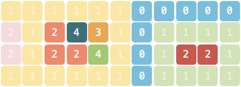

# Leetcode——网格图专题（DFS/BFS/综合应用）

参考链接：[分享丨【题单】网格图（DFS/BFS/综合应用）- 讨论 - 力扣（LeetCode）](https://leetcode.cn/discuss/post/3580195/fen-xiang-gun-ti-dan-wang-ge-tu-dfsbfszo-l3pa/)


# 一、网格图DFS

适用于需要计算连通块个数、大小的题目。部分题目也可以用 BFS 或并查集解决。

## 1.[200. 岛屿数量](https://leetcode.cn/problems/number-of-islands/)

这里就是常规的做法。另一种做法是在把遍历到的grid都改成2（相当于在遍历过的陆地上插一面旗），这样也不需要visited数组了。

```c++
class Solution {
public:
    int dirs[4][2] = {1,0,-1,0,0,1,0,-1};
    int numIslands(vector<vector<char>>& grid) {
        int m = grid.size();
        int n = grid[0].size();
        vector<vector<int>> visited(m, vector<int>(n));
        //lambda表达式可以显式指定返回值为void
        auto dfs = [&](this auto&& dfs, int curX, int curY)->void 
        {
            visited[curX][curY]=1;
            for(int d=0;d<4;d++)
            {
                int nextX = curX + dirs[d][0];
                int nextY = curY + dirs[d][1];
                if(nextX<0 || nextY<0 || nextX>=m || nextY>=n || visited[nextX][nextY] || grid[nextX][nextY]!='1') continue;
                dfs(nextX,nextY);
            }
        };
        int res = 0;
        for(int i=0;i<m;i++)
        {
            for(int j=0;j<n;j++)
            {
                if(grid[i][j]=='1'&&!visited[i][j])
                {
                    dfs(i, j);
                    res++;
                }
            }
        }
        return res;
    }
};
```

有些DFS的题目也会比较方便用并查集来做，这一点会在对应题目处尝试用并查集再做一遍（`感觉并查集更合适于计算联通分量之类的问题`）。


## 2.[695. 岛屿的最大面积](https://leetcode.cn/problems/max-area-of-island/)

> 给你一个大小为 `m x n` 的二进制矩阵 `grid` 。
>
> **岛屿** 是由一些相邻的 `1` (代表土地) 构成的组合，这里的「相邻」要求两个 `1` 必须在 **水平或者竖直的四个方向上** 相邻。你可以假设 `grid` 的四个边缘都被 `0`（代表水）包围着。
>
> 岛屿的面积是岛上值为 `1` 的单元格的数目。
>
> 计算并返回 `grid` 中最大的岛屿面积。如果没有岛屿，则返回面积为 `0` 。

依旧是DFS可以解决问题，在dfs函数的返回值中把cnt返回即可（形参也加一个cnt）。代码如下：

```c++
class Solution {
public:
    int dirs[4][2] = {1,0,-1,0,0,1,0,-1};
    int maxAreaOfIsland(vector<vector<int>>& grid) {
        //同样,允许修改的话直接遍历完把grid改成2
        int m = grid.size();
        int n = grid[0].size();
        int res = 0;
        auto dfs = [&](this auto&& dfs, int x, int y, int cnt)->int
        {
            for(int d=0;d<4;d++)
            {
                int curX = x + dirs[d][0];
                int curY = y + dirs[d][1];
                if(curX<0 || curY<0 || curX>=m || curY>=n || !(grid[curX][curY]==1)) continue;
                grid[curX][curY] = 2;
                cnt++;
                cnt = dfs(curX, curY, cnt);
            }
            return cnt;
        };
        for(int i=0;i<m;i++)
        {
            for(int j=0;j<n;j++)
            {
                if(grid[i][j]==1)
                {
                    grid[i][j] = 2; //入口处手动改一下值
                    int cnt = dfs(i,j,1);
                    if(cnt>res) res=cnt;
                }
            }
        }
        return res;
    }
};
```


## 3.[面试题 16.19. 水域大小](https://leetcode.cn/problems/pond-sizes-lcci/)

> 你有一个用于表示一片土地的整数矩阵`land`，该矩阵中每个点的值代表对应地点的海拔高度。若值为0则表示水域。由垂直、水平或对角连接的水域为池塘。池塘的大小是指相连接的水域的个数。编写一个方法来计算矩阵中所有池塘的大小，返回值需要从小到大排序。
>
> **示例：**
>
> ```
> 输入：
> [
>   [0,2,1,0],
>   [0,1,0,1],
>   [1,1,0,1],
>   [0,1,0,1]
> ]
> 输出： [1,2,4]
> ```
>
> **提示：**
>
> - `0 < len(land) <= 1000`
> - `0 < len(land[i]) <= 1000`

跟前面的题目类似，这次我们还是用`visited`数组来做，比较清晰一些，而且不需要改到原来的数组。同时，DFS也换一种写法，用来巩固对于回溯的理解。

```c++
class Solution {
public:
    //这次有八个方向了
    int dirs[8][2] = {1,0,-1,0,0,1,0,-1,-1,-1,-1,1,1,1,1,-1};
    vector<int> pondSizes(vector<vector<int>>& land) {
        int m = land.size();
        int n = land[0].size();
        vector<int> res;
        vector<vector<int>> visited(m, vector<int>(n));
        auto dfs = [&](this auto&& dfs, int x, int y)->int
        {
            visited[x][y] = 1;
            int area = 1; //area至少是1
            for(int d=0;d<8;d++)
            {
                int curX = x + dirs[d][0];
                int curY = y + dirs[d][1];
                if(curX<0 || curY<0 || curX>=m || curY>=n || visited[curX][curY] || land[curX][curY]!=0)
                    continue;
                area += dfs(curX,curY);
            }
            return area;
        };
        for(int i=0;i<m;i++)
        {
            for(int j=0;j<n;j++)
            {
                if(!visited[i][j] && land[i][j]==0)
                {
                    int cnt = dfs(i,j);
                    res.push_back(cnt);
                }
            }
        }
        sort(res.begin(), res.end());
        return res;
    }
};
```


## ==4.[LCS 03. 主题空间](https://leetcode.cn/problems/YesdPw/)（这题卡了巨久。。很不爽，做不出来，下次再做一遍）==

> 「以扣会友」线下活动所在场地由若干主题空间与走廊组成，场地的地图记作由一维字符串型数组 `grid`，字符串中仅包含 `"0"～"5"` 这 6 个字符。地图上每一个字符代表面积为 1 的区域，其中 `"0"` 表示走廊，其他字符表示主题空间。相同且连续（连续指上、下、左、右四个方向连接）的字符组成同一个主题空间。
>
> 假如整个 `grid` 区域的外侧均为走廊。请问，不与走廊直接相邻的主题空间的最大面积是多少？如果不存在这样的空间请返回 `0`。
>
> **示例 1：**
>
> > 输入：`grid = ["110","231","221"]`
> >
> > 输出：`1`
> >
> > 解释：4 个主题空间中，只有 1 个不与走廊相邻，面积为 1。
> >
> > 
>
> **示例 2：**
>
> > 输入：`grid = ["11111100000","21243101111","21224101221","11111101111"]`
> >
> > 输出：`3`
> >
> > 解释：8 个主题空间中，有 5 个不与走廊相邻，面积分别为 3、1、1、1、2，最大面积为 3。
> >
> > 
>
> **提示：**
>
> - `1 <= grid.length <= 500`
> - `1 <= grid[i].length <= 500`
> - `grid[i][j]` 仅可能为 `"0"～"5"`

这道题目考察的是不在周围一圈（因为认为周围一圈和走廊相邻），且不和0相邻的主题空间的最大面积。一种做法是先把周围一圈和所有0周围四个方向的主题空间全部变成0，然后再找地图中剩下的不是0的主题空间，并统计最大大小即可。

代码如下（各种特判的做法）：
```c++
class Solution {
public:
    int dirs[4][2] = {1,0,-1,0,0,1,0,-1};
    int largestArea(vector<string>& grid) {
        int m = grid.size();
        int n = grid[0].size();
        //遍历过的都改成0,同时统计一下个数
        auto dfs = [&](this auto&& dfs, int x, int y, char thisnum)->int
        {
            grid[x][y] = '6'; //0?
            //visited[x][y]=1;
            int cnt = 1;
            for(int d=0;d<4;d++)
            {
                int curX = x + dirs[d][0];
                int curY = y + dirs[d][1];
                if(curX<0 || curY<0 || curX>=m || curY>=n || grid[curX][curY]=='6') continue;
                if(grid[curX][curY]==thisnum)
                {
                    cnt += dfs(curX, curY, thisnum);
                }
            }
            return cnt;
        };

        //先把周围一圈!=0的刷掉,刷成6
        for(int i=0;i<m;i++)
        {
            for(int j=0;j<n;j++)
            {
                if(i==0 || i==m-1 || j==0 || j==n-1)
                {
                    if(grid[i][j]!='0')
                    {
                       dfs(i,j,grid[i][j]);
                    }
                }
            }
        }
        //刷一遍0
        for(int i=0;i<m;i++)
        {
            for(int j=0;j<n;j++)
            {
               if(grid[i][j]=='0')
                {
                    if(i>0 && grid[i-1][j]!='0') dfs(i-1, j, grid[i-1][j]); //0的不要管，防止000 010 000这种测试用例过不了
                    if(i<m-1 && grid[i+1][j]!='0') dfs(i+1, j, grid[i+1][j]);
                    if(j>0 && grid[i][j-1]!='0') dfs(i, j-1, grid[i][j-1]);
                    if(j<n-1 && grid[i][j+1]!='0') dfs(i, j+1, grid[i][j+1]);
                }      
            }
        }
        int res = 0;
        for(int i=0;i<m;i++)
        {
            for(int j=0;j<n;j++)
            {
                if(grid[i][j]!='6' && grid[i][j]!='0')
                {
                    int c = dfs(i, j, grid[i][j]);
                    res = max(res, c);
                }
            }
        }
        return res;
    }
};
```

另一种做法：

```c++
class Solution {
public:
    int largestArea(vector<string>& grid) {
        int m = grid.size(), n = grid[0].size();
        int maxArea = 0;
        for (int i = 0; i < m; ++i) {
            for (int j = 0; j < n; ++j) {
                if (grid[i][j] >= '1' && grid[i][j] <= '5') { // 确保当前是主题空间
                    int area = dfs(grid, i, j, grid[i][j]);
                    maxArea = max(maxArea, area);
                }
            }
        }
        return maxArea;
    }

    int dfs(vector<string>& grid, int i, int j, char target) {
        // 越界或已访问（标记为#）则返回0；遇到走廊返回-1表示无效区域
        if (i < 0 || i >= grid.size() || j < 0 || j >= grid[0].size()) return -1;
        if (grid[i][j] == '0') return -1; // 相邻走廊，标记无效
        if (grid[i][j] != target) return 0; // 已访问或非当前主题
        
        grid[i][j] = '#'; // 标记为已访问
        int up = dfs(grid, i-1, j, target);
        int down = dfs(grid, i+1, j, target);
        int left = dfs(grid, i, j-1, target);
        int right = dfs(grid, i, j+1, target);
        
        // 若任一方向接触走廊，当前区域无效
        if (up == -1 || down == -1 || left == -1 || right == -1) return -1;
        return up + down + left + right + 1; // 返回总面积
    }
};
```


## 5.[463. 岛屿的周长](https://leetcode.cn/problems/island-perimeter/)

```c++
class Solution {
public:
    int dirs[4][2] = {1,0,-1,0,0,1,0,-1};
    int islandPerimeter(vector<vector<int>>& grid) {
        //一种做法是计算每个格子与周围几个格子相邻,并依此来做统计,这种之前做过,就不再做了.另一种做法是使用DFS的思想
        //遍历到0(水域),或者越界了都会使cnt+=1(其实就是这片岛屿的边界), 遍历过的格子设置为2
        int m = grid.size();
        int n = grid[0].size();
        auto dfs = [&](this auto&& dfs, int x, int y) -> int
        {
            grid[x][y] = 2; //visited
            int cnt = 0; //一开始是0
            for(int d=0;d<4;d++)
            {
                int curX = x + dirs[d][0];
                int curY = y + dirs[d][1];
                if(curX<0 || curX>=m || curY<0 || curY>=n || grid[curX][curY]==0)
                {
                    cnt++;
                    continue;
                }
                if(grid[curX][curY]==1) //是陆地,才去继续dfs
                {
                    cnt += dfs(curX, curY);
                }
            }
            return cnt;
        };
        for(int i=0;i<m;i++)
        {
            for(int j=0;j<n;j++)
            {
                if(grid[i][j]==1)
                {
                    int res = dfs(i, j);
                    return res;
                }
            }
        }
        return 0;
    }
};
```


## 6.[2658. 网格图中鱼的最大数目](https://leetcode.cn/problems/maximum-number-of-fish-in-a-grid/)

似乎就是统计面积最大的岛屿。（当然这里的面积是每一格有鱼的格子的值之和）。代码如下：
```c++
class Solution {
public:
    int dirs[4][2] = {1,0,-1,0,0,1,0,-1};
    int findMaxFish(vector<vector<int>>& grid) {
        int res = 0;
        int m = grid.size();
        int n = grid[0].size();
        auto dfs = [&](this auto&& dfs, int x, int y)->int
        {
            int cnt = grid[x][y];
            grid[x][y] = -1; //访问完了
            for(int d=0;d<4;d++)
            {
                int curX = x + dirs[d][0];
                int curY = y + dirs[d][1];
                if(curX<0 || curX>=m || curY<0 || curY>=n || grid[curX][curY]==0 || grid[curX][curY]==-1) continue;
                //cout<<"ss"<<endl;
                cnt += dfs(curX, curY);
            }   
            return cnt;
        };
        for(int i=0;i<m;i++)
        {
            for(int j=0;j<n;j++)
            {
                if(grid[i][j]>0)
                {
                    int r = dfs(i, j);
                    //cout<<r<<endl;
                    res = max(res, r);
                }
            }
        }
        return res;
    }
};
```


## 7.[1034. 边界着色](https://leetcode.cn/problems/coloring-a-border/)

> 给你一个大小为 `m x n` 的整数矩阵 `grid` ，表示一个网格。另给你三个整数 `row`、`col` 和 `color` 。网格中的每个值表示该位置处的网格块的颜色。
>
> 如果两个方块在任意 4 个方向上相邻，则称它们 **相邻** 。
>
> 如果两个方块具有相同的颜色且相邻，它们则属于同一个 **连通分量** 。
>
> **连通分量的边界** 是指连通分量中满足下述条件之一的所有网格块：
>
> - 在上、下、左、右任意一个方向上与不属于同一连通分量的网格块相邻
> - 在网格的边界上（第一行/列或最后一行/列）
>
> 请你使用指定颜色 `color` 为所有包含网格块 `grid[row][col]` 的 **连通分量的边界** 进行着色。
>
> 并返回最终的网格 `grid` 。
>
>  
>
> **示例 1：**
>
> ```
> 输入：grid = [[1,1],[1,2]], row = 0, col = 0, color = 3
> 输出：[[3,3],[3,2]]
> ```
>
> **示例 2：**
>
> ```
> 输入：grid = [[1,2,2],[2,3,2]], row = 0, col = 1, color = 3
> 输出：[[1,3,3],[2,3,3]]
> ```
>
> **示例 3：**
>
> ```
> 输入：grid = [[1,1,1],[1,1,1],[1,1,1]], row = 1, col = 1, color = 2
> 输出：[[2,2,2],[2,1,2],[2,2,2]]
> ```
>
>  
>
> **提示：**
>
> - `m == grid.length`
> - `n == grid[i].length`
> - `1 <= m, n <= 50`
> - `1 <= grid[i][j], color <= 1000`
> - `0 <= row < m`
> - `0 <= col < n`

跟之前的题目类似，可以把所有的边界都置为-1，然后再下一次遍历的时候复制为color（类似于下面的写法）：

```c++
class Solution {
public:
    int dirs[4][2] = {1,0,-1,0,0,1,0,-1};
    vector<vector<int>> colorBorder(vector<vector<int>>& grid, int row, int col, int color) {
        //以防各种问题出现,第一遍先把符合要求的格子都变成-1,然后再把所有-1变成color
        int m = grid.size();
        int n = grid[0].size();
        vector<vector<int>> visited(m, vector<int>(n));
        //要是target才算
        auto dfs = [&](this auto&& dfs, int x, int y, int target)->void
        {
            visited[x][y] = 1;
            int cnt = 0; //看是否有邻接的值
            for(int d=0;d<4;d++)
            {
                int curX = x + dirs[d][0];
                int curY = y + dirs[d][1];
                //边界或者其他不为target的值
                if(curX<0 || curX>=m || curY<0 || curY>=n || (grid[curX][curY]!=target&&grid[curX][curY]!=-1)) //注意,还要!=-1,否则会判断-1是其他的连通分量,造成错误
                {
                    grid[x][y]=-1;
                    continue;
                }
                if(grid[curX][curY]==target && !visited[curX][curY])
                {
                    dfs(curX, curY, target);
                }
            }
        };
        dfs(row, col, grid[row][col]);
        //把-1的都改成color
        for(int i=0;i<m;i++)
        {
            for(int j=0;j<n;j++)
            {
                //cout<<grid[i][j]<<" ";
                if(grid[i][j]==-1)
                    grid[i][j] = color;
            }
        }
        return grid;
    }
};
```

也可以把找到的边界存在一个数组当中，对其进行统一的赋值，这种方式可能会更容易写一些，而且也更不容易出现问题。

```c++
class Solution {
public:
    int dirs[4][2] = {1,0,-1,0,0,1,0,-1};
    vector<vector<int>> colorBorder(vector<vector<int>>& grid, int row, int col, int color) {
        //以防各种问题出现,第一遍先把符合要求的格子都变成-1,然后再把所有-1变成color
        int m = grid.size();
        int n = grid[0].size();
        vector<vector<int>> visited(m, vector<int>(n));
        vector<pair<int, int>> pi;
        //要是target才算
        auto dfs = [&](this auto&& dfs, int x, int y, int target)->void
        {
            visited[x][y] = 1;
            int cnt = 0; //看是否有邻接的值
            for(int d=0;d<4;d++)
            {
                int curX = x + dirs[d][0];
                int curY = y + dirs[d][1];
                //边界或者其他不为target的值
                if(curX<0 || curX>=m || curY<0 || curY>=n || (grid[curX][curY]!=target&&!visited[curX][curY])) 
                {
                    pi.push_back({x, y}); //找到边界（需要被染色的位置），！visited是为了防止在vector中重复push一样的元素
                    continue;
                }
                if(grid[curX][curY]==target && !visited[curX][curY])
                {
                    dfs(curX, curY, target);
                }
            }
        };
        dfs(row, col, grid[row][col]);
        //把-1的都改成color
        for(auto& [xx, yy]: pi)
            grid[xx][yy] = color;
        return grid;
    }
};
```

