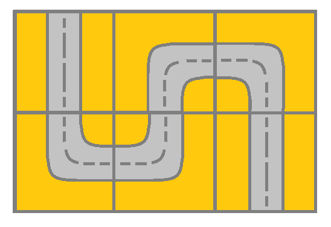
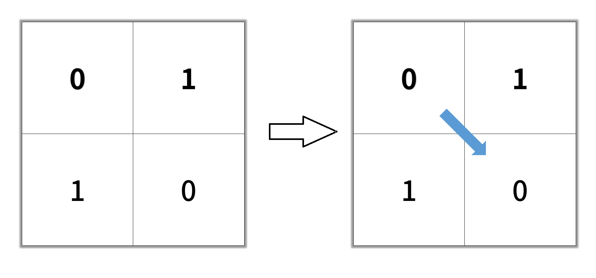

# Leetcode——网格图专题（DFS/BFS/综合应用）

参考链接：[分享丨【题单】网格图（DFS/BFS/综合应用）- 讨论 - 力扣（LeetCode）](https://leetcode.cn/discuss/post/3580195/fen-xiang-gun-ti-dan-wang-ge-tu-dfsbfszo-l3pa/)


# 一、网格图DFS

适用于需要计算连通块个数、大小的题目。部分题目也可以用 BFS 或并查集解决。

### 1.[200. 岛屿数量](https://leetcode.cn/problems/number-of-islands/)(板子题)

这里就是常规的做法。另一种做法是在把遍历到的grid都改成2（相当于在遍历过的陆地上插一面旗），这样也不需要visited数组了。

```c++
class Solution {
public:
    int dirs[4][2] = {1,0,-1,0,0,1,0,-1};
    int numIslands(vector<vector<char>>& grid) {
        int m = grid.size();
        int n = grid[0].size();
        vector<vector<int>> visited(m, vector<int>(n));
        //lambda表达式可以显式指定返回值为void
        auto dfs = [&](this auto&& dfs, int curX, int curY)->void 
        {
            visited[curX][curY]=1;
            for(int d=0;d<4;d++)
            {
                int nextX = curX + dirs[d][0];
                int nextY = curY + dirs[d][1];
                if(nextX<0 || nextY<0 || nextX>=m || nextY>=n || visited[nextX][nextY] || grid[nextX][nextY]!='1') continue;
                dfs(nextX,nextY);
            }
        };
        int res = 0;
        for(int i=0;i<m;i++)
        {
            for(int j=0;j<n;j++)
            {
                if(grid[i][j]=='1'&&!visited[i][j])
                {
                    dfs(i, j);
                    res++;
                }
            }
        }
        return res;
    }
};
```

有些DFS的题目也会比较方便用并查集来做，这一点会在对应题目处尝试用并查集再做一遍（`感觉并查集更合适于计算联通分量之类的问题`）。

改为‘2’的做法：

```C++
class Solution {
public:
    int dirs[4][2] = {{0,1},{0,-1},{1,0},{-1,0}};
    void dfs(vector<vector<char>>& grid,int x,int y)
    {
        if(grid[x][y]=='2')return;
        grid[x][y] = '2';
        for(int i=0;i<4;i++)
        {
            int newX= x+dirs[i][0];
            int newY = y+dirs[i][1];
            if(newX<0||newY<0||newX>=grid.size()||newY>=grid[0].size()||grid[newX][newY]=='0'||grid[newX][newY]=='2')continue;
            dfs(grid,newX,newY);
        }
    }
    int numIslands(vector<vector<char>>& grid) {
        int m =grid.size();
        int n = grid[0].size();
        int res=0;
        for(int i=0;i<m;i++)
        {
            for(int j=0;j<n;j++)
            {
                if(grid[i][j]=='1')
                {
                    dfs(grid,i,j);
                    res++;
                }
            }
        }
        return res;
    }
};
```


### 2.[695. 岛屿的最大面积](https://leetcode.cn/problems/max-area-of-island/)

> 给你一个大小为 `m x n` 的二进制矩阵 `grid` 。
>
> **岛屿** 是由一些相邻的 `1` (代表土地) 构成的组合，这里的「相邻」要求两个 `1` 必须在 **水平或者竖直的四个方向上** 相邻。你可以假设 `grid` 的四个边缘都被 `0`（代表水）包围着。
>
> 岛屿的面积是岛上值为 `1` 的单元格的数目。
>
> 计算并返回 `grid` 中最大的岛屿面积。如果没有岛屿，则返回面积为 `0` 。

依旧是DFS可以解决问题，在dfs函数的返回值中把cnt返回即可（形参也加一个cnt）。代码如下：

```c++
class Solution {
public:
    int dirs[4][2] = {1,0,-1,0,0,1,0,-1};
    int maxAreaOfIsland(vector<vector<int>>& grid) {
        //同样,允许修改的话直接遍历完把grid改成2
        int m = grid.size();
        int n = grid[0].size();
        int res = 0;
        auto dfs = [&](this auto&& dfs, int x, int y)->int
        {
            grid[x][y] = 2;
            int cnt = 1;
            for(int d=0;d<4;d++)
            {
                int curX = x + dirs[d][0];
                int curY = y + dirs[d][1];
                if(curX<0 || curY<0 || curX>=m || curY>=n || (grid[curX][curY]!=1)) continue;
                cnt += dfs(curX, curY);
            }
            return cnt;
        };
        for(int i=0;i<m;i++)
        {
            for(int j=0;j<n;j++)
            {
                if(grid[i][j]==1)
                {
                    int cnt = dfs(i,j);
                    if(cnt>res) res=cnt;
                }
            }
        }
        return res;
    }
};
```


### 3.[面试题 16.19. 水域大小](https://leetcode.cn/problems/pond-sizes-lcci/)

> 你有一个用于表示一片土地的整数矩阵`land`，该矩阵中每个点的值代表对应地点的海拔高度。若值为0则表示水域。由垂直、水平或对角连接的水域为池塘。池塘的大小是指相连接的水域的个数。编写一个方法来计算矩阵中所有池塘的大小，返回值需要从小到大排序。
>
> **示例：**
>
> ```
> 输入：
> [
>   [0,2,1,0],
>   [0,1,0,1],
>   [1,1,0,1],
>   [0,1,0,1]
> ]
> 输出： [1,2,4]
> ```
>
> **提示：**
>
> - `0 < len(land) <= 1000`
> - `0 < len(land[i]) <= 1000`

跟前面的题目类似，这次我们还是用`visited`数组来做，比较清晰一些，而且不需要改到原来的数组。同时，DFS也换一种写法，用来巩固对于回溯的理解。

```c++
class Solution {
public:
    //这次有八个方向了
    int dirs[8][2] = {1,0,-1,0,0,1,0,-1,-1,-1,-1,1,1,1,1,-1};
    vector<int> pondSizes(vector<vector<int>>& land) {
        int m = land.size();
        int n = land[0].size();
        vector<int> res;
        vector<vector<int>> visited(m, vector<int>(n));
        auto dfs = [&](this auto&& dfs, int x, int y)->int
        {
            visited[x][y] = 1;
            int area = 1; //area至少是1
            for(int d=0;d<8;d++)
            {
                int curX = x + dirs[d][0];
                int curY = y + dirs[d][1];
                if(curX<0 || curY<0 || curX>=m || curY>=n || visited[curX][curY] || land[curX][curY]!=0)
                    continue;
                area += dfs(curX,curY);
            }
            return area;
        };
        for(int i=0;i<m;i++)
        {
            for(int j=0;j<n;j++)
            {
                if(!visited[i][j] && land[i][j]==0)
                {
                    int cnt = dfs(i,j);
                    res.push_back(cnt);
                }
            }
        }
        sort(res.begin(), res.end());
        return res;
    }
};
```


### ==4.[LCS 03. 主题空间](https://leetcode.cn/problems/YesdPw/)（这题卡了巨久。。很不爽，做不出来，下次再做一遍）==

> 「以扣会友」线下活动所在场地由若干主题空间与走廊组成，场地的地图记作由一维字符串型数组 `grid`，字符串中仅包含 `"0"～"5"` 这 6 个字符。地图上每一个字符代表面积为 1 的区域，其中 `"0"` 表示走廊，其他字符表示主题空间。相同且连续（连续指上、下、左、右四个方向连接）的字符组成同一个主题空间。
>
> 假如整个 `grid` 区域的外侧均为走廊。请问，不与走廊直接相邻的主题空间的最大面积是多少？如果不存在这样的空间请返回 `0`。
>
> **示例 1：**
>
> > 输入：`grid = ["110","231","221"]`
> >
> > 输出：`1`
> >
> > 解释：4 个主题空间中，只有 1 个不与走廊相邻，面积为 1。
> >
> > 
>
> **示例 2：**
>
> > 输入：`grid = ["11111100000","21243101111","21224101221","11111101111"]`
> >
> > 输出：`3`
> >
> > 解释：8 个主题空间中，有 5 个不与走廊相邻，面积分别为 3、1、1、1、2，最大面积为 3。
> >
> > 
>
> **提示：**
>
> - `1 <= grid.length <= 500`
> - `1 <= grid[i].length <= 500`
> - `grid[i][j]` 仅可能为 `"0"～"5"`

这道题目考察的是不在周围一圈（因为认为周围一圈和走廊相邻），且不和0相邻的主题空间的最大面积。一种做法是先把周围一圈和所有0周围四个方向的主题空间全部变成0，然后再找地图中剩下的不是0的主题空间，并统计最大大小即可。

代码如下（各种特判的做法）：
```c++
class Solution {
public:
    int dirs[4][2] = {1,0,-1,0,0,1,0,-1};
    int largestArea(vector<string>& grid) {
        int m = grid.size();
        int n = grid[0].size();
        //遍历过的都改成0,同时统计一下个数
        auto dfs = [&](this auto&& dfs, int x, int y, char thisnum)->int
        {
            grid[x][y] = '6'; //0?
            //visited[x][y]=1;
            int cnt = 1;
            for(int d=0;d<4;d++)
            {
                int curX = x + dirs[d][0];
                int curY = y + dirs[d][1];
                if(curX<0 || curY<0 || curX>=m || curY>=n || grid[curX][curY]=='6') continue;
                if(grid[curX][curY]==thisnum)
                {
                    cnt += dfs(curX, curY, thisnum);
                }
            }
            return cnt;
        };

        //先把周围一圈!=0的刷掉,刷成6
        for(int i=0;i<m;i++)
        {
            for(int j=0;j<n;j++)
            {
                if(i==0 || i==m-1 || j==0 || j==n-1)
                {
                    if(grid[i][j]!='0')
                    {
                       dfs(i,j,grid[i][j]);
                    }
                }
            }
        }
        //刷一遍0 0旁边的非0空间被dfs刷成6
        for(int i=0;i<m;i++)
        {
            for(int j=0;j<n;j++)
            {
               if(grid[i][j]=='0')
                {
                    if(i>0 && grid[i-1][j]!='0') dfs(i-1, j, grid[i-1][j]); //0的不要管，防止000 010 000这种测试用例过不了
                    if(i<m-1 && grid[i+1][j]!='0') dfs(i+1, j, grid[i+1][j]);
                    if(j>0 && grid[i][j-1]!='0') dfs(i, j-1, grid[i][j-1]);
                    if(j<n-1 && grid[i][j+1]!='0') dfs(i, j+1, grid[i][j+1]);
                }      
            }
        }
        int res = 0;
        for(int i=0;i<m;i++)
        {
            for(int j=0;j<n;j++)
            {
                if(grid[i][j]!='6' && grid[i][j]!='0')
                {
                    int c = dfs(i, j, grid[i][j]);
                    res = max(res, c);
                }
            }
        }
        return res;
    }
};
```

另一种做法：

```c++
class Solution {
public:
    int largestArea(vector<string>& grid) {
        int m = grid.size(), n = grid[0].size();
        int maxArea = 0;
        for (int i = 0; i < m; ++i) {
            for (int j = 0; j < n; ++j) {
                if (grid[i][j] >= '1' && grid[i][j] <= '5') { // 确保当前是主题空间
                    int area = dfs(grid, i, j, grid[i][j]);
                    maxArea = max(maxArea, area);
                }
            }
        }
        return maxArea;
    }

    int dfs(vector<string>& grid, int i, int j, char target) {
        // 越界或已访问（标记为#）则返回0；遇到走廊返回-1表示无效区域
        if (i < 0 || i >= grid.size() || j < 0 || j >= grid[0].size()) return -1;
        if (grid[i][j] == '0') return -1; // 相邻走廊，标记无效
        if (grid[i][j] != target) return 0; // 已访问或非当前主题
        
        grid[i][j] = '#'; // 标记为已访问
        int up = dfs(grid, i-1, j, target);
        int down = dfs(grid, i+1, j, target);
        int left = dfs(grid, i, j-1, target);
        int right = dfs(grid, i, j+1, target);
        
        // 若任一方向接触走廊，当前区域无效
        if (up == -1 || down == -1 || left == -1 || right == -1) return -1;
        return up + down + left + right + 1; // 返回总面积
    }
};
```
Y

```C++
class Solution {
public:
    int dirs[4][2] = {-1,0, 1,0,0,-1,0,1};
    int largestArea(vector<string>& grid) {
        int m = grid.size(),n = grid[0].size();
        vector<vector<int>> visited(m,vector<int>(n,0));
        
        //所有节点，非0的，没遍历过的 遍历 visited。如果碰到边界/走廊 return-1 否则返回面积
        auto dfs = [&](this auto &&dfs,int x,int y,int target)->int
        {
            visited[x][y] = 1;
            int cnt=1;
            int area[4]={0};
            for(int i=0;i<4;i++)
            {
                int curX = x+dirs[i][0];
                int curY = y+dirs[i][1];
                if(curX<0||curY<0||curX>=m||curY>=n||grid[curX][curY]=='0')
                {
                    area[i]=-1; //不可以直接return -1！！会导致后续节点未被访问和标记。
                }
                else 
                {
                    if(visited[curX][curY]==1||grid[curX][curY]!=target)continue;
                    area[i] = dfs(curX,curY,target);  
                }
            }
            for(int i=0;i<4;i++)
            {
                if(area[i]==-1)return -1;
                else cnt+=area[i];
            }
            return cnt;
        };

        int maxArea = 0;
        for(int i=0;i<m;i++)
        {
            for(int j=0;j<n;j++)
            {
                if(grid[i][j]!='0'&&visited[i][j]==0)
                {
                    int area =  dfs(i,j,grid[i][j]);
                    maxArea = max(maxArea,area);
                }
            }
        }
        return maxArea;
    }
};
```

>` area[i]=-1; //不可以直接return -1！！会导致后续节点未被访问和标记。` ❌原因：
>
>**DFS提前终止导致未完全标记访问**：当DFS遇到走廊或边界时立即返回-1，导致后续节点未被访问和标记。这些未被标记的节点可能在后续循环中被误判为新区域，从而错误计算面积


### 5.[463. 岛屿的周长](https://leetcode.cn/problems/island-perimeter/)

```c++
class Solution {
public:
    int dirs[4][2] = {1,0,-1,0,0,1,0,-1};
    int islandPerimeter(vector<vector<int>>& grid) {
        //一种做法是计算每个格子与周围几个格子相邻,并依此来做统计,这种之前做过,就不再做了.另一种做法是使用DFS的思想
        //遍历到0(水域),或者越界了都会使cnt+=1(其实就是这片岛屿的边界), 遍历过的格子设置为2
        int m = grid.size();
        int n = grid[0].size();
        auto dfs = [&](this auto&& dfs, int x, int y) -> int
        {
            grid[x][y] = 2; //visited
            int cnt = 0; //一开始是0
            for(int d=0;d<4;d++)
            {
                int curX = x + dirs[d][0];
                int curY = y + dirs[d][1];
                if(curX<0 || curX>=m || curY<0 || curY>=n || grid[curX][curY]==0)
                {
                    cnt++;
                    continue;
                }
                if(grid[curX][curY]==1) //是陆地,才去继续dfs
                {
                    cnt += dfs(curX, curY);
                }
            }
            return cnt;
        };
        for(int i=0;i<m;i++)
        {
            for(int j=0;j<n;j++)
            {
                if(grid[i][j]==1)
                {
                    int res = dfs(i, j);
                    return res;
                }
            }
        }
        return 0;
    }
};
```


### 6.[2658. 网格图中鱼的最大数目](https://leetcode.cn/problems/maximum-number-of-fish-in-a-grid/)

似乎就是统计面积最大的岛屿。（当然这里的面积是每一格有鱼的格子的值之和）。代码如下：
```c++
class Solution {
public:
    int dirs[4][2] = {1,0,-1,0,0,1,0,-1};
    int findMaxFish(vector<vector<int>>& grid) {
        int res = 0;
        int m = grid.size();
        int n = grid[0].size();
        auto dfs = [&](this auto&& dfs, int x, int y)->int
        {
            int cnt = grid[x][y];
            grid[x][y] = -1; //访问完了
            for(int d=0;d<4;d++)
            {
                int curX = x + dirs[d][0];
                int curY = y + dirs[d][1];
                if(curX<0 || curX>=m || curY<0 || curY>=n || grid[curX][curY]==0 || grid[curX][curY]==-1) continue;
                //cout<<"ss"<<endl;
                cnt += dfs(curX, curY);
            }   
            return cnt;
        };
        for(int i=0;i<m;i++)
        {
            for(int j=0;j<n;j++)
            {
                if(grid[i][j]>0)
                {
                    int r = dfs(i, j);
                    //cout<<r<<endl;
                    res = max(res, r);
                }
            }
        }
        return res;
    }
};
```


### 7.[1034. 边界着色](https://leetcode.cn/problems/coloring-a-border/)

> 给你一个大小为 `m x n` 的整数矩阵 `grid` ，表示一个网格。另给你三个整数 `row`、`col` 和 `color` 。网格中的每个值表示该位置处的网格块的颜色。
>
> 如果两个方块在任意 4 个方向上相邻，则称它们 **相邻** 。
>
> 如果两个方块具有相同的颜色且相邻，它们则属于同一个 **连通分量** 。
>
> **连通分量的边界** 是指连通分量中满足下述条件之一的所有网格块：
>
> - 在上、下、左、右任意一个方向上与不属于同一连通分量的网格块相邻
> - 在网格的边界上（第一行/列或最后一行/列）
>
> 请你使用指定颜色 `color` 为所有包含网格块 `grid[row][col]` 的 **连通分量的边界** 进行着色。
>
> 并返回最终的网格 `grid` 。
>
>  
>
> **示例 1：**
>
> ```
> 输入：grid = [[1,1],[1,2]], row = 0, col = 0, color = 3
> 输出：[[3,3],[3,2]]
> ```
>
> **示例 2：**
>
> ```
> 输入：grid = [[1,2,2],[2,3,2]], row = 0, col = 1, color = 3
> 输出：[[1,3,3],[2,3,3]]
> ```
>
> **示例 3：**
>
> ```
> 输入：grid = [[1,1,1],[1,1,1],[1,1,1]], row = 1, col = 1, color = 2
> 输出：[[2,2,2],[2,1,2],[2,2,2]]
> ```
>
>  
>
> **提示：**
>
> - `m == grid.length`
> - `n == grid[i].length`
> - `1 <= m, n <= 50`
> - `1 <= grid[i][j], color <= 1000`
> - `0 <= row < m`
> - `0 <= col < n`

跟之前的题目类似，可以把所有的边界都置为-1，然后再下一次遍历的时候复制为color（类似于下面的写法）：

```c++
class Solution {
public:
    int dirs[4][2] = {1,0,-1,0,0,1,0,-1};
    vector<vector<int>> colorBorder(vector<vector<int>>& grid, int row, int col, int color) {
        //以防各种问题出现,第一遍先把符合要求的格子都变成-1,然后再把所有-1变成color
        int m = grid.size();
        int n = grid[0].size();
        vector<vector<int>> visited(m, vector<int>(n));
        //要是target才算
        auto dfs = [&](this auto&& dfs, int x, int y, int target)->void
        {
            visited[x][y] = 1;
            int cnt = 0; //看是否有邻接的值
            for(int d=0;d<4;d++)
            {
                int curX = x + dirs[d][0];
                int curY = y + dirs[d][1];
                //边界或者其他不为target的值
                if(curX<0 || curX>=m || curY<0 || curY>=n || (grid[curX][curY]!=target&&grid[curX][curY]!=-1)) //注意,还要!=-1,否则会判断-1是其他的连通分量,造成错误
                {
                    grid[x][y]=-1;
                    continue;
                }
                if(grid[curX][curY]==target && !visited[curX][curY])
                {
                    dfs(curX, curY, target);
                }
            }
        };
        dfs(row, col, grid[row][col]);
        //把-1的都改成color
        for(int i=0;i<m;i++)
        {
            for(int j=0;j<n;j++)
            {
                //cout<<grid[i][j]<<" ";
                if(grid[i][j]==-1)
                    grid[i][j] = color;
            }
        }
        return grid;
    }
};
```

也可以把找到的边界存在一个数组当中，对其进行统一的赋值，这种方式可能会更容易写一些，而且也更不容易出现问题。

Y

```C++
class Solution {
public:
    vector<vector<int>> colorBorder(vector<vector<int>>& grid, int row, int col, int color) 
    {
        int dirs[4][2] = {{1,0},{-1,0},{0,1},{0,-1}};
        vector<pair<int,int>> shouldColor;
        int m = grid.size();
        int n = grid[0].size();
        vector<vector<int>> visited(m,vector<int>(n,0));
        auto dfs = [&](this auto&& dfs, int x,int y,int target)->void
        { 
            visited[x][y] = 1;
            bool isBorder=false;
            for(int i=0;i<4;i++)
            {
                int curX = x+dirs[i][0];
                int curY = y+dirs[i][1];
                
                if(curX<0||curY<0||curX>=m||curY>=n||grid[curX][curY]!=target)
                {
                    isBorder = true;
                    continue;
                }
                if(!visited[curX][curY])dfs(curX,curY,target);
                
            }
            if(isBorder)shouldColor.emplace_back(x,y);//是xy而  不是❌col row
        };
        dfs(row,col,grid[row][col]);
        for(auto &[f,s] : shouldColor)
        {
            grid[f][s] = color;
        }
        return grid;
    }
};
```

H

```c++
class Solution {
public:
    int dirs[4][2] = {1,0,-1,0,0,1,0,-1};
    vector<vector<int>> colorBorder(vector<vector<int>>& grid, int row, int col, int color) {
        //以防各种问题出现,第一遍先把符合要求的格子都变成-1,然后再把所有-1变成color
        int m = grid.size();
        int n = grid[0].size();
        vector<vector<int>> visited(m, vector<int>(n));
        vector<pair<int, int>> pi;
        //要是target才算
        auto dfs = [&](this auto&& dfs, int x, int y, int target)->void
        {
            visited[x][y] = 1;
            int cnt = 0; //看是否有邻接的值
            for(int d=0;d<4;d++)
            {
                int curX = x + dirs[d][0];
                int curY = y + dirs[d][1];
                //边界或者其他不为target的值
                if(curX<0 || curX>=m || curY<0 || curY>=n || (grid[curX][curY]!=target&&!visited[curX][curY])) 
                {
                    pi.push_back({x, y}); //找到边界（需要被染色的位置），！visited是为了防止在vector中重复push一样的元素
                    continue;
                }
                if(grid[curX][curY]==target && !visited[curX][curY])
                {
                    dfs(curX, curY, target);
                }
            }
        };
        dfs(row, col, grid[row][col]);
        //把-1的都改成color
        for(auto& [xx, yy]: pi)
            grid[xx][yy] = color;
        return grid;
    }
};
```


### 8. [1020. 飞地的数量](https://leetcode.cn/problems/number-of-enclaves/)

给你一个大小为 `m x n` 的二进制矩阵 `grid` ，其中 `0` 表示一个海洋单元格、`1` 表示一个陆地单元格。

一次 **移动** 是指从一个陆地单元格走到另一个相邻（**上、下、左、右**）的陆地单元格或跨过 `grid` 的边界。

返回网格中 **无法** 在任意次数的移动中离开网格边界的陆地单元格的数量。

**示例 1：**


```
输入：grid = [[0,0,0,0],[1,0,1,0],[0,1,1,0],[0,0,0,0]]
输出：3
解释：有三个 1 被 0 包围。一个 1 没有被包围，因为它在边界上。
```


我们可以从网格**边界**上的每个陆地单元格开始深度优先搜索，遍历完边界之后，所有和网格边界相连的陆地单元格就都被访问过了。

然后遍历整个网格，如果网格中的一个陆地单元格没有被访问过，则该陆地单元格不和网格的边界相连，是飞地。

```C++
class Solution {
public:
    int numEnclaves(vector<vector<int>>& grid) {
        //从边缘出发，如果能接触到 置为2 最后为1的就是不可以出去的
        int dirs[4][2] = {{0,1},{0,-1},{1,0},{-1,0}};
        int m = grid.size(),n = grid[0].size();
        auto dfs = [&](this auto&& dfs,int x,int y)
        {
            if(grid[x][y]!=1)return;
            grid[x][y] = 2;
            for(int i=0;i<4;i++)
            {
                int curX = x+dirs[i][0];
                int curY = y+dirs[i][1];
                if(curX<0||curY<0||curX>=m||curY>=n||grid[curX][curY]!=1)continue;
                dfs(curX,curY);
            }
        };
        for(int i=0;i<m;i++)
        {
            dfs(i,0);
            dfs(i,n-1);
        }
        for(int j=0;j<n;j++)
        {
            dfs(0,j);
            dfs(m-1,j);
        }
        int cnt=0;
        for(int i=0;i<m;i++)
        {
            for(int j=0;j<n;j++)
            {
                if(grid[i][j]==1)cnt++;
            }
        }
        return cnt;
    }
};
```


### [2684. 矩阵中移动的最大次数](https://leetcode.cn/problems/maximum-number-of-moves-in-a-grid/)

这题用dp做过,有空用dfs实现下


### [1254. 统计封闭岛屿的数目](https://leetcode.cn/problems/number-of-closed-islands/)

二维矩阵 `grid` 由 `0` （土地）和 `1` （水）组成。岛是由最大的4个方向连通的 `0` 组成的群，封闭岛是一个 `完全` 由1包围（左、上、右、下）的岛。

请返回 *封闭岛屿* 的数目。

**示例 1：**


```
输入：grid = [[1,1,1,1,1,1,1,0],[1,0,0,0,0,1,1,0],[1,0,1,0,1,1,1,0],[1,0,0,0,0,1,0,1],[1,1,1,1,1,1,1,0]]
输出：2
解释：
灰色区域的岛屿是封闭岛屿，因为这座岛屿完全被水域包围（即被 1 区域包围）。
```
这题也可以用并查集 ,bfs做

这题dfs思路与上面那题一样,先遍历边界格子

```C++
class Solution {
public:
    int closedIsland(vector<vector<int>>& grid) {
        //周围从0可联通的 必然不是封闭岛 ->2
        //再次遍历 为0 cnt++ 置为2
        int dirs[4][2] = {{0,1},{0,-1},{1,0},{-1,0}};
        int m = grid.size();
        int n = grid[0].size();
        auto dfs = [&](this auto&& dfs,int x,int y)
        {
            if(grid[x][y]!=0)return;//退出递归条件
            grid[x][y] = 2;//更改
            for(int i=0;i<4;i++)//遍历上下左右 并递归
            {
                int curX = x+dirs[i][0];
                int curY = y+dirs[i][1];
                if(curX<0||curY<0||curX>=m||curY>=n||grid[curX][curY]!=0)continue;
                dfs(curX,curY);
            }
        };
        for(int i=0;i<m;i++)
        {
            dfs(i,0);
            dfs(i,n-1);
        }
        for(int j=0;j<n;j++)
        {
            dfs(0,j);
            dfs(m-1,j);
        }
        int cnt=0;
        for(int i=0;i<m;i++)
        {
            for(int j=0;j<n;j++)
            {
                if(grid[i][j]==0)
                {
                    cnt++;
                    dfs(i,j);
                }
            }
        }
        return cnt;
    }
};
```


### [130. 被围绕的区域](https://leetcode.cn/problems/surrounded-regions/)(注意本题有比较巧的写法)

给你一个 `m x n` 的矩阵 `board` ，由若干字符 `'X'` 和 `'O'` 组成，**捕获** 所有 **被围绕的区域**：

- **连接：**一个单元格与水平或垂直方向上相邻的单元格连接。
- **区域：连接所有** `'O'` 的单元格来形成一个区域。
- **围绕：**如果您可以用 `'X'` 单元格 **连接这个区域**，并且区域中没有任何单元格位于 `board` 边缘，则该区域被 `'X'` 单元格围绕。

通过 **原地** 将输入矩阵中的所有 `'O'` 替换为 `'X'` 来 **捕获被围绕的区域**。你不需要返回任何值。

**示例 1：**

**输入：**board = [["X","X","X","X"],["X","O","O","X"],["X","X","O","X"],["X","O","X","X"]]

**输出：**[["X","X","X","X"],["X","X","X","X"],["X","X","X","X"],["X","O","X","X"]]

**解释：**


在上图中，底部的区域没有被捕获，因为它在 board 的边缘并且不能被围绕。


类似上面的几个题

有空可以复习做

可以通过的做法有很多,比较好的做法是: 边界dfs, 置为'A', 然后遍历所有格子, 对于'A'变回'O'(与边界相连的格子)  , 而'O'变为'X' 

https://leetcode.cn/problems/surrounded-regions/solutions/369110/bei-wei-rao-de-qu-yu-by-leetcode-solution/


### [1905. 统计子岛屿](https://leetcode.cn/problems/count-sub-islands/)

给你两个 `m x n` 的二进制矩阵 `grid1` 和 `grid2` ，它们只包含 `0` （表示水域）和 `1` （表示陆地）。一个 **岛屿** 是由 **四个方向** （水平或者竖直）上相邻的 `1` 组成的区域。任何矩阵以外的区域都视为水域。

如果 `grid2` 的一个岛屿，被 `grid1` 的一个岛屿 **完全** 包含，也就是说 `grid2` 中该岛屿的每一个格子都被 `grid1` 中同一个岛屿完全包含，那么我们称 `grid2` 中的这个岛屿为 **子岛屿** 。

请你返回 `grid2` 中 **子岛屿** 的 **数目** 。

**示例 1：**


```
输入：grid1 = [[1,1,1,0,0],[0,1,1,1,1],[0,0,0,0,0],[1,0,0,0,0],[1,1,0,1,1]], grid2 = [[1,1,1,0,0],[0,0,1,1,1],[0,1,0,0,0],[1,0,1,1,0],[0,1,0,1,0]]
输出：3
解释：如上图所示，左边为 grid1 ，右边为 grid2 。
grid2 中标红的 1 区域是子岛屿，总共有 3 个子岛屿。
```
代码:

```C++
class Solution {
public:
    int countSubIslands(vector<vector<int>>& grid1, vector<vector<int>>& grid2) {
        //grid2 中岛屿 全部对应grid1的1  被完全包含 遍历过则置为2。如果是子岛屿，cnt++
        int dirs[4][2] = {{0,1},{0,-1},{1,0},{-1,0}};
        int m = grid1.size();
        int n = grid1[0].size();
        auto dfs = [&]( this auto&& dfs,int x,int y)->bool
        {
            bool isChild=false;
            if(grid2[x][y]!=1)return true;
            grid2[x][y]=2;
            if(grid1[x][y]==1)isChild = true;
            for(int i=0;i<4;i++)
            {
                int curX = x+dirs[i][0];
                int curY = y+dirs[i][1];
                if(curX<0||curY<0||curX>=m||curY>=n||grid2[curX][curY]!=1)continue;
                bool isC = dfs(curX,curY);
                if(isC==false)isChild = false;
            }
            return isChild;
        };
        int cnt=0;
        for(int i=0;i<m;i++)
        {
            for(int j=0;j<n;j++)
            {
                if(grid2[i][j]==1)
                {
                    if(dfs(i,j)==true)cnt++;
                }
            }
        }
        return cnt;
    }
};
```


### [1391. 检查网格中是否存在有效路径](https://leetcode.cn/problems/check-if-there-is-a-valid-path-in-a-grid/)(很难!极易做错!)

给你一个 *m* x *n* 的网格 `grid`。网格里的每个单元都代表一条街道。`grid[i][j]` 的街道可以是：

- **1** 表示连接左单元格和右单元格的街道。
- **2** 表示连接上单元格和下单元格的街道。
- **3** 表示连接左单元格和下单元格的街道。
- **4** 表示连接右单元格和下单元格的街道。
- **5** 表示连接左单元格和上单元格的街道。
- **6** 表示连接右单元格和上单元格的街道。


你最开始从左上角的单元格 `(0,0)` 开始出发，网格中的「有效路径」是指从左上方的单元格 `(0,0)` 开始、一直到右下方的 `(m-1,n-1)` 结束的路径。**该路径必须只沿着街道走**。

**注意：**你 **不能** 变更街道。

如果网格中存在有效的路径，则返回 `true`，否则返回 `false` 。

 

**示例 1：**



```
输入：grid = [[2,4,3],[6,5,2]]
输出：true
解释：如图所示，你可以从 (0, 0) 开始，访问网格中的所有单元格并到达 (m - 1, n - 1) 。
```
代码：

https://leetcode.cn/problems/check-if-there-is-a-valid-path-in-a-grid/solutions/163822/cdfsjie-fa-rong-yi-li-jie-dai-ma-duan-zhu-shi-duo-/

```C++
class Solution {
public:
//       -1,0
//  0,-1  0,0  0,1
//        1,0
    //0下 1右 2上 3左 -1不可以通
    //pipe[3][2]=3，代表3号拼图可以由向上的方向进入其中，并转向左方向继续前进。
    //pipe[5][3]=-1，代表5号拼图不可以由向左的方向进入其中。
    int pipe[7][4] =  // 表示 这个i编号的拼图 能否可以由上下左右四个方向通过来
    {
        {-1,-1,-1,-1},
        {-1,1,-1,3},
        {0,-1,2,-1},
        {-1,0,3,-1},
        {-1,-1,1,0},
        {3,2,-1,-1},
        {1,-1,-1,2}
    };
    bool hasValidPath(vector<vector<int>>& grid) {
        int dirs[4][2] = {{1,0},{0,1},{-1,0},{0,-1}}; ////0下 1右 2上 3左
        int m = grid.size();
        int n = grid[0].size();
        //dir是当前块xy往哪个方向去
        auto dfs = [&](this auto&& dfs,int x,int y,int dir)->bool
        {
            //cout<<x<<"  "<<y<<endl;
            if(grid[x][y]<0)return false;
            grid[x][y] = -1;
            if(x==m-1&&y==n-1)return true;
            // int Kind = grid[x][y];
            bool res=false;
            int curX = x+dirs[dir][0];
            int curY = y+dirs[dir][1];
                //cout<<"curxy"<<curX <<"  "<<curY<<endl;
            if(curX<0||curY<0||curX>=m||curY>=n||grid[curX][curY]<0)return false;
            int curKind = grid[curX][curY];//下一块
            //下一块curX，curY 能否从dir来
            if(pipe[curKind][dir]>=0) 
            {
                //cout<<"kind"<<curKind<<"    curxy"<<curX <<"  "<<curY<<"in"<<endl;
                //pipe[curKind][dir] 下一块从dir来，去往哪个方向
                if(dfs(curX,curY,pipe[curKind][dir]))res = true;
            }
            return res;
        };

        int kind = grid[0][0];
        for(int i=0;i<4;i++)
        {
            if(pipe[kind][i]>=0)
            {
                if(dfs(0,0,pipe[kind][i]))return true;
                grid[0][0]=kind;
            }
        }
        return false;
    }
};
```


另一种能做对这道题的写法:

```c++
class Solution {
public:
    //patterns[i][d]表示i这种类型的grid,可以放在上一格的d方向上(也就是接受从d方向走过来), =-1表示不能过来,>=0则表示会拐到哪个方向
    // 0:下 1:右 2:上 3:左
    int patterns[7][4] = 
    {  
        {-1, -1, -1, -1},
        {-1, 1, -1, 3},
        {0, -1, 2, -1},
        {-1, 0, 3, -1},
        {-1, -1, 1, 0},
        {3, 2, -1, -1},
        {1, -1, -1, 2}
    };
    int dirs[4][2] = {1, 0, 0, 1,-1, 0,0,-1};
    bool hasValidPath(vector<vector<int>>& grid) {
        int m = grid.size();
        int n = grid[0].size();
        //dirs表示从哪里来的这个节点
        auto dfs = [&](this auto&& dfs, int x, int y, int dir) -> bool
        {
            if(x==m-1 && y==n-1) return true;
            if(grid[x][y]<0) return false; //遍历过了,不能再走
            int curKind = grid[x][y];
            grid[x][y] = -1; //相当于置为visited

            bool flag = false;
            int nextDir = patterns[curKind][dir]; //下一个能走的方向
            if(nextDir>=0)
            {
                int curX = x + dirs[nextDir][0];
                int curY = y + dirs[nextDir][1];
                if(curX<0 || curY<0 ||curX>=m || curY>=n || grid[curX][curY]<0) return false;
                if(patterns[grid[curX][curY]][nextDir]>=0) //说明可以由当前通过去
                {
                    flag = dfs(curX, curY, nextDir);
                    if(flag) return true;
                }
            }
            return false;
        };

        //看一下起点可以往哪个方向走
        int startKind = grid[0][0];
        //起点的可以有多个方向可以走
        for(int index=0;index<4;index++)
        {
            if(patterns[startKind][index]>=0) 
            {
                bool flag = dfs(0, 0, index);
                grid[0][0] = startKind;
                if(flag) return true;
            }
        }
        return false;
    }
};
```


### [417. 太平洋大西洋水流问题](https://leetcode.cn/problems/pacific-atlantic-water-flow/)

雨水只能从高的地方流向低的地方，求二维表格中哪些坐标的雨水既可以流入太平洋又可以流入大西洋。


有一个 `m × n` 的矩形岛屿，与 **太平洋** 和 **大西洋** 相邻。 **“太平洋”** 处于大陆的左边界和上边界，而 **“大西洋”** 处于大陆的右边界和下边界。

这个岛被分割成一个由若干方形单元格组成的网格。给定一个 `m x n` 的整数矩阵 `heights` ， `heights[r][c]` 表示坐标 `(r, c)` 上单元格 **高于海平面的高度** 。

岛上雨水较多，如果相邻单元格的高度 **小于或等于** 当前单元格的高度，雨水可以直接向北、南、东、西流向相邻单元格。水可以从海洋附近的任何单元格流入海洋。

返回网格坐标 `result` 的 **2D 列表** ，其中 `result[i] = [ri, ci]` 表示雨水从单元格 `(ri, ci)` 流动 **既可流向太平洋也可流向大西洋** 

**示例 1：**


```
输入: heights = [[1,2,2,3,5],[3,2,3,4,4],[2,4,5,3,1],[6,7,1,4,5],[5,1,1,2,4]]
输出: [[0,4],[1,3],[1,4],[2,2],[3,0],[3,1],[4,0]]
```


M：

```C++
class Solution {
public:
    vector<vector<int>> pacificAtlantic(vector<vector<int>>& heights) {
        vector<vector<int>> res;
        //反着侵蚀
        //从海边往高处侵蚀。（理解为蒸汽 ）
        //如果一直在上升就可以侵蚀
        //最后看哪块是被两个都侵蚀了。
        int m = heights.size();
        int n = heights[0].size();
        vector<vector<int>> visited(m,vector<int>(n,0));
        //被太平洋=01 大西洋=10
        int dirs[4][2] = {{0,1},{0,-1},{1,0},{-1,0}};
        // cout<<0b11<<endl;//3
        auto dfs = [&](this auto&& dfs,int x,int y,int ocean)->void
        {
            if ((visited[x][y] >> ocean) & 1) return;//【1】第一个可能被访问过了
            visited[x][y] |= (1<<ocean);//【】
            if(visited[x][y] == 0b11)//0b11 = 3
            {
                res.push_back({x,y});//如果没写【1】 就会重复加入
            }
            for(int k=0;k<4;k++)
            {
                int curX = x+dirs[k][0];
                int curY = y+dirs[k][1];
                // 11 10
                if(curX<0||curY<0||curX>=m||curY>=n||((visited[curX][curY]>>ocean)&1))continue;
                if(heights[x][y]<=heights[curX][curY])
                {
                    dfs(curX,curY,ocean);
                }
            }
        };
        for(int i=0;i<m;i++)
        {
            // height[i][0] =大西洋
            dfs(i,0,0);//1<<0 == 01
            dfs(i,n-1,1);//1<1 == 10
        }
        for(int j=0;j<n;j++)
        {
            dfs(0,j,0);
            dfs(m-1,j,1);
        }
        return res;
    }
};
```


图可以看：

https://leetcode.cn/problems/pacific-atlantic-water-flow/solutions/754024/shui-wang-gao-chu-liu-by-xiaohu9527-xxsx/


### [529. 扫雷游戏](https://leetcode.cn/problems/minesweeper/)

让我们一起来玩扫雷游戏！

给你一个大小为 `m x n` 二维字符矩阵 `board` ，表示扫雷游戏的盘面，其中：

- `'M'` 代表一个 **未挖出的** 地雷，
- `'E'` 代表一个 **未挖出的** 空方块，
- `'B'` 代表没有相邻（上，下，左，右，和所有4个对角线）地雷的 **已挖出的** 空白方块，
- **数字**（`'1'` 到 `'8'`）表示有多少地雷与这块 **已挖出的** 方块相邻，
- `'X'` 则表示一个 **已挖出的** 地雷。

给你一个整数数组 `click` ，其中 `click = [clickr, clickc]` 表示在所有 **未挖出的** 方块（`'M'` 或者 `'E'`）中的下一个点击位置（`clickr` 是行下标，`clickc` 是列下标）。

根据以下规则，返回相应位置被点击后对应的盘面：

1. 如果一个地雷（`'M'`）被挖出，游戏就结束了- 把它改为 `'X'` 。
2. 如果一个 **没有相邻地雷** 的空方块（`'E'`）被挖出，修改它为（`'B'`），并且所有和其相邻的 **未挖出** 方块都应该被递归地揭露。
3. 如果一个 **至少与一个地雷相邻** 的空方块（`'E'`）被挖出，修改它为数字（`'1'` 到 `'8'` ），表示相邻地雷的数量。
4. 如果在此次点击中，若无更多方块可被揭露，则返回盘面。

 

**示例 1：**


```
输入：board = [["E","E","E","E","E"],["E","E","M","E","E"],["E","E","E","E","E"],["E","E","E","E","E"]], click = [3,0]
输出：[["B","1","E","1","B"],["B","1","M","1","B"],["B","1","1","1","B"],["B","B","B","B","B"]]
```


```C++
class Solution {
public:
    //[["E","E","E","E","E"],
    // ["E","E","M","E","E"],
    // ["E","E","E","E","E"],
    // ["E","E","E","E","E"]]
    vector<vector<char>> updateBoard(vector<vector<char>>& board, vector<int>& click) {
        int dirs[8][2] = {{1,0},{-1,0},{0,1},{0,-1},{1,1},{1,-1},{-1,1},{-1,-1}};
         int m = board.size();
        int n =board[0].size();
        vector<vector<int>> visited(m,vector<int>(n,0));
        auto dfs = [&](this auto&& dfs,int x,int y)
        {
            if(board[x][y]=='M')
            {
                board[x][y] = 'X';
                return;
            }
            if(visited[x][y])return;
            visited[x][y]=1;
            if(board[x][y] == 'E')board[x][y] = 'B';
            int dig=0;
            for(int i=0;i<8;i++)
            {
                int curX = x+dirs[i][0];
                int curY = y+dirs[i][1];
                if(curX<0||curY<0||curX>=m||curY>=n)continue;
                if(board[curX][curY]=='M')
                {
                    dig++;
                    continue;
                }
                //不可以在这里进行dfs 因为如果周围有炸弹 就会直接结束递归
            }
            if(dig>0)
            {
                board[x][y] = (dig+'0');
                return;
            }
            else
            {
                //周围没有炸弹才递归
                for(int i=0;i<8;i++)
                {
                    int curX = x+dirs[i][0];
                    int curY = y+dirs[i][1];
                    if(curX<0||curY<0||curX>=m||curY>=n)continue;
                    dfs(curX,curY);
                }
            }
        };
        //直接出发，直到到达炸弹，改值，并结束递归 
        dfs(click[0],click[1]);
        return board;
    }
};
```


# 二、网格图 BFS

适用于需要计算最短距离（最短路）的题目。


m 广度优先 ，先到达的一定更近，一般都不需要再被更新了。因此可以标记为visited，但不一定要开新的visited数组，可以将原来的数组 比如标记为-1等各种操作。否则重复访问很容易超时。

### [1926. 迷宫中离入口最近的出口](https://leetcode.cn/problems/nearest-exit-from-entrance-in-maze/)

给你一个 `m x n` 的迷宫矩阵 `maze` （**下标从 0 开始**），矩阵中有空格子（用 `'.'` 表示）和墙（用 `'+'` 表示）。同时给你迷宫的入口 `entrance` ，用 `entrance = [entrancerow, entrancecol]` 表示你一开始所在格子的行和列。

每一步操作，你可以往 **上**，**下**，**左** 或者 **右** 移动一个格子。你不能进入墙所在的格子，你也不能离开迷宫。你的目标是找到离 `entrance` **最近** 的出口。**出口** 的含义是 `maze` **边界** 上的 **空格子**。`entrance` 格子 **不算** 出口。

请你返回从 `entrance` 到最近出口的最短路径的 **步数** ，如果不存在这样的路径，请你返回 `-1` 。

 

**示例 1：**


```c++
输入：maze = [["+","+",".","+"],[".",".",".","+"],["+","+","+","."]], entrance = [1,2]
输出：1
解释：总共有 3 个出口，分别位于 (1,0)，(0,2) 和 (2,3) 。
一开始，你在入口格子 (1,2) 处。
- 你可以往左移动 2 步到达 (1,0) 。
- 你可以往上移动 1 步到达 (0,2) 。
从入口处没法到达 (2,3) 。
所以，最近的出口是 (0,2) ，距离为 1 步。
```

https://leetcode.cn/problems/nearest-exit-from-entrance-in-maze/solutions/869920/mi-gong-zhong-chi-ru-kou-zui-jin-de-chu-0ued5

**在入队孩子以后，再将孩子标记 visited。可以避免超时。**
**原因是，同一个孙子/女，可能被多个女/儿子 重复加入到队列中去。 导致做无用功。**

会重复入队，一堆重复的放在队列后面，

假设a 和 b相邻，c 和 b相邻

```
a c d
  c d b
    d b b
```


```C++
class Solution {
public:
    int nearestExit(vector<vector<char>>& maze, vector<int>& entrance) {
        //queue
        queue<tuple<int,int,int>> que;
        que.emplace(entrance[0],entrance[1],0);
        maze[entrance[0]][entrance[1]] = '+';//关上门 从入口出去是不可以
        int m = maze.size();
        int n = maze[0].size();
        vector<vector<int>> visited(m,vector<int>(n,0));
        int dirs[4][2] = {{0,1},{0,-1},{1,0},{-1,0}};
        while(!que.empty())
        {
            auto [x,y,d] = que.front();
            // visited[x][y] = 1; // 放在这里会超出内存 要放在 【1】
            que.pop();
            for(int i=0;i<4;i++)
            {   
                int curX = x+dirs[i][0];
                int curY = y+dirs[i][1];
                if(curX<0||curY<0||curX>=m||curY>=n||visited[curX][curY]||maze[curX][curY]=='+')continue;
                //靠墙的 意味着是出口
                if(curX==0||curX == m-1||curY ==0 ||curY==n-1)return d+1;
                que.emplace(curX,curY,d+1);
                visited[curX][curY] = 1;//【1】
            }
        }
        return -1;
    }
};
```


直接全标记为'+' 省略visited（反正dfs根本不会走回头路）

```C++
class Solution {
public:
    int nearestExit(vector<vector<char>>& maze, vector<int>& entrance) {
        //queue
        queue<tuple<int,int,int>> que;
        que.emplace(entrance[0],entrance[1],0);
        maze[entrance[0]][entrance[1]] = '+';//关上门 从入口出去是不可以
        int m = maze.size();
        int n = maze[0].size();
        // vector<vector<int>> visited(m,vector<int>(n,0));
        int dirs[4][2] = {{0,1},{0,-1},{1,0},{-1,0}};
        while(!que.empty())
        {
            auto [x,y,d] = que.front();
            que.pop();
            for(int i=0;i<4;i++)
            {   
                int curX = x+dirs[i][0];
                int curY = y+dirs[i][1];
                if(curX<0||curY<0||curX>=m||curY>=n||maze[curX][curY]=='+')continue;
                //靠墙的 意味着是出口
                if(curX==0||curX == m-1||curY ==0 ||curY==n-1)return d+1;
                maze[curX][curY] = '+';//【add】可以省略visited
                que.emplace(curX,curY,d+1);
                // visited[curX][curY] = 1;//【1】
            }
        }
        return -1;
    }
};
```


不支持tuple的话 可以额外存一个类模拟tuple，或者二维数组或者一维数组（二维转一维index）

https://leetcode.cn/problems/nearest-exit-from-entrance-in-maze/solutions/2938271/javapython3cbfsxi-dai-e-wai-xin-xi-de-zu-xmnf/

或者类似之前层序遍历

```C++
dis++;//step
int len = q.size();
for(int i = 0; i < len; i++){
	for 四个方向
....
```

https://leetcode.cn/problems/nearest-exit-from-entrance-in-maze/solutions/3008910/bfs-pythonjavacti-jie-by-yfsilver-9zi0/


### [1091. 二进制矩阵中的最短路径](https://leetcode.cn/problems/shortest-path-in-binary-matrix/)

给你一个 `n x n` 的二进制矩阵 `grid` 中，返回矩阵中最短 **畅通路径** 的长度。如果不存在这样的路径，返回 `-1` 。

二进制矩阵中的 畅通路径 是一条从 **左上角** 单元格（即，`(0, 0)`）到 右下角 单元格（即，`(n - 1, n - 1)`）的路径，该路径同时满足下述要求：

- 路径途经的所有单元格的值都是 `0` 。
- 路径中所有相邻的单元格应当在 **8 个方向之一** 上连通（即，相邻两单元之间彼此不同且共享一条边或者一个角）。

**畅通路径的长度** 是该路径途经的单元格总数。

 

**示例 1：**



```
输入：grid = [[0,1],[1,0]]
输出：2
```
代码：
```C++
class Solution {
public:
    int shortestPathBinaryMatrix(vector<vector<int>>& grid) {
        int dirs[8][2] = {{0,1},{0,-1},{1,0},{-1,0},{1,1},{-1,1},{1,-1},{-1,-1}};
        queue<tuple<int,int,int>> que;
        if(grid[0][0]==1)return -1;
        que.emplace(0,0,1);
        grid[0][0] = 2;
        int d=1;
        int m = grid.size();
        int n = grid[0].size();
        while(!que.empty())
        {
            auto [x,y,d] = que.front();
            que.pop();
            if(x==m-1&&y==n-1)return d;
            for(int i=0;i<8;i++)
            {
                int curX = x+dirs[i][0];
                int curY = y+dirs[i][1];
                if(curX<0||curY<0||curX>=m||curY>=n||grid[curX][curY]!=0)continue;
                que.emplace(curX,curY,d+1);
                grid[curX][curY] = 2;//visited依旧是只能放在这里 否则会超时
            }
        }
        return -1;
    }
};
```


### [1162. 地图分析](https://leetcode.cn/problems/as-far-from-land-as-possible/)

你现在手里有一份大小为 `n x n` 的 网格 `grid`，上面的每个 单元格 都用 `0` 和 `1` 标记好了。其中 `0` 代表海洋，`1` 代表陆地。

请你找出一个海洋单元格，这个海洋单元格到离它最近的陆地单元格的距离是最大的，并返回该距离。如果网格上只有陆地或者海洋，请返回 `-1`。

我们这里说的距离是「曼哈顿距离」（ Manhattan Distance）：`(x0, y0)` 和 `(x1, y1)` 这两个单元格之间的距离是 `|x0 - x1| + |y0 - y1|` 。

**示例 1：**

****

```
输入：grid = [[1,0,1],[0,0,0],[1,0,1]]
输出：2
解释： 
海洋单元格 (1, 1) 和所有陆地单元格之间的距离都达到最大，最大距离为 2。
```


多源bfs

（用迪杰斯特拉好像也可以做 没看）

```C++
class Solution {
public:
    int maxDistance(vector<vector<int>>& grid) {
        //陆地出发，更新
        //如果更小 更新 否则不更新
        queue<pair<int,int>> que;
        int m = grid.size();
        int n = grid[0].size();
        int dirs[4][2] = {{0,1},{0,-1},{1,0},{-1,0}};
        vector<vector<int>> dist(m,vector<int>(n,INT_MAX));//存储所有海洋的dist
        for(int i=0;i<m;i++)
        {
            for(int j=0;j<n;j++)
            {
                if(grid[i][j]==1)
                {
                    que.emplace(i,j); 
                    dist[i][j] = 0;
                }
            }
        }
        int res=-1;
        while(!que.empty())
        {
            auto [x,y] = que.front();
            que.pop();
            int d = dist[x][y];
            for(int i=0;i<4;i++)
            {
                int curX = x+dirs[i][0];
                int curY = y+dirs[i][1];
                if(curX<0||curY<0||curX>=m||curY>=n)continue;
                if(dist[curX][curY]>d+1)//if(dist[curX][curY]==INT_MAX) 也可以 表示没被更新
                {
                    dist[curX][curY] = d+1;
                    que.emplace(curX,curY);
                    res = max(res,d+1);
                }
            }
        }
        return res<=0?-1:res;
    }
};
```

用 层序 的做法：

https://leetcode.cn/problems/as-far-from-land-as-possible/solutions/3601096/duo-yuan-yan-du-you-xian-sou-suo-wen-ti-zdm7l/


### [542. 01 矩阵](https://leetcode.cn/problems/01-matrix/)

给定一个由 `0` 和 `1` 组成的矩阵 `mat` ，请输出一个大小相同的矩阵，其中每一个格子是 `mat` 中对应位置元素到最近的 `0` 的距离。

两个相邻元素间的距离为 `1` 。

**示例 1：**


```
输入：mat = [[0,0,0],[0,1,0],[0,0,0]]
输出：[[0,0,0],[0,1,0],[0,0,0]]
```


多源bfs

https://leetcode.cn/problems/01-matrix/solutions/202012/01ju-zhen-by-leetcode-solution/

```C++
class Solution {
public:
    vector<vector<int>> updateMatrix(vector<vector<int>>& mat) {
        //多源bfs  从所有0出发 如果更小 更新
        int m=mat.size();
        int n=mat[0].size();
        vector<vector<int>> dist(m,vector<int>(n,INT_MAX));
        queue<pair<int,int>> que;
        for(int i=0;i<m;i++)
        {
            for(int j=0;j<n;j++)
            {
                if(mat[i][j] == 0)
                {
                    que.emplace(i,j);
                    dist[i][j] = 0;
                }
            }
        }
        int dirs[4][2] = {{0,1},{0,-1},{-1,0},{1,0}};
        while(!que.empty())
        {
            auto [x,y] = que.front();
            que.pop();
            int d = dist[x][y];
            for(int i=0;i<4;i++)
            {
                int curX = x+dirs[i][0];
                int curY = y+dirs[i][1];
                if(curX<0||curY<0||curX>=m||curY>=n||mat[curX][curY]!=1)continue;
                if(dist[curX][curY]>d+1)
                {
                    dist[curX][curY] = d+1;
                    que.emplace(curX,curY);
                }
            }
        }
        return dist;
    }
};
```

这题也可以用动规。


### [994. 腐烂的橘子](https://leetcode.cn/problems/rotting-oranges/)

在给定的 `m x n` 网格 `grid` 中，每个单元格可以有以下三个值之一：

- 值 `0` 代表空单元格；
- 值 `1` 代表新鲜橘子；
- 值 `2` 代表腐烂的橘子。

每分钟，腐烂的橘子 **周围 4 个方向上相邻** 的新鲜橘子都会腐烂。

返回 *直到单元格中没有新鲜橘子为止所必须经过的最小分钟数。如果不可能，返回 `-1`* 。

**示例 1：**

****

```
输入：grid = [[2,1,1],[1,1,0],[0,1,1]]
输出：4
```


#### M1

```C++
class Solution {
public://+5
    int orangesRotting(vector<vector<int>>& grid) {
        //从 腐烂的橘子开始 bfs 总数 = 原来的所有新鲜橘子
        queue<pair<int,int>> que;
        int m = grid.size(),n=grid[0].size();
        int dirs[4][2] = {{0,1},{0,-1},{1,0},{-1,0}};
        int fresh=0;//新鲜的橘子数量
        vector<vector<int>> time(m,vector<int>(n,INT_MAX));
        for(int i=0;i<m;i++)
        {
            for(int j=0;j<n;j++)
            {
                if(grid[i][j] == 2)
                {
                    que.emplace(i,j);
                    time[i][j]=0;
                }
                else if(grid[i][j]==1)
                {
                    fresh++;
                }
            }
        }
        while(!que.empty())
        {
            auto [x,y] = que.front();
            que.pop();
            int d = time[x][y];
            for(int i=0;i<4;i++)
            {
                int curX = x+dirs[i][0];
                int curY = y+dirs[i][1];
                if(curX<0||curY<0||curX>=m||curY>=n||grid[curX][curY]!=1)continue;
                if(time[curX][curY]>d+1)
                {
                    fresh--;
                    time[curX][curY] =d+1;
                    que.emplace(curX,curY);
                    if(fresh==0)return d+1;
                }   
            }
        }
        return fresh==0?0: -1;
    }
};
```


#### M2 这题更推荐这个("层序")

实际上前面几个题目用这个可能也更好

```C++
class Solution {
public://+5
    int orangesRotting(vector<vector<int>>& grid) {
        //从 腐烂的橘子开始 bfs 总数 = 原来的所有新鲜橘子
        queue<pair<int,int>> que;
        int m = grid.size(),n=grid[0].size();
        int dirs[4][2] = {{0,1},{0,-1},{1,0},{-1,0}};
        int fresh=0;//新鲜的橘子数量

        //用“层序”方法替代这个数组
        // vector<vector<int>> time(m,vector<int>(n,INT_MAX));
        for(int i=0;i<m;i++)
        {
            for(int j=0;j<n;j++)
            {
                if(grid[i][j] == 2)
                {
                    que.emplace(i,j);
                }
                else if(grid[i][j]==1)
                {
                    fresh++;
                }
            }
        }
        int timeMin=0;
        while(fresh&&!que.empty())//
        {
            int sz = que.size();
            timeMin++;// 经过一分钟！
            for(int k=0;k<sz;k++) // 遍历当前层！
            {
                //处理当前层所有的橘子！
                auto [x,y] = que.front();
                que.pop();
                for(int i=0;i<4;i++)
                {
                    int curX = x+dirs[i][0];
                    int curY = y+dirs[i][1];
                    if(curX<0||curY<0||curX>=m||curY>=n||grid[curX][curY]!=1)continue;
                    grid[curX][curY]=2;//没有time数组 需要将其变为腐烂 相当于visited
                    fresh--;
                    que.emplace(curX,curY);
                    if(fresh==0)return timeMin;
                }
            }
            
        }
        return fresh==0?timeMin: -1;
    }
};
```


### [1765. 地图中的最高点](https://leetcode.cn/problems/map-of-highest-peak/)

给你一个大小为 `m x n` 的整数矩阵 `isWater` ，它代表了一个由 **陆地** 和 **水域** 单元格组成的地图。

- 如果 `isWater[i][j] == 0` ，格子 `(i, j)` 是一个 **陆地** 格子。
- 如果 `isWater[i][j] == 1` ，格子 `(i, j)` 是一个 **水域** 格子。

你需要按照如下规则给每个单元格安排高度：

- 每个格子的高度都必须是非负的。
- 如果一个格子是 **水域** ，那么它的高度必须为 `0` 。
- 任意相邻的格子高度差 **至多** 为 `1` 。当两个格子在正东、南、西、北方向上相互紧挨着，就称它们为相邻的格子。（也就是说它们有一条公共边）

找到一种安排高度的方案，使得矩阵中的最高高度值 **最大** 。

请你返回一个大小为 `m x n` 的整数矩阵 `height` ，其中 `height[i][j]` 是格子 `(i, j)` 的高度。如果有多种解法，请返回 **任意一个** 。

**示例 1：**

****

```
输入：isWater = [[0,1],[0,0]]
输出：[[1,0],[2,1]]
解释：上图展示了给各个格子安排的高度。
蓝色格子是水域格，绿色格子是陆地格。
```


广度优先 ，先到达的一定更近，一般都不需要再被更新了。因此可以标记为visited，但不一定要开新的visited数组，可以将原来的数组 比如标记为-1等各种操作。否则重复访问很容易超时

#### M1

这题其实不是求最高 那么其实也可以不需要层序

```C++
class Solution {
public:
    vector<vector<int>> highestPeak(vector<vector<int>>& isWater) {
        queue<pair<int,int>> que;
        int m = isWater.size();
        int n = isWater[0].size();
        vector<vector<int>> heights(m,vector<int>(n,-1));
        for(int i=0;i<m;i++)
        {
            for(int j=0;j<n;j++)
            {
                if(isWater[i][j])
                {
                    heights[i][j] = 0;
                    que.emplace(i,j);
                }
            }
        }
        int dirs[4][2] = {{0,1},{0,-1},{1,0},{-1,0}};
        while(!que.empty())
        {
            int sz = que.size();
            for(int i=0;i<sz;i++)
            {
                auto [x,y] = que.front();
                que.pop();
                for(int j=0;j<4;j++)
                {
                    int curX = x+dirs[j][0];
                    int curY = y+dirs[j][1];
                    if(curX<0||curY<0||curX>=m||curY>=n||heights[curX][curY]!=-1)continue;
                    heights[curX][curY] = heights[x][y]+1;//
                    que.emplace(curX,curY);
                }
            }
        }
        return heights;
    }
};
```


#### M2：层序

```C++
class Solution {
public:
    vector<vector<int>> highestPeak(vector<vector<int>>& isWater) {
        int ans=0;
        queue<pair<int,int>> que;
        int m = isWater.size();
        int n = isWater[0].size();
        vector<vector<int>> heights(m,vector<int>(n,-1));
        for(int i=0;i<m;i++)
        {
            for(int j=0;j<n;j++)
            {
                if(isWater[i][j])
                {
                    heights[i][j] = 0;
                    que.emplace(i,j);
                }
            }
        }
        int dirs[4][2] = {{0,1},{0,-1},{1,0},{-1,0}};
        while(!que.empty())
        {
            int sz = que.size();
            ans++;
            for(int i=0;i<sz;i++)
            {
                auto [x,y] = que.front();
                que.pop();
                for(int j=0;j<4;j++)
                {
                    int curX = x+dirs[j][0];
                    int curY = y+dirs[j][1];
                    //heights[curX][curY]!=-1 广度优先 ，先到达的一定更近，不需要再被更新了。	 	
                    if(curX<0||curY<0||curX>=m||curY>=n||heights[curX][curY]!=-1)continue;
                    heights[curX][curY] = ans;
                    que.emplace(curX,curY);
                }
            }
        }
        return heights;

    }
};
```


### [934. 最短的桥](https://leetcode.cn/problems/shortest-bridge/)

给你一个大小为 `n x n` 的二元矩阵 `grid` ，其中 `1` 表示陆地，`0` 表示水域。

**岛** 是由四面相连的 `1` 形成的一个最大组，即不会与非组内的任何其他 `1` 相连。`grid` 中 **恰好存在两座岛** 。

你可以将任意数量的 `0` 变为 `1` ，以使两座岛连接起来，变成 **一座岛** 。

返回必须翻转的 `0` 的最小数目。

**示例 1：**

```
输入：grid = [[0,1],[1,0]]
输出：1
```


```C++
class Solution {
public:
    int shortestBridge(vector<vector<int>>& grid) {
        //把其中1个填成2，然后去找1的
        int m = grid.size();
        int n = grid[0].size();
        int dirs[4][2] = {{0,1},{0,-1},{1,0},{-1,0}};
        queue<pair<int,int>> que;
        auto dfs = [&](this auto&& dfs,int x,int y)->void
        {
            grid[x][y] = 2;
            que.emplace(x,y);
            for(int i=0;i<4;i++)
            {
                int x1 =x+dirs[i][0];
                int y1 =y+dirs[i][1];
                if(x1<0||y1<0||x1>=m||y1>=n||grid[x1][y1]!=1)continue;
                dfs(x1,y1);
            }
        };
        bool over = false;
        for(int i=0;i<m&&!over;i++)
        {
            for(int j=0;j<n&&!over;j++)
            {
                if(grid[i][j]==1)
                {
                    dfs(i,j);//填写为2
                    over = true;
                    break;
                }
            }
        }
        int ans=0;
        //去寻找距离1的
        while(!que.empty())
        {
            ans++;
            int sz = que.size();
            for(int k=0;k<sz;k++)
            {
                auto [x,y] = que.front();
                que.pop();
                for(int i=0;i<4;i++)
                {
                    int x1 =x+dirs[i][0];
                    int y1 =y+dirs[i][1];
                    if(x1<0||y1<0||x1>=m||y1>=n||grid[x1][y1]==2)continue;
                    if(grid[x1][y1]==1)
                    {
                        return ans-1;
                    }
                    //==0
                    if(grid[x1][y1]==0)
                    {
                        grid[x1][y1]=-1; // 需要标记是否被访问过，不然会重复标记，会超时
                        que.emplace(x1,y1);
                    }
                }
            }
        }
        return 0;

    }
};
```

