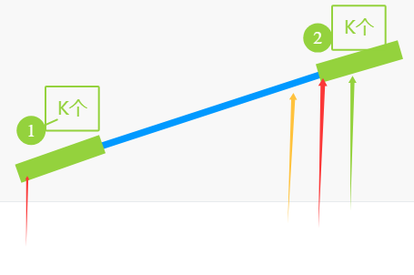

# 贪心算法（基本贪心策略/反悔/区间/字典序/数学/思维/构造）

链接：https://leetcode.cn/discuss/post/g6KTKL/

前言
为方便大家练习，我把比较套路的贪心题目放在前面，更灵活的思维题和构造题放在后面。每个小节的题目均按照从易到难的顺序排列。

**如果做题时没有思路，推荐看看本文第五章的「思考清单」。**

# 一、贪心策略
有两种**基本贪心策略**：

从**最小/最大**开始贪心，优先考虑最小/最大的数，从小到大/从大到小贪心。在此基础上，衍生出了**反悔贪心**。
从**最左/最右**开始贪心，思考第一个数/最后一个数的贪心策略，把 n 个数的原问题转换成 n−1 个数（或更少）的子问题。

## §1.1 从最小/最大开始贪心
优先考虑最小/最大的数，从小到大/从大到小贪心。

如果答案与数组元素顺序无关，一般需要**排序**。排序后，可以遍历计算。


### [3074. 重新分装苹果](https://leetcode.cn/problems/apple-redistribution-into-boxes/)

给你一个长度为 `n` 的数组 `apple` 和另一个长度为 `m` 的数组 `capacity` 。

一共有 `n` 个包裹，其中第 `i` 个包裹中装着 `apple[i]` 个苹果。同时，还有 `m` 个箱子，第 `i` 个箱子的容量为 `capacity[i]` 个苹果。

请你选择一些箱子来将这 `n` 个包裹中的苹果重新分装到箱子中，返回你需要选择的箱子的 **最小** 数量。

**注意**，同一个包裹中的苹果可以分装到不同的箱子中。

**示例 1：**

```
输入：apple = [1,3,2], capacity = [4,3,1,5,2]
输出：2
解释：使用容量为 4 和 5 的箱子。
总容量大于或等于苹果的总数，所以可以完成重新分装。
```


返回需要选择的箱子的 **最小** 数量。

```C++
class Solution {
public:
    int minimumBoxes(vector<int>& apple, vector<int>& capacity) {
        //n 包裹  放apple[i] 个苹果
        //sumApple
        //m 箱子  放capacity[i] 个苹果
        //排序 先用大箱子 装 
        sort(capacity.begin(),capacity.end(),greater<int>{});
        int appleSum = reduce(apple.begin(),apple.end());
        int res=0;
        while(appleSum>0)
        {
            appleSum-=capacity[res];
            res++;
        }
        return res;
    }
};
```


### [2279. 装满石头的背包的最大数量](https://leetcode.cn/problems/maximum-bags-with-full-capacity-of-rocks/)

现有编号从 `0` 到 `n - 1` 的 `n` 个背包。给你两个下标从 **0** 开始的整数数组 `capacity` 和 `rocks` 。第 `i` 个背包最大可以装 `capacity[i]` 块石头，当前已经装了 `rocks[i]` 块石头。另给你一个整数 `additionalRocks` ，表示你可以放置的额外石头数量，石头可以往 **任意** 背包中放置。

请你将额外的石头放入一些背包中，并返回放置后装满石头的背包的 **最大** 数量*。*

**示例 1：**

```
输入：capacity = [2,3,4,5], rocks = [1,2,4,4], additionalRocks = 2
输出：3
解释：
1 块石头放入背包 0 ，1 块石头放入背包 1 。
每个背包中的石头总数是 [2,3,4,4] 。
背包 0 、背包 1 和 背包 2 都装满石头。
总计 3 个背包装满石头，所以返回 3 。
可以证明不存在超过 3 个背包装满石头的情况。
注意，可能存在其他放置石头的方案同样能够得到 3 这个结果。
```


```C++
class Solution {
public:
    int maximumBags(vector<int>& capacity, vector<int>& rocks, int additionalRocks) {
        int n = capacity.size();
        //剩余容量
        for(int i=0;i<n;i++) 
            capacity[i]-=rocks[i];
        sort(capacity.begin(),capacity.end()); // 剩余容量从小到大排序
        int i=0;
        while(i<n&&additionalRocks>=capacity[i])
        {
            additionalRocks-=capacity[i++];
        }
        return i;
    }
};
```


### [1833. 雪糕的最大数量 ](https://leetcode.cn/problems/maximum-ice-cream-bars/) 同上题（有一种计数排序的做法，但还没看，先用贪心吧）

```C++
class Solution {
public:
    int maxIceCream(vector<int>& costs, int coins) 
    {
        sort(costs.begin(),costs.end());
        int i=0;
        while(i<costs.size()&& coins>=costs[i])
        {
            coins-=costs[i++];
        }
        return i;
    }
};
```


### [1005. K 次取反后最大化的数组和](https://leetcode.cn/problems/maximize-sum-of-array-after-k-negations/)

给你一个整数数组 `nums` 和一个整数 `k` ，按以下方法修改该数组：

- 选择某个下标 `i` 并将 `nums[i]` 替换为 `-nums[i]` 。

重复这个过程恰好 `k` 次。可以多次选择同一个下标 `i` 。

以这种方式修改数组后，返回数组 **可能的最大和** 。

**示例 1：**

```
输入：nums = [4,2,3], k = 1
输出：5
解释：选择下标 1 ，nums 变为 [4,-2,3] 。
```


这个做法排序了，复杂度应该会高  有更快的 有O(n+C)的 但是官方代码写得很烂，暂时不想看

```C++
class Solution {
public:
    int largestSumAfterKNegations(vector<int>& nums, int k) {
        //1、尽量让负的为正
        //2、如果负的都是正的了，然后还多了n次
        //n偶数，不变 翻同一个值
        //n奇数，翻一次绝对值最小的

        sort(nums.begin(),nums.end());
        int i=0;
        for(i=0;i<nums.size();i++)
        {
            if(nums[i]<0&&k>0)
            {
                nums[i]=-nums[i];
                k--;
            }
            else
            {
                break;
            }
        }
        int sum = reduce(nums.begin(),nums.end());
        if(k>0)
        {
            //表示可以翻偶数次某个数，最后翻回原值
            if(k%2==0)
            {
                return sum;
            }
            else
            {
                int minNum = *min_element(nums.begin(),nums.end());
                sum-=2*minNum;
            }
        }
        return sum;

    }
};
```


### [1481. 不同整数的最少数目](https://leetcode.cn/problems/least-number-of-unique-integers-after-k-removals/)

给你一个整数数组 `arr` 和一个整数 `k` 。现需要从数组中恰好移除 `k` 个元素，请找出移除后数组中不同整数的最少数目。

**示例 1：**

```
输入：arr = [5,5,4], k = 1
输出：1
解释：移除 1 个 4 ，数组中只剩下 5 一种整数。
```

```C++
class Solution {
public:
    int findLeastNumOfUniqueInts(vector<int>& arr, int k) {
        //尽量把出现频率低的移除
        unordered_map<int,int> umap;
        int n=arr.size();
        for(int i=0;i<n;i++)
        {
            umap[arr[i]]++;
        }
        //排序
        vector<pair<int,int>> vec(umap.begin(),umap.end());
        sort(vec.begin(),vec.end(),[](const auto& a,const auto& b){return a.second<b.second;});
        int i=0;
        for(auto &[_,s]:vec)
        {
            if(k>=s)
            {
                k-=s;
                i++;
            }
            else
            {
                break;
            }
        }
        return vec.size()-i;
    }
};
```


### [1403. 非递增顺序的最小子序列](https://leetcode.cn/problems/minimum-subsequence-in-non-increasing-order/)

给你一个数组 `nums`，请你从中抽取一个子序列，满足该子序列的元素之和 **严格** 大于未包含在该子序列中的各元素之和。

如果存在多个解决方案，只需返回 **长度最小** 的子序列。如果仍然有多个解决方案，则返回 **元素之和最大** 的子序列。

与子数组不同的地方在于，「数组的子序列」不强调元素在原数组中的连续性，也就是说，它可以通过从数组中分离一些（也可能不分离）元素得到。

**注意**，题目数据保证满足所有约束条件的解决方案是 **唯一** 的。同时，返回的答案应当按 **非递增顺序** 排列。

**示例 1：**

```
输入：nums = [4,3,10,9,8]
输出：[10,9] 
解释：子序列 [10,9] 和 [10,8] 是最小的、满足元素之和大于其他各元素之和的子序列。但是 [10,9] 的元素之和最大。 
```


解答

```C++
class Solution {
public:
    vector<int> minSubsequence(vector<int>& nums) 
    {
        //sort
        sort(nums.begin(),nums.end(),greater<int>{});
        //presum
        //presum>total-presum 的第一个 即2pres>total  的第一个值
        int n=nums.size();
        vector<int> presum(n);
        partial_sum(nums.begin(),nums.end(),presum.begin());
        int totalSum = presum[n-1];
        int idx = upper_bound(presum.begin(),presum.end(),0.5*totalSum)-presum.begin();
        return vector<int>(nums.begin(),nums.begin()+idx+1);
    }
};
```


### [3010. 将数组分成最小总代价的子数组 I](https://leetcode.cn/problems/divide-an-array-into-subarrays-with-minimum-cost-i/)

给你一个长度为 `n` 的整数数组 `nums` 。

一个数组的 **代价** 是它的 **第一个** 元素。比方说，`[1,2,3]` 的代价是 `1` ，`[3,4,1]` 的代价是 `3` 。

你需要将 `nums` 分成 `3` 个 **连续且没有交集** 的子数组。

请你返回这些子数组的 **最小** 代价 **总和** 。

**示例 1：**

```
输入：nums = [1,2,3,12]
输出：6
解释：最佳分割成 3 个子数组的方案是：[1] ，[2] 和 [3,12] ，总代价为 1 + 2 + 3 = 6 。
其他得到 3 个子数组的方案是：
- [1] ，[2,3] 和 [12] ，总代价是 1 + 2 + 12 = 15 。
- [1,2] ，[3] 和 [12] ，总代价是 1 + 3 + 12 = 16 。
```


```C++
class Solution {
public:
    int minimumCost(vector<int>& nums) 
    {
        //第一个一定要选 ， 找到除了第一个以外，最小的2个数字， top2问题 
        nth_element(nums.begin()+1,nums.begin()+2,nums.end()); //回忆nth_element这个接口,可以参考https://www.geeksforgeeks.org/stdnth_element-in-cpp/
        return nums[0]+nums[1]+nums[2];

        //10 3 1 1 
        //10之后找到两个最小的数字
    }
};
```

O（n）寻找最小和次小

```C++
class Solution {
public:
    int minimumCost(vector<int>& nums) 
    {
        //第一个一定要选 ， 找到除了第一个最小的2个数字， top2问题 
        //维护最小值和次小值
        int fi=INT_MAX,se = INT_MAX;
        for(int i=1;i<nums.size();i++)//fron 1
        {
            if(nums[i]<fi)
            {
                se=fi;
                fi=nums[i];
            }
            else if(nums[i]<se)
            {
                se = nums[i];
            }
        }
        return nums[0]+fi+se;
    }
};
```


### [1338. 数组大小减半](https://leetcode.cn/problems/reduce-array-size-to-the-half/)

```c++
typedef pair<int, int> PII;
struct compare
{
    bool operator()(const PII& a, const PII& b)
    {
        return a.second > b.second;
    }
};
class Solution {
public:
    int minSetSize(vector<int>& arr) {
        //放到哈希表里,然后排序
        unordered_map<int, int> umap;
        int total = arr.size();
        for(int i=0;i<total;i++)
        {
            umap[arr[i]]++;
        }
        vector<PII> vec(umap.begin(), umap.end());
        sort(vec.begin(), vec.end(), compare());
        int cnt = 0;
        int sum = 0;
        for(auto& p: vec)
        {
            sum += p.second;
            cnt++;
            if(sum>=total/2) break;
        }
        return cnt;
    }
};
```


### [1710. 卡车上的最大单元数](https://leetcode.cn/problems/maximum-units-on-a-truck/)

```c++
class Solution {
public:
    static bool compare(vector<int>& a, vector<int>& b) //注意得是static
    {
        return a[1] > b[1];
    }
    int maximumUnits(vector<vector<int>>& boxTypes, int truckSize) {
        //把boxTypes数组按照numberOfUnitsPerBox从大到小排序,然后计算即可
        sort(boxTypes.begin(), boxTypes.end(), compare);
        int sum = 0;
        int cnt = 0;
        int n = boxTypes.size();
        for(int i=0;i<n;i++)
        {
            if(sum + boxTypes[i][0] > truckSize)
            {
                cnt += (truckSize - sum) * boxTypes[i][1] ; //剩下的都装当前的箱子种类
                break;
            }
            else
            {
                sum += boxTypes[i][0];
                cnt += boxTypes[i][1] * boxTypes[i][0];
            }
        }
        return cnt;
    }
};
```


### [3075. 幸福值最大化的选择方案](https://leetcode.cn/problems/maximize-happiness-of-selected-children/)
给你一个长度为 `n` 的数组 `happiness` ，以及一个 **正整数** `k` 。

`n` 个孩子站成一队，其中第 `i` 个孩子的 **幸福值** 是 `happiness[i]` 。你计划组织 `k` 轮筛选从这 `n` 个孩子中选出 `k` 个孩子。

在每一轮选择一个孩子时，所有 **尚未** 被选中的孩子的 **幸福值** 将减少 `1` 。注意，幸福值 **不能** 变成负数，且只有在它是正数的情况下才会减少。

选择 `k` 个孩子，并使你选中的孩子幸福值之和最大，返回你能够得到的 **最大值** 。

**示例 1：**

```
输入：happiness = [1,2,3], k = 2
输出：4
解释：按以下方式选择 2 个孩子：
- 选择幸福值为 3 的孩子。剩余孩子的幸福值变为 [0,1] 。
- 选择幸福值为 1 的孩子。剩余孩子的幸福值变为 [0] 。注意幸福值不能小于 0 。
所选孩子的幸福值之和为 3 + 1 = 4 。
```
代码：

> [划分型 DP 的套路【力扣周赛 388】_哔哩哔哩_bilibili](https://www.bilibili.com/video/BV1Xr421J77b/?vd_source=f0e5ebbc6d14fe7f10f6a52debc41c99),证明在这个视频的前4分钟。

```c++
class Solution {
public:
    long long maximumHappinessSum(vector<int>& happiness, int k) {
        //选择最大的k个数,第i个数happiness[i]做处理:max(happiness[i] - i, 0);结果累加到最终值上去(当然也可以在for循环里提前剪枝)
        long long res = 0;
        //注意,本题只能用排序来做,不能优化为快速选择,因为前k个值都要求有序递减,快速选择无法保证这一点
        sort(happiness.begin(), happiness.end(), greater<int>());
        for(int i=0;i<k;i++)
        {
            res += (long long)max(happiness[i] - i, 0);
        }
        return res;
    }
};
```


### [2554. 从一个范围内选择最多整数 I](https://leetcode.cn/problems/maximum-number-of-integers-to-choose-from-a-range-i/)

> 给你一个整数数组 `banned` 和两个整数 `n` 和 `maxSum` 。你需要按照以下规则选择一些整数：
>
> - 被选择整数的范围是 `[1, n]` 。
> - 每个整数 **至多** 选择 **一次** 。
> - 被选择整数不能在数组 `banned` 中。
> - 被选择整数的和不超过 `maxSum` 。
>
> 请你返回按照上述规则 **最多** 可以选择的整数数目。

用哈希即可。不要想着对`banned`数组排序什么的，复杂度又高，又不好写（写的很不好看）。最终代码如下：

```c++
class Solution {
public:
    int maxCount(vector<int>& banned, int n, int maxSum) {
        unordered_set<int> uset;
        int sz = banned.size();
        for(int i=0;i<sz;i++)
        {
            if(!uset.contains(banned[i]))
                uset.insert(banned[i]);
        }
        int curSum = 0;
        for(int cur=1;cur<=n;cur++) //用for循环+continue/break是比较好写的，如果用while的话感觉不是特别好写，以后可以优先选for循环的写法。
        {
            if(uset.contains(cur)) continue;
            if(curSum + cur > maxSum) break;
            else
            {
                curSum += cur;
                cnt++;
            }
        }
        return cnt;
    }
};
```


### [2126. 摧毁小行星](https://leetcode.cn/problems/destroying-asteroids/)

注意可能出现的越界问题：

```c++
class Solution {
public:
    bool asteroidsDestroyed(int mass, vector<int>& asteroids) {
        //按照从小到大的顺序与小行星碰撞,假设碰撞a和b都是合法的,那肯定是先撞小的那个更稳妥一些
        int n = asteroids.size();
        sort(asteroids.begin(), asteroids.end());
        long long curSum = mass;
        int index = 0; //从0开始撞
        for( ;index<n;index++)
        {
            if(curSum>=asteroids[index])
            {
                curSum += (long long)asteroids[index];
            }
            else break;
        }
        return (index==n);

    }
};
```


### [2587. 重排数组以得到最大前缀分数](https://leetcode.cn/problems/rearrange-array-to-maximize-prefix-score/)

> 给你一个下标从 **0** 开始的整数数组 `nums` 。你可以将 `nums` 中的元素按 **任意顺序** 重排（包括给定顺序）。
>
> 令 `prefix` 为一个数组，它包含了 `nums` 重新排列后的前缀和。换句话说，`prefix[i]` 是 `nums` 重新排列后下标从 `0` 到 `i` 的元素之和。`nums` 的 **分数** 是 `prefix` 数组中正整数的个数。
>
> 返回可以得到的最大分数。

贪心思路的基本证明:

对于一个负数来说，它后面的前缀和都会把这个负数加进去。

由于要统计的是正数前缀和，那么把负数尽量放在后面，能统计到尽量多的正数前缀和。

同时，绝对值小的负数应该排在负数的前面，尽量在前缀和减为负数前还能多统计一些正数。

```c++
class Solution {
public:
    int maxScore(vector<int>& nums) {
        sort(nums.begin(), nums.end(), greater<int>());
        int n = nums.size();
        int cnt = 0;
        long long sum = 0;
        for(int i=0;i<n;i++)
        {
            if(sum + nums[i] > 0)
            {
                cnt++;
                sum += nums[i];
            }
            else break;
        }
        return cnt;
    }
};
```


### [976. 三角形的最大周长](https://leetcode.cn/problems/largest-perimeter-triangle/)

> 给定由一些正数（代表长度）组成的数组 `nums` ，返回 *由其中三个长度组成的、**面积不为零**的三角形的最大周长* 。如果不能形成任何面积不为零的三角形，返回 `0`。

这道题如果从大到小排序完，然后三轮for循环找结果的话会爆超出时间限制，所以需要对算法进行优化。实际上，只要一轮for循环就可以解决了，代码和注释如下：

```c++
class Solution {
public:
    int largestPerimeter(vector<int>& nums) {
        sort(nums.begin(), nums.end());
        int n = nums.size();
        //对于nums[i]来说,如果nums[i-1]+nums[i-2]<nums[i],那么前面的更不可能了,直接枚举下一个i即可
        //否则,nums[i] + nums[i-1] + nums[i-2]就是要求解的值
        for(int i=n-1;i>=2;i--)
        {
            if(nums[i-1] + nums[i-2] <= nums[i]) continue;
            return nums[i] + nums[i-1] + nums[i-2];
        }
        return 0;
    }
};
```


### [1561. 你可以获得的最大硬币数目](https://leetcode.cn/problems/maximum-number-of-coins-you-can-get/)

> 有 3n 堆数目不一的硬币，你和你的朋友们打算按以下方式分硬币：
>
> - 每一轮中，你将会选出 **任意** 3 堆硬币（不一定连续）。
> - Alice 将会取走硬币数量最多的那一堆。
> - 你将会取走硬币数量第二多的那一堆。
> - Bob 将会取走最后一堆。
> - 重复这个过程，直到没有更多硬币。
>
> 给你一个整数数组 `piles` ，其中 `piles[i]` 是第 `i` 堆中硬币的数目。
>
> 返回你可以获得的最大硬币数目。

代码如下：
```c++
class Solution {
public:
    int maxCoins(vector<int>& piles) {
        //让Bob亏麻了,同时不让Alice赢太多
        sort(piles.begin(), piles.end());
        int n = piles.size();
        int ans = 0;
        int left = 0, right = n - 2;
        while(left < right)
        {
            ans += piles[right];
            right -= 2;
            left++;
        }
        return ans;
    }
};
```


### [3462. 提取至多 K 个元素的最大总和](https://leetcode.cn/problems/maximum-sum-with-at-most-k-elements/)

> 给你一个大小为 `n x m` 的二维矩阵 `grid` ，以及一个长度为 `n` 的整数数组 `limits` ，和一个整数 `k` 。你的目标是从矩阵 `grid` 中提取出 **至多** `k` 个元素，并计算这些元素的最大总和，提取时需满足以下限制**：**
>
> - 从 `grid` 的第 `i` 行提取的元素数量不超过 `limits[i]` 。
>
> 返回最大总和。

```c++
class Solution {
public:
    long long maxSum(vector<vector<int>>& grid, vector<int>& limits, int k) {
        //grid没有负数,因此肯定是选满k个最好
        //每一行取limit这么多大的数(快速选择),然后在这里面取topk即可
        int n = grid.size();
        int m = grid[0].size();
        int sum = accumulate(limits.begin(), limits.end(), 0);
        vector<int> candidates(sum, 0);
        int index = 0;
        for(int row = 0;row < n;row++)
        {
            nth_element(grid[row].begin(), grid[row].begin() + limits[row] - 1, grid[row].end(), greater<int>());
            for(int i=0;i<limits[row];i++)
            {
                candidates[index++] = grid[row][i];
            }
        }
        sort(candidates.begin(), candidates.end(), greater<int>());
        long long ans = 0;
        for(int i=0;i<k;i++)
        {
            ans += (long long)candidates[i];
        }
        return ans;
    }
};
```

orY: 或者用`nth_element(allGridLimit.begin(),allGridLimit.begin()+k-1,allGridLimit.end(),greater<int>());`

```C++
class Solution {
public:
    //7
    long long maxSum(vector<vector<int>>& grid, vector<int>& limits, int k) {
        vector<int> allGridLimit;
        if(k==0)return 0;
        for(int i=0;i<grid.size();i++)
        {
            if(limits[i]==0)continue;
            nth_element(grid[i].begin(),grid[i].begin()+limits[i]-1,grid[i].end(),greater<int>());
            for(int j=0;j<limits[i];j++)
            {
                allGridLimit.emplace_back(grid[i][j]);
            }
        }
        nth_element(allGridLimit.begin(),allGridLimit.begin()+k-1,allGridLimit.end(),greater<int>());
        long long res=0;
        for(int i=0;i<k;i++)
        {
            res += allGridLimit[i];
        }
        return res;
    }
};
```


### [3301. 高度互不相同的最大塔高和](https://leetcode.cn/problems/maximize-the-total-height-of-unique-towers/)

> 给你一个数组 `maximumHeight` ，其中 `maximumHeight[i]` 表示第 `i` 座塔可以达到的 **最大** 高度。
>
> 你的任务是给每一座塔分别设置一个高度，使得：
>
> 1. 第 `i` 座塔的高度是一个正整数，且不超过 `maximumHeight[i]` 。
> 2. 所有塔的高度互不相同。
>
> 请你返回设置完所有塔的高度后，可以达到的 **最大** 总高度。如果没有合法的设置，返回 `-1` 。

```c++
class Solution {
public:
    long long maximumTotalSum(vector<int>& maximumHeight) {
        sort(maximumHeight.begin(), maximumHeight.end());
        int mx = maximumHeight.back();
        int n = maximumHeight.size();

        int start = mx; //一开始分配的数
        long long ans = 0;
        //优先满足大的,不然后面只能越来越小,非常不划算
        int index = n-1;
        for(;index>=0;index--)
        {
            start = min(maximumHeight[index], start); 
            if(start<=0) break;//这里也可以直接return -1;
            ans += (long long)start;
            start--; //每次start-1,保证下一次分配的时候一定比现在少1
        }
        if(index>=0) return -1; //分配不完,无法达成要求
        return ans;
    }
};
```


### ==补充困难题：[1840. 最高建筑高度](https://leetcode.cn/problems/maximum-building-height/)==

> 有点难了，后面再来做吧。


### [945. 使数组唯一的最小增量](https://leetcode.cn/problems/minimum-increment-to-make-array-unique/)

> 给你一个整数数组 `nums` 。每次 move 操作将会选择任意一个满足 `0 <= i < nums.length` 的下标 `i`，并将 `nums[i]` 递增 `1`。
>
> 返回使 `nums` 中的每个值都变成唯一的所需要的最少操作次数。
>
> 生成的测试用例保证答案在 32 位整数范围内。

跟上一题有类似之处，代码如下：（思路就是尽量把小的数分给小的候选人）

```c++
class Solution {
public:
    int minIncrementForUnique(vector<int>& nums) {
        //也就是用最小的操作次数让数组每个元素的值都不相等,跟之前的题目比较类似
        sort(nums.begin(), nums.end());
        int ans = 0; //32位整数范围内
        int start = nums[0];
        int n = nums.size();
        for(int i=1;i<n;i++)
        {
            start = max(start + 1, nums[i]);
            ans += (start - nums[i]);
        }
        return ans;
        
    }
};
```


### [1846. 减小和重新排列数组后的最大元素](https://leetcode.cn/problems/maximum-element-after-decreasing-and-rearranging/)

> 给你一个正整数数组 `arr` 。请你对 `arr` 执行一些操作（也可以不进行任何操作），使得数组满足以下条件：
>
> - `arr` 中 **第一个** 元素必须为 `1` 。
> - 任意相邻两个元素的差的绝对值 **小于等于** `1` ，也就是说，对于任意的 `1 <= i < arr.length` （**数组下标从 0 开始**），都满足 `abs(arr[i] - arr[i - 1]) <= 1` 。`abs(x)` 为 `x` 的绝对值。
>
> 你可以执行以下 2 种操作任意次：
>
> - **减小** `arr` 中任意元素的值，使其变为一个 **更小的正整数** 。
> - **重新排列** `arr` 中的元素，你可以以任意顺序重新排列。
>
> 请你返回执行以上操作后，在满足前文所述的条件下，`arr` 中可能的 **最大值** 。

```c++
class Solution {
public:
    int maximumElementAfterDecrementingAndRearranging(vector<int>& arr) {
        //注意数组元素只能减少,每个元素都不可能增大
        int n = arr.size();
        sort(arr.begin(), arr.end());
        int start = 1;
        for(int i=1;i<n;i++)
        {
            start = min(start + 1, arr[i]); //尽量等于上一个+1,但是最高是arr[i]的值
        }
        return start;
    }
};
```


### [1647. 字符频次唯一的最小删除次数](https://leetcode.cn/problems/minimum-deletions-to-make-character-frequencies-unique/)

> 如果字符串 `s` 中 **不存在** 两个不同字符 **频次** 相同的情况，就称 `s` 是 **优质字符串** 。
>
> 给你一个字符串 `s`，返回使 `s` 成为 **优质字符串** 需要删除的 **最小** 字符数。
>
> 字符串中字符的 **频次** 是该字符在字符串中的出现次数。例如，在字符串 `"aab"` 中，`'a'` 的频次是 `2`，而 `'b'` 的频次是 `1` 。

代码如下：

```c++
class Solution {
public:
    int minDeletions(string s) {
        unordered_map<char, int> umap;
        for(char c: s)
        {
            umap[c]++;
        }
        int n = umap.size();
        vector<int> vec(n);
        int index = 0;
        for(auto& [k, v] : umap)
        {
            vec[index++] = v;
        }
        sort(vec.begin(), vec.end());
        //此时已经按照词频从小到大排序了
        
        int ans = 0; //最少要删除的个数,从小到大并回退,和从大到小理论上结果是一致的,但从大到小比较好算
        int start = vec[n-1];
        for(int index = n-2;index>=0;index--)
        {
            start = min(start-1, vec[index]);
            if(start<0) start = 0; //相当于此时需要全删掉了
            ans += (vec[index]-start);
        }
        return ans;
    }
};
```

其实也可以用数组来替代哈希表，会快一些：
```c++
class Solution {
public:
    int minDeletions(string s) {
        int n = 26;
        vector<int> vec(26);
        int index = 0;
        for(char c: s)
        {
            vec[c-'a']++;
        }
        sort(vec.begin(), vec.end());
        //此时已经按照词频从小到大排序了
        
        int ans = 0; //最少要删除的个数,从小到大并回退,和从大到小理论上结果是一致的,但从大到小比较好算
        int start = vec[n-1];
        for(int index = n-2;index>=0;index--)
        {
            start = min(start-1, vec[index]);
            if(start<0) start = 0; //相当于此时需要全删掉了
            ans += (vec[index]-start);
        }
        return ans;
    }
};
```

注：本题贪心的思路可以参考：[1647. 字符频次唯一的最小删除次数 - 力扣（LeetCode）](https://leetcode.cn/problems/minimum-deletions-to-make-character-frequencies-unique/solutions/2015660/by-stormsunshine-g9ov/).后面可以回头看看怎么对这件事进行直观证明。


### 小结论

对于使得每一项值都不相同的贪心题目，暂时有如下结论：

- 如果是对每一项只能做增加的操作，就从小到大排序后从左到右遍历，`max(start+1, nums[i])`，对应945这道题；
- 如果是对每一项只能做减少的操作，就从小到大排序后从右到左遍历，`min(start-1，nums[i])`.

注：并不是所有都这样，因题目而异，但大部分可以做这种类型的思路尝试。


### [2971. 找到最大周长的多边形](https://leetcode.cn/problems/find-polygon-with-the-largest-perimeter/)

> 给你一个长度为 `n` 的 **正** 整数数组 `nums` 。
>
> **多边形** 指的是一个至少有 `3` 条边的封闭二维图形。多边形的 **最长边** 一定 **小于** 所有其他边长度之和。
>
> 如果你有 `k` （`k >= 3`）个 **正** 数 `a1`，`a2`，`a3`, ...，`ak` 满足 `a1 <= a2 <= a3 <= ... <= ak` **且** `a1 + a2 + a3 + ... + ak-1 > ak` ，那么 **一定** 存在一个 `k` 条边的多边形，每条边的长度分别为 `a1` ，`a2` ，`a3` ， ...，`ak` 。
>
> 一个多边形的 **周长** 指的是它所有边之和。
>
> 请你返回从 `nums` 中可以构造的 **多边形** 的 **最大周长** 。如果不能构造出任何多边形，请你返回 `-1` 。

本题看起来是`976.三角形的最大周长`的进阶题目。

```c++
class Solution {
public:
    long long largestPerimeter(vector<int>& nums) {
        //用前缀和进行优化
        int n = nums.size();
        sort(nums.begin(), nums.end());
        vector<long long> prefix(n+1, 0);
        for(int i=0;i<n;i++)
        {
            prefix[i+1] = prefix[i] + (long long)nums[i];
        }
        long long ans = -1;
        for(int i = n-1;i>=2;i--) //最少得是三角形,所以i=2是最后需要遍历的
        {
            long long preSum = prefix[i];
            if(preSum > nums[i]) //如果preSum<=nums[i],说明拼尽全力无法战胜
            {
                ans = max(ans, preSum + nums[i]);
            }
        }
        return ans;
    }
};
```

or：

```C++
class Solution {
public:
    long long largestPerimeter(vector<int>& nums) {
        long long res=0;
        long long totalSum = reduce(nums.begin(),nums.end(),0L);//必须要是0L 否则放不下

        sort(nums.begin(),nums.end(),greater<int>());
        for(int i=0;i<nums.size()-2;i++)
        {
            totalSum = totalSum-nums[i];
            if(nums[i]<totalSum)
            {
                return (long long)(nums[i]+totalSum);
            }
        }
        return -1;
    }
};
```


### [2178. 拆分成最多数目的正偶数之和](https://leetcode.cn/problems/maximum-split-of-positive-even-integers/)

> 给你一个整数 `finalSum` 。请你将它拆分成若干个 **互不相同** 的正偶数之和，且拆分出来的正偶数数目 **最多** 。
>
> - 比方说，给你 `finalSum = 12` ，那么这些拆分是 **符合要求** 的（互不相同的正偶数且和为 `finalSum`）：`(2 + 10)` ，`(2 + 4 + 6)` 和 `(4 + 8)` 。它们中，`(2 + 4 + 6)` 包含最多数目的整数。注意 `finalSum` 不能拆分成 `(2 + 2 + 4 + 4)` ，因为拆分出来的整数必须互不相同。
>
> 请你返回一个整数数组，表示将整数拆分成 **最多** 数目的正偶数数组。如果没有办法将 `finalSum` 进行拆分，请你返回一个 **空** 数组。你可以按 **任意** 顺序返回这些整数。

```c++
class Solution {
public:
    vector<long long> maximumEvenSplit(long long finalSum) {
        //2+4+6+8+...这么拆分
        //至少奇数是不可能的
        vector<long long> res;
        if(finalSum % 2==1) return res;
        long long curSum = 0;
        long long curval = 2; //2,4,6
        while(curSum < finalSum)
        {
            long long remain = finalSum - curSum;
            if(remain < curval + curval + 2) //剩下的放不下两个数了,直接把remain放进去,然后结束
            {
                res.emplace_back(remain);
                break;
            }
            curSum += curval;
            res.emplace_back(curval);
            curval += 2;
        }
        return res;
    }
};
```


### [2567. 修改两个元素的最小分数](https://leetcode.cn/problems/minimum-score-by-changing-two-elements/)

```c++
class Solution {
public:
    int minimizeSum(vector<int>& nums) {
        //数组中都是>0的数,最小得分比较好办,肯定可以造出一个0,跟最大值或者最小值拼就可以了
        sort(nums.begin(), nums.end());
        int n = nums.size();
        //最大得分,有三种情况:把最大的两个数改成倒数第三个大的数,把最小的两个数改成第三个小的数,以及最大最小各变换一个
        int res1 = nums[n-1] - nums[2];
        int res2 = nums[n-3] - nums[0];
        int res3 = nums[n-2] - nums[1];
        return min({res1, res2, res3});
        
    }
};
```

> 具体的题解可以看这篇:[2567. 修改两个元素的最小分数 - 力扣（LeetCode）](https://leetcode.cn/problems/minimum-score-by-changing-two-elements/solutions/2119454/nao-jin-ji-zhuan-wan-by-endlesscheng-9l4m/)


### [1509. 三次操作后最大值与最小值的最小差](https://leetcode.cn/problems/minimum-difference-between-largest-and-smallest-value-in-three-moves/)

跟上一题比较像，思考和具体的代码如下：

```c++
class Solution {
public:
    int minDifference(vector<int>& nums) {
        sort(nums.begin(), nums.end());
        int n = nums.size();
        if(n<=4) return 0;
        //1.小的这边改三个 2.大的那边改三个 3.小的改2个,大的改1个 4.小的改1个,大的改2个
        int res1 = nums[n-1] - nums[3];
        int res2 = nums[n-4] - nums[0];
        int res3 = nums[n-2] - nums[2];
        int res4 = nums[n-3] - nums[1];
        //cout<<res1<<" "<<res2<<" "<<res3<<" "<<res4<<endl;
        return min({res1, res2, res3, res4});
    }
};
```


### [3397. 执行操作后不同元素的最大数量](https://leetcode.cn/problems/maximum-number-of-distinct-elements-after-operations/)（有难度！）

>  给你一个整数数组 `nums` 和一个整数 `k`。
>
> 你可以对数组中的每个元素 **最多** 执行 **一次** 以下操作：
>
> - 将一个在范围 `[-k, k]` 内的整数加到该元素上。
>
> 返回执行这些操作后，`nums` 中可能拥有的不同元素的 **最大** 数量。

贪心做法可以参考：[3397. 执行操作后不同元素的最大数量 - 力扣（LeetCode）](https://leetcode.cn/problems/maximum-number-of-distinct-elements-after-operations/solutions/3027034/cong-xiao-dao-da-tan-xin-pythonjavacgo-b-n023/)。这题还是比较有难度的。核心思路在于让每个人尽可能地往左站，代码如下：
```c++
class Solution {
public:
    int maxDistinctElements(vector<int>& nums, int k) {
        sort(nums.begin(), nums.end());
        int ans = 0;
        int pre = INT_MIN;
        for(int x: nums)
        {
            x = clamp(pre+1, x-k, x+k); //尽量往左站,pre+1试试,但不能超过当前的范围,不能就算了,能的话尽量+1,
            if(x>pre)
            {
                ans++;
                pre = x;
            }
        }
        return ans;
    }
};
```


>错误的思路:
>
>左右指针,左边尽量往左,右边尽量往右,中间相遇
>
>错误用例例如:
>
>输入
>
>nums=[13,10,9,9,13,10,13,11]
>
>k = 1


## §1.2 单序列配对

同上，从最小/最大的元素开始贪心。


### [2144. 打折购买糖果的最小开销](https://leetcode.cn/problems/minimum-cost-of-buying-candies-with-discount/) 1261

一家商店正在打折销售糖果。每购买 **两个** 糖果，商店会 **免费** 送一个糖果。

免费送的糖果唯一的限制是：它的价格需要小于等于购买的两个糖果价格的 **较小值** 。

- 比方说，总共有 `4` 个糖果，价格分别为 `1` ，`2` ，`3` 和 `4` ，一位顾客买了价格为 `2` 和 `3` 的糖果，那么他可以免费获得价格为 `1` 的糖果，但不能获得价格为 `4` 的糖果。

给你一个下标从 **0** 开始的整数数组 `cost` ，其中 `cost[i]` 表示第 `i` 个糖果的价格，请你返回获得 **所有** 糖果的 **最小** 总开销。

**示例 1：**

```
输入：cost = [1,2,3]
输出：5
解释：我们购买价格为 2 和 3 的糖果，然后免费获得价格为 1 的糖果。
总开销为 2 + 3 = 5 。这是开销最小的 唯一 方案。
注意，我们不能购买价格为 1 和 3 的糖果，并免费获得价格为 2 的糖果。
这是因为免费糖果的价格必须小于等于购买的 2 个糖果价格的较小值。
```


M1

3个打包卖

```C++
class Solution {
public:
    int minimumCost(vector<int>& cost) {
        sort(cost.begin(),cost.end(),greater<int>{});
        int res=0;
        int n = cost.size();
        for(int i=0;i<n;i++)
        {
            if(i%3!=2)res+=cost[i];
        }
        return res;
    }
};
```


M2: M

```C++
class Solution {
public:
    int minimumCost(vector<int>& cost) {
        //最大 第二大的一定会买
        //排序后一定可以送第三大的糖 
        //继续上述步骤 
        sort(cost.begin(),cost.end(),greater<int>{});
        //9 7 7 5 2 2 1 1
        int res=0;
        int n = cost.size();
        for(int i=0;i<n;)
        {
            if(i<n)
            {
                res+= cost[i];
                i++;
            }
            if(i<n)
            {
                res+= cost[i];
                i++;
            }
            if(i<n)
            {
                i++;
            }
        }
        return res;
    }
};
```


### [561. 数组拆分 ](https://leetcode.cn/problems/array-partition/)约 1300

给定长度为 `2n` 的整数数组 `nums` ，你的任务是将这些数分成 `n` 对, 例如 `(a1, b1), (a2, b2), ..., (an, bn)` ，使得从 `1` 到 `n` 的 `min(ai, bi)` 总和最大。

返回该 **最大总和** 。

**示例 1：**

```
输入：nums = [1,4,3,2]
输出：4
解释：所有可能的分法（忽略元素顺序）为：
1. (1, 4), (2, 3) -> min(1, 4) + min(2, 3) = 1 + 2 = 3
2. (1, 3), (2, 4) -> min(1, 3) + min(2, 4) = 1 + 2 = 3
3. (1, 2), (3, 4) -> min(1, 2) + min(3, 4) = 1 + 3 = 4
所以最大总和为 4
```

```C++
class Solution {
public:
    int arrayPairSum(vector<int>& nums) {
        // 大的数字和大的数字放一起
        sort(nums.begin(),nums.end(),greater<int>());
        int n =nums.size();
        int res=0;
        for(int i=1;i<n;i+=2)
        {
            res+=nums[i];
        }
        return res;
    }
};
```

OR(题目说了长度是2n)

```C++
class Solution {
public:
    int arrayPairSum(vector<int>& nums) {
        // 大的数字和大的数字放一起
        sort(nums.begin(),nums.end());
        int n =nums.size();
        int res=0;
        for(int i=0;i<n;i+=2)
        {
            res+=nums[i];
        }
        return res;
    }
};
```

证明：

https://leetcode.cn/problems/array-partition/solutions/5534/minshu-dui-bi-shi-you-xu-shu-lie-shang-xiang-lin-y/


### [1877. 数组中最大数对和的最小值](https://leetcode.cn/problems/minimize-maximum-pair-sum-in-array/)

一个数对 `(a,b)` 的 **数对和** 等于 `a + b` 。**最大数对和** 是一个数对数组中最大的 **数对和** 。

- 比方说，如果我们有数对 `(1,5)` ，`(2,3)` 和 `(4,4)`，**最大数对和** 为 `max(1+5, 2+3, 4+4) = max(6, 5, 8) = 8` 。

给你一个长度为 **偶数** `n` 的数组 `nums` ，请你将 `nums` 中的元素分成 `n / 2` 个数对，使得：

- `nums` 中每个元素 **恰好** 在 **一个** 数对中，且
- **最大数对和** 的值 **最小** 。

请你在最优数对划分的方案下，返回最小的 **最大数对和** 。

**示例 1：**

```
输入：nums = [3,5,2,3]
输出：7
解释：数组中的元素可以分为数对 (3,3) 和 (5,2) 。
最大数对和为 max(3+3, 5+2) = max(6, 7) = 7 。
```


```C++
class Solution {
public:
    int minPairSum(vector<int>& nums) 
    {
        //尽量平均
        //最大和最小放一起
        sort(nums.begin(),nums.end());
        int n= nums.size();
        int res=0;
        for(int i=0;i<n/2;i++)
        {
            res = max(res,nums[i]+nums[n-i-1]);
        }
        return res;
    }
};
```


最大数对和的最小值，贪心解的正确性证明：

https://leetcode.cn/problems/minimize-maximum-pair-sum-in-array/solutions/885704/gong-shui-san-xie-noxiang-xin-ke-xue-xi-ru29y


知道了上面的证明“非对称方式”不会比“对称方式”更优，那么我们首先对于第一步来说，比如我们取最小元素和其他东西配对，只有当另一个值取到最大元素（对称）的时候，结果最小（最优）

那么去掉这两个元素，继续取剩下数组中的最大和最小元素配对即可。


### [881. 救生艇](https://leetcode.cn/problems/boats-to-save-people/) 1530 经典题

给定数组 `people` 。`people[i]`表示第 `i` 个人的体重 ，**船的数量不限**，每艘船可以承载的最大重量为 `limit`。

每艘船最多可同时载两人，但条件是这些人的重量之和最多为 `limit`。

返回 *承载所有人所需的最小船数* 。

**示例 1：**

```
输入：people = [1,2], limit = 3
输出：1
解释：1 艘船载 (1, 2)
```


https://leetcode.cn/problems/boats-to-save-people/solutions/2828004/jian-ji-yi-dong-de-tu-shi-tui-dao-fu-duo-g02g/

```C++
class Solution {
public:
    int numRescueBoats(vector<int>& people, int limit) {
        int n = people.size();
        int cnt=0;
        int l=0,r=n-1;
        sort(people.begin(),people.end());
        while(l<=r)
        {
            if(people[l]+people[r]<=limit)
            {
                cnt++;
                l++;
                r--;
            }
            else
            {
                cnt++;
                r--;
            }
        }
        return cnt;
    }
};
```


### [2592. 最大化数组的伟大值](https://leetcode.cn/problems/maximize-greatness-of-an-array/)

给你一个下标从 0 开始的整数数组 `nums` 。你需要将 `nums` 重新排列成一个新的数组 `perm` 。

定义 `nums` 的 **伟大值** 为满足 `0 <= i < nums.length` 且 `perm[i] > nums[i]` 的下标数目。

请你返回重新排列 `nums` 后的 **最大** 伟大值。

 

**示例 1：**

```
输入：nums = [1,3,5,2,1,3,1]
输出：4
解释：一个最优安排方案为 perm = [2,5,1,3,3,1,1] 。
在下标为 0, 1, 3 和 4 处，都有 perm[i] > nums[i] 。因此我们返回 4 。
```

思路:田忌赛马:

```C++
class Solution {
public:
    int maximizeGreatness(vector<int>& nums) {
        //1 1 1 2 3 3 5 nums
        sort(nums.begin(),nums.end());
        int n =nums.size();
        int f=n-2;
        int k=n-1;
        int cnt=0;
        for(;k>=0&&f>=0;)
        {
            if(nums[k]>nums[f])
            {
                cnt++;
                k--;
                f--;
            }
            else
            {
                f--;
            }
        }
        return cnt;
    }
};
```


### [2576. 求出最多标记下标](https://leetcode.cn/problems/find-the-maximum-number-of-marked-indices/)（看答案） :cat:

给你一个下标从 **0** 开始的整数数组 `nums` 。

一开始，所有下标都没有被标记。你可以执行以下操作任意次：

- 选择两个 **互不相同且未标记** 的下标 `i` 和 `j` ，满足 `2 * nums[i] <= nums[j]` ，标记下标 `i` 和 `j` 。

请你执行上述操作任意次，返回 `nums` 中最多可以标记的下标数目。

**示例 1：**

```C++
输入：nums = [3,5,2,4]
输出：2
解释：第一次操作中，选择 i = 2 和 j = 1 ，操作可以执行的原因是 2 * nums[2] <= nums[1] ，标记下标 2 和 1 。
没有其他更多可执行的操作，所以答案为 2 。
```


#### M1 :二分

在二分专题中

假如最终有 K对匹配的数对，就一定是左边最小的 K个数与右边最大的K 个数进行匹配。



m:左边1区间中的红色，需要和右边2区间中的红色匹配（`int left = 0, right = n-k;`）

反证，如果与橙色（更小），那么一定能与红色。

​			如果与绿色（更大），那么右边2区间内不足k个，不是我们要的答案。

#### M2 :贪心

https://leetcode.cn/problems/find-the-maximum-number-of-marked-indices/solutions/2914153/tan-xin-pai-xu-shuang-zhi-zhen-tui-dao-z-bqx3/

**结论**：假如最终有 K对匹配的数对，就一定是左边最小的 K个数与右边最大的K 个数进行匹配。

由方法一的匹配方式可知，我们需要用 nums 左半部分中的数，去匹配 nums 右半部分中的数。

在 nums 的右半部分中，找到第一个满足 2⋅nums[0]≤nums[j] 的 j，那么 nums[1] 只能匹配右半部分中的下标大于 j 的数，依此类推。

这可以用同向双指针实现。

```C++
class Solution {
public:
    int maxNumOfMarkedIndices(vector<int>& nums) {
        sort(nums.begin(),nums.end());
        int n = nums.size();
        int i=0;
        for(int j=(n+1)/2;j<n;j++)
        {
            if(nums[i]*2<=nums[j])// 找到一个匹配
            {
                i++;
            }
        }
        return 2*i;
    }
};
```


## §1.3 双序列配对

同上，从最小/最大的元素开始贪心。

### （1）[455. 分发饼干](https://leetcode.cn/problems/assign-cookies/)

假设你是一位很棒的家长，想要给你的孩子们一些小饼干。但是，每个孩子最多只能给一块饼干。

对每个孩子 `i`，都有一个胃口值 `g[i]`，这是能让孩子们满足胃口的饼干的最小尺寸；并且每块饼干 `j`，都有一个尺寸 `s[j]` 。如果 `s[j] >= g[i]`，我们可以将这个饼干 `j` 分配给孩子 `i` ，这个孩子会得到满足。你的目标是满足尽可能多的孩子，并输出这个最大数值。

**示例 1:**

```C++
输入: g = [1,2,3], s = [1,1]
输出: 1
解释: 
你有三个孩子和两块小饼干，3 个孩子的胃口值分别是：1,2,3。
虽然你有两块小饼干，由于他们的尺寸都是 1，你只能让胃口值是 1 的孩子满足。
所以你应该输出 1。
```


从小到大排序

优先将小的饼干分给小胃口的孩子，孩子不够吃，再看看更大的饼干行不行

```C++
class Solution {
public:
    int findContentChildren(vector<int>& ch, vector<int>& co) {
        sort(ch.begin(), ch.end());
        int chn = ch.size();
        sort(co.begin(), co.end());
        int con = co.size();
        int chi = 0, coo = 0;
        for (; chi < chn && coo < con;)
        {
            if (co[coo] >= ch[chi])
            {
                coo++;
                chi++;
            }
            else
            {
                coo++;//看更大的cookie饼干能否满足孩子
            }
        }
        return chi;//返回可满足的孩子数量
    }
};
```


从大到小排序

优先将最大的饼干分给胃口最大的孩子，孩子不够吃，再给次大胃口的孩子

```C++
class Solution {
public:
    int findContentChildren(vector<int>& ch, vector<int>& co) {
        sort(ch.begin(), ch.end(), greater<int>());
        int chn = ch.size();
        sort(co.begin(), co.end(), greater<int>());
        int con = co.size();
        int chi = 0, coo = 0;
        for (; chi < chn && coo < con;)
        {
            if (co[coo] >= ch[chi])
            {
                coo++;
                chi++;
            }
            else
            {
                chi++;//看这个饼干 能否满足胃口更小的孩子能否 
            }
        }
        return coo;//返回可满足孩子的饼干数量
    }
};

```


### [2037. 使每位学生都有座位的最少移动次数](https://leetcode.cn/problems/minimum-number-of-moves-to-seat-everyone/)

一个房间里有 `n` 个 **空闲** 座位和 `n` 名 **站着的** 学生，房间用一个数轴表示。给你一个长度为 `n` 的数组 `seats` ，其中 `seats[i]` 是第 `i` 个座位的位置。同时给你一个长度为 `n` 的数组 `students` ，其中 `students[j]` 是第 `j` 位学生的位置。

你可以执行以下操作任意次：

- 增加或者减少第 `i` 位学生的位置，每次变化量为 `1` （也就是将第 `i` 位学生从位置 `x` 移动到 `x + 1` 或者 `x - 1`）

请你返回使所有学生都有座位坐的 **最少移动次数** ，并确保没有两位学生的座位相同。

请注意，初始时有可能有多个座位或者多位学生在 **同一** 位置。

**示例 1：**

```
输入：seats = [3,1,5], students = [2,7,4]
输出：4
解释：学生移动方式如下：
- 第一位学生从位置 2 移动到位置 1 ，移动 1 次。
- 第二位学生从位置 7 移动到位置 5 ，移动 2 次。
- 第三位学生从位置 4 移动到位置 3 ，移动 1 次。
总共 1 + 2 + 1 = 4 次移动。
```


由于座位和学生数相同，一个萝卜一个坑，将座位和学生位置排序后，第 i 个学生可以对应第 i 个座位。

由于交换任意两个学生对应的座位不会产生更少的移动次数（可以画一画），所以上述对应关系可以产生最少移动次数，累加位置之差即为答案。

```C++
class Solution {
public:
    int minMovesToSeat(vector<int>& seats, vector<int>& students) {
        sort(seats.begin(),seats.end());
        sort(students.begin(),students.end());
        int res=0;
        for(int i=0;i<seats.size();i++)
        {
            res+=abs(students[i]-seats[i]);
        }
        return res;
    }
};
```

由于在任何情况下，（排序后）交换两个学生的对应座位并不会使得答案更优


### [2410. 运动员和训练师的最大匹配数](https://leetcode.cn/problems/maximum-matching-of-players-with-trainers/)

给你一个下标从 **0** 开始的整数数组 `players` ，其中 `players[i]` 表示第 `i` 名运动员的 **能力** 值，同时给你一个下标从 **0** 开始的整数数组 `trainers` ，其中 `trainers[j]` 表示第 `j` 名训练师的 **训练能力值** 。

如果第 `i` 名运动员的能力值 **小于等于** 第 `j` 名训练师的能力值，那么第 `i` 名运动员可以 **匹配** 第 `j` 名训练师。除此以外，每名运动员至多可以匹配一位训练师，每位训练师最多可以匹配一位运动员。

请你返回满足上述要求 `players` 和 `trainers` 的 **最大** 匹配数。

**示例 1：**

```
输入：players = [4,7,9], trainers = [8,2,5,8]
输出：2
解释：
得到两个匹配的一种方案是：
- players[0] 与 trainers[0] 匹配，因为 4 <= 8 。
- players[1] 与 trainers[3] 匹配，因为 7 <= 8 。
可以证明 2 是可以形成的最大匹配数。
```


写法1：

```C++
class Solution {
public:
    int matchPlayersAndTrainers(vector<int>& players, vector<int>& trainers) {
        //最小运动员<= 最小训练师，可以
        //else （最小运动员>最小训练师） 训练师++
        sort(players.begin(),players.end());
        sort(trainers.begin(),trainers.end());
        int p=0,t=0;
        int pn = players.size(),tn = trainers.size();
        while(p<pn&&t<tn)
        {
            if(players[p]<=trainers[t])
            {
                p++;
                t++;
            }
            else
            {
                t++;
            }
        }
        return p;
    }
};
```

写法2：

```C++
class Solution {
public:
    int matchPlayersAndTrainers(vector<int>& players, vector<int>& trainers) {
        //最小运动员<= 最小训练师，可以
        //else （最小运动员>最小训练师） 训练师++
        sort(players.begin(),players.end());
        sort(trainers.begin(),trainers.end());
        int p=0,t=0;
        int pn = players.size(),tn = trainers.size();
        while(p<pn&&t<tn)
        {
            if(players[p]>trainers[t])
            {
                t++;
            }
            else
            {
                p++;
                t++;
            }
        }
        return p;
    }
};
```


### [1433. 检查一个字符串是否可以打破另一个字符串](https://leetcode.cn/problems/check-if-a-string-can-break-another-string/)

给你两个字符串 `s1` 和 `s2` ，它们长度相等，请你检查是否存在一个 `s1` 的排列可以打破 `s2` 的一个排列，或者是否存在一个 `s2` 的排列可以打破 `s1` 的一个排列。

字符串 `x` 可以打破字符串 `y` （两者长度都为 `n` ）需满足对于所有 `i`（在 `0` 到 `n - 1` 之间）都有 `x[i] >= y[i]`（字典序意义下的顺序）。

**示例 1：**

```
输入：s1 = "abc", s2 = "xya"
输出：true
解释："ayx" 是 s2="xya" 的一个排列，"abc" 是字符串 s1="abc" 的一个排列，且 "ayx" 可以打破 "abc" 。
```


不排序：

https://leetcode.cn/problems/check-if-a-string-can-break-another-string/

排序:

```C++
class Solution {
public:
    bool checkIfCanBreak(string s1, string s2) 
    {
        // s1 打破 s2
        // s1 排列 
        // s2 排列 
        //if s1每个都>S2 可以

        //或者反过来也可以
        //或者每个都<=应该也可以

        sort(s1.begin(),s1.end());
        sort(s2.begin(),s2.end());
        bool res1=true;
        for(int i=0;i<s1.size();i++)
        {
            if(s1[i]<s2[i])
            {
                res1 = false;
            }
        }
        if(res1)return res1;
        for(int i=0;i<s1.size();i++)
        {
            if(s1[i]>s2[i])
            {
                return false;
            }
        }
        return true;
    }
};
```


### [870. 优势洗牌](https://leetcode.cn/problems/advantage-shuffle/)

给定两个长度相等的数组 `nums1` 和 `nums2`，`nums1` 相对于 `nums2` 的*优势*可以用满足 `nums1[i] > nums2[i]` 的索引 `i` 的数目来描述。

返回 `nums1` 的 **任意** 排列，使其相对于 `nums2` 的优势最大化。

**示例 1：**

```
输入：nums1 = [2,7,11,15], nums2 = [1,10,4,11]
输出：[2,11,7,15]
```

**示例 2：**

```
输入：nums1 = [12,24,8,32], nums2 = [13,25,32,11]
输出：[24,32,8,12]
```
代码：

#### M1 ：推荐 较为简洁

```C++
class Solution {
public:
    vector<int> advantageCount(vector<int>& nums1, vector<int>& nums2) {
        ranges::sort(nums1);

        int n = nums1.size();
        vector<int> idx(n);
        ranges::iota(idx,0);
        ranges::sort(idx,{},[&](int i){return nums2[i];});

        vector<int> ans(n);
        int left=0,right = n-1;
        for(auto x:nums1)
        {
            if(x>nums2[idx[left]])
            {
                ans[idx[left]] = x;
                left++;
            }
            else
            {
                ans[idx[right]] = x;
                right--;
            }
        }
        return ans;
    }
};
```


DS注解释：

>### **问题背景**
>- **田忌赛马策略**：用己方下等马消耗对方上等马，然后剩余的马匹去赢取更多胜利。
>- **本题目标**：将 `nums1` 重新排列，使得尽可能多的元素满足 `nums1[i] > nums2[i]`。
>
>---
>
>### **代码思路**
>1. **排序 `nums1`**：从小到大排序，方便后续贪心匹配。
>2. **处理 `nums2`**：由于 `nums2` 不能直接排序，创建一个索引数组 `idx`，并根据 `nums2` 的值对 `idx` 排序。这样可以通过 `idx` 间接知道 `nums2` 从小到大对应的原始位置。
>3. **双指针贪心匹配**：
>   - 用 `nums1` 中最小的马去匹配 `nums2` 中最小的马（如果可能赢）。
>   - 否则，用这个最小的马去消耗 `nums2` 中最大的马，减少损失。
>
>---
>
>### **代码逐行解释**
>```cpp
>class Solution {
>public:
>    vector<int> advantageCount(vector<int>& nums1, vector<int>& nums2) {
>        // 1. 将 nums1 从小到大排序
>        ranges::sort(nums1);
>
>        int n = nums1.size();
>        // 2. 创建一个索引数组 idx = [0, 1, 2, ..., n-1]
>        vector<int> idx(n);
>        ranges::iota(idx, 0); // 用 iota 填充 idx 为 0,1,2,...,n-1
>
>        // 3. 根据 nums2 的值对 idx 排序
>        //    排序后，idx[0] 对应 nums2 中最小值的下标，idx[1] 对应第二小的下标，以此类推
>        ranges::sort(idx, {}, [&](int i) { return nums2[i]; });
>
>        vector<int> ans(n); // 存储最终结果
>        int left = 0, right = n - 1; // 双指针
>
>        // 4. 遍历排序后的 nums1 中的每个元素 x
>        for (int x : nums1) {
>            // 如果 x 能打败 nums2 当前最小的元素（对应 idx[left] 的位置）
>            if (x > nums2[idx[left]]) {
>                // 将 x 放在答案数组的 idx[left] 位置（即对应 nums2 的最小值位置）
>                ans[idx[left]] = x;
>                left++; // 左指针右移，处理下一个最小值
>            } else {
>                // 否则，用 x 去消耗 nums2 当前最大的元素（对应 idx[right] 的位置）
>                ans[idx[right]] = x;
>                right--; // 右指针左移，处理下一个最大值
>            }
>        }
>        return ans;
>    }
>};
>```
>
>---
>
>### **关键语法解释**
>1. **`ranges::sort`**：
>   - `ranges::sort(nums1)`：对 `nums1` 进行从小到大排序。
>   - `ranges::sort(idx, {}, [&](int i) { return nums2[i]; })`：
>     - 对 `idx` 数组排序，排序依据是 `nums2` 中对应位置的值。
>     - `{}` 表示使用默认的比较器（即按返回的值升序排序）。
>     - `[&](int i) { return nums2[i]; }` 是一个 lambda 函数，表示取 `nums2[i]` 作为排序依据。
>
>2. **`ranges::iota`**：
>   - `ranges::iota(idx, 0)`：将 `idx` 数组填充为 `0, 1, 2, ..., n-1`。
>
>3. **双指针逻辑**：
>   - `left` 指向 `nums2` 中当前最小的元素（对应 `idx[left]`）。
>   - `right` 指向 `nums2` 中当前最大的元素（对应 `idx[right]`）。
>   - 用 `nums1` 中最小的马（`x`）去匹配 `nums2` 中最小的马（如果能赢），否则去消耗最大的马。
>
>---
>
>### **复杂度分析**
>- **时间复杂度**：O(n log n)，因为排序 `nums1` 和 `idx` 各需要 O(n log n) 时间。
>- **空间复杂度**：O(n)，用于存储 `idx` 和 `ans`。
>
>---
>
>### **总结**
>这段代码通过贪心策略和双指针技巧，将田忌赛马的经典问题转化为高效算法。核心思想是：
>1. 让己方最弱的马去消耗对方最强的马（当无法赢时）。
>2. 让己方较强的马去赢对方较弱的马（当可以赢时）。
>
>通过排序和索引数组，间接处理了 `nums2` 的顺序问题，最终得到一个满足条件的最优排列。

#### M2: m

```C++
class Solution {
public:
    static bool cmp(const pair<int,int> &a,const pair<int,int> &b)
    {
        return a.first>b.first;
    }
    vector<int> advantageCount(vector<int>& nums1, vector<int>& nums2) {
        //nums1 最好的 比较nums2
        //nums2不满足，跳过
        //15 11 7 2 /1 <,index>
        //11 10 4 1 /2

        //10 8 7 2 /1 <,index>
        //11 10 9 1 /2
        int i=0,j=0;
        //记录index
        int n = nums1.size(); 
        vector<pair<int,int>> vec2;// <val,index> 值和在原数组的下标志
        for(int i=0;i<n;i++)
        {
            vec2.emplace_back(nums2[i],i);
        }
        sort(nums1.begin(),nums1.end(),greater<int>());
        sort(vec2.begin(),vec2.end(),cmp);
        vector<int> res(n,0);
        vector<int> cantNums2;//nums1无法匹配的nums2的下标，用于还原
        while(i<n&&j<n)//
        {
            if(nums1[i]>vec2[j].first)
            {
                res[vec2[j].second] = nums1[i];//还原时使用vec2[j].second，即nums2的下标
                i++;
                j++;
            }
            else
            {
                //不可以的nums2 存起来
                cantNums2.push_back(vec2[j].second);
                j++;
            }
        }
        //填剩下的
        for(int k=0;k<cantNums2.size();k++)
        {
            res[cantNums2[k]] = nums1[i];
            i++;
        }
        return res;
    }
};
```

更新：

```C++
class Solution {
public:
    static bool cmp(const pair<int,int> &a,const pair<int,int> &b)
    {
        return a.first>b.first;
    }
    vector<int> advantageCount(vector<int>& nums1, vector<int>& nums2) {
        //nums1 最好的 比较nums2
        //nums2不满足，拿nums1最拉的来消耗你最好的
        int i=0,j=0;
        //记录index
        int n = nums1.size(); 
        vector<pair<int,int>> vec2;// <val,index> 值和在原数组的下标志
        for(int i=0;i<n;i++)
        {
            vec2.emplace_back(nums2[i],i);
        }
        sort(nums1.begin(),nums1.end(),greater<int>());
        sort(vec2.begin(),vec2.end(),cmp);
        vector<int> res(n,0);
        vector<int> cantNums2;//nums1无法匹配的nums2的下标，用于还原
        int right=n-1;
        while(i<n&&j<n)//
        {
            if(nums1[i]>vec2[j].first)
            {
                res[vec2[j].second] = nums1[i];//还原时使用vec2[j].second，即nums2的下标
                i++;
                j++;
            }
            else
            {
                //【更改】如果比不过，拿1最下等马 来消耗2的最上等马
                res[vec2[j].second] = nums1[right];
                right--;
                j++;
            }
        }
        return res;
    }
};
```


### [826. 安排工作以达到最大收益](https://leetcode.cn/problems/most-profit-assigning-work/)

你有 `n` 个工作和 `m` 个工人。给定三个数组： `difficulty`, `profit` 和 `worker` ，其中:

- `difficulty[i]` 表示第 `i` 个工作的难度，`profit[i]` 表示第 `i` 个工作的收益。
- `worker[i]` 是第 `i` 个工人的能力，即该工人只能完成难度小于等于 `worker[i]` 的工作。

每个工人 **最多** 只能安排 **一个** 工作，但是一个工作可以 **完成多次** 。

- 举个例子，如果 3 个工人都尝试完成一份报酬为 `$1` 的同样工作，那么总收益为 `$3` 。如果一个工人不能完成任何工作，他的收益为 `$0` 。

返回 *在把工人分配到工作岗位后，我们所能获得的最大利润* 。

**示例 1：**

```
输入: difficulty = [2,4,6,8,10], profit = [10,20,30,40,50], worker = [4,5,6,7]
输出: 100 
解释: 工人被分配的工作难度是 [4,4,6,6] ，分别获得 [20,20,30,30] 的收益。
```
代码：
```C++
class Solution {
public:
    int maxProfitAssignment(vector<int>& difficulty, vector<int>& profit, vector<int>& worker) {
        //排序困难度，
        //类似单调栈：一个一个push（类似），如果出现收益高于上一个的（难度低工资高的），那么pop栈中所有收益低的，入栈
        //栈底开始就是收益最高的
        //这样保证了 最难的一定是收益最大的，否则会直接pass掉（被比它简单钱又多的代替）
        vector<pair<int,int>> work;
        int n = difficulty.size();
        for(int i=0;i<n;i++)
        {
            work.emplace_back(difficulty[i],profit[i]);
        }
        sort(work.begin(),work.end(),[](pair<int,int>& a,pair<int,int>& b)
        {
            return a.first>b.first;
        });
        vector<pair<int,int>> st;
        for(int i=0;i<n;i++)
        {
            while(!st.empty()&&work[i].second>st.back().second)
            {
                st.pop_back();
            }
            st.push_back(work[i]);
        }
        //工人能力排序
        sort(worker.begin(),worker.end(),greater<int>());
        //下面变成 分发饼干
        //最厉害的工人挑战最难的工作，做不了，做下一个工作
        //第二厉害的工人从当前工作开始挑选
        int wokeri=0,jobi=0;
        int res=0;
        while(wokeri<worker.size()&&jobi<st.size())
        {
            if(worker[wokeri]>=st[jobi].first)
            {
                wokeri++;
                res+=st[jobi].second;
            }
            else
            {
                jobi++;
            }
        }

        return res;
    }
};
```


#### 方法2

法2：

https://leetcode.cn/problems/most-profit-assigning-work/

思路如下:

- 将worker进行排序，这样能力比较弱的工人就会在前面，如果一份工作当前的`worker[i]`可以完成，那么`worker[i+1]`一定能完成，也就是说，`worker[i+1]`至少应该可以带来`worker[i]`所带来的利润。只需要看`worker[i+1]`更高的那部分的difficulty是否会带来更高的利润即可，每个更厉害的worker都可以至少继承前面的利润值。

代码如下：
```c++
class Solution {
public:
    int maxProfitAssignment(vector<int>& difficulty, vector<int>& profit, vector<int>& worker) {
        int n = difficulty.size();
        ranges::sort(worker);
        vector<pair<int, int>> jobs(n);
        for(int i=0;i<n;i++)
        {
            jobs[i] = make_pair(difficulty[i], profit[i]);
        }
        ranges::sort(jobs); //难度小的排在前面,每个worker把自己能力范围内的最大值补充一下
        int maxProfit = 0;
        int m = worker.size();
        int ans = 0;
        int jobIndex = 0;
        for(int i=0;i<m;i++)
        {
            while(jobIndex<n && jobs[jobIndex].first<=worker[i]) //当前工人完全能胜任
            {
                maxProfit = max(maxProfit, jobs[jobIndex].second);
                jobIndex++;
            }
            ans += maxProfit;
        }
        return ans;
    }
};
```


### [2449. 使数组相似的最少操作次数 ](https://leetcode.cn/problems/minimum-number-of-operations-to-make-arrays-similar/)2076

给你两个正整数数组 `nums` 和 `target` ，两个数组长度相等。

在一次操作中，你可以选择两个 **不同** 的下标 `i` 和 `j` ，其中 `0 <= i, j < nums.length` ，并且：

- 令 `nums[i] = nums[i] + 2` 且
- 令 `nums[j] = nums[j] - 2` 。

如果两个数组中每个元素出现的频率相等，我们称两个数组是 **相似** 的。

请你返回将 `nums` 变得与 `target` 相似的最少操作次数。测试数据保证 `nums` 一定能变得与 `target` 相似。

**示例 1：**

```
输入：nums = [8,12,6], target = [2,14,10]
输出：2
解释：可以用两步操作将 nums 变得与 target 相似：
- 选择 i = 0 和 j = 2 ，nums = [10,12,4] 。
- 选择 i = 1 和 j = 2 ，nums = [10,14,2] 。
2 次操作是最少需要的操作次数。
```


https://leetcode.cn/problems/minimum-number-of-operations-to-make-arrays-similar/solutions/1917413/by-endlesscheng-lusx/

[视频讲解](https://leetcode.cn/link/?target=https%3A%2F%2Fwww.bilibili.com%2Fvideo%2FBV1ne4y1e7nu) 


```C++
class Solution {
public:
    void f(vector<int> &a)
    {
        for(auto &x:a)//引用
        {
            if(x%2) x=-x;
        }
        sort(a.begin(),a.end());
    }
    long long makeSimilar(vector<int>& nums, vector<int>& target) {
        f(nums);
        f(target);
        long long res=0L;
        for(int i=0;i<nums.size();i++)
        {
            res += abs(target[i]-nums[i]);
        }
        return res/4;
    }
};
```


### 补充题目：[2541. 使数组中所有元素相等的最小操作数 II](https://leetcode.cn/problems/minimum-operations-to-make-array-equal-ii/)（注意跟上一题做区分）

> 给你两个整数数组 `nums1` 和 `nums2` ，两个数组长度都是 `n` ，再给你一个整数 `k` 。你可以对数组 `nums1` 进行以下操作：
>
> - 选择两个下标 `i` 和 `j` ，将 `nums1[i]` 增加 `k` ，将 `nums1[j]` 减少 `k` 。换言之，`nums1[i] = nums1[i] + k` 且 `nums1[j] = nums1[j] - k` 。
>
> 如果对于所有满足 `0 <= i < n` 都有 `num1[i] == nums2[i]` ，那么我们称 `nums1` **等于** `nums2` 。
>
> 请你返回使 `nums1` 等于 `nums2` 的 **最少** 操作数。如果没办法让它们相等，请你返回 `-1` 。

上一题的条件是`“如果两个数组中每个元素出现的频率相等，我们称两个数组是 相似 的。”`其实相当于可以把两个数组重排，此时两个数组从小到大排序然后在算可以保证操作数是最少的。而本题其实并不能改变数组的次序，因此做法会有改变，但其实这道题的思路会对上一题起到辅佐效果。


代码如下：
```c++
class Solution {
public:
    long long minOperations(vector<int>& nums1, vector<int>& nums2, int k) {
        //本题跟上一题有所差别,不要理解混了,这道题不能修改次序
        int n = nums1.size();
        vector<int> diff(n);
        long long sum = 0;
        long long upZeroSum = 0;
        for(int i=0;i<n;i++)
        {
            if(k==0) //看下面的式子,k=0要特判,不然%k可能寄了
            {
                if(nums1[i]!=nums2[i]) return -1;
            }
            else
            {
                diff[i] = nums1[i] - nums2[i];
                //diff[i]如果%k!=0,则根本没法变成0, return -1即可
                if(diff[i] % k != 0) return -1;
                sum += (long long) diff[i];
                if(diff[i] > 0)
                {
                    upZeroSum += (long long) diff[i]; //记录diff>0的总和,如果最终合法的话,总和/k就是最少操作数
                }
            }
        }
        //sum不为0,没办法互相加减得到0
        if(sum!=0) return -1;
        if(k==0) return 0; //注意判断这种情况,k==0不能做/k操作
        return upZeroSum / k;
    }
};
```

