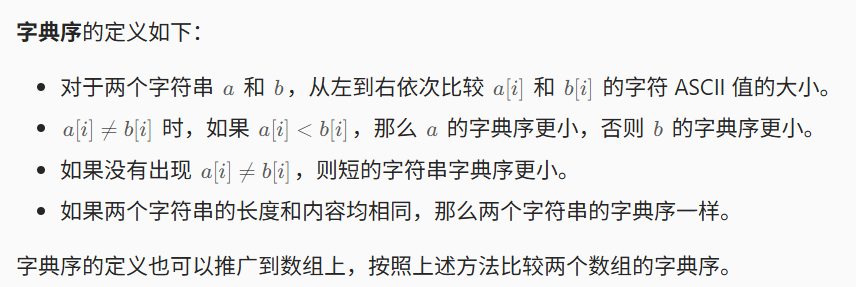

# 贪心算法（基本贪心策略/反悔/区间/字典序/数学/思维/构造）

链接：https://leetcode.cn/discuss/post/g6KTKL/

前言
为方便大家练习，我把比较套路的贪心题目放在前面，更灵活的思维题和构造题放在后面。每个小节的题目均按照从易到难的顺序排列。

**如果做题时没有思路，推荐看看本文第五章的「思考清单」。**

# 一、贪心策略
有两种**基本贪心策略**：

从**最小/最大**开始贪心，优先考虑最小/最大的数，从小到大/从大到小贪心。在此基础上，衍生出了**反悔贪心**。
从**最左/最右**开始贪心，思考第一个数/最后一个数的贪心策略，把 n 个数的原问题转换成 n−1 个数（或更少）的子问题。

## §1.1 从最小/最大开始贪心
优先考虑最小/最大的数，从小到大/从大到小贪心。

如果答案与数组元素顺序无关，一般需要**排序**。排序后，可以遍历计算。


### [3074. 重新分装苹果](https://leetcode.cn/problems/apple-redistribution-into-boxes/)

给你一个长度为 `n` 的数组 `apple` 和另一个长度为 `m` 的数组 `capacity` 。

一共有 `n` 个包裹，其中第 `i` 个包裹中装着 `apple[i]` 个苹果。同时，还有 `m` 个箱子，第 `i` 个箱子的容量为 `capacity[i]` 个苹果。

请你选择一些箱子来将这 `n` 个包裹中的苹果重新分装到箱子中，返回你需要选择的箱子的 **最小** 数量。

**注意**，同一个包裹中的苹果可以分装到不同的箱子中。

**示例 1：**

```
输入：apple = [1,3,2], capacity = [4,3,1,5,2]
输出：2
解释：使用容量为 4 和 5 的箱子。
总容量大于或等于苹果的总数，所以可以完成重新分装。
```


返回需要选择的箱子的 **最小** 数量。

```C++
class Solution {
public:
    int minimumBoxes(vector<int>& apple, vector<int>& capacity) {
        //n 包裹  放apple[i] 个苹果
        //sumApple
        //m 箱子  放capacity[i] 个苹果
        //排序 先用大箱子 装 
        sort(capacity.begin(),capacity.end(),greater<int>{});
        int appleSum = reduce(apple.begin(),apple.end());
        int res=0;
        while(appleSum>0)
        {
            appleSum-=capacity[res];
            res++;
        }
        return res;
    }
};
```


### [2279. 装满石头的背包的最大数量](https://leetcode.cn/problems/maximum-bags-with-full-capacity-of-rocks/)

现有编号从 `0` 到 `n - 1` 的 `n` 个背包。给你两个下标从 **0** 开始的整数数组 `capacity` 和 `rocks` 。第 `i` 个背包最大可以装 `capacity[i]` 块石头，当前已经装了 `rocks[i]` 块石头。另给你一个整数 `additionalRocks` ，表示你可以放置的额外石头数量，石头可以往 **任意** 背包中放置。

请你将额外的石头放入一些背包中，并返回放置后装满石头的背包的 **最大** 数量*。*

**示例 1：**

```
输入：capacity = [2,3,4,5], rocks = [1,2,4,4], additionalRocks = 2
输出：3
解释：
1 块石头放入背包 0 ，1 块石头放入背包 1 。
每个背包中的石头总数是 [2,3,4,4] 。
背包 0 、背包 1 和 背包 2 都装满石头。
总计 3 个背包装满石头，所以返回 3 。
可以证明不存在超过 3 个背包装满石头的情况。
注意，可能存在其他放置石头的方案同样能够得到 3 这个结果。
```


```C++
class Solution {
public:
    int maximumBags(vector<int>& capacity, vector<int>& rocks, int additionalRocks) {
        int n = capacity.size();
        //剩余容量
        for(int i=0;i<n;i++) 
            capacity[i]-=rocks[i];
        sort(capacity.begin(),capacity.end()); // 剩余容量从小到大排序
        int i=0;
        while(i<n&&additionalRocks>=capacity[i])
        {
            additionalRocks-=capacity[i++];
        }
        return i;
    }
};
```


### [1833. 雪糕的最大数量 ](https://leetcode.cn/problems/maximum-ice-cream-bars/) 同上题（有一种计数排序的做法，但还没看，先用贪心吧）

```C++
class Solution {
public:
    int maxIceCream(vector<int>& costs, int coins) 
    {
        sort(costs.begin(),costs.end());
        int i=0;
        while(i<costs.size()&& coins>=costs[i])
        {
            coins-=costs[i++];
        }
        return i;
    }
};
```


### [1005. K 次取反后最大化的数组和](https://leetcode.cn/problems/maximize-sum-of-array-after-k-negations/)

给你一个整数数组 `nums` 和一个整数 `k` ，按以下方法修改该数组：

- 选择某个下标 `i` 并将 `nums[i]` 替换为 `-nums[i]` 。

重复这个过程恰好 `k` 次。可以多次选择同一个下标 `i` 。

以这种方式修改数组后，返回数组 **可能的最大和** 。

**示例 1：**

```
输入：nums = [4,2,3], k = 1
输出：5
解释：选择下标 1 ，nums 变为 [4,-2,3] 。
```


这个做法排序了，复杂度应该会高  有更快的 有O(n+C)的 但是官方代码写得很烂，暂时不想看

```C++
class Solution {
public:
    int largestSumAfterKNegations(vector<int>& nums, int k) {
        //1、尽量让负的为正
        //2、如果负的都是正的了，然后还多了n次
        //n偶数，不变 翻同一个值
        //n奇数，翻一次绝对值最小的

        sort(nums.begin(),nums.end());
        int i=0;
        for(i=0;i<nums.size();i++)
        {
            if(nums[i]<0&&k>0)
            {
                nums[i]=-nums[i];
                k--;
            }
            else
            {
                break;
            }
        }
        int sum = reduce(nums.begin(),nums.end());
        if(k>0)
        {
            //表示可以翻偶数次某个数，最后翻回原值
            if(k%2==0)
            {
                return sum;
            }
            else
            {
                int minNum = *min_element(nums.begin(),nums.end());
                sum-=2*minNum;
            }
        }
        return sum;

    }
};
```


### [1481. 不同整数的最少数目](https://leetcode.cn/problems/least-number-of-unique-integers-after-k-removals/)

给你一个整数数组 `arr` 和一个整数 `k` 。现需要从数组中恰好移除 `k` 个元素，请找出移除后数组中不同整数的最少数目。

**示例 1：**

```
输入：arr = [5,5,4], k = 1
输出：1
解释：移除 1 个 4 ，数组中只剩下 5 一种整数。
```

```C++
class Solution {
public:
    int findLeastNumOfUniqueInts(vector<int>& arr, int k) {
        //尽量把出现频率低的移除
        unordered_map<int,int> umap;
        int n=arr.size();
        for(int i=0;i<n;i++)
        {
            umap[arr[i]]++;
        }
        //排序
        vector<pair<int,int>> vec(umap.begin(),umap.end());
        sort(vec.begin(),vec.end(),[](const auto& a,const auto& b){return a.second<b.second;});
        int i=0;
        for(auto &[_,s]:vec)
        {
            if(k>=s)
            {
                k-=s;
                i++;
            }
            else
            {
                break;
            }
        }
        return vec.size()-i;
    }
};
```


### [1403. 非递增顺序的最小子序列](https://leetcode.cn/problems/minimum-subsequence-in-non-increasing-order/)

给你一个数组 `nums`，请你从中抽取一个子序列，满足该子序列的元素之和 **严格** 大于未包含在该子序列中的各元素之和。

如果存在多个解决方案，只需返回 **长度最小** 的子序列。如果仍然有多个解决方案，则返回 **元素之和最大** 的子序列。

与子数组不同的地方在于，「数组的子序列」不强调元素在原数组中的连续性，也就是说，它可以通过从数组中分离一些（也可能不分离）元素得到。

**注意**，题目数据保证满足所有约束条件的解决方案是 **唯一** 的。同时，返回的答案应当按 **非递增顺序** 排列。

**示例 1：**

```
输入：nums = [4,3,10,9,8]
输出：[10,9] 
解释：子序列 [10,9] 和 [10,8] 是最小的、满足元素之和大于其他各元素之和的子序列。但是 [10,9] 的元素之和最大。 
```


解答

```C++
class Solution {
public:
    vector<int> minSubsequence(vector<int>& nums) 
    {
        //sort
        sort(nums.begin(),nums.end(),greater<int>{});
        //presum
        //presum>total-presum 的第一个 即2pres>total  的第一个值
        int n=nums.size();
        vector<int> presum(n);
        partial_sum(nums.begin(),nums.end(),presum.begin());
        int totalSum = presum[n-1];
        int idx = upper_bound(presum.begin(),presum.end(),0.5*totalSum)-presum.begin();
        return vector<int>(nums.begin(),nums.begin()+idx+1);
    }
};
```


### [3010. 将数组分成最小总代价的子数组 I](https://leetcode.cn/problems/divide-an-array-into-subarrays-with-minimum-cost-i/)

给你一个长度为 `n` 的整数数组 `nums` 。

一个数组的 **代价** 是它的 **第一个** 元素。比方说，`[1,2,3]` 的代价是 `1` ，`[3,4,1]` 的代价是 `3` 。

你需要将 `nums` 分成 `3` 个 **连续且没有交集** 的子数组。

请你返回这些子数组的 **最小** 代价 **总和** 。

**示例 1：**

```
输入：nums = [1,2,3,12]
输出：6
解释：最佳分割成 3 个子数组的方案是：[1] ，[2] 和 [3,12] ，总代价为 1 + 2 + 3 = 6 。
其他得到 3 个子数组的方案是：
- [1] ，[2,3] 和 [12] ，总代价是 1 + 2 + 12 = 15 。
- [1,2] ，[3] 和 [12] ，总代价是 1 + 3 + 12 = 16 。
```


```C++
class Solution {
public:
    int minimumCost(vector<int>& nums) 
    {
        //第一个一定要选 ， 找到除了第一个以外，最小的2个数字， top2问题 
        nth_element(nums.begin()+1,nums.begin()+2,nums.end()); //回忆nth_element这个接口,可以参考https://www.geeksforgeeks.org/stdnth_element-in-cpp/
        return nums[0]+nums[1]+nums[2];

        //10 3 1 1 
        //10之后找到两个最小的数字
    }
};
```

O（n）寻找最小和次小

```C++
class Solution {
public:
    int minimumCost(vector<int>& nums) 
    {
        //第一个一定要选 ， 找到除了第一个最小的2个数字， top2问题 
        //维护最小值和次小值
        int fi=INT_MAX,se = INT_MAX;
        for(int i=1;i<nums.size();i++)//fron 1
        {
            if(nums[i]<fi)
            {
                se=fi;
                fi=nums[i];
            }
            else if(nums[i]<se)
            {
                se = nums[i];
            }
        }
        return nums[0]+fi+se;
    }
};
```


### [1338. 数组大小减半](https://leetcode.cn/problems/reduce-array-size-to-the-half/)

给你一个整数数组 `arr`。你可以从中选出一个整数集合，并删除这些整数在数组中的每次出现。

返回 **至少** 能删除数组中的一半整数的整数集合的最小大小。

**示例 1：**

```
输入：arr = [3,3,3,3,5,5,5,2,2,7]
输出：2
解释：选择 {3,7} 使得结果数组为 [5,5,5,2,2]、长度为 5（原数组长度的一半）。
大小为 2 的可行集合有 {3,5},{3,2},{5,2}。
选择 {2,7} 是不可行的，它的结果数组为 [3,3,3,3,5,5,5]，新数组长度大于原数组的二分之一。
```

```c++
typedef pair<int, int> PII;
struct compare
{
    bool operator()(const PII& a, const PII& b)
    {
        return a.second > b.second;
    }
};
class Solution {
public:
    int minSetSize(vector<int>& arr) {
        //放到哈希表里,然后排序
        unordered_map<int, int> umap;
        int total = arr.size();
        for(int i=0;i<total;i++)
        {
            umap[arr[i]]++;
        }
        vector<PII> vec(umap.begin(), umap.end());
        sort(vec.begin(), vec.end(), compare());
        int cnt = 0;
        int sum = 0;
        for(auto& p: vec)
        {
            sum += p.second;
            cnt++;
            if(sum>=total/2) break;
        }
        return cnt;
    }
};
```


### [1710. 卡车上的最大单元数](https://leetcode.cn/problems/maximum-units-on-a-truck/)

请你将一些箱子装在 **一辆卡车** 上。给你一个二维数组 `boxTypes` ，其中 `boxTypes[i] = [numberOfBoxesi, numberOfUnitsPerBoxi]` ：

- `numberOfBoxesi` 是类型 `i` 的箱子的数量。
- `numberOfUnitsPerBoxi` 是类型 `i` 每个箱子可以装载的单元数量。

整数 `truckSize` 表示卡车上可以装载 **箱子** 的 **最大数量** 。只要箱子数量不超过 `truckSize` ，你就可以选择任意箱子装到卡车上。

返回卡车可以装载 **单元** 的 **最大** 总数*。*

**示例 1：**

```
输入：boxTypes = [[1,3],[2,2],[3,1]], truckSize = 4
输出：8
解释：箱子的情况如下：
- 1 个第一类的箱子，里面含 3 个单元。
- 2 个第二类的箱子，每个里面含 2 个单元。
- 3 个第三类的箱子，每个里面含 1 个单元。
可以选择第一类和第二类的所有箱子，以及第三类的一个箱子。
单元总数 = (1 * 3) + (2 * 2) + (1 * 1) = 8
```

```c++
class Solution {
public:
    static bool compare(vector<int>& a, vector<int>& b) //注意得是static
    {
        return a[1] > b[1];
    }
    int maximumUnits(vector<vector<int>>& boxTypes, int truckSize) {
        //把boxTypes数组按照numberOfUnitsPerBox从大到小排序,然后计算即可
        sort(boxTypes.begin(), boxTypes.end(), compare);
        int sum = 0;
        int cnt = 0;
        int n = boxTypes.size();
        for(int i=0;i<n;i++)
        {
            if(sum + boxTypes[i][0] > truckSize)
            {
                cnt += (truckSize - sum) * boxTypes[i][1] ; //剩下的都装当前的箱子种类
                break;
            }
            else
            {
                sum += boxTypes[i][0];
                cnt += boxTypes[i][1] * boxTypes[i][0];
            }
        }
        return cnt;
    }
};
```


### [3075. 幸福值最大化的选择方案](https://leetcode.cn/problems/maximize-happiness-of-selected-children/) :eye:
给你一个长度为 `n` 的数组 `happiness` ，以及一个 **正整数** `k` 。

`n` 个孩子站成一队，其中第 `i` 个孩子的 **幸福值** 是 `happiness[i]` 。你计划组织 `k` 轮筛选从这 `n` 个孩子中选出 `k` 个孩子。

在每一轮选择一个孩子时，所有 **尚未** 被选中的孩子的 **幸福值** 将减少 `1` 。注意，幸福值 **不能** 变成负数，且只有在它是正数的情况下才会减少。

选择 `k` 个孩子，并使你选中的孩子幸福值之和最大，返回你能够得到的 **最大值** 。

**示例 1：**

```
输入：happiness = [1,2,3], k = 2
输出：4
解释：按以下方式选择 2 个孩子：
- 选择幸福值为 3 的孩子。剩余孩子的幸福值变为 [0,1] 。
- 选择幸福值为 1 的孩子。剩余孩子的幸福值变为 [0] 。注意幸福值不能小于 0 。
所选孩子的幸福值之和为 3 + 1 = 4 。
```
代码：

> [划分型 DP 的套路【力扣周赛 388】_哔哩哔哩_bilibili](https://www.bilibili.com/video/BV1Xr421J77b/?vd_source=f0e5ebbc6d14fe7f10f6a52debc41c99),证明在这个视频的前4分钟。
>
> 首先，应当选 happiness 中最大的 k 的数。
>
> 这些数要按照什么顺序选呢？
>
> 由于小的数减成 0 就不再减少了，优先选大的更好。
>
> 比如 2,1,1，如果按照 1,1,2 的顺序选，答案为 1+0+0=1。但按照 2,1,1 的顺序选，答案为 2+0+0=2 更优。
>
> m类似说 反正我最终要造成的伤害是一样的，但是如果有的人先死了我对其造成的伤害就会没有，我造成的总伤害就减少了

```c++
class Solution {
public:
    long long maximumHappinessSum(vector<int>& happiness, int k) {
        //选择最大的k个数,第i个数happiness[i]做处理:max(happiness[i] - i, 0);结果累加到最终值上去(当然也可以在for循环里提前剪枝)
        long long res = 0;
        //注意,本题只能用排序来做,不能优化为快速选择,因为前k个值都要求有序递减,快速选择无法保证这一点
        sort(happiness.begin(), happiness.end(), greater<int>());
        for(int i=0;i<k;i++)
        {
            res += (long long)max(happiness[i] - i, 0);
        }
        return res;
    }
};
```


### [2554. 从一个范围内选择最多整数 I](https://leetcode.cn/problems/maximum-number-of-integers-to-choose-from-a-range-i/)

> 给你一个整数数组 `banned` 和两个整数 `n` 和 `maxSum` 。你需要按照以下规则选择一些整数：
>
> - 被选择整数的范围是 `[1, n]` 。
> - 每个整数 **至多** 选择 **一次** 。
> - 被选择整数不能在数组 `banned` 中。
> - 被选择整数的和不超过 `maxSum` 。
>
> 请你返回按照上述规则 **最多** 可以选择的整数数目。

用哈希即可。不要想着对`banned`数组排序什么的，复杂度又高，又不好写（写的很不好看）。最终代码如下：

```c++
class Solution {
public:
    int maxCount(vector<int>& banned, int n, int maxSum) {
        unordered_set<int> uset;
        int sz = banned.size();
        for(int i=0;i<sz;i++)
        {
            if(!uset.contains(banned[i]))
                uset.insert(banned[i]);
        }
        int curSum = 0;
        for(int cur=1;cur<=n;cur++) //用for循环+continue/break是比较好写的，如果用while的话感觉不是特别好写，以后可以优先选for循环的写法。
        {
            if(uset.contains(cur)) continue;
            if(curSum + cur > maxSum) break;
            else
            {
                curSum += cur;
                cnt++;
            }
        }
        return cnt;
    }
};
```


### [2126. 摧毁小行星](https://leetcode.cn/problems/destroying-asteroids/)

注意可能出现的越界问题：

```c++
class Solution {
public:
    bool asteroidsDestroyed(int mass, vector<int>& asteroids) {
        //按照从小到大的顺序与小行星碰撞,假设碰撞a和b都是合法的,那肯定是先撞小的那个更稳妥一些
        int n = asteroids.size();
        sort(asteroids.begin(), asteroids.end());
        long long curSum = mass;
        int index = 0; //从0开始撞
        for( ;index<n;index++)
        {
            if(curSum>=asteroids[index])
            {
                curSum += (long long)asteroids[index];
            }
            else break;
        }
        return (index==n);

    }
};
```


### [2587. 重排数组以得到最大前缀分数](https://leetcode.cn/problems/rearrange-array-to-maximize-prefix-score/)

> 给你一个下标从 **0** 开始的整数数组 `nums` 。你可以将 `nums` 中的元素按 **任意顺序** 重排（包括给定顺序）。
>
> 令 `prefix` 为一个数组，它包含了 `nums` 重新排列后的前缀和。换句话说，`prefix[i]` 是 `nums` 重新排列后下标从 `0` 到 `i` 的元素之和。`nums` 的 **分数** 是 `prefix` 数组中正整数的个数。
>
> 返回可以得到的最大分数。
>
> **示例 1：**
>
> ```
> 输入：nums = [2,-1,0,1,-3,3,-3]
> 输出：6
> 解释：数组重排为 nums = [2,3,1,-1,-3,0,-3] 。
> prefix = [2,5,6,5,2,2,-1] ，分数为 6 。
> 可以证明 6 是能够得到的最大分数。
> ```

贪心思路的基本证明:

对于一个负数来说，它后面的前缀和都会把这个负数加进去。

由于要统计的是正数前缀和，那么把负数尽量放在后面，能统计到尽量多的正数前缀和。

同时，绝对值小的负数应该排在负数的前面，尽量在前缀和减为负数前还能多统计一些正数。

```c++
class Solution {
public:
    int maxScore(vector<int>& nums) {
        sort(nums.begin(), nums.end(), greater<int>());
        int n = nums.size();
        int cnt = 0;
        long long sum = 0;
        for(int i=0;i<n;i++)
        {
            if(sum + nums[i] > 0)
            {
                cnt++;
                sum += nums[i];
            }
            else break;
        }
        return cnt;
    }
};
```


### [976. 三角形的最大周长](https://leetcode.cn/problems/largest-perimeter-triangle/)

> 给定由一些正数（代表长度）组成的数组 `nums` ，返回 *由其中三个长度组成的、**面积不为零**的三角形的最大周长* 。如果不能形成任何面积不为零的三角形，返回 `0`。

这道题如果从大到小排序完，然后三轮for循环找结果的话会爆超出时间限制，所以需要对算法进行优化。实际上，只要一轮for循环就可以解决了，代码和注释如下：

```c++
class Solution {
public:
    int largestPerimeter(vector<int>& nums) {
        sort(nums.begin(), nums.end());
        int n = nums.size();
        //对于nums[i]来说,如果nums[i-1]+nums[i-2]<nums[i],那么前面的更不可能了,直接枚举下一个i即可
        //否则,nums[i] + nums[i-1] + nums[i-2]就是要求解的值
        for(int i=n-1;i>=2;i--)
        {
            if(nums[i-1] + nums[i-2] <= nums[i]) continue;
            return nums[i] + nums[i-1] + nums[i-2];
        }
        return 0;
    }
};
```


### [1561. 你可以获得的最大硬币数目](https://leetcode.cn/problems/maximum-number-of-coins-you-can-get/)

> 有 3n 堆数目不一的硬币，你和你的朋友们打算按以下方式分硬币：
>
> - 每一轮中，你将会选出 **任意** 3 堆硬币（不一定连续）。
> - Alice 将会取走硬币数量最多的那一堆。
> - 你将会取走硬币数量第二多的那一堆。
> - Bob 将会取走最后一堆。
> - 重复这个过程，直到没有更多硬币。
>
> 给你一个整数数组 `piles` ，其中 `piles[i]` 是第 `i` 堆中硬币的数目。
>
> 返回你可以获得的最大硬币数目。

代码如下：
```c++
class Solution {
public:
    int maxCoins(vector<int>& piles) {
        //让Bob亏麻了,同时不让Alice赢太多
        sort(piles.begin(), piles.end());
        int n = piles.size();
        int ans = 0;
        int left = 0, right = n - 2;
        while(left < right)
        {
            ans += piles[right];
            right -= 2;
            left++;
        }
        return ans;
    }
};
```


### [3462. 提取至多 K 个元素的最大总和](https://leetcode.cn/problems/maximum-sum-with-at-most-k-elements/)

> 给你一个大小为 `n x m` 的二维矩阵 `grid` ，以及一个长度为 `n` 的整数数组 `limits` ，和一个整数 `k` 。你的目标是从矩阵 `grid` 中提取出 **至多** `k` 个元素，并计算这些元素的最大总和，提取时需满足以下限制**：**
>
> - 从 `grid` 的第 `i` 行提取的元素数量不超过 `limits[i]` 。
>
> 返回最大总和。
>
> **示例 1：**
>
> **输入：**grid = [[1,2],[3,4]], limits = [1,2], k = 2
>
> **输出：**7
>
> **解释：**
>
> - 从第 2 行提取至多 2 个元素，取出 4 和 3 。
> - 至多提取 2 个元素时的最大总和 `4 + 3 = 7` 。

```c++
class Solution {
public:
    long long maxSum(vector<vector<int>>& grid, vector<int>& limits, int k) {
        //grid没有负数,因此肯定是选满k个最好
        //每一行取limit这么多大的数(快速选择),然后在这里面取topk即可
        int n = grid.size();
        int m = grid[0].size();
        int sum = accumulate(limits.begin(), limits.end(), 0);
        vector<int> candidates(sum, 0);
        int index = 0;
        for(int row = 0;row < n;row++)
        {
            nth_element(grid[row].begin(), grid[row].begin() + limits[row] - 1, grid[row].end(), greater<int>());
            for(int i=0;i<limits[row];i++)
            {
                candidates[index++] = grid[row][i];
            }
        }
        sort(candidates.begin(), candidates.end(), greater<int>());
        long long ans = 0;
        for(int i=0;i<k;i++)
        {
            ans += (long long)candidates[i];
        }
        return ans;
    }
};
```

orY: 或者用`nth_element(allGridLimit.begin(),allGridLimit.begin()+k-1,allGridLimit.end(),greater<int>());`

```C++
class Solution {
public:
    long long maxSum(vector<vector<int>>& grid, vector<int>& limits, int k) {
        vector<int> allGridLimit;
        if(k==0)return 0;
        for(int i=0;i<grid.size();i++)
        {
            if(limits[i]==0)continue;
            nth_element(grid[i].begin(),grid[i].begin()+limits[i]-1,grid[i].end(),greater<int>());
            for(int j=0;j<limits[i];j++)
            {
                allGridLimit.emplace_back(grid[i][j]);
            }
        }
        nth_element(allGridLimit.begin(),allGridLimit.begin()+k-1,allGridLimit.end(),greater<int>());//
        long long res=0;
        for(int i=0;i<k;i++)
        {
            res += allGridLimit[i];
        }
        return res;
    }
};
```


### [3301. 高度互不相同的最大塔高和](https://leetcode.cn/problems/maximize-the-total-height-of-unique-towers/)

> 给你一个数组 `maximumHeight` ，其中 `maximumHeight[i]` 表示第 `i` 座塔可以达到的 **最大** 高度。
>
> 你的任务是给每一座塔分别设置一个高度，使得：
>
> 1. 第 `i` 座塔的高度是一个正整数，且不超过 `maximumHeight[i]` 。
> 2. 所有塔的高度互不相同。
>
> 请你返回设置完所有塔的高度后，可以达到的 **最大** 总高度。如果没有合法的设置，返回 `-1` 。

```c++
class Solution {
public:
    long long maximumTotalSum(vector<int>& maximumHeight) {
        sort(maximumHeight.begin(), maximumHeight.end());
        int mx = maximumHeight.back();
        int n = maximumHeight.size();

        int start = mx; //一开始分配的数
        long long ans = 0;
        //优先满足大的,不然后面只能越来越小,非常不划算
        int index = n-1;
        for(;index>=0;index--)
        {
            start = min(maximumHeight[index], start); 
            if(start<=0) break;//这里也可以直接return -1;
            ans += (long long)start;
            start--; //每次start-1,保证下一次分配的时候一定比现在少1
        }
        if(index>=0) return -1; //分配不完,无法达成要求
        return ans;
    }
};
```


### ==补充困难题：[1840. 最高建筑高度](https://leetcode.cn/problems/maximum-building-height/)==

> 有点难了，后面再来做吧。


### [945. 使数组唯一的最小增量](https://leetcode.cn/problems/minimum-increment-to-make-array-unique/)

> 给你一个整数数组 `nums` 。每次 move 操作将会选择任意一个满足 `0 <= i < nums.length` 的下标 `i`，并将 `nums[i]` 递增 `1`。
>
> 返回使 `nums` 中的每个值都变成唯一的所需要的最少操作次数。
>
> 生成的测试用例保证答案在 32 位整数范围内。

跟上一题有类似之处，代码如下：（思路就是尽量把小的数分给小的候选人）

```c++
class Solution {
public:
    int minIncrementForUnique(vector<int>& nums) {
        //也就是用最小的操作次数让数组每个元素的值都不相等,跟之前的题目比较类似
        sort(nums.begin(), nums.end());
        int ans = 0; //32位整数范围内
        int start = nums[0];
        int n = nums.size();
        for(int i=1;i<n;i++)
        {
            start = max(start + 1, nums[i]);
            ans += (start - nums[i]);
        }
        return ans;
        
    }
};
```


### [1846. 减小和重新排列数组后的最大元素](https://leetcode.cn/problems/maximum-element-after-decreasing-and-rearranging/)

> 给你一个正整数数组 `arr` 。请你对 `arr` 执行一些操作（也可以不进行任何操作），使得数组满足以下条件：
>
> - `arr` 中 **第一个** 元素必须为 `1` 。
> - 任意相邻两个元素的差的绝对值 **小于等于** `1` ，也就是说，对于任意的 `1 <= i < arr.length` （**数组下标从 0 开始**），都满足 `abs(arr[i] - arr[i - 1]) <= 1` 。`abs(x)` 为 `x` 的绝对值。
>
> 你可以执行以下 2 种操作任意次：
>
> - **减小** `arr` 中任意元素的值，使其变为一个 **更小的正整数** 。
> - **重新排列** `arr` 中的元素，你可以以任意顺序重新排列。
>
> 请你返回执行以上操作后，在满足前文所述的条件下，`arr` 中可能的 **最大值** 。

```c++
class Solution {
public:
    int maximumElementAfterDecrementingAndRearranging(vector<int>& arr) {
        //注意数组元素只能减少,每个元素都不可能增大
        int n = arr.size();
        sort(arr.begin(), arr.end());
        int start = 1;
        for(int i=1;i<n;i++)
        {
            start = min(start + 1, arr[i]); //尽量等于上一个+1,但是最高是arr[i]的值
        }
        return start;
    }
};
```


### [1647. 字符频次唯一的最小删除次数](https://leetcode.cn/problems/minimum-deletions-to-make-character-frequencies-unique/)

> 如果字符串 `s` 中 **不存在** 两个不同字符 **频次** 相同的情况，就称 `s` 是 **优质字符串** 。
>
> 给你一个字符串 `s`，返回使 `s` 成为 **优质字符串** 需要删除的 **最小** 字符数。
>
> 字符串中字符的 **频次** 是该字符在字符串中的出现次数。例如，在字符串 `"aab"` 中，`'a'` 的频次是 `2`，而 `'b'` 的频次是 `1` 。

代码如下：

```c++
class Solution {
public:
    int minDeletions(string s) {
        unordered_map<char, int> umap;
        for(char c: s)
        {
            umap[c]++;
        }
        int n = umap.size();
        vector<int> vec(n);
        int index = 0;
        for(auto& [k, v] : umap)
        {
            vec[index++] = v;
        }
        sort(vec.begin(), vec.end());
        //此时已经按照词频从小到大排序了
        
        int ans = 0; //最少要删除的个数,从小到大并回退,和从大到小理论上结果是一致的,但从大到小比较好算
        int start = vec[n-1];
        for(int index = n-2;index>=0;index--)
        {
            start = min(start-1, vec[index]);
            if(start<0) start = 0; //相当于此时需要全删掉了
            ans += (vec[index]-start);
        }
        return ans;
    }
};
```

其实也可以用数组来替代哈希表，会快一些：
```c++
class Solution {
public:
    int minDeletions(string s) {
        int n = 26;
        vector<int> vec(26);
        int index = 0;
        for(char c: s)
        {
            vec[c-'a']++;
        }
        sort(vec.begin(), vec.end());
        //此时已经按照词频从小到大排序了
        
        int ans = 0; //最少要删除的个数,从小到大并回退,和从大到小理论上结果是一致的,但从大到小比较好算
        int start = vec[n-1];
        for(int index = n-2;index>=0;index--)
        {
            start = min(start-1, vec[index]);
            if(start<0) start = 0; //相当于此时需要全删掉了
            ans += (vec[index]-start);
        }
        return ans;
    }
};
```

注：本题贪心的思路可以参考：[1647. 字符频次唯一的最小删除次数 - 力扣（LeetCode）](https://leetcode.cn/problems/minimum-deletions-to-make-character-frequencies-unique/solutions/2015660/by-stormsunshine-g9ov/).后面可以回头看看怎么对这件事进行直观证明。


### 小结论

对于使得每一项值都不相同的贪心题目，暂时有如下结论：

- 如果是对每一项只能做增加的操作，就从小到大排序后从左到右遍历，`max(start+1, nums[i])`，对应945这道题；
- 如果是对每一项只能做减少的操作，就从小到大排序后从右到左遍历，`min(start-1，nums[i])`.

注：并不是所有都这样，因题目而异，但大部分可以做这种类型的思路尝试。


### [2971. 找到最大周长的多边形](https://leetcode.cn/problems/find-polygon-with-the-largest-perimeter/)  :eye:

> 给你一个长度为 `n` 的 **正** 整数数组 `nums` 。
>
> **多边形** 指的是一个至少有 `3` 条边的封闭二维图形。多边形的 **最长边** 一定 **小于** 所有其他边长度之和。
>
> 如果你有 `k` （`k >= 3`）个 **正** 数 `a1`，`a2`，`a3`, ...，`ak` 满足 `a1 <= a2 <= a3 <= ... <= ak` **且** `a1 + a2 + a3 + ... + ak-1 > ak` ，那么 **一定** 存在一个 `k` 条边的多边形，每条边的长度分别为 `a1` ，`a2` ，`a3` ， ...，`ak` 。
>
> 一个多边形的 **周长** 指的是它所有边之和。
>
> 请你返回从 `nums` 中可以构造的 **多边形** 的 **最大周长** 。如果不能构造出任何多边形，请你返回 `-1` 。

本题看起来是`976.三角形的最大周长`的进阶题目。

```c++
class Solution {
public:
    long long largestPerimeter(vector<int>& nums) {
        //用前缀和进行优化
        int n = nums.size();
        sort(nums.begin(), nums.end());
        vector<long long> prefix(n+1, 0);
        for(int i=0;i<n;i++)
        {
            prefix[i+1] = prefix[i] + (long long)nums[i];
        }
        long long ans = -1;
        for(int i = n-1;i>=2;i--) //最少得是三角形,所以i=2是最后需要遍历的
        {
            long long preSum = prefix[i];
            if(preSum > nums[i]) //如果preSum<=nums[i],说明拼尽全力无法战胜
            {
                ans = max(ans, preSum + nums[i]);
            }
        }
        return ans;
    }
};
```

or：

```C++
class Solution {
public:
    long long largestPerimeter(vector<int>& nums) {
        long long res=0;
        long long totalSum = reduce(nums.begin(),nums.end(),0L);//必须要是0L 否则放不下

        sort(nums.begin(),nums.end(),greater<int>());
        for(int i=0;i<nums.size()-2;i++)
        {
            totalSum = totalSum-nums[i];
            if(nums[i]<totalSum)
            {
                return (long long)(nums[i]+totalSum);
            }
        }
        return -1;
    }
};
```


### [2178. 拆分成最多数目的正偶数之和](https://leetcode.cn/problems/maximum-split-of-positive-even-integers/)

> 给你一个整数 `finalSum` 。请你将它拆分成若干个 **互不相同** 的正偶数之和，且拆分出来的正偶数数目 **最多** 。
>
> - 比方说，给你 `finalSum = 12` ，那么这些拆分是 **符合要求** 的（互不相同的正偶数且和为 `finalSum`）：`(2 + 10)` ，`(2 + 4 + 6)` 和 `(4 + 8)` 。它们中，`(2 + 4 + 6)` 包含最多数目的整数。注意 `finalSum` 不能拆分成 `(2 + 2 + 4 + 4)` ，因为拆分出来的整数必须互不相同。
>
> 请你返回一个整数数组，表示将整数拆分成 **最多** 数目的正偶数数组。如果没有办法将 `finalSum` 进行拆分，请你返回一个 **空** 数组。你可以按 **任意** 顺序返回这些整数。

```c++
class Solution {
public:
    vector<long long> maximumEvenSplit(long long finalSum) {
        //2+4+6+8+...这么拆分
        //至少奇数是不可能的
        vector<long long> res;
        if(finalSum % 2==1) return res;
        long long curSum = 0;
        long long curval = 2; //2,4,6
        while(curSum < finalSum)
        {
            long long remain = finalSum - curSum;
            if(remain < curval + curval + 2) //剩下的放不下两个数了,直接把remain放进去,然后结束
            {
                res.emplace_back(remain);
                break;
            }
            curSum += curval;
            res.emplace_back(curval);
            curval += 2;
        }
        return res;
    }
};
```


### [2567. 修改两个元素的最小分数](https://leetcode.cn/problems/minimum-score-by-changing-two-elements/) :eye:

给你一个下标从 **0** 开始的整数数组 `nums` 。

- `nums` 的 **最小** 得分是满足 `0 <= i < j < nums.length` 的 `|nums[i] - nums[j]|` 的最小值。
- `nums`的 **最大** 得分是满足 `0 <= i < j < nums.length` 的 `|nums[i] - nums[j]|` 的最大值。
- `nums` 的分数是 **最大** 得分与 **最小** 得分的和。

我们的目标是最小化 `nums` 的分数。你 **最多** 可以修改 `nums` 中 **2** 个元素的值。

请你返回修改 `nums` 中 **至多两个** 元素的值后，可以得到的 **最小分数** 。

`|x|` 表示 `x` 的绝对值。

**示例 1：**

```
输入：nums = [1,4,3]
输出：0
解释：将 nums[1] 和 nums[2] 的值改为 1 ，nums 变为 [1,1,1] 。|nums[i] - nums[j]| 的值永远为 0 ，所以我们返回 0 + 0 = 0 。
```

```c++
class Solution {
public:
    int minimizeSum(vector<int>& nums) {
        //数组中都是>0的数,最小得分比较好办,肯定可以造出一个0,跟最大值或者最小值拼就可以了
        sort(nums.begin(), nums.end());
        int n = nums.size();
        //最大得分,有三种情况:把最大的两个数改成倒数第三个大的数,把最小的两个数改成第三个小的数,以及最大最小各变换一个
        int res1 = nums[n-1] - nums[2];
        int res2 = nums[n-3] - nums[0];
        int res3 = nums[n-2] - nums[1];
        return min({res1, res2, res3});
        
    }
};
```

> 具体的题解可以看这篇:[2567. 修改两个元素的最小分数 - 力扣（LeetCode）](https://leetcode.cn/problems/minimum-score-by-changing-two-elements/solutions/2119454/nao-jin-ji-zhuan-wan-by-endlesscheng-9l4m/)


### [1509. 三次操作后最大值与最小值的最小差](https://leetcode.cn/problems/minimum-difference-between-largest-and-smallest-value-in-three-moves/)

给你一个数组 `nums` 。

每次操作你可以选择 `nums` 中的任意一个元素并将它改成 **任意值** 。

在 **执行最多三次移动后** ，返回 `nums` 中最大值与最小值的最小差值。

**示例 1：**

```
输入：nums = [5,3,2,4]
输出：0
解释：我们最多可以走 3 步。
第一步，将 2 变为 3 。 nums 变成 [5,3,3,4] 。
第二步，将 4 改为 3 。 nums 变成 [5,3,3,3] 。
第三步，将 5 改为 3 。 nums 变成 [3,3,3,3] 。
执行 3 次移动后，最小值和最大值之间的差值为 3 - 3 = 0 。
```

跟上一题比较像，思考和具体的代码如下：

```c++
class Solution {
public:
    int minDifference(vector<int>& nums) {
        sort(nums.begin(), nums.end());
        int n = nums.size();
        if(n<=4) return 0;
        //1.小的这边改三个 2.大的那边改三个 3.小的改2个,大的改1个 4.小的改1个,大的改2个
        int res1 = nums[n-1] - nums[3];
        int res2 = nums[n-4] - nums[0];
        int res3 = nums[n-2] - nums[2];
        int res4 = nums[n-3] - nums[1];
        //cout<<res1<<" "<<res2<<" "<<res3<<" "<<res4<<endl;
        return min({res1, res2, res3, res4});
    }
};
```


### [3397. 执行操作后不同元素的最大数量](https://leetcode.cn/problems/maximum-number-of-distinct-elements-after-operations/)（有难度！） :recycle:

>  给你一个整数数组 `nums` 和一个整数 `k`。
>
> 你可以对数组中的每个元素 **最多** 执行 **一次** 以下操作：
>
> - 将一个在范围 `[-k, k]` 内的整数加到该元素上。
>
> 返回执行这些操作后，`nums` 中可能拥有的不同元素的 **最大** 数量。

贪心做法可以参考：[3397. 执行操作后不同元素的最大数量 - 力扣（LeetCode）](https://leetcode.cn/problems/maximum-number-of-distinct-elements-after-operations/solutions/3027034/cong-xiao-dao-da-tan-xin-pythonjavacgo-b-n023/)。这题还是比较有难度的。核心思路在于让每个人尽可能地往左站，代码如下：
```c++
class Solution {
public:
    int maxDistinctElements(vector<int>& nums, int k) {
        sort(nums.begin(), nums.end());
        int ans = 0;
        int pre = INT_MIN;
        for(int x: nums)
        {
            x = clamp(pre+1, x-k, x+k); //尽量往左站,pre+1试试,但不能超过当前的范围,不能就算了,能的话尽量+1,
            if(x>pre)
            {
                ans++;
                pre = x;
            }
        }
        return ans;
    }
};
```


>错误的思路:
>
>左右指针,左边尽量往左,右边尽量往右,中间相遇
>
>错误用例例如:
>
>输入
>
>nums=[13,10,9,9,13,10,13,11]
>
>k = 1


### [3457. 吃披萨](https://leetcode.cn/problems/eat-pizzas/)

给你一个长度为 `n` 的整数数组 `pizzas`，其中 `pizzas[i]` 表示第 `i` 个披萨的重量。每天你会吃 **恰好** 4 个披萨。由于你的新陈代谢能力惊人，当你吃重量为 `W`、`X`、`Y` 和 `Z` 的披萨（其中 `W <= X <= Y <= Z`）时，你只会增加 1 个披萨的重量！体重增加规则如下：

- 在 **奇数天**（按 **1 开始计数**）你会增加 `Z` 的重量。
- 在 **偶数天**，你会增加 `Y` 的重量。

请你设计吃掉 **所有** 披萨的最优方案，并计算你可以增加的 **最大** 总重量。

**注意：**保证 `n` 是 4 的倍数，并且每个披萨只吃一次。

**示例 1：**

**输入：** pizzas = [1,2,3,4,5,6,7,8]

**输出：** 14

**解释：**

- 第 1 天，你吃掉下标为 `[1, 2, 4, 7] = [2, 3, 5, 8]` 的披萨。你增加的重量为 8。
- 第 2 天，你吃掉下标为 `[0, 3, 5, 6] = [1, 4, 6, 7]` 的披萨。你增加的重量为 6。

吃掉所有披萨后，你增加的总重量为 `8 + 6 = 14`。


本题可以使用**交换论证法**来做贪心性质的证明，具体可以看这篇讲解：[网格图 DP【力扣周赛 437】_哔哩哔哩_bilibili](https://www.bilibili.com/video/BV1pmAGegEcw/?t=4m&vd_source=f0e5ebbc6d14fe7f10f6a52debc41c99)。代码如下：

```c++
class Solution {
public:
    long long maxWeight(vector<int>& pizzas) {
        int n = pizzas.size();
        int total = n / 4;
        int odd = (total + 1) / 2; //奇数天
        int even = total - odd; //偶数天
        sort(pizzas.begin(), pizzas.end(),greater<int>());
        
        long long ans = 0;
        for(int i=0;i<odd;i++)
        {
            ans += (long long) pizzas[i];
        }
        int start = odd + 1;
        while(even--)
        {
            ans += (long long) pizzas[start];
            start += 2;
        }
        return ans;
    }
};
```

> 结论，先吃最大的奇数天，然后隔一个吃偶数天，可以获得最大的体重。


### [LCP 40. 心算挑战](https://leetcode.cn/problems/uOAnQW/)（也比较难） :recycle:

> 「力扣挑战赛」心算项目的挑战比赛中，要求选手从 `N` 张卡牌中选出 `cnt` 张卡牌，若这 `cnt` 张卡牌数字总和为偶数，则选手成绩「有效」且得分为 `cnt` 张卡牌数字总和。 给定数组 `cards` 和 `cnt`，其中 `cards[i]` 表示第 `i` 张卡牌上的数字。 请帮参赛选手计算最大的有效得分。若不存在获取有效得分的卡牌方案，则返回 0。

具体思路：

- 首先，将数组从大到小排序，取前面的cnt个数。
- 如果累加的和sum是偶数，则直接返回，为最大有效值；
- 如果累加的和sum是奇数，则有两种策略：
  - （1）把前面cnt个数中最小的偶数换成后面n-cnt个数中最大的奇数
  - （2）把前面cnt个数中最小的奇数换成后面n-cnt个数中最大的偶数

针对上面的两种策略，有代码书写上的技巧。可以发现：

- 一种情况一定是将（自身）换成（后面与自身不同奇偶性的数），另一种则是将（自身前面与自身奇偶性不同的数）换成（后面与自身奇偶性相同的数）

有了以上的策略之后，就可以开始写代码了：

```c++
class Solution {
public:
    int maximumScore(vector<int>& cards, int cnt) {
        sort(cards.begin(), cards.end(), greater<int>());
        int n = cards.size();
        int sum = 0;
        for(int i=0;i<cnt;i++)
        {
            sum += cards[i];
        }
        if(sum%2==0) return sum;
        //sum是奇数,需要进行replace操作(找到x后面第一个跟x奇偶性不同的数)
        auto replace_sum = [&](int x) -> int
        {
            for(int index = cnt; index < n; index++)
            {
                if((x%2)!=(cards[index]%2))
                {
                    return sum - x + cards[index]; //x被替换后的总和 //① 👇
                }
            }
            return INT_MIN; //这种情况下不存在解
        };
        int x = cards[cnt - 1]; //最后一个选的数,一定是一种考虑情况
        int replace_x = replace_sum(x);
        //第二种情况,找到前面选的数中最小的跟x奇偶性不同的数,做替换
        int replace_y = INT_MIN;
        for(int i=cnt-2;i>=0;i--)
        {
            if((cards[i]%2) != (x%2))
            {
                replace_y = replace_sum(cards[i]);
                break;
            }
        }
        int ans = max(replace_x, replace_y);
        if(ans==INT_MIN) return 0;
        return ans;
    }
};
```

>👆①
>
>```C++
>return sum - x + cards[index];
>不可以写为
>sum = sum -x +cards[i];
>return sum;
>因为改变了sum  而我们用lambda[&]引用捕获 会错误
>```


### ==[1262. 可被三整除的最大和](https://leetcode.cn/problems/greatest-sum-divisible-by-three/)==


## §1.2 单序列配对

同上，从最小/最大的元素开始贪心。


### [2144. 打折购买糖果的最小开销](https://leetcode.cn/problems/minimum-cost-of-buying-candies-with-discount/) 1261

一家商店正在打折销售糖果。每购买 **两个** 糖果，商店会 **免费** 送一个糖果。

免费送的糖果唯一的限制是：它的价格需要小于等于购买的两个糖果价格的 **较小值** 。

- 比方说，总共有 `4` 个糖果，价格分别为 `1` ，`2` ，`3` 和 `4` ，一位顾客买了价格为 `2` 和 `3` 的糖果，那么他可以免费获得价格为 `1` 的糖果，但不能获得价格为 `4` 的糖果。

给你一个下标从 **0** 开始的整数数组 `cost` ，其中 `cost[i]` 表示第 `i` 个糖果的价格，请你返回获得 **所有** 糖果的 **最小** 总开销。

**示例 1：**

```
输入：cost = [1,2,3]
输出：5
解释：我们购买价格为 2 和 3 的糖果，然后免费获得价格为 1 的糖果。
总开销为 2 + 3 = 5 。这是开销最小的 唯一 方案。
注意，我们不能购买价格为 1 和 3 的糖果，并免费获得价格为 2 的糖果。
这是因为免费糖果的价格必须小于等于购买的 2 个糖果价格的较小值。
```


M1

3个打包卖

```C++
class Solution {
public:
    int minimumCost(vector<int>& cost) {
        sort(cost.begin(),cost.end(),greater<int>{});
        int res=0;
        int n = cost.size();
        for(int i=0;i<n;i++)
        {
            if(i%3!=2)res+=cost[i];
        }
        return res;
    }
};
```


M2: M

```C++
class Solution {
public:
    int minimumCost(vector<int>& cost) {
        //最大 第二大的一定会买
        //排序后一定可以送第三大的糖 
        //继续上述步骤 
        sort(cost.begin(),cost.end(),greater<int>{});
        //9 7 7 5 2 2 1 1
        int res=0;
        int n = cost.size();
        for(int i=0;i<n;)
        {
            if(i<n)
            {
                res+= cost[i];
                i++;
            }
            if(i<n)
            {
                res+= cost[i];
                i++;
            }
            if(i<n)
            {
                i++;
            }
        }
        return res;
    }
};
```


### [561. 数组拆分 ](https://leetcode.cn/problems/array-partition/)约 1300

给定长度为 `2n` 的整数数组 `nums` ，你的任务是将这些数分成 `n` 对, 例如 `(a1, b1), (a2, b2), ..., (an, bn)` ，使得从 `1` 到 `n` 的 `min(ai, bi)` 总和最大。

返回该 **最大总和** 。

**示例 1：**

```
输入：nums = [1,4,3,2]
输出：4
解释：所有可能的分法（忽略元素顺序）为：
1. (1, 4), (2, 3) -> min(1, 4) + min(2, 3) = 1 + 2 = 3
2. (1, 3), (2, 4) -> min(1, 3) + min(2, 4) = 1 + 2 = 3
3. (1, 2), (3, 4) -> min(1, 2) + min(3, 4) = 1 + 3 = 4
所以最大总和为 4
```

```C++
class Solution {
public:
    int arrayPairSum(vector<int>& nums) {
        // 大的数字和大的数字放一起
        sort(nums.begin(),nums.end(),greater<int>());
        int n =nums.size();
        int res=0;
        for(int i=1;i<n;i+=2)
        {
            res+=nums[i];
        }
        return res;
    }
};
```

OR(题目说了长度是2n)

```C++
class Solution {
public:
    int arrayPairSum(vector<int>& nums) {
        // 大的数字和大的数字放一起
        sort(nums.begin(),nums.end());
        int n =nums.size();
        int res=0;
        for(int i=0;i<n;i+=2)
        {
            res+=nums[i];
        }
        return res;
    }
};
```

证明：

https://leetcode.cn/problems/array-partition/solutions/5534/minshu-dui-bi-shi-you-xu-shu-lie-shang-xiang-lin-y/


### [1877. 数组中最大数对和的最小值](https://leetcode.cn/problems/minimize-maximum-pair-sum-in-array/)

一个数对 `(a,b)` 的 **数对和** 等于 `a + b` 。**最大数对和** 是一个数对数组中最大的 **数对和** 。

- 比方说，如果我们有数对 `(1,5)` ，`(2,3)` 和 `(4,4)`，**最大数对和** 为 `max(1+5, 2+3, 4+4) = max(6, 5, 8) = 8` 。

给你一个长度为 **偶数** `n` 的数组 `nums` ，请你将 `nums` 中的元素分成 `n / 2` 个数对，使得：

- `nums` 中每个元素 **恰好** 在 **一个** 数对中，且
- **最大数对和** 的值 **最小** 。

请你在最优数对划分的方案下，返回最小的 **最大数对和** 。

**示例 1：**

```
输入：nums = [3,5,2,3]
输出：7
解释：数组中的元素可以分为数对 (3,3) 和 (5,2) 。
最大数对和为 max(3+3, 5+2) = max(6, 7) = 7 。
```


```C++
class Solution {
public:
    int minPairSum(vector<int>& nums) 
    {
        //尽量平均
        //最大和最小放一起
        sort(nums.begin(),nums.end());
        int n= nums.size();
        int res=0;
        for(int i=0;i<n/2;i++)
        {
            res = max(res,nums[i]+nums[n-i-1]);
        }
        return res;
    }
};
```


最大数对和的最小值，贪心解的正确性证明：

https://leetcode.cn/problems/minimize-maximum-pair-sum-in-array/solutions/885704/gong-shui-san-xie-noxiang-xin-ke-xue-xi-ru29y


知道了上面的证明“非对称方式”不会比“对称方式”更优，那么我们首先对于第一步来说，比如我们取最小元素和其他东西配对，只有当另一个值取到最大元素（对称）的时候，结果最小（最优）

那么去掉这两个元素，继续取剩下数组中的最大和最小元素配对即可。


### [881. 救生艇](https://leetcode.cn/problems/boats-to-save-people/) 1530 经典题

给定数组 `people` 。`people[i]`表示第 `i` 个人的体重 ，**船的数量不限**，每艘船可以承载的最大重量为 `limit`。

每艘船最多可同时载两人，但条件是这些人的重量之和最多为 `limit`。

返回 *承载所有人所需的最小船数* 。

**示例 1：**

```
输入：people = [1,2], limit = 3
输出：1
解释：1 艘船载 (1, 2)
```


https://leetcode.cn/problems/boats-to-save-people/solutions/2828004/jian-ji-yi-dong-de-tu-shi-tui-dao-fu-duo-g02g/

```C++
class Solution {
public:
    int numRescueBoats(vector<int>& people, int limit) {
        int n = people.size();
        int cnt=0;
        int l=0,r=n-1;
        sort(people.begin(),people.end());
        while(l<=r)
        {
            if(people[l]+people[r]<=limit)
            {
                cnt++;
                l++;
                r--;
            }
            else
            {
                cnt++;
                r--;
            }
        }
        return cnt;
    }
};
```


### [2592. 最大化数组的伟大值](https://leetcode.cn/problems/maximize-greatness-of-an-array/)

给你一个下标从 0 开始的整数数组 `nums` 。你需要将 `nums` 重新排列成一个新的数组 `perm` 。

定义 `nums` 的 **伟大值** 为满足 `0 <= i < nums.length` 且 `perm[i] > nums[i]` 的下标数目。

请你返回重新排列 `nums` 后的 **最大** 伟大值。

 

**示例 1：**

```
输入：nums = [1,3,5,2,1,3,1]
输出：4
解释：一个最优安排方案为 perm = [2,5,1,3,3,1,1] 。
在下标为 0, 1, 3 和 4 处，都有 perm[i] > nums[i] 。因此我们返回 4 。
```

思路:田忌赛马:

```C++
class Solution {
public:
    int maximizeGreatness(vector<int>& nums) {
        //1 1 1 2 3 3 5 nums
        sort(nums.begin(),nums.end());
        int n =nums.size();
        int f=n-2;//nums
        int k=n-1;//perm
        int cnt=0;
        for(;k>=0&&f>=0;)
        {
            if(nums[k]>nums[f])
            {
                cnt++;
                k--;
                f--;
            }
            else
            {
                f--;
            }
        }
        return cnt;
    }
};
```


### [2576. 求出最多标记下标](https://leetcode.cn/problems/find-the-maximum-number-of-marked-indices/)（看答案） :cat:

给你一个下标从 **0** 开始的整数数组 `nums` 。

一开始，所有下标都没有被标记。你可以执行以下操作任意次：

- 选择两个 **互不相同且未标记** 的下标 `i` 和 `j` ，满足 `2 * nums[i] <= nums[j]` ，标记下标 `i` 和 `j` 。

请你执行上述操作任意次，返回 `nums` 中最多可以标记的下标数目。

**示例 1：**

```C++
输入：nums = [3,5,2,4]
输出：2
解释：第一次操作中，选择 i = 2 和 j = 1 ，操作可以执行的原因是 2 * nums[2] <= nums[1] ，标记下标 2 和 1 。
没有其他更多可执行的操作，所以答案为 2 。
```


#### M1 :二分

在二分专题中

假如最终有 K对匹配的数对，就一定是左边最小的 K个数与右边最大的K 个数进行匹配。


m:左边1区间中的红色，需要和右边2区间中的红色匹配（`int left = 0, right = n-k;`）

反证，如果与橙色（更小），那么一定能与红色。

​			如果与绿色（更大），那么右边2区间内不足k个，不是我们要的答案。

#### M2 :贪心

https://leetcode.cn/problems/find-the-maximum-number-of-marked-indices/solutions/2914153/tan-xin-pai-xu-shuang-zhi-zhen-tui-dao-z-bqx3/

**结论**：假如最终有 K对匹配的数对，就一定是左边最小的 K个数与右边最大的K 个数进行匹配。

由方法一的匹配方式可知，我们需要用 nums 左半部分中的数，去匹配 nums 右半部分中的数。

在 nums 的右半部分中，找到第一个满足 2⋅nums[0]≤nums[j] 的 j，那么 nums[1] 只能匹配右半部分中的下标大于 j 的数，依此类推。

这可以用同向双指针实现。

```C++
class Solution {
public:
    int maxNumOfMarkedIndices(vector<int>& nums) {
        sort(nums.begin(),nums.end());
        int n = nums.size();
        int i=0;
        for(int j=(n+1)/2;j<n;j++)
        {
            if(nums[i]*2<=nums[j])// 找到一个匹配
            {
                i++;
            }
        }
        return 2*i;
    }
};
```


## §1.3 双序列配对

同上，从最小/最大的元素开始贪心。

### （1）[455. 分发饼干](https://leetcode.cn/problems/assign-cookies/)

假设你是一位很棒的家长，想要给你的孩子们一些小饼干。但是，每个孩子最多只能给一块饼干。

对每个孩子 `i`，都有一个胃口值 `g[i]`，这是能让孩子们满足胃口的饼干的最小尺寸；并且每块饼干 `j`，都有一个尺寸 `s[j]` 。如果 `s[j] >= g[i]`，我们可以将这个饼干 `j` 分配给孩子 `i` ，这个孩子会得到满足。你的目标是满足尽可能多的孩子，并输出这个最大数值。

**示例 1:**

```C++
输入: g = [1,2,3], s = [1,1]
输出: 1
解释: 
你有三个孩子和两块小饼干，3 个孩子的胃口值分别是：1,2,3。
虽然你有两块小饼干，由于他们的尺寸都是 1，你只能让胃口值是 1 的孩子满足。
所以你应该输出 1。
```


从小到大排序

优先将小的饼干分给小胃口的孩子，孩子不够吃，再看看更大的饼干行不行

```C++
class Solution {
public:
    int findContentChildren(vector<int>& ch, vector<int>& co) {
        sort(ch.begin(), ch.end());
        int chn = ch.size();
        sort(co.begin(), co.end());
        int con = co.size();
        int chi = 0, coo = 0;
        for (; chi < chn && coo < con;)
        {
            if (co[coo] >= ch[chi])
            {
                coo++;
                chi++;
            }
            else
            {
                coo++;//看更大的cookie饼干能否满足孩子
            }
        }
        return chi;//返回可满足的孩子数量
    }
};
```


从大到小排序

优先将最大的饼干分给胃口最大的孩子，孩子不够吃，再给次大胃口的孩子

```C++
class Solution {
public:
    int findContentChildren(vector<int>& ch, vector<int>& co) {
        sort(ch.begin(), ch.end(), greater<int>());
        int chn = ch.size();
        sort(co.begin(), co.end(), greater<int>());
        int con = co.size();
        int chi = 0, coo = 0;
        for (; chi < chn && coo < con;)
        {
            if (co[coo] >= ch[chi])
            {
                coo++;
                chi++;
            }
            else
            {
                chi++;//看这个饼干 能否满足胃口更小的孩子能否 
            }
        }
        return coo;//返回可满足孩子的饼干数量
    }
};

```


### [2037. 使每位学生都有座位的最少移动次数](https://leetcode.cn/problems/minimum-number-of-moves-to-seat-everyone/)

一个房间里有 `n` 个 **空闲** 座位和 `n` 名 **站着的** 学生，房间用一个数轴表示。给你一个长度为 `n` 的数组 `seats` ，其中 `seats[i]` 是第 `i` 个座位的位置。同时给你一个长度为 `n` 的数组 `students` ，其中 `students[j]` 是第 `j` 位学生的位置。

你可以执行以下操作任意次：

- 增加或者减少第 `i` 位学生的位置，每次变化量为 `1` （也就是将第 `i` 位学生从位置 `x` 移动到 `x + 1` 或者 `x - 1`）

请你返回使所有学生都有座位坐的 **最少移动次数** ，并确保没有两位学生的座位相同。

请注意，初始时有可能有多个座位或者多位学生在 **同一** 位置。

**示例 1：**

```
输入：seats = [3,1,5], students = [2,7,4]
输出：4
解释：学生移动方式如下：
- 第一位学生从位置 2 移动到位置 1 ，移动 1 次。
- 第二位学生从位置 7 移动到位置 5 ，移动 2 次。
- 第三位学生从位置 4 移动到位置 3 ，移动 1 次。
总共 1 + 2 + 1 = 4 次移动。
```


由于座位和学生数相同，一个萝卜一个坑，将座位和学生位置排序后，第 i 个学生可以对应第 i 个座位。

由于交换任意两个学生对应的座位不会产生更少的移动次数（可以画一画），所以上述对应关系可以产生最少移动次数，累加位置之差即为答案。

```C++
class Solution {
public:
    int minMovesToSeat(vector<int>& seats, vector<int>& students) {
        sort(seats.begin(),seats.end());
        sort(students.begin(),students.end());
        int res=0;
        for(int i=0;i<seats.size();i++)
        {
            res+=abs(students[i]-seats[i]);
        }
        return res;
    }
};
```

由于在任何情况下，（排序后）交换两个学生的对应座位并不会使得答案更优


### [2410. 运动员和训练师的最大匹配数](https://leetcode.cn/problems/maximum-matching-of-players-with-trainers/)

给你一个下标从 **0** 开始的整数数组 `players` ，其中 `players[i]` 表示第 `i` 名运动员的 **能力** 值，同时给你一个下标从 **0** 开始的整数数组 `trainers` ，其中 `trainers[j]` 表示第 `j` 名训练师的 **训练能力值** 。

如果第 `i` 名运动员的能力值 **小于等于** 第 `j` 名训练师的能力值，那么第 `i` 名运动员可以 **匹配** 第 `j` 名训练师。除此以外，每名运动员至多可以匹配一位训练师，每位训练师最多可以匹配一位运动员。

请你返回满足上述要求 `players` 和 `trainers` 的 **最大** 匹配数。

**示例 1：**

```
输入：players = [4,7,9], trainers = [8,2,5,8]
输出：2
解释：
得到两个匹配的一种方案是：
- players[0] 与 trainers[0] 匹配，因为 4 <= 8 。
- players[1] 与 trainers[3] 匹配，因为 7 <= 8 。
可以证明 2 是可以形成的最大匹配数。
```


写法1：

```C++
class Solution {
public:
    int matchPlayersAndTrainers(vector<int>& players, vector<int>& trainers) {
        //最小运动员<= 最小训练师，可以
        //else （最小运动员>最小训练师） 训练师++
        sort(players.begin(),players.end());
        sort(trainers.begin(),trainers.end());
        int p=0,t=0;
        int pn = players.size(),tn = trainers.size();
        while(p<pn&&t<tn)
        {
            if(players[p]<=trainers[t])
            {
                p++;
                t++;
            }
            else
            {
                t++;
            }
        }
        return p;
    }
};
```

写法2：

```C++
class Solution {
public:
    int matchPlayersAndTrainers(vector<int>& players, vector<int>& trainers) {
        //最小运动员<= 最小训练师，可以
        //else （最小运动员>最小训练师） 训练师++
        sort(players.begin(),players.end());
        sort(trainers.begin(),trainers.end());
        int p=0,t=0;
        int pn = players.size(),tn = trainers.size();
        while(p<pn&&t<tn)
        {
            if(players[p]>trainers[t])
            {
                t++;
            }
            else
            {
                p++;
                t++;
            }
        }
        return p;
    }
};
```


### [1433. 检查一个字符串是否可以打破另一个字符串](https://leetcode.cn/problems/check-if-a-string-can-break-another-string/)

给你两个字符串 `s1` 和 `s2` ，它们长度相等，请你检查是否存在一个 `s1` 的排列可以打破 `s2` 的一个排列，或者是否存在一个 `s2` 的排列可以打破 `s1` 的一个排列。

字符串 `x` 可以打破字符串 `y` （两者长度都为 `n` ）需满足对于所有 `i`（在 `0` 到 `n - 1` 之间）都有 `x[i] >= y[i]`（字典序意义下的顺序）。

**示例 1：**

```
输入：s1 = "abc", s2 = "xya"
输出：true
解释："ayx" 是 s2="xya" 的一个排列，"abc" 是字符串 s1="abc" 的一个排列，且 "ayx" 可以打破 "abc" 。
```


不排序：

https://leetcode.cn/problems/check-if-a-string-can-break-another-string/

排序:

```C++
class Solution {
public:
    bool checkIfCanBreak(string s1, string s2) 
    {
        // s1 打破 s2
        // s1 排列 
        // s2 排列 
        //if s1每个都>S2 可以

        //或者反过来也可以
        //或者每个都<=应该也可以

        sort(s1.begin(),s1.end());
        sort(s2.begin(),s2.end());
        bool res1=true;
        for(int i=0;i<s1.size();i++)
        {
            if(s1[i]<s2[i])
            {
                res1 = false;
            }
        }
        if(res1)return res1;
        for(int i=0;i<s1.size();i++)
        {
            if(s1[i]>s2[i])
            {
                return false;
            }
        }
        return true;
    }
};
```


### [870. 优势洗牌](https://leetcode.cn/problems/advantage-shuffle/) :recycle:

给定两个长度相等的数组 `nums1` 和 `nums2`，`nums1` 相对于 `nums2` 的*优势*可以用满足 `nums1[i] > nums2[i]` 的索引 `i` 的数目来描述。

返回 `nums1` 的 **任意** 排列，使其相对于 `nums2` 的优势最大化。

**示例 1：**

```
输入：nums1 = [2,7,11,15], nums2 = [1,10,4,11]
输出：[2,11,7,15]
```

**示例 2：**

```
输入：nums1 = [12,24,8,32], nums2 = [13,25,32,11]
输出：[24,32,8,12]
```
代码：

#### M1 ：推荐 较为简洁

```C++
class Solution {
public:
    vector<int> advantageCount(vector<int>& nums1, vector<int>& nums2) {
        ranges::sort(nums1);

        int n = nums1.size();
        vector<int> idx(n);
        ranges::iota(idx,0);
        ranges::sort(idx,{},[&](int i){return nums2[i];});

        vector<int> ans(n);
        int left=0,right = n-1;
        for(auto x:nums1)
        {
            if(x>nums2[idx[left]])
            {
                ans[idx[left]] = x;
                left++;
            }
            else
            {
                ans[idx[right]] = x;
                right--;
            }
        }
        return ans;
    }
};
```


DS注解释：

>### **问题背景**
>- **田忌赛马策略**：用己方下等马消耗对方上等马，然后剩余的马匹去赢取更多胜利。
>- **本题目标**：将 `nums1` 重新排列，使得尽可能多的元素满足 `nums1[i] > nums2[i]`。
>
>---
>
>### **代码思路**
>1. **排序 `nums1`**：从小到大排序，方便后续贪心匹配。
>2. **处理 `nums2`**：由于 `nums2` 不能直接排序，创建一个索引数组 `idx`，并根据 `nums2` 的值对 `idx` 排序。这样可以通过 `idx` 间接知道 `nums2` 从小到大对应的原始位置。
>3. **双指针贪心匹配**：
>   - 用 `nums1` 中最小的马去匹配 `nums2` 中最小的马（如果可能赢）。
>   - 否则，用这个最小的马去消耗 `nums2` 中最大的马，减少损失。
>
>---
>
>### **代码逐行解释**
>```cpp
>class Solution {
>public:
>    vector<int> advantageCount(vector<int>& nums1, vector<int>& nums2) {
>        // 1. 将 nums1 从小到大排序
>        ranges::sort(nums1);
>
>        int n = nums1.size();
>        // 2. 创建一个索引数组 idx = [0, 1, 2, ..., n-1]
>        vector<int> idx(n);
>        ranges::iota(idx, 0); // 用 iota 填充 idx 为 0,1,2,...,n-1
>
>        // 3. 根据 nums2 的值对 idx 排序
>        //    排序后，idx[0] 对应 nums2 中最小值的下标，idx[1] 对应第二小的下标，以此类推
>        ranges::sort(idx, {}, [&](int i) { return nums2[i]; });
>
>        vector<int> ans(n); // 存储最终结果
>        int left = 0, right = n - 1; // 双指针
>
>        // 4. 遍历排序后的 nums1 中的每个元素 x
>        for (int x : nums1) {
>            // 如果 x 能打败 nums2 当前最小的元素（对应 idx[left] 的位置）
>            if (x > nums2[idx[left]]) {
>                // 将 x 放在答案数组的 idx[left] 位置（即对应 nums2 的最小值位置）
>                ans[idx[left]] = x;
>                left++; // 左指针右移，处理下一个最小值
>            } else {
>                // 否则，用 x 去消耗 nums2 当前最大的元素（对应 idx[right] 的位置）
>                ans[idx[right]] = x;
>                right--; // 右指针左移，处理下一个最大值
>            }
>        }
>        return ans;
>    }
>};
>```
>
>---
>
>### **关键语法解释**
>1. **`ranges::sort`**：
>   - `ranges::sort(nums1)`：对 `nums1` 进行从小到大排序。
>   - `ranges::sort(idx, {}, [&](int i) { return nums2[i]; })`：
>     - 对 `idx` 数组排序，排序依据是 `nums2` 中对应位置的值。
>     - `{}` 表示使用默认的比较器（即按返回的值升序排序）。
>     - `[&](int i) { return nums2[i]; }` 是一个 lambda 函数，表示取 `nums2[i]` 作为排序依据。
>
>2. **`ranges::iota`**：
>   - `ranges::iota(idx, 0)`：将 `idx` 数组填充为 `0, 1, 2, ..., n-1`。
>
>3. **双指针逻辑**：
>   - `left` 指向 `nums2` 中当前最小的元素（对应 `idx[left]`）。
>   - `right` 指向 `nums2` 中当前最大的元素（对应 `idx[right]`）。
>   - 用 `nums1` 中最小的马（`x`）去匹配 `nums2` 中最小的马（如果能赢），否则去消耗最大的马。
>
>---
>
>### **复杂度分析**
>- **时间复杂度**：O(n log n)，因为排序 `nums1` 和 `idx` 各需要 O(n log n) 时间。
>- **空间复杂度**：O(n)，用于存储 `idx` 和 `ans`。
>
>---
>
>### **总结**
>这段代码通过贪心策略和双指针技巧，将田忌赛马的经典问题转化为高效算法。核心思想是：
>1. 让己方最弱的马去消耗对方最强的马（当无法赢时）。
>2. 让己方较强的马去赢对方较弱的马（当可以赢时）。
>
>通过排序和索引数组，间接处理了 `nums2` 的顺序问题，最终得到一个满足条件的最优排列。

#### M2: m

```C++
class Solution {
public:
    static bool cmp(const pair<int,int> &a,const pair<int,int> &b)
    {
        return a.first>b.first;
    }
    vector<int> advantageCount(vector<int>& nums1, vector<int>& nums2) {
        //nums1 最好的 比较nums2
        //nums2不满足，跳过
        //15 11 7 2 /1 <,index>
        //11 10 4 1 /2

        //10 8 7 2 /1 <,index>
        //11 10 9 1 /2
        int i=0,j=0;
        //记录index
        int n = nums1.size(); 
        vector<pair<int,int>> vec2;// <val,index> 值和在原数组的下标志
        for(int i=0;i<n;i++)
        {
            vec2.emplace_back(nums2[i],i);
        }
        sort(nums1.begin(),nums1.end(),greater<int>());
        sort(vec2.begin(),vec2.end(),cmp);
        vector<int> res(n,0);
        vector<int> cantNums2;//nums1无法匹配的nums2的下标，用于还原
        while(i<n&&j<n)//
        {
            if(nums1[i]>vec2[j].first)
            {
                res[vec2[j].second] = nums1[i];//还原时使用vec2[j].second，即nums2的下标
                i++;
                j++;
            }
            else
            {
                //不可以的nums2 存起来
                cantNums2.push_back(vec2[j].second);
                j++;
            }
        }
        //填剩下的
        for(int k=0;k<cantNums2.size();k++)
        {
            res[cantNums2[k]] = nums1[i];
            i++;
        }
        return res;
    }
};
```

更新：

```C++
class Solution {
public:
    static bool cmp(const pair<int,int> &a,const pair<int,int> &b)
    {
        return a.first>b.first;
    }
    vector<int> advantageCount(vector<int>& nums1, vector<int>& nums2) {
        //nums1 最好的 比较nums2
        //nums2不满足，拿nums1最拉的来消耗你最好的
        int i=0,j=0;
        //记录index
        int n = nums1.size(); 
        vector<pair<int,int>> vec2;// <val,index> 值和在原数组的下标志
        for(int i=0;i<n;i++)
        {
            vec2.emplace_back(nums2[i],i);
        }
        sort(nums1.begin(),nums1.end(),greater<int>());
        sort(vec2.begin(),vec2.end(),cmp);
        vector<int> res(n,0);
        vector<int> cantNums2;//nums1无法匹配的nums2的下标，用于还原
        int right=n-1;
        while(i<n&&j<n)//
        {
            if(nums1[i]>vec2[j].first)
            {
                res[vec2[j].second] = nums1[i];//还原时使用vec2[j].second，即nums2的下标
                i++;
                j++;
            }
            else
            {
                //【更改】如果比不过，拿1最下等马 来消耗2的最上等马
                res[vec2[j].second] = nums1[right];
                right--;
                j++;
            }
        }
        return res;
    }
};
```


### [826. 安排工作以达到最大收益](https://leetcode.cn/problems/most-profit-assigning-work/)

你有 `n` 个工作和 `m` 个工人。给定三个数组： `difficulty`, `profit` 和 `worker` ，其中:

- `difficulty[i]` 表示第 `i` 个工作的难度，`profit[i]` 表示第 `i` 个工作的收益。
- `worker[i]` 是第 `i` 个工人的能力，即该工人只能完成难度小于等于 `worker[i]` 的工作。

每个工人 **最多** 只能安排 **一个** 工作，但是一个工作可以 **完成多次** 。

- 举个例子，如果 3 个工人都尝试完成一份报酬为 `$1` 的同样工作，那么总收益为 `$3` 。如果一个工人不能完成任何工作，他的收益为 `$0` 。

返回 *在把工人分配到工作岗位后，我们所能获得的最大利润* 。

**示例 1：**

```
输入: difficulty = [2,4,6,8,10], profit = [10,20,30,40,50], worker = [4,5,6,7]
输出: 100 
解释: 工人被分配的工作难度是 [4,4,6,6] ，分别获得 [20,20,30,30] 的收益。
```
代码：
```C++
class Solution {
public:
    int maxProfitAssignment(vector<int>& difficulty, vector<int>& profit, vector<int>& worker) {
        //排序困难度，
        //类似单调栈：一个一个push（类似），如果出现收益高于上一个的（难度低工资高的），那么pop栈中所有收益低的，入栈
        //栈底开始就是收益最高的
        //这样保证了 最难的一定是收益最大的，否则会直接pass掉（被比它简单钱又多的代替）
        vector<pair<int,int>> work;
        int n = difficulty.size();
        for(int i=0;i<n;i++)
        {
            work.emplace_back(difficulty[i],profit[i]);
        }
        sort(work.begin(),work.end(),[](pair<int,int>& a,pair<int,int>& b)
        {
            return a.first>b.first;
        });
        vector<pair<int,int>> st;
        for(int i=0;i<n;i++)
        {
            while(!st.empty()&&work[i].second>st.back().second)
            {
                st.pop_back();
            }
            st.push_back(work[i]);
        }
        //工人能力排序
        sort(worker.begin(),worker.end(),greater<int>());
        //下面变成 分发饼干
        //最厉害的工人挑战最难的工作，做不了，做下一个工作
        //第二厉害的工人从当前工作开始挑选
        int wokeri=0,jobi=0;
        int res=0;
        while(wokeri<worker.size()&&jobi<st.size())
        {
            if(worker[wokeri]>=st[jobi].first)
            {
                wokeri++;
                res+=st[jobi].second;
            }
            else
            {
                jobi++;
            }
        }

        return res;
    }
};
```


#### 方法2

法2：

https://leetcode.cn/problems/most-profit-assigning-work/

思路如下:

- 将worker进行排序，这样能力比较弱的工人就会在前面，如果一份工作当前的`worker[i]`可以完成，那么`worker[i+1]`一定能完成，也就是说，`worker[i+1]`至少应该可以带来`worker[i]`所带来的利润。只需要看`worker[i+1]`更高的那部分的difficulty是否会带来更高的利润即可，每个更厉害的worker都可以至少继承前面的利润值。

代码如下：
```c++
class Solution {
public:
    int maxProfitAssignment(vector<int>& difficulty, vector<int>& profit, vector<int>& worker) {
        int n = difficulty.size();
        ranges::sort(worker);
        vector<pair<int, int>> jobs(n);
        for(int i=0;i<n;i++)
        {
            jobs[i] = make_pair(difficulty[i], profit[i]);
        }
        ranges::sort(jobs); //难度小的排在前面,每个worker把自己能力范围内的最大值补充一下
        int maxProfit = 0;
        int m = worker.size();
        int ans = 0;
        int jobIndex = 0;
        for(int i=0;i<m;i++)
        {
            while(jobIndex<n && jobs[jobIndex].first<=worker[i]) //当前工人完全能胜任
            {
                maxProfit = max(maxProfit, jobs[jobIndex].second);
                jobIndex++;
            }
            ans += maxProfit;
        }
        return ans;
    }
};
```


### [2449. 使数组相似的最少操作次数 ](https://leetcode.cn/problems/minimum-number-of-operations-to-make-arrays-similar/)2076 :recycle:

给你两个正整数数组 `nums` 和 `target` ，两个数组长度相等。

在一次操作中，你可以选择两个 **不同** 的下标 `i` 和 `j` ，其中 `0 <= i, j < nums.length` ，并且：

- 令 `nums[i] = nums[i] + 2` 且
- 令 `nums[j] = nums[j] - 2` 。

如果两个数组中每个元素出现的频率相等，我们称两个数组是 **相似** 的。

请你返回将 `nums` 变得与 `target` 相似的最少操作次数。测试数据保证 `nums` 一定能变得与 `target` 相似。

**示例 1：**

```
输入：nums = [8,12,6], target = [2,14,10]
输出：2
解释：可以用两步操作将 nums 变得与 target 相似：
- 选择 i = 0 和 j = 2 ，nums = [10,12,4] 。
- 选择 i = 1 和 j = 2 ，nums = [10,14,2] 。
2 次操作是最少需要的操作次数。
```


https://leetcode.cn/problems/minimum-number-of-operations-to-make-arrays-similar/solutions/1917413/by-endlesscheng-lusx/

[视频讲解](https://leetcode.cn/link/?target=https%3A%2F%2Fwww.bilibili.com%2Fvideo%2FBV1ne4y1e7nu) 


```C++
class Solution {
public:
    void f(vector<int> &a)
    {
        for(auto &x:a)//引用
        {
            if(x%2) x=-x;
        }
        sort(a.begin(),a.end());
    }
    long long makeSimilar(vector<int>& nums, vector<int>& target) {
        f(nums);
        f(target);
        long long res=0L;
        for(int i=0;i<nums.size();i++)
        {
            res += abs(target[i]-nums[i]);
        }
        return res/4;
    }
};
```


### 补充题目：[2541. 使数组中所有元素相等的最小操作数 II](https://leetcode.cn/problems/minimum-operations-to-make-array-equal-ii/)（注意跟上一题做区分） :recycle:

> 给你两个整数数组 `nums1` 和 `nums2` ，两个数组长度都是 `n` ，再给你一个整数 `k` 。你可以对数组 `nums1` 进行以下操作：
>
> - 选择两个下标 `i` 和 `j` ，将 `nums1[i]` 增加 `k` ，将 `nums1[j]` 减少 `k` 。换言之，`nums1[i] = nums1[i] + k` 且 `nums1[j] = nums1[j] - k` 。
>
> 如果对于所有满足 `0 <= i < n` 都有 `num1[i] == nums2[i]` ，那么我们称 `nums1` **等于** `nums2` 。
>
> 请你返回使 `nums1` 等于 `nums2` 的 **最少** 操作数。如果没办法让它们相等，请你返回 `-1` 。

上一题的条件是`“如果两个数组中每个元素出现的频率相等，我们称两个数组是 相似 的。”`其实相当于可以把两个数组重排，此时两个数组从小到大排序然后在算可以保证操作数是最少的。而本题其实并不能改变数组的次序，因此做法会有改变，但其实这道题的思路会对上一题起到辅佐效果。


代码如下：
```c++
class Solution {
public:
    long long minOperations(vector<int>& nums1, vector<int>& nums2, int k) {
        //本题跟上一题有所差别,不要理解混了,这道题不能修改次序
        int n = nums1.size();
        vector<int> diff(n);
        long long sum = 0;
        long long upZeroSum = 0;
        for(int i=0;i<n;i++)
        {
            if(k==0) //看下面的式子,k=0要特判,不然%k可能寄了
            {
                if(nums1[i]!=nums2[i]) return -1;
            }
            else
            {
                diff[i] = nums1[i] - nums2[i];
                //diff[i]如果%k!=0,则根本没法变成0, return -1即可
                if(diff[i] % k != 0) return -1;
                sum += (long long) diff[i];
                if(diff[i] > 0)
                {
                    upZeroSum += (long long) diff[i]; //记录diff>0的总和,如果最终合法的话,总和/k就是最少操作数
                }
            }
        }
        //sum不为0,没办法互相加减得到0
        if(sum!=0) return -1;
        if(k==0) return 0; //注意判断这种情况,k==0不能做/k操作
        return upZeroSum / k;
    }
};
```


### 1.4 从最左/最右开始贪心

对于无法排序的题目，尝试从左到右/从右到左贪心。思考第一个数/最后一个数的贪心策略，把 n 个数的原问题转换成 n−1 个数（或更少）的子问题。

**读者可以对比下面的题目和 动态规划题单 中的线性 DP、状态机 DP 的区别，思考什么情况下只能 DP 不能贪心，从而加深对「局部最优」和「全局最优」的理解。**

> DS的理解：
>
> ### 初始理解：贪心算法与动态规划的区别
>
> 在算法设计中，贪心算法（Greedy Algorithm）和动态规划（Dynamic Programming, DP）都是用于解决优化问题的常用方法。为了更好地理解在什么情况下只能使用动态规划而不能使用贪心算法，我们需要先明确两者的基本概念和工作原理。
>
> **贪心算法**：
>
> - **核心思想**：在每一步选择中都采取当前状态下最优的选择，从而希望导致全局最优的结果。
> - 特点：
>   - 局部最优选择：每次决策只考虑当前的信息，不考虑未来的影响。
>   - 无后效性：一旦做出选择，就不再改变。
>   - 通常高效：时间复杂度较低，因为不需要考虑所有可能的子问题。
> - 适用条件：
>   - 问题具有贪心选择性质：**即局部最优选择能导致全局最优解**。
>   - 最优子结构：问题的最优解包含其子问题的最优解。
>
> **动态规划**：
>
> - **核心思想**：将问题分解为相互重叠的子问题，通过保存子问题的解来避免重复计算，从而高效地构建全局最优解。
> - 特点：
>   - 重叠子问题：子问题被多次重复计算。
>   - 最优子结构：与贪心相同，问题的最优解包含子问题的最优解。
>   - 记忆化：存储子问题的解，通常使用表格或数组。
> - 适用条件：
>   - 问题具有重叠子问题和最优子结构。
>   - 需要记录多个子问题的解以构建全局解。
>
> ### 为什么有些问题只能用DP而不能用贪心？
>
> 贪心算法在某些情况下无法得到全局最优解，因为它只关注当前的局部最优，而不考虑未来的影响。具体来说，以下情况通常需要使用动态规划而不能使用贪心：
>
> 1. **局部最优不能保证全局最优**：
>    - 贪心算法在每一步选择局部最优解，但这些局部最优的选择可能导致无法达到全局最优。
>    - 例如，在“0-1背包问题”中，如果每次选择当前价值密度最高的物品，可能无法填满背包，从而不是全局最优。
> 2. **需要回溯或考虑多个子问题的组合**：
>    - 动态规划可以记录多个子问题的解，并在后续步骤中组合这些解。
>    - 贪心算法一旦做出选择就无法回溯或更改，无法考虑多种可能的组合。
> 3. **问题具有重叠子问题**：
>    - 虽然贪心算法也适用于具有最优子结构的问题，但如果子问题之间有重叠（即多个子问题共享相同的子子问题），贪心算法无法利用这一点来避免重复计算。
>    - 动态规划通过记忆化存储子问题的解，可以高效解决这类问题。
>
> ### 具体例子说明
>
> 为了更好地理解，让我们通过几个具体的例子来说明。
>
> #### 例子1：0-1背包问题 vs 分数背包问题
>
> - **分数背包问题**：
>   - 可以取物品的一部分，贪心算法可以按价值密度（价值/重量）排序，每次取密度最高的，可以保证全局最优。
> - **0-1背包问题**：
>   - 物品不能分割，要么全取要么不取。
>   - 贪心策略（按价值密度）可能失败：
>     - 比如，背包容量为50，物品：
>       - A：价值60，重量10（密度6）
>       - B：价值100，重量20（密度5）
>       - C：价值120，重量30（密度4）
>     - 贪心选择：A + B = 160，重量30，剩余20无法取C。
>     - 最优解：B + C = 220，重量50。
>   - 这里贪心无法得到全局最优，必须用DP考虑所有可能的组合。
>
> #### 例子2：最短路径问题 vs 最长路径问题
>
> - **最短路径问题（无负权边）**：
>   - Dijkstra算法（贪心）可以解决，因为局部最优（当前最短路径）可以保证全局最优。
> - **最长路径问题**：
>   - 贪心算法无法解决，因为局部最长不一定全局最长。
>   - 需要DP或回溯尝试所有路径。
>
> #### 例子3：硬币找零问题
>
> - **硬币无限供应（贪心可解）**：
>   - 如硬币为1, 5, 10，找零15：10 + 5 = 15（贪心正确）。
> - **硬币特定供应（贪心可能失败）**：
>   - 硬币为1, 3, 4，找零6：
>     - 贪心：4 + 1 + 1 = 6（3枚）。
>     - 最优：3 + 3 = 6（2枚）。
>   - 贪心无法得到最少硬币数，必须用DP。
>
> ### 为什么贪心在这些情况下失败？
>
> 贪心算法失败的根本原因是它缺乏“前瞻性”或“全局视野”。它只根据当前的信息做出决策，而不考虑当前决策对未来选择的影响。因此，当问题的最优解需要综合考虑多个步骤或子问题的组合时，贪心算法就可能无法找到全局最优解。
>
> **动态规划则通过系统地探索所有可能的子问题，并记录它们的解，能够综合考虑多种可能性，从而确保找到全局最优解。虽然DP的时间复杂度通常高于贪心算法，但在无法保证贪心正确性的情况下，DP是必要的。**
>
> ### 如何判断一个问题是否只能用DP？
>
> 要判断一个问题是否只能使用动态规划而不能使用贪心算法，可以遵循以下步骤：
>
> 1. **检查贪心选择性质**：
>    - 尝试设计一个贪心策略，并验证是否能保证全局最优。
>    - 通过反例验证贪心策略是否可能失败。
> 2. **检查最优子结构和重叠子问题**：
>    - 如果问题可以分解为子问题，且子问题重叠，可能需要DP。
>    - 如果贪心选择无法覆盖所有可能的子问题组合，则需要DP。
> 3. **尝试构建DP解决方案**：
>    - 定义状态、状态转移方程、初始条件和边界条件。
>    - 如果能够构建有效的DP方案，且贪心无法保证正确性，则必须使用DP。
>
> ### 加深对“局部最优”和“全局最优”的理解
>
> - **局部最优**：
>   - 在当前步骤或子问题中做出的最优选择。
>   - 贪心算法依赖于局部最优选择的累积，但缺乏对后续影响的考虑。
> - **全局最优**：
>   - 整个问题的最优解，可能需要牺牲某些局部最优以达到更好的整体效果。
>   - 动态规划通过综合考虑所有子问题的解，能够找到全局最优。
>
> **关键区别**：
>
> - 贪心算法的“局部最优”是“短视”的，无法保证“全局最优”是因为它没有机制去撤销或重新选择。
> - 动态规划的“全局最优”是通过“记忆”和“组合”子问题的解来实现的，能够权衡不同选择的长远影响。
>
> ### 实际应用中的选择
>
> 在实际应用中，选择贪心算法还是动态规划取决于问题的性质和需求：
>
> - **贪心算法**：
>   - 适用于问题具有贪心选择性质，且贪心策略的正确性可以证明。
>   - 优点是高效、实现简单。
> - **动态规划**：
>   - 适用于问题需要综合考虑多个子问题，贪心策略无法保证正确性。
>   - 优点是能够找到全局最优解，但可能需要更多的计算资源。
>
> ### 总结
>
> 在以下情况下，通常只能使用动态规划而不能使用贪心算法：
>
> 1. **贪心选择不能保证全局最优**：即局部最优的累积无法达到全局最优，需要通过DP考虑多种组合。
> 2. **需要回溯或记录多个子问题的解**：贪心无法回溯，DP可以存储和组合子问题的解。
> 3. **问题具有重叠子问题且贪心策略不正确**：DP通过记忆化避免重复计算，贪心无法利用重叠子问题。
>
> 通过理解贪心算法的“局部最优”局限性和动态规划的“全局最优”能力，可以更好地选择和应用合适的算法解决问题。贪心算法的高效性在适用时非常有用，但在需要全局视野的问题中，动态规划是不可或缺的工具。


### （1）[3402. 使每一列严格递增的最少操作次数](https://leetcode.cn/problems/minimum-operations-to-make-columns-strictly-increasing/)

给你一个由 **非负** 整数组成的 `m x n` 矩阵 `grid`。

在一次操作中，你可以将任意元素 `grid[i][j]` 的值增加 1。

返回使 `grid` 的所有列 **严格递增** 所需的 **最少** 操作次数。


这题虽然是简单题，但还是有写错的风险的：

```c++
class Solution {
public:
    int minimumOperations(vector<vector<int>>& grid) {
        int ans = 0;
        int m = grid.size();
        int n = grid[0].size();
        for(int j=0;j<n;j++) //对每一列进行操作
        {
            int pre = -1; //判断一定递增,可以设置一个pre值是INT_MIN,这样索引为0的那个值不需要特判
            for(int i=0;i<m;i++)
            {
                int cur = grid[i][j];
                if(cur <= pre)
                {
                    ans += pre + 1 - cur;
                    pre = pre + 1; //下次cur参考的是pre，别忘了更新，不然结果不对
                }
                else //cur>pre,并不需要修改
                {
                    pre = cur;
                }
            }
        }
        return ans;
    }
};
```


### （2）[3191. 使二进制数组全部等于 1 的最少操作次数 I](https://leetcode.cn/problems/minimum-operations-to-make-binary-array-elements-equal-to-one-i/)

> 给你一个二进制数组 `nums` 。
>
> 你可以对数组执行以下操作 **任意** 次（也可以 0 次）：
>
> - 选择数组中 **任意连续** 3 个元素，并将它们 **全部反转** 。
>
> **反转** 一个元素指的是将它的值从 0 变 1 ，或者从 1 变 0 。
>
> 请你返回将 `nums` 中所有元素变为 1 的 **最少** 操作次数。如果无法全部变成 1 ，返回 -1 。

这道题目的题解可以参考这篇链接：[3191. 使二进制数组全部等于 1 的最少操作次数 I - 力扣（LeetCode）](https://leetcode.cn/problems/minimum-operations-to-make-binary-array-elements-equal-to-one-i/solutions/2819085/cong-zuo-dao-you-xiu-gai-pythonjavacgo-b-k38u/)，里面有证明的过程。代码如下：
```c++
class Solution {
public:
    int minOperations(vector<int>& nums) {
        //数组元素只有二进制,贪心上来说,认为反转的是以i为起点的连续三个数,然后再找0翻转
        int n = nums.size();
        int cnt = 0;
        for(int i=0;i<n;i++)
        {
            if(nums[i]==0) //需要翻转
            {
                if(i>n-3) return -1; //后面数凑不够三个了,无法全部变成1
                for(int j=i;j<=i+2;j++) //翻转这三个数
                {
                    nums[j] = !nums[j];
                }
                cnt++;
            }
        }
        return cnt;
    }
};
```


### （3）[1827. 最少操作使数组递增](https://leetcode.cn/problems/minimum-operations-to-make-the-array-increasing/)

```c++
class Solution {
public:
    int minOperations(vector<int>& nums) {
        //每一个数必须至少是前一个数+1
        int pre = -1;
        int n = nums.size();
        int ans = 0;
        for(int i=0;i<n;i++)
        {
            int cur = nums[i];
            if(cur <= pre)
            {
                ans += (pre + 1 - cur);
                pre = pre + 1; //相当于下一次的pre,设置为当前的cur
            }
            else pre = cur;
        }
        return ans;
    }
};
```


### （4）[2027. 转换字符串的最少操作次数](https://leetcode.cn/problems/minimum-moves-to-convert-string/)

```c++
class Solution {
public:
    int minimumMoves(string s) {
        int n = s.size();
        int ans = 0;
        for(int i=0;i<n;i++)
        {
            if(s[i]=='X') //连续三个转换为'O',注意不要越界
            {
                for(int j=i;j<=i+2 && j<n;j++) 
                {
                    s[j]='O';
                }
                ans++;
            }
        }
        return ans;
    }
};
```


### （5）[605. 种花问题](https://leetcode.cn/problems/can-place-flowers/)

> 假设有一个很长的花坛，一部分地块种植了花，另一部分却没有。可是，花不能种植在相邻的地块上，它们会争夺水源，两者都会死去。
>
> 给你一个整数数组 `flowerbed` 表示花坛，由若干 `0` 和 `1` 组成，其中 `0` 表示没种植花，`1` 表示种植了花。另有一个数 `n` ，能否在不打破种植规则的情况下种入 `n` 朵花？能则返回 `true` ，不能则返回 `false` 。

```c++
class Solution {
public:
    bool canPlaceFlowers(vector<int>& flowerbed, int n) {
       //得是左边不是1且右边不是1，且自己不是1，才能种，种就是变为1
       int total = n;
       //为了方便写代码，可以左右各塞一个0，但头插会比较慢，所以就
       int sz = flowerbed.size();
       if(total==0) return true; //不需要种花，原题满足要求，直接返回true即可
       for(int i=0;i<sz;i++)
       {
            if(flowerbed[i]==0)
            {
                bool left = ((i==0) || flowerbed[i-1]==0);
                bool right = ((i==sz-1) || flowerbed[i+1]==0);
                if(left && right)
                {
                    flowerbed[i] = 1;
                    total--;
                    if(total==0) return true;
                }
            }
       }
       return false;
    }
};
```


### （6）[2957. 消除相邻近似相等字符](https://leetcode.cn/problems/remove-adjacent-almost-equal-characters/)

>  给你一个下标从 **0** 开始的字符串 `word` 。
>
> 一次操作中，你可以选择 `word` 中任意一个下标 `i` ，将 `word[i]` 修改成任意一个小写英文字母。
>
> 请你返回消除 `word` 中所有相邻 **近似相等** 字符的 **最少** 操作次数。
>
> 两个字符 `a` 和 `b` 如果满足 `a == b` 或者 `a` 和 `b` 在字母表中是相邻的，那么我们称它们是 **近似相等** 字符。

```c++
class Solution {
public:
    int removeAlmostEqualCharacters(string word) {
        //跟左侧的比，如果不合法，那么一定可以改成一个合法的，并且i可以+=2，让下一个也一定合法
        int left = 1;
        int n = word.size();
        int cnt = 0;
        while(left < n)
        {
            if(word[left]==word[left-1] || abs(word[left]-word[left-1])==1)
            {
                cnt++;
                left += 2;
            }
            else left++; //查下一个位置是否符合要求
        }
        return cnt;
    }
};
```


# 三、字符串贪心

## 1.字典序最小/最大



### （1）[1323. 6 和 9 组成的最大数字](https://leetcode.cn/problems/maximum-69-number/)

```c++
class Solution {
public:
    int maximum69Number (int num) {
        //把第一个6翻成9即可
        string s = to_string(num);
        int n = s.size();
        for(int i=0;i<n;i++)
        {
            if(s[i]=='6')
            {
                s[i] = '9';
                break;
            }
        }
        int res = stoi(s);
        return res;
    }
};
```


### （2）[3216. 交换后字典序最小的字符串](https://leetcode.cn/problems/lexicographically-smallest-string-after-a-swap/)

```c++
class Solution {
public:
    string getSmallestString(string s) {
        //后一个数比前一个数小,且具有相同奇偶性,则做一次交换;本题也可以不进行交换
        //小的数尽量出现在前面,字典序更小
        int n = s.size();
        for(int i=1;i<n;i++)
        {
            if(s[i]<s[i-1] && (s[i]%2==s[i-1]%2))
            {
                swap(s[i], s[i-1]);
                break; //只能交换一次
            }
        }
        return s;
    }
};
```


### （3）[2697. 字典序最小回文串](https://leetcode.cn/problems/lexicographically-smallest-palindrome/)

```c++
class Solution {
public:
    string makeSmallestPalindrome(string s) {
        int n = s.size();
        int left = 0, right = n - 1;
        //选小的数在前面
        while(left<right)
        {
            if(s[left]<s[right]) s[right] = s[left];
            else if(s[left]>s[right]) s[left] = s[right];
            left++, right--;
        }
        return s;
    }
};
```


### （4）[1881. 插入后的最大值 ](https://leetcode.cn/problems/maximum-value-after-insertion/) :recycle:

> 给你一个非常大的整数 `n` 和一个整数数字 `x` ，大整数 `n` 用一个字符串表示。`n` 中每一位数字和数字 `x` 都处于闭区间 `[1, 9]` 中，且 `n` 可能表示一个 **负数** 。
>
> 你打算通过在 `n` 的十进制表示的任意位置插入 `x` 来 **最大化** `n` 的 **数值** 。但 **不能** 在负号的左边插入 `x` 。
>
> - 例如，如果 `n = 73` 且 `x = 6` ，那么最佳方案是将 `6` 插入 `7` 和 `3` 之间，使 `n = 763` 。
> - 如果 `n = -55` 且 `x = 2` ，那么最佳方案是将 `2` 插在第一个 `5` 之前，使 `n = -255` 。
>
> 返回插入操作后，用字符串表示的 `n` 的最大值。

```c++
class Solution {
public:
    string maxValue(string n, int x) {
        //n可能是负数,但不包含0
        //先考虑正数,while 当前数>=x,就往后走,直到找到位置insert即可
        //负数, -255 插入2,其实就是想让负号右边的数尽可能小,插入到第一个比当前数大的值的索引位置
        char sign = n[0];
        int sz = n.size();
        if(sign=='-')
        {
            int index = 1; //输入是有效整数,因此至少有两个char
            while(index<sz && n[index]-'0'<=x) index++; //找到第一个严格>x的
            n.insert(n.begin()+index,'0'+x);
        }
        else //正数
        {
            int index = 0;
            while(index<sz && n[index]-'0'>=x) index++; // 找到第一个严格<x的
            n.insert(n.begin()+index, '0'+x);
        }
        return n;
    }
};
```


### （5）[1946. 子字符串突变后可能得到的最大整数](https://leetcode.cn/problems/largest-number-after-mutating-substring/)

> 给你一个字符串 `num` ，该字符串表示一个大整数。另给你一个长度为 `10` 且 **下标从 0 开始** 的整数数组 `change` ，该数组将 `0-9` 中的每个数字映射到另一个数字。更规范的说法是，数字 `d` 映射为数字 `change[d]` 。
>
> 你可以选择 **突变** `num` 的任一子字符串。**突变** 子字符串意味着将每位数字 `num[i]` 替换为该数字在 `change` 中的映射（也就是说，将 `num[i]` 替换为 `change[num[i]]`）。
>
> 请你找出在对 `num` 的任一子字符串执行突变操作（也可以不执行）后，可能得到的 **最大整数** ，并用字符串表示返回。
>
> **子字符串** 是字符串中的一个连续序列。

```c++
class Solution {
public:
    string maximumNumber(string num, vector<int>& change) {
        //本题可以不进行突变
        int n = num.size();
        int index = 0;
        for(; index<n;index++)
        {
            int x = num[index] - '0';
            if(change[x] > x) //会让值变大,就从这里开始,只能突变一次
            {
                int j = index;
                while(j<n && change[num[j]-'0'] >= (num[j]-'0')) //注意,中间取到=等号也是可以继续往后走的,不然可能会断掉导致错误（这里是>=）
                {
                    num[j] = change[num[j]-'0'] + '0';
                    j++;
                }
                break;
            }
        }
        return num;
    }
};
```


### （6）[3517. 最小回文排列 I](https://leetcode.cn/problems/smallest-palindromic-rearrangement-i/)

> 给你一个 **回文** 字符串 `s`。
>
> 返回 `s` 的按字典序排列的 **最小** 回文排列。
>
> 如果一个字符串从前往后和从后往前读都相同，那么这个字符串是一个 **回文** 字符串。
>
> **排列** 是字符串中所有字符的重排。
>
> 如果字符串 `a` 按字典序小于字符串 `b`，则表示在第一个不同的位置，`a` 中的字符比 `b` 中的对应字符在字母表中更靠前。
> 如果在前 `min(a.length, b.length)` 个字符中没有区别，则较短的字符串按字典序更小。

```c++
class Solution {
public:
    string smallestPalindrome(string s) {
        //对于回文串来说,最多只会有一格字符出现奇数次,出现奇数次的一定在中间,比如
        // aacccbbbbee -> abbcececbba
        array<int, 26> arr;
        for(char c: s)
        {
            arr[c-'a']++;
        }
        //看一下有没有某个值有奇数个
        int oddalpha = '0';
        for(int i=0;i<26;i++)
        {
            if(arr[i]%2==1)
            {
                oddalpha = 'a' + i;
                break;
            } 
        }
        //5个,我们取2个,剩一个放中间
        string half;
        for(int i=0;i<26;i++)
        {
            int cnt = arr[i] / 2;
            char c = 'a' + i;
            for(int j=0;j<cnt;j++)
            {
                half.push_back(c);
            }
        }
        string res = half;
        if(oddalpha!='0') res.push_back(oddalpha);
        reverse(half.begin(), half.end());
        res.append(half);
        return res;
    }
};
```

> 优化空间：其实只需要考虑字符串的左半部分即可（因为字符串是回文串，因此右半部分和左半部分是对称的）。如果总的字符串长度为奇数，那么最中间那个字符就是呈现奇数数量的字符。**所以其实只要对左半部分排序即可，右半部分等于左半部分的翻转。**

```C++
class Solution {
public:
    string smallestPalindrome(string s) {
        int  n =s.size();
        // 0 1 2 3 4   0-n/2,排序
        sort(s.begin(),s.begin()+n/2);
        for(int i=0,j=n-1;i<j;i++,j--)
        {
            s[j] = s[i];
        }
        return s;
    }
};
```


## 2.回文串贪心

> 部分题目也出现在其他贪心分类中，为了题单的完整性整理到一起。

### （1）[409. 最长回文串](https://leetcode.cn/problems/longest-palindrome/)

> 给定一个包含大写字母和小写字母的字符串 `s` ，返回 *通过这些字母构造成的 **最长的 回文串*** 的长度。
>
> 在构造过程中，请注意 **区分大小写** 。比如 `"Aa"` 不能当做一个回文字符串。

```c++
class Solution {
public:
    int longestPalindrome(string s) {
        //所有偶数个的字母全部可以构造成回文串
        //如果有字符的个数是奇数个,最后还可以+1
        array<int, 'z'+2> arr; //为了稳妥
        for(char c: s)
        {
            arr[c-'A']++;
        }
        int ans = 0;
        bool hasOdd = false;
        for(int i=0;i<(int)('z'+2);i++)
        {
            if(arr[i]%2==0) ans += arr[i];
            else
            {
                hasOdd = true;
                //加入偶数个
                ans += (arr[i] / 2 * 2); // 也可以写为 ans += (arr[i]-1);
            }
        }
        if(hasOdd) ans+=1;
        return ans;
    }
};
```


### （2）[680. 验证回文串 II](https://leetcode.cn/problems/valid-palindrome-ii/)

> 给你一个字符串 `s`，**最多** 可以从中删除一个字符。
>
> 请你判断 `s` 是否能成为回文字符串：如果能，返回 `true` ；否则，返回 `false` 。

```c++
class Solution {
public:
    bool isPalindrome(string& s, int i, int j) //判断i到j是否为回文的
    {
        int left = i, right = j;
        while(left<right)
        {
            if(s[left]!=s[right]) return false;
            left++, right--;
        }
        return true;
    }
    bool validPalindrome(string s) {
        //aabccaa
        //正常两侧判断,如果不相等了则退出,把中间那段跳过最左/最右做两次判断.相等的时候是没有必要删字符的,不会错过正确答案.有需要可以看0x3f的证明过程.
        int n = s.size();
        int left = 0, right = n-1;
        while(left<right)
        {
            if(s[left]!=s[right]) //不相等了,判断删一格字符之后是否为回文串
            {
                bool res = isPalindrome(s, left+1, right) || isPalindrome(s, left, right-1);
                return res;
            }
            left++, right--;
        }
        return true;
    }
};
```


# 四、数学贪心

## 1.基础

### （1）[2160. 拆分数位后四位数字的最小和](https://leetcode.cn/problems/minimum-sum-of-four-digit-number-after-splitting-digits/)

> 给你一个四位 **正** 整数 `num` 。请你使用 `num` 中的 **数位** ，将 `num` 拆成两个新的整数 `new1` 和 `new2` 。`new1` 和 `new2` 中可以有 **前导 0** ，且 `num` 中 **所有** 数位都必须使用。
>
> - 比方说，给你 `num = 2932` ，你拥有的数位包括：两个 `2` ，一个 `9` 和一个 `3` 。一些可能的 `[new1, new2]` 数对为 `[22, 93]`，`[23, 92]`，`[223, 9]` 和 `[2, 329]` 。
>
> 请你返回可以得到的 `new1` 和 `new2` 的 **最小** 和。

```c++
class Solution {
public:
    int minimumSum(int num) {
        //均等分,尽可能小
        string s = to_string(num);
        sort(s.begin(), s.end());
        int num1 = (s[0]-'0') * 10 + s[2]-'0';
        int num2 = (s[1]-'0') * 10 + s[3]-'0';
        return num1 + num2;
    }
};
```


### （2）[2578. 最小和分割](https://leetcode.cn/problems/split-with-minimum-sum/)

> 给你一个正整数 `num` ，请你将它分割成两个非负整数 `num1` 和 `num2` ，满足：
>
> - num1 和 num2直接连起来，得到 num各数位的一个排列。
>   - 换句话说，`num1` 和 `num2` 中所有数字出现的次数之和等于 `num` 中所有数字出现的次数。
> - `num1` 和 `num2` 可以包含前导 0 。
>
> 请你返回 `num1` 和 `num2` 可以得到的和的 **最小** 值。
>
> **注意：**
>
> - `num` 保证没有前导 0 。
> - `num1` 和 `num2` 中数位顺序可以与 `num` 中数位顺序不同。

其实就是切成两部分，使得每一部分的和最小。

```c++
class Solution {
public:
    int splitNum(int num) {
        string s = to_string(num);
        sort(s.begin(), s.end());
        //1244567
        //1457 246
        string s1;
        string s2;
        int n = s.size();
        int left = 0;
        while(left<n)
        {
            s1.push_back(s[left]);
            if(left+1<n) s2.push_back(s[left+1]);
            left+=2;
        }
        return stoi(s1) + stoi(s2);
    }
};
```


以上（1）（2）题也都可以用这个代码：交替放置

```C++
class Solution {
public:
    int splitNum(int num) {
        //0-9
        array<int,10> arr;
        while(num)
        {
            int a =num%10;
            num/=10;
            arr[a]++;
        }
        //0-5,1-2,3-3,4-1
        int put=0;//put=0,给new1
        int new1=0,new2=0;
        for(int i=0;i<=9;i++)
        {
            while(arr[i]>0)
            {
                if(put==0)
                {
                    new1 = new1*10+i;
                    arr[i]--;
                    put =1;
                }
                else
                {
                    new2 = new2*10+i;
                    arr[i]--;
                    put =0;
                }
            }
        }
        return new1+new2;
    }
};
```


### （3）[2244. 完成所有任务需要的最少轮数](https://leetcode.cn/problems/minimum-rounds-to-complete-all-tasks/)

> 给你一个下标从 **0** 开始的整数数组 `tasks` ，其中 `tasks[i]` 表示任务的难度级别。在每一轮中，你可以完成 2 个或者 3 个 **相同难度级别** 的任务。
>
> 返回完成所有任务需要的 **最少** 轮数，如果无法完成所有任务，返回 `-1` 。

```c++
class Solution {
public:
    int minimumRounds(vector<int>& tasks) {
        //sort完之后分组循环,求出每一组数有几个
        sort(tasks.begin(), tasks.end());
        int ans = 0;
        int i = 0;
        int n = tasks.size();
        while(i<n)
        {
            int start = i;
            i++;
            while(i<n && tasks[i]==tasks[start]) i++;
            int sz = i - start; //相同的数有几个
            //看sz能否被x个2和y个3的和来表示
            if(sz==1) return -1; //此时不能完成
            //int x = sz;
            //int cnt = 0;
            // while((x%3!=0) && x>=0)
            // {
            //     x -= 2;
            //     cnt+=1;
            // }
            // if(x>=0) ans += (cnt + x/3);
            // else return -1;
            ans += (sz+2)/3;
        }
        return ans;
    }
};
```

注：用哈希表也可以，不用排序，应该会更快一些。

哈希表：

```C++
class Solution {
public:
    int minimumRounds(vector<int>& tasks) {
        //所有任务数量可以被 2，3整除/由2，3组成
        int n = tasks.size();
        unordered_map<int,int> umap;
        for(int i=0;i<n;i++)
        {
            umap[tasks[i]] ++; 
        }
        int cnt=0;
        for(auto &[k,v]:umap) // k:taski,v:num
        {
            if(v==1)return -1;
            //直接用cnt += (v+2)/3; （即v/3向上取整） 可以替代以下三种情况，参考下一题
            if(v%3==0)
            {
                cnt += v/3;
            }
            else if(v%3==1)
            {
                cnt += (v-4)/3+2;
            }
            else // (v%3==2)
            {
                cnt += v/3+1;
            }
        }
        return cnt;

    }
};
```


### （4）[2870. 使数组为空的最少操作次数](https://leetcode.cn/problems/minimum-number-of-operations-to-make-array-empty/)

> 给你一个下标从 **0** 开始的正整数数组 `nums` 。
>
> 你可以对数组执行以下两种操作 **任意次** ：
>
> - 从数组中选择 **两个** 值 **相等** 的元素，并将它们从数组中 **删除** 。
> - 从数组中选择 **三个** 值 **相等** 的元素，并将它们从数组中 **删除** 。
>
> 请你返回使数组为空的 **最少** 操作次数，如果无法达成，请返回 `-1` 。

```c++
class Solution {
public:
    int minOperations(vector<int>& nums) {
        unordered_map<int, int> umap;
        for(int num: nums)
        {
            umap[num]++;
        }
        int ans = 0;
        for(auto& [k, v]: umap)
        {
            int x = v;
            if(x==1) return -1;
            ans += (x + 2) / 3;
        }
        return ans;
    }
};
```


# 五、思维题

回想一下高考数学的最后一题，三个小问，前两小问让你计算一些特殊情况，第三小问让你计算/证明一个一般的结论。这其实就是从特殊到一般的思考方式，我们在做算法题（尤其是思维题和构造题）时，也可以从最简单、最特殊的情况开始，去探索题目的性质，逐渐过渡到一般情况。

思考清单

- 小型数组：nums 只有 1 个数？只有 2 个数？只有 3 个数？
- 万里挑一：nums 所有数都相同？只有一个数不一样？有两个数不一样？某个数特别大？
- 黑白世界：只有两种数？例如 [0,1,0,1,0,1] 或者 ababab。
- 反向思考：如果答案是 1，输入会是什么样的？如果答案是 2？是 nums[0]？是 nums[1]？
- 枚举归纳：试试小范围打表，暴力枚举所有情况，找规律。

思考这些特殊情况，有时会产生求解原问题的灵感。


## 2.脑筋急转弯

从一般到特殊。

### [2733. 既不是最小值也不是最大值](https://leetcode.cn/problems/neither-minimum-nor-maximum/)

> 给你一个整数数组 `nums` ，数组由 **不同正整数** 组成，请你找出并返回数组中 **任一** 既不是 **最小值** 也不是 **最大值** 的数字，如果不存在这样的数字，返回 **`-1`** 。
>
> 返回所选整数。

```c++
class Solution {
public:
    int findNonMinOrMax(vector<int>& nums) {
        //找到最小值和最大值即可
        int mx = INT_MIN;
        int mn = INT_MAX;
        for(int num: nums)
        {
            mx = max(mx, num);
            mn = min(mn, num);
        }
        int ans = -1;
        for(int num: nums)
        {
            if(num!=mx && num!=mn) return num;
        }
        return ans;
    }
};
```


#### 脑筋急转弯版答案

> 仅作为参考学习，实际上笔试题出了还是要以快速做对为优先级最高。

数组每个元素都不相等，因此一个符合要求的答案一定在前三个数当中，不妨取前三个数排序后中间的那个值，就一定符合题意。代码如下：

```c++
class Solution {
public:
    int findNonMinOrMax(vector<int>& nums) {
        int n = nums.size();
        if(n<=2) return -1;
        sort(nums.begin(), nums.begin()+3);
        return nums[1];
    }
};
```


### [3432. 统计元素和差值为偶数的分区方案](https://leetcode.cn/problems/count-partitions-with-even-sum-difference/)

> 给你一个长度为 `n` 的整数数组 `nums` 。
>
> **分区** 是指将数组按照下标 `i` （`0 <= i < n - 1`）划分成两个 **非空** 子数组，其中：
>
> - 左子数组包含区间 `[0, i]` 内的所有下标。
> - 右子数组包含区间 `[i + 1, n - 1]` 内的所有下标。
>
> 对左子数组和右子数组先求元素 **和** 再做 **差** ，统计并返回差值为 **偶数** 的 **分区** 方案数。

可以硬做（也很简单），但这里给出简单的一种做法。假设左侧选择的部分的和为L，数组总的和为S，那么右侧部分的和为S-L，于是题目要求的是L-(S-L)=2L-S。已知2L一定是偶数，所以题目就变为了判断S的奇偶性。如果S是奇数，那么返回0，一定无法做到。否则如果S是偶数，那么其实任意的分割方法都是符合题意的，return的结果为n-1（一共n-1个合理位置）；

代码如下：
```c++
class Solution {
public:
    int countPartitions(vector<int>& nums) {
        int sum = accumulate(nums.begin(), nums.end(), 0);
        int n = nums.size();
        if(sum%2==1) return 0;
        else return n-1;
    }
};
```


### [1903. 字符串中的最大奇数](https://leetcode.cn/problems/largest-odd-number-in-string/)

>  给你一个字符串 `num` ，表示一个大整数。请你在字符串 `num` 的所有 **非空子字符串** 中找出 **值最大的奇数** ，并以字符串形式返回。如果不存在奇数，则返回一个空字符串 `""` 。
>
> **子字符串** 是字符串中的一个连续的字符序列。

从后往前找第一个奇数即可。毕竟越长的字符串表明数越大。

```c++
class Solution {
public:
    string largestOddNumber(string num) {
        int n = num.size();
        int index = n - 1;
        while(index>=0)
        {
            int x = num[index] - '0';
            if(x % 2==0) index--;
            else break;
        }
        if(index<0) return "";
        return num.substr(0, index+1);
    }
};
```


### [2549. 统计桌面上的不同数字](https://leetcode.cn/problems/count-distinct-numbers-on-board/)

> 给你一个正整数 `n` ，开始时，它放在桌面上。在 `10^9` 天内，每天都要执行下述步骤：
>
> - 对于出现在桌面上的每个数字 `x` ，找出符合 `1 <= i <= n` 且满足 `x % i == 1` 的所有数字 `i` 。
> - 然后，将这些数字放在桌面上。
>
> 返回在 `10^9` 天之后，出现在桌面上的 **不同** 整数的数目。
>
> **注意：**
>
> - 一旦数字放在桌面上，则会一直保留直到结束。
> - `%` 表示取余运算。例如，`14 % 3` 等于 `2` 。

对于这道题目来说，发现规律并提出猜想是比较容易的，但需要思考如何能够给出证明呢？

证明如下：由于n mod (n-1) == 1一定成立，因此对于某个数x而言，经过一天至少可以生成n-1，依此类推，题目的范围是1~100，十亿天一定可以生成除了1以外的数。当然对于这一题来说1需要特殊讨论。如果给出的正整数是1的话，那么最后只会有给出的1自己，所以此时需要return 1，不要忘了这种特殊情况。

```c++
class Solution {
public:
    int distinctIntegers(int n) {
        if(n==1) return 1;
        return n - 1;
    }
};
```


### [2396. 严格回文的数字](https://leetcode.cn/problems/strictly-palindromic-number/)

> 如果一个整数 `n` 在 `b` 进制下（`b` 为 `2` 到 `n - 2` 之间的所有整数）对应的字符串 **全部** 都是 **回文的** ，那么我们称这个数 `n` 是 **严格回文** 的。
>
> 给你一个整数 `n` ，如果 `n` 是 **严格回文** 的，请返回 `true` ，否则返回 `false` 。
>
> 如果一个字符串从前往后读和从后往前读完全相同，那么这个字符串是 **回文的** 。

根据观察，如果想让任意进制是回文的，那么至少最后一位有效位得是1（因为不含有前导0，因此最前面的有效位一定是1，为了满足回文串的特点，最后面的有效位也一定是1），不过`n%(n-2)`的最后一位一定不是1，因此永远return false。

本题代码：

```c++
class Solution {
public:
    bool isStrictlyPalindromic(int n) {
        //考虑每个进制下都回文的数需要满足什么特征
        //对于符合题意的值来说,至少最后一位合理的对应b进制下的位值得是1(因为不考虑前导0,首位一定是1)
        return false;
    }
};
```


### [1007. 行相等的最少多米诺旋转](https://leetcode.cn/problems/minimum-domino-rotations-for-equal-row/)

> 在一排多米诺骨牌中，`tops[i]` 和 `bottoms[i]` 分别代表第 `i` 个多米诺骨牌的上半部分和下半部分。（一个多米诺是两个从 1 到 6 的数字同列平铺形成的 —— 该平铺的每一半上都有一个数字。）
>
> 我们可以旋转第 `i` 张多米诺，使得 `tops[i]` 和 `bottoms[i]` 的值交换。
>
> 返回能使 `tops` 中所有值或者 `bottoms` 中所有值都相同的最小旋转次数。
>
> 如果无法做到，返回 `-1`.

代码如下：
```c++
class Solution {
public:
    int minDominoRotations(vector<int>& tops, vector<int>& bottoms) {
        //题意:经过最少的交换次数cnt,使得tops或者bottoms中的所有值都相同
        //两边都试一下,都变成tops[0]或者都变成bottoms[0],比如都变成tops[0]的话,不确定都交换到上面还是都交换到下面步数更少,都得试试
        //把tops或者buttoms旋转到全是target所需要的最小旋转次数
        int n = tops.size();
        auto minRot = [&](this auto&& dfs, int target)->int
        {
            int toTop = 0; //旋转到上面的最小次数
            int toBottom = 0; //旋转到下面的最小次数
            //有可能都旋转到上面步数最小,也有可能都旋转到下面步数最小,都得试试
            for(int i=0;i<n;i++)
            {
                int x = tops[i];
                int y = bottoms[i];
                if(x!=target && y!=target) return INT_MAX;
                else if(x==target && y!=target) toBottom++;
                else if(x!=target && y==target) toTop++; //一次遍历算出都翻到上面或者都翻到下面的最少步数
                //都==target,不用管
            }
            return min(toTop, toBottom);
        };
        int ans = min(minRot(tops[0]), minRot(bottoms[0]));
        if(ans==INT_MAX) return -1;
        return ans;
    }
};
```

