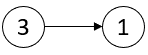

# 链表

https://leetcode.cn/discuss/post/3142882/fen-xiang-gun-ti-dan-lian-biao-er-cha-sh-6srp/

一、链表
注：由于周赛中的链表题可以转成数组处理，难度比直接处理链表低，故不标明难度分。

带着问题去做下面的题目：

在什么情况下，要用到哨兵节点（dummy node）？
在什么情况下，循环条件要写 while (node != null)？什么情况下要写 while (node.next != null)？

## §1.1 遍历链表

### [1290. 二进制链表转整数](https://leetcode.cn/problems/convert-binary-number-in-a-linked-list-to-integer/)

给你一个单链表的引用结点 `head`。链表中每个结点的值不是 0 就是 1。已知此链表是一个整数数字的二进制表示形式。

请你返回该链表所表示数字的 **十进制值** 。

**示例 1：**


```
输入：head = [1,0,1]
输出：5
解释：二进制数 (101) 转化为十进制数 (5)
```

```C++
class Solution {
public:
    int getDecimalValue(ListNode* head) {
        //*2 +1 =1
        //*2 +0= 2
        //*2 +1 = 5

        //1101 = 1-3-6-13
        int res=0;
        ListNode* p =head;
        while(p)
        {
            res = res*2 + p->val;
            p=p->next;
        }
        return res;
    }
};
```


### [2058. 找出临界点之间的最小和最大距离](https://leetcode.cn/problems/find-the-minimum-and-maximum-number-of-nodes-between-critical-points/)

链表中的 **临界点** 定义为一个 **局部极大值点** **或** **局部极小值点 。**

如果当前节点的值 **严格大于** 前一个节点和后一个节点，那么这个节点就是一个 **局部极大值点** 。

如果当前节点的值 **严格小于** 前一个节点和后一个节点，那么这个节点就是一个 **局部极小值点** 。

注意：节点只有在同时存在前一个节点和后一个节点的情况下，才能成为一个 **局部极大值点 / 极小值点** 。

给你一个链表 `head` ，返回一个长度为 2 的数组 `[minDistance, maxDistance]` ，其中 `minDistance` 是任意两个不同临界点之间的最小距离，`maxDistance` 是任意两个不同临界点之间的最大距离。如果临界点少于两个，则返回 `[-1，-1]` 。

**示例 1：**



```
输入：head = [3,1]
输出：[-1,-1]
解释：链表 [3,1] 中不存在临界点。
```


这题也可以不写数组 维护最左和最右 就可了 

```C++
class Solution {
public:
    vector<int> nodesBetweenCriticalPoints(ListNode* head) {
        //最左和最右 最大值
        //每个和其左边的 更新最小值
        vector<int> nodes; // 记录index
        //1、
        ListNode *p = head,*pr = head->next;
        if(head==nullptr||pr==nullptr||pr->next==nullptr)return {-1,-1};
        // 5 3 1 2 5
        //   p pr
        int left = p->val;
        p=pr;
        pr = pr->next;
        int index=1;
        int minDist=INT_MAX;
        while(pr)
        {
            int cur = p->val;
            int right = pr->val;
            if( (cur>left&&cur>right) || (cur<left&&cur<right)) 
            {
                if(nodes.size()>0)
                {
                    minDist = min(minDist,index-nodes.back());
                }
                nodes.push_back(index);
            }
            index++;
            left = cur;
            p=p->next;
            pr = pr->next;
        }
        int nodeN =nodes.size();
        if(nodeN<2)return {-1,-1};
        int maxDist = nodes[nodeN-1]-nodes[0];
       
        return {minDist,maxDist};
    }
};
```


### [2181. 合并零之间的节点](https://leetcode.cn/problems/merge-nodes-in-between-zeros/)

给你一个链表的头节点 `head` ，该链表包含由 `0` 分隔开的一连串整数。链表的 **开端** 和 **末尾** 的节点都满足 `Node.val == 0` 。

对于每两个相邻的 `0` ，请你将它们之间的所有节点合并成一个节点，其值是所有已合并节点的值之和。然后将所有 `0` 移除，修改后的链表不应该含有任何 `0` 。

 返回修改后链表的头节点 `head` 。

**示例 1：
**

```
输入：head = [0,3,1,0,4,5,2,0]
输出：[4,11]
解释：
上图表示输入的链表。修改后的链表包含：
- 标记为绿色的节点之和：3 + 1 = 4
- 标记为红色的节点之和：4 + 5 + 2 = 11
```


```C++
class Solution {
public:
    //  if >20 no
    ListNode* mergeNodes(ListNode* head) {
        ListNode *p = head;
        ListNode *pl = head,*r = head->next;
        int res=0;
        while(r)
        {
            res=0;
            while(r->val!=0)
            {
                res += r->val;
                r=r->next;
            }
            p->val = res;
            pl=p;
            p=p->next;
            r=r->next;
        }
        pl->next = nullptr;
        return head;
    }
};
```

或者

```C++
class Solution {
public:
    ListNode* mergeNodes(ListNode* head) 
    {
        auto tail = head;
        for (auto cur = head->next; cur->next; cur = cur->next) 
        {
            if (cur->val) 
            {
                tail->val += cur->val;
            } 
            else 
            {
                tail = tail->next;
                tail->val = 0;
            }
        }
        // 注：这里没有 delete 剩余节点，可以自行补充
        tail->next = nullptr;
        return head;
    }
};
作者：灵茶山艾府
链接：https://leetcode.cn/problems/merge-nodes-in-between-zeros/solutions/1278727/jian-ji-xie-fa-by-endlesscheng-c4gf/
```


### [725. 分隔链表](https://leetcode.cn/problems/split-linked-list-in-parts/)

给你一个头结点为 `head` 的单链表和一个整数 `k` ，请你设计一个算法将链表分隔为 `k` 个连续的部分。

每部分的长度应该尽可能的相等：任意两部分的长度差距不能超过 1 。这可能会导致有些部分为 null 。

这 `k` 个部分应该按照在链表中出现的顺序排列，并且排在前面的部分的长度应该大于或等于排在后面的长度。

返回一个由上述 `k` 部分组成的数组。

**示例 1：**


```
输入：head = [1,2,3], k = 5
输出：[[1],[2],[3],[],[]]
解释：
第一个元素 output[0] 为 output[0].val = 1 ，output[0].next = null 。
最后一个元素 output[4] 为 null ，但它作为 ListNode 的字符串表示是 [] 。
```


```C++
class Solution {
public:
    vector<ListNode*> splitListToParts(ListNode* head, int k) {
        //比如 入如果 余3 分配到前3个
        ListNode *c = head;
        int n=0;
        while(c)
        {
            c=c->next;
            n++;
        }
        int clip =n/k; //10/3 = 3
        int remain = n%k;//1

        int add  =1;
        ListNode* dummy = new ListNode(0,head);
        c = dummy;
        vector<ListNode*> res;

        for(int j=0;j<k;j++)
        {
            if(c->next==nullptr)
            {
                res.push_back(nullptr);
                continue;
            }
            add = remain>0?1:0;
            remain=remain-1;
            
            for(int i=0;i<clip+add;i++)
            {
                c=c->next;
            }
            res.push_back(dummy->next);
            dummy->next = c->next;
            c->next = nullptr;
            c=dummy;
        }
        return res;
    }
};
```


### [817. 链表组件](https://leetcode.cn/problems/linked-list-components/)

给定链表头结点 `head`，该链表上的每个结点都有一个 **唯一的整型值** 。同时给定列表 `nums`，该列表是上述链表中整型值的一个子集。

返回列表 `nums` 中组件的个数，这里对组件的定义为：链表中一段最长连续结点的值（该值必须在列表 `nums` 中）构成的集合。

 

**示例 1：**


```
输入: head = [0,1,2,3], nums = [0,1,3]
输出: 2
解释: 链表中,0 和 1 是相连接的，且 nums 中不包含 2，所以 [0, 1] 是 nums 的一个组件，同理 [3] 也是一个组件，故返回 2。
```


```C++
class Solution {
public:
    int numComponents(ListNode* head, vector<int>& nums) {
        //从每个点开始寻找下一个在不在set中,在就erase
        unordered_set<int> uset(nums.begin(),nums.end());
        ListNode *p = head;
        int cnt=0;
        while(p)
        {
            if(uset.contains(p->val))
            {
                uset.erase(p->val);
                p=p->next;
                while(p&&uset.contains(p->val))
                {
                    p=p->next;
                }
                cnt++;
            }
            if(p)p=p->next;
        }
        return cnt;
    }
};
```


## 其他地方的

### [61. 旋转链表](https://leetcode.cn/problems/rotate-list/)

给你一个链表的头节点 `head` ，旋转链表，将链表每个节点向右移动 `k` 个位置。

 

**示例 1：**


```
输入：head = [1,2,3,4,5], k = 2
输出：[4,5,1,2,3]
```


这题有很多方法可以做 也都能写出

M1：快慢指针

M2：闭合为环
思路及算法

记给定链表的长度为 n，注意到当向右移动的次数 k≥n 时，我们仅需要向右移动 kmodn 次即可。因为每 n 次移动都会让链表变为原状。这样我们可以知道，新链表的最后一个节点为原链表的第 (n−1)−(kmodn) 个节点（从 0 开始计数）。

这样，我们可以先将给定的链表连接成环，然后将指定位置断开。

具体代码中，我们首先计算出链表的长度 n，并找到该链表的末尾节点，将其与头节点相连。这样就得到了闭合为环的链表。然后我们找到新链表的最后一个节点（即原链表的第 (n−1)−(kmodn) 个节点），将当前闭合为环的链表断开，即可得到我们所需要的结果。

特别地，当链表长度不大于 1，或者 k 为 n 的倍数时，新链表将与原链表相同，我们无需进行任何处理。
链接：https://leetcode.cn/problems/rotate-list/solutions/681812/xuan-zhuan-lian-biao-by-leetcode-solutio-woq1/

```C++
class Solution {
public:
    ListNode* rotateRight(ListNode* head, int k) {
        if(k==0||head==nullptr||head->next==nullptr)return head;
        ListNode* end = head;
        int n=1;
        while(end->next)
        {
            end = end->next;
            n++;
        }
        end->next = head;//1 2 3 4 5 1 2...
        k = n-k%n;//5-5%2 = 3// 
        ListNode* p = end;
        for(int i=0;i<k;i++)
        {
            p=p->next;
        }
        ListNode* res = p->next;
        p->next = nullptr;
        return res;
    }
};	
```


## §1.2 删除节点

[视频讲解【基础算法精讲 08】](https://leetcode.cn/link/?target=https%3A%2F%2Fwww.bilibili.com%2Fvideo%2FBV1VP4y1Q71e%2F)


### [203. 移除链表元素](https://leetcode.cn/problems/remove-linked-list-elements/)

给你一个链表的头节点 `head` 和一个整数 `val` ，请你删除链表中所有满足 `Node.val == val` 的节点，并返回 **新的头节点** 。

 

**示例 1：**


```
输入：head = [1,2,6,3,4,5,6], val = 6
输出：[1,2,3,4,5]
```


```C++
class Solution {
public:
    ListNode* removeElements(ListNode* head, int val) {
        ListNode* pl = new ListNode(0,head);// p left
        ListNode *p=head;
        ListNode *dummy = pl;
        while(p)
        {
            if(p->val == val)
            {
                pl->next = p->next;
                delete p;
                p=pl->next;
            }
            else
            {
                pl=pl->next;
                p=p->next;
            }
        }
        return dummy->next;
    }
};
```


### [3217. 从链表中移除在数组中存在的节点](https://leetcode.cn/problems/delete-nodes-from-linked-list-present-in-array/)

给你一个整数数组 `nums` 和一个链表的头节点 `head`。从链表中**移除**所有存在于 `nums` 中的节点后，返回修改后的链表的头节点。

 

**示例 1：**

**输入：** nums = [1,2,3], head = [1,2,3,4,5]

**输出：** [4,5]

**解释：**

****

移除数值为 1, 2 和 3 的节点。


```C++
class Solution {
public:
    ListNode* modifiedList(vector<int>& nums, ListNode* head) {
        unordered_set<int> uset(nums.begin(),nums.end());
        ListNode* p = head;
        ListNode* dummy = new ListNode(0,head);
        ListNode *pl = dummy;
        while(p)
        {
            if(uset.contains(p->val))
            {
                pl->next = p->next;
                //delete p // 注意力扣会在 modifiedList 调用结束后回收所有节点，自己手动删除反而不行
                p = pl->next;
            }
            else
            {
                pl=pl->next;
                p=p->next;
            }
        }
        return dummy->next;
    }
};
```


### [83. 删除排序链表中的重复元素](https://leetcode.cn/problems/remove-duplicates-from-sorted-list/)

简单

给定一个已排序的链表的头 `head` ， *删除所有重复的元素，使每个元素只出现一次* 。返回 *已排序的链表* 。

 

**示例 1：**


```
输入：head = [1,1,2]
输出：[1,2]
```


```C++
/**
 * Definition for singly-linked list.
 * struct ListNode {
 *     int val;
 *     ListNode *next;
 *     ListNode() : val(0), next(nullptr) {}
 *     ListNode(int x) : val(x), next(nullptr) {}
 *     ListNode(int x, ListNode *next) : val(x), next(next) {}
 * };
 */
class Solution {
public:
    ListNode* deleteDuplicates(ListNode* head) {
        if(head==nullptr||head->next==nullptr)return head;
        ListNode *pl = head;
        ListNode *p = head->next;
        while(p)
        {
            if(pl->val == p->val)
            {
                pl->next = p->next;
                p = pl->next;
            }
            else
            {
                pl=pl->next;
                p=p->next;
            }
        }
        return head;
    }
};
```


### [82. 删除排序链表中的重复元素 II](https://leetcode.cn/problems/remove-duplicates-from-sorted-list-ii/)

给定一个已排序的链表的头 `head` ， *删除原始链表中所有重复数字的节点，只留下不同的数字* 。返回 *已排序的链表* 。

 

**示例 1：**


```
输入：head = [1,2,3,3,4,4,5]
输出：[1,2,5]
```


```C++
/**
 * Definition for singly-linked list.
 * struct ListNode {
 *     int val;
 *     ListNode *next;
 *     ListNode() : val(0), next(nullptr) {}
 *     ListNode(int x) : val(x), next(nullptr) {}
 *     ListNode(int x, ListNode *next) : val(x), next(next) {}
 * };
 */
class Solution {
public:
    ListNode* deleteDuplicates(ListNode* head) {
        if(head==nullptr||head->next==nullptr)return head;
        ListNode *dummy = new ListNode(0,head);
        ListNode *pl=dummy, *p = head;
        ListNode *pr = head->next;
        while(pr)
        {
            if(p->val==pr->val)
            {
                while(pr&&p->val==pr->val)
                {
                    pr=pr->next;
                }
                pl->next = pr;
                p=pr;
                if(pr)pr=pr->next;
            }
            else
            {
                pl=pl->next;
                p=p->next;
                pr = pr->next;
            }
            
        }
        return dummy->next;
    }
};
```


### [237. 删除链表中的节点](https://leetcode.cn/problems/delete-node-in-a-linked-list/)

> 说人话 只给你node 没给你head 让你删除这个节点

有一个单链表的 `head`，我们想删除它其中的一个节点 `node`。

给你一个需要删除的节点 `node` 。你将 **无法访问** 第一个节点 `head`。

链表的所有值都是 **唯一的**，并且保证给定的节点 `node` 不是链表中的最后一个节点。

删除给定的节点。注意，删除节点并不是指从内存中删除它。这里的意思是：

- 给定节点的值不应该存在于链表中。
- 链表中的节点数应该减少 1。
- `node` 前面的所有值顺序相同。
- `node` 后面的所有值顺序相同。

**自定义测试：**

- 对于输入，你应该提供整个链表 `head` 和要给出的节点 `node`。`node` 不应该是链表的最后一个节点，而应该是链表中的一个实际节点。
- 我们将构建链表，并将节点传递给你的函数。
- 输出将是调用你函数后的整个链表。

**示例 1：**


```
输入：head = [4,5,1,9], node = 5
输出：[4,1,9]
解释：指定链表中值为 5 的第二个节点，那么在调用了你的函数之后，该链表应变为 4 -> 1 -> 9
```


```C++
/**
 * Definition for singly-linked list.
 * struct ListNode {
 *     int val;
 *     ListNode *next;
 *     ListNode(int x) : val(x), next(NULL) {}
 * };
 */
class Solution {
public:
    void deleteNode(ListNode* node) {
        //说人话 只给你node 没给你head 让你删除这个节点
        
        //跟后一个节点的值交换，删除后一个（因为保证了不是链表的最后一个节点）
        ListNode *right = node->next;
        // 4 n5 r1 9-> 4 n1 r1 9 -> 4 n1 9
        node->val = right -> val;
        node->next = right->next;
    }
};
```

OR

```C++
class Solution {
public:
    void deleteNode(ListNode* node) {
        //说人话 只给你node 没给你head 让你删除这个节点
        //跟后一个节点的值交换，删除后一个（因为保证了不是链表的最后一个节点）
        node->val = node->next -> val;
        node->next = node->next->next;
    }
};
```


- [1669. 合并两个链表](https://leetcode.cn/problems/merge-in-between-linked-lists/)
- [2487. 从链表中移除节点](https://leetcode.cn/problems/remove-nodes-from-linked-list/)


## §1.10 综合应用

- [707. 设计链表](https://leetcode.cn/problems/design-linked-list/)
- [146. LRU 缓存](https://leetcode.cn/problems/lru-cache/)
- [460. LFU 缓存](https://leetcode.cn/problems/lfu-cache/)
