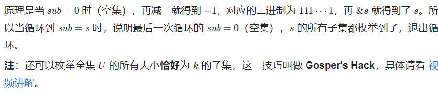

# 从集合论到位运算，常见位运算技巧分类总结！

主要直接看这个链接

**https://leetcode.cn/circle/discuss/CaOJ45/**


集合可以用二进制表示，二进制**从低到高**第$i$位为 1 表示$i$在集合中，为 0 表示$i$不在集合中。例如：

集合$\{0,2,3\}$可以用二进制数 1101$_{(2)}$表示；反过来，二进制数 1101$_{(2)}$就对应着集合$\{0,2,3\}$。

正式地说，包含非负整数的集合$S$可以用如下方式「压缩」成一个数字：

$$f(S)=\sum_{i\in S}2^i$$

例如集合$\{0,2,3\}$可以压缩成$2^0+2^2+2^3=13$，也就是二进制数 1101$_{(2)}$。

【某一位是1表示这位数字存在 例如 10010表示5和2这个数字存在集合中】


https://terathon.com/binary_fund.pdf


## 三、遍历集合

设元素范围从 0 到 n−1，枚举范围中的元素 i，判断 i 是否在集合 s 中

```C++
for (int i = 0; i < n; i++) 
{
    if ((s >> i) & 1) // i 在 s 中
    { 
        // 处理 i 的逻辑
    }
}
```

## 四、枚举集合

### §4.1 枚举所有集合

设元素范围从 0到 n−1，从空集 ∅枚举到全集 U：

```C++
for (int s = 0; s < (1 << n); s++) 
{
    // 处理 s 的逻辑
}
```

### §4.2 枚举非空子集

设集合为 s，**从大到小**枚举 s的所有**非空**子集 sub：

```C++
for (int sub = s; sub; sub = (sub - 1) & s) 
{
    // 处理 sub 的逻辑
}
```

`
为什么要把成 $sub = (sub - 1) \& s$ 呢？

暴力做法是从 $s$ 出发，不断减一，直到 0。但这样做，中途会遇到很多并不是 $s$ 的子集的情况。例如

$s = 10101$ 时，减一得到 $10100$，这是 $s$ 的子集。但再减一就得到 $10011$ 了，这并不是 $s$ 的子集，下一个子集应该是 $10001$。

把所有的合法子集按顺序列出来，会发现我们做的相当于「压缩版」的二进制减法，例如

$10101 → 10100 → 10001 → 10000 → 00101 → ···$

如果忽略掉 $10101$ 中的两个 0，数字的变化和二进制减法是一样的，即

$111 → 110 → 101 → 100 → 011 → ···$

如何快速跳到下一个子集呢？比如，怎么从 $10100$ 跳到 $10001$？

·普通的二进制减法是 $10100 - 1 = 10011$，也就是把最低位的 1 变成 0，同时把最低位的 1 右边的 0 都变成 1。

·压缩版的二进制减法也是如此，对于 $10100 → 10001$，也会把最低位的 1 变成 0，对于最低位的 1 右边的 0，并不是都变成 1，只有在 $s = 10101$ 中的 1 才会变成 1。怎么做到的？减一后 $10101$ 就行，也就是 $(10100 - 1) \& 10101 = 10001$。
`

### §4.3 枚举子集（包含空集）

如果要从大到小枚举 s的所有子集 sub（从 s 枚举到空集 ∅），可以这样写：

```C++
int sub = s;
do 
{
    // 处理 sub 的逻辑
    sub = (sub - 1) & s;
} 
while (sub != s);
```




