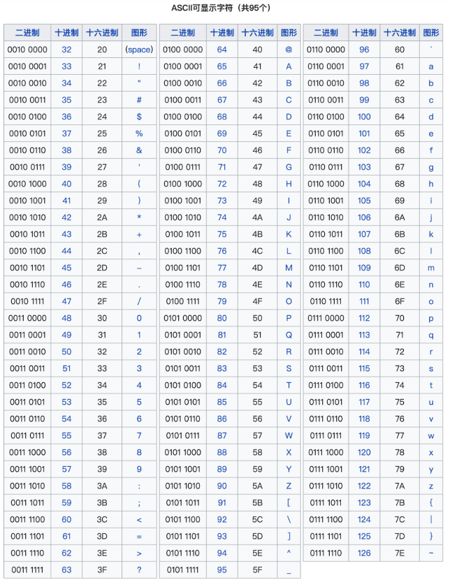

# 刷题板子集合

# 零、C++接口使用大全

如果有的接口没有生效的话，可以尝试一下`using namespace std`或者`std::xxx`能否解决问题。

## 1.`string`相关

### （1）`to_string()`与`stoi`

>   stoi()，to_string() 这两个函数都是对[字符串](https://so.csdn.net/so/search?q=字符串&spm=1001.2101.3001.7020)处理的函数，前者是将字符串转化为十进制 int 类型，最后一个是将十进制类型 int、double 等转化为string。
>
> * `头文件都是：#include <string>`

#### （1.2）`stoull`   : string 转为 unsigned long long

`unsigned long long curNum = stoull(s.substr(start, idx-start+1));`


### （2）如何读一行

##### stringstream

使用 `getline` 读取整行输入，然后使用 `stringstream` 解析出每个数字并存入 `nums` 向量。

```C++
	int num=0;
    vector<int> nums;
    string str;
    getline(cin,str);
    stringstream ss(str);//！！需要包含#include<sstream>
    while(ss>>num)
    {
        nums.push_back(num);
    }
```

例子来自“D:\PGPostgraduate\githubNotePrepareForWork\PrepareForWorkNotes\题库\牛客题库练习\2023年快手秋招游戏开发岗笔试-牛客题库.md”

#####   istringstream 与分隔

- C++中的`istringstream`：[C++ istringstream用法详解_天选打工仔 inurl:csdn-CSDN博客](https://blog.csdn.net/weixin_41028555/article/details/136907277)
- C++中的`getline`：[C++中getline()的用法-CSDN博客](https://blog.csdn.net/weixin_44480968/article/details/104282535#:~:text=getline是C++标准库函数；它有两种形式，一种是头文件< istream)
- https://www.cnblogs.com/keep--fighting/p/17563552.html

```C++
class Solution {
public:
    string simplifyPath(string path) {
        vector<string> stk;
        istringstream ss(path);
        string s; //接收每个子字符串
        while(getline(ss, s, '/')) //以/间隔
        {
            if(s.empty() || s==".") {continue;} //只有一个.,此时忽略掉即可
            else if(s=="..")
            {
                if(!stk.empty()) stk.pop_back();
            }
            else
            {
                stk.push_back(s);
            }
        }
        string result;
        result+="/";
        for(int i=0;i<stk.size();i++)
        {
            result+=stk[i];
            if(i<stk.size()-1) result+="/";
        }
        return result;
    }
};
```

例子来自  D:\PGPostgraduate\githubNotePrepareForWork\PrepareForWorkNotes\Algos\Leetcode\Leetcode——常用数据结构专题.md[71. 简化路径]

### （3）`isalpha(s[i])`

https://www.runoob.com/cprogramming/c-function-isalpha.html

```
#include <ctype.h>
```

检查所传的字符是否是字母。

tolower(s[i])

toupper(s[i])


### （4）string(个数,char)

例子`path[r] = string(cols[r],'.') + 'Q' + string(n-cols[r]-1,'.');`


### （5）字符串匹配查找：s.find(pattern)，返回size_t

> 在C++标准库（STL）中，字符串查找功能主要通过 `std::string` 和 `std::string_view` 的成员函数提供，但它们的内部实现 **不保证** 使用KMP算法。以下是相关接口和实现细节的说明：
>
> ---
>
> ### **1. STL中的字符串查找接口**
> #### (1) `std::string` 的查找函数
> - **`find()` 系列函数**：  
>   用于在字符串中查找子串或字符，返回首次出现的位置（`size_t`类型，未找到时返回 `std::string::npos`）。  
>   ```cpp
>   std::string s = "ababcabaa";
>   size_t pos = s.find("aba");  // 返回 0（首次匹配位置）
>   ```
>   类似函数还有 `rfind()`（反向查找）、`find_first_of()`、`find_last_of()` 等。
>
> #### (2) `std::string_view` 的查找  
>   C++17引入的 `std::string_view` 也提供类似的 `find()` 接口，行为与 `std::string` 一致。
>
> #### (3) 算法库中的 `std::search`  
>   更通用的查找接口，适用于任何序列（如容器、数组等）：  
>   ```cpp
>   #include <algorithm>
>   std::string text = "ababcabaa";
>   std::string pattern = "aba";
>   auto it = std::search(text.begin(), text.end(), pattern.begin(), pattern.end());
>   ```
>
> ---
>
> ### **2. 内部实现不保证基于KMP。**。


### reverse


## 2.`vector`相关

### （1）`accumulate`

> `#include<numeric>`

```c++
accumulate(cardPoints.begin(), cardPoints.begin()+n-k, 0); //计算前n-k个元素的和，加到0上
```

或者  最后的初始值必须有

```C++
int sum = accumulate(vec.begin() , vec.end() , 42);  
```

注意事项：

- 有的时候题目的范围会是`long long`，此时可以把第三个参数写为`0ll`；
- `accumulate`函数还可以把范围内的字符串加在一起，类似如下：`string sum = accumulate(v.begin() , v.end() , string(""));  
- `accumulate`的范围是[start,end)，不包含`end`，所以上例是前n-k的值，即`[0,n-k-1]`的累加值。


### （2）`reduce`

累加求和，它是 std::accumulate 的泛化版本，它元素的累加顺序没有要求，因此可以用于并行累加。另外也可以通过[重载运算符](https://so.csdn.net/so/search?q=重载运算符&spm=1001.2101.3001.7020)进行累乘等运算。

```C++
int s = reduce(apple.begin(), apple.end());
```


### （3） `partial_sum`

 `std::partial_sum` 函数的定义：

```C++
template< class InputIt, class OutputIt >
OutputIt partial_sum( InputIt first, InputIt last, OutputIt d_first );
```

参数说明：

- `first`、`last`：表示输入序列的起始和结束位置的迭代器。
- `d_first`：表示输出序列的起始位置的迭代器，存储部分和的结果。

示例  （:dagger: 不要拿东西去接，而是直接把算完要放的it给传进去）

```c++
std::vector<int> nums = {1, 2, 3, 4, 5};
std::vector<int> result(nums.size());

// 计算部分和并存储到 result 中
std::partial_sum(nums.begin(), nums.end(), result.begin());
```


### （4）`fill`

头文件：

版本：C++20  

牛客是否支持：no

```C++
ranges::fill(visited, 0);
```


头文件：无

版本：C++17  (应该是)

牛客是否支持：yes

```C++
std::fill(visited.begin(), visited.end(), 0); //没有ranges的话用这个
```


###  （5）`min_element`

https://en.cppreference.com/w/cpp/algorithm/min_element

头文件：`#include <algorithm>`

版本：C++17 

牛客是否支持：yes

```C++
int minNum = *min_element(nums.begin(),nums.end());
```


### （6）`nth_element`  --- topK

https://en.cppreference.com/w/cpp/algorithm/nth_element

头文件：`#include <algorithm>`

版本：C++17 吧？

牛客是否支持：yes

```C++
nth_element(nums.begin(),nums.begin()+k-1,nums.end(),greater<int>{});
```


```C++
auto m = v.begin() + v.size() / 2;
std::nth_element(v.begin(), m, v.end());
```


## C++哈希函数

引入例子：（数学篇 水壶问题）

```C++
auto hashFunc = [](const PII& a)
{
    return hash<int>()(a.first)^hash<int>()(a.second);
};
unordered_set<PII,decltype(hashFunc)> seen(0,hashFunc);
```

(HOT 100中 [49. 字母异位词分组](https://leetcode.cn/problems/group-anagrams/))

```C++
// 自定义对 array<int, 26> 类型的哈希函数
auto arrayHash = [fn = hash<int>{}](const array<int,26>& arr)->size_t
{
    return accumulate(arr.begin(),arr.end(),0u,[&](size_t acc,int num)//【3/22 - 0u】
    {
        return (acc<<1)^fn(num);//【3/22 - fn(num)】 但是不是fn也可以通过的就是了
    });
};
//存储哈希 如果一样的就加入进来 加入vector中，
unordered_map<array<int ,26>, vector<string>,decltype(arrayHash)> umap(0,arrayHash);

```

以下两个是一样的调用构造函数

```C++
Genshin g(1,'a');
Genshin g2{ 1,'a'};
```

（Leetcode——图论专题  [310. 最小高度树](https://leetcode.cn/problems/minimum-height-trees/)）

```C++
auto fn = hash<int>{};
auto hash_func = [fn](const pair<int, int>& p) -> size_t
{
    size_t res = (p.first << 1) ^ p.second;
    return res;
};
unordered_set<pair<int, int>, decltype(hash_func)> uedge(0, hash_func); //回忆自定义哈希表hash函数的写法
```


>在C++中，表达式 `hash<Key>()(k2)` 的原理涉及 **标准库的哈希函数对象** 和 **函数调用操作符** 的机制。以下是分步解释：
>
>---
>
>### **1. `std::hash<Key>` 模板**
>`std::hash` 是C++标准库中定义的一个**函数对象模板**（Functor），用于生成任意类型的哈希值。它的基本形式为：
>
>```cpp
>namespace std {
>template <class Key>
>struct hash {
>   size_t operator()(const Key& key) const;
>};
>}
>```
>
>- **模板特化**：标准库已经为常见类型（如 `int`, `string`, `float*` 等）提供了特化版本。例如：
> ```cpp
> std::hash<int> int_hasher;
> std::hash<std::string> str_hasher;
> ```
>
>- **自定义类型**：若 `Key` 是用户自定义类型（如类或结构体），需手动实现 `std::hash` 的特化版本，否则编译器会报错。
>
>---
>
>### **2. `hash<Key>()` 的解析**
>- **`hash<Key>`**：实例化 `std::hash` 模板，生成一个针对类型 `Key` 的哈希函数对象。
>- **`()`**：调用默认构造函数，创建一个临时对象（函数对象实例）。
>
>---
>
>### **3. `(k2)` 的解析**
>- **`operator()`**：调用函数对象的 `operator()` 方法，传入参数 `k2`，计算其哈希值。
>- **等价代码**：
> ```cpp
> std::hash<Key> hasher;  // 创建哈希函数对象
> size_t hash_value = hasher(k2);  // 调用 operator()
> ```
>
>---
>
>### **4. 完整过程示例**
>假设 `Key` 是 `std::string`，则表达式展开为：
>```cpp
>std::hash<std::string>()("hello");  // 返回 "hello" 的哈希值
>```
>
>等价于：
>```cpp
>std::hash<std::string> hasher;
>size_t hash_value = hasher("hello");
>```
>
>---
>
>### **5. 自定义类型的哈希实现**
>若要为自定义类型 `MyClass` 生成哈希值，需特化 `std::hash`：
>```cpp
>#include <functional>  // 必须包含此头文件
>
>struct MyClass {
>   int id;
>   std::string name;
>};
>
>namespace std {
>   template <>
>   struct hash<MyClass> {
>       size_t operator()(const MyClass& obj) const {
>           // 组合成员哈希值（示例）
>           size_t h1 = std::hash<int>()(obj.id);
>           size_t h2 = std::hash<std::string>()(obj.name);
>           return h1 ^ (h2 << 1);  // 简单组合方式
>       }
>   };
>}
>
>// 使用：
>MyClass obj{42, "example"};
>size_t hash_value = std::hash<MyClass>()(obj);
>```
>
>---
>
>### **6. 在无序容器中的应用**
>`std::unordered_map` 或 `std::unordered_set` 默认使用 `std::hash<Key>` 计算键的哈希值：
>```cpp
>std::unordered_map<MyClass, int> my_map;  // 自动使用特化的 std::hash<MyClass>
>```
>
>---
>
>### **总结**
>- **`hash<Key>()(k2)`** 的原理是：
> 1. 实例化 `std::hash<Key>` 模板，生成哈希函数对象。
> 2. 调用该对象的 `operator()` 方法，传入 `k2` 计算哈希值。
>- 对于自定义类型，必须手动特化 `std::hash` 才能使用此语法。

## 比较函数

M1: 重写括号表达式

```C++
typedef pair<int, int> PII;
struct compare
{
    bool operator()(const PII& a, const PII& b)
    {
        return a.second > b.second;
    }
};
class Solution {
public:
    int func(vector<int>& arr) 
    {
        vector<PII> vec;
        ...
        sort(vec.begin(), vec.end(), compare());
```

M2:

```C++
class Solution {
public:
    static bool cmp(const vector<int> &a,const vector<int>& b)
    {
        return a[1]>b[1];
    }
    int func(vector<vector<int>>& arr) {
        sort(arr.begin(),arr.end(),cmp);
```


# 工具

## ASCII 表

https://www.runoob.com/w3cnote/ascii.html




# 一、滑动窗口与双指针


## 1.定长滑动窗口

> 注意事项：
>
> - （1）需要考虑定长窗口长度有没有可能退化为0。==如果有可能的话，可以考虑特判。不然有可能会出现越界等问题。==
> - （2）有一些题目，在滑动窗口应用之前可以先看一下能不能排序之类的，如果最终结果和序列的顺序无关。

### （1）[1456. 定长子串中元音的最大数目](https://leetcode.cn/problems/maximum-number-of-vowels-in-a-substring-of-given-length/)

> 给你字符串 `s` 和整数 `k` 。
>
> 请返回字符串 `s` 中长度为 `k` 的单个子字符串中可能包含的最大元音字母数。
>
> 英文中的 **元音字母** 为（`a`, `e`, `i`, `o`, `u`）。

```c++
class Solution {
public:
    bool isVowel(char c)
    {
        return c=='a' || c=='e' || c=='i'|| c=='o'|| c=='u';
    }
    int maxVowels(string s, int k) {
        int n = s.size();
        int cnt = 0; //定长窗口内的元素数量
        int res = 0; //最终结果
        for(int i=0;i<n;i++)
        {
            //1.inset
            cnt += isVowel(s[i]);
            if(i<k-1) continue;
            //2.update
            res = max(res, cnt);
            //3.delete
            cnt-=isVowel(s[i-k+1]);
        }
        return res;
    }
};
```


### （2）一些其他套路记录

#### （a）窗口内字符串转数字的维护

- 针对二进制字符串和`1234`这种`string`字符串，可以维护在窗口内的字符串表示的数值，在窗口滑动的时候做更新。

二进制的写法有：

```c++
class Solution {
public:
    bool hasAllCodes(string s, int k) {
        int n = s.size();
        if((n-k+1)<(1<<k)) return false;
        unordered_set<int> us;
        int num = s[0]-'0';
        us.insert(num);
        if(k==1) num=0;
        for(int i=1;i<n;i++){
            //1.inset
            int in = s[i] - '0';
            num = ((num<<1) | in); //加入一个二进制位的判断
            if(i<k-1) continue;
            //2.update
            us.insert(num);
            //3.delete
            int out = s[i-k+1]-'0';
            num = num - (out<<(k-1));  //删除首位的二进制位
        }
        return (us.size()==(1<<k));
    }
};
```

普通`string`字符维护定长滑动窗口的写法为：
```c++
class Solution {
public:
    int divisorSubstrings(int num, int k) {
        int sum = 0; //维护窗口内的值
        string s = to_string(num);
        int cnt = 0;
        for(int i=0;i<s.size();i++){
            //1.inset
            int in = s[i]-'0';
            sum = sum * 10 + in;
            if(i<k-1) continue;
            //2.update
            if(sum!=0 && num%sum==0) cnt++; //注意题意:0不能整除任何值
            //3.delete
            int out = s[i-k+1]-'0';
            sum -= out * pow(10, k-1);
        }
        return cnt;
    }
};
```


#### （b）某些简单定长滑动窗口的另一种写法

有些题目

```c++
class Solution {
public:
    int maxScore(vector<int>& cardPoints, int k) {
        //用求和函数加快计算
        int n = cardPoints.size();
        int sum = accumulate(cardPoints.begin(), cardPoints.end(), 0); //别忘了最后一个参数
        if(n==k) return sum; //注意特殊情况判断
        int tmpSum = accumulate(cardPoints.begin(), cardPoints.begin()+n-k, 0); //前n-k个值之和
        int res = tmpSum;
        //求解窗口大小为n-k的最小点数
        for(int i=n-k;i<n;i++){
            tmpSum += (cardPoints[i] - cardPoints[i-(n-k)]); //一次更新两端
            res = min(res, tmpSum);
        }
        return sum - res;
    }
};
```


## 2.不定长滑动窗口

### （1）[3. 无重复字符的最长子串](https://leetcode.cn/problems/longest-substring-without-repeating-characters/)

> 给定一个字符串 `s` ，请你找出其中不含有重复字符的 **最长 子串** 的长度。
>
> - 子串指的是连续、非空序列

```c++
class Solution {
public:
    int lengthOfLongestSubstring(string s) {
        int res = 0;
        //要点:每次右指针移动一格,然后左指针走到满足要求为止
        unordered_map<char, int> umap;
        int n = s.size();
        int j = 0; //左指针所在的位置
        for(int i=0;i<n;i++)
        {
            //in
            umap[s[i]]++; //右指针正常inset即可
            //out
            while(umap[s[i]]>1)
            {
                umap[s[j]]--;
                j++; //一般来说,j不会超过i,比如这道题目,j在超过i之前一定会满足umap[s[i]]<=1,所以不用考虑越界,但可以留个心眼
            }
            //update
            res = max(res, i-j+1);
        }
        return res;
    }
};
```

