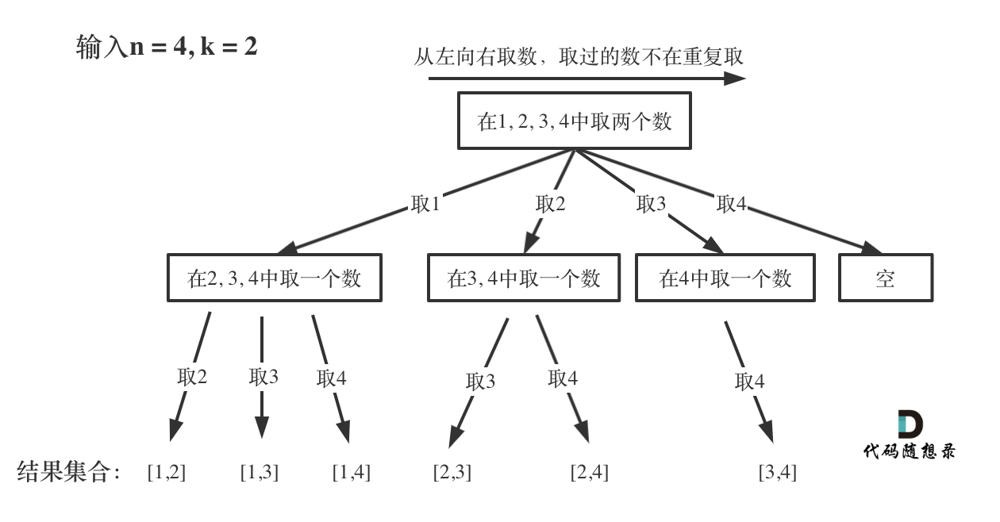

# 板子——回溯专题

本质是搜索树上的 DFS。

# 一、入门回溯

## 1.[17. 电话号码的字母组合](https://leetcode.cn/problems/letter-combinations-of-a-phone-number/)

给定一个仅包含数字 `2-9` 的字符串，返回所有它能表示的字母组合。答案可以按 **任意顺序** 返回。

给出数字到字母的映射如下（与电话按键相同）。注意 1 不对应任何字母。


**示例 1：**

```
输入：digits = "23"
输出：["ad","ae","af","bd","be","bf","cd","ce","cf"]
```

```c++
class Solution {
public:
    string numbers[10] = {"","","abc","def","ghi","jkl","mno","pqrs","tuv","wxyz"};
    string path;
    vector<string> res;
    void dfs(string digits, int i) //i表示哪个字母
    {
        int n = digits.size();
        if(i==n)
        {
            res.push_back(path);
            return;
        }
        for(char c: numbers[digits[i]-'0'])
        {
            path[i] = c;
            dfs(digits, i+1); //反正后面还会覆盖,不用pop_back(如果前面是push_back就要记得后面pop_back)
        }
    }
    vector<string> letterCombinations(string digits) {
        int n = digits.size();
        if(n==0) return res;
        path.resize(n);
        dfs(digits,0);
        return res;
    }
};
```

### 时间与空间复杂度的探讨：

- 时间复杂度：$O(n4^n)$，其中$4^n$来源于最多一个按下的数字对应4个字母，n则表示一共有n个按下的数字。而前面的n则是`res.push_back`的时间复杂度，所以总的是$O(n4^n)$
- 空间复杂度：$O(n)$

> 注：`dfs(i)`应当理解为枚举`>=i`的情况，因为除了枚举`i`以外，还要递归处理后面的部分。


# 二、子集型回溯

有「**选或不选**」和「**枚举选哪个**」两种写法。

也可以用**二进制枚举**做。

## 1.[78. 子集](https://leetcode.cn/problems/subsets/)

> 给你一个整数数组 `nums` ，数组中的元素 **互不相同** 。返回该数组所有可能的子集（幂集）。
>
> 解集 **不能** 包含重复的子集。你可以按 **任意顺序** 返回解集。
>
> **示例 1：**
>
> ```
> 输入：nums = [1,2,3]
> 输出：[[],[1],[2],[1,2],[3],[1,3],[2,3],[1,2,3]]
> ```
>
> **示例 2：**
>
> ```
> 输入：nums = [0]
> 输出：[[],[0]]
> ```

### （1）从「**选或不选**」的角度

每个值既可以选，也可以不选，对应两波dfs：

- `dfs(nums, i+1);`表示不选，直接枚举下一个值的选择情况；
- 先push再`dfs(nums, i+1)`表示选，然后枚举下一个值得选择情况，在dfs之后要记得`pop_back()`，恢复现场。

```c++
class Solution {
public:
    vector<vector<int>> res;
    vector<int> path;
    void dfs(vector<int>& nums, int i) //每个数都可以选或者不选,当前枚举到了第i个
    {
        int n = nums.size();
        if(i==n) //枚举完了整个数组
        {
            res.push_back(path);
            return;
        }
        dfs(nums, i+1); //1.不选
        //2.选
        path.push_back(nums[i]);
        dfs(nums, i+1);
        path.pop_back();
    }
    vector<vector<int>> subsets(vector<int>& nums) {
        //1.选或者不选的角度来解题
        dfs(nums, 0);
        return res;
    }
};
```


### 时间与空间复杂度的探讨

- 每个数字都可以选或者不选，时间复杂度为$O(2^n)$。本身将path加入到最后的答案当中还有$O(n)$的复杂度，因此最终的时间复杂度为$O(n2^n)$。
- 空间复杂度：$O(n)$，返回值的空间忽略不计；


### （2）答案的视角（枚举选哪个）

这种角度思考本题，相当于每次进`dfs`函数时都一定会产生一个结果，需要我们自己判断为了产生答案需要让什么样的数进入dfs。此时答案如下：

```c++
class Solution {
public:
    vector<vector<int>> res;
    vector<int> path;
    void dfs(vector<int>& nums, int i)
    {
        int n = nums.size();
        res.push_back(path); //每次进来都会是一个答案
        for(int j=i;j<n;j++)
        {
            path.push_back(nums[j]);
            dfs(nums, j+1); //在下一轮回溯中，如果i==n，这个循环就不会进来了，所以不用额外判断
            path.pop_back();
        }
    }
    vector<vector<int>> subsets(vector<int>& nums) {
        dfs(nums, 0);
        return res;
    }
};
```

> 判断逻辑：每次放完一个数之后，只有大于其的数可以放到后面（防止重复），而每次进dfs函数所产生的解都是合法的。


# 三、划分型回溯

把分割线（逗号）看成是可以「选或不选」的东西，本质在一定程度上是子集型回溯。前面的题目「分割回文串」即可以理解为划分型回溯的题目。这部分整理一下其他题：

## 2.[1593. 拆分字符串使唯一子字符串的数目最大](https://leetcode.cn/problems/split-a-string-into-the-max-number-of-unique-substrings/)

> 给你一个字符串 `s` ，请你拆分该字符串，并返回拆分后唯一子字符串的最大数目。
>
> 字符串 `s` 拆分后可以得到若干 **非空子字符串** ，这些子字符串连接后应当能够还原为原字符串。但是拆分出来的每个子字符串都必须是 **唯一的** 。
>
> 注意：**子字符串** 是字符串中的一个连续字符序列。
>
> **示例 1：**
>
> ```
> 输入：s = "ababccc"
> 输出：5
> 解释：一种最大拆分方法为 ['a', 'b', 'ab', 'c', 'cc'] 。像 ['a', 'b', 'a', 'b', 'c', 'cc'] 这样拆分不满足题目要求，因为其中的 'a' 和 'b' 都出现了不止一次。
> ```
>

依旧相当于对字符串做划分，不过每次划分的结果会被保存在哈希表当中，在dfs之后不要忘了恢复现场。代码如下：

```c++
class Solution {
public:
    int maxUniqueSplit(string s) {
        int res = 0;
        unordered_set<string> us;
        int n = s.size();
        auto dfs = [&](this auto&& dfs, int start) //start为开始枚举切割的位置
        {
            if(start==n)
            {
                res = max(res, (int)us.size()); //已经撑到最后了,表明是一个合理的字符串,此时哈希表里的都是拆出来的结果,作比较即可
                return;
            }
            for(int i=start;i<n;i++) //可以枚举切割
            {
                string t = s.substr(start, i-start+1); //划分出来的字符串
                if(!us.contains(t))
                {
                    us.insert(t);
                    dfs(i+1); //枚举下一位【⚠】我们已经将start->i的字符串放进来了，接下来要从i+1开始而不是start+1！！
                    us.erase(t);
                }
            }
        };
        dfs(0);
        return res;
    }
};
```


# 四、组合型回溯

有个数上的约束。也算作子集型回溯。

## 1.[77. 组合](https://leetcode.cn/problems/combinations/)

> 给定两个整数 `n` 和 `k`，返回范围 `[1, n]` 中所有可能的 `k` 个数的组合。
>
> 你可以按 **任何顺序** 返回答案。
>
> **示例 1：**
>
> ```
> 输入：n = 4, k = 2
> 输出：
> [
> [2,4],
> [3,4],
> [2,3],
> [1,2],
> [1,3],
> [1,4],
> ]
> ```
>
> **示例 2：**
>
> ```
> 输入：n = 1, k = 1
> 输出：[[1]]
> ```
>
> **提示：**
>
> - `1 <= n <= 20`
> - `1 <= k <= n`

这算是一道经典题目，在遍历枚举的时候，我们可以从后往前遍历，这样在剪枝的时候会更方便一些。



举个例子，假设n=5，k=3，path.size()=1，那么还需要选择两个数(d=k-path.size())，此时如果当前的数i<d，则没办法再选择了，因此只有`i>=d`的才会继续走dfs的逻辑，这就是剪枝。

回溯结束的条件是“path.size()==k”。

本题代码如下（通过倒序的遍历，剪枝就变得很容易思考了，并且从代码角度也更容易写一些）：

```c++
class Solution {
public:
    vector<vector<int>> combine(int n, int k) {
        vector<vector<int>> res;
        vector<int> path;
        //从后往前遍历
        auto dfs = [&](this auto&& dfs, int start) 
        {
            int d=k-path.size();
            if(d==0)
            {
                res.push_back(path);
                return;
            }
            for(int i=start;i>=d;i--)
            {
                path.push_back(i);
                dfs(i-1);
                path.pop_back();
            }
        };
        dfs(n);
        return res;
    }
};
```

# 五、排列型回溯

部分题目也可以用状压 DP 做。

## 1.[46. 全排列](https://leetcode.cn/problems/permutations/)

> 给定一个不含重复数字的数组 `nums` ，返回其 *所有可能的全排列* 。你可以 **按任意顺序** 返回答案。
>
> **示例 1：**
>
> ```
> 输入：nums = [1,2,3]
> 输出：[[1,2,3],[1,3,2],[2,1,3],[2,3,1],[3,1,2],[3,2,1]]
> ```
>

对于排列的题目，我们需要记录哪些数被使用，并记得在dfs之后恢复现场。本题代码如下：

```c++
class Solution {
public:
    vector<vector<int>> permute(vector<int>& nums) {
        vector<vector<int>> res;
        int n = nums.size();
        vector<int> path(n); 
        unordered_set<int> used_set; //使用过的数
        auto dfs = [&](this auto&& dfs, int start)
        {
            if(start==n)
            {
                res.push_back(path);
                return;
            }
            for(int i=0;i<nums.size();i++)
            {
                if(!used_set.contains(nums[i])) //没有被使用过,可以进行递归
                {
                    path[start] = nums[i];
                    used_set.insert(nums[i]);
                    dfs(start+1);
                    used_set.erase(nums[i]);
                }
            }
        };
        dfs(0);
        return res;
    }
};
```

其实也不一定要用unordered_set，对于本题而言开一个长度为n的visited数组也能够到达预期。


## 2.[51. N 皇后](https://leetcode.cn/problems/n-queens/)

>按照国际象棋的规则，皇后可以攻击与之处在同一行或同一列或同一斜线上的棋子。
>
>**n 皇后问题** 研究的是如何将 `n` 个皇后放置在 `n×n` 的棋盘上，并且使皇后彼此之间不能相互攻击。
>
>给你一个整数 `n` ，返回所有不同的 **n 皇后问题** 的解决方案。
>
>每一种解法包含一个不同的 **n 皇后问题** 的棋子放置方案，该方案中 `'Q'` 和 `'.'` 分别代表了皇后和空位。
>
>**示例 1：**
>
>
>
>```
>输入：n = 4
>输出：[[".Q..","...Q","Q...","..Q."],["..Q.","Q...","...Q",".Q.."]]
>解释：如上图所示，4 皇后问题存在两个不同的解法。
>```

- （1）可以用一个`col[n]`数组存储每一行对应选择的列，这样的话行本身就不用再额外判断了。
- （2）在dfs的参数中加一个start，表示当前回溯到了第几行，当start==n的时候，利用col数组复原当前棋盘的样子，加入到res当中；
- （3）判断不在同一行可以自动判断，不在同一列的话只要col[n]前面没有当前选择的列即可，重点是判断是否在斜对角线：


对于某一个皇后(r,c)来说，其两条对角线中的元素满足(假设这些元素是(R,C))：`abs(r-R)==abs(c-C)`，用这条就可以判断N皇后的位置是否斜对角线合法。（务必记住这个结论，现场推导很可能不靠谱）

总的代码如下：

```c++
class Solution {
public:
    bool isValid(vector<int>& cols, int curRow, int curCol)
    {
        int n = cols.size();
        for(int r=0;r<curRow;r++) //判断之前的就行,后面的行不需要判断
        {
            //1.不能同列
            if(cols[r]==curCol) return false;
            //2.不能对角线
            if(abs(r-curRow)==abs(cols[r]-curCol)) return false;
        }
        return true;
    }
    vector<vector<string>> solveNQueens(int n) {
        vector<vector<string>> res;
        vector<int> cols(n, -1); //一开始都没选择
        auto dfs=[&](this auto&& dfs, int curRow)
        {
            if(curRow==n) //说明到了最后,还原出来一种可行解,放入最终结果中
            {
                vector<string> path(n);
                for(int r=0;r<n;r++) //还原每一行
                {
                    path[r] = string(cols[r],'.') + 'Q' + string(n-cols[r]-1,'.');
                }
                res.push_back(path);
                return;
            }
            //开始遍历八皇后问题,找哪一列可以作为新的一行选择的列
            for(int curCol=0;curCol<n;curCol++)
            {
                if(isValid(cols, curRow, curCol)) //传入当前行和当前列
                {
                    cols[curRow] = curCol;
                    dfs(curRow+1);
                    //不用还原,因为后面会被覆盖掉.
                }
            }
        };
        dfs(0);
        return res;
    }
};
```

