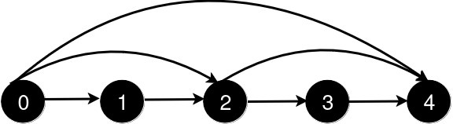

# 板子_图论专题 （DFS,BFS,拓扑,基环树,Dijkstra等）


# 一、基础遍历

## 1.DFS

### （1）[547. 省份数量](https://leetcode.cn/problems/number-of-provinces/)

#### （a）方法1：用DFS做，类似岛屿

> visited数组并不需要回退，类似于在遍历到的岛屿上插旗，表明来过了（这是我的地盘！）即可。

```c++
class Solution {
public:
    int findCircleNum(vector<vector<int>>& isConnected) {
        //方法1:DFS
        int n = isConnected.size(); //邻接矩阵
        vector<int> visited(n, 0);
        //i是开始遍历的城市,这题相当于岛屿数量
        auto dfs = [&](this auto&& dfs, int i)->void
        {
            visited[i] = 1;
            for(int j=0;j<n;j++)
            {
                if(isConnected[i][j]==1 && !visited[j])
                {
                    dfs(j);
                }
            }
        };
        int cnt = 0;
        for(int i=0;i<n;i++)
        {
            if(!visited[i])
            {
                dfs(i);
                cnt++;
            }
        }
        return cnt;
    }
};
```


#### （b）并查集的做法

> 可以写一下并查集的做法，正好能复习。

```c++
struct UnionFind
{
    vector<int> fa;
    vector<int> sz; //每个连通块的大小
    int cc;
    UnionFind(int n): fa(n), sz(n, 1), cc(n)
    {
        iota(fa.begin(), fa.end(), 0); //赋值fa[i] = i;
    }
    int find(int u)
    {
        if(fa[u]!=u)
        {
            fa[u] = find(fa[u]);
        }
        return fa[u];
    }
    bool isSame(int u, int v)
    {
        return find(u) == find(v);
    }
    void join(int from, int to)
    {
        from = find(from);
        to = find(to);
        if(from==to) return;
        fa[from] = to;
        sz[to] += sz[from];
        cc--;
    }
};
class Solution {
public:
    int findCircleNum(vector<vector<int>>& isConnected) {
        //使用并查集来做,有相邻的边就放到一起,由于是邻接矩阵,因此可以只遍历一半
        int n = isConnected.size();
        UnionFind uf(n);
        for(int i=0;i<n;i++)
        {
            for(int j=0;j<=i;j++)
            {
                if(isConnected[i][j]==1)
                {
                    uf.join(i, j);
                }
            }
        }
        return uf.cc;
    }
};
```


## 2.BFS基础

### （1）[3243. 新增道路查询后的最短距离 I](https://leetcode.cn/problems/shortest-distance-after-road-addition-queries-i/)

>给你一个整数 `n` 和一个二维整数数组 `queries`。
>
>有 `n` 个城市，编号从 `0` 到 `n - 1`。初始时，每个城市 `i` 都有一条**单向**道路通往城市 `i + 1`（ `0 <= i < n - 1`）。
>
>`queries[i] = [ui, vi]` 表示新建一条从城市 `ui` 到城市 `vi` 的**单向**道路。每次查询后，你需要找到从城市 `0` 到城市 `n - 1` 的**最短路径**的**长度**。
>
>返回一个数组 `answer`，对于范围 `[0, queries.length - 1]` 中的每个 `i`，`answer[i]` 是处理完**前** `i + 1` 个查询后，从城市 `0` 到城市 `n - 1` 的最短路径的*长度*。
>
>**示例 1：**
>
>**输入：** n = 5, queries = [[2, 4], [0, 2], [0, 4]]
>
>**输出：** [3, 2, 1]
>
>**解释：**
>
>
>
>新增一条从 2 到 4 的道路后，从 0 到 4 的最短路径长度为 3。
>
>
>
>新增一条从 0 到 2 的道路后，从 0 到 4 的最短路径长度为 2。
>
>
>
>新增一条从 0 到 4 的道路后，从 0 到 4 的最短路径长度为 1。

之前做这道题的代码比较怪，有点Dijkstra那个感觉，但又不是，如果要写BFS的话还是写的正统一些，如下：

```c++
class Solution {
public:
    vector<int> shortestDistanceAfterQueries(int n, vector<vector<int>>& queries) {
        //有向图,直接放弃并查集
        //BFS可以求最短路,暴力每个查询都做一次BFS.为了防止visited数组每次要刷一遍,可以认为visited[i]=step的才是本轮访问过的
        vector<int> visited(n, -1); //一开始是-1,第step轮被访问的会被刷成step
        //先建图
        vector<vector<int>> graph(n);
        for(int i=0;i<n-1;i++)
        {
            int from = i;
            int to = i+1;
            graph[from].push_back(to);
        }
        auto bfs = [&](int start, int end, int step)
        {
            //BFS,用队列来做
            queue<int> que;
            que.push(start);
            int totalStep = 0;
            while(!que.empty())
            {
                int size = que.size();
                totalStep+=1; //新走了一步
                while(size--)
                {
                    int cur = que.front();
                    que.pop();
                    int sz = graph[cur].size();
                    for(int idx = 0;idx<sz;idx++)
                    {
                        int nxt = graph[cur][idx];
                        if(nxt == end) return totalStep;
                        if(visited[nxt]!=step) 
                        {
                            visited[nxt] = step;
                            que.push(nxt);
                        }
                    }
                }
            }
            return totalStep; //根据题意,本题能够保证可达
        };
        int m = queries.size();
        vector<int> res(m);
        for(int i=0;i<m;i++)
        {
            int addFrom = queries[i][0];
            int addTo = queries[i][1];
            graph[addFrom].push_back(addTo);
            int step = bfs(0, n-1, i); //最后一个参数是step
            rs[i] = step;
        }
        return res;
    }
};
```


## 3.拓扑排序


### （2）[210. 课程表 II](https://leetcode.cn/problems/course-schedule-ii/)

> 现在你总共有 `numCourses` 门课需要选，记为 `0` 到 `numCourses - 1`。给你一个数组 `prerequisites` ，其中 `prerequisites[i] = [ai, bi]` ，表示在选修课程 `ai` 前 **必须** 先选修 `bi` 。
>
> - 例如，想要学习课程 `0` ，你需要先完成课程 `1` ，我们用一个匹配来表示：`[0,1]` 。
>
> 返回你为了学完所有课程所安排的学习顺序。可能会有多个正确的顺序，你只要返回 **任意一种** 就可以了。如果不可能完成所有课程，返回 **一个空数组** 。

拓扑排序的板子题。代码如下：

```c++
class Solution {
public:
    vector<int> findOrder(int numCourses, vector<vector<int>>& prerequisites) {
        //添加题目要求:输出拓扑排序的结果
        vector<vector<int>> graph(numCourses);
        vector<int> indegrees(numCourses, 0);
        for(int i=0;i<prerequisites.size();i++)
        {
            int from = prerequisites[i][1];
            int to = prerequisites[i][0];
            graph[from].push_back(to);
            indegrees[to]++;
        }
        queue<int> que;
        for(int i=0;i<numCourses;i++)
        {
            if(indegrees[i]==0) que.push(i);
        }
        vector<int> res;
        while(!que.empty())
        {
            int cur = que.front();
            que.pop();
            res.push_back(cur);
            for(int idx=0;idx<graph[cur].size();idx++)
            {
                int nxt = graph[cur][idx];
                indegrees[nxt]--;
                if(indegrees[nxt]==0)
                {
                    que.push(nxt);
                }
            }
        }
        if(res.size()!=numCourses) return {};
        return res;
    }
};
```


# 二、基环树

### （1）[2359. 找到离给定两个节点最近的节点](https://leetcode.cn/problems/find-closest-node-to-given-two-nodes/)

> 给你一个 `n` 个节点的 **有向图** ，节点编号为 `0` 到 `n - 1` ，每个节点 **至多** 有一条出边。
>
> 有向图用大小为 `n` 下标从 **0** 开始的数组 `edges` 表示，表示节点 `i` 有一条有向边指向 `edges[i]` 。如果节点 `i` 没有出边，那么 `edges[i] == -1` 。
>
> 同时给你两个节点 `node1` 和 `node2` 。
>
> 请你返回一个从 `node1` 和 `node2` 都能到达节点的编号，使节点 `node1` 和节点 `node2` 到这个节点的距离 **较大值最小化**。如果有多个答案，请返回 **最小** 的节点编号。如果答案不存在，返回 `-1` 。
>
> 注意 `edges` 可能包含环。
>
> **示例 1：**
>
> 
>
> ```
> 输入：edges = [2,2,3,-1], node1 = 0, node2 = 1
> 输出：2
> 解释：从节点 0 到节点 2 的距离为 1 ，从节点 1 到节点 2 的距离为 1 。
> 两个距离的较大值为 1 。我们无法得到一个比 1 更小的较大值，所以我们返回节点 2 。
> ```

#### （a）方法2：基于基环树的性质

注意题目的”每个节点 **至多** 有一条出边“，这也就意味着每个连通块中最多有一个环，此时就可以用简单的循环来求出距离数组。代码如下：

```c++
class Solution {
public:
    int closestMeetingNode(vector<int>& edges, int node1, int node2) {
        int n = edges.size();

        auto calculate = [&](int start)
        {
            vector<int> dist(n, n); //初始值设置为n,基环树的性质,dist不会超过n
            int x = start;
            for(int d = 0; x >= 0 && dist[x] == n; x = edges[x])
            {
                dist[x] = d++;
            }
            return dist;
        };

        auto dist1 = calculate(node1);
        auto dist2 = calculate(node2);
        int mn = n, idx = -1;
        for(int i=0;i<n;i++)
        {
            int d = max(dist1[i], dist2[i]);
            if(d<mn)
            {
                mn = d;
                idx = i;
            }
        }
        return idx;
    }
};
```


# 三、最短路

## 1.单源最短路——Dijkstra