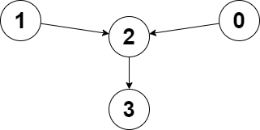

# 板子_图论专题 （DFS,BFS,拓扑,基环树,Dijkstra等）


# 一、基础遍历

## 1.DFS

### （1）[547. 省份数量](https://leetcode.cn/problems/number-of-provinces/)

#### （a）方法1：用DFS做，类似岛屿

> visited数组并不需要回退，类似于在遍历到的岛屿上插旗，表明来过了（这是我的地盘！）即可。

```c++
class Solution {
public:
    int findCircleNum(vector<vector<int>>& isConnected) {
        //方法1:DFS
        int n = isConnected.size(); //邻接矩阵
        vector<int> visited(n, 0);
        //i是开始遍历的城市,这题相当于岛屿数量
        auto dfs = [&](this auto&& dfs, int i)->void
        {
            visited[i] = 1;
            for(int j=0;j<n;j++)
            {
                if(isConnected[i][j]==1 && !visited[j])
                {
                    dfs(j);
                }
            }
        };
        int cnt = 0;
        for(int i=0;i<n;i++)
        {
            if(!visited[i])
            {
                dfs(i);
                cnt++;
            }
        }
        return cnt;
    }
};
```


#### （b）并查集的做法

> 可以写一下并查集的做法，正好能复习。

```c++
struct UnionFind
{
    vector<int> fa;
    vector<int> sz; //每个连通块的大小
    int cc;
    UnionFind(int n): fa(n), sz(n, 1), cc(n)
    {
        iota(fa.begin(), fa.end(), 0); //赋值fa[i] = i;
    }
    int find(int u)
    {
        if(fa[u]!=u)
        {
            fa[u] = find(fa[u]);
        }
        return fa[u];
    }
    bool isSame(int u, int v)
    {
        return find(u) == find(v);
    }
    void join(int from, int to)
    {
        from = find(from);
        to = find(to);
        if(from==to) return;
        fa[from] = to;
        sz[to] += sz[from];
        cc--;
    }
};
class Solution {
public:
    int findCircleNum(vector<vector<int>>& isConnected) {
        //使用并查集来做,有相邻的边就放到一起,由于是邻接矩阵,因此可以只遍历一半
        int n = isConnected.size();
        UnionFind uf(n);
        for(int i=0;i<n;i++)
        {
            for(int j=0;j<=i;j++)
            {
                if(isConnected[i][j]==1)
                {
                    uf.join(i, j);
                }
            }
        }
        return uf.cc;
    }
};
```


## 2.BFS基础

### （1）[3243. 新增道路查询后的最短距离 I](https://leetcode.cn/problems/shortest-distance-after-road-addition-queries-i/)

>给你一个整数 `n` 和一个二维整数数组 `queries`。
>
>有 `n` 个城市，编号从 `0` 到 `n - 1`。初始时，每个城市 `i` 都有一条**单向**道路通往城市 `i + 1`（ `0 <= i < n - 1`）。
>
>`queries[i] = [ui, vi]` 表示新建一条从城市 `ui` 到城市 `vi` 的**单向**道路。每次查询后，你需要找到从城市 `0` 到城市 `n - 1` 的**最短路径**的**长度**。
>
>返回一个数组 `answer`，对于范围 `[0, queries.length - 1]` 中的每个 `i`，`answer[i]` 是处理完**前** `i + 1` 个查询后，从城市 `0` 到城市 `n - 1` 的最短路径的*长度*。
>
>**示例 1：**
>
>**输入：** n = 5, queries = [[2, 4], [0, 2], [0, 4]]
>
>**输出：** [3, 2, 1]
>
>**解释：**
>
>
>
>新增一条从 2 到 4 的道路后，从 0 到 4 的最短路径长度为 3。
>
>
>
>新增一条从 0 到 2 的道路后，从 0 到 4 的最短路径长度为 2。
>
>
>
>新增一条从 0 到 4 的道路后，从 0 到 4 的最短路径长度为 1。

之前做这道题的代码比较怪，有点Dijkstra那个感觉，但又不是，如果要写BFS的话还是写的正统一些，如下：

```c++
class Solution {
public:
    vector<int> shortestDistanceAfterQueries(int n, vector<vector<int>>& queries) {
        //有向图,直接放弃并查集
        //BFS可以求最短路,暴力每个查询都做一次BFS.为了防止visited数组每次要刷一遍,可以认为visited[i]=step的才是本轮访问过的
        vector<int> visited(n, -1); //一开始是-1,第step轮被访问的会被刷成step
        //先建图
        vector<vector<int>> graph(n);
        for(int i=0;i<n-1;i++)
        {
            int from = i;
            int to = i+1;
            graph[from].push_back(to);
        }
        auto bfs = [&](int start, int end, int step)
        {
            //BFS,用队列来做
            queue<int> que;
            que.push(start);
            int totalStep = 0;
            while(!que.empty())
            {
                int size = que.size();
                totalStep+=1; //新走了一步
                while(size--)
                {
                    int cur = que.front();
                    que.pop();
                    int sz = graph[cur].size();
                    for(int idx = 0;idx<sz;idx++)
                    {
                        int nxt = graph[cur][idx];
                        if(nxt == end) return totalStep;
                        if(visited[nxt]!=step) 
                        {
                            visited[nxt] = step;
                            que.push(nxt);
                        }
                    }
                }
            }
            return totalStep; //根据题意,本题能够保证可达
        };
        int m = queries.size();
        vector<int> res(m);
        for(int i=0;i<m;i++)
        {
            int addFrom = queries[i][0];
            int addTo = queries[i][1];
            graph[addFrom].push_back(addTo);
            int step = bfs(0, n-1, i); //最后一个参数是step
            rs[i] = step;
        }
        return res;
    }
};
```


## 3.拓扑排序


### （2）[210. 课程表 II](https://leetcode.cn/problems/course-schedule-ii/)

> 现在你总共有 `numCourses` 门课需要选，记为 `0` 到 `numCourses - 1`。给你一个数组 `prerequisites` ，其中 `prerequisites[i] = [ai, bi]` ，表示在选修课程 `ai` 前 **必须** 先选修 `bi` 。
>
> - 例如，想要学习课程 `0` ，你需要先完成课程 `1` ，我们用一个匹配来表示：`[0,1]` 。
>
> 返回你为了学完所有课程所安排的学习顺序。可能会有多个正确的顺序，你只要返回 **任意一种** 就可以了。如果不可能完成所有课程，返回 **一个空数组** 。

拓扑排序的板子题。代码如下：

```c++
class Solution {
public:
    vector<int> findOrder(int numCourses, vector<vector<int>>& prerequisites) {
        //添加题目要求:输出拓扑排序的结果
        vector<vector<int>> graph(numCourses);
        vector<int> indegrees(numCourses, 0);
        for(int i=0;i<prerequisites.size();i++)
        {
            int from = prerequisites[i][1];
            int to = prerequisites[i][0];
            graph[from].push_back(to);
            indegrees[to]++;
        }
        queue<int> que;
        for(int i=0;i<numCourses;i++)
        {
            if(indegrees[i]==0) que.push(i);
        }
        vector<int> res;
        while(!que.empty())
        {
            int cur = que.front();
            que.pop();
            res.push_back(cur);
            for(int idx=0;idx<graph[cur].size();idx++)
            {
                int nxt = graph[cur][idx];
                indegrees[nxt]--;
                if(indegrees[nxt]==0)
                {
                    que.push(nxt);
                }
            }
        }
        if(res.size()!=numCourses) return {};
        return res;
    }
};
```


# 二、基环树

### （1）[2359. 找到离给定两个节点最近的节点](https://leetcode.cn/problems/find-closest-node-to-given-two-nodes/)

> 给你一个 `n` 个节点的 **有向图** ，节点编号为 `0` 到 `n - 1` ，每个节点 **至多** 有一条出边。
>
> 有向图用大小为 `n` 下标从 **0** 开始的数组 `edges` 表示，表示节点 `i` 有一条有向边指向 `edges[i]` 。如果节点 `i` 没有出边，那么 `edges[i] == -1` 。
>
> 同时给你两个节点 `node1` 和 `node2` 。
>
> 请你返回一个从 `node1` 和 `node2` 都能到达节点的编号，使节点 `node1` 和节点 `node2` 到这个节点的距离 **较大值最小化**。如果有多个答案，请返回 **最小** 的节点编号。如果答案不存在，返回 `-1` 。
>
> 注意 `edges` 可能包含环。
>
> **示例 1：**
>
> 
>
> ```
> 输入：edges = [2,2,3,-1], node1 = 0, node2 = 1
> 输出：2
> 解释：从节点 0 到节点 2 的距离为 1 ，从节点 1 到节点 2 的距离为 1 。
> 两个距离的较大值为 1 。我们无法得到一个比 1 更小的较大值，所以我们返回节点 2 。
> ```

#### （a）方法2：基于基环树的性质

注意题目的”每个节点 **至多** 有一条出边“，这也就意味着每个连通块中最多有一个环，此时就可以用简单的循环来求出距离数组。代码如下：

```c++
class Solution {
public:
    int closestMeetingNode(vector<int>& edges, int node1, int node2) {
        int n = edges.size();

        auto calculate = [&](int start)
        {
            vector<int> dist(n, n); //初始值设置为n,基环树的性质,dist不会超过n
            int x = start;
            for(int d = 0; x >= 0 && dist[x] == n; x = edges[x])
            {
                dist[x] = d++;
            }
            return dist;
        };

        auto dist1 = calculate(node1);
        auto dist2 = calculate(node2);
        int mn = n, idx = -1;
        for(int i=0;i<n;i++)
        {
            int d = max(dist1[i], dist2[i]);
            if(d<mn)
            {
                mn = d;
                idx = i;
            }
        }
        return idx;
    }
};
```


# 三、最短路

## 1.单源最短路——Dijkstra

### （1）[743. 网络延迟时间](https://leetcode.cn/problems/network-delay-time/) :cat:

>有 `n` 个网络节点，标记为 `1` 到 `n`。
>
>给你一个列表 `times`，表示信号经过 **有向** 边的传递时间。 `times[i] = (ui, vi, wi)`，其中 `ui` 是源节点，`vi` 是目标节点， `wi` 是一个信号从源节点传递到目标节点的时间。
>
>现在，从某个节点 `K` 发出一个信号。需要多久才能使所有节点都收到信号？如果不能使所有节点收到信号，返回 `-1` 。
>
>**示例 1：**
>
>
>
>```
>输入：times = [[2,1,1],[2,3,1],[3,4,1]], n = 4, k = 2
>输出：2
>```

#### （a）邻接矩阵的写法——朴素Dijkstra算法

邻接矩阵比较适用于**稠密图**。

对于本题，在计算最短路时，如果发现当前找到的最小最短路等于 ∞，说明有节点无法到达，可以提前结束算法，返回 −1。

```c++
class Solution {
public:
    int networkDelayTime(vector<vector<int>>& times, int n, int k) {
        vector<int> visited(n, 0);
        vector<int> dist(n, INT_MAX / 2); //因为有加法,要防止dist越界,记录从起点到的最近距离
        //构建邻接矩阵
        vector<vector<int>> graph(n, vector<int>(n, INT_MAX / 2)); //权重设置为INT_MAX / 2表示不可达,这样就不会走这条路,不会成为最短路径
        //step 1:构建图
        for(auto& vec : times)
        {
            int from = vec[0] - 1; //整体偏移一位,把节点的id变成0~n-1
            int to = vec[1] - 1;
            int weight = vec[2];
            graph[from][to] = weight; //有向图
        }
        dist[k - 1] = 0; //从k出发,因此到k本身的最近距离为0
       
        while(true) //本题如果不能使所有节点收到信号，返回 -1
        {
            int x = -1;
            for(int i=0;i<n;i++) //找当前dist数组记录最小的值
            {
                if(!visited[i] && (x<0 || dist[i]<dist[x])) //这么写比较巧,如果a&&b从未触发b,x会是-1
                {
                    x = i;
                }
            }
            //如果x==-1,说明全部访问过了,没有新的节点,可以结束了
            if(x == -1)
            {
                return ranges::max(dist); //最大的dist即为所求
            }
            if(dist[x] == INT_MAX / 2) //有节点无法到达
            {
                return -1;
            }
            visited[x] = 1;
            for(int y = 0;y<n;y++)
            {
                dist[y] = min(dist[y], dist[x] + graph[x][y]);
            }
        }
    }
};
```


#### （b）堆优化 Dijkstra（适用于稀疏图）

```c++
class Solution {
public:
    int networkDelayTime(vector<vector<int>>& times, int n, int k) {
        //邻接表来做
        vector<vector<pair<int, int>>> graph(n); //pair中存储to和value
        for(auto& t: times)
        {
            graph[t[0]-1].emplace_back(t[1]-1, t[2]);
        }
        //小顶堆,堆顶是比较小的元素
        priority_queue<pair<int, int>, vector<pair<int, int>>, greater<>> pq;// dist[index],index
        vector<int> dist(n, INT_MAX / 2); // 堆只能拿到最大的，但是更新的时候，我们要更新不止是最大的那个值
        dist[k-1] = 0;
        pq.emplace(0, k-1); //把起点放进去
        while(!pq.empty())
        {
            auto [dx, x] = pq.top();
            pq.pop();
            if(dx > dist[x]) continue; //之前同一个节点出过堆了,现在这个不可能更新成最短路径
            for(auto& [y, d]: graph[x]) //临近的节点
            {
                int new_dis = dx + d;
                if(new_dis < dist[y]) //有更短的路径了,更新，写成if(dist[y]>dist[x]+d)也可以，这里的dx和dist[x]应该是相等的，毕竟dx>dist[x]的就不要了，dx<dist[x]是不可能的，看下面只有更新了dist[x]才会把值push进优先队列
                {
                    dist[y] = new_dis;
                    pq.emplace(new_dis, y);
                }
            }
        }
        //此时所有的节点都处理完了(当然可能有不可达的点),
        int mx = ranges::max(dist);
        if(mx==INT_MAX / 2) return -1;
        return mx;
    }
};
```


#### （总结）

一般来说，如果一幅图中不同的边的数 量在顶点总数 V 的一个小的常数倍以内，那么我们就认为这幅图是稀疏的，否则则是稠密的。

​										--摘至《算法 第四版》

> 一般来说，图论的题目的测试用例都是稀疏图。**绝大多数题目都可以无脑用邻接表。**如果【边数】与【点数的平方】是一个数量级，用邻接矩阵才可能有一些优势。


# 板子_网格图专题（DFS/BFS/综合应用）


# 一、网格图DFS

适用于需要计算连通块个数、大小的题目。部分题目也可以用 BFS 或并查集解决。

### 1.[200. 岛屿数量](https://leetcode.cn/problems/number-of-islands/)(板子题)

这里就是常规的做法。另一种做法是在把遍历到的grid都改成2（相当于在遍历过的陆地上插一面旗），这样也不需要visited数组了。

```c++
class Solution {
public:
    int dirs[4][2] = {1,0,-1,0,0,1,0,-1};
    int numIslands(vector<vector<char>>& grid) {
        int m = grid.size();
        int n = grid[0].size();
        vector<vector<int>> visited(m, vector<int>(n));
        //lambda表达式可以显式指定返回值为void
        auto dfs = [&](this auto&& dfs, int curX, int curY)->void 
        {
            visited[curX][curY]=1;
            for(int d=0;d<4;d++)
            {
                int nextX = curX + dirs[d][0];
                int nextY = curY + dirs[d][1];
                if(nextX<0 || nextY<0 || nextX>=m || nextY>=n || visited[nextX][nextY] || grid[nextX][nextY]!='1') continue;
                dfs(nextX,nextY);
            }
        };
        int res = 0;
        for(int i=0;i<m;i++)
        {
            for(int j=0;j<n;j++)
            {
                if(grid[i][j]=='1'&&!visited[i][j])
                {
                    dfs(i, j);
                    res++;
                }
            }
        }
        return res;
    }
};
```

有些DFS的题目也会比较方便用并查集来做，这一点会在对应题目处尝试用并查集再做一遍（`感觉并查集更合适于计算联通分量之类的问题`）。

改为‘2’的做法：

```C++
class Solution {
public:
    int dirs[4][2] = {{0,1},{0,-1},{1,0},{-1,0}};
    void dfs(vector<vector<char>>& grid,int x,int y)
    {
        if(grid[x][y]=='2')return;
        grid[x][y] = '2';
        for(int i=0;i<4;i++)
        {
            int newX= x+dirs[i][0];
            int newY = y+dirs[i][1];
            if(newX<0||newY<0||newX>=grid.size()||newY>=grid[0].size()||grid[newX][newY]=='0'||grid[newX][newY]=='2')continue;
            dfs(grid,newX,newY);
        }
    }
    int numIslands(vector<vector<char>>& grid) {
        int m =grid.size();
        int n = grid[0].size();
        int res=0;
        for(int i=0;i<m;i++)
        {
            for(int j=0;j<n;j++)
            {
                if(grid[i][j]=='1')
                {
                    dfs(grid,i,j);
                    res++;
                }
            }
        }
        return res;
    }
};
```


# 二、网格图 BFS

适用于需要计算最短距离（**最短路**）的题目。


m 广度优先 ，先到达的一定更近，一般都不需要再被更新了。因此可以标记为visited，但不一定要开新的visited数组，可以将原来的数组 比如标记为-1等各种操作。否则重复访问很容易超时。


### [1091. 二进制矩阵中的最短路径](https://leetcode.cn/problems/shortest-path-in-binary-matrix/)

给你一个 `n x n` 的二进制矩阵 `grid` 中，返回矩阵中最短 **畅通路径** 的长度。如果不存在这样的路径，返回 `-1` 。

二进制矩阵中的 畅通路径 是一条从 **左上角** 单元格（即，`(0, 0)`）到 右下角 单元格（即，`(n - 1, n - 1)`）的路径，该路径同时满足下述要求：

- 路径途经的所有单元格的值都是 `0` 。
- 路径中所有相邻的单元格应当在 **8 个方向之一** 上连通（即，相邻两单元之间彼此不同且共享一条边或者一个角）。

**畅通路径的长度** 是该路径途经的单元格总数。

 

**示例 1：**


```
输入：grid = [[0,1],[1,0]]
输出：2
```

代码：

```C++
class Solution {
public:
    int shortestPathBinaryMatrix(vector<vector<int>>& grid) {
        int dirs[8][2] = {{0,1},{0,-1},{1,0},{-1,0},{1,1},{-1,1},{1,-1},{-1,-1}};
        queue<tuple<int,int,int>> que;
        if(grid[0][0]==1)return -1;
        que.emplace(0,0,1);
        grid[0][0] = 2;
        int d=1;
        int m = grid.size();
        int n = grid[0].size();
        while(!que.empty())
        {
            auto [x,y,d] = que.front();
            que.pop();
            if(x==m-1&&y==n-1)return d;
            for(int i=0;i<8;i++)
            {
                int curX = x+dirs[i][0];
                int curY = y+dirs[i][1];
                if(curX<0||curY<0||curX>=m||curY>=n||grid[curX][curY]!=0)continue;
                que.emplace(curX,curY,d+1);
                grid[curX][curY] = 2;//visited依旧是只能放在这里 否则会超时
            }
        }
        return -1;
    }
};
```

如果使用每扩一圈就step+=1的写法,则代码如下(**推荐写法：把判断是否到终点的判断放到从队列中拿出点的地方，如果在四个/八个方向判断的逻辑中判断是否抵达终点，对于图的size=1的情况可能不好判断。**):

```c++
class Solution {
public:
    typedef pair<int, int> PII;
    int dirs[8][2] = {1,0,0,1,-1,0,0,-1,1,1,1,-1,-1,1,-1,-1};
    int shortestPathBinaryMatrix(vector<vector<int>>& grid) {
        int n = grid.size();
        //走完的节点设置为2,当作是visited
        queue<PII> que;
        if(grid[0][0] != 0) return -1;
        grid[0][0] = 2; //访问过了,相当于visited数组
        que.emplace(0,0);
        int step = 0;
        while(!que.empty())
        {
            int sz = que.size();
            step++;
            while(sz--)
            {
                auto cur = que.front();
                que.pop();
                if(cur.first==n-1 && cur.second==n-1) return step; //从队列拿出来的时候再做处理,对边界情况的考虑会少一些
                for(int d=0;d<8;d++)
                {
                    int nxtX = cur.first + dirs[d][0];
                    int nxtY = cur.second + dirs[d][1];		
                    if(nxtX<0 || nxtY<0 || nxtX>=n || nxtY>=n) continue;
                    if(grid[nxtX][nxtY]==0)
                    {
                        grid[nxtX][nxtY] = 2;
                        que.emplace(nxtX, nxtY);
                    } 
                }
            }
        }
        return -1;
    }
};
```


# 板子_贪心算法（基本贪心策略/反悔/区间/字典序/数学/思维/构造）

# 一、贪心策略

有两种**基本贪心策略**：

从**最小/最大**开始贪心，优先考虑最小/最大的数，从小到大/从大到小贪心。在此基础上，衍生出了**反悔贪心**。
从**最左/最右**开始贪心，思考第一个数/最后一个数的贪心策略，把 n 个数的原问题转换成 n−1 个数（或更少）的子问题。

## §1.1 从最小/最大开始贪心

优先考虑最小/最大的数，从小到大/从大到小贪心。

如果答案与数组元素顺序无关，一般需要**排序**。排序后，可以遍历计算。


### [3074. 重新分装苹果](https://leetcode.cn/problems/apple-redistribution-into-boxes/)

给你一个长度为 `n` 的数组 `apple` 和另一个长度为 `m` 的数组 `capacity` 。

一共有 `n` 个包裹，其中第 `i` 个包裹中装着 `apple[i]` 个苹果。同时，还有 `m` 个箱子，第 `i` 个箱子的容量为 `capacity[i]` 个苹果。

请你选择一些箱子来将这 `n` 个包裹中的苹果重新分装到箱子中，返回你需要选择的箱子的 **最小** 数量。

**注意**，同一个包裹中的苹果可以分装到不同的箱子中。

**示例 1：**

```
输入：apple = [1,3,2], capacity = [4,3,1,5,2]
输出：2
解释：使用容量为 4 和 5 的箱子。
总容量大于或等于苹果的总数，所以可以完成重新分装。
```


返回需要选择的箱子的 **最小** 数量。

```C++
class Solution {
public:
    int minimumBoxes(vector<int>& apple, vector<int>& capacity) {
        //n 包裹  放apple[i] 个苹果
        //sumApple
        //m 箱子  放capacity[i] 个苹果
        //排序 先用大箱子 装 
        sort(capacity.begin(),capacity.end(),greater<int>{});
        int appleSum = reduce(apple.begin(),apple.end());
        int res=0;
        while(appleSum>0)
        {
            appleSum-=capacity[res];
            res++;
        }
        return res;
    }
};
```


## §1.2 单序列配对

同上，从最小/最大的元素开始贪心。


## §1.3 双序列配对

同上，从最小/最大的元素开始贪心。

### （1）[455. 分发饼干](https://leetcode.cn/problems/assign-cookies/)

假设你是一位很棒的家长，想要给你的孩子们一些小饼干。但是，每个孩子最多只能给一块饼干。

对每个孩子 `i`，都有一个胃口值 `g[i]`，这是能让孩子们满足胃口的饼干的最小尺寸；并且每块饼干 `j`，都有一个尺寸 `s[j]` 。如果 `s[j] >= g[i]`，我们可以将这个饼干 `j` 分配给孩子 `i` ，这个孩子会得到满足。你的目标是满足尽可能多的孩子，并输出这个最大数值。

**示例 1:**

```C++
输入: g = [1,2,3], s = [1,1]
输出: 1
解释: 
你有三个孩子和两块小饼干，3 个孩子的胃口值分别是：1,2,3。
虽然你有两块小饼干，由于他们的尺寸都是 1，你只能让胃口值是 1 的孩子满足。
所以你应该输出 1。
```


从小到大排序

优先将小的饼干分给小胃口的孩子，孩子不够吃，再看看更大的饼干行不行

```C++
class Solution {
public:
    int findContentChildren(vector<int>& ch, vector<int>& co) {
        sort(ch.begin(), ch.end());
        int chn = ch.size();
        sort(co.begin(), co.end());
        int con = co.size();
        int chi = 0, coo = 0;
        for (; chi < chn && coo < con;)
        {
            if (co[coo] >= ch[chi])
            {
                coo++;
                chi++;
            }
            else
            {
                coo++;//看更大的cookie饼干能否满足孩子
            }
        }
        return chi;//返回可满足的孩子数量
    }
};
```


从大到小排序

优先将最大的饼干分给胃口最大的孩子，孩子不够吃，再给次大胃口的孩子

```C++
class Solution {
public:
    int findContentChildren(vector<int>& ch, vector<int>& co) {
        sort(ch.begin(), ch.end(), greater<int>());
        int chn = ch.size();
        sort(co.begin(), co.end(), greater<int>());
        int con = co.size();
        int chi = 0, coo = 0;
        for (; chi < chn && coo < con;)
        {
            if (co[coo] >= ch[chi])
            {
                coo++;
                chi++;
            }
            else
            {
                chi++;//看这个饼干 能否满足胃口更小的孩子能否 
            }
        }
        return coo;//返回可满足孩子的饼干数量
    }
};

```


# 二分

二分 [ 左闭 , 右闭 ] 板子：

```C++
int lower_bound(vector<int>& nums, int target) //求解第一个>=target的索引
{
        int left = 0, right = nums.size()-1;
        while(left<=right)//记住:左闭右闭的写法
        { 
            int mid = ((left+right)>>1); //本题不会越界
            if(nums[mid]<target)
            {
                left = mid + 1;
            }
            else 
            {
                right = mid - 1;
            }
        }
        return left; 
    }
```

>1、`while(left<=right)` 需要等号，否则 相等（指向同一个数）情况将不会进入判断
>
>2、可以使用库函数`lower_bound`函数表示第一个>=的
>
>​	`int index = lower_bound(arr2.begin(),arr2.end(),num-d)-arr2.begin(); `
>
>3、其他情况都可以转换：
>
>	1)  如  [第一个>t 的 ] 等价于   [第一个>=（t+1）的 ]
>	2)  如  [最后一个<=t 的 ] 等价于[第一个>=（t+1）的位置-1  ] 
>	3)  如  [最后一个<t 的 ] 等价于 [第一个>=（t）  的位置-1  ] 
>	
>	2 2 2 5 6 8 8 9

`upper_bound( begin,end,num)`：从数组的begin位置到end-1位置二分查找第一个大于num的数字，找到返回该数字的地址，不存在则返回end。通过返回的地址减去起始地址begin,得到找到数字在数组中的下标。

`lower_bound( begin,end,num,greater<type>() )`:从数组的begin位置到end-1位置二分查找第一个小于或等于num的数字，找到返回该数字的地址，不存在则返回end。通过返回的地址减去起始地址begin,得到找到数字在数组中的下标。
