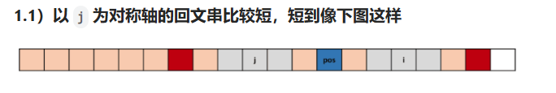
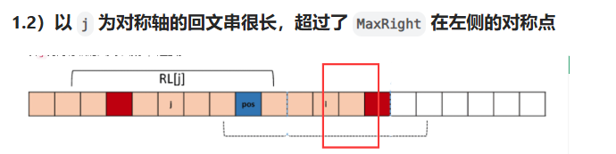

# 板子——字符串（KMP/Z函数/Manacher/字符串哈希/AC自动机/后缀数组/子序列自动机）

# 一、KMP算法

### （1）[28. 找出字符串中第一个匹配项的下标](https://leetcode.cn/problems/find-the-index-of-the-first-occurrence-in-a-string/)

板子题，kmp这个板子函数即为需要掌握的函数。

```c++
class Solution {
public:
    vector<int> kmp(string& str, string& pattern)
    {
        int m = pattern.size();
        int c = 0;
        vector<int> pi(m, 0);
        for(int i=1;i<m;i++)
        {
            char v = pattern[i];
            //case 1:不匹配
            while(c>0 && pattern[c]!=v)
            {
                c = pi[c-1];
            }
            //case 2:匹配
            if(pattern[c]==v) c++;
            pi[i] = c;
        }

        //匹配正式的字符串
        vector<int> res;
        c = 0;
        for(int i=0;i<str.size();i++)
        {
            char v = str[i];
            while(c>0 && pattern[c]!=v)
            {
                c = pi[c-1];
            }
            if(pattern[c]==v) c++;
            if(c==m)
            {
                res.emplace_back(i-m+1);
                c=pi[c-1];
            }
        }
        return res;
    }
    int strStr(string haystack, string needle) {
        vector<int> res = kmp(haystack, needle);
        if(res.size()==0) return -1;
        return res[0];
    }
};
```


# Manacher  马拉车算法 :car:

### [5. 最长回文子串](https://leetcode.cn/problems/longest-palindromic-substring/) :cat:

给你一个字符串 `s`，找到 `s` 中最长的 回文 子串。

**示例 1：**

```
输入：s = "babad"
输出："bab"
解释："aba" 同样是符合题意的答案。
```

#### M1 中心拓展法

```C++
class Solution {
public:
    pair<int, int> expandAroundCneter(string s, int l, int r) 
    {
        while (l >= 0 && r < s.size() && s[l] == s[r]) 
        {
            l--;
            r++;
        }
        return {l+1,r-1};
    }
    string longestPalindrome(string s) 
    {
        int n = s.size();
        int start = 0, end = 0;
        for (int i = 0; i < n; i++) 
        {
            int l = i - 1, r = i + 1;
            auto [l1,r1] = expandAroundCneter(s,l,r);
            if(r1-l1>end-start) 
            {
                end =r1,start = l1;
            }
            l = i - 1, r = i;
            auto [l2,r2] = expandAroundCneter(s,l,r);
            if(r2-l2>end-start) 
            {
                end =r2,start = l2;
            }
        }
        return s.substr(start,end-start+1);
    }
};
```


#### Manacher  马拉车算法 :car: :horse_racing:  O（n）

【马拉车算法 | Coding Club】 https://www.bilibili.com/video/BV1Sx4y1k7jG/?share_source=copy_web&vd_source=067de257d5f13e60e5b36da1a0ec151e


https://leetcode.cn/problems/longest-palindromic-substring/solutions/2958179/mo-ban-on-manacher-suan-fa-pythonjavacgo-t6cx/

参考代码：

**https://leetcode.cn/problems/longest-palindromic-substring/solutions/7600/5-zui-chang-hui-wen-zi-chuan-cc-by-bian-bian-xiong**



```c++
这时我们知道RL[i]至少不会小于RL[j]，并且已经知道了部分的以i为中心的回文串，于是可以令RL[i]=RL[j] 为起始半径。
又因为 (j + i) / 2 = pos ==> j = 2*pos - i 得到 RL[i]=RL[2*pos - i]。
```




```C++
RL[i] = MaxRight - i
```

//a  半径是1

//bab 半径是2 

```C++
class Solution {
public:
    string longestPalindrome(string s) {
        int len = s.size();
        if(len<1)return "";
        string s1;
        for(char c:s)
        {
            s1+='#';
            s1+=c;
        }
        s1+='#';
        len = s1.size();
        int MaxRight = 0;//最右边字母（右边最大蘑菇右边界）
        int pos = 0;//center 目前右边最大蘑菇中心
        int MaxRL = 0;//结果最大半径
        int MaxPos = 0;//结果最大中心
        vector<int> RL(len,0);
        for(int i=0;i<len;i++)
        {
            if(i<MaxRight)
            {
                RL[i] = min(RL[2*pos-i],MaxRight-i);
            }
            else
            {
                RL[i] = 1;
            }
            //蘑菇不能穿透左边界和有右边界哦 && 蘑菇继续伸展
            while(i-RL[i]>=0 && i+RL[i]<len && s1[i-RL[i]]==s1[i+RL[i]])
            {
                RL[i]++;//蘑菇继续伸展
            }
            //成为新的大蘑菇
            if(RL[i]+i-1>MaxRight)
            {
                MaxRight = RL[i]+i-1;
                pos = i; 
            }
            //更新结果
            if(MaxRL<=RL[i])
            {
                MaxRL = RL[i];
                MaxPos = i;
            }
        }
        return s.substr((MaxPos-MaxRL+1)/2,MaxRL-1);//可以再看看如何还原

    }
};
```

> 胖注：在Manacher算法的for循环中，判断没有超过蘑菇最右边界的情况，做半径的更新逻辑也可以写成下面这个：
>
> ```c++
> if(i<=maxRight) //在最大的蘑菇的庇佑下,直接拿前面的结果
> {
>  RL[i] = min(RL[2*pos-i], maxRight-i+1);
> }
> ```


