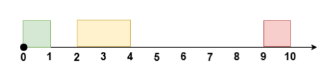

# 板子——滑动窗口与双指针专题

# 一、定长滑动窗口

【板子题】[1343. 大小为 K 且平均值大于等于阈值的子数组数目](https://leetcode.cn/problems/number-of-sub-arrays-of-size-k-and-average-greater-than-or-equal-to-threshold/)

> 给你一个整数数组 `arr` 和两个整数 `k` 和 `threshold` 。
>
> 请你返回长度为 `k` 且平均值大于等于 `threshold` 的子数组数目。

```c++
class Solution {
public:
    int numOfSubarrays(vector<int>& arr, int k, int threshold) {
        int n=arr.size();
        int res=0;
        int sum=0;
        int thresholdSum = threshold*k;
        for(int i=0;i<n;i++)
        {
            //1、inset
            sum+=arr[i];//假设k是3个 inset步骤 从2加到3
            if(i<k-1)continue;//判断下标是否小于2(是否小于3个元素) 是的话就continue
            //2、update
            if(sum>=thresholdSum)res+=1;//判断一下总的sum,因为现在是3个元素
            //3、delete
            sum-=arr[i-k+1];//扣掉一个元素 回到2个元素
        }
        return res;
    }
};
```

重点是下面这段：
```c++
for(int i=0;i<n;i++)
{
    //1、inset
    sum+=arr[i];//假设k是3个 inset步骤 从2加到3
    if(i<k-1)continue;//判断下标是否小于2(是否小于3个元素) 是的话就continue
    //2、update
    if(sum>=thresholdSum)res+=1;//判断一下总的sum,因为现在是3个元素
    //3、delete
    sum-=arr[i-k+1];//扣掉一个元素 回到2个元素
}
```

以下整理一些比较值得注意的题目，和对应的思路。


## 1.重点题目和思路

### （1）爱生气的书店老板

> 抽象版：数组中有一些正数，同时有一个mask数组（由0，1组成，1表示选，0表示不选），你可以将mask数组连续k个数改成1（有一次机会，意味着将长度为k的窗口内本来不可选的变为可选），问此时数组的最大和是多少（只能选允许选的数）？

`customers[i]` 是在第 `i` 分钟开始时进入商店的顾客数量，所有这些顾客在第 `i` 分钟结束后离开。

在某些分钟内，书店老板会生气。 如果书店老板在第 `i` 分钟生气，那么 `grumpy[i] = 1`，否则 `grumpy[i] = 0`。

当老板生气时，那一分钟的顾客就会不满意，否则如果老板不生气则顾客满意。

现在，老板可以让自己**连续minutes分钟不生气，只能使用一次**。请问**一天下来，最多多少顾客能感到满意？**

```
输入：customers = [1,0,1,2,1,1,7,5], grumpy = [0,1,0,1,0,1,0,1], minutes = 3 
输出：16
老板在最后三分钟保持冷静即可。
```

代码如下：

```c++
class Solution {
public:
    int maxSatisfied(vector<int>& customers, vector<int>& grumpy, int minutes) {
        //记录minutes分钟内不生气带来的增量收益
        int temp = 0;
        int resMax = 0;
        int normal=0;
        for(int r=0;r<customers.size();r++)
        {
            //计算正常收益
            if(grumpy[r]==0)
            	normal += customers[r];
            else
                temp += customers[r]; //能挽救多少顾客（不生气可以新增窗口内多少满意顾客）
            if(r<minutes-1)continue;
            //update
            resMax = max(resMax,temp);
            //out
            if(grumpy[r-minutes+1]==1) temp-=customers[r-minutes+1];
        }
        return normal+resMax;
    }
};
```


### （2）从数组两侧取k个数的最大值——转换为n-k的滑动窗口的和最小值

- ==务必注意窗口大小为0的情况，有可能的话可以特判。==以下给出不特判的问题：

```c++
for(int i=0;i<n;i++)
{
    //1、inset
    sum+=arr[i];
    if(i<k-1)continue; //思考一下：如果k是0，那么理论上是不允许选择数的，但此时i=0时k-1=-1，判断i>=k-1会更新下面的sum值，造成错误
    //2、update
    if(sum>=thresholdSum)res+=1;
    //3、delete
    sum-=arr[i-k+1];
}
```


### （3）另一种针对窗口内求和的定长滑动窗口写法——一次更新两端

```c++
class Solution {
public:
    int maxScore(vector<int>& cardPoints, int k) {
        //用求和函数加快计算
        int n = cardPoints.size();
        int sum = accumulate(cardPoints.begin(), cardPoints.end(), 0); //别忘了最后一个参数
        if(n==k) return sum; //注意特殊情况判断
        int tmpSum = accumulate(cardPoints.begin(), cardPoints.begin()+n-k, 0); //前n-k个值之和
        int res = tmpSum;
        
        //求解窗口大小为n-k的最小点数，重点看下面的逻辑
        for(int i=n-k;i<n;i++){
            tmpSum += (cardPoints[i] - cardPoints[i-(n-k)]); //一次更新两端
            res = min(res, tmpSum);
        }
        return sum - res;
    }
};
```


### （4）滑动窗口——针对循环数组

**要点：取余**，并且自己可以画图确定一下索引，同时务必注意负数取余的问题，比如：i-k+1<0，那么就得是：

```c++
nums[(i-k+1 + n)%n] //务必注意这里的负数取余的+n问题
```


### （5）维护“至多k个”的和的最大值，定长滑动窗口怎么写比较好？（都是正数）

相当于窗口内最多k个元素是合法的，少于k个元素也是合法的，此时res的update逻辑位置需要发生变化，类似于：

```c++
for(int i=0;i<=n;i++)
{
    //1.inset
    sum += nums[i];
    //2.update,本题最大k,直接更新即可
    ans = max(ans, sum); //把更新的逻辑写在if(i<k-1) continue;的前面，意味着一开始窗口内元素不到k个也是没问题的
    if(i<k-1) continue;
    sum -= nums[i-k+1];
}
```


### （6）如果发现可以尝试定长滑动窗口（有个固定的k值在），可以尝试以下预处理思路：

- （a）**排序后滑动窗口：**比如原数组选k个数，使得这k个数的最大值与最小值的差最小，则对原数组从小到大排序后做滑动窗口（有点贪心意思在里面）；
- （b）**转换维护的内容**：比如[3439. 重新安排会议得到最多空余时间 I](https://leetcode.cn/problems/reschedule-meetings-for-maximum-free-time-i/)，这道题，可以重新安排 **至多** `k` 个会议，安排的规则是将会议时间平移，且保持原来的 **会议时长** ，你的目的是移动会议后 **最大化** 相邻两个会议之间的 **最长** 连续空余时间。



- 题目要求会议之间的相对顺序需要保持不变，这意味着我们只能合并相邻的空余时间段，所以重新安排至多 *k* 个会议等价于如下问题：

  - 给你 *n*+1 个空余时间段，合并其中 *k*+1 个**连续**的空余时间段，得到的最大长度是多少？


### （7）给你一个 **二进制环形** 数组 `nums`（数组中只有0和1） ，返回在 **任意位置** 将数组中的所有 `1` 聚集在一起需要的最少交换次数。

要点：先计算整个数组中有几个1（假设为m），那么所有1聚集在一起的结果就一定有m个1，因此维护一个长度为m的窗口，里面的1越多，那么需要通过交换换过来的1就越少，因此只要求长度为m的窗口内最多有几个1即可。

代码如下：

```c++
class Solution {
public:
    int minSwaps(vector<int>& nums) {
        //环形数组,先看看有多少1
        int cnt = 0;
        for(int num: nums)
        {
            if(num==1) cnt++;
        }
        int k = cnt; //窗口大小,要看窗口里的1最多,即0最少
        int n = nums.size();
        int countZero = 0;
        int ans = k; //要最少的0
        for(int i=0;i<n+k;i++) //用环形数组来做
        {
            //1.inset
            countZero += (nums[i%n]==0);
            //2.update
            if(i<k-1) continue;
            ans = min(ans, countZero);
            //3.delete
            countZero -= (nums[(i-k+1+n)%n]==0);  //环形数组，务必小心负数取余的问题
        }
        return ans;
    }
};
```


### [30. 串联所有单词的子串](https://leetcode.cn/problems/substring-with-concatenation-of-all-words/)

困难

给定一个字符串 `s` 和一个字符串数组 `words`**。** `words` 中所有字符串 **长度相同**。

 `s` 中的 **串联子串** 是指一个包含 `words` 中所有字符串以任意顺序排列连接起来的子串。

- 例如，如果 `words = ["ab","cd","ef"]`， 那么 `"abcdef"`， `"abefcd"`，`"cdabef"`， `"cdefab"`，`"efabcd"`， 和 `"efcdab"` 都是串联子串。 `"acdbef"` 不是串联子串，因为他不是任何 `words` 排列的连接。

返回所有串联子串在 `s` 中的开始索引。你可以以 **任意顺序** 返回答案。

**示例 1：**

```
输入：s = "barfoothefoobarman", words = ["foo","bar"]
输出：[0,9]
解释：因为 words.length == 2 同时 words[i].length == 3，连接的子字符串的长度必须为 6。
子串 "barfoo" 开始位置是 0。它是 words 中以 ["bar","foo"] 顺序排列的连接。
子串 "foobar" 开始位置是 9。它是 words 中以 ["foo","bar"] 顺序排列的连接。
输出顺序无关紧要。返回 [9,0] 也是可以的。
```


```c++
class Solution {
public:
    vector<int> findSubstring(string s, vector<string>& words) {
        int wordNum = words.size(),wordSize=words[0].size();
        vector<int> res;  
        //i代表滑动的起始位置，i需要从0~wordSize-1之间开始都枚举      
        for(int i=0;i<wordSize && i+wordSize*wordNum<=s.size();i++) 
        {
            unordered_map<string,int> wordMap;
            int left = i;
            int right = i+wordNum*wordSize;
            for(int j=left;j<right;j+=wordSize)
            {
                wordMap[s.substr(j,wordSize)]++; 
            }
            for(string &word:words)
            {
                wordMap[word]--;
                if(wordMap[word]==0) wordMap.erase(word);
            }
            if(wordMap.empty()) res.push_back(left); 
            while(right<s.size()) 
            {
                string deleteWord = s.substr(left,wordSize);  
                string joinWord = s.substr(right,wordSize);
                if(--wordMap[deleteWord]==0)wordMap.erase(deleteWord);
                if(++wordMap[joinWord]==0)wordMap.erase(joinWord);
                right += wordSize;
                left += wordSize;
                if(wordMap.empty())res.push_back(left);
            }
        }
        return res;
    }
};
```

代码来自https://leetcode.cn/problems/substring-with-concatenation-of-all-words/solutions/1616997/chuan-lian-suo-you-dan-ci-de-zi-chuan-by-244a/

结合看

https://leetcode.cn/problems/substring-with-concatenation-of-all-words/solutions/1616997/chuan-lian-suo-you-dan-ci-de-zi-chuan-by-244a/comments/2980722/

# 二、不定长滑动窗口

个人理解，做题目的时候需要考虑好数组中数的范围，比如是否有负数，有0，这种情况下单纯的`while(sum>=target)`可能会失效，有时需要加上`while(sum>=target && l<=r)`做进一步判断。

（想象一下缩左指针，结果窗口内有负数，越缩sum越大，有可能会越界。）

> 有负数务必小心，注意看1.（4）的那道题

## 1.求最长/最大

一般题目都有「至多」的要求。

- 与定长滑动窗口套路是类似的，在外层`for`循环中维护r指针，如果不满足要求则移动`l`指针直到满足要求为止。

板子题——**无重复字符的最长子串：**

```c++
class Solution {
public:
    int lengthOfLongestSubstring(string s) {
        unordered_map<char, int> umap; //存储每个字符出现的次数
        int res = 0;
        int l=0;
        for(int r=0;r<s.size();r++){
            umap[s[r]]++;
            while(umap[s[r]]>1){
                umap[s[l]]--;
                l++;
            }
            if(l<=r) res = max(res, r-l+1); //这里以防万一，可以都写一下l<=r，反正多写也不影响结果
        }
        return res;
    }
};
```


### （1）[1493. 删掉一个元素以后全为 1 的最长子数组](https://leetcode.cn/problems/longest-subarray-of-1s-after-deleting-one-element/)

给你一个二进制数组 `nums`（nums中只会有0或者1） ，你需要从中删掉一个元素。

请你在删掉元素的结果数组中，返回最长的且只包含 1 的非空子数组的长度。

如果不存在这样的子数组，请返回 0 。

> 本题可以转换为维护窗口内“最多有一个0”的最长子数组。

代码如下：
```c++
class Solution {
public:
    int longestSubarray(vector<int>& nums) {
        //其实就是最多包含1个0的最长数组长度
        int zeroCnt = 0;
        int n = nums.size();
        int left = 0;
        int ans = 1;
        for(int right = 0;right<n;right++)
        {
            zeroCnt += (nums[right] == 0);
            while(zeroCnt > 1)
            {
                zeroCnt -= (nums[left] == 0);
                left++;
            }
            ans = max(ans, right - left + 1);
        }
        return ans - 1; //删掉一个元素之后的最长长度
    }
};
```


### （2）维护窗口里最多有一对相邻相等数的最长窗口长度

> 给你一个下标从 **0** 开始的字符串 `s` ，这个字符串只包含 `0` 到 `9` 的数字字符。
>
> 如果一个字符串 `t` 中至多有一对相邻字符是相等的，那么称这个字符串 `t` 是 **半重复的** 。例如，`"0010"` 、`"002020"` 、`"0123"` 、`"2002"` 和 `"54944"` 是半重复字符串，而 `"00101022"` （相邻的相同数字对是 00 和 22）和 `"1101234883"` （相邻的相同数字对是 11 和 88）不是半重复字符串。
>
> 请你返回 `s` 中最长 **半重复** 子字符串 的长度。

可以记录每次重复的位置下标，还有一种比较好写代码的方式是维护一个isSame值，表示窗口内现在有几对相邻相等的数对，如果isSame=2，则移动左指针直到`nums[left]==nums[left-1]`,那么此时right-left+1即为所求，同时更新isSame=1。

代码如下：

```c++
class Solution {
public:
    int longestSemiRepetitiveSubstring(string s) {
        int ans = 1, same = 0, left = 0;
        for (int right = 1; right < s.length(); right++) {
            if (s[right] == s[right - 1]) {
                same++;
            }
            if (same > 1) { // same == 2
                left++;
                while (s[left] != s[left - 1]) {
                    left++;
                }
                same = 1;
            }
            ans = max(ans, right - left + 1);
        }
        return ans;
    }
};
```


### （3）可能要预处理——比如排序

以下是一道例题：

> 给你一个下标从 **0** 开始的整数数组 `nums` 和一个 **非负** 整数 `k` 。
>
> 在一步操作中，你可以执行下述指令：
>
> - 在范围 `[0, nums.length - 1]` 中选择一个 **此前没有选过** 的下标 `i` 。
> - 将 `nums[i]` 替换为范围 `[nums[i] - k, nums[i] + k]` 内的任一整数。
>
> 数组的 **美丽值** 定义为数组中由相等元素组成的最长子序列的长度。
>
> 对数组 `nums` 执行上述操作任意次后，返回数组可能取得的 **最大** 美丽值。
>
> **注意：**你 **只** 能对每个下标执行 **一次** 此操作。

这道题目会有一些思维上的难度。对于笔试题来说为了快速尝试能否通过这道题，可以大胆对数组进行预处理，比如排序（排序也就nlogn，别担心复杂度）。

```c++
class Solution {
public:
    int maximumBeauty(vector<int>& nums, int k) {
        //排序后,维护窗口内元素差<=2*k的最大长度,此时才能保持这一部分都变成同一个值
        sort(nums.begin(), nums.end());
        int l=0;
        int res=1; //最起码美丽值也得是1
        int n = nums.size();;
        for(int r=1;r<nums.size();r++){
            while(nums[r]-nums[l]>2*k){
                l++;
            }
            res = max(res, r-l+1);
        }
        return res;
    }
};
```


### （4）与定长滑动窗口类似，务必注意为负数的情况！注意下面的例题

> 给你一个整数数组 `nums` 和一个整数 `x` 。每一次操作时，你应当移除数组 `nums` 最左边或最右边的元素，然后从 `x` 中减去该元素的值。请注意，需要 **修改** 数组以供接下来的操作使用。
>
> 如果可以将 `x` **恰好** 减到 `0` ，返回 **最小操作数** ；否则，返回 `-1` 。

**必须注意的是，本题转换为求窗口内和为totalSum-x的最大窗口长度后**，需要注意totalSum-x可能会<0的情况。代码如下：

```c++
class Solution {
public:
    int minOperations(vector<int>& nums, int x) 
    {
        //转换为 和恰好为 totalSum-x 的最长子字符串
        int target = reduce(nums.begin(),nums.end())-x;
        if(target<0)return -1; //如果不写这句的话，target<0的时候在while循环里l指针会一直往右走，超过r指针，造成错误的结果，最好的方式就是在这里做一下特判
        int l=0;
        int n=nums.size();
        int tempsum=0;
        int maxLen=-1;
        for(int r=0;r<n;r++)
        {
            //in
            tempsum+=nums[r];
            //out
            while(tempsum>target)
            {
                tempsum-=nums[l];
                l++;
            }
            //update
            if(tempsum==target)
            {
                maxLen = max(maxLen,r-l+1);
            }
        }
        return ( (maxLen==(-1))? (-1):(n-maxLen) );
    }
};
```


### （5）[1838. 最高频元素的频数](https://leetcode.cn/problems/frequency-of-the-most-frequent-element/)

> 元素的 **频数** 是该元素在一个数组中出现的次数。
>
> 给你一个整数数组 `nums` 和一个整数 `k` 。在一步操作中，你可以选择 `nums` 的一个下标，并将该下标对应元素的值增加 `1` 。
>
> 执行最多 `k` 次操作后，返回数组中最高频元素的 **最大可能频数** *。*

**注意：本题需要考虑long long的范围问题**

```c++
class Solution {
public:
    int maxFrequency(vector<int>& nums, int k) {
        sort(nums.begin(), nums.end());
        long long cost = k;
        int l=0;
        int n=nums.size();
        int res = 1; //记录最终的结果
        int size = 1; //窗口里最开始有1个元素
        for(int r=1;r<n;r++){
            cost -= (long long)((long long)size * (nums[r]-nums[r-1]));
            while(cost<0){
                cost += (nums[r]-nums[l]);
                l++;
            }
            size = r-l+1; //窗口里现在的元素数量
            res = max(res, r-l+1);
        }
        return res;
    }
};
```

具体思路的描述：

> 你的思路可以总结为以下步骤，便于日后回顾：
>
> 1. **排序数组**：首先将数组排序，这样可以确保相邻元素之间的调整操作次数最小，便于后续使用滑动窗口。
> 2. **滑动窗口维护**：使用双指针 `l` 和 `r` 定义一个窗口，表示当前考虑将窗口内所有元素调整为 `nums[r]` 的情况。目标是找到满足总操作次数不超过 `k` 的最大窗口长度。
> 3. **操作次数计算**：
>    - **扩展右边界**：每次右移 `r` 时，计算将窗口内所有元素从之前的最大值 `nums[r-1]` 提升到当前 `nums[r]` 所需的额外操作次数。这部分操作为 `size * (nums[r] - nums[r-1])`，其中 `size` 是当前窗口元素数量。
>    - **调整左边界**：若总操作次数超过 `k`，则逐步右移左指针 `l`，并恢复移出元素对应的操作次数（即 `nums[r] - nums[l]`），直到总操作次数合法。
> 4. **更新最大频数**：每次窗口调整后，记录当前窗口长度作为候选结果，最终取最大值。
>
> **关键点**：
>
> - 排序后，最优目标值必定是窗口右端点的值，因为调整到更大的值需要更多操作次数。
> - 维护窗口内的总操作数不超过 `k`，通过动态调整窗口大小确保高效性。
>
> 这种方法的复杂度为排序的 $O(n log n) $加上滑动窗口遍历的 $O(n)$，高效适用于大规模数据。


## 2.求最短/最小

一般题目都有「至少」的要求。

### （1）模板——长度最小的子数组

[209. 长度最小的子数组](https://leetcode.cn/problems/minimum-size-subarray-sum/)

> 给定一个含有 `n` 个正整数的数组和一个正整数 `target` **。**
>
> 找出该数组中满足其总和大于等于 `target` 的长度最小的 **子数组** `[numsl, numsl+1, ..., numsr-1, numsr]` ，并返回其长度**。**如果不存在符合条件的子数组，返回 `0` 。

对于本题来说，窗口内的值的情况是合法的，可以把ans的更新放到while逻辑的里面，代码如下：
```c++
class Solution {
public:
    int minSubArrayLen(int target, vector<int>& nums) {
        int left = 0;
        int ans = INT_MAX;
        int n = nums.size();
        int sum = 0;
        for(int right=0;right<n;right++)
        {
            sum += nums[right];
            while(sum>=target)
            {
                ans = min(ans, right-left+1); //把更新写到这里,因为窗口内是合法的
                sum -= nums[left];
                left++;
            }
        }
        if(ans==INT_MAX) return 0;
        return ans;
    }
};
```

另一种写法在里层的while循环中判断是否能减，退出while循环后自然left会指向最后一个符合要求的值。代码如下：
```c++
class Solution {
public:
    int minSubArrayLen(int target, vector<int>& nums) {
        int left = 0;
        int ans = INT_MAX;
        int n = nums.size();
        int sum = 0;
        for(int right=0;right<n;right++)
        {
            sum += nums[right];
            while(sum-nums[left]>=target)
            {
                sum -= nums[left];
                left++;
            }
            //sum-nums[left]<target,不能再收缩窗口了
            if(sum>=target) //务必要写这一句,试想:如果上面的while循环根本没进来呢?也得保证sum是>=target的才符合题意
            {
                ans = min(ans, right-left+1);
            }
        }
        if(ans==INT_MAX) return 0;
        return ans;
    }
};
```


### （2）维护滑动窗口外的某些值——换位思考

下面这道题比较经典：

> 有一个只含有 `'Q', 'W', 'E', 'R'` 四种字符，且长度为 `n` 的字符串。
>
> 假如在该字符串中，这四个字符都恰好出现 `n/4` 次，那么它就是一个「平衡字符串」。
>
>  
>
> 给你一个这样的字符串 `s`，请通过「替换一个子串」的方式，使原字符串 `s` 变成一个「平衡字符串」。
>
> 你可以用和「待替换子串」长度相同的 **任何** 其他字符串来完成替换。
>
> 请返回待替换子串的最小可能长度。
>
> 如果原字符串自身就是一个平衡字符串，则返回 `0`。

代码如下：

```c++
class Solution {
public:
    int balancedString(string s) {
        int n = s.size();
        array<int, 'Z'> cnt{}; //用数组代替哈希,可能会快一些,'Z'的ASCII码也不会太大,牺牲一点空间,但时间快
        for(char c: s)
        {
            cnt[c]++;
        }
        int left = 0;
        int target = n / 4;
        if(cnt['Q']==target && cnt['W']==target && cnt['E']==target && cnt['R']==target) return 0;
        int ans = INT_MAX; //待替换子串的最小可能长度
        //窗口外QWER任意元素的出现次数>n/4,则不合法,需要增加窗口大小,让窗口内元素更多,窗口外的元素更少;换言之,如果窗口内的QWER元素数量都<=n/4,则符合要求,移动left指针直到不符合要求，**本题的难点在于虽然移动逻辑是窗口的双指针移动逻辑，但本质上要维护的是窗口外的值，因此注意下面for循环中的++和--是反过来的，因为维护的是窗口外的**
        for(int right = 0;right<n;right++)
        {
            cnt[s[right]]--; //窗口外的元素减少了一格
            while(cnt['Q']<=target && cnt['W']<=target && cnt['E']<=target && cnt['R']<=target)
            {
                ans = min(ans, right - left + 1); //此时窗口里面的是合法的情况 
                cnt[s[left]]++; //窗口外元素增多
                left++;
            }
        }
        return ans;
    }
};
```


## 3.求子数组个数

### (1)越长越合法

一般要写 ans += left。

内层循环结束后，[left,right] 这个子数组是不满足题目要求的，但在退出循环之前的最后一轮循环，[left−1,right] 是满足题目要求的。由于子数组越长，越能满足题目要求，所以除了 [left−1,right]，还有 [left−2,right],[left−3,right],…,[0,right] 都是满足要求的。也就是说，当右端点固定在 right 时，左端点在 0,1,2,…,left−1 的所有子数组都是满足要求的，这一共有 left 个。

#### (a)板子题

[1358. 包含所有三种字符的子字符串数目](https://leetcode.cn/problems/number-of-substrings-containing-all-three-characters/)

> 给你一个字符串 `s` ，它只包含三种字符 a, b 和 c 。
>
> 请你返回 a，b 和 c 都 **至少** 出现过一次的子字符串数目。

代码如下：

```c++
class Solution {
public:
    int numberOfSubstrings(string s) {
        int ans = 0;
        int n = s.size();
        int left = 0;
        array<int, 3> cnts{};
        for(int right=0;right<n;right++)
        {
            cnts[s[right]-'a']++;
            while(cnts[0] && cnts[1] && cnts[2]) //窗口是合法的,且窗口内元素越多越合法,即越长越合法,思考:右指针移动完左指针往右移动,移动到不合法的位置之后0~left-1依旧都是合法的(因为越长越合法),所以不会有问题
            {
                cnts[s[left]-'a']--;
                left++;
            }
            ans += left; //left指到第一个不合法的,左侧的都是合法的
        }
        return ans;
    }
};
```


#### （b）[2537. 统计好子数组的数目](https://leetcode.cn/problems/count-the-number-of-good-subarrays/)

> 给你一个整数数组 `nums` 和一个整数 `k` ，请你返回 `nums` 中 **好** 子数组的数目。
>
> 一个子数组 `arr` 如果有 **至少** `k` 对下标 `(i, j)` 满足 `i < j` 且 `arr[i] == arr[j]` ，那么称它是一个 **好** 子数组。
>
> **子数组** 是原数组中一段连续 **非空** 的元素序列。

```c++
class Solution {
public:
    long long countGood(vector<int>& nums, int k) {
        unordered_map<int, int> umap;
        int l=0; 
        long long pair = 0; //记录对数
        long long cnt = 0; //记录好子数组的数目
        for(int r=0;r<nums.size();r++){
            pair += umap[nums[r]]; //增加现有的nums[r]这么多对 pair,因为此时跟左侧所有的相同数都构成arr[i] == arr[j]
            umap[nums[r]]++;
            while(pair>=k){
                umap[nums[l]]--;
                pair-=umap[nums[l]]; //本来假设5个值一样,去掉左边的1个值,相当于少了4个一样的数对
                l++;
            }
            cnt+=l;
        }
        return cnt;
    }
};
```


# 分组循环

适用场景：按照题目要求，数组会被分割成若干组，每一组的判断/处理逻辑是相同的。

核心思想：

- 外层循环负责遍历组之前的准备工作（记录开始位置），和遍历组之后的统计工作（更新答案最大值）。
- 内层循环负责遍历组，找出这一组最远在哪结束。

## 1.板子题——[2760. 最长奇偶子数组](https://leetcode.cn/problems/longest-even-odd-subarray-with-threshold/)

> 给你一个下标从 **0** 开始的整数数组 `nums` 和一个整数 `threshold` 。
>
> 请你从 `nums` 的子数组中找出以下标 `l` 开头、下标 `r` 结尾 `(0 <= l <= r < nums.length)` 且满足以下条件的 **最长子数组** ：
>
> - `nums[l] % 2 == 0`
> - 对于范围 `[l, r - 1]` 内的所有下标 `i` ，`nums[i] % 2 != nums[i + 1] % 2`
> - 对于范围 `[l, r]` 内的所有下标 `i` ，`nums[i] <= threshold`
>
> 以整数形式返回满足题目要求的最长子数组的长度。
>
> **注意：子数组** 是数组中的一个连续非空元素序列。

分组循环

- 适用场景：按照题目要求，数组会被分割成若干组，且每一组的判断/处理逻辑是一样的。

核心思想：

- 外层循环负责遍历组之前的准备工作（记录开始位置），和遍历组之后的统计工作（更新答案最大值）。
- 内层循环负责遍历组，找出这一组最远在哪结束。

这个写法的好处是，各个逻辑块分工明确，也不需要特判最后一组（易错点）。以我的经验，这个写法是所有写法中最不容易出 bug 的，推荐大家记住。


因此，本题代码如下：

```c++
class Solution {
public:
    int longestAlternatingSubarray(vector<int>& nums, int threshold) {
        int i = 0; //目前在序列中的索引
        int ans = 0; //记录最长子数组的长度
        int n = nums.size();
        while(i < n)
        {
            if(nums[i]%2 || nums[i]>threshold) //不合法的开始值，跟双指针专题一样,为了怕写错,while里面就别写while了 
            {
                i++;
                continue; 
            }
            int start = i;
            i++; //从后一个数开始判断
            while(i<n && nums[i]<=threshold && nums[i]%2 != nums[i-1]%2)
            {
                i++; //继续往后走,直到不符合题意,i=n或者序列不符合,i指向不符合的位置
            }
            ans = max(ans, i-start); //更新ans的值
        }
        return ans;
    }
};
```

