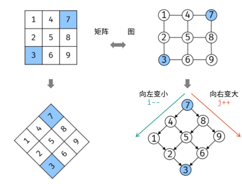
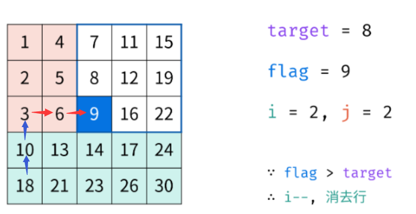
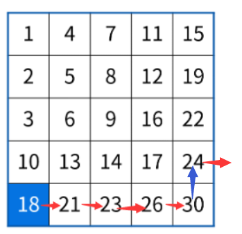
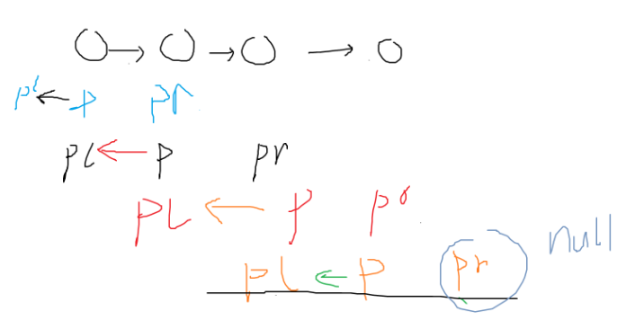
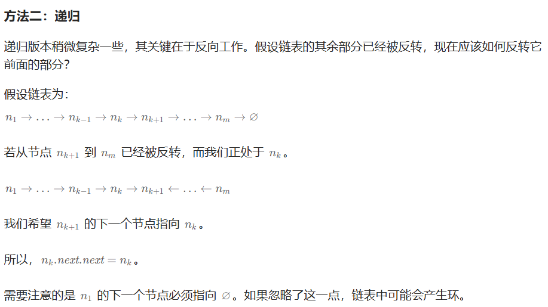

# 《剑指Offer》阅读总结


# 2.2 编程语言

## 1.C++

### （1）问题1

答案见p22~23页。

Q1：定义一个空的类型，没有任何成员变量和成员函数，对该类型求sizeof，结果是多少？为什么？

Q2: 在Q1的基础上，如果在该类型中添加一个构造函数和析构函数，再对类对象求sizeof，结果是多少？

Q3:在Q1和Q2的基础上，把析构函数标记为虚函数，此时求解sizeof的结果是多少？

> 以上三道题的测试代码在CppOffer_01.cpp文件中。

**大概答案：具体看书**

**Q1：定义一个空的类型，没有任何成员变量和成员函数，对该类型求sizeof，结果是多少？为什么？**

是1

**Q1_1 : 为什么不是0？**

必须在内存中占用一定的空间，否则无法使用这些实例。至于占用多少内存，是由编译器决定的，比如VisualStudio中每个空类型的实例占用1字节的空间

**Q2: 在Q1的基础上，如果在该类型中添加一个构造函数和析构函数，再对类对象求sizeof，结果是多少？**

加构造函数还是1

再加析构函数还是=1

>- 成员函数（包括构造函数和析构函数）在内存中有自己的地址，但这些地址并不影响对象的大小。成员函数的地址通常是通过类的对象调用时隐式传递的 `this` 指针来访问的。

**Q3:在Q1和Q2的基础上，把析构函数标记为虚函数，此时求解sizeof的结果是多少？**

8（64位）

需要虚函数表指针

### （2）问题2

以下代码会产生什么现象？如果有问题，怎么改？

A.编译错误  	B.编译成功，运行时崩溃 	C.编译运行正常，输出10；

```c++
#include <iostream>
using namespace std;
class A
{
private:
    int value;
public:
    A(int n){value=n;}
    A(A other){value=other.value;}
    void print(){cout<<value<<endl;}
};
int main()
{
    A a = 10;
    A b = a;
    b.print();
    return 0;
}
```

> 测试代码在CppOffer_02.cpp文件中。改好的代码也在这个文件里面。


会导致编译错误

**不允许在拷贝构造函数内传值**，否则就会导致拷贝构造函数内调用拷贝构造函数，**无穷无尽**递归调用，导致栈溢出。

值传递需要改为**常量引用**，拷贝构造函数需要改为`A(const A& other) { value = other.value; }` 才对


为什么错误代码` A(A other){value=other.value;}`会导致无穷无尽调用？

https://blog.csdn.net/luke_sanjayzzzhong/article/details/100739797

首先我们要知道，类似` void myTestFunc(CTest t){     }`随便一个这样的函数，调用的时候传入实参，都会复制一个副本，即会调用拷贝构造函数，那么如果拷贝构造函数是值传递，因此拷贝构造函数这个函数又再次复制一份，再调用拷贝构造函数，循环往复。。。


### （3）问题3：赋值运算符函数

见p24~26。

Q：如下是类型CMyString的声明，请为其添加赋值运算符函数。

```c++
class CMyString
{
public:
    CMyString(char* pData=nullptr);
    CMyString(const CMyString& str);
    ~CMyString();
private:
    char* m_pData;
};
```

> 添加后的代码在CppOffer_03.cpp文件中。有一些需要注意的细节已经写进代码注释里了。


```C++
//初级版
CMyString& operator = (const CMyString& str)
{
    /*this->m_pData = str.m_pData;*/ // no

     //this 指针 指向自己这个对象 this的值是对象的地址；
     //str就是这个对象 &str 取这个对象的地址
    if (this == &str)
        return *this;

    delete[]m_pData;
    m_pData = NULL;

    m_pData = new char[strlen(str.m_pData)+1];
    strcpy_s(m_pData, strlen(str.m_pData) + 1, str.m_pData);//vs一定要有_s

    return *this;
}
```


```C++
//高级版:考虑了异常安全性
CMyString& CMyString::operator =(const CMyString& str)
{
    if(this!=&str)
    {
        CMyString strTemp(str);
        //以下三句交换
        char* tmp = strTemp.m_pData;
        strTemp.m_pData = m_pData;
        m_pData = tmp;
    }
    //这样离开上面if语句作用域的时候,strTemp会自动调用析构函数,从而把原来的m_pData对应的内存块删除
    //并且如果new报bad alloc的错的时候（如因为内存不足）,m_pData还不会更新,不会出现异常错误,见剑指offer p26页
    return *this;
}
```


## 2.C#（未看完：p28~p32）

### （1）面试题1

C++中可以用struct和class定义类型，两种有什么区别？C#中呢？

> 答案在剑指offer p28。

==C#后面再做补充，p28~p36现在没看。==


# 算法概览

## 1.数组

- 数组中的内存是连续的，因此可以O(1)时间读/写任何元素，因此时间效率比较高，可以用于实现简单的哈希表（面试题35）
- STL的vector在每次扩充容量时，新的容量都是前一次的两倍，把之前的数据复制到新的数组中，然后再把之前的内存释放。注意到每次扩充数组容量时都有大量的额外操作，因此使用动态数组时要尽量减少改变数组容量大小的次数。
- 关于数组和指针的相互关联，可以参考剑指offer p37页。

### （1）面试题3：二维数组中的查找

类似题目：[LCR 121. 寻找目标值 - 二维数组 - 力扣（LeetCode）](https://leetcode.cn/problems/er-wei-shu-zu-zhong-de-cha-zhao-lcof/description/)

题解【看这个：】

**https://leetcode.cn/problems/er-wei-shu-zu-zhong-de-cha-zhao-lcof/solutions/95306/mian-shi-ti-04-er-wei-shu-zu-zhong-de-cha-zhao-zuo/**






假设是不存在的（27）



```C++
class Solution {
public:
    bool findTargetIn2DPlants(vector<vector<int>>& plants, int target) {
        int i=plants.size()-1,j=0;
        while(i>=0&&j<plants[0].size())
        {
            if(target<plants[i][j])i--;
            else if(target>plants[i][j])j++;
            else return true;
        }
        return false;
    }
};
```


胖通过的代码：

```c++
class Solution {
public:
    bool findTargetIn2DPlants(vector<vector<int>>& plants, int target) {
        //重点:从左下角开始找
        int n = plants.size(); //行数
        if(n==0) return false;
        int m = plants[0].size();
        if(m==0) return false;
        //开始正式查找,从左下角开始
        int startX = 0; //第0列
        int startY = n-1; //第n-1行
        while(startX<m && startY>=0)
        {
            if(plants[startY][startX]==target) return true;
            if(plants[startY][startX]<target) startX++;
            else startY--;
        }
        return false;
    }
};
```


## 2.字符串

- C/C++中每个字符串都以'\0'作为结尾，这样我们就可以很方便找到字符串的最后尾部。但也是由于这个特点，每个字符串都会有一个额外字符的开销，因此下面代码会报错：

```c++
char str[5]; //看下一句，至少需要6个char的空间
strcpy(str, "12345"); 
```

- 为了节省内存，C/C++把常量字符串单独放在一个内存区域。当几个指针赋值给相同的常量字符串时，实际上他们会指向同一个内存地址。但注意，用常量内存初始化数组，情况会有所不同。不妨直接看下面这个例子来学习：

```c++
//这个例子在CppOffer04.cpp文件中
int main()
{
    char str1[] = "genshin";
    char str2[] = "genshin";
    char* str3 = "genshin";
    char* str4 = "genshin";
    cout<<"str1 and str2 is Same??" << (str1 == str2);
    cout<<"str3 and str4 is Same??" << (str3 == str4); //注意,编译器可能会给出警告,ISO C++ forbids converting a string constant to 'char*'
    return 0;
}
```

答案是：0，1。

- 关于C#的string，Unity里面经常用，==具体见剑指offer的第43页中间部分==，这里就先不整理了。**当时做Unity项目的时候有遇到字符串没成功更新的问题，看剑指offer对应43~44页应该会有更为清晰的认知。**
- 补充知识：C#的ref和out：[C#中out和ref之间的区别 - 石shi - 博客园](https://www.cnblogs.com/sunliyuan/p/5999045.html)，更为深入的后面有需要再加深了解。


```C++
char* p = "genshin"; 
p是指针指向的地址，&p是指针地址，*p是指针指向地址的数据

int *p=&a，相当于把a的地址赋值给指针
```


### （1）面试题4：替换空格

Leetcode删除了剑指offer的系列题目，最后刷的是这道题：

[2109. 向字符串添加空格 - 力扣（LeetCode）](https://leetcode.cn/problems/adding-spaces-to-a-string/description/)

问题不大，原题也比较简单，重点记住有时可以转换思路从后往前遍历。

上述链接的题目对应代码：

```c++
class Solution {
public:
    string addSpaces(string s, vector<int>& spaces) {
        string res;
        int n = spaces.size();
        res.reserve(n + s.size()); 
        int index = 0; //对应遍历spaces数组
        for(int i=0;i<s.size();i++)
        {
            if(index<n && i == spaces[index])
            {
                res.push_back(' ');
                index++; 
            }
            res.push_back(s[i]);
        }
        return res;
    }
};
```

> 补充C++ reserve函数：
>
> [C++容器使用reserve的重要性，以及如何释放多余内存 - 知乎](https://zhuanlan.zhihu.com/p/137816149)
>
> 这里我们就是调用reserve提前分配好一段内存，避免扩容带来额外的性能开销。实际在使用的时候还是要push_back元素的。
>
> **这题题目虽然不难，但容易写错，==可以适当回顾一下。==**


## 3.链表

这里用一些算法题来复习一下链表的基本操作。

### （1）面试题5：从尾到头打印链表

可以做这道题：

[206. 反转链表 - 力扣（LeetCode）](https://leetcode.cn/problems/reverse-linked-list/description/)

#### （a）方法1：迭代法

代码如下：
```c++
class Solution {
public:
    ListNode* reverseList(ListNode* head) {
        if(head==nullptr) return nullptr;
        ListNode *cur = head;
        ListNode *prev = nullptr;
        while(cur)
        {
            ListNode* next = cur->next;
            cur->next = prev;
            prev = cur;
            cur = next;
        }
        return prev;
    }
};
```

写法2：



```C++
class Solution {
public:
    ListNode* reverseList(ListNode* head) 
    {
        ListNode* pl = nullptr;
        ListNode* p =head;
        if(p==nullptr)return head;
        ListNode *pr = head->next;
        if(pr==nullptr)return head;

        while(pr!=nullptr)
        {
            p->next=pl;
            pl=p;
            p=pr;
            pr=pr->next;
        }
        p->next=pl;
        return p;
    }
};
```


#### （b）方法2：递归法



这种做法比较巧妙，建议可以结合这个链接[206. 反转链表 - 力扣（LeetCode）](https://leetcode.cn/problems/reverse-linked-list/solutions/551596/fan-zhuan-lian-biao-by-leetcode-solution-d1k2/)里面的官方题解下的评论区一起来看。

```c++
class Solution {
public:
    ListNode* reverseList(ListNode* head)
    {
        //用递归法来做
        if(head==nullptr || head->next==nullptr) return head;
        ListNode* newHead = reverseList(head->next); //最后的newHead的是最后一个节点,此时的head是倒数第二个节点
        head->next->next = head;
        head->next = nullptr;
        return newHead;
    }
};
```

> ==务必记住反转链表这道题目的递归做法，感觉会学到不少。==

代码具体过程解释：

```C++
    /**
     * 以链表1->2->3->4->5举例
     * @param head
     * @return
     */
    public ListNode reverseList(ListNode head) {
        if (head == null || head.next == null) {
            /*
                直到当前节点的下一个节点为空时返回当前节点
                由于5没有下一个节点了，所以此处返回节点5
             */
            return head;
        }
        //递归传入下一个节点，目的是为了到达最后一个节点
        ListNode newHead = reverseList(head.next);
                /*
            第一轮出栈，head为5，head.next为空，返回5
            第二轮出栈，head为4，head.next为5，执行head.next.next=head也就是5.next=4，
                      把当前节点的子节点的子节点指向当前节点
                      此时链表为1->2->3->4<->5，由于4与5互相指向，所以此处要断开4.next=null
                      此时链表为1->2->3->4<-5
                      返回节点5
            第三轮出栈，head为3，head.next为4，执行head.next.next=head也就是4.next=3，
                      此时链表为1->2->3<->4<-5，由于3与4互相指向，所以此处要断开3.next=null
                      此时链表为1->2->3<-4<-5
                      返回节点5
            第四轮出栈，head为2，head.next为3，执行head.next.next=head也就是3.next=2，
                      此时链表为1->2<->3<-4<-5，由于2与3互相指向，所以此处要断开2.next=null
                      此时链表为1->2<-3<-4<-5
                      返回节点5
            第五轮出栈，head为1，head.next为2，执行head.next.next=head也就是2.next=1，
                      此时链表为1<->2<-3<-4<-5，由于1与2互相指向，所以此处要断开1.next=null
                      此时链表为1<-2<-3<-4<-5
                      返回节点5
            出栈完成，最终头节点5->4->3->2->1
         */
        head.next.next = head;
        head.next = null;
        return newHead;
    }
```


## 4.树

知识点：

- 二叉树有很多特例，二叉搜索树就是其中之一。在二叉搜索树中，左子树节点总是小于等于根节点，右子节点总是大于或等于根节点。可以平均在0(logn)的时间内根据数值找到二叉搜索树中的一个节点；
- **红黑树**是把树中的节点定义为红，黑两种颜色，并通过规则确保从根节点到叶节点的最长路径的长度不超过最短路径的二倍。在STL中，set，multiset，map，multimap等数据结构都是基于红黑树来实现的。==更多红黑树的知识后面有需要会单独总结。==

不妨先来做一遍树的遍历。以下分别是前序、中序、后序和层序遍历的代码。

### （1）二叉树的前序遍历

题目：[144. 二叉树的前序遍历 - 力扣（LeetCode）](https://leetcode.cn/problems/binary-tree-preorder-traversal/)

递归法比较简单：

```c++
class Solution {
public:
    void preOrder(TreeNode* root, vector<int>& res)
    {
        if(root==nullptr) return;
        res.push_back(root->val);
        preOrder(root->left,res);
        preOrder(root->right,res);
    }
    vector<int> preorderTraversal(TreeNode* root) 
    {
        vector<int> res;
        preOrder(root, res);
        return res;
    }
};
```

接着是迭代法（需要仔细理解，容易出错）：

可以看这个动图

https://leetcode.cn/problems/binary-tree-preorder-traversal/solutions/461821/er-cha-shu-de-qian-xu-bian-li-by-leetcode-solution/

```c++
class Solution {
public:
    vector<int> preorderTraversal(TreeNode* root) {
        stack<TreeNode*> stk;
        vector<int> res;
        if(root==nullptr) return res;
        TreeNode* node = root;
        while(!stk.empty() || node!=nullptr)
        {
            while(node!=nullptr)
            {
                res.push_back(node->val);
                stk.push(node);
                node = node->left;   
            }
            node = stk.top(); //拿出栈顶元素,把右节点push进来
            stk.pop();
            node = node->right;
        }
        return res;
    }
};
```


### （2）二叉树的中序遍历

[94. 二叉树的中序遍历 - 力扣（LeetCode）](https://leetcode.cn/problems/binary-tree-inorder-traversal/description/)

递归法依然比较简单：

```c++
class Solution {
public:
    void Traversal(TreeNode* node, vector<int>& res)
    {
        //左,根,右
        if(node==nullptr) return;
        Traversal(node->left, res);
        res.push_back(node->val);
        Traversal(node->right, res);
    }
    vector<int> inorderTraversal(TreeNode* root) {
        vector<int> res;
        Traversal(root,res);
        return res;
    }
};
```

接着是迭代法：

```c++
class Solution {
public:
    vector<int> inorderTraversal(TreeNode* root) {
        vector<int> res;
        stack<TreeNode*> stk;
        if(root==nullptr) return res;
        TreeNode* node = root;
        while(!stk.empty() || node!=nullptr)
        {
            while(node!=nullptr)
            {
                stk.push(node);
                node = node->left;
            } //一路到最左
            node = stk.top();
            res.push_back(node->val);
            stk.pop();
            node=node->right;
        }
        return res;
    }
};
```


### （3）二叉树的后序遍历

[145. 二叉树的后序遍历 - 力扣（LeetCode）](https://leetcode.cn/problems/binary-tree-postorder-traversal/solutions/431066/er-cha-shu-de-hou-xu-bian-li-by-leetcode-solution/)

`递归法：

```c++
class Solution {
public:
    void Traverse(TreeNode* node, vector<int>& res)
    {
        if(node==nullptr) return;
        Traverse(node->left,res);
        Traverse(node->right,res);
        res.push_back(node->val);
    }
    vector<int> postorderTraversal(TreeNode* root) {
        vector<int> res;
        Traverse(root, res);
        return res;
    }
};
```

迭代法做后序遍历直接写的话会有一点复杂，**需要仔细考虑**。这里**比较推荐代码随想录里的做法**（即采用中、右、左的次序遍历，再将最终结果反转，即可得到左、右、中的遍历顺序）：[代码随想录](https://www.programmercarl.com/二叉树的迭代遍历.html#思路)。最终代码如下：

```c++
class Solution {
public:
    vector<int> postorderTraversal(TreeNode* root) {
        vector<int> res;
        if(root==nullptr) return res;
        TreeNode* node = root;
        stack<TreeNode*> stk;
        while(!stk.empty() || node!=nullptr)
        {
            while(node!=nullptr)
            {
                res.push_back(node->val);
                stk.push(node);
                node = node->right;
            }
            node = stk.top();
            stk.pop();
            node = node->left;
        }
        reverse(res.begin(), res.end());
        return res;
    }
};
```


### （4）层序遍历

[102. 二叉树的层序遍历 - 力扣（LeetCode）](https://leetcode.cn/problems/binary-tree-level-order-traversal/description/)

层序遍历比较简单，直接贴代码：

```c++
class Solution {
public:
    vector<vector<int>> levelOrder(TreeNode* root) {
        queue<TreeNode*> que;
        vector<vector<int>> res;
        if(root==nullptr) return res;
        que.push(root);
        while(!que.empty())
        {
            vector<int> tmp;
            int size = que.size();//!!
            while(size--)
            {
                TreeNode* front = que.front();
                que.pop();
                tmp.push_back(front->val);
                if(front->left) que.push(front->left);//记得判断if
                if(front->right) que.push(front->right);
            }
            res.push_back(tmp);
        }     
        return res;
    }
};
```

> 有的题解还有DFS做层序遍历的版本，这里就先不看了，后面看看是否还有必要整理进来。


### （5）面试题6：重建二叉树（有些难，重点）

[105. 从前序与中序遍历序列构造二叉树 - 力扣（LeetCode）](https://leetcode.cn/problems/construct-binary-tree-from-preorder-and-inorder-traversal/description/)

这道题目也可以用迭代的方法来做，但递归法相对更好理解一些，这里就先只看递归法。代码如下：
```c++
class Solution {
public:
    unordered_map<int,int> in_map;
    TreeNode* construct(vector<int>& preorder, vector<int>& inorder, int preLeft, int preRight, int inLeft, int inRight)
    {
        //终止递归条件:这个一定要记住
        if(preLeft>preRight) return nullptr; 
        //step 1:根据前序遍历结果找到当前的根节点,构建一个根
        int rootVal = preorder[preLeft];
        TreeNode* root = new TreeNode(rootVal);
        int rootInIndex = in_map[rootVal]; //在中序遍历中的索引
        int inLeftLength = rootInIndex - inLeft; //中序遍历左子树的总长度
        int inRightLength = inRight - rootInIndex; //中序遍历右子树的总长度
        root->left = construct(preorder, inorder, preLeft+1, preLeft+inLeftLength, inLeft, rootInIndex-1);
        root->right = construct(preorder, inorder, preLeft+inLeftLength+1, preRight, rootInIndex+1, inRight); 
        return root;
    }
    TreeNode* buildTree(vector<int>& preorder, vector<int>& inorder) 
    {
        int n = preorder.size();
        for(int i=0;i<n;i++) //用哈希存储inorder中每个值的索引,key是树节点的值,value是索引
        {
            in_map[inorder[i]] = i;
        }
        TreeNode* root = construct(preorder, inorder, 0,n-1, 0, n-1);
        return root;
    }
};
```

> 本题的要点在于，要记住前序遍历和中序遍历的序列的特点，以及两者之间要如何联系起来。**代码在递归的时候，有一些细节不要写错，这道题适合反复多做，直到彻底学会。**


## 5.栈和队列

### （1）面试题7：用两个栈实现队列

[232. 用栈实现队列 - 力扣（LeetCode）](https://leetcode.cn/problems/implement-queue-using-stacks/description/)

> 这种题感觉没什么太大营养，主要还是记住就行。

```c++
class MyQueue {
public:
    stack<int> stk1;
    stack<int> stk2;
    //push进来的时候都放在第一个栈里,pop的时候如果第二个栈为空,把第一个栈的pop出去并push进第二个栈;否则pop第二个栈;
    MyQueue() {
        
    }
    
    void push(int x) { //push逻辑的话都在第一个栈里
        stk1.push(x);
    }
    
    int pop() {
        int res = -1;
        if(!stk2.empty())
        {
            res = stk2.top();
            stk2.pop();
        }
        else //stk2为空
        {
            while(!stk1.empty())
            {
                int top = stk1.top();
                stk1.pop();
                stk2.push(top);
            }
            if(!stk2.empty()) 
            {   
                res = stk2.top();
                stk2.pop();
            }
        }
        return res;
    }
    
    int peek() {
        if(!stk2.empty()) return stk2.top();
        else //stk2为空
        {
            while(!stk1.empty())
            {
                int top = stk1.top();
                stk1.pop();
                stk2.push(top);
            }
            if(!stk2.empty()) return stk2.top();
        }
        return -1; //
    }
    
    bool empty() {
        return stk1.empty() && stk2.empty();
    }
};
```


### （2）用两个队列实现栈

[225. 用队列实现栈 - 力扣（LeetCode）](https://leetcode.cn/problems/implement-stack-using-queues/description/)

与上一道题目有一些不同（主要是每次pop的时候都要换到另一个队列中）。也是感觉记下来就行。代码：

```c++
class MyStack {
public:
    queue<int> q1;
    queue<int> q2;
    MyStack() {}
    
    void push(int x) 
    {
        q1.push(x); //统一都push到q1里
    }
    
    int pop() 
    {
       int size = q1.size();
       for(int i=1;i<size;i++)
       {
            int front = q1.front();
            q1.pop();
            q2.push(front);
       }
       int res = q1.front();
       q1.pop();
       swap(q1,q2);
       return res;
    }
    
    int top()
    {
        int size = q1.size();
        for(int i=1;i<size;i++)
        {
            int front = q1.front();
            q1.pop();
            q2.push(front);
        }
        int res = q1.front();
        q1.pop();
        q2.push(res);
        swap(q1,q2);
        return res;
    }
    
    bool empty() {
        return q1.empty();
    }
};
```

> 补充：C++中的swap操作：[5 份代码，让你彻底搞懂 std::swap() 在干嘛 - ShaoJia - 博客园](https://www.cnblogs.com/shaojia/p/16686116.html)，`swap(q1, q2)`的复杂度是O(1)，因为STL内部应该是直接交换的指针。


# 算法和数据操作

## 基础知识合集

- 查找：二分查找，哈希表查找，二叉排序树查找；
- 排序：插入排序，冒泡排序，归并排序，快速排序，堆排序。以上排序算法需要理解额外空间消耗，平均时间复杂度和最差时间复杂度。==更多的排序算法的细节会在其他笔记里进行整理。==这篇中会实现基本的快排和归并排序。
  - 排序这有一个面试题在剑指offer的第65页，可以看看。

- 通常来说，基于递归实现的代码比基于循环实现的代码要简洁一些，如果面试官没有特殊要求，可以优先采用递归的方式来实现。

- 对于位运算的异或运算而言，如果a和b都是1或者都是0，`a^b`=0，否则`a^b=1`；

- 关于左移运算符和右移运算符：

> 左移运算符m<<n会把m左移n位，并且右边会补0，比如00001010<<2 = 01101000；
>
> 右移运算符会复杂一点：
>
> - 如果数字是一个无符号数值，则用0补最左边的n位；
> - 如果数字是一个有符号值，则用数字的符号位填补最左边的n位，比如：
>   - 00001010>>2=00000010
>   - 10001010>>3=11110001

### 1.快速排序

[912. 排序数组 - 力扣（LeetCode）](https://leetcode.cn/problems/sort-an-array/)

这里以前有学过Acwing中的快排板子，这里直接拿过来用了，partition函数的实现在注释里可以看到：

```c++
class Solution {
public:
    void quickSort(vector<int>& nums, int l, int r)
    {
        if(l>=r) return;
        int i=l-1, j=r+1, x = nums[(l+r)>>1]; //x是选中的pivot
        while(i<j) //这一步相当于partition操作,把<x的都放在左边,>x的都放在右边
        {
            do i++; while(nums[i]<x);
            do j--; while(nums[j]>x);
            if(i<j) swap(nums[i], nums[j]);
        }
        quickSort(nums, l, j);
        quickSort(nums,j+1, r);
    }
    vector<int> sortArray(vector<int>& nums) {
        quickSort(nums, 0, nums.size()-1);
        return nums;
    }
};
```


### 2.归并排序

归并排序也有板子，依然是这道题：[912. 排序数组 - 力扣（LeetCode）](https://leetcode.cn/problems/sort-an-array/)

```c++
class Solution {
public:
    void MergeSort(vector<int>& nums, int l, int r)
    {
        if(l>=r) return;
        int mid = l+r>>1;
        MergeSort(nums, l,mid);
        MergeSort(nums, mid+1, r);
        int i=l, j=mid+1, k=0;
        vector<int> tmp(r-l+1);  //注意这里申请内存空间的时候要+1
        while(i<=mid && j<=r)
        {
            if(nums[i]<=nums[j]) tmp[k++]=nums[i++];
            else tmp[k++]=nums[j++];
        }
        while(i<=mid) tmp[k++]=nums[i++];
        while(j<=r) tmp[k++]=nums[j++];
        //记得赋值回去
        for(int i=0,j=l;j<=r;i++,j++)
            nums[j]=tmp[i];
    }
    vector<int> sortArray(vector<int>& nums) {
        MergeSort(nums,0,nums.size()-1);
        return nums;
    }
};
```


## 2.面试题8：旋转数组的最小数字

### （1）补充：二分法最基础题

二分法在Acwing中也有板子，但感觉一直不是很容易记忆和理解。这里建议看一下代码随想录的这篇：[代码随想录](https://www.programmercarl.com/0704.二分查找.html#算法公开课)。看完二分法的基本逻辑之后，来写一道二分法的基础题：

[704. 二分查找 - 力扣（LeetCode）](https://leetcode.cn/problems/binary-search/description/)

这道题的代码如下（我使用的思路是左闭右闭区间，即[left,right]）：

```c++
class Solution {
public:
    int search(vector<int>& nums, int target) {
        int l=0, r=nums.size()-1, mid=l+((r-l)>>1);
        while(l<=r) //左闭右闭区间,这里可以取到=
        {
            mid = l+((r-l)>>1);
            if(nums[mid]<target) l=mid+1;
            else if(nums[mid]>target) r=mid-1; //因为mid可以取到,且nums[mid]已经>target,因此更新右边界为mid-1
            else return mid;
        }
        return -1;
    }
};
```

另一种写法（左闭右开）：

```c++
class Solution {
public:
    int search(vector<int>& nums, int target) {
        int l=0,r=nums.size(); //[1]
        while(l<r) //[l,r)  [2]
        {
            int mid = l+((r-l)>>1); //(r+l)/2
            if(nums[mid]<target)
            {
                l=mid+1;
            }
            else if(nums[mid]>target)
            {
                r=mid;  //[3]
            }
            else return mid;
        }
        return -1;
    }
};
```

其他可以做的题目：

> [278. 第一个错误的版本 - 力扣（LeetCode）](https://leetcode.cn/problems/first-bad-version/description/?envType=problem-list-v2&envId=binary-search)
>
> ```c++
> class Solution {
> public:
>     int firstBadVersion(int n) {
>         int l=1,r=n;
>         while(l<=r)
>         {
>             int mid = l+((r-l)>>1);
>             if(isBadVersion(mid)) r=mid-1;
>             else l=mid+1;
>         }
>         return l;
>     }
> };
> ```
>
> [35. 搜索插入位置 - 力扣（LeetCode）](https://leetcode.cn/problems/search-insert-position/?envType=problem-list-v2&envId=binary-search)
>
> ```c++
> class Solution {
> public:
>     int searchInsert(vector<int>& nums, int target) {
>         //找到第一个>=target的索引
>         int l=0, r=nums.size()-1;
>         while(l<=r)
>         {
>             int mid = l + ((r-l)>>1);
>             if(nums[mid]<target) l=mid+1;
>             else r = mid-1;
>         }
>         return l;
>     }
> };
> ```


### （2）本题

有了上面的板子基础，就可以看这道题了：[153. 寻找旋转排序数组中的最小值 - 力扣（LeetCode）](https://leetcode.cn/problems/find-minimum-in-rotated-sorted-array/description/)。二分法的巧妙之处在于，其也可以被用来查找”满足某个条件的第一个值“或者是”不满足某个条件的最后一个值“等。对于这道题来说就是类似，直接来看代码：

```c++
class Solution {
public:
    //condition用来返回是否是"山谷",即左右的值都比当前大
    bool condition(vector<int>& nums, int index)
    {
        int n = nums.size();
        if(index==0 || index==n-1) return false;
        return nums[index-1]>nums[index] && nums[index+1]>nums[index];
    }
    int findMin(vector<int>& nums) 
    {
        //找到第一个满足condition的index
        int l = 0,r=nums.size()-1;
        while(l<=r) //依然是左闭右闭
        {
            int mid = l+((r-l)>>1);
            if(!condition(nums,mid)) //不满足条件
            {
                if(nums[r]>=nums[mid]) r=mid-1; //如果相等,也不动l这边,为了处理本来就是升序排列的情况
                else l=mid+1;
            }
            else return nums[mid];
        }
        return nums[l];
    }
};
```

> leetcode里这道题有更为简单的写法，如下：
> ```c++
> class Solution {
> public:
>     int findMin(vector<int>& nums) {
>         int l=0, r=nums.size()-1;
>         while(l<r)
>         {
>             int mid = l +((r-l)>>1);
>             if(nums[r]>nums[mid]) r=mid;
>             else if(nums[r]<nums[mid]) l=mid+1;
>         }
>         return nums[l];
>     }
> };
> ```


### （3）本题+进阶（困难）

另外，这里还有一个版本，数组中支持重复元素：[154. 寻找旋转排序数组中的最小值 II - 力扣（LeetCode）](https://leetcode.cn/problems/find-minimum-in-rotated-sorted-array-ii/)

> 这道题目的题解可以参考官方：[154. 寻找旋转排序数组中的最小值 II - 力扣（LeetCode）](https://leetcode.cn/problems/find-minimum-in-rotated-sorted-array-ii/solutions/340800/xun-zhao-xuan-zhuan-pai-xu-shu-zu-zhong-de-zui--16/)。

代码如下（注释里的地方感觉都容易写错，务必注意）：
```c++
class Solution {
public:
    int findMin(vector<int>& nums) {
        int n = nums.size();
        int l=0, r=n-1; //依旧是左闭右闭区间,习惯
        while(l<=r)
        {
            int mid = l + ((r-l)>>1);
            if(nums[r]>nums[mid])
            {
                r=mid; //此时mid有可能是最小值,需要保留
            }
            else if(nums[r]<nums[mid])
            {
                l=mid+1; //此时mid右边肯定会有最小值
            }
            else
            {
                //重点在这里,nums[r]==nums[mid],不能确定在左区间还是右区间,唯一能确定的是把r往左移一位
                r--;
            }
        }
        return nums[l];
    }
};
```


### （4）其他二分的题目

【1】[1300. 转变数组后最接近目标值的数组和 - 力扣（LeetCode）](https://leetcode.cn/problems/sum-of-mutated-array-closest-to-target/)

```c++
class Solution {
public:
    int findBestValue(vector<int>& arr, int target) {
        sort(arr.begin(), arr.end());
        int lowerBound = 0, upperBound = arr[arr.size()-1];  //value的上下界,上界是数组的最大值
        //计算前缀和
        vector<int> prefix(arr.size() + 1);
        for(int i=1;i<=arr.size();i++)
        {
            prefix[i] = arr[i-1] + prefix[i-1];
        }
        int l=lowerBound, r=upperBound;
        while(l<=r) //这轮二分是在找value
        {
            int mid = l + ((r-l)>>1);
            //找到数组里第一个>=mid的值
            auto iter = lower_bound(arr.begin(), arr.end(), mid);
            int sum = prefix[iter-arr.begin()] + (arr.end()-iter) * mid;
            //找到最后一个导致sum<=target的value值
            if(sum>target) r = mid-1;
            else if(sum<=target) l = mid+1;
             
        }
        //此时的r和r+1都是需要考虑的value值
        auto iter1 = lower_bound(arr.begin(), arr.end(), r);
        int sum1 = prefix[iter1-arr.begin()] + (arr.end()-iter1) * r;
        auto iter2 = lower_bound(arr.begin(), arr.end(), r+1);
        int sum2 = prefix[iter2-arr.begin()] + (arr.end()-iter2) * (r+1);
        return ((abs(sum1-target)<=abs(sum2-target))? r: r+1);
    }
};
```


## 3.面试题9：斐波那契数列

[509. 斐波那契数 - 力扣（LeetCode）](https://leetcode.cn/problems/fibonacci-number/description/)

递归的方法这里就省略了，直接看动规的方法：

```c++
class Solution {
public:
    int fib(int n) {
        int a0=0;
        int a1=1;
        if(n==0) return 0;
        if(n==1) return 1;
        int tmp=1;
        for(int i=2;i<=n;i++)
        {
            tmp=a0+a1;
            a0=a1;
            a1=tmp;
        }
        return tmp;
    }
};
```

### （1）扩展：矩阵法

上述动规方法的时间复杂度是O（n）。但实际上，还有一种O(logn)的解法，需要一些矩阵的基本知识。**这种方法是矩阵快速幂的做法**，在Leetcode题解中可以看到证明过程：[509. 斐波那契数 - 力扣（LeetCode）](https://leetcode.cn/problems/fibonacci-number/solutions/545049/fei-bo-na-qi-shu-by-leetcode-solution-o4ze/)。下图更好理解：


后面就可以使用矩阵快速幂的思想来完成。具体可以参考剑指offer p75页，也可以看这篇：[矩阵快速幂详解](https://blog.csdn.net/zhangxiaoduoduo/article/details/81807338)。其实就是得到下面的式子：
$$
\begin{bmatrix}
f(n) \\ f(n-1)
\end{bmatrix} = \begin{bmatrix}
1 & 1 \\1& 0
\end{bmatrix}^{n-1} \begin{bmatrix}
1 \\0
\end{bmatrix}
$$
令res=$\begin{bmatrix}1 & 1 \\1& 0 \end{bmatrix}^{n-1}$,则最终计算的$f(n)$其实就是`res[0][0]`的值（res用`vector<vector<int>>`来存，每个一维的vector指的是一行）。


代码如下（**矩阵快速幂也是有板子写法的**）：

```c++
class Solution {
public:
    vector<vector<int>> matrix_mul(vector<vector<int>>& a, vector<vector<int>>& b)
    {
        vector<vector<int>> res{{0,0},{0,0}};
        for(int i=0;i<2;i++)
        {
            for(int j=0;j<2;j++)
                res[i][j] = a[i][0]*b[0][j] + a[i][1]*b[1][j]; //这个有点不好推,推荐记住二维的情况
        }
        return res;
    }
    vector<vector<int>> matrix_pow(vector<vector<int>>& a, int n) //快速返回矩阵的n次方
    {
        vector<vector<int>> res{{1,0},{0,1}};
        while(n>0)
        {
            if(n&1)
            {
                res = matrix_mul(res, a);
            }
            n>>=1;
            a = matrix_mul(a,a);
        }
        return res;
    }

    int fib(int n) 
    {
        if(n<2) return n;
        vector<vector<int>> q{{1,1},{1,0}};
        vector<vector<int>> res = matrix_pow(q, n-1);
        return res[0][0];    
    }
};
```

补充一下矩阵乘法，比较稳妥的做法应该是可以处理任意维度矩阵相乘，记下面这个函数也可以。

```c++
vector<vector<int>> matrix_mul(vector<vector<int>>&a, vector<vector<int>>&b, int dim)
{
    vector<vector<int>> res{{0,0},{0,0}};
    for(int i=0;i<dim;i++)
        for(int j=0;j<dim;j++)
            for(int k=0;k<dim;k++)
                res[i][j] = res[i][j] + (a[i][k] * b[k][j]);
    return res;
}
```

> 注：[LCR 126. 斐波那契数 - 力扣（LeetCode）](https://leetcode.cn/problems/fei-bo-na-qi-shu-lie-lcof/)，类似于这道题目，n比较大的时候可能计算的矩阵幂中间结果会非常大（int很可能装不下），此时用矩阵快速幂的做法就不一定合适了，还是传统的动规比较合适。

**实际上，快速幂的思想理解还是很有用的。在后面的题目中会有进一步的整理。**接下来，来看几道动规的基本应用。


### （2）额外题：爬楼梯

[70. 爬楼梯 - 力扣（LeetCode）](https://leetcode.cn/problems/climbing-stairs/)

也算是动规的基础应用，直接贴代码：

```c++
class Solution {
public:
    int climbStairs(int n) {
        if(n<2) return n;
        int a1=1,a2=1,tmp=2;  //在初始2阶台阶的时候,a1表示从0阶+2的方案,a2表示从1阶+1的方案
        //f(n)=f(n-1)+f(n-2),f(1)=1, f(2)=2;
        for(int i=2;i<=n;i++)
        {
            tmp=a1+a2;  a1=a2;  a2=tmp;
        }
        return tmp;
    }
};
```


### （3）额外题：爬楼梯扩展

如果把上一题的条件改为：一次可以爬上1级，可以爬上2级....甚至可以爬上n级，那么爬上n级台阶总共有多少种方法？

> 可以用数学归纳法证明：$f(n)=2^{n-1}$

如果真的要写代码的话，这篇代码随想录里有：[代码随想录](https://www.programmercarl.com/0070.爬楼梯.html#拓展)，算是一个完全背包问题，==后面再来整理吧。==


### （4）额外题：

这道题暂时还没有找到哪里有原题，见剑指offer第76页最下面的“相关题目”部分。比较进阶的可能是后面的铺瓷砖问题，后面再总结吧。

#### （a）其他动规题目

[377. 组合总和 Ⅳ - 力扣（LeetCode）](https://leetcode.cn/problems/combination-sum-iv/)

```c++
class Solution {
public:
    int combinationSum4(vector<int>& nums, int target) {
        int n=nums.size();
        vector<int> dp(target+1,0);
        dp[0]=1; //注意初始化
        for(int i=1;i<=target;i++)
        {
            for(int j=0;j<n;j++)
            {
                if(i>=nums[j] && dp[i]<INT_MAX-dp[i-nums[j]]) //没有越界
                {
                    dp[i]+=dp[i-nums[j]];
                }
            }
        }
        return dp[target];
    }
};
```

[746. 使用最小花费爬楼梯 - 力扣（LeetCode）](https://leetcode.cn/problems/min-cost-climbing-stairs/description/)

```c++
class Solution {
public:
    int minCostClimbingStairs(vector<int>& cost) {
        int n=cost.size();
        vector<int> dp(n+1, 0); //dp[i]表示到达第i级台阶的最小花费,dp[0]=dp[1]=0
        for(int i=2;i<=n;i++)
        {
            dp[i] = min(dp[i-1]+cost[i-1], dp[i-2]+cost[i-2]);
        }
        return dp[n];
    }
};
```


## 4.面试题10：位运算题目

### （1）进制转换

十进制转七进制：[504. 七进制数 - 力扣（LeetCode）](https://leetcode.cn/problems/base-7/description/)

代码如下（转换的原理别忘了，看下面代码应该能想起来，其他十进制转x进制的也是类似）：

```c++
class Solution {
public:
    string convertToBase7(int num) {
        string res;
        if(num==0) return "0";
        bool isNegative = (num<0);
        num = abs(num);
        while(num)
        {
            res.push_back(num%7+'0'); //别忘了后面有个+'0'
            num/=7;
        }
        if(isNegative) res.push_back('-');
        reverse(res.begin(), res.end());
        return res;
    }
};
```


注意：上一题的进制转换针对负数并未使用补码，关于补码可以参考这道题目：[405. 数字转换为十六进制数 - 力扣（LeetCode）](https://leetcode.cn/problems/convert-a-number-to-hexadecimal/description/)

十六进制的题目（带补码运算相关）代码如下（**这个题目还是要熟悉下，现场写不太好写**）：

```c++
class Solution {
public:
    string toHex(int num) {
        if(num==0) return "0";
        string res;
        //num为32位,一定可以拆成8个16进制,每4位拿出来看一下,并且二进制已经做完了补码运算,所以不需要根据十六进制特殊来做
        for(int i=7;i>=0;i--) //从高位开始,避免后面还要reverse操作
        {
            int n = (num>>(4*i)) & 0xf; //如果是负数,右移过程中高位会补1
            if(n==0 && res.size()==0) continue; //第一个0是不放进来的,当n==0但是res.size()不为0,说明是中间的0,需要放进来
            char c = (n >= 10 ? 'a'+(n-10): '0'+n);
            res.push_back(c);
        }
        return res;
    }
};
```


### （2）二进制中1的个数

[191. 位1的个数 - 力扣（LeetCode）](https://leetcode.cn/problems/number-of-1-bits/description/)

Leetcode的这道题目相对简单一些，只需要考虑输入为正整数的情况。先来这种情况下的代码：

```c++
class Solution {
public:
    int hammingWeight(int n) {
        //由于是正整数,不需要考虑负数的情况造成的死循环
        int cnt=0;
        while(n)
        {
            if(n&1==1) cnt++;
            n>>=1;
        }
        return cnt;
    }
};
```

以上的这段代码对于n是负数的情况下，每次右移会导致最左侧被添加上1（因为是有符号整数，且为负数），因此最终会变为0xffff而陷入死循环。

> Q1：能否把右移运算符换成除法？明明他们效果是一样的。
>
> A1:不能，除法的效率要比移位运算符低很多，实际编程中尽可能使用移位运算符代替除法；
>
> Q2:那如果真的输入负数怎么处理？
>
> A2：见下。

如果我们要保证负数也是正确的，可以左移flag值。直接看代码容易理解：

```c++
class Solution {
public:
    int hammingWeight(int n) {
        unsigned int flag = 1; //注意flag要设置成unsigned
        int cnt = 0;
        while(flag) //这次是flag左移,1,10,100,1000,直到溢出为0000...,即直接判断n的某一位是否为1
        {
            if(n&flag) cnt++; //如果n&flag不是0,说明这一位是1
            flag<<=1; 
        }
        return cnt;
    }
};
```

另外，还有一种比较优雅的解法：

> 把一个整数减1，再和原数做与运算。此时会把该整数最右边的一个1变成0。**这个规律非常重要。**也可以用来直接判断某一位是否是1。这个针对负数应该也是成立的。**把一个整数减去1再和原来的整数做与运算，得到的结果相当于把整数的二进制表示中的最右边一个1变成0。很多二进制的问题都可以用这个思路来做。**
>
> 【补充】负数的补码表示：[（易懂）负数的二进制表示方法-CSDN博客](https://blog.csdn.net/weixin_44540543/article/details/108356180)

针对本题来说，代码就变成了：

```c++
class Solution {
public:
    int hammingWeight(int n) {
        int cnt=0;
        while(n)
        {
            n = (n-1) & n; //把最右边的一位1变成0
            cnt++;
        }
        return cnt;
    }
};
```

十分的优雅。


### （3）判断一个整数是否是2的整数次方

[231. 2 的幂 - 力扣（LeetCode）](https://leetcode.cn/problems/power-of-two/description/)。有了上面的基础，代码很是简单：

```c++
class Solution {
public:
    bool isPowerOfTwo(int n) {
        return n>0 && (n&(n-1)) == 0; //n<=0的情况都不是2的幂
    }
};
```

**另一个关于位运算的技巧：`n & (-n)`。**说明如下：

> 不妨假设 −n 是 n 的相反数，是一个负数。该位运算技巧可以直接获取 n的 二进制表示的最低位的 1。
>
> 由于负数是按照补码规则在计算机中存储的，−n 的二进制表示为 n 的二进制表示的每一位取反再加上 1，因此它的原理如下：
>
> 假设 n 的二进制表示为 $(a10⋯0) _2$，其中a表示若干高位，1则表示最低的那个1。
>
> 此时-n的二进制表示则为：$(\bar{a}0111...1)_2+(1)_2=(\bar{a}100...0)_2$.其中$\bar{a}$表示对若干高位取反操作。此时做`n&(-n)`会发现高位全部变为 0，最低位的 1 以及之后的所有 0 不变，这样我们就获取了 *n* 二进制表示的最低位的 1。

所以本题也可以写为：

```c++
class Solution {
public:
    bool isPowerOfTwo(int n) {
        return n>0 && (n&(-n)) == n; //n<=0的情况都不是2的幂
    }
};
```


### （4）汉明距离

[461. 汉明距离 - 力扣（LeetCode）](https://leetcode.cn/problems/hamming-distance/description/?envType=problem-list-v2&envId=bit-manipulation)

代码如下：
```c++
class Solution {
public:
    int hammingDistance(int x, int y) {
        int res = x^y;
        int cnt = 0;
        while(res)
        {
            res = (res&(res-1));
            cnt++;
        }
        return cnt;
    }
};
```

做起来就是两个pass：1.两个数做异或运算 2.找到异或运算结果中有几个1。


# 第三章：高质量的代码

- 关于“代码的完整性”，参考剑指offer的第87页左右。
- 关于“三种错误处理的方法”，参考剑指offer的第88页下面~第89页。
- 关于“代码的鲁棒性”：参考剑指offer p106页3.4节。

## 1.面试题11：数值的整数次方（极易出错）

[50. Pow(x, n) - 力扣（LeetCode）](https://leetcode.cn/problems/powx-n/)

这道题目需要考虑很多不同的情况，不妨自己先试一试，再来看答案是否符合要求。最终代码如下：

```c++
class Solution {
public:
    double power(double x, long long n)  //坑!如果n是-2^32次方,那么在主函数里会把其转为正数,会越界
    {
        //尝试快速幂的方法
        double res = 1.00;
        while(n)
        {
            if(n&1) res*=x;
            n>>=1;
            x*=x;
        }
        return res;
    }
    double myPow(double x, int n) 
    {
        //特判0
        if(x==0 && n!=0) return 0.0; //x=0且n=0的情况无意义,不会作为输入
        if(n==0 && x!=0) return 1.0;
        double res=0;
        if(n>0) res=power(x, n);
        else if(n<0) res = 1.0/(power(x, -(long long)(n))); //注意这里-2^32带来的坑
        return res;
    }
};
```

有几点说明：

- 关于转换为long long以及对应的形参：这个坑经常会踩，务必注意可能出现的越界问题；
- 理论上，由于计算机表示小数（包括float和double）都有误差，不能直接用等号==判断两个小数是否相等，应判断差的绝对值是否小于一个足够小的数，比如0.0000001；
- 要考虑好各种边界条件，比如底数为0，指数为负数的时候要怎么做？


## 2.面试题12：打印1到最大的n位数

[LCR 135. 报数 - 力扣（LeetCode）](https://leetcode.cn/problems/da-yin-cong-1dao-zui-da-de-nwei-shu-lcof/description/)

虽然Leetcode中的这道题目不包含大数，但这里我们还是学习一下大数的做法。其实对于大数而言，就是一个DFS的题目，全排列对应的结果（有些类似于回溯法——全排列）。代码如下：

```c++
class Solution {
public:
    string cur;
    char numbers[10] = {'0','1','2','3','4','5','6','7','8','9'};
    void dfs(vector<string>& res,int curLevel, int dim) //curLevel是当前是第几个数,dim是总共多少位
    {
        if(curLevel==dim)
        {
            res.push_back(cur); //填满对应的位数了,返回
            return;
        }
        int start = (curLevel==0)?1:0; //首位不能是0
        for(int i=start;i<10;i++)
        {
            cur.push_back(numbers[i]);
            dfs(res, curLevel+1, dim);
            cur.pop_back();
        }
    }
    vector<int> countNumbers(int cnt) 
    {
        vector<string> res; //先用string来存储大整数字符串
        for(int i=1;i<=cnt;i++)
            dfs(res, 0, i);
        vector<int> result(res.size());
        for(int i=0;i<res.size();i++)
            result[i] = stoi(res[i]);
        return result;
    }
};
```

关于回溯法的其他题目，会在后面和其他笔记中进行总结。

> 扩展：见剑指offer p98“本题扩展”部分，==后面有空找一下答案贴上来。==


## 3.补充：大整数加法

这地方有两道题，分别为：

- 【1】[415. 字符串相加 - 力扣（LeetCode）](https://leetcode.cn/problems/add-strings/)
- 【2】[989. 数组形式的整数加法 - 力扣（LeetCode）](https://leetcode.cn/problems/add-to-array-form-of-integer/description/)

### （1）字符串相加

```c++
class Solution {
public:
    string addStrings(string num1, string num2) {
        //从最后一位开始加,最后再翻转结果
        string res;
        int n1=num1.size()-1, n2=num2.size()-1;
        int flag=0;//是否出现了进位操作
        while(n1>=0 && n2>=0)
        {
            int number = num1[n1]-'0' + num2[n2] - '0' + flag;
            if(number >= 10)
            {
                number-=10;
                flag=1;
            }
            else flag=0;
            res.push_back('0'+number);
            n1--, n2--;
        }
        while(n1>=0 || n2>=0)
        {
            int number = (n1>=0) ? (num1[n1]-'0'+flag) : (num2[n2]-'0'+flag);
            if(number>=10)
            {
                number-=10;
                flag=1;
            } else flag=0;
            res.push_back('0'+number);
            if(n1>=0) n1--;
            if(n2>=0) n2--;
        }

        if(flag==1) res.push_back('1'); //再进一位
        reverse(res.begin(), res.end());
        return res;
    }
};
```

> 思考：输入有负数怎么做？
>
> A：可以分情况讨论，如果两个都是负数，那么和加法一样，前面加个‘-’就行。如果只有一个负数，我们统一把位数大的当做被减数，如果原先是位数小的减位数大的，那我们只需要在前面加负号（如果是同位数的，可能需要比较一下两个数谁大，最后全部统一成大数-小数会比较好算）。减法的实现和加法一样，从后处理每一位，只不过加法是进位要加上，减法是借位要减去。每一位相减我们默认已经借位，就是给被减数那一位加10然后减去减数和上一次借位，结果%10就是这一位的值，结果/10如果大于等于1说明我实际上没有借位，借位值为0；等于0说明确实借位了，借位值为1。==具体代码实现等遇到了再做整理。==


### （2）数组形式的整数加法

```c++
class Solution {
public:
    vector<int> addToArrayForm(vector<int>& num, int k) {
        vector<int> res;
        int n=num.size();
        int flag=0; //是否会进位
        for(int i=n-1;i>=0;i--)
        {
            int number = num[i] + k%10 + flag; //k%10表示k的最后一位
            if(number>=10)
            {
                number-=10;
                flag=1;
            } else flag=0;
            res.push_back(number);
            k/=10; //如果k位数更少,不用担心,k后面一直是0,不影响
        }

        while(k) //k更长
        {
            int number = k%10+flag;
            if(number>=10)
            {
                number-=10;
                flag=1;
            } else flag=0;
            res.push_back(number);
            k/=10;
        }
        if(flag==1) res.push_back(1);
        reverse(res.begin(), res.end());
        return res;
    }
};
```


## 4.面试题13：在O(1)时间删除链表结点

[237. 删除链表中的节点 - 力扣（LeetCode）](https://leetcode.cn/problems/delete-node-in-a-linked-list/description/)

```c++
class Solution {
public:
    void deleteNode(ListNode* node) {
        ListNode* pro = node->next;
        node->val = pro->val;
        //实际上,删除的是下一个节点
        node->next=pro->next;
        pro->next=nullptr;
        delete(pro);
    }
};
```

> 注意：leetcode的题目有说要删除的节点不会是尾节点。如果是尾节点的话就需要从头到尾进行一次遍历并删除了。并且如果输入的链表只有一个头节点并且要被删除，则不需要赋值，直接删除后把head置为 nullptr即可。

### （1）补充：正常删除链表节点

[LCR 136. 删除链表的节点 - 力扣（LeetCode）](https://leetcode.cn/problems/shan-chu-lian-biao-de-jie-dian-lcof/)

```c++
class Solution {
public:
    ListNode* deleteNode(ListNode* head, int val) {
        if(head==nullptr) return head;
        if(head->val==val) return head->next; //头节点就是要删除的节点
        ListNode* cur = head;
        while(cur!=nullptr && cur->next!=nullptr) //cur!=nullptr要加,否则如果要删除的是尾节点就会报错（针对注释【1】）
        {
            int value = cur->next->val;
            if(value == val) //下一个节点就是要删除的节点
            {
                ListNode* pro = cur->next->next;
                cur->next = pro;
            }
            cur=cur->next; //【1】注意，此时移动完我们不确定cur是否是nullptr，所以while里面要判空
        }
        return head;
    }
};
```

> 注：链表这里有一些判空条件需要特别注意，不确定多写点判空条件，反正也不会错，差不了多少运行时间。


## 5.面试题14：调整数组顺序使奇数位于偶数前面

[LCR 139. 训练计划 I - 力扣（LeetCode）](https://leetcode.cn/problems/diao-zheng-shu-zu-shun-xu-shi-qi-shu-wei-yu-ou-shu-qian-mian-lcof/description/)

```c++
class Solution {
public:
    vector<int> trainingPlan(vector<int>& actions) {
        int i=0,j=actions.size()-1;
        while(i<j)
        {
            while(i<actions.size() && (actions[i]&1)==1) i++; //奇数在前,%2==0也可以用位运算来实现,&1==1
            while(j>=0 && (actions[j]&1)==0) j--; //别忘了判断数组不要越界,否则[2,4,6]这种过不了
            if(i<j) swap(actions[i], actions[j]);
        }
        return actions;
    }
};
```

其实不难看到，`(actions[i]&1)==1)`这种判断条件可以抽象出来，成为一个func函数，并作为参数传进去，这样我们的函数就具备按照不同条件进行划分的功能了。只需要修改一点代码，修改后的代码逻辑在剑指offer p105，核心思路就是修改trainingPlan函数为：

```c++
vector<int> trainingPlan(vector<int>& actions, bool (*func) (int))
```

 此时func函数可以是：

```c++
bool isEven(int n)
{
    return (n&1)==0;
}
```

用func函数替换原本的`(actions[i]&1)==1)`这种判断条件，就可以复用整个函数做各种功能。这就是解耦的优势，提高代码的重用性，为功能扩展提供了便利。


## 6.面试题15：链表中倒数第k个节点

[面试题 02.02. 返回倒数第 k 个节点 - 力扣（LeetCode）](https://leetcode.cn/problems/kth-node-from-end-of-list-lcci/description/)

代码如下：

```c++
class Solution {
public:
    int kthToLast(ListNode* head, int k) {
        if(head==nullptr) return -1; //返回无效值
        //理论上,我们要考虑给定的k值无效的情况
        //先走到第k个
        ListNode* cur = head;
        for(int i=2;i<=k;i++)
        {
            if(cur->next) cur=cur->next;
            else return -1; //说明k是一个无效值,无法走到第k个
        }
        ListNode *ans = head;
        while(cur->next)
        {
            cur = cur->next;
            ans = ans->next;
        }
        int res = -1;
        if(ans!=nullptr) res = ans->val;
        return res;
    }
};
```

> 注：在平时锻炼写代码的时候，务必注意代码的鲁棒性。


### （1）求链表的中间节点

[876. 链表的中间结点 - 力扣（LeetCode）](https://leetcode.cn/problems/middle-of-the-linked-list/description/)

```c++
class Solution {
public:
    ListNode* middleNode(ListNode* head) {
        //快慢指针
        if(head==nullptr || head->next==nullptr) return head;
        ListNode* fast=head;
        ListNode* slow=head;
        while(fast && fast->next)
        {
            fast = fast->next->next;
            slow = slow->next;
        }
        return slow;
    }
};
```


### （2）判断链表是否有环

[141. 环形链表 - 力扣（LeetCode）](https://leetcode.cn/problems/linked-list-cycle/description/)

```c++
class Solution {
public:
    bool hasCycle(ListNode *head) {
        //依旧是fast和slow,fast每次走两个,slow每次走一个
        if(head==NULL || head->next==NULL) return false; 
        ListNode* slow = head;
        ListNode* fast = head;
        while(slow)
        {
            slow = slow->next;
            if(fast && fast->next) //依然是注意判断是否合理，即fast是否是null，fast->next是否是null
            {
                fast = fast->next->next;
                if(slow==fast) return true;
            }
        }
        return false;
    }
};
```

另一种写法，可能会更快一点：

```c++
class Solution {
public:
    bool hasCycle(ListNode *head) {
        //依旧是fast和slow,fast每次走两个,slow每次走一个
        if(head==NULL || head->next==NULL) return false; 
        ListNode* slow = head;
        ListNode* fast = head->next;
        while(slow!=fast)
        {
            if(fast==nullptr || fast->next==nullptr) return false;
            slow = slow->next;
            fast = fast->next->next;
        }
        return true;
    }
};
```


## 7.面试题16：反转链表

[206. 反转链表 - 力扣（LeetCode）](https://leetcode.cn/problems/reverse-linked-list/),代码在"从尾到头打印链表"那里有。


## 8.面试题17：合并两个排序的链表

[21. 合并两个有序链表 - 力扣（LeetCode）](https://leetcode.cn/problems/merge-two-sorted-lists/description/)

```c++
class Solution {
public:
    ListNode* mergeTwoLists(ListNode* list1, ListNode* list2) {
        //有点类似于归并排序
        ListNode* newHead = new ListNode();
        ListNode* cur = newHead;
        if(list1==nullptr) return list2;
        if(list2==nullptr) return list1;
        ListNode* cur1 = list1;
        ListNode* cur2 = list2;
        while(cur1&&cur2)
        {
            if(cur1->val<=cur2->val)
            {
                cur->next = cur1;
                cur = cur1;
                cur1 = cur1->next;
            } else
            {
                cur->next = cur2;
                cur = cur2;
                cur2 = cur2->next;
            }
        }
        if(cur1!=nullptr) cur->next = cur1;
        if(cur2!=nullptr) cur->next = cur2;
        return newHead->next;
    }
};
```

> 在Leetcode的官方题解和剑指offer的第116页，有这道题目用递归法的解法，有需要可以进行复习，这里暂时并没有尝试。


## 9.面试题18：树的子结构（有难度，需要重复做加深理解）

[LCR 143. 子结构判断 - 力扣（LeetCode）](https://leetcode.cn/problems/shu-de-zi-jie-gou-lcof/description/)

> 这道题目比较考察对于二叉树的理解，可以多做几遍加深印象，或者找一些类似的题目来做。

```c++
class Solution {
public:
    bool hasSameStructure(TreeNode* A, TreeNode* B) 
    {
        if(B==nullptr) return true; //B没有东西了，return true
        if(A==nullptr) return false; //B还有东西,但是A没东西了,return false
        if(A->val!=B->val) return false;  //不相等也不是子结构
        return hasSameStructure(A->left, B->left) && hasSameStructure(A->right, B->right);
    }
    bool isSubStructure(TreeNode* A, TreeNode* B) 
    {
        if(A==nullptr || B==nullptr) return false; //空树的情况不算
        return (hasSameStructure(A, B) || isSubStructure(A->left, B) || isSubStructure(A->right, B));
    }
};
```


# 第四章 解决面试题的思路

## 1.面试题19：二叉树的镜像

[LCR 144. 翻转二叉树 - 力扣（LeetCode）](https://leetcode.cn/problems/er-cha-shu-de-jing-xiang-lcof/description/)

```c++
class Solution {
public:
    TreeNode* flipTree(TreeNode* root) {
        if(root==nullptr) return nullptr;
        TreeNode* tmp = root->left;
        root->left = root->right;
        root->right = tmp;
        flipTree(root->left);
        flipTree(root->right);
        return root;
    }
};
```

除了上面的递归做法，这道题目还可以使用辅助栈/辅助队列来做，代码如下（采用辅助栈的方式来做）：

```c++
class Solution {
public:
    TreeNode* invertTree(TreeNode* root) {
        //辅助栈用于将树的每个节点都遍历一次,类似于前序遍历这种
        if(root==nullptr) return root;
        stack<TreeNode*> stk; 
        stk.push(root);
        while(!stk.empty())
        {
            TreeNode* top = stk.top();
            stk.pop();
            if(top->left) stk.push(top->left);
            if(top->right) stk.push(top->right);
            //交换top的左右子树
            TreeNode* tmp = top->left;
            top->left = top->right;
            top->right = tmp;
        }
        return root;
    }
};
```


## 2.面试题20：螺旋矩阵

[54. 螺旋矩阵 - 力扣（LeetCode）](https://leetcode.cn/problems/spiral-matrix/)

这种是模拟题，需要认真思考，不要做错。

```c++
class Solution {
public:
    vector<int> spiralOrder(vector<vector<int>>& matrix) {
        int l=0,r=matrix[0].size()-1, t=0, b=matrix.size()-1;
        vector<int> res;
        while(l<=r && t<=b)
        {
            for(int i=l;i<=r;i++) res.push_back(matrix[t][i]);
            t++;
            if(l>r || t>b) break;
            for(int i=t;i<=b;i++) res.push_back(matrix[i][r]);
            r--;
            if(l>r || t>b) break;
            for(int i=r;i>=l;i--) res.push_back(matrix[b][i]);
            b--;
            if(l>r || t>b) break;
            for(int i=b;i>=t;i--) res.push_back(matrix[i][l]);
            l++;
        }
        return res;
    }
};
```


## 3.面试题21：包含min函数的栈（需要记住）

[LCR 147. 最小栈 - 力扣（LeetCode）](https://leetcode.cn/problems/bao-han-minhan-shu-de-zhan-lcof/description/)

感觉这道题如果没见过的话需要想很久，最好就是多看看有什么题并记住。这道题目使用辅助栈来实现，代码如下：

```c++
class MinStack {
public:
    /** initialize your data structure here. */
    stack<int> datastk;
    stack<int> minStk;
    MinStack() {
        minStk.push(INT_MAX);
    }
    
    void push(int x) {
        datastk.push(x);
        minStk.push(std::min(x, minStk.top()));
    }
    
    void pop() {
        datastk.pop();
        minStk.pop();
    }
    
    int top() {
        return datastk.top();
    }
    
    int getMin() {
        return minStk.top();
    }
};

/**
 * Your MinStack object will be instantiated and called as such:
 * MinStack* obj = new MinStack();
 * obj->push(x);
 * obj->pop();
 * int param_3 = obj->top();
 * int param_4 = obj->getMin();
 */
```


## 4.面试题22：栈的压入、弹出序列

自己写容易写错（尝试了一下写的是错的），直接看答案吧，如下：

```c++
class Solution {
public:
    bool validateStackSequences(vector<int>& pushed, vector<int>& popped) {
        stack<int> stk;
        int n=pushed.size();
        for(int i=0,j=0;i<n;i++)
        {
            stk.emplace(pushed[i]);
            while(!stk.empty() && stk.top()==popped[j])
            {
                stk.pop();
                j++;
            }
        }
        return stk.empty();
    }
};
```

> 一定要锻炼自己把算法逻辑写清楚的能力。


## 5.面试题23：从上往下打印二叉树

参考前面：二叉树的层序遍历。这里还是贴一下代码：

```c++
class Solution {
public:
    vector<vector<int>> levelOrder(TreeNode* root) {
        vector<vector<int>> res;
        if(root==nullptr) return res;
        queue<TreeNode*> que;
        que.push(root);
        while(!que.empty())
        {
            int size = que.size();
            vector<int> level;
            while(size--)
            {
                TreeNode* cur = que.front();
                que.pop();
                level.push_back(cur->val);
                if(cur->left) que.push(cur->left);
                if(cur->right) que.push(cur->right);
            }
            res.push_back(level);
        }
        return res;
    }
};
```

实际上，树是图的一种特殊退化形式，从上到下按层遍历二叉树，从本质上来说就是广度优先遍历二叉树。

其他相似题目：

- 【1】二叉树的锯齿形遍历：[103. 二叉树的锯齿形层序遍历 - 力扣（LeetCode）](https://leetcode.cn/problems/binary-tree-zigzag-level-order-traversal/description/?envType=problem-list-v2&envId=breadth-first-search)

```c++
class Solution {
public:
    vector<vector<int>> zigzagLevelOrder(TreeNode* root) {
        queue<TreeNode*> que;
        bool flag = false; //flag=true表示从左到右，=false表示从右到左
        vector<vector<int>> res;
        if(root==nullptr) return res;
        que.push(root);
        while(!que.empty())
        {
            int size = que.size();
            vector<int> tmp;
            while(size--)
            {
                TreeNode* cur = que.front();
                que.pop();
                tmp.push_back(cur->val);
                if(cur->left) que.push(cur->left);
                if(cur->right) que.push(cur->right);
            }
            if(flag) reverse(tmp.begin(), tmp.end());
            res.push_back(tmp);
            flag = !flag;
        }
        return res;
    }
};
```

如果不想用reverse来做，也可以考虑使用双端队列，正好趁这题熟悉一下双端队列的用法：

```c++
class Solution {
public:
    vector<vector<int>> zigzagLevelOrder(TreeNode* root) {
        queue<TreeNode*> que;
        bool flag = false; //flag=true表示从左到右，=false表示从右到左
        vector<vector<int>> res;
        if(root==nullptr) return res;
        que.push(root);
        while(!que.empty())
        {
            int size = que.size();
            deque<int> levelList;
            while(size--)
            {
                TreeNode* cur = que.front();
                que.pop();
                if(flag) levelList.push_front(cur->val);
                else levelList.push_back(cur->val);
                if(cur->left) que.push(cur->left);
                if(cur->right) que.push(cur->right);
            }
            res.push_back(vector<int>{levelList.begin(), levelList.end()});
            flag = !flag;
        }
        return res;
    }
};
```

