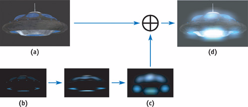

# GPU Gems 三部曲阅读

注：G1_C2表示GPU Gems的Chapter 2，其他的类似。优先整理优先级比较高的，或者是自己比较感兴趣的。

参考文章：https://zhuanlan.zhihu.com/p/35974789

# 一、G1_C16 实时近似的次表面散射（未看完）

在第16章“实时次表面散射的近似”，Simon Green描述了几种不同的方法，用于近似如皮肤和大理石等半透明材料的外观，利用可编程图形硬件。

主要参考的知乎文章是这篇：https://zhuanlan.zhihu.com/p/606880884，会用代码进行实现。

# 二、G1_C17 Ambient Occlusion

https://github.com/QianMo/Game-Programmer-Study-Notes/tree/master/Content/%E3%80%8AGPU%20Gems%201%E3%80%8B%E5%85%A8%E4%B9%A6%E6%8F%90%E7%82%BC%E6%80%BB%E7%BB%93，先去这里找AO相关的部分来阅读。

总结重点内容：

- 1.AO贴图的生成过程
- 2.AO项如何与环境光照一起使用？

# 三、G1_C21 实时辉光（Real-Time Glow）

也是先去这里：https://github.com/QianMo/Game-Programmer-Study-Notes/tree/master/Content/%E3%80%8AGPU%20Gems%201%E3%80%8B%E5%85%A8%E4%B9%A6%E6%8F%90%E7%82%BC%E6%80%BB%E7%BB%93，看一下实时辉光的基本思路。

总结一下基本思路：

- （1）辉光在当前的游戏中已经可以作为全屏后处理的效果，当然也可以由美术通过贴图来实现。第一个步骤是标明哪些地方需要辉光（比如写入到base map的alpha通道当中），《入门精要》中介绍的另一种方法是先渲染正常图像，再通过明度检测需要辉光的区域；
- （2）第二步：将需要做辉光的区域做一个高斯模糊，可以使用两个pass（一次横向做，一次纵向做）以加快卷积的效率，得到卷积之后的辉光区域；
- （3）第三步：将模糊后的辉光区域叠加到原图当中。

具体过程如下图：

# 四、G1_C7 无尽波动的草地叶片的渲染（Rendering Countless Blades of Waving Grass）

一个疑问：不透明物体（例如草地），但是base map只有alpha通道，这样能进行alpha blend操作么？（没有用shader进行尝试，后面可以试试）