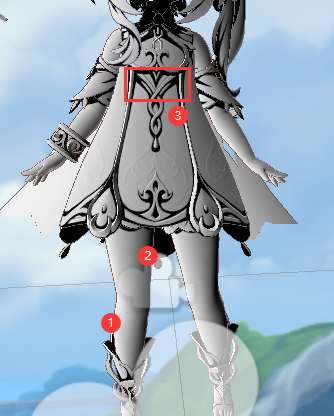
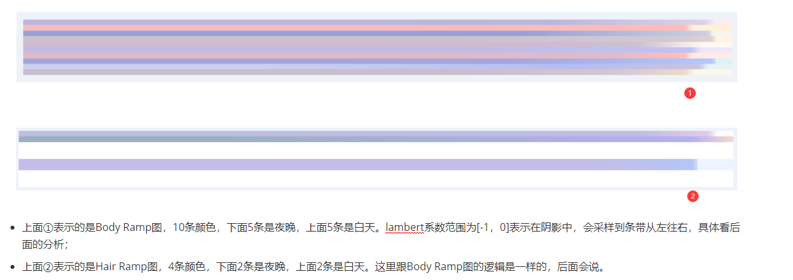

## 卡通渲染技术介绍

参考链接：

> 【1】卡通渲染及其相关技术：https://zhuanlan.zhihu.com/p/26409746


# 一、卡通渲染的分类

在具体讨论技术手段之前，先就卡通渲染做一个分类。卡通渲染最关键的特征包括不同于真实感渲染的**艺术化光影效果**和**描边**。以这两个关键的特征为卡通渲染分类的话，可以将近年来游戏中常用的卡通渲染分为**美式卡通风格**和**日式卡通风格**。美式卡通风格在色彩上比较连续，有渐变色，着色风格很大程度上依赖于艺术家定义的色调（tone），而在阴影和高光方面常常采取夸张和变形的做法，比较典型的是《军团要塞2》；日式卡通风格往往角色造型更写实，但在着色方面，则趋向于大片大片纯色色块，并有的明暗交界，例如《崩坏3》。虽然这样的分类并没有清晰界限，但易于描述，接下来我们就按照美式卡通和日式卡通的分类，从光影和描边两个维度上分别列举各类技术实现。


崩坏3游戏截图，着色以单色色块为主，有明显的明暗交界。


# 二、卡通渲染技术总览

## 2.1 描边技术

### 2.1.1 基本技术概念

描边是一个比较常用的技术，在《Real Time Rendering》中有相当篇幅的综述，大致来说包含了三类：

（1）**基于视角的勾边**，这部分的计算依赖于我们的一个直觉观察：当我们的视线和某个表面相切时，这个表面上的像素点往往就是模型的边缘，基于这个观察，我们可以用$dot(viewDir, normal)^k$来估计一个像素的“边缘程度”，当然，这个值也可以用来作为纹理坐标去采样一张预定义的“轮廓纹理”。


基于视角的描边，最大的缺点是线宽粗细差别较大，不易控制。


（2）**基于几何生成方法的描边**，这类方法的特点是描边本身是一个单独的几何体，通过特殊的方法绘制出来，比较常见的做法是**shell method**，原理和实现都比较简单：首先在绘制结束正常的模型后，将需要描边的物体**改用正面剔除**再绘制一遍，在VS中将顶点沿着法线方向膨胀一定距离，然后在FS中将模型用纯色输出。另外一种叫做**z-bias**的方法，也是绘制背面，但不膨胀，而是把背面顶点的Z值稍微向前偏移一点点，使得背面的些许部分显示出来形成描边效果。


基于shell method的绘制方法，实现简单，线宽较为均匀。


（3）**基于图像处理的描边**，这类方法的实现可以说更接近于“边缘”这一概念的本质定义，什么是“边缘”呢？**边缘就是在深度或者法线上不连续的位置**。因此为了获取边缘，我们只需要在图片上找到深度或者法线不连续的位置即可，因此，我们需要将深度信息和法线信息以贴图的形式传入，运用边缘检测算法去寻找这些像素。这类方法的优点是描边的线宽一致，缺点是需要额外的法线和深度信息，当然，由于近年来流行的**延迟渲染**框架，法线和深度本来就是G-Buffer的一部分，因此往往不需要额外绘制法线和深度的信息。


基于边缘检测的描边方法，分别用深度信息和法线信息进行单独的边缘检测，而后合并起来成为最终的描边。

------


## 2.2 5种描边技术的Shader实现

这里也可以参考一篇文章：[在shader中实现五种描边方法 - 知乎 (zhihu.com)](https://zhuanlan.zhihu.com/p/410710318)，接下来会进行介绍。

**轮廓线渲染方法一览**：

在RTR3中，作者分成了5种类型（这在《Unity Shader入门精要》的P289页有讲）：

- 基于观察角度和表面法线：通过视角方向和表面法线点乘结果来得到轮廓线信息。 简单快速，但局限性大。
- 过程式几何轮廓线渲染。 核心是两个Pass：第一个Pass只渲染背面并且让轮廓可见（比如通过顶点外扩）；第二个Pass正常渲染正面。 快速有效，适应于大多数表面平滑的模型，但不适合立方体等平整模型。
- 基于图像处理。 可以适用于任何种类的模型。但是一些深度和法线变化很小的轮廓无法检测出来，如桌子上一张纸。
- 基于轮廓边检测。 检查这条边相邻的两个三角面片是否满足：$(n_0·v > 0) ≠ (n_1·v > 0)$。这里$n_0$和$n_1$分别表示两个相邻三角面片的法向，v是从视角到该边上任意顶点的方向。**本质是检查相邻两个三角是否一个面向视角，另一个背向视角。** 可以控制轮廓线的风格渲染。缺点是轮廓是逐帧单独提取的，帧与帧之间会出现跳跃性。
- 混合上述方法。 例如，首先找到轮廓线，把模型和轮廓边渲染到纹理中，再使用图像处理识别轮廓线，并在图像空间进行风格化渲染。

接下来分别使用 **基于观察角度和表面法线**、**模板测试**、**过程式几何轮廓线**、**基于图像处理（屏幕后处理）** 的方法对一个简单场景做了实现。最后简单使用了 **SDF** 的方法去进行描边实现。 **注：这里的重点是轮廓线的实现，因此这部分暂时不过多考虑光照。**

**以下Shader在URP管线下书写，使用的Unity版本为2022 LTS版本。**


### 2.2.1 基于观察角度和表面法线

通过视角方向和表面法线点乘结果来得到轮廓线信息。 简单快速，但局限性大。

```glsl
Shader "Custom/Outline/URP_OutlineShader1"
{
    Properties
    {
        _MainTex ("Texture", 2D) = "white" {}
        _Outline ("Outline", Range(0,1)) = 0.1
    }
    SubShader
    {
        Tags { "RenderType"="Opaque" "RenderPipeline"="UniversalPipeline" "LightMode"="UniversalForward"}
        Pass
        {
            Cull Back
            HLSLPROGRAM
            #pragma vertex vert
            #pragma fragment frag
            #include "Packages/com.unity.render-pipelines.universal/ShaderLibrary/Core.hlsl"
            #include "Packages/com.unity.render-pipelines.universal/ShaderLibrary/Lighting.hlsl"

            struct Attributes
            {
                float4 texcoord: TEXCOORD0;
                float4 vertex: POSITION;
                float3 normal: NORMAL;
                
            };

            struct Varyings
            {
                float4 pos: SV_POSITION;
                float4 color: TEXCOORD0;
                float2 uv : TEXCOORD1;
            };

            // 此宏将 _BaseMap 声明为 Texture2D 对象。
            TEXTURE2D(_MainTex);
            // This macro declares the sampler for the _BaseMap texture.
            SAMPLER(sampler_MainTex);
            
            CBUFFER_START(UnityPerMaterial)
                float4 _MainTex_ST;
                float _Outline;
            CBUFFER_END

            Varyings vert (Attributes v)
            {
                Varyings o;
                o.pos = TransformObjectToHClip(v.vertex);
                float3 ObjViewDir = normalize(GetObjectSpaceNormalizeViewDir(v.vertex));
                float3 normal = normalize(v.normal);
                float factor = step(_Outline, dot(normal, ObjViewDir)); //>=_Outline对应比较垂直的情况，此时就是1，否则是0
                o.color = float4(factor, factor, factor, 1);
                o.uv = TRANSFORM_TEX(v.texcoord, _MainTex);
                return o;
            }

            half4 frag (Varyings i) : SV_Target
            {
                half4 col = SAMPLE_TEXTURE2D(_MainTex, sampler_MainTex, i.uv);
                return col * i.color;
            }
            ENDHLSL
        }
    }
}
```

最终实现出来的效果如下图：


可以看到，效果并不太好，且描边的粗细无法很好地得到控制。

------


### 2.2.2 模板测试描边

**在原理上**，模板测试会发生在逐片元操作的阶段：


这里我们设置两个pass来进行渲染：

- 在第一个pass中正常渲染，但是把每个片元的参考值Ref都设置为1，Comp Always表示总是通过模板测试，并且设置Pass Replace（不写的话默认是Pass Keep）。**也就是说我们需要把当前的Ref值写入到模板缓冲中。**
- 第二个Pass中，我们把每个顶点按法线方向去进行一个扩张。这里有几种方案。
  - （1）在模型空间下直接进行外扩，但这样效果并不好；
  - （2）我们选择先把顶点和法线变换到**视角空间下，是为了让描边可以在观察空间达到好的效果。**随后设置法线的z分量，对其归一化后再将顶点沿其方向扩张，得到扩张后的顶点坐标。**对法线的处理是为了尽可能避免背面扩张后的顶点挡住正面的面片。**最后，我们把顶点从视角空间变换到裁剪空间。（实际效果感觉也差点意思，**还是采用方法（3）来做吧**）
  - （3）在裁剪空间当中做外扩操作。（**下面主要采用这种方式。**）
  - 在这个Pass中，我们同样把每个片元的参考值 Ref 都设置为1，Comp NotEqual 即只有当前参考值 Ref 和当前模板缓冲区的值不相等的时候才去渲染片元。注意到，Unity的模板缓冲区的默认值是0，因此在外轮廓线之内的片元，我们在第一个Pass中写入到模板缓冲区的值为1，因此第二次Pass中相等，就不会去选择渲染；而外轮廓线向外扩张出来的顶点所形成的那些片元，由于第一个Pass并未渲染，模板缓冲区的值为0，因此不相等，就会按第二个Pass的方法得到结果。

在URP当中实现如下：（可以参考这篇：[【Unity URP】2种描边方案：模板测试和正面剔除-CSDN博客](https://blog.csdn.net/qq_41835314/article/details/129963711)）

```glsl
Shader "Custom/Outline/Stencil Outline Shading"
{
    Properties
    {
        _MainTex ("Texture", 2D) = "white" {}
        _Outline ("Outline", Range(0,1)) = 0.1
        _OutlineColor ("Outline Color", Color) = (0,0,0,1)
        [Toggle] _ENABLE_CLIPSPACE_OUTLINE("Enable ClipSpace Outline", Float) = 0
    }
    SubShader
    {
        Tags { "RenderType"="Opaque" "RenderPipeline"="UniversalPipeline"}
        Pass
        {
            Name "ForwardLit"
            Tags { "LightMode"="SRPDefaultUnlit" }
            Stencil
            {
                Ref 1
                Comp Always
                Pass Replace
            }
            HLSLPROGRAM
            #pragma vertex vert
            #pragma fragment frag
            #include "Packages/com.unity.render-pipelines.universal/ShaderLibrary/Core.hlsl"
            #include "Packages/com.unity.render-pipelines.universal/ShaderLibrary/Lighting.hlsl"

            struct Attributes
            {
                float4 texcoord: TEXCOORD0;
                float4 vertex: POSITION;
            };

            struct Varyings
            {
                float4 pos: SV_POSITION;
                float2 uv : TEXCOORD1;
            };

            // 此宏将 _BaseMap 声明为 Texture2D 对象。
            TEXTURE2D(_MainTex);
            // This macro declares the sampler for the _BaseMap texture.
            SAMPLER(sampler_MainTex);
            
            CBUFFER_START(UnityPerMaterial)
                float4 _MainTex_ST;
                float _Outline;
                float4 _OutlineColor;
            CBUFFER_END

            Varyings vert (Attributes v)
            {
                Varyings o;
                o.pos = TransformObjectToHClip(v.vertex);
                o.uv = TRANSFORM_TEX(v.texcoord, _MainTex);
                return o;
            }

            half4 frag (Varyings i) : SV_Target
            {
                half4 col = SAMPLE_TEXTURE2D(_MainTex, sampler_MainTex, i.uv);
                return col;
            }
            ENDHLSL
        }

        Pass
        {
            //在这个Pass当中延法线外扩，并设置Stencil Ref为1，Comp NotEqual
            Name "Outline"
            Tags {"LightMode"="UniversalForward"}

            Stencil
            {
                Ref 1
                Comp NotEqual
                Pass Keep
            }
            
            HLSLPROGRAM
            #pragma vertex vert
            #pragma fragment frag
            #include "Packages/com.unity.render-pipelines.universal/ShaderLibrary/Core.hlsl"
            #include "Packages/com.unity.render-pipelines.universal/ShaderLibrary/Lighting.hlsl"
            #pragma shader_feature _ENABLE_CLIPSPACE_OUTLINE_ON  // 注意在pragma这里要把宏定义写成_ON，否则在材质面板上勾选的逻辑会有问题

            CBUFFER_START(UnityPerMaterial)
                float _Outline;
                float4 _OutlineColor;
            CBUFFER_END

            struct Attributes
            {
                float4 vertex: POSITION;
                float3 normal: NORMAL;
            };

            struct Varyings
            {
                float4 pos: SV_POSITION;
            };

            Varyings vert (Attributes v)
            {
                //将顶点法线外扩，不过是在视图空间下进行的
                Varyings o;

                //方案1：模型空间外扩，效果并不好
                float3 vertexWithOffset = v.vertex.xyz + v.normal * _Outline * 0.0005f;
                o.pos = TransformObjectToHClip(vertexWithOffset);

                //方案2：裁剪空间外扩，效果会好一些
                #if _ENABLE_CLIPSPACE_OUTLINE_ON
                
                VertexNormalInputs vertexNormalInputs = GetVertexNormalInputs(v.normal.xyz);
                float2 normalCS = TransformWorldToHClipDir(vertexNormalInputs.normalWS).xy;
                o.pos = TransformObjectToHClip(v.vertex);
                o.pos.xy += normalize(normalCS.xy) * _Outline * 0.05f;  //乘0.05是为了让扩张的线条更细一些,否则太粗了
                #endif
                return o;

                //下面这段代码原本是在视图空间去做顶点外扩的，但是效果并不理想，所以就不用了
                // float4 pos = mul(UNITY_MATRIX_MV, v.vertex); //将顶点从模型空间转换到视图空间，这样做扩散描边效果更好
                // float3 normal = mul((float3x3)UNITY_MATRIX_IT_MV, v.normal); //将法线从模型空间转换到视图空间,注意这里要用逆转置矩阵，见入门精要数学原理部分
                // //normal.z = -0.5; //尽可能避免背面扩张后的顶点挡住正面的面片
                // pos = pos + float4(normalize(normal),0) * _Outline; //将法线方向乘以扩张距离，然后加到顶点坐标上
                // o.pos = mul(UNITY_MATRIX_P, pos); //将顶点从视图空间转换到裁剪空间
                // return o;
            }

            half4 frag (Varyings i) : SV_Target
            {
                return float4(_OutlineColor.rgb, 1);
            }
            
            ENDHLSL
        }
    }
}
```

> 这里有一个**坑点**：就是URP的shader里如果写了多个Pass，那么相同Tags的Pass只会执行一次。所以核心的做法如下：
>
> ```glsl
> // Pass 1 里面写
> Name "ForwardLit"
> Tags {
>     "LightMode"="SRPDefaultUnlit"  //注意这里的Tags要和下一个Pass不同
> }
> 
> // 剔除操作 
> // Blend [_SrcBlend][_DstBlend]
> // ZWrite[_ZWrite]
> // Cull[_CullMode0]
> 
> Stencil {
>     Ref 1           // 给模板刷值
>     Comp Always     // 始终渲染
>     Pass Replace       // 通过Comp测试，且把当前的Ref值1写入Stencil Buffer中
> }
> ```
>
> ```glsl
> // Pass 2 里面写
> Name "Outline"
> Tags {
>     "LightMode"="UniversalForward"
> }
> 
> // // 剔除
> // Cull [_CullMode1] // Cull Front
> 
> Stencil {
>     Ref 1
>     Comp NotEqual // 不相等才通过，那么相等的都会被pass，所以着色区域不会做任何渲染，因为前面着色区域Ref都是1
>     Pass Keep     // Stencil Buffer默认值是0，所以其他地方就被保留了
> }
> ```

最终实现的效果如下：


可以看到，左图红框框起来的区域依然出现了穿帮现象，不过整体来说描边的质量比2.2.1节的方法要好不少。**注意到这种描边方式只能扩展外轮廓线，而模型内部的描边是无法做到的（见右图，造成这种现象的原因就是模板测试的原理）。**

------


### 2.2.3 过程式几何轮廓线渲染（推荐）

实现原理：

> 其实就是把前面的模板测试换成了剔除操作。正常渲染的时候剔除背面渲染正面，第二次顶点扩张之后剔除正面渲染背面，这样渲染背面时由于顶点外扩的那一部分就将被我们所看见，而原来的部分则由于是背面且不透明所以不会被看见，形成轮廓线渲染原理。因此从原理上也能看出，这里得到的轮廓线不单单是外轮廓线。

可以额外参考的博客：[涂月观 (tuyg.top)](http://tuyg.top/archives/782)

这里来说明一下实现这种描边算法的过程，以下使用《崩坏：星穹铁道》中的希儿为例进行介绍。

#### （1）基础Shader——BaseMap采样

```glsl
Shader "ToonLit/Outline"
{
    Properties
    {
        _BaseMap ("BaseMap", 2D) = "white" {}
    }
    SubShader
    {
        HLSLINCLUDE
        #include "Packages/com.unity.render-pipelines.universal/ShaderLibrary/Core.hlsl"
        TEXTURE2D(_BaseMap);        SAMPLER(sampler_BaseMap);
        
        CBUFFER_START(UnityPerMaterial)
            float4 _BaseMap_ST;
        CBUFFER_END
        
        struct Attributes{
            float4 positionOS : POSITION;
            float4 texcoord : TEXCOORD;
        };
        struct Varyings{
            float4 positionCS : SV_POSITION;
            float2 uv : TEXCOORD1;
        };
        ENDHLSL

        Pass
        {
            Tags{"LightMode" = "UniversalForward"}        
			HLSLPROGRAM
			#pragma target 3.0
            #pragma vertex vertex
            #pragma fragment frag
            Varyings vertex(Attributes input)
            {
                Varyings output;
                VertexPositionInputs vertexInput = GetVertexPositionInputs(input.positionOS.xyz);
                output.positionCS = vertexInput.positionCS;
                output.uv = input.texcoord.xy;
                return output;
            }
            float4 frag(Varyings input):SV_Target
            {
                float4 tex = SAMPLE_TEXTURE2D(_BaseMap,sampler_BaseMap,input.uv);
                return tex;
            }
            ENDHLSL
        }
    }
    Fallback "Universal Render Pipeline/Lit"
}
```

使用这个Shader前后的效果对比为：


注：天空盒采用的Unity Asset Store里的免费资源：Simple Sky - Cartoon assets

------


#### （2）解决眼睛的问题

如果放大来看，眼睛处的位置是有问题的：


解决方案是**使用透明度测试**，利用basemap的alpha通道，在一个给定的阈值下去判断是否要discard该片元，从而达到透明的效果（注意和透明度混合做区分）

```glsl
Properties
{
    _BaseMap ("BaseMap", 2D) = "white" {}
    [Toggle]_ENABLE_ALPHA_TEST("Enable AlphaTest",float)=0 //新增AlphaTest和Clip相关逻辑
    _Cutoff("Cutoff", Range(0,1.1)) = 0.5
}
SubShader{
    //...
    #pragma shader_feature _ENABLE_ALPHA_TEST_ON
    CBUFFER_START(UnityPerMaterial)
        float4 _BaseMap_ST;
        float _Cutoff; 
    CBUFFER_END
    //...
    Pass{
    	//...
    	float4 frag(Varyings input):SV_Target
        {
            float4 tex = SAMPLE_TEXTURE2D(_BaseMap,sampler_BaseMap,input.uv);
            #if _ENABLE_ALPHA_TEST_ON
                clip(_BaseMap.a-_Cutoff);
            #endif
            return tex;
        }
        //...
    }
}
```

回到Unity，将上眼皮对应的Enable AlphaTest勾选上，如果BaseMap是不透明的图_CutOff设置的略大于1即可，意味着全部剔除。

修复前后的对比图如下：


------


#### （3）描边效果

和第2.2.2节的情况基本类似，如果在模型空间下做顶点外扩，则随着相机拉远和收进描边的粗细会发生变化，而我们要做的是使用裁剪空间来做外扩。（其实在NDC空间下做外扩应该是最合适的，因为这个时候所有物体都被放缩到一个标准化的坐标下，让偏移量在这个空间内成为一个固定值效果应当不错，不过转NDC的操作不是我们控制的。虽然不能控制NDC，但**可以在裁剪空间进行法线的外扩，然后这个时候计算出来的偏移量再乘w（因为后续转到NDC坐标会/w），以达到在NDC空间做外扩的目的**。）

总的描边Shader如下：

```glsl
Shader "ToonLit/Outline"
{
    Properties
    {
        _BaseMap ("BaseMap", 2D) = "white" {}
        [Toggle]_ENABLE_ALPHA_TEST("Enable AlphaTest",float)=0
        _Cutoff("Cutoff", Range(0,1.1)) = 0.5
        [Toggle]_OLWVWD("OutlineWidth Varies With Distance?", float) = 0
        _OutlineWidth("OutlineWidth", Range(0, 10)) = 0.4
        _OutlineColor("Outline Color", Color) = (0, 0, 0, 1)
    }
    SubShader
    {
        HLSLINCLUDE
        #include "Packages/com.unity.render-pipelines.universal/ShaderLibrary/Core.hlsl"
        #pragma shader_feature _ENABLE_ALPHA_TEST_ON
        #pragma shader_feature _OLWVWD_ON
        TEXTURE2D(_BaseMap);        SAMPLER(sampler_BaseMap);
        
        CBUFFER_START(UnityPerMaterial)
            float4 _BaseMap_ST;
            float _Cutoff;
            float4 _OutlineColor;
            float _OutlineWidth;
        CBUFFER_END
        
        struct Attributes{
            float4 positionOS : POSITION;
            float4 texcoord : TEXCOORD;
            float3 normalOS: NORMAL;
        };
        struct Varyings{
            float4 positionCS : SV_POSITION;
            float2 uv : TEXCOORD1;
        };
        ENDHLSL

        Pass
        {
            Tags{"LightMode" = "UniversalForward"}    
            //Cull back
            Cull Off  //note:使用Cull Off的话有些面能够更好的显示出来,比如《原神》中公子的披风
			HLSLPROGRAM
			#pragma target 3.0
            #pragma vertex vertex
            #pragma fragment frag
            Varyings vertex(Attributes input)
            {
                Varyings output;
                VertexPositionInputs vertexInput = GetVertexPositionInputs(input.positionOS.xyz);
                output.positionCS = vertexInput.positionCS;
                output.uv = input.texcoord.xy;
                return output;
            }
            float4 frag(Varyings input):SV_Target
            {
                float4 tex = SAMPLE_TEXTURE2D(_BaseMap,sampler_BaseMap,input.uv);
                #if _ENABLE_ALPHA_TEST_ON
                    clip(tex.a-_Cutoff);
                #endif
                return tex;
            }
            ENDHLSL
        }
        Pass
        {
            Name "OutLine"
			Tags{ "LightMode" = "SRPDefaultUnlit" }
			Cull front
			HLSLPROGRAM
			#pragma vertex vert  
			#pragma fragment frag
			
			Varyings vert(Attributes input)
			{
                float4 scaledScreenParams = GetScaledScreenParams();
                float ScaleX = abs(scaledScreenParams.x / scaledScreenParams.y);//求得X因屏幕比例缩放的倍数
				Varyings output;
				VertexPositionInputs vertexInput = GetVertexPositionInputs(input.positionOS.xyz);
                VertexNormalInputs normalInput = GetVertexNormalInputs(input.normalOS);
                float3 normalCS = TransformWorldToHClipDir(normalInput.normalWS);//法线转换到裁剪空间
                float2 extendDis = normalize(normalCS.xy) *(_OutlineWidth*0.01);//根据法线和线宽计算偏移量
                extendDis.x /=ScaleX ;//由于屏幕比例可能不是1:1，所以偏移量会被拉伸显示，根据屏幕比例把x进行修正
                output.positionCS = vertexInput.positionCS;
                #if _OLWVWD_ON
                    //屏幕下描边宽度会变
                    output.positionCS.xy += extendDis;
               #else
                    //下面这句是为了控制当相机离角色过远时，由于描边粗细控制不变导致画面很脏（角色会变得黑乎乎一片，因为包括了描边）的问题
                    float ctrl = clamp(1/output.positionCS.w,0,1);  //当相机距离过远时，ctrl会接近于0，导致描边很细，不会出现”脏“的现象
                    //屏幕下描边宽度不变，则需要顶点偏移的距离在NDC坐标下为固定值
                    //因为后续会转换成NDC坐标，会除w进行缩放，所以先乘一个w，那么该偏移的距离就不会在NDC下有变换
                    output.positionCS.xy += extendDis * output.positionCS.w * ctrl;
                #endif
				return output;
			}
			float4 frag(Varyings input) : SV_Target {
				return float4(_OutlineColor.rgb, 1);
			}
            
            ENDHLSL
        }
    }
    Fallback "Universal Render Pipeline/Lit"
}
```

最终是否开启描边效果的对比为：


具体为什么要进行`extendDis.x /=ScaleX`以及`extendDis * output.positionCS.w`，可以参考原博客：[涂月观 (tuyg.top)](http://tuyg.top/archives/782)。

------

#### （3-2）进阶：考虑FOV带来的影响


#### （4）法线平滑修正

如果直接把上述的Shader放在一个立方体上，会呈现下面的状态：


可以看到出现了**描边断裂**的现象，解决方案可以使用**法线平滑**来做。写一个脚本修改Mesh的法线属性，不过这个只能在运行中有效果，mesh的属性是不会被彻底修改的，只是动态覆盖了而已，因此只作为示例使用，提供思想：

```c#
using System;
using System.Collections;
using System.Collections.Generic;
using UnityEngine;

public class SmoothNormal : MonoBehaviour
{
    Mesh MeshNormalAverage(Mesh mesh)
    {
        //可以参考的文档：https://docs.unity3d.com/Manual/class-Mesh.html
        Dictionary<Vector3, List<int>> map = new Dictionary<Vector3, List<int>>();
        //在Unity的Mesh当中,vertices会把每个面的顶点都列出来,所以会有重复的顶点
        for (int v = 0; v < mesh.vertexCount; ++v)
        {
            if (!map.ContainsKey(mesh.vertices[v]))
            {
                map.Add(mesh.vertices[v], new List<int>());
            }
            map[mesh.vertices[v]].Add(v);  //记录哪些vertices中的顶点索引指的是同一个点,
                                           //因为有重复的顶点,所以一个顶点也会有很多法线记录的值,每个顶点最终的法线方向是代表这个点的重复法线方向的平均值
        }
        Vector3[] normals = mesh.normals;
        Vector3 normal;
        foreach(var p in map)
        {
            normal = Vector3.zero;
            foreach (var n in p.Value)
            {
                normal += mesh.normals[n];
            }
            normal /= p.Value.Count;
            foreach (var n in p.Value)
            {
                normals[n] = normal;
            }
        }
        mesh.normals = normals;
        return mesh;
    }
    private void Awake()
    {
        if (GetComponent<MeshFilter>())
        {
            Mesh tempMesh = (Mesh)Instantiate(GetComponent<MeshFilter>().sharedMesh);
            tempMesh = MeshNormalAverage(tempMesh);
            gameObject.GetComponent<MeshFilter>().sharedMesh = tempMesh;
        }
        if (GetComponent<SkinnedMeshRenderer>())
        {
            Mesh tempMesh = (Mesh)Instantiate(GetComponent<SkinnedMeshRenderer>().sharedMesh);
            tempMesh = MeshNormalAverage(tempMesh);
            gameObject.GetComponent<SkinnedMeshRenderer>().sharedMesh = tempMesh;
        }
    }
}
```

修正前和修正后的对比：


针对模型来说，也可以看到开启法线平滑之后更好的描边效果（如下图红框区域，开启发现平滑之后断裂现象会得到改进）：


------

注意到上面角色的眼睛和嘴的地方依然具有描边效果，这和实际的卡通渲染不符合，因此接下来我们使用顶点色来控制描边的效果。

#### （5）顶点色控制描边效果

在实际项目中，或许我们不希望整个模型各个地方的描边强度是一样的（**比如说，眼睛下面的位置可能不需要进行描边处理**）。使用顶点色能多放入一些数据，就能增加更多的效果。在《GUILTY GEAR Xrd》中使用模型顶点颜色的四个通道，对模型描边的粗细、显隐、相机距离缩放等进行了精细的控制。当然顶点数据还可以用来做很多其他的事情，这取决于想要实现的效果，和美术制作的难度。**在这里，我们使用顶点色控制描边的粗细和颜色。对代码进行一些修改。**

##### （a）**绘制顶点色的方法：**

这里可以使用Blender来绘制顶点色。具体的教程可以参考：[Blender 頂點著色功能(Vertex Paint) – 教學網頁 (ntust.edu.tw)](https://ci3d.ntust.edu.tw/wpcourse/?p=1369)

**视频教程的话也可以参考b站：[blender 顶点色绘制基础 珍贵的_哔哩哔哩_bilibili](https://www.bilibili.com/video/BV1eX4y1T7aX/?spm_id_from=333.337.search-card.all.click)**

> 一些注意事项：
>
> - （1）在Blender中，绘制顶点色需要在左上角下拉栏中选择“Vertex Paint”：
>
>   
>
> - （2）可以通过在Blender中连Shader来观察图顶点色的情况，对应的连线为：
>
> 
>
> 如果要绘制颜色的话，把Color节点连接到Surface上，如果要查看透明度的效果的话，将Alpha连接到Surface节点上。
>
> - （3）关于绘制的时候的工具：
>
>   
>
>   在绘制颜色通道的时候，选择上图①所示的Mix方法即可，在绘制Alpha通道的时候选择上图的②所示的Erase Alpha方法。
>
> - （4）**tip：**将Blender文件直接保存在Unity之中可以实时查看FBX模型的变化，在绘制顶点色的时候可以实时进行更新。


##### （b）将顶点色应用于Shader当中

其实就是应用顶点色来控制描边效果的粗细和颜色，核心代码为：

```glsl
//顶点着色器里
float2 extendDis = normalize(normalCS.xy) *(_OutlineWidth*0.01) * v.vertexColor.a;//根据法线和线宽计算偏移量,根据顶点色的a通道决定描边粗细
output.vertexColor = input.vertexColor;
//片元着色器里
float4 frag(Varyings input) : SV_Target {
    return float4(_OutlineColor.rgb * i.vertexColor.rgb, 1);  //根据顶点色的rgb通道决定描边的颜色
}
```


##### （c）效果


最终渲染的结果为：


可以看到，①和③区域有不同的描边颜色，且②区域不会出现描边现象。通过顶点色确实能够更好地对描边质量进行控制。


### 2.2.4 边缘检测

再说，暂时用不到边缘检测的技术。

### 2.2.5 SDF方法

再说。

### 2.2.6 其他方法

再说。

------

## 2.3 眉毛出现在角色前面

这里具体指的效果是类似《星穹铁道》中的下述效果：


# 三、《原神》中的角色渲染

todo：

> 1.原理总结的应该差不太多了，后面有新的收获和要整理的内容再放进来；
>
> 2.一些效果图的效果不是很好（比如下面的一些刻晴渲染的效果），后面记得更新一下。


在这一部分中会介绍《原神》中的角色渲染基本技术，选择的人物分别是刻晴和芙宁娜。在下面的教程中，**可能会出现别的原神角色，但基本原理是一样的，不过可以省去一些复杂的模型处理的过程（比如涂顶点色）。**

## 3.1 各个贴图资源（刻晴）


接下来会逐一对这些贴图的大致作用进行介绍（以身体为例，头发还有一些不同，见后面shader部分）。另外，还有一些角色有类似法线贴图的资源（如芙宁娜），在对应的逻辑部分也会进行整理。

### 3.1.1 VertexColor

VertexColor.a, 控制描边的粗细，眼睛和嘴不需要描边。VertexColor.rgb, 用于调节皮肤和头发描边颜色, 同时用于调节Ramp的感光度。这里可以参考上面的部分[顶点色控制描边效果](# （5）顶点色控制描边效果)。在这里，在Blender中我们就先简单地设置眼睛和嘴的位置的VertexColor.a为0，使得后续脸部不会描边即可，更好的效果后面再凹。VertexColor.r通道可以用来控制是否需要阴影，VertexColor.r通道为黑色的区域（对应角色脖子处）一直是阴影区域。

可以写一个简单的URP Shader用来显示模型的顶点色以及对应的分量：


以下以纳西妲为例，查看一下顶点色和各通道的可视化结果：


> 感觉对于衣服这种来说，VertexColor的g和b通道用来整理控制最后的VertexColor的颜色，也就是vertexColor.rgb通道指的是描边的颜色。

------


### 3.1.2 LightMap

对应3.1节第一排第4张图，即下图（这张是衣服的贴图）：


这张图的RGBA四个通道都有自己的作用，以下分别介绍。

首先，先来看一下分解出这四个通道之后分别贴在人物身上是什么样的。


注意，以下由于没有真正解包，所以每一项的逻辑不一定正确，但可以当作参考来看：

- `Lightmap.a`, 用于材质分层，如皮肤，衣服的不同布料类型等等；
- `Lightmap.r`, 用于高光类型分层，白色是金属，灰色是非金属，黑色无高光（上图可能不够清晰，裙边其实是有一些灰色区域的）；
- `Lightmap.b`，用于高光的强度分层，会叠加到高光项之上（或者理解为高光强度Mask，SpecularIntensityMask）；
- `Lightmap.g`, 用于区分AO区域，AO就是常暗区域，有光照也是暗的区域。

我们再把以上的几个通道用在队长身上，看看效果：


其中lightMap的alpha通道可视化结果如下图：


### 3.1.3 Ramp图的介绍


- 上面①表示的是Body Ramp图，10条颜色，下面5条是夜晚，上面5条是白天。lambert系数范围为[-1，0]表示在阴影中，会采样到条带从左往右，具体看后面的分析；
- 上面②表示的是Hair Ramp图，4条颜色，下面2条是夜晚，上面2条是白天。这里跟Body Ramp图的逻辑是一样的，后面会说。

对于复杂一点的角色，比如芙宁娜来说，其条带如下图：


类似于纳塔的队长这种，Hair Ramp Map也是有10个条带。


### 3.1.4 法线贴图（复杂角色）

对于复杂一些的角色（比如芙宁娜），其Body和Hair都有对应的法线贴图，比如以下是一张Body的法线贴图：


关于法线贴图的使用，应该没有太多的难点，与正常游戏当中的法线贴图逻辑一致，后面也会进行整理。

------


### 3.1.5 Matcap与面部阴影阈值图


------


## 3.2 关于Lambert系数

Lambert系数，lambert = N dot L，N是法线normal的方向，L是主光源方向，其中N和L都是单位向量，unit vector。正常Lambert系数的值应该是[-1，1]。在这里的角色渲染中，Lambert模型有两个作用：

- **Lambert系数的用途1：**判断光照区间，[-1, 0] 区间表示在阴影中，[0, 1]表示在光照中。

- **Lambert系数的用途2：**通过光照区间，进行Ramp的颜色采样，ramp图uv两个轴，lambert系数可以作为u, 即横坐标，进行采样。作为采样使用时，一般使用半lambert，使得颜色更透亮。HalfLambert = Lambert * 0.5 + 0.5，范围是[0，1]。

------


## 3.3 Diffuse: Ramp + AO + Double Shadow（除面部）

首先我们来看一下Diffuse项在游戏中的画面表现：


可以看到①和②的区域是Ramp的阴影区域，并且具有二级阴影。对于衣服来说，可以看到有一些AO现象。


### 3.3.1 URP管线的一些准备工作

首先是Forward Pass的顶点着色器逻辑：

```glsl
Varyings ForwardPassVertex(Attributes input)
{
    VertexPositionInputs vertexInput = GetVertexPositionInputs(input.positionOS.xyz);
    VertexNormalInputs normalInput = GetVertexNormalInputs(input.normalOS, input.tangentOS);

    Varyings output = (Varyings)0;
    output.uv = TRANSFORM_TEX(input.uv, _BaseMap);
    output.backUV = TRANSFORM_TEX(input.backUV, _BaseMap);
    output.positionWS = vertexInput.positionWS;
    output.tangentWS = normalInput.tangentWS;
    output.bitangentWS = normalInput.bitangentWS;
    output.normalWS = normalInput.normalWS;
    output.color = input.color;

    output.positionNDC = vertexInput.positionNDC;
    output.positionCS = vertexInput.positionCS;

    output.positionCS.xy += _ScreenOffset.xy * output.positionCS.w;  //todo：这个应该是说后面Unity会自动/w，不过存疑，先放着
    return output;
}

half4 ForwardPassFragment(Varyings input, FRONT_FACE_TYPE facing : FRONT_FACE_SEMANTIC) : SV_TARGET  //https://zhuanlan.zhihu.com/p/573996843,Unity提供了是否为背面的判断
{
    #if _DOUBLE_SIDED
    //是正面，用正面的UV，是背面则用背面的UV
    input.uv = lerp(input.uv, input.backUV, IS_FRONT_VFACE(facing, 0.0, 1.0)); // https://blog.csdn.net/wodownload2/article/details/99673897 
    #endif

    half4 baseMap = SAMPLE_TEXTURE2D(_BaseMap, sampler_BaseMap, input.uv);
    half3 albedo = baseMap.rgb * _BaseColor.rgb;
    half alpha = baseMap.a;  // 脸部的baseMap.a控制脸红，所以用下面的lerp逻辑和_FaceBlushStrength参数可以控制角色是否脸红。如果是身体的baseColor.a，可以控制如神之眼部分的自发光现象

    #if _IS_FACE
    albedo = lerp(albedo, _FaceBlushColor.rgb, _FaceBlushStrength * alpha);  
    #endif

    #if _NORMAL_MAP  //比较新的原神角色引入了法线贴图，这里也考虑一下法线
    half3x3 tangentToWorld = half3x3(input.tangentWS, input.bitangentWS, input.normalWS);
    half4 normalMap = SAMPLE_TEXTURE2D(_NormalMap, sampler_NormalMap, input.uv);
    half3 normalTS = UnpackNormal(normalMap);
    half3 normalWS = TransformTangentToWorld(normalTS, tangentToWorld, true); //切线空间转到世界空间
    input.normalWS = normalWS; //更新使用了法线贴图之后的法线
    #endif

    Light mainLight = GetMainLight();
    half3 lightDirection = SafeNormalize(mainLight.direction * _LightDirectionMultiplier); //_LightDirectionMultiplier可以用来调整光照方向

    half4 lightMap = SAMPLE_TEXTURE2D(_LightMap, sampler_LightMap, input.uv);
    half material = lerp(lightMap.a, _CustomMaterialType, _UseCustomMaterialType); //如果使用自定义，则为1，否则使用Lightmap.a通道的值，来决定材质类型（漫反射）
    //...
}
```

这里有一些注意事项：

- （1）unity提供了在片元着色器中获得”片元是否是背面“的逻辑判断，见上面的片元着色器。对于比如芙宁娜的衣服来说，如果勾选DoubleSided，则有些纹理就会出现错误。暂时来看这个开关基本不用开启；

- （2）《原神》中角色的脸部baseColor贴图的a通道对应的是”脸红“的表现，因此可以用_FaceBlushStrength参数控制角色是否脸红，核心逻辑为：

  - ```glsl
    half alpha = baseMap.a;
    
    #if _IS_FACE
    albedo = lerp(albedo, _FaceBlushColor.rgb, _FaceBlushStrength * alpha);  
    #endif
    ```

- （3）关于法线贴图的处理逻辑：在URP管线下，由于法线贴图是在切线空间下的，因此可以用下面的代码来求解法线贴图影响之后的世界空间的法线：

  - ```glsl
    #if _NORMAL_MAP  //比较新的原神角色引入了法线贴图，这里也考虑一下法线
    half3x3 tangentToWorld = half3x3(input.tangentWS, input.bitangentWS, input.normalWS);
    half4 normalMap = SAMPLE_TEXTURE2D(_NormalMap, sampler_NormalMap, input.uv);
    half3 normalTS = UnpackNormal(normalMap);
    half3 normalWS = TransformTangentToWorld(normalTS, tangentToWorld, true); //切线空间转到世界空间
    input.normalWS = normalWS; //更新使用了法线贴图之后的法线
    #endif
    ```

关于法线贴图的逻辑推导略，《入门精要》里面有推这个。

- （4）URP当中的`GetMainLight()`函数的逻辑如下：

```glsl
Light GetMainLight()
{
    Light light;
    light.direction = half3(_MainLightPosition.xyz);
#if USE_FORWARD_PLUS
#if defined(LIGHTMAP_ON) && defined(LIGHTMAP_SHADOW_MIXING)
    light.distanceAttenuation = _MainLightColor.a;
#else
    light.distanceAttenuation = 1.0;
#endif
#else
    light.distanceAttenuation = unity_LightData.z; // unity_LightData.z is 1 when not culled by the culling mask, otherwise 0.
#endif
    light.shadowAttenuation = 1.0;
    light.color = _MainLightColor.rgb;

    light.layerMask = _MainLightLayerMask;

    return light;
}
```

所以获取到的`mainLight.direction`指的是主光源的方向，也就是”从里指向外“的方向。

- （5）之所以可能需要对LightDirection乘一个` _LightDirectionMultiplier`项，从而对光照方向进行进一步调整，是因为考虑到下图所示的需求：


如果正常做shading的时候，想让角色身体上的阴影是平的，但是头发上的阴影是斜的，此时可以把头发上的LightDirection倾斜了一定角度，可能是上图这种效果的思路。


------

### 3.3.2 AO常暗区域的处理

AO = Ambient Occulusion。注意到在《原神》中，角色的脖子处是永远是阴影，不会发光，这个可以通过顶点色VertexColor.r通道来进行控制。

那么在Shader中，处理lambert系数时，为了处理AO的情况（AO的信息存储在Lightmap贴图的G通道当中），我们把G通道提取出的AO值和lambert相乘，表示受AO影响的lambert.

```glsl
half GetShadow(Varyings input, half3 lightDirection, half aoFactor)
{
    half NDotL = dot(input.normalWS, lightDirection);
    half halfLambert = 0.5 * NDotL + 0.5; //[-1,1]->[0,1]
    half shadow = saturate(2.0 * halfLambert * aoFactor); //让是否是阴影的分界更明显
    return lerp(shadow, 1.0, step(0.9, aoFactor)); //aoFactor大于0.9的地方返回1.0,常亮，不过一般不会有这种区域
}
half aoFactor = lightMap.g * input.color.r; //input.color.r 脖子是黑色的，也就是说脖子会一直处于阴影中，其他地方白色，整体来说aoFactor越小越倾向于阴影区域（或者说AO覆盖区域）
half shadow = GetShadow(input, lightDirection, aoFactor);
```

如果把shadow的值Debug出来，会得到下面的结果（以纳西妲为例）：



可以看到：

- ①区域附近对应光线直射的部分，这部分的计算结果值比较大，偏白；
- ②区域附近对应没有光照的部分，这部分的计算结果值比较小，偏黑；
- ③框中的区域对应AO区域，这部分常暗，在画面表现上就一直是阴影。

注：在渲染队长的时候，发现这部分的计算结果值一直都比较暗，不确定是不是为了凸显队长”在暗处“，还是有一些别的操作。

------

### 3.3.3 日夜状态的处理

这里计算了日夜系数，对应后续在Ramp贴图的什么v坐标进行采样。核心逻辑如下：

```glsl
//日夜状态的处理
half dayOrNight = day * 0.5 + 0.03;  
```

白天的时候，`day=1`，此时dayOrNight的值是0.53，对应采样到上半部分的条带；

晚上的时候，`day=0`，此时dayOrNight的值是0.03，对应采样到下半部分的条带。

回顾：

> 

可以看到，是能够对应的。

------


### 3.3.4 Ramp贴图的采样：坐标UV

对Ramp贴图采样需要提供UV坐标：

- U坐标使用上面的Lambert系数，同时可以考虑顶点色的存在，利用顶点色来作为u轴的偏移量；
- V坐标则需要考虑日夜情况，以及不同的材质类型。不同的材质类型可以从Lightmap.a通道看到。
  - 注意，需要用Lightmap.a通道的值（或者是能代表材质类型的参数）再加入日夜状态的系数，作为v轴的采样坐标。

> 补充：Lightmap.a通道颜色代表的信息：
>
> 
>
> - 灰度1.0 ： 皮肤类质感， 对应从下往上数第4条条带，index=3
> - 灰度0.7： 丝绸/丝袜，对应最下面的条带，index=0
> - 灰度0.5 ： 金属/金属投影，对应中间的条带，index=2
> - 灰度0.3 ： 软的物体，对应从下往上数第2条条带，index=1
> - 灰度0.0 ：硬的物体，对应最上面的条带，index=4

可以对照着Lightmap.a通道可视化在角色身上的结果来看：


再来看一下队长的（下图），跟上面的对不太上，说明对于队长来说，在这里灰度1.0指的不是皮肤，我的理解是这个specular.a是和Ramp贴图一起作用的，只要阴影的颜色能对上即可，并不需要硬性规定xxx灰度就一定是yyy，阴影颜色符合贴图就行：


获取Ramp贴图采样的UV坐标部分这样写：
```glsl
half3 GetShadowColor(half shadow, half material, half day) //正常来说，material传入的是lightmap.a的值，决定漫反射是什么材质类型，shadow则是前面计算出的阴影值
{
    int index = 4; //index表示是哪一条条带（从下往上数）
    /*- 灰度1.0 ： 皮肤类质感
    - 灰度0.7： 丝绸/丝袜
    - 灰度0.5 ： 金属/金属投影
    - 灰度0.3 ： 软的物体
    - 灰度0.0 ：硬的物体
    */
    index = lerp(index, 1, step(0.2, material)); //如果>0.2,index=1，否则为4
    index = lerp(index, 2, step(0.4, material)); //如果>0.4，index=2，否则为1
    index = lerp(index, 0, step(0.6, material)); //如果>0.6，index=0，否则为2
    index = lerp(index, 3, step(0.8, material)); //如果>0.8，index=3，否则为0
    //index：[0,0.2]:硬的物体，条带4,  (0.2,0.4]:软的物体，条带1, (0.4,0.6]:金属，条带2, (0.6,0.8]:丝绸，条带0, >0.8:皮肤类质感，条带3
    half rangeMin = 0.5 + _ShadowOffset - _ShadowSmoothness;
    half rangeMax = 0.5 + _ShadowOffset;
    //这些灰度采样的条带不同，具体如下：
    half2 rampUV = half2(smoothstep(rangeMin, rangeMax, shadow), index / 10.0 + 0.5 * day + 0.03); //index/10.0，会取到0，0.1，0.2，0.3，0.4
    //以下为计算阴影颜色的逻辑，见3.3.5部分
}
```

注意这句：

```glsl
half2 rampUV = half2(smoothstep(rangeMin, rangeMax, shadow), index / 10.0 + 0.5 * day + 0.03);
```

这句计算出的UV坐标就是对Ramp贴图采样的UV坐标：

- 其中V比较好理解，对应白天/晚上的第index个条带的值；
- U坐标应该是和阴影程度对应的值，用rangeMin和rangeMax对其范围进行控制，可以通过在Unity中拖动`_ShadowOffset`和`_ShadowSmoothness`参数来查看阴影的效果。

> **note：坑点**：
>
> 这里有一个很容易忽略但是会**极度**影响渲染效果的注意事项，**需要取消勾选lightMap**的sRGB选项！如下图：
>
> 

这个sRGB的选项，Unity的官方介绍如下（https://docs.unity3d.com/Manual/LinearRendering-LinearTextures.html）：

> sRGB sampling allows the Unity Editor to render **Shaders**  in linear color space when Textures are in gamma color space. When you select to work in linear color space, the Editor defaults to using sRGB sampling. **If your [Textures](https://docs.unity3d.com/Manual/Textures.html) are in linear color space, you need to work in linear color space and disable sRGB sampling for each Texture.**To learn how to do this, see [Disabling sRGB sampling](https://docs.unity3d.com/Manual/LinearRendering-LinearTextures.html#DisablingsRGBSampling), below.

因此，由于这张lightmap是在线性空间下的，因此这里需要取消勾选sRGB选项，否则会按照gamma空间的贴图对其进行处理，得到错误的结果。

------


### 3.3.5 两级阴影的处理

计算成为阴影的部分，应该是在做Lambert光照的时候计算范围在[-1，0]之间的部分。**注意到《原神》中角色具有两级的阴影，如下图所示（头发和身体都具有类似的现象）：**


在上图中：

- ①表示无阴影区域，光源直射的地方；
- ②表示完全阴影区域，使用一级阴影（比较暗的阴影）的颜色；
- ③表示二级阴影（就是比较亮的阴影），作为过渡；
- ④可能图里不是特别明显，是一级阴影和二级阴影之间的过渡带。

实现阴影过渡带的逻辑如下：

```glsl
half3 shadowRamp = SAMPLE_TEXTURE2D(_ShadowRamp, sampler_ShadowRamp, rampUV);
half3 shadowColor = shadowRamp * lerp(_ShadowColor, 1.0, smoothstep(0.9, 1.0, rampUV.x)); //rampUV.x会在0.9和1.0之间产生一个从shadowRamp*_ShadowColor到ShadowRamp的过渡，这里会产生一级阴影和二级阴影之间的过渡，对应3和4部分
shadowColor = lerp(shadowColor, 1.0, step(rangeMax, shadow)); //超过rangeMax就是1，否则就是shadowColor
```


注：以头发的Lightmap为例，将头发的Lightmap的r通道可视化出来，如下：


最终头发渲染得到的结果为：


可以看到：

- ①：具有一级阴影，二级阴影以及阴影之间的过渡；
- ②：考虑到了自遮挡的AO现象。


------


整个第3.3节渲染的最终效果为：


**注：此时完成的是头发和身体的Diffuse渲染，其他的在后面。**

------


## 3.4 Specular：Metal + Non-Metal

我们所关注的高光，可以被分成两类：

- （1）**基于视角的简单高光**：即高亮部分随着视角变化而变化，用数学公式表达为N dot V，与之对应的高光的变化，可以用贴图来控制；
  - 需要注意的是，可以考虑只有视角足够靠近法线时，才有高亮。数学表达式可以写为： `step(1 - someLayerValue, NdotV) * someSpecularIntensity`，也就是NdotV足够大的时候，才会高亮；
  - 这里对应后文Matcap的基本思路；
- （2）**Blinn-Phong经验模型的高光**，正常是用视角V和反射光R之间的夹角来做，再引入一个高光系数来做的，但实际上经常使用N dot H来做（H是半程向量）。其实这里就是Games101讲过的Blinn Phong模型。


### 3.4.1 原神里的高光分析

原神里的高光大概可以被分为2种，一种是金属类的高光Metal，一种是非金属类的高光non-Metal。与高光有关的贴图如下： 


三者的作用分别为：

- （1）①金属图Matcap：用于金属物品，随着视角变化，控制高光强弱，使用MetalMap.b（实际三通道值一样，用哪个都行）；
- （2）②Lightmap.r通道：用于高光类型分层，白色是金属，灰色是非金属，黑色无高光（上图可能不够清晰，裙边其实是有一些灰色区域的）；
- （3）③Lightmap.b通道：用于高光的强度分层，会叠加到高光项上，使得不同的非金属具有不同的高光（或者理解为高光强度Mask，SpecularIntensityMask）；

**基本思路**：先使用lightmap的R通道，拆分出来金属和非金属，然后可以拆分出非金属里的层级。 

- 对于金属而言，可以写一个函数，把Lightmap的B通道里所定义的roughness转为高光系数指数，然后使用Blinn-Phong的光照计算高光强度。这里可以使用金属贴图Matcap通道，来控制由视角变化带来的高光强弱变化，可以结合Blinn-Phong高光一起使用。
- 对于非金属而言，可以直接使用Lightmap的B通道作为强度。这里使用NdotH来控制视角变化所带来的高光强弱变化（即BlinnPhong模型）。

具体还是结合代码来看更为清晰。


### 3.4.2 高光的代码准备(提一下原理，可能实际用不到)

上文提到了一个问题，即如何将Lightmap.b通道提供的粗糙度转换为高光系数？这里可以用下面的公式：


参考链接：[Simon's Tech Blog: Microfacet BRDF (simonstechblog.blogspot.com)](http://simonstechblog.blogspot.com/2011/12/microfacet-brdf.html)，其实这里涉及到了两种PBR工作流的转换。准备的代码如下：

```glsl
//获得高光系数p的函数
float RoughnessToSpecularPower(float roughness)
{
    return sqrt(2 / (roughness + 2));
}
//高光部分的代码,写在片元着色器当中
float specularPow = pow(ndotH, RoughnessToSpecularPower(lightMap.b));  //specularPow就是blinn-phong模型里的高光系数
```

当然也可以直接把LightMap.b叠加上去，取决于项目的视觉效果。在后面的Shader当中就直接采用叠加上去的办法。


### 3.4.3 Matcap采样做金属高光

关于Matcap的基本介绍，可以参考这篇博客：[MatCap原理介绍及应用 - 知乎 (zhihu.com)](https://zhuanlan.zhihu.com/p/420473327)。这里基本上只用到了基础Matcap即可。

- **基础版的核心原理：将法线转换到View Space，并计算到适合采样UV纹理的区间，对MatCap进行采样**

- - 由于ViewSpace下的法线的xy范围是[-1，1]，而UV的区域是[0，1]，所以要进行一个*0.5+0.5的操作
  - 最后将输出的颜色与BaseColor（emissive）混合即可

根据上述原理，可以写出下面的代码：

```glsl
half3 normalVS = TransformWorldToViewNormal(input.normalWS, true);
half2 matcapUV = 0.5 * normalVS.xy + 0.5;
half3 metalMap = SAMPLE_TEXTURE2D(_MetalMap, sampler_MetalMap, matcapUV);
```

结合Matcap来看，当法线转换到视角空间之后，与视角十分接近，此时normalVS的xy应该基本是0（因为视角空间下视线直视-z方向），对应matvapUV采样到(0.5，0.5)的位置，对应Matcap图中间的位置，正好偏白。验证发现是可以对应上的。


### 3.4.4 游戏里的高光效果复现

游戏里有这些效果：

- （1）对于视角高光来说，当视角靠近的时候会发亮，当视角远离的时候会变暗。
- （2）针对头发的高光处理，平视角色时是可以看到高光的，当俯视角或者仰视角看角色的时候看不到高光。角色头发处于阴影中的部分一直不显示高光。
- （3）脸部无高光。
- （4）金属也有一个高光效果，这个采用Matcap来实现，见3.4.3部分。

以上的逻辑其实可以抽象为下面的原则：

> 通过LightMap.r通道区分出金属和非金属： 
>
> - 针对金属物体，使用Matcap来制作高光；
> - 针对非金属物体，使用LightMap.r和Lightmap.b来制作高光，其中Lightmap.b会乘到或者加到Specular项当中，以使得不同的位置有不同的高光强度。LightMap.r通道为0的地方无高光。

看上面可能还是会有点不知所云，下面的代码可以帮助理解：

```glsl
half3 GetSpecular(Varyings input, half3 lightDirection, half3 albedo, half3 lightMap)
{
    half3 V = GetWorldSpaceNormalizeViewDir(input.positionWS);
    half3 H = SafeNormalize(lightDirection + V);
    half NDotH = dot(input.normalWS, H);
    half blinnPhong = pow(saturate(NDotH), _SpecularSmoothness); //这里用_SpecularSmoothness来充当高光系数

    half3 normalVS = TransformWorldToViewNormal(input.normalWS, true);
    half2 matcapUV = 0.5 * normalVS.xy + 0.5;
    half3 metalMap = SAMPLE_TEXTURE2D(_MetalMap, sampler_MetalMap, matcapUV);

    half3 nonMetallic = step(1.1, lightMap.b + blinnPhong) * lightMap.r * _NonmetallicIntensity;  //非金属用BlinnPhong来做，lightmap.b叠加到高光项之上，能体现出不同非金属之间的高光差异
    half3 metallic = blinnPhong * lightMap.b * albedo * metalMap * _MetallicIntensity;  //金属用Matcap来做，当然也乘了一个blinnPhong项，其实主要还是针对效果来写代码，效果上可以接受就是正确的。
    half3 specular = lerp(nonMetallic, metallic, step(0.9, lightMap.r)); //直接限制死了，lightMap.r>0.9就是金属（用Matcap），否则就是非金属（用BlinnPhong）

    return specular;
}
```


再来看一下Lightmap.r的值：


上图的①②③④确实可以代表四种不同的材质，可以适配不同的高光方案。对于上图①来说，其灰度为0，对应不需要高光；对于②和③来说，其具有不同的灰度值，但都没有到1，因此使用Blinn-Phong模型来做，通过Lightmap.b通道的值决定高光的大小；对于④来说，其灰度值较大，直接用Matcap来计算就行（也可以结合BlinnPhong）。


以上的高光都可以随着视角的变化而发生变化。

------


#### 3.4.4.2 头发的高光现象

**注：这里直接用上面的逻辑应该也是可以做的。**

针对的是这部分：


**整个3.4部分的渲染结果**

总的渲染结果如下（Github版本就不上传gif了，太大了，在本地GithubNotes文件夹里有）：


注：脸看着很怪，跟脖子有断层是因为脸的Shader现在还没有写。

接下来，**我们会处理神之眼的Emission项和SDF的脸部阴影。**

------


## 3.5 Emission+SDF面部阴影生成

### 3.5.1 Emission

自发光项比较简单，一般是对应角色神之眼的位置，只需要利用时间参数`_Time.y`来控制循环发光即可（_Time.y指的是场景加载之后的秒数，因此我们需要对其进行frac处理，使其在0~1当中循环）。核心代码如下：

```glsl
float4 emission = float4(0.0, 0.0, 0.0, 0.0);
#if _IS_EMISSION_ON
	float bloomMask = baseColor.a;
	bloomMask *= step(0.95, 1-lightMap.a); //lightMap.a 要小于等于0.05,step这项才是1
	emission = bloomMask * _EmissionIntensity * mainLightColor * abs((frac(_Time.y * 0.5) - 0.5) * 2); //时间参数也可以使用类似abs(_SinTime.w)之类的也可以
	emission *= baseColor;
#endif
```

可视化BaseColor的a通道以及lightMap.a通道，可以看到：


按照上述的代码，可以控制只有神之眼的地方会发光，而应该是吊坠的地方由于Lightmap.a并没有小于等于0.05，所以不会循环自发光。当然这个依据不同的角色可以进行调整。

得到的效果如下：


> 补充：用DESMOS绘制`abs((frac(_Time.y * 0.5) - 0.5) * 2);`的逻辑如下：
>
> 
>
> 可以看到，确实是会循环变亮变暗的。


------


### 3.5.2 SDF面部阴影生成

参考资料：[【03】Unity URP 卡通渲染 原神角色渲染记录-Function-Based Light and Shadow: Emission + SDF脸部阴影 - 知乎 (zhihu.com)](https://zhuanlan.zhihu.com/p/552097741)

这一部分的要点是下面这张图的制作流程以及这张图是如何指导进行面部阴影的生成的：


#### 3.5.2.1 SDF的相关原理

可以参考：[【UnityShader】 有向距离场（SDF）（13） - 知乎 (zhihu.com)](https://zhuanlan.zhihu.com/p/633589464)

首先，**SDF是一个函数，函数的输入是空间的一个点，函数的输出是这个点到shape的距离**。比如说，假如我们要写一个SDF函数，用于求解其到一个圆形的距离，那么这个SDF函数可以这样写：
$$
S_{circ}(x)=|x-c|-r
$$
其中c指的是圆心，而r指的是半径，如果SDF函数返回0，说明点就在圆上。否则如果SDF>0，则说明点到圆心的距离>r，即点在圆外；同理，当SDF<0时，点在圆的内侧。

上式就是一个简单的SDF函数，但通常我们更关心，一个点到一系列shape的距离，做一个全局的函数来表示这个概念。如下图，我们想找一个全局函数，表示点P到两个圆的距离。


只需要分别求2个单独圆的SDF函数，在组合起来，求最小的距离，如下式：
$$
S_{union}(x) = min(S_1(x), S_2(x))
$$
通过这个函数，我们得到如下结论：

1. **S_union = 0，意味着我们触碰到了多个shape组成的形状的边界edge**
2. **S_union > 0，意味着点在多个shape组成的形状之外**
3. **S_union < 0，意味着点在多个shape组成的形状之内**

------


#### 3.5.2.2 《原神》中SDF阴影图的生成算法

原神的脸部阴影图的制作流程：**原始关键帧Keyframe -> SDF Intepolator(SDF差值算法) -> Shadow Texture(阴影贴图)**

**SDF Interpolation, SDF插值函数是什么呢？本质就是输入关键帧，经过SDF函数计算，输出关键帧对应的SDF阴影图。**

假如我们有如下的关键帧（这些是由美术人员绘制的关键帧）：


我们使用一个SDF算法，使得当SDF输出 > 0时在阴影外，SDF输出<0时在阴影内，我们把这个结果写到一个阴影贴图中。美术人员每制作一个关键帧，都会生成一个SDF阴影图。最终我们要把8张阴影图合并成一张，就变成了如下的贴图：


这里推荐别人写好的一个插件：[如何快速生成混合卡通光照图 - 知乎 (zhihu.com)](https://zhuanlan.zhihu.com/p/356185096)，可以用来将SDF阴影图进行合并。

接下来，**我们会介绍这种SDF生成算法是怎么做的。**

------


##### 8ssedt算法（这个复习的时候还没看，后面有需要再看）

上面讲述了从关键帧到最终的阴影贴图输出，需要从关键帧生成SDF图。针对生成SDF的算法目前讨论比较多的是**8ssedt，即8-points Signed Sequential Euclidean Distance Transform。**

> 原论文链接：[IEEE Xplore Full-Text PDF:](https://ieeexplore.ieee.org/stamp/stamp.jsp?arnumber=28276)，相关介绍也可以参考这篇文章：[Signed Distance Field - 知乎 (zhihu.com)](https://zhuanlan.zhihu.com/p/337944099)

如果只是很暴力地生成SDF图（遍历所有的点，然后分别找到与其最近的shape并记录距离），确实是能做，但复杂度太高了。8ssedt就是一种能在线性时间内，计算出SDF的算法。

首先，我们设定像素点值为0表示空，1表示为物体，那么对于任何一个像素点，我们要找距离它最近的目标像素点，**就有以下几种情况：**

- 像素点值为1：自身就是目标点，所以距离为0；
  - 这种情况很简单，直接记录就行。
- 像素点值为0：目标点应该在自己的四周，但可能是上下左右任意一方向。
  - 计算公式为：`MinimumSDF(near.sdf + distance(now, near))`，其中near是指临近像素（可能是上下左右任意方向），near.sdf指的是临近像素的SDF值，而`distance(now,near)`则指的是当前像素与临近像素的距离。

可以看到，上述的算法实际上可以用动态规划的思想来做，伪代码如下：

```c++
now.sdf = 999999;
if(now in object){ //自身就是目标点
    now.sdf = 0;
}else{
    foreach(near in nearPixel(now)){
        now.sdf = min(now.sdf,near.sdf + distance(now,near));
    }
}
```

下图显示的就是核心算法：


> 在上图中，（x，y）指的是向量，例如（0，0）指的是当前的像素`A[curx][cury]`，那么（-1，-1）指的就是`A[curx-1][cury-1]`。
>
> 以下结合代码进行介绍（**todo：这个代码并不保证百分之百正确，到时候如果有时间记得更新放上正确的版本。**）。
>
> ```c++
> #define WIDTH  256
> #define HEIGHT 256
> 
> struct Point
> {
>     int dx, dy;
> 
>     int DistSq() const { return dx*dx + dy*dy; }
> };
> 
> struct Grid
> {
>     Point grid[HEIGHT][WIDTH];
> };
> 
> Point inside = { 0, 0 };
> Point empty = { 9999, 9999 };
> Grid grid1, grid2;
> 
> Point Get( Grid &g, int x, int y )
> {
>     // OPTIMIZATION: you can skip the edge check code if you make your grid 
>     // have a 1-pixel gutter.
>     if ( x >= 0 && y >= 0 && x < WIDTH && y < HEIGHT )
>         return g.grid[y][x];
>     else
>         return empty;
> }
> 
> void Put( Grid &g, int x, int y, const Point &p )
> {
>     g.grid[y][x] = p;
> }
> 
> int main( int argc, char* args[] )
> {
>     for( int y=0;y<HEIGHT;y++ )
>     {
>         for ( int x=0;x<WIDTH;x++ )
>         {
>             Uint8 r,g,b;
>             Uint32 *src = ( (Uint32 *)( (Uint8 *)temp->pixels + y*temp->pitch ) ) + x;
>             SDL_GetRGB( *src, temp->format, &r, &g, &b );           
>             // Points inside get marked with a dx/dy of zero.
>             // Points outside get marked with an infinitely large distance.
>             //8ssedt首先遍历一遍图像，将物体内和物体外的点标记出来，这里有两个gird，因为是有向距离场，分别计算物体外到物体的距离，以及物体内部的点到物体外的距离，如前文提到一般，前者为正值，后者为计算出SDF后视距离为负值。
>             if ( g < 128 )
>             {
>                 Put( grid1, x, y, inside ); //直观理解就是黑的点会在grid1里被标注为inside，在grid2里被标注为empty
>                 Put( grid2, x, y, empty );
>             } else {
>                 Put( grid2, x, y, inside ); //白的点在grid2里被标注为inside，在gird1里被标注empty
>                 Put( grid1, x, y, empty );
>             }
>         }
>     }
>    
>     ......
>     // Generate the SDF.
>     GenerateSDF( grid1 );
>     GenerateSDF( grid2 );
>     ......
> }
> ```
>
> 8ssedt首先遍历一遍图像，将物体内和物体外的点标记出来，这里有两个grid（grid1里，黑色的点是inside，白色的点是empty；grid2里，黑色的点是empty，白色的点是inside）。因为是有向距离场，分别计算物体外到物体的距离，以及物体内部的点到物体外的距离（inside的值是{0，0}，empty的值是{9999,9999}）。如前文提到一般，前者为正值，后者为计算出SDF后视距离为负值。
>
> 初始化的两个Grid分别如下：
>
> 
>
> 核心函数就是GenerateSDF，一步步来看：
>
> ```c++
> void Compare( Grid &g, Point &p, int x, int y, int offsetx, int offsety )
> {
>     Point other = Get( g, x+offsetx, y+offsety );
>     other.dx += offsetx;
>     other.dy += offsety;
> 
>     if (other.DistSq() < p.DistSq())
>         p = other;
> }
> 
> void GenerateSDF( Grid &g )
> {
>     //遍历周围所有的点，用4个Mask来做，找到最小SDF值的点
>     // Pass 0
>     /*
>     这实质上就是找上图Mask1的点中，SDF最小的值。PASS0就是按照从上到下，从左到右的顺序，遍历整个图像，遍历完成之后，对于所有物体外的点，如果距离它最近的物体是在它的左上方，那么它的SDF值就已确定。
>     */
>     for (int y=0;y<HEIGHT;y++) //Mask1
>     {
>         for (int x=0;x<WIDTH;x++)
>         {
>             Point p = Get( g, x, y );
>             Compare( g, p, x, y, -1,  0 );
>             Compare( g, p, x, y,  0, -1 );
>             Compare( g, p, x, y, -1, -1 );
>             Compare( g, p, x, y,  1, -1 );
>             Put( g, x, y, p );
>         }
> 
>         for (int x=WIDTH-1;x>=0;x--)  //Mask2，从右到左的遍历顺序
>         {
>             Point p = Get( g, x, y );
>             Compare( g, p, x, y, 1, 0 );
>             Put( g, x, y, p );
>         }
>     }
> 	
>     /*
>     类似的，PASS1就是按照从下到上，从右到左的顺序，依次比较右下方的四个点，遍历完成之后，对于所有物体外的点，如果距离它最近的物体是在它的右下方，那么它的SDF也已经确定了。两个PASS结合，那么整个图像的SDF就都计算出来了。（其实这里称SDF并不准确，因为只算了物体外到物体边界的距离，是正值，并没有signed一说，只有做完下一步计算物体内到物体外的距离，两个距离相减，才是SDF）
>     */
>     // Pass 1
>     for (int y=HEIGHT-1;y>=0;y--)  //Mask 3
>     {
>         for (int x=WIDTH-1;x>=0;x--)
>         {
>             Point p = Get( g, x, y );
>             Compare( g, p, x, y,  1,  0 );
>             Compare( g, p, x, y,  0,  1 );
>             Compare( g, p, x, y, -1,  1 );
>             Compare( g, p, x, y,  1,  1 );
>             Put( g, x, y, p );
>         }
> 
>         for (int x=0;x<WIDTH;x++)  //Mask 4
>         {
>             Point p = Get( g, x, y );
>             Compare( g, p, x, y, -1, 0 );
>             Put( g, x, y, p );
>         }
>     }
> }
> ```
>
> 第二个grid的GenerateSDF就很好理解了，就是计算物体内部到外部的距离。因为一个点要么在物体内要么在物体外，所以两次的SDF值要么全为零（在边界上），要么一个为0，一个为距离值。用：grid1(pixel).sdf - grid2(pixel).sdf就能得到完整的SDF。

可以参考Github上的这个项目[Lisapple/8SSEDT: Tutorial about 8-points Signed Sequential Euclidean Distance Transform (github.com)](https://github.com/Lisapple/8SSEDT/tree/master)来学习8ssedt算法的具体实现，在这里就先不具体说了。（todo：后面可以再看，再复习一下前面的算法）

------


**合并两张阴影图的核心思路：**

```c++
Shadowmap[][] newMap = new Shadowmap[width][height]; 

for (int x = 0; x < height; x++) {
   for (int y = 0; y < width; y++) {
     float dist1 = shadowmap1.GetSDF(x, y);
     float dist2 = shadowmap2.GetSDF(x, y);
     float mergedDist = SomeLerp(dist1, dist2, someVal); //这里根据需要做多次采样混合
     newMap[x][y] = mergedDist;
   } 
}
```


------


#### 3.5.2.3 游戏中面部阴影实时生成算法

现在我们有了那张合并之后的图，要如何用来生成实时的面部阴影呢？首先我们可以用不同的阈值对上面的混合SDF图进行处理（使用Photoshop，右侧自带一个阈值工具）：


对应的阈值图大概有下面这些：


也就是说，当阈值比较低的时候，对应阴影区域较少，也就是打光比较多的情况，反之当阈值比较高的时候对应阴影较多的情况。了解了阈值的结果，我们大概就知道了什么时候需要什么值。

**当灯光面朝角色时，我们需要阈值为0.0f；当灯光背朝角色时候，我们需要阈值为1.0f。这个是重点，全程都需要围绕着0~1的这个阈值去制作。**另外**需要注意**的是，当灯光面朝角色的时候，灯光向量的方向实际上是从里指向外的（`GetMainLight().direction`的方向是像素打到光源的方向）。

**我们要支持2种不同的旋转：**

1. **人物的朝向旋转**
2. **灯光旋转**


**注：Unity的模型坐标系和世界坐标系都是左手坐标系。**

##### 阈值判断思路

当我们把角色朝向和灯朝向结合在一起我们就能明白，实际上我们想得到的阈值是灯光向量与角色之间的角度，再把这个角度从0~180重映射到0-1。这里的逻辑是这样的（以下R=Right方向，F=Front方向）：

- R dot L（其实也可以用`cross(F, L).y`）：用来决定是否要切换左右阴影图，这个向量可以表示光源是在角色右半圈还是在角色左半圈。如果在角色右半圈的话R dot L > 0，否则在左半圈的话R dot L < 0；官方提供的阴影图只考虑了R和L夹角小于90度的情况，大于90度的时候需要切换阴影图，即把阴影图的u方向翻转一下。
  - 光源在人的左边（R dot L < 0），可以用原始贴图（此时阴影在右脸，对应原始贴图），否则当光源在人的右边（R dot L > 0），需要翻转那张贴图；

- F dot L： 用来和阴影图做对比，这一项可以看到光有多直视角色。
  - 如果光直视角色脸部的话，F dot L会比较大，此时应该对应阈值比较小的情况，角色脸部的阴影较少；
  - 如果光较为侧面照向角色脸部的话，F dot L会相对较小，此时角色脸部的阴影较少，阈值应该较大。
  - 如果光在角色后面照向角色的话，这一项会是负值，但是仍然可以对阈值进行控制。
  - F dot L 从 -1 到 1的时候都可以对阈值进行控制，其中F dot L = 1的时候阈值应该为0， F dot L = -1 的时候阈值应该为1，所以映射关系为【1， -1】-> 【0，1】，映射关系是`*(-0.5)+0.5`
  

> 这里有个**注意事项**，一开始我以为光在角色后面的时候就可以设置阈值为1了，但后面发现当光线与角色Front方向正好垂直的时候其实对应的阈值应该是0.5，这时才刚刚对应半影的状态，即下图：
>
> 
>
> 而当光线和角色Front方向正好相反的时候，即F dot L = -1的时候阈值才设置为1，这一点需要特别注意。

另外，这里还有一张贴图：


这张贴图的α通道可以认为是脸部阴影遮罩，比如眼睛所在的区域α值较高，对应应该是常量区域，不会受到阴影的影响。将这张Mask乘入最后的结果当中即可。

这部分的代码如下：

```glsl
#if _IS_FACE_ON
//这张阈值图代表的是阴影在灯光从正前方移动到左后方的变化,把阈值图赋给脸部的lightMap节点上
half4 ilmTex = lightMap;
//return ilmTex;
//这张阈值图代表的是阴影在灯光从正前方移动到右后方的变化
half4 r_ilmTex = SAMPLE_TEXTURE2D(_LightMap,sampler_LightMap, float2(-input.uv.x, input.uv.y));
//return r_ilmTex;
float3 up = float3(0, 1, 0);
float3 front = TransformObjectToWorldDir(float3(0, 0, 1));
float3 right = cross(up, front);
float3 left = -right;
float3 lightDir = lDir;

//判断是否在右半圈或者在左半圈
float switchShadowTexture = dot(normalize(right.xz), normalize(lightDir.xz)) * 0.5 + 0.5 > 0.5; //光源在角色右半圈,则为1,否则当光源在角色左半圈时,为0
float switchShadow = dot(normalize(front.xz), normalize(lightDir.xz)) * (-0.5) + 0.5; //判断光是从前面打的还是从后面打的,如果是前面打来的光,这一项是1,否则是0
float shadowValueThresold = 1 - clamp(0, 1, dot(normalize(front.xz), normalize(lightDir.xz))); //可以作为阈值,光源正视角色的时候dot值很大,Thresold很小,对应亮的地方更多,f dot l <0 的时候对应光源在后面,此时不需要打光,都是阴影就行
//return float4(shadowValueThresold, shadowValueThresold, shadowValueThresold, 1.0);
float4 var_faceShadow;  //采样shadowmap的值
if(switchShadowTexture > 0) //在右半圈
{
    var_faceShadow = r_ilmTex;  //这时一直会给角色左半脸加阴影
}
else
{
    var_faceShadow = lightMap; //这时一直会给角色右半脸加阴影
}
float inShadow = 0;
if(var_faceShadow.r<switchShadow)
    inShadow = 1.0;
else
    inShadow = 0.0;
float bias = smoothstep(0, _LerpMax, abs(var_faceShadow.r-switchShadow));  //平滑边界,防止阴影边界过于生硬,边界对应abs(ctrl-ilm)接近于0的地方
float3 finalDiffuse = diffuse;
float2 shadowUV = float2(inShadow * mainLight.shadowAttenuation - 0.03, 0.4 + dayOrNight);
half3 faceShadowColor = SAMPLE_TEXTURE2D(_ShadowRampMap, sampler_ShadowRampMap, shadowUV);
//return float4(shadowUV.x, shadowUV.x, shadowUV.x, 1.0);
if(switchShadow> 0.99 || inShadow==1.0) //如果光源方向与Front方向反向或者是阴影(之所以加入ctrl>0.99的判定,感觉是因为如果ilm和ctrl都是1左右,可能isShadow判断的不够准确)
{
    finalDiffuse = lerp(diffuse, diffuse * faceShadowColor * _ShadowColor.rgb, bias); 
}
//float inShadow = step(var_faceShadow.r, shadowValueThresold); /ar_faceShadow.r小于阈值的地方自然就是阴影了, isShadow=1,否则不是阴影
diffuse = float4(finalDiffuse, 1.0);
specular = float3(0.0, 0.0, 0.0);
#endif
```

注：可以取消掉阈值图的纹理压缩，这样效果会更好一些，不然边缘会有锯齿：


------

### 至此实现的效果

至此，我们已经基本实现了《原神》中与光照有关的逻辑，包括漫反射，镜面反射以及面部阴影和自发光现象。总的效果如下（依然不上传大的gif了，在GithubNotes文件夹里有原始文件）：


接下来，我们会聚焦于边缘光和描边效果。

------


## 3.6 屏幕空间等距深度边缘光Rim Light

### 3.6.1 七大空间总览

这里稍微复习一下图形学中常见的七大空间，在Rim Light和描边效果中都有相关的需求。

可以分为三组：

- （1）模型空间，世界空间，观察空间；
- （2）裁剪空间，NDC（归一化设备空间），屏幕空间；
- （3）切线空间；


#### 3.6.1.1 空间转换

##### 模型空间到世界空间：OS->WS

```glsl
o.nDirWS = TransformObjectToWorldNormal(v.normalOS);
o.posWS = TransformObjectToWorld(v.posOS);
```

查看相关函数的源码为：
```glsl
// Return the PreTranslated ObjectToWorld Matrix (i.e matrix with _WorldSpaceCameraPos apply to it if we use camera relative rendering)
float4x4 GetObjectToWorldMatrix()
{
    return UNITY_MATRIX_M;
}

float4x4 GetWorldToObjectMatrix()
{
    return UNITY_MATRIX_I_M;
}

float3 TransformObjectToWorld(float3 positionOS)
{
    #if defined(SHADER_STAGE_RAY_TRACING)
    return mul(ObjectToWorld3x4(), float4(positionOS, 1.0)).xyz;
    #else
    return mul(GetObjectToWorldMatrix(), float4(positionOS, 1.0)).xyz;
    #endif
}

// Transforms normal from object to world space
float3 TransformObjectToWorldNormal(float3 normalOS, bool doNormalize = true)
{
#ifdef UNITY_ASSUME_UNIFORM_SCALING
    return TransformObjectToWorldDir(normalOS, doNormalize);
#else
    // Normal need to be multiply by inverse transpose
    float3 normalWS = mul(normalOS, (float3x3)GetWorldToObjectMatrix()); //注意这里的矩阵相乘顺序
    if (doNormalize)
        return SafeNormalize(normalWS);

    return normalWS;
#endif
}
```


##### 世界空间到观察空间： WS-> VS

```glsl
float3 positionVS = TransformWorldToView(o.posWS);
float3 normalVS = mul((real3x3)UNITY_MATRIX_IT_MV, v.normalOS);
```

其中对应函数为：
```glsl
float4x4 GetWorldToViewMatrix()
{
    return UNITY_MATRIX_V;
}

float3 TransformWorldToView(float3 positionWS)
{
    return mul(GetWorldToViewMatrix(), float4(positionWS, 1.0)).xyz;
}
```


------

##### Homogeneous Clip Space 齐次裁剪空间（HCS）

这个是依据于相机的视锥体，根据投影矩阵得到的结果，计算公式为：
$$
V_{clip}=M_{projection} * M_{view} * M_{model} * V_{local}
$$
注意：

- Unity的顶点着色器输出的结果就是在HCS空间的顶点坐标；
- 视锥体之外的物体会被剔除掉；
- HCS空间内的xy坐标范围，在[-w，w]之间（这个w应该指的是MVP矩阵变换得到的齐次坐标的最后一个维度）。

> 补充：在不同图形API上的差异：
>
> the clip space coordinates (also known as post-projection space coordinates) differ between Direct3D-like and OpenGL-like platforms：
>
> - **Direct3D-like**: The clip space depth goes from 0.0 at the near plane to +1.0 at the far plane. This applies to Direct3D, Metal and consoles.
> - **OpenGL-like**: The clip space depth goes from –1.0 at the near plane to +1.0 at the far plane. This applies to OpenGL and OpenGL ES.
>
> Inside Shader code, you can use the `UNITY_NEAR_CLIP_VALUE` [built-in macro](https://link.zhihu.com/?target=https%3A//docs.unity3d.com/2019.1/Documentation/Manual/SL-BuiltinMacros.html) to get the near plane value based on the platform.

也就是说，我们想获得离相机近的截面，用**UNITY_NEAR_CLIP_VALUE**这个宏来跨平台。


##### NDC，归一化设备空间

标准的NDC定义如下：

> NDC space is a screen independent display coordinate system; it encompasses a cube where the x, y, and z components range from −1 to 1.

我们在变换到屏幕空间之前，需要把视锥空间，装到一个盒子里，这个盒子xyz坐标的范围是[-1, 1]。

但Unity里的NDC，略有不同。**Unity的NDC实际是 Homogeneous NDC。**

**Unity实现从HCS->NDC的转换源码：**

```glsl
float4 ndc = input.positionCS * 0.5f;
input.positionNDC.xy = float2(ndc.x, ndc.y * _ProjectionParams.x) + ndc.w;
input.positionNDC.zw = input.positionCS.zw;
```

逐行对上述代码进行分析：

- （1）第一行：将视锥空间的齐次坐标都*0.5；

- （2）第二行：对xy坐标进行处理，x坐标加上齐次项，y坐标乘以1 或 -1再加上w齐次项，此时NDC空间的xy坐标就从[-w，w]转换到了[0，w]

  - > _ProjectionParams.`x`is 1.0 (or –1.0 if currently rendering with a [flipped projection matrix](https://link.zhihu.com/?target=https%3A//docs.unity3d.com/Manual/SL-PlatformDifferences.html))（由OpenGL和DirectX带来的差异）

- （3）第三行，保留zw不变，和裁剪空间的值一样。

在Unity当中，**NDC空间依然是齐次坐标。**


##### 总的变换（Unity提供）

总的变换在Unity URP当中提供了一个函数：

```glsl
VertexPositionInputs GetVertexPositionInputs(float3 positionOS)
{
    VertexPositionInputs input;
    input.positionWS = TransformObjectToWorld(positionOS);
    input.positionVS = TransformWorldToView(input.positionWS);
    input.positionCS = TransformWorldToHClip(input.positionWS);

    float4 ndc = input.positionCS * 0.5f;
    input.positionNDC.xy = float2(ndc.x, ndc.y * _ProjectionParams.x) + ndc.w;
    input.positionNDC.zw = input.positionCS.zw;

    return input;
}
//用的时候直接类似下面这么用就行：
output.positionCS = vertexInput.positionCS;
output.positionVS = vertexInput.positionVS;
```


------


##### Screen Space 屏幕空间

依据屏幕分辨率转换到屏幕空间。


##### 切线空间

这里有一个要掌握的重点是TBN矩阵，可以参考这篇博客：[TBN矩阵的使用 - 知乎 (zhihu.com)](https://zhuanlan.zhihu.com/p/449823180)


自己构建其他空间的TBN矩阵也是类似，比如TBN_WS的构建如下：
```glsl
float3x3 TBN_WS = float3x3(i.tDirWS,i.bDirWS,i.nDirWS); 
```


------


### 3.6.2 深度图

在Unity中，深度图离相机越远值越小--->0，离相机越近值越大---->1。以下介绍URP管线如何获取深度图：（参考[Unity URP 获取深度图_urp采样深度图-CSDN博客](https://blog.csdn.net/zakerhero/article/details/115693888#两种管线获取深度图的对比)，[Unity URP 深度/法线图相关总结 - 知乎 (zhihu.com)](https://zhuanlan.zhihu.com/p/648793922)）

（1）首先，打开Universal Render Pipeline Asset，勾选Depth Texture：


然后开启相机的Depth Texture：


> 注意：
>
> 1、build-in管线和urp管线中，哪些物体会写入深度图：
>
> - build-in管线是shader中，必须有ShadowCaster这个pass，而且该物体用的必须是renderQueue小于2500的材质球。
>
> - urp管线是只需renderQueue小于2500的材质球的物体都会写入深度图，shader无需添加ShadowCaster这个pass。
>
> 2、urp管线中，不透明材质球渲染完后才会写入深度图，所以renderQueue小于2500的材质球无法使用深度图。


（2）我们前面写的Shader的渲染队列是<2500的，所以只是勾选Depth Texture并不会在Frame Debugger当中看到深度图，需要在Shader中加入一个Pass用于渲染深度，加到之前渲染的Pass前（注：这里是前向渲染，延迟渲染的话应该是自带深度图）

```glsl
Pass
{
    Name "DepthOnly"
    Tags{"LightMode" = "DepthOnly"}

    ZWrite On
    ColorMask R //允许写入到R通道当中
    Cull[_Cull]

    HLSLPROGRAM

    #pragma vertex DepthOnlyVertex
    #pragma fragment DepthOnlyFragment

    #include "Packages/com.unity.render-pipelines.universal/Shaders/LitInput.hlsl"
    #include "Packages/com.unity.render-pipelines.universal/Shaders/DepthOnlyPass.hlsl"

    ENDHLSL
}
```

此时打开Frame Debugger，就可以看到深度图的获取过程了：


对深度图进行采样要用到下面的代码：

```glsl
TEXTURE2D_X_FLOAT(_CameraDepthTexture); SAMPLER(sampler_CameraDepthTexture);
```


**note!!**:对于Unity 2022版本的URP来说，有一些不同之处，请严格按照这篇文档来！[Unity URP 深度/法线图相关总结 - 知乎 (zhihu.com)](https://zhuanlan.zhihu.com/p/648793922)

------


### 3.6.3 屏幕空间深度等距边缘光Rim Light

了解了以上知识，这部分的**核心思路**就在于：

- 通过在屏幕空间的顶点偏移，对比顶点偏移前后，深度的差值，满足一定的阈值则处于边缘光当中，此时输出边缘发光颜色。

这里并不需要单独开一个Pass去做深度边缘光，直接在Fragment Shader的后面这样写就行：

```glsl
float4 TransformHClipToViewPortPos(float4 positionCS)
{
    //片元着色器获取到的positionCS（SV_position）并不是真正的Clip Space Position，而是屏幕分辨率坐标，且z的分量是[0,1]，w属于[1/Near,1/Far]。不能直接拿来当CS用
    float4 o = positionCS * 0.5f;
    o.xy = float2(o.x, o.y * _ProjectionParams.x) + o.w;
    o.zw = positionCS.zw;
    return o / o.w;
}

//与深度边缘光有关的逻辑: 屏幕空间
//float3 nonHomogeneousCoord = input.positionNDC.xyz / input.positionNDC.w; //转换为非齐次坐标,除以w
//float2 screenUV = nonHomogeneousCoord.xy;
screenUV = input.positionCS.xy / _ScaledScreenParams.xy; //要计算用于采样深度缓冲区的 UV 坐标，请将像素位置除以渲染目标分辨率 _ScaledScreenParams。_ScaledScreenParams.xy 属性会考虑渲染目标的任何缩放，例如动态分辨率。这一步参考URP官方文档:https://docs.unity3d.com/cn/Packages/com.unity.render-pipelines.universal@12.1/manual/writing-shaders-urp-reconstruct-world-position.html

// 一定要注意一点，要保持z分量不变，因为Homogeneous Clip Space中的w分量就是负的ViewSpace中的z分量，必须保持一致才能转换至正确的ViewPort（视口）坐标，否则采样的结果不对。
//在观察空间下的偏移offset
float3 offsetPosVS = float3(input.positionVS.xy + input.nDirVS.xy * _RimWidth, input.positionVS.z);
float4 offsetPosCS = TransformWViewToHClip(offsetPosVS);  //Tranforms position from view space to homogenous space;
float4 offsetPosVP = TransformHClipToViewPortPos(offsetPosCS); //相当于后续要在viewPort下去做比较

#if UNITY_REVERSED_Z //不确定需不需要写这个,跟跨平台有关,我自己的Windows机器上是没问题的
float depth = SampleSceneDepth(screenUV);  //SampleSceneDepth 函数来自 DeclareDepthTexture.hlsl 文件。它返回 [0, 1] 范围内的 Z 值。
#else
// 调整 z 以匹配 OpenGL 的 NDC
float depth = lerp(UNITY_NEAR_CLIP_VALUE, 1, SampleSceneDepth(UV));
#endif

float linearEyeDepth = LinearEyeDepth(depth, _ZBufferParams);  //离相机越远,这个值越大
//return float4(linearEyeDepth, linearEyeDepth, linearEyeDepth, 1.0);

float offsetDepth = SampleSceneDepth(offsetPosVP);
float linearEyeOffsetDepth = LinearEyeDepth(offsetDepth, _ZBufferParams);

float depthDiff = linearEyeOffsetDepth - linearEyeDepth;  //看一下深度图中的像素及其旁边像素的深度差
//return float4(depthDiff, depthDiff, depthDiff, 1.0);  //只输出这个的话,中间为黑色,边缘为白色
float rimMask = smoothstep(0, _RimThresold, depthDiff); //depthDiff在0~_RimThresold之间的会被缩放到0~1
//return float4(rimMask, rimMask, rimMask, 1.0);
float4 rim = rimMask * _RimColor * _ShadowColor * baseColor * step(0.1, lightMap.g); //lightMap.g对应AO项,也就是有AO遮挡的地方不需要边缘发光
```

> 注：也可以在Rim Light的前提下，再引入Fresnel项，乘在一起，让边缘更发光。

另一版本的实现（todo：这里存疑，究竟哪一版是正确的，还是都不正确，先贴上来，后面仔细看一下Unity这些空间变换的推导）：

```glsl
half GetRim(Varyings input)
{
    half3 normalVS = TransformWorldToViewNormal(input.normalWS, true);
    //note：这部分是我后加的，half3 normalVS = TransformWorldToHClipDir(input.normalWS, true);  //做了约定，这里的normalVS是在HClip空间下的，这样空间比较统一？不过从视觉效果上好像没有什么太大的变化，看起来这句注释掉的更符合逻辑
    float2 uv = input.positionNDC.xy / input.positionNDC.w; //转换为非齐次坐标,除以w，因为NDC的xy的范围是[0,w]，详见GetVertexPositionInputs函数
    
    //要计算用于采样深度缓冲区的 UV 坐标，请将像素位置除以渲染目标分辨率 _ScaledScreenParams。_ScaledScreenParams.xy 属性会考虑渲染目标的任何缩放，例如动态分辨率。
    //这一步参考URP官方文档:https://docs.unity3d.com/cn/Packages/com.unity.render-pipelines.universal@12.1/manual/writing-shaders-urp-reconstruct-world-position.html
    float2 offset = float2(_RimOffset * normalVS.x / _ScreenParams.x, 0.0); //只沿着X方向有Rim效果
    float depth = LinearEyeDepth(SampleSceneDepth(uv), _ZBufferParams);
    float offsetDepth = LinearEyeDepth(SampleSceneDepth(uv + offset), _ZBufferParams);
    half rim = smoothstep(0.0, _RimThreshold, offsetDepth - depth) * _RimIntensity;

    half3 V = GetWorldSpaceNormalizeViewDir(input.positionWS);
    half NDotV = dot(input.normalWS, V);
    half fresnel = pow(saturate(1.0 - NDotV), 5.0); //边缘Fresnel项的强度
    return rim * fresnel;
}
```


最终实现的效果如下：


## 3.7 描边

这里的描边原理和对应的Shader在[过程式几何轮廓线渲染](# 2.2.3 过程式几何轮廓线渲染（推荐）)章节已经进行了基本的介绍，这里只需要记住以下几点：

- 在Blender当中绘制顶点色的时候，角色的眼睛，嘴和神之眼部分并不需要描边。因此这几个部分绘制顶点色的时候将alpha值设置为0；
- 其他地方可以根据需求来，比如说皮肤的描边颜色会比较浅一些，头发的描边颜色是黑色即可。
- 记得对法线进行修正，这里前文也有提及。也有一些方案是把修正后的法线存储到Tangent空间当中，这个视需求而定。

最终描边前后的对比为：


