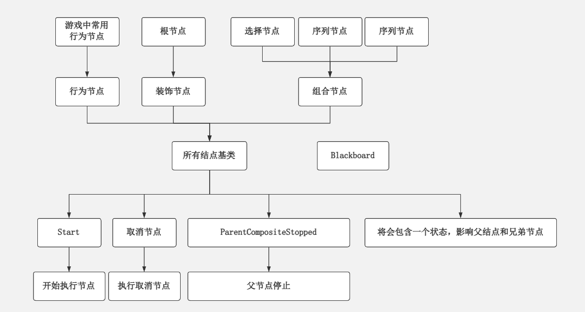
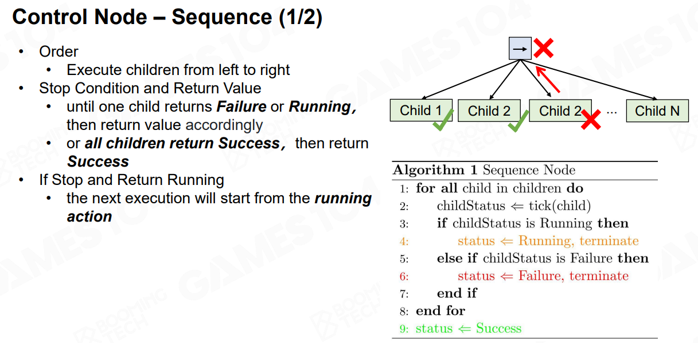
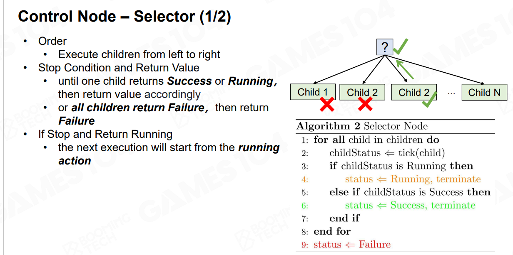
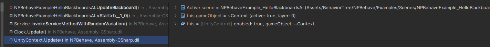
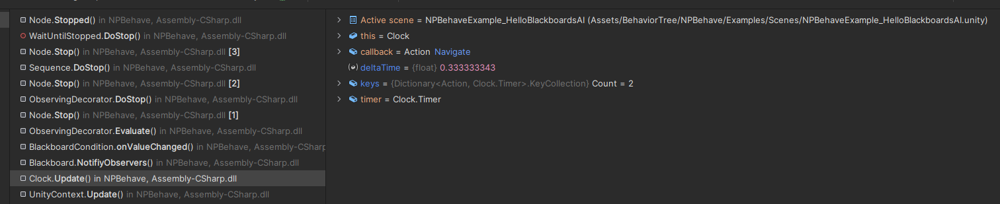
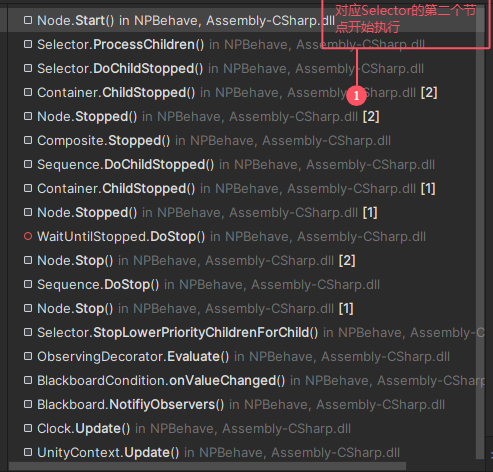

# Behavior Tree的实现

参考代码：https://github.com/meniku/NPBehave

https://www.lfzxb.top/the-architecture-of-npbehave/


# 一、阅读源码前的准备

【1】首先，先来看一下基本概念：https://github.com/meniku/NPBehave/blob/master/README_CH.md

【2】看一下有人的解读：https://blog.csdn.net/qq_39915907/article/details/119571082




# 二、自己看的过程

## 1.NPBehaveExample_HelloWorldAI

先看这个，Debug一下，了解一下大概。我们结合后面的一些自己做的案例代码来加深理解。


## 2.基础Sequence逻辑

- *Sequence*：序列组合器，一遇到子结点返回失败则其本身返回失败，否则继续执行下一个子结点。全部成功则其本身返回成功

写一个如下的C#脚本：

```c#
using System.Collections;
using System.Collections.Generic;
using UnityEngine;
using NPBehave;

public class TestBHSequence : MonoBehaviour
{
    private Root behaviorTree;
    // Start is called before the first frame update
    void Start()
    {
        behaviorTree = CreateBehaviourTree();
#if UNITY_EDITOR
        Debugger debugger = (Debugger)this.gameObject.AddComponent(typeof(Debugger));
        debugger.BehaviorTree = behaviorTree;
#endif
        behaviorTree.Start();
    }

    private Root CreateBehaviourTree()
    {
        // we always need a root node
        return new Root(
            new Sequence(
                new Action(() => Debug.Log("Action 1")),
                new Action(() => Debug.Log("Action 2")),
                new Action(() => Debug.Log("Action 3"))
            ));
        
    }
}
```

在新场景中执行这个函数，发现会循环不断的打印Action 1，2，3，这就是一个简单的Sequence例子，方便我们阅读Sequence的细节。

### （1）Games104中Sequence的细节




### （2）NPBehave中的源码细节

在Sequence节点中，Start的时候可以去`Sequence.cs`文件的`DoStart`函数去看。以上的这个情景属于比较简单的应用场景，在这里不过多记录，记录一下这种情况的重点：

- （a）每次每个节点开始运行的时候，去找对应类的`DoStart`函数去看。对于最普通的Action而言（比如说我们这里的`Debug.Log`事件），基本就是Invoke一次，然后就`this.Stopped(true);`了。然后由于Sequence是继承于Composite的，因此在Stop的时候会调用Composite->Stop，进而会调用Container->ChildStopped函数。直接去源码当中看调用关系吧。


## 3.Selector的逻辑

- *Selector*：选择组合器，一遇到子结点返回成功则其本身返回成功，否则继续执行下一个子结点，全部失败则其本身返回失败

参考Games104：



不妨新建一个Selector测试一下：
```c#
private Root CreateBehaviourTree()
{
    // we always need a root node
    return new Root(
        new Selector(
            new Action(() => Debug.Log("Action 1")),
            new Action(() => Debug.Log("Action 2")),
            new Action(() => Debug.Log("Action 3")),
            new WaitUntilStopped()
        ));

}
```

此时这颗行为树会一直输出Action 1，这是正常的行为树逻辑。**关于Selector某个节点执行失败会执行下一个节点的逻辑暂时还没看，结合后面的condition会比较容易。**


## 4.Service

将BehaviorTree修改为下面这样：

```c#
return new Root(
    new Service(0.5f, UpdatePlayerDistance,
        new Sequence(
            new Action(() => Debug.Log("Action 1")),
            new Wait(1f),
            new Action(() => Debug.Log("Action 2")),
            new Wait(1f),
            new Action(() => Debug.Log("Action 3"))
        )
    ));
```

经过源码阅读，发现其实Service的逻辑就是在执行后面的部分的Start之前先注册一个计时器，在这里就是每0.5s执行一次UpdatePlayerDistance。由于我们还没有引入Blackboard的概念，因此UpdatePlayerDistance就是Log一段话。此时整颗行为树的逻辑就是每0.5s固定执行一次`UpdatePlayerDistance`，并且Sequence会反复不断地执行Action1， Action2，Action3。


## 5. BlackBoard Base

在NPBehave中，就像在虚幻引擎中一样，我们有黑板。你可以把它们看作是你的AI的“记忆”。在NPBehave中，黑板是基于可以观察更改的字典。我们主要使用`Service`来存储和更新黑板中的值。我们使用`BlackboardCondition`或`BlackboardQuery`来观察黑板的变化，然后遍历bahaviour树。您也可以在其他任何地方访问或修改黑板的值(您也可以经常从Action节点访问它们)。

当您实例化一个`根（Root）`时，黑板将自动创建，但是您也可以使用它的构造函数提供另一个实例(这对于`共享黑板（Shared Blackboards）`特别有用)。

**我们来看一下`NPBehaveExample_HelloBlackboardsAI`这个场景和相关的脚本，发现其逻辑如下：**

```c#
behaviorTree = new Root(

    // toggle the 'toggled' blackboard boolean flag around every 500 milliseconds
    new Service(0.5f, () => { behaviorTree.Blackboard["foo"] = !behaviorTree.Blackboard.Get<bool>("foo"); },

        new Selector(

            // Check the 'toggled' flag. Stops.IMMEDIATE_RESTART means that the Blackboard will be observed for changes 
            // while this or any lower priority branches are executed. If the value changes, the corresponding branch will be
            // stopped and it will be immediately jump to the branch that now matches the condition.
            new BlackboardCondition("foo", Operator.IS_EQUAL, true, Stops.IMMEDIATE_RESTART,

                // when 'toggled' is true, this branch will get executed.
                new Sequence(

                    // print out a message ...
                    new Action(() => Debug.Log("foo")),

                    // ... and stay here until the `BlackboardValue`-node stops us because the toggled flag went false.
                    new WaitUntilStopped()
                )
            ),

            // when 'toggled' is false, we'll eventually land here
            new Sequence(
                new Action(() => Debug.Log("bar")),
                new WaitUntilStopped()
            )
        )
    )
);
```

根据前面的理解，`Service`构造函数的前两个参数分别是：每0.5s轮询一次，即每0.5s更新一下`blackboard["foo"]`的值，在没有别的逻辑更新blackboard这个字段的时候，这个字段只有Service更新。以上的写法（`Stops.IMMEDIATE_RESTART`）可以做到：当当前分支或者优先级更低的分支满足BlackboardCondition时，会立即切换到当前分支。

现在我们来看一下`BlackboardCondition`的逻辑，才能更好理解这段代码的意思。直接看Start的时候的逻辑：

> ==`Node.Start`->`Root.DoStart`->`Service.DoStart`->`Service.InvokeServiceMethodWithRandomVariation`==（用于执行Service每xx秒回调的函数以及注册对应的计时器）->==`Selector.Start`==（这里是因为Selector作为了Service的Decoratee，因此按顺序Start）->==`Selector.DoStart`->`Selector.ProcessChildren`==（这个函数对每个child做处理，最开始的时候会尝试调用child[0]的Start函数）->==`Node.Start`->`ObservingDecorator.DoStart`==（应该是因为执行到了ConditionBlackboard的Start阶段，但ObservingDecorator是其继承的类，所以先调用这里的）->==`ObservingDecorator.isObserving=true, ObservingDecorator.StartObserving()`==->`this.rootNode`的blackboard加入Observer（观察者模式）->查看Condition是否符合条件决定是Stop还是Start->一开始和Condition是符合的，所以调用`Decoratee.Start`，也就是==`Node->Start`->`Sequence->DoStart`->`Sequence->ProcessChildren`->接下来就是之前的逻辑了==，在这里是把Sequence执行完毕，然后Start就结束了（这是因为Sequence最后使用了`WaitUntilStopped`,根据前面所学，WaitUntilStopped没有重载实现`DoStart`函数，因此就堵在这里了，应该是要等计时器回调的时候才会修改行为树的状态。）


**Service更新blackboard的逻辑**



简单来看就是计时器执行完毕了，执行当时注册的回调函数，也就是修改Blackboard的逻辑。


**继续执行行为树的逻辑**



> note：这个代码真的巨难Debug（下面这个堆栈需要把断点打在WaitUntilStopped.cs的DoStop函数里面）。。。。总之，大概是这样的：首先加入的BlackboardCondition会走观察者模式，并注册一个Clock中的Timer然后在Clock中对应Timer走到0的时候会回调这个BlackboardCondition（比如我们这里就是回调onValueChanged），此时会走下图里面的Evaluate->StopLowerPriorityChildrenForChild
>
> 

# 其他

- `WaitUntilStopped.cs`的逻辑：由于其没有重载`DoStart`函数，因此执行这个节点的时候默认进入`Node`类的`DoStart`函数，为空，因此行为树就会卡在这个节点，不会循环执行；
- 