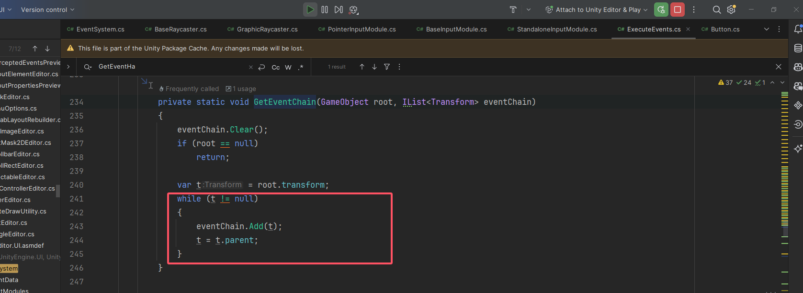

# Unity UGUI 内容合集

【1】首先，看一下这篇文章：https://zhuanlan.zhihu.com/p/437704772，可以对UGUI的事件系统有一个基本的认知，包括他的射线检测和继承关系；

【2】阅读这个系列：https://blog.csdn.net/ecidevilin/article/details/52503595，这个没有push到Github上，但本地有保存，直接everything搜索UGUI源码_0.html即可，一共有十八篇，看完基本就对UGUI有个大概了解了。

> 目前一~七是看完了，八暂时看不动了，先不看了。明天继续后面的部分。

# 记录一些知识点

【1】点击Button下面的任意子节点，都会点击到button，即使他们距离非常遥远。主要的原因看这个函数：

