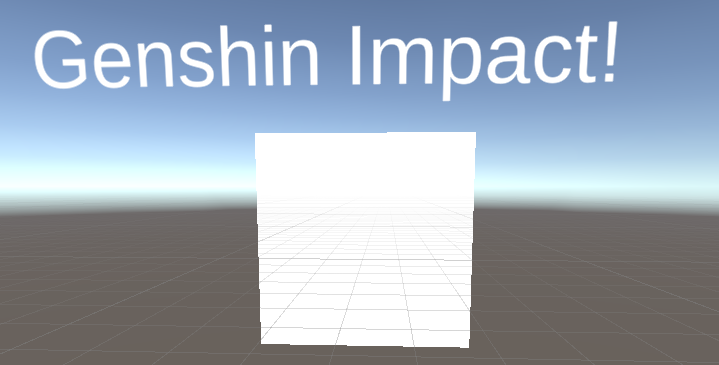
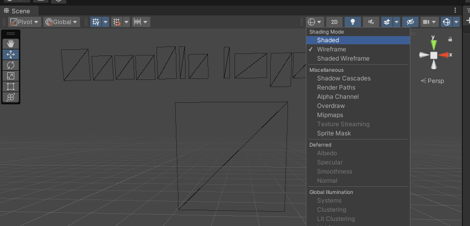
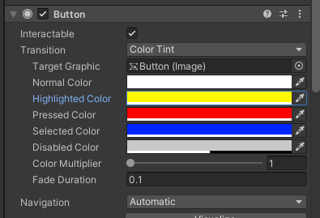

# Unity UGUI 源码解读

# 一、比较推荐阅读的文档

【1】https://zhuanlan.zhihu.com/p/437704772


# 二、阅读UGUI源码的收获

## 1.配置环境

按照https://zhuanlan.zhihu.com/p/437704772这篇的步骤来即可。注意为了其他系统不干扰UGUI代码的阅读，这里直接新建了一个Unity项目。不过研究了半天Unity UI也删不掉，貌似现在不让删了，那就直接看源码吧。实测堆栈是可以看的，就是没法写注释，那就写在这篇文档里面吧。


## 2.Button源码阅读+Unity事件系统调用链

依然参考这篇：https://zhuanlan.zhihu.com/p/437704772


## 3.Unity UI重建(Rebuild)源码分析

先读这篇吧：https://zhuanlan.zhihu.com/p/33827367

以下场景本来是这样的：



使用Wireframe的方式渲染，得到结果如下：



以此为引入，重点来看这篇文章：https://zhuanlan.zhihu.com/p/343524911。以下是对博客的内容做一些基本的补充：

- 关于`VertexHelper`类的定义，可以看`VertexHelper.cs`文件，去Rider里面全局搜索即可。


可以看这篇来讲：https://zhuanlan.zhihu.com/p/46208753，通过这篇看到一些Unity UGUI比较费的地方，文章也有提供优化的思路。


# 三、Unity基础知识（关于UI）

【1】关于CanvasGroup组件：https://docs.unity3d.com/Packages/com.unity.ugui@1.0/manual/class-CanvasGroup.html

> `Canvas Group`可以用来在一个地方控制一整组UI元素的某些方面，而无需逐个处理它们。`Canvas Group`的属性会影响其所在的`GameObject`以及所有子元素。
>
> 
>
> ## Properties
>
> | **Property:**            | **Function:**                                                |
> | :----------------------- | :----------------------------------------------------------- |
> | **Alpha**                | 该组中UI元素的不透明度。取值范围为0到1，其中0表示完全透明，1表示完全不透明。请注意，元素保留其自身的透明度，因此Canvas Group的alpha值和单独UI元素的alpha值会相互相乘。 |
> | **Interactable**         | 确定此组件是否接受输入。当设置为false时，交互将被禁用。      |
> | **Block Raycasts**       | Will this component act as a collider for Raycasts? You will need to call the RayCast function on the graphic raycaster attached to the Canvas. This does *not* apply to **Physics.Raycast**. |
> | **Ignore Parent Groups** | 此组是否还会受到游戏对象层次结构中更高级别Canvas Group组件设置的影响，或者是否会忽略它们并覆盖这些设置？ |
>
> Canvas Group的典型用途包括：
>
> - 通过在窗口的GameObject上添加Canvas Group并控制其Alpha属性来淡入或淡出整个窗口。
> -  通过向父GameObject添加Canvas Group并将其可交互性属性设置为false，使一整套控件变为不可交互（“置灰”）。
> -  通过在元素或其父级之一上放置Canvas Group组件并将其Block Raycasts属性设置为false，使一个或多个UI元素不参与鼠标事件的监听回调。


# 四、一些阅读发现的问题

【1】Selectable继承的几个接口：参考凯奥斯大佬的博客里有说：

> 继承自 IPointerDownHandler需要实现OnPointerDown方法。调用 EventSystem.current.SetSelectedGameObject将自己设为当前选中对象（会调用自己的OnSelect和前任对象的OnDeselect），标记 isPointerDown为true 并刷新状态（==当 isPointerInside和 isPointerDown同时为true的时候为Pressed状态 ）==。但看代码的时候发现现在只有isPointerDown的时候被判断是Pressed状态，应该是Unity UGUI代码改版了。代码在Selectable.cs类里面：
> ```c#
>  protected SelectionState currentSelectionState
> {
>     get
>     {
>         if (!IsInteractable())
>             return SelectionState.Disabled;
>         if (isPointerDown)
>             return SelectionState.Pressed;
>         if (hasSelection)
>             return SelectionState.Selected;
>         if (isPointerInside)
>             return SelectionState.Highlighted;
>         return SelectionState.Normal;
>     }
> }
> ```

【2】Selectable的IsHighlighted方法也改了，现在的逻辑会干净一些，原来的太埋汰了。isSelected应该是按下Button之后，在按的时候是Press，再按完之后就是Selected，可以自己改一下对应颜色试试：



可以发现，Button没有实现ISelectHandler, IDeselectHandler，但其继承的Selectable则实现了ISelectHandler, IDeselectHandler，可以理解为Button不需要单独处理对应的逻辑，但Selectable类会处理状态过渡的表现（比如color tint变化），因此Selectable需要实现这两个接口。


# 五、UGUI可能的面试题目大全


# 突发奇想:MissionSystem的重构思路

实现一个MissionNode，继承于XNode的Node节点，并实现一个IMissionExecute的接口，里面有比如：

```c#
onMissionStart(){}
onMissionPause(){}
onMissionRestart(){}
onMissionEnd(){}
```

等等，需要再认真思考。然后在遍历任务节点图的时候，类比UI系统，进行下一个任务的时候OnMissionEnd当前的，然后OnMissionStart新的，同时可以把当前总的任务节点图里的数据（比如图节点id，图的graph）传进去。

比如说实现了一个对话的Node，感觉应该是这样的：

```c#
class DialogNode: MissionNode
{
    public 
    public void override onMissionStart(){
        UIManager.Open(new DialogUI(xxx,))  
    }
}
```

等待到两天后开启这个任务：感觉可以参考行为树的decorator来做，应该可做。


# todo：实现Genshin当中的长按背包格子会连续+1，以及分解的时候可以连续选择一个范围内的格子

