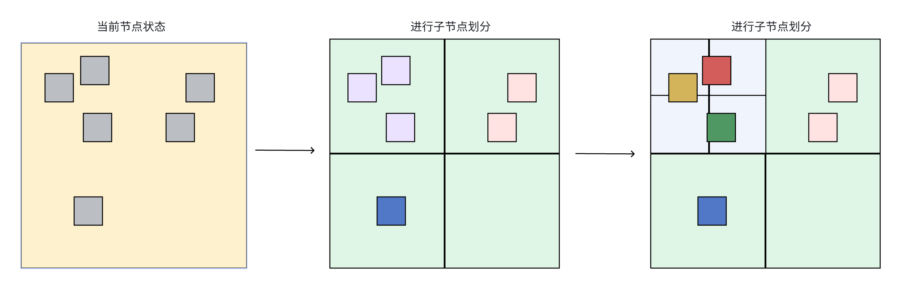

# 空间加速结构

# 一、Octree八叉树

原理很容易理解，如下图：


我们有一个Box，将这个Box八等分（X,Y,Z方向各对半分），那我们就有了八个子Box（$2^3$个）。如果我们再把这八个再划分一下，那就能得到64个Box($2^6$个)。在实际应用中，往往不会对所有子节点无差别的划分，而是满足“一定条件”的子节点，才会被再次划分。

## 1.八叉树的数据结构

对于每一个`node`，其代表了一个子空间。对box而言，我们可以使用`center`和`size`来定义这个空间，此时判断某一点$P$是否包含在`node`内的逻辑是比较简单的。可以这样判断：

```c#
bool isInSideNode(Vector3 pos)
{
    return abs(pos.x-center.x)<size.x/2.0 && abs(pos.y-center.y)<size.y/2.0 && abs(pos.z-center.z)<size.z/2.0;
}
```

在后面的代码中，也会看到这个函数的实现。

根据上述知识，我们定义八叉树的Node节点以及其构造函数：

```c#
namespace SpaceAccelerateDemo
{
    public class OctreeNode
    {
        public List<GameObject> areaObjects;
        public Vector3 center;
        public float size; //为了节省空间，这里定义每个node都是正方体，因此用一个float值即可存储size
        
        private const int kidCount = 8; //八叉树，每个节点有8个子节点
        private OctreeNode[] kids;
        public OctreeNode(Vector3 center, float size)
        {
            this.center = center;
            this.size = size;
            areaObjects = new List<GameObject>();
            kids = new OctreeNode[kidCount];
        }
    }
}
```

一些基本的逻辑函数，例如下面这两个：

```c#
public bool isLeaf => kids[0] == null;
        
public bool Contains(Vector3 position)
{
    var halfSize = size * 0.5f;
    return Mathf.Abs(position.x - center.x) <= halfSize &&
           Mathf.Abs(position.y - center.y) <= halfSize &&
           Mathf.Abs(position.z - center.z) <= halfSize;
}
```

还需要一个DrawGizmos的函数，方便后面做可视化的时候用：

```c#
public void DrawGizmos()
{
    Gizmos.DrawWireCube(center, Vector3.one * size);
}
```

具体还有哪些别的，可以看源代码`OctreeNode.cs`。


## 2.OctreeTest

刚才的八叉树只是一个数据结构，我们还需要对其进行管理。这里简单起见，只增加一个`OctreeTest.cs`文件用于测试八叉树空间加速结构，OctreeTest.cs中包含了八叉树测试的剩余逻辑。我们随机生成一些Cube，用于测试：

```c#
private void GenSceneObjects()
{
    float genRange = range * 0.5f;
    sceneObjects = new List<GameObject>();
    for (int i = 0; i < genCount; i++)
    {
        var obj = GameObject.CreatePrimitive(PrimitiveType.Cube);
        obj.transform.position = new Vector3(Random.Range(-genRange, genRange), Random.Range(-genRange, genRange), Random.Range(-genRange, genRange));
        obj.hideFlags = HideFlags.HideInHierarchy; //隐藏在Hierarchy面板
        sceneObjects.Add(obj);
    }
}
```

> 为了防止不重要的内容干扰阅读，这篇文章中只展示比较核心的代码，全部的代码可以看SpaceAcceleration子文件夹中的。

此时运行程序，会产生许多随机位置的Cube。接下来便是对他们进行划分。


### （1）八叉树划分算法



大致的算法如下：

- （a）如果当前生成递归深度小于定义最大递归深度， 则从【当前节点】创建8个【子节点】；
- （b）遍历【当前节点】中记录的场景对象，将对象分配到对应的【子节点】中；
- （c）当前深度减一，遍历【子节点】，尝试执行步骤1。直到【子节点】中的物体数量小于等于1，或者递归深度达到最大递归深度；

代码如下（其中OctreePartion()函数在Start函数中被调用）：

```c#
private void OctreePartion()
{
    root = new OctreeNode(Vector3.zero, range);
    root.areaObjects.AddRange(sceneObjects);
    BuildOctree(root, 0);
}

private void BuildOctree(OctreeNode node, int depth)
{
    if (depth >= buildDepth)
    {
        return;
    }
    if (node.objectCount <= 1)
    {
        return;
    }
    var halfSize = node.size * 0.5f;
    for (int i = 0; i < 8; i++)
    {
        var center = node.center;
        //根据i的二进制位来判断是在左还是右,前还是后,上还是下,i=0~7分别是000，001，010，011，100，101，110，111
        center.x += (i & 1) == 0 ? halfSize * 0.5f : -halfSize * 0.5f;
        center.y += (i & 2) == 0 ? halfSize * 0.5f : -halfSize * 0.5f;
        center.z += (i & 4) == 0 ? halfSize * 0.5f : -halfSize * 0.5f;
        var newNode = new OctreeNode(center, halfSize);
        node.Kids[i] = newNode;
        newNode.areaObjects = node.areaObjects.FindAll(obj => newNode.Contains(obj.transform.position));
        BuildOctree(newNode, depth + 1);
    }
}
```


### （2）可视化

完成了上述的八叉树划分，我们还需要将其可视化出来。在Test脚本中定义一个枚举类型，表示debug的模式：

```c#
public enum OctreeDebugMode
{
    AllDepth,
    TargetDepth
}
```

此时为Test文件添加一个DrawGizmos的函数(继承于Monobehavior)：

```c#
private void DrawOctree(OctreeNode node, int depth)
{
    //AllDepth:绘制所有深度的八叉树
    if (octreeDebugMode == OctreeDebugMode.AllDepth)
    {
        node.DrawGizmos();
        if (node.isLeaf)
        {
            return; 
        }
        for (int i = 0; i < 8; i++)
        {
            DrawOctree(node.Kids[i], depth + 1);
        }
    }
    //TargetDepth:绘制目标深度的八叉树
    else if (octreeDebugMode == OctreeDebugMode.TargetDepth)
    {
        Gizmos.color = Color.yellow;
        if (depth == targetDisplayDepth)
        {
            Gizmos.color = Color.green;
            node.DrawGizmos();
        }
        if (node.isLeaf)
        {
            return;
        }
        for (int i = 0; i < 8; i++)
        {
            DrawOctree(node.Kids[i], depth + 1);
        }
    }
}

private void OnDrawGizmos()
{
    if (root == null || !debugDraw)
    {
        return;
    }
    DrawOctree(root,0);
}
```

此时运行程序，用2D正交相机可以看到如下结果：

（1）首先是AllDepth：


> 看起来有的格子里物体数量比较多是因为我们是2D投影的结果，实际应该是三维的；

（2）targetDepth=3，这次用三维来看：


## 3.八叉树的作用：场景查询

我们已然有了加速结构，但是有什么用呢？一个很直观的作用就是“场景查询”。例如，我们已知有一个检查点的坐标，想知道场景中的物体，哪些与这个检查点很接近，意味着其可能发生碰撞。

为了做测试，新增一些变量：

```c#
public bool doQueryTest = false;
public Transform queryTransform;
private List<GameObject> queryObjects; //临近物体的列表，用于找到最近的物体
private OctreeNode queryNode; //查询到的最终节点，会递归找到叶子节点，将其可视化为绿色
```

此时查询的函数如下：

```c#
private void Update()
{
    if (doQueryTest)
    {
        if(queryObjects != null)
            queryObjects.Clear();
        queryObjects = new List<GameObject>();
        queryNode = null;
        QueryNearestObject(root, queryTransform.position);
    }
}

private void QueryNearestObject(OctreeNode node, Vector3 position)
{
    if (node.isLeaf) //一直找到叶子节点
    {
        queryNode = node;
        queryObjects.AddRange(node.areaObjects);
        return;
    }
    for (int i = 0; i < 8; i++)
    {
        if (node.Kids[i].Contains(position))
        {
            QueryNearestObject(node.Kids[i], position);  //看看哪个子节点中有这个物体，有的话再走到子节点
        }
    }
}
```

OnDrawGizmos函数也要更新，如果有QueryNode的话，就找到当前QueryNode下所有包含物体中距离target最近的物体，连一条红色的线过去。


### （1）可视化效果

下面的动图展示了八叉树查询时的优势（让所有生成的Cube的y=0，用2D俯视图来可视化结果）：

<video src="./assets/OctreeTreeDemo.mp4"></video>

## 4.整个场景

整个场景非常简单，如下：


其中Sphere是要查询的物体。对应的代码在SpaceAcceleration文件夹下面。