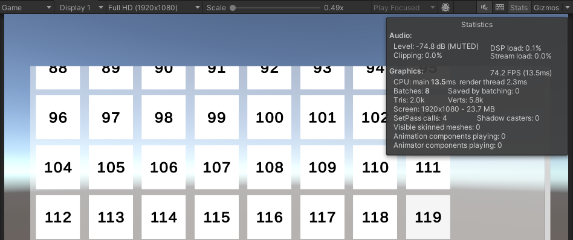
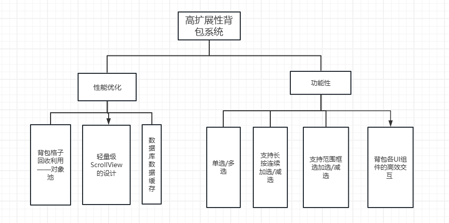
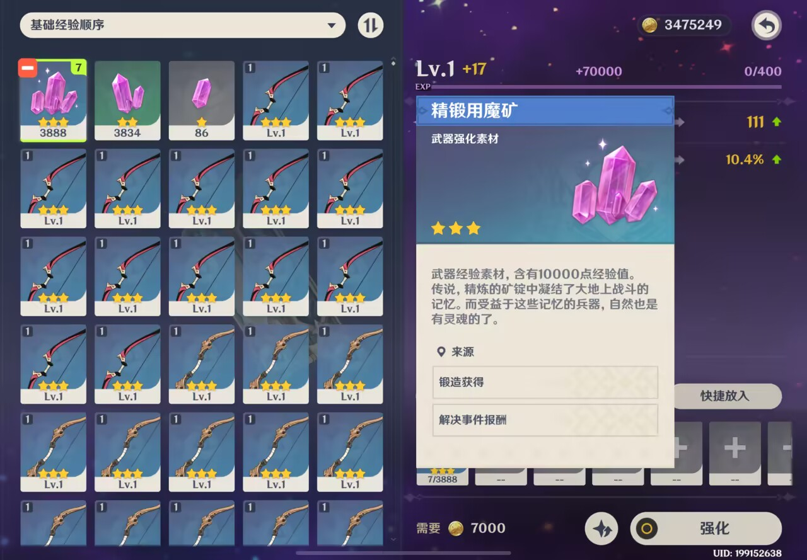

# 米游背包系统功能复刻

​	在游戏开发中，背包系统十分常见。之前参加一些GameJam比赛，或者制作小型游戏项目的时候，一般直接用Unity的ScrollView来做，通过Instantiate把玩家身上有的东西呈现在背包的格子当中，不过随着玩家背包中物品的数量不断增长，上述的方案会带来严峻的性能问题。例如下图是5000个背包格子直接挂载在ScrollView->Viewport->Content下的帧率：



​	（上图基本都是最高帧率了，在滑动滚动条的时候会直接卡死，性能爆炸）

​	因此，**解决问题的思路：使用少量的背包格子，循环利用，从而达到少量的背包格子能够显示全部上千个物体的选择等逻辑。**


# 一、背包系统包含的功能点



以下会重点介绍对应的部分，并给出代码的具体实现。


# 二、各功能点的分别实现

## 1.定制自己的ScrollView

​	要实现自己的背包系统，比较好的方式是借助于UGUI的ScrollView，写一个自己的ScrollView，以方便后续各种功能的进一步引入。我们先来写一些暂时需要的变量说明：

```c#
public enum AlignType
    {
        Left,
        Right,
        Top,
        Bottom,
        Center,
    }
    
    public class UIScrollView : MonoBehaviour, IEndDragHandler, IBeginDragHandler, IDragHandler
    {
        public ScrollRect m_ScrollRect;
        public RectTransform m_Content;
        public Axis m_AxisType; //滑动类型,水平移动/垂直移动
        public AlignType m_AlignType; //布局
        public PivotPresets m_ItemPivot;  //子物体的中心点，自定义枚举，例如TopLeft,
        
        public int m_HorizontalStartSpace;  //水平开始间隔
        public int m_VerticalStartSpace; //垂直开始间隔
        public int m_HorizontalSpace; //水平每个格子间的间隔
        public int m_VerticalSpace; //垂直每个格子间的间隔
        
        public int m_CountOfOtherAxis = 1; //另一个轴上的格子数量
        private int m_maxChooseCnt = 100000; // 默认不做限制，指的是最多可以同时选择几个格子
        
        private IList m_Datas; //数据源，存放真实的物品数据
        private PrefabPool m_PrefabPool;  //对象池
        private List<UILoopItem> m_LoopItems; //存放所有要复用的格子，假设我们有5000个物品，可能只会利用60个格子复用来显示，性能优化
        private Dictionary<int, int> m_SelectIndexs = new Dictionary<int, int>(); //存放每个物品的选择情况，key是物品的index，value是选择的个数
        
        //Gets and Sets
        public Dictionary<int, int> SelectIndexs => m_SelectIndexs;
        public List<UILoopItem> LoopItems => m_LoopItems;
        
        
    }
```

这里涉及到两个新的类型，分别是`UILoopItem`和`PrefabPool`接下来，会先从对象池对背包格子复用的逻辑开始说起，并进一步增加这两个类的逻辑。


### （1）背包格子复用

​	这里是比较核心的功能，涉及到我们**如何用有限的格子进行复用，从而可以展示非常多的物品呢？**此时就要用到对象池的思想了，本章节介绍两个部分，分别是对象池的基础实现，以及如何利用对象池实现背包中格子的复用逻辑。


#### （a）对象池PrefabPool

​	**对象池**是游戏开发中一个非常重要的基本概念，如果游戏中Instantiate出来的Prefab过多的话，会产生严重的性能问题。对象池就是通过将少量的物体放入到对应的对象池中（其实就是一个List），每次Instantiate的时候，如果对象池里的个数可以满足要求，就直接从对象池里拿，否则再放入进去新的。回收掉的对象则直接使用SetActiveFalse来实现。不妨直接看一下对象池的框架：

```c#
public class PrefabPool
{
    /// <summary>
    /// 如果名字一样，则使用同一个池子
    /// </summary>
    public static Dictionary<string, PrefabPool> s_Pools = new Dictionary<string, PrefabPool>();
    private string _poolName;
    private GameObject _prefab;
    private List<GameObject> _pool;
    private List<GameObject> _useList;

    public GameObject Prefab => _prefab;
    public List<GameObject> UseList => _useList;

    private PrefabPool() { }

    private void Init(string poolName, GameObject prefab){ }

    private static PrefabPool Get(string poolName){ }

    public static PrefabPool Create(GameObject prefab, string poolName = null){ }

    public GameObject Get(Transform parent = null){ }

    public void Recycle(GameObject go) { }

    public void RecycleUseList(){}

    public void Destroy(){}

}
```

然后，我们就要逐一填充对应的方法了。这里我们只介绍背包系统中需要用到的函数。首先是Init函数：

```c#
private void Init(string poolName, GameObject prefab)
{
    _pool = ListPool<GameObject>.Get();  //ListPool是一个自定义的类，这里是获取一个List<GameObject>对象
    _useList = ListPool<GameObject>.Get();
    _prefab = prefab;
    _poolName = poolName;
}
```

`ListPool`是自定义的一个类，也是使用了一些优化的技巧。这里我们为了不让这篇文章太过复杂，就认为是new了一个`List<GameObject>`即可。


接下来是真正利用对象池创建一个对象的`Create`函数了。因为实际上背包的每个格子都是相同的Prefab，只是界面上展示的内容不同而已，这个`Create`函数如下：

```c#
public static PrefabPool Create(GameObject prefab, string poolName = null)
{
    if (prefab == null) return null;
    if (!string.IsNullOrEmpty(poolName))
    {
        if (s_Pools.TryGetValue(poolName, out var prefabPool))
        {
            return prefabPool;
        }
    }
    var pool = new PrefabPool();
    pool.Init(poolName, prefab);
    if (!string.IsNullOrEmpty(poolName))
    {
        s_Pools.Add(poolName, pool);
    }
    return pool;
}
```

针对我们的背包系统，poolName可以简单地设置为null即可，整体背包所有格子共用一个对象池。


从对象池中拿一个物体的`Get`函数如下：

```c#
public GameObject Get(Transform parent = null)
{
    if (_prefab == null) return null;
    GameObject go = null;
    if (_pool.Count > 0)  //如果池子里有对象，直接取出一个，否则实例化一个
    {
        go = _pool[0];
        _pool.RemoveAt(0);
    }
    else
    {
        go = GameObject.Instantiate(_prefab);
    }
    go.transform.parent = parent;
    go.transform.localScale = Vector3.one;
    go.transform.localPosition = Vector3.zero;
    go.transform.localRotation = Quaternion.identity;
    go.SetActive(true);
    go.transform.SetAsLastSibling();
    _useList.Add(go);  //将取出的对象放入使用列表
    return go;
}
```


有了从对象池中拿一个对象出来的函数`Get`，自然应该有使用完毕后，将对象放回对象池的函数`ReCycle`：

```c#
public void Recycle(GameObject go)
{
    if (go != null)
    {
        go.SetActive(false);
        _pool.Add(go);
        _useList.Remove(go);
    }
}
```

从上面的代码可以看出，实际上对象池就是通过`_pool`和`useList`这两个List一起工作来完成的。在申请new一个物体的时候，从pool里拿出来放进`useList`里，在回收的时候，将物体的`active`设置为false，放回到`pool`当中，并从`useList`里删除掉。对象池非常常见于比如枪战游戏的子弹管理当中。


接下来，写一个函数用来回收所有`useList`中已使用的对象，这个函数可以在清空已使用列表的时候使用，比如关闭背包或者打开了另一个背包列表的时候：

```c#
public void RecycleUseList()
{
    foreach (var go in _useList)
    {
        if (go != null)
        {
            go.SetActive(false);
            _pool.Add(go);
        }
    }
    _useList.Clear();
}
```

函数比较简单，不过多介绍。最后一个逻辑就是将对象池`Destroy`的逻辑，这里篇幅原因就不贴上来了，大致就是将`pool`和`useList`当中的物体都Destroy掉，然后调用`useList.Clear()`和`pool.Clear()`方法，最后将相关值置为null来实现。

------


#### （b）复用逻辑

​	有了上述对象池的基本逻辑，我们趁热打铁直接使用对象池的复用+自定义ScrollView，实现**50多个格子展示5000个物体的基本逻辑**吧。首先，整套背包系统不只是ScrollView，还应该包含各种其他的UI组件。因此我们先创建一个Panel，并利用UI框架（读者也可以自定义实现Panel的OnOpen，OnClose等函数，这里我使用的是之前项目里的UI框架）绑定对应的UI组件。这里我自己先搭了一个UI界面，但还没有逻辑：


​	对应绑定的`UIView`脚本（用以实现UI的各组件功能）大致如下：

```c#
public class HBagPanelNew : UIView
{
    #region 控件绑定变量声明，自动生成请勿手改
    #pragma warning disable 0649
    [ControlBinding]
    private ScrollRect BagScrollView;
    [ControlBinding]
    private TextMeshProUGUI ItemName;
    [ControlBinding]
    private Button ExitButton;

    #pragma warning restore 0649
#endregion


    public override void OnInit(UIControlData uIControlData, UIViewController controller)
    {
        base.OnInit(uIControlData, controller);
    }

    public override void OnOpen(object userData)
    {
        base.OnOpen(userData);
    }

    public override void OnAddListener()
    {
        base.OnAddListener();
    }

    public override void OnRemoveListener()
    {
        base.OnRemoveListener();
    }

    public override void OnClose()
    {
        base.OnClose();
    }
}
```

​	以后我们的背包逻辑都会写在上面，我们直接来写`ScrollView`的逻辑，从而先实现背包格子的复用。从简洁性角度，我们希望可以通过一个dataList和一个配置的Config类就可以打开ScrollView，比如一个`Open`函数，类似于下面这样：

```c#
public enum GenshinDemoListType
{
    Weapon,
    Mineral, //矿石
    MissionItem, //任务物品
    Food, //食物
    Material, //材料
    Artifact, //圣遗物
    Other, //其他
}
public class GenshinDemoListData
{
    public int id;
    public string name;
    public GenshinDemoListType type;

    public float getTime; //获取时间
    public int count; //数量

    public int level;
    //...其他变量，比如获取时间等
    public int selectCount = 0; //当前某个物品选择的数量
    public bool multiSelectInOneItem = false; //是否在一个格子中显示多个数量
}

public class GenshinUserDataStruct
{
    //这个类存储相关打开背包的逻辑，比如可选择物品的个数限制，物体是否要叠加显示，是否能显示X键取消勾选等
    public int maxSelectCount = 1; //最大可选择种类数量
    public bool isShowX = true; //是否显示X键
    public bool isCanOverlap = false; //是否能叠加显示,比如100把武器，要在一个格子中显示还是在多个格子中显示
    public bool canRangeSelect = false; //是否可以范围选择
}
```

​	于是打开背包的逻辑就可以简化为：

```c#
private void SetGenshinDataToUIScrollViewWeapon()
{
    //理论上我们应该拿到数据库的数据，但暂时为了简单起见，我们直接生成一些数据上去
    List<GenshinDemoListData> dataList = new List<GenshinDemoListData>();
    for (int i = 0; i < 5000; i++)
    {
        GenshinDemoListData data = new GenshinDemoListData();
        data.id = i;
        data.name = i.ToString();
        data.count = 1;
        data.level = 80;
        data.type = GenshinDemoListType.Weapon;
        dataList.Add(data);
    }
    //创建对应的UserData，方便格子的逻辑处理
    GenshinUserDataStruct userData = new GenshinUserDataStruct();
    userData.maxSelectCount = 10000; //可以最多选择10000个
    userData.isShowX = true; //显示X键，只做UI上的显示
    userData.isCanOverlap = true; //不叠加显示

    scrollView.SetUpList(dataList, itemPrefab, typeof(UILoopItem), userData);
}
```

**所以我们需要实现一个`SetUpList`函数，主要将dataList和一个Prefab，以及一个类型，还有配置userData传入进去。**该函数实现如下：

```c#
public void SetUpList(IList dataList, GameObject prefab, Type type,
    object userData = null)
{
    if (dataList == null || prefab == null)
    {
        Release(); //Release的逻辑就是释放逻辑，回收对象池，清空数据等
        return;
    }
    if (m_PrefabPool != null && m_PrefabPool.Prefab != prefab)
    {
        m_PrefabPool.Destroy();
        m_PrefabPool = null;
    }

    if (m_PrefabPool == null)
    {
        m_PrefabPool = PrefabPool.Create(prefab);  //一个ScrollView管理一个对象池
    }

    prefab.SetActive(false); //默认挂一个Prefab到Content下面，设置为false
    m_PrefabPool.RecycleUseList();
    m_LoopItems.Clear();
    m_SelectIndexs.Clear(); //当前选择列表清空

    RectTransform rect = prefab.GetComponent<RectTransform>();
    m_ChildWidth = rect.rect.width * rect.transform.localScale.x;
    m_ChildHeight = rect.rect.height * rect.transform.localScale.y;

    var parent = m_ScrollRect.transform as RectTransform;
    parentRect = parent.rect;
    //以下两个值的计算方法是根据父物体的宽高，减去开始的间隔，除以格子的宽高加上间隔，得到的是水平和垂直方向上的格子数量
    m_HorizontalCount =
        Mathf.CeilToInt((parentRect.width - m_HorizontalStartSpace) / (m_ChildWidth + m_HorizontalSpace));
    m_VerticalCount =
        Mathf.CeilToInt((parentRect.height - m_VerticalStartSpace) / (m_ChildHeight + m_VerticalSpace));

    //存储数据类型，数据源，用户数据（即配置）
    m_ItemType = type;
    m_Datas = dataList;
    m_UserData = userData;

    GenshinUserDataStruct data = userData as GenshinUserDataStruct;
    //尝试userData转为GenshinUserDataStruct，这个后面会讲，主要针对比如最多选几个，或者是否可以范围选择的逻辑
    if (userData != null)
    {
        m_maxChooseCnt = data.maxSelectCount;
        m_canRangeSelect = data.canRangeSelect;
    }
    m_Content.SetPivot(m_ItemPivot); //自己扩展UI系统，自己锚定对应位置
    Vector2 oldPos = m_Content.anchoredPosition;

    if (m_Tweener != null)  //DoTween的逻辑，如果有正在进行的动画，就Kill掉
    {
        m_Tweener.Kill();
        m_Tweener = null;
    }

    if (m_CountOfOtherAxis == 0)  //可以指定另一个轴的格子数量
    {
        //以下的逻辑是根据父物体的宽高，减去开始的间隔，除以格子的宽高加上间隔，得到的是水平和垂直方向上的格子数量（看另一个轴）
        if (m_AxisType == Axis.Horizontal)
            m_CountOfOtherAxis = Mathf.FloorToInt((parentRect.height - m_VerticalStartSpace) /
                                                  (m_ChildHeight + m_VerticalSpace));
        else
            m_CountOfOtherAxis = Mathf.FloorToInt((parentRect.width - m_HorizontalStartSpace) /
                                                  (m_ChildWidth + m_HorizontalSpace));

        m_CountOfOtherAxis = Math.Max(1, m_CountOfOtherAxis);
    }

    if (m_AxisType == Axis.Horizontal)
        m_VerticalCount = m_CountOfOtherAxis;
    else
        m_HorizontalCount = m_CountOfOtherAxis; //我们背包系统一般是这个逻辑，竖着放的
    int axisCount = Mathf.CeilToInt(dataList.Count * 1.0f / m_CountOfOtherAxis);

    switch (m_AxisType)
    {
        case Axis.Horizontal:
            if (m_AlignType == AlignType.Right)
            {
                m_Content.SetAnchor(AnchorPresets.VertStretchRight);
            }
            else
            {
                m_Content.SetAnchor(AnchorPresets.VertStretchLeft);
            }

            m_Content.sizeDelta =
                new Vector2(
                    axisCount * m_ChildWidth + (axisCount - 1) * m_HorizontalSpace + m_HorizontalStartSpace * 2,
                    0);
            if (m_AlignType == AlignType.Center)
            {
                var viewPort = m_Content.parent as RectTransform;
                viewPort.anchorMin = new Vector2(0.5f, 0.5f);
                viewPort.anchorMax = new Vector2(0.5f, 0.5f);
                viewPort.pivot = new Vector2(0.5f, 0.5f);
                viewPort.anchoredPosition = Vector2.zero;
                viewPort.sizeDelta = new Vector2(m_Content.sizeDelta.x, parentRect.height);
                int verCount = Mathf.FloorToInt((parentRect.height - m_VerticalStartSpace) /
                                                (m_ChildHeight + m_VerticalSpace));
                if (verCount > m_Datas.Count)
                {
                    viewPort.sizeDelta = new Vector2(m_Content.sizeDelta.x,
                        (m_ChildHeight + m_VerticalSpace) * m_Datas.Count - m_VerticalSpace +
                        m_VerticalStartSpace * 2);
                }
            }

            break;
        case Axis.Vertical:
            if (m_AlignType == AlignType.Bottom)
            {
                m_Content.SetAnchor(AnchorPresets.BottomStretch);
            }
            else
            {
                m_Content.SetAnchor(AnchorPresets.HorStretchTop);
            }

            m_Content.sizeDelta = new Vector2(0,
                axisCount * m_ChildHeight + (axisCount - 1) * m_VerticalSpace + m_VerticalStartSpace * 2);
            if (m_AlignType == AlignType.Center)
            {
                var viewPort = m_Content.parent as RectTransform;
                viewPort.anchorMin = new Vector2(0.5f, 0.5f);
                viewPort.anchorMax = new Vector2(0.5f, 0.5f);
                viewPort.pivot = new Vector2(0.5f, 0.5f);
                viewPort.anchoredPosition = Vector2.zero;
                viewPort.sizeDelta = new Vector2(parentRect.width, m_Content.sizeDelta.y);
                int horCount = Mathf.CeilToInt((parentRect.width - m_HorizontalStartSpace) /
                                               (m_ChildWidth + m_HorizontalSpace));
                if (horCount > m_Datas.Count)
                {
                    viewPort.sizeDelta =
                        new Vector2(
                            (m_ChildWidth + m_HorizontalSpace) * m_Datas.Count - m_HorizontalSpace +
                            m_HorizontalStartSpace * 2, m_Content.sizeDelta.y);
                }
            }

            break;
    } //与布局有关，可以暂时忽略
    m_Content.anchoredPosition = Vector2.zero; //跟参考程序相比，忽略isPage属性

    m_CurrentIndex = GetCurrentItemIndex();
    //UpdateContent(); //更新content，接下来会说
}

private int GetCurrentItemIndex()
{
    // 这个index指的是界面的index，比如说我是8个一行，那么index就是比如8，16，24这样的，可以看log的值
    //m_Content.anchoredPosition.y 是 content 的位置，随着滑动会变化
    int index = 0;
    switch (m_AxisType)
    {
        case Axis.Horizontal:
            if (m_AlignType == AlignType.Left && m_Content.anchoredPosition.x >= 0) return 0;
            if (m_AlignType == AlignType.Right && m_Content.anchoredPosition.x <= 0) return 0;
            index = Mathf.FloorToInt((Mathf.Abs(m_Content.anchoredPosition.x) - m_HorizontalStartSpace) /
                                     (m_ChildWidth + m_HorizontalSpace)) * m_CountOfOtherAxis;
            break;
        case Axis.Vertical:
            if (m_AlignType == AlignType.Bottom && m_Content.anchoredPosition.y >= 0) return 0;
            if (m_AlignType == AlignType.Top && m_Content.anchoredPosition.y <= 0) return 0;
            index = Mathf.FloorToInt((Mathf.Abs(m_Content.anchoredPosition.y) - m_VerticalStartSpace) /
                                     (m_ChildHeight + m_VerticalSpace)) * m_CountOfOtherAxis;
            break;
    }

    return Mathf.Max(0, index);
}
```


在SetUpDataList之后，我们需要把对应的格子生成上去，下面这个函数`UpdateContent()`是实现格子复用逻辑的核心：

```c#
public void UpdateContent(int index = 0)
{
    if (m_Datas == null) return;
    int maxCount = 0; //记录一共需要几个格子，要比能展示的格子多两行/两列，不然会穿帮
    switch (m_AxisType)
    {
        case Axis.Horizontal:
            maxCount = (m_HorizontalCount + 2) * m_CountOfOtherAxis;
            break;
        case Axis.Vertical:
            maxCount = (m_VerticalCount + 2) * m_CountOfOtherAxis;
            break;
    }

    for (int i = 0; i < maxCount; i++)  //maxCount是总的要用的格子数量
    {
        int listIndex = index + i;  //index是左上角的真实index，因此listIndex指的是当前每个格子的真实index
        if (listIndex < m_Datas.Count) //还没有到真实数据的最后一个
        {
            if (i < m_LoopItems.Count)
            {
                if (m_maxChooseCnt == 1)
                {
                    m_LoopItems[i].UpdateSingleData(m_Datas, listIndex, m_UserData);
                }
                else
                {
                    m_LoopItems[i].UpdateData(m_Datas, listIndex, m_UserData); //listIndex是比如2000这种值
                }
            }
            else
            {
                //说明m_LoopItems.Count不够，格子还没创建，创建格子并赋值
                var go = m_PrefabPool.Get();
                RectTransform rectTransform = go.transform as RectTransform;
                rectTransform.SetPivot(m_ItemPivot);
                switch (m_ItemPivot)
                {
                    case PivotPresets.TopLeft:
                    case PivotPresets.TopCenter:
                        rectTransform.SetAnchor(AnchorPresets.TopLeft);
                        break;
                    case PivotPresets.TopRight:
                        rectTransform.SetAnchor(AnchorPresets.TopRight);
                        break;
                    case PivotPresets.MiddleLeft:
                    case PivotPresets.MiddleCenter:
                        rectTransform.SetAnchor(AnchorPresets.MiddleLeft);
                        break;
                    case PivotPresets.MiddleRight:
                        rectTransform.SetAnchor(AnchorPresets.MiddleRight);
                        break;
                    case PivotPresets.BottomLeft:
                    case PivotPresets.BottomCenter:
                        rectTransform.SetAnchor(AnchorPresets.BottomLeft);
                        break;
                    case PivotPresets.BottomRight:
                        rectTransform.SetAnchor(AnchorPresets.BottomRight);
                        break;
                    default:
                        break;
                }

                rectTransform.SetParent(m_Content);
                rectTransform.localScale = m_PrefabPool.Prefab.transform.localScale;
                UILoopItem loopItem = go.GetOrAddComponent(m_ItemType) as UILoopItem;
                loopItem.UIScrollView = this;
                loopItem.SetBaseData();
                m_LoopItems.Add(loopItem);
                if (m_maxChooseCnt == 1)
                {
                    loopItem.UpdateSingleData(m_Datas, listIndex, m_UserData);
                }
                else
                {
                    //todo:还没写
                    loopItem.UpdateData(m_Datas, listIndex, m_UserData);
                }

            }
        }
        else if (i < m_LoopItems.Count) //到了真实数据的最后一个，但还有空的格子
        {
            //直接把空格子移出去，也不用更新
            m_LoopItems[i].transform.localPosition = new Vector3(-10000, -10000);
        }
    }
    while (m_LoopItems.Count > maxCount) //如果格子数量超过了需要的格子数量，就回收多余的格子
    {
        UILoopItem loopItem = m_LoopItems[m_LoopItems.Count - 1];
        m_PrefabPool.Recycle(loopItem.gameObject);
        m_LoopItems.RemoveAt(m_LoopItems.Count - 1);
    }
}
```

关于loopItem的相关方法会在后面进一步介绍，但不管是`UpdateSingleData`还是`UpdateData`，核心逻辑都包含下面的部分，也就是将这个格子本身放置在对应的位置。`GetLocalPositionByIndex`这个函数不过多介绍了，就是找到对应格子应该在的anchoredPosition：

```c#
public void UpdateSingleData(IList dataList, int index, object userData)  //只能单选的情况
{
    if (!isInit)
    {
        OnInit();
    }
    m_Index = index;
    m_RectTransform.localPosition = Vector3.zero;
    m_RectTransform.anchoredPosition = UIScrollView.GetLocalPositionByIndex(index);
}
```

运行一下游戏，看看效果：


有点意思。不过我们**还没有写完在拖动下拉或上拉的时候的格子复用逻辑**。接下来我们补充这个部分。我们在UIScrollView的Awake函数中增加一个事件监听，用以监听`m_ScrollRect.onValueChanged`事件，然后写一下这个监听的回调函数：

```c#
private void OnValueChanged(Vector2 vec)
{
    int index = GetCurrentItemIndex();
    if (m_CurrentIndex != index)
    {
        m_CurrentIndex = index;
        UpdateContent(index);
    }
}
```

其实就是判断如果index变了，即下拉或上拉了一行，就调用刚才写好的刷新一下Content的功能。此时再次运行游戏，就会发现我们顺利利用了50多个格子就表示出了5000个格子的内容！


### （2）格子的数据刷新

​	现在有了一个新问题，虽然我们能够让背包的格子复用，但数据并没有更新上去。这一部分我们就来处理**数据的更新逻辑**。显然，数据更新应该写在`UpdateContent`函数里面，并且最好能够把真正`data`的数据传入到每个`LoopItem`当中，更新其对应的值。我们定义一个`UIHonkaiSRItem`，继承于`LoopItem`，并在里面绑定对应的UI，以方便后面进行显示的逻辑：

```c#
public class UIHonkaiSRItem : UILoopItem
{
    #region 控件绑定变量声明，自动生成请勿手改
#pragma warning disable 0649
    [ControlBinding]
    public Image BgImage;
    [ControlBinding]
    public GridLayoutGroup Stars;
    [ControlBinding]
    public Image ItemIcon;
    [ControlBinding]
    public TextMeshProUGUI ItemCountText;

#pragma warning restore 0649
    #endregion

    GenshinUserDataStruct localUserData;
    private GenshinDemoListData localData; //在HonkaiStarRail中加入Genshin类，这何尝不是一种。。。

    public override void OnInit()
    {
        base.OnInit();
    }

    public override void SetBaseData()
    {
        base.SetBaseData();
    }
}
```

​	现在我们先来写刷新数据的逻辑，这个逻辑在`ScrollView`的`UpdateContent`中写会比较好，实际上就对应我们刚才写的`loopItem.UpdateData(m_Datas, listIndex, m_UserData);`这个函数，我们在`UIHonkaiSRItem`类中定义其重载函数即可（UpdateSingleData也是一样）：

```c#
public void UpdateData(IList dataList, int index, object userData)  //可以多选的情况
{
    if (!isInit)
    {
        OnInit();
    }
    m_Index = index;
    m_RectTransform.localPosition = Vector3.zero;
    m_RectTransform.anchoredPosition = UIScrollView.GetLocalPositionByIndex(index);
    //CheckSelect(UIScrollView.SelectIndex);
    GenshinUserDataStruct genshinUserData = userData as GenshinUserDataStruct;
    if(UIScrollView.SelectIndexs.ContainsKey(index))
    {
        CheckSelect(m_Index, dataList[index], false);
    }
    else
    {
        CheckSelect(-1, dataList[index],false);
    }
    OnUpdateData(dataList, index, genshinUserData);
}
```

这里的`OnUpdateData`函数就要处理UI更新的逻辑，在滑动背包的时候也会调用到这个函数，也就是把dataList的index的信息显示在对应的格子上：

```c#
protected override void OnUpdateData(IList dataList, int index, object userData)
{
    base.OnUpdateData(dataList, index, userData);
    GenshinDemoListData data = dataList[index] as GenshinDemoListData;
    localData = data;
    if (userData != null)
    {
        localUserData = userData as GenshinUserDataStruct;
    }
    ShowDataLogic(data);
}
```

这里的`ShowDataLogic`函数就是依据data的信息显示对应的UI在背包当中。写完上述的代码之后，我们将打开背包时的物品星级和个数设置成随机值，此时打开背包的效果如下：


现在我们背包的物品已经可以顺利加载上来了，并且含有对应的基础信息。接下来要做的事情主要有四件：

- （1）**开始做背包的各种选择功能**；
- （2）开始做背包系统的其他UI，以及各个UI之间的交互；
- （3）做一个简单的数据库，模拟玩家有的内容，并在打开背包的时候回传（模拟的话本地读取也可以），然后显示在背包中；
- （4）支持背包的排序、分类、筛选等功能；

眼下我们先专注于第（1）件事，先来做背包的选择功能。


## 2.选择功能的制作

### （1）单选&多选

​	对于选择功能来说，最简单的就是单选。也就是说在整个背包当中，最多只能选择一个物体，并查看信息。如果我点击到别的物品，当前物品就会取消选择。多选其实和单选是类似的逻辑，只不过我同时可以选择多个物品（这里的多选指的是多个格子，不是一次选一种物品的多个）。为了以后的可拓展性，我们将本次打开背包后的选择存为了一个Dictionary，其key是格子的id（真实id），value则是选择的个数。**对于只能单选的物体而言**，再次点击button的时候会被认定为取消选择，现在我们来做这件事。

​	首先，我们在`UIHonkaiSRItem`类中为Button添加回调函数，并在回调的时候发送给scrollView当前选择的对象ID。

```c#
public override void OnInit()
{
    base.OnInit();
    AnItemInBagPanel.onClick.AddListener(()=>
    {
        UIScrollView.Select(Index);
    });
}
```

​	完善一下`UIScrollView`的Select方法，至少其需要将当前物品的选择情况记录到dictionary当中。函数如下：

```c#
private int m_lastSelectIndex;

public void SingleSelect(int index, bool isDiSelect = false)
{
    if (m_Datas == null) return;
    if (isDiSelect) //是强制减选
    {
        m_SelectIndexs.Remove(index);
        m_lastSelectIndex = -1;
        foreach (var item in m_LoopItems)
        {
            item.CheckSelect(index, m_Datas[index],true);
        }
        m_selectIndex = -1;
    }
    else
    {
        if (m_lastSelectIndex == index) return;  //这次跟上次选的一样，不用管了
        m_lastSelectIndex = index;
        m_SelectIndexs.Clear();
        m_SelectIndexs.Add(index, 1);
        foreach (var item in m_LoopItems)
        {
            item.CheckSelect(index, m_Datas[index]);
        }
        m_selectIndex = index;
    }
}


public void Select(int index, bool isDiSelect = false)
{
    //index记录真实的索引，isDiSelect记录是否是取消选择,如果是再点一次取消选择的话isDiSelect不起作用
    if (m_Datas == null) return;
    bool singleChoose = m_UserData.maxSelectCount == 1; //是否只能同时选中一个物体
    if (singleChoose) //只能单选
    {
        SingleSelect(index, isDiSelect);
        return;
    }
    GenshinDemoListData listData = m_Datas[index] as GenshinDemoListData;
    bool multiSelectInOneItem = listData.multiSelectInOneItem; //这个物品是否是可多选的（比如连续点选）
    int maxCount = listData.count; //当前持有多少该物体
    if (m_SelectIndexs.ContainsKey(index)) //在选择的队列当中
    {
        int checkIndex = index - GetCurrentItemIndex(); //checkIndex指的是在背包格子中的索引
        bool addSelect = multiSelectInOneItem && !isDiSelect; //多选，且不是显式减选
        if (addSelect)
        {
            AddSelectIndex(index, maxCount, multiSelectInOneItem);
            RefleshData();  //将选择个数同步更新到data当中，这样刷新就能看到
            if (checkIndex >= 0 && checkIndex < m_LoopItems.Count)
            {
                m_LoopItems[checkIndex].CheckSelect(index, m_Datas[index], false);
            }
        }
        else  //说明要减选
        {
            RemoveSelectIndex(index, multiSelectInOneItem); //这里会顺便UpdateData
            if (checkIndex >= 0 && checkIndex < m_LoopItems.Count)
            {
                m_LoopItems[checkIndex].CheckSelect(index, m_Datas[index], true);
            }
        }
    }
    else
    {
        //说明现在字典里没有，认为是加选，因为这时正常也不会出现减选按钮的
        if (m_SelectIndexs.Count >= m_maxChooseCnt)  //这里是说选择的格子数量超过了最大值
        {
            Debug.Log("选择数量超过最大值");
            //HMessageShowMgr.Instance.ShowMessage();
            //todo：应该给一个Message提示
            return;
        }
        AddSelectIndex(index, maxCount, multiSelectInOneItem);
        RefleshData();
        int checkIndex = index - GetCurrentItemIndex();
        if (checkIndex >= 0 && checkIndex < m_LoopItems.Count)
        {
            m_LoopItems[checkIndex].CheckSelect(index, m_Datas[index], false);
        }

    }
}
```

**不得不感慨，背包系统确实挺难写。**这里其实一口气写了两种情况下的逻辑：

- （1）如果一个格子对应的物体只有一个，那么再次点击这个格子的时候会再次进入`Select`函数，不过此时字典里已经有了，并且判断不是addSelect，那么就会减选；当显式点击格子上的减选时，isDiSelect就会是true，此时一定会进入到减选逻辑。CheckSelect函数则是依据是加选/减选，以及data的信息（比如multiSelectInOneItem，maxCount）来决定显示逻辑。
- （2）如果一个格子对应的物体可以有多个，那么此时再次点击这个格子的时候会进入`Select`函数，此时由于该物体设置了multiSelectInOneItem字段，因此会进入到addSelect的逻辑。当显式点击格子上的减选时，逻辑则与（1）保持一致，此时isDiSelect为true，此时一定会进入到减选逻辑。

以下是只能单选、不叠加的情况，并且不显示减选按钮：


以下则是只能单选、不叠加的情况，但是可以显示出减选按钮，并且确实可以减选。此时点击当前格的减选按钮会减选，点击其他格会减选当前格，然后加选其他格。


以下是支持选择多个物品，最多可以选择10个（这种情况下一般就会显式出现减选按钮，所以此时不出现减选按钮的情况不考虑了）：


以下则是对应物体一个格存放多个，可以点按加选一个，按减选键减选一个，并且会给出选择的个数：


**另外，不要忘记在LoopItem类中的`public void UpdateData(IList dataList, int index, object userData)`里面也调用一次CheckSelect方法**，否则在刷新的时候选择物体的逻辑不会被刷新。


# 某个物体叠加选择的功能

​	在《原神》中，我们给武器用矿升级的时候可以每次单击背包中的矿物格子，每次click一下右上角的个数会+1，点击左侧的`-`号会让其个数-1，长按这个格子会逐渐加速选择的个数，接下来我们来实现这个功能。




