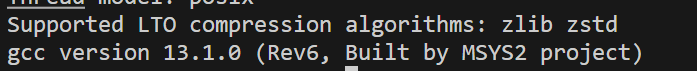

# C++ 虚表相关

> 知乎收藏了一大堆虚表相关的文章，这里统一整理进来。

参考链接：https://www.zhihu.com/question/389546003/answer/1194780618

# 一、回顾：如何用C语言模拟一个面向对象的类？

回顾一下C语言纯POD的结构体（struct）：

> POD是指Plain Old Data（普通旧数据）的缩写。具体来说，POD主要指的是那些不包含任何C++特有的复杂性（如虚函数、构造函数等）的数据类型或结构体。

C语言实现一个类似面向对象的类，可以这么写：

```c
#include<stdio.h>
typedef struct Hilichurl
{
    int name;
    int age;
    int weight;
    void (*desc)(struct Hilichurl*);
} Hilichurl;

//obj中各个字段的值不一定被初始化过，通常还会在类内定义一个类似构造函数的函数指针，这里简化
void profile(Hilichurl* obj)
{
    printf("Name: %d\n", obj->name);
    printf("Age: %d\n", obj->age);
    printf("Weight: %d\n", obj->weight);
}

int main()
{
    Hilichurl h;
    h.name = "Hilichurl1";
    h.age = 10;
    h.weight = 100;
    h.desc = profile;

    h.desc(&h); //类似于调用类函数
    return 0;
}
```

想达到面向对象中**数据和操作封装到一起**的效果，只能给struct里面添加函数指针，然后给函数指针赋值。但这样会带来很大的内存开销，因为此时每个实例化的对象中都会有一个8字节的函数指针（64位机器），如果是N个对象，每个对象有M个函数，这样会造成`N*M*8`字节的额外空间开销。

往往在C语言中不会在struct中定义函数指针，而是放在外面（方法二）：

```c
#include<stdio.h>
typedef struct Hilichurl
{
    int name;
    int age;
    int weight;
} Hilichurl;

//obj中各个字段的值不一定被初始化过，通常还会在类内定义一个类似构造函数的函数指针，这里简化
void desc(Hilichurl* obj)
{
    printf("Name: %d\n", obj->name);
    printf("Age: %d\n", obj->age);
    printf("Weight: %d\n", obj->weight);
}

int main()
{
    Hilichurl h;
    h.name = "Hilichurl1";
    h.age = 10;
    h.weight = 100;

    desc(&h); //直接调用函数指针
    return 0;
}
```

> Redis中AE相关的代码实现，便是如此。Redis暂时领域不太相关，先不管了。


## 1.对应的C++代码

如果在C++中实现上面的功能，代码我们比较熟了，如下：

```c++
#include <iostream>
using namespace std;

class Hilichurl
{
public:
    int name;
    int age;
    int weight;
    void desc()
    {
        cout << "Name: " << name << endl;
        cout << "Age: " << age << endl;
        cout << "Weight: " << weight << endl;
    }
};

int main()
{
    Hilichurl h;
    h.name = 1;
    h.age = 10;
    h.weight = 100;

    h.desc();
    return 0;
}
```

看起来，调用方式是`h.desc();`，那么实际上在C++中这相当于上面C语言版本的哪种实现方式呢？**其实相当于方法二**。C++编译器实际会帮你生成一个类似上例中C语言写法二的形式（这也算是C++ zero overhead指导方针的一个体现），但实际上C++由于支持重载，会存在命名崩坏（暂时不用细究了），但原理是差不多的。

**所以实际上，C++中对类的封装只是对程序员而言的，编译器编译后依然是面向过程的代码。编译器帮你给成员函数增加一个额外的类指针参数，运行期间传入对象实际的指针。**类的数据（[成员变量）](https://zhida.zhihu.com/search?content_id=247303351&content_type=Answer&match_order=1&q=成员变量）&zhida_source=entity)和操作（成员函数）其实还是分离的**。**

每个函数都有地址（指针），不管是全局函数还是成员函数在编译之后几乎类似。

==在类不含有虚函数的情况下，编译器在编译期间就会把函数的地址确定下来，运行期间直接去调用这个地址的函数即可。**这种函数调用方式也就是所谓的『静态绑定』（static binding）==。**

> 补充知识：在C++中，普通函数和类成员函数通常会放在内存的代码段（text segment）区域。代码段是存放程序执行代码的区域，通常是只读的，以防止程序在运行时意外修改其指令。
>
> 具体来说：
>
> - **普通函数**：这些函数的机器代码会被存储在代码段中。
> - **类成员函数**：这些函数也是以机器代码的形式存储在代码段中，尽管它们与类的实例相关联，但它们的实现仍然是独立于任何特定对象的。
>
> 总结来说，普通函数和类成员函数都位于内存的代码段区域。


:cat: 看下面的注意点

```C++
func非虚
C* pnull = NULL; // pnull的静态类型是它声明的类型C*,没有动态类型，因为它指向了NULL；
pnull->func();//不会报错！
```

 // notVir : C::func() 不用奇怪为什么空指针也可以调用函数，因为这在编译期就确定了，和指针空不空没关系；！！！！！！【注意点】


>:thinking: 可参考链接 **https://www.cnblogs.com/lizhenghn/p/3657717.html**
>

```C++
#define virtualMT
#define is_virtual

#ifdef virtualMT

#include <iostream>
using namespace std;

class A {
public:
#ifdef is_virtual
    virtual void func() { std::cout << "A::func()\n"; }
#else
    /*virtual*/ void func() { std::cout << "A::func()\n"; }
#endif // is_virtual
};

class B : public A {
public:
    void func() { std::cout << "B::func()\n"; }
};

class C : public A {
public:
    void func() { std::cout << "C::func()\n"; }
};

void test1() {
    // Test function 1
}

void test2() {
    // Test function 2
}

int main() {
    C* pc = new C(); // pc的静态类型是它声明的类型C*，动态类型也是C*；
    B* pb = new B(); // pb的静态类型和动态类型也都是B*；
    A* pa = pc;      // pa的静态类型是它声明的类型A*，动态类型是pa所指向的对象pc的类型C*；
    pa = pb;         // pa的动态类型可以更改，现在它的动态类型是B*，但其静态类型仍是声明时候的A*；
    C* pnull = NULL; // pnull的静态类型是它声明的类型C*,没有动态类型，因为它指向了NULL；
    
	//notVir表示当上面那个func不是虚函数的情况
    pa->func();      // notVir : A::func() pa的静态类型永远都是A*，不管其指向的是哪个子类，都是直接调用A::func()；
                     // isVir  : B::func() 因为有了virtual虚函数特性，pa的动态类型指向B*，因此先在B中查找，找到后直接调用；
    pc->func();      // C::func() pc的动、静态类型都是C*，因此调用C::func()；
    pnull->func();   // notVir : C::func() 不用奇怪为什么空指针也可以调用函数，因为这在编译期就确定了，和指针空不空没关系；！！！！！！【注意点】
                     // isVir  : 空指针异常，因为是func是virtual函数，因此对func的调用只能等到运行期才能确定，然后才发现pnull是空指针；
    return 0;
}

#endif
```


>>>- **`virtual` 关键字**：
>>>  - 在基类中必须使用 `virtual` 声明虚函数。
>>>  - 在子类中可以省略 `virtual`，但显式使用可以提高代码的可读性。
>>>- **`override` 关键字**：
>>>  - 在子类中可以省略 `override`，但建议使用以确保函数签名的正确性。
>>>  - 虽然不写也是OK的

# 二、虚函数的用法

虚函数的出现其实就是为了实现面向对象三个特性之一的『多态』（[polymorphism](https://zhida.zhihu.com/search?content_id=247303351&content_type=Answer&match_order=1&q=polymorphism&zhida_source=entity)）。来看一个例子：

```c++
#include<iostream>
#include<string>
using namespace std;

class Monster
{
public:
    Monster(string name, int id, int hp) : name(name), id(id), hp(hp) {}
    virtual void desc()
    {
        cout << "Name: " << name << endl;
        cout << "ID: " << id << endl;
        cout << "HP: " << hp << endl;
    }
    string name;
    int id;
    int hp;
};

class Hilichurl : public Monster
{
public:
    Hilichurl(string name, int id, int hp, int atk) : Monster(name, id, hp), atk(atk) {}
    void desc()
    {
        cout << "Name: " << name << endl;
        cout << "ID: " << id << endl;
        cout << "HP: " << hp << endl;
        cout << "ATK: " << atk << endl;
    }
    int atk;
};

int main()
{
    Monster m("Monster1", 1, 100);
    Hilichurl h("Hilichurl1", 2, 100, 10);

    m.desc();
    h.desc();
    return 0;
}
```

在main函数中，我们创建了一个父类的对象和一个子类的对象，并调用他们的desc函数，这个结果是显然的：父类调用父类的desc函数，子类调用子类重写的desc函数。现在我们把main函数改为：

```c++
Hilichurl h("Hilichurl1", 1, 100, 10);
Monster* m = &h; //父类指针指向子类对象
m->desc(); //调用子类的desc

Monster& m2 = h; //父类引用指向子类对象
m2.desc(); //调用子类的desc
```

此时用父类指针指向子类对象，最终调用desc函数的时候调用的是子类的。这个现象称之为『**动态绑定**』（dynamic binding）或者『**延迟绑定**』（lazy binding）。**如果把父类中的virtual关键字去掉，则这个代码最终将调用父类的函数desc，而非子类的desc。**

这是为什么呢？指针实际指向的还是子类对象的内存空间，可是为什么不能调用到子类的desc？这个就是前面提到的：**类的数据（成员变量）和操作（成员函数）其实是分离的**。仅从对象的内存布局来看，只能看到成员变量，看不到成员函数。因为调用哪个函数是编译期间就确定了的，编译期间只能识别父类的desc。**现在已经对多态有了一个基本的认知，那么多态在C++当中是如何实现的呢？**

## 1.虚表

具体如何实现C++的多态是由编译器厂商来决定的，但主流做法一般都使用虚表指针来做，而且应该也是现在实现多态的最常见做法。我们先给父类再添加一个虚函数，然后子类重写这个虚函数，代码修改为：

```c++
#include<iostream>
#include<string>
using namespace std;

class Monster
{
public:
    Monster(string name, int id, int hp) : name(name), id(id), hp(hp) {}
    virtual void desc()
    {
        cout << "Name: " << name << endl;
        cout << "ID: " << id << endl;
        cout << "HP: " << hp << endl;
    }

    virtual void attack()
    {
        cout<<"Monster attack!"<<endl;
    }
    string name;
    int id;
    int hp;
};

class Hilichurl : public Monster
{
public:
    Hilichurl(string name, int id, int hp, int atk) : Monster(name, id, hp), atk(atk) {}
    void desc()
    {
        cout << "Name: " << name << endl;
        cout << "ID: " << id << endl;
        cout << "HP: " << hp << endl;
        cout << "ATK: " << atk << endl;
    }

    void attack()
    {
        cout<<"Hilichurl attack!"<<endl;
    }

    int atk;
};

int main()
{
    Hilichurl h("Hilichurl1", 1, 100, 10);
    h.desc();
    Monster* m = &h; //父类指针指向子类对象
    m->desc(); //调用子类的desc

    Monster& m2 = h; //父类引用指向子类对象
    m2.desc(); //调用子类的desc
    return 0;
}
```

此时，main函数应该会打印Hilichurl的信息三次，因为不管是h，m还是m2调用到的都是子类（前面的知识点已经学过了）。

 

### （1）g++输出内存布局

首先来看一下g++的版本：

```shell
g++ -V  # gcc -V也可以
```



然后可以dump出来cpp文件的内存布局：

```shell
g++ -fdump-lang-class Cpp_PolyMorphism.cpp
```

搜索dump出来的文件（以.class结尾）中的内容，可以看到下面的关键信息：

```cpp
Vtable for Monster
Monster::_ZTV7Monster: 4 entries
0     (int (*)(...))0
8     (int (*)(...))(& _ZTI7Monster)
16    (int (*)(...))Monster::desc
24    (int (*)(...))Monster::attack
    
Vtable for Hilichurl
Hilichurl::_ZTV9Hilichurl: 4 entries
0     (int (*)(...))0
8     (int (*)(...))(& _ZTI9Hilichurl)
16    (int (*)(...))Hilichurl::desc
24    (int (*)(...))Hilichurl::attack

Class Monster
   size=48 align=8
   base size=48 base align=8
Monster (0x0x6695f60) 0
    vptr=((& Monster::_ZTV7Monster) + 16)

Class Hilichurl
   size=56 align=8
   base size=52 base align=8
Hilichurl (0x0x669b3a8) 0
    vptr=((& Hilichurl::_ZTV9Hilichurl) + 16)
Monster (0x0x66e56c0) 0
      primary-for Hilichurl (0x0x669b3a8)
```

以下是GPT-4o的解释（下面的章节有额外的解释）：

> ### 1. **Vtable（虚拟表）** 的解释
>
> C++ 中使用虚函数时，为了支持多态性，编译器为每个类生成一个虚表（vtable），该表包含了指向虚函数的指针。虚表在每个类的对象中存储了指向函数的指针，这样在运行时可以根据对象的实际类型来调用对应的函数。
>
> #### `Vtable for Monster`:
>
> ```
> Vtable for Monster
> Monster::_ZTV7Monster: 4 entries
> 0     (int (*)(...))0
> 8     (int (*)(...))(& _ZTI7Monster)
> 16    (int (*)(...))Monster::desc
> 24    (int (*)(...))Monster::attack
> ```
>
> - `Monster::_ZTV7Monster`：这是 `Monster` 类的虚拟表。
> - 4 entries：这个虚拟表有 4 个条目，表示该类有 4 个虚函数。
>   - 第 1 个条目是 `0`，通常表示指向虚继承或空的指针，`Monster` 类并没有虚继承或需要其他特殊处理的虚函数。
>   - 第 2 个条目 `(& _ZTI7Monster)` 是指向类型信息（`type_info`）的指针，用于运行时类型识别（RTTI）。
>   - 第 3 个条目是 `Monster::desc`，指向 `Monster` 类的 `desc` 函数（虚函数）。
>   - 第 4 个条目是 `Monster::attack`，指向 `Monster` 类的 `attack` 函数（虚函数）。
>
> #### `Vtable for Hilichurl`:
>
> ```
> Vtable for Hilichurl
> Hilichurl::_ZTV9Hilichurl: 4 entries
> 0     (int (*)(...))0
> 8     (int (*)(...))(& _ZTI9Hilichurl)
> 16    (int (*)(...))Hilichurl::desc
> 24    (int (*)(...))Hilichurl::attack
> ```
>
> - `Hilichurl::_ZTV9Hilichurl` 是 `Hilichurl` 类的虚拟表。
> - 与Monster类类似，Hilichurl类也有 4 个条目。
>   - 这其中 `Hilichurl::desc` 和 `Hilichurl::attack` 分别是 `Hilichurl` 类重写的虚函数。
>   - 和 `Monster` 一样，前两条记录与类型信息和虚继承相关。
>
> ### 2. **类的内存布局**
>
> #### `Class Monster`:
>
> ```
> Class Monster
>    size=48 align=8
>    base size=48 base align=8
> Monster (0x0x6695f60) 0
>     vptr=((& Monster::_ZTV7Monster) + 16)
> ```
>
> - `size=48`：`Monster` 类的对象大小是 48 字节。
> - `align=8`：类对象的对齐要求是 8 字节。
> - `base size=48`：`Monster` 类的基础部分大小为 48 字节，说明它的成员（如 `name`、`id` 和 `hp`）加上虚函数表指针的总大小为 48 字节。
> - `vptr=((& Monster::_ZTV7Monster) + 16)`：虚函数表指针（vptr）指向 `Monster::_ZTV7Monster` 表的地址，偏移量是 16 字节。这意味着虚函数表指针的位置是在 `Monster` 类对象的内存布局中的某个地方。
>
> #### `Class Hilichurl`:
>
> ```
> Class Hilichurl
>    size=56 align=8
>    base size=52 base align=8
> Hilichurl (0x0x669b3a8) 0
>     vptr=((& Hilichurl::_ZTV9Hilichurl) + 16)
> Monster (0x0x66e56c0) 0
>       primary-for Hilichurl (0x0x669b3a8)
> ```
>
> - `size=56`：`Hilichurl` 类对象的大小是 56 字节，比 `Monster` 类大。
> - `base size=52`：`Hilichurl` 类的基础部分（继承自 `Monster`）占用 52 字节。
>   - **看起来Monster占用48字节，为什么Hilichurl占用52字节呢**？应该是因为子类有自己的对象，引发编译器做内存对齐的时候会有所更新，但应该不是本节虚表相关的重点内容。
> - `vptr=((& Hilichurl::_ZTV9Hilichurl) + 16)`：`Hilichurl` 类对象的虚函数表指针指向 `Hilichurl::_ZTV9Hilichurl` 表，偏移量同样是 16 字节。
>
> `Hilichurl` 类相对于 `Monster` 类多了一个成员变量 `atk`，所以它的大小比 `Monster` 多了 8 字节。
>
> #### `primary-for Hilichurl`:
>
> ```
> primary-for Hilichurl (0x0x669b3a8)
> ```
>
> 这表明 `Hilichurl` 类继承自 `Monster`，并且在内存中存储 `Hilichurl` 对象时，父类 `Monster` 对象的内存会嵌套在其中（==此处存疑==）。
>
> ### 3. **总结**
>
> - `vtable` 机制支持了运行时的多态性，通过虚函数表来实现。
> - `Monster` 类和 `Hilichurl` 类的虚函数表指针分别指向对应类的虚拟表。
> - `Monster` 类的对象大小为 48 字节，`Hilichurl` 类的对象大小为 56 字节，多出来的 8 字节是因为 `Hilichurl` 类新增了成员变量 `atk`。
> - 在继承体系中，`Hilichurl` 类会包含一个指向父类 `Monster` 的虚函数表指针。

继续上文的知识介绍，**也就是说在含有虚函数的类编译期间，编译器会自动给这种类在起始位置追加一个虚表指针**，（称之为：vptr）。**vptr指向一个虚表（称之为：vtable 或 vtbl）**，虚表中存储了实际的函数地址。

vptr指向的并不是虚表的表头，而是直接指向的虚函数的位置，看上面dump出来的结果，vptr指向的是Hilichurl的vtable + 16个字节的位置，也就是虚表的地址。


## 2.虚表位置——从内存的角度

这一部分参考：[C++虚函数表的位置——从内存的角度 - 知乎](https://zhuanlan.zhihu.com/p/563418849)，以下整理关键内容，辅助理解。C++部分的面经还是要多动手实操一下，顺便巩固一下代码能力。

首先明确一点，C++的一个设计思想就是**零成本抽象**。来看下面这个例子：

```c++
#include <iostream>
using namespace std;

class Monster
{
public:
    int hp;
};

int main()
{
    cout << sizeof(Monster) << endl;  //4
    Monster m;
    int* p = (int*)&m;
    *p = 23333;
    cout << m.hp << endl; //23333
    return 0;
}
```

其实，**类这个概念只存在于编译时期**，我们来看一下上述代码汇编的结果（查看汇编结果的网站：[Compiler Explorer](https://godbolt.org/)）：


让GPT帮忙解释一下这段汇编：

```c++
main:
        push    rbp
        mov     rbp, rsp
        lea     rax, [rbp-12]
        mov     QWORD PTR [rbp-8], rax
        mov     rax, QWORD PTR [rbp-8]
        mov     DWORD PTR [rax], 23333
        mov     eax, 0
        pop     rbp
        ret
```

> 这段汇编代码属于 x86-64 架构，是一个简单的函数体的实现。在这里，我们逐行分析这段汇编代码，了解它在做什么。
>
> ### 逐行解释：
>
> 1. **`push rbp`**：
>    - 将当前的基指针（`rbp`）压入栈中。这是为了保存之前的基指针值，以便在函数返回时能够恢复。基指针通常用于访问函数的局部变量和参数。
> 2. **`mov rbp, rsp`**： //语法：move dest：src
>    - 将当前的栈指针（`rsp`）移动到基指针（`rbp`）。这标志着新的栈帧的开始，`rbp` 现在指向当前栈帧的底部。
> 3. **`lea rax, [rbp-12]`**：
>    - 使用 `lea` (load effective address) 指令，将 `rbp - 12` 的地址加载到寄存器 `rax` 中。这是在为局部变量分配空间。此时，`rbp - 12` 是一个有效地址，表示相对于基指针 `rbp` 向下偏移 12 字节的位置。
> 4. **`mov QWORD PTR [rbp-8], rax`**：
>    - 将 `rax` 中的值（即局部变量的地址）存储到栈帧中的位置 `[rbp-8]`。这里 `rbp - 8` 可能是在分配另一个局部变量的空间，或是作为一个指针来存储之前计算的地址。
> 5. **`mov rax, QWORD PTR [rbp-8]`**：
>    - 从 `[rbp-8]` 中读取值并将其存储回 `rax`。此时，`rax` 中包含了之前存储的地址（`rbp - 12`）。
> 6. **`mov DWORD PTR [rax], 23333`**：
>    - 将值 `23333` 存储到 `rax` 所指向的内存地址中，即 `rbp - 12` 的位置。这实际上是在为先前分配的局部变量赋值。
> 7. **`mov eax, 0`**：
>    - 将 `0` 移动到 `eax` 寄存器中。一般来说，这表示函数的返回值；在 C++ 等语言中，返回值为 `0` 通常表示成功。
> 8. **`pop rbp`**：
>    - 从栈中弹出之前保存的基指针值，恢复原来的基指针。这个操作结束了当前函数的栈帧。
> 9. **`ret`**：
>    - 返回到调用该函数的地方。此时，返回值已经被设置为 `0`。
>
> ### 总结：
>
> 这段汇编代码实现了一个简单的函数，主要做了以下几件事情：
>
> - 保存当前的基指针。
> - 为局部变量分配空间，具体是将某个地址（相对 `rbp` 的位置）赋值给一个指针。
> - 在指定的内存位置写入值 `23333`。
> - 函数返回一个值 `0`。
>
> 整体来看，这段代码的作用是初始化一个局部变量（假设为整型），并将其赋值为 `23333`，然后正常返回。

看着有点抽象，但至少从编译后的汇编指令可以看出这代码跟类其实并没有什么关系。**最直观的感受，类只是编译前写给人看的。**可以试一下把上面代码类中的`public`改为`private`，一样是可以访问的，汇编代码不变，也一样可以修改到值。此时代码如下：
```c++
#include <iostream>
using namespace std;

class Monster
{
private:
    int hp;
public:
    void printHp(){cout<<hp<<endl;}
};

int main()
{
    cout << sizeof(Monster) << endl; //4
    Monster m;
    int* p = (int*)&m;
    *p = 114514;
    m.printHp(); //114514
    return 0;
}
```

通过`sizeof(Monster)=4`也可以发现，**函数是不占有空间的**。


在前面一节我们已经学习了虚表的基本概念。先写一个继承+sizeof的例子：

```c++
#include <iostream>
#include <string>
using namespace std;

class Monster
{
public:
    int hp;
    void printHp(){cout<<hp<<endl;}
};

class Hilichurl: public Monster
{
public:
    int id;
};

int main()
{
    cout << sizeof(Monster) << endl;  //4
    cout << sizeof(Hilichurl) << endl; //8
    return 0;
}
```

此时来看一下Monster和Hilichurl类中printHp函数的地址：

```c++
printf("%p\n", &Monster::printHp); //000000000061fdf0
printf("%p\n", &Hilichurl::printHp); //000000000061fdf0
```

可以看到，在没有虚函数的情况下，这两个类的printHp函数所在的地址是一致的。接下来我们来看虚函数。


先扩充一下Monster类，加入一个attack的虚函数和一个beHurt虚函数，以及加一个id字段，子类中加一个common_id字段（只是为了演示）：

```c++
class Monster
{
public:
    int hp;
    int id;
    void printHp(){cout<<hp<<endl;}
    virtual void attack() {cout<<"Monster is attacking!"<<endl;}
    virtual void beHurt() {cout<<"Monster Be hurt!"<<endl;}
};

class Hilichurl: public Monster
{
public:
    int common_id; 
};
```

此时调用`sizeof(Monster)`，发现结果为16，而`sizeof(Hilichurl)`的结果为24。

- 这个可以从类的内存布局来看，在我的机器上`sizeof(int)=4,sizeof(int*)=8(64位机器)`，由内存对齐的知识：Monster=虚表指针（8）+hp（4）+id（4），内存对齐后的结果为16。而对子类Hilichurl来说，新增common_id字段，同时他自己也有一个虚表指针，因此内存对齐后的结果为16+4+4（padding）=24。

现在先聚焦于基类`Monster`，能不能找到其虚函数表，并且直接用指针来调用两个虚函数呢？答案是肯定的，看下面的代码：

```c++
typedef long long u64;  //我的机器上sizeof(long long)=8
typedef void(*func)(); //定义func是函数指针,指向形参为空,返回值为void的函数,sizeof(func)=8
```

然后就可以在main函数里这样写：
```c++
#include <iostream>
#include <string>
using namespace std;

typedef long long u64;  //我的机器上sizeof(long long)=8
typedef void(*func)(); //定义func是函数指针,指向形参为空,返回值为void的函数,sizeof(func)=8

class Monster
{
public:
    int hp;
    int id;
    void printHp(){cout<<hp<<endl;}
    virtual void attack() {cout<<"Monster is attacking!"<<endl;}
    virtual void beHurt() {cout<<"Be hurt!"<<endl;}
};

class Hilichurl: public Monster
{
public:
    int common_id;
};

int main()
{
    Monster m;
    u64* p =(u64*)&m; //p指向了对象m
    u64* arr = (u64*)*p; //arr 指向了虚函数表
    func fa = (func)arr[0];
    func fb = (func)arr[1];
    fa(); fb(); 
    return 0;
}
```

运行可以看到，顺利输出了两个虚函数的调用结果。那么，看一下同一个类的不同对象的虚函数表位置：

```c++
int main()
{
    Monster m1;
    u64* p1 =(u64*)&m1;
    u64* arr1 = (u64*)*p1; //arr1 指向了虚函数表
    
    Monster m2;
    u64* p2 =(u64*)&m2;
    u64* arr2 = (u64*)*p2; //arr1 指向了虚函数表
    cout<<arr1 <<" "<<arr2<<endl;  //0x404510 0x404510
    return 0;
} 
```

通过输出也可以看到，**同一虚类的不同对象，他们的虚函数表所在的位置是一样的。当然，同一虚类的不同对象的虚表指针的地址是不一样的。**


现在再上一点强度，我们来让子类Hilichurl重写一下父类的虚函数：

```c++
class Hilichurl: public Monster
{
public:
    int common_id;
    virtual void attack() {cout<<"Hilichurl is attacking!"<<endl;}
    virtual void beHurt() {cout<<"Hilichurl be hurt!"<<endl;}
};
```

此时修改一下main函数，测试一下子类：

```c++
int main()
{
    Hilichurl h1;
    u64* p1 =(u64*)&h1;
    u64* arr1 = (u64*)*p1; //arr1 指向了虚函数表
    func fa = (func)arr1[0];
    func fb = (func)arr1[1];
    fa();  fb(); //Hilichurl is attacking! Hilichurl be hurt!
}
```

经过测试，调用的会是子类的函数，说明子类有自己的虚函数表。如果我们把子类重写父类的beHurt函数注释掉（假装我们没重写），则调用结果为：

```c++
Hilichurl is attacking!
Monster Be hurt!
```

不妨来看一下父类和子类的虚函数表中存储的函数地址（在上述注释调beHurt函数的情况下）：

```c++
int main()
{
    Hilichurl h;
    Monster m;
    u64* pson =(u64*)&h;
    u64* pparent = (u64*)&m; 
    //虚函数表中应该都有两个函数条目
    u64* arrson = (u64*)*pson;
    u64* arrparent = (u64*)*pparent;
    for (int i = 0; i < 2; i++) 
    {
        cout << hex << arrson[i] << " " << arrparent[i] << endl;
    }
}
```

输出的结果为：
```c++
402e50 402d90
402dd0 402dd0
```

此时可以看到，对于第一个函数attack来说，子类重写了这个函数，因此父类和子类的虚表中存储的不一样。而对于第二个函数beHurt而言，如果子类并没有重写这个函数，那么父类和子类虚表中记录的函数指针地址则是一样的。


对于指针，父类指针指向子类对象的时候会运行多态，这也是类似的。更多内容可以继续看这篇：[C++虚函数表的位置——从内存的角度 - 知乎](https://zhuanlan.zhihu.com/p/563418849)，暂时了解到这里应该就够了，后面有需要再陆续补充。我们可以整个活，手动搞掉C++的多态：

```c++
int main()
{
    Monster *m = new Monster();
    Monster *h = new Hilichurl();
    
    //正常h肯定是调用父类的版本,m由于多态会调用子类的版本
    m->attack(); //Monster is attacking!
    h->attack(); //Hilichurl is attacking!

    //咱们来改一下虚函数表的内容(不好通过代码直接改虚表指针指向,就来改虚表内容)
    u64* m_vp = (u64*)m;
    u64* h_vp = (u64*)h;
    
    //black magic c++
    u64 tmp = *h_vp; //虚表内容交换
    *h_vp = *m_vp;
    *m_vp = tmp;
    m->attack(); //Hilichurl is attacking!
    h->attack(); //Monster is attacking!
}
```

没错，这就是C++的自由度！


# 三、与虚函数有关的面经合集（游戏开发）

> 有一些其他的题目里面也会提到虚函数的问题，但这里只整理关于虚函数本身的高频考点。相信这些题目理解了之后，对于虚函数的概念就会掌握的不错了。


## 1.什么是多态？C++的多态是如何实现的？

答：所谓多态，就是同一个函数名具有多种状态，或者说一个接口具有不同的行为；C++的多态分为编译时多态和运行时多态，编译时多态也称为为[静态联编](https://zhida.zhihu.com/search?content_id=180938976&content_type=Article&match_order=1&q=静态联编&zhida_source=entity)，通过重载和模板来实现，运行时多态称为动态联编，通过继承和虚函数来实现。

C++ 中的多态是指在不同上下文中以不同方式表现的能力，主要分为两种类型：

- **编译时多态（静态多态）**：在编译器即可确定调用哪个函数，包括运算符重载、函数**重载**和**模板**；
- **运行时多态（动态多态）**：使用虚函数来实现。接下来回答就可以往虚函数上引了。（**重写**）


## 2.虚函数的实现机制是什么？

【参考资料】:《游戏引擎架构》P115、 https://zhuanlan.zhihu.com/p/98776075（其实前面的链接也都有，不一定要看这个）

答：虚函数是通过[虚函数表](https://zhida.zhihu.com/search?content_id=180938976&content_type=Article&match_order=1&q=虚函数表&zhida_source=entity)来实现的，虚函数表包含了一个类(所有)的虚函数的地址，在有虚函数的类对象中，它内存空间的头部会有一个虚函数表指针(虚表指针)，用来管理虚函数表。当子类对象对父类虚函数进行重写的时候，虚函数表的相应虚函数地址会发生改变，改写成这个虚函数的地址，当我们用一个父类的指针来操作子类对象的时候，它可以指明实际所调用的函数。


## 3.虚函数调用是在编译时确定还是运行时确定的？如何确定调用哪个函数？ :cat:

答：运行时确定，通过查找虚函数表中的函数地址确定。

更正：此处说法不严谨，应该是只有通过指针或者引用的方式调用虚函数是运行时确定，通过值调用的虚函数是编译期就可以确定的，参考这篇文章，[虚函数一定是运行期才绑定么？ - 知乎 (zhihu.com)](https://www.zhihu.com/question/491602524/answer/2165605549)

> 在面试的时候，可以回答一般是运行期确定的，但现在编译器做的优化都不错了，可能会编译器就确定下来。上面这个链接也值得看一看。

实际上C++98时代，应该是只有通过指针或者引用的方式调用虚函数是运行时确定，通过值调用的虚函数是编译期就可以确定的。但在C++ 11中，引入了`final`关键字，可以**对虚函数的多态性具有向下阻断作用。经 final 修饰的虚函数或经 final 修饰的类的所有虚函数，自该级起，不再具有多态性。此时对于`final`修饰的类或函数而言，用指针也可能编译器确定下来了。**


## 4.虚函数是存在类中还是类对象中（即是否共享虚表）？

答：存在类中，不同的类对象共享一张虚函数表(为了节省内存空间)。


## 5.**在(基类的)构造函数和析构函数中调用虚函数会怎么样**？

【参考资料】：《[Effective C++](https://zhida.zhihu.com/search?content_id=180938976&content_type=Article&match_order=1&q=Effective+C%2B%2B&zhida_source=entity)》条款9、[https://www.cnblogs.com/sylar5/p/11](https://link.zhihu.com/?target=https%3A//www.cnblogs.com/sylar5/p/11523992.html)

这里先给出结论，然后我们再代码实操一下。

答：从语法上讲，调用没有问题，但是从效果上看，往往不能达到需要的目的（**不能实现多态**）；因为调用构造函数的时候，是先进行父类成分的构造，再进行子类的构造。**在父类构造期间，子类的特有成分还没有被初始化，此时下降到调用子类的虚函数，使用这些尚未初始化的数据一定会出错；**同理，调用析构函数的时候，先对子类的成分进行析构，当进入父类的析构函数的时候，子类的特有成分已经销毁，此时是无法再调用虚函数实现多态的。

> 分析一下《Effective C++》的条款9：（以下来自：[一篇文章学完 Effective C++：条款 & 实践 | 缪之灵](https://www.illurin.com/articles/effective-cpp/)）
>
> 在创建派生类对象时，**基类的构造函数永远会早于派生类的构造函数被调用，而基类的析构函数永远会晚于派生类的析构函数被调用。**
>
> **在派生类对象的基类构造和析构期间，对象的类型是基类而非派生类，因此此时调用虚函数会被编译器解析至基类的虚函数版本，通常不会得到我们想要的结果。**
>
> 间接调用虚函数是一个比较难以发现的危险行为，需要尽量避免：
>
> ```c++
> class Transaction {
> public:
>     Transaction() { Init(); }
>     virtual void LogTransaction() const = 0;
> 
> private:
>     void Init(){
>         ...
>         LogTransaction();      // 此处间接调用了虚函数！
>     }
> };
> ```
>
> 如果想要基类在构造时就得知派生类的构造信息，推荐的做法是在派生类的构造函数中将必要的信息向上传递给基类的构造函数（这个时候就**没有使用虚函数了**）：
>
> ```c++
> class Transaction {
> public:
>     explicit Transaction(const std::string& logInfo);
>     void LogTransaction(const std::string& logInfo) const;
>     ...
> };
> 
> Transaction::Transaction(const std::string& logInfo) {
>     LogTransaction(logInfo);                           // 更改为了非虚函数调用
> }
> 
> class BuyTransaction : public Transaction {
> public:
>     BuyTransaction(...)
>         : Transaction(CreateLogString(...)) { ... }    // 将信息传递给基类构造函数
>     ...
> 
> private:
>     static std::string CreateLogString(...);
> }
> ```
>
> 注意此处的`CreateLogString`是一个静态成员函数，这是很重要的，因为静态成员函数可以确保不会使用未完成初始化的成员变量。


>在C++中，**基类的构造函数和析构函数中调用虚函数时，无法实现多态行为，实际调用的是当前类（基类）的虚函数版本**，而非派生类的重写版本。以下是具体分析和代码示例：
>
>---
>
>### 核心原理
>1. **构造函数调用虚函数**  
>   - 当构造基类时，派生类部分尚未初始化。此时虚函数表（vtable）指向基类的虚函数实现。因此，调用虚函数会直接执行基类的版本，而非派生类的重写版本。
>
>2. **析构函数调用虚函数**  
>   - 当析构基类时，派生类部分已经被销毁。此时虚函数表已恢复为基类的版本。因此，调用虚函数同样会执行基类的实现。
>
>---
>
>### 代码示例
>```cpp
>#include <iostream>
>using namespace std;
>
>class Base {
>public:
>    Base() {
>        cout << "Base构造函数" << endl;
>        callVirtual();  // 构造函数中调用虚函数
>    }
>    virtual ~Base() {
>        cout << "Base析构函数" << endl;
>        callVirtual();  // 析构函数中调用虚函数
>    }
>    virtual void callVirtual() {
>        cout << "Base::callVirtual()" << endl;
>    }
>};
>
>class Derived : public Base {
>public:
>    Derived() { cout << "Derived构造函数" << endl; }
>    ~Derived() override { cout << "Derived析构函数" << endl; }
>    void callVirtual() override {
>        cout << "Derived::callVirtual()" << endl;
>    }
>};
>
>int main() {
>    Base* obj = new Derived();
>    delete obj;
>    return 0;
>}
>```
>
>**输出结果**：
>```
>Base构造函数
>Base::callVirtual()    ← 构造函数调用基类虚函数
>Derived构造函数
>Derived析构函数       ← 派生类析构先执行
>Base析构函数
>Base::callVirtual()    ← 析构函数调用基类虚函数
>```
>
>---
>
>### 关键结论
>- **构造函数和析构函数中调用虚函数是合法的语法**，但**无法触发多态**，实际调用的是当前类的版本。
>- **设计建议**：避免在构造/析构函数中调用虚函数。若需实现类似功能，可通过传递参数或使用模板方法模式替代。
>
>---
>
>### 参考资料
> 虚函数表在构造函数阶段绑定到基类版本。  
> 析构时虚表已恢复为基类状态。  
> 构造/析构阶段不启用动态联编（多态）。

## 6.子类的构造函数中能调用虚函数么？

- 在子类构造函数中调用虚函数是安全的，并且会调用子类的实现。
  - 当你在子类的构造函数中调用虚函数时，由于子类的构造函数正在执行，因此虚函数表指针会指向子类的虚函数表。因此，调用的将是子类中重写的虚函数版本。
- **注意，在基类的构造函数中调用虚函数将不会调用派生类的实现，因为在那个时刻，派生类还没有完全构造完成。这个特性需要特别关注，以避免设计上的错误。**


## 7.内联函数可以是虚函数么？

**内联虚函数的特性**

- **可以定义为内联虚函数**：你可以将一个虚函数声明为内联函数。但需要注意的是，内联的效果并不一定会发生，尤其是在涉及到虚函数时。
- **编译器的决策**：由于虚函数的性质，编译器通常无法在编译时确定哪个具体的函数实现会被调用。这意味着，即使你标记了虚函数为 `inline`，编译器可能仍然会选择不进行内联，因为它不能保证在编译期间就知道最终要调用哪个函数。

- **一般实践**：在设计中，虚函数通常不用于内联，因为内联的优势在于消除函数调用开销，而虚函数则主要关注运行时的多态性。在大多数情况下，内联和虚拟化的使用不应混淆，以免影响代码的可读性和维护性。

以下的代码并不会报错，证明内联函数可以是虚函数，就是可能起不到什么优化作用：

```c++
#include <iostream>

class Base {
public:
    virtual inline void show() { // 内联虚函数
        std::cout << "Base class show function." << std::endl;
    }
};

class Derived : public Base {
public:
    virtual inline void show() override { // 内联虚函数
        std::cout << "Derived class show function." << std::endl;
    }
};

int main() {
    Base* b = new Derived();
    b->show(); // 调用的是 Derived 的 show 函数

    delete b;
    return 0;
}
```


## 8.析构函数可以是虚函数么？&虚析构函数 :cat:

最好把基类的析构函数定义为虚函数。

（1）**析构函数定义为虚函数时**：基类指针可以指向派生类的对象（多态性），如果删除该指针delete []p；就会调用该指针指向的派生类析构函数，而派生类的析构函数又自动调用基类的析构函数，这样整个派生类的对象完全被释放。

（2）析构函数不定义为虚函数时：编译器实施静态绑定，在删除基类指针时，只会调用基类的析构函数而不调用派生类析构函数，这样就会造成派生类对象析构不完全。

来举个例子：

```c++
#include <iostream>
using namespace std;
class Base
{
public:
    Base(){cout<<"base constructor"<<endl;}
    virtual ~Base(){cout<<"base deconstructor"<<endl;}
};

class Derived: public Base
{
public:
    Derived(){cout<<"derived constructor"<<endl;}
    ~Derived(){cout<<"derived deconstructor"<<endl;}
};

int main()
{
    Base *p = new Derived();
    delete p;
    return 0;
}
```


### 基类析构函数如果不是虚函数，会怎样？为什么？

>在 C++ 中，**基类析构函数如果不是虚函数，会导致通过基类指针删除派生类对象时，派生类的析构函数不会被调用**。这是由 C++ 的静态绑定机制和对象销毁规则决定的。以下是详细解释：
>
>---
>
>### 1. 静态绑定与动态绑定的区别
>- **静态绑定**：根据指针/引用的**静态类型**（声明时的类型）决定调用哪个函数。
>- **动态绑定**：根据指针/引用的**动态类型**（实际指向的对象类型）决定调用哪个函数，需通过 `virtual` 关键字启用。
>
>#### 示例代码行为：
>```cpp
>Base* p = new Derived();
>delete p; // 若 ~Base() 非虚，静态绑定到 Base 的析构函数
>```
>
>---
>
>### 2. 析构函数的调用规则
>当通过基类指针删除派生类对象时：
>1. **基类析构函数非虚**：
>   - 编译器根据指针的**静态类型**（`Base*`）直接调用 `Base::~Base()`。
>   - **派生类的析构函数不会被调用**，因为它不在虚函数表中。
>   - 导致派生类独有的资源（如动态内存、文件句柄）泄漏。
>
>2. **基类析构函数为虚**：
>   - 通过虚函数表找到派生类的析构函数 `Derived::~Derived()`。
>   - 执行 `Derived::~Derived()`，然后**自动调用基类析构函数** `Base::~Base()`（析构顺序与构造相反）。
>
>---
>
>### 3. 底层原理：虚函数表（vtable）
>- **虚析构函数的作用**：
>  - 析构函数被声明为虚函数时，编译器会为类生成**虚函数表**（vtable）。
>  - 虚函数表中会存储指向派生类析构函数的指针。
>  - 对象销毁时，通过虚函数表找到实际应调用的析构函数。
>
>- **非虚析构函数的行为**：
>  - 析构函数地址在编译期确定（静态绑定）。
>  - 直接调用基类的析构函数，不查询虚函数表。
>
>---
>
>### 4. 示例验证
>#### 基类析构函数**非虚**时的行为：
>```cpp
>#include <iostream>
>using namespace std;
>
>class Base {
>public:
>    Base() { cout << "Base constructor" << endl; }
>    ~Base() { cout << "Base destructor" << endl; } // 非虚析构函数！
>};
>
>class Derived : public Base {
>public:
>    Derived() { cout << "Derived constructor" << endl; }
>    ~Derived() { cout << "Derived destructor" << endl; } // 不会调用！
>};
>
>int main() {
>    Base* p = new Derived();
>    delete p; // 仅调用 Base::~Base()
>    return 0;
>}
>```
>
>**输出**：
>```
>Base constructor
>Derived constructor
>Base destructor    // Derived 的析构函数未被调用！ // ← 派生类析构未被调用！
>```
>
>#### 基类析构函数**为虚**时的行为：
>```cpp
>class Base {
>public:
>    virtual ~Base() { cout << "Base destructor" << endl; } // 虚析构函数
>};
>
>// Derived 类定义不变
>
>int main() {
>    Base* p = new Derived();
>    delete p; // 调用顺序：Derived::~Derived() → Base::~Base()
>}
>```
>
>**输出**：
>
>```
>Base constructor
>Derived constructor
>Derived destructor  // 正确调用派生类析构函数！← 先调用派生类析构
>Base destructor							 //← 再调用基类析构
>```
>
>---
>
>### 5. 关键结论
>- **必须为基类声明虚析构函数**：  
>  如果类可能被继承（作为基类），必须将其析构函数声明为虚函数，否则通过基类指针删除派生类对象时，会导致派生类析构函数未调用，引发资源泄漏。
>
>- **析构顺序**：  
>  派生类析构函数执行后，编译器**自动调用基类析构函数**，无需手动调用。
>
>- **虚析构函数与多态性**：  
>  虚析构函数是 C++ 多态性的重要应用，确保对象销毁时能正确清理资源。

## 9.构造函数/静态函数可以是虚函数么？

> 构造函数不能是虚函数。而且，在构造函数中调用虚函数，实际执行的是父类的对应函数，因为自己还没有构造好, 多态是体现不出来的。
>
> - 从vptr角度解释：
>   - 虚函数的调用是通过虚函数表来查找的，而虚函数表由类的实例化对象的vptr指针(vptr可以参考C++的虚函数表指针vptr)指向，该指针存放在对象的内部空间中，需要调用构造函数完成初始化。如果构造函数是虚函数，那么调用构造函数就需要去找vptr，但此时vptr还没有初始化！
> - 从多态角度解释
>   - 虚函数主要是实现多态，在运行时才可以明确调用对象，根据传入的对象类型来调用函数，例如通过父类的指针或者引用来调用它的时候可以变成调用子类的那个成员函数。而构造函数是在创建对象时自己主动调用的，不可能通过父类的指针或者引用去调用。那使用虚函数也没有实际意义。
>   - 在调用构造函数时还不能确定对象的真实类型（由于子类会调父类的构造函数）；并且构造函数的作用是提供初始化，在对象生命期仅仅运行一次，不是对象的动态行为，没有必要成为虚函数。
>
> 静态的对象是属于整个类的，不对某一个对象而言，同时其函数的指针存放也不同于一般的成员函数，其无法成为一个对象的虚函数的指针以实现由此带来的动态机制。


>在 C++ 中，**静态成员函数（`static` 成员函数）不能是虚函数**。这是由 C++ 的语法规则和虚函数的设计机制共同决定的，以下是详细解释：
>
>---
>
>### 1. **静态函数与虚函数的根本区别**
>- **静态函数**：
>  - 属于**类本身**，而非类的对象。
>  - 没有 `this` 指针，无法访问类的非静态成员变量或方法。
>  - 调用方式为 `ClassName::StaticFunction()`，与对象无关。
>
>- **虚函数**：
>  - 依赖对象的**动态类型**（实际指向的类型）。
>  - 通过虚函数表（vtable）实现动态绑定，需要 `this` 指针来访问对象的虚函数表。
>  - 必须通过对象实例调用（如 `obj->VirtualFunction()`）。
>
>---
>
>### 2. **为什么静态函数不能是虚函数？**
>- **语义矛盾**：
>  - 虚函数的多态性依赖于对象的动态类型，而静态函数与对象无关。如果将静态函数声明为虚函数，会导致语义矛盾。
>
>- **技术限制**：
>  - 虚函数需要通过对象的虚函数表（vtable）查找实现，但静态函数没有 `this` 指针，无法访问对象的虚函数表。
>  - 编译器直接报错。例如：
>    ```cpp
>    class MyClass {
>    public:
>        static virtual void func() {} // 错误：静态成员函数不能是虚函数
>    };
>    ```
>
>---
>
>### 3. **示例验证**
>```cpp
>#include <iostream>
>using namespace std;
>
>class Base {
>public:
>    // 尝试声明静态虚函数（非法）
>    static virtual void print() {  // 编译错误：static member cannot be 'virtual'
>        cout << "Base::print" << endl;
>    }
>};
>
>int main() {
>    Base::print();
>    return 0;
>}
>```
>
>**编译器报错**：
>```
>error: member 'print' cannot be declared both 'virtual' and 'static'
>rror C2216: “virtual”不能和“static”一起使用
>```
>
>
>
>### 5. **总结**
>- **静态函数不能是虚函数**：这是 C++ 的语法规则和虚函数机制的直接限制。
>- **虚函数必须依赖对象实例**：虚函数的多态性通过对象的虚函数表实现，而静态函数与对象无关。
>- **替代方案**：若需通过类名调用多态方法，需结合工厂模式或其他设计模式实现。

# 四、知乎收藏夹中的与虚函数有关的内容

以下的文章是知乎收藏夹中有关的内容，有一些有看，基本内容应该都差不多。


# dynamic_cast相关补充

问题：C++运行时会检查对象的实际类型是否与目标类型兼容，这是是如何检查的呢，他怎么知道是不是有继承关系？具体细节是什么

deepseek回答：未校准

`dynamic_cast` 的运行时类型检查机制依赖于 **虚函数表（vtable）中的类型信息（RTTI）** 和 **继承关系图的遍历**。以下是其工作原理的详细技术细节：

---

### 1. **RTTI 与虚函数表（vtable）的关联**
- **前提条件**：只有**多态类型**（即包含至少一个虚函数的类）才能使用 `dynamic_cast`，因为只有这些类会在编译时生成 **虚函数表（vtable）**。
- **vtable 中的 RTTI 指针**：每个多态类的 vtable 中会存储一个指向该类的 `std::type_info` 对象的指针。`std::type_info` 包含了类的唯一类型标识符（如名称、哈希值等），以及**继承关系的元数据**。

---

### 2. **运行时类型检查的具体步骤**
当执行 `dynamic_cast<DestType>(srcPtr)` 时，运行时会按以下逻辑检查类型兼容性：

#### **(1) 单继承场景（简单继承链）**
- **向上转型（基类指针）**：直接比较 `srcPtr` 的 `type_info` 是否与 `DestType` 的 `type_info` 匹配，或 `DestType` 是 `srcPtr` 类型的某个直接基类。
- **向下转型（派生类指针）**：通过遍历继承链，检查 `srcPtr` 的实际类型是否是 `DestType` 的派生类。如果是，返回调整后的指针；否则返回 `nullptr`（对指针）或抛出异常（对引用）。

#### **(2) 多继承或虚继承场景**
- **子对象偏移调整**：在多继承中，同一个对象可能包含多个基类子对象（例如，一个 `Derived` 对象包含 `Base1` 和 `Base2` 两个基类子对象）。此时，`dynamic_cast` 需要：
  1. 遍历所有基类的 `type_info`，找到与 `DestType` 匹配的子对象。
  2. **调整指针的地址**，使其指向目标子对象的起始位置（即计算偏移量）。
- **虚基类处理**：虚继承的基类子对象在内存中共享，`dynamic_cast` 需要特殊的逻辑处理虚基类的唯一性。

---

### 3. **继承关系图的遍历**
- **深度优先搜索（DFS）**：运行时会从源类型的 `type_info` 出发，递归遍历其所有基类的 `type_info`，构建一个继承关系图。
- **动态类型匹配**：在遍历过程中，如果发现某个基类的 `type_info` 与目标类型 `DestType` 的 `type_info` 一致，则判定类型兼容。
- **缓存优化**：为避免重复遍历，某些编译器会缓存继承关系，加速后续 `dynamic_cast` 操作。

---

### 4. **类型信息的存储与比较**
- **`type_info` 的结构**：每个类的 `type_info` 对象在编译时生成，存储在只读内存段（如 `.data` 或 `.rodata`）。它包含：
  - 类型名称（`name()` 方法返回的名称）。
  - 继承关系的元数据（如基类的 `type_info` 指针列表）。
- **比较操作**：直接比较 `type_info` 的地址是否相同（因为每个类型在程序中只有一个全局 `type_info` 实例）。

---

### 5. **指针调整（Pointer Adjustment）**
当目标类型是源类型的某个非首基类时（例如多重继承中的第二个基类），`dynamic_cast` 会计算指针的偏移量，确保指向正确的子对象。例如：

```cpp
class Base1 { virtual void f() {} };
class Base2 { virtual void g() {} };
class Derived : public Base1, public Base2 {};

Derived d;
Base2* b2 = &d;  // 隐式转换为 Base2* 时，编译器自动调整指针地址
Base2* b2_cast = dynamic_cast<Base2*>(static_cast<Base1*>(&d));  // 显式转换需要 dynamic_cast 调整指针
```

在此例中，`dynamic_cast` 会从 `Base1*` 调整到 `Derived` 对象的 `Base2` 子对象的地址。

---

### 6. **性能与限制**
- **时间复杂度**：最坏情况下，`dynamic_cast` 的时间复杂度与继承深度成正比（对于单继承为 O(n)，对于多继承可能更高）。
- **空间开销**：RTTI 信息会增加可执行文件的大小，但通常可以忽略不计。
- **多态类型限制**：对非多态类型使用 `dynamic_cast` 会导致编译错误。

---

### 总结
`dynamic_cast` 的运行时检查本质是通过 **vtable 中的 RTTI 指针** 和 **继承关系图的遍历**，结合 **指针偏移调整** 实现的。这种机制确保了类型转换的安全性，但代价是额外的运行时开销。对于高性能场景，建议谨慎使用 `dynamic_cast`，优先考虑静态多态（如模板）或重构代码避免类型转换。

