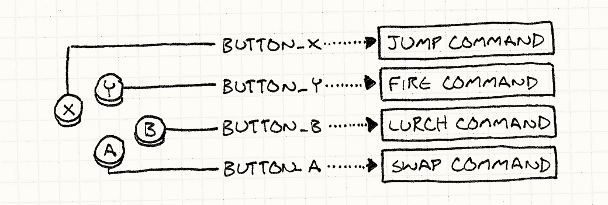

# 23 种设计模式——游戏相关（自整理）

一些参考来自于卡码网。

https://github.com/youngyangyang04/kama-DesignPattern/blob/main/DesignPattern/1-%E5%8D%95%E4%BE%8B%E6%A8%A1%E5%BC%8F.md，以及上述的链接会讲解设计模式。这篇文档更多是总结一下每种设计模式的要点，并且结合游戏开发里自己遇到的问题进行总结。

另一些设计模式的整理来自于这里：https://gpp.tkchu.me/command.html

> 基本流程：先看游戏编程模式这本书，然后再看卡码网的内容，整理到一起。

推荐结合Unity 设计模式的相关Github程序来看，这里会记录一些细节：https://github.com/QianMo/Unity-Design-Pattern.git


# 一、命令模式

https://gpp.tkchu.me/command.html

https://github.com/youngyangyang04/kama-DesignPattern/blob/main/DesignPattern/15-%E5%91%BD%E4%BB%A4%E6%A8%A1%E5%BC%8F.md

## 1.个人总结（来自游戏编程模式）

命令是具现化的方法调用。举一个游戏开发的例子，在每个游戏中都有一块代码读取用户的输入——按钮按下，键盘敲击，鼠标点击，诸如此类。 这块代码会获取用户的输入，然后将其变为游戏中有意义的行为。一种简单的实现如下：

```c#
void InputHandler::handleInput()
{
  if (isPressed(BUTTON_X)) jump();
  else if (isPressed(BUTTON_Y)) fireGun();
  else if (isPressed(BUTTON_A)) swapWeapon();
  else if (isPressed(BUTTON_B)) lurchIneffectively();
}
```

这个函数通常在[游戏循环](https://gpp.tkchu.me/game-loop.html)中每帧调用一次，我确信你可以理解它做了什么。 在我们想将用户的输入和程序行为硬编码在一起时，这段代码可以正常工作，但是许多游戏允许玩家*配置*按键的功能。

为了支持这点，需要将这些对`jump()`和`fireGun()`的直接调用转化为可以变换的东西。 “变换”听起来有点像变量干的事，因此我们需要表示游戏行为的*对象*。进入：命令模式。

我们定义了一个基类代表可触发的游戏行为：

```cpp
class Command
{
public:
  virtual ~Command() {}
  virtual void execute() = 0;
};
```

然后我们为不同的游戏行为定义相应的子类：

```cpp
class JumpCommand : public Command
{
public:
  virtual void execute() { jump(); }
};

class FireCommand : public Command
{
public:
  virtual void execute() { fireGun(); }
};

// 你知道思路了吧
```

在代码的输入处理部分，为每个按键存储一个指向命令的指针。

```c++
class InputHandler
{
public:
  void handleInput();

  // 绑定命令的方法……

private:
  Command* buttonX_;
  Command* buttonY_;
  Command* buttonA_;
  Command* buttonB_;
};
```

现在输入处理部分这样处理：

```c++
void InputHandler::handleInput()
{
  if (isPressed(BUTTON_X)) buttonX_->execute();
  else if (isPressed(BUTTON_Y)) buttonY_->execute();
  else if (isPressed(BUTTON_A)) buttonA_->execute();
  else if (isPressed(BUTTON_B)) buttonB_->execute();
}
```

此时的函数调用类似如下：



以上是命令模式的简短介绍。


### （1）额外说明

我们刚才定义的类可以在之前的例子上正常工作，但有很大的局限。 问题在于假设了顶层的`jump()`, `fireGun()`之类的函数可以找到玩家角色，然后像木偶一样操纵它。这些假定的耦合限制了这些命令的用处。`JumpCommand`*只能* 让玩家的角色跳跃。让我们放松这个限制。 不让函数去找它们控制的角色，我们将函数控制的角色对象*传进去*：

```c++
class Command
{
public:
  virtual ~Command() {}
  virtual void execute(GameActor& actor) = 0;
};
```

这里的`GameActor`是代表游戏世界中角色的“游戏对象”类。 我们将其传给`execute()`，这样命令类的子类就可以调用所选游戏对象上的方法，就像这样：

```c++
class JumpCommand : public Command
{
public:
  virtual void execute(GameActor& actor)
  {
    actor.jump();
  }
};
```

现在，我们可以使用这个类让游戏中的任何角色跳来跳去了。 在输入控制部分和在对象上调用命令部分之间，我们还缺了一块代码。 第一，我们修改`handleInput()`，让它可以*返回*命令：

```c++
Command* InputHandler::handleInput()
{
  if (isPressed(BUTTON_X)) return buttonX_;
  if (isPressed(BUTTON_Y)) return buttonY_;
  if (isPressed(BUTTON_A)) return buttonA_;
  if (isPressed(BUTTON_B)) return buttonB_;

  // 没有按下任何按键，就什么也不做
  return NULL;
}
```

这里不能立即执行，因为还不知道哪个角色会传进来。 这里我们享受了命令是具体调用的好处——`延迟`到调用执行时再知道。

然后，需要一些接受命令的代码，作用在玩家角色上。像这样：

```c++
Command* command = inputHandler.handleInput();
if (command)
{
  command->execute(actor);
}
```

将`actor`视为玩家角色的引用，它会正确地按着玩家的输入移动， 所以我们赋予了角色和前面例子中相同的行为。 通过在命令和角色间增加了一层重定向， 我们获得了一个灵巧的功能：*我们可以让玩家控制游戏中的任何角色，只需向命令传入不同的角色。*

在实践中，这个特性并不经常使用，但是*经常*会有类似的用例跳出来。 到目前为止，我们只考虑了玩家控制的角色，但是游戏中的其他角色呢？ 它们被游戏AI控制。我们可以在AI和角色之间使用相同的命令模式；AI代码只需生成`Command`对象。

在选择命令的AI和展现命令的游戏角色间解耦给了我们很大的灵活度。 我们可以对不同的角色使用不同的AI，或者为了不同的行为而混合AI。 想要一个更加有攻击性的对手？插入一个更加有攻击性的AI为其生成命令。 事实上，我们甚至可以为*玩家角色*加上AI， 在展示阶段，游戏需要自动演示时，这是很有用的。

把控制角色的命令变为第一公民对象，去除直接方法调用中严厉的束缚。 将其视为命令队列，或者是命令流：


一些代码（输入控制器或者AI）产生一系列命令放入流中。 另一些代码（调度器或者角色自身）调用并消耗命令。 通过在中间加入队列，我们解耦了消费者和生产者。


### （2）撤销和重做

最后的这个例子是这种模式最广为人知的使用情况。 如果一个命令对象可以*做*一件事，那么它亦可以*撤销*这件事。 在一些策略游戏中使用撤销，这样你就可以回滚那些你不喜欢的操作。 它是*创造*游戏时*必不可少的*工具。 一个不能撤销误操作导致的错误的编辑器，肯定会让游戏设计师恨你。

这是经验之谈。

没有了命令模式，实现撤销非常困难，有了它，就是小菜一碟。 假设我们在制作单人回合制游戏，想让玩家能撤销移动，这样他们就可以集中注意力在策略上而不是猜测上。

我们已经使用了命令来抽象输入控制，所以每个玩家的举动都已经被封装其中。 举个例子，移动一个单位的代码可能如下：

```c++
class MoveUnitCommand : public Command
{
public:
  MoveUnitCommand(Unit* unit, int x, int y)
  : unit_(unit),
    x_(x),
    y_(y)
  {}

  virtual void execute()
  {
    unit_->moveTo(x_, y_);
  }

private:
  Unit* unit_;
  int x_, y_;
};
```

注意这和前面的命令有些许不同。 在前面的例子中，我们需要从修改的角色那里*抽象*命令。 在这个例子中，我们将命令*绑定*到要移动的单位上。 这条命令的实例不是通用的“移动某物”命令；而是游戏回合中特殊的一次移动。

这展现了命令模式应用时的一种情形。 就像之前的例子，指令在某些情形中是可重用的对象，代表了*可执行的事件*。 我们早期的输入控制器将其实现为一个命令对象，然后在按键按下时调用其`execute()`方法。

这里的命令更加特殊。它们代表了特定时间点能做的特定事件。 这意味着输入控制代码可以在玩家下决定时*创造*一个实例。就像这样：

```c++
Command* handleInput()
{
  Unit* unit = getSelectedUnit();

  if (isPressed(BUTTON_UP)) {
    // 向上移动单位
    int destY = unit->y() - 1;
    return new MoveUnitCommand(unit, unit->x(), destY);
  }

  if (isPressed(BUTTON_DOWN)) {
    // 向下移动单位
    int destY = unit->y() + 1;
    return new MoveUnitCommand(unit, unit->x(), destY);
  }

  // 其他的移动……

  return NULL;
}
```

命令的一次性为我们很快地赢得了一个优点。 为了让指令可被取消，我们为每个类定义另一个需要实现的方法：

```c++
class Command
{
public:
  virtual ~Command() {}
  virtual void execute() = 0;
  virtual void undo() = 0;
};
```

`undo()`方法回滚了`execute()`方法造成的游戏状态改变。 这里是添加了撤销功能后的移动命令：

```c++
class MoveUnitCommand : public Command
{
public:
  MoveUnitCommand(Unit* unit, int x, int y)
  : unit_(unit),
    xBefore_(0),
    yBefore_(0),
    x_(x),
    y_(y)
  {}

  virtual void execute()
  {
    // 保存移动之前的位置
    // 这样之后可以复原。

    xBefore_ = unit_->x();
    yBefore_ = unit_->y();

    unit_->moveTo(x_, y_);
  }

  virtual void undo()
  {
    unit_->moveTo(xBefore_, yBefore_);
  }

private:
  Unit* unit_;
  int xBefore_, yBefore_;
  int x_, y_;
};
```


## 2.代码随想录的命令模式的介绍

https://github.com/youngyangyang04/kama-DesignPattern/blob/main/DesignPattern/15-%E5%91%BD%E4%BB%A4%E6%A8%A1%E5%BC%8F.md

这个例子应该足够清晰了，设计模式在体会思想之后，应当多写以巩固其思路。比如**后续可以实现一个编辑器的插件并辅助以撤回的功能，加深对命令模式的理解。**


## 3.Unity demo

可以结合对应的Unity Demo来看一下，比较好理解，感觉设计模式后面写多了自然就会了，下次写代码可以主动往设计模式上面去靠。


# 二、享元模式

首先先来看这篇：https://gpp.tkchu.me/flyweight.html

然后再来看这篇：https://github.com/youngyangyang04/kama-DesignPattern/blob/main/DesignPattern/12-%E4%BA%AB%E5%85%83%E6%A8%A1%E5%BC%8F.md


# 三、观察者模式

首先先看这篇：https://gpp.tkchu.me/observer.html