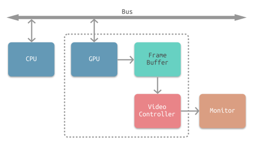

# GPU相关知识

主要参考的文章：[深入GPU硬件架构及运行机制 - 知乎](https://zhuanlan.zhihu.com/p/357112957)，这篇也转载了一篇博客园的文章，这里仅做整理来用。

阅读完这篇之后，应当能够回答下面的问题：

> 1、GPU是如何与CPU协调工作的？
> 2、GPU也有缓存机制吗？有几层？它们的速度差异多少？
> 3、GPU的渲染流程有哪些阶段？它们的功能分别是什么？
> 4、Early-Z技术是什么？发生在哪个阶段？这个阶段还会发生什么？会产生什么问题？如何解决？
> 5、SIMD和SIMT是什么？它们的好处是什么？co-issue呢？
> 6、GPU是并行处理的么？若是，硬件层是如何设计和实现的？
> 7、GPC、[TPC](https://zhida.zhihu.com/search?content_id=167487986&content_type=Article&match_order=1&q=TPC&zhida_source=entity)、SM是什么？Warp又是什么？它们和Core、Thread之间的关系如何？
> 8、顶点着色器（VS）和像素着色器（PS）可以是同一处理单元吗？为什么？
> 9、像素着色器（PS）的最小处理单位是1像素吗？为什么？会带来什么影响？
> 10、Shader中的if、for等语句会降低渲染效率吗？为什么？
> 11、如下图，渲染相同面积的图形，三角形数量少（左）的还是数量多（右）的效率更快？为什么？
>
> 
>
>12、GPU Context是什么？有什么作用？
> 13、造成渲染瓶颈的问题很可能有哪些？该如何避免或优化它们？


# 一、文章重点提炼

## 1.介绍

- 我们日常讨论GPU和显卡时，经常混为一谈，严格来说是有所区别的。GPU是显卡（Video card、Display card、Graphics card）最核心的部件，但除了GPU，显卡还有扇热器、通讯元件、与主板和显示器连接的各类插槽。
- GPU的发展历史过一下参考文章的对应部分即可；

> - **2008 - Tesla**
>   Tesla最初是给计算处理单元使用的，应用于早期的CUDA系列显卡芯片中，并不是真正意义上的普通图形处理芯片。
> - **2010 - Fermi**
>   Fermi是第一个完整的GPU计算架构。首款可支持与共享存储结合纯cache层次的GPU架构，支持ECC的GPU架构。
> - **2012 - Kepler**
>   Kepler相较于Fermi更快，效率更高，性能更好。
> - **2014 - Maxwell**
>   其全新的立体像素全局光照 (VXGI) 技术首次让游戏 GPU 能够提供实时的动态全局光照效果。基于 Maxwell 架构的 GTX 980 和 970 GPU 采用了包括多帧采样抗锯齿 (MFAA)、动态超级分辨率 (DSR)、VR Direct 以及超节能设计在内的一系列新技术。
> - **2016 - Pascal**
>   Pascal 架构将处理器和数据集成在同一个程序包内，以实现更高的计算效率。1080系列、1060系列基于Pascal架构
> - **2017 - Volta**
>   Volta 配备640 个Tensor 核心，每秒可提供超过100 兆次浮点运算(TFLOPS) 的深度学习效能，比前一代的Pascal 架构快5 倍以上。
> - **2018 - Turing**
>   Turing 架构配备了名为 RT Core 的专用光线追踪处理器，能够以高达每秒 10 Giga Rays 的速度对光线和声音在 3D 环境中的传播进行加速计算。Turing 架构将实时光线追踪运算加速至上一代 NVIDIA Pascal™ 架构的 25 倍，并能以高出 CPU 30 多倍的速度进行电影效果的最终帧渲染。2060系列、2080系列显卡也是跳过了Volta直接选择了Turing架构。
>
> 下图是部分GPU架构的发展历程：
>
> 


## 2.不同的GPU架构

GPU的微观结构因不同厂商、不同架构都会有所差异，但核心部件、概念、以及运行机制大同小异。下面将展示部分架构的GPU微观物理结构。

### （1）比如：Tesla（其他架构去文章里看即可）


### （2）共有的部分

纵观上一节的所有GPU架构，可以发现它们虽然有所差异，但存在着很多相同的概念和部件：

- GPC
- TPC
- Thread
- SM、SMX、SMM
- Warp
- SP
- Core
- ALU
- FPU
- SFU
- ROP
- Load/Store Unit
- L1 Cache
- L2 Cache
- Memory
- Register File

以上各个部件的用途将在后面进行阐述。
GPU为什么会有这么多层级且有这么多雷同的部件？答案是GPU的任务是天然并行的，现代GPU的架构皆是以高度并行能力而设计的。


从Fermi（2010年提出来的）开始NVIDIA使用类似的原理架构，使用一个Giga Thread Engine来管理所有正在进行的工作，GPU被划分成多个GPCs(Graphics Processing Cluster)，每个GPC拥有多个SM（SMX、SMM）和一个光栅化引擎(Raster Engine)，它们其中有很多的连接，最显著的是Crossbar，它可以连接GPCs和其它功能性模块（例如ROP或其他子系统）。

程序员编写的shader是在SM上完成的。每个SM包含许多为线程执行数学运算的Core（核心）。例如，一个线程可以是顶点或像素着色器调用。这些Core和其它单元由Warp Scheduler驱动，Warp Scheduler管理一组32个线程作为Warp（线程束）并将要执行的指令移交给Dispatch Units。

GPU中实际有多少这些单元（每个GPC有多少个SM，多少个GPC ......）取决于芯片配置本身。例如，GM204有4个GPC，每个GPC有4个SM，但Tegra X1有1个GPC和2个SM，它们均采用Maxwell设计。SM设计本身（内核数量，指令单位，调度程序......）也随着时间的推移而发生变化，并帮助使芯片变得如此高效，可以从高端台式机扩展到笔记本电脑移动。


`接下来，我们来看一下SM中有什么：`


如上图，对于某些GPU（如Fermi部分型号）的单个SM，包含：

- （1）32个运算核心 （Core，也叫流处理器Stream Processor）
- （2）16个LD/ST（load/store）模块来加载和存储数据
- （3）4个SFU（Special function units）执行特殊数学运算（sin、cos、log等）
- （4）128KB寄存器（Register File）
- （5）64KB L1缓存
- （6）全局内存缓存（Uniform Cache）
- （7）纹理读取单元（应该指的是上图里的Tex蓝色部分）
- （8）纹理缓存（Texture Cache）
- （9）PolyMorph Engine：多边形引擎负责属性装配（attribute Setup）、顶点拉取(VertexFetch)、曲面细分等（这个模块可以理解专门处理顶点相关的东西）。
- （10）2个Warp Schedulers：这个模块负责warp调度，一个warp由32个线程组成，warp调度器的指令通过Dispatch Units送到Core执行。
- （11）指令缓存（Instruction Cache）
- （12）内部链接网络（Interconnect Network）


## 3.GPU逻辑管线

了解上一节的部件和概念之后，可以深入阐述GPU的渲染过程和步骤。下面将以Fermi家族的SM为例，进行逻辑管线的详细说明（上面那个大图中也有这部分）。


- (1)程序通过图形API(DX、GL、WEBGL)发出`drawcall`指令，指令会被推送到驱动程序，驱动会检查指令的合法性，然后会`把指令放到GPU可以读取的Pushbuffer`中。
- (2)经过一段时间或者显式调用flush指令后，驱动程序把Pushbuffer的内容发送给GPU，GPU通过`主机接口（Host Interface）`接受这些命令，并通过`前端（Front End）`处理这些命令。
- (3)在图元分配器(Primitive Distributor)中开始工作分配，处理indexbuffer中的顶点产生三角形分成批次(batches)，然后发送给多个GPCs(Graphics Processing Cluster)。这一步的理解就是提交上来n个三角形，分配给这几个GPC同时处理。

先熟悉一下前面这三个步骤，接下来我们要进入到GPC内部去看看了：


注意看SM指的应该是一格GPC中的一片（一共4列，每一列应该是一个GPC，每个GPC有4片，指的应该是SM）。现在继续看后面的过程：


- （4）在GPC中，每个SM中的Poly Morph Engine负责通过三角形索引(triangle indices)取出三角形的数据(vertex data)，即图中的`Vertex Fetch`模块（在PolyMorph Engine中可以看到）。
- （5）在获取数据之后，在SM中以32个线程为一组的线程束(Warp)来调度，来开始处理顶点数据。Warp是典型的单指令多线程（SIMT，SIMD单指令多数据的升级）的实现，也就是32个线程同时执行的指令是一模一样的，只是线程数据不一样，这样的好处就是一个warp只需要一套逻辑对指令进行解码和执行就可以了，芯片可以做的更小更快，之所以可以这么做是由于GPU需要处理的任务是天然并行的。
- （6）SM的warp调度器会按照顺序分发指令给整个warp，单个warp中的线程会锁步(lock-step)执行各自的指令，如果线程碰到不激活执行的情况也会被遮掩(be masked out)。被遮掩的原因有很多，例如当前的指令是if(true)的分支，但是当前线程的数据的条件是false，或者循环的次数不一样（比如for循环次数n不是常量，或被break提前终止了但是别的还在走），`因此在shader中的分支会显著增加时间消耗，在一个warp中的分支除非32个线程都走到if或者else里面，否则相当于所有的分支都走了一遍，线程不能独立执行指令而是以warp为单位，而这些warp之间才是独立的。`

> 对（6）的补充：
>
> 在GPU的SIMT架构中，**warp内线程的锁步执行**和**分支发散（Divergent Branch）**是理解性能瓶颈的关键。以下通过具体场景逐步解释：
>
> ---
>
> ### **1. Warp的锁步执行机制**
> - **什么是warp？**  
>   GPU将32个线程（NVIDIA架构）捆绑为一个warp，作为最小调度单位。所有线程**共享同一指令流**，硬件在每个时钟周期为整个warp分发一条指令。
>
> - **锁步（Lock-Step）的含义**  
>   同一warp内的32个线程必须**严格同步执行相同的指令**，但每个线程处理自己的数据。例如，当warp执行`a = b + c`时，所有线程同时进行加法运算，但各自的`b`和`c`值可能不同。
>
> ---
>
> ### **2. 分支如何导致性能问题？**
> 当warp内的线程遇到条件分支（如`if-else`或`for`循环）时，**如果线程的条件不一致**，GPU必须通过**遮掩（Masking）**分别处理每个分支路径。这会导致**实际执行时间成倍增加**。
>
> ---
>
> #### **场景1：理想情况（无分支发散）**
> ```cpp
> // 所有线程的条件一致（假设condition为true）
> if (condition) {
>     // 所有32个线程都执行此代码块
> } else {
>     // 无线程执行
> }
> ```
> - **执行过程**  
>   Warp一次性执行`if`块内的指令，无需处理`else`块。  
>   **总时间 = `if`块的执行时间**
>
> ---
>
> #### **场景2：分支发散（最坏情况）**
> ```cpp
> // 假设16个线程满足条件，16个不满足
> if (threadId % 2 == 0) { 
>     // 16个线程执行此处
> } else {
>     // 另外16个线程执行此处
> }
> ```
> - **执行过程**  
>   1. **第一次执行**：GPU激活`if`块，**屏蔽（Mask Out）** 不满足条件的16个线程（执行`else`的线程被挂起）。  
>      此时，只有50%的硬件资源被利用。  
>   2. **第二次执行**：GPU激活`else`块，屏蔽原本执行`if`的16个线程。  
>      **总时间 = `if`块时间 + `else`块时间**  
> - **性能损失**  
>   原本可以并行执行的指令被拆分为两次串行执行，**时间翻倍**，硬件利用率仅为50%。
>
> ---
>
> ### **3. 遮掩（Masking）的工作原理**
> - **硬件如何管理分支？**  
>   每个warp维护一个**执行掩码（Execution Mask）**，标记当前活跃的线程。当遇到分支时：  
>   
>   1. 根据线程条件更新掩码，仅激活符合条件的线程。  
>   2. 执行当前分支路径的指令，未激活的线程被挂起（不执行，但占用warp调度槽）。  
>   3. 处理完当前路径后，切换掩码并执行另一分支路径。  
>   
> - **为什么说“所有分支都走了一遍”？**  
>   即使某些线程不满足条件，warp仍需为**每个可能的分支路径**完整执行所有指令。例如：  
>   ```cpp
>   if (cond) { A } else { B }
>   ```
>   - 无论线程是否进入`if`或`else`，整个warp必须先后执行`A`和`B`的代码，只是通过掩码控制哪些线程实际生效。
>
> ---
>
> ### **4. 循环中的分支发散**
> ```cpp
> // 不同线程的循环次数不同
> for (int i = 0; i < n; i++) { 
>     // 假设n是变量，不同线程的n值不同
> }
> ```
> - **执行过程**  
>   Warp必须执行到**所有线程的循环都结束**为止。例如：  
>   - 线程0的`n=3`，线程1的`n=5`  
>   - Warp会执行5次循环，但线程0在后2次循环中被屏蔽。  
> - **性能损失**  
>   实际循环次数由**最大的`n`值决定**，导致部分线程浪费计算资源。
>
> ---
>
> ### **5. 如何优化分支发散？**
> - **原则**：尽可能让同一warp内的线程**走相同的分支路径**。  
> - **方法**：  
>   1. **数据布局优化**：将相同条件的线程分组到同一warp中。  
>      （例如：通过排序或调整线程块大小）  
>   2. **避免细粒度分支**：使用算术逻辑代替`if-else`。  
>      ```cpp
>      // 原代码
>      if (x > 0) y = x; else y = 0;
>      // 优化为
>      y = max(x, 0);
>      ```
>   3. **减少循环次数差异**：确保同一warp内的循环次数一致。
>
> ---
>
> ### **总结**
> - **关键问题**：warp内线程的分支不一致会导致**串行执行所有分支路径**，显著增加时间。  
> - **性能影响**：分支发散时，时间开销 = 各分支路径时间的总和。  
> - **优化目标**：通过数据重组或算法调整，**最大化warp内线程的条件一致性**。

接着上面的（6）步骤，接下来是：

- （7）warp中的指令可以被一次完成，也可能经过多次调度，例如通常SM中的LD/ST(加载存取)单元数量明显少于基础数学操作单元。
- （8）由于某些指令比其他指令需要更长的时间才能完成，特别是内存加载，`warp调度器可能会简单地切换到另一个没有内存等待的warp，这是GPU如何克服内存读取延迟的关键`，只是简单地切换活动线程组。`为了使这种切换非常快，调度器管理的所有warp在寄存器文件中都有自己的寄存器。`这里就会有个矛盾产生，`shader需要越多的寄存器，就会给warp留下越少的空间，就会产生越少的warp`，这时候在碰到内存延迟的时候就会只是等待，而没有可以运行的warp可以切换。


- （9）一旦warp完成了vertex-shader的所有指令，运算结果会被Viewport Transform模块处理，三角形会被裁剪然后准备光栅化，GPU会使用L1和L2缓存来进行vertex-shader和pixel-shader的数据通信。


- （10）接下来这些三角形将被分割，再分配给多个GPC，三角形的范围决定着它将被分配到哪个光栅引擎(raster engines)，每个raster engines覆盖了多个屏幕上的tile，这等于把三角形的渲染分配到多个tile上面。也就是像素阶段就把按三角形划分变成了按显示的像素划分了。


- （11）SM上的`Attribute Setup`(在PolyMorph Engine当中)保证了从vertex-shader来的数据经过插值后是pixel-shader是可读的。
- （12）GPC上的光栅引擎(raster engines)在它接收到的三角形上工作，来负责这些这些三角形的像素信息的生成（同时会处理Early-Z剔除，==原文还说了背面剔除和裁剪,但个人（和deepseek也）觉得这不是在光栅化阶段完成的事情==）。

> ### **Early-Z剔除（Early Depth Testing）**
>
> - **作用**：在像素着色器执行前进行深度测试，避免对不可见像素执行昂贵的着色计算。
> - 运作阶段：
>   - **光栅化后、像素着色前**：光栅引擎生成片元（Fragment）后，若Early-Z启用，会先查询深度缓冲区。若片元深度值大于缓冲区中的现有值（被遮挡），则直接丢弃该片元，跳过后续着色。
>   - **条件限制**：当像素着色器修改深度值（如写入`gl_FragDepth`）或启用Alpha Test时，Early-Z可能失效，转而使用传统的**Late-Z**（像素着色后深度测试）。
> - **光栅引擎的参与**：Early-Z是光栅引擎的关键优化功能，通常在片元处理管线中集成，与深度缓冲区交互。

- （13）32个像素线程将被分成一组(Warp)，或者说8个2x2的像素块，这是在像素着色器上面的最小工作单元，在这个像素线程内，如果没有被三角形覆盖就会被遮掩（应该是说被Mask掉），SM中的warp调度器会管理片元着色器的任务。
- （14）接下来的阶段就和vertex-shader中的逻辑步骤完全一样，但是变成了在像素着色器线程中执行。 由于不耗费任何性能可以获取一个像素内的值，导致锁步执行（lockstep，应该就是类似军队那种齐步走，并驾齐驱）非常便利，所有的线程可以保证所有的指令可以在同一点。
- （15）最后一步，现在像素着色器已经完成了颜色的计算还有深度值的计算，在这个点上，我们必须考虑三角形的原始api顺序，然后才将数据移交给ROP(render output unit，渲染输出单元)，一个ROP内部有很多ROP单元，在ROP单元中处理深度测试，和framebuffer的混合，深度和颜色的设置必须是原子操作，否则两个不同的三角形在同一个像素点就会有冲突和错误。

> 以上，我们在High Level的角度理解了一下GPU 的data flow，在复习的时候可以看一下能否对照上面的那张大图把过程复述出来。


## 4.GPU技术要点

由于上一节主要阐述GPU内部的工作流程和机制，为了简洁性，省略了很多知识点和过程，本节将对它们做进一步补充说明。

### （1）SIMD和SIMT

- **SIMD**（Single Instruction Multiple Data）是单指令多数据，在GPU的ALU单元内，一条指令可以处理多维向量（一般是4D）的数据。比如，有以下shader指令：
  `float4 c = a + b; // a, b都是float4类型`
  对于没有SIMD的处理单元，需要4条指令将4个float数值相加，汇编伪代码如下：
  `ADD c.x, a.x, b.x ADD c.y, a.y, b.y ADD c.z, a.z, b.z ADD c.w, a.w, b.w`
  但有了SIMD技术，只需一条指令即可处理完：
  `SIMD_ADD c, a, b`


- **SIMT**（Single Instruction Multiple Threads，单指令多线程）是SIMD的升级版，可对GPU中单个SM中的多个Core同时处理同一指令，并且每个Core存取的数据可以是不同的。
  `SIMT_ADD c, a, b`
  上述指令会被同时送入在单个SM中被编组的所有Core中，同时执行运算，但`a`、`b` 、`c`的值可以不一样：


### （2）**co-issue**

**co-issue**是为了解决SIMD运算单元无法充分利用的问题。例如下图，由于float数量的不同，ALU利用率从100%依次下降为75%、50%、25%。


> 补充知识`（GPT生成的，估计不太对，存疑，但应该不影响co-issue的理解）：`
>
> 在GPU编程中，MAD和DP3是两种常见的指令，通常用于图形处理和计算任务。
>
> 1. **MAD（Multiply-Add）指令**：
>    - MAD指令的全称是“乘加指令”。它的功能是将两个数相乘，然后将结果加上一个第三个数。通常表示为 `C = A * B + C`，其中A和B是输入，C是加法的另一个操作数。
>    - 在GPU中，MAD指令可以提高计算效率，因为它将乘法和加法合并为一个操作，减少了指令的数量和执行时间。
>
> 2. **DP3（Dot Product 3）指令**：
>    - DP3指令用于计算两个三维向量的点积（内积）。点积的结果是一个标量，表示两个向量之间的相似度或投影关系。公式为 `result = A.x * B.x + A.y * B.y + A.z * B.z`。
>    - 在图形编程中，点积常用于光照计算、法线计算等场景。
>
> 这两种指令在GPU的图形渲染和计算任务中非常重要，能够有效地提高性能和计算效率。

为了解决着色器在低维向量的利用率低的问题，可以通过`合并1D与3D或2D与2D的指令`。例如下图，`DP3`指令用了3D数据，`ADD`指令只有1D数据，co-issue会自动将它们合并，在同一个ALU只需一个指令周期即可执行完。


但是，对于向量运算单元（Vector ALU），如果其中一个变量既是操作数又是存储数的情况，无法启用co-issue技术：


于是**标量指令着色器**（Scalar Instruction Shader）应运而生，它可以有效地组合任何向量，开启co-issue技术，充分发挥SIMD的优势。`文章对此也没有再详细展开了，先理解到这里应该就行。`


### （3）if-else语句

理解下面这张图：


如上图，SM中有8个ALU（Core），由于SIMD的特性，每个ALU的数据不一样，导致`if-else`语句在某些ALU中执行的是`true`分支（黄色），有些ALU执行的是`false`分支（灰蓝色），这样导致很多ALU的执行周期被浪费掉了（即masked out），拉长了整个执行周期。最坏的情况，同一个SM中只有1/8（8是同一个SM的线程数，不同架构的GPU有所不同）的利用率（比如只有一个执行`if`，其他全部执行`else`）。

同样，`for`循环也会导致类似的情形，例如以下shader代码：

```c++
void func(int count, int breakNum)
{ 
    for(int i=0; i<count; ++i)
    { 
        if (i == breakNum) break; 
     	else // do something
    } 
}
```

由于每个ALU的`count`不一样，加上有`break`分支，导致最快执行完shader的ALU可能是最慢的N分之一的时间，但由于SIMD的特性，`最快的那个ALU依然要等待最慢的ALU执行完毕，才能接下一组指令的活`！也就白白浪费了很多时间周期。


### （4）Early-Z

早期GPU的渲染管线的深度测试是在像素着色器之后才执行（下图），这样会造成很多本不可见的像素执行了耗性能的像素着色器计算。如下图：


后来，为了减少像素着色器的额外消耗，将深度测试提至像素着色器之前（下图），这就是Early-Z技术的由来（`注意，是把深度测试提到像素着色器之前，但透明度测试->模板测试的顺序是不变的`）。如下：


Early-Z技术可以将很多无效的像素提前剔除，避免它们进入耗时严重的像素着色器。`Early-Z剔除的最小单位不是1像素，而是像素块（pixel quad，2x2个像素，详见[4.3.6 ](#4.3.6 像素块（pixel quad）)，即下面的（6）部分）。`
但是，以下情况会导致Early-Z失效：

- (1)**开启Alpha Test**：由于Alpha Test需要在像素着色器后面的Alpha Test阶段比较，所以无法在像素着色器之前就决定该像素是否被剔除。
- (2)**开启Alpha Blend**：启用了Alpha混合的像素很多需要与frame buffer做混合，无法执行深度测试，也就无法利用Early-Z技术。

> - **误区**：“被不透明物体遮挡的半透明片元本不应渲染，Early-Z剔除是合理的。”
>
> #### 混合操作的依赖性（==有点没看懂，不过GPU是这样设计的，就这样记忆也行，应该是为了稳妥起见==）
>
> - **半透明片元的混合需要前后片元的数据**：例如，若一个远处的半透明物体A被近处的半透明物体B遮挡，但A和B都需要参与混合（如A是红色玻璃，B是蓝色烟雾），则A的片元必须通过深度测试并进入混合阶段，即使它被B遮挡。
> - **Early-Z的提前剔除风险**：若Early-Z直接剔除了被遮挡的A片元，B片元在混合时缺少A的颜色数据，导致最终混合结果错误（例如缺少红色调）。
>
> - 实际逻辑：
>   1. **半透明物体的混合可能依赖多个层级**：即使某个半透明片元被不透明物体遮挡，它仍可能影响后续半透明物体的混合结果（尤其在复杂场景中）。
>   2. **深度写入关闭破坏了Early-Z的上下文**：Early-Z依赖深度缓冲的实时更新，但半透明物体的深度写入关闭导致深度缓冲无法反映实际渲染进度，使Early-Z的决策不可靠。
>   3. **保守策略**：GPU会强制禁用Early-Z以确保所有可能参与混合的片元均进入管线，避免因优化导致渲染错误。

- (3)**开启Tex Kill**：即在shader代码中有像素摒弃指令（DX的discard，OpenGL的clip）。
- (4)**关闭深度测试**。Early-Z是建立在深度测试看开启的条件下，如果关闭了深度测试，也就无法启用Early-Z技术。
- (5)**开启Multi-Sampling**：多采样会影响周边像素，而Early-Z阶段无法得知周边像素是否被裁剪，故无法提前剔除。
- (6)以及其它任何导致需要混合后面颜色的操作。

总结：半透明物体的Alpha Test，Alpha Blend，Clip，关闭深度测试，开启Multi-Sampling都会导致Early-Z失效。


此外，Early-Z技术会导致一个问题：**深度数据冲突**（depth data hazard）。

 

例子要结合上图，假设数值深度值5已经经过Early-Z即将写入Frame Buffer，而深度值10刚好处于Early-Z阶段，读取并对比当前缓存的深度值15，结果就是10通过了Early-Z测试，会覆盖掉比自己小的深度值5，最终frame buffer的深度值是错误的结果。
避免深度数据冲突的方法之一是在写入深度值之前，再次与frame buffer的值进行对比：


### （5）统一着色器架构

在早期的GPU，顶点着色器和像素着色器的硬件结构是独立的，它们各有各的寄存器、运算单元等部件。这样很多时候，会造成顶点着色器与像素着色器之间任务的不平衡。对于顶点数量多的任务，像素着色器空闲状态多；对于像素多的任务，顶点着色器的空闲状态多（下图）。


于是，为了解决VS和PS之间的不平衡，引入了统一着色器架构（Unified shader Architecture）。用了此架构的GPU，VS和PS用的都是相同的Core。也就是，同一个Core既可以是VS又可以是PS。


这样就解决了不同类型着色器之间的不平衡问题，还可以减少GPU的硬件单元，压缩物理尺寸和耗电量。此外，VS、PS可还可以和其它着色器（几何、曲面、计算）统一为一体。如下图：


### （6）**像素块（Pixel Quad）**

在第3部分，GPU逻辑管线中的第（13）步，提到了：

> 32个像素线程将被分成一组，或者说8个**2x2的像素块**，这是在**像素着色器上面的最小工作单元**，在这个像素线程内，如果没有被三角形覆盖就会被遮掩（被Mask掉），SM中的warp调度器会管理像素着色器的任务。

也就是说，在像素着色器中，会将相邻的四个像素作为不可分隔的一组，送入同一个SM内4个不同的Core。

为什么像素着色器处理的最小单元是2x2的像素块？文章的作者推测有如下几个原因：

- 简化和加速像素分派的工作。
- 精简SM的架构，减少硬件单元数量和尺寸。
- 降低功耗，提高效能比。
- 无效像素虽然不会被存储结果，但可辅助有效像素求导函数。详见[4.6 利用扩展例证](https://link.zhihu.com/?target=https%3A//www.cnblogs.com/timlly/p/11471507.html%23%E5%88%A9%E7%94%A8%E6%89%A9%E5%B1%95%E4%BE%8B%E8%AF%81)。

这种设计虽然有其优势，但同时，也会激化过绘制（Over Draw）的情况，损耗额外的性能。比如下图中，白色的三角形只占用了3个像素（绿色），按我们普通的思维，只需要3个Core绘制3次就可以了。但是，由于上面的3个像素分别占据了不同的像素块（橙色分隔），实际上需要占用12个Core绘制12次（下图）。


这就会额外消耗300%的硬件性能，导致了更加严重的Overdraw情况。
更多详情可以观看虚幻官方的视频教学：[实时渲染深入探究](https://link.zhihu.com/?target=https%3A//learn.unrealengine.com/course/2504896)。（点进去看没有具体的对应视频，但是是一个虚幻的教程页合集，应该也很有用）。


## 5.GPU资源机制

本节将阐述GPU的内存访问、资源管理等机制。

### （1）内存架构

部分架构的GPU与CPU类似，也有多级缓存结构：寄存器、L1缓存、L2缓存、GPU显存、系统显存。如下图：


它们的存取速度从寄存器到系统内存依次变慢：

| 存储类型 | 寄存器 | 共享内存 | L1缓存 | L2缓存 | 纹理、常量缓存 | 全局内存 |
| -------- | ------ | -------- | ------ | ------ | -------------- | -------- |
| 访问周期 | 1      | 1~32     | 1~32   | 32~64  | 400~600        | 400~600  |

由此可见，shader直接访问寄存器、L1、L2缓存还是比较快的，但访问纹理、常量缓存和全局内存非常慢，会造成很高的延迟。


上面的多级缓存结构可被称为“CPU-Style”，还存在GPU-Style的内存架构：


这种架构的特点是ALU多，GPU上下文（Context）多，吞吐量高，依赖高带宽与系统内存交换数据。


### （2）GPU Context和延迟

由于SIMT技术的引入，导致很多同一个SM内的很多Core并不是独立的，当它们当中有部分Core需要访问到纹理、常量缓存和全局内存时，就会导致非常大的卡顿（Stall）。
例如下图中，有4组上下文（Context），它们共用同一组运算单元ALU。

> - 每个Core：
>   - 1个FPU（浮点数单元）
>   - 1个ALU（逻辑运算单元）


假设第一组Context需要访问缓存或内存，会导致2~3个周期的延迟，此时调度器会激活第二组Context以利用ALU：


当第二组Context访问缓存或内存又卡住，会依次激活第三、第四组Context（真是把性能压到极致啊），直到第一组Context恢复运行或所有都被激活。延迟的后果是每组Context的总体执行时间被拉长了：


不过即使这样，`越多Context可用就越可以提升运算单元的吞吐量`，比如下图的18组Context的架构可以最大化地提升吞吐量：


### （3）**CPU-GPU异构系统**

根据CPU和GPU是否共享内存，可分为两种类型的CPU-GPU架构：


- 上图左是**分离式架构**，CPU和GPU各自有独立的缓存和内存，它们通过PCI-e等总线通讯。这种结构的缺点在于 PCI-e 相对于两者具有低带宽和高延迟，数据的传输成了其中的性能瓶颈。目前使用非常广泛，如PC、智能手机等。
- 上图右是**耦合式架构**，CPU 和 GPU 共享内存和缓存。AMD 的 APU 采用的就是这种结构，目前主要使用在游戏主机中，如 PS4。

在存储管理方面，分离式结构中 CPU 和 GPU 各自拥有独立的内存，两者共享一套虚拟地址空间，必要时会进行内存拷贝。对于耦合式结构，GPU 没有独立的内存，与 GPU 共享系统内存，由 MMU 进行存储管理。


### （4）（5）GPU资源管理模型+**CPU-GPU数据流**

这部分直接看原文吧。[深入GPU硬件架构及运行机制 - 0向往0 - 博客园](https://www.cnblogs.com/timlly/p/11471507.html#444-gpu资源管理模型)

比较重要的是下面的这张图（分离式架构的CPU-GPU的数据流程图）：


> 整个流程可以简化为以下几个步骤：
>
> 1. **数据准备**：将主存中的处理数据（如模型、纹理等）复制到显存中，以便 GPU 可以快速访问。
> 2. **发出绘制指令**：CPU 通过 draw call 指令驱动 GPU，告知其需要渲染哪些对象。
> 3. **并行处理**：GPU 中的多个运算单元并行处理数据，从显存中读取必要的信息，执行渲染操作。
> 4. **结果返回**：GPU 将渲染结果（如帧缓冲）传回主存，供后续处理或显示。


### （6）显像机制

#### （a）水平和垂直同步信号

在早期的CRT显示器，电子枪从上到下逐行扫描，扫描完成后显示器就呈现一帧画面。然后电子枪回到初始位置进行下一次扫描。为了同步显示器的显示过程和系统的视频控制器，显示器会用硬件时钟产生一系列的定时信号。


- 当电子枪换行进行扫描时，显示器会发出一个水平同步信号（horizonal synchronization），简称 **HSync**
- 当一帧画面绘制完成后，电子枪回复到原位，准备画下一帧前，显示器会发出一个垂直同步信号（vertical synchronization），简称 **VSync**。
- 显示器通常以固定频率进行刷新，这个刷新率就是 `VSync` 信号产生的频率。虽然现在的显示器基本都是液晶显示屏了，但其原理基本一致。

CPU将计算好显示内容提交至 GPU，GPU 渲染完成后将渲染结果存入帧缓冲区，视频控制器会按照 VSync 信号逐帧读取帧缓冲区的数据，经过数据转换后最终由显示器进行显示。




#### （b）双缓冲

在单缓冲下，帧缓冲区的读取和刷新都都会有比较大的效率问题，经常会出现相互等待的情况，导致帧率下降。

为了解决效率问题，GPU 通常会引入两个缓冲区，即 **双缓冲机制**。在这种情况下，GPU 会预先渲染一帧放入一个缓冲区中，用于视频控制器的读取。当下一帧渲染完毕后，GPU 会直接把视频控制器的指针指向第二个缓冲器。


#### （c）**垂直同步**

双缓冲虽然能解决效率问题，但会引入一个新的问题。当视频控制器还未读取完成时，即屏幕内容刚显示一半时，GPU 将新的一帧内容提交到帧缓冲区并把两个缓冲区进行交换后，视频控制器就会把新的一帧数据的下半段显示到屏幕上，造成画面撕裂现象（经典画面）：


为了解决这个问题，GPU 通常有一个机制叫做**垂直同步**（简写也是V-Sync），当开启垂直同步后，GPU 会等待显示器的 VSync 信号发出后，才进行新的一帧渲染和缓冲区更新。这样能解决画面撕裂现象，也增加了画面流畅度，但需要消费更多的计算资源，也会带来部分延迟。


## 6.Shader的运行机制

Shader代码也跟传统的C++等语言类似，需要将面向人类的高级语言（GLSL、HLSL、CG）通过编译器转成面向机器的二进制指令，二进制指令可转译成汇编代码，以便技术人员查阅和调试。


由高级语言编译成汇编指令的过程通常是在离线阶段执行，以减轻运行时的消耗。

在执行阶段，CPU端将shader二进制指令经由PCI-e推送到GPU端，GPU在执行代码时，会用Context将指令分成若干Channel推送到各个Core的存储空间。

对现代GPU而言，可编程的阶段越来越多，包含但不限于：顶点着色器（Vertex Shader）、曲面细分控制着色器（Tessellation Control Shader）、几何着色器（Geometry Shader）、像素/片元着色器（Fragment Shader）、计算着色器（Compute Shader）、...


这些着色器形成流水线式的并行化的渲染管线。下面将配合具体的例子说明。我们来看一段漫反射的经典代码：
```glsl
//HLSL
sampler mySamp;
Texture2D<float3> myTex;
float3 lightDir;

float4 diffuseShader(float3 norm, float2 uv)
{
	float3 kd;
	kd = myTex.Sample(mySamp, uv);
	kd *= clamp( dot(lightDir, norm), 0.0, 1.0);
	return float4(kd, 1.0);
}
```

经过编译后成为汇编代码：

```assembly
<diffuseShader>:
sample r0, v4, t0, s0
mul    r3, v0, cb0[0]
madd   r3, v1, cb0[1], r3
madd   r3, v2, cb0[2], r3
clmp   r3, r3, l(0.0), l(1.0)
mul    o0, r0, r3
mul    o1, r1, r3
mul    o2, r2, r3
mov    o3, l(1.0)
```

在执行阶段，以上汇编代码会被GPU推送到执行上下文（Execution Context），然后ALU会逐条获取（Detch）、解码（Decode）汇编指令，并执行它们。


以上示例图只是单个ALU的执行情况，实际上，GPU有几十甚至上百个执行单元在同时执行shader指令：


对于SIMT架构的GPU，汇编指令有所不同，变成了SIMT特定指令代码：

```assembly
<VEC8_diffuseShader>: 
VEC8_sample vec_r0, vec_v4, t0, vec_s0 
VEC8_mul    vec_r3, vec_v0, cb0[0] 
VEC8_madd   vec_r3, vec_v1, cb0[1], vec_r3 
VEC8_madd   vec_r3, vec_v2, cb0[2], vec_r3
VEC8_clmp   vec_r3, vec_r3, l(0.0), l(1.0) 
VEC8_mul    vec_o0, vec_r0, vec_r3 
VEC8_mul    vec_o1, vec_r1, vec_r3 
VEC8_mul    vec_o2, vec_r2, vec_r3 
VEC8_mov    o3, l(1.0)
```

并且Context以Core为单位组成共享的结构，同一个Core的多个ALU共享一组Context（其实就是前面的SIMT架构）：


如果有多个Core，就会有更多的ALU同时参与shader计算，每个Core执行的数据是不一样的，可能是顶点、图元、像素等任何数据：


## 7.利用扩展例证

暂时直接看原文过一下就行：[深入GPU硬件架构及运行机制 - 0向往0 - 博客园](https://www.cnblogs.com/timlly/p/11471507.html#46-利用扩展例证)


## 8.本文总结

### （1）CPU VS GPU

CPU和GPU的差异可以描述在下面表格中：

|                  | **CPU**      | **GPU**      |
| ---------------- | ------------ | ------------ |
| **延迟容忍度**   | 低           | 高           |
| **并行目标**     | 任务（Task） | 数据（Data） |
| **核心架构**     | 多线程核心   | SIMT核心     |
| **线程数量级别** | 10           | 10000        |
| **吞吐量**       | 低           | 高           |
| **缓存需求量**   | 高           | 低           |
| **线程独立性**   | 低           | 高           |

它们之间的差异（缓存、核心数量、内存、线程数等）可用下图展示出来：


### （2）渲染优化建议

由上章的分析，可以很容易给出渲染优化建议：

- **减少CPU和GPU的数据交换：**
  - 合批（Batch）
  - 减少顶点数、三角形数
  - 视锥裁剪
    - BVH
    - Portal
    - BSP
    - OSP
  - 避免每帧提交Buffer数据
    - CPU版的粒子、动画会每帧修改、提交数据，可移至GPU端。（《原神》若托龙王创作幕后里有说粒子系统移植到GPU上）
  - 减少渲染状态设置和查询
    - 例如：`glGetUniformLocation`会从GPU内存查询状态，耗费很多时间周期。
    - 避免每帧设置、查询渲染状态，可在初始化时缓存状态。
  - 启用GPU Instance（后续会在别的笔记当中总结GPU Instancing和SRP Batcher）
  - 开启LOD
  - 避免从显存读数据
- **减少过绘制（Overdraw）：**
  - 避免Tex Kill操作（比如Clip）
  - 避免Alpha Test
  - 避免Alpha Blend
  - 开启深度测试
    - Early-Z
    - 层次Z缓冲（Hierarchical Z-Buffering，HZB）
  - 开启裁剪：
    - 背面裁剪
    - 遮挡裁剪
    - 视口裁剪
    - 剪切矩形（scissor rectangle）
  - 控制物体数量
    - 粒子数量多且面积小，由于像素块机制，会加剧过绘制情况
    - 植物、沙石、毛发等也如此
- **Shader优化：**
  - 避免if、switch分支语句
  - 避免`for`循环语句，特别是循环次数可变的
  - 减少纹理采样次数
  - 禁用`clip`或`discard`操作
  - 减少复杂数学函数调用

更多优化技巧可阅读：

- [移动游戏性能优化通用技法](https://www.cnblogs.com/timlly/p/10463467.html)。（推荐阅读，==考虑后面单独整理==）
- [GPU Programming Guide](http://developer.download.nvidia.com/GPU_Programming_Guide/GPU_Programming_Guide_G80.pdf)。
- [Real-Time Rendering Resources](http://www.realtimerendering.com/)。


### （3）GPU的未来

也是看参考文章的最后一个章节即可。


# 二、移动端性能优化

参考文章：[移动游戏性能优化通用技法 - 0向往0 - 博客园](https://www.cnblogs.com/timlly/p/10463467.html)

## 1.资料补充

### （1）九宫格

以下方法提高贴图复用率：

- 建立共享图库。将通用的元素放至共享库，例如按钮/进度条/背景/UI通用元素等。
- 用九宫格图代替大块背景图。九宫格在游戏开发中是比较常见的UI组件。
- 纹理元素通过变换可组合成复合纹理。例下图，上下左右对称的背景图可以用4张相同贴图实例通过旋转/翻转后获得。

- 九宫格+UI元素可以组合成很复杂但消耗相对较小的UI界面。（九宫格：Sliced，可以参考[9 切片精灵 - Unity 手册](https://docs.unity3d.com/cn/2021.3/Manual/9SliceSprites.html)）

> 九宫格（9-Slice Scaling）是游戏开发中一种高效的UI纹理优化技术，在Unity中称为"Sliced"模式。它通过将一张纹理划分为9个区域，实现智能拉伸而不破坏边缘效果。以下以Unity引擎为例详细说明：
>
> 1. **九宫格原理**：
> 将纹理划分为9个区域（3x3网格）：
> - 四角（1,3,7,9）：保持原始比例不拉伸
> - 边（2,4,6,8）：仅单方向拉伸
> - 中心（5）：双向拉伸填充
>
> 2. **Unity操作步骤**：
> 1) 导入纹理后设为"Sprite(2D and UI)"类型
> 2) 在Sprite Editor中设置边框值（Border）：
> ```csharp
> // 通过代码设置示例（单位：像素）
> Sprite sprite = Resources.Load<Sprite>("UI/button");
> sprite.border = new Vector4(10,10,10,10); //左,下,右,上
> ```
> 3) 选择"Sliced"渲染模式
>
> 3. **实际应用案例**：
> - 按钮：仅需256x256纹理即可适配从100x50到300x150各种尺寸
> - 对话框：同一纹理适配横竖屏不同比例
> - 进度条：中间区域拉伸显示进度，两端保持圆角
>
> 4. **性能对比**：
> | 方式     | 内存占用 | 顶点数 | 适用场景       |
> | -------- | -------- | ------ | -------------- |
> | 普通拉伸 | 1x       | 4      | 简单图形       |
> | 九宫格   | 1x       | 16     | 带边框的UI元素 |
> | 大图平铺 | N倍      | 4*N    | 复杂图案背景   |
>
> 5. **进阶技巧**：
> - 结合材质Shader实现动态变色效果
> - 使用SpriteAtlas打包多个九宫格素材
> - 搭配Mask组件实现异形九宫格
> - 通过Animator控制九宫格缩放动画
>
> 在Unity的UGUI系统中，九宫格特别适合制作：
> - 自适应分辨率的面板（Panel）
> - 可缩放窗口（Window）
> - 多功能按钮（Button）
> - 可拉伸进度条（Slider）
>
> 通过合理设置九宫格的边界值（建议不小于纹理尺寸的10%），可以在保证视觉效果的同时，将同个纹理复用于数百种不同尺寸的UI元素，有效减少DrawCall和纹理内存占用。