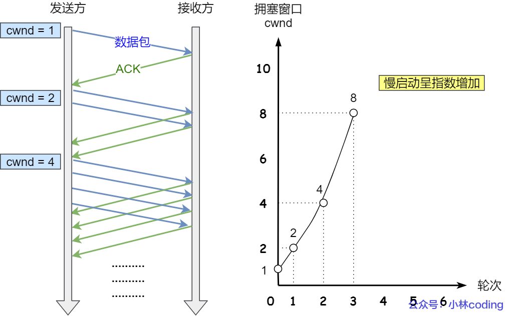
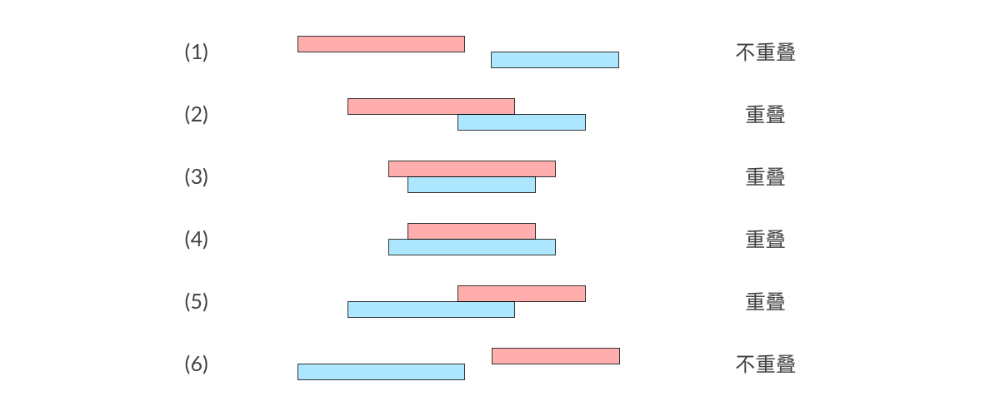

# 面经合集——题目+答案版

 :cat: Y :dog:H（目前复习到C++ 【12】结束）

> 注：
>
> （1）部分答案放的是比较精简的版本，更为详细的介绍在其他的笔记里应该有所整理。精简版本有助于回顾核心知识，确保答案能够快速说中重点。:question:表示Y掌握的还不够牢固。
>
> （2）有一些牛客笔试的卷子，由于篇幅原因被放在了PrepareForWorkNotes\八股文\选择题合集 这个文件夹下面，复习的时候可以去看一下。

[TOC]


# C++ 篇

## **【1】C++类的存储相关**

可参考链接：（[C++类的存储及类对象内存结构_c++对象的存储空间-CSDN博客](https://blog.csdn.net/fenxinzi557/article/details/51995911)）

> 这道题目考察的是C++中类是怎么存储的，答题的时候考虑一下几个方面：
>
> - 类的数据成员存储参考类的内存对齐（也是结构体的内存对齐），类内函数（非虚函数和虚函数）存在代码区，虚函数表存储在只读数据段/常量区。静态函数以及静态成员函数都存储在代码区，类的静态成员变量存储在静态区/全局区，也因此需要外部初始化。
>
> - 
>
> - 在C++中，类的声明（即定义类本身）不会占用任何内存分区。只有在声明类的对象时，才会根据写的代码分配到堆区（或者严谨一点说自由存储区）/栈区；
>
> - 对于基类，如果有虚函数，那么先存放虚函数表指针，然后存放自己的数据成员；如果没有虚函数，那么直接存放数据成员。
>
> - 对于单一继承的类对象，先存放父类的数据拷贝(包括虚函数表指针)，然后是本类的数据。
>
> 
>- 虚函数表中，先存放父类的虚函数，再存放子类的虚函数；如果子类重写了父类的某些虚函数，那么新的虚函数会将虚函数表中父类的这些虚函数覆盖。
>
> ```c++
>子类内存：
> {
> 虚表指针
> 父类数据成员
> 子类数据成员
> }
> ```
> 
> - 对于多重继承，先存放第一个父类的数据拷贝，再存放第二个父类的数据拷贝，依此类推，最后存放自己的数据成员。其中每一个父类拷贝都包含一个虚函数表指针。如果子类重载了某个父类的某个虚函数，那么该将该父类虚函数表的函数覆盖。另外，子类自己的虚函数，存储于第一个父类的虚函数表后边部分。
>
> ```c++
>子类内存：
> {
> 虚表指针1
> 父类1数据成员 //多继承时，子类的两个虚表指针的物理地址应该不是连续的，因为子类赋值给父类需要进行切割，所以父类的虚表和父类的对象是连续在一起的，子类多继承后，子类存储的对象应该是父类1的虚表指针+父类1的数据+父类2的虚表指针+父类2的数据
> 
> 虚表指针2
> 父类2数据成员
> 
> 子类数据成员
> }
> ```
> 
> https://blog.csdn.net/qq_36359022/article/details/81870219
>
> - 空类占一个字节。
>
> 另外还有一些问题，**比如派生类出现基类中的同名变量后，内存是如何布局的？优先级比较低，有时间或者问到了再来整理吧。**


>其他:thinking: ：辅助记忆与复习
>
>
>>
>https://blog.csdn.net/u014470361/article/details/79297601
>
>**https://blog.csdn.net/qq_36359022/article/details/81870219**
>
>>一、多态起手式以及内存分布
>假设有一个基类ClassA，一个继承了该基类的派生类ClassB，并且基类中有虚函数，派生类实现了基类的虚函数。
>>我们在代码中运用多态这个特性时，通常以两种方式起手：
>(1) ClassA *a = new ClassB();
>>(2) ClassB b; ClassA *a = &b;
>以上两种方式都是用基类指针去指向一个派生类实例，区别在于第1个用了new关键字而分配在堆上，第2个分配在栈上。
>
>
>>
>扩展题目可见“编号720800 面经”3.1 或者下面的【3】

### （1.1）虚继承的内存布局（黑暗，==需要验证一下==）

https://blog.csdn.net/weixin_61857742/article/details/127344922

在 C++ 中，**虚继承**的内存布局和单实例保证是通过编译器生成的**虚基类指针表**和特殊的构造顺序实现的。核心机制如下：

- **(1) 虚基类指针 (vbcp)**
  - 每个虚继承的派生类会存储一个指向**虚基类子对象**的指针。
  - 这些指针组成**虚基类表 (vbtable)**，记录虚基类在对象中的偏移量。
- （2）共享布局：
  - 虚基类的成员会被放置在**最终派生类对象**的末尾。
  - 所有中间类通过指针共享这个唯一实例。

比如下面这个菱形继承的例子：

```c++
class A { int data; };
class B : virtual public A { ... };
class C : virtual public A { ... };
class D : public B, public C { ... };
```

内存布局如下：

```c++
+------------------+
| D 的非虚成员    |  ← D 自身数据
+------------------+
| B 的非虚成员    |  ← 来自 B
| B的虚基类指针   | → 指向 A 的位置
+------------------+
| C 的非虚成员    |  ← 来自 C
| C的虚基类指针   | → 指向 A 的位置
+------------------+
| A 的成员 (data)  |  ← 唯一实例
+------------------+
```

**(1) 构造顺序**

- 虚基类由**最终派生类 (Most Derived Class)** 直接构造。
- 中间类 (B/C) 的构造函数**不会重复构造 A**。

**(2) 析构顺序**

- 析构顺序与构造顺序相反，确保只销毁一次。


### （2）虚函数+虚继承（黑暗）

在 C++ 中，**虚继承 + 虚函数**的内存布局会结合 **虚函数表 (vtable)** 和 **虚基类指针 (vbcp)** 的机制。以下是详细分析（以典型的 MSVC/GCC 实现为例）：

```c++
class Base {
public:
    virtual void func1() {}
    int a = 1;
};

class Mid1 : virtual public Base {  // 虚继承
public:
    virtual void mid1_func() {}
    int b = 2;
};

class Mid2 : virtual public Base {  // 虚继承
public:
    virtual void mid2_func() {}
    int c = 3;
};

class Derived : public Mid1, public Mid2 {
public:
    virtual void derived_func() {}
    int d = 4;
};
```

**对象内存布局**（简化示意图）：

```c++
|-----------------------------|
| Mid1 的 vptr                | --> 指向 Mid1 的虚函数表（含虚函数地址和虚基类偏移）
| Mid1 的成员变量 (b=2)        |
|-----------------------------|
| Mid2 的 vptr                | --> 指向 Mid2 的虚函数表（含虚函数地址和虚基类偏移）
| Mid2 的成员变量 (c=3)        |
|-----------------------------|
| Derived 的成员变量 (d=4)      |
|-----------------------------|
| Base 的 vptr                | --> 指向 Base 的虚函数表（仅在最底层存在）
| Base 的成员变量 (a=1)        | 
|-----------------------------|
```

- 每个类有自己的虚函数表，包含：
  - 虚函数地址（包括继承和重写的函数）
  - **虚基类偏移量**（用于定位虚基类子对象）
- **最终派生类 (Derived)** 负责初始化 `Base` 的虚函数表。

对于虚基类指针：

- `Mid1` 和 `Mid2` 的虚函数表中会存储 **到 Base 子对象的偏移量**（可以结合题目【2】的虚函数表结构来看）。
- 访问 `Base` 成员时，通过虚函数表中的偏移量计算地址。

构造顺序如下：

- 构造顺序：`Base` → `Mid1` → `Mid2` → `Derived`
- **只有最终派生类 (Derived)** 会实际构造 `Base` 子对象。

访问过程示例：

```c++
Derived obj;
Base* p = &obj;  // 通过虚基类偏移量找到 Base 子对象
p->func1();       // 通过 Base 的 vptr 查虚函数表调用，因为子类没有重写func1函数

obj.a = 10;  // 编译器生成代码：
             // 1. 通过 Mid1 的虚函数表找到 Base 的偏移量
             // 2. 计算 Base 子对象地址
```


> 总结：
>
> - **虚函数表**和**虚基类偏移**共同管理多态和共享基类。
> - **最终派生类**统一管理虚基类的构造和虚函数表。
> - 虚继承会增加 **间接访问开销**（通过偏移量计算地址）。
> - 典型内存开销：
>   - 每个虚继承层级至少增加一个 vptr。
>   - 虚基类偏移量存储在虚函数表或独立表中。


## **【2.1】虚函数表的存储位置和调用逻辑。==（※）==**

其他参考文章：[C++虚函数与多态记录（面试级整理）_牛客网](https://www.nowcoder.com/discuss/353148761750839296)

有虚函数的类都会生成一个虚函数表,这个表在**编译时**生成。虚函数表是一个**存储虚函数地址的数组**,以 **NULL** 结尾。

**如果要生成子类虚表,就要经过三个步骤:**

- 第一步,将父类虚表内容**拷贝**到子类虚表上;
- 第二步,将子类**重写的虚函数覆盖掉表**中父类的虚函数;
- 第三步,如果子类有**新增加**的虚函数,按声明次序加到最后


**1.虚函数表（Virtual Table）并不存储在代码区（.text段），而是位于**只读数据段（.rodata段）**，即常量区。虚函数表中的条目是**指向虚函数代码的指针**，而虚函数本身的代码才位于代码区。**

具体来说：

1. **虚函数表**：存储类的虚函数地址，属于静态数据，编译时生成。由于它需要全局唯一且不可修改，因此被分配在只读数据段（.rodata）。
2. **虚函数代码**：虚函数的实现代码（如`virtual void foo()`的函数体）位于代码区（.text段），与其他函数代码一样。
3. **虚表指针（vptr）**：每个对象实例的虚表指针存储在对象的内存空间中（如堆或栈），指向对应的虚函数表。


> 2.调用逻辑是在多态的时候，会查询对象的虚函数表，找到对应的函数并调用。这里就可以延申提一下虚函数表，虚表指针，运行时多态的概念。
>
> 注：虚表指针通常存储在对象的内存布局中，即它作为对象的一部分存在于堆或栈上。每当创建一个具有虚函数的类的对象时，编译器会在该对象的内存结构中添加一个指向虚表的指针。
>
> 
>
> 一些其他问题：
>
> - 子类继承父类，虚表长什么样？重写父类虚函数，虚表内容有变换吗？
> - 能否用外部指针指向虚表？**是可以的，虚表指针放在类开头，在虚函数对应的md笔记中有总结。**
>
>   ​		PrepareForWorkNotes\八股文\C++\C++ 虚表相关.md

### （2.1.1）虚函数表的结构

> 这部分有提到RTTI的概念，在后面的题目中有单独进行总结。

可以参考：[C/C++杂记：深入虚表结构 - malecrab - 博客园](https://www.cnblogs.com/malecrab/p/5573368.html)

在C++中，**虚函数表（vtable）的结构与编译器和ABI（应用二进制接口）密切相关**，但通常遵循通用模式。虚函数表的基本结构如下：

- **虚函数指针数组**：存储类中所有虚函数的地址，按声明顺序排列。
- 附加信息：
  - **type_info 指针**（启用RTTI时）：指向该类的`type_info`对象（用于`typeid`和运行时类型识别）。**type_info 与 RTTI 的关系**为：
    - **`type_info`**：是C++标准库中的类（定义在`<typeinfo>`头文件），存储类型名称和哈希等信息。
    - RTTI 的依赖：
      - 若编译时**禁用RTTI**（如GCC的`-fno-rtti`），虚函数表中将**不包含`type_info`指针**。
      - 启用RTTI时，`type_info`指针是虚函数表的一部分。
  - **偏移量（offset-to-top）**：用于处理多重继承时的对象地址调整。（==存疑，偏移量怎么用在多继承里？还是说这是fake news==）
  - **虚基类偏移量**：处理虚继承时的基类布局。

一个典型的虚函数表结构如下：

```c++
vtable = [
  offset_to_top,       // 对象地址偏移量（用于多重继承）
  &type_info,          // 指向type_info的指针（RTTI相关）是一个对象指针，它用于唯一地标识该类型。
  &Base::func1,        // 虚函数1的地址
  &Base::func2,        // 虚函数2的地址
  ...
]
```


**补充：多重继承下的虚函数表**

- 每个基类有独立的虚函数表

  ```c++
  class Derived : public Base1, public Base2 {
    // 虚函数表1（对应Base1）
    // 虚函数表2（对应Base2）
  };
  ```

- 主基类（Primary Base）：

  - **第一个非虚基类的虚函数表通常与派生类共享。**可以对应到题目【1】中的：子类重载了某个父类的某个虚函数，那么该将该父类虚函数表的函数覆盖。另外，子类自己的虚函数，存储于第一个父类的虚函数表后边部分。
  - 每个虚函数表可能包含自己的`type_info`指针。

> ==存疑：虚基类有虚函数怎么办？有虚表么？==


### （2.1.2）纯虚函数

从高级语言的角度回过头来看，**纯虚函数**其实是一种类似于接口的定义。纯虚函数是在基类中声明但没有具体实现的虚函数,语法为 `virtual 返回类型 函数名(参数) = 0;`。而包含纯虚函数的类称为**抽象类**,`不能直接实例化`。

- 为了实现多态性，可以用基类指针/引用指向派生类，这一点和普通的虚函数继承是类似的。
- 抽象类的派生类必须实现所有纯虚函数,否则也会成为抽象类。

以下是一个纯虚函数的实现：

```c++
class Mihoyo
{
public:
    virtual void showName() = 0;
};

class Genshin :public Mihoyo
{
public:
    float version;
    virtual void showName() override //这里补充一个知识点:如果子类重写父类相同接口的函数,可以不写override和virtual,但为了方便阅读理解最好还是写上
    {
        cout << "Genshin Impact!" << endl;
    }
};
```

称带有纯虚函数的类为抽象类。抽象类不能直接实例化，并且对抽象类使用new 运算符会导致编译时错误。

### （2.1.3）补充：虚基类与虚继承

**虚基类**：

**定义**:

- 虚基类用于解决多重继承中的**菱形继承问题**(Diamond Problem),通过 `virtual` 关键字声明继承关系。
- 虚基类确保在继承体系中,基类的子对象只被创建一次。

**用途**:

- **避免重复继承**:当多个派生类继承同一个基类时,虚继承保证基类只存在一个实例。

以下是一个解决菱形继承问题的代码（使用虚继承来解决）：

```c++
class Base {
public:
    int value;
};

// 虚继承
class D1 : virtual public Base {};
class D2 : virtual public Base {};

// FinalDerived 只包含一个 Base 实例
class FinalDerived : public D1, public D2 {};

int main() {
    FinalDerived obj;
    obj.value = 42; // 无歧义,因为 Base 是虚继承的
}
```

对于虚继承的内存相关知识，可以看题目【1】的补充部分。

> 在上例中，如果在没有用虚继承的情况下出现了菱形继承，且`FinalDerived`没有使用过祖父基类`Base`中的变量，编译器不一定会报错，否则如果`FinalDerived`使用了`Base`中的变量会报“不明确”的错误。除非写成`D1::value` 这种，指明来处.


### （2.1.4）C++可以在运行时动态修改虚表中的内容么？

C++的虚函数表（vtable）通常位于**只读数据段（.rodata）**，而该段在大多数编译器和操作系统下默认是**不可修改的**。因此，**在标准行为和常规环境下，虚表内容不能在运行时被直接修改**。但通过特定技术手段（如绕过内存保护）可能实现修改，但这属于未定义行为，存在风险。

具体分析如下：

1. **常规不可修改性**：
   - 虚函数表由编译器在编译阶段生成，存储在只读数据段（常量区），操作系统通常会对该区域设置写保护；
   - 若强行通过指针操作修改虚表内容，可能会引发**段错误**（segmentation fault）；

虚表在标准情况下不可修改，但通过底层内存操作可能绕过限制。这种操作**高度不推荐**，应仅用于研究或特殊场景（如调试、Hook技术），且需明确其平台依赖性。


## **【3】C++内存分区都是什么？**

> 可以参考的链接：[【C++】内存五大区详解_c++内存分区-CSDN博客](https://blog.csdn.net/luhaoran814/article/details/136108790)（有些可以借鉴，但答案主要按下面答就好），一般在答的时候按照下面逻辑即可：
>
> - 栈区：主要存储函数运行时而分配的局部变量，函数参数，返回数据，返回地址,`指针`，`const局部变量`等。**栈区向地址减小的方向增长。**在执行函数时，函数内部变量的存储在栈上。函数执行结束时，系统自动回收。
> - 堆区：**堆区向地址增大的方向增长**，这个区域是在`运行时`使用的，**由`程序员`分配和释放内存**，程序结束时操作系统会对其进行回收，（程序员分配内存像malloc、free、new、delete）一般都是在这个区域进行的；
> - 代码区（`.text` 段）：又被称为`文本段`。主要存储程序指令、`代码`。代码段中存放`函数`（类的成员函数和全局函数）编译后的可执行的二进制代码，并且这个区域是`只读`区域；
> - 全局区：全局区包含了全局变量、静态变量、常量以及字符串常量。这部分内存在程序结束后由操作系统释放。全局变量和静态变量在编译阶段就已经确定了大小，并且在程序的整个生命周期内都不会被释放。
>   - 如果是问**五大分区**，**则这部分可以变为“常量区”和“全局/静态区”**。针对常量来说，字面值常量（比如`"Hello"`存在常量区；全局/静态const变量存在全局/静态区(==有这种事?==)；局部const变量存在栈或寄存器，可能会被优化掉 :cat: ；`constexpr`常量会在编译时做替换；类的`const static`成员变量存在全局/静态区；动态分配的`const`类对象则可能在堆区。）
>
> 【额外补充】关于全局区和常量区：
>
> - **BSS 段**：未初始化的全局/静态变量
> - **Data 段**：已初始化的全局/静态变量
>
> - **常量区**（`.rodata` 段）：编译期确定的常量

对const所在内存分区的补充：

> ### **全局 `const` 变量**
>
> - **基本数据类型**（`int`, `float` 等）：
>   - 若在编译期初始化（如const int a = 10;）：
>     - 通常存储在 **常量区**（`.rodata` 段）
>     - 编译器可能直接优化为值替换（无实际内存地址）
>   - 若在运行时初始化（如通过函数返回值）：
>     - 存储在 **全局/静态区**（Data 段）
> - **非基本类型**（对象、数组等）：
>   - 无论是否编译期初始化，均存储在 **全局/静态区**（Data 段）
>
> ------
>
> ### **3. 静态 `const` 变量**
>
> - **静态局部 `const` 变量**（函数内部）：
>
>   ```c++
>   void func() {
>     static const int x = 42; // 存储在 Data 段（可能被标记为只读）
>   }
>   ```
>
>   - 存储在 **全局/静态区**（Data 段）
>
> - **静态成员 `const` 变量**（类内部）：
>
>   ```c++
>   class MyClass {
>     static const int y = 100; // 编译期常量（可能直接替换值）
>   };
>   ```
>
>   - 若为整数类型且编译期初始化，可能不占内存（直接内联替换）
>   - 若需要取地址（如 `&MyClass::y`），则存储在 **常量区**（`.rodata` 段）


### （1）关于类中函数存在代码区的证明（==※==） :question:

可以看一下下面这段代码：
```c++
#include<iostream>
using namespace std;
class Genshin
{
public:
	int version;
	void print() { cout << "Genshin Impact" << endl; }
	void printVersion() { cout << version << endl; }
};
int main() {
	Genshin* g = nullptr;
	g->print(); //不会报错,因为函数在代码区，调用时的隐式逻辑实际上是Genshin::print(Genshin *const this)，也就是隐式地包含this指针，对于静态成员函数来说则是没有这个this指针
	g->printVersion(); //注意:如果用到了类内的非静态变量,则此时会报错,因为没有分配内存空间
}
```

注意：如果`print`是虚函数，则`g->print()`也是会报错的，因为没有虚表指针，就不知道虚函数在哪里，所以会报错。

#### (1) `g->print()`

- **`print` 函数**：没有访问任何成员变量。
- **`this` 指针的作用**：虽然 `this` 指针被隐式传递（即 `g`），但函数内部并没有使用它。
- **结果**：即使 `g` 是 `nullptr`，`print` 函数仍然可以正常执行，输出 `"Genshin Impact"`。

#### (2) `g->printVersion()`

- **`printVersion` 函数**：访问了成员变量 `version`。
- **`this` 指针的作用**：需要通过 `this` 指针访问 `version`。
- **结果**：由于 `g` 是 `nullptr`，`this` 指针无效，解引用 `this` 指针会导致崩溃。


## 【4】enum class 的好处/和enum相比较:question:

> 可以参考的链接：[C++新特性——枚举类（enum class），以及与传统枚举的区别_c++的class enum是什么类型-CSDN博客](https://blog.csdn.net/2302_80272644/article/details/141310484)
>
> 传统的 enum 定义在 C++ 中是这样的：
>
> ```c++
> enum TraversalType {
>     Preorder,
>     Inorder,
>     Postorder
> };
> ```
>
> 在这种情况下，Preorder、Inorder 和 Postorder 都是全局作用域中的常量，可以直接使用 Preorder 来引用。如果不同的 enum 类型中有相同名字的枚举值，就会产生冲突。例如，如果你在另一个地方定义了相同名称的 enum，就可能会有名字冲突问题。（m: enum不可以重名）
>
> **而enum class 解决了传统 enum 的一些问题，主要是：**
>
> - 作用域：enum class 中定义的枚举值不再是全局作用域，而是属于**枚举类的作用域**。要引用时，需要使用枚举类型名作为前缀。
> - 强类型检查：enum class 是强类型的，**不能隐式转换为整数**，也不能与整数直接比较。这增加了类型安全性。
>
> 在使用`enum class`的时候，使用方法为：
>
> ```c++
> enum class TraversalType {
>     Preorder,
>     Inorder,
>     Postorder
> };
> //使用方法：if (type == TraversalType::Preorder)
> ```

​	

## 【5】vector怎么实现的，一定都要开辟再拷贝嘛？能不能在原来基础上开辟呢？

> （1）`vector`的实现方法：主要回答动态数组，可以答`begin`，`end`，`end_of_storage`这三个数组，以及扩容的基本机制（每次满了扩容，一般编译器扩2倍）。
>
> （2）通常来说，`vector`的扩容机制如下：
>
> - **开辟新的内存**：分配一块比当前容量更大的新内存（通常是原来容量的两倍）。
> - **拷贝现有元素**：将现有的元素从旧内存拷贝到新内存中。这里可以提一下如果实现了`noexcept`的移动构造函数，会倾向于使用移动语义；
> - **释放旧内存**：释放原来的内存。
>
> `std::vector` 设计时考虑了动态数组的灵活性，通常来说，它并不能在原有内存基础上直接扩展，因为这可能会导致内存碎片或其他复杂性。然而，`std::vector` 可以通过预留空间 (`reserve`) 来优化性能，避免频繁的内存分配和拷贝。
>
> （3）在默认实现中，是不具备在原有内存基础上直接扩展的能力的，会造成**内存碎片等问题。**这里也可以提一下**C++ STL**中Allocator的机制。


### （1）补充：C++中`push_back`和`emplace_back`的区别？

对于本题来说，忘了复习的话可以打开VS，看一下接口的源码即可。

> **答案：**
>
> `push_back` 和 `emplace_back` 的区别：
>
> 1. **构造方式**  
>    - `push_back`：接受一个已构造的对象，触发拷贝/移动构造。  
>    - `emplace_back`：直接在容器内通过参数构造对象（完美转发），避免临时对象。  
>
> 2. **效率**  
>    - 对非平凡类型（如需深拷贝的对象），`emplace_back` 省去临时对象开销，更高效。  
>    - 对平凡类型（如 `int`）或移动成本低的对象，两者性能相近。  
>
> 3. **语法**  
>    - `emplace_back` 直接传递构造函数参数，简化多参数构造：  
>      ```cpp
>      vec.emplace_back(1, "abc");  // 直接构造元素
>      vec.push_back(MyClass(1, "abc"));  // 需显式构造对象，因为接口里面的参数是T
>      ```
>
> **核心总结**：  
> 优先用 `emplace_back`，避免不必要的拷贝/移动；`push_back` 适用于已有对象或需强类型检查的场景。
>
> 注：两者与`vector`本身存在的扩容机制并不冲突，vector在引发扩容的时候会调用元素的移动构造函数（优先，实现noexcept的移动构造函数）或者拷贝构造函数。


## 【6】map和unordered_map区别。哈希表中的value是如何存储的？

> （1）重点回答内容：
>
> - `map`底层是红黑树，而`unordered_map`则使用哈希表；
> - `map`保持元素有序（元素按键排序），而`unordered_map`是无序的；
> - `map`的查找、插入和删除操作的平均时间复杂度为 $O(log n)$，而`std::unordered_map`：查找、插入和删除操作的平均时间复杂度为 O(1)。
>
> （2）答一下开放寻址法（也可能平方寻址之类的）和链地址法即可。一般用的是链地址法。
>
> https://www.cnblogs.com/east7/p/12594894.html


## 【7】简述红黑树，为什么不用AVL树而用红黑树

> - （1）红黑树：
>   - 1）每个结点非红即黑；
>   - 2）根节点是黑的；
>   - 3）如果一个结点是红色的，那么它的子节点就是黑色的（也就是不能出现连续的红节点）；
>   - 4）任一结点到树尾端（NULL）的路径上含有的黑色结点个数必须相同。**通过以上定义的限制，红黑树确保没有一条路径会比其他路径多出两倍以上；**因此，红黑树是一种弱平衡二叉树，**相对于严格要求平衡的平衡二叉树来说，它的旋转次数少，所以对于插入、删除操作较多的情况下，通常使用红黑树。**
>   - 5）叶子节点一定是黑的（NIL）
> - （2）使用红黑树不使用AVL的理由：AVL 树是高度平衡的，**频繁的插入和删除，会引起频繁的rebalance（旋转操作），导致效率下降；**红黑树不是高度平衡的，算是一种折中，插入最多两次旋转，删除最多三次旋转，但是执行速度很快。


### （1）为什么红黑树插入删除效率高？为什么红黑树插入删除后迭代器没有失效？ :cat::question:

- **红黑树只是做到了近似平衡，并不是严格的平衡，所以在维护平衡的成本上，要比AVL 树要低**。 所以，红黑树的插入、删除、查找各种操作性能都比较稳定。
  - 红黑树的最长链和最短链之间的长度差不会超过两倍。
- 关于迭代器失效问题，可以先看一下这篇：[【C++ STL】迭代器失效的几种情况总结 - fengMisaka - 博客园](https://www.cnblogs.com/linuxAndMcu/p/14621819.html) 或者看下面有提及
  - 对于关联容器(如 map, set,multimap,multiset)，删除当前的 iterator，仅仅会使当前的 iterator 失效，只要在 erase 时，递增当前 iterator 即可。这是因为 map 之类的容器，使用了红黑树来实现，插入、删除一个结点不会对其他结点造成影响。以删除为例，erase 迭代器只是被删元素的迭代器失效，可以采用`erase(iter++)`的方式删除迭代器。**==虽然删除了一个元素，整棵树也会调整以符合红黑树的规范，但是单个节点在内存中的地址没有变化，变化的是各节点之间的指向关系。== :cat:**(:thinking: 当然被删除节点的内存会被释放)

注：实际测试，现在也可以写`it = myMap.erase(it)`，`erase`函数在Modern C++中的返回值是Iterator，所以现在实际上顺序容器（包括链表这种）、关联容器的`erase`都可以统一写成`it = myMap.erase(it)`了。

这里给出一个C++的示例程序，删除map中所有key为偶数的键值对：

```c++
#include <iostream>
#include <map>
#include <cstdlib> // for std::rand and std::srand
#include <ctime>   // for std::time

int main() {
    // 设置随机种子
    std::srand(static_cast<unsigned int>(std::time(nullptr)));

    // 创建一个 map
    std::map<int, int> myMap;

    // 随机插入 20 个键值对
    for (int i = 0; i < 20; ++i) {
        int key = std::rand() % 100; // 生成 0 到 99 的随机数
        int value = std::rand() % 100;
        myMap[key] = value; // 插入到 map 中
    }

    // 删除所有键为偶数的键值对
    for (auto it = myMap.begin(); it != myMap.end();) {
        if (it->first % 2 == 0) { // 检查键是否为偶数
            it = myMap.erase(it); // 删除并更新迭代器
            //这里写myMap.erase(it++)也可以
        }
        else {
            ++it; // 继续下一个元素
        }
    }
    return 0;
}
```

如果写成 以下这个情况

```C++
for (auto it = myMap.begin(); it != myMap.end();it++) {
    if (it->first % 2 == 0) { // 检查键是否为偶数
        myMap.erase(it); // 删除并更新迭代器
    }
```

确实也不会失效，因为单个节点在内存中的地址没有变化，变化的是各节点之间的指向关系。但是还是不建议这么做，最好用上面的做法。因为此时直接访问it有的编译器可能会报错（vs不会 但是显示为空了）。注：`vector`要是这么写，边遍历边删就回去等通知吧。


#### 7.1.1 迭代器失效的情况

https://www.cnblogs.com/linuxAndMcu/p/14621819.html

##### 一、序列式容器 vector deque

```C++
int main() {
	vector<int> q{ 1,2,3,4,5,6 };
	// 在这里想把大于2的元素都删除
	 //错误写法：
	for (auto it = q.begin(); it != q.end(); it++) {
		if (*it > 2)
			q.erase(it); // 这里就会发生迭代器失效
	}
	// //结果：1 2 4 6
	// 打印结果
	for (auto it = q.begin(); it != q.end(); it++) {
		cout << *it << " ";
	}
	cout << endl;

	return 0;
}
```

因为 vetor、deque 使用了连续分配的内存，`erase`操作删除一个元素导致后面所有的元素都会向前移动一个位置，这些元素的地址发生了变化，所以当前位置到容器末尾元素的所有迭代器全部失效。

应该改为

```C++
// 在这里想把大于2的元素都删除
for (auto it = q.begin(); it != q.end();)
{
    if (*it > 2)
    {
        it = q.erase(it); // 这里会返回指向下一个元素的迭代器，因此不需要再自加了
        //q.erase(it);  这样也行 应该是因为后面元素往前挪动了 不过我觉得不建议这样
    }
    else
    {
        it++;
    }
}
```


## 【8】解释一下inline函数，inline函数可以是虚函数吗？

> （1）`inline`函数简介：用于**建议**编译器将函数体直接展开到调用处，减少函数调用开销，适用于短小频繁调用的函数。编译器可以忽略此建议；（编译期）
>
> （2）虚函数没有声明为`inline`函数的必要。虽然语法上虚函数可以声明为`inline`，但内联优化仅在编译器可确定具体调用对象时生效（如静态绑定）。通过基类指针/引用的动态调用仍然需要通过虚表查找，内联很可能是无效的。
>
> 详细见“\PrepareForWorkNotes\2025寒假\Y\Y_YH 2025 寒假学习计划.md” 1.1


## 【9】析构函数和构造函数可以是虚函数么？:question:

C++虚表相关 中有详细介绍

> 析构函数最好设置为虚函数：
>
> - 如果析构函数不是虚函数，那么父类指针/引用指向子类对象的时候，析构只会调用父类的析构函数，此时可能会造成子类没有析构完全，造成内存泄漏的问题；
> - 如果析构函数是虚函数，那么父类指针/引用指向子类对象的时候，由于多态的性质，会调用子类的析构函数，而子类的析构函数调用之后会自动调用父类的析构函数，此时是能够正确析构的。

补充：构造函数不能是虚函数，因为调用虚函数需要通过虚表指针查虚表，而调用构造函数时还没有虚表指针。

>### 1. **`new` 的过程**
>
>`new` 操作符的执行过程可以分为以下几个步骤：
>
>#### （1）内存分配
>
>- `new` 首先调用 `operator new` 函数（可以是全局的，也可以是类重载的）来分配足够的内存以存储对象。
>- 如果内存分配失败，`new` 会抛出 `std::bad_alloc` 异常（除非使用了 `nothrow` 版本的 `new`）。
>
>#### （2）调用构造函数
>
>- 在内存分配成功后，`new` 会调用对象的构造函数来初始化这块内存。
>- 构造函数的作用是初始化对象的成员变量、基类部分（如果有继承关系）以及**设置虚表指针**（如果类有虚函数）。
>
>#### （3）返回指针
>
>- 构造函数执行完毕后，`new` 返回指向该对象的指针。


## 【10】内存泄漏有什么解决方式？

> - （1）智能指针：使用`shared_ptr`，`unique_ptr`等自动管理内存，避免手动delete；尽量使用智能指针或容器（标准库容器会自动管理内存），避免裸指针，减少手动管理内存的机会。
>
> - （2）**RAII**：通过构造函数分配资源，析构函数释放资源，确保资源生命周期与对象绑定；
>
>   - **RAII** 是 "Resource Acquisition Is Initialization"（资源获取即初始化）的缩写。它是**C++ 中一种重要的编程理念和模式**，旨在确保资源的正确管理与释放。
>
>     #### 核心思想：
>
>     1. **资源管理**：RAII 的基本思路是将资源的生命周期绑定到对象的生命周期上。当对象被创建时，它会获取某些资源（如动态内存、文件句柄、网络连接等），而当对象被销毁时，这些资源也会自动释放。这种方式极大地减少了内存泄漏和资源未释放的问题。
>     2. **构造函数与析构函数**：资源的获取通常在构造函数中完成，而资源的释放则在析构函数中完成。这意味着，当一个对象超出作用域时，其析构函数会被自动调用，从而释放相应的资源。
>   
>   
>   
> **智能指针**（如 `std::unique_ptr` 和 `std::shared_ptr`）是 RAII 的典型应用


## 【11】智能指针专题：

### （1）了解C++的智能指针么？

> 可以结合游戏引擎的例子，来说明C++的三种常见智能指针。
>
> - （1）`std::unique_ptr`：独占所有权，资源唯一归属，不可复制，可以通过**移动**转移所有权。
>
>   - **应用场景：**比如管理GO的生命周期，例如单个Enemy对象，确保释放时触发析构逻辑；另一种场景是资源的独占加载，如关卡配置数据（LevelConfig），仅由当前关卡管理器持有（似乎Piccolo有类似的逻辑，==有时间可以验证==）
>
> - （2）`std::shared_ptr`：共享所有权。通过引用计数共享资源，计数归0时自动释放。
>
>   - **应用场景：**例如多个Character实例共享同一纹理（Texture），避免重复加载；或者是在组件系统中，`AIComponent`和`PhysicsComponent`共享统一GO的上下文数据。
>
>   - 实例：
>     ```c++
>     class GameObject
>     {
>     private:
>         std::shared_ptr<Transform> m_transform; //此时Transform即为共享资源
>     };
>     ```
>
> - （3）`std::weak_ptr`：打破循环引用。特点是观察`shared_ptr`资源但不增加引用计数。应用场景为**解决循环依赖。**比如`Player`持有`Weapon`的`shared_ptr`，`Weapon`可以通过`weak_ptr`反向引用`Player`，避免内存泄漏。
>
> 以游戏引擎实践为例，类似资源管理器可以使用`shared_ptr`统一管理资源（如材质，模型），确保跨场景时按需加载/卸载；（在ECS架构中`unique_ptr`可以用于管理独立组件（如RenderSystem），`shared_ptr`用于跨系统共享数据。）
>
> 注：高频创建/销毁的对象（如Particle）可以避免使用智能指针，改用对象池手动管理，从而减少引用计数带来的开销。

C++ 智能指针的使用注意事项（涉及到智能指针的使用语法）：

```c++
#include <memory>
#include <thread>
#include <iostream>
using namespace std;

class Genshin
{
public:
    float version;
    Genshin(float version): version(version){}
};

void Observe(std::weak_ptr<Genshin> wptr) { //weak_ptr的用法
    if (auto sptr = wptr.lock()) {
        std::cout << "value: " << sptr->version << std::endl;
    }
    else {
        std::cout << "wptr lock fail" << std::endl;
    }
}

int main() {
    Genshin g(5.5);
    Genshin g2(5.6);
    std::shared_ptr<Genshin> s1 = std::make_shared<Genshin>(g);
    //std::shared_ptr<Genshin> s2 = std::make_shared<Genshin>(g);
    std::shared_ptr<Genshin> s2 = s1; //这么写才会指向一个control block，使用上一行的话s2.use_count()=1，可能不满足需求（不要用原始指针构造不同的智能指针，会产生很多不同的Control Block，对内存管理是没有好处的，而且可能会引发双重释放问题）
    
    weak_ptr<Genshin> w = s2;
    s1 = std::make_shared<Genshin>(g2);//s1指向新的
    s2 = s1;//s2也指向新的
    std::cout << s2.use_count() << std::endl;
    cout << s2->version << endl;
    Observe(w);
}
//输出结果
/*
2
5.6
wptr lock fail
*/
```

https://www.cnblogs.com/go-ahead-wsg/p/17262851.html


### （2）`unique_ptr`可以作为返回值么？

> 在 C++ 中，`std::unique_ptr` 可以作为函数的返回值。这是一种常见的做法，用于实现独占所有权的资源管理。由于 `unique_ptr` 的特性是不能被复制，但可以被移动，因此当我们将 `unique_ptr` 作为返回值时，**实际发生的是移动语义**，这使得资源能够安全地转移到调用者。以下是一个使用案例：
>
> ```c++
> #include <iostream>
> #include <memory>
> class Resource
> {
> public:
>     Resource() { std::cout << "Resource acquired\n"; }
>     ~Resource() { std::cout << "Resource released\n"; }
> };
> 
> std::unique_ptr<Resource> create_resource()
> {
>     return std::make_unique<Resource>(); //make_unique由C++ 14提供
> }
> 
> int main()
> {
>     std::unique_ptr<Resource> res = create_resource(); //相当于资源被转移到主函数中
>     //do sth with res
>     return 0;
> }
> ```
>
> 移动语义通过 `std::unique_ptr` 的构造和赋值过程得以体现。当 `create_resource` 函数返回时，局部的 `unique_ptr` 被移动到 `main` 函数中的 `res` 变量中，这样有效地转移了对 `Resource` 对象的所有权，而不需要进行任何额外的复制操作


### （3）详细说一下`shared_ptr`是怎么实现的引用计数?

> 在C++中，`shared_ptr`的引用计数机制通过以下步骤实现：
>
> - （1）控制块（Control Block）：每个由`shared_ptr`管理的对象都关联一个控制块，其中包含：
>   - 引用计数：跟踪当前有多少个`shared_ptr`共享该对象
>   - 弱引用计数：跟踪`weak_ptr`的引用数（不影响对象生命周期）
>   - 原始指针
>   - 删除器deleter，自定义释放对象的函数（默认为delete）
> - （2）引用计数的操作
>   - **构造时**：当`shared_ptr`被创建（如通过`make_shared`或拷贝构造）时，引用计数**原子地递增**；
>     - 推荐`make_shared`，如果从原始指针构造`shared_ptr`（比如`shared_ptr<T>(new T)`），控制块与对象内存分离，此时同一原始指针初始化多个`shared_ptr`时会导致产生多个控制块，引发双重释放问题。
>   - **析构时**：当`shared_ptr`被销毁或重置时，引用计数**原子地递减**
>     - 若**==引用计数归零，则调用deleter释放对象内存==**； :cat:
>     - 若**弱引用计数也为0，释放控制块内存**；
> - （3）**原子性与线程安全**
>   - **原子操作**：引用计数的增减通过原子操作，如`std::atomic<int>`实现，确保多线程环境下的线程安全；
>   - **数据安全**：`shared_ptr`的引用计数是**线程安全的**，但管理的对象本身需要额外同步机制（如互斥锁）来保证线程安全。
>
> 以下是一份玩具智能指针的代码实现（包含基本的`weak_ptr`功能），仅用于展示最基础的功能（不包含原子操作、线程安全与自定义deletor）：
>
> ```c++
> #include <iostream>
> #include <memory>
> using namespace std;
> 
> template<typename T>
> class SharedPtr {
> public:
>     int* counter;
>     int* weakref;
>     T* resource;
> 
>     SharedPtr(T* resc = nullptr) {
>         cout << __PRETTY_FUNCTION__ << endl;
>         counter = new int(1);
>         weakref = new int(0);
>         resource = resc;
>     }
> 
>     SharedPtr(const SharedPtr& rhs) {
>         cout << __PRETTY_FUNCTION__ << endl;
>         resource = rhs.resource;
>         counter = rhs.counter;
>         ++*counter;
>     }
> 
>     SharedPtr& operator=(const SharedPtr& rhs) {
>         cout << __PRETTY_FUNCTION__ << endl;
>         --*counter;
>         if (*counter == 0) {
>             delete counter;
>             delete resource;
>         }
> 
>         resource = rhs.resource;
>         counter = rhs.counter;
>         ++*counter;
>     }
> 
>     ~SharedPtr() {
>         cout << __PRETTY_FUNCTION__ << endl;
>         --*counter;
>         if (*counter == 0) {
>             delete counter;
>             delete resource;
>         }
>     }
> 
>     int use_count() {
>         return *counter;
>     }
> };
> 
> template<typename T>
> class WeakPtr {
> public:
>     T* resource;
> 
>     WeakPtr(T* resc = nullptr) {
>         cout << __PRETTY_FUNCTION__ << endl;
>         resource = resc;
>     }
> 
>     WeakPtr& operator=(SharedPtr<T>& ptr) {
>         cout << __PRETTY_FUNCTION__ << endl;
>         resource = ptr.resource;
>         ++*ptr.weakref;  // 赋值时引用计数counter不变，改变弱引用计数weakref
>     }
> 
>     ~WeakPtr() {
>         cout << __PRETTY_FUNCTION__ << endl;
>     }
> };
> 
> class Son;
> 
> class Father {
> public:
>     SharedPtr<Son> son_;
>     Father() {
>         cout << __PRETTY_FUNCTION__ << endl;
>     }
>     ~Father() {
>         cout << __PRETTY_FUNCTION__ << endl;
>     }
> };
> 
> class Son {
> public:
>     WeakPtr<Father> father_;  // 将SharedPtr改为WeakPtr
>     Son() {
>         cout << __PRETTY_FUNCTION__ << endl;
>     }
>     ~Son() {
>         cout << __PRETTY_FUNCTION__ << endl;
>     }
> };
> 
> int main()
> {
>     auto son_ = new Son();  // 创建一个Son对象，返回指向Son对象的指针son_
>     auto father_ = new Father();  // 创建一个Father对象，返回指向Father对象的指针father_
>     SharedPtr<Son> son(son_);  // 调用SharedPtr构造函数：son.counter=1, son.weakref=0
>     SharedPtr<Father> father(father_);  // 调用SharedPtr构造函数：father.counter=1, father.weakref=0
>     son.resource->father_ = father;  // 调用WeakPtr赋值函数：father.counter=1, father.weakref=1
>     father.resource->son_ = son;  // 调用SharedPtr赋值函数：son.counter=2, son.weakref=0
>     cout << "son: " << son.use_count() << endl;
>     cout << "father: " << father.use_count() << endl;
>     return 0;
> }
> ```

以上代码的输出结果：

```c++
WeakPtr<T>::WeakPtr(T*) [with T = Father]
Son::Son()
SharedPtr<T>::SharedPtr(T*) [with T = Son]
Father::Father()
SharedPtr<T>::SharedPtr(T*) [with T = Son]
SharedPtr<T>::SharedPtr(T*) [with T = Father]
WeakPtr<T>& WeakPtr<T>::operator=(SharedPtr<T>&) [with T = Father]
SharedPtr<T>& SharedPtr<T>::operator=(const SharedPtr<T>&) [with T = Son]
son: 2
father: 1
SharedPtr<T>::~SharedPtr() [with T = Father]
Father::~Father()
SharedPtr<T>::~SharedPtr() [with T = Son]
SharedPtr<T>::~SharedPtr() [with T = Son]
Son::~Son()
WeakPtr<T>::~WeakPtr() [with T = Father]
```

> https://blog.csdn.net/leichaowen/article/details/53064294

### （4）智能指针是线程安全的么？为什么？

> - `shared_ptr`：
>   - **引用计数原子安全**：增减操作通过C++的原子操作实现，是线程安全的。
>   - **对象访问不安全**：注意，多线程直接读写同一对象需要额外做同步（如互斥锁）
> - `unique_ptr`：
>   - **补充：**`unique_ptr`是用于资源独占的，被设计就不是用来处理多线程的场景的，因此非得要多线程的话安全性还是需要自己保证。
>   - 一种说法：**非线程安全**：独占所有权，转移或者释放需要保证单线程操作；
> - `weak_ptr`：
>   - **依赖`shared_ptr`**，与`shared_ptr`类似，仅引用计数是原子安全的。
>
> 这里我们举个例子，以游戏引擎为例，线程A可以通过`shared_ptr`加载纹理，而线程B可以通过另一`shared_ptr`来访问同一纹理。此时引用计数的增减是安全的，但直接修改纹理像素的话需要加锁。


### （5）智能指针的线程共享机制

> 题目（4）是一个大体上的概括，这里以一个具体的例子来体会多线程中的智能指针应用。
>
> 首先是`unique_ptr`：不能被多个线程共享：`std::unique_ptr `是一种独占所有权的智能指针，意味着同一时间内只有一个 `unique_ptr `可以拥有某个资源。你可以将` unique_ptr `移动到另一个对象（例如通过` std::move`），但不能复制。因此，不同线程之间不能直接共享一个 `unique_ptr`:
>
> ```c++
> void threadFunction(std::unique_ptr<int> ptr) {
>     // 处理 ptr
>     std::cout << "Value: " << *ptr << std::endl;
> }
> 
> int main() {
>     std::unique_ptr<int> ptr = std::make_unique<int>(42);
>     //std::thread t1(threadFunction, ptr); // 编译错误，因为 unique_ptr 不能被复制
>     std::thread t2(threadFunction, std::move(ptr)); // 可以移动
>     t2.join();
> }
> ```
>
> 
>
> 但对于`shared_ptr`来说，是可以的。`std::shared_ptr `可以被多个线程共享：`std::shared_ptr `允许多个指针对象共享同一个资源。它使用引用计数来管理资源的所有权，当最后一个` shared_ptr` 被销毁或重置时，资源才会被释放。因此，可以安全地在多个线程中使用 `shared_ptr` 来共享同一个对象。**引用计数的增加/减少是线程安全的**。**但请务必注意，对智能指针所指向的数据进行修改，并不是线程安全的，可能需要自己维护锁。**
>
> ```c++
> #include <memory>
> #include <thread>
> #include <iostream>
> 
> void threadFunction(std::shared_ptr<int> ptr) {
>     std::cout << "Value: " << *ptr << std::endl;
> }
> 
> int main() {
>     std::shared_ptr<int> ptr = std::make_shared<int>(42);
> 
>     std::thread t1(threadFunction, ptr);
>     std::thread t2(threadFunction, ptr);
> 
>     t1.join();
>     t2.join(); // 两个线程都可以访问同一 shared_ptr
> }
> ```


### （6）介绍一下智能指针的循环引用问题

> 循环引用指两个或多个对象通过`std::shared_ptr`相互持有对方的所有权，导致引用计数无法归零，内存无法释放，引发内存泄漏的问题。
>
> **解决方案：使用`std::weak_ptr`替代单向的`shared_ptr。`**存在双向依赖时，需要将一方的`shared_ptr`替换为`weak_ptr`。

```c++
#include <memory>
#include <thread>
#include <iostream>
using namespace std;

class Honkai;
class Genshin
{
public:
    float version;
    std::shared_ptr<Honkai> game;
    Genshin(float version): version(version){}
    ~Genshin(){ cout << "genshin" << endl; }
};

class Honkai
{
public:
    float version;
    std::weak_ptr<Genshin> game;  //（1）如果这里是shared_ptr，则不会调用析构函数，造成内存泄漏
    Honkai(float version) : version(version) {}
    ~Honkai() { cout << "honkai" << endl; }
};

int main() {
    shared_ptr<Genshin> g = make_shared<Genshin>(1.2);
    shared_ptr<Honkai> h= make_shared<Honkai>(2.2);
    h->game = g;
    g->game = h; //造成循环引用的根源
    
    cout << g->game.use_count() << endl; //都是shared_ptr的情况下，这两个都是2
    cout<< h->game.use_count() << endl;
}
```


### （7）能用shared_ptr初始化unique_ptr吗？反过来可以吗？ :cat:

可以参考的链接：[如何理解shared_ptr和unique_ptr能否互转C++中的智能指针最常用的是shared_ptr和unique - 掘金](https://juejin.cn/post/7096514898800148488)

在C++中，**不能够直接使用`shared_ptr`初始化`unique_ptr`**，因为两者的所有权机制存在根本性冲突：

1. **所有权模型冲突**：
   - `unique_ptr`要求独占所有权，意味着它必须唯一拥有对象的所有权，且不可复制。
   - `shared_ptr`允许多个指针共享所有权，通过引用计数管理生命周期。

2. **直接转换的问题**：

- `shared_ptr`无法直接转移所有权给`unique_ptr`，因为`shared_ptr`可能被多个对象共享。若强制接管其管理的资源，会导致`unique_ptr`和剩余的`shared_ptr`实例同时持有同一资源，引发**双重释放**或**悬垂指针**。


3. **危险的非安全操作**：

- 若通过`shared_ptr::get()`获取原始指针并用其构造`unique_ptr`。例如以下代码，会报错：

```c++
std::shared_ptr<Genshin> shared = std::make_shared<Genshin>();
cout << shared.use_count() << endl; //1
std::unique_ptr<Genshin> unique(shared.get()); // 危险！ std::unique_ptr<Genshin> unique(std::move(shared.get())); 这样也赋不过去，说明C++基本上是完全不认同这么做的
cout << shared.use_count() << endl; //1
```

说明即使通过`shared_ptr::get()`方法获取到了原始指针并赋值给`unique_ptr`，原来的`shared_ptr`的`use_count()`依然是1，很可能达不到预期，**而且会导致对象被释放两次，运行时会报错。**因此，不能用`shared_ptr`初始化`unique_ptr`。


注意，反过来用`unique_ptr`赋值给`shared_ptr`是可以的，也算作是所有权的转移，举个例子：

```c++
std::unique_ptr<Genshin> up = std::make_unique<Genshin>();
std::shared_ptr<Genshin> shared = std::move(up);
cout << shared.use_count() << endl; //输出结果为1
cout << up << endl; //0000000000000000
```
详细见“\PrepareForWorkNotes\2025寒假\Y\Y_YH 2025 寒假学习计划.md”  未校准

> 额外知识点补充:[c++ make_shared的使用及注意事项_makeshared 用法-CSDN博客](https://blog.csdn.net/qq_26093511/article/details/131205849).
>
> 以下代码为什么报错?
>
> ```c++
> class Genshin : public std::enable_shared_from_this<Genshin>
> {
> public:
>  static std::shared_ptr<Genshin> Create()
>  {
>      //return std::make_shared<Genshin>(); //报错,make_shared调用需要有完整的类定义
> 		return std::shared_ptr<Genshin>(new Genshin()); //这句是正确的
>  }
>  std::shared_ptr<Genshin> GetPtr()
>  {
>      return shared_from_this();
>  }
> private:
>  Genshin() = default;
> };
> ```
>
> 需要注意的是，`make_shared` 参数必须是完整类型，因此需要提前定义 `MyClass` 类。接着，我们可以使用箭头运算符 `->` 来调用 `MyClass` 中的成员函数。


### （8）补充：`enable_shared_from_this`

比较推荐阅读这篇文章：[STL enable_shared_from_this深入了解 - 知乎](https://zhuanlan.zhihu.com/p/638029004)。暂时应该理解到这里就可以了（==源码部分还没有看==），剩下的随着不断学习再逐渐掌握。

> 来看一个具体的实例：
>
> ```c++
> #include <iostream>
> #include <memory>
> 
> class SomeRes : public std::enable_shared_from_this<SomeRes>
> {
>   void Foo() const
>   {
>     std::cout << weak_from_this().lock().use_count();
>   }
> 
> public:
>   auto operator()() const
>   {
>     return [self = shared_from_this()]
>     {
>       self->Foo();
>     };
>   }
> };
> 
> int main()
> {
>   auto res = std::make_shared<SomeRes>();
>   (*res)()();
>   std::cout << res.use_count();
>   return 0;
> }
> ```
>
> 这个程序的输出是**31**。
>
> **输出分析**：  
>
> 1. `std::make_shared<SomeRes>()` 创建 `res`，引用计数为 1。  
> 2. `(*res)()()` 的执行过程：  
>    - `operator()()` 中通过 `shared_from_this()` 捕获 `self`，引用计数增至 2。  
>    - Lambda 被调用时，`self->Foo()` 中 `weak_from_this().lock()` 生成临时 `shared_ptr`，引用计数短暂增至 3，输出 **3**。  
>    - 临时 `shared_ptr` 析构，引用计数回到 2。  
>    - Lambda 执行完毕，`self` 析构，引用计数回到 1。  
> 3. `res.use_count()` 输出 **1**，最终输出为 **31**。
>
> **考察知识点**：  
>
> 1. **`std::enable_shared_from_this` 的用途**：  
>    - 安全地在类内部获取与对象关联的 `shared_ptr`，避免通过裸指针直接构造 `shared_ptr` 导致的双重释放问题。  
>
> 2. **共享指针的引用计数机制**：  
>    - `shared_ptr` 的捕获（如 Lambda 中的 `self`）会增加引用计数。  
>    - 临时 `shared_ptr`（如 `weak_from_this().lock()` 的结果）会短暂增加引用计数。  
>
> 3. **弱指针 (`weak_ptr`) 的作用**：  
>    - 通过 `weak_from_this()` 获取弱指针，避免循环引用。  
>    - `lock()` 安全地尝试获取 `shared_ptr`，若对象存活则返回有效指针，否则返回空。  
>
> 4. **Lambda 捕获与对象生命周期**：  
>    - Lambda 中捕获 `shared_ptr` 会延长对象的生命周期。  
>    - 临时 Lambda 对象销毁时，其内部捕获的 `shared_ptr` 析构，引用计数减少。  
>
> 5. **成员函数调用与 `const` 限定**：  
>    - `Foo()` 是 `const` 成员函数，但仍可通过 `shared_from_this()` 获取非 `const` 的 `shared_ptr`（因 `shared_from_this()` 本身是 `const` 安全的）。  
>
> **关键点**：  
>
> - 理解 `shared_from_this()` 的正确使用场景（对象必须由 `shared_ptr` 管理）。  
> - 分析临时 `shared_ptr` 对引用计数的短暂影响。  
> - 明确 Lambda 捕获 `shared_ptr` 对生命周期的控制作用。


## 【12】介绍一下C++的多态

C++ 中的多态是指在不同上下文中以不同方式表现的能力，主要分为两种类型：

- **编译时多态（静态多态）**：在编译器即可确定调用哪个函数，包括运算符重载、函数**重载**和**模板**；
- **运行时多态（动态多态）**：使用虚函数来实现。接下来回答就可以往虚函数上引了。（**重写**）


### （1）重载的细节是什么？

> 在 C++ 中，编译器通过 **重载解析（Overload Resolution）** 在编译阶段确定调用的具体函数，其底层逻辑分为以下步骤：
>
> ---
>
> ### **1. 候选函数收集**
> - 在调用点可见的所有同名函数（包括作用域内的函数、ADL 查找引入的函数）。
>
>   - **ADL（Argument-Dependent Lookup）**，中文译为 **实参依赖查找** 或 **柯尼希查找（Koenig Lookup）**，是 C++ 编译器在查找函数时的一种规则。其核心逻辑是：
>
>     **当调用函数时，编译器不仅会在当前作用域和命名空间中查找函数，还会自动查找函数参数所属类型的命名空间**。==具体细节有需要再展开吧，不然越学越深了就回不去了。。。==
>
> - 排除模板未实例化的版本（除非参数匹配触发隐式实例化）。关于模板可以来点黑暗料理：[雾里看花：真正意义上的理解 C++ 模板 - 知乎](https://zhuanlan.zhihu.com/p/655902377)
>
> ---
>
> ### **2. 可行函数筛选**
> 检查候选函数是否满足：
> - **参数数量匹配**：参数数量一致，或可通过默认参数补全。
> - **类型兼容性**：实参可隐式转换为形参类型（包括类型提升、转换构造函数等）。
>
> ---
>
> ### **3. 最佳匹配排序**
> 按 **类型匹配优先级** 对可行函数排序（从高到低）：
> 1. **精确匹配**  
>    - 类型完全相同（忽略顶层 `const`）
>    - 数组到指针、函数到函数指针的退化
>    - `T` 到 `T&`/`T&&` 的引用绑定
> 2. **提升转换（Promotion）**  
>    - `char`/`short` → `int`
>    - `float` → `double`
> 3. **标准转换（Standard Conversion）**  
>    - 算术类型转换（如 `int` → `double`）
>    - 派生类指针到基类指针（向上转型）
>    - `nullptr` 到指针类型
> 4. **用户定义转换（User-Defined Conversion）**  
>    - 通过转换构造函数或转换运算符实现
> 5. **可变参数（Ellipsis）**  
>    - 匹配 `...`（优先级最低）
>
> ---
>
> ### **4. 最终决策**
> - **唯一最佳匹配**：选择优先级最高的可行函数。
> - **二义性（Ambiguity）**：若多个函数在同一优先级无法区分，编译器报错。
>
> ---
>
> ### **示例分析**
> ```cpp
> void func(int);    // 候选函数 1
> void func(double); // 候选函数 2
> 
> int main() {
>     func(3.14f);    // float 类型实参
> }
> ```
> 1. **候选函数**：`func(int)` 和 `func(double)`
> 2. **可行函数**：
>    - `func(int)`：需 `float` → `int`（标准转换）
>    - `func(double)`：需 `float` → `double`（提升转换）
> 3. **优先级排序**：`func(double)`（提升转换）优于 `func(int)`（标准转换）
> 4. **结果**：调用 `func(double)`
>
> ---
>
> ### **底层实现**
> 编译器通过 **名称修饰（Name Mangling）** 为每个重载函数生成唯一符号（如 `_Z4funci` 和 `_Z4funcd`），在链接阶段绑定具体地址。整个过程在编译时完成，属于静态多态（Static Polymorphism）。
>
> ---
>
> 总结：编译器通过参数类型匹配优先级，在编译时静态确定最优重载版本。


## 【13】关于函数重载，为什么不能仅靠返回值不同判断 :cat: :dog: 

**函数重载**是指在同一个作用域内，允许存在多个同名但参数列表不同的函数。编译器通过函数的参数数量或类型来决定调用哪个重载函数。

**特点：**

- **参数不同**：可以根据参数的数量、类型或顺序来区分。
- **返回值无关**：重载函数的返回值类型可以相同或不同，但不能仅依靠返回值来区分。

之所以不能够仅靠返回值来做不同判断，是因为如果两个重载函数的参数完全相同，只是返回值不同，编译器无法通过返回值来确定调用哪一个函数，**因为函数调用的上下文是在选择参数时就已经确定了，而并非在函数返回后。**换句话说，**函数返回值的类型是调用函数后的结果，与函数调用本身的决策过程无关**。总之，**不能仅靠返回值不同重载函数**，因为编译器在编译期无法根据调用上下文唯一确定目标函数。


### 关于顶层const与底层const

#### 问题：void print(M) {}    M=Genshin g / const Genshin g / Genshin* g / Genshin* const g / const Genshin* g / Genshin& g /const Genshin& g 哪些能重载哪些不能 为什么


> 补充：关于重载和const形参：
>
> - 顶层`const`不影响传入函数的对象。一个拥有顶层`const`的形参无法和另一个没有顶层`const`的形参区分开来。
>   - 回忆：**顶层const可以表示任意的对象是常量（包括指针、类、基本数据类型等）**，底层const则与指针或引用的基本类型部分有关。指针既可以是顶层const也可以是底层const。const引用都是底层const。
>   - **顶层`const`与底层`const`**：
>     - **顶层`const`**：表示**对象本身是常量**（如`int* const`中的指针本身不可变）。
>     - **底层`const`**：表示**指向的对象是常量**（如`const int*`中的指针指向的内容不可变）。
> - 比如：
>
> ### 1. **顶层`const`形参无法构成重载**
>
> **原因**：当形参是**值传递**时（如`void print(Genshin g)`和`void print(const Genshin g)`），顶层`const`仅表示形参本身是否为常量，但函数调用时实参会被**复制**到形参中。此时顶层`const`不影响实参的类型，编译器无法区分两者，因此不能重载
>
> ```C++
> void print(Genshin g) {}         // (1)
> void print(const Genshin g) {}   // (2) ❌ 与(1)冲突，无法重载
> //(1)和(2)不构成重载
> ```
>
> ----
>
> 
>
> ### 2. **指针的顶层`const`也不影响重载**
>
> - **原因**：指针的顶层`const`（如`Genshin* const`）仅表示指针本身是常量，不涉及指向的对象是否常量。此时形参类型仍然是`Genshin*`，编译器无法区分重载[3](https://www.cnblogs.com/vczf/p/6823260.html)[13](http://www.cppblog.com/Marcky/archive/2009/07/12/89796.html)。
>
> ```C++
> void print(Genshin* g) {}        // (3) 
> void print(Genshin* const g) {}  // (4) ❌ 与(3)冲突，无法重载 (4):属于顶层const
> ```
>
> ------
>
> 
>
> ### 3. **底层`const`可以实现重载**
>
> - **原因**：当形参是**指针或引用**时，底层`const`（如`const Genshin*`或`const Genshin&`）表示指向的对象是否为常量。此时形参类型不同，编译器可以区分重载[1](https://blog.csdn.net/imoisture/article/details/142290928)[4](https://blog.csdn.net/qq_32348883/article/details/131692038)[7](https://download.csdn.net/blog/column/12409618/133613336)[9](https://blog.csdn.net/qq_45654722/article/details/108698533)。
>
> 另一方面，如果形参是某种类型的指针或引用，则通过区分其指向的是常量对象还是非常量对象可以实现函数重载，此时的`const`是底层的，比如以下四个函数均构成重载：
>
> ```c++
> void print(Genshin* g){}// 非const指针
> void print(const Genshin* g){}// const指针（底层const）
> void print(Genshin& g){} //(3)// 非const引用
> void print(const Genshin& g){} //(4)  // const引用（底层const）
> const Genshin g;
> print(g); //(4)
> ```
>
> 对于const对象或者指向const的指针来说，只能传递给const形参。理论上，非常量可以转为const，所以非常量既可以调用非常量版本也可以调用常量版本。但**当我们传递一个非常量对象或者指向非常量对象的指针时，编译器会优先选用非常量版本的函数。**

5. **特殊情况：值传递的`const`与引用传递的`const`**

注：以下两个不构成重载，因为编译器不知道调用哪个：

**问题**：调用`print(g)`时，如果`g`是`const`对象，两个函数均可匹配，导致编译器无法确定调用哪个，因此不构成合法重载

```c++
void print(const Genshin g) { cout << "value" << endl; }  // 值传递+顶层const
void print(const Genshin& g) { cout << "ref" << endl; }   // 引用传递+底层const
```

### 总结

- **顶层`const`不影响重载**：值传递或指针本身的`const`无法区分重载。
- **底层`const`可以区分重载**：指针或引用的底层`const`是类型的一部分。
- **匹配优先级**：非常量优先匹配非`const`版本，常量必须匹配`const`版本。


## 【14】C++各种关键字/基础特性

### （1）volatile关键字

可参考：[C/C++ 中 volatile 关键字详解 | 菜鸟教程](https://www.runoob.com/w3cnote/c-volatile-keyword.html)

- `volatile`：`volatile` 关键字是一个类型修饰符，用于指示编译器某个变量可能会在任何时刻被外部因素更改，例如硬件或其他线程。这一修饰符的主要作用是告诉编译器不要对该变量进行优化，从而确保**每次访问该变量时都直接读取其最新的值**。**这防止了编译器在优化代码时，将多个访问合并成一次。**
  - 注：**不提供线程安全**：虽然 `volatile` 可以确保变量的最新值，但它并不提供原子性和线程安全。如果多个线程同时访问同一个 `volatile` 变量，仍然可能会出现竞争条件，因此通常还需要其他同步机制（如互斥锁）。


**volatile关键字可以修饰成员函数**

`volatile`成员函数只能被`volatile`对象调用，即该函数隐式接受一个`volatile this`指针。在`volatile`成员函数内，所有成员变量的访问会被视为`volatile`操作，确保每次访问都从内存读取而非缓存寄存器，避免因编译器优化导致意外行为。

```c++
#include <iostream>       
#include <vector>
using namespace std;
class MyClass {
public:
    int a;
    void func() volatile { 
        // 访问成员变量时具有volatile语义
        a = 4;
    }
};

int main(void)
{
    volatile MyClass obj;
    obj.func(); // 合法
    return 0;
}
```


### （2）extern C

当 C++ 代码需要调用 C 函数时，可以使用 `extern "C"` 声明这些函数，以防止 C++ 的名称修饰（name mangling），确保链接器能够找到正确的 C 函数。一份使用的案例：

```c++
#ifdef __cplusplus
extern "C" {
#endif

void myCFunction(); // C 函数声明

#ifdef __cplusplus
}
#endif
```

`extern "C"` 使得 C++ 能够与 C 代码进行链接，确保 C 函数在 C++ 环境中的正确调用和链接。使用场景包括： 1.在C++中包含C的头文件 2.混合C和C++的开发。


### （3）`const`含义，有什么作用？

- （1）**const用于定义常量**：const定义的常量编译器可以对其进行数据静态类型安全检查。

- （2）**const修饰函数的形参**：当输入参数为用户自定义类型和抽象数据类型时，可以考虑将”值传递“改为”const &传递“，可以提高效率。

- （3）**const修饰函数的返回值**：比如给”指针传递“的函数返回值加const,则返回值不能被直接修改，且该返回值只能被赋值给加const修饰的同类型指针。

  如：

  ```c++
  const char* Miemie(void){};
  char* ch = Miemie();//报错
  const char* ch = Miemie();//正确
  ```

- （4）**const修饰类的成员函数**：任何不会修改数据成员的函数都应该用const修饰，这样，当不小心修改了数据成员或者调用了非const成员函数，编译器都会报错。

```c++
class Genshin
{
public:
    int c;
    void sub(int b){ }
    void add(int a) const
    {
        //c = 3; ERROR:不能修改类内变量
        a = 10; //a可以改，因为是形参
        //sub(a); ERROR:因为const成员函数只能调用const成员函数
    }
};
```

> **const成员函数可以修改类内的引用和指针所指向的数据**，但需要满足以下条件：
>
> ### 1. **指针成员**：
>    - 如果指针成员未被声明为指向常量（如 `int*`），则可以在const成员函数中修改其指向的内容。
>    - 示例：
>      ```cpp
>      class MyClass {
>      private:
>          int* ptr;  // 指向非常量int
>      public:
>          void modify() const {
>              *ptr = 42;  // 合法：修改指针指向的内容
>              // ptr = nullptr;  // 非法：const成员函数中不能修改指针本身的值
>          }
>      };
>      ```
>
> ### 2. **引用成员**：
>    - 如果引用成员绑定到非常量对象（如 `int&`），则可以在const成员函数中修改其引用的对象。
>    - 示例：
>      ```cpp
>      class MyClass {
>      private:
>          int& ref;  // 引用非常量int
>      public:
>          MyClass(int& val) : ref(val) {}
>          void modify() const {
>              ref = 42;  // 合法：修改引用绑定的对象
>          }
>      };
>      ```
>
> ### 3. **注意事项**：
>    - **语法允许但可能违反语义**：  
>      虽然语法允许这种行为，但**修改引用或指针指向的数据会间接改变类的状态**，可能破坏const成员函数“不修改对象状态”的语义约定。
>    - **常量指针或引用**：  
>      若指针或引用被声明为指向常量（如 `const int*` 或 `const int&`），则无法在const成员函数中修改其内容。
>      ```cpp
>      class MyClass {
>      private:
>          const int* ptr;  // 指向常量int
>          const int& ref;   // 引用常量int
>      public:
>          MyClass(const int& val) : ptr(&val), ref(val) {}
>          void modify() const {
>              // *ptr = 42;  // 非法：指向常量int
>              // ref = 42;   // 非法：引用常量int
>          }
>      };
>      ```
>
> ---
>
> **总结**：  
> - **语法允许**：const成员函数可以修改类内指针或引用指向的**非常量数据**。  
> - **设计谨慎**：这种行为可能违反const成员函数的逻辑约定（“不修改对象可见状态”），需谨慎使用。


### （4）decltype关键字 :cat: :new:

https://www.cnblogs.com/QG-whz/p/4952980.html

>
>
>`decltype` 是 C++11 引入的关键字，用于**推导表达式或变量的类型**，并直接返回该类型。它在泛型编程、模板元编程和类型推导中非常有用，尤其在需要精确控制类型时（例如保留引用、`const` 等修饰符）。
>
>---
>
>### 基本用法
>```cpp
>int x = 10;
>const int& y = x;
>
>decltype(x) a = x;       // a 的类型是 int
>decltype(y) b = x;       // b 的类型是 const int&（保留引用和const）
>decltype(3.14) c = 3.14; // c 的类型是 double
>```
>
>---
>
>### 示例场景
>
>#### 1. **推导变量类型**
>```cpp
>#include <iostream>
>#include <vector>
>
>int main() {
>    std::vector<int> vec = {1, 2, 3};
>    decltype(vec)::value_type num = vec[0]; // 等价于 int num = vec[0]
>    std::cout << num; // 输出 1
>}
>```
>
>#### 2. **推导表达式类型**
>```cpp
>int x = 10;
>double y = 3.14;
>
>decltype(x + y) result = x + y; // result 的类型是 double（x + y 的结果类型）
>```
>
>#### 3. **在函数返回类型中使用**
>```cpp
>template<typename T, typename U>
>auto add(T a, U b) -> decltype(a + b) { // 后置返回类型语法
>    return a + b;
>}
>
>int main() {
>    auto sum = add(3, 4.5); // sum 的类型是 double
>}
>```
>
>#### 4. **保留引用和修饰符**
>```cpp
>int x = 10;
>int& ref = x;
>const int cx = x;
>
>decltype(ref) a = x;    // a 的类型是 int&
>decltype(cx) b = x;     // b 的类型是 const int
>```
>
>---
>
>### 特殊规则
>- 如果表达式是**变量名**（如 `decltype(x)`），直接返回变量的类型（包括引用和 `const`）。
>- 如果表达式是**非变量名的值**（如 `decltype(x + y)`），返回表达式结果的实际类型。
>- 如果表达式是**左值**（例如 `++x`），返回类型的引用（如 `int&`）。
>
>---
>
>### 与 `auto` 的区别
>| 特性         | `auto`                    | `decltype`                    |
>| ------------ | ------------------------- | ----------------------------- |
>| **推导规则** | 忽略引用和顶层 `const`    | 保留所有类型修饰符            |
>| **典型用途** | 简化变量声明              | 精确推导复杂类型              |
>| **示例**     | `auto a = x;` → `int`     | `decltype(x) a = x;` → 原类型 |
>| **处理引用** | 丢弃引用（`auto&&` 除外） | 保留引用                      |
>
>---
>
>### 经典应用场景
>1. **模板中推导类型**  
>     在泛型代码中需要依赖表达式类型时：
>   ```cpp
>   template<typename T, typename U>
>   void multiply(T a, U b) {
>       decltype(a * b) result = a * b; // 推导乘法结果的类型
>   }
>   ```
>
>2. **结合 `decltype` 和 `auto`**（C++14）  
>   ```cpp
>   decltype(auto) func() { // 自动推导返回类型（保留引用等）
>       return x;
>   }
>   ```
>
>3. **元编程中的类型操作**  
>     例如提取容器的 `value_type`：
>   ```cpp
>   template<typename Container>
>   void process(Container& c) {
>       using ValueType = decltype(*c.begin()); // 获取元素类型（可能含引用）
>   }
>   ```
>
>---
>
>### 总结
>- **核心作用**：精确推导表达式或变量的类型（包括 `const`、引用等）。
>- **适用场景**：需要明确类型控制的泛型编程、模板元编程或复杂表达式类型推导。


### （5）`NULL`和`nullptr`有什么区别？

> 省流版：
>
> **NULL在C语言中是(void * )0，在C++中却是0。这是因为在C++中void * 类型是不允许隐式转换成其他指针类型的**，所以之前C++中用0来代表空指针。但是，在重载整型和指针的情况下，会出现匹配错误的情况。所以，C++11加入了**nullptr，可以保证在任何情况下都代表空指针。**

推荐阅读：[【C++】NULL和nullptr的关联与差别_nullptr == null-CSDN博客](https://blog.csdn.net/qq_38410730/article/details/105183769)

- `NULL`是一个宏定义，它的值是一个空指针常量，由实现来进行定义。在C语言中常数0和`(void*)0`都是空指针常量；C++中常量0是，`(void*)0`不是；
  - 这是因为C语言中任何类型的指针都可以（隐式地）转换成`void*`类型，反过来也可以。
  - **而C++中void\* 型不能隐式地转换为别的类型指针**(例如：`int* p = (void*)0`，使用C++编译器编译会报错)。
  - NULL在C和C++中的定义不同，**C中NULL为（void \* )0，而C++中NULL为整数0**。

如果在C++中定义如下：

```c++
int *p = NULL;
```

实际表示将指针p的值赋为0，而C++中当一个指针的值为0时，认为指针为空指针。

但是，如果单纯这样设计，在使用过程中可能会产生一个问题：

```c++
#include <iostream>

void f(int) {
  std::cout <<"invoke f(int)" << std::endl;
}

void f(void*) {
  std::cout << "invoke f(void*)" << std::endl;
}

int main(int argc, char *argv[]) {
	f(0);
  	f(NULL);
	return 0;
}
```

> 当实参是NULL的时候，到底表示的是0调用f(int)函数，还是表示指针调用f(void*)呢？绝大多数编译器都是选择调用f(int)函数，当然也有的编译器直接编译出错。


- 为了避免以上的情况，C++11引入了一个新关键字`nullptr`(也有的称之为：空指针常量)，它的类型为`std::nullptr_t`。在C++中，**void \* 不能隐式地转化为任意类型的指针(可以强制转化)，但空指针常数可以隐式地转换为任意类型的指针类型**。(注意不能转换为非指针类型，强转也不行)

`NULL`和`nullptr`的区别如下：

| 特性       | `NULL`                                                       | `nullptr`                     |
| ---------- | ------------------------------------------------------------ | ----------------------------- |
| 定义       | 通常定义为 `0` 或 `(void*)0`（C++中是0，因为C++中`(void*)0`不再可以隐式转换为其他类型的指针） | C++11 引入的关键字            |
| 类型       | 整数类型（通常是 `int`）                                     | `std::nullptr_t`              |
| 类型安全性 | 可能导致模糊性，尤其在重载时                                 | 明确表示空指针，避免模糊性    |
| 可读性     | 不够直观                                                     | 更加清晰，表意明确            |
| 兼容性     | 在 C++ 和 C 中都可用                                         | 仅在 C++11 及之后的版本中可用 |
| 用法       | `func(NULL)`                                                 | `func(nullptr)`               |


## 【15】C++模板 :cat::dog:

C++模板是一种支持泛型编程的工具，允许编写与数据类型无关的代码，在**编译时**生成具体类型的实现。

- 从类型来看，模板分为函数模板（比如max函数）和类模板（例如`vector`）。
- 模板参数：可以是类型参数`typename T`，也可以是非类型参数（例如整型/指针等常量），比如一个数组大小`int N`
- 实例化方式：隐式（编译器自动推导类型），或者显式（比如`func<int>`） 
- 特化机制：
  - **全特化：**针对全部参数定制实现
  - **偏特化：**部分参数定制/条件约束（如指针特化）


### （1）全特化与偏特化

下面给出一个全特化和偏特化的例子：

（必须先有个普通原始模板。无论是全特化还是偏特化，都必须先定义原模板。全特化和偏特化是原模板的“定制版本”，而非独立实体。若原模板未定义，编译器会报错。）

```c++
#include <iostream>

// 通用模板定义
template <typename T, typename U>
class Pair {
public:
    Pair(T first, U second) : first(first), second(second) {}

    void display() {
        std::cout << "Generic Pair: (" << first << ", " << second << ")" << std::endl;
    }

private:
    T first;
    U second;
};

// 全特化：针对 int 类型的 Pair
template <> //完全覆盖所有模板参数：全特化的参数列表中不能留有待推导的模板参数。！
class Pair<int, int> {
public:
    Pair(int first, int second) : first(first), second(second) {}

    void display() {
        std::cout << "Specialized Pair for ints: (" << first << ", " << second << ")" << std::endl;
    }

private:
    int first;
    int second;
};

// 偏特化：当第二个参数为 int 类型时
template <typename T>
class Pair<T, int> {
public:
    Pair(T first, int second) : first(first), second(second) {}

    void display() {
        std::cout << "Partial Specialized Pair with int as second type: ("
            << first << ", " << second << ")" << std::endl;
    }

private:
    T first;
    int second;
};

int main() {
    Pair<double, double> genericPair(2.5, 3.0);
    genericPair.display(); // 调用通用版本

    Pair<int, int> specializedPair(114514, 1919810);
    specializedPair.display(); //调用全特化版本

    Pair<std::string, int> partialSpecializedPair("Hello", 42);
    partialSpecializedPair.display(); // 调用偏特化版本

    return 0;
}
```


>- 函数模板只能全特化，不能偏特化（但可以通过重载实现类似效果）。

### （2）可变参数模板

在 C++11 及更高版本中，可变参数模板（Variadic Templates）是一种强大的功能，允许你定义可以接受任意数量参数的模板。这在处理不确定数量的参数时非常有用，比如实现类似于 `printf` 的功能。可变参数模板在 C++ 中**通过递归展开参数包的机制实现**，是通过使用 `...` 语法来定义和操作参数包的。以下是一个可变参数模板实现任意数量参数的`print`方法：

```c++
#include <iostream>
using namespace std;

void print() //需要定义一个基础版本的 print 函数，当没有更多参数时，它仅输出一条消息。！！！
{
	cout << " nothing" << endl;
}

template<typename T, typename... Args>
void print(T first, Args... args) //它接受至少一个参数 T first 和零个或多个额外参数 Args... args
{
	std::cout << first << " ";
	print(args...);  // 递归调用，处理剩余参数
}

int main()
{
	print("1", 2, 1.14514, 'a', true); //1 2 1.14514 a 1  nothing
}
```

实际应用：**日志记录系统**：可变参数模板可以方便地创建一个日志记录函数，支持多种数据类型的参数。以及STL中`vector`实现的`emplace_back`方法就实现了可变参数模板+完美转发。


### （3）模板萃取

> 可以参考的进阶阅读材料：[C++-模板-萃取的实现(一) - 知乎](https://zhuanlan.zhihu.com/p/559936879)，以及后续文章。目前只看了（一）和（二）的一部分，暂时对模板萃取有一个大致的认知即可。另两个进阶阅读材料：[C++模板进阶指南：SFINAE - 知乎](https://zhuanlan.zhihu.com/p/21314708)，[C++：STL中的萃取器traits - 知乎](https://zhuanlan.zhihu.com/p/547313994)。==这几个进阶阅读材料还没有看完，比较难，有遇到这么难的题目再说吧。==

C++中的模板萃取是一种通过模板技术提取类型特性（如类型属性、行为等）的编程模式，**常用于在编译期根据类型的不同特性选择不同的实现逻辑**，其核心是通过**模板特化或偏特化**定义类型的元信息，供其他模板代码使用。

**模板萃取的核心思想**

- 1.定义Traits类：通过模板类封装类型的元信息（如是否是指针、是否有特定成员等）
- 2.特化Traits：针对不同类型，通过特化为其赋予不同的元信息
- 3.编译器逻辑分发：基于Traits的元信息，在编译器选择不同的代码分支。


示例1：判断类型是否为指针（实现的是**类型特征（Type Traits）**）。

- **编译时决策**：编译器能够在编译阶段确定 `is_pointer<int>::value` 和 `is_pointer<int*>::value` 的值，从而使得这个代码在类型检查和性能上都很高效。

```c++
#include <iostream>

//基础模板:默认不是指针
template<typename T>
struct is_pointer {
	static const bool value = false;
};
//特化版本:当类型是指针时匹配
template<typename T>
struct is_pointer<T*> {
	static const bool value = true;
};

int main()
{
	std::cout << std::boolalpha; //输出流将bool值解析为true/false,否则输出1/0
	std::cout << is_pointer<int>::value << std::endl; //false
	std::cout << is_pointer<int*>::value << std::endl; //true
	return 0;
}
```


**示例2：根据类型选择不同实现。**假设需要为整数类型和浮点数类型提供不同的处理逻辑：

```c++
#include<iostream>
#include<type_traits>

//1.Traits类定义类型分类
template<typename T>
struct number_category {
	static const char* value;
};

//2.模板特化
template<> const char* number_category<int>::value = "Integer";
template<> const char* number_category<double>::value = "Double";

//3.根据Traits分发逻辑
template<typename T>
void process(T val){
	std::cout << "Processing number: " << val << "(" << number_category<T>::value << ")" << std::endl;
}

int main(){
	process(114514); //Processing number: 114514(Integer)
	process(3.14); 	//Processing number : 3.14(Double)
}
```


**示例3：STL中的迭代器萃取(iterator_traits)**

STL通过`iterator_traits`提取迭代器的类型信息（如value_type）：

```c++
#include<iostream>
#include<type_traits>
#include<vector>
#include<iterator>

template<typename Iterator>
void print_value_type(Iterator it)
{
	//通过STL的iterator_traits萃取迭代器的value_type
    //using可以简单认为跟typedef差不多
	using value_type = typename std::iterator_traits<Iterator>::value_type;
	std::cout << "Value type: " << typeid(value_type).name() << std::endl; //typeid的介绍：https://blog.csdn.net/HandsomeHong/article/details/115038507
}

int main()
{
	std::vector<int> vec={ 1,2,3 };
	print_value_type(vec.begin()); //Value type: int
	return 0;
}
```


**模板萃取的典型应用场景：**

1. **类型检查**：如 `std::is_pointer<T>`, `std::is_integral<T>`。
2. **算法优化**：根据迭代器类型（随机访问/双向）选择最优实现（如 `std::advance`）。
3. **策略分发**：通过 `std::enable_if`（过于黑魔法了） 或 `if constexpr` 实现编译期条件分支。
4. **容器适配**：萃取类型的特定成员（如 `value_type`、`iterator`）。


### (4) 模板里能放虚函数吗?模板继承是什么？模板与智能指针？:new:

（1）模板当中可以放虚函数。每个模板实例化的类（如 `Base<int>` 和 `Base<double>`）会生成独立的虚函数表，因此虚函数的行为与非模板类一致。但需要注意：**模板类的"成员函数模板"（即函数本身是模板）不能是虚函数**。例如：

```c++
template<typename T>
class Base {
public:
	virtual void foo() {}       // 合法：普通虚函数
	template<typename U>
	virtual void bar(U u) {}   // 非法：成员函数模板不能是虚函数，此时在外面写Base<int> b;int n = 5;b.bar(n);会报错：“void Base<T>::bar(U)”: 成员函数模板不能是虚拟的
    
	virtual void bar2(T u) {}   // 合法：自己体会
};
```


（2）**模板继承：** 模板继承是存在的，指的是模板类之间的继承关系或从模板类派生子类。常见场景包括：

- 模板类继承另一个模板类：

```c++
template<typename T>
class Base { /*...*/ };

template<typename T>
class Derived : public Base<T> { /*...*/ }; // 模板继承

```

- **非模板类继承模板实例**：

```c++
class Derived : public Base<int> { /*...*/ }; // 继承特定实例
```

- **CRTP（奇异递归模板模式）**：[CRTP介绍、使用和原理 - 知乎](https://zhuanlan.zhihu.com/p/476001202)以及[C++编程技巧：CRTP - 知乎](https://zhuanlan.zhihu.com/p/460497652)，感兴趣且有空的话可以深入了解一下。


（3）**模板与智能指针可以无缝结合**。标准库中的智能指针（如 `std::shared_ptr` 和 `std::unique_ptr`）本身就是模板类，能够管理模板类的实例。举个例子：

```c++
template<typename T>
class MyTemplateClass { /*...*/ };

// 使用智能指针管理模板类实例
std::shared_ptr<MyTemplateClass<int>> ptr = 
    std::make_shared<MyTemplateClass<int>>();
```

当然，自定义模板类中也可以使用智能指针：
```c++
template<typename T>
class Container {
private:
    std::unique_ptr<T> data; // 智能指针作为成员
public:
    Container(T* d) : data(d) {}
    // ...
};
```


## 【16】C++动态内存分配有什么方式

> 这道题目应该就是考察new/delete，以及可以顺便答一下malloc/free
>
> | 特性             | `new` / `delete`                                   | `malloc` / `free`              |
> | ---------------- | -------------------------------------------------- | ------------------------------ |
> | **内存分配方式** | 使用构造函数（调用对象的构造函数）                 | 只分配原始内存，不调用构造函数 |
> | **内存释放方式** | 使用析构函数（调用对象的析构函数）                 | 不调用析构函数                 |
> | **返回值类型**   | 返回特定类型的指针                                 | 返回 `void*` 类型的指针        |
> | **异常处理**     | 如果内存分配失败，会抛出 `std::bad_alloc` **异常** | 如果分配失败，会返回 `nullptr` |
> | **用法**         | 用于对象的创建和销毁                               | 用于原始内存的分配和释放       |
> | **初始化**       | 支持初始化                                         | 不支持初始化                   |
> | **重载**         | 可以重载 `new` 和 `delete`                         | 不可重载                       |
> | **类型安全**     | 类型安全，编译时检查                               | 类型不安全，需手动转换类型     |
>
> ### 总结
>
> - **`new` 和 `delete`**：推荐用于对象的动态分配和释放，能够保证对象的构造和析构，并且支持类型安全。
> - **`malloc` 和 `free`**：通常用于 C 风格的内存管理，只适合简单的内存分配，不适用于对象的管理。
>
> 在 C++ 中，建议优先使用 `new` 和 `delete` 来进行动态内存管理，以保持类型安全和资源管理的一致性。

注：new/delete和malloc/free不要混搭，可能会导致内存管理出现问题。


## 【17】C++中`new`和`delete`都是怎么实现的？==（※）== :cat:

可参考这篇：[C++：带你理解new和delete的实现原理new和delete是用户进行动态内存申请和释放的操作符，operator - 掘金](https://juejin.cn/post/7023663734367191076)，基本涵盖了这部分的面试题目。默认的实现是：

- `new`：调用**`operator new`**分配内存，再调用构造函数初始化对象；
- `delete`：调用析构函数销毁对象，再调用**`operator delete`**释放内存；

**new和delete**是用户进行**动态内存申请和释放的操作符**，**operator new 和operator delete**是系统提供的**全局函数**，**new在底层调用operator new**全局函数来申请空间，**delete在底层通过operator delete**全局函数来释放空间。`operator new`和`operator delete`本身可能是由malloc和free来实现的。

注：栈上对象使用默认的内存管理，不会调用 `operator new` / `operator delete`。

- **衍生问题1：构建一个只能在堆上创建的类； **:cat: :fish:
  - 把构造函数，拷贝构造函数设为私有，提供一个静态的成员函数return new HeapOnly;

```C++
      class HeapOnly
      {
      public:
      	static HeapOnly* Create()//*返回【指针*】!!!
      	{
      		return new HeapOnly;
      	}
      private:
      	HeapOnly() {}//必须有{函数体}，只有StackOnly();会报错，
      	HeapOnly(const HeapOnly&) = delete;
      };
      
      int main()
      {
		HeapOnly *ho = HeapOnly::Create();
		//HeapOnly ho; // 报错 因为构造函数不可访问
      	return 0;
      }
```

类的构造函数声明后必须要有定义（即函数体），否则会在链接阶段报错。

对于**构造函数**来说：

- 如果只声明构造函数但没有定义（如 `HeapOnly();`），编译器会认为该函数在其他地方有定义。
- 但在实际使用时（如 `new HeapOnly`），如果找不到定义，链接器会报错。


- **衍生问题2：构建一个只能在栈上创建的类；** :cat: :fish:

  - 把operator new 设为私有，

    - ```C++
      class StackOnly2
      {
      public:
      	StackOnly2() {}//
      private:
      	void *operator new(size_t size) = delete; // 禁止在堆上分配内存 
      	void operator delete(void *p) = delete;// 禁止在堆上释放内存
      };
      int main()
      {
      	StackOnly2 so2;
      	return 0;
      }
      ```
      size_t 是 C/C++ 标准库中定义的无符号整数类型，通常用于表示内存大小或数组索引。在 64 位系统中是 `unsigned long long`。？存疑

  - 把构造函数设为私有，提供一个静态的成员函数。**return** **new** StackOnly;

    - ```C++
      class StackOnly
      {
      public:
      	static StackOnly Create()
      	{
      		return StackOnly();
      	}
      private:
      	StackOnly() {}
      };
      int main()
      {
      	//StackOnly *so = new StackOnly(); // 报错 因为不可访问
      	StackOnly so = StackOnly::Create();
      	return 0;
      }
      ```

  

这两个问题上面链接里有答案。

- **衍生问题3：placement new（==※==）**（new出来的不一定都在堆上）
  - [placement new机制 - 知乎](https://zhuanlan.zhihu.com/p/228001107)
- **衍生问题4：重载new operator和delete operator**
  - 注意，`new operator`和`operator new`是两个概念，后者指的是C++的全局函数，是不能够重载的，而`new operator`是类可以自己重载的操作符。举个例子：

```c++
#include<iostream>
#include<type_traits>
#include<vector>
#include<iterator>
using namespace std;

class MyClass {
public:
    static void* operator new(size_t size) {
        std::cout << "Custom new: Allocating " << size << " bytes.\n";
        void* p = std::malloc(size);
        if (!p) {
            throw std::bad_alloc();
        }
        return p;
    }

    static void operator delete(void* p) noexcept {
        std::cout << "Custom delete: Releasing memory.\n";
        std::free(p);
    }

    // 构造函数和析构函数
    MyClass() { std::cout << "MyClass constructor called.\n"; }
    ~MyClass() { std::cout << "MyClass destructor called.\n"; }
};

int main()
{
    // 动态分配
    MyClass* obj1 = new MyClass(); //重载了new和delete之后C++还是会调用构造函数和析构函数，看起来绕不开构造函数
    delete obj1;

    // 栈上分配
    MyClass obj2; // 这里不会调用 operator new/delete
	return 0;
}
```

这段代码的输出结果为：

> Custom new: Allocating 1 bytes.
> MyClass constructor called.
> MyClass destructor called.
> Custom delete: Releasing memory.
> MyClass constructor called.
> MyClass destructor called.


### 【17.1】delete如何知道数组大小的:cat:

**free如何知道要free多大的空间？**

链接：https://juejin.cn/post/7023663734367191076

malloc函数的实现是以块分配内存，在被分配的块中包括两部分。

- **第一部分中存储含有报头的元数据，它其中包含有分配块的大小信息，是一个常量；**
- **第二部分中存储实际用户数据。而使用malloc分配内存返回的是第二部分用户数据的地址。**

而块的两个部分在内存中的存储取决有编译器的实现，一般有两种情况，第一种是最常见的，即元数据和用户数据是连续的，存储在连续空间位置。第二种是两部分分开存储。

所以内存释放时不再需要再指定释放多大的内存空间，只需要指定该块内存空间的首地址即可。


## 【18】函数调用的过程具体是怎么样的？比如入栈顺序

> 函数调用时的栈操作顺序如下：
>
> - 1.caller的参数压栈：按照从右到左的顺序依次压入参数（比如`func(a,b,c)`,此时先压c，再压b，再压a）；
> - 2.返回地址：执行`call`指令，将下一条指令地址（返回地址）压入栈；
> - 3.保存旧ebp：被调用函数通过push ebp保存调用者的基址指针（注：`push` 指令用于将一个寄存器或值压入栈中）；
> - 4.设置新的ebp：`mov ebp, esp`，将esp的值赋值给ebp，此时就可以通过ebp对栈进行操作；
> - 5.分配局部变量：比如`sub esp N`，调整栈顶，预留空间给局部变量和临时数据；
> - 6.执行函数体：访问参数通过ebp+偏移量（比如64位机器下，第一个函数内参数在ebp+8）；
> - 7.恢复栈帧：`mov esp ebp`，此时把ebp的值赋给esp，于是esp就指到了ebp，释放局部变量空间。接着`pop ebp`：pop的语义很重要，**pop ebp的意思是把当前栈顶的元素出栈，送入ebp中**，而不是让ebp出栈。
> - 8.返回调用者：`ret`弹出返回地址，跳转回调用处；
>
> 以上过程最好能够清晰的理解。

重要知识点：


可以参考：[对于ESP、EBP寄存器的理解 - 狂奔~ - 博客园](https://www.cnblogs.com/xiangtingshen/p/11221277.html)

- **esp是栈指针**，是cpu机制决定的，push、pop指令会自动调整esp的值；
- **ebp只是存取某时刻的esp**，**这个时刻就是进入一个函数内后，cpu会将esp的值赋给ebp，此时就可以通过ebp对栈进行操作，比如获取函数参数，局部变量等，实际上使用esp也可以；**
  - 既然使用esp也可以，那么为什么要设定ebp呢？
  - 答案是为了方便程序员。**因为esp在函数运行时会不断的变化，所以保存一个一进入某个函数的esp到ebp中会方便程序员访问参数和局部变量，而且还方便调试器分析函数调用过程中的堆栈情况**。前面说了，这个ebp不是必须要有的，你非要使用esp来访问函数参数和局部变量也是可行的，只不过这样会麻烦一些。
- 调用一个函数时，**先将堆栈原先的基址（EBP）入栈，以用来保存之前任务的信息。然后将栈顶指针的值赋给EBP，将之前的栈顶作为新的基址（栈底），然后再这个基址上开辟相应的空间用作被调用函数的堆栈。**函数返回后，从EBP中可取出之前的ESP值，使栈顶恢复函数调用前的位置；再从恢复后的栈顶可弹出之前的EBP值，因为这个值在函数调用前一步被压入堆栈。这样，EBP和ESP就都恢复了调用前的位置，堆栈恢复函数调用前的状态。原文链接：https://blog.csdn.net/qq_25814297/article/details/113475019

推荐先看这篇：[C函数调用过程原理及函数栈帧分析 - stardsd - 博客园](https://www.cnblogs.com/sddai/p/9762968.html)。直接来看下面这个例子对应的汇编，自己分析一下（==分析的不一定对，先放这里，应该也差不多，忘了可以看看。==）：

```c++
int add(int a, int b)
{
	int c = a;
	int d = b;
	return c + d;
}

int main()
{
	add(114514, 1919810);
	return 0;
}
```

对应的汇编如下：


```c++
add(int, int):
        push    rbp  //将当前基指针 (rbp) 压入栈中，以保存调用此函数之前的基指针值，为新的栈帧准备空间。
        mov     rbp, rsp //更新基指针 (rbp) 为当前栈顶指针 (rsp)，这标志着新栈帧的开始。这样后续的局部变量和参数都可以通过 rbp 进行访问。
        mov     DWORD PTR [rbp-20], edi //将第一个参数（传递给 add 的整数 a，存储在寄存器 edi 中）存储到栈帧中的位置 [rbp-20]。这个位置用于保存局部变量或参数。
        mov     DWORD PTR [rbp-24], esi //将第二个参数（传递给 add 的整数 b，存储在寄存器 esi 中）存储到栈帧中的位置 [rbp-24]。
        mov     eax, DWORD PTR [rbp-20] //从栈帧中读取 [rbp-20] 处的值（参数 a），并将其移动到 eax 寄存器中。eax 是返回值的寄存器。
        mov     DWORD PTR [rbp-4], eax //将 eax 中的值（即 a 的值）存储到 [rbp-4], 用于后续计算。
        mov     eax, DWORD PTR [rbp-24] //从栈帧中读取 [rbp-24] 处的值（参数 b），并将其移动到 eax 寄存器中。
        mov     DWORD PTR [rbp-8], eax //将 eax 中的值（即 b 的值）存储到 [rbp-8]，为后续计算做准备。
        mov     edx, DWORD PTR [rbp-4] //将 [rbp-4]（即 c 的值）加载到 edx 寄存器中，准备进行加法运算。
        mov     eax, DWORD PTR [rbp-8] //将 [rbp-8]（即 d 的值）加载到 eax 寄存器中，准备进行加法运算。
        add     eax, edx //将 edx 中的值（c）与 eax 中的值（d）相加，结果存储在 eax 中。此时 eax 中有 c + d 的值，即函数的返回值。
        pop     rbp //从栈中弹出之前保存的基指针值，恢复调用该函数之前的栈帧。
        ret //返回到调用该函数的位置，返回值存储在 eax 中。
main:
        push    rbp // 将当前基指针 (rbp) 压入栈中，以保存调用此函数之前的基指针值。
        mov     rbp, rsp //更新基指针 (rbp) 为当前堆栈顶指针 (rsp)，为新的栈帧准备空间。MOV用法：MOV DST SRC
        mov     esi, 1919810 //将整数 1919810 存储到寄存器 esi，这是add 函数的第二个参数。
        mov     edi, 114514 //将整数 114514 存储到寄存器 edi，这是 add 函数的第一个参数。
        call    add(int, int) //调用add函数
        mov     eax, 0
        pop     rbp
        ret
```

其中rbp和rsp和上文链接中的ebp和esp是类似的，只不过ebp是x86架构，而rbp是x86-64架构。`rsp`（栈指针寄存器）在 x86 和 x86_64 架构中是自动管理的，它始终指向当前栈顶的位置。每当进行入栈（push）或出栈（pop）操作时，这个寄存器的值会相应地更新。`rbp` 是一个寄存器，用于指向当前函数的栈帧的起始位置。

**栈帧的大小是由编译器在编译时自动确定的。编译器根据函数的局部变量、参数、返回地址以及其他需要存储的信息来计算栈帧的大小。这些信息影响了栈帧的布局和大小。**

在函数调用时，通常会将上一个函数的 `rbp` 值压入栈中，然后将其更新为当前的 `rsp`（栈顶指针）。

通常情况下，负偏移（如 `rbp-20`）用于访问局部变量，而正偏移（如 `rbp+20`）则用于访问函数参数。

- 每次执行 `push` 指令时，`rsp` 会先减去 8（在 64 位架构下，每次入栈 8 字节），然后将要压入的值写入新 `rsp` 指向的地址。
- 每次执行 `pop` 指令时，`rsp` 会先读取当前 `rsp` 指向的值，然后再加上 8（在 64 位架构下），以调整栈指针。


## 【19】STL各种容器分析

这个在`C++面经合集.md`里面都有总结，内容比较多，就不再粘过来了。其他那篇里没总结的内容放在这里。

- （1）**vector**，底层是一块具有连续内存的数组，vector的核心在于其长度自动可变。vector的数据结构主要由三个迭代器(指针)来完成：指向首元素的start，指向尾元素的finish和指向内存末端的end_of_storage。vector的扩容机制是：当目前可用的空间不足时，分配目前空间的两倍或者目前空间加上所需的新空间大小（取较大值），容量的扩张必须经过“重新配置、元素移动、释放原空间”等过程。

- （2）list，底层是一个**循环双向链表**，链表结点和链表分开独立定义的，**结点包含pre、next指针和data数据**。

  - 补充：`forward_list`：单链表

- （3）deque（读deck），双向队列，由分段连续空间构成，每段连续空间是一个缓冲区，由一个中控器来控制。它必须维护一个map指针（中控器指针），还要维护start和finish两个迭代器，指向第一个缓冲区，和最后一个缓冲区。deque可以在前端或后端进行扩容，这些指针和迭代器用来控制分段缓冲区之间的跳转。

  - **关于deque原理的更多细节，可以看这篇：[C++面试八股文：std::deque用过吗？ - 知乎](https://zhuanlan.zhihu.com/p/639761354)**
  - 上面这篇文章里有一个错误，`deque`查找的时间复杂度是O(1)！（想想看，支持查找的话，O(1)绝对够了，通过内部的map找chunk，再通过chunk找对应索引的元素）
  - ==个人理解==，每个chunk内部会有`start`和`end`指针，在头插的时候，如果第一个chunk的`start`前面有空位则直接放在空位，否则如果end后还有空间，就会把第一个chunk内的整体后移再把新元素插入首位置。由于每个chunk的大小是固定的，所以头插可以算作是O（1）复杂度。

- （4）stack和queue，栈和队列。它们都是由deque作为底层容器实现的，他们是一种容器适配器，修改了deque的接口，具有自己独特的性质（此二者也可以用list作为底层实现）；stack是deque封住了头端的开口，先进后出，queue是deque封住了尾端的开口，先进先出。

  - > 适配器（Adaptor）的介绍（来自《C++ Primer》p9.6）.除了顺序容器外，标准库定义了三个顺序容器适配器：`stack`，`queue`和`priority_queue`。适配器是标准库中的一个通用概念。容器，迭代器和函数都具备适配器。**本质上，一个适配器是一种机制，能使某种事物的行为看起来像另一种事物。**一个容器适配器接受一种已有的容器类型，使其行为看起来像一种不同的类型。

- （5）priority_queue，优先队列。是由以vector作为底层容器，以heap作为处理规则，heap的本质是一个完全二叉树。

  - 完全二叉树：除了最后一层之外，完全二叉树的每一层都必须是满的。这意味着每一层的节点数都达到了该层的最大可能数量。在最后一层，节点可以没有填满，但一定是从左到右放的。**关于堆排序的代码，会单独在后面进行整理。**

- （6）set和**map。**底层都是由红黑树实现的。红黑树是一种二叉搜索树，但是它多了一个颜色的属性。

  - 二叉搜索树：查找的时间复杂度为O(logn)

  - **红黑树的性质如下：（==更多内容放别的地方整理吧，还没看，可整理B树，B+树， 2-3树，2-3-4树和红黑树相关==）**

    - 1）每个结点非红即黑；
    - 2）根节点是黑的；
    - 3）如果一个结点是红色的，那么它的子节点就是黑色的（也就是不能出现连续的红节点）；
    - 4）任一结点到树尾端（NULL）的路径上含有的黑色结点个数必须相同。**通过以上定义的限制，红黑树确保没有一条路径会比其他路径多出两倍以上；**因此，红黑树是一种弱平衡二叉树，相对于严格要求平衡的平衡二叉树来说，它的旋转次数少，所以对于插入、删除操作较多的情况下，通常使用红黑树。
    - 5）叶子节点一定是黑的（NIL）

  - 补充：平衡二叉树(AVL)和红黑树的区别：AVL 树是高度平衡的，频繁的插入和删除，会引起频繁的rebalance（旋转操作），导致效率下降；**红黑树不是高度平衡的，算是一种折中，插入最多两次旋转，删除最多三次旋转。**注：**关于AVL树的更多细节，在后面也会进行介绍。**

  - 平衡二叉树的概念：对于每个节点，左子树和右子树的高度差（通常称为平衡因子）不能超过一定的值。对于多种平衡二叉树，这个值通常为 1。**AVL 树**是一种自平衡的二叉搜索树，每个节点都维护一个平衡因子（左子树高度减去右子树高度），并在插入或删除节点后进行旋转调整以保持平衡。**平衡二叉树搜索、插入、删除的复杂度是O（logn）**。

    - 例题：[平衡二叉树_平衡二叉树例题-CSDN博客](https://blog.csdn.net/zhenzhu2882/article/details/124024156)
    - 其他参考链接：[平衡二叉树 —— 如何优雅的进行旋转 - 知乎](https://zhuanlan.zhihu.com/p/438604092)，这个链接讲的不错。平衡二叉树的插入操作所带来的平衡操作是递归进行的，在找到插入位置之后，会从插入位置的父节点开始往上递归做平衡旋转操作。
    - 关于平衡二叉树的删除补充（上述链接讲的不太好理解）

    > 首先，需要像在普通二叉搜索树中一样找到并删除要删除的节点。删除的基本步骤如下：
    >
    > - **查找**：根据二叉搜索树性质找到要删除的节点。
    > - 删除：
    >   - 如果要删除的节点是叶子节点（没有子节点），直接将其移除。
    >   - 如果要删除的节点有一个子节点，将要删除的节点替换为其唯一的子节点。
    >   - 如果要删除的节点有两个子节点，找到它的后继节点（右子树中的最小值或左子树中的最大值），用后继节点的值替换要删除的节点，然后删除后继节点。
    >     - 当左右子树都有时，根据左右子树的平衡性分情况讨论：如果左子树的高度更高，则从左子树选择最大值替换根结点，并且递归删除左子树对应结点；如果右子树更高，则从右子树选择最小值替换根结点，并且递归删除右子树对应结点；**如果理解不好的话可以画两种情况的平衡二叉树来辅助理解。**

- （7）multiset和multimap：底层依旧是使用红黑树来实现的，但允许多个相同元素的存在。比如对multiset而言，在插入时，所有插入都会成功，无论元素是否已存在。而对multimap来说，多个相同的键可以对应不同的值。插入相同的键会添加新的值，而不是覆盖旧的值（普通的map会覆盖旧的值）。

- （8）unordered_map和unordered_set：底层实现基于哈希表，通过哈希函数将键映射到哈希表的某个位置。对于冲突通常使用**链地址法（Separate Chaining）**来解决哈希冲突，即在同一个哈希桶中存储多个元素（使用链表或红黑树）。

  - 平均插入、删除、查找操作的时间复杂度为O（1），最差的情况可能退化到O（n），并且具备无序性：元素存储顺序与插入顺序无关，取决于哈希函数的结果。
  - 关于哈希冲突的解决方案在后面的题目里有。

  

## 【20】C++中有什么锁？

可以参考的链接：[C++锁（万字长文）：概念、不同锁实现、死锁现象+代码实例+预防+避免、加锁性能降低8种有效策略-腾讯云开发者社区-腾讯云](https://cloud.tencent.com/developer/article/2481793)

| **锁类型**                      | **特点**                               | **优点**                       | **缺点**                              | **适用场景**                 |
| :------------------------------ | :------------------------------------- | :----------------------------- | :------------------------------------ | :--------------------------- |
| 互斥锁 (`std::mutex`)           | 简单的二进制锁，线程间互斥访问共享资源 | 实现简单、适用广泛             | 阻塞线程，可能导致上下文切换开销      | 共享资源需要严格互斥的场景   |
| 递归锁 (`std::recursive_mutex`) | 同一线程可以多次加锁，无需担心死锁     | 避免递归调用时死锁问题         | 性能略差于普通互斥锁                  | 递归函数需要加锁的场景       |
| 读写锁 (`std::shared_mutex`)    | 多线程可并发读取，但写操作独占         | 提高读操作多的场景下的并发性能 | 写操作需要独占锁，读多写少时性能最佳  | 数据读多写少的场景           |
| 自旋锁 (`std::atomic_flag`)     | 线程忙等待，不阻塞，适合短期锁         | 低延迟，无需上下文切换         | 忙等待消耗CPU资源，不适合长时间锁持有 | 短期锁定操作或实时性高的场景 |

==这个问题水很深，而且掌握的不好。暂时就只整理概念相关的内容，等其他面经刷到了更深入的问题再来整理吧。==

### （1）锁的原理

------

##### 1. 锁的核心原理：原子操作

- **问题**：如果两个人同时检查厕所是否空闲，都发现是空的，同时冲进去怎么办？

- 解决

  ：用「原子操作」——一瞬间完成，无法被中途打断

  - 比如，硬件（CPU）提供了一条指令：「检查门是否开着，如果开着，立刻锁门，否则失败」。这个动作不可分割。
- 代码中的 `flag.test_and_set()` 就是这样的原子操作（类似瞬间完成的检查和锁门）。

原子操作实现：

​	如果到了原子操作，就进行关中断（禁止中断操作），就能在不被中途打断的情况下完成。

> 补充：在单核处理器环境中，通过**关中断**（禁止中断）确实可以实现原子操作，确保操作不会被中断或任务切换打断。但在多核（SMP）系统中，仅关中断**不足以保证原子性**，因为其他CPU核心仍可能并发访问共享资源，此时需要结合**原子指令**（如x86的`LOCK`前缀）或**锁总线机制**实现多核间的原子性。
>
> ### 具体说明：
> 1. **单核环境**：
>    - **关中断**会阻止当前CPU的中断响应，使得关键代码段（如修改变量）在执行时不会被中断处理程序或其他任务抢占，从而保证操作的原子性。
>    - 例如，嵌入式系统中常用`local_irq_save()`和`local_irq_restore()`函数控制中断状态。
>
> 2. **多核环境**：
>    - 仅关中断无法阻止其他CPU核心的并发访问，因此需要通过**硬件支持的原子指令**（如x86的`LOCK`前缀）或**锁总线**（Lock Bus）确保多核间的原子性。
>    - 例如，x86的`LOCK`前缀会在执行指令期间锁定内存总线，防止其他核心修改同一内存地址。
>
> ### 总结：
> - **正确性条件**：关中断实现原子操作仅在**单核环境**下成立。
> - **多核场景**：必须依赖原子指令（如`__sync_fetch_and_add`）或锁机制（如自旋锁）。
>
> 参考资料：

------

##### 2. 自旋锁 vs. 互斥锁

###### **自旋锁（SpinLock）**

- **行为**：厕所门口的人不断敲门问：「好了没？好了没？」（循环检查锁的状态）。

- **优点**：如果等待时间短（比如厕所里的人很快出来），响应快。

- **缺点**：如果等待时间长，一直敲门会浪费体力（CPU资源）。

- 代码示例

  ```cpp
  while (锁被占用) { /* 死循环检查 */ }  // 这就是自旋
  ```

###### **互斥锁（Mutex，如 `std::mutex`）**

- **行为**：厕所门口的人取个号，去旁边睡觉，等管理员叫号再过来用厕所。
- **优点**：等待时不浪费体力（CPU资源）。
- **缺点**：叫醒需要时间（线程切换开销）。
- **底层**：操作系统（管理员）帮忙排队，用到了 `futex` 等机制（用户态和内核态协作）。

------

##### 3. 操作系统和硬件怎么帮忙？

###### **用户态 vs. 内核态**

- **用户态**：程序自己管理排队（比如自旋锁），速度快，但容易浪费资源。
- **内核态**：找操作系统管理员帮忙排队（比如互斥锁），速度慢，但能合理分配资源。

###### **为什么需要内核态？**

- 如果锁的竞争激烈（一堆人抢厕所），自旋锁会浪费大量CPU时间。此时让操作系统介入，让等待的线程休眠，把CPU让给其他线程。

------

##### 4. 内存顺序（Memory Order）

- **问题**：假设厕所里的人还没完全出来，但门闩已经显示「空闲」，下一个人冲进去看到没冲的厕所怎么办？

- 解决

  ：锁会强制「内存屏障」，确保厕所里的人完全收拾好（所有操作完成），再打开门闩。

  - 比如 `std::memory_order_acquire`（获取锁时确保之前的数据已加载）和 `std::memory_order_release`（释放锁时确保数据已写入内存）。

------

##### 5. 为什么锁会「慢」？

- **自旋锁慢**：在循环检查时占用CPU，但厕所（临界区）里的人很久不出来。
- **互斥锁慢**：切换线程需要找管理员（操作系统），管理员叫醒线程需要时间。

------

##### 终极比喻：C++ 锁的底层

1. **硬件魔法**（原子操作）：确保检查和锁门是一瞬间完成的。
2. **管理员协作**（操作系统）：如果排队的人太多，管理员让部分人去睡觉。
3. **防止混乱**（内存屏障）：确保厕所里的人真正「用完」了，再让下一个人进去。

------

##### 一句话总结

C++ 的锁底层是 **硬件原子操作（瞬间锁门） + 操作系统调度（排队管理）**，目标是用最低的成本，让多线程「排队」使用资源，不打架。


## 【21】简单题目合集

### （1）数组和链表的区别是什么？新增一个元素，数组和链表的区别？

| 特性          | 数组                                                         | 链表                                                   |
| ------------- | ------------------------------------------------------------ | ------------------------------------------------------ |
| 存储方式      | 连续内存分配                                                 | 非连续内存分配，每个节点包含数据和指向下一个节点的指针 |
| 大小          | 固定大小，定义后无法更改                                     | 动态大小，可以根据需要扩展或收缩                       |
| 访问速度      | O(1)（随机访问，可以通过索引直接访问元素）                   | O(n)（需从头开始遍历，以找到特定元素）                 |
| 插入/删除时间 | O(n)（可能需要移动其他元素以保持顺序）                       | O(1)（只需调整指针即可）                               |
| 内存利用率    | 可能会浪费空间（如果分配的数组大于实际使用的元素）           | 更有效地使用内存                                       |
| 新增元素操作  | - 确保有足够的空间<br>- 如果没有空间，需要创建新数组并复制旧数据 | - 创建新节点并将其插入到适当位置                       |


### （2）指针和引用区别

| 特性     | 指针                                                   | 引用                                         |
| -------- | ------------------------------------------------------ | -------------------------------------------- |
| 定义方式 | 使用 `*` 符号进行声明                                  | 使用 `&` 符号进行声明                        |
| 可否为空 | 可以为空（可以不指向任何有效地址）                     | 不能为空，必须引用一个有效的对象             |
| 重新赋值 | 可以改变指针所指向的地址                               | 一旦初始化后，引用不能改变指向               |
| 含义     | 指针是一个变量，它保存了另一个变量的内存地址           | 引用是另一个变量的别名，与原变量共享内存地址 |
| 使用方法 | 使用指针需要对其进行解引用以获取或修改其指向的变量的值 | 引用可以直接使用，无需解引用                 |


### （3）二叉树的各种遍历

可以做一下这道题：[二叉树练习题（一） 二叉树的遍历-CSDN博客](https://blog.csdn.net/weixin_41611045/article/details/102057630).代码实现的话就是递归即可。这里给出一份中序遍历的代码：

```c++
class Solution {
public:
    void Traversal(TreeNode* node, vector<int>& res)
    {
        //左,根,右
        if(node==nullptr) return;
        Traversal(node->left, res);
        res.push_back(node->val);
        Traversal(node->right, res);
    }
    vector<int> inorderTraversal(TreeNode* root) {
        vector<int> res;
        Traversal(root,res);
        return res;
    }
};
```

以下是层序遍历的代码，有可能会考手撕：

```c++
class Solution {
public:
    vector<vector<int>> levelOrder(TreeNode* root) {
        vector<vector<int>> res;
        if(root==nullptr) return res;
        queue<TreeNode*> que;
        que.push(root);
        while(!que.empty())
        {
            int size = que.size();
            vector<int> tmp;
            for(int i=0;i<size;i++)
            {
                TreeNode* cur = que.front(); 
                que.pop();
                tmp.emplace_back(cur->val);
                if(cur->left!=nullptr) que.push(cur->left);
                if(cur->right!=nullptr) que.push(cur->right);
            }
            res.emplace_back(tmp);
        }
        return res;
    }
};
```


## 【22】多继承的两个子类都实现了一个同名函数，具体会调用哪一个

在 C++ 的多继承中,如果两个基类(或中间派生类)实现了**同名函数**(无论是否为虚函数),且派生类没有覆盖该函数,则直接调用该函数会触发**二义性错误**。下面是一个二义性报错的例子：

```c++
class Base1 {
public:
    void func() {}  // 非虚函数
};

class Base2 {
public:
    void func() {}  // 非虚函数
};

class Derived : public Base1, public Base2 {};

int main() {
    Derived d;
    d.func();  // 编译报错:对成员 'func' 的请求不明确
}
```

**原因**:编译器无法确定调用 `Base1::func()` 还是 `Base2::func()`。解决方案是可以使用显式指定的方法，比如`d.Base1::func();  *// 调用 Base1 的版本*`。

对于虚函数的情况也是类似，如果同名函数是虚函数,且派生类未覆盖它，则依旧会报错:

```c++
class Base1 {
public:
    virtual void func() {}
};

class Base2 {
public:
    virtual void func() {}
};

class Derived : public Base1, public Base2 {};

int main() {
    Derived d;
    d.func();  // 编译报错:对成员 'func' 的请求不明确
}
```

不过，此时的解决方案就有两个：1.显式指定作用域 2.**让 `Derived`  override 该函数。**

- 针对方法2，在`Derived`类中加入`virtual void func() override {}`即可。


> 补充：如果基类通过**虚继承**共享同一祖先,且中间类覆盖了虚函数，也是不行的:
>
> ```c++
> class Base {
> public:
>     virtual void func() {}
> };
> 
> class Mid1 : virtual public Base {
> public:
>     void func() override {}  // 覆盖 Base::func()
> };
> 
> class Mid2 : virtual public Base {
> public:
>     void func() override {}  // 覆盖 Base::func()
> };
> 
> class Derived : public Mid1, public Mid2 {};
> 
> int main() {
>     Derived d;
>     d.func();  // 编译报错:对成员 'func' 的请求不明确，解决方案是统一在Derived类中再override虚基类中的虚函数。
> }
> ```


## 【23】关于RTTI（Run-Time Type Information）和 dynamic_cast 原理

现代C++中的四种CAST - 孙梓轩的文章 - 知乎
https://zhuanlan.zhihu.com/p/578828427

RTTI（Run-Time Type Information）是C++中的一种机制，用于在运行时获取对象的类型信息。实现RTTI主要包括两种操作符：`typeid` 和 `dynamic_cast`。

C++通过以下的两个操作提供RTTI：

（1）`typeid`运算符，该运算符返回其表达式或类型名的实际类型。

（2）`dynamic_cast`运算符，该运算符将基类的指针或引用安全地转换为派生类类型的指针或引用。这里的转换包括向上转换（子类转父类，总是可以的），向下转换（提供安全检查，不像`static_cast`转换总是成功的）。


`dynamic_cast` 是RTTI的一部分，用于在运行时进行安全的类型转换。**工作原理**：

- - `dynamic_cast` 依赖于虚函数表（vtable）来实现类型检查。
  - 当使用 `dynamic_cast` 进行转换时，C++运行时会检查对象的实际类型是否与目标类型兼容。
  - 如果转换成功，返回目标类型的指针或引用；如果转换失败，返回 `nullptr`（对于指针）或抛出 `std::bad_cast` 异常（对于引用）。

- **示例代码**：

```cpp
class Base {
public:
    virtual ~Base() {} // 必须有虚函数！！
};

class Derived : public Base {};

Base* basePtr = new Derived;
Derived* derivedPtr = dynamic_cast<Derived*>(basePtr); //向下转换
if (derivedPtr) {
    // 转换成功
} else {
    // 转换失败
}
```

**总结：** RTTI 是C++中的运行时类型信息机制，`dynamic_cast` 是RTTI的一部分，用于在运行时进行安全的类型转换。`dynamic_cast` 依赖于虚函数表来实现类型检查，确保转换的安全性。有比较大的性能开销。在Google的开发规范中，不建议在上线项目中使用RTTI，但是在单元测试中可以使用（比如测试工厂模式能否返回正确的子类）。

https://blog.csdn.net/oyhb_1992/article/details/80023113


### （1）补充1：`typeid`的底层实现

`typeid` 是 C++ 中用于获取类型信息的运算符，其底层实现依赖于 RTTI（Run-Time Type Information）机制。RTTI 允许程序在运行时获取对象的类型信息，通常由编译器实现。`typeid`的底层实现包括：

1. **类型信息存储**：
   - 编译器为每个多态类型（包含虚函数的类）生成一个 `std::type_info` 对象，存储类型信息。
   - 这些对象通常保存在只读内存段中，程序运行时通过虚表（vtable）访问。

2. **虚表（vtable）**：
   - 多态类对象的虚表包含指向 `type_info` 对象的指针。
   - 调用 `typeid` 时，编译器生成代码从虚表中获取 `type_info` 对象。

3. **typeid 运算符**：
   - 对于多态类型，`typeid` 通过虚表获取 `type_info` 对象。
   - 对于非多态类型，`typeid` 在编译时直接返回对应的 `type_info` 对象。

```C++
    Base* basePtr = new Derived;
    cout << typeid(basePtr).name() << endl; // class Base * __ptr64
    Derived* derivedPtr = dynamic_cast<Derived*>(basePtr); //向下转换
    cout << typeid(derivedPtr).name() << endl;//class Derived * __ptr64
```


### （2）补充2：Modern Cpp中的四种cast

1. **static_cast**：
   - 用于静态类型转换，通常在**编译**时进行类型检查。对于向下(`down`)转换总是成功的，并且不提供检查。效果和C风格的强制类型转换是一样的，需要编程者保证转换的安全性，既被转换的派生类和目标转换类型之间必须是继承派生关系；
   - 例如：将基类指针转换为派生类指针。

2. **dynamic_cast**：
   - 用于动态类型转换，通常在**运行**时进行类型检查。
   - 例如：将基类指针转换为派生类指针，并检查转换是否成功。

3. **const_cast**：
   - 用于去除或添加 `const` 或 `volatile` 修饰符。
   - 例如：将 `const int*` 转换为 `int*`。

4. **reinterpret_cast**：
   - 用于低级别的类型转换，通常不进行类型检查。
   - 例如：将指针转换为整数。


## 【24】Sort函数的具体实现是什么（以C++和C#为例）==（※）==

看一下这篇：[(99+ 封私信 / 82 条消息) 自己写的排序会比C#自带的排序快吗？ - 知乎](https://www.zhihu.com/question/472808760/answer/2093452888)。

这种排序叫做IntroSort，基本思路是这样的：

1. 一般情况下，使用前后双指针快排，以枢轴元素为界划分出两段，再递归排序。
2. 如果排序区间小于一定的阈值（一般是十几到小几十这个量级），快排的递归开销相对而言会比较大，于是使用插入排序。
3. 如果检测到递归层数过大，可以认为快排出了严重的划分不均问题。为了避免爆栈问题，或者快排再次划分不均导致复杂度退化为 $O(n^2)$，于是使用堆排序。
   - 注意，是**对当前递归处理的子区间应用堆排序**，并非对整个原始数据集重新进行堆排。

更为细节的部分，如果要复习的话可以去上面那个链接里面看。

> 关于插入排序代码https://www.runoob.com/w3cnote/insertion-sort.html

## 【25】构造函数出现异常会发生什么？析构函数出现异常会发生什么？==（※）==

先来看一下C++当中的异常机制：[C++ 异常处理 | 菜鸟教程](https://www.runoob.com/cplusplus/cpp-exceptions-handling.html)

异常提供了一种转移程序控制权的方式。C++ 异常处理涉及到三个关键字：**try、catch、throw**。

- **throw:** 当问题出现时，程序会抛出一个异常。这是通过使用 **throw** 关键字来完成的。
- **catch:** 在您想要处理问题的地方，通过异常处理程序捕获异常。**catch** 关键字用于捕获异常。
- **try:** **try** 块中的代码标识将被激活的特定异常。它后面通常跟着一个或多个 catch 块。

如果有一个块抛出一个异常，捕获异常的方法会使用 **try** 和 **catch** 关键字。try 块中放置可能抛出异常的代码，try 块中的代码被称为保护代码。使用 try/catch 语句的语法如下所示：

```c++
try
{
   // 保护代码
}catch( ExceptionName e1 ) //如果用catch(...)，则表示catch块会用来处理try 块抛出的任何类型的异常
{
   // catch 块
}catch( ExceptionName e2 )
{
   // catch 块
}catch( ExceptionName eN )
{
   // catch 块
}
```

如果 **try** 块在不同的情境下会抛出不同的异常，这个时候可以尝试罗列多个 **catch** 语句，用于捕获不同类型的异常。有几个注意事项：

- （1）`catch`不能捕获右值，意味着`catch(A&& a)`是不行的；
- （2）如果一个对象可以被多个catch捕获，则会报错，且只会被第一个能捕获的对象捕获：

```c++
class A {
public:
    A() {}
};
void foo() {
    //throw new A;
    throw A();
}
try {
    foo();
}
catch (A& a)
{
    cout << "in this! &" << endl;
}
catch (A a)
{
    cout << "in this!" << endl;
}
```

比如上例，只能被`catch (A& a)`捕获，且会报错（因为这两个都可以捕获同一个异常）。如果交换两个catch，依旧会报错（因为这两个都可以捕获同一个异常），但会被`catch (A a)`这个版本捕获。


接下来可以读一下这篇：[C++中构造函数和析构函数抛出异常问题-CSDN博客](https://blog.csdn.net/u012611878/article/details/78945586)


结论参考上一篇（在VS中测不出来,先背下来吧）：

> **构造函数可以抛出异常。**
>
> 1. **构造函数抛出异常的后果**：
>    - **析构函数不会执行**：对象未被完整构造，因此析构函数不会被调用。
>    - 成员变量的析构：
>      - **直接成员对象**（非指针）：若已构造完成，其析构函数会被调用。
>      - **动态分配的资源**（如指针成员）：需手动释放，否则内存泄漏。
> 2. **核心原则**：
>    - 使用RAII（如智能指针）可自动管理资源，避免手动释放。
>
> 
>
> **析构函数不能、也不应该抛出异常**：
>
> More Effective c++提出析构函数不能抛出异常的理由：
>
> - 如果析构函数抛出异常，则异常点之后的程序不会执行，如果析构函数在异常点之后执行了某些必要的动作比如释放某些资源，则这些动作不会执行，会造成诸如资源泄漏的问题。
> - 通常异常发生时，c++的机制会调用已经构造对象的析构函数来释放资源，此时若析构函数本身也抛出异常，则前一个异常尚未处理，又有新的异常，会造成程序崩溃的问题。
>
> 尽量不要在析构函数中抛出异常。如果要做异常处理的话，**一定要在析构函数内部捕获所有的异常。**


## 【26】C/C++中的`const char*`（==※==）

首先，注意下面的代码：

```c++
int main() {
	cout << ('\0' == 0) << endl; //1
	return 0;
}
```

也就是说，在C/C++中，char：`\0`被认为是跟0等价的。因此来看下面这段代码：
```c++
#include <cstdio>
#include <cstdlib>
#include <corecrt_memory.h>

int main() {
	char buf[64] = { 0 };  //重点考察 1.memcpy 2.'\0'和0是等价的
	const char* s1 = "genshin"; //不能把const去掉，会报错
	const char* s2 = " impact";
	const char* s3 = "honkaiSR";
	memcpy(buf, s1, 7);
	memcpy(buf + 7, s2, 7);
	memcpy(buf + 15, s3, 7);

	printf("%s", buf);
	return 0;
}
```

输出结果应当为`genshin impact`，其中`memcpy(buf,s,length)`函数意味着把字符串s的长度为length的部分拷贝到buf当中。而`buf`数组的初始值为0，意味着最终buf中的内容应该为：

```
g  e  n  s  h  i  n  ' ' i  m  p  a  c  t  0  h  o  ...
0  1  2  3  4  5  6  7   8  9  10 11 12 13 14 15 16 ...
```

所以，当使用`printf("%s")`输出时，`char`数组中的0会被识别为`'\0'`，导致字符串读取结束，因此最终输出的结果为`genshin impact`，**不会输出**honkaiSR相关的内容。


## 【27】Happy Cpp合集

- （1）C++ string.find的坑：find结果是无符号整数，要用npos判断是否找到：[(99+ 封私信 / 82 条消息) 你见过最烂的代码长什么样子？ - 知乎](https://www.zhihu.com/question/265453795/answer/3119701570?utm_medium=social&utm_psn=1872981398660444164&utm_source=qq)
- （2）析构函数可以是private的么？可以是protected的么？**应该是不希望这样。经过测试，`C1 c;` 会编译器报错，因为析构函数在外部不可访问。**
- （3）`MyClass obj4(std::move(MyClass(1)));`，这样写会调用右值移动构造函数，但是`MyClass obj4(MyClass(1));`会调用左值版本的拷贝构造函数。声明移动构造函数的例子：`MyClass(MyClass&& x) noexcept{}`

> ### **拷贝省略（Copy Elision）的干扰**
>
> - **C++17强制优化**：在`MyClass obj4(MyClass(1));`这种场景中，编译器**可能直接构造`obj4`**，跳过了拷贝/移动构造（称为"直接初始化优化"），此时不会调用拷贝构造函数；测试结果有可能在优化后直接调用`MyClass(int i = 0)`这个版本的构造函数。
> - **调试模式下可能保留拷贝**：若关闭编译器优化（如`-fno-elide-constructors`），则会观察到拷贝构造函数被调用。


## ==【28】请你说说 C++11、C++14、C++17、C++20 都有什么新特性==


## 【29】C++ lambda表达式的原理？:new:

学习C++的Lambda表达式的时候，推荐可以结合[C++ Insights](https://cppinsights.io/)来看。

> 1. **原理**：  
>    Lambda 表达式在**编译期被转换为匿名类（闭包类型）**，包含以下核心实现：  
>    
>    - **捕获变量**：按值/引用捕获的变量成为该类的**成员变量**。  
>    - **operator()**：函数体被编译为类的 `operator()` 方法。  
>    - **类型唯一性**：每个 Lambda 表达式的闭包类型**独一无二**。  
>    
> 2. **实现机制**：  
>    
>    - **捕获方式决定成员类型**：  
>      - 值捕获 → 成员变量为拷贝值。  
>      - 引用捕获 → 成员变量为引用。  
>    - **mutable 关键字**：  
>      - 默认 `operator()` 为 `const`，不可修改值捕获变量。  
>      - `mutable` 修饰后，`operator()` 变为非 `const`，允许修改值捕获变量。  
>    
> 3. **示例**：  
>    ```cpp
>    int x = 10;
>    auto lambda = [x](int y) mutable { 
>        x++;  // 允许修改值捕获的 x（因 mutable），不加mutable则x++编译不通过
>        return x + y; 
>    };
>    ```
>
>    **等效的编译器生成类**：  
>    ```cpp
>    class __lambda_6_16
>    {
>        public: 
>        inline /*constexpr */ int operator()(int y) //如果前面不加mutable，则Lambda函数生成的匿名类的重载operator()函数后面会有const，此时无法修改类内变量的值
>        {
>            x++;
>            return x + y;
>        }
>                               
>        private: 
>        int x;
>                               
>        public:
>        __lambda_6_16(int & _x)
>            : x{_x}
>        {}
>                               
>    };
>    ```
>
> 4. **无捕获 Lambda**：  
>    - 可隐式转换为函数指针：  
>      ```cpp
>      auto lambda = [](int a) { return a * 2; };
>      int (*func_ptr)(int) = lambda;  // 合法（无捕获时）
>      ```
>
> ---
>
> **总结**：  
> - Lambda 本质是**编译器生成的匿名类对象**，捕获变量作为成员，函数体为 `operator()`。  
> - 值/引用捕获决定成员变量的存储方式，`mutable` 控制 `operator()` 的常量性。

进阶:等到时机成熟,可以补充下面这个Lambda的细节:

```c++
#include <cstdio>

int main()
{
  	int n = 100;
	auto dfs = [&](auto&& dfs, int i)
    {
      if(i==n) return;
      dfs(dfs, i+1);
    };
  	dfs(dfs, 0);
}
```


## ==【30】编译过程说明，静态链接和动态链接==

https://blog.csdn.net/kang___xi/article/details/80210717


## 【31】C++程序运行的生命周期相关，如main函数执行前和执行后分别做了什么？

> - （1）`main`函数执行前：
>   - **设置栈指针**
>     正确。程序启动时，C运行时库（CRT）负责设置栈指针（如`esp`/`rsp`寄存器），确保栈空间正确分配。这一步骤通常由编译器生成的启动代码（如`_start`符号）完成。
>   - **初始化静态和全局变量**
>   - **`.data`段**：存放已初始化的全局/静态变量（如`int x = 42;`），在程序加载时由操作系统直接映射到内存。
>   - **`.bss`段**：存放未显式初始化的全局/静态变量（如`int y;`），在启动时会被清零（零初始化）。
>   - **全局对象构造**
>     全局或静态对象的构造函数在`main`之前调用（按编译单元的顺序，但不同编译单元间顺序不确定）。
>   - **传递`argc`和`argv`**
>     操作系统将命令行参数传递给CRT，CRT解析后传递给`main`。
> - （2）`main`函数执行后：
>   - **`main`后的析构和`_onexit`**
>     全局对象析构在`main`之后执行，且可以通过`atexit`或`_onexit`（MSVC特有）注册退出函数。注意：`atexit`是C++标准，而`_onexit`是平台相关。更详细可以参考：[C 库函数 – atexit() | 菜鸟教程](https://www.runoob.com/cprogramming/c-function-atexit.html)
> - （3）C++程序的生命周期补充：
>
> ```c++
> 操作系统加载程序
>   │
>   ├─ 分配内存，映射代码段（.text）、数据段（.data、.bss）
>   │
>   └─ 调用入口函数（如`_start`）
>       │
>       ├─ CRT初始化：
>       │   ├─ 设置栈指针
>       │   ├─ 堆初始化
>       │   ├─ 清零.bss段
>       │   ├─ 初始化.data段
>       │   ├─ 调用全局构造函数
>       │   ├─ 初始化I/O流
>       │   └─ 注册`atexit`函数和析构逻辑
>       │
>       └─ 调用main(argc, argv)
>           │
>           └─ main返回后：
>               ├─ 按LIFO顺序调用`atexit`注册的函数
>               ├─ 调用全局析构函数
>               ├─ 关闭I/O流，释放堆内存
>               └─ 向操作系统传递退出码
> 
> ```


## 【32】左值，右值，将亡值

> 省流回答：
>
> - **左值**：具名对象，可取地址（如变量）。
> - **将亡值**：可移动的右值（如`std::move`结果）。
> - **纯右值**：临时值（如字面量、表达式结果）。
> - **右值 = 将亡值 + 纯右值**，支持移动语义和高效资源管理。


可以参考的链接：[简介C++11中的左值、纯右值、将亡值_泛左值是c++11出来的吗-CSDN博客](https://blog.csdn.net/nirendao/article/details/104686766)

在c++11以后，表达式按值类别，可分为3种：

- 左值(left value,lvalue)
- 将亡值(expiring value,xvalue)
- 纯右值(pure rvalue,pralue)

> ps：泛左值（generalized lvalue,glvalue）= 左值 + 将亡值
> 右值(right value,rvalue) = 纯右值 + 将亡值

C++值类别分类如下（C++ 11起）：

| **类别**             | **全称**       | **定义**                                                   | **例子**                                                     | **关键特性**                                               |
| -------------------- | -------------- | ---------------------------------------------------------- | ------------------------------------------------------------ | ---------------------------------------------------------- |
| **左值 (lvalue)**    | Locator Value  | 有持久身份（identity）的对象，可取地址，可多次使用。       | 变量名、返回左值引用的函数调用、`++a`、**字符串字面量**（如"genshin"，类型是`const char[N]`（`N` 为长度 +1，含终止符 `\0`））。可以对其取地址（如 `&"genshin"`），符合左值的定义。 | 可以出现在赋值运算符左侧（如`a = 10`）。                   |
| **将亡值 (xvalue)**  | eXpiring Value | 属于右值，但有身份（identity），表示资源可被“移动”的对象。 | `std::move(a)`、返回右值引用的函数调用（`int&& f()`）、访问右值对象的成员（如`obj.member`）。 | 支持移动语义，允许转移资源所有权（如移动构造函数/赋值）。  |
| **纯右值 (prvalue)** | Pure Rvalue    | 没有身份（identity）的临时值，仅用于初始化或参与计算。     | 字面量（如`42,3.14`）、算术表达式结果（如`a + b`）、返回非引用的函数调用（`int f()`）。 | 通常用于初始化对象（直接构造或隐式转换），不占用持久存储。 |

一些总结：

1. **左值 vs 右值**：
   - 左值有持久身份（如变量），右值（xvalue + prvalue）是临时值。
   - 右值可绑定到右值引用（`&&`），左值不能（除非用`std::move`转换）。
2. **将亡值 vs 纯右值**：
   - 将亡值有身份，纯右值无身份。
   - 将亡值允许移动语义（如`std::move(a)`），纯右值通常直接构造目标对象（避免拷贝）。
3. **使用场景**：
   - **左值**：操作具名对象（如修改变量）。
   - **将亡值**：转移资源（如移动构造函数）。
   - **纯右值**：生成临时值（如表达式结果）。

再举一个例子：

```c++
int a = 10;              // a是左值
int&& r = std::move(a);  // std::move(a)是将亡值
int b = a + r;           // a + r是纯右值
```


### (1)C++中的`move`和`forward`的内部原理是什么? :new:

详见C++ Primer的第16.2章。


`remove_reference<T>`将引用去掉(string&->string;string&&->string)

然后都加上&&都变成右值。

> ---
>
> **精简回答：**
>
> 1. **`std::move` 原理**：  
>    - **本质**：无条件将对象转换为右值引用（`T&&`），允许触发移动语义。  
>    - **实现**：仅通过 `static_cast<T&&>` 强制类型转换，不生成实际代码。  
>    - **用途**：明确告知编译器“可安全转移资源”（如移动构造函数）。  
>
>    ```cpp
>    template<typename T>
>    constexpr decltype(auto) move(T&& obj) noexcept {
>        return static_cast<std::remove_reference_t<T>&&>(obj);
>    }
>    ```
>
> 2. **`std::forward` 原理**：  
>    - **本质**：条件性保留值类别（左值/右值），用于完美转发（Perfect Forwarding）。  
>    - **实现**：根据模板参数 `T` 的类型（是否为左值引用），决定返回左值或右值引用。  
>    - **用途**：在泛型代码中转发参数时，保持原始类型（如 `void foo(T&& arg)`）。  
>
>    ```cpp
>    template<typename T>
>    constexpr T&& forward(std::remove_reference_t<T>& arg) noexcept {
>        return static_cast<T&&>(arg);  // 根据 T 的类型决定转换方向
>    }
>    ```
>
> ---
>
> **核心区别**：  
> - **`move`**：强制右值，用于“资源转移”。  
> - **`forward`**：保留值类别，用于“类型透明转发”。  
>
> **示例**：  
> ```cpp
> void process(int& x) {}    // 处理左值
> void process(int&& x) {}   // 处理右值
> 
> template<typename T>
> void relay(T&& arg) {
>     process(std::forward<T>(arg));  // 完美转发：调用正确的 process 版本
> }
> 
> int main() {
>     int a = 1;
>     relay(a);           // 转发左值 → 调用 process(int&)
>     relay(10);          // 转发右值 → 调用 process(int&&)
>     relay(std::move(a));// 转发右值 → 调用 process(int&&)
> }
> ```


## 【33】以C++为例，常见的内存分配错误有哪些？

| **错误类型**            | **原因/描述**                                   | **示例**                                                     |
| ----------------------- | ----------------------------------------------- | ------------------------------------------------------------ |
| **内存泄漏**            | 分配的内存未释放（`new` 后未 `delete`）。       | `int* p = new int;`（未调用 `delete p`）                     |
| **野指针**              | 指针指向已释放或无效的内存。                    | `int* p = new int; delete p; *p = 5;`（访问已释放内存）      |
| **重复释放**            | 同一块内存被多次释放。                          | `int* p = new int; delete p; delete p;`                      |
| **越界访问**            | 访问数组/内存块外的地址。                       | `int* arr = new int[3]; arr[3] = 5;`（索引越界）             |
| **未初始化访问**        | 使用未初始化指针或内存内容。                    | `int* p; *p = 10;`（`p` 未指向有效内存）                     |
| **悬垂指针**            | 指针指向已被释放的对象。                        | `int* p = new int; int* q = p; delete p; *q = 5;`            |
| **内存碎片**            | 频繁分配/释放小块内存导致无法分配大块连续内存。 | 循环中大量 `new/delete` 小对象（如游戏引擎高频内存操作）。   |
| **`new/delete` 不匹配** | 混用 `new[]/delete` 或 `new/delete[]`。         | `int* arr = new int[5]; delete arr;`（应用 `delete[]`）      |
| **栈溢出**              | 栈内存耗尽（如过深递归或过大局部变量）。        | `void foo() { int arr[1000000]; }`（栈空间不足）             |
| **堆溢出**              | 写入超出堆分配内存的边界。                      | `char* buf = new char[4]; strcpy(buf, "Hello");`（写入超长字符串） |

还有一些其他的问题，比如：

- 内存分配未成功，却使用了。这种常见于使用`malloc`或`new`分配内存的情况（`new`的话分配失败会抛`bad_alloc`，但保险起见也可以额外判断一下。但`malloc`确实要做判断），应该用`if(p!=NULL)`来做防错处理；

一个解决方案依旧是请出万能的**智能指针**，容器也是自带内存分配回收的。以及正确配对使用`new/delete`，`new[]/delete[]`。


## 【34】string是在栈上还是堆上？在什么情况下可以在栈上？:new:

可以先阅读这篇文章：[第14篇:C++的string-两手抓的内存分配 - 知乎](https://zhuanlan.zhihu.com/p/187499607)，以及StackOverflow上的这个回答：[How are C++ strings stored? - Stack Overflow](https://stackoverflow.com/questions/9132502/how-are-c-strings-stored/9132610#9132610)

暂时理解程度为下面的回答就可以了。

**精简回答：**

1. **对象本身在栈上**：  
   `std::string` 对象本身（成员变量、指针等）的存储位置取决于声明方式。若为局部变量（如 `std::string s;`），则对象在栈上。

2. **数据存储位置分情况**：  
   - **栈上数据**：短字符串（如 `"hello"`）可能通过 **SSO（小字符串优化）** 直接存储在对象内部的栈缓冲区，无需堆分配。  
   - **堆上数据**：长字符串超出 SSO 容量时，数据存储在堆上，对象内部仅保留指向堆的指针。

3. **SSO 机制**：  
   - 编译器（如 GCC/MSVC）为 `std::string` 预留固定大小的栈缓冲区（通常 15-22 字节）。  
   - 字符串长度 ≤ 缓冲区大小时，直接存入栈；否则触发堆分配。  

**示例验证：**  
```cpp
void test() {
    std::string s1 = "short";  // SSO生效，数据在栈上
    std::string s2 = "a very long string...";  // 触发堆分配
}
```
`s1` 和 `s2` 的**对象本身**均在栈上，但 `s2` 的数据存储在堆上。

以上内容其实也可以解释为什么下面的代码输出是32（64位机器,MSVC编译器,有的编译器版本可能是24，这应该不是十分重要的问题）：

```c++
string s = "genshin";
cout << sizeof(s) << endl;
```

这个链接里面有图，还是比较清晰的：[libc++’s implementation of std::string | Joel Laity](https://joellaity.com/2020/01/31/string.html)


> 其他补充：（有点难，可以选看）
>
> [C++中的std::string - _FeiFei - 博客园](https://www.cnblogs.com/tuapu/p/15948261.html)。


## 【35】C++场景小知识

### 【1】如果有多层for循环，如何从最里层跳出来。

 https://blog.csdn.net/luoweifu/article/details/16369007

加判断标志

```C++
bool isBreakLoop = true;
   int _sum = 0;
   for(int a = 0; a < numOfCard && isBreakLoop; a ++) {
      for(int b = 0; b < numOfCard && isBreakLoop; b ++) {
          for(int c = 0; c < numOfCard && isBreakLoop; c++) {
              for(int d = 0; d < numOfCard && isBreakLoop; d ++) {
              _sum = k[a] + k[b] + k[c] + k[d];

                  if(_sum == sum) {
                      result = true;
                      isBreakLoop = false;
                  } 
              }
          }
      }
   }
```

### 【2】有20多个bool值数据，如果有一个是true，则满足条件，怎么只判断一次就成立？性能优化

DEEPSEEK

>在 C++ 中，可以通过 **短路逻辑** 或 **标准库算法** 实现高效判断，无需完整遍历所有布尔值。以下是具体方案：
>
>---
>
>### **1. 如果布尔值是独立变量：直接利用 `||` 的短路特性**
>若布尔值是独立的变量（如 `a, b, c, ...`），直接用逻辑或运算符 `||`，编译器会自动优化为短路判断：
>```cpp
>bool result = a || b || c || d || ...;  // 最多判断到第一个 true
>```
>- **优势**：无循环开销，性能最优。
>- **适用场景**：变量数量较少且固定（如 20 多个）。
>
>---
>
>### **2. 如果布尔值存储在容器中：使用 `std::any_of` 算法**
>若布尔值存储在容器（如 `vector<bool>`、数组等），使用 `std::any_of`，它会在找到第一个 `true` 时终止遍历：
>```cpp
>#include <algorithm>
>#include <vector>
>
>std::vector<bool> variables = {false, false, true, false, ...};
>bool result = std::any_of(variables.begin(), variables.end(), [](bool v) { return v; });
>```
>- **优势**：代码简洁，符合 STL 规范，编译器可能优化为底层短路操作。
>- **性能**：与手动循环等价，但可读性更强。
>
>---
>
>### **3. 手动循环 + 提前终止**
>如果需要精细控制或兼容旧代码，手动遍历并立即终止：
>```cpp
>bool check_any_true(const std::vector<bool>& vars) {
>    for (bool v : vars) {
>        if (v) return true;  // 发现 true 立即退出
>    }
>    return false;
>}
>```
>- **优势**：完全显式控制，适合特殊需求（如调试插入日志）。
>- **优化提示**：编译器可能自动向量化或展开循环（尤其是固定大小数组）。
>
>---
>
>### **4. 极端优化：位操作（需数据连续且紧凑）**
>如果布尔值以紧凑形式存储（如 `bitset` 或位掩码），直接检查是否有非零位：
>```cpp
>#include <bitset>
>
>std::bitset<32> flags(0x1234); // 假设 32 位
>bool result = flags.any();     // 直接检查是否有 1，O(1) 操作
>```
>- **优势**：时间复杂度 O(1)，性能极致。
>- **适用场景**：数据天然为位掩码（如硬件寄存器、压缩标志位）。
>
>---
>
>### **性能对比**
>| 方法                  | 时间复杂度（最坏） | 实际性能（含短路优化） | 代码简洁性 |
>| --------------------- | ------------------ | ---------------------- | ---------- |
>| 独立变量 `||`         | O(1)               | 最优                   | ★★☆☆☆      |
>| `std::any_of`         | O(n)               | 等同于手动循环         | ★★★★☆      |
>| 手动循环              | O(n)               | 等同于 `std::any_of`   | ★★★☆☆      |
>| 位操作（如 `bitset`） | O(1)               | 最优                   | ★★★★★      |
>
>---
>
>### **选择建议**
>1. **优先使用 `std::any_of`**：代码简洁且性能足够，符合现代 C++ 规范。
>2. **独立变量用 `||`**：适合少量固定变量，无需容器。
>3. **极端性能需求用位操作**：适合高频调用场景（如游戏引擎、实时系统）。
>
>---
>
>### **附加：编译器优化验证**
>现代编译器（如 GCC、Clang、MSVC）会对上述代码进行底层优化：
>- **短路逻辑**：生成 `jmp` 指令直接跳出循环。
>- **循环展开**：若数组大小固定，编译器可能展开循环减少分支判断。
>- **向量化**：对大型数组可能使用 SIMD 指令加速（如 AVX2）。
>
>可通过 [Compiler Explorer](https://godbolt.org/) 查看生成的汇编代码验证优化效果。
>
>---
>
>通过上述方法，你可以在 C++ 中以最高效的方式实现“至少一个 `true`”的判断，无需完整遍历所有值。


## 【36】C++类专题

### （1）C++中，const和引用都必须使用初始化列表初始化:new:

const 成员和引用成员**必须通过初始化列表初始化**，因为它们不允许默认构造后再赋值（const 不可修改，引用必须绑定到对象）。

【补充】C++类初始化列表的次序问题

初始化顺序**由成员在类中的声明顺序决定**，与初始化列表中的书写顺序无关。例如：

```c++
class A {
private:
    int a;  // 声明顺序 a → b
    int b;
public:
    A(int x) : b(x), a(b + 1) {}  // 实际初始化顺序：先 a（未初始化的 b 导致未定义行为），后 b
};
```


# 操作系统篇

## 【1】操作系统进程和线程的区别？

> 参考链接：[操作系统之进程和线程（二者的区别，进程的状态切换、创建、终止、上下文切换）_进程上下文切换和线程上下文切换-CSDN博客](https://blog.csdn.net/u014454538/article/details/99330919)。
>
> - **进程（Process）是资源分配的基本单位，线程（Thread）是CPU调度的基本单位。**线程不拥有资源，但可以共享进程资源（如内存空间和文件描述符表）。同一进程中的线程切换，不会引起进程切换；不同进程中的线程切换，会引起进程切换。
> - 线程将进程的资源分和CPU调度分离开来。 以前进程既是资源分配又是CPU调度的基本单位，后来为了更好的利用高性能的CPU，将资源分配和CPU调度分开。因此，出现了线程。
> - 进程和线程的联系： 一个线程只能属于一个进程，一个进程可以拥有多个线程。线程之间共享进程资源。
>
> 比如：**进程和线程的实例：** 打开一个QQ，向朋友A发文字消息是一个线程，向朋友B发语音是一个线程，查看QQ空间是一个线程。QQ软件的运行是一个进程，软件中支持不同的操作，需要由线程去完成这些不同的任务。


## 【2】线程的通信方式有哪些？

> 可以参考的链接：[C++ 并发编程指南（10）线程间通信_c++ 线程间通信-CSDN博客](https://blog.csdn.net/cloud323/article/details/136620168)
>
> **线程通信就是当多个线程共同操作共享的资源时，互相告知自己的状态以避免资源争夺。**线程通信主要可以分为两种方式，分别为**共享内存**、**消息传递**。另外还有管道流的方式，使用较少，就不整理了。每种方式有不同的方法来实现：
>
> - （1）**共享内存**：共享内存是一种常见的线程间通信方式，多个线程可以访问和修改同一块内存区域中的数据。在C++中，全局变量、静态变量和堆上分配的对象都可以作为共享内存。为了避免数据竞争，需要使用同步原语，如**互斥锁**来保护共享数据的访问。例如，使用`std::lock_guard`和`std::mutex`来保护共享变量的访问。也可以使用**信号量**，信号量是一种同步原语，用于线程间的通信。它允许多个线程共享一个计数器，从而控制对资源的访问。
>   - 以及C++中提供了`volatile`关键词，用它声明的类型变量表示可以被某些编译器未知的因素更改，比如：操作系统、硬件或者其它线程等。**遇到这个关键字声明的变量，编译器对访问该变量的代码就不再进行优化，从而可以提供对特殊地址的稳定访问。**当要求使用 volatile 声明的变量的值的时候，系统总是重新从它所在的内存读取数据，即使它前面的指令刚刚从该处读取过数据。而且读取的数据立刻被保存。
> - （2）**消息传递：**消息传递和管道是另一种线程间通信方式，它们允许线程通过发送和接收消息来交换信息。虽然C++标准库没有直接提供消息传递和管道的实现，但可以使用第三方库或自定义数据结构来实现。例如，使用`std::queue`和条件变量来实现一个简单的消息队列。**具体可以参考上面那个链接**。


## 【3】什么是死锁？死锁的必要条件

[C++锁（万字长文）：概念、不同锁实现、死锁现象+代码实例+预防+避免、加锁性能降低8种有效策略-腾讯云开发者社区-腾讯云](https://cloud.tencent.com/developer/article/2481793)

**死锁（Deadlock）**是指两个或多个线程或进程因争夺资源而相互等待，导致所有参与者都无法继续执行的状态。

根据 **Coffman** 在 1971 年提出的理论，死锁的发生需要满足以下四个条件，这些条件同时成立时，系统可能进入死锁状态：

| **条件**                                   | **描述**                                                     |
| :----------------------------------------- | :----------------------------------------------------------- |
| **互斥（Mutual Exclusion）**               | 至少有一个资源是非共享的，某一时刻只能被一个线程或进程占用。 |
| **请求与保持/占有且等待（Hold and Wait）** | 线程已经持有资源，同时又请求新的资源，但未释放已有资源。     |
| **不可剥夺（No Preemption）**              | 已被分配的资源不能强制剥夺，只能由持有该资源的线程或进程主动释放。 |
| **循环等待（Circular Wait）**              | 存在一个线程或进程的循环等待链，链中的每个线程或进程都在等待下一个线程持有的资源。 |

下面通过一个C++多线程的例子，深入理解一下死锁：

```c++
#include <iostream>
#include <thread>
#include <mutex>
#include <chrono>

std::mutex mutex1;
std::mutex mutex2;

void threadFunction1() {
    std::cout << "Thread 1: Trying to lock mutex1...\n";
    std::this_thread::sleep_for(std::chrono::milliseconds(100)); // 确保线程顺序

    std::lock_guard<std::mutex> lock1(mutex1);
    std::cout << "Thread 1: Locked mutex1.\n";
    std::this_thread::sleep_for(std::chrono::milliseconds(100));
    std::cout << "Thread 1: Trying to lock mutex2...\n";
    std::lock_guard<std::mutex> lock2(mutex2); // 可能导致死锁
    std::cout << "Thread 1: Locked mutex2.\n";
}

void threadFunction2() {
    std::cout << "Thread 2: Trying to lock mutex2...\n";

    std::lock_guard<std::mutex> lock2(mutex2);
    std::cout << "Thread 2: Locked mutex2.\n";
    std::this_thread::sleep_for(std::chrono::milliseconds(120)); // 等待一段时间
    std::cout << "Thread 2: Trying to lock mutex1...\n";
    
    std::lock_guard<std::mutex> lock1(mutex1); // 可能导致死锁
    std::cout << "Thread 2: Locked mutex1.\n";
}

int main() {
    std::thread t1(threadFunction1);
    std::thread t2(threadFunction2);

    t1.join();
    t2.join();

    std::cout << "Main thread: Finished execution.\n";
    return 0;
}
```

在这个例子中：

- mutex 又称互斥量，C++ 11中与 Mutex 相关的类（包括锁类型）和函数都声明在 <mutex> 头文件中，所以如果你需要使用 std::mutex，就必须包含` <mutex> `头文件。
- `std::lock_guard`，与 Mutex RAII 相关，方便线程对互斥量上锁
- **mutex1 和 mutex2**：两个互斥资源。
- **死锁场景**：线程 1 持有 `mutex1`，等待 `mutex2`；线程 2 持有 `mutex2`，等待 `mutex1`。

上述程序的输出结果为：

```c++
Thread 1: Trying to lock mutex1...
Thread 2: Trying to lock mutex2...
Thread 2: Locked mutex2.
Thread 1: Locked mutex1.
Thread 2: Trying to lock mutex1...
Thread 1: Trying to lock mutex2...
```

主函数没有输出最后一句，说明发生了死锁。


### （1）如何避免死锁？

[C++锁（万字长文）：概念、不同锁实现、死锁现象+代码实例+预防+避免、加锁性能降低8种有效策略-腾讯云开发者社区-腾讯云](https://cloud.tencent.com/developer/article/2481793) 这篇文章里有更为详细的介绍。

【推荐阅读】[5.4 怎么避免死锁？ | 小林coding](https://xiaolincoding.com/os/4_process/deadlock.html#环路等待条件)

实际上，由于死锁有四个必要条件，那么实际上只要破坏其中一个条件即可解除/避免死锁。最常用的方法是**使用资源有序分配法**，从而破坏循环等待的条件。

- 资源有序分配法：线程 A 和 线程 B 获取资源的顺序要一样，当线程 A 是先尝试获取资源 A，然后尝试获取资源 B 的时候，线程 B 同样也是先尝试获取资源 A，然后尝试获取资源 B。**也就是说，线程 A 和 线程 B 总是以相同的顺序申请自己想要的资源。**


### （2）银行家算法

[操作系统面试题 | 小林coding](https://xiaolincoding.com/interview/os.html#讲一下银行家算法)

系统发生死锁是很正常的，我们需要主动去预防死锁，即进行有序的资源分配，使用**银行家算法**。**银行家算法是最有代表性的避免死锁的算法**。

> 为什么叫银行家算法呢？就是这个算法的逻辑**很像银行放贷的逻辑，也就是尽可能避免坏账的出现**。


**银行家算法的核心思想，**就是在**分配给进程资源前，首先判断这个进程的安全性**，也就是预执行，判断分配后是否产生死锁现象。如果系统当前资源能满足其执行，则尝试分配，如果不满足则让该进程等待。通过不断检查剩余可用资源是否满足某个进程的最大需求，如果可以则加入安全序列，并把该进程当前持有的资源回收；不断重复这个过程，看最后能否实现让所有进程都加入安全序列。**安全序列一定不会发生死锁，但没有死锁不一定是安全序列。**


银行家算法的业务逻辑如下：

- **不负荷执行**：一个进程的最大需求量不超过系统拥有的总资源数，才会被接纳执行。
- **可分期**：一个进程可以分期请求资源，但总请求数不可超过最大需求量。
- **推迟分配**：当系统现有资源数小于进程需求时，对进程的需求可以延迟分配，但总让进程在有限时间内获取资源。

看着比较抽象，直接给个例子。假如系统中有三类互斥资源 R1、R2、R3，可用资源数分别是 9、8、5，在指定时刻有 P1、P2、P3、P4 和 P5 这五个进程，这些进程的对三类互斥资源的最大需求量和已分配资源数如下表所示，那么系统如何先后运行这五个进程，不会发生死锁问题？

| 进程 | 最大需求量（分别为R1 R2 R3） | 已分配资源数（分别为R1 R2 R3） |
| ---- | ---------------------------- | ------------------------------ |
| P1   | 6 5 2                        | 1 2 1                          |
| P2   | 2 2 1                        | 2 1 1                          |
| P3   | 8 1 1                        | 2 1 0                          |
| P4   | 1 2 1                        | 1 2 0                          |
| P5   | 3 4 4                        | 1 1 3                          |

这个题目的分析过程和答案可以看本节开始的那个链接。注：那个链接里的答案中间计算结果感觉不太对，理解一下过程就行，应该也不会让做题。


## 【4】进程的通信方式有哪些？

可以参考：[5.2 进程间有哪些通信方式？ | 小林coding](https://xiaolincoding.com/os/4_process/process_commu.html#管道)。先读一下这篇链接，对于这道题目会有更好的理解。

由于每个进程的用户空间都是独立的，不能相互访问，**这时就需要借助内核空间来实现进程间通信**，原因很简单，每个进程都是共享一个内核空间。

- （1）内核提供了不少进程间通信的方式，其中最简单的方式就是**管道**，管道分为「匿名管道」和「命名管道」.
  - **匿名管道**：没有名字标识，匿名管道是特殊文件只存在于内存，没有存在于文件系统中，shell 命令中的「<code>|</code>」就是匿名管道，通信的方式是**单向的**，数据只能在一个方向上流动，如果要双向通信，需要创建两个管道。以及<strong>匿名管道是只能用于存在父子关系的进程间通信</strong> ，匿名管道的生命周期随着进程创建而建立，随着进程终止而消失。
  - **命名管道**：突破了匿名管道只能在亲缘关系进程间的通信限制，因为使用命名管道的前提，需要在文件系统创建一个类型为 p 的设备文件，那么毫无关系的进程就可以通过这个设备文件进行通信。另外，不管是匿名管道还是命名管道，进程写入的数据都是**缓存在内核中**，另一个进程读取数据时候自然也是从内核中获取，同时通信数据都遵循<strong>先进先出</strong>原则，不支持 lseek 之类的文件定位操作。
- （2）**消息队列**：克服了管道通信的数据是无格式的字节流的问题，消息队列实际上是保存在内核的「消息链表」，消息队列的消息体是可以用户自定义的数据类型，发送数据时，会被分成一个一个独立的消息体，当然接收数据时，也要与发送方发送的消息体的数据类型保持一致，这样才能保证读取的数据是正确的。消息队列通信的速度不是最及时的，毕竟<strong>每次数据的写入和读取都需要经过用户态与内核态之间的拷贝过程。</strong>
- （3）**共享内存**：可以解决消息队列通信中用户态与内核态之间数据拷贝过程带来的开销，**它直接分配一个共享空间，每个进程都可以直接访问，就像访问进程自己的空间一样快捷方便，不需要陷入内核态或者系统调用，大大提高了通信的速度，**享有最快的进程间通信方式之名。但是便捷高效的共享内存通信，带来新的问题，多进程竞争同个共享资源会造成数据的错乱。
  - 此时，就可以用**信号量**来保护共享资源，以确保任何时刻只能有一个进程访问共享资源，这种方式就是互斥访问。当然，信号量不仅可以用于实现互斥访问，还可以用来实现**进程同步（上述链接中关于信号量的介绍不错，值得一看）。**
  - 信号量其实是一个计数器，表示的是资源个数，其值可以通过两个原子操作来控制，分别是 <strong>P 操作和 V 操作</strong>
- （4）**信号**：与信号量名字很相似的叫**信号**，但其实两者并不相关，信号是一种**异步通信机制**，信号可以在应用进程和内核之间直接交互，内核也可以利用信号来通知用户空间的进程发生了哪些系统事件，信号事件的来源主要有硬件来源（如键盘 Cltr+C ）和软件来源（如 kill 命令），一旦有信号发生，<strong>进程有三种方式响应信号 1. 执行默认操作、2. 捕捉信号、3. 忽略信号</strong>。有两个信号是应用进程无法捕捉和忽略的，即`SIGKILL`和`SIGSTOP`，这是为了方便我们能在任何时候结束或停止某个进程。
- （5）**socket**：前面说到的通信机制，都是工作于同一台主机。如果要与不同主机的进程间通信，那么就需要 Socket 通信了。Socket 实际上不仅用于不同的主机进程间通信，还可以用于本地主机进程间通信，可根据创建 Socket 的类型不同，分为三种常见的通信方式，一个是基于 TCP 协议的通信方式，一个是基于 UDP 协议的通信方式，一个是本地进程间通信方式。

注意：**针对线程间的通信方式**，由于同个进程下的线程之间都是共享进程的资源，只要是共享变量都可以做到线程间通信，比如全局变量，所以对于线程间关注的不是通信方式，而是关注多线程竞争共享资源的问题，信号量也同样可以在线程间实现互斥与同步。

- 互斥：可保证任意时刻只有一个线程访问共享资源；
- 同步：可保证线程A应该在线程B之前执行；


## 【5】浮点数存储原理，IEEE浮点数原理，定点数原理 :cat:

先来看一下这篇参考的文章：[2.7 为什么 0.1 + 0.2 不等于 0.3 ？ | 小林coding](https://xiaolincoding.com/os/1_hardware/float.html#十进制小数与二进制的转换)。在上述文章的基础上，这里补充一些《游戏引擎架构》中的内容：

> 浮点数的**精度**增加，可表示范围则缩小，反之亦然。这是因为，若使用固定数目的位数去表示浮点数，尾数和指数所占的位数此消彼长。尾数位越多，精度越高；指数位越多，可表示范围越大。**其实直观理解，1个32位的数据其实只能表示$2^{32}$**个不同的值，不可能表示连续区间内的无穷多个值。
>
> 为了理解范围和精度的取舍，可分析一下IEEE 32位浮点数的最大值$ FLT\_MAX \approx 3.403 × 10^{38}$是怎么来的，其表示为0x7F7FFFFF。
>
> - 23位尾数的最大值为16进制0x00FFFFFF，即二进制中连续24个1，此24个1包含23位的尾数和隐含的首位1。
> - 在IEEE-754格式中，把指数设置为255有特殊的含义，用来表示数值是NaN或者无穷大，正常不能使用255作为指数。因此，最大的8位指数实际是254（254=11111110=FE(16进制)），减去**偏移量127**之后，表示指数为127。
>
> 由上可知，FLT_MAX对应的十进制为：0x00FFFFFF × $2^{127}$=0xFFFFFF00000000...(104个而二进制0，二进制中24个1向左移位了127位)，在尾数的最低有效位之后剩下127-23=104个二进制0。**这些尾随的0并不对应32位浮点数里任何实际位，只是通过指数无中生有而来**。
>
> 

### （1）浮点数的精度问题

浮点数的精度由**尾数（mantissa）的位数**决定，而数值范围由**阶码（指数部分）的位数**决定。

- **精度特性**：
  浮点数的精度是**相对精度**，即相邻两个可表示的浮点数之间的间隔与数值大小相关。
  - 当数值较小时，阶码（指数位）较小，尾数部分的每一位对应更小的绝对误差，精度较高。
  - 当数值较大时，阶码较大，尾数相同的位数会导致更大的绝对误差，相邻数值的间隔增大，精度降低。

我的理解是阶码可以转换为平移小数点的位数，阶码越大意味着尾数表示实际小数的位数越少，精度越低。即**阶码（指数）的增大会导致尾数实际表示的有效位数减少，从而降低浮点数的绝对精度**。**核心是记住浮点数中，整数和小数部分是共享精度的。**


定点数：

https://zhuanlan.zhihu.com/p/338588296

## 【6】写代码中常见因为内存问题导致程序崩溃的情况，怎么解决？如何调试分析？

### （1）常见内存问题

> **1.空指针解引用**
>
> ```c++
> int* ptr = nullptr;
> *ptr = 42; // 崩溃：访问空指针
> ```
>
> **2.内存越界访问**
>
> ```c++
> int arr[5] = {1, 2, 3, 4, 5};
> arr[5] = 6; // 越界写入（索引范围应为0-4）
> ```
>
> **3.内存泄漏**
>
> ```c++
> void leak() {
>     int* ptr = new int[100];
>     // 忘记 delete[] ptr;
> }
> ```
>
> **4.重复释放**
>
> ```c++
> int* ptr = new int;
> delete ptr;
> delete ptr; // 重复释放同一内存
> ```
>
> **5.野指针**
>
> ```c++
> int* createDanglingPtr() {
>     int x = 10;
>     return &x; // 返回局部变量的地址
> }
> int* ptr = createDanglingPtr(); // ptr指向已释放的栈内存
> ```
>
> **6.未初始化内存访问**
>
> ```c++
> int* ptr = new int; //int* ptr = new int();这样没有问题
> std::cout << *ptr; // 读取未初始化的内存
> ```


### （2）解决方案

**可以祭出万能的智能指针。**具体解决方案有这些：

| **实践**                        | **作用**                   |
| ------------------------------- | -------------------------- |
| 使用`std::vector`/`std::array`  | 自动管理内存，避免越界     |
| 优先使用智能指针                | 防止内存泄漏和重复释放     |
| 启用编译警告（`-Wall -Wextra`） | 捕获潜在未初始化变量等问题 |
| 编写单元测试                    | 验证边界条件和异常处理逻辑 |
| 定期运行内存检测工具            | 提前发现隐藏问题           |


### （3）调试分析内存问题

可以回答在做渲染器的时候排查内存问题的思路：1.通过debug看帧率，如果加入一个新的feature之后帧率下降比较明显（比如shadow map），则开VS的诊断工具来判断。**当然，平时写代码都可以通过这个诊断来查看内存占用情况，如果一直变高很可能是泄露了。**


注：还有一些内存泄漏的诊断工具，但暂时能用好VS感觉就可以了，真问到了再补充吧。


## 【7】同一进程间的线程哪些东西共享哪些不共享？

- 每个线程拥有独立的栈空间，用于存储局部变量、函数调用链等。意味着线程B的局部变量对于线程A来说是不可见的。

| **资源类型**               | 是否共享   | 示例/说明                      |
| -------------------------- | ---------- | ------------------------------ |
| 全局变量/堆内存            | 共享       | `int* ptr = new int;`          |
| **线程栈变量**，如局部变量 | **不共享** | 局部变量（如函数内的`int x`）  |
| 静态变量，代码段           | 共享       | `static int s_var;`            |
| 文件描述符，Socket         | 共享       | `FILE* fp = fopen(...);`       |
| 线程局部存储（TLS）        | 不共享     | `thread_local int tls_var;`    |
| 寄存器状态                 | 不共享     | 程序计数器（PC）、栈指针（SP） |

举一个例子，以下是线程不安全的（存在共享变量同步问题，因为全局变量是共享的）：

```c++
#include <iostream>
#include <thread>

int shared_data = 0; // 共享变量

void increment() {
    for (int i = 0; i < 100000; ++i) {
        shared_data++; // 非原子操作，需同步
    }
}

int main() {
    std::thread t1(increment);
    std::thread t2(increment);
    t1.join();
    t2.join();
    std::cout << "Final value: " << shared_data << std::endl; // 可能小于200000，经过测试输出结果可能是100000或者200000或什么101642等
    return 0;
}
```

而`shared_data++`是非原子操作，多线程竞争导致数据不一致。


##### 使用线程局部存储（TLS）

**一种解决方案是使用锁，还有一种是使用线程局部存储（TLS）**。将上面代码的`int shared_data`改为`thread_local int counter = 0;`，可以做到**每个线程独立一份**，此时代码可以改为：

```c++
#include <iostream>
#include <thread>

thread_local int counter = 0; // 每个线程独立一份

void print_counter() {
    std::cout << "Thread " << std::this_thread::get_id() 
              << ": counter = " << ++counter << std::endl;
}

int main() {
    std::thread t1(print_counter); // 输出1
    std::thread t2(print_counter); // 输出1（t2的counter独立）
    t1.join();
    t2.join();
    return 0;
}
```

输出结果为：

> Thread 21684: counter = 1
> Thread 11820: counter = 1


##### 使用锁

```C++
#include <iostream>
#include <thread>
#include<mutex>

int shared_data = 0; // 共享变量
std::mutex mtx;

void increment() {
    for (int i = 0; i < 100000; ++i) {
        std::lock_guard<std::mutex> lock(mtx);
        shared_data++; // 非原子操作，需同步
    }
}

int main() {
    std::thread t1(increment);
    std::thread t2(increment);
    t1.join();
    t2.join();
    std::cout << "Final value: " << shared_data << std::endl; // 可能小于200000，经过测试输出结果可能是100000或者200000或什么101642等
    return 0;
}
```

>1. **自动锁管理（std::lock_guard）**：在`increment`函数中使用`std::lock_guard`，其构造函数自动加锁，析构函数自动解锁，避免手动操作遗漏解锁导致死锁[2](https://blog.csdn.net/2201_75755162/article/details/145012474)[15](https://cloud.tencent.com/developer/article/2245100?areaId=106005)。


## ==【8】虚拟内存解释，缺页中断解释，解决方法？==

 https://xiaolincoding.com/os/3_memory/vmem.html#%E8%99%9A%E6%8B%9F%E5%86%85%E5%AD%98

**操作系统会提供一种机制，将不同进程的虚拟地址和不同内存的物理地址映射起来。**

- 我们程序所使用的内存地址叫做**虚拟内存地址**（*Virtual Memory Address*）
- 实际存在硬件里面的空间地址叫**物理内存地址**（*Physical Memory Address*）。


操作系统是如何管理虚拟地址与物理地址之间的关系？

主要有两种方式，分别是**内存分段和内存分页**，分段是比较早提出的，我们先来看看内存分段。


## 【9】进制转换 与 大小端 :fist_oncoming: 

问题：1、0x12345678大小端 首字节多少

### 进制转换

#### 十六进制

- **十六进制**是一种基数为16的计数系统，包含以下符号：
  - **数字**：`0-9`（表示0到9）
  - **字母**：`A-F` 或 `a-f`（表示10到15）
- 例如：`0x1A` 表示十进制的 `26`（计算方式：`1*16^1 + 10*16^0 = 26`）。

**`0x` 是十六进制（Hexadecimal）数的前缀**

>其他进制的前缀
>
>- **二进制（Binary）**：前缀 `0b`（如 `0b1010` 表示十进制的 `10`）。
>- **八进制（Octal）**：前缀 `0`（如 `012` 表示十进制的 `10`）。
>- **十进制（Decimal）**：无前缀（如 `10` 直接表示十进制）。

**二进制 → 十六进制**：

- `0b11010011` → `0xD3`
  - `1101->(=13)D, 0011=3`

### 大小端

对于一个由2个字节组成的16位整数，在[内存](https://so.csdn.net/so/search?q=内存&spm=1001.2101.3001.7020)中存储这两个字节有两种方法：

- 一种是将低序字节存储在起始地址，这称为小端(little-endian)字节序；
- 一种是将高序字节存储在起始地址，这称为大端(big-endian)字节序。

举一个例子，比如数字0x12 34 56 78在内存中的表示形式如下：

大端模式：

​	低地址 --------> 高地址

​	0x12 | 0x34 | 0x 56 | 0x 78|

小端模式：

​	低地址 -------> 高地址

​	0x78 | 0x56 | 0x34 | 0x12|


### 面试题 ：0x12345678大小端 首字节多少

计算机在内存中存储数据时使用了大、小端模式，请分别写出A = 0X12345678在不同情况下的首字节是：

大端模式：0x12,

小端模式：0x78，x86结构的计算机使用小端模式


## 【10】内存对齐 :fist_oncoming: 

具体细节请看\PrepareForWorkNotes\2025寒假\Y\note\知识点\内存对齐

#### **内存对齐的原理**

内存对齐是为了 **让CPU高效访问内存**，避免因数据跨越访问粒度边界而引发多次内存操作或硬件异常。

其核心规则是：
**数据的存储地址和占用的字节数必须是对齐边界的整数倍**，而对齐边界取 **数据类型大小** 和 **平台最大对齐边界** 的较小值。

#### **为什么要对齐？**

- **性能优化**：
  CPU按固定字长（如4/8字节）访问内存，对齐后单次读取即可获取数据；非对齐数据可能需多次访问并拼接，增加延迟。
- **硬件兼容性**：
  某些架构（如ARM）直接禁止非对齐访问，会触发异常。

#### **内存物理结构的对齐影响**

现代内存模块（如DDR）由多个 **Bank** 和 **Chip** 组成，通过并行操作提升吞吐量。

- **并行访问**：若地址是8的倍数，可同时访问8个Chip的同一位置，组合为连续8字节（逻辑上）。
- **非对齐代价**：访问非8倍数的地址需两次操作并拼接数据，效率下降。

> 一点补充，**关于类对象的内存对齐**：
>
> - **对象成员的对齐**：如果成员是另一个类的对象，其对齐数由该类的最大对齐要求决定（即其内部成员的最大对齐数）。且编译器同样会在类成员间和末尾插入填充字节以满足对齐要求。
>
> 举例：
>
> ```c++
> class Inner {
> public:
>     double d;  // 对齐到8字节
>     char c;    // 对齐到1字节
>     // Inner的大小：8（double） + 1（char） + 7（填充）= 16字节（总大小需对齐到8）
> };
> 
> class Outer {
> public:
>     int a;      // 4字节，对齐到4
>     Inner inner;// 对齐到8（Inner的最大对齐数）
>     char b;     // 1字节，对齐到1
>     // 内存布局：
>     // [a (4)] + [填充4字节] + [inner (16)] + [b (1)] + [填充7字节]
>     // 总大小：4 + 4 + 16 + 1 + 7 = 32字节（对齐到8）
> };
> ```


## 【11】C++中堆和栈的对比？哪个会出现碎片化问题？

下面这个表格是堆和栈的对比：

| **对比项**     | **堆 (Heap)**                                  | **栈 (Stack)**                  |
| -------------- | ---------------------------------------------- | ------------------------------- |
| **管理方式**   | 手动分配/释放（`new/delete` 或 `malloc/free`） | 编译器自动分配/释放（局部变量） |
| **分配速度**   | 慢（需动态寻址）                               | 快（直接移动栈指针）            |
| **大小限制**   | 理论受虚拟内存限制（大）                       | 较小（默认 MB 级，可调整）      |
| **内存碎片化** | **是**（频繁分配/释放导致外部碎片）            | 否（先进后出，连续分配）        |
| **灵活性**     | 可动态调整大小                                 | 固定大小（编译期确定）          |
| **作用域**     | 全局有效（需手动释放）                         | 仅在变量定义的作用域内有效      |
| 地址空间       | 低地址->高地址                                 | 高地址->低地址                  |

- **堆**会因频繁动态分配/释放导致**外部碎片化**（内存块分散，无法合并利用）。
- **栈**无碎片化问题，因其严格遵循后进先出（LIFO）顺序，内存分配连续。


## 【12】进程调度、页面置换、磁盘调度算法

比较推荐阅读：[6.1 进程调度/页面置换/磁盘调度算法 | 小林coding](https://xiaolincoding.com/os/5_schedule/schedule.html#进程调度算法)

### （1）进程调度算法

省流版：

| **调度算法**            | **调度方式**   | **原理概要**                                                 | **优点**               | **缺点**                                                     | **适用场景**               |
| ----------------------- | -------------- | ------------------------------------------------------------ | ---------------------- | ------------------------------------------------------------ | -------------------------- |
| **先来先服务 (FCFS)**   | 非抢占         | 按进程到达顺序排队执行。                                     | 实现简单，无饥饿问题。 | 平均等待时间长，长作业导致“护航效应”（长作业先到达时，后续短作业需长时间等待）。 | 长作业为主，简单批处理。   |
| **短作业优先 (SJF)**    | 非抢占/抢占    | 非抢占：选择预计运行时间最短的作业；抢占（SRTN）：选择剩余时间最短的作业。 | 最小化平均等待时间。   | 需预知运行时间，长作业可能饥饿。                             | 已知运行时间的批处理系统。 |
| **优先级调度**          | 可抢占或非抢占 | 按优先级高低执行，允许动态调整优先级。                       | 灵活，支持实时性需求。 | 低优先级可能饥饿，需解决优先级倒置。                         | 实时系统，多任务环境。     |
| **时间片轮转 (RR)**     | 抢占           | 每个进程分配固定时间片，轮流执行。                           | 公平性好，响应时间短。 | 时间片大小影响性能，上下文切换开销高。                       | 分时交互系统。             |
| **多级反馈队列 (MLFQ)** | 抢占           | 多级队列，优先级递减，时间片递增；进程根据行为动态调整队列。 | 平衡响应时间和吞吐量。 | 实现复杂，参数调优困难。                                     | 通用系统，混合型工作负载。 |

额外补充：Windows操作系统应该用的是**多级反馈队列 (MLFQ)**，Linux则采用**完全公平调度 (CFS)**（更细节的暂时应该不需要掌握了，CFS想看的话可以参考[操作系统调度算法3——CFS，完全公平调度器 - 知乎](https://zhuanlan.zhihu.com/p/372441187)，==还没看。==）

需要留意这张图：


调度算法影响的是等待时间（进程在就绪队列中等待调度的时间总和），而不能影响进程真在使用 CPU 的时间和 I/O 时间。常见的调度算法如下：

- （1）先来先服务算法（First Come First Severd, FCFS），**非抢占式**。顾名思义，先来后到，**每次从就绪队列选择最先进入队列的进程，然后一直运行，直到进程退出或被阻塞，才会继续从队列中选择第一个进程接着运行。**

  - 似乎很公平，但如果长作业在前面，后面的短作业等待时间长，不利于短作业。FCFS 对长作业有利，适用于 CPU 繁忙型作业的系统，而不适用于 I/O 繁忙型作业的系统。

- （2）最短作业优先调度算法（Shortest Job First, SJF）：**优先选择运行时间最短的进程来运行**，这有助于提高系统的吞吐量。

  - 显然，对长作业是不利的。比如，一个长作业在就绪队列等待运行，而这个就绪队列有非常多的短作业，那么就会使得长作业不断的往后推，周转时间变长，致使长作业长期不会被运行。

- （3）高响应比优先调度算法（Highest Response Ratio Next, HRRN）权衡了长作业和短作业。**每次进行进程调度时，先计算「响应比优先级」，然后把「响应比优先级」最高的进程投入运行**。「响应比优先级」的计算公式如下：

  

- （4）时间片轮转调度算法（Round Robin，RR）：最古老、最简单、最公平且使用最广的算法。**每个进程被分配一个时间段，称为时间片（Quantum），即允许该进程在该时间段中运行。**

  - 如果时间片用完，进程还在运行，那么将会把此进程从 CPU 释放出来，并把 CPU 分配另外一个进程；
  - 如果该进程在时间片结束前阻塞或结束，则 CPU 立即进行切换；
  - 此时，时间片的长度就很重要。如果时间片设得太短会导致过多的进程上下文切换，降低了 CPU 效率；如果设得太长又可能引起对短作业进程的响应时间变长。（通常时间片设置为20ms~50ms比较合适）

- （5）最高优先级调度算法：希望调度程序能**从就绪队列中选择最高优先级的进程进行运行，这称为最高优先级（Highest Priority First，HPF）调度算法**。

  - 静态优先级：创建进程时候，就已经确定了优先级了，然后整个运行时间优先级都不会变化；
  - 动态优先级：根据进程的动态变化调整优先级，比如如果进程运行时间增加，则降低其优先级，如果进程等待时间（就绪队列的等待时间）增加，则升高其优先级，也就是**随着时间的推移增加等待进程的优先级**。
  - 该算法也分为抢占式与非抢占式，指的是就绪队列中出现优先级更高的进程时，当前进程会被挂起还是等执行完。
  - 该算法缺点：对于低优先级的进程不友好。

- （6）**多级反馈队列（Multilevel Feedback Queue）调度算法**是「时间片轮转算法」和「最高优先级算法」的综合与发展。

  - 「多级」表示有多个队列，每个队列优先级从高到低，同时优先级越高时间片越短。
  - 「反馈」表示如果有新的进程加入优先级高的队列时，立刻停止当前正在运行的进程，转而去运行优先级高的队列；

  

> 工作原理介绍：
>
> - 设置了多个队列，赋予每个队列不同的优先级，每个**队列优先级从高到低**，同时**优先级越高时间片越短**；
> - 新的进程会被放入到第一级队列的末尾，按先来先服务的原则排队等待被调度，如果在第一级队列规定的时间片没运行完成，则将其转入到第二级队列的末尾，以此类推，直至完成；
> - 当较高优先级的队列为空，才调度较低优先级的队列中的进程运行。如果进程运行时，有新进程进入较高优先级的队列，则停止当前运行的进程并将其移入到原队列末尾，接着让较高优先级的进程运行；
>
> 我们来总结一下：
>
> - 对于短作业来说，其可以在第一级队列中很快被处理完。
> - 对于长作业，如果第一级处理不完，可以移入次级队列等待执行。虽然等待的时间变长了，但运行时间也更长了。所以该算法很好的**兼顾了长短作业，同时有较好的响应时间。**


### ==（2）页面置换算法==


### ==（3）磁盘调度算法==


## 【13】结构体数组和对象数组，遍历的时候哪个效率高

结构体数组在遍历时通常比对象数组效率更高，主要原因如下：

### 1. 内存布局差异

- **结构体数组**：值类型连续存储
  结构体是**值类型**，数组中的每个元素直接存储在连续的内存空间中。例如一个`Point`结构体数组的内存布局是`[x1,y1,x2,y2,x3,y3,...]`，数据紧密排列。

- **对象数组**：引用指针连续存储
  对象是**引用类型**，数组中存储的是指向堆内存的指针。例如一个`Person`对象数组的内存布局是`[指针1,指针2,指针3,...]`，实际对象数据分散在堆中。

### 2. 缓存效率

- **结构体数组**：缓存命中率高
  连续内存访问模式对CPU缓存友好，遍历时缓存预取器可以高效工作。例如遍历一个包含10万个结构体的数组时，L1缓存可以连续加载多个结构体。

- **对象数组**：缓存局部性差
  每次访问都要通过指针跳转到堆的不同位置，造成缓存抖动。例如遍历对象数组时，即使指针是连续的，实际对象可能分布在堆的不同页面上。

### 3. 访问开销

- **结构体数组**：直接访问
  访问元素时直接通过地址偏移计算（如`array[i].x`），在x86汇编层面对应简单的`mov`指令。

- **对象数组**：二次寻址
  需要先获取指针地址，再解引用访问对象字段（如`array[i].Age`），对应两次内存访问操作。

### 4. 内存占用

- **结构体数组**：无额外开销
  典型的结构体（如包含两个int的坐标）每个实例占用8字节，数组总大小=元素数×结构体大小。

- **对象数组**：存在对象头
  每个对象在.NET中至少有8字节的对象头（32位）或16字节（64位），一个包含两个int的类实例可能占用24-32字节。

### 性能测试对比

```csharp
// 测试用例（C#）
struct Vector3Struct { float x,y,z; }
class Vector3Class { public float x,y,z; }

// 遍历结构体数组：约50ms (测试1000万元素)
Vector3Struct[] structArr = new Vector3Struct[10_000_000];
for(int i=0; i<structArr.Length; i++) 
{
    structArr[i].x = i;
}

// 遍历对象数组：约200ms 
Vector3Class[] classArr = new Vector3Class[10_000_000];
for(int i=0; i<classArr.Length; i++)
{
    classArr[i].x = i; // 需要null检查，可能触发缓存未命中
}
```

### 例外情况

- **大尺寸结构体**：当结构体超过128字节时，可能失去性能优势
- **频繁装箱拆箱**：错误的编码方式可能导致结构体被装箱
- **需要多态**：结构体不支持继承，需要多态时必须使用类

### 结论

在遍历密集数据的场景下（如游戏引擎、科学计算），结构体数组通常有2-5倍的性能优势。但在需要动态扩展、继承等场景下，类仍然是更合适的选择。现代语言如C#的`ref struct`和C++的`std::array`都针对这种内存访问模式做了优化。


## ==【14】编译、链接、运行的过程？==

https://blog.csdn.net/Z_J_T/article/details/79833431


# 游戏算法篇

## 【1】介绍下A*算法。`A*`算法的缺点

> （1）A* 算法是一种用于路径寻找和图形遍历的启发式搜索算法。它结合了 Dijkstra 算法的最佳优先策略和贪婪最佳优先搜索，使用一个评价函数 `f(n) = g(n) + h(n)`，其中：
>
> - `g(n)`：从起点到当前节点 n 的实际成本。
> - `h(n)`：当前节点 n 到目标节点的估计成本（启发式）。
>
> **具体算法的细节如果有额外问再做回答。**大致思路是维护一个`openList`和`closeList`，每次从`openList`中取出`F`值最小的格子，放入`closeList`中，并把周围符合要求的（比如非障碍物，非`closeList`中的点）放入到`openList`中，如果周围点的`G`值可以更新（此时会在`openList`里面），则会更新为更小的`G`值（当然，F也会顺便更新）,直到找到终点或者`openList`为空（表示没有可行路径）。
>
> 该算法确保尽量找到最短路径（其实，启发式函数`H`很可能会导致寻路结果不是最短路径）并且高效性相对较好。
>
> （2）A*算法的缺点：
>
> - **计算资源消耗**：在复杂环境中，A* 可能需要大量记忆体和计算力（想象一下，1000*1000的网格），因为它会维护多个开放和关闭列表。
> - **启发式函数依赖**：性能高度依赖于选择合适的启发式函数，不同的选择可能导致效率降低。
> - **不太适用于动态环境和复杂地形**：如果环境不断变化，A* 需要重新计算路径，造成额外开销（比如移动的NPC）。同时，斜坡，高低差等地形不太好处理。
> - 锯齿形路径：很多时候会导致路径的不自然。
>
> （3）`A*`算法本身并未被淘汰，但在纯Grid环境中使用A*会导致上述的几个问题。现在游戏中常用的应该是`Navmesh`的寻路，这在其他题目中会专门介绍。


### （1）A*算法和Dijkstra算法的区别

A* 算法可以被视为在 Dijkstra 算法的基础上引入了启发式元素 ( H ) 的一种改进。通过合理选择 ( H )，A* 能够比 Dijkstra 更快速地找到最短路径。选择合适的启发式函数对于 A* 算法的性能至关重要。这里给出一些准则：

- 如果选择的启发式函数过于乐观（低估实际成本，可以思考极限情况下H=0），A* 算法可能会变得与 Dijkstra 算法一样慢，因为它会探索过多的节点。
- 如果启发式函数过于悲观（高估实际成本），则可能导致 A* 算法无法找到最优路径。想象一下H项远大于G，那么就会退化为贪婪最佳优先搜索算法。

>【图-最短路径-Dijkstra(迪杰斯特拉)算法】 https://www.bilibili.com/video/BV1uT4y1p7Jy/?share_source=copy_web&vd_source=067de257d5f13e60e5b36da1a0ec151e

## 【2】快速排序的原理和时间复杂度

> 在排序算法对应的章节中，有对快排进行介绍。
>
> - （1）基本思路：找一个`pivot`，通常选中间或者随机元素（避免最坏情况），然后做`partition`操作，将小于基准的元素移到左侧，将大于基准的移到右侧，基准归为到最终位置，然后对左右子数组递归重复上述过程。
> - （2）快速排序的平均时间复杂度为$O(nlogn)$，最坏的时间复杂度是$O(n^2)$，是不稳定的排序；
>
> \PrepareForWorkNotes\Algos\算法笔记\排序算法专题.md
>
> 补充：\PrepareForWorkNotes\2025寒假\Y\note\知识点\快排补充\快排 排序算法 快速排序 补充.md


# 设计模式篇

## 【1】介绍一下单例模式 :cat:

> 这里可以引导说一下Unity中实现的单例模式，毕竟没有实际用C++写过单例模式的代码。大概有几种策略：
>
> - （1）对于继承自Monobehavior的类，可以手动挂载/脚本自动挂载（`AddComponent`）在场景中的物体上。在单例类中声明**私有静态变量保证唯一实例。**在`Awake`函数中检查实例是否存在，如果存在则销毁当前对象；若不存在则赋值当前实例，并可以选择调用`DontDestoryOnLoad`保持跨场景的有效；可以设置静态属性`Instance`提供对单例的安全访问。
> - （2）对于非继承于`Monobehavior`的类，只需要正常在`GetInstance`的时候判断是否为空，为空的话`new`出来一份即可。
>
> 额外补充的话，可以提到**单例模式**中的饿汉式和懒汉式。具体可以看这篇：[【C++】C++ 单例模式总结（5种单例实现方法）_单例模式c++实现-CSDN博客](https://blog.csdn.net/unonoi/article/details/121138176)。简要概括一下：
>
> - 懒汉式：系统运行中，实例并不存在，只有当需要使用该实例时，才会去创建并使用实例。这种方式要考虑线程安全（可以使用**互斥锁**）。
> - 饿汉式：系统一运行，就初始化创建实例，当需要时，直接调用即可。这种方式本身就线程安全，没有多线程的线程安全问题。
>
> 补充：懒汉式的互斥锁写法如下（C++）：
>
> ```c++
> static std::shared_ptr<Singleton> singleton = nullptr;
> static std::mutex singletonMutex;
> 
> std::shared_ptr<Singleton> Singleton::getSingleton() {
>     if (singleton == nullptr) { //这个叫双检锁，外层的==nullptr判空是为了防止每次调用getSingleton都加锁，造成性能问题
>         std::unique_lock<std::mutex> lock(singletonMutex);
>         if (singleton == nullptr) {
>             volatile auto temp = std::shared_ptr<Singleton>(new Singleton());
>             singleton = temp;
>         }
>     }
>     return singleton;
> }
> ```
>
> - 之所以使用`shared_ptr`来保存单例而不是`unique_ptr`，**是因为`unique_ptr `单例对象不能被多个线程共享**。`shared_ptr`保存的实例可以被多个线程共享，**具体的在智能指针专题中有额外介绍。**


### （1）如何从构造函数的角度处理单例模式new一个新对象的问题

- 省流版答案：将构造函数设置为私有构造函数（放到private访问修饰符下面即可）。同时，**禁用掉拷贝构造函数和赋值运算符，对外只保留一个`getInstance()`的接口，同时如果是懒汉式在生成实例时需要考虑互斥锁。**

C++单例模式的各种写法可以看这里：[C++ 单例模式的各种坑及最佳实践 - Zijian/TENG - 博客园](https://www.cnblogs.com/tengzijian/p/17473248.html)


### （2）一份C++11 之后的单例模式最佳实践 :cat:

这个版本利用局部静态变量来实现单例模式。最早由 C++ 大佬、Effective C++ 系列的作者 Scott Meyers 提出，因此也被称为 Meyers’ Singleton。特点是**最简洁，线程安全，且没有额外的指针。**

> "This approach is founded on C++'s guarantee that local static objects are initialized when the object's definition is first encountered during a call to that function." ... "As a bonus, if you never call a function emulating a non-local static object, you never incur the cost of constructing and destructing the object."
> —— Scott Meyers

```c++
class Singleton {
   public:
    static Singleton& getInstance() {
        static Singleton inst;
        return inst;
    }
	
    Singleton(const Singleton&) = delete;//删除拷贝构造函数
    Singleton& operator=(const Singleton&) = delete;//删除赋值运算符 :cat:

   private:
    Singleton() = default;
};
```

>**`getInstance()`静态方法**：
>
>- 内部定义了一个`static Singleton inst`静态局部变量。该变量在程序生命周期内只初始化一次（首次调用`getInstance()`时），后续调用直接返回已创建的实例。
>- 静态局部变量的初始化在**首次执行到声明处时进行**  
> - （**延迟初始化**：直到第一次执行到该语句时才初始化）
> - **零内存泄漏**：无需手动`delete`
>
>`Singleton() = default;`**私有化构造函数**：
>
>- `Singleton() = default`：将默认构造函数设为`private`，阻止外部直接通过`new Singleton()`或局部变量创建实例。
>- 用户只能通过`getInstance()`获取实例，确保单例的唯一性。
>
>使用的时候需要用引用&！
>
>```C++
>Singleton& instance = Singleton::getInstance(); // 获取单例
>```
>
>

 Meyers’ Singleton算是懒汉式

饿汉式

```C++
class Singleton {
public:
    // 提供全局访问点
    static Singleton& getInstance() {
        return inst; // 直接返回已创建的实例
    }

    // 删除拷贝构造函数和赋值运算符
    Singleton(const Singleton&) = delete;
    Singleton& operator=(const Singleton&) = delete;

private:
    // 在类加载时就创建实例
    static Singleton inst; // 饿汉式，静态成员变量

    // 私有构造函数
    Singleton() = default;
};

// 在类外定义静态成员变量
Singleton Singleton::inst;

int main()
{
    Singleton& instance = Singleton::getInstance(); // 获取单例
    //instance.someMethod();                          // 调用方法
}
```


### C# 单例模式

https://www.wenqu.site/Unity%E5%8D%95%E4%BE%8B%E6%A8%A1%E5%BC%8F%E6%9C%80%E4%BD%B3%E5%AE%9E%E8%B7%B5%EF%BC%88%E9%99%84%E4%BB%A3%E7%A0%81%EF%BC%89.html

#### 懒汉式 非线程安全 不推荐

这段代码是最简单的懒汉式。

```C#
// Bad code! Do not use!
public sealed class Singleton
{
    private static Singleton instance = null;
    private Singleton()
    {
    }
    public static Singleton Instance
    {
        get
        {
            if (instance == null)
            {
                instance = new Singleton();
            }
            return instance;
        }
    }
}
```

它非线程安全。(instance == null)在多个线程中的判断不准确，会各自创建实例，这违反了单例模式。

#### 饿汉式（没有延迟初始化，但不用锁也线程安全）

之前三个方案都是懒汉式的，天生就线程不安全，为了线程安全我们使用了锁，使用了锁么就带来了额外开销，难免的。其实呢，直接用饿汉式就很好。

```C#
public sealed class Singleton //使用 sealed 关键字修饰，表示这个类不能被继承。
{
    private static readonly Singleton instance = new Singleton();
    // Explicit static constructor to tell C# compiler
    // not to mark type as beforefieldinit
    static Singleton()
    {
        //这是一个显式的静态构造函数。它的存在告诉 C# 编译器不要将类型标记为 beforefieldinit，这意味着在访问 instance 之前，静态构造函数不会被调用。虽然在这个例子中静态构造函数是空的，但它的存在是为了确保 instance 的初始化在类加载时完成。
    }
    private Singleton()
    {
        //这是私有构造函数，防止外部代码直接创建 Singleton 类的实例。只有 Singleton 类内部可以调用这个构造函数。
    }
    public static Singleton Instance
    {
        get
        {
            return instance;
        }
    }
}
```

正如你所见，这个代码非常的简单。


## 【2】介绍一下工厂模式

顺便问了一下deepseek关于工厂模式在游戏中的应用，放在了附录文件夹——工厂模式游戏应用.md文件中，可以去那里再复习一下应用场景。

> ## 工厂模式
>
> 工厂顾名思义就是创建产品，根据产品是具体产品还是具体工厂可分为**简单工厂模式**和**工厂方法模式**，根据工厂的抽象程度可分为工厂方法模式和**抽象工厂模式**。该模式用于封装和管理对象的创建，是一种创建型模式。
>
> 具体看**https://www.cnblogs.com/yssjun/p/11102162.html**
>
> ### 简单工厂模式
>
> 
>
> ### 工厂方法模式
>
> 和简单工厂模式中工厂负责生产所有产品相比，工厂方法模式将生成具体产品的任务分发给具体的产品工厂
>
> 
>
> ### 抽象工厂模式
>
> 上面两种模式不管工厂怎么拆分抽象，都只是针对一类产品**Phone**（AbstractProduct），如果要生成另一种产品PC，应该怎么表示呢？最简单的方式是把2中介绍的工厂方法模式完全复制一份，不过这次生产的是PC。
>
> 
>
> 注：
>
> - （1）上面介绍的三种工厂模式有各自的应用场景，实际应用时能解决问题满足需求即可，可灵活变通，无所谓高级与低级。
> - （2）无论哪种模式，由于可能封装了大量对象和工厂创建，新加产品需要修改已定义好的工厂相关的类，因此对于产品和工厂的扩展不太友好，利弊需要权衡一下；


## 【3】其他设计模式了解

可以参考这个链接：[重访设计模式 · 游戏设计模式](https://gpp.tkchu.me/design-patterns-revisited.html)

- 命令模式：将请求封装成对象，支持请求的排队、撤销、重做；常见于**操作回放、技能队列**，每个命令对象可以实现`Execute`和`Undo`方法，在回合制游戏中可以用于实现“撤销上一步”的功能；
- 享元模式
- 观察者模式：常见的业务需求为成就解锁、UI更新、玩家死亡逻辑等。任务系统很多时候也需要。使用事件/委托实现解耦。**需要注意事件的订阅与取消订阅，避免内存泄漏。**
- 状态模式：将对象的行为封装到不同的状态类中，通过切换状态改变行为；**常见于实现角色状态机以及游戏流程控制（主菜单、战斗中、暂停等游戏阶段）；**每个状态实现统一接口`IState`。
- **策略模式：**定义一系列算法，使其可以互相替换，且算法的变化独立于客户端。
  - 常见于比如AI行为：不同敌人使用不同的移动策略（巡逻、追击、逃跑）
  - 技能系统：同一技能槽支持多种释放方式：点击、长按、连击
  - 实现方法：通过接口定义策略，运行时动态切换具体实现，适用于需要频繁调整或扩展算法的场景。可以参考[Unity游戏开发——策略模式 - 知乎](https://zhuanlan.zhihu.com/p/86951119)
- **组合模式：**将对象组合成树形结果，以同一的方式处理单个对象和对象组合。比如：
  - UI系统中嵌套的界面元素（如面板包含按钮、文本、图片）
  - 技能树：复杂技能节点的递归遍历（如天赋树）
  - 细节：组件接口定义`Add`，`Remove`和`Execute`方法，简化递归操作，但需注意父子关系的循环引用问题。参考附录中的`设计模式补充.md`文件
- 原型模式：类似于Unity的prefab
- **装饰器模式：**动态地为对象添加额外功能，通过嵌套包装代替继承。比如，为武器添加火焰/冰冻等特效，为角色叠加各种buff/debuff。
  - 实现细节上，装饰器类与被装饰对象实现相同接口，层层嵌套增强功能。装饰器模式具备灵活扩展性，但需要注意装饰顺序对结果的影响。
  - 可以参考：附录中的`设计模式补充.md`文件
- 对象池模式：不做过多介绍了
- 组件模式：不过多介绍了
- 单例模式
- 工厂模式


# 计算机网络篇

High Level层面过一下计网：[(99+ 封私信 / 82 条消息) 有了 IP 地址，为什么还要用 MAC 地址？ - 知乎](https://www.zhihu.com/question/21546408/answer/2303205686)

首先，关于TCP协议，非常建议看这篇文章先复习一下：[4.1 TCP 三次握手与四次挥手面试题 | 小林coding](https://xiaolincoding.com/network/3_tcp/tcp_interview.html#tcp-基本认识)

这部分内容在Games104中也有所讲解，可以去这里回顾一下：[Voices from Community - T-shirt Style](https://games-1312234642.cos.ap-guangzhou.myqcloud.com/course/GAMES104/GAMES104_Lecture18.pdf)以及[Network Synchronization](https://games-1312234642.cos.ap-guangzhou.myqcloud.com/course/GAMES104/GAMES104_Lecture19.pdf)。目标是照着PPT可以大概说出讲解的内容，忘了的话可以去B站回顾Games104的课程。


## 【1】TCP 三次握手与四次挥手

由于TCP是面向连接的协议，所以TCP在使用前一定会**建立连接**，而建立连接是通过三次握手来进行的。这里还是给出链接：[4.1 TCP 三次握手与四次挥手面试题 | 小林coding](https://xiaolincoding.com/network/3_tcp/tcp_interview.html#tcp-三次握手过程是怎样的)，写的不错。有一些衍生问题，可以回顾，答案都在链接中：

- （1）三次握手的过程是什么样的？
- （2）为什么是三次握手，而不是两次或者四次？
- （3）第一次，第二次，第三次握手丢失的情况，会发生什么？
- （4）TCP四次挥手的过程是什么样的？
- （5）为什么需要四次挥手？可以变成三次么？[4.22 TCP 四次挥手，可以变成三次吗？ | 小林coding](https://xiaolincoding.com/network/3_tcp/tcp_three_fin.html)
- （6）第一、二、三、四次挥手丢失了会发生什么？
- （7）四次挥手的时候，为什么需要TIME_WAIT状态？
- （8）如果已经建立了连接，但是客户端突然出现故障了怎么办？（考察：TCP保活机制）
- （9）如果已经建立了连接，但是服务端的进程崩溃会发生什么？（考察：依旧会发生四次挥手）


## 【2】TCP协议和UDP协议的区别？分别的应用场景？

题目答案来自小林coding：[4.1 TCP 三次握手与四次挥手面试题 | 小林coding](https://xiaolincoding.com/network/3_tcp/tcp_interview.html#udp-和-tcp-有什么区别呢-分别的应用场景是)

这个网站不让复制，复习的时候可以点进去复习，这里整理一些重点内容：

> 以下是 TCP 协议和 UDP 协议的主要区别，以表格形式展示：
>
> | 特性       | TCP (传输控制协议)                          | UDP (用户数据报协议)               |
> | ---------- | ------------------------------------------- | ---------------------------------- |
> | 连接类型   | 面向连接                                    | 无连接                             |
> | 数据可靠性 | 提供可靠的数据传输 (重传机制)               | 不提供可靠性                       |
> | 数据顺序   | 保证数据按顺序到达                          | 不保证数据顺序                     |
> | 流量控制   | 支持流量控制                                | 不支持流量控制                     |
> | 拥塞控制   | 提供拥塞控制                                | 不提供拥塞控制                     |
> | 数据包大小 | 最大 65,535 字节（含头部）                  | 最大 65,507 字节（不含头部）       |
> | 头部开销   | 20 字节                                     | 8 字节                             |
> | 使用场景   | 适用于需要可靠性和顺序的应用 (如 HTTP、FTP) | 适用于实时应用 (如 VoIP、视频会议) |
> | 性能       | 较慢，因建立连接和重传机制                  | 较快，无需连接建立和维护           |
>
> ### 总结
>
> - **TCP**：可靠传输（数据不丢失，顺序一致）、面向连接、流量控制、拥塞控制。适合需要顺序和完整性的场景。
>   - 缺点：延迟较高（重传机制导致），且报文头部开销较大（20字节的头部）
> - **UDP**：不可靠、无连接、适合实时传输，低延迟；
>   - 缺点：需要自行处理丢包、乱序等问题。
>
> 注：TCP 和 UDP 的头部不需要包含 IP 地址，因为该信息已在网络层的 IP 数据包中处理。只需通过端口号来区分不同应用程序的通信，这样既能简化协议设计，又能提高效率。
>
> ## 应用场景举例
>
> - 优先使用TCP：
>
>   - 需要严格可靠性的业务：
>     - 如账号登陆/支付系统
>     - 回合制游戏中，每一步操作的顺序严格保证；
>     - 排行榜/成就同步：数据一致性至关重要
>
>   - 对延迟不敏感的场景：比如游戏内邮件系统、配置表/资源更新。
>
> - 优先使用UDP的场景：
>
>   - 实时性要求高的操作
>     - 比如FPS游戏，MOBA游戏，赛车/格斗游戏。**注意，这里可能是考察的地方，因为UDP不可靠，所以纯用UDP可能会导致丢包乱序问题，需要自行处理，这时就可以说KCP协议了，见下。**
>   - 高频但允许少量丢包的数据：语音聊天、环境特效同步（如天气变化）等。
>
> 现代游戏通常使用混合协议策略，根据数据类型选择最优方案，下面会提到的KCP协议灵活度较高，有性能优势，很多实时游戏会使用KCP作为首选解决方案。


## 【3】（了解）KCP协议（==了解的还不够好，等学完TCP其他知识再回来整理==）KCP有什么问题需要优化？

可以参考的链接：[GitHub - skywind3000/kcp: :zap: KCP - A Fast and Reliable ARQ Protocol](https://github.com/skywind3000/kcp)。以及对应的一些解读：[在网络中狂奔：KCP协议 - 知乎](https://zhuanlan.zhihu.com/p/112442341)

> #### RTO翻倍vs不翻倍：
>
> - TCP超时计算是RTOx2，这样连续丢三次包就变成RTOx8了，十分恐怖，而KCP启动快速模式后不x2，只是x1.5（实验证明1.5这个值相对比较好），提高了传输速度。
>
> #### 选择性重传 vs 全部重传：
>
> - TCP丢包时会全部重传从丢的那个包开始以后的数据，KCP是选择性重传，只重传真正丢失的数据包。
>
> #### 快速重传：
>
> - 发送端发送了1,2,3,4,5几个包，然后收到远端的ACK: 1, 3, 4, 5，当收到ACK3时，KCP知道2被跳过1次，收到ACK4时，知道2被跳过了2次，此时可以认为2号丢失，不用等超时，直接重传2号包，大大改善了丢包时的传输速度。
>
> #### 非退让流控：
>
> - KCP正常模式同TCP一样使用公平退让法则，即发送窗口大小由：发送缓存大小、接收端剩余接收缓存大小、丢包退让及慢启动这四要素决定。但传送及时性要求很高的小数据时，可选择通过配置跳过后两步，仅用前两项来控制发送频率。以牺牲部分公平性及带宽利用率之代价，换取了开着BT都能流畅传输的效果。
>
> ==**以下两个还没看完，但优先级没有那么高（后面有时间再来补充吧）**：==
>
> #### 延迟ACK vs 非延迟ACK：
>
> TCP为了充分利用带宽，延迟发送ACK（NODELAY都没用），这样超时计算会算出较大 RTT时间，延长了丢包时的判断过程。KCP的ACK是否延迟发送可以调节。
>
> #### UNA vs ACK+UNA：
>
> ARQ模型响应有两种，UNA（此编号前所有包已收到，如TCP）和ACK（该编号包已收到），光用UNA将导致全部重传，光用ACK则丢失成本太高，以往协议都是二选其一，而 KCP协议中，除去单独的 ACK包外，所有包都有UNA信息。

适用场景：**需要可靠传输但无法忍受TCP延迟的场景。**

- 比如《原神》使用了KCP协议，可能用于战斗同步：技能命中判定需要可靠且实时。
- 移动端弱网环境：KCP在网络不够好的情况下表现优于TCP。


## 【4】帧同步和状态同步

参考链接：[【网络同步】浅析帧同步和状态同步 - 知乎](https://zhuanlan.zhihu.com/p/357973435)。这里Games104也有讲，可以在忘了的时候回去复习一下。

> ## 一、帧同步
>
> 《王者荣耀》中采用的主要应该就是帧同步。在初始化的时候，要保证每个客户端的状态都是高度一致的。
>
> ### 1.基本原理
>
> - 帧同步的战斗逻辑在客户端
> - 在帧同步下，通信就比较简单了，服务端只转发操作，不做任何逻辑处理。
> - 客户端按照一定的帧速率（理解为逻辑帧，而不是客户端的渲染帧）去上传当前的操作指令，服务端将操作指令广播给所有客户端，
> - 当客户端收到指令后执行本地代码，如果输入的指令一致，计算的过程一致，那么计算的结果肯定是一致的，这样就能保证所有客户端的同步，这就是帧同步。
>
> ### 2.帧同步缺陷
>
> - 由于帧同步战斗逻辑都在客户端，服务器没有验证，带来的问题就是**外挂**的产生（加速、透视、自动瞄准、数据修改等）
> - 网络条件较差的客户端会影响其他玩家的游戏体验。（优化方案：乐观帧锁定、渲染与逻辑帧分离、客户端预执行、[指令流水线](https://zhida.zhihu.com/search?content_id=167679029&content_type=Article&match_order=1&q=指令流水线&zhida_source=entity)化、操作回滚等）
> - 不同机器**浮点数精度**问题（解决方案：制作Look up table求解比如$e^x$，或者使用定点数）、容器排序不确定性、RPC时序、**随机**[数值计算](https://zhida.zhihu.com/search?content_id=167679029&content_type=Article&match_order=1&q=数值计算&zhida_source=entity)不统一
>   - 尽量把游戏中确切的业务需求做到一致性，类似渲染的话要求没那么高。
>
> ### 3.**优化方案**
>
> 
>
> 对应[18.网络游戏的架构基础 (Part 2) | GAMES104-现代游戏引擎：从入门到实践_哔哩哔哩_bilibili](https://www.bilibili.com/video/BV1HN4y157Zq?spm_id_from=333.788.videopod.sections&vd_source=f0e5ebbc6d14fe7f10f6a52debc41c99) 20分钟左右的地方。
>
> 补充：**乐观帧锁定方法**（跟上面的方法有点像）
>
> 针对传统严格帧锁定算法中网速慢会卡到网速快的问题，实践中线上动作游戏通常用**“定时不等待”的乐观方式，在每次Interval时钟发生时固定将操作广播给所有用户，不依赖具体每个玩家是否有操作更新**：
>
> 1. 单个用户当前键盘上下左右攻击跳跃是否按下用一个32位整数描述，服务端描述一局游戏中最多8玩家的键盘操作为：int player_keyboards[8];
> 2. 服务端每秒钟20-50次向所有客户端发送更新消息（包含所有客户端的操作和递增的帧号）：
> 3. update=（FrameID，player_keyboards）
> 4. 客户端就像播放游戏录像一样不停的播放这些包含每帧所有玩家操作的 update消息。
> 5. 客户端如果没有update数据了，就必须等待，直到有新的数据到来。
> 6. 客户端如果一下子收到很多连续的update，则快进播放。
> 7. 客户端只有按键按下或者放开，就会发送消息给服务端（而不是到每帧开始才采集键盘），消息只包含一个整数。服务端收到以后，改写player_keyboards。
>
> ### 4.帧同步总结
>
> **帧同步的优点：**
>
> - （1）**低带宽**，仅仅发送指令；
> - （2）很高的开发效率，就好像单人游戏开发一样；
> - （3）精准的动作/碰撞检测（我的理解是因为逻辑是在客户端算的，所以动作和伤害判定都会很准确）；
> - （4）很容易制作观战和**回放**的功能；
>
> **帧同步的缺点：**
>
> - （1）保持各个客户端的一致性是非常难的问题；
> - （2）难以解决外挂问题，因为帧同步都在客户端算，相当于客户端掌握所有游戏信息，很容易做出那种消除战争迷雾的外挂；
> - （3）如果断线重连的时间过长，中间的状态不太好追赶（因为太多了）；
>
> 
>
> ##  二、状态同步
>
> 大部分的MMORPG，生活类游戏都使用状态同步。
>
> **状态同步顾名思义就是同步各个客户端的状态，保证每一次操作后的状态是一致的。**通过开发服务端程序，把用户的操作作为输入实时上传到服务端，服务端通过计算返回结果给各个客户端，这样的过程就是状态同步。比如说玩家A开了一枪，那么A会给服务器发送自己开枪的报文，服务器确认后会转发给所有其他的客户端，这样其他客户端中的玩家A（叫做Replicated Player）就会同步开枪的状态，从而开枪。同时，如果这时服务器计算出了玩家A这一枪打中的玩家B，那么这个事件也会被同步给所有客户端。**游戏状态的计算是在服务器端的。**
>
> **状态同步的一个优势在于，可以只同步客户端的ROI（Region of Interest）区域。**
>
> ### 1. 基本原理
>
> - **状态同步的战斗逻辑在服务端**
>
> - 在状态同步下，客户端更像是一个服务端数据的表现层
>
> - 一般的流程是
>
> - - 客户端上传操作到服务器，
>   - 服务器收到后计算游戏行为的结果，然后以广播的方式下发游戏中各种状态，
>   - 客户端收到状态后再根据状态显示内容。
>
> - 用示意图表示如下：
>
> - 
>
> - 如今的状态同步有：增量同步、RPC（[远程过程调用](https://zhida.zhihu.com/search?content_id=167679029&content_type=Article&match_order=1&q=远程过程调用&zhida_source=entity)）两种同步手段。
>
> - 目前状态同步多用于CS架构，客户端通过RPC向服务器发送指令信息，服务器通过属性同步（增量状态同步）向客户端发送各个对象的状态信息。我们可以才有**预测回滚、延迟补偿、插值等优化方式**。这些在Games104中可以复习到。
>
> - ### 2.2 状态同步缺陷
>
> - - 状态同步做回放系统的话会是个灾难。
>   - 延迟过大、客户端性能浪费、服务端压力大
>   - 对带宽的浪费。对于对象少的游戏，可以用快照保存整个游戏的状态发送，但一旦数量多起来，数量的占用就会直线上升。（优化：增量快照同步，协议同步指定数据）
>
> - ## 帧同步和状态同步对比
>
> - 参考这一篇下半部分：[【网络同步】浅析帧同步和状态同步 - 知乎](https://zhuanlan.zhihu.com/p/357973435)
>
> - - 最大的区别就是**战斗核心逻辑写在哪**？状态同步的战斗逻辑在服务端，帧同步的战斗逻辑在客户端。
>
> - | 属性                                       | 帧同步（LockStep）                                           | 状态同步                                                     |
>  | ------------------------------------------ | ------------------------------------------------------------ | ------------------------------------------------------------ |
>   | 确定性                                     | 严格确定                                                     | 允许小误差，定时纠正误差数据                                 |
>   | 表现与响应速度                             | 传统严格帧锁定要等其他客户端消息全部到达，响应比较慢；乐观帧锁定可以做到本地立刻响应，但是需要回滚的时候，体验就没那么好了 | 一般会做预测，可以做到立刻响应。不做预测的话，响应时间是一个往返时间（RTT） |
>   | 带宽与流量                                 | 带宽随人数增加而增加，不适合MMO                              | 需要发送各种状态数据，带宽占用比较高。可以通过压缩、裁剪、增量等方式优化。人数较少时候不如帧同步省流量 |
>   | 网络延迟适应性                             | 要求较低的延迟。如果延迟较高，所有玩家体验都不好。即使采用乐观帧锁定优化，高延迟下也容易产生卡顿 | 适应性较高，方便做各种插值优化。当然高延迟下，也容易产生位置突变 |
>   | 开发难度                                   | 初期开发减法，框架容易实现，但是后期解决bug和完善系统很困难。比如浮点数、随机数、执行顺序导致计算结果不一致，问题很难排查（排查思路可以是计算各个值的checksum） | 框架比较复杂，客户端服务端各一套代码，每个功能都需要客户端服务端联调。问题定位比较容易。也会出现时序问题 |
>   | 玩家数量                                   | 适合少量的玩家，比如ACT、MOBA                                | 可多可少                                                     |
>   | 跨平台                                     | 不适合跨平台，会有浮点数问题，可以用定点数来将误差控制在一个可接受范围，同时可以定时纠正结果 | 适合。有权威服务器                                           |
>   | 反外挂                                     | P2P架构不适合反外挂，如果引入战斗服务器来校验各个客户端结果，可以解决常见外挂，但是透视和全图视野防不了 | 与服务器加入校验机制，可以起到比较好的反外挂效果。但是一样防不了透视外挂 |
>   | 中途加入和断线重连                         | 比较复杂。可以在断线的时候，通过快捷播放服务器同步的帧数据来快速跟上游戏 | 容易。由于实时记录了各个对象的状态信息，所以重连的时候，直接创建这些对象，并同步信息即可 |
>   | 性能（客户端）                             | 客户端要跑完整逻辑，还要执行渲染逻辑，开销比较大             | 可以灵活优化，客户端跑较少逻辑                               |
>   | 回放（离线）                               | 本身收集了所有玩家的输入信息进行逻辑推进，天然支持回放，且回放文件比较小 | 可以支持回放，但是逻辑比较复杂，需要不断记录状态信息，同时回放时候需要读取合适的时间。回放文件大 |
>   | 回放（实时）（**有些存疑，这条不太用看**） | 比较复杂，客户端需要本地对全场状态进行序列化，才能回到目标时间。播完回放后还需要加速追上实时游戏状态 | 相对容易，可以方便的记录快照信息，并按照录制内容随时播放     |

下图是一些帧同步和状态同步的游戏例子：


## ==【5】状态同步有哪些优化技术？==

> 这个问题是接在上一个问题之后的，在上一个问题中对帧同步和状态同步有了一个基本的认知，但有一个考察点在于对状态同步更细致一些的考察（关于如何做优化），因此整理在这里。


## 【6】如何实现可靠UDP？

可以参考：[4.17 如何基于 UDP 协议实现可靠传输？ | 小林coding](https://xiaolincoding.com/network/3_tcp/quic.html#quic-是如何实现可靠传输的)，==但这个QUIC协议在游戏中的应用场景似乎不多，暂时还没有看上述链接，真有需要再去看并整理吧。==

一种回答是往TCP的优点上面靠，比如增加ACK包以保证可靠传输，加上序列号可以保证有序，使用滑动窗口缓存实现流量控制。 比如可以这样回答：

UDP（User Datagram Protocol）是一个无连接的传输协议，它不保证数据的可靠传输。为了实现可靠的UDP传输，通常需要在应用层实现一些机制来确保数据的可靠性和顺序性。以下是一些常见的实现方式：

**可靠UDP的实现**

1. **确认机制（ACK）**：
   - 发送方发送数据包后，接收方需要返回一个确认（ACK）消息。
   - 如果发送方在一定时间内没有收到ACK，则认为数据包丢失，并进行重传。

2. **序列号（Sequence Number）**：
   - 每个数据包都附带一个序列号，接收方根据序列号来检测丢失的数据包和保证数据的有序性。

3. **重传机制（Retransmission）**：
   - 当发送方检测到数据包丢失时，会重新发送丢失的数据包。

4. **滑动窗口（Sliding Window）**：
   - 通过滑动窗口机制，发送方可以在未收到ACK的情况下继续发送多个数据包，从而提高传输效率。

​    

也可以从**减少UDP丢包的角度来答**：

1. **流量控制**：
   - 通过控制发送速率，避免网络拥塞，从而减少丢包。

2. **拥塞控制**：
   - 实现类似于TCP的拥塞控制算法（如慢启动、拥塞避免等），动态调整发送速率。

3. **前向纠错（FEC）**：
   - 在发送数据时加入冗余信息，接收方可以通过这些冗余信息恢复部分丢失的数据包。

4. **路径优化**：
   - 通过选择更优的网络路径或使用多路径传输，减少丢包的可能性。

https://sunyunqiang.com/blog/reliable_udp_protocol/

参考 TCP 的设计, 要保证可靠传输, 需要做以下几点工作:

1. 保证交付给上层的数据是完整的, 即不丢失, 因此需要设置确认机制
2. 保证交付给上层的数据是有序的
3. 控制向应用层交付数据的速率, 避免应用层来不及消费数据而丢包
4. 需要有拥塞控制机制, 当网络拥挤时, 进行拥塞控制

因此, 可靠传输的 UDP 协议同样需要有报文序号、确认、自动重传、滑动窗口、拥塞控制等特性

## 【7】RPC 远程过程调用

**RPC（Remote Procedure Call）**：远程过程调用,是一种计算机通信协议，允许程序像调用本地方法一样调用远程服务器的函数，底层隐藏了网络通信细节。基本原理如下：

- （1）**客户端调用**：客户端程序调用一个本地代理（stub），这个代理负责将调用转换为远程调用。调用的参数被打包并准备发送。
- （2）**打包参数**：本地代理将参数**序列化**（也称为编组，marshalling），将数据结构转换为可以通过网络传输的格式。
- （3）**发送请求**：序列化的数据通过网络发送到服务器的代理。这个过程可能涉及底层网络协议（如 TCP 或 UDP）的使用。
- （4）**服务器接收**：服务器端的代理接收到请求后，进行反序列化（unmarshalling），将数据转换回原始格式，并调用相应的服务或方法。
- （5）**执行服务并返回结果，客户端接收**：服务器执行所请求的方法，并生成返回结果。结果被序列化并发送回客户端的代理。客户端的代理接收到结果后，将其反序列化并返回给调用的客户端程序。

一个RPC调用的例子如下：

```python
# 伪代码，展示RPC用法,
result = rpc_client.call("PlayerServeice.level_up", player_id=1001, exp=500) #RPC也可以异步+回调函数
# 实际执行流程：
1.客户端序列化数据(player_id, exp)->二进制数据
2.通过TCP/UDP发送到游戏服务器
3.服务器反序列化数据->执行真实的level_up、逻辑
4.将结果(新等级)序列化后返回客户端
5.客户端反序列化结果->更新本地界面
```

注：Serialization和Marshalling：

- 简单来说，二者的共同点在于：它们都涉及到对象的序列化。序列化用于传输对象或存储对象。但也有一些不同：
- **Serialization**是将对象的状态转换为可存储或传输的格式的过程。这通常涉及将对象的属性和数据结构转换为字节流，以便在文件中保存或通过网络发送。Serialization一般关注的是对象及其属性，而不一定与数据的远程传输有关。
  - 可以生成多种格式，如 JSON、XML、二进制格式等，取决于所使用的序列化库或框架。
- **Marshalling（编组）**：是关于在分布式环境中将数据从一种表示形式转换为另一种表示形式的过程，尤其是在远程调用（如 RPC）时。编组通常包括将对象转换为网络协议所需的格式。**编组可以被视为序列化的一个特定实例，专注于跨网络传输的数据准备。**
  - 通常与特定的通信协议相关联，可能会有特定的编码规则。例如，gRPC 使用 Protocol Buffers 进行数据编组。

虽然 `Serialization` 和 `Marshalling` 在某些情况下可以互换使用，但它们的重点和应用场景不同。**序列化更广泛地应用于对象存储和传输，而编组则专注于在远程调用时准备数据以适应网络协议的需求。**理解这两者的差异有助于更有效地处理数据在不同层次上的传输和存储。关于RPC更为详细的内容，可以参考附录中的`RPC相关理论.md`


## 【8】Protobuf相关

protobuf是RPC中常用的序列化工具。**Protocol Buffers（简称Protobuf）**是Google开发的跨语言、跨平台、可扩展的结构化数据序列化协议。其核心价值体现在：

- 1.**二进制编码**：相比JSON/XML等文本协议，体积减少30%~80%；
- 2.**高效解编码**：解析速度比JSON快5~100倍；
- 3.**强类型约束**：通过Schema定义确保数据结构安全；
- 4.**跨语言支持**：自动生成Java/C#/Python/C++/Go等代码；
- 5.版本兼容性：支持向前向后兼容的协议演进。

Protobuf更为具体的内容，以及与其他序列化方法的对比，也被放入了附录的`RPC相关理论.md`，必要时可以去那里复习。

### （1）与Json的对比

| 维度             | Protobuf             | JSON              |
| ---------------- | -------------------- | ----------------- |
| **序列化速度**   | 快（需解析）         | 慢                |
| **反序列化速度** | 快                   | 慢                |
| **数据体积**     | 小                   | 大                |
| **可读性**       | 需工具               | 好                |
| **模式演进**     | 优秀                 | 无约束            |
| **内存占用**     | 低                   | 高                |
| **适用场景**     | 网络协议、持久化存储 | 配置文件、Web API |

XML估计跟Json差不多，对于RPC而言，Protobuf应该是比较好用的。


### （2）protobuf：variant，zigzag

这里考察的是Protobuf的各种编码结构，参考链接：[ProtoBuf（Google Protocol Buffers）—— 编码结构简介（Varint 、ZigZag 、64-bit、32-bit、Length-delimited）-CSDN博客](https://blog.csdn.net/JMW1407/article/details/107197938)

其他参考链接：[protobuf编码之varint/zigzag - Ying](https://izualzhy.cn/protobuf-encode-varint-and-zigzag)

**variant编码**

> 数据传输中出于IO的考虑，我们会希望尽可能的对数据进行压缩。Varint就是一种对数字进行编码的方法，**编码后二进制数据是不定长的，数值越小的数字使用的字节数越少**。例如对于`int32_t`，采用Varint编码后需要1~5个bytes，小的数字使用1个byte，大的数字使用5个bytes。基于实际场景中小数字的使用远远多于大数字，因此通过Varint编码对于大部分场景都可以起到一个压缩的效果。
>
> 编码规则：
> 最高位(most significant bit)表示编码是否继续，如果该位为1，表示接下来的字节仍然是该数字的一部分，如果该位为0，表示编码结束。字节里的其余7位用原码补齐，采用低位字节补齐到高位的办法。
>
> 举几个例子：
>
> - `1`进行variant编码后的结果为`0000 0001`，占用1个字节。相比`int32`的数字1存储占用4个字节，节省了3个字节的空间（主要是高位的0），而Varint的想法就是 **以标志位替换掉高字节的若干个0**。
> - 对`300`进行variant编码，`300`的原码形式为：`00000000 00000000 00000001 00101100`，编码过程为：
>
> 
>
> 可以看到对于较大的数字(1«28)，使用的字节数由4个变成了5个，同时对于负数也有影响。`int64`的负数则要10个字节，因为64/7向上取整是10。


**Zigzag编码**

> varint编码希望以标志位能够节省掉高字节的0，但是负数的最高位一定是1， 所以varint在处理32位负数时会固定的占用5个字节（32位，每7个保留一组，需要5组）。pb（即protobuf）里提供了对应的解决方案，在介绍解决方案之前，有必要先介绍下ZigZag编码。
>
> ZigZag是将有符号数统一映射到无符号数的一种编码方案，对于无符号数`0 1 2 3 4`，映射前的有符号数分别为`0 -1 1 -2 2`，负数以及对应的正数来回映射到从0变大的数字序列里，这也是”zig-zag”的名字来源。
>
> ZigZag编码的映射函数如下：
>
> ```c++
> Zigzag(n) = (n << 1) ^ (n >> 31),  n为sint32时
> Zigzag(n) = (n << 1) ^ (n >> 63),  n为sint64时
> ```
> 可以这么理解Zigzag的编码规则：
>
> - 对于整数n：
>   - 如果 `n` 是非负的 (`n >= 0`)，则编码为 `n * 2`。
>   - 如果 `n` 是负的 (`n < 0`)，则编码为 `(-n * 2) - 1`。

简单来说，就是Protobuf极致地压缩了数据量。


## 【9】TCP如何保证可靠呢？

关于TCP的拥塞、流量控制，滑动窗口机制，可以参考这篇文章：[4.2 TCP 重传、滑动窗口、流量控制、拥塞控制 | 小林coding](https://xiaolincoding.com/network/3_tcp/tcp_feature.html#重传机制)

以下整理的部分都在这个链接里，只整理比较关键的地方。

**TCP 是通过序列号、确认应答、重发控制、连接管理以及窗口控制等机制实现可靠性传输的。**下面依次进行介绍。对应的导图如下：


### （1）重传机制

TCP 实现可靠传输的方式之一，是通过序列号与确认应答。在 TCP 中，当发送端的数据到达接收主机时，接收端主机会返回一个确认应答消息，表示已收到消息。**针对数据包可能在传输过程中丢失的问题，TCP会使用重传机制来解决。**

常见的重传机制：

- （1）**超时重传**：在发送数据时，设定一个定时器，当超过指定的时间后，没有收到对方的 `ACK` 确认应答报文，就会重发该数据，也就是我们常说的**超时重传**。两种情况下会出现超时重传： 1.数据包丢失 2.确认应答丢失

  - 概念：`RTT`（Round-Trip Time 往返时延）。`RTT` 指的是**数据发送时刻到接收到确认的时刻的差值**，也就是包的往返时间。
  - 超时重传时间是以 `RTO` （Retransmission Timeout 超时重传时间）表示。
  - **超时重传时间 RTO 的值应该略大于报文往返 RTT 的值**。

  

  - 如果超时重发的数据，再次超时的时候，又需要重传的时候，TCP 的策略是**超时间隔加倍。**每当遇到一次超时重传的时候，都会将下一次超时时间间隔设为先前值的两倍。两次超时，就说明网络环境差，不宜频繁反复发送。

- （2）**快速重传**：

  - **不以时间为驱动，而是以数据驱动重传**。
  - 
  - 快速重传的工作方式是当收到三个相同的 ACK 报文时，会在定时器过期之前（应该指的是RTO的定时器），重传丢失的报文段。快速重传机制只解决了一个问题，就是超时时间的问题，但是它依然面临着另外一个问题。就是**重传的时候，是重传一个，还是重传所有的问题。**（思考一下2，3丢了，服务器一直回ACK=2，但客户端可能已经发到6了，此时客户端不知道要重发哪些，只能选择重发2（导致效率低）或者重发2~6（效率低下））**不管是重传一个报文，还是重传已发送的报文，都存在问题。**为了解决不知道该重传哪些 TCP 报文，于是就有 `SACK` 方法。

- （3）SACK

  - `SACK`（ Selective Acknowledgment）， **选择性确认**。这种方式需要在 TCP 头部「选项」字段里加一个 `SACK` 的东西，它**可以将已收到的数据的信息发送给「发送方」**，这样发送方就可以知道哪些数据收到了，哪些数据没收到，知道了这些信息，就可以**只重传丢失的数据**。如果要支持 `SACK`，必须双方都要支持（Linux 2.4 后默认打开）

- （4）D-SACK

  - Duplicate SACK 又称 `D-SACK`，其主要**使用了 SACK 来告诉「发送方」有哪些数据被重复接收了。**（其他机制应该是和`SACK`一致的）`D-SACK` 有这么几个好处：
    - 可以让「发送方」知道，是发出去的包丢了，还是接收方回应的 ACK 包丢了;
    - 可以知道是不是「发送方」的数据包被网络延迟了;
    - 可以知道网络中是不是把「发送方」的数据包给复制了;


### （2）滑动窗口

窗口大小就是指**无需等待确认应答，而可以继续发送数据的最大值**。

> 如果没有滑动窗口机制，TCP就好像如果你说完一句话，我在处理其他事情，没有及时回复你，那你不是要干等着我做完其他事情后，我回复你，你才能说下一句话，很显然这不现实。

窗口的实现实际上是操作系统开辟的一个缓存空间，发送方主机在等到确认应答返回之前，必须在缓冲区中保留已发送的数据。如果按期收到确认应答，此时数据就可以从缓存区清除。

假设窗口大小为 `3` 个 TCP 段，那么发送方就可以「连续发送」 `3` 个 TCP 段，并且中途若有 ACK 丢失，可以通过「下一个确认应答进行确认」。具体看这里吧：[4.2 TCP 重传、滑动窗口、流量控制、拥塞控制 | 小林coding](https://xiaolincoding.com/network/3_tcp/tcp_feature.html#滑动窗口)

这里给出图辅助记忆。以下是发送端的滑动窗口：


以下则是接收端的滑动窗口：


如果传输过程中需要重传，则使用上一部分的重传机制即可。**滑动窗口并不是一成不变的。**比如，当接收方的应用进程读取数据的速度非常快的话，这样的话接收窗口可以很快的就空缺出来。那么新的接收窗口大小，是通过 TCP 报文中的 Windows 字段来告诉发送方。那么这个传输过程是存在时延的，所以接收窗口和发送窗口是约等于的关系。


### （3）TCP流量控制

[4.2 TCP 重传、滑动窗口、流量控制、拥塞控制 | 小林coding](https://xiaolincoding.com/network/3_tcp/tcp_feature.html#流量控制)

**发送方不能无脑的发数据给接收方，要考虑接收方处理能力。**如果一直无脑的发数据给对方，但对方处理不过来，那么就会导致触发重发机制，从而导致网络流量的无端的浪费。

为了解决这种现象发生，**TCP 提供一种机制可以让「发送方」根据「接收方」的实际接收能力控制发送的数据量，这就是所谓的流量控制。**

正确的流量控制：


**TCP 规定是不允许同时减少缓存又收缩窗口的，而是采用先收缩窗口，过段时间再减少缓存，这样就可以避免了丢包情况。**

其他知识点：窗口关闭、窗口探测、糊涂窗口综合征、


### （4）拥塞控制

前面的流量控制是避免「发送方」的数据填满「接收方」的缓存，但是并不知道网络的中发生了什么。

一般来说，计算机网络都处在一个共享的环境。因此也有可能会因为其他主机之间的通信使得网络拥堵。

**在网络出现拥堵时，如果继续发送大量数据包，可能会导致数据包时延、丢失等，这时 TCP 就会重传数据，但是一重传就会导致网络的负担更重，于是会导致更大的延迟以及更多的丢包，这个情况就会进入恶性循环被不断地放大....**

于是，就有了**拥塞控制**，控制的目的就是**避免「发送方」的数据填满整个网络。**

为了在「发送方」调节所要发送数据的量，定义了一个叫做「**拥塞窗口**」的概念。

> Q：什么是拥塞窗口？和发送窗口有什么关系呢？
>
> A：**拥塞窗口 cwnd**是发送方维护的一个的状态变量，它会根据**网络的拥塞程度动态变化的**。我们在前面提到过发送窗口 `swnd` 和接收窗口 `rwnd` 是约等于的关系，那么由于加入了拥塞窗口的概念后，此时发送窗口的值是`swnd = min(cwnd, rwnd)`，也就是拥塞窗口和接收窗口中的最小值。
>
> 拥塞窗口 `cwnd` 变化的规则：
>
> - 只要网络中没有出现拥塞，`cwnd` 就会增大；
> - 但网络中出现了拥塞，`cwnd` 就减少；
>
> 
>
> Q：那么怎么知道当前网络是否出现了拥塞呢？
>
> A：其实只要「发送方」没有在规定时间内接收到 ACK 应答报文，也就是**发生了超时重传，就会认为网络出现了拥塞。**


**拥塞控制主要是四个算法：**

- 慢启动
  - **当发送方每收到一个 ACK，拥塞窗口 cwnd 的大小就会加 1。**慢启动算法，发包的个数是**指数性的增长**。
  - 有一个叫慢启动门限 `ssthresh` （slow start threshold）状态变量。
    - 当 `cwnd` < `ssthresh` 时，使用慢启动算法。
    - 当 `cwnd` >= `ssthresh` 时，就会使用「拥塞避免算法」。
- 拥塞避免
- 拥塞发生
- 快速恢复

具体可以参考：[4.2 TCP 重传、滑动窗口、流量控制、拥塞控制 | 小林coding](https://xiaolincoding.com/network/3_tcp/tcp_feature.html#拥塞控制)


**慢启动**



慢启动门限 ssthresh （slow start threshold）状态变量

* 当 cwnd < ssthresh 时，使用慢启动算法
* 当 cwnd >= ssthresh 时，就会使用「拥塞避免算法」

**拥塞避免算法**


**拥塞发生**

当网络出现拥塞，也就是会发生数据包重传，重传机制主要有两种：

* 超时重传
* 快速重传

当发生了「超时重传」，则就会使用拥塞发生算法。

拥塞发生算法的变化如下图：


## ==【10】ARQ是什么？==


## ==【11】TCP中的一些细节介绍，如Nagle，TIME_WAIT==


## 【12】网络结构模型

### （1）OSI七层网络模型

直接记下面这张图应该就够了：


其实1，2，3，4对应到的就是TCP/IP模型中的四层。

补充:

- MAC地址在数据链路层，IP地址在网络层。


### （2）TCP/IP四层

关于TCP/IP，应该会比较熟悉一些，推荐阅读：[2.1 TCP/IP 网络模型有哪几层？ | 小林coding](https://xiaolincoding.com/network/1_base/tcp_ip_model.html)

- 四层分别为：应用层，传输层，网络层和网络接口层。以下是一些需要注意的地方：
  - 应用层是工作在操作系统中的用户态，传输层及以下则工作在内核态。
  - 

重点是下面这张图：


## 【13】常见应用层协议

以下列举一些比较常见的：

| **协议名称**  | **端口号**               | **特点**                                                     | **注意事项**                                                 |
| ------------- | ------------------------ | ------------------------------------------------------------ | ------------------------------------------------------------ |
| **HTTP**      | 80 (明文)                | 1. 基于请求-响应模型，无状态协议。 2. 明文传输，支持GET/POST等方法。 | 1. 明文传输不安全，易被窃听或篡改。 2. 需配合HTTPS提升安全性。 |
| **HTTPS**     | 443 (加密)               | 1. HTTP + SSL/TLS加密，保证数据机密性和完整性。 2. 需CA证书验证服务器身份。 | 1. 证书需定期更新，配置复杂。 2. 加密过程增加延迟，需优化性能。 |
| **FTP**       | 20 (数据), 21 (控制)     | 1. 用于文件传输，支持主动/被动模式。 2. 可匿名登录或用户认证。 | 1. 明文传输账号密码，不安全。 2. 主动模式需客户端开放端口，可能被防火墙拦截。 |
| **SMTP**      | 25 (发件)                | 1. 用于发送电子邮件。 2. 使用MIME协议支持非ASCII内容（如附件）。 | 1. 需配合POP3/IMAP收取邮件。 2. 需防范垃圾邮件和伪造发件人（SPF/DKIM/DMARC验证）。 |
| **DNS**       | 53                       | 1. 域名解析为IP地址，采用分层树状结构。 2. 支持递归查询和迭代查询。 | 1. DNS劫持和缓存投毒攻击风险高。 2. 需配置DNSSEC增强安全性。 |
| **SSH**       | 22                       | 1. 加密的远程登录协议，替代Telnet。 2. 支持端口转发和文件传输（SCP/SFTP）。 | 1. 需管理密钥对，避免私钥泄露。 2. 默认禁用root登录以增强安全性。 |
| **NTP**       | 123                      | 1. 同步计算机时钟，采用层级（Stratum）时间源结构。 2. 支持时钟漂移补偿。 | 1. 层级过高的时间源可能导致精度下降。 2. 需防范时间篡改攻击（如NTP反射攻击）。 |
| **WebSocket** | 80 (HTTP) 或 443 (HTTPS) | 1. 全双工通信协议，建立持久连接。 2. 适用于实时应用（如聊天、在线游戏）。 | 1. 需处理跨域请求（CORS）。 2. 服务器需支持高并发连接。      |

补充一下，游戏**应用层协议**通常是**二进制编码**（如Protobuf、FlatBuffers），而非HTTP/JSON等文本协议，以追求更高效率。


## ==【14】一致性哈希算法==  :new:

一致性哈希算法，哈希失效了怎么办，服务器查询不了了 

https://xiaolincoding.com/os/8_network_system/hash.html#%E5%A6%82%E4%BD%95%E5%88%86%E9%85%8D%E8%AF%B7%E6%B1%82

解决分布式缓存的问题。 在移除或者添加一个服务器时，能够尽可能小地改变已存在的服务请求与处理请求服务器之间的映射关系。


# 计算机图形学篇

> 注：计算机图形学的很多知识点在教程里有，这里针对部分问题只给出重要的答题点，具体答案就不完全整理了。

## 【1】渲染管线介绍，分为哪些阶段？

> - 应用阶段：识别出潜在可视的网格实例，并把它们及其材质呈交至图形硬件以供渲染。该阶段包含三大任务：可见性判断、控制着色器参数和渲染状态、提交图元至GPU硬件以供渲染。
>
>   - 空间加速算法、视锥剔除、碰撞检测、动画物理模拟、调用Drawcall；
>
> - 几何阶段：主要负责大部分多边形操作和顶点操作，将三维空间的数据转换为二维空间的数据，可以分为**顶点着色、投影变换、裁剪和屏幕映射阶段**。
>
> - 光栅化阶段：将图元离散化成片段的过程，其任务是找到需要绘制出的所有片段，包括**三角形设定和三角形遍历**阶段；
>
>   - a. 三角形设置(图元装配)，计算出三角形的一些重要数据(如三条边的方程、深度值等)以供三角形遍历阶段使用，这些数据同样可用于各种着色数据的插值。
>
>     b. 三角形遍历，找到哪些像素被三角形所覆盖，并对这些像素的属性值进行插值。通过判断像素的中心采样点是否被三角形覆盖来决定该像素是否要生成片段。通过三角形三个顶点的属性数据，插值得到每个像素的属性值。**此外透视校正插值也在这个阶段执行。**
>
> - 像素着色阶段：**片元着色器像素着色+合并阶段（透明测试、模板测试、深度测试，blend操作等）**
>
> 


## 【2】OpenGL中的渲染管线介绍

> （注：这个问题将图形渲染管线具体到了某一个图形[API](https://zhida.zhihu.com/search?content_id=183804732&content_type=Article&match_order=1&q=API&zhida_source=entity)，因此涉及到了一些具体概念，但是大体上跟上面描述的图形渲染管线一致）
>
> 【**Reference**】：[你好，三角形 - LearnOpenGL CN (learnopengl-cn.github.io)](https://link.zhihu.com/?target=https%3A//learnopengl-cn.github.io/01%20Getting%20started/04%20Hello%20Triangle/)、[【OpenGL】OpenGL渲染流程详解_Zok93-CSDN博客_opengl渲染](https://link.zhihu.com/?target=https%3A//blog.csdn.net/sinat_20559947/article/details/78886440)
>
> - （1） VBO将数据存储到缓存中，VAO绑定顶点属性关系，然后VBO将缓存数据传给vertex_shader（注：还可以回顾一下IBO/EBO：存放图元对应的顶点索引）；
> - （2）在顶点着色器中进行坐标变换，由mvp矩阵将其转换到裁剪坐标系，以及顶点着色；
> - （3）然后到裁剪和屏幕映射阶段；裁剪掉视锥体外的图元，将当前坐标映射到屏幕坐标；
> - （4）三角形设置阶段（或是图元装配阶段），将顶点着色器的输出数据装配成指定图元的形状；
> - （5） 然后进入光栅化阶段，找到哪些像素被三角形覆盖，以及进行插值计算；
> - （6）然后进入到了fragment_shader，执行光照计算，进行着色；
> - （7） 最后进入到测试混合阶段，包括Alpha测试、模板测试、深度测试等，然后进行混合。


## 【3】**各种测试(缓冲)的含义，相对顺序？**

> - （1）深度测试：略
> - （2）Alpha测试：像素值一般是由[RGBA](https://zhida.zhihu.com/search?content_id=183804732&content_type=Article&match_order=1&q=RGBA&zhida_source=entity)四个分量来表示的，其中的A是alpha，表示的是物体的不透明度。1代表完全不透明，0代表完全透明。可选的 alpha 测试可在深度测试执行前在传入片段上运行。片段的 alpha 值与参考值作某些特定的测试（如等于，大于等），如果片段未能通过测试，它将不再进行进一步的处理。 alpha 测试经常用于不影响深度缓存的全透明片段的处理。简单来说，就是根据物体的透明度来决定是否渲染。
> - （3）模板测试：模板缓冲是用于记录所呈现图元位置的离屏缓存。如果使用了模板缓冲，就相当于在屏幕上有一块模板盖在上面，只有位于这个模板中的图元片段，才会被渲染出来。模板测试就是用片段指定的参考值与模板缓冲中的模板值进行比较，如果达到预设的比较结果，模板测试就通过了，然后用这个参考值更新模板缓冲中的模板值；如果没有达到预设的比较结果，就是没有通过测试，就不更新模板缓冲。简单来说，就是根据物体的位置范围决定是否渲染。
> - （4）裁剪测试（**没用过，可以不主动提这个**）：在裁剪测试中，允许程序员开设一个裁剪框，只有在裁剪框内的片元才会被显示出来，在裁剪框外的片元皆被剔除。裁切测试可以避免当视口比屏幕窗口小时造成的渲染浪费问题。通常情况下，我们会让视口的大小和屏幕空间一样大，此时可以不需要使用到裁切测试。但当两者大小不一样大时，我们需要用到裁切测试来避免其产生的一些问题。如下图所示：
> - 
>
> 图中的绿色方框表示视口范围，大的黑色方框表示屏幕范围，当视口小于屏幕的时候，如果不用裁剪测试，则会将视口范围外的背景白色也绘制出来，导致渲染浪费，结果也不正确。

**各种测试的相对顺序：裁剪->Alpha->模板->深度**。主要记住**Alpha->模板->深度测试这个顺序**。


## 【4】各种反走样技术的问题

> 具法的细节在图形学教程中有所整理。这里只给出大致算法。包含MSAA，SSAA，FXAA，TAA，SMAA，还可以提一下Nvidia的超分辨率DLSS系列全家桶。

1. **SSAA（超采样抗锯齿）**  
   - **原理**：以高于目标分辨率渲染场景，通过平均相邻像素颜色下采样。  
   - **特点**：效果最优，但计算开销极高（像素数平方级增长）。

2. **MSAA（多重采样抗锯齿）**  
   - **原理**：仅在几何边缘处对单个像素内多个子样本采样，混合结果。  
   - **特点**：降低SSAA计算量，硬件广泛支持（如GPU光栅化阶段优化）。

3. **FXAA（快速近似抗锯齿）**  
   - **原理**：后处理阶段通过图像空间算法检测高频边缘并模糊，不依赖几何信息。  
   - **特点**：速度快，但易导致细节模糊（基于亮度梯度检测）。

4. **SMAA（子像素形态抗锯齿）**  
   - **原理**：结合边缘检测（类似FXAA）+ 形态学分析 + 子像素信息重建边缘。  
   - **特点**：比FXAA更精确保留细节，代价略高（分模式：SMAA 1x/2x/4x）。

5. **TAA（时间抗锯齿）**  
   - **原理**：利用历史帧数据，通过运动向量对齐像素，时域累积减少当前帧锯齿。  
   - **特点**：高效且兼容动态光影，但需处理重投影鬼影（如Clip历史/Neighbor Clamp）。

**核心区别**：SSAA/MSAA基于几何采样，FXAA/SMAA为后处理，TAA利用时间连贯性。


### （1）TAA的其他细节

可以参考文章：[主流抗锯齿方案详解（二）TAA - 知乎](https://zhuanlan.zhihu.com/p/425233743)

- 使用Halton低差异序列，实现jitter抖动；要对采样点进行偏移，只需要将偏移的XY分量分别写入到投影矩阵的[2, 0] 和 [2, 1]即可。
- **TAA在图形管线中的位置**：如果使用 HDR 颜色作为输入，得到的抗锯齿效果不佳。所以需要把 TAA 放到 Tonemapping 之后。但是这样又会影响后续需要 HDR 的 Bloom 等特效的计算。**因此我们需要先进行一次 Tonemapping，进行 TAA 后再将 Tonemapping 还原，然后处理需要 HDR 颜色输入的后处理，最终再进行一次 Tonemapping 计算。**

具体可以看下图：


- 对于静态场景和静态镜头的TAA，直接使用当前帧的结果和上一帧得到的历史结果做混合。混合的方式，就是简单地使用百分比混合，即将历史帧数据，和当前帧数据进行 lerp。代码如下：

```c++
float3 currColor = currBuffer.Load(pos);
float3 historyColor = historyBuffer.Load(pos);
return lerp(historyColor, currColor, 0.05f);
```


**重投影**

考虑镜头的移动。镜头移动后，原来投射到某个像素上的物体，现在很可能不在原来的位置上了。假设物体是不动的，我们就可以使用当前帧的深度信息，反算出世界坐标，使用上一帧的投影矩阵，在混合计算时做一次重投影 **Reprojection/重投影**。

- 重投影只能适用于静态的物体，如果物体是移动的，我们就无法精确还原物体上一帧的投影位置了。


**动态物体——Motion Vector**

物体本身的移动比较复杂，再加上摄影机本身的移动，直接在混合时进行计算的话，计算起来非常困难。为了能够精确地记录物体在屏幕空间中的移动，我们使用 **Motion Vector** 贴图来记录物体在屏幕空间中的变化距离，**表示当前帧和上一帧中，物体在屏幕空间投影坐标的变化值。**因为 Motion Vector 的精度要求比较高，因此用RG16格式来存储。**Motion Vector 可以作为延迟渲染的 GBuffer 的一部分，除了用了实现 TAA，还可以实现移动模糊/Motion Blur 等效果。**

在渲染物体时，我们需要用到**上一帧的投影矩阵和上一帧该物体的位置信息，这样可以得到当前帧和上一帧的位置差，并写入到 Motion Vector**。对于带蒙皮动画的物体，我们同时需要上一帧的骨骼的位置，来计算处上一帧中投影到的位置。**计算上一帧位置和当前帧位置的方法是一样的，都是从 VS 中输出裁剪空间的齐次坐标，在 PS 中读取，然后就可以做差求得 Motion 值。**为了使 Motion 的值比较精确，我们在计算 Motion 时，**不会**添加抖动。

接下来就是使用 Motion Vector 进行混合计算了，我们需要使用 Motion Vector 算出上一帧物体在屏幕空间中投射的坐标。在计算之前，我们先要移除当前像素采样的抖动偏移值，然后减去采样 Motion Vector 得到的 Motion 值，就可以算出上一帧中投影坐标的位置。然后就可以根据位置对历史数据进行采样了，因为我们得到的坐标往往不是正好在像素中心位置，因此这里使用双线性插值进行采样。

```c++
// 减去抖动坐标值，得到当前实际的像素中心UV值
uv -= _Jitter;
// 减去Motion值，算出上帧的投影坐标
float2 uvLast = uv - motionVectorBuffer.Sample(point, uv);
//使用双线性模式采样
float3 historyColor = historyBuffer.Sample(linear, uvLast);
```


**对历史结果进行处理**

由于像素抖动，模型变化，渲染光照变化导致渲染结果发生变化时，会导致历史帧得到的像素值失效，就会产生 **鬼影/ghosting** 和 **闪烁 /flicking** 问题。常见的解决方案有：

- 重投影容错：

  - 检测历史帧与当前帧颜色差异（过大则判定为遮挡/运动突变）。

  - 动态区域降低历史帧权重（如权重0.2历史+0.8当前）。

    - 比如，当物体的 Motion Vector 值比较大时，就增大 blendFactor 的值，反之则减小：

    - ```c++
      // 与上帧相比移动距离越远，就越倾向于使用当前的像素的值
      blendFactor = saturate(0.05 + length(motion) * 100);
      return lerp(historyColor, currColor, blendFactor);
      ```

- **Clipping（颜色钳位）**：限制历史帧颜色在合理范围内，避免拖影（Clip至当前帧邻域颜色极值）。


## ==【5】在渲染中，透明物体的深度测试和深度写入==


## 【6】介绍一下骨骼和蒙皮技术==（※）==

更为具体的可以参考《游戏引擎架构》动画章节以及`\PrepareForWorkNotes\计算机图形学\图形学教程\在渲染器中引入动画系统.md`

> **骨骼动画与蒙皮技术底层原理（这里以右手系，矩阵列优先为例，意味着矩阵乘法为Ax）：**
>
> 1. **骨骼动画**  
>    
>    - **层级变换**：骨骼以树状结构组织，每块骨骼对应局部变换矩阵（平移、旋转、缩放）（在关节空间，相对于父骨骼的变换，此变换矩阵可以从子关节空间转换到父关节空间）。父骨骼变换驱动子骨骼运动，通过矩阵级联（`父矩阵 × 子矩阵`）计算全局变换（**由关节空间转换到模型空间**）。  
>    - **动画数据**：动画序列存储骨骼随时间变化的关节空间局部变换矩阵，运行时实时计算全局变换。
>    
> 2. **蒙皮技术**  
>    - **绑定姿势**：模型初始姿态下，骨骼的全局变换矩阵（绑定矩阵）的逆矩阵（`Inverse Bind Matrix`），用于将顶点从**模型空间转换到骨骼局部空间。**
>    - **顶点混合**：每个顶点绑定至多个骨骼，权重分配影响强度。最终位置通过线性混合（LBS）计算，该混合是最后在模型空间做混合：  
>      $$
>      P_{\text{final}} = \sum (w_i \cdot \text{GlobalMatrix}_i \cdot \text{InverseBindMatrix}_i) \cdot P_{\text{original}}
>      $$
>    - **GPU计算**：蒙皮着色器读取骨骼矩阵、权重及索引，实时混合顶点位置，实现动态变形。
>
> **核心要点**：骨骼驱动层级变换，蒙皮通过权重混合多骨骼影响，绑定矩阵实现空间转换，LBS为变形核心算法。


## 【7】介绍一下IK==（※）==

推荐看一下这个视频：https://www.bilibili.com/video/BV1rQ1xYAEtD

> **IK（反向动力学）**：通过指定末端效应器（如手、脚）的目标位置，逆向计算关节链中各关节的旋转，以实现末端精准定位。
>
> ---
>
> **常见IK算法及思路**：  
>
> 1. **CCD（循环坐标下降法）**：  
>    - 从末端向根节点迭代，逐关节调整旋转角度，使末端逐步逼近目标位置。每次调整仅优化当前关节，重复直到收敛。  
>    - 可以参考：[CCD IK（循环坐标下降逆动态学）-CSDN博客](https://blog.csdn.net/f980511/article/details/123316988)
>    
> 2. **FABRIK（前后向到达逆运动学）**：  
>    - **前向传递**：从末端到目标反向移动各关节，保持长度；  
>    - **后向传递**：从根节点到末端重新对齐关节链，恢复原始长度。  
>    - 可以参考：[IK算法之Fabrik - Busyo's Blog](https://busyogg.github.io/article/5795c3870390/)，一点补充：可以提前判断骨骼链是否能到达target，比如如果骨骼链的总长度小于到target的距离，则直接判断不可达。
>    
> 3. **雅可比矩阵法**：  
>    - 构建雅可比矩阵（末端速度与关节角速度的关系），通过伪逆或优化迭代调整关节角度，驱动末端向目标移动。  
>
> 4. **解析解（几何法）**：  
>    - 针对简单结构（如2关节链）直接通过三角函数或几何关系计算角度。  比如[Two Bone IK - 知乎](https://zhuanlan.zhihu.com/p/447895503)
>
> ---
>
> **应用阶段**：  
> - **运行时实时计算**：如游戏角色抓取/踏地时实时解算；  
> - **离线预处理**：动画制作中预先生成自然关节姿态；  
> - **动画后处理**：在FK基础上叠加IK微调（如保持脚部固定，比如《原神》中是有FK基础上调整IK的过程的）。  
>
> **核心价值**：以目标驱动姿态，提升动画自然度与交互性。


## ==【8】介绍一下Early-Z和Z-prepass==


## ==【9】如何判断点在多边形内？==


## 【10】画线算法 :new:

### DDA算法

https://blog.csdn.net/u010429424/article/details/77834046

DDA算法是计算机图形学中最简单的绘制直线算法。其主要思想是由直线公式y = kx + b推导出来的。
我们已知直线段两个端点P0(x0,y0)和P1(x1,y1)，就能求出 k 和 b 。

在k，b均求出的条件下，只要知道一个x值，我们就能计算出一个y值。如果x的步进为1（x每次加1，即x = x +1），那么y的步进就为k+b；同样知道一个y值也能计算出x值，此时y的步进为1，x的步进为(1-b)/k。根据计算出的x值和y值，向下取整，得到坐标(x’,y’)，并在(x’,y’)处绘制直线段上的一点。

为进一步简化计算，通常可令b取0，将起点看作(0,0)。设当前点为(xi, yi)则用DDA算法求解(xi+1，yi+1)的计算公式可以概括为：

- xi+1 = xi + xStep (1)
- yi+1 = yi + yStep (2)

我们一般通过计算 Δx 和 Δy 来确定xStep和yStep：

- 如果 Δx > Δy ，说明x轴的最大差值大于y轴的最大差值，x轴方向为步进的主方向，xStep = 1，yStep = k；
- 如果 Δy> Δx，说明y轴的最大差值大于x轴的最大差值，y轴方向为步进的主方向，yStep = 1，xStep = 1 / k。

https://www.bilibili.com/opus/291651605371821759


缺点：浮点运算

GPU不需要担心浮点数瓶颈问题，例如SSR如果屏幕空间算，就会使用DDA算法做屏幕光栅化。

### Bresenham算法


当x方向是主要步进方向时，以每一小格的中点为界，

如果当前的yi在中点(图中红色短线)下方，则y取round(yi); 

如果当前的yi在中点上方，则y取round(yi)+1。

即假设当前点是(xi,yi)
\- 如果int(yi+0.5) = yi，则在点(xi, round(yi))处绘制.
\- 如果int(yi+0.5) = yi + 1，则在点(xi, round(yi)+1)处绘制。

## 【11】剔除相关 视锥体剔除 遮挡剔除  PVS细节 :dragon_face:

D:\PGPostgraduate\githubNotePrepareForWork\PrepareForWorkNotes\计算机图形学\剔除相关\剔除相关 遮挡剔除 PVS等.md

## 【12】移动端渲染管线 的瓶颈在哪里，如何性能优化 :dragon_face: :astonished: 

D:\PGPostgraduate\githubNotePrepareForWork\PrepareForWorkNotes\计算机图形学\Unity 渲染 引擎相关\移动端渲染管线的瓶颈 性能优化.md

## 【13】为什么要减少Draw Call?CPU-GPU 通信会比较慢吗? 为什么这么说? 慢在哪里？:dragon_face:


# Unity篇

## ==【1】Navigation系统的介绍==


## ==【2】Mono和IL2CPP的区别（参考文章还没看）==

参考链接：[【Unity游戏开发】Mono和IL2CPP的区别 - 知乎](https://zhuanlan.zhihu.com/p/352463394)


## 【3】Unity协程, Unity协程和C#多线程使用上的区别，C#异步

**Unity协程：**

Unity中的协程（Coroutine）是一种特殊的函数，它可以在执行过程中暂停并在稍后的时间点继续执行。协程通常用于处理需要分步执行的任务，比如等待一段时间、等待某个条件满足等。协程通过`yield`关键字来实现暂停和继续。

例如：

```csharp
IEnumerator MyCoroutine()
{
    Debug.Log("Start");
    yield return new WaitForSeconds(1); // 暂停1秒
    Debug.Log("After 1 second");
}
```

**Unity协程与C#多线程的区别：**

1. **执行环境**：Unity协程是在主线程上执行的，它们并不是真正的多线程。协程的暂停和继续是通过Unity的主循环来控制的。而C#的多线程是通过`Thread`类或`Task`类创建的，它们可以在不同的线程上并行执行。

2. **用途**：协程通常用于处理需要分步执行的任务，比如动画、延时操作等。而多线程通常用于处理需要并行执行的任务，比如计算密集型操作、IO操作等。

3. **线程安全**：由于协程是在主线程上执行的，因此它们可以安全地访问Unity的对象（如`GameObject`、`Transform`等）。而多线程操作Unity对象时需要注意线程安全问题，通常需要通过主线程来操作Unity对象。


**C#异步：**

C#中的异步编程是通过`async`和`await`关键字来实现的。异步操作通常用于处理IO操作、网络请求等耗时操作，以避免阻塞主线程。

例如：

```csharp
async Task MyAsyncMethod()
{
    Debug.Log("Start");
    await Task.Delay(1000); // 异步等待1秒
    Debug.Log("After 1 second");
}
```


> 在Unity中，使用**协程(Coroutine)**和**异步场景加载**是常见的异步操作场景。以下是一个协程+异步的例子：
>
> ```c#
> // 触发加载（如按钮点击事件调用）
> public void StartLoading()
> {
>     StartCoroutine(LoadSceneAsync());
> }
> 
> IEnumerator LoadSceneAsync()
> {
>     AsyncOperation asyncLoad = SceneManager.LoadSceneAsync(sceneName);
>     asyncLoad.allowSceneActivation = false; // 禁止加载完成后自动切换
> 
>     // 循环检查加载进度
>     while (!asyncLoad.isDone)
>     {
>         float progress = Mathf.Clamp01(asyncLoad.progress / 0.9f); // Unity的progress范围是0~0.9
>         progressBar.value = progress;
>         progressText.text = $"Loading: {(progress * 100):F0}%";
> 
>         // 加载完成（progress >= 0.9）后等待用户确认
>         if (asyncLoad.progress >= 0.9f)
>         {
>             progressText.text = "Press Space to continue";
>             if (Input.GetKeyDown(KeyCode.Space))
>                 asyncLoad.allowSceneActivation = true; // 手动激活场景
>         }
> 
>         yield return null; // 等待下一帧
>     }
> }
> ```

**总结：** Unity协程是在主线程上执行的，适合处理分步执行的任务；C#多线程可以在不同线程上并行执行，适合处理计算密集型任务；C#异步编程通过`async`和`await`关键字实现，适合处理IO操作等耗时任务。**关于Unity中使用`async`和`await`，可以说确实是没用过，如果有被问到再做总结。**


### （1）协程和`AsyncOperation`的区别

> #### **1. `AsyncOperation`的本质**
>
> - **`AsyncOperation`是一个异步任务对象**，用于封装后台操作（如场景加载、资源加载等），由Unity引擎底层管理。
> - 它本身**不是协程**，而是通过`SceneManager.LoadSceneAsync`或`Resources.LoadAsync`等方法创建的异步操作句柄。
> - **底层实现可能涉及多线程**（如资源加载），但最终结果会返回到主线程（Unity主线程安全）。
>
> ------
>
> #### **2. 协程的作用**
>
> - 协程是**基于迭代器的代码流程控制工具**，通过`IEnumerator`和`yield`关键字实现分段执行。
> - 协程本身不执行异步任务，但可以通过`yield return asyncLoad`来**等待`AsyncOperation`完成**，实现非阻塞逻辑。

关键区别如下表：

| **特性**     | **协程 (Coroutine)**                  | **AsyncOperation**                     |
| ------------ | ------------------------------------- | -------------------------------------- |
| **用途**     | 控制代码流程（分段执行/等待）         | 封装后台任务（如加载场景、资源）       |
| **线程**     | 始终在主线程运行                      | 可能由引擎底层线程执行，结果返回主线程 |
| **依赖关系** | 依赖`MonoBehaviour`的`StartCoroutine` | 独立的任务对象，不依赖协程             |
| **可等待性** | 通过`yield`暂停自身                   | 可被协程`yield return`等待             |


## 【4】Unity脚本的生命周期

> Unity脚本的生命周期是指从脚本被加载到场景中，到脚本被销毁的整个过程。Unity提供了一系列的事件函数（也称为生命周期函数），开发者可以在这些函数中编写代码来控制游戏对象的行为。以下是Unity脚本的主要生命周期函数：
>
> 1. **Awake()**：
>    - 在脚本实例被创建时调用，**即使脚本未启用也会调用**（经过测试，的确是这样）。
>    - 通常用于初始化变量或获取组件引用。
>    - 注意：`Awake` 只会在脚本实例化时调用一次。
>
> 2. **OnEnable()**：
>    - 当脚本启用时调用（例如通过 `SetActive(true)` 或勾选脚本组件）。
>    - 适合用于重新启用脚本时的初始化操作。
>
> 3. **Start()**：
>    - 在脚本启用后，第一次调用 `Update` 之前调用。
>    - 通常用于初始化需要在 `Awake` 之后执行的操作。
>
> 4. **FixedUpdate()**：
>    - 以固定的时间间隔调用（默认每秒50次，可通过 `Time.fixedDeltaTime` 调整）。
>    - 适合用于物理相关的操作，如刚体运动。
>
> 5. **Update()**：
>    - 每帧调用一次，频率取决于设备的帧率。
>    - 适合用于处理游戏逻辑、输入检测等。
>
> 6. **LateUpdate()**：
>    - 在 `Update` 之后调用，每帧调用一次。
>    - 适合用于需要在所有 `Update` 逻辑执行完毕后执行的操作，如相机跟随。
>
> 7. **OnDisable()**：
>    - 当脚本被禁用时调用（例如通过 `SetActive(false)` 或取消勾选脚本组件）。
>    - 适合用于清理资源或停止某些操作。
>
> 8. **OnDestroy()**：
>    - 当脚本被销毁时调用（例如对象被销毁或场景切换）。
>    - 适合用于释放资源或保存数据。


## 【5】Update，FixedUpdate，LateUpdate的区别和使用

在Unity中，`Update`、`FixedUpdate`和`LateUpdate`是三种核心的更新函数，它们的执行时机和用途有显著区别。以下是它们的对比和典型业务场景：

- `update()`：

  - 每帧调用一次，帧率不固定（取决于设备性能或`Application.targetFrameRate`设置）。

  - 与屏幕刷新率同步，例如60Hz设备每秒调用约60次。

  - 适用场景：

    - **输入检测**：键盘、鼠标、触控的实时响应

    ```c#
    void Update() {
        float moveX = Input.GetAxis("Horizontal");
        transform.Translate(moveX * speed * Time.deltaTime, 0, 0);
    }
    ```

    - **非物理的连续逻辑**：角色动画状态切换、UI动态效果（如进度条填充）。
    - **帧率相关操作**：需要逐帧更新的游戏逻辑（如非物理移动的NPC行为）。

  - **避免在Update中做的事**：物理计算（应放在`FixedUpdate`）、高频复杂运算（可能导致卡顿）

- **`FixedUpdate()`**

  - 按固定时间间隔调用（默认`0.02秒`，对应50次/秒，可通过`Time.fixedDeltaTime`调整）。

  - 与物理引擎（PhysX）的更新频率同步。

  - 适用场景：

    - **物理相关操作**：施加力、速度修改、碰撞检测后的响应。

    ```c#
    void FixedUpdate() {
        if (isJumping) {
            rigidbody.AddForce(Vector3.up * jumpForce, ForceMode.Impulse);
            isJumping = false;
        }
    }
    ```

    - **稳定频率的逻辑**：需要严格时间间隔的操作（如回合制游戏的计时器）。

  - 注意事项：若游戏帧率低于物理帧率，可能单帧内调用多次`FixedUpdate`；物理属性（如`Rigidbody.velocity`）建议在此修改。

- **`LateUpdate()`**

  - 在**所有`Update`执行完毕后**调用，每帧一次，确保在其他对象逻辑完成后执行。

  - 适用场景：

    - **摄像机跟随**：保证目标物体移动后再更新摄像机位置。

    ```c#
    void LateUpdate() {
        Camera.main.transform.position = target.position + offset;
    }
    ```

    - **依赖其他对象状态的逻辑**：如计算玩家排名（需所有玩家分数更新后）。
    - **UI更新**：在游戏逻辑计算完毕后刷新UI数值（如血量显示）。

以下是一些经典的业务场景可以参考写的位置：

| 业务需求             | 推荐函数      | 原因说明                           |
| -------------------- | ------------- | ---------------------------------- |
| 玩家移动输入检测     | `Update`      | 需要实时响应输入，与帧率同步       |
| 角色跳跃（物理驱动） | `FixedUpdate` | 物理力的施加需稳定频率             |
| 摄像机跟随玩家       | `LateUpdate`  | 确保玩家位置更新后再移动摄像机     |
| 非物理的NPC路径移动  | `Update`      | 逐帧插值移动，与渲染同步           |
| 碰撞后播放音效       | `FixedUpdate` | 物理碰撞检测结果通常在物理帧中处理 |
| 动态更新敌人血量条UI | `LateUpdate`  | 在敌人血量计算完毕后更新UI         |
| 根据时间切换昼夜系统 | `Update`      | 非物理逻辑，逐帧插值颜色或光照     |


**常见误区**

1. **在`Update`中修改物理属性**：
   可能导致抖动或不稳定，因为物理引擎更新频率与帧率不同步。
2. **在`FixedUpdate`中处理输入**：
   输入检测可能延迟，因为`FixedUpdate`调用频率可能低于帧率。
3. **过度依赖`LateUpdate`**：
   非依赖性的逻辑无需放在此处，避免增加执行顺序复杂度。

**性能优化建议**

- 将低频操作（如AI决策）拆分到协程（`Coroutine`）中，避免每帧调用。
- 使用`[RequireComponent]`或缓存组件引用（如`Rigidbody`），减少`GetComponent`在更新函数中的调用。
- 若需跨帧计算，优先选择`UniTask`或`Job System`（多线程任务）。


### 【5.1】update 和fixupdate差别，如果卡了一帧 会怎样   :astonished: :new:

未校准

>在Unity引擎中，`Update`和`FixedUpdate`的区别及卡帧的影响如下：
>
>---
>
>### **1. Update与FixedUpdate的核心区别**
>| **特性**                 | **Update**                                  | **FixedUpdate**                               |
>| ------------------------ | ------------------------------------------- | --------------------------------------------- |
>| **调用时机**             | 每帧调用一次，频率与游戏帧率（FPS）直接相关 | 按固定时间间隔（默认0.02秒）调用，与帧率无关  |
>| **用途**                 | 处理非物理逻辑（如输入、动画、UI更新）      | 处理物理相关逻辑（如Rigidbody运动、碰撞检测） |
>| **稳定性**               | 依赖帧率，帧率波动时调用间隔不稳定          | 时间间隔固定，确保物理模拟稳定性              |
>| **与Time.deltaTime关系** | 使用`Time.deltaTime`补偿帧率波动            | 使用`Time.fixedDeltaTime`固定时间步长         |
>
>---
>
>### **2. 卡顿一帧对两者的影响**
>#### **(1) 卡帧对Update的影响**
>- **现象**：  
>  - 如果某一帧卡顿（例如CPU/GPU处理时间过长），下一帧的`Update`调用会被延迟。  
>  - 例如：正常帧率60FPS（每帧16ms），若某帧处理耗时50ms，则下一帧`Update`会在50ms后执行，导致帧间隔变大。  
>
>- **后果**：  
>  - **画面卡顿**：帧率下降，玩家感知到画面不流畅。  
>  - **输入延迟**：玩家操作（如按键、鼠标移动）无法及时响应。  
>  - **逻辑偏差**：依赖`Time.deltaTime`的移动/动画可能因时间步长不均出现速度波动。
>
>#### **(2) 卡帧对FixedUpdate的影响**
>- **现象**：  
>  - Unity会尝试维持`FixedUpdate`的固定时间步长（默认0.02秒）。  
>  - 若主线程卡顿导致物理计算落后，Unity会在恢复后**==连续调用多次`FixedUpdate`==**，直到追上当前时间。  
>  - 例如：卡顿0.1秒（5个`FixedUpdate`周期），恢复后会连续执行5次`FixedUpdate`。
>
>- **后果**：  
>  - **CPU压力骤增**：短时间内多次`FixedUpdate`调用可能导致CPU峰值，加剧卡顿。  
>  - **物理异常**：连续物理计算可能导致物体移动速度异常（如Rigidbody速度因多次叠加而突变）。  
>  - **逻辑错误**：若`FixedUpdate`中涉及非物理逻辑（如状态切换），可能因多次调用引发错误。
>
>---
>
>### **3. 优化建议**
>#### **(1) 减少Update中的耗时操作**
>- 将复杂计算（如寻路、资源加载）拆分到协程（`Coroutine`）或异步任务中。  
>- 避免在`Update`中逐帧执行全量数据遍历（如`GameObject.Find`）。
>
>#### **(2) 控制FixedUpdate的执行成本**
>- 确保`FixedUpdate`仅处理**物理相关**逻辑，避免复杂业务代码。  
>- 若需高频逻辑，可通过**时间累计判断**降低执行频率：  
>  ```csharp
>  private float _timer;
>  void FixedUpdate() {
>      _timer += Time.fixedDeltaTime;
>      if (_timer >= 0.1f) { // 每0.1秒执行一次
>          // Your logic
>          _timer = 0;
>      }
>  }
>  ```
>
>#### **(3) 应对卡帧的容错设计**
>- 对物理运动启用插值（`Rigidbody.interpolation`），平滑卡顿后的物体移动。  
>- 使用`Time.timeScale`临时降速，避免连续`FixedUpdate`调用压垮CPU。
>
>---
>
>### **总结**
>- **Update**：帧率敏感，卡顿导致延迟，影响画面和输入。  
>- **FixedUpdate**：时间步长固定，卡顿后补偿调用，可能导致CPU峰值和物理异常。  
>- **核心原则**：  
>  - `Update`轻量化，`FixedUpdate`专注物理。  
>  - 避免跨方法耦合（如`Update`中修改物理状态）。  
>  - 必要时使用性能分析工具（Profiler）定位卡顿根源。

------


## 【6】Unity物理引擎的碰撞检测相关

这个地方坑比较深，单独放到附录->`Unity物理引擎碰撞检测说明.md`当中，需要的时候去那里复习即可。


##  【7】Happy Unity

- （1）正确的传送代码（不要拿出transform直接赋值！！）：

```c#
using System;
using System.Collections;
using System.Collections.Generic;
using UnityEngine;

public class TestRef : MonoBehaviour
{
    private Transform cube;

    private Transform sphere;

    private void TransformCube(Transform cube, Transform sphere)
    {
        cube.position = sphere.position;
        //直接写cube=sphere是错误的，更改了指针的指向，在离开函数之后得不到正确的更新
    }
    
    void Start()
    {
        cube = GameObject.Find("Cube").transform;
        sphere = GameObject.Find("Sphere").transform;
        TransformCube(cube, sphere);
    }
}
```


## ==【8】渲染 TA 相关==

### 【8.1】（TA 渲染）Unity Shader变体（Variants） :sunrise_over_mountains:

看这个：

**https://docs.unity3d.com/cn/2019.4/Manual/SL-MultipleProgramVariants.html**

##### 启用和禁用着色器关键字

要启用和禁用着色器关键字，请使用以下 API：

- [Shader.EnableKeyword](https://docs.unity3d.com/cn/2019.4/ScriptReference/Shader.EnableKeyword.html)：启用全局关键字
- [Shader.DisableKeyword](https://docs.unity3d.com/cn/2019.4/ScriptReference/Shader.DisableKeyword.html)：禁用全局关键字

##### multi_compile 的工作方式

指令示例：

```
# pragma multi_compile FANCY_STUFF_OFF FANCY_STUFF_ON
```

此指令示例生成两个着色器变体：一个定义了 `FANCY_STUFF_OFF`，另一个定义了 `FANCY_STUFF_ON`。在运行时，Unity 根据材质或全局着色器关键字来激活其中一个变体。如果这两个关键字均未启用，则 Unity 使用第一个关键字（在此示例中为 `FANCY_STUFF_OFF`）。

可以在 multi_compile 行中添加两个以上的关键字。例如：

```
# pragma multi_compile SIMPLE_SHADING BETTER_SHADING GOOD_SHADING BEST_SHADING
```

此指令示例生成四个着色器变体：`SIMPLE_SHADING`、`BETTER_SHADING`、`GOOD_SHADING` 和 `BEST_SHADING`。

##### 合并多个 multi_compile 行

如果提供 `multi_compile` 行，Unity 将会针对所有可能的行组合来编译生成的着色器。例如：

```
# pragma multi_compile A B C
# pragma multi_compile D E
```

这会为第一行生成三个变体，为第二行生成两个变体。总共生成六个着色器变体（A+D、B+D、C+D、A+E、B+E、C+E）。

每个 `multi_compile` 行可以视为用于控制单个着色器“功能”。请记住，着色器变体的总数会以这种方式急速增长。例如，十个各有两个选项的 `multi_compile` 功能总共生成 1024 个着色器变体。


也可看这个：

https://blog.csdn.net/qq_38913715/article/details/130826211


### 【8.2】UE全局光照？:sunrise_over_mountains:

##### 预计算的全局光照方法

* **光照贴图（Lightmaps）**：预计算的光照信息，通常用于静态物体。光照贴图可以显著提高性能，但不适用于动态物体。	烘焙静态场景的间接光照到纹理中，节省运行时计算[14](https://blog.csdn.net/wangchewen/article/details/120262643)[16](https://dev.epicgames.com/documentation/zh-cn/unreal-engine/global-illumination-in-unreal-engine)。

- **反射探针（Reflection Probes）**：用于捕捉场景的反射信息，帮助实现更真实的反射效果。
- **屏幕空间反射（Screen Space Reflections，SSR）**：一种基于屏幕空间的反射技术，适用于动态场景。
- **环境光遮蔽（Ambient Occlusion，AO）**：用于模拟光在物体表面间接照明的效果，增加场景的深度感和真实感。

##### 动态的全局光照方法

- **Lumen** 是一套全动态全局光照和反射系统，专为次世代主机而设计。Lumen作为默认的全局光照系统，可以使用多种光线追踪方法，解决大规模全局光照和反射。
  - **全动态GI**：利用距离场、表面缓存和软件光线追踪，实现无需烘焙的实时全局光照[19](https://dev.epicgames.com/documentation/zh-cn/unreal-engine/lumen-global-illumination-and-reflections-in-unreal-engine)。
- **屏幕空间全局光照（Screen Space Global Illumination）** （SSGI）是一种后期处理效果，为仅限于摄像机视图中的当前可见的对象生 成全局光照。此方法成本较低，可以作为附加效果与现有的预计算或动态全局光照方法结合使用，这样效果最好。


### 【8.3】降噪方法 :sunrise_over_mountains:

1. 空间域降噪（Spatial Denoising）

单帧邻域分析

 - 非局部均值滤波（NLM）

 - 双边滤波（Bilateral Filter）

 - 小波阈值降噪

2. 时间域降噪（Temporal Denoising）

- TAA:
  -   多帧历史累积


​	3 .  AI驱动降噪

​	**DLSS（深度学习超级采样）**


### 【8.4】在树的后面 显示出角色剪影 :sunrise_over_mountains:

**模板测试**  

https://docs.unity3d.com/6000.2/Documentation/Manual/urp/renderer-features/how-to-custom-effect-render-objects.html


### ==【8.5】[Unity Render Feature](https://zhuanlan.zhihu.com/p/146396120) 解释一下==


### 【8.6】怎么做透明

oit

z-prepass  在不透明物体后 透明物体前 写入深度

stipple


## 【9】 GPU compute shader 相关内容 :cat:

GPU详细请看：

D:\PGPostgraduate\githubNotePrepareForWork\PrepareForWorkNotes\八股文\附录\GPU相关知识.md

**https://zhuanlan.zhihu.com/p/368307575**


## ==【10】GPU Instancing== :dragon_face:


# 场景题目篇

> 这一部分的题目会给出一个业务需求，要求给出分析或者实现。整理一下对应的题目。

## ==【1】设计一个背包系统（写代码）考虑各种情况，如空位置、加物品超上限==


# 算法题目篇

## 【1】给出平面上n个点，求出任意两点组成的直线中斜率最大的两个点。

> 思路看这篇的理论部分即可：[浅谈一类平面点对斜率最值问题_二维坐标平面,斜率最大的两个点-CSDN博客](https://blog.csdn.net/m0_38013346/article/details/80434208)。实现上就是把所有的`x`从小到大排序，斜率最大的点对一定在相邻两个点之间。
>
> **注：上面这个证明似乎说服力还不够，但先记住结论吧。**


## 【2】用队列实现栈

> 思路：需要两个队列，记当前活跃队列为q1，另一个辅助队列为q2
>
> - （1）push操作：直接放入当前的活跃队列q1中即可；
> - （2）pop操作：从当前活跃队列q1中不断拿出元素放入q2，直到q1中只剩下一个元素，pop出去。然后将q1和q2做swap，保证q1是当前活跃队列；**注：pop操作需要判断队列是否为空。**
> - （3）top操作：从当前活跃队列q1中不断拿出元素放入q2，直到q1中只剩下一个元素，这个元素即为top的返回值，在算出来之后入队到q2中，然后swap（q1，q2），保证q1是当前活跃队列；**注：top操作需要判断队列是否为空。**
> - （4）empty（）操作：只需判断q1是否为空即可；

可以做Leetcode的这道题目：[225. 用队列实现栈 - 力扣（LeetCode）](https://leetcode.cn/problems/implement-stack-using-queues/)。这道题目保证pop和top操作时栈不会空，所以就不用特判了。实现的代码如下：

```c++
class MyStack {
public:
    queue<int> q1;
    queue<int> q2;
    MyStack() {}
    
    void push(int x) 
    {
        q1.push(x); //统一都push到q1里
    }
    
    int pop() 
    {
       int size = q1.size();
       for(int i=1;i<size;i++)
       {
            int front = q1.front();
            q1.pop();
            q2.push(front);
       }
       int res = q1.front();
       q1.pop();
       swap(q1,q2);
       return res;
    }
    
    int top()
    {
        int size = q1.size();
        for(int i=1;i<size;i++)
        {
            int front = q1.front();
            q1.pop();
            q2.push(front);
        }
        int res = q1.front();
        q1.pop();
        q2.push(res);
        swap(q1,q2);
        return res;
    }
    
    bool empty() {
        return q1.empty();
    }
};

/**
 * Your MyStack object will be instantiated and called as such:
 * MyStack* obj = new MyStack();
 * obj->push(x);
 * int param_2 = obj->pop();
 * int param_3 = obj->top();
 * bool param_4 = obj->empty();
 */
```


## 【3】用栈实现队列

> 思路：需要两个栈s1，s2。各个算法如下：
>
> - （1）push：此时统一push进第一个栈s1里；
> - （2）pop：如果s2为空，则把s1里的元素依次放入s2当中，然后pop出s2最上面的元素（前提合法，即s2不为空）；
>   - 如果s2不为空，则直接pop出s2的最上面元素；
> - （3）peek操作：与pop类似，只不过不需要pop。如果s2为空，则把s1里的元素依次放入s2当中，返回s2的top元素；s2不为空的情况直接返回s2的最上面元素；
> - （4）empty操作：判断是否s1为空且s2为空；
>
> 注：理论上每一步操作也要用代码保证合法性，这个也要看面试时的需求。

可以做一下Leetcode的这道题目：[232. 用栈实现队列 - 力扣（LeetCode）](https://leetcode.cn/problems/implement-queue-using-stacks/description/)。这里给出AC代码：

```c++
class MyQueue {
public:
    stack<int> s1;
    stack<int> s2;
    MyQueue() {}
    
    void push(int x) {
        s1.push(x);
    }
    
    int pop() {
        int top = -1;
        if(!s2.empty())
        {
            top = s2.top();  s2.pop();
            return top;
        }
        while(!s1.empty())
        {
            top = s1.top(); s1.pop();
            s2.push(top);
        }
        if(!s2.empty())
        {
            top = s2.top(); s2.pop();
        }
        return top;
    }
    
    int peek() {
        int top = -1;
        if(!s2.empty())
        { 
            return s2.top();
        }
        while(!s1.empty())
        {
            top = s1.top(); s1.pop();
            s2.push(top);
        }
        if(!s2.empty()) top = s2.top();
        return top;
    }
    
    bool empty() {
        return s1.empty() && s2.empty();
    }
};

/**
 * Your MyQueue object will be instantiated and called as such:
 * MyQueue* obj = new MyQueue();
 * obj->push(x);
 * int param_2 = obj->pop();
 * int param_3 = obj->peek();
 * bool param_4 = obj->empty();
 */
```


## ==【4】最小覆盖子串==

https://leetcode.cn/problems/M1oyTv/


## ==【5】树的序列化和反序列化==

[297. 二叉树的序列化与反序列化 - 力扣（LeetCode）](https://leetcode.cn/problems/serialize-and-deserialize-binary-tree/description/)。这道题目的题解参考Leetcode官方题解的解法1，**需要对字符串的接口足够熟悉。**


##  ==【6】最大频率栈==

[895. 最大频率栈 - 力扣（LeetCode）](https://leetcode.cn/problems/maximum-frequency-stack/description/)


## 【7】最长无重复子串

[LCR 016. 无重复字符的最长子串 - 力扣（LeetCode）](https://leetcode.cn/problems/wtcaE1/description/)

补充题目:

- （1）长度最小的子数组[LCR 008. 长度最小的子数组 - 力扣（LeetCode）](https://leetcode.cn/problems/2VG8Kg/description/)

这里涉及到滑动窗口的经典板子，这里把最长无重复子串的代码贴上来：

```c++
class Solution {
public:
    int lengthOfLongestSubstring(string s) {
        //滑动窗口
        unordered_map<char, int> m; //记录每个字符的出现次数
        int n = s.size();
        int res = 0, l = 0;
        for(int r=0;r<n;r++)
        {
            m[s[r]]++; //字典里value值++
            while(m[s[r]]>1) //有重复字符了
            {
                m[s[l]]--;
                l++;
            }
            //此时滑动窗口内没有重复字符了
            if(l<=r) res = max(res, r-l+1);
        }
        return res;
    }
};
```

总结来看就是：

- 1.在外层的for循环，每次固定移动`r`；
- 2.如果当前移动完`r`之后不满足题目的要求，就移动`l`直到满足要求，这可以通过while来实现；
- 3.在窗口区间满足要求的前提下，看题目要求解的问题是否有更优解；


## 【8】归并排序

在`排序算法`对应的专题md中有介绍，这里以[912. 排序数组 - 力扣（LeetCode）](https://leetcode.cn/problems/sort-an-array/description/)为例直接给出题解：

```c++
class Solution {
public:
    void mergeSort(vector<int>& nums, vector<int>& tmp, int l, int r)
    {
        if(l>=r) return;
        int mid = (l+r)>>1;
        //归
        mergeSort(nums, tmp, l, mid);
        mergeSort(nums, tmp, mid+1, r);
        //并
        int i=l, j=mid+1, k=0;
        while(i<=mid&&j<=r)
        {
            if(nums[i]<=nums[j]) tmp[k++]=nums[i++];
            else tmp[k++]=nums[j++];
        }
        while(i<=mid) tmp[k++]=nums[i++];
        while(j<=r) tmp[k++]=nums[j++];
        for(int i=l, k=0;i<=r;i++, k++)
            nums[i] = tmp[k];

    }
    vector<int> sortArray(vector<int>& nums) {
        //归并排序
        int n = nums.size();
        vector<int> tmp(n);
        mergeSort(nums, tmp, 0, n-1);
        return nums;
    }
};
```


## 【9】最大子数组和

[53. 最大子数组和 - 力扣（LeetCode）](https://leetcode.cn/problems/maximum-subarray/)，经典dp题，代码如下：

```c++
class Solution 
{
public:
    int maxSubArray(vector<int>& nums) 
    {
        //dp[i] 表示以 nums[i] *结尾* 的最大子数组和。
        int n =nums.size();
        // int dp[100010]={0};
        vector<int> dp(n,0);
        int maxNum=nums[0];//[-1]
        dp[0]=nums[0];
        for(int i=1;i<n;i++)
        {
            dp[i]=max(dp[i-1],0)+nums[i];
            maxNum=max(maxNum,dp[i]);
        }
        return maxNum;
    }
};
```

另一个简化后的DP版本（**这种题目的要点在于思考好边界情况，比如`dp[-1]`可以认为是0，这样`dp[0]=nums[0]`**）：

```c++
class Solution {
public:
    int maxSubArray(vector<int>& nums) {
        //dp[i] = max(nums[i], dp[i-1]+nums[i])
        //dp[0] = nums[0];dp[-1]=0;
        int res = INT_MIN;
        int sum = 0;
        int n = nums.size();
        for(int i=0;i<n;i++)
        {
            sum = max(0, sum) + nums[i];
            res = max(res, sum);
        }
        return res;
    }
};
```


## 【10】有效的括号

本题可以分为括号有优先级以及括号无优先级两个版本。首先是括号无优先级，对应：[20. 有效的括号 - 力扣（LeetCode）](https://leetcode.cn/problems/valid-parentheses/description/)，比较简单，优雅一点的做法是使用`unordered_map`做存储：

```c++
class Solution {
public:
    bool isValid(string s) {
        unordered_map<char, char> m = {{')','('}, {']','['}, {'}','{'}};
        stack<char> stk;
        for(int i=0;i<s.size();i++)
        {
            if(m.count(s[i])>0)
            {
                if(stk.empty() || stk.top()!=m[s[i]]) return false;
                else stk.pop();
            } 
            else stk.push(s[i]);
        }
        return stk.empty();
    }
};
```

如果括号有优先级：`()里面有[],{}也是非法的，[]里面有{}也非法`，那么无非就是在基础版上，添加对于入栈时的判断。如果入栈时栈顶是右括号显然是不可能的，而如果是左括号的话，就一定要比现在的优先级更高才行。

可以尝试的题目：[3703. 括号的匹配 - AcWing题库](https://www.acwing.com/problem/content/description/3706/)，以下是这道题目的题解。

```c++
#include<iostream>
#include<stack>
#include<unordered_map>
#include<string>
using namespace std;

unordered_map<char, int> m; //key>0的是右括号,key<0的是左括号,且绝对值更大的key优先级更高

bool check(string& s)
{
	stack<char> stk;
	for (int i = 0; i < s.size(); i++)
	{
		if (m[s[i]] > 0) //说明是右括号
		{
			//栈是不会放入右括号的，有栈顶则一定是左括号
			if (stk.empty() || m[stk.top()] != -m[s[i]]) return false;
			stk.pop();
		}
		else //左括号，看优先级
		{
			if (!stk.empty() && m[stk.top()] > m[s[i]]) return false;
			stk.push(s[i]);
		}
	}
	return stk.empty();
}

int main()
{
	m['}'] = 4; m[']'] = 3; m[')'] = 2; m['>'] = 1;
	m['{'] = -4; m['['] = -3; m['('] = -2; m['<'] = -1;
	int n;
	string s;
	cin >> n;
	while (n--)
	{
		cin >> s;
		bool res = check(s);
		cout << (res ? "YES" : "NO") << endl;
	}
	return 0;
}
```


## 【11】牛顿迭代法开方

可以做的题目：https://leetcode.cn/problems/sqrtx/solutions/238553/x-de-ping-fang-gen-by-leetcode-solution/

这道题目一共有三种做法：1.二分法 2.袖珍计算器法 3.牛顿迭代法。

### （1）二分法

```c++
class Solution {
public:
    int mySqrt(int x) 
    {
        //二分法,左闭右闭区间,找到最后一个平方<=x的正数
        long long l = 0, r = x;
        while(l<=r) 
        { //左闭右闭区间
            long long mid = l + ((r-l)>>1);
            if(mid*mid > x)
            { //严格到左边找
                r = mid-1;
            }
            else l = mid+1; //l可以再激进一点
        }
        return l-1;
    }
};
```


### （2）袖珍计算器法

「袖珍计算器算法」是一种用指数函数 exp 和对数函数$\ln$代替平方根函数的方法。我们通过有限的可以使用的数学函数，得到我们想要计算的结果。

我们将$\sqrt x$写成幂的形式$x^{1/2}$,再使用自然对数$e$进行换底，即可得到：
$$
\sqrt{x}=x^{1/2}=(e^{\ln x})^{1/2}=e^{\frac12\ln x}
$$
注意：由于计算机无法存储浮点数的精确值 (浮点数的存储方法可以参考 IEEE 754，后面有专门总结),而指数函数和对数函数的参数和返回值均为浮点数，因此运算过程中会存在**误差**。例如当$x=2147395600$时，$e^{\frac12\ln x}$的计算结果与正确值 46340 相差 10$^{-11}$,这样在对结果取整数部分时，会得到 46339 这个错误的结果。因此在得到结果的整数部分ans后，我们应当找出**ans与$ans+1$中哪一个是真正的答案**。

```c++
class Solution {
public:
    int mySqrt(int x) 
    {
        if(x==0)return 0;
        int ans = exp(0.5*log(x));//C++语法上log(x)就是ln(x) 
        return ((long long)(ans+1)*(ans+1)<=x?ans+1:ans);
    }
};
```


### （3）牛顿迭代法


使用牛顿迭代的代码如下：
```c++
class Solution {
public:
    int mySqrt(int x) {
        if(x==0) return 0;
        int start = x; //从x的位置开始迭代
        double last_value = start, this_value = 0;
        double eps = 1e-6;
        while(true) {
            this_value = 0.5 * (last_value + x * 1.0/last_value);
            if(abs(this_value-last_value)<=eps) break;
            last_value = this_value; 
        }
        return (int)this_value;
    }
};
```


## 【12】判断是否是凸多边形

解决方案：依次对多边形的相邻边做叉乘，如果每一组边叉乘的结果都是同向的，则为凸多边形，否则是凹多边形。

**复习一下，二维向量的叉乘：**


本题的题解为：

```c++
class Solution {
public:
    bool isConvex(vector<vector<int>>& points) 
    {
        int N = points.size();
        long pre = 0;
        for (int i = 0; i < N; ++i) 
        {
            long cur = angle({points[i], points[(i + 1) % N], points[(i + 2) % N]});
            if (cur != 0) 
			{
                if (cur * pre < 0)
                    return false;
                else
                    pre = cur; //第一次判断叉乘的时候，cur*pre=0，会进入这个逻辑，不会return false，后面则要保证朝向一致。
            }
        }
        return true;
    }
    int angle(vector<vector<int>> A) 	
    {
        return  (A[1][0] - A[0][0]) * (A[2][1] - A[0][1]) - 
                (A[1][1] - A[0][1]) * (A[2][0] - A[0][0]);

    }
};
```


## 【13】素数筛


```c++
//比较适用于打表的场景,把范围内的质数筛出来
vector<int> primes;
void init()
{
    isPrime.resize(MAX+1,1);
    isPrime[0]=0;
    isPrime[1]=0;
    for(int i=2;i<=MAX;i++)
    {
        if(isPrime[i])
        {
            primes.push_back(i); //同时，这个逻辑还可以判断质数
            for(int j=i;j<=MAX/i;j++)  //这样做是为了防止溢出
                isPrime[i*j]=0; //相当于这些都不是质数
        }  
    }
}
```


## 【14】TopK问题

可以使用**快速选择算法。**具体可以参考这篇，讲的不错：[拜托，面试别再问我TopK了！！！-CSDN博客](https://blog.csdn.net/z50L2O08e2u4afToR9A/article/details/82837278)。具体的思路是利用减治法的思想，如下：

partition，划分之后：

`i = partition(arr, 1, n);`

- 如果`i`大于`k`，则说明`arr[i]`左边的元素都大于k，于是只递归`arr[1, i-1]`里第k大的元素即可；
- 如果`i`小于`k`，则说明说明第k大的元素在`arr[i]`的右边，于是只递归`arr[i+1, n]`里第`k-i`大的元素即可；

### （1）数组中第K个最大元素

理解了快速选择算法之后，可以做一下这道题目：[215. 数组中的第K个最大元素 - 力扣（LeetCode）](https://leetcode.cn/problems/kth-largest-element-in-an-array/description/)，代码如下：

```c++
//传统的快速选择算法
class Solution {
public:
    int partition(vector<int>& nums, int l, int r){
        int pivot = nums[(l+r)>>1];
        swap(nums[(l+r)>>1], nums[r]);
        int i=l-1;
        for(int j=l;j<r;j++){
            if(nums[j]>pivot){
                i++;
                swap(nums[i], nums[j]);
            }
        }
        swap(nums[i+1], nums[r]); //把pivot放到合适的位置
        return i+1;
    }
    void quickSelect(vector<int>& nums, int k, int l, int r){
        if(l>=r) return;
        int index = partition(nums,l, r);
        //看是否已经排好序了k个元素
        if(index-l+1>k){ //partition返回的位置左侧元素数量>k
            quickSelect(nums, k, l, index); //
        }
        else if(index-l+1<k){ //左侧元素数量还没到k,再排序右边的一部分
            quickSelect(nums, k-(index-l+1), index+1, r);
        }
    }
    int findKthLargest(vector<int>& nums, int k) {
        quickSelect(nums, k, 0, nums.size()-1);
        return nums[k-1];
    }
};
```

以上这个代码可以通过41/42个测试用例，但是在数组中有大量的重复数字的时候会超时，原因是由于大量重复元素的出现，可能会退化到$O(n^2)$的复杂度(比如[1,2,3,4,5,1,1,1,1,1,.........])，此时左右区间长度分配严重不均匀（比如这个例子）。解决方案是可以参考Acwing那个板子进行修改（**快排中的二路排序**），具体原理已经在`排序算法专题.md`中介绍了。==Acwing这个板子改看了三个多小时了，多做几遍吧。。。。==

本质上，Acwing那个快排板子：

```c++
void quickSort(vector<int>&vec, int l, int r)
{
    //真正快排的实现,递归
    if(l>=r) return;
    int i=l-1, j=r+1, pivot = vec[(l+r)>>1];
    while(i<j)
    {
        do i++; while (vec[i]<pivot);
        do j--; while (vec[j]>pivot);
        //此时如果i在j的左侧,说明找到了一组左边的值>=pivot,右边的值<=pivot,交换
        if(i<j) swap(vec[i], vec[j]);
    }
    quickSort(vec,l,j);
    quickSort(vec,j+1,r);
}

void quickSort(vector<int>& vec)
{
    int n = vec.size();
    quickSort(vec, 0, n-1);
}
```

> 补充：这个应该属于快排中的**二路排序**。
>
> 常规的快排，我们按照基准值划分区间，是将一个区间，划分成了左区间、基准值、右区间。
>
> 其中左区间是小于基准值，右区间是大于基准值。
>
> 即`[left,right]`划分成了`[left,j - 1]`、`j`、`[j + 1, right]`
>
> 所以当区间中出现很多与基准值一样的结果时，会导致左区间和右区间划分不平衡。
>
> 比如一个区间全都是1，基准值为1时，划分的结果就会出现，左区间或右区间只有一个元素，另一个区间有n-2个元素，导致时间复杂度退化成了$O(n^2)$。
>
> 而以上这份Acwing的板子，是按照基准值，将一个区间，划分成了左区间、右区间。
>
> **其中左区间是小于等于基准值，右区间是大于等于基准值。**
>
> 即`[left, right]`划分成了`[left,j]` 和 `[j + 1, right]`
>
> 这样可以确保左区间和右区间的长度尽可能的平均。
>
> - 通常我们写的快排，最后`j`停留的位置是基准值所在的位置，但是以上这个快排，最后`j`停留的位置并不一定是我们设置的基准值。
>
> - ```c++
>   if(l>=r) return;
>   int i=l-1, j=r+1, pivot = vec[(l+r)>>1];
>   while(i<j)
>   {
>       do i++; while (vec[i]<pivot);
>       do j--; while (vec[j]>pivot);
>       //此时如果i在j的左侧,说明找到了一组左边的值>=pivot,右边的值<=pivot,交换
>       if(i<j) swap(vec[i], vec[j]);
>   }
>   ```

此时借助Acwing的这个板子，Leetcode 的TopK问题代码可写为：

```c++
class Solution {
public:
    int fastSelect(vector<int>& nums, int k, int l, int r){
        if(l==r) return nums[k]; //
        int i = l-1, j = r + 1, x=nums[(l+r)>>1];
        while(i<j)//！！
        {
            do i++; while(nums[i]<x);
            do j--; while(nums[j]>x);
            if(i<j) swap(nums[i], nums[j]);
        }
        //此时[l,j]和[j+1,r]两个区间,左区间都<=pivot,右区间都>=pivot
        if(k<=j) return fastSelect(nums, k, l, j); //！！
        else return fastSelect(nums, k, j+1, r);
    }
    int findKthLargest(vector<int>& nums, int k) {
        //从大到小找第k个,相当于从小到大找第n-k个
        int n = nums.size();
        return fastSelect(nums, n-k, 0, n-1);  
    }
};
```

> 1. **指针移动规则**：
>    - `i`指针从左向右扫描，遇到 **<** pivot的元素会继续前进（`do i++; while(nums[i]<x)`）
>    - `j`指针从右向左扫描，遇到 **>** pivot的元素会继续后退（`do j--; while(nums[j]>x)`）
>    - 当`i`和`j`都停止时，说明`nums[i] >= x`且`nums[j] <= x`，此时若`i < j`则交换这两个元素，保证左半部分的值 <= x，右半部分的值 >= x
> 2. **最终划分依据**：
>    - 循环结束时，`i >= j`，此时：
>      - **左区间 [l, j]**：包含所有 <= pivot的元素（包括交换到左侧的较小值）
>      - **右区间 [j+1, r]**：包含所有 >= pivot的元素（包括交换到右侧的较大值）
> 3. **终止条件触发时机**：当经过多次分区后，子区间范围不断缩小，最终只剩一个元素时（`l == r`），该元素即为第`k`大的目标值
> 4. 递归条件：
>    - **`if(k <= j)`**：说明目标元素的索引`k`位于左区间，递归处理左区间`[l, j]`（因为左区间的元素都≤pivot，且索引范围包含`k`）
>    - **`else`**：目标在右区间`[j+1, r]`，递归处理右区间（右区间的元素都≥pivot，且索引范围包含`k`）

其他TopK问题：[LCR 060. 前 K 个高频元素 - 力扣（LeetCode）](https://leetcode.cn/problems/g5c51o/description/),这道题目的题解为：

```c++
class Solution {
public:
    vector<int> topKFrequent(vector<int>& nums, int k) {
        // 统计频率
        unordered_map<int, int> umap;
        for (int num : nums) {
            umap[num]++;
        }
        // 将频率统计结果转换为 vector<pair<int, int>>
        vector<pair<int, int>> v(umap.begin(), umap.end());
        // 使用快速选择算法找到前 K 个高频元素
        quickSelect(0, v.size() - 1, v, k);
        // 提取前 K 个高频元素
        vector<int> res;
        for (int i = 0; i < k; i++) {
            res.push_back(v[i].first);
        }
        return res;
    }

private:
    // 分区函数
    int partition(int l, int r, vector<pair<int, int>>& v) {
        int pivot = (l + r) >> 1; // 选择中间元素作为 pivot
        int pivotNum = v[pivot].second; // 保存 pivot 的频率值

        // 将 pivot 放到最后
        swap(v[pivot], v[r]);

        int i = l - 1; // 边界
        for (int j = l; j < r; j++) {
            if (v[j].second > pivotNum) { // 大于的放前面
                i++;
                swap(v[i], v[j]);
            }
        }

        // 将 pivot 放到正确的位置
        swap(v[i + 1], v[r]);
        return i + 1;
    }

    // 快速选择算法
    void quickSelect(int l, int r, vector<pair<int, int>>& v, int k) {
        if (l >= r) return;
        int index = partition(l, r, v);
        if (index - l + 1 > k) {
            // 如果左半部分的元素个数大于 k，递归左半部分
            quickSelect(l, index - 1, v, k);
        } else if (index - l + 1 < k) {
            // 如果左半部分的元素个数小于 k，递归右半部分，并调整 k
            quickSelect(index + 1, r, v, k - (index - l + 1));
        }
        // 如果 index - l + 1 == k，直接返回
    }
};
```


当然了，[215. 数组中的第K个最大元素 - 力扣（LeetCode）](https://leetcode.cn/problems/kth-largest-element-in-an-array/description/)，也可以直接库函数

```C++
class Solution {
public:
    int findKthLargest(vector<int>& nums, int k) 
    {
        nth_element(nums.begin(),nums.begin()+k-1,nums.end(),greater<int>{});
        return  nums[k-1];
    }
};
```


### （2）前K个高频元素——快速选择算法

[LCR 060. 前 K 个高频元素 - 力扣（LeetCode）](https://leetcode.cn/problems/g5c51o/description/)

使用快速选择算法+Acwing板子的版本如下：

```c++
class Solution {
public:
    //快速选择
    //1、快排的思想和写法
    //2、找到pivot i++ j-- if(i<j)swap
    //3、两边分别递归->单边递归 看k在哪
    //4、递归结束条件 l<=r
    void qselect( vector<pair<int,int>>& vec, int l,int r,int k)
    {
        if(l>=r)return;
        int i=l-1,j=r+1;
        int pivot=vec[(l+r)>>1].second;
        while(i<j)
        {
            do i++;while(vec[i].second>pivot);
            do j--;while(vec[j].second<pivot);
            if(i<j)swap(vec[i],vec[j]);
        }
        if(k<=j)qselect(vec,l,j,k);
        else qselect(vec,j+1,r,k);
    }
    vector<int> topKFrequent(vector<int>& nums, int k) 
    {
        unordered_map<int,int> m;
        for(int i=0;i<nums.size();i++)
        {
            m[nums[i]]++;
        }
         for(auto it = m.begin();it!=m.end();it++)
        {
            cout<<it->first<<" "<<it->second<<endl;
        }
        vector<pair<int,int>> vec(m.begin(),m.end());
        qselect(vec,0,vec.size()-1,k);//是vec.size不是m.size
        vector<int> res;
        for(int i=0;i<k;i++)
        {
            res.push_back(vec[i].first);
        }
        return res;
    }
};
```


### （3）TopK问题解法2：堆排

首先，可以用这道题目来复习手撕堆排的写法：[912. 排序数组 - 力扣（LeetCode）](https://leetcode.cn/problems/sort-an-array/description/)，这里直接给出堆排代码（带有注释的更详细的版本可以去排序算法专题md里面看）：

```c++
class Solution {
public:
    void heapify(vector<int>& nums, int n, int i){ //堆一共需要n个节点,从第i个开始调整
        if(i>=n) return;
        int c1 = i*2+1;
        int c2 = i*2+2;
        int max = i;
        if(c1<n && nums[c1]>nums[max]) max = c1;
        if(c2<n && nums[c2]>nums[max]) max = c2;
        if(max!=i){
            swap(nums[max], nums[i]);
            heapify(nums, n, max);
        }
    }
    void buildHeap(vector<int>& nums){
        int n = nums.size();
        int lastLeaf = n-1;
        int lastParent = (lastLeaf-1)/2;
        for(int i=lastParent;i>=0;i--){
            heapify(nums, n, i);
        }
    }
    vector<int> sortArray(vector<int>& nums) {
        int n = nums.size();
        buildHeap(nums);
        for(int i=n-1;i>=0;i--){
            swap(nums[0], nums[i]); //交换到最后
            heapify(nums, i, 0);
        }
        return nums;
    }
};
```

实际应用中，我们往往直接使用STL当中的`priority_queue`就可以了。在C++的`priority_queue`中，自定义比较函数（`cmp`）的规则如下：

**1. 形参含义与比较逻辑**

- **两个形参**：比较函数的两个参数（如`m`和`n`）表示队列中的两个元素。它们的顺序决定了谁会被视为“优先级更高”。
- **返回值规则**：若比较函数返回`true`，表示第一个参数（`m`）的优先级**低于**第二个参数（`n`），即`n`会排在`m`前面，最终形成堆结构
  - ==不确定，但可以辅助记忆：`m`是父节点，`n`是子节点，`return true`表示要交换子节点到父节点；==
  - 大顶堆则cmp函数里面是`<`，表明父节点更小时才交换（说明子节点更大），反之亦然。

所以，如果我们想要做前K个高频元素的TopK问题，意味着从pair的second值大到小排序，对自定义`cmp`函数而言，应该这样写：

```c++
static bool cmp(pair<int, int>& m, pair<int, int>& n) {
    return m.second > n.second;
}
```

意味着当返回true时（`m.second>n.second`）,`n`会排在`m`前面,构成小顶堆。用堆来解TopK问题的逻辑如下：

- 建立一个小顶堆，然后遍历「出现次数数组」：
  - 如果堆的元素个数小于 k，就可以直接插入堆中。
  - 如果堆的元素个数等于 k，则检查堆顶与当前出现次数的大小。如果堆顶更大，说明至少有 k 个数字的出现次数比当前值大（注意是小顶堆，此时说明堆里最小的数都比当前值大），故舍弃当前值；否则，就弹出堆顶，并将当前值插入堆中。

关于`priority_queue`还是要多多熟悉，以下是[LCR 060. 前 K 个高频元素 - 力扣（LeetCode）](https://leetcode.cn/problems/g5c51o/description/)这道题目的代码：

```c++
class Solution {
public:
    static bool cmp(pair<int, int>& m, pair<int, int>& n){ //cmp必须是静态或全局函数
        return m.second > n.second; //返回true表示m的优先级低于n的优先级,此时n排在m前面,priority_queue默认是大顶堆
    }
    vector<int> topKFrequent(vector<int>& nums, int k) {
        unordered_map<int, int> dict;
        for(int num:nums){
            dict[num]++;
        }
        vector<pair<int, int>> vec(dict.begin(), dict.end());
        priority_queue<pair<int, int>, vector<pair<int, int>>,decltype(&cmp)> q(cmp);
        for(pair<int, int>& p: vec){
            if(q.size()==k){
                if(q.top().second <= p.second){ //当前值比堆顶元素要大,pop堆顶元素然后把现在的元素放入
                    q.pop();
                    q.emplace(p.first, p.second);
                }
                //否则,不做处理,直接舍弃当前元素,说明堆顶比当前值大(小顶堆,也就是堆中最小值都比当前大)
            }
            else q.emplace(p.first, p.second); //优先队列中元素数还没有到k个,直接放入即可
        }
        vector<int> res;
        while(!q.empty()){
            res.emplace_back(q.top().first);
            q.pop();
        }
        return res;
    }
}
```

另一种cmp函数的写法，比较容易记忆（自己写一个struct类并重载`()`运算符）：


```c++
struct cmp{
    bool operator()(pair<int, int>& m, pair<int, int>& n){
        return m.second > n.second; 
    }
};
class Solution {
public:
   		...
        vector<pair<int, int>> vec(dict.begin(), dict.end());
        priority_queue<pair<int, int>, vector<pair<int, int>>, cmp> q;
        ...
    }
};
```


## ==【15】手撕LRU算法==

LRU相关，给一些数据项，计算缓存命中次数，计算最后缓存中即将被淘汰的数据项。

**LRU（Least Recently Used）缓存淘汰算法**是一种常用的缓存管理策略。它的核心思想是：当缓存空间不足时，淘汰**最近最少使用**的数据项。

> **1. 缓存命中次数的计算**
>
> - **缓存命中**：当访问的数据项已经在缓存中时，称为缓存命中。
> - **缓存未命中**：当访问的数据项不在缓存中时，称为缓存未命中，需要将数据项加载到缓存中。
>
> ---
>
> **2. 最后缓存中即将被淘汰的数据项**
>
> - 当缓存已满且需要加载新数据项时，LRU 会淘汰**最近最少使用**的数据项。
> - 可以通过维护一个**访问顺序**（如链表或队列）来确定最近最少使用的数据项。
>

如果用Python来做，则LRU算法可以写为：

```python
# 在 Python 语言中，有一种结合了哈希表与双向链表的数据结构 OrderedDict，只需要短短的几行代码就可以完成本题。
class LRUCache(collections.OrderedDict):

    def __init__(self, capacity: int):
        super().__init__()
        self.capacity = capacity


    def get(self, key: int) -> int:
        if key not in self:
            return -1
        self.move_to_end(key)
        return self[key]

    def put(self, key: int, value: int) -> None:
        if key in self:
            self.move_to_end(key)
        self[key] = value
        if len(self) > self.capacity:
            self.popitem(last=False)
```


## 【16】[319. 灯泡开关](https://leetcode.cn/problems/bulb-switcher/) :fist_oncoming:

中等

初始时有 `n` 个灯泡处于关闭状态。第一轮，你将会打开所有灯泡。接下来的第二轮，你将会每两个灯泡关闭第二个。

第三轮，你每三个灯泡就切换第三个灯泡的开关（即，打开变关闭，关闭变打开）。第 `i` 轮，你每 `i` 个灯泡就切换第 `i` 个灯泡的开关。直到第 `n` 轮，你只需要切换最后一个灯泡的开关。

找出并返回 `n` 轮后有多少个亮着的灯泡。

 

**示例 1：**


```
输入：n = 3
输出：1 
解释：
初始时, 灯泡状态 [关闭, 关闭, 关闭].
第一轮后, 灯泡状态 [开启, 开启, 开启].
第二轮后, 灯泡状态 [开启, 关闭, 开启].
第三轮后, 灯泡状态 [开启, 关闭, 关闭]. 

你应该返回 1，因为只有一个灯泡还亮着。
```

**示例 2：**

```
输入：n = 0
输出：0
```

**示例 3：**

```
输入：n = 1
输出：1
```

 

**提示：**

- `0 <= n <= 109`

因子数量 偶数还是奇数


https://leetcode.cn/problems/bulb-switcher/solutions/1102293/gong-shui-san-xie-jing-dian-shu-lun-tui-upnnb/

这是一道经典的数论题。

整理一下题意：**第 i 轮改变所有编号为 i 的倍数的灯泡的状态**（其中灯泡编号从 1 开始）。

**一个编号为 x 的灯泡经过 n 轮后处于打开状态的充要条件为「该灯泡被切换状态次数为奇数次」。**

同时，一个灯泡切换状态的次数为其约数的个数（去重）。

于是问题转换为：**在 [1,n] 内有多少个数，其约数的个数为奇数**。这些约数个数为奇数的灯泡就是最后亮着的灯泡。

又根据「约数」的定义，我们知道如果某个数 k 为 x 的约数，那么  $\frac{x}{k}$  亦为 x 的约数，

例如 k=6为x=12的约数，$\frac{x}{k} =\frac{12}{6} =2 $也是 12的约数

即「约数」总是成对出现，那么某个数的约数个数为奇数，意味着某个约数在分解过程中出现了 2 次，且必然重复出现在同一次拆解中，即   $k=\frac{x}{k}即 x=k^2$  ，即有 x 为**完全平方数**（反之亦然）。

问题最终转换为：**在 [1,n] 中完全平方数的个数为多少。**

根据数论推论，[1,*n*] 中完全平方数的个数为$\sqrt{n}$，即最后亮着的灯泡数量为$\sqrt{n}$。


```C++
class Solution {
public:
    int bulbSwitch(int n) 
    {
        int res =sqrt(n);
        return res;
    }
};
```


类似问题：

假定灯亮用1表示,灯灭用0表示。给出1024盏亮着的灯，即初始状态可以表示为1,1,1,1,1....1,1。
执行第一次开关灯操作：改变第1盏,第2盏,第3盏...第1024盏灯的开关灯状态, 则第一次操作后状态变为0,0,0,0....0,0。
然后执行第二次开关灯操作:改变第2盏，第4盏，第6盏。。。第1024盏灯的开关灯状态, 则第二次操作后状态变为0,1,0,1,0,1.....0,1。
然后执行第三次开关灯操作:改变第3盏，第6盏，第9盏。。。第1023盏灯的开关灯状态，则第三次操作后状态变为0,1,1,1,0,0,,,,,1,1。
然后执行第四次、第五次。。。直到执行完第1024次操作后, 共有几盏亮着的灯_


## 【17】[836. 矩形重叠](https://leetcode.cn/problems/rectangle-overlap/)

矩形以列表 `[x1, y1, x2, y2]` 的形式表示，其中 `(x1, y1)` 为左下角的坐标，`(x2, y2)` 是右上角的坐标。矩形的上下边平行于 x 轴，左右边平行于 y 轴。

如果相交的面积为 **正** ，则称两矩形重叠。需要明确的是，只在角或边接触的两个矩形不构成重叠。

给出两个矩形 `rec1` 和 `rec2` 。如果它们重叠，返回 `true`；否则，返回 `false` 。

**示例 1：**

```
输入：rec1 = [0,0,2,2], rec2 = [1,1,3,3]
输出：true
```

**示例 2：**

```
输入：rec1 = [0,0,1,1], rec2 = [1,0,2,1]
输出：false
```

**示例 3：**

```
输入：rec1 = [0,0,1,1], rec2 = [2,2,3,3]
输出：false
```

**提示：**

- `rect1.length == 4`
- `rect2.length == 4`
- `-109 <= rec1[i], rec2[i] <= 109`
- `rec1` 和 `rec2` 表示一个面积不为零的有效矩形


----------

答案：

将二维问题转化为一维问题。既然题目中的矩形都是平行于坐标轴的，我们将矩形投影到坐标轴上：




可以看到，区间的 6 种关系中，不重叠只有两种情况，判断不重叠更简单。假设两个区间分别是[s1, e1]和[s2, e2]的话，区间不重叠的两种情况就是e1 <= s2和e2 <= s1。


我们就得到区间不重叠的条件：e1 <= s2 || e2 <= s1。将条件取反即为区间重叠的条件。

```C++
class Solution {
public:
    bool isRectangleOverlap(vector<int>& rec1, vector<int>& rec2) 
    {
        bool x_overlap = !(rec2[2]<=rec1[0]||rec1[2]<=rec2[0]);
        bool y_overlap = !(rec2[3]<=rec1[1]||rec1[3]<=rec2[1]);
        return x_overlap&&y_overlap;
    }
};
```

或者 从另一个思路来想，我们可以看到下图 所有重叠的情况中，都有Red_end>blue_start，也就是红色的max大于蓝色的min

同样的，其实红色的min也永远小于蓝色的max


只要符合 `Red_end>blue_start && Red_start>blue_end`   就一定是重叠的。

代码实际上和上面那个是等价的可以直接推出来的：

```C++
class Solution {
public:
    bool isRectangleOverlap(vector<int>& rec1, vector<int>& rec2) 
    {
        bool x_overlap = rec2[2]>rec1[0]&&rec1[2]>rec2[0];
        bool y_overlap = rec2[3]>rec1[1]&&rec1[3]>rec2[1];
        return x_overlap&&y_overlap;
    }
};
```


### bonus:判断是否包含

但是需要注意的是，以上方法包含A,B两个AABB某一个可能完全包含于另一个的情况的，我们要如何额外判断出这种完全包含的情况呢？

- 即输出 包含， 相交，和不相交三种情况

其他情况

要判断两个AABB（Axis-Aligned Bounding Box，轴对齐包围盒）之间的关系，我们可以通过比较它们的边界来实现。AABB通常由两个点定义：左下角和右上角。假设我们有两个AABB，分别为A和B，定义如下：

- A的左下角为 (Ax1, Ay1)，右上角为 (Ax2, Ay2)
- B的左下角为 (Bx1, By1)，右上角为 (Bx2, By2)

我们可以通过以下步骤来判断它们的关系：

1. **判断是否相交**：

   - 两个AABB相交的条件是：

     ```
     Ax1 < Bx2 && Ax2 > Bx1 && Ay1 < By2 && Ay2 > By1
     ```

2. **判断是否包含**：

   - A包含B的条件是：

     ```
     Ax1 <= Bx1 && Ax2 >= Bx2 && Ay1 <= By1 && Ay2 >= By2
     ```

   - B包含A的条件是：

     ```
     Bx1 <= Ax1 && Bx2 >= Ax2 && By1 <= Ay1 && By2 >= Ay2
     ```

3. **判断不相交**：

   - 如果不满足相交的条件，则可以判断为不相交。

此时大概的逻辑判断如下:

```C++
#include <iostream>

enum Relation {
    CONTAINS_A,
    CONTAINS_B,
    INTERSECT,
    NOT_INTERSECT
};

Relation checkAABBRelation(int Ax1, int Ay1, int Ax2, int Ay2, 
                           int Bx1, int By1, int Bx2, int By2) {
    // 判断是否相交
    if (Ax1 < Bx2 && Ax2 > Bx1 && Ay1 < By2 && Ay2 > By1) {
        // 进一步判断包含关系
        if (Ax1 <= Bx1 && Ax2 >= Bx2 && Ay1 <= By1 && Ay2 >= By2) {
            return CONTAINS_B; // A 包含 B
        } else if (Bx1 <= Ax1 && Bx2 >= Ax2 && By1 <= Ay1 && By2 >= Ay2) {
            return CONTAINS_A; // B 包含 A
        } else {
            return INTERSECT; // 相交
        }
    } else {
        return NOT_INTERSECT; // 不相交
    }
}
```


## 【18】[223. 矩形面积](https://leetcode.cn/problems/rectangle-area/)

给你 **二维** 平面上两个 **由直线构成且边与坐标轴平行/垂直** 的矩形，请你计算并返回两个矩形覆盖的总面积。

每个矩形由其 **左下** 顶点和 **右上** 顶点坐标表示：

- 第一个矩形由其左下顶点 `(ax1, ay1)` 和右上顶点 `(ax2, ay2)` 定义。
- 第二个矩形由其左下顶点 `(bx1, by1)` 和右上顶点 `(bx2, by2)` 定义。

 

**示例 1：**


```
输入：ax1 = -3, ay1 = 0, ax2 = 3, ay2 = 4, bx1 = 0, by1 = -1, bx2 = 9, by2 = 2
输出：45
```

**示例 2：**

```
输入：ax1 = -2, ay1 = -2, ax2 = 2, ay2 = 2, bx1 = -2, by1 = -2, bx2 = 2, by2 = 2
输出：16
```

 

**提示：**

- `-10^4 <= ax1, ay1, ax2, ay2, bx1, by1, bx2, by2 <= 10^4`


> 其实上面的判断重叠包含等关系问题也可以使用面积判断，面积=其中一个表示包含 ，面积=0 不相交。不过如果不需要求解面积的话这样做会慢一些。

```C++
class Solution {
public:
    int computeArea(int ax1, int ay1, int ax2, int ay2, int bx1, int by1, int bx2, int by2) {
        //面积= 其中一个 包含
        //=0 不相交
        int overlapX = min(ax2,bx2) -  max(ax1,bx1);
        int overlapY =  min(ay2,by2) -  max(ay1,by1);
        int overlapArea = max(overlapX,0)*max(overlapY,0);//需要单独判断 不能乘在一起后再判断 可能两个负的
        int res = (ax2-ax1)*(ay2-ay1) + (bx2-bx1)*(by2-by1) - overlapArea;

        return res;
    }
};
```


## ==【20】未完成的思考题：==

先放在这，有可能没有做的必要，再说。

1. 两个三角形求交；
2. [223. 矩形面积 - 力扣（LeetCode）](https://leetcode.cn/problems/rectangle-area/)
3. [LCP 42. 玩具套圈 - 力扣（LeetCode）](https://leetcode.cn/problems/vFjcfV/description/)


## 【21】给出平面上n个点，求任意两点间的最短距离==（※）==

【1】可以先参考阅读的链接：[平面内有N个点，如何快速求出距离最近的点对？ - 知乎](https://zhuanlan.zhihu.com/p/296231213).

可以测试代码的题目链接：[P1429 平面最近点对（加强版） - 洛谷](https://www.luogu.com.cn/problem/P1429)，对应这篇题解不错【2】：[题解 P1429 【平面最近点对（加强版）】 - 洛谷专栏](https://www.luogu.com.cn/article/apg2g9sk)。

> 要在平面上找到n个点之间的最短距离，可以使用分治法来提高效率，避免暴力法的O(n²)复杂度。以下是详细的思路和C++实现：
>
> ### 思路
>
> 1. **预处理**：将所有点按x坐标排序。
> 2. 分治：
>    - 将点集分成左右两半，递归处理左右部分，得到左右的最小距离。
>    - 合并时，检查中间区域（距离分割线不超过当前最小距离的点）是否存在更小距离。
> 3. 中间区域处理：
>    - 收集中间区域的点，按y坐标排序。
>    - 对每个点，**只需检查其后续最多5个点，计算距离以确定最小值**（具体原理在参考链接【1】中）。
>
> 补充：如果要求没有如此的严格，那么其实把y坐标排完序之后直接按照`dist<h`的逻辑写即可，可能不必非得记下来检查5个点这个优化方案。

洛谷上对应的题目的题解如下（包含比较关键的注释）：

```c++
#define  _CRT_SECURE_NO_WARNINGS
#include <stdio.h>
#include <algorithm>
#include <cmath>
#include <climits>
using namespace std;

const int N = 200005;
const int INF = 2 << 20;
struct Point {
	double x; double y;
};
Point p[N];
int tmp[N];

bool cmp(const Point& p1, const Point& p2) {
	if (p1.x == p2.x) return p1.y < p2.y;
	else return p1.x < p2.x;
}

bool cmpY(int a, int b) {
	return p[a].y < p[b].y;
}

double dist(const Point& p1, const Point& p2) {
	double x2 = p1.x - p2.x;
	double y2 = p1.y - p2.y;
	return sqrt(x2 * x2 + y2 * y2);
}

double merge(int left, int right) {
	//step: 判断递归的结束条件
	if (left == right) return INF; //只有一个点,认为构不成点对
	if (left + 1 == right) return dist(p[left], p[right]); //只有一对点对,返回即可
	//step 1: 递归求解两侧
	int mid = ((left + right) >> 1);
	double d1 = merge(left, mid);
	double d2 = merge(mid + 1, right);
	double d = min(d1, d2);
	//step 2: 根据左右区间的最小值,来找到中间区间可能产生最近点对的点索引
	int k = 0;
	for (int i = left; i <= right; i++) {
		if (fabs(p[i].x - p[mid].x) <= d) {
			tmp[k++] = i;
		}
	}
	//step 3: 将可能的点对按照y轴从小到大排序
	sort(tmp, tmp + k, cmpY);
	//step 4: 每个点对找比其y值高的点,同时距离不能超过d
	for (int i = 0; i < k; i++) {
		for (int j = i + 1; (j < k && (p[tmp[j]].y - p[tmp[i]].y) <= d); j++) {
			double d3 = dist(p[tmp[i]], p[tmp[j]]);
			if (d3 < d) d = d3;
		}
	}
	return d;
}

int main() {
	int n;
	scanf("%d", &n);
	for (int i = 0; i < n; i++) {
		scanf("%lf%lf", &p[i].x, &p[i].y);
	}
	//step 1: 按照x轴进行排序,(可选)x的值相同则按照y轴排序
	sort(p, p + n, cmp);
	//step2 : 开始递归求解最终值
	double res = merge(0, n - 1);
	printf("%.4lf", res);
	return 0;
}
```

**注：更深入的暂时不整理了，记住这种复杂度为$O(nlogn)$的分治算法应该足够了。**


## ==【22】[542. 01 矩阵](https://leetcode.cn/problems/01-matrix/)==


## 【23】 [230. 二叉搜索树中第 K 小的元素](https://leetcode.cn/problems/kth-smallest-element-in-a-bst/)

给定一个二叉搜索树的根节点 `root` ，和一个整数 `k` ，请你设计一个算法查找其中第 `k` 小的元素（从 1 开始计数）。

 

**示例 1：**


```
输入：root = [3,1,4,null,2], k = 1
输出：1
```


题解：
链接：https://leetcode.cn/problems/kth-smallest-element-in-a-bst/solutions/2361685/230-er-cha-sou-suo-shu-zhong-di-k-xiao-d-n3he/

在二叉搜索树中，任意子节点都满足“左子节点 < 根节点 < 右子节点”的规则。

因此二叉搜索树具有一个重要性质：**二叉搜索树的中序遍历为递增序列。**

也就是说，本题可被转化为求中序遍历的第 k 个节点。


```C++
/**
 * Definition for a binary tree node.
 * struct TreeNode {
 *     int val;
 *     TreeNode *left;
 *     TreeNode *right;
 *     TreeNode() : val(0), left(nullptr), right(nullptr) {}
 *     TreeNode(int x) : val(x), left(nullptr), right(nullptr) {}
 *     TreeNode(int x, TreeNode *left, TreeNode *right) : val(x), left(left), right(right) {}
 * };
 */
class Solution {
public:
    int kthSmallest(TreeNode* root, int k) {
        this->k=k;
        dfs(root);
        return res;
    }   
    int k,res;
    void dfs(TreeNode* root)
    {
        if(root==nullptr)return;
        dfs(root->left);
        if(k==0)return ;
        if(--k==0)res=root->val;
        dfs(root->right);
    }
};
```


# 算法问答篇

## 【1】前中后序遍历 :fist_oncoming: 

四种主要的遍历思想为：

前序遍历：根结点 ---> 左子树 ---> 右子树

中序遍历：左子树---> 根结点 ---> 右子树

后序遍历：左子树 ---> 右子树 ---> 根结点


一、已知前序、中序遍历，求后序遍历
例:
已经知道在二叉树中：
前序序列: A，B，C，D，E，F，G，H， l， J
中序序列: C，B，A，F，E，D， l， H，J，G
求后序遍历：------

**https://blog.csdn.net/qq_44667165/article/details/115261308**

**第一步：**根据前序遍历的根节点1(即根节点A)划分中序遍历的左右子节点


后面也是类似操作，参考上面的链接即可。主要是要通过其中一个来划分分开剩下的。


##  【2】辗转相除法 :fist_oncoming: 

以下这段代码的含义：(非递归写法)

```C++
int gcd(int a, int b){
    int temp = a;
    while(a%b != 0){
        a = b;
        b = temp%b;
        temp = a;
    }
    return b;
}
```


>### 例分析（`a = 6`, `b = 9`）
>
>递归过程如下：
>
>即使a更小 他们也翻转过来了
>
>| 递归层级 | 调用 `gcd1(a, b)` | 计算步骤                    | 结果     |
>| -------- | ----------------- | --------------------------- | -------- |
>| 1        | `gcd1(6, 9)`      | `9 != 0` → `gcd1(9, 6%9=6)` | 继续递归 |
>| 2        | `gcd1(9, 6)`      | `6 != 0` → `gcd1(6, 9%6=3)` | 继续递归 |
>| 3        | `gcd1(6, 3)`      | `3 != 0` → `gcd1(3, 6%3=0)` | 继续递归 |
>| 4        | `gcd1(3, 0)`      | `0 == 0` → 返回 `3`         | 终止     |
>
>最终结果为 **3**，即 6 和 9 的最大公约数正确。

https://leetcode.cn/circle/discuss/s20Uyw/

欧几里得算法又称辗转相除法，是指用于计算两个非负整数a，b的最大公约数。应用领域有数学和计算机两个方面。

两个整数的最大公约数是能够同时整除它们的最大的正整数。辗转相除法基于如下原理：两个整数的最大公约数等于其中较小的数和两数相除余数的最大公约数。

**流程**
1、假设要求 a 和 b 的最大公约数；
2、首先取二者的模值 r = a % b;
3、如果此时 r = 0 , 除数b 就是最大公约数；
4、否则更新 a = b, b = r，然后循环；


辗转相除法的演示动画：https://zh.wikipedia.org/wiki/%E8%BC%BE%E8%BD%89%E7%9B%B8%E9%99%A4%E6%B3%95
两条[线段](https://zh.wikipedia.org/wiki/线段)长分别可表示252和105，则其中每一小分段长代表最大公约数21。如动画所示，只要辗转地从大数中减去小数，直到其中一段的长度为0，此时剩下的一条线段的长度就是252和105的最大公因数。


>拓展：
>
>### 最小公倍数
>
>最小公倍数，就是`a b`的乘积除以它们两个的最大公约数，就是它们的最小公倍数。代码如下：
>
>```C++
>int MinMultiple( int a, int b)
>{
>    return (a * b)/gcd(a, b);
>}
>```
>
>这样子就可以了。


# C#篇

## 【1】装箱和拆箱

https://learn.microsoft.com/zh-cn/dotnet/csharp/programming-guide/types/boxing-and-unboxing

在C#中：

- 值类型有Sbyte、Byte、Short、Ushort、Int、Uint、Long、Ulong、Char、Float、Double、Bool、Decimal）、枚举([enum](https://so.csdn.net/so/search?q=enum&spm=1001.2101.3001.7020))、结构(struct)等；
- 引用类型有：类、数组、接口、委托、字符串等。

### （1）装箱

装箱就是**隐式**的将一个**值类型**转换为 **`object` 类型/引用型对象**。装箱用于在垃圾回收堆中存储值类型。 装箱是值类型到 `object` 类型或到此值类型所实现的任何接口类型的隐式转换。 **对值类型装箱会在堆中分配一个对象实例，并将该值复制到新的对象中。**

常见语言运行时 (CLR) 对值类型进行装箱时，会将值包装在 [System.Object](https://learn.microsoft.com/zh-cn/dotnet/api/system.object) 实例中并将其存储在托管**堆**中。 

```C#
int i = 123;
// Boxing copies the value of i into object o.
object o = i; //System.Object
//也可以显式装箱，但不是必须的
object o = (object)i;  // explicit boxing
```

其原理可以看下图：


上面代码的结果是在栈上创建对象引用 `o`，而在堆上则引用 `int` 类型的值。 该值是赋给变量 `i` 的值类型值的**一个副本**。**注意，原始值类型和装箱的对象使用不同的内存位置，因此能够存储不同的值。**看下面这个例子：

```c#
class TestBoxing
{
    static void Main()
    {
        int i = 123;

        // Boxing copies the value of i into object o.
        object o = i;

        // Change the value of i.
        i = 456;

        // The change in i doesn't affect the value stored in o.
        System.Console.WriteLine("The value-type value = {0}", i);
        System.Console.WriteLine("The object-type value = {0}", o);
    }
}
/* Output:
    The value-type value = 456
    The object-type value = 123
*/
```

当我们对`i`进行装箱操作后，修改`i`的值并不会修改到装箱的对象，因为他们使用不同的内存地址。


注：**对于类（class）类型，本身就是引用类型，因此不需要装箱。**

比如下面这个例子：

```c#
class MyClass
{
    public int Value { get; set; }
}

// 实例化类
MyClass myObject = new MyClass();
object obj = myObject; // 这里没有装箱，因为 myObject 已经是引用类型
```

在 C# 中，所有类类型都是从 `System.Object` 类派生而来的，因此可以将任何类的实例直接赋值给一个 `object` 类型的变量，而无需进行显式的装箱操作。当你将一个类型转换为 `object` 时，你仍然保留了对原始类型的引用。这意味着你可以将其还原为原始类型（使用强制转换）。


### （2）拆箱

拆箱就是将一个引用型对象转换成任意值型 ，或者说从对象中提取值类型。**拆箱是显式的。**

拆箱是从 `object` 类型到[值类型](https://learn.microsoft.com/zh-cn/dotnet/csharp/language-reference/builtin-types/value-types)或从接口类型到实现该接口的值类型的显式转换。 取消装箱操作包括：

- 检查对象实例，以确保它是给定值类型的装箱值。
- 将该值从实例复制到值类型变量中。

下面的语句演示装箱和取消装箱两种操作：

C#

```csharp
int i = 123;      // a value type
object o = i;     // boxing
int j = (int)o;   // unboxing
```

下图演示了上述语句的结果：


要在运行时成功拆箱，被拆箱的项必须是对一个对象的引用，该对象是先前通过装箱该值类型的实例创建的。 尝试拆箱 `null` 会导致 [NullReferenceException](https://learn.microsoft.com/zh-cn/dotnet/api/system.nullreferenceexception)。 尝试拆箱对不兼容值类型的引用会导致 [InvalidCastException](https://learn.microsoft.com/zh-cn/dotnet/api/system.invalidcastexception)。

下面的示例演示无效的拆箱及引发的 `InvalidCastException`。 使用 `try` 和 `catch`，在发生错误时显示错误信息。

```csharp
class TestUnboxing
{
    static void Main()
    {
        int i = 123;
        object o = i;  // implicit boxing

        try
        {
            int j = (short)o;  // attempt to unbox (1)
            System.Console.WriteLine("Unboxing OK.");
        }
        catch (System.InvalidCastException e)
        {
            System.Console.WriteLine("{0} Error: Incorrect unboxing.", e.Message);
        }
    }
}
//以上程序会输出Error: Incorrect unboxing.将(1)改为int j = (int)o则会正常输出Unboxing OK.
```


### （3）装箱、拆箱的性能开销和应用场景

**性能**：

- 相对于简单的赋值而言，装箱和取消装箱过程需要进行大量的计算。 对值类型进行装箱时，必须分配并构造一个新对象。 拆箱所需的强制转换也需要进行大量的计算，只是程度较轻。 有关更多信息，请参阅[性能](https://learn.microsoft.com/zh-cn/dotnet/framework/performance/performance-tips)。

**装箱与拆箱的应用场景：**

- 可以参考：https://www.runoob.com/csharp/csharp-arraylist.html

  - 例如`ArrayList` 是非泛型集合，所有元素被存储为 `object` 类型。这意味着它可以存储任意类型的对象，但需要注意装箱（boxing）和拆箱（unboxing）的性能影响。

比如下面这个例子：

```csharp
// String.Concat example.
// 42和true都需要进行装箱
Console.WriteLine(String.Concat("Answer", 42, true)); //输出：Answer42true

// List example.创建一个可以装任意值类型或引用类型的List
List<object> mixedList = new List<object>();
mixedList.Add("First Group:");

for (int j = 1; j < 5; j++)
{
    mixedList.Add(j); //Add值类型时发生装箱
}

mixedList.Add("Second Group:");
for (int j = 5; j < 10; j++)
{
    mixedList.Add(j);
}

// Display the elements in the list. Declare the loop variable by
// using var, so that the compiler assigns its type.
foreach (var item in mixedList)
{
    Console.WriteLine(item);
}

var sum = 0;
for (var j = 1; j < 5; j++)
{
    sum += (int)mixedList[j] * (int)mixedList[j]; //必须要显式拆箱，否则会报错
}

// The sum displayed is 30, the sum of 1 + 4 + 9 + 16.
Console.WriteLine("Sum: " + sum);
```


## 【2】C#各种容器背后的数据结构

> - `List<T>`:动态数组（相当于C++的vector）：自动扩容的数组，连续内存，支持快速随机访问（一定程度上等效于`ArrayList`：[C# List（列表） - C#教程 - 菜鸟教程](https://www.cainiaojc.com/csharp/csharp-list.html)）；
> - `Dictionary<TKey, TValue>`：哈希表（相当于C++的`unordered_map`）：数组+链地址法，平均O(1)查找时间复杂度；
> - `HashSet<T>`，哈希表：类似字典，仅存储key，用于去重和快速存在性检查；
> - `SortedSet<T>`/`SortedDictionary<TKey, TValue>`：红黑树，自平衡二叉搜索树，保持元素有序，插入/删除/查找的时间复杂度均为O(nlogn)；
> - `LinkedList<T>`：**双向链表，**非连续内存，节点含前后引用，插入/删除复杂度O（1）；
> - `Queue<T>`：循环数组：数组实现，FIFO，自动扩容；[Queue 类 (System.Collections) | Microsoft Learn](https://learn.microsoft.com/zh-cn/dotnet/api/system.collections.queue?view=net-8.0)
> - `Stack<T>`：数组实现，LIFO，动态调整容量；
> - `SortedList<TKey, TValue>`：有序数组：按键排序，插入需移动元素，适合少量数据；


## 【3】C#什么时候是值传递，什么时候是引用传递？

> 在 C# 中，参数传递方式如下：
>
> ### **值传递（默认行为）**
>
> - 值类型（int、struct等）：传递值的副本，方法内修改不影响原始变量。
>
>   ```c#
>   void Modify(int x) { x = 10; }
>   int a = 5;
>   Modify(a); // a 仍为 5
>   ```
>
> - 引用类型（class、string等）：传递引用的副本，方法内修改对象属性会影响原始对象，但重新赋值参数（指向新对象）不影响原变量。
>
>   ```c#
>   void ModifyObj(MyClass obj) { obj.Value = 10; }  // 修改属性会影响原对象
>   void ReassignObj(MyClass obj) { obj = new MyClass(); }  // 重新赋值不影响原变量
>   ```
>
> ### **引用传递（使用 `ref`/`out`）**
>
> - 值类型或引用类型：传递变量的直接引用，方法内修改变量值或重新赋值均影响原始变量。
>
>   ```c#
>   void ModifyRef(ref int x) { x = 10; }
>   int a = 5;
>   ModifyRef(ref a); // a 变为 10
>   void ReassignRef(ref MyClass obj) { obj = new MyClass(); } //回忆C++，相当于对指针的引用
>   MyClass obj = new MyClass();
>     ReassignRef(ref obj); // obj 指向新对象
>
> ### **总结**
>
> | **场景**                   | **传递方式**       | **影响原始变量**                 |
> | -------------------------- | ------------------ | -------------------------------- |
> | 值类型（无 `ref`/`out`）   | 值传递（副本）     | ❌ 修改值不影响                   |
> | 引用类型（无 `ref`/`out`） | 值传递（引用副本） | ✔️ 修改属性影响，❌ 重新赋值不影响 |
> | 使用 `ref`/`out`           | 引用传递           | ✔️ 修改值或重新赋值均影响         |
>
> **关键点**：
>
> - 默认参数传递是值传递（值类型传值副本，引用类型传引用副本）。
> - `ref`/`out` 强制引用传递，直接操作原始变量。


## 【4】C#中`ref`和`out`的区别

| **特性**       | **`ref`**                | **`out`**                         |
| -------------- | ------------------------ | --------------------------------- |
| **初始化要求** | 调用前**必须初始化**变量 | 调用前**无需初始化**变量          |
| **方法内赋值** | 不强制在方法内赋值       | 必须在方法内**显式赋值**          |
| **设计目的**   | 传入**已有值**并可能修改 | 用于**输出结果**（类似返回值）    |
| **使用场景**   | 需要修改外部变量时       | 需要返回多个值时（如 `TryParse`） |
| **编译器检查** | 无强制赋值检查           | 确保方法返回前必须赋值            |

**核心区别**：

1. `ref` 传递已初始化的变量（输入+输出），`out` 仅用于输出结果（无需初始值）。
2. `out` 强制方法内赋值，`ref` 不强制。


## 【5】C#的编译过程  :cat:

.NET 是一个免费的跨平台开放源代码开发人员平台，用于生成多种类型的应用程序。 .NET 可以运行使用多种语言编写的程序，其中 C#是最常用的语言。 .NET 依赖于许多大规模应用在生产中使用的高性能运行时。

C#的编译过程可以分为以下几个步骤：

1. **源代码编译为IL（Intermediate Language）**：当你编写C#代码并编译时，C#编译器（如`csc.exe`）会将你的源代码编译为中间语言（IL），也称为MSIL（Microsoft Intermediate Language）或CIL（Common Intermediate Language）。**IL是一种与平台无关的低级语言**，类似于汇编语言，但它并不是机器码。

2. **IL存储在程序集中**：编译后的IL代码会被存储在程序集（通常是`.dll`或`.exe`文件）中。程序集还包含元数据，用于描述程序集中的类型、方法、属性等信息。

3. **JIT编译（Just-In-Time Compilation）**：当程序运行时，.NET运行时（CLR，Common Language Runtime）会通过JIT编译器将IL代码编译为本地机器码以及做内存管理。JIT编译是动态进行的，只有在方法**第一次被调用时才会被编译为机器码**。这种方式可以提高程序的启动速度，并且允许进行一些运行时优化。

4. **执行机器码**：一旦IL代码被JIT编译为机器码，CPU就可以直接执行这些机器码指令。

**总结：** C#的编译过程分为两个主要阶段：首先将源代码编译为IL，然后在运行时通过JIT编译器将IL编译为机器码并执行。

在微软的.Net框架中，任何语言只有能编译成IL后才能被CLR执行，也就是说C#需要一个编译器来编译为IL，还需要有一个CLR来负责翻译IL，Unity选择的是Mono，Mono是另一家公司做的跨平台的开源.Net FrameWork实现，但后面Mono好像很久没维护了，Unity已经把IL2CPP作为其核心了。下图是C#,IL,CLR之间的关系：


这一部分可以**顺便提及Mono与IL2CPP的区别，在Unity篇有进行整理。**

推荐阅读文章：[从零开始讲解HybirdCLR 热更 - 知乎](https://zhuanlan.zhihu.com/p/685026219)


## 【6】C#的字符串是什么类型？ C#两个字符串相同，指向同一个地方吗？

https://developer.aliyun.com/article/298536

在C#中，字符串是`System.String`类型，它是一个引用类型。字符串在C#中是不可变的（immutable），这意味着一旦字符串被创建，它的内容就不能被修改。

**关于字符串相同是否指向同一个地方：**

在C#中，字符串有一个称为“字符串驻留”（String Interning）的特性。当你创建两个内容相同的字符串时，CLR会尝试将它们指向同一个内存地址，以减少内存占用。例如：

```csharp
string str1 = "hello";
string str2 = "hello";
```

在这个例子中，`str1`和`str2`会指向同一个内存地址，因为它们的值是相同的，CLR会进行字符串驻留优化。

但是，如果你通过`new`关键字显式创建字符串，或者通过字符串拼接等方式动态生成字符串，CLR可能不会进行驻留，这时两个内容相同的字符串可能不会指向同一个地方：

```csharp
string str3 = new string("hello");
string str4 = new string("hello");
```

在这个例子中，`str3`和`str4`虽然内容相同，但它们指向不同的内存地址。

**总结：** C#中的字符串是`System.String`类型，是不可变的引用类型。如果两个字符串的内容相同，CLR可能会通过字符串驻留机制让它们指向同一个内存地址，但通过`new`关键字创建的字符串不会进行驻留。

> 补充知识：
>
> ### 重新赋值 vs 修改内容
>
> - **重新赋值**：你可以将一个字符串变量重新赋值为另一个字符串。这并不会修改原有的字符串对象，而是让变量指向一个新的字符串对象。
>
>  ```csharp
> string str = "hello";
> str = "world";  // 重新赋值，str现在指向一个新的字符串对象
>  ```
>
> - **修改内容**：不能直接修改一个字符串对象的内容。例如，你不能通过索引来修改字符串中的某个字符：
>
>  ```csharp
> string str = "hello";
> str[0] = 'H';  // 这行代码会编译错误，因为字符串是不可变的
>  ```
>
> ### 为什么字符串要设计为不可变？
>
> 1. **线程安全**：由于字符串是不可变的，它们可以被多个线程共享而不需要额外的同步机制。
> 2. **性能优化**：字符串驻留（String Interning）等优化技术依赖于字符串的不可变性。
> 3. **安全性**：不可变性可以防止字符串在不知情的情况下被修改，这在处理敏感数据时尤为重要。
>
> ### 如何“修改”字符串？
>
> 如果你需要频繁修改字符串内容，可以使用`StringBuilder`类。**`StringBuilder`是一个可变的字符串缓冲区，它允许在不创建新对象的情况下修改字符串内容。**
>
> 例如：
>
> ```csharp
> StringBuilder sb = new StringBuilder("hello");
> sb[0] = 'H';  // 可以直接修改字符
> sb.Append(" world");  // 可以追加字符串
> string result = sb.ToString();  // 最终转换为字符串
> ```
>
> **总结：** C#中的字符串是不可变的，这意味着你不能修改一个已存在的字符串对象的内容。你可以通过重新赋值来让字符串变量指向一个新的字符串对象，但这并不会修改原有的字符串。如果需要频繁修改字符串内容，可以使用`StringBuilder`。


## 【7】关于C#的Dictionary，Equals和GetHashCode==（※）== :cat:

应用场景： **A*寻路 Node（F=G+H）,OpenList和CloseList用Dictionary存，这时就有一个需求：`Dictionary<Int2, Node>`**。（Int2是Key，表示位置；Node是对应的节点）；针对Int2需要重写Equals和GetHashCode两个方法。

参考链接：[聊一聊C#的Equals()和GetHashCode()方法 - 袈裟和尚 - 博客园](https://www.cnblogs.com/xiaochen-vip8/p/5506478.html)

[(99+ 封私信 / 82 条消息) c#重写equals后为什么还要重写getHashCode? - 知乎](https://www.zhihu.com/question/547531189)


其实C#框架在判等的时候，是先调GetHashCode，相等了再调Equals，即比对HashCode优先，HashCode不相等就视为不同对象，不再走Equals。**GetHashCode 不等的东西必然不 Equals**，会作为新的条目放进哈希表 。


使用情景：

情景：

1. 添加新键值对时

当你尝试将一个新的键值对添加到字典中时，字典首先会调用该键的 `GetHashCode` 方法来计算哈希值。如果这个哈希值与字典中已有的某个键的哈希值相同，字典会进一步调用 `Equals` 方法来判断这两个键是否相等。

2. 查找键时

当你使用一个键来查找字典中的值时，字典同样会先调用 `GetHashCode` 方法来获取哈希值。如果哈希值匹配，字典会调用 `Equals` 方法来确认该键是否存在。

### （1）Equals写对了，但是GetHashCode写的不好会怎么样

有可能会影响业务的逻辑，但是效率可能会很低。

此时如果Equals写对了，但是GetHashCode写的不好：

- **此时GetHashCode可能会导致很多不同的对象判断HashCode相等，导致还要额外调用Equals判断，造成性能下降。**举例来说，极端情况下`GetHashCode`直接return 0，此时运行效率会降低。
- 由于Equals写对了，此时C#也只是会给出警告；
- 实际上也有可能会导致业务出现问题，比如我们认为是同一个对象的Key，如果完全没写GetHashCode，可能会导致编译器自由发挥，导致在Dictionary中加入了新的条目，此时查找结果可能会不稳定（有可能找到对象1，也可能找到对象2）
  - [(99+ 封私信 / 82 条消息) c#重写equals后为什么还要重写getHashCode? - 知乎](https://www.zhihu.com/question/547531189)


### （2）Equals写错了会怎么样

会出现达不到业务需求的情况，此时相同的对象可能会判断为不同（导致重复对象更新时在哈希表中插入新条目），不同的对象也可能判断为相同（新的对象可能会覆盖旧的对象的值）。**都会导致业务出现问题。**


综合结论：

- GetHashCode须轻量迅速，避免复杂逻辑和大开销。
- 相等的对象HashCode**必须相同**，不等的对象HashCode要**尽量不同**，实在做不到不同也是允许的同时也是不可避免的，hash哈希本质上就是取特征，碰撞是不可避免的，所以才需要Equals兜底。做到尽量不同是为了尽量避免走Equals，因为Equals是允许/可能存在复杂逻辑的。


## ==【8】C++的内存分布与C#有什么不同==


## 【9】C#的GC:new:

https://www.bilibili.com/video/BV1dp4y1J72b/?spm_id_from=333.337.search-card.all.click&vd_source=f2def4aba42c7ed69fc648e1a2029c7b


推荐阅读这篇文章：[C#技术漫谈之垃圾回收机制(GC)_知识库_博客园](https://kb.cnblogs.com/page/106720/)。

.Net中使用的GC算法是Mark Sweep算法。（目前主流的虚拟系统.NET CLR，Java VM和Rotor都是采用的这套算法）。简单地把.NET的GC算法看作Mark-Compact算法。

- 阶段1: Mark-Sweep 标记清除阶段，先假设heap中所有对象都可以回收，然后找出不能回收的对象，给这些对象打上标记，最后heap中没有打标记的对象都是可以被回收的；
- 阶段2: Compact 压缩阶段，对象回收之后heap内存空间变得不连续，在heap中移动这些对象，使他们重新从heap基地址开始连续排列，类似于磁盘空间的碎片整理。

Heap内存经过回收、压缩之后，可以继续采用前面的heap内存分配方法，即仅用一个指针记录heap分配的起始地址就可以。主要处理步骤：将线程挂起→`确定roots`→创建reachable objects graph→对象回收→heap压缩→指针修复。

可以这样理解roots：heap中对象的引用关系错综复杂（交叉引用、循环引用），形成复杂的graph，roots是CLR在heap之外可以找到的各种入口点。

`更多详细信息，可以参考上面的链接。`另外，也可以参考C#官方文档对应的内存管理章节：[什么是托管代码？ - .NET | Microsoft Learn](https://learn.microsoft.com/zh-cn/dotnet/standard/managed-code)。

> 注意，GC只能释放托管资源，不能释放非托管资源。非托管资源包含数据库连接、文件流等。对于非托管资源的释放需要实现`IDispose`接口。如果不想实现Dispose方法又想自动释放非托管资源，可以用析构函数。


### （1）补充：分代算法

依然可以参考这篇：[C#技术漫谈之垃圾回收机制(GC)_知识库_博客园](https://kb.cnblogs.com/page/106720/)

程序可能使用几百M、几G的内存，对这样的内存区域进行GC操作成本很高，分代算法具备一定统计学基础，对GC的性能改善效果比较明显。将对象按照生命周期分成新的、老的，根据统计分布规律所反映的结果，可以对新、老区域采用不同的回收策略和算法，加强对新区域的回收处理力度，争取在较短时间间隔、较小的内存区域内，以较低成本将执行路径上大量新近抛弃不再使用的局部对象及时回收掉。分代算法的假设前提条件：

　　1、大量新创建的对象生命周期都比较短，而较老的对象生命周期会更长；

　　2、对部分内存进行回收比基于全部内存的回收操作要快；

　　3、新创建的对象之间关联程度通常较强。heap分配的对象是连续的，关联度较强有利于提高CPU cache的命中率，.NET将heap分成3个代龄区域: Gen 0、Gen 1、Gen 2；


> Heap分为3个代龄区域，相应的GC有3种方式: # Gen 0 collections, # Gen 1 collections, #Gen 2 collections。
>
> - 如果Gen 0 heap内存达到阀值，则触发0代GC，0代GC后Gen 0中幸存的对象进入Gen1。如果Gen 1的内存达到阀值，则进行1代GC，1代GC将Gen 0 heap和Gen 1 heap一起进行回收，幸存的对象进入Gen2。
> - 2代GC将Gen 0 heap、Gen 1 heap和Gen 2 heap一起回收，Gen 0和Gen 1比较小，这两个代龄加起来总是保持在16M左右；Gen2的大小由应用程序确定，可能达到几G，因此`0代和1代GC的成本非常低，2代GC称为full GC，通常成本很高`。粗略的计算0代和1代GC应当能在几毫秒到几十毫秒之间完成，Gen 2 heap比较大时，full GC可能需要花费几秒时间。大致上来讲.NET应用运行期间，2代、1代和0代GC的频率应当大致为1:10:100。

更详细的部分以及后续内容见上面那个参考链接。


# 数学知识篇

## 【1】贝叶斯公式

可以复习这一篇，加深理解：[(99+ 封私信 / 82 条消息) 怎么简单理解贝叶斯公式？ - 知乎](https://www.zhihu.com/question/51448623/answer/275721105)

3B1B的贝叶斯介绍：[【官方双语】贝叶斯定理，使概率论直觉化_哔哩哔哩_bilibili](https://www.bilibili.com/video/BV1R7411a76r/?spm_id_from=333.1387.upload.video_card.click&vd_source=f0e5ebbc6d14fe7f10f6a52debc41c99)以及其下一个视频。

> 贝叶斯定理的一个推导：
> $$
> P(AB)=P(A)P(B|A)=P(B)P(A|B)=>P(A|B) = \frac{P(A)P(B|A)}{P(B)}
> $$


一些习题：

- （1）男女玩家+男女角色问题。

已知：某游戏男玩家与女玩家的比例为0.8：0.2，且男玩家、女玩家与选择的角色性别偏好如下（表中的值是概率）：

| 玩家性别/选择角色性别 | 男主 | 女主 |
| --------------------- | ---- | ---- |
| 男玩家                | 0.75 | 0.25 |
| 女玩家                | 0.1  | 0.9  |

问题：如果我看到了一位女性角色，对应到女玩家的概率是多少？

**借助于这个问题，复习一下概率论当中的一些概念：**

- $P(H)$：在没有任何evidence(evidence直观理解也可以理解为某种额外信息)的情况下，一个假设hypothesis成立的概率。被称为**Prior（先验概率）**。本题中相当于我不知道任何其他信息的情况下，女玩家的概率。
- $P(E|H)$:如果假设成立的情况下,看见evidence的概率。被称为似然概率（**likelihood**）
- $P(H|E)$：被称为后验概率（Posterior），也即我们要求解的量，表示在给出某些evidence的情况下，假设成立的概率。
  - 直观理解，先验概率是我们在没有evidence的情况下，认为假设成立的概率；
  - 而后验概率则是了解了一些evidence之后，认为假设成立的概率。

对于贝叶斯公式而言，我们可以绘制出这张图：


现在我们回到这道题，我们的假设H表示这是一个女玩家，E则表示选择了女主，那么就有：

- 先验概率$P(H)$：表示女玩家的占比，这里是0.2；
- Likelihood，似然概率，也就是是女玩家的情况下，选择女主的概率：$P(E|H)=0.9$；
- 后验概率，即我们要求解的概率，意味着在看到Evidence之后，我们认为其符合我们假设的概率：$P(H|E)$。分母可以抽象表示为选出女主的总的概率，而分子则对应由女性玩家带来的女主的比例。

根据贝叶斯公式（对应上图当中浅颜色蓝色框的面积占全部蓝色面积的比例）：
$$
P(H|E) = \frac{P(H)P(E|H)}{P(E)} = \frac{P(H)P(E|H)}{P(E|H)P(H) +P(E|\neg H)P(\neg H) }
$$
求解结果为：
$$
P(H|E) = \frac{ 0.2 * 0.9}{0.9 * 0.2 + 0.25 * 0.8} = \frac{9}{19}
$$

详细做法：

>### **已知数据**
>
>1. **玩家性别比例**：
>   - 男性玩家：$ P(M) = 0.8 $
>   - 女性玩家：$ P(F) = 0.2 $
>
>2. **玩家扮演角色的偏好**：
>   - 男性玩家扮演男性角色的概率：$ P(R_M | M) = 0.75 $
>   - 男性玩家扮演女性角色的概率：$ P(R_F | M) = 0.25 $
>   - 女性玩家扮演男性角色的概率：$ P(R_M | F) = 0.1 $
>   - 女性玩家扮演女性角色的概率：$ P(R_F | F) = 0.9 $
>
>---
>
>### **目标**
>
>计算在游戏中扮演女性角色的玩家中，实际是女性玩家的概率，即：
>$$
>P(F | R_F)
>$$
>
>---
>
>### **贝叶斯公式**
>
>贝叶斯公式为：
>$$
>P(F | R_F) = \frac{P(R_F | F) \cdot P(F)}{P(R_F)}
>$$
>其中：
>
>- $ P(R_F | F) $ 是女性玩家扮演女性角色的概率（已知为 0.9）。
>- $ P(F) $ 是女性玩家的比例（已知为 0.2）。
>- $ P(R_F) $ 是游戏中扮演女性角色的总概率，需要通过全概率公式计算。
>
>---
>
>### **计算 $ P(R_F) $**
>
>$ P(R_F) $ 是游戏中扮演女性角色的总概率，可以通过全概率公式计算：
>$$
>P(R_F) = P(R_F | M) \cdot P(M) + P(R_F | F) \cdot P(F)
>$$
>代入已知数据：
>$$
>P(R_F) = 0.25 \cdot 0.8 + 0.9 \cdot 0.2 = 0.2 + 0.18 = 0.38
>$$
>
>---
>
>### **代入贝叶斯公式**
>
>将 $ P(R_F | F) $、$ P(F) $ 和 $ P(R_F) $ 代入贝叶斯公式：
>$$
>P(F | R_F) = \frac{0.9 \cdot 0.2}{0.38} = \frac{0.18}{0.38} \approx 0.4737
>$$
>
>---
>
>### **结果**
>
>在游戏中扮演女性角色的玩家中，实际是女性玩家的概率约为 **47.37%**。
>
>---
>
>### **总结**
>
>通过贝叶斯公式，我们计算得出：
>$$
>P(F | R_F) \approx 47.37\%
>$$
>这意味着在游戏中扮演女性角色的玩家中，约有 47.37% 是女性玩家。
>
>


- （2）**题目2：**现分别有 A、B 两个容器，在容器 A 里分别有 7 个红球和 3 个白球，在容器 B 里有 1 个红球和 9 个白球，现已知从这两个容器里任意抽出了一个红球，问这个球来自容器 A 的概率是多少?
  - 假定H是`球来自于容器A`，E是`抽出了一个红球`。$P(H|E)$
  - 先验概率：$P(H)$ =（7+3）/（7+3+1+9） = 0.5，表示随便抽一个球来自容器A的概率。
  - likelihood：$P(E|H)= 7/10$，表示如果球来自于容器A，那么抽到红球的概率是多少？
  - 根据贝叶斯，后验概率为：$P(H|E)=\frac{P(E|H)P(H)}{P(E)}=\frac{0.7 * 0.5}{0.7*0.5+0.1*0.5}=0.35/0.4 = 0.875$。  表示看到了Evidence（意味着看到了一个红球被抽出），来自于容器A的概率是多少？


## 【2】信息论合集

有关信息论，可以阅读这篇文章：[(99+ 封私信 / 82 条消息) 1000桶水，其中一桶有毒，猪喝毒水后会在15分钟内死去，想用一个小时找到这桶毒水，至少需要几头猪？ - 知乎](https://www.zhihu.com/question/60227816/answer/1274071217)（还没有看完，刚看了一点点，==信息论的水很深，有时间再细看吧，3B1B也有对应的视频，这里先整理两个常见题型。==）

### （1）猪喝毒水（==※==）:new:

> [458. 可怜的小猪 - 力扣（LeetCode）](https://leetcode.cn/problems/poor-pigs/description/)
>
> 有` buckets` 桶液体，其中 **正好有一桶** 含有毒药，其余装的都是水。它们从外观看起来都一样。为了弄清楚哪只水桶含有毒药，你可以喂一些猪喝，通过观察猪是否会死进行判断。不幸的是，你只有 `minutesToTest` 分钟时间来确定哪桶液体是有毒的。
>
> 喂猪的规则如下：
>
> 1. 选择若干活猪进行喂养
> 2. 可以允许小猪同时饮用任意数量的桶中的水，并且该过程不需要时间。
> 3. 小猪喝完水后，必须有 `minutesToDie` 分钟的冷却时间。在这段时间里，你只能观察，而不允许继续喂猪。
> 4. 过了 `minutesToDie` 分钟后，所有喝到毒药的猪都会死去，其他所有猪都会活下来。
> 5. 重复这一过程，直到时间用完。
>
> 给你桶的数目 `buckets` ，`minutesToDie` 和 `minutesToTest` ，返回 *在规定时间内判断哪个桶有毒所需的 **最小** 猪数* 。

下面这张图在复习的时候可以辅助理解（对应一共60分钟，CD=15分钟，两只猪所能测到的毒水数）：


log的计算：


其他的可以去`Y_YH 2025寒假学习计划.md`里面看，或者是这道题目的题解中去看。这里只给出代码：

```c++
class Solution {
public:
    int poorPigs(int buckets, int minutesToDie, int minutesToTest) {
        int times = minutesToTest / minutesToDie + 1;
        return (ceil)(log10(buckets)/ log10(times)); //推导在上面图里，关于精度的更多讨论可以参考Leetcode官方题解
    }
};
```

同样，可以衍生出来**让每只猪喝哪桶水呢**？

> 一只小猪代表一个维度(设为n), 每只小猪可以测试的次数+1为这只小猪在本维度上可以确定的点的数量(设为s), 则组成的n维空间中的总的点的数量为 $s^n $.
>
> **小猪喝水策略: 把所有的水桶排成一个n维的n方体, 每只小猪喝垂直于本维度(轴)的一个"超平面"；**
>
> 如2只小猪, 5个点. 25桶水排成一个矩形, 一只喝行, 一只喝列. 2只小猪确定一个点；
>
> 如3只小猪, 5个点. 125桶水排成一个立方体, 一只喝某一时刻垂直于x轴的面, 一只喝某一时刻垂直于y轴的面, 一只喝垂直于z轴的面. 3只小猪确定一个点；
>
> 如n只小猪, 5个点. 5^n桶水排成一个n方体, 每只喝垂直于本维度的一个"超平面"上的所有的水. n只小猪确定n维空间中的一个点；

如下图 用三进制来表示0-(n-1)的水的编号，那么某个数用三进制表示，0表示第一轮喝了，1表示第二轮喝了，2表示没喝

比如5=（三进制）**1**2，

**1**:表示猪猪A号第二轮喝了这个水

2:表示猪猪B号全程没喝这个水


### （2）天平称重 

> N枚硬币，其中只有一枚比较重，理论上用一架天平最多需要称重几次可以找到最重的那个硬币？

**分组策略：**

每次称重时，将硬币尽可能均匀地分成 **3 组**（因为天平有 3 种可能的结果：左重、右重、平衡）。通过每次将问题规模缩小到原来的 **1/3**，可以最小化称重次数。

**求解方法：**

设最优解需要 **k 次称重**，则：
$$
3^k \geq N
$$
取对数后得到：
$$
k \geq \log_3 N
$$
因此，最少称重次数为：
$$
k = \lceil \log_3 N \rceil
$$
其中，$(\lceil \cdot \rceil) $表示向上取整。举个例子，如果8枚硬币中有一枚比较重，则理论上最多需要2次即可找到最重的那枚硬币。


### （3）砝码称重 :new:

1天平，两边都可以放。 m砝码  称1-100克（或者更多），最少需要多少砝码，

或者问：

有一个天平（天平两边均可放置物品），想要用它称出1~n克之间所有重量为整数克的物品。

问题一：至少需要多少个砝码？

问题二：每个砝码各重多少克？

>一个想法是二进制（其实不对） ，因为两边都可以放

##### 问题一解答

至少需要的砝码数 \( k \) 满足公式：  
$$
\frac{3^k - 1}{2} \geq n
$$
即 \( k \) 是满足条件的最小整数。

##### 问题二解答  

每个砝码的重量为 $$ 3^0, 3^1, 3^2, \dots, 3^{k-1} $$克。

使用特殊三进制（平衡三进制？）

每个砝码的系数可以是-1、0、1，这就对应于**三进制**的表示。

假设有1个砝码（重1），那么对应 （1）左1，（0）不放，（-1）放右边 ，可以称出1g的东西=>【1】

假设有2个砝码（重1，3），

那么对应共是$3^2=9$

（1，1）左1 左 3 => 4       （1，-1）左1 右3  => 2      （1，0）左1 右空  => 1

（-1，-1）右1 右3=> 4      （-1，1）右1 左 3 => 2      （-1，0）右1 右空  => 1

（0，1）左空 左 3 => 3      （0，-1）左空 右3  => 3    （0，0）左空 右空  => 0

（1，-1）与（-1，1）是一样 /2

空的什么也称不了 -1


因此，能够称量的最大的n应该是这样的，当所有砝码都取正的时候，总和就是最大的n。例如，如果有k个砝码，每个都是$3^0, 3^1 ,…3^{k-1}$， 那么总和是$(3^k -1)/2$。

可以看到会出现一种天平上不放砝码的情况，是无效组合无法称出重量。剩余的其他组合称出的重量均会重复1次。最后9种不同的排列组合，只称出了4种不同的重量：1  2  3  4

所以我们可以总结出一个公式：

设：有k个砝码最多可以称出的重量为n

```C++
    n = k的有效排列组合 / 2
    k的有效排列组合 = 3的k次方 -1
    n = (3的k次方 -1) / 2
```

所以这个问题就转化成了：$(3的k次方 -1) / 2 >= n$，求k的最小值。

砝码重量是$3^0, 3^1 ,…3^{k-1}$

https://blog.csdn.net/a1148760256/article/details/132909854


# 游戏引擎岗篇

## ==【1】怎么解决z fighting？==

可以参考的阅读链接：[Z-Fighting问题解决方案实例（一） - 知乎](https://zhuanlan.zhihu.com/p/628743492)，以及文章里提到的后续链接（使用Reverse-Z来解决Z fighting的问题）。


# 游戏开发其他知识点篇

## 【1】CRC循环校验

| **CRC循环冗余校验** | **说明**                                                     |
| ------------------- | ------------------------------------------------------------ |
| **原理**            | 通过多项式除法生成校验码，附加到数据尾部，接收端重新计算并对比校验码检测错误。 |
| **特点**            | 1. **高效**：计算速度快，硬件易实现 2. **强检错**：可检测多位错误、突发错误 3. **非加密**：仅检错，不纠错 |
| **常用多项式**      | CRC-32（网络通信）、CRC-16（Modbus）、CRC-CCITT（蓝牙）等    |
| **应用场景**        | 网络通信（以太网、Wi-Fi）、存储系统（硬盘、RAID）、文件压缩（ZIP/RAR）、嵌入式设备数据传输校验 |

**核心总结**：CRC是一种高效、可靠的轻量级数据完整性验证算法，广泛用于通信与存储系统的错误检测。CRC校验码生成过程本质是**多项式模2除法求余数。**

其他内容可以看这篇文章：[【科普向】谁都能看懂的CRC（循环冗余校验）原理_crc循环冗余校验原理-CSDN博客](https://blog.csdn.net/weixin_44256803/article/details/105805628)，应该不需要再深入了。


## 【2】完全二叉树的索引问题

> 如果被问到的话，推荐直接画一棵完全二叉树，不管索引从0开始还是从1开始应该都会容易推导，避免记不住的问题。

以下假设二叉树的根节点索引从`1`开始：

- 由于节点`i`的左孩子索引为`2i`，右孩子索引为`2i+1`，所以判断是左孩子只需要判断索引值是否为偶数即可。索引值为偶数表示是左孩子。
- 此时，求解索引为`i`的叶子节点的父节点：`floor(i/2)`
- 节点`i`所在的层数：`floor(log2(i))+1`（假设根节点的层数为1，越往下层数越高）


## 【3】Lua篇

#### ==（1）Lua中的GC（未整理完）==

可以参考：[Lua GC算法并行化探讨 - 知乎](https://zhuanlan.zhihu.com/p/564165613)


# 项目篇:

## 【1】SSR与SSPR


# 其他未整理问题

【1】平常玩啥游戏？解释一下你玩的游戏中的网络协议。

【2】手撕（没看懂啥意思，别的地方看到了再整理进算法篇里吧）：1.图片求内存 2.数字逻辑题 3.扑克牌问题

【3】动态规划实际上的应用：在游戏开发中，那种走格子的小游戏可能会用动规吧hhh，多做点题就知道动规的应用场景了。

【4】Entity Framework：这个简单搜了一下似乎跟SQL和数据库有关，可能是结合项目的题目，这里就暂时不研究了。

【5】实现一个游戏中的Buff系统，简单看了一下这个：比较推荐这篇文章：[Unity3D 实现简单的Buff系统_unity 持续一段时间的buff-CSDN博客](https://blog.csdn.net/qq_18192161/article/details/79296942)，还没认真看和实践，但感觉可以参考的样子。

【6】数据库：两表查询

【7】海明码、Games104的网络校验

【8】epoll 的两种触发模式，Linux 的软连接和硬链接，fork() 系统调用，写时复制


# 面经链接合集

【1】[游戏客户端秋招面经总结_牛客网](https://www.nowcoder.com/discuss/702122998706262016?sourceSSR=search)

【2】[腾讯IEG游戏客户端一面二面面经_牛客网](https://www.nowcoder.com/discuss/603563266169733120?sourceSSR=search)


-----

本地面经

【1】 编号0228x :sunrise_over_mountains:

:astonished: 被问 
