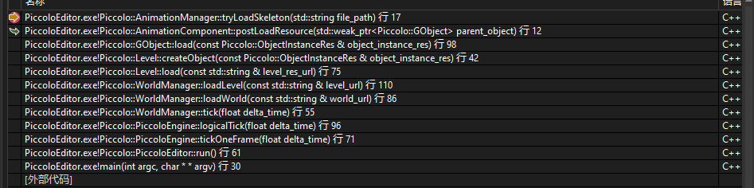
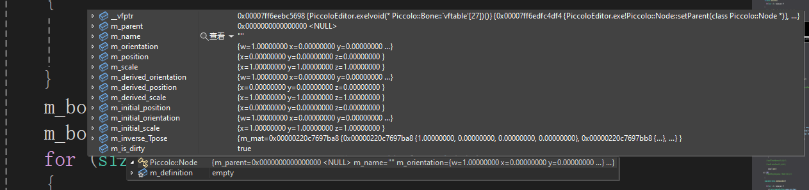
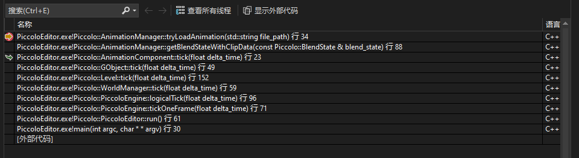

# Piccolo 小引擎引擎阅读

# 零、基础知识

- （1）在游戏引擎设计中，isDirty字段的作用是什么？

> `isDirty`字段通常用于表示对象的状态是否已经发生了变化。在游戏引擎中，当对象的属性发生变化时，可以将`isDirty`字段设置为true，以便在需要的时候对这些变化进行处理，比如更新渲染、保存数据或执行其他逻辑。这样可以帮助提高性能，只在需要时才进行相应的操作，而不是每次都进行无谓的处理。


# 一、Animaton System

## 1.动画系统相关文件读取（只有骨骼，在Editor阶段读取）

这一部分的时序图如下（只记录最为核心的内容，从动画系统加载开始）：

  ```mermaid
  sequenceDiagram
      Actor GameEngine as Engine
      GameEngine ->>+ AnimationComponent: Load
      AnimationComponent ->>+ AnimationManager: postLoadResource
      AnimationManager ->> AnimationManager: tryLoadSkeleton
      AnimationManager ->> Skeleton: buildSkeleton(*skeleton_res)
      Skeleton ->> AnimationManager: return
      AnimationManager ->> AnimationComponent: return
      AnimationComponent ->> GameEngine : return
      GameEngine ->> GameEngine: m_components.push_back(loaded_component)
  
  
  ```

经过了加载这一段之后，所有的Skeleton的基础信息已经读进来了，跟我们之前描述的一样，包含每个骨骼在关节空间的SQT情况，以及记录预计算的inverse_bind矩阵。**注意此时还没有读取和记录动画文件的相关内容。**


### （1）Player相关动画的json文件描述

```json
{
"$context": {
    "animation_res": {
        "blend_state": {
            "blend_anim_skel_map_path": [
                "asset/objects/character/player/components/animation/data/anim.skeleton_map.json"
            ],
            "blend_clip_file_length": [
                0.76666998863220215
            ],
            "blend_clip_file_path": [
                "asset/objects/character/player/components/animation/data/W2_CrouchWalk_Aim_F_Loop_IP.animation_clip.json"
            ],
            "blend_mask_file_path": [
                "asset/objects/character/player/components/animation/data/anim.skeleton_mask.json",
                "asset/objects/character/player/components/animation/data/anim.skeleton_mask.json"
            ],
            "blend_ratio": [
                0
            ],
            "blend_weight": [
                1
            ],
            "clip_count": 1
        },
        "frame_position": 0,
        "skeleton_file_path": "asset/objects/character/player/components/animation/data/skeleton_data_root.skeleton.json"
    }
},
"$typeName": "AnimationComponent"
},
```

看了一会，得出以下结论：

- （1）在加载引擎的时候（此时还没有运行游戏），显然此时要读取所有的资产。这里的资产都是用json文件来读取的，由于我们暂时只需要关注动画系统，因此我们注意看下面的堆栈：
- 

也就是说，我们可以从`AnimationComponent::postLoadResource`这个函数开始看起。这个函数一共干了两件事，分别是`AnimationManager::tryLoadSkeleton`以及`m_skeleton.buildSkeleton(*skeleton_res);`


### （2）tryLoadSkeleton

函数入口：`animation_system.cpp`，加载资源第一次会执行`AnimationLoader::loadSkeletonData`这个函数，并将读取的结果存储于字典当中，后面只会从字典当中取出对应的信息。注意这个函数只会读SkeletonData，具体类定义如下：

```c++
REFLECTION_TYPE(RawBone)
CLASS(RawBone, Fields)
{
    REFLECTION_BODY(RawBone);

public:
    std::string name;
    int         index;
    Transform   binding_pose;  //Transform当中集成了TRS的相关信息
    Matrix4x4_  tpose_matrix; //这个应该是动画系统讲过的Inverse_Bind_Matrix，即从模型空间转到关节空间的矩阵
    int         parent_index;
};

REFLECTION_TYPE(SkeletonData)
CLASS(SkeletonData, Fields)
{
    REFLECTION_BODY(SkeletonData);

public:
    std::vector<RawBone> bones_map;
    bool                 is_flat = false; //"bone.index" equals index in bones_map
    int                  root_index;
    bool in_topological_order = false; // TODO: if not in topological order, we need to topology sort in skeleton
                                       // build process
};
```


### （3）buildSkeleton函数

函数入口：`skeleton.cpp`文件。

这个函数会拿到前面的SkeletonData，生成对应的真正的Bone信息，其中Bone继承于Node这个类，所以一个Bone类中会包含很多内容，如下：



这个函数仔细看一下的话，大概做的事情就是把SkeletonData中的数据赋值给真正的Bone类，这样Bone类就可以被用于后续引擎的骨骼动画逻辑当中了。


## 2.在Play模式执行下的时序逻辑

我们从`AnimationComponent:tick`这个函数开始看：



