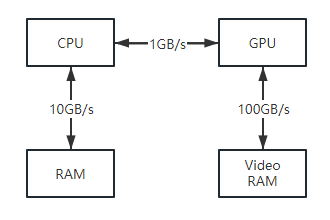
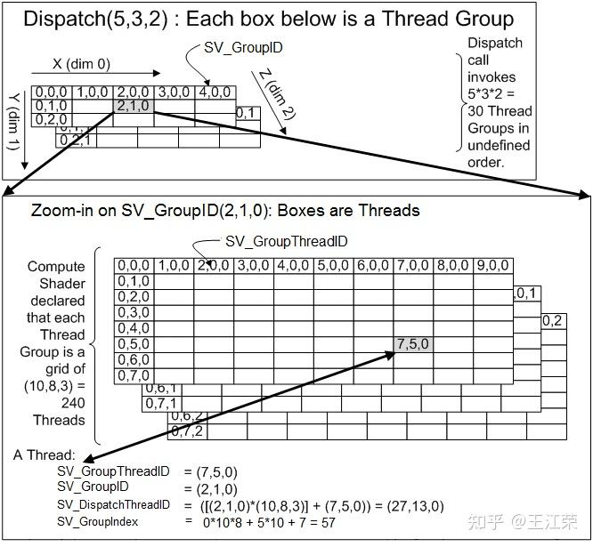

# Computer Shader 相关基础总结（Unity）

可以参考的项目链接：[cinight/MinimalCompute](https://github.com/cinight/MinimalCompute)

# 一、入门

参考：[【Unity】Compute Shader的基础介绍与使用 - 知乎](https://zhuanlan.zhihu.com/p/368307575)

## 1.概览

非图形应用使用GPU的情况，我们称之为**GPGPU**（General Purpose GPU）编程。对于GPGPU编程而言，用户通常需要将GPU计算后的结果返回到CPU中。这就涉及到将数据从GPU显存（Video Memory）中拷贝到CPU系统内存（System Memory）中的操作，该操作非常的**慢**。但是相比使用GPU来计算所提升的运行速度而言，可以忽略此问题。

下图展示了CPU和RAM、GPU和VRAM、CPU和GPU之间的相对内存带宽速度（图中的数字只是说明性的数字，以显示带宽之间的数量级差异），可以发现瓶颈在于CPU和GPU之间的内存传输。



> 可以看到，GPU内部非常快，CPU内部也挺快的，但CPU和GPU之间的内存传输效率相对会慢一些，但GPU太快了，用了还是不亏的。

要实现GPGPU编程，我们就需要一个`方法来访问GPU从而实现数据并行算法`，这里就需要使用到`Compute Shader`（后面简称为CS）。CS属于图形API中的一种可编程着色器，它独立于渲染管线之外，但是可以`对GPU资源（存放在显存中）进行读取和写入操作`。本质上来说，CS允许我们访问GPU来实现数据并行算法，而不需要绘制任何东西。

除了非图形的GPGPU编程，Compute Shader还可以用来实现很多图形应用中的效果，例如剔除，模糊等。由于CS可以直接读写GPU资源，`使得我们能够将CS的输出直接绑定到渲染管线上。`因此对于图形应用，我们通常使用GPU的计算结果作为渲染管道的输入，因此不需要将结果从GPU传输到CPU。

- 例如我们要实现一个模糊效果，可以先用CS模糊一个Texture，然后模糊后的Texture可以直接作为Fragment Shader的输入。

> 注：CS本质上是显卡以及图形API的产物，Unity引擎在Direct3D API的基础上对其进行了一层的封装。

------


## 2.CS的Hello World

在Unity中新建一个Compute Shader，默认代码如下：
```glsl
// Each #kernel tells which function to compile; you can have many kernels
#pragma kernel CSMain

// Create a RenderTexture with enableRandomWrite flag and set it
// with cs.SetTexture
RWTexture2D<float4> Result;

[numthreads(8,8,1)]
void CSMain (uint3 id : SV_DispatchThreadID)
{
    // TODO: insert actual code here!

    Result[id.xy] = float4(id.x & id.y, (id.x & 15)/15.0, (id.y & 15)/15.0, 0.0);
}

```

### （1）kernel

```c++
#pragma kernel CSMain
```

CSMain其实就是一个函数，在代码后面可以看到，而 kernel 是内核的意思，这一行即把一个名为CSMain的函数声明为内核，或者称之为核函数。这个核函数就是最终会在GPU中被执行。一个CS中**至少要有一个kernel才能够被唤起**。也可用它在一个CS里声明多个内核，此外我们还可以再该指令后面定义一些预处理的宏命令，比如如下：

```c++
#pragma kernel KernelOne SOME_DEFINE DEFINE_WITH_VALUE=1337
#pragma kernel KernelTwo OTHER_DEFINE
```

> 注：kernel声明的命令后面不要加//注释，应当单独换行来做额外的注释。

------


### （2）RWTexture2D

接着看这个默认CS的第二句：

```c++
RWTexture2D<float4> Result;
```

RWTexture2D中，RW其实是**Read**和**Write**的意思，Texture2D就是二维纹理，因此它的意思就是**一个可以被CS读写的二维纹理**。如果我们只想读不想写，那么可以使用Texture2D的类型。访问这张纹理可以使用`像素的下标`，比如`Result[uint2(0,0)]`。该纹理中的类型是`float4`也比较好理解，意味着要读取和写入的是RGBA四个通道。

通常情况下，我们会在CS中处理好纹理，然后在Fragment Shader中来对处理后的纹理进行采样。

> 在CS中可读写的类型除了**RWTexture**以外还有**RWBuffer**和**RWStructuredBuffer**，后面会介绍。
>
> [RWTexture2D - Win32 apps | Microsoft Learn](https://learn.microsoft.com/en-us/windows/win32/direct3dhlsl/sm5-object-rwtexture2d)


### （3）numthreads（重点）

接着是CS文件的下一句：

```c++
[numthreads(8,8,1)]
```

定义**一个线程组（Thread Group）中可以被执行的线程（Thread）总数量。**

- 在GPU编程中，我们可以将所有要执行的线程划分成一个个线程组，`一个线程组在单个流多处理器（Stream Multiprocessor，简称SM）上被执行`。如果我们的GPU架构有16个SM，那么至少需要16个线程组来保证所有SM有事可做。`为了更好的利用GPU，每个SM至少需要两个线程组，因为SM可以切换到处理不同组中的线程来隐藏线程阻塞（如果着色器需要等待Texture处理的结果才能继续执行下一条指令，就会出现阻塞）。`
- 每个线程组都有一个各自的共享内存（Shared Memory）,该组中的所有线程都可以访问改组对应的共享内存，但是不能访问别的组对应的共享内存。因此线程同步操作可以在线程组中的线程之间进行，不同的线程组则不能进行同步操作。
- 每个线程组中又是由n个线程组成的，线程组中的线程数量就是通过numthreads来定义的，格式如下：

```c++
numthreads(tX, tY, tZ) //tX表示与线程组中的线程数量有关，其他同理。注意和后面的X,Y,Z参数区别开。
```

其中 `tX*tY*tZ `的值即线程的总数量，例如 numthreads(4, 4, 1) 和 numthreads(16, 1, 1) 都代表着有16个线程。那么为什么不直接使用 numthreads(num) 这种形式定义，而非要分成tX，tY，tZ这种三维的形式呢？看到后面自然就懂其中的奥秘了。

**每个核函数前面我们都需要定义numthreads**，否则编译会报错。

其中tX，tY，tZ三个值也并不是也可随便乱填的,`在不同的版本中也有不同的约束`：

| Compute Shader 版本 | tZ的最大取值 | 最大线程数量（tX*tY*tZ） |
| ------------------- | ------------ | ------------------------ |
| cs_4_x              | 1            | 768                      |
| cs_5_0              | 64           | 1024                     |


回忆在GPU架构的笔记中有记载，类似于Nvidia的GPU架构，`线程组中的线程又会被划分成一个个Warp，每个Warp由32个线程组成，一个Warp通过SM来调度。`(还记得Warp Schedular否？) 在SIMD32下，当SM操控一个Warp执行一个指令，意味着有32个线程同时执行相同的指令。假如我们使用numthreads设置每个线程组只有10个线程，但是由于SM每次调度一个Warp就会执行32个线程，这就会造成有22个线程是不干活的（静默状态），从而在性能上无法达到最优。

> 因此针对NVIDIA的显卡，我们应该将线程组中的线程数设置为32的倍数来达到最佳性能。

接着是AMD的显卡，线程组中的线程则是被划分成一个个由64个线程组成**Wavefront**，那么线程组中的线程数应该设置为64的倍数。

> 综合NVIDIA和AMD的显卡，`numthreads`建议设置为64的倍数，以兼容这两大主流显卡。


在[Direct3D12](https://zhida.zhihu.com/search?content_id=169975694&content_type=Article&match_order=1&q=Direct3D12&zhida_source=entity)中，可以通过**ID3D12GraphicsCommandList::Dispatch(gX,gY,gZ)**方法创建`gX*gY*gZ`个**线程组**。**注意顺序，先numthreads定义好每个核函数对应线程组里线程的数量（tX\*tY\*tZ），再用Dispatch定义用多少线程组(gX\*gY\*gZ)来处理这个核函数**。

gX，gY，gZ在不同的版本里有如下的约束：

| Compute Shader 版本 | gX和gY的最大取值 | gZ的最大取值 |
| ------------------- | ---------------- | ------------ |
| cs_4_x              | 65535            | 1            |
| cs_5_0              | 65535            | 65535        |


#### （a）线程与线程组的结构

下图展示了线程与线程组的结构：



上半部分代表的是线程组结构，下半部分代表的是单个线程组里的线程结构。因为他们都是由(X,Y,Z)来定义数量的，因此就像一个三维数组，下标都是从0开始。我们可以把它们看做是表格一样：**有Z个一样的表格，每个表格有X列和Y行**。例如线程组中的(2,1,0)，就是第1个表格的第2行第3列对应的线程组，下半部分的线程也是同理。

搞清楚结构，我们就可以很好的理解下面这些与单个线程有关的参数含义：

| 参数                | 值类型 | 含义                                                         | 计算公式                                                     |
| ------------------- | ------ | ------------------------------------------------------------ | ------------------------------------------------------------ |
| SV_GroupID          | int3   | 当前线程所在的线程组的ID，取值范围为(0,0,0)到(gX-1,gY-1,gZ-1)。 | 无                                                           |
| SV_GroupThreadID    | int3   | 当前线程在所在线程组内的ID，取值范围为(0,0,0)到(tX-1,tY-1,tZ-1)。 | 无                                                           |
| SV_DispatchThreadID | int3   | 当前线程在所有线程组中的所有线程里的ID，取值范围为(0,0,0)到(gX*tX-1, gY*tY-1, gZ*tZ-1)。 | 假设该线程的SV_GroupID=(a, b, c)，SV_GroupThreadID=(i, j, k) 那么SV_DispatchThreadID=(a*tX+i, b*tY+j, c*tZ+k) |
| SV_GroupIndex       | int    | 当前线程在所在线程组内的下标，取值范围为0到tX*tY*tZ-1。      | 假设该线程的SV_GroupThreadID=(i, j, k) 那么SV_GroupIndex=k*tX*tY+j*tX+i |