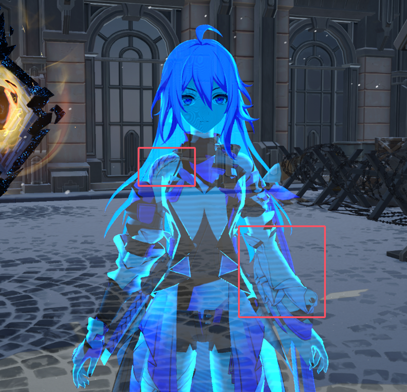
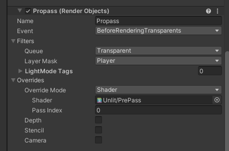
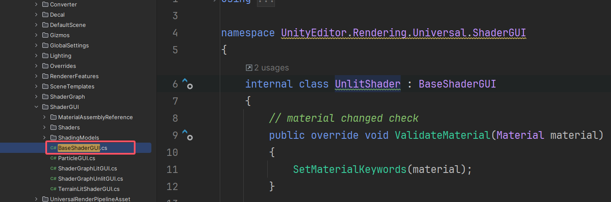

# 半透明渲染坑合集

阅读完入门精要之后，可能会在项目中遇到其他的关于半透明物体的坑，在这里记录一下。


# 一、透明Mesh间排序——以星穹铁道的希儿秘技效果为例

> **难点：**在《入门精要》中，我们学习到了以下的知识点：
>
> - （1）在Unity的渲染顺序中，不透明物体总是先于半透明物体渲染的；
> - （2）一般来说，半透明物体会进行深度测试，但是不进行深度写入，**进行深度测试**是为了让前面的不透明物体可以挡住后面的半透明物体，**不进行深度写入**的原因可以参考这篇文章：https://blog.csdn.net/a1047120490/article/details/106744930，说的不错。
> - （3）如果一个半透明物体自己要做双面渲染，那么可以第一个Pass先Cull Front，第二个Pass再Cull Back；
> - （4）自己有缠绕关系的物体如果想要正确渲染半透明，需要两个Pass，第一个Pass先做ColorMask0（不写入颜色缓冲区），同时ZWrite On只写入深度，第二个Pass则关闭ZWrite并正常做半透明渲染。

​	但是以上似乎都没有解决一个问题，那就是如果有多个Mesh，他们之间要正确的排序（也就是说要有遮挡关系），不能彼此间穿插，同时还要和背景整体有半透明的效果。比较明显的例子就是在《星穹铁道》的希儿，如果开秘技之后，身体的各个submesh需要排序正确（不能相互间有Blend的混合操作），同时透过每个Submesh又可以看到后面的背景。如下图所示：



​	看到左上角肩膀那里，肩膀可以正常遮挡住头发，但是同时透过没有遮挡别的部位的半透明位置又可以看到后面的背景，**这就是我们要做的需求。**


## 1.解决方案1：Depth Prepass(Z-Prepass)

​	比较推荐先来看这篇文章，对Unity的深度图的写入时机和对应的渲染队列有一个基本的认识：https://zhuanlan.zhihu.com/p/648793922

​	接着可以看这篇：https://www.xuanyusong.com/archives/4759，我们要做的就是这样一个Prepass，在半透明物体渲染之前，把整个希儿写入到深度中，然后在正常半透明渲染的时候进行渲染，此时深度图就排好序了，整个模型就不会出现互相穿插、混合的情况。

​	具体做法如下：

- （1）写一个下面的Shader：

```glsl
Shader "Unlit/PrePass"
{
    SubShader
    {
        Pass {
			Tags{"LightMode"="UniversalForward"}
			ZWrite On
            ColorMask 0
            HLSLPROGRAM
			#pragma vertex vert
			#pragma fragment frag
			#include "Packages/com.unity.render-pipelines.universal/ShaderLibrary/Lighting.hlsl"
			struct v2f 
			{
				float4 vertex : POSITION;
			};
			v2f vert (float4 vertex : POSITION)
			{
				v2f o;
				o.vertex = TransformObjectToHClip(vertex);	
				return o;
			}
            float4 frag (v2f i) : SV_Target
			{
                return 0;
			}
			ENDHLSL
		}
    }
}
```

> 如前面参考的文章所说，把这个Shader单独拆出来是因为可以做SRP Batch，节省Drawcall（todo：后面学好了优化再来补充），这个Shader本身的作用就是ColorMask 0 ：不写入颜色缓冲区，ZWrite On写入深度，也就是说对深度进行写入，但是不会渲染到屏幕上。

- （2）接着，我们在Render Feature中添加一个Renderer Object，参数设置如下图所示：



这里的Filters/Queue指的是只会找渲染队列在Transparent当中的去做这个Prepass（Prepass就是一个新建的Render Objects），并且Layer设置为Player的，在这里我们要测试的就是希儿。接下来，理论上我们只要让希儿每个submesh的shader都是一个半透明shader，把Queue设置为Transparent，把Layer Mask设置为Player，是否就可以让这几个Mesh在半透明物体渲染之前做深度排序，从而在进入正常半透明渲染的时候有一个前后遮挡的关系？

> 理论上可行，但**神奇的是，不是随便一个Tranparent的shader就可以的，比如URP自带的Unlit是可以的，但是下面这个自己写的就不行：**
>
> ```glsl
> Shader "Test"
> {
>     Properties
>     {
>         [MainTexture] _BaseMap("Texture", 2D) = "white" {}
>         [MainColor] _BaseColor("Color", Color) = (1, 1, 1, 1)
>     }
> 
>     SubShader
>     {
>         Tags
>         {
>             "RenderType"="Transparent"
>             "UniversalMaterialType" = "Unlit"
>             "RenderPipeline" = "UniversalPipeline"
>         }
>         LOD 100
>         
>         Blend SrcAlpha OneMinusSrcAlpha
>         ZWrite Off  //这个是无所谓的，因为我们已经开了propass：https://www.xuanyusong.com/archives/4759
>         Cull Off
> 
>         Pass
>         {
>             HLSLPROGRAM
>             #pragma target 2.0
>             #include "Packages/com.unity.render-pipelines.universal/ShaderLibrary/Lighting.hlsl"
>             struct Attributes1
>             {
>                 float4 positionOS : POSITION;
>                 float2 uv : TEXCOORD0;
>                 
>                 float3 normalOS : NORMAL;
>                 float4 tangentOS : TANGENT;
>                 //UNITY_VERTEX_INPUT_INSTANCE_ID
>             };
> 
>             struct Varyings1
>             {
>                 float2 uv : TEXCOORD0;
>                 float fogCoord : TEXCOORD1;
>                 float4 positionCS : SV_POSITION;
>                 
>                 float3 positionWS : TEXCOORD2;
>                 float3 normalWS : TEXCOORD3;
>                 float3 viewDirWS : TEXCOORD4;
>                 
>             };
>     
>             #pragma vertex UnlitPassVertex1
>             #pragma fragment UnlitPassFragment1
>             CBUFFER_START(UnityPerMaterial)
>                 float4 _BaseColor;
>                 float _Cutoff;
>                 float4 _BaseMap_ST;
>             CBUFFER_END
> 
>             TEXTURE2D(_BaseMap);
>             SAMPLER(sampler_BaseMap);
>             
>             Varyings1 UnlitPassVertex1(Attributes1 input)
>             {
>                 Varyings1 output = (Varyings1)0;
> 
>                 VertexPositionInputs vertexInput = GetVertexPositionInputs(input.positionOS.xyz);
> 
>                 output.positionCS = vertexInput.positionCS;
>                 output.uv = TRANSFORM_TEX(input.uv, _BaseMap);
>                 
>                 // normalWS and tangentWS already normalize.
>                 // this is required to avoid skewing the direction during interpolation
>                 // also required for per-vertex lighting and SH evaluation
>                 VertexNormalInputs normalInput = GetVertexNormalInputs(input.normalOS, input.tangentOS);
>                 half3 viewDirWS = GetWorldSpaceViewDir(vertexInput.positionWS);
> 
>                 // already normalized from normal transform to WS.
>                 output.positionWS = vertexInput.positionWS;
>                 output.normalWS = normalInput.normalWS;
>                 output.viewDirWS = viewDirWS;
> 
>                 return output;
>             }
> 
>             half4 UnlitPassFragment1(Varyings1 input):SV_TARGET
>             {
> 
>                 half2 uv = input.uv;
>                 half4 texColor = SAMPLE_TEXTURE2D(_BaseMap, sampler_BaseMap, uv);
>                 half3 color = texColor.rgb * _BaseColor.rgb;
>                 half alpha = texColor.a * _BaseColor.a;
>                 
>                 half4 finalColor = half4(color, alpha);
> 
>                 return finalColor;
>             }
>             ENDHLSL
>         }
>     }
> 
>     FallBack "Hidden/Universal Render Pipeline/FallbackError"
> }
> 
> ```
>
> 上面我自己写的这个Shader实际打开Frame Debugger的时候发现没有Propass这个渲染事件，而如果希儿使用了URP自带的那个unlit并设置为transparent之后就会有Propass了。所以，问题就落到了，为什么URP自带的unlit可以呢？


### （1）URP 自带Unlit分析

Unlit的分析可以看这篇：https://blog.csdn.net/n5/article/details/128152523

以下对Unlit的分析做一些补充：

- （1）关于Shader Editor在哪（进入BaseShaderGUI.cs文件，看看谁继承他，能找到一个叫做`internal class UnlitShader : BaseShaderGUI`的）：



- （2）根据上面的博客链接，修改URP unlit shader的surface类型为transparent之后，其实会修改不透明材质的renderQueue，以及其他的，具体修改的如下：

```glsl
```


另一个问题是希儿开秘技的特效有一个Glitch的效果，经过实际的测试这个Glitch如果做在顶点偏移上，会导致渲染出现问题（推测是不是Propass没法正确更新导致的）


# 二、知识点补充：Early-Z与Z-prepass

参考：[3500_Early-z和Z-prepassF_哔哩哔哩_bilibili](https://www.bilibili.com/video/BV1FK4y1u7iw?vd_source=f0e5ebbc6d14fe7f10f6a52debc41c99&p=2&spm_id_from=333.788.videopod.episodes)
