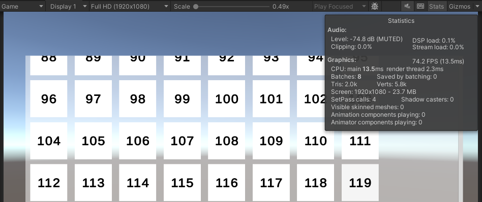

# Unity UGUI 内容合集

【1】首先，看一下这篇文章：https://zhuanlan.zhihu.com/p/437704772，可以对UGUI的事件系统有一个基本的认知，包括他的射线检测和继承关系；

【2】阅读这个系列：https://blog.csdn.net/ecidevilin/article/details/52503595，这个没有push到Github上，但本地有保存，直接everything搜索UGUI源码_0.html即可，一共有十八篇，看完基本就对UGUI有个大概了解了。

> 目前一~七是看完了，八暂时看不动了，先不看了。明天继续后面的部分。


# 记录一些知识点

【1】点击Button下面的任意子节点，都会点击到button，即使他们距离非常遥远。主要的原因看这个函数：


【2】关于MaskableGraphic：关于其UpdateCull函数：

```c#
private void UpdateCull(bool cull)
{
    if (canvasRenderer.cull != cull)
    {
        canvasRenderer.cull = cull;
        UISystemProfilerApi.AddMarker("MaskableGraphic.cullingChanged", this);
        m_OnCullStateChanged.Invoke(cull);
        OnCullingChanged();
    }
}
```

经过测试，比如一个Panel上挂了一个RectMask2D，下面有一个Button，如下图所示：


那么此时如果Button正好移出RectMask2D Mask住的范围的一瞬间，就会符合这个条件：`if (canvasRenderer.cull != cull)`


【3】关于Unity UI的Image：Sliced：https://docs.unity3d.com/540/Documentation/ScriptReference/UI.Image.Type.Sliced.html

【4】关于Unity的ScrollRect与ScrollBar，有一些要研究一下的（比如背包系统就需要这个）：

> （1）针对这段话：ScrollBar还重写了Selectable的OnPointerDown方法，设置isPointerDownAndNotDragging为true，使用协程调用了ClickRepeat方法，判断点击事件是否在m_HandleRect外面（一定在Scrollbar里面），**如果在外面，就将事件坐标转换到m_HandleRect的本地坐标系里，然后调整value，直到点击事件在m_HandleRect里面。**粗体字的部分触发的条件是例如下图：
>
> 
>
> 此时Handle是在右侧的，但是鼠标点击的区域在左侧，这个Handle就会通过协程移动过去。
>
> （2）针对这段话：另外还重写了Selectable的OnMove、FindSelectableOnLeft、FindSelectableOnRight、FindSelectableOnUp和FindSelectableOnDown方法。**当方向键按下并与ScrollBar的方向一致时，便不在导航到下一个Selectable，而是修改value值（加减stepSize），即移动滚动条。**粗体字部分可以参考ScrollBar类的OnMove函数，进入`case MoveDirection.Left:`这个逻辑判断只会在使用键盘移动handle的时候才会进来。
>
> （3）
>
> （4）关于ScrollRect：
>
> `OnRectTransformDimensionsChange()`这个函数的调用时机：把RectTransform的Height或者Width的值改动，就会调用这个函数；
>
> `UpdateCachedData()`这个函数，如果创建的是一个正常的ScrollRect，那么这里面的变量就都是true
>
> 


# 一、自定义UIScrollView

先看一下之前那个UI框架当中的`UIScrollView.cs`函数，包含了重写的功能，有一定的学习价值。


使用了对象池的ScrollView的性能：


未使用对象池的ScrollView性能：

