# Unity 热更总结

先看这篇：https://zhuanlan.zhihu.com/p/673332224，了解一个大概。

# 一、AssetBundle

首先推荐阅读的是这篇：https://zhuanlan.zhihu.com/p/671187387，有时间会对这篇文章里面的内容进行补充。


# 二、Addressable

Addressable的热更新方法：https://www.youtube.com/watch?v=bCObS3teFGM，以下进行总结。

## 1.安装Addressable

不过多介绍了，直接在Unity Repositry中安装即可。


## 2.Addressable实现热更

假设我们搭了一个这样的场景：

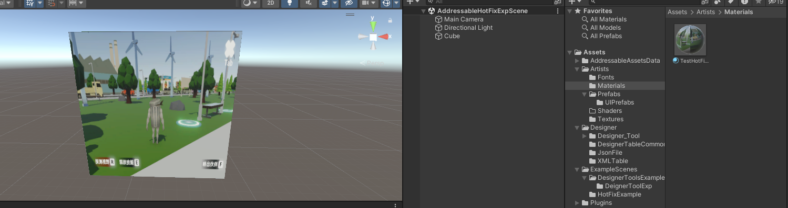

现在我们将上述的Cube存成一个Prefab。将这个Prefab勾选上Addressable。在代码中指定好Addressable的内容：

```c#
[SerializeField] private AssetReference _addressableReference;
```

把脚本挂载在test物体上，然后把对应Addressable的东西挂载上去：

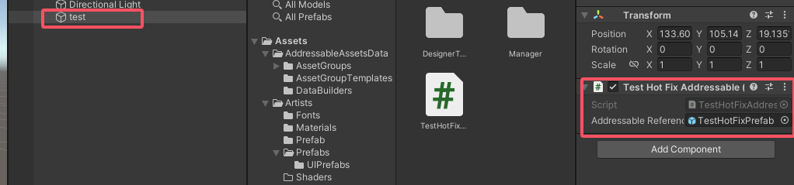

脚本如下：

```c#
using UnityEngine;
using UnityEngine.AddressableAssets;
using UnityEngine.ResourceManagement.AsyncOperations;

public class TestHotFixAddressable : MonoBehaviour
{
    [SerializeField] private AssetReference _addressableReference;
    // Start is called before the first frame update
    void Start()
    {
        _addressableReference.InstantiateAsync().Completed += handle =>
        {
            if (handle.Status == AsyncOperationStatus.Succeeded)
            {
                Debug.Log("addressable instantiate success");
                var obj = handle.Result;
                obj.transform.position = new Vector3(0, 0, 0);
            }
        };
    }
}
```

其实之前的项目里有很多addressable，就可以这么用（以前用的还是比较熟的）。接下来就是Addressable的打包功能了。


进入到Addressable Profiles，这里可以定义不同的路径，比如本地的路径和远程服务器的路径：

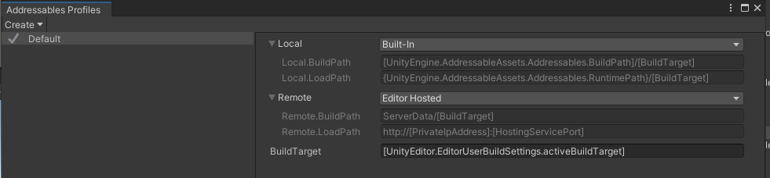

在Addressable的groups栏中可以找到每个group对应的设定，比如：

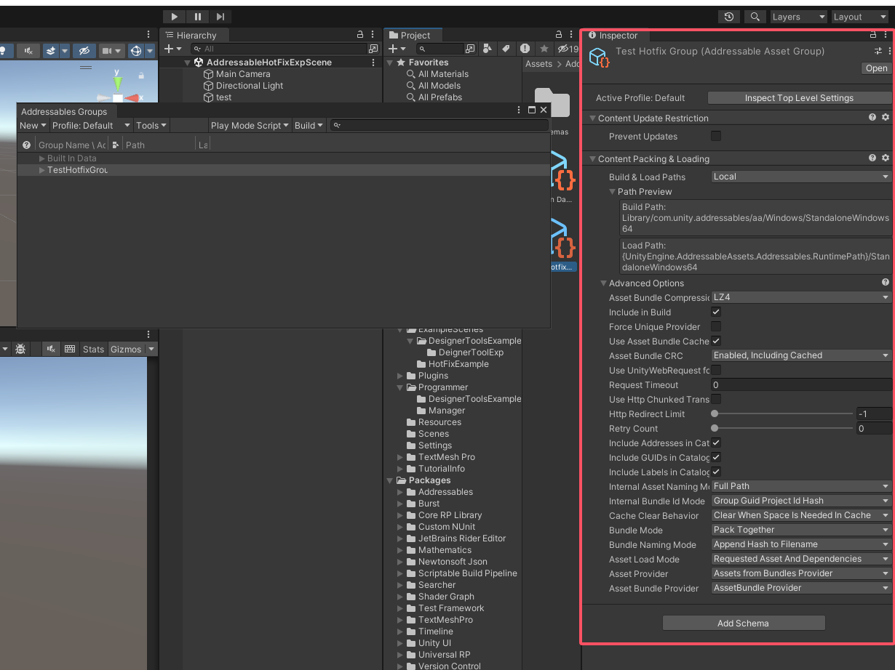

介绍一些重要的部分：

- Content Packing&Loading：Build&Load Paths：如果定义为local就会去寻找profile中local定义的位置，从而寻找到对应的bundle；如果定义为remote则会去服务器上寻找bundle，再做热更，这里我们使用local即可。
- 下面的build path&load path：build path就是打包的时候会在哪个位置，load path则是寻找这里有没有对应的bundle，进行读取。

点击一下build：

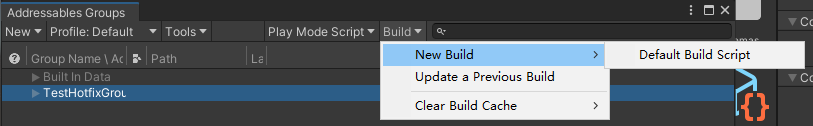

打包之后就可以在上图中的build path中找到build出来的bundle，如下图：

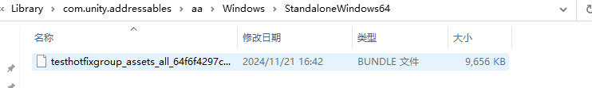

接下来，我们可以先build一下场景。此时打开build好的场景后就可以看到Addressable是被正常读取出来的：

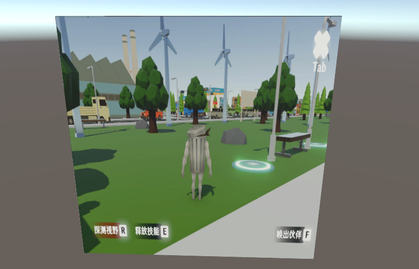

接下来，就是热更的流程了。


### （1）热更流程

现在我们进到游戏里，把刚才设置成Addressable的Prefab的图片更换一下，此时在编辑器中运行Unity，就可以看到资产的更新。接下来，我们还是进入Addressable里面，执行new build：


此时就可以去前面load path指定的路径中找到更新后的资产，复制下来：

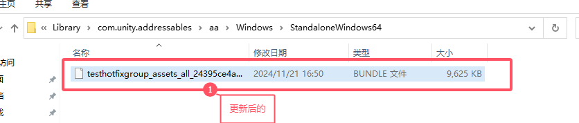

然后，复制到build路径下面，替换掉原有的资产。此时打开游戏，发现并没有成功更新？实际上，这可能是因为相关路径没有进行更新，我们只需要把aa文件夹整个替换一下：

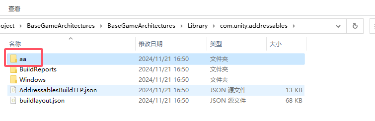

此时再次运行游戏，就可以发现美术资产成功更新了！

下图是两个复制前后的路径：

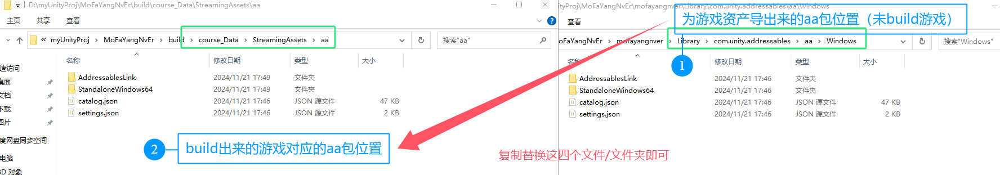


# 三、HybridCLR（Huatuo热更）

## 1.一些基础概念和热更新的基本技术原理

建议先看这篇：https://zhuanlan.zhihu.com/p/685026219，写的非常好，方便对一些热更相关的基本概念有一个基本的认知。以下做一些补充说明：

- （1）**2.3.2 Assembly Definition Reference(asmref)**

  某些时候可能需要asmdef管理的文件夹范围外的代码也能被编译到其程序集中，此时就需要创建Assembly Definition Reference文件，选中后可以配置编译的[目标程序](https://zhida.zhihu.com/search?content_id=240358198&content_type=Article&match_order=1&q=目标程序&zhida_source=entity)集。

  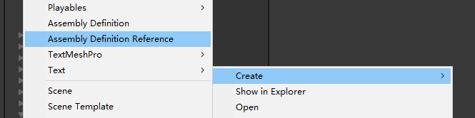

  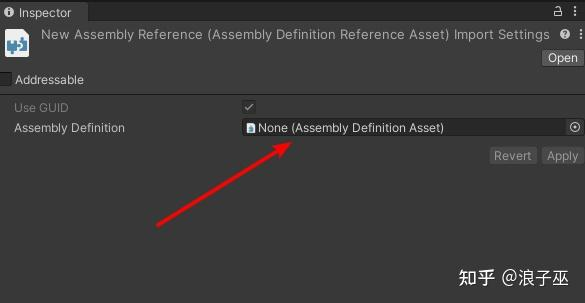

  > 翻看了一下Unity的官方文档，我的理解是可以在其他的文件夹路径下放一个Assembly Definition Reference文件，然后指定Assembly Definition，就可以让这个文件夹下的代码也归于这个程序集。

以上的文档看到HybridCLR的具体介绍前即可，接下来我们来根据官方文档配置一下HybridCLR。

> 这一部分我自己在项目中配置了一个OurGameFramework的程序集，并且处理好所有的报错依赖情况，如下图：
>
> 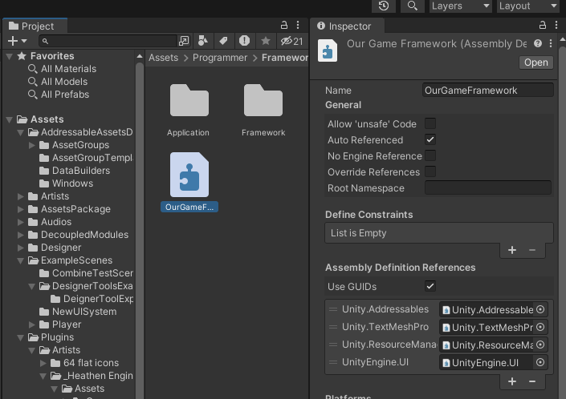

此时没有报错了，可以开始测试热更新框架了！


## 2.配置HybridCLR

官方文档：https://hybridclr.doc.code-philosophy.com/docs/intro

首先先看一下“快速上手”和“使用Monobehavior”这两个章节。

#### 一些遇到的问题解决

【1】报错：MissingMethodException: MethodNotFind xxClass::yyyMethod 错误

参考链接：https://blog.csdn.net/java_grandpa/article/details/137066727


## HybridCLR的底层原理

> 


学习了以上的所有内容之后，可以看一下这篇：https://zhuanlan.zhihu.com/p/692168300，看看技术就行，各种lua和hybridCLR的比较不太用细看，可能有争议。