# 《游戏引擎架构》阅读笔记

这篇会记录在阅读整本《游戏引擎架构》时觉得比较重要的内容，并对不太理解的地方查找额外的资料进行说明。在复习的时候可以根据对应的页数索引找到对应的内容复习。

以下内容从全书p26页开始。

# 第一章

## 1.6 运行时引擎架构

先看底层的这些：

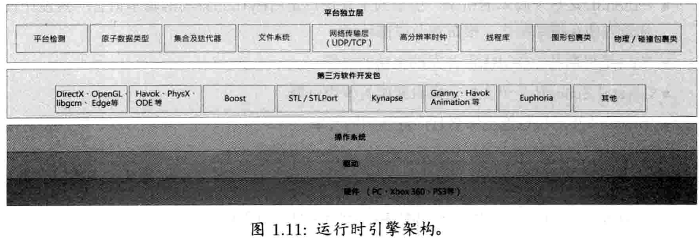

- 关于游戏引擎中是否要使用STL模板库：一些开发者认为STL的内存分配模式不够高效，会导致内存碎片问题；一些开发者则觉得STL的强大和方便性超过了它可能的问题，并且大部分问题实际上可以变通解决。**作者认为，STL在PC上可以无障碍使用，因为PC有虚拟内存系统，而有的游戏主机上没有虚拟内存系统，且cache miss的代价比较高，就适合编写自定义的数据结构，保证可预期的分配模式。**


### （1）平台独立层

平台独立层在硬件、驱动程序、操作系统及其他第三方软件之上，以此把其余的引擎部分和大部分底层平台隔离。平台独立层包装了常用的标准C语言库、操作系统调用及其他基础API，确保**包装了的接口在所有硬件平台上均为一致。**这是必须的，因为不同平台间有不少差异，即使所谓的“标准”库，如标准C语言库，也有平台差异。


### （2）核心系统

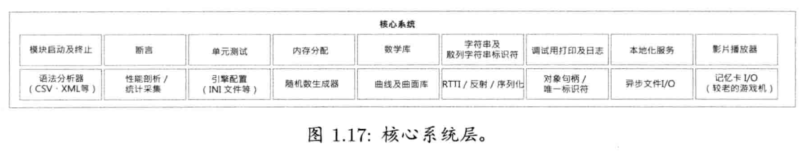

以下是一些常见需要实现的功能的介绍：

- 断言：assert：一般在最后的生产版本中，会移除掉assert；
- 内存管理：几乎每个游戏引擎都有一个或多个自定义内存分配系统，以保证高速的内存分配及释放，并控制内存碎片所造成的负面影响(见5.2.1.4节)。
- 数学库：矢量、矩阵、四元数旋转、三角学、直线/光线/球体/Frustum等几何操作、样条操作、数值积分，解方程组等；
- 引擎通常要提供一组工具去管理基础数据结构（链表、vector、二叉树、hashmap等）。有时需要手工编码，以减少或完全消除动态内存分配，并保证在目标平台上的运行效率为最优。


### （3）资源管理

在核心系统的上层是资源管理相关。

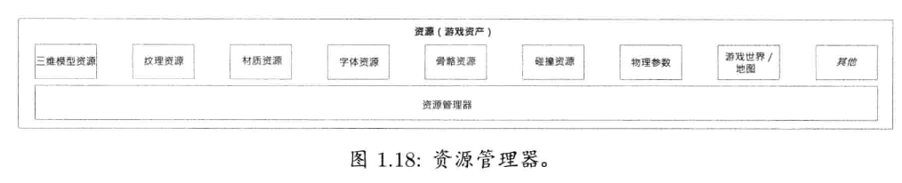


## 1.6.8 渲染引擎

渲染引擎的设计通常采用分层架构(layered architecture)，以下会使用这行之有效的方法。

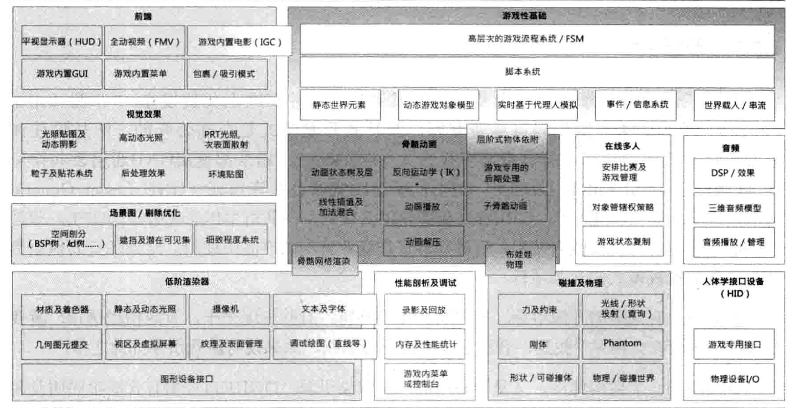

### 1.6.8.1 低阶渲染器

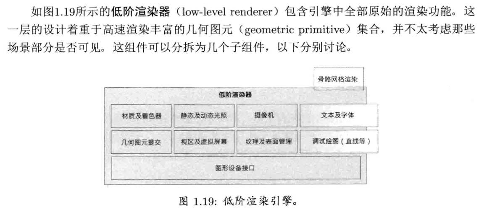

这一部分看《游戏引擎架构》的p33页~p34页。低阶渲染器就是做最基本的绘制、纹理、debug绘制、材质着色、光照这些，对于剔除来说一般只做背面剔除和frustum剔除，而上图的**场景图/剔除优化部分则会基于某些可视性判别算法去限制提交的图元数量。**


### 1.6.8.2 场景图/剔除优化部分

非常小的游戏世界可能只需要简单的平截头体剔除(frustum cull)算法(即去除摄像机不能“看到”的物体)。比较大的游戏世界则可能需要较高阶的**空间细分**数据结构，这种数据结构能快速判别**潜在可见集**(potentiallyvisible set，PVS)，空间分割有很多种，比如：

> BSP、四叉树、八叉树、KD树、BVH树等。

理论上，低阶渲染器无须知道其上层使用哪种空间分割或场景图。因此，不同的游戏团队可以重用图元提交代码，并为个别游戏的需求精心制作潜在可见集判别系统。

> 我的理解就是可以利用空间加速结构做一些剔除，比如写过代码实现的八叉树和BVH树。


### 1.6.8.3  视觉效果

- **区分HDR光照和HDR色调映射：其中HDR光照是后处理之前进行的，而HDR色调映射算是后处理效果。**参考Unity的URP Post processing。


### 1.6.8.4 前端

看p36页开始即可。

GUI的显示逻辑：

- 通常会用附有纹理的quad结合正交投影来做（回忆：UGUI的Image是怎么做fill amout的？），另一个方法是用完全三维的billboard去渲染。
- 这一层也包含了全动视频(full-motion video，FMV)系统，该系统负责播放之前录制的全屏幕电影(可以用游戏引擎录制，也可以用其他渲染软件录制)；
- 另一个相关的系统是游戏内置电影(in-gamecinematics，IGC)系统，该组件可以在游戏本身以三维形式渲染电影情节。例如，玩家走在城市中，两个关键角色的对话可用IGC实现。IGC可能包括或不包括玩家角色。IGC可以故意暂停游戏，期间玩家不能控制角色; IGC也可悄悄地整合在游戏过程中，玩家甚至不会发觉有IGC在运行。


## 1.6.10 碰撞和物理

物理系统比较正确的术语是“**刚体动力学模拟**”（rigid body dynamics），因为游戏中通常只考虑刚体的运动（motion），以及产生运动的力（force）与力矩（torque）。研究运动的物理分支是运动学（kinematics），而研究力和力矩是动力学（dynamics）。这一软件层具体如下：

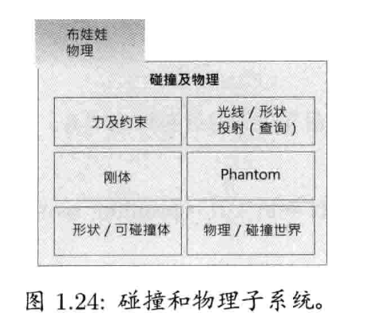

碰撞和物理系统一般是紧密联系的，因为当碰撞发生时，碰撞几乎总是由物理积分及约束满足(constraint satisfaction)逻辑来解决的。时至今日，**很少有游戏公司会编写自己的碰撞及物理引擎**。取而代之，引擎通常使用第三方的物理SDK，例如Havok，PhysX。互联网上开源的物理碰撞引擎有比如Open Dynamics Engine（ODE）。


## 1.6.11 动画

游戏中会用到5种基本动画：

- sprite/texture animation
- rigidbody hierachy animation：动画那章有，似乎会导致关节处穿模，不知道现在还有没有用武之处；
- 骨骼动画
- 每顶点动画
- morph target animation

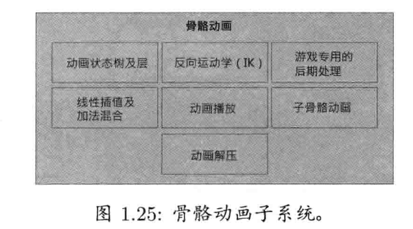

更多关于骨骼动画的内容复习，可以参考另一篇笔记：`在渲染器中引入动画系统.md`。

**当使用布娃娃(ragdoll)时，动画和物理系统便产生紧密耦合。**布娃娃是无力的(经常是死了的)角色，其运动完全由物理系统模拟。物理系统把布娃娃当作受约束的刚体系统用模拟来决定身体每部分的位置及方向。动画系统计算渲染引擎所需的矩阵表（matrix palette，见动画章节笔记），用来在屏幕上绘画角色。


## 1.6.12 人体学接口设备（HID,human interface device）

HID引擎可能会包含一个系统，负责检测chord（弦，数个按钮一起按下），序列（sequence，按钮在时限内顺序按下），手势（gesture）等。

> ==先写到笔记里，后面有空研究一下Unity的new input system是否支持chord和sequence，因为有些游戏玩法可能有类似的需求。==


## 1.6.14 在线多人/网络

这部分在p41。

如果可以，最好还是在项目之初就设计多人游戏的功能。有趣的是，如果进行反向思维--改装多人游戏为单人游戏，问题就再简单不过了。事实上，许多游戏引擎把单人游戏模式当作多人游戏的特例，换言之，**单人游戏模式是一个玩家参与的多人游戏。**一个知名例子就是雷神之锤引擎的客户端于服务器之上(client-on-top-of-server)模式。**运行单人游戏模式时，该可执行文件在单个PC上执行，但同时作为客户端和服务器。**


## 1.6.15 游戏性基础系统

从p42页开始看。这里平时Unity开发项目已经有一些了，复习的时候直接看书就好。以下会记录一些关键词提供复习：

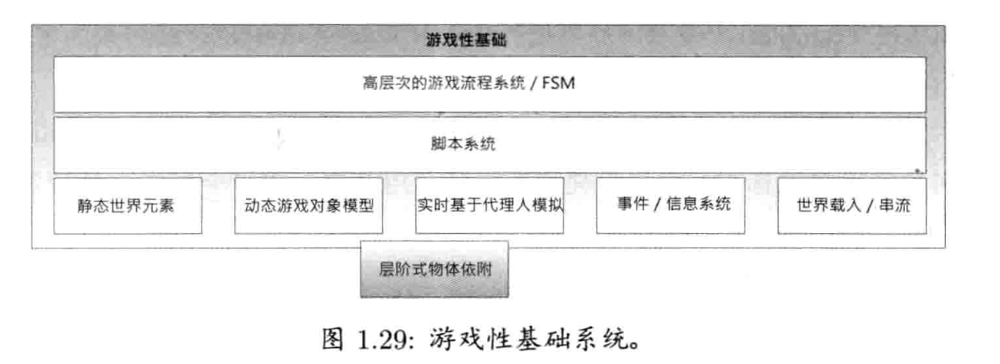

- 14.2节会深入探讨软件对象模型及游戏对象模型。
- 关键：事件系统，**要能说清楚具体事件系统是如何运作的。**
- 脚本系统；


## 1.6.16 个别游戏专用子系统

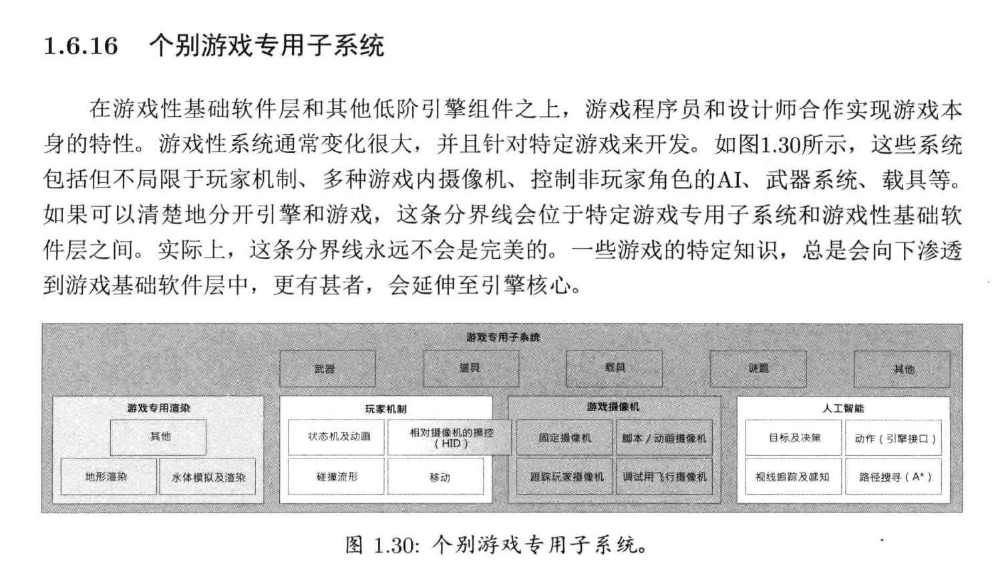


## 1.7 工具及资产管道

这部分从p46页开始。

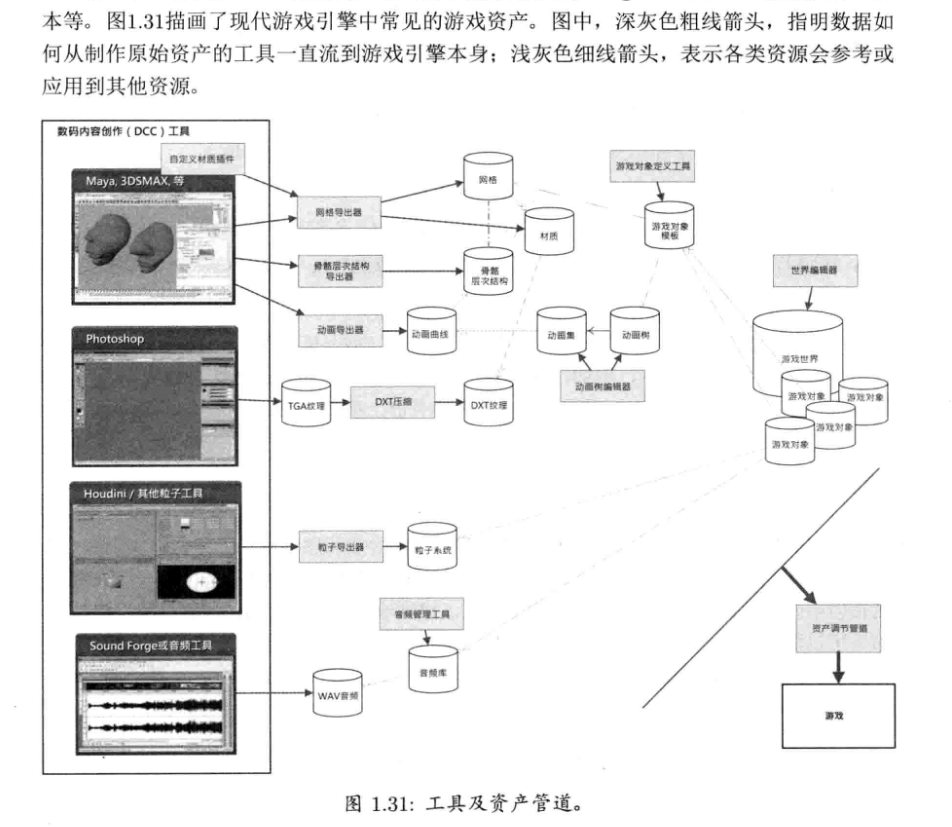

- **1.7.2节，重点看一下（关于DCC中的数据格式为什么不能直接用于游戏中）**。p47页。从DCC到游戏引擎的管道，有时候称为资产调节管道(asset conditioning pipeline)。每个引擎都有某种形式的资产调节管道。
  - 扩展：纹理压缩，这里曾经有看过一些比如Unity的纹理压缩，ASTC，移动端用什么纹理压缩格式之类的；
- 1.7.4节，骨骼动画数据，p49页。
- 1.7.5节，音频数据，p49页。
- 一些构建工具的方法，见1.7.8节，p50页。

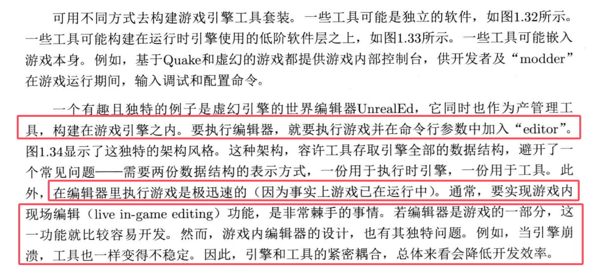

虚幻引擎的工具架构如下图：

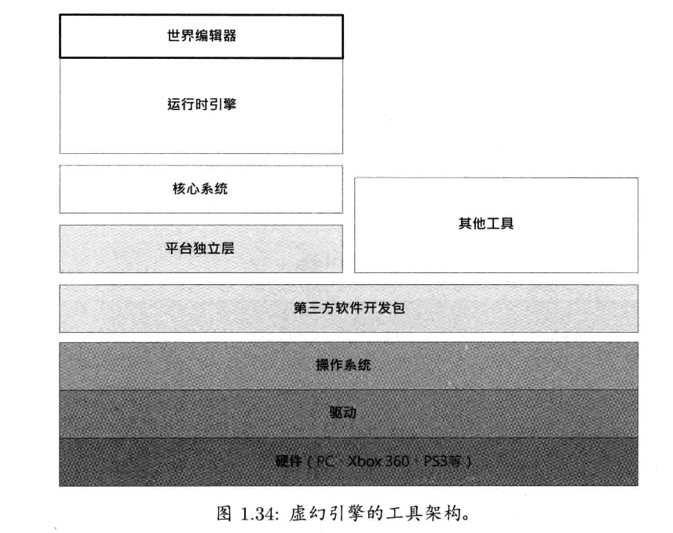

> todo：有时间看一下Unity是怎么实现的，估计也是世界编辑器是架在运行时引擎之上的这种结构。


# 第二章 专业工具

同样，只记录比较关键的内容，或者对应内容的索引页码，方便复习的时候可以随时查看。

## 2.2 Visual Studio

- 编译式语言，例如C++，需要使用编译器和链接器，把源代码转换成可执行程序；

### 2.2.1 源文件、头文件及翻译单元

p61页。问两个问题（答案就在61页）

- （1）在C++中，编译器在编译阶段会做什么？
- （2）C++中，头文件是如何处理的？


### 2.2.2 程序库、可执行文件及动态链接库

p61页开始。这一节整个都推荐阅读一下。

> ==todo：有时间可以生成dll，或者是把dll导入到项目里面做个小练习。==


### 2.2.4 生成配置

p63页。回答下面的题目，有助于进一步理解C++的编译链接过程：

- （1）简单解释一下下面这个典型命令行：
  ```shell
  c1 /c foo.cpp /Fo foo.obj /Wall /Od /Zi
  ```

- （2）p67：2.2.4.3小节，**项目配置教程**，值得过一下Visual Studio的使用。


### 2.2.5 调试代码

p71页。==比较在意的是如下的小节内容，有空练习一下==

- 2.2.5.5：p73页，监视窗口
- 2.2.5.6：数据断点
- 2.2.5.7：条件断点
- 2.2.5.8，p76页，回答下面的问题：
  - （1）有一些bug会在release模式中出现，但在debug模式中不会出现，能否举一些例子？


## 2.4 内存泄漏和损坏检测

p79页。

- （1）内存泄漏和内存损坏分别指的是什么？


# 第三章 游戏软件工程基础

## 3.1 重温C++及最佳实践

- p84：多重继承
  - 多重继承中可能会出现致命的**菱形继承**问题，C++可以使用虚继承去掉重复祖父类的数据；==以下参考链接还没看==
    - 参考链接：[虚继承详解：原理、使用及注意事项-CSDN博客](https://blog.csdn.net/weixin_61857742/article/details/127344922)
    - [C++中虚函数、虚继承内存模型 - 知乎](https://zhuanlan.zhihu.com/p/41309205)
  - 大多数C++软件开发者都会完全避免使用多重继承，或只容许有限制地使用。p85有对应例子；
- p88：3.1.1.5节，**合成及聚合**这里值得看一下；
- p88：3.1.1.6节，设计模式。有几个比较常见的通用设计模式（设计模式也可以参考[迭代器模式 | 菜鸟教程](https://www.runoob.com/design-pattern/iterator-pattern.html)）：
  - 单例
  - 迭代器：迭代器提供高效存取一个集合的方法，同时不需要暴露该集合之下的实现
  - 抽象工厂


## 3.2 C/C++的数据、代码及内存


# 第十章 渲染引擎

> 很多东西都已经会了，这里给出关键词、考点和对应的页码，在复习的时候可以对照着看。


## 10.1 采用深度缓冲的三角形光栅化基础

- （1）10.1.1.1，p363页，对高端渲染软件（应该主要指离线渲染软件）的一些原理进行了说明；

- （2）tessellation（《游戏引擎架构》翻译为“镶嵌”），指的是把表面分割为一组离散多边形的过程，通常是三角形/四边形（quad）。三角化（triangulation）专指把表面tessellation成三角形。p365页

- （3）解释一下LOD的技术是什么？目的是什么？ p365页中间；
  - dynamic tessellation 和 progressive mesh：p365底部（==有需要再详细了解，现在可能有更优秀的技术了，有空回忆Games104和了解Nanite==）
  
- （4）解释一下三角形的缠绕顺序是什么？（winding order）：p366底部

- （5）关于索引化三角形表的概念：p367
  - 解释一下OpenGL当中的VAO,VBO,EBO（或IBO）：忘记的话看这篇复习即可：[你好，三角形 - LearnOpenGL CN](https://learnopengl-cn.github.io/01 Getting started/04 Hello Triangle/)
  - 也可以参考这篇：[OPenGL 学习笔记之 VBO VAO EBO 概念和使用方法总结_vao使用-CSDN博客](https://blog.csdn.net/p942005405/article/details/103770259)
  - 
  
- （6）p368：triangle strip&triangle fan，以及==顶点缓存优化的概念（应该不是很重要）==。

- （7）模型法线转换到世界空间的矩阵是什么？p371开头部分。

- （8）光和物体的交互作用：p372开头

  - 不管光的行为有多复杂，其实光只能做到如下几件事：

    - （a）光可被吸收（absorb）
    - （b）光可被反射（reflect）
    - （c）光可在物体中传播（transmit），过程中通常会被折射（refract）
    - （d）通过很窄的缺口是，会发生衍射（diffract）
    - 此外，光的行为还有干涉（interference），极化（polarization）等。干涉现象产生光盘的七彩颜色，在计算机图形学中一般需要特殊的着色模型才能模拟；而极化往往被忽略掉；

    其中，多数照向写实渲染引擎也只关注（a）（b）（c）三个（在《游戏引擎架构》书写的当时可能是，现在可能会有更新了）。

- （9）解释一下次表面散射的概念？p372底部

- （10）回忆一些技术：

  - （a）==早年阴影有一种技术叫shadow volume，这里不看了，现在用的场合不多==
  - （b）Early-Z与Z-Prepass：可以参考[3500_Early-z和Z-prepassF_哔哩哔哩_bilibili](https://www.bilibili.com/video/BV1FK4y1u7iw?vd_source=f0e5ebbc6d14fe7f10f6a52debc41c99&p=2&spm_id_from=333.788.videopod.episodes),这个教程说的不错
  - （c）关于纹理压缩和各个平台应用纹理的问题，在知乎有专门收藏过文章，忘记的话可以去收藏夹里搜索；
  
- （11）世界空间纹素密度的概念：p382页。个人理解这也是那个UV棋盘格的作用；

- （12）p384下面着色部分：==有几个技术后续可以了解一下：毛发渲染技术fur shell==

- （13）p390 静态光照，使用的技术是lightmap，推荐看一下这个系列复习一下，顺便学习一下不会的内容：

  - [游戏中的全局光照(一) 球谐函数和环境光漫反射 - 知乎](https://zhuanlan.zhihu.com/p/144910975)，后面还有四篇，一共五篇，值得过一下，==有一些非常数学的部分看不懂没事，重要的是从全局上理解整个全局光照的内容==
  - 关于AO中的Bent Normal的介绍：[【技术美术图形部分】AO理论及优化 AO贴图如何参与渲染-CSDN博客](https://blog.csdn.net/qq_41835314/article/details/128906400?utm_medium=distribute.pc_relevant.none-task-blog-2~default~baidujs_baidulandingword~default-1-128906400-blog-7272902.235^v43^control&spm=1001.2101.3001.4242.2&utm_relevant_index=4)
  - ==AO还没看完，后面会单独做总结，以上链接里面介绍的还不够详细。==
  - ==只看完了前两篇,有一些没理解的先搁置了==
  
- （14）==需要复习：教程——空间变换、深度缓冲，整理补充p402：深度冲突及W缓冲==


