# IBL——实时渲染

参考链接：https://learnopengl-cn.github.io/07%20PBR/03%20IBL/01%20Diffuse%20irradiance/

https://zhuanlan.zhihu.com/p/66518450

有的时候，我们需要实现**基于图像的光照(Image based lighting, IBL)**，这是一类光照技术的集合，光源并不只是视为从几个方向来的直接光源，而是将周围的环境整体视为一个大的光源。IBL 通常使用（取自现实世界或从3D场景生成的）环境立方体贴图 (Cubemap) ，我们可以将立方体贴图的每个像素视为光源，在渲染方程中直接使用它。这种方式可以有效地捕捉环境的全局光照和氛围，使物体**更好地融入**其环境。

> 关于立方体贴图Cubemap，在前面的教程章节中有进行介绍。

由于基于图像的光照算法会捕捉部分甚至全部的环境光照，通常认为它是一种更精确的环境光照输入格式，甚至也可以说是一种全局光照的粗略近似。基于此特性，IBL 对 PBR 很有意义，因为当我们将环境光纳入计算之后，物体在物理方面看起来会更加准确。

接下来的部分，我们会对IBL的具体细节进行介绍。


# 一、漫反射辐照度

在学习了上一节的PBR之后，我们可以更新一下现在的渲染方程：
$$
L_o\left(p, \omega_o\right)=\int_{\Omega}\left(k_d \frac{c}{\pi}+k_s \frac{D F G}{4\left(\omega_o \cdot n\right)\left(\omega_i \cdot n\right)}\right) L_i\left(p, \omega_i\right) n \cdot \omega_i d \omega_i
$$
这里我们依据PBR的知识，将BRDF项进行了漫反射部分和镜面反射部分的拆解。解决上一节教程中的积分非常简单，因为我们事先已经知道了对积分有贡献的、若干精确的光线方向$\omega_i$，而如果入射光源是来自于四面八方的要怎么办？来自周围环境的**每个**方向$\omega_i$的入射光都可能具有一些辐射度（radiance），使得解决积分变得不那么简单。要解决这个问题，我们就要解决下面两件事：

- （1）给定任何方向向量 $\omega_i$ ，我们需要一些方法来获取这个方向上场景的radiance；
- （2）求解积分的速度要足够快，并且要满足实时性；

需求（1）是相对简单一些的，回忆在Cubemap章节介绍的Cubemap的作用，我们可以把场景的radiance预先存储到一张Cubemap当中，给定这样的Cubemap，我们可以将Cubemap图的每个纹素视为一个光源。使用一个方向向量$\omega_i$对此立方体贴图进行采样，我们就可以获取该方向上的radiance。

这时采样的代码就可以简化为：

```c++
vec3 radiance =  texture(_cubemapEnvironment, w_i).rgb;
```


本来我们在计算光照的时候，来自整个上半球的入射光都会对光照结果产生影响。为了以更有效的方式解决积分（对应上述的需求（2）），我们需要对其大部分结果进行预处理——或称预计算。**如何预计算呢？这就是我们要解决的问题。**

对于渲染方程来说：
$$
L_o\left(p, \omega_o\right)=\int_{\Omega}\left(k_d \frac{c}{\pi}+k_s \frac{D F G}{4\left(\omega_o \cdot n\right)\left(\omega_i \cdot n\right)}\right) L_i\left(p, \omega_i\right) n \cdot \omega_i d \omega_i
$$
我们可以认为在Cook-Torrance BRDF下，BRDF的漫反射项和镜面反射项是可以拆开的，可以将上述积分分为两部分：
$$
L_o\left(p, \omega_o\right)=\int_{\Omega}\left(k_d \frac{c}{\pi}\right) L_i\left(p, \omega_i\right) n \cdot \omega_i d \omega_i + \int_{\Omega}\left(k_s \frac{D F G}{4\left(\omega_o \cdot n\right)\left(\omega_i \cdot n\right)}\right) L_i\left(p, \omega_i\right) n \cdot \omega_i d \omega_i
$$
通过将积分分成两部分，我们可以分开研究漫反射和镜面反射部分。**在这一部分中，我们会先预计算漫反射项。**


## 1.漫反射项的预计算

观察漫反射项，可以看到albedo项$c$，$\pi$是常数，因此可以把常数项移出积分，变为（注意在本节中先不考虑镜面反射项）：
$$
L_o\left(p, \omega_o\right)=\frac{c}{\pi}\int_{\Omega}k_d L_i\left(p, \omega_i\right) n \cdot \omega_i d \omega_i
$$
注意：严格来说，$k_d$并不是常数项，因为在PBR章节中，我们介绍了$k_d$的计算公式应该是：
$$
k_d = (1-F(v · h))(1-metalness)
$$

> 上式的意思是，菲涅尔项$F$是和视线方向$v$以及半程向量$h$方向有关（这也是近似，可以参考这篇：https://en.wikipedia.org/wiki/Schlick%27s_approximation），其中$h$是和视线方向$v$以及入射光方向$\omega_i$的半程向量。

为了方便，我们可以对$k_d$进行近似处理，简化如下：
$$
k_d \approx (1-F_{roughness}(n · \omega_o))(1-metalness) \triangleq k_d^*
$$
其中有：
$$
F_{roughness} = F_0 + (\Lambda - F_0)(1-n · \omega_o)^5 \\
\Lambda = max\{1-roughness, F_0\}
$$
其实就是相比于原来的Schlick近似，用$\Lambda$代替了$1$。此时漫反射项终于可以把$k_d^*$项提取出来了：
$$
L_o\left(p, \omega_o\right) \approx k_d^*\frac{c}{\pi}\int_{\Omega}L_i\left(p, \omega_i\right) n \cdot \omega_i d \omega_i
$$
在实时渲染中，出现这种$\approx$问题都不大，**速度是非常关键的，要做到实时性**。

在Cubemap章节包括本节中，我们都是假定待着色点$p$位于环境贴图的中心。预计算的部分是：
$$
\int_{\Omega}L_i\left(p, \omega_i\right) n \cdot \omega_i d \omega_i
$$
此时上述积分就是只依赖于法线方向$n$的积分（$n$可以决定上半球积分的朝向）。有了这些知识，我们就可以计算或预计算一个新的立方体贴图，它在每个采样方向——也就是纹素中存储漫反射积分的结果，这些结果是通过卷积计算出来的。先看一张预计算之后的结果（下图来自LearnOpenGL）：

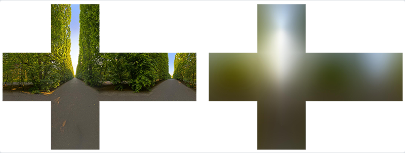

看上去，就像是对Cubemap做了”滤波“操作，使得结果变模糊了。具体的预计算方式之前有提到，即为蒙特卡洛积分，对半球进行均匀采样（注意我们把$\frac{1}{\pi}$放入到了蒙特卡洛积分求解当中，这样在实时计算IBL的时候就不需要再做除以$\pi$的操作了）：
$$
\begin{aligned} \frac{1}{\pi} \int_{\Omega} L_i\left(p, \omega_i\right) n \cdot \omega_i \mathrm{~d} \omega_i & =\frac{1}{\pi} \int_0^{2 \pi} \int_0^{\frac{\pi}{2}} L_i\left(p, \omega_i\right) \cos \theta \sin \theta \mathrm{~d} \theta \mathrm{~d} \phi \\ & \approx \frac{1}{\pi} \frac{1}{N_1 N_2} \sum_i^{N_1} \sum_j^{N_2} \frac{L_i\left(p, \phi_j, \theta_i\right) \cos \left(\theta_i\right) \sin \left(\theta_i\right)}{p\left(\theta_i, \phi_j\right)} \\ & =\frac{1}{\pi} \frac{1}{N_1 N_2} \sum_i^{N_1} \sum_j^{N_2} \frac{L_i\left(p, \phi_j, \theta_i\right) \cos \left(\theta_i\right) \sin \left(\theta_i\right)}{\frac{1}{2 \pi * 0.5 \pi}} \\ & =\pi \frac{1}{N_1 N_2} \sum_i^{N_1} \sum_j^{N_2} L_i\left(p, \phi_j, \theta_i\right) \cos \left(\theta_i\right) \sin \left(\theta_i\right)\end{aligned}
$$
其实还可以进行重要性采样，使用以余弦为权重的半球采样：
$$
\begin{aligned} \frac{1}{\pi} \int_{\Omega} L_i\left(p, \omega_i\right) n \cdot \omega_i \mathrm{~d} \omega_i & = \frac{1}{\pi}\frac{1}{N} \sum_{i}^N \frac{L(\omega_i)(n ·\omega_i)}{\frac{n ·\omega_i}{\pi}}\end{aligned} = \frac{1}{N} \sum_{i}^N L(\omega_i)
$$
可以使用CPU或者GPU通过采样生成这样一张irradiance map。在使用 irradiance map 时根据法向$ n $采样，并且乘上$k_d^*$和$c$就可以得到漫反射项。

> 为什么在使用irradiance map的时候要用法向$n$进行采样呢？回忆我们在预计算的时候本来就是对法线$n$所在的半球进行预计算，因此采样的时候也是根据法线方向$n$进行采样即可得到来自上半球所有方向入射光的预计算结果。


### （1）重要代码

以下的片元着色器是生成irrandiance map的关键片元着色器（假定我们在蒙特卡洛过程中已经可以根据`texture(environmentMap, sampleVec)`这句对Cubemap对应方向采样了）：

```glsl
#version 330 core
out vec4 FragColor;
in vec3 WorldPos;

uniform samplerCube environmentMap;

const float PI = 3.14159265359;

void main()
{		
    vec3 N = normalize(WorldPos);

    vec3 irradiance = vec3(0.0);   
    
    // tangent space calculation from origin point
    vec3 up    = vec3(0.0, 1.0, 0.0);
    vec3 right = normalize(cross(up, N));
    up         = normalize(cross(N, right));
       
    float sampleDelta = 0.025;
    float nrSamples = 0.0f;
    for(float phi = 0.0; phi < 2.0 * PI; phi += sampleDelta)
    {
        for(float theta = 0.0; theta < 0.5 * PI; theta += sampleDelta)
        {
            // spherical to cartesian (in tangent space)
            vec3 tangentSample = vec3(sin(theta) * cos(phi),  sin(theta) * sin(phi), cos(theta));
            // tangent space to world
            vec3 sampleVec = tangentSample.x * right + tangentSample.y * up + tangentSample.z * N; 

            irradiance += texture(environmentMap, sampleVec).rgb * cos(theta) * sin(theta);
            nrSamples++;
        }
    }
    irradiance = PI * irradiance * (1.0 / float(nrSamples));
    
    FragColor = vec4(irradiance, 1.0);
}
```

至此，预计算的irrandiance map就算是构建完成了。在下一节中，我们会介绍如何处理specular项。


# 二、specular项的预计算

对于镜面项，预计算是比较麻烦的。先再来看一下要预计算的内容是什么：
$$
L_s(\omega_o) = \int_\Omega f_s(\omega_i, \omega_o) L_i(\omega) n ·\omega_i d\omega_i
$$
如果要直接暴力预计算这一项的话，我们有下面的参数需要处理：

- 法线方向$n$，视角方向$w_o$；
- BRDF当中的粗糙度$\alpha$以及$F_0$（由albedo和金属度来决定）；

如果把方向向量用球面坐标来表示的话，一共有非常多的维度要解决，没办法像漫反射一样直接用一个Cubemap来解决问题。如果使用蒙特卡洛积分的方式来做的话速度又难以接受，这里虚幻给出了一种名为Split Sum的近似解决方法：

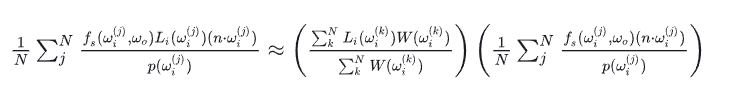

其中权重函数$W(\omega_i) = n · \omega_i$。

> Split sum方法的原论文：https://cdn2.unrealengine.com/Resources/files/2013SiggraphPresentationsNotes-26915738.pdf

具体的推导比较复杂，可以参考这篇文章：https://zhuanlan.zhihu.com/p/66518450。这里直接把推导过程粘贴过来：

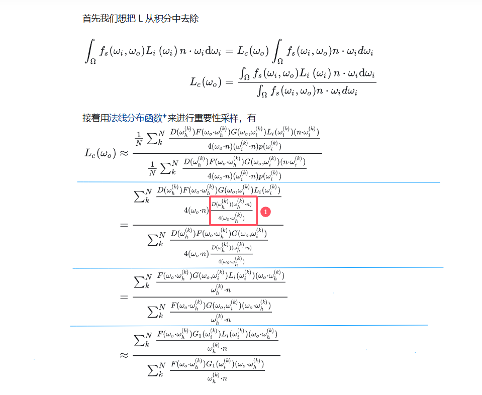

> 补充资料：基于法线分布函数NDF的重要性采样公式（对应上图红框框起来的①部分）的推导：https://zhuanlan.zhihu.com/p/78146875。这一部分的基础原理在蒙特卡洛路径追踪部分的重要性采样原理中已经进行介绍，由于篇幅原因就不写NDF的GGX分布重要性采样公式推导了，这篇链接里可以查看推导过程。也可以看这篇：https://www.mathematik.uni-marburg.de/~thormae/lectures/graphics1/code/ImportanceSampling/importance_sampling_notes.pdf

继续回到Split Sum方法的推导当中，我们来看上面最后推导的式子，Unity认为$F$项的影响不大，因此约掉了$F$项。可以这么理解（==存疑，后面确认一下==）：

- （1）对于比较光滑的情况，主要是镜面反射，此时$\omega_h$接近于法线方向$n$，此时的Fresnel项基本是定值（相当于里面有一个$cos\theta$接近于1），可以上下约掉；
- （2）对于非光滑的情况，$L$本来也是粗略估计，这种近似本身影响也不大；

去掉$F$项后，上面的估计结果为：

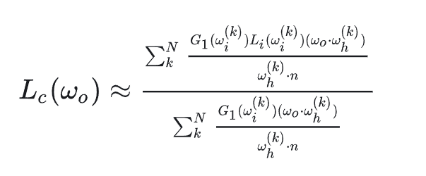

对于镜面材质的物质来说，其BRDF的形状类似如下：

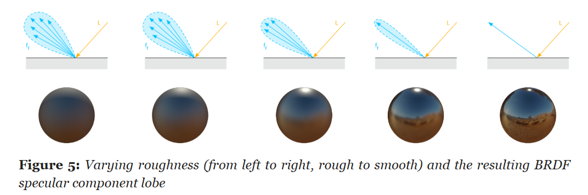

​							（示意图来自Google的开源渲染器Filament的官方文档：https://google.github.io/filament/Filament.html）

其BRDF：$f(\omega_o,\omega_i)$大致会在$R=reflect(-\omega_o,n)$附近有值，可以姑且假设从不同方向入射，这个probe的形状变化不大，有$f(\omega_o,\omega_i(n),n) \approx f(\omega_o,\omega_i(R),R)$。

示意图为：

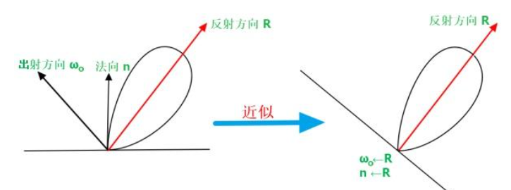

> 注：该图来自：https://zhuanlan.zhihu.com/p/66518450

此时就有：

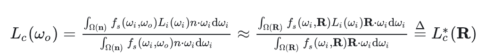

也就是说，为了加快计算的速度，可以暴力地认为**$R=n=\omega_o$**。之所以可以做这样的假设可以从上图看出来，BRDF的probe形状是类似的。对于之前的化简结果应用上面的近似处理，可以约掉点乘的部分：

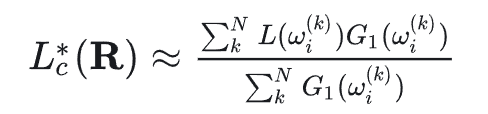

回顾虚幻提出的Split Sum方法的表达式左半部分，可以发现虚幻用的权重函数$W(\omega_i)=n · \omega_i$就跟上式的$G_1$项是等价的。==虚幻之所以会认为这样更好可能是因为刚好两者的变化趋势和值域等性质是类似的（存疑，没看出来）==。此时，针对Specular项，我们可以拿出其$L$项：

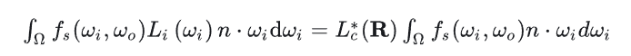

经过了比较复杂的推导，在Split sum方法中终于算是把$L$项提出来了，而这一项就是接下来要提到的pre-filter environment map。


## 1.pre-filter environment map

回忆一下我们计算的L项：

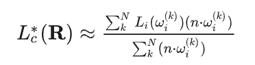

在之前的推导中，我们完全忽略了$n$和$\omega_o$的方向，只考虑了反射光方向$R$。其实这样做会引入误差，在寒霜引擎的著名论文中有对应的介绍：

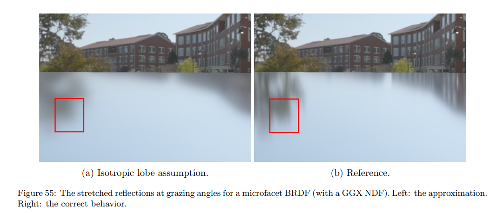

最明显的现象就是在掠射角看表面时没法得到拖长的反射，效果是不够准确的，但在实时渲染中可以接受。

> 参考文章：https://seblagarde.wordpress.com/wp-content/uploads/2015/07/course_notes_moving_frostbite_to_pbr_v32.pdf

针对我们要预计算的$L_c^*(R)$项，其有两个未知量，分别为$R$和粗糙度$\alpha$。对于一个特定的粗糙度，变量就只剩$R$ ，因此我们可以像 irrandiance map 那样，预计算得到一个 cubemap。取粗糙度的序列为0，0.25，0.5，0.75，1.0，从而得到5个Cubemap，这样在实时渲染的时候就可以依据粗糙度$\alpha$和这五张预渲染的cubemap做三线性插值。

有时，这个预计算结果需要进行更新。因此如何快速对其更新也是一个问题。这个预计算关键的就是计算积分。为了加速收敛，我们可以用重要性采样，但还是需要不少的样本。Krivanek的 Pre-filtered importance sampling 可以减少样本数量，收敛提升明显，只引入了一小些偏差。

> 参考链接：https://dcgi.felk.cvut.cz/publications/2008/krivanek-cgf-rts
>
> 示意图：
>
> 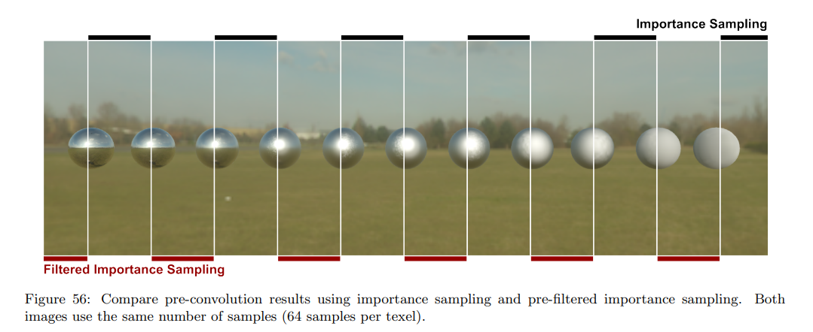

这样我们得到的 5 个 cubemap，就是 pre-filtered environment map，下图来自于LearnOpenGL:

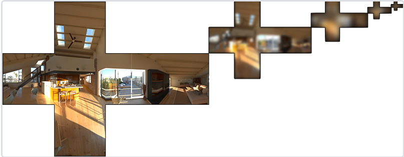


### （1）重要代码

这一部分的重要的片元着色器代码如下：
```glsl
#version 330 core
out vec4 FragColor;
in vec3 WorldPos;

uniform samplerCube environmentMap;
uniform float roughness;

const float PI = 3.14159265359;
// ----------------------------------------------------------------------------
float DistributionGGX(vec3 N, vec3 H, float roughness)
{
    float a = roughness*roughness;
    float a2 = a*a;
    float NdotH = max(dot(N, H), 0.0);
    float NdotH2 = NdotH*NdotH;

    float nom   = a2;
    float denom = (NdotH2 * (a2 - 1.0) + 1.0);
    denom = PI * denom * denom;

    return nom / denom;
}
// ----------------------------------------------------------------------------
// http://holger.dammertz.org/stuff/notes_HammersleyOnHemisphere.html
// efficient VanDerCorpus calculation.
float RadicalInverse_VdC(uint bits) 
{
     bits = (bits << 16u) | (bits >> 16u);
     bits = ((bits & 0x55555555u) << 1u) | ((bits & 0xAAAAAAAAu) >> 1u);
     bits = ((bits & 0x33333333u) << 2u) | ((bits & 0xCCCCCCCCu) >> 2u);
     bits = ((bits & 0x0F0F0F0Fu) << 4u) | ((bits & 0xF0F0F0F0u) >> 4u);
     bits = ((bits & 0x00FF00FFu) << 8u) | ((bits & 0xFF00FF00u) >> 8u);
     return float(bits) * 2.3283064365386963e-10; // / 0x100000000
}
// ----------------------------------------------------------------------------
vec2 Hammersley(uint i, uint N)
{
	return vec2(float(i)/float(N), RadicalInverse_VdC(i));
}
// ----------------------------------------------------------------------------
vec3 ImportanceSampleGGX(vec2 Xi, vec3 N, float roughness)
{
    //基于特定的粗糙度输入和低差异序列值 Xi，我们获得了一个采样向量，该向量大体围绕着预估的微表面的半向量。注意，根据迪士尼对 PBR 的研究，Epic Games 使用了平方粗糙度以获得更好的视觉效果。

	float a = roughness*roughness;
	
	float phi = 2.0 * PI * Xi.x;
	float cosTheta = sqrt((1.0 - Xi.y) / (1.0 + (a*a - 1.0) * Xi.y));
	float sinTheta = sqrt(1.0 - cosTheta*cosTheta);
	
	// from spherical coordinates to cartesian coordinates - halfway vector
	vec3 H;
	H.x = cos(phi) * sinTheta;
	H.y = sin(phi) * sinTheta;
	H.z = cosTheta;
	
	// from tangent-space H vector to world-space sample vector
	vec3 up          = abs(N.z) < 0.999 ? vec3(0.0, 0.0, 1.0) : vec3(1.0, 0.0, 0.0);
	vec3 tangent   = normalize(cross(up, N));
	vec3 bitangent = cross(N, tangent);
	
	vec3 sampleVec = tangent * H.x + bitangent * H.y + N * H.z;
	return normalize(sampleVec);
}
void main()
{		
    vec3 N = normalize(WorldPos);
    
    // make the simplifying assumption that V equals R equals the normal 
    vec3 R = N;
    vec3 V = R;

    const uint SAMPLE_COUNT = 4096u;  
    vec3 prefilteredColor = vec3(0.0);
    float totalWeight = 0.0;
    
    for(uint i = 0u; i < SAMPLE_COUNT; ++i)
    {
        // generates a sample vector that's biased towards the preferred alignment direction (importance sampling).
        vec2 Xi = Hammersley(i, SAMPLE_COUNT);
        vec3 H = ImportanceSampleGGX(Xi, N, roughness);
        vec3 L  = normalize(2.0 * dot(V, H) * H - V);

        float NdotL = max(dot(N, L), 0.0);
        if(NdotL > 0.0) //这里使用的是https://seblagarde.wordpress.com/wp-content/uploads/2015/07/course_notes_moving_frostbite_to_pbr_v32.pdf这篇里的做法
        {
            // sample from the environment's mip level based on roughness/pdf
            float D   = DistributionGGX(N, H, roughness);
            float NdotH = max(dot(N, H), 0.0);
            float HdotV = max(dot(H, V), 0.0);
            float pdf = D * NdotH / (4.0 * HdotV) + 0.0001; 

            float resolution = 512.0; // resolution of source cubemap (per face)
            float saTexel  = 4.0 * PI / (6.0 * resolution * resolution);
            float saSample = 1.0 / (float(SAMPLE_COUNT) * pdf + 0.0001);

            float mipLevel = roughness == 0.0 ? 0.0 : 0.5 * log2(saSample / saTexel); 
            
            prefilteredColor += textureLod(environmentMap, L, mipLevel).rgb * NdotL;
            totalWeight      += NdotL;
        }
    }

    prefilteredColor = prefilteredColor / totalWeight;

    FragColor = vec4(prefilteredColor, 1.0);
}

```

直接看上述代码的话，估计会有不少非常迷惑的内容，接下来则对比较重要的地方进行说明。


## 2.一些额外扩展内容介绍

这部分主要介绍一下上面的Pre-filter environment map过程中的一些细节。