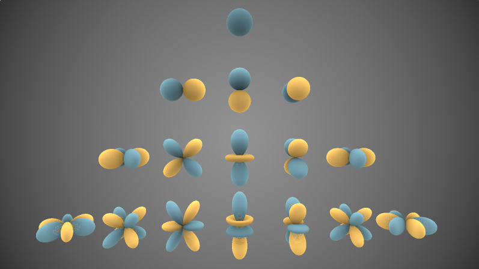

# 球谐函数及PRT

# 参考文章

【1】https://zhuanlan.zhihu.com/p/466774017

【2】https://zhuanlan.zhihu.com/p/363936187（有可能是错误的）

【3】https://zhuanlan.zhihu.com/p/470409196

# 一、球谐函数

在这一部分中，我们会介绍球谐函数的基本概念，并解读在Shader toy中的这个可视化的球谐函数项目：https://www.shadertoy.com/view/lsfXWH。

> 球谐函数的具体数学细节比较困难，本文会给出在数学方面可以参考的链接，但实际上只需要掌握一些最为核心的概念就可以将球谐函数用于工程当中了。

## 1.球谐函数的概念

在高等数学中，我们有学习过傅里叶展开：
$$
f(x) = a_0 + \sum_{n=1}^{\infty} \left( a_n \cos\left(\frac{2\pi n}{T} x\right) + b_n \sin\left(\frac{2\pi n}{T} x\right) \right)
$$
这样一个复杂的信号就可以由一些表达式前面的系数重建出来。同理，之前在学习渲染方程的时候，往往都涉及到半球面积分的内容，很多时候我们希望跟傅里叶展开的想法一样，将球面上的信号变为用一组基函数表达的结果，这样可以大大减少存储空间，这是因为参数化形式能够用较少的系数表示复杂的光照环境。回忆一下前面学习IBL计算环境光的过程，我们需要把周围环境光的信息全部存储在一张Cubemap当中，这会带来比较大的额外存储开销。假如我们可以用几个系数来“拟合”IBL带来的环境光照，就可以进一步压缩空间上的开销，而这就引出了球谐函数的概念。

> 比较好的介绍球谐函数的文章：https://www.cse.chalmers.se/~uffe/xjobb/Readings/GlobalIllumination/Spherical%20Harmonic%20Lighting%20-%20the%20gritty%20details.pdf

值得一看的文章：https://zhuanlan.zhihu.com/p/466774017，算是对上文球谐函数相关基础知识的补充。

接下来简单过一下这个：https://zhuanlan.zhihu.com/p/50208005

### （1）球谐函数的性质

关于上述论文没太看懂的部分，这里有翻译介绍：https://zhuanlan.zhihu.com/p/50699527

- 重点看这里：**函数乘积的积分等于其[球谐系数](https://zhida.zhihu.com/search?content_id=10327622&content_type=Article&match_order=1&q=球谐系数&zhida_source=entity)向量的点积**

球谐函数的一些性质说明可以看这里：https://cs.dartmouth.edu/~wjarosz/publications/dissertation/appendixB.pdf

B.3部分会介绍球谐函数的若干性质，可以作为Gritty Details那篇文章的补充资料。

# 2.Games202关于PRT的讲解补充

【1】https://www.bilibili.com/video/BV1YK4y1T7yY?spm_id_from=333.788.videopod.episodes&vd_source=f0e5ebbc6d14fe7f10f6a52debc41c99&p=6，从这个的56分钟开始看，以及下一个视频。

### 如何做球谐光照？

https://zhuanlan.zhihu.com/p/51179426

