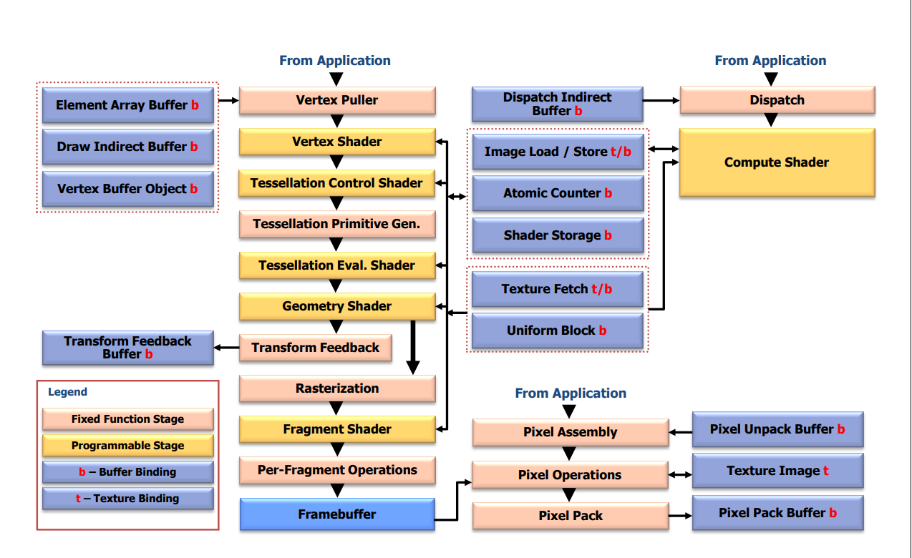

# OpenGL 白皮书阅读+LearnOpenGL学习

参考的官方文档：https://registry.khronos.org/OpenGL/specs/gl/glspec43.core.pdf，以下只记录一些比较关键的内容，涉及算法之类的，用于复习和理解使用。


# 第二章 OpenGL Fundamentals

> 先不继续看了，看后面的，有算法上的执行细节。

​	OpenGL（以下简称“GL”）仅关注处理 GPU 内存中的数据，包括渲染到帧缓冲区以及读取存储在该帧缓冲区中的值。GL 不支持其他输入或输出设备。程序员必须依赖其他机制来获取用户输入。

​	GL 通过一系列由上下文状态控制的着色器程序和固定功能处理单元绘制图元。每个图元可以是一个点、一条线段、一个补丁或一个多边形。上下文状态（context）可以独立更改；设置一个状态不会影响其他状态的设置（尽管状态和着色器之间相互作用，决定了最终在帧缓冲区中显示的内容）。状态被设置，图元被绘制，以及其他 GL 操作都是通过以函数或过程调用的形式发送命令来描述的。

​	图元由一个或多个顶点组成。顶点定义一个点、一条线段的端点，或两个边缘相交的多边形的角落。诸如位置坐标、颜色、法线、纹理坐标等数据与每个顶点相关联，每个顶点都是独立处理、按顺序处理，并以相同方式处理。唯一的例外是在需要对顶点组进行裁剪，以便所指示的图元适合于指定区域时；在这种情况下，顶点数据可能会被修改并创建新的顶点。


# 第三章 Dataflow Model

​	图 3.1 显示了 GL 的块图。一些命令指定要绘制的几何对象，而其他命令则指定控制如何处理这些对象的状态，或者指定纹理和缓冲对象中包含的数据。命令实际上是通过一个处理管道（pipeline）发送的。管道的不同阶段使用不同类型缓冲对象中包含的数据。

​	第一个阶段将顶点组合成几何图元，如点、线段和多边形。在下一个阶段，顶点可能会被变换，然后组合成几何图元。细分着色器和几何着色器可以从单个输入图元生成多个图元。可选择性地，这些管道阶段的结果可以通过变换反馈回馈到缓冲对象中。

​	最终产生的图元在准备进入下一个阶段（光栅化）之前，会被裁剪到裁剪体。光栅化器使用点、线段或多边形的二维描述生成一系列帧缓冲区地址和值。每个这样产生的片段被传递到下一个阶段，该阶段对每个片段执行操作，最终改变帧缓冲区。这些操作包括基于传入和先前存储的深度值的条件更新（以实现深度缓冲）、将传入片段颜色与存储颜色进行混合，以及对片段值进行遮罩、模板和其他逻辑操作。

​	像素也可以从帧缓冲区中读取，或从帧缓冲区的一个部分复制到另一个部分。这些传输可能包括某种类型的解码或编码。

​	最后，计算着色器可以独立于图 3.1 中显示的管道执行，并且可以读取和写入缓冲对象。此顺序仅作为描述 GL 的工具，而不是 GL 实现的严格规则，我们仅将其作为组织 GL 各种操作的手段进行呈现。



随着对OpenGL的不断熟悉，这个模型后面会了解地更加透彻。


# Learn OpenGL

https://learnopengl-cn.github.io/01%20Getting%20started/01%20OpenGL/

https://registry.khronos.org/OpenGL/specs/gl/glspec33.core.pdf

## 1.OpenGL基本介绍

​	现今，更高版本的OpenGL已经发布（写作时最新版本为4.5），你可能会问：既然OpenGL 4.5 都出来了，为什么我们还要学习OpenGL 3.3？答案很简单，所有OpenGL的更高的版本都是在3.3的基础上，引入了额外的功能，并没有改动核心架构。新版本只是引入了一些更有效率或更有用的方式去完成同样的功能。因此，所有的概念和技术在现代OpenGL版本里都保持一致。当你的经验足够，你可以轻松使用来自更高版本OpenGL的新特性。

### （1）知识点：状态机

​	OpenGL自身是一个巨大的状态机(State Machine)：一系列的变量描述OpenGL此刻应当如何运行。OpenGL的状态通常被称为OpenGL上下文(Context)。我们通常使用如下途径去更改OpenGL状态：设置选项，操作缓冲。最后，我们使用当前OpenGL上下文来渲染。

​	假设当我们想告诉OpenGL去画线段而不是三角形的时候，我们通过改变一些上下文变量来改变OpenGL状态，从而告诉OpenGL如何去绘图。一旦我们改变了OpenGL的状态为绘制线段，下一个绘制命令就会画出线段而不是三角形。

​	当使用OpenGL的时候，我们会遇到一些状态设置函数(State-changing Function)，这类函数将会改变上下文。以及状态使用函数(State-using Function)，这类函数会根据当前OpenGL的状态执行一些操作。只要你记住OpenGL本质上是个大状态机，就能更容易理解它的大部分特性。

​	

### （2）知识点：对象

这部分看这篇：https://learnopengl-cn.github.io/01%20Getting%20started/01%20OpenGL/

来看下面一段代码：

```c
// 创建对象
unsigned int objectId = 0;
glGenObject(1, &objectId);
// 绑定对象至上下文
glBindObject(GL_WINDOW_TARGET, objectId);
// 设置当前绑定到 GL_WINDOW_TARGET 的对象的一些选项
glSetObjectOption(GL_WINDOW_TARGET, GL_OPTION_WINDOW_WIDTH, 800);
glSetObjectOption(GL_WINDOW_TARGET, GL_OPTION_WINDOW_HEIGHT, 600);
// 将上下文对象设回默认
glBindObject(GL_WINDOW_TARGET, 0);
```

​	这一小段代码展现了你以后使用OpenGL时常见的工作流。我们首先创建一个对象，然后用一个id保存它的引用（实际数据被储存在后台）。然后我们将对象绑定至上下文的目标位置（例子中窗口对象目标的位置被定义成GL_WINDOW_TARGET）。接下来我们设置窗口的选项。最后我们将目标位置的对象id设回0，解绑这个对象。设置的选项将被保存在objectId所引用的对象中，一旦我们重新绑定这个对象到GL_WINDOW_TARGET位置，这些选项就会重新生效。

​	使用对象的一个好处是在程序中，我们不止可以定义一个对象，并设置它们的选项，每个对象都可以是不同的设置。在我们执行一个使用OpenGL状态的操作的时候，只需要绑定含有需要的设置的对象即可。比如说我们有一些作为3D模型数据（一栋房子或一个人物）的容器对象，在我们想绘制其中任何一个模型的时候，只需绑定一个包含对应模型数据的对象就可以了（当然，我们需要先创建并设置对象的选项）。拥有数个这样的对象允许我们指定多个模型，在想画其中任何一个的时候，直接将对应的对象绑定上去，便不需要再重复设置选项了。

> 我的理解是例如上面这段代码，后面重新通过`glBindObject(GL_WINDOW_TARGET, objectId);`就可以直接找到之前设定的内容了，不需要重复进行设定。


### （3）hello， window

https://learnopengl-cn.github.io/01%20Getting%20started/03%20Hello%20Window/


## 2.你好，三角形

这里需要熟悉三个概念:

- （1）顶点数组对象：Vertex Array Object，VAO
- （2）顶点缓冲对象：Vertex Buffer Object，VBO
- （3）元素缓冲对象：Element Buffer Object，EBO 或 索引缓冲对象 Index Buffer Object，IBO

> 1. **VAO（Vertex Array Object）**：
>    - VAO是OpenGL中用于存储顶点属性状态的对象。它可以看作是一个状态容器，包含了指向VBO（顶点缓冲对象）和EBO（元素缓冲对象）的指针，以及顶点属性配置（如顶点坐标、法线、颜色等）的定义。
>    - VAO可以帮助我们在渲染时快速切换不同的顶点属性设置，从而避免在每次渲染时重新配置顶点数据。
> 2. **VBO（Vertex Buffer Object）**：
>    - VBO是用于存储顶点数据的缓冲区对象。顶点数据包括顶点坐标、颜色、法线等信息。通过将顶点数据存储在VBO中，可以通过一次性传输大量顶点数据，减少CPU与GPU之间的数据传输次数，提高渲染效率。
>    - VBO可以通过函数如`glGenBuffers`、`glBindBuffer`、`glBufferData`来创建、绑定和存储数据。
> 3. **EBO（Element Buffer Object）**：
>    - EBO是一种特殊的VBO，用于存储绘制元素（如三角形）的顶点索引。在绘制复杂模型时，通常使用EBO来减少重复顶点的存储量，通过索引来重复使用已定义的顶点。
>    - 使用EBO可以节省内存并提高渲染效率，特别是在绘制大型网格或模型时。
>    - EBO使用类似VBO的函数来管理，例如`glGenBuffers`、`glBindBuffer`、`glBufferData`等。

下面，你会看到一个图形渲染管线的每个阶段的抽象展示。要注意蓝色部分代表的是我们可以注入自定义的着色器的部分。


### （1）顶点输入

开始绘制图形之前，我们需要先给OpenGL输入一些顶点数据。OpenGL是一个3D图形库，所以在OpenGL中我们指定的所有坐标都是3D坐标（x、y和z）。OpenGL不是简单地把**所有的**3D坐标变换为屏幕上的2D像素；OpenGL仅当3D坐标在3个轴（x、y和z）上-1.0到1.0的范围内时才处理它。所有在这个范围内的坐标叫做标准化设备坐标(Normalized Device Coordinates)，此范围内的坐标最终显示在屏幕上（在这个范围以外的坐标则不会显示）。

由于我们希望渲染一个三角形，我们一共要指定三个顶点，每个顶点都有一个3D位置。我们会将它们以标准化设备坐标的形式（OpenGL的可见区域）定义为一个`float`数组。

```c
float vertices[] = {  //这其实是一个NDC空间坐标
    -0.5f, -0.5f, 0.0f,
     0.5f, -0.5f, 0.0f,
     0.0f,  0.5f, 0.0f //由于OpenGL是在3D空间中工作的，而我们渲染的是一个2D三角形，我们将它顶点的z坐标设置为0.0。这样深度为0，就看起来是2D的
};
```

通过使用由glViewport函数提供的数据，进行视口变换(Viewport Transform)，标准化设备坐标(Normalized Device Coordinates)会变换为屏幕空间坐标(Screen-space Coordinates)。所得的屏幕空间坐标又会被变换为片段输入到片段着色器中。 定义这样的顶点数据以后，我们会把它作为输入发送给图形渲染管线的第一个处理阶段：顶点着色器。它会在GPU上创建内存用于储存我们的顶点数据，还要配置OpenGL如何解释这些内存，并且指定其如何发送给显卡。顶点着色器接着会处理我们在内存中指定数量的顶点。

我们通过顶点缓冲对象(Vertex Buffer Objects, VBO)管理这个内存，它会在GPU内存（通常被称为显存）中储存大量顶点。使用这些缓冲对象的好处是我们可以一次性的发送一大批数据到显卡上，而不是每个顶点发送一次。从CPU把数据发送到显卡相对较慢，所以只要可能我们都要尝试尽量一次性发送尽可能多的数据。当数据发送至显卡的内存中后，顶点着色器几乎能立即访问顶点，这是个非常快的过程。

顶点缓冲对象是我们在[OpenGL](https://learnopengl-cn.github.io/01 Getting started/01 OpenGL/)教程中第一个出现的OpenGL对象。就像OpenGL中的其它对象一样，这个缓冲有一个独一无二的ID，所以我们可以使用glGenBuffers函数生成一个带有缓冲ID的VBO对象：

```c
unsigned int VBO;
glGenBuffers(1, &VBO);
```

OpenGL有很多缓冲对象类型，顶点缓冲对象的缓冲类型是GL_ARRAY_BUFFER。OpenGL允许我们同时绑定多个缓冲，只要它们是不同的缓冲类型。我们可以使用glBindBuffer函数把新创建的缓冲绑定到GL_ARRAY_BUFFER目标上：

```c
glBindBuffer(GL_ARRAY_BUFFER, VBO); 
```

从这一刻起，我们使用的任何（在GL_ARRAY_BUFFER目标上的）缓冲调用都会用来配置当前绑定的缓冲(VBO)。然后我们可以调用glBufferData函数，它会把之前定义的顶点数据复制到缓冲的内存中：

```c
glBufferData(GL_ARRAY_BUFFER, sizeof(vertices), vertices, GL_STATIC_DRAW);
```

glBufferData是一个专门用来把用户定义的数据复制到当前绑定缓冲的函数。它的第一个参数是目标缓冲的类型：顶点缓冲对象当前绑定到GL_ARRAY_BUFFER目标上。第二个参数指定传输数据的大小(以字节为单位)；用一个简单的`sizeof`计算出顶点数据大小就行。第三个参数是我们希望发送的实际数据。

第四个参数指定了我们希望显卡如何管理给定的数据。它有三种形式：

- GL_STATIC_DRAW ：数据不会或几乎不会改变。
- GL_DYNAMIC_DRAW：数据会被改变很多。
- GL_STREAM_DRAW ：数据每次绘制时都会改变。

三角形的位置数据不会改变，每次渲染调用时都保持原样，所以它的使用类型最好是GL_STATIC_DRAW。如果，比如说一个缓冲中的数据将频繁被改变，那么使用的类型就是GL_DYNAMIC_DRAW或GL_STREAM_DRAW，**这样就能确保显卡把数据放在能够高速写入的内存部分。**

现在我们已经把顶点数据储存在显卡的内存中，用VBO这个顶点缓冲对象管理。下面我们会创建一个顶点着色器和片段着色器来真正处理这些数据。现在我们开始着手创建它们吧。


### （2）顶点着色器和片元着色器

这部分直接看官方文档就行：https://learnopengl-cn.github.io/01%20Getting%20started/04%20Hello%20Triangle/


### （3）链接顶点属性+顶点数组对象VAO

这部分直接看官方文档就行：https://learnopengl-cn.github.io/01%20Getting%20started/04%20Hello%20Triangle/

一般当你打算绘制多个物体时，你首先要生成/配置所有的VAO（和必须的VBO及属性指针)，然后储存它们供后面使用。当我们打算绘制物体的时候就拿出相应的VAO，绑定它，绘制完物体后，再解绑VAO。